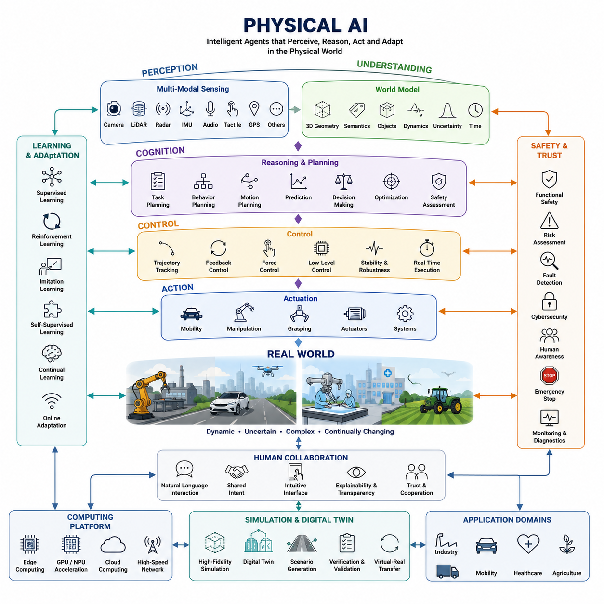
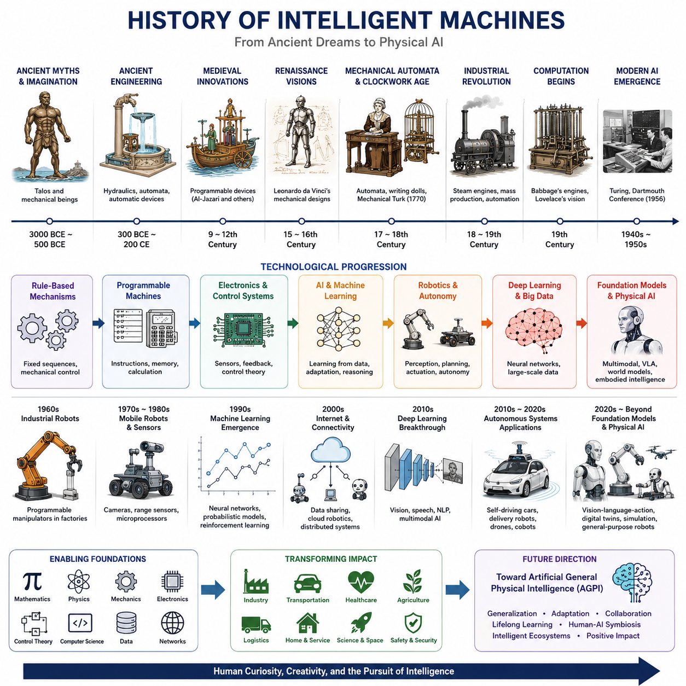
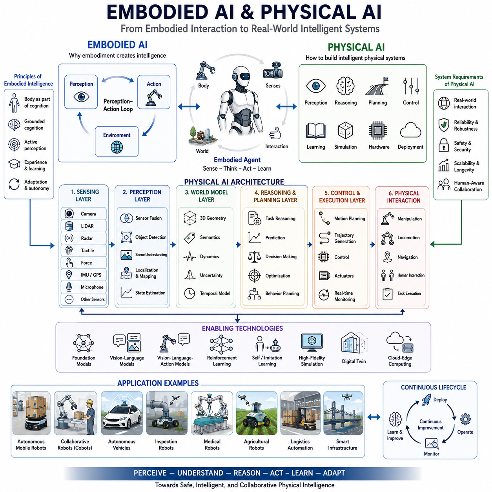
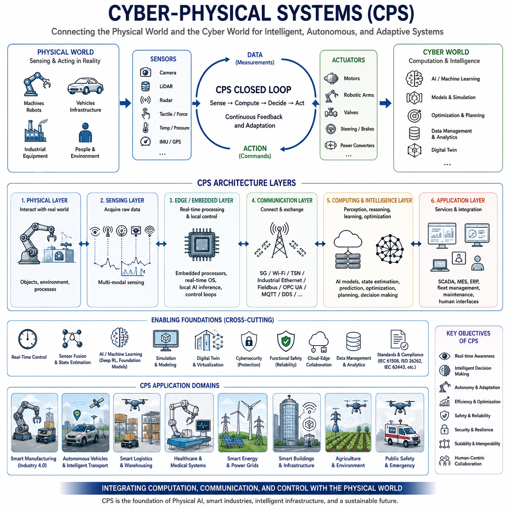
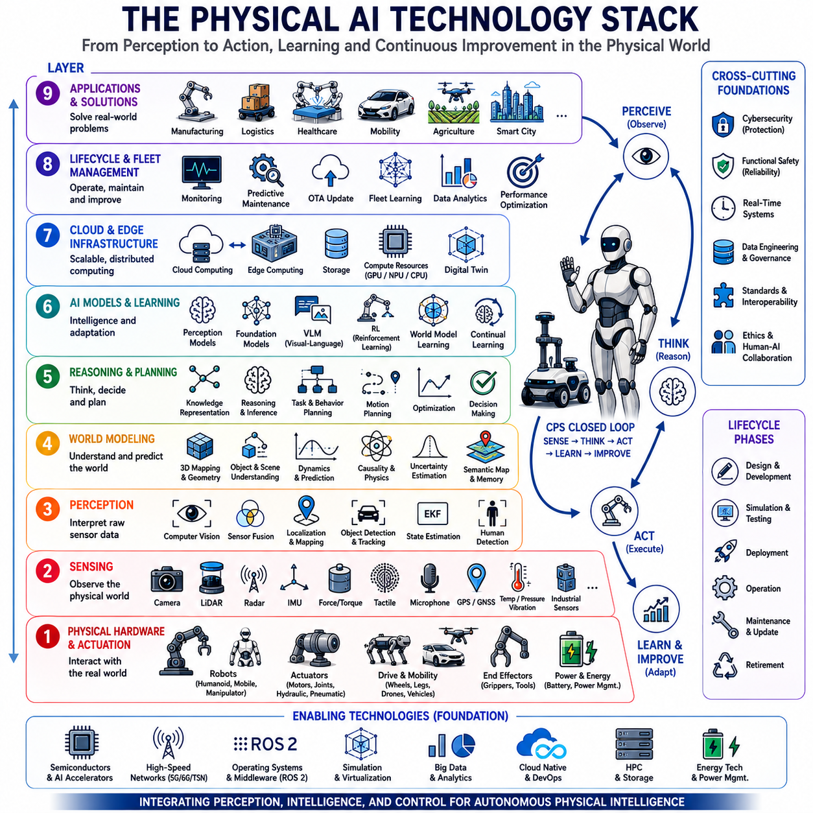
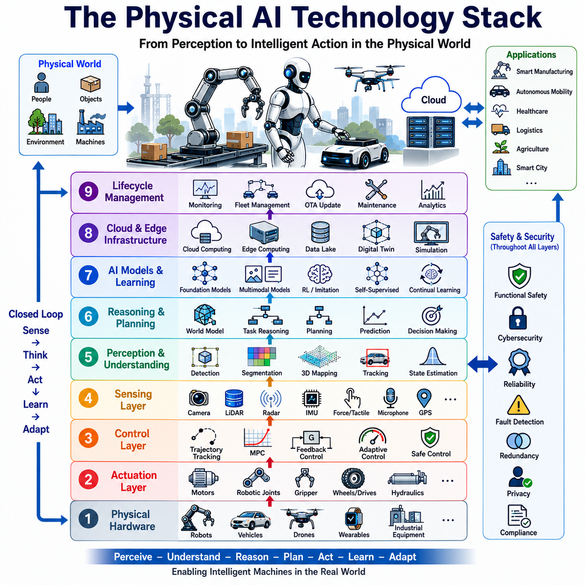
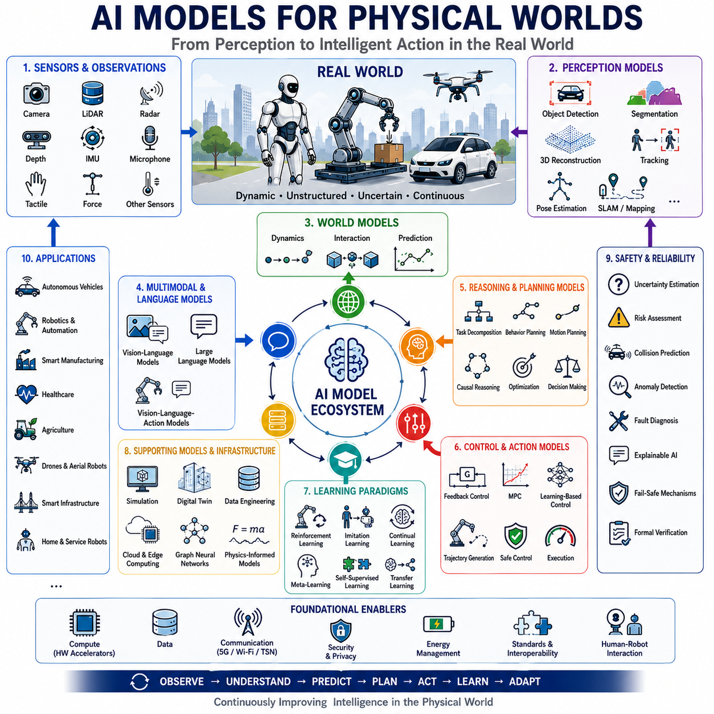
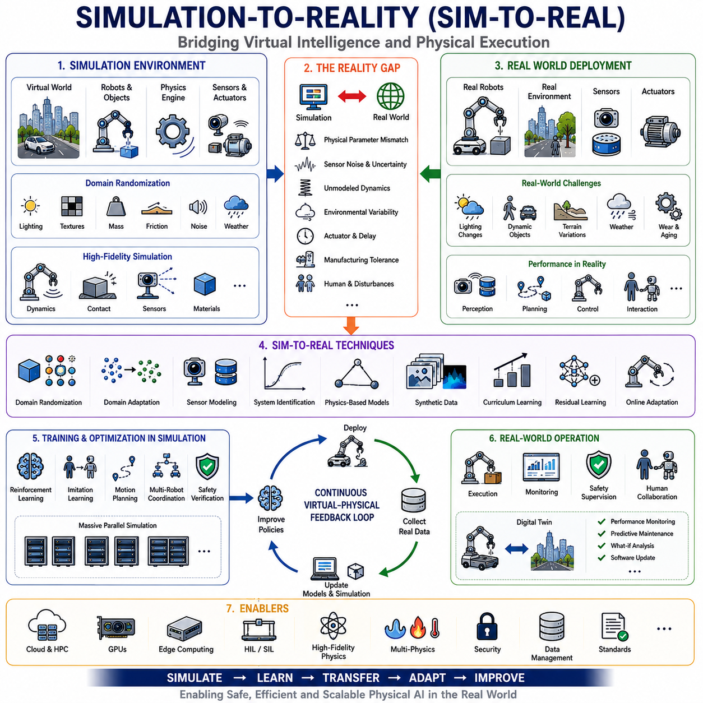
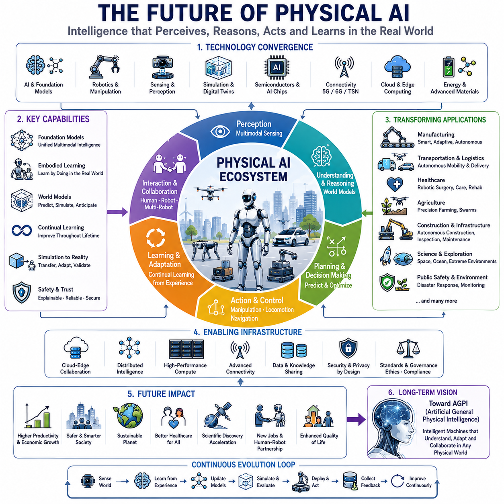

**Physical AI Engineering**

# Chapter 01 Foundations of Physical AI 

## 01-01 Introduction to Physical AI

{width="7.268055555555556in" height="7.268055555555556in"}

**Physical AI(Physical AI)**는 인공지능(AI)이 디지털 환경을 넘어 실제 물리 세계에서 인식하고(Perception), 추론(Reasoning)하며, 행동(Action)하고, 환경과의 상호작용을 통해 지속적으로 적응(Adaptation)하는 차세대 인공지능 패러다임이다. 기존의 인공지능이 텍스트(Text), 이미지(Image), 음성(Speech), 구조화된 데이터(Structured Data)와 같은 디지털 정보를 처리하는 데 집중하였다면, Physical AI는 이러한 능력을 센서(Sensor), 이동(Mobility), 조작(Manipulation), 제어(Control), 실시간 의사결정(Real-Time Decision Making)과 결합하여 지능형 기계(Intelligent Machines)가 실제 환경에 직접 영향을 미칠 수 있도록 한다. 다시 말해, 단순히 정보를 생성하거나 분석하는 것이 아니라 인식한 정보를 실제 행동으로 전환하여 복잡한 환경에서 이동하고, 물체를 조작하며, 사람과 협력하고, 다양한 작업을 자율적으로 수행하는 것이 Physical AI의 핵심이다.

Physical AI의 등장은 여러 기술 혁명의 융합에 의해 가능해졌다. 인공지능 분야에서는 딥러닝(Deep Learning), 기반 모델(Foundation Models), 거대 언어 모델(Large Language Models), 생성형 AI(Generative AI), 강화학습(Reinforcement Learning), 자기지도학습(Self-Supervised Learning) 등이 급격히 발전하였다. 동시에 로보틱스(Robotics)는 센서 기술(Sensing Technology), 임베디드 컴퓨팅(Embedded Computing), 전동 액추에이터(Electric Actuators), 정밀 기계(Mechatronics), 자율주행(Autonomous Navigation), GPU 기반 고성능 연산(High-Performance GPU Computing), 엣지 컴퓨팅(Edge Computing), 클라우드 로보틱스(Cloud Robotics), 디지털 트윈(Digital Twins) 등의 발전을 이루었다. 이러한 독립적인 기술들이 하나의 시스템으로 통합되면서, 지능형 기계는 단순한 소프트웨어가 아니라 실제 환경에서 자율적으로 행동하는 물리적 에이전트(Physical Agents)로 발전하게 되었다.

기존의 소프트웨어는 비교적 안정적인 계산 환경에서 미리 정의된 명령을 수행하지만, Physical AI는 끊임없이 변화하는 실제 환경을 이해하고 예측할 수 없는 사건에 즉시 대응해야 한다. 모든 의사결정은 이동(Motion), 힘(Force), 에너지 소비(Energy Consumption), 안전(Safety), 시간(Time), 그리고 환경과의 상호작용(Environmental Interaction)이라는 물리적 결과를 수반한다. 따라서 Physical AI는 인식(Perception), 인지(Cognition), 계획(Planning), 제어(Control), 실행(Execution)을 하나의 통합 아키텍처(Integrated Architecture)로 구성하며, 엄격한 실시간 제약(Real-Time Constraints) 속에서 동작해야 한다. 이러한 시스템의 성능은 계산 정확도뿐 아니라 견고성(Robustness), 신뢰성(Reliability), 적응성(Adaptability), 그리고 안전한 운용 능력에 의해 평가된다.

Physical AI의 가장 중요한 특징 가운데 하나는 체화된 지능(Embodied Intelligence)이다. 지능은 더 이상 컴퓨터 내부에서 이루어지는 추상적인 계산만을 의미하지 않는다. 센서는 환경으로부터 정보를 획득하고, 액추에이터(Actuators)는 환경에 영향을 주며, 그 결과로 생성되는 피드백(Feedback)은 다음 의사결정에 반영된다. 이러한 인식-행동-피드백(Perception-Action-Feedback) 순환 구조를 통해 기계는 단순히 사람이 만든 규칙을 실행하는 것이 아니라 경험을 통해 실제적인 지식을 학습하고 축적하게 된다.

현실 세계는 디지털 환경과 근본적으로 다른 특성을 가진다. 모든 물체는 기하학적 형상(Geometry), 질량(Mass), 관성(Inertia), 마찰(Friction), 탄성(Elasticity), 그리고 복잡한 동역학(Dynamics)을 가진다. 조명은 지속적으로 변화하고, 날씨는 이동성과 시야를 변화시키며, 사람은 예측하기 어려운 행동을 한다. 또한 모든 센서 데이터에는 노이즈(Noise)와 불확실성(Uncertainty)이 존재한다. 따라서 Physical AI는 숨겨진 상태(Hidden State)를 추정하고, 불확실성을 모델링하며, 미래를 예측하고, 새로운 정보가 들어올 때마다 내부 환경 모델을 지속적으로 수정해야 한다. 중요한 것은 완벽한 정보를 얻는 것이 아니라, 불완전한 정보 속에서도 안정적인 의사결정을 수행하는 능력이다.

현대의 Physical AI 시스템은 다양한 센서를 통합하여 환경을 종합적으로 이해한다. 카메라(Camera)는 색상, 질감, 형태와 같은 풍부한 시각 정보를 제공하며, 라이다(LiDAR)는 정밀한 3차원 기하 정보를 측정한다. 레이더(Radar)는 악천후에서도 안정적인 물체 인식을 지원하고, 관성측정장치(IMU, Inertial Measurement Unit)는 자세와 가속도를 추정한다. 여기에 힘 센서(Force Sensors), 촉각 센서(Tactile Sensors), 근접 센서(Proximity Sensors), 깊이 카메라(Depth Cameras), GPS(Global Positioning System), 마이크(Microphones), 열화상 카메라(Thermal Cameras), 산업용 센서(Industrial Sensors) 등이 함께 사용된다. 센서 융합(Sensor Fusion)은 이러한 다양한 데이터를 하나의 일관된 환경 표현으로 통합하여, 개별 센서보다 훨씬 높은 수준의 환경 이해를 가능하게 한다.

환경을 인식하는 것만으로는 충분하지 않다. Physical AI는 현재 환경뿐 아니라 미래의 변화까지 예측할 수 있는 내부 표현인 월드 모델(World Model)을 구축해야 한다. 월드 모델은 공간 정보, 의미 정보(Semantics), 객체 간의 관계(Relationships), 동적 변화(Dynamics), 불확실성, 시간 정보를 하나의 통합된 표현으로 구성한다. 이를 기반으로 시스템은 미래를 예측하고, 다양한 행동 대안을 평가하며, 실제 행동 이전에 가장 안전하고 효율적인 계획을 수립할 수 있다.

Physical AI의 추론은 단순한 논리 연산이나 언어 이해를 넘어선다. 지능형 시스템은 물리적 제약 조건을 고려하고, 이동 경로를 계산하며, 충돌 가능성을 예측하고, 여러 목표를 동시에 만족시키면서 안전을 확보해야 한다. 따라서 계획(Planning)은 작업 계획(Task Planning), 행동 계획(Behavior Planning), 경로 계획(Motion Planning), 저수준 제어(Low-Level Control)가 계층적으로 연결되는 다단계 최적화(Multi-Level Optimization) 문제로 이해된다. 각 계층은 추상적인 목표를 실제 기계가 실행 가능한 물리적 동작으로 변환하는 역할을 수행한다.

제어 시스템(Control System)은 인공지능과 실제 기계를 연결하는 마지막 단계이다. 계획 알고리즘이 생성한 명령은 최종적으로 전기 모터(Electric Motors), 유압 시스템(Hydraulic Systems), 공압 장치(Pneumatic Systems), 로봇 관절(Robot Joints), 조향 장치(Steering Systems), 제동 시스템(Braking Systems), 매니퓰레이터(Manipulators) 등의 기계 요소를 구동하는 전기 신호로 변환된다. 실시간 제어기(Real-Time Controller)는 외부 교란이나 모델 오차가 존재하더라도 명령된 동작을 정확하게 수행하도록 보장한다. 따라서 Physical AI의 성능은 알고리즘뿐 아니라 기계 설계(Mechanical Design), 센서, 액추에이터, 제어 공학(Control Engineering)의 수준에 의해 함께 결정된다.

학습(Learning)은 Physical AI가 지속적으로 발전하기 위한 핵심 요소이다. 기존 로봇은 대부분 사람이 만든 규칙과 정밀한 파라미터 조정에 의존하였지만, 현대의 Physical AI는 지도학습(Supervised Learning), 강화학습(Reinforcement Learning), 모방학습(Imitation Learning), 자기지도학습(Self-Supervised Learning), 온라인 학습(Online Learning), 지속학습(Continual Learning)을 활용하여 스스로 새로운 기술을 습득하고 기존 능력을 개선한다. 이러한 접근법은 다양한 환경에서도 일반화(Generalization) 능력을 확보하게 해준다.

실제 로봇 데이터를 대규모로 수집하는 것은 비용과 시간이 많이 들고 위험할 수도 있기 때문에, 시뮬레이션(Simulation)은 Physical AI 개발에서 매우 중요한 역할을 한다. 고충실도 시뮬레이션(High-Fidelity Simulation)은 인식 모델, 제어 정책, 계획 알고리즘을 실제 장비 없이 학습하고 검증할 수 있도록 지원한다. 또한 디지털 트윈(Digital Twin)은 실제 기계와 동기화된 가상 모델을 유지하여 상태 모니터링, 예지보전(Predictive Maintenance), 운영 최적화(Operation Optimization), 가상과 현실 간의 지속적인 학습을 가능하게 한다.

최근 기반 모델(Foundation Models)의 발전은 Physical AI의 가능성을 크게 확장하였다. 대규모 멀티모달 모델(Multimodal Models)은 언어(Language), 이미지(Image), 영상(Video), 음성(Audio), 그리고 다양한 센서 데이터를 하나의 통합 모델에서 처리할 수 있다. 비전-언어 모델(Vision-Language Models)은 자연어 명령을 이해하면서 동시에 시각 정보를 해석하고, 비전-언어-행동 모델(Vision-Language-Action Models)은 이러한 정보를 실제 로봇의 행동으로 직접 변환할 수 있다. 이러한 기반 모델은 높은 수준의 의미 이해를 제공하고, 로봇 제어 시스템은 이를 실제 물리적 행동으로 연결하는 역할을 수행한다.

Physical AI는 인공지능(AI), 로보틱스(Robotics), 컴퓨터 비전(Computer Vision), 기계공학(Mechanical Engineering), 전기전자공학(Electrical Engineering), 제어공학(Control Engineering), 임베디드 시스템(Embedded Systems), 물리학(Physics), 수학(Mathematics), 최적화(Optimization), 인간공학(Human Factors), 사이버보안(Cybersecurity), 클라우드 컴퓨팅(Cloud Computing), 디지털 트윈(Digital Twins), 소프트웨어 공학(Software Engineering) 등 다양한 학문이 융합된 종합 공학 분야이다. 어느 하나의 기술만으로는 Physical AI를 구현할 수 없으며, 모든 요소가 긴밀하게 통합될 때 비로소 진정한 지능형 시스템이 완성된다.

안전(Safety)은 Physical AI에서 가장 중요한 설계 원칙 중 하나이다. 디지털 소프트웨어와 달리 물리적 행동은 사람과 장비, 시설, 환경에 직접적인 영향을 미친다. 따라서 시스템은 기능 안전(Functional Safety), 위험 분석(Risk Assessment), 결함 감지(Fault Detection), 사이버보안(Cybersecurity), 안전 제어(Safe Control), 인간 인식(Human Awareness), 비상 정지(Emergency Stop), 상태 모니터링(System Health Monitoring) 등을 시스템 설계 초기부터 포함해야 한다.

사람과의 협업(Human Collaboration) 역시 Physical AI의 핵심 요소이다. 지능형 기계는 공장, 창고, 병원, 사무실, 가정, 농장, 교통 시스템, 공공 인프라 등에서 사람과 함께 작업하게 된다. 이를 위해서는 인간의 의도를 이해하고, 자연어로 의사소통하며, 사람의 행동을 예측하고, 개인 공간을 존중하며, 사회적 상황에 적응할 수 있어야 한다. 인간 중심 Physical AI(Human-Centric Physical AI)는 기술적 성능뿐 아니라 신뢰성(Trustworthiness), 설명 가능성(Explainability), 그리고 직관적인 상호작용을 중요하게 고려한다.

Physical AI의 적용 분야는 산업 전반으로 빠르게 확대되고 있다. 스마트 공장(Smart Factory), 자율 검사 로봇(Autonomous Inspection Robots), 협동 로봇(Collaborative Robots), 자율주행 차량(Autonomous Vehicles), 의료 로봇(Medical Robotics), 재활 로봇(Rehabilitation Robotics), 농업 자동화(Agricultural Automation), 스마트 에너지(Smart Energy), 인프라 점검(Infrastructure Inspection), 환경 모니터링(Environmental Monitoring), 건설 자동화(Construction Automation), 항공우주(Aerospace), 해양 자율 시스템(Maritime Autonomy), 국방 자율 시스템(Defense Autonomous Systems), 스마트 시티(Smart Cities) 등 거의 모든 산업 분야에서 핵심 기술로 자리 잡고 있다.

고성능 컴퓨팅(High-Performance Computing)의 발전 역시 Physical AI를 가속화하고 있다. 최신 GPU, AI 가속기(AI Accelerators), 신경망 처리 장치(NPU, Neural Processing Unit), 엣지 컴퓨팅 플랫폼은 복잡한 딥러닝 모델을 실시간으로 실행할 수 있도록 지원한다. 클라우드-엣지 협업(Cloud-Edge Collaboration)은 대규모 모델 학습은 클라우드에서 수행하고, 실시간 추론(Inference)은 로봇 내부의 엣지 컴퓨터에서 수행함으로써 높은 성능과 낮은 지연 시간을 동시에 달성한다.

최근에는 AI 네이티브 로보틱스(AI-Native Robotics)라는 새로운 개념도 등장하고 있다. 기존처럼 로봇에 AI를 추가하는 방식이 아니라, 처음부터 인공지능을 중심으로 하드웨어와 소프트웨어를 설계하는 접근 방식이다. 이러한 시스템은 운영 과정에서 지속적으로 데이터를 수집하고, 모델을 개선하며, 시간이 지날수록 더욱 높은 성능을 발휘하는 자기 발전(Self-Improving) 구조를 갖는다.

Physical AI는 자동화(Automation)의 개념 자체를 변화시키고 있다. 기존 자동화는 정해진 규칙을 반복적으로 수행하는 결정론적 시스템이었다. 반면 Physical AI는 불확실성을 받아들이고, 새로운 환경을 이해하며, 경험을 통해 학습하고, 스스로 적응하는 자율 시스템을 지향한다. 이는 자동화를 단순 반복 작업에서 지능적인 자율 의사결정 시스템으로 진화시키는 중요한 전환점이 되고 있다.

물론 아직 해결해야 할 과제도 많다. 다양한 환경에서의 일반화 능력, 장기 계획(Long-Horizon Planning), 평생학습(Lifelong Learning), 정교한 조작(Dexterous Manipulation), 상식 기반 물리 추론(Common-Sense Physical Reasoning), 에너지 효율(Energy Efficiency), 멀티모달 융합(Multimodal Fusion), 대규모 시뮬레이션, 신뢰 가능한 자율성(Trustworthy Autonomy), 그리고 종합적인 안전 보증(Safety Assurance)은 앞으로도 활발히 연구될 분야이다.

궁극적으로 Physical AI는 인간과 유사한 수준으로 물리 세계를 이해하고 안전하게 행동하는 자율 시스템을 목표로 한다. 미래의 Physical AI는 더욱 정교한 월드 모델(World Models), 강력한 추론 능력, 자연스러운 인간과의 상호작용, 높은 적응성, 그리고 다양한 자율 에이전트 간 협업 능력을 갖추게 될 것이다. 이러한 기술은 제조업, 물류, 의료, 사회 기반 시설, 환경 보호, 과학 탐사 등 거의 모든 산업을 변화시키며 인간과 함께 새로운 지능형 사회를 구축하는 핵심 기반 기술이 될 것이다.

본 교재는 Physical AI를 하나의 개별 알고리즘이 아니라 인식(Perception), 월드 모델(World Model), 추론(Reasoning), 학습(Learning), 계획(Planning), 제어(Control), 컴퓨팅(Computing), 로보틱스(Robotics), 안전(Safety), 인간 협업(Human Collaboration)을 모두 포함하는 통합 시스템 공학(Systems Engineering)으로 접근한다. 이후의 각 장에서는 이러한 요소들을 개별적으로 심층적으로 다루면서, 최종적으로는 이들이 어떻게 유기적으로 결합되어 현실 세계를 이해하고 행동하는 지능형 물리 시스템을 구현하는지를 설명할 것이다.

## 01-02 History of Intelligent Machines

{width="7.268055555555556in" height="7.268055555555556in"}

지능형 기계(Intelligent Machines)의 역사는 현대 인공지능(Artificial Intelligence, AI)보다 훨씬 오래되었으며, 수천 년에 걸친 인류 문명의 발전 과정과 함께 이어져 왔다. 인간은 오래전부터 스스로 움직이고, 주변을 인식하며, 사고하고, 사람을 도와주는 인공적인 존재(Artificial Beings)를 꿈꾸어 왔다. 이러한 상상은 신화(Mythology)에서 시작되어 기계공학(Mechanical Engineering), 자동화(Automation), 전자공학(Electronics), 컴퓨터 과학(Computer Science), 로보틱스(Robotics)를 거쳐 오늘날의 Physical AI(Physical AI)로 발전하였다. 따라서 지능형 기계의 역사를 이해하는 것은 단순히 기술의 발전 과정을 살펴보는 것이 아니라, 인간이 지능(Intelligence), 자율성(Autonomy), 그리고 인간과 기계의 관계(Human-Machine Interaction)를 어떻게 이해하고 구현해 왔는지를 살펴보는 과정이라 할 수 있다.

지능형 기계에 대한 가장 오래된 기록은 고대 문명의 신화와 전설에서 찾아볼 수 있다. 그리스 신화(Greek Mythology)에 등장하는 탈로스(Talos)는 크레타섬(Crete)을 지키기 위해 해안을 순찰하며 침입자를 막는 거대한 청동 거인(Bronze Giant)으로 묘사된다. 물론 이는 허구의 존재였지만, 인간이 스스로 판단하고 움직이는 자율 기계(Autonomous Machine)를 오래전부터 상상해 왔음을 보여준다. 이와 유사한 개념은 중국, 이집트, 페르시아, 인도 등 다양한 문명에서도 나타난다. 이들 문화권에서는 스스로 움직이는 인형(Mechanical Dolls), 자동으로 봉사하는 기계 하인(Mechanical Servants), 살아 움직이는 조각상(Animated Statues) 등의 이야기가 전해지며, 이는 인공적인 지능을 구현하려는 인간의 오랜 꿈을 반영하고 있다.

이러한 상상은 점차 실제 기계 장치의 발명으로 이어졌다. 기원전 3세기경 알렉산드리아(Alexandria)의 크테시비오스(Ctesibius)는 자동 시계(Automatic Clocks), 유압 장치(Hydraulic Systems), 자동 제어 장치(Self-Regulating Mechanisms)를 개발하였다. 그의 발명은 사람이 계속 조작하지 않아도 기계가 일정한 동작을 수행할 수 있다는 사실을 보여주었다. 이후 헤론(Hero of Alexandria)은 증기(Steam), 물의 압력(Water Pressure), 중력(Gravity)을 이용하여 자동으로 움직이는 극장 장치(Automated Theater), 자동 개폐되는 신전 문(Automatic Temple Doors), 기계 새(Mechanical Birds) 등을 설계하였다. 이들 장치는 현대적인 의미의 지능을 갖고 있지는 않았지만, 센서(Sensing), 액추에이터(Actuation), 순차 제어(Sequential Control), 기계식 제어(Mechanical Control)의 기본 원리를 제시했다는 점에서 로보틱스의 초기 형태로 평가된다.

중세 시대(Middle Ages)에도 자동 기계의 발전은 계속되었다. 9세기 바누 무사 형제(Banū Mūsā Brothers)는 『기발한 장치의 책(The Book of Ingenious Devices)』에서 다양한 자동 기계를 소개하였다. 이들은 피드백 메커니즘(Feedback Mechanisms), 자동 밸브(Automatic Valves), 유체 제어(Fluid Regulation), 기계식 프로그래밍(Mechanical Programming) 개념을 활용하였다. 12세기에는 알 자자리(Al-Jazari)가 자동 음악 연주기(Programmable Musical Automata), 물시계(Water Clocks), 펌프(Pumps), 분수(Fountains), 사람 형태의 서비스 기계(Humanoid Service Machines)를 설계하였다. 많은 연구자들은 알 자자리를 현대 로보틱스의 선구자 중 한 사람으로 평가하는데, 이는 그의 기계가 정밀한 기계 구조와 반복 가능한 자율 동작을 동시에 구현했기 때문이다. 특히 캠(Cam), 크랭크축(Crankshaft), 밸브(Valve), 타이밍 메커니즘(Timing Mechanism), 모듈식 설계(Modular Design)는 오늘날의 기계 시스템에서도 여전히 사용되는 핵심 원리이다.

르네상스(Renaissance)에 이르러 과학과 공학이 발전하면서 더욱 정교한 자동 기계가 등장하였다. 레오나르도 다 빈치(Leonardo da Vinci)는 팔과 머리를 움직이고 앉고 일어설 수 있는 기계 기사(Mechanical Knight)를 설계하였다. 그의 설계는 당시 실제 제작되지는 못했지만, 현대에 복원된 결과 대부분이 실제로 작동 가능하다는 것이 확인되었다. 이는 단순한 자동 기계를 넘어 인간의 신체 구조와 움직임을 모방하는 인간형 기계(Humanoid Machine)에 대한 최초의 체계적인 연구 중 하나였다.

17세기와 18세기에는 정밀 기계공학(Precision Mechanical Engineering)이 크게 발전하였다. 시계 제작 기술(Clockmaking Technology)의 발달로 기어(Gears), 스프링(Springs), 이스케이프먼트(Escapement), 정밀 타이밍 장치(Timing Mechanisms)가 크게 향상되었으며, 이를 기반으로 글씨를 쓰는 인형(Writing Dolls), 그림을 그리는 기계(Drawing Machines), 악기를 연주하는 자동 인형(Musical Automata), 동물의 움직임을 모방한 기계(Mechanical Animals) 등이 제작되었다. 이러한 기계들은 실제 지능은 없었지만 매우 복잡한 동작을 수행함으로써 사람들에게 마치 사고하는 존재처럼 보이는 효과를 주었다.

이 시기의 대표적인 사례가 바로 1770년에 공개된 체스 두는 기계인 메커니컬 터크(Mechanical Turk)이다. 이 기계는 인간 체스 선수와 대결하여 승리하는 것처럼 보였으며 유럽 전역에서 큰 화제를 모았다. 그러나 나중에 내부에 사람이 숨어 조작하고 있었다는 사실이 밝혀졌다. 비록 속임수였지만, 메커니컬 터크는 사람들에게 "기계가 생각할 수 있는가?"라는 질문을 던졌으며, 실제 지능(Genuine Intelligence)과 지능처럼 보이는 현상(Apparent Intelligence)을 구분하는 중요한 철학적 논의를 촉발하였다. 이러한 논의는 오늘날 생성형 AI(Generative AI)와 거대 언어 모델(Large Language Models)을 평가하는 과정에서도 여전히 중요한 의미를 가진다.

산업혁명(Industrial Revolution)은 인간과 기계의 관계를 근본적으로 변화시켰다. 증기기관(Steam Engine), 자동 방직기(Automated Textile Machines), 대량 생산(Mass Production), 정밀 제조(Precision Manufacturing)는 기계가 인간보다 더 빠르고 일정한 품질로 반복 작업을 수행할 수 있음을 보여주었다. 이 시기부터 기계는 단순한 도구가 아니라 일정한 절차를 스스로 수행하는 자동화 시스템(Automation System)으로 인식되기 시작하였다.

19세기에는 계산 기계(Computing Machines)의 발전이 새로운 전환점을 만들었다. 찰스 배비지(Charles Babbage)는 차분기관(Difference Engine)과 해석기관(Analytical Engine)을 설계하면서 프로그램(Program), 메모리(Memory), 산술 연산 장치(Arithmetic Unit), 조건 분기(Conditional Execution), 제어 흐름(Control Flow) 등 현대 컴퓨터의 핵심 개념을 제안하였다. 당시의 기술 수준으로는 완성하지 못했지만, 그의 설계는 오늘날 프로그래머블 컴퓨터(Programmable Computer)의 원형이 되었다.

에이다 러브레이스(Ada Lovelace)는 이러한 계산 기계가 단순히 숫자를 계산하는 것을 넘어 음악을 작곡하고 예술 작품을 만들며 다양한 문제를 해결할 수 있을 것이라고 예견하였다. 그녀는 프로그램 가능한 기계가 숫자가 아니라 기호(Symbol)를 처리할 수 있다는 사실을 최초로 통찰하였으며, 이러한 생각은 현대 소프트웨어와 인공지능의 철학적 기초가 되었다.

20세기에 들어 전자공학(Electronics), 통신(Communications), 제어공학(Control Theory), 디지털 컴퓨팅(Digital Computing)이 급속히 발전하면서 자동 기계는 정보 처리 시스템으로 진화하기 시작하였다. 제2차 세계대전(World War II) 동안 레이더(Radar), 암호 해독(Cryptography), 전자 계산(Electronic Computing), 피드백 제어(Feedback Control)가 발전하였고, 앨런 튜링(Alan Turing)은 보편 계산(Universal Computation)의 개념과 튜링 테스트(Turing Test)를 제안하였다. 그는 기계의 내부 구조보다 외부에서 관찰 가능한 행동을 통해 지능을 평가해야 한다고 주장하였으며, 이러한 철학은 현대 AI 연구에도 큰 영향을 미쳤다.

1956년 다트머스 회의(Dartmouth Conference)는 인공지능(AI)을 독립된 학문 분야로 공식 출범시키는 계기가 되었다. 존 매카시(John McCarthy), 마빈 민스키(Marvin Minsky), 클로드 섀넌(Claude Shannon), 허버트 사이먼(Herbert Simon), 앨런 뉴얼(Allen Newell) 등은 인간의 사고 과정을 컴퓨터 프로그램으로 구현할 수 있다고 믿었다. 초기 AI는 논리 추론(Logical Reasoning), 탐색(Search), 정리 증명(Theorem Proving), 전문가 시스템(Expert Systems) 등을 중심으로 발전하였으며, 제한된 환경에서는 뛰어난 성과를 보였지만 복잡하고 불확실한 현실 세계를 다루는 데에는 한계를 보였다.

같은 시기에 로보틱스(Robotics)도 독립적으로 발전하였다. 1960년대 최초의 산업용 로봇(Industrial Robots)은 공장에서 반복적인 조립과 용접 작업을 수행하기 시작하였다. 이들 로봇은 정해진 경로를 따라 매우 정확하게 움직였지만, 주변 환경을 이해하거나 스스로 판단하는 능력은 거의 없었다. 그럼에도 불구하고 대규모 생산 현장에서 자동화의 가능성을 증명하였다.

1970년대와 1980년대에는 센서(Sensors), 비전 시스템(Vision Systems), 힘 제어(Force Control), 마이크로프로세서(Microprocessors)가 로봇에 적용되면서 이동 로봇(Mobile Robots)이 등장하였다. 또한 상태 공간 제어(State-Space Control), 적응 제어(Adaptive Control), 강인 제어(Robust Control), 최적 제어(Optimal Control) 등 현대 제어공학이 발전하면서 더욱 안정적이고 자율적인 기계 시스템을 구현할 수 있게 되었다.

1980년대 후반부터 1990년대에 이르러 기계학습(Machine Learning)이 인공지능의 새로운 중심 기술로 자리 잡기 시작하였다. 인간이 규칙을 일일이 작성하는 대신 컴퓨터가 데이터를 통해 스스로 패턴을 학습하는 방식이 등장하였다. 신경망(Neural Networks), 결정 트리(Decision Trees), 베이지안 추론(Bayesian Inference), 서포트 벡터 머신(Support Vector Machines), 강화학습(Reinforcement Learning)은 AI의 적응성과 일반화 능력을 크게 향상시켰다.

인터넷(Internet)의 보급은 지능형 기계의 발전을 더욱 가속화하였다. 전 세계에서 데이터를 공유하고 분산 컴퓨팅(Distributed Computing)을 수행할 수 있게 되었으며, 클라우드 로보틱스(Cloud Robotics)는 여러 로봇이 지도(Maps), 경험(Experience), 학습된 모델(Trained Models)을 공유하는 새로운 개념을 제시하였다.

2012년 이후 딥러닝 혁명(Deep Learning Revolution)은 지능형 기계의 성능을 획기적으로 향상시켰다. 합성곱 신경망(CNN, Convolutional Neural Networks)은 영상 인식 성능을 크게 높였고, 이후 트랜스포머(Transformer) 구조는 자연어 처리(Natural Language Processing)와 멀티모달 AI(Multimodal AI)를 발전시키는 기반이 되었다. 이를 통해 로봇은 물체 인식(Object Recognition), 사람 자세 추정(Human Pose Estimation), 장면 이해(Scene Understanding), 이상 탐지(Anomaly Detection) 등을 이전보다 훨씬 높은 수준으로 수행할 수 있게 되었다.

강화학습(Reinforcement Learning)의 발전은 자율성을 한 단계 더 향상시켰다. 로봇은 시행착오(Trial and Error)를 반복하며 이동(Locomotion), 조작(Manipulation), 경로 계획(Navigation), 전략적 의사결정(Strategic Decision Making)을 스스로 학습할 수 있게 되었고, 고충실도 시뮬레이션(High-Fidelity Simulation)과 결합되면서 실제 환경에 적용 가능한 수준으로 발전하였다.

자율주행 차량(Autonomous Vehicles)은 지능형 기계 발전의 또 다른 중요한 이정표가 되었다. 카메라(Camera), 라이다(LiDAR), 레이더(Radar), GPS, IMU, 고정밀 지도(HD Maps), 기계학습, 경로 계획, 실시간 제어를 하나의 시스템으로 통합하여 복잡한 도시 환경에서 자율적으로 주행하는 것이 가능해졌다. 이는 인식, 추론, 예측, 계획, 제어가 하나의 통합 시스템으로 구현된 대표적인 사례이다.

협동 로봇(Collaborative Robots, Cobots)의 등장은 인간과 기계의 관계를 다시 정의하였다. 기존 산업용 로봇이 사람과 분리된 공간에서 작업하였다면, 협동 로봇은 힘 센서, 충돌 감지, 순응 제어(Compliant Control), 인간 인식(Human Awareness)을 이용하여 사람과 같은 공간에서 안전하게 협업할 수 있게 되었다.

최근에는 기반 모델(Foundation Models)과 생성형 AI(Generative AI)가 등장하면서 지능형 기계는 새로운 전환점을 맞이하고 있다. 거대 언어 모델(Large Language Models)은 뛰어난 언어 이해와 추론 능력을 제공하며, 비전-언어 모델(Vision-Language Models)은 영상과 언어를 동시에 이해할 수 있다. 나아가 비전-언어-행동 모델(Vision-Language-Action Models)은 이러한 의미 이해를 실제 로봇의 행동으로 직접 연결하는 기술로 발전하고 있다.

동시에 시뮬레이션(Simulation), 디지털 트윈(Digital Twin), 합성 데이터(Synthetic Data), Sim-to-Real 전이(Simulation-to-Reality Transfer)는 실제 로봇을 사용하지 않고도 안전하고 효율적으로 AI를 학습시키는 핵심 기술이 되었다.

오늘날의 Physical AI는 이러한 수백 년의 기술 발전이 하나로 통합된 결과물이다. 최신 지능형 기계는 첨단 센서, GPU 기반 컴퓨팅, 기반 모델, 월드 모델(World Models), 강화학습, 멀티모달 인식(Multimodal Perception), 클라우드-엣지 협업(Cloud-Edge Collaboration), 실시간 제어, 디지털 트윈을 하나의 통합 시스템으로 구성하여 실제 환경에서 스스로 인식하고, 판단하며, 행동하고, 지속적으로 학습한다.

지능형 기계의 발전은 산업과 사회에도 큰 변화를 가져왔다. 자동화는 제조 생산성을 높였으며, 자율주행은 교통 안전을 향상시키고, 의료 AI는 진단과 치료를 지원하며, 스마트 농업은 식량 생산의 효율성을 높이고 있다. 동시에 개인정보 보호(Privacy), 사이버보안(Cybersecurity), 책임성(Accountability), 공정성(Fairness), 설명 가능성(Explainability), 인간의 신뢰(Human Trust)와 같은 새로운 사회적·윤리적 과제도 함께 제기되고 있다.

앞으로의 지능형 기계는 더욱 범용적이고(General-Purpose), 적응적이며(Adaptive), 협력적인(Collaborative) 시스템으로 발전할 것이다. 미래의 Physical AI는 더욱 정교한 월드 모델(World Models), 상식 기반 물리 추론(Common-Sense Physical Reasoning), 고도의 조작 능력(Dexterous Manipulation), 평생학습(Lifelong Learning), 에너지 효율(Energy Efficiency), 자연스러운 인간과의 상호작용(Human-AI Collaboration)을 갖추게 될 것이다. 또한 개별 로봇을 넘어 가정(Home), 공장(Factory), 병원(Hospital), 도시(City), 교통망(Transportation Networks), 우주 탐사(Space Exploration)를 연결하는 거대한 지능형 생태계(Intelligent Ecosystem)의 핵심 구성 요소로 발전할 것으로 기대된다.

지능형 기계의 역사는 하나의 획기적인 발명으로 이루어진 것이 아니라, 기계공학(Mechanical Engineering), 수학(Mathematics), 컴퓨터 과학(Computer Science), 전자공학(Electronics), 제어공학(Control Engineering), 인공지능(AI), 로보틱스(Robotics)가 오랜 시간 축적되며 서로 융합된 결과이다. 고대의 자동 기계는 자율 움직임의 개념을 제시하였고, 정밀 기계공학은 반복성과 신뢰성을 확보하였으며, 디지털 컴퓨터는 프로그래머블 지능을 가능하게 하였다. 기계학습은 적응 능력을 부여하였고, 기반 모델은 범용적인 지식을 제공하였다. 오늘날의 Physical AI는 이러한 모든 기술을 하나로 통합하여 실제 물리 세계에서 인식하고, 추론하고, 행동하며, 학습하는 새로운 세대의 지능형 시스템을 실현하고 있다. 이러한 역사적 발전 과정을 이해하는 것은 지금까지의 성과를 올바르게 평가하는 데 도움이 될 뿐 아니라, 미래의 **인공 일반 Physical Intelligence(Artificial General Physical Intelligence, AGPI)** 로 나아가는 방향을 이해하는 데에도 중요한 기반이 된다.

## 01-03 Embodied AI and Physical AI

{width="7.268055555555556in" height="7.268055555555556in"}

체화형 AI(Embodied AI)와 Physical AI(Physical AI)는 인공지능(Artificial Intelligence, AI)의 발전 과정에서 등장한 가장 중요한 패러다임 가운데 두 가지로, 지능을 단순한 디지털 계산 영역에서 실제 물리 세계와의 상호작용으로 확장한다는 공통된 목표를 가진다. 두 용어는 종종 같은 의미로 사용되기도 하지만, 실제로는 서로 다른 관점과 범위를 가진 개념이다. 체화형 AI는 지능이 물리적 신체(Body)를 통해 환경을 인식하고 상호작용하는 과정에서 형성된다는 점을 강조하는 반면, Physical AI는 이러한 개념을 포함하면서도 인식(Perception), 추론(Reasoning), 학습(Learning), 계획(Planning), 제어(Control), 시뮬레이션(Simulation), 하드웨어(Hardware), 그리고 실제 환경에서의 운용(Deployment)까지 포함하는 보다 넓은 시스템 공학(Systems Engineering) 관점을 제시한다. 두 개념의 공통점과 차이점을 이해하는 것은 복잡한 현실 환경에서 안전하고 지능적으로 동작하는 차세대 자율 시스템을 설계하기 위한 중요한 기초가 된다.

초기의 인공지능은 대부분 컴퓨터 내부의 계산 환경을 중심으로 발전하였다. 당시의 연구는 기호 추론(Symbolic Reasoning), 논리 추론(Logical Inference), 최적화(Optimization), 탐색(Search), 자연어 처리(Natural Language Processing), 패턴 인식(Pattern Recognition) 등에 집중되었으며, 지능은 디지털 정보를 얼마나 정확하게 처리하는가에 의해 평가되었다. 이러한 시스템은 물체를 조작하거나 환경을 이동하거나 사람과 상호작용하는 능력은 거의 고려하지 않았으며, 실제 세계와의 직접적인 연결도 매우 제한적이었다. 그러나 이러한 접근은 생물학적 지능(Biological Intelligence)의 중요한 특성을 간과하고 있었다. 인간과 동물의 지능은 단순히 뇌에서 계산이 이루어지는 것이 아니라 신체와 환경의 지속적인 상호작용을 통해 형성되기 때문이다.

체화형 지능(Embodied Intelligence)의 개념은 인지과학(Cognitive Science), 신경과학(Neuroscience), 심리학(Psychology), 철학(Philosophy), 그리고 로보틱스(Robotics)의 연구를 통해 발전하였다. 연구자들은 지능이 단순한 계산 과정이 아니라 뇌(Brain), 신체(Body), 환경(Environment)이 끊임없이 상호작용하는 과정에서 형성된다는 사실을 강조하였다. 인간은 움직이며 주변을 탐색하고, 손으로 물체를 만지고, 몸을 이용하여 균형을 유지하며, 감각과 행동의 반복을 통해 세상을 이해한다. 따라서 학습은 단순히 기호를 처리하는 과정이 아니라 실제 경험(Experience), 행동(Action), 그리고 적응(Adaptation)을 통해 이루어진다. 이러한 관점은 자연 지능뿐 아니라 인공지능을 이해하는 데에도 매우 중요한 원리가 되었다.

체화형 AI는 이러한 원리를 인공 시스템에 적용한다. 즉, 지능형 에이전트(Intelligent Agent)는 환경을 인식하고 행동할 수 있는 신체를 가져야 하며, 이 신체는 단순히 컴퓨터를 운반하는 기계 구조가 아니라 지능의 일부를 구성하는 요소이다. 신체는 다양한 감각 정보를 제공하고, 환경을 탐색하며, 가능한 행동을 제한하거나 확장하고, 행동의 결과를 다시 피드백으로 전달한다. 카메라(Camera), 라이다(LiDAR), 촉각 센서(Tactile Sensors), 힘 센서(Force Sensors), 마이크(Microphones), 관성측정장치(IMU, Inertial Measurement Unit), GPS(Global Positioning System), 깊이 카메라(Depth Cameras), 열화상 센서(Thermal Sensors) 등은 환경과 연결되는 감각 기관의 역할을 수행한다. 반대로 모터(Motors), 로봇 관절(Robot Joints), 바퀴(Wheels), 매니퓰레이터(Manipulators), 그리퍼(Grippers), 드론(Drone), 유압 액추에이터(Hydraulic Actuators), 공압 장치(Pneumatic Systems)는 환경에 영향을 주는 행동 기관의 역할을 담당한다.

체화형 AI의 가장 중요한 원리 가운데 하나는 인식-행동 순환(Perception-Action Loop)이다. 환경을 인식하면 행동이 결정되고, 행동은 환경을 변화시키며, 변화된 환경은 다시 새로운 감각 정보를 제공한다. 이러한 반복적인 순환 구조 속에서 지능은 지속적으로 발전한다. 기존의 소프트웨어가 정적인 데이터를 입력받아 계산하는 방식이었다면, 체화형 AI는 스스로 움직이며 새로운 정보를 획득한다. 즉, 이동하고, 물체를 조작하며, 시점을 바꾸고, 환경을 탐색하는 과정 자체가 학습의 일부가 된다. 이러한 능동적 인식(Active Perception)은 환경을 훨씬 깊이 이해하도록 만든다.

또 하나의 중요한 개념은 체화된 인지(Grounded Cognition)이다. 인간은 "밀다(Push)", "들다(Lift)", "잡다(Grasp)", "걷다(Walk)", "무겁다(Heavy)", "깨지기 쉽다(Fragile)"와 같은 개념을 단순한 언어 정의가 아니라 실제 경험을 통해 이해한다. 체화형 AI 역시 추상적인 기호만 학습하는 것이 아니라 언어(Language), 영상(Vision), 힘(Force), 움직임(Motion), 물체와의 상호작용(Object Interaction)을 하나의 통합된 멀티모달 표현(Multimodal Representation)으로 연결한다. 이러한 연결은 일반화 능력(Generalization), 추론 능력, 그리고 실제 작업 수행 능력을 크게 향상시킨다.

Physical AI는 이러한 체화형 AI의 철학을 기반으로 하면서 이를 실제 산업과 사회에 적용 가능한 종합적인 공학 시스템으로 확장한다. 체화형 AI가 "왜 신체가 지능에 필요한가"를 설명한다면, Physical AI는 "어떻게 이러한 지능을 실제 시스템으로 구현할 것인가"를 다룬다. 따라서 Physical AI는 로보틱스(Robotics), 인공지능(AI), 월드 모델(World Models), 시뮬레이션(Simulation), 디지털 트윈(Digital Twins), 클라우드-엣지 컴퓨팅(Cloud-Edge Computing), 실시간 제어(Real-Time Control), 기능 안전(Functional Safety), 사이버보안(Cybersecurity), 통신 네트워크(Communication Networks), 시스템 공학(Systems Engineering), 그리고 전체 생애주기 관리(Lifecycle Management)를 하나의 통합 아키텍처로 구성한다.

두 개념의 관계를 이해하는 가장 쉬운 방법은 체화형 AI를 과학적 원리(Scientific Principle), Physical AI를 공학적 구현(Engineering Realization)으로 보는 것이다. 체화형 AI는 지능이 왜 신체와 환경의 상호작용에서 발생하는지를 설명하며, Physical AI는 이러한 원리를 실제 하드웨어와 소프트웨어를 이용하여 구현한다. 따라서 모든 Physical AI 시스템은 체화형 AI의 개념을 포함하지만, 모든 체화형 AI 연구가 곧바로 Physical AI 시스템으로 이어지는 것은 아니다.

현대의 Physical AI 시스템은 여러 계층으로 구성된다. 센서 계층(Sensing Layer)은 카메라, 라이다, 레이더(Radar), 촉각 센서, 힘 센서, IMU, GPS, 마이크, 산업용 센서 등을 이용하여 다양한 데이터를 수집한다. 인식 계층(Perception Layer)은 컴퓨터 비전(Computer Vision), 센서 융합(Sensor Fusion), 의미 이해(Semantic Understanding), 객체 인식(Object Detection), 장면 재구성(Scene Reconstruction), 상태 추정(State Estimation)을 수행한다. 월드 모델(World Model) 계층은 공간 구조(Geometry), 의미 정보(Semantics), 동적 변화(Dynamics), 불확실성(Uncertainty), 시간 관계(Temporal Relationships)를 통합한 내부 환경 모델을 구축한다. 이후 추론(Reasoning), 계획(Planning), 예측(Prediction), 최적화(Optimization), 의사결정(Decision Making)이 수행되며, 마지막으로 모션 생성(Motion Generation), 궤적 계획(Trajectory Planning), 제어(Control), 액추에이터(Actuators)를 통해 실제 물리적 행동을 수행한다.

체화형 AI는 특히 경험을 통한 학습(Learning through Interaction)을 강조한다. 인간의 영아는 반복적으로 손을 뻗고, 물건을 잡고, 기어 다니고, 걸으며, 물체를 조작하는 과정을 통해 운동 능력(Motor Skills), 물리 법칙(Physics), 인과관계(Causality), 물체의 지속성(Object Permanence), 사회적 상호작용(Social Interaction)을 학습한다. 현대 로봇 역시 강화학습(Reinforcement Learning), 모방학습(Imitation Learning), 자기지도학습(Self-Supervised Learning), 호기심 기반 탐색(Curiosity-Driven Exploration), 지속학습(Continual Learning)을 이용하여 이러한 과정을 모방한다.

시뮬레이션(Simulation)은 체화형 AI와 Physical AI를 연결하는 매우 중요한 기술이다. 실제 환경에서 대량의 로봇 데이터를 수집하는 것은 비용과 시간이 많이 들기 때문에, 고충실도 물리 시뮬레이션(High-Fidelity Physics Simulation)은 안전하고 효율적인 학습 환경을 제공한다. 물리 엔진(Physics Engine)은 강체 운동(Rigid Body Dynamics), 충돌(Collision), 마찰(Friction), 유체(Fluid), 조명(Lighting), 센서 특성(Sensor Characteristics), 액추에이터 특성(Actuator Characteristics)을 정밀하게 모델링한다. 강화학습 알고리즘은 이러한 환경에서 학습한 후 Sim-to-Real 전이(Simulation-to-Reality Transfer)를 통해 실제 로봇에 적용된다. 또한 디지털 트윈(Digital Twin)은 실제 시스템과 가상 모델을 지속적으로 동기화하여 운영 중에도 지속적인 성능 개선을 가능하게 한다.

최근 기반 모델(Foundation Models)의 발전은 체화형 AI와 Physical AI 모두를 크게 발전시키고 있다. 대규모 멀티모달 모델(Large Multimodal Models)은 언어, 이미지, 영상, 음성, 그리고 로봇 데이터를 함께 학습하여 풍부한 의미 정보를 제공한다. 비전-언어 모델(Vision-Language Models)은 자연어 명령과 시각 정보를 동시에 이해하며, 비전-언어-행동 모델(Vision-Language-Action Models)은 이러한 이해를 실제 로봇의 행동으로 직접 변환한다. 이를 통해 복잡한 작업을 수행하기 위해 사람이 일일이 프로그래밍할 필요가 크게 줄어들고, 다양한 작업에 대한 적응성이 향상된다.

그러나 아무리 뛰어난 기반 모델이라 하더라도 체화(Embodiment)의 중요성은 여전히 유지된다. 인터넷 데이터만으로 학습한 모델은 마찰(Friction), 힘(Force), 균형(Balance), 무게 중심(Center of Gravity), 물체의 변형(Object Deformation), 안정적인 파지(Grasp Stability), 접촉 역학(Contact Dynamics)과 같은 실제 물리 현상을 충분히 이해하기 어렵다. 이러한 지식은 실제 환경과의 반복적인 상호작용을 통해서만 효과적으로 학습될 수 있다. 따라서 미래의 지능형 시스템은 대규모 사전학습(Pretraining)을 통해 획득한 일반 지식과 실제 환경에서 얻은 체화된 경험을 함께 활용하게 될 것이다.

인간의 지능은 이러한 통합 구조를 가장 잘 보여주는 사례이다. 사람은 언어와 교육을 통해 얻은 지식뿐 아니라, 직접 움직이고 경험하며 얻은 신체적 경험을 함께 활용한다. 새로운 상황을 만나면 인식, 기억, 추론, 예측, 그리고 실제 행동을 동시에 수행하며 지속적으로 학습한다. Physical AI 역시 기반 모델, 월드 모델, 체화된 경험, 지속학습을 하나의 통합된 인지 구조(Cognitive Architecture)로 결합하는 방향으로 발전하고 있다.

체화형 AI는 로봇의 형태(Morphology)에도 큰 영향을 준다. 지능은 알고리즘뿐 아니라 신체 구조에 의해서도 결정된다. 바퀴형 로봇(Wheeled Robots)은 평탄한 환경에서는 매우 효율적이지만 계단이나 험지를 이동하기 어렵다. 다리형 로봇(Legged Robots)은 복잡한 지형을 이동할 수 있지만 기계 구조와 제어가 훨씬 복잡하다. 휴머노이드 로봇(Humanoid Robots)은 인간 환경에서 작업하기에 적합하지만 균형 유지와 전신 제어(Whole-Body Control)가 매우 어렵다. 또한 매니퓰레이터의 구조, 센서의 배치, 액추에이터의 구성, 기계적 순응성(Mechanical Compliance)은 모두 학습 효율과 작업 성능에 직접적인 영향을 준다.

Physical AI는 이러한 관점을 더욱 확장하여 하드웨어와 소프트웨어를 동시에 설계하는 공동 설계(Co-Design)를 강조한다. 기계 구조(Mechanical Structure), 센서 구성(Sensor Configuration), 임베디드 컴퓨팅(Embedded Computing), 통신(Networking), AI 모델, 제어 알고리즘(Control Algorithms), 배터리(Battery), 열 관리(Thermal Management), 클라우드 인프라(Cloud Infrastructure)를 하나의 시스템으로 최적화함으로써 성능과 신뢰성을 동시에 확보한다.

안전(Safety)은 Physical AI를 기존 AI와 구별하는 가장 중요한 요소 중 하나이다. Physical AI의 행동은 사람과 장비, 시설, 환경에 직접적인 영향을 미치므로 충돌 회피(Collision Avoidance), 힘 제한(Force Limitation), 결함 감지(Fault Detection), 이중화(Redundancy), 기능 안전(Functional Safety), 사이버보안(Cybersecurity), 비상 정지(Emergency Stop), 인간 인식(Human-Aware Behavior) 등을 시스템의 모든 계층에서 고려해야 한다.

Physical AI의 또 다른 특징은 지속적인 운영(Continuous Operation)이다. 기존 로봇은 특정 작업을 수행한 후 대기하는 경우가 많았지만, 미래의 Physical AI는 변화하는 환경 속에서 지속적으로 지도를 갱신하고, 월드 모델을 개선하며, 행동을 최적화하고, 에너지 소비를 관리하며, 다른 자율 시스템과 협력한다. 지속학습, 온라인 적응(Online Adaptation), 플릿 지능(Fleet Intelligence), 클라우드 동기화(Cloud Synchronization), 디지털 트윈은 이러한 지속적인 진화를 가능하게 한다.

인간과 함께 작업하는 환경에서는 체화형 AI와 Physical AI의 관계가 더욱 명확하게 드러난다. 체화형 AI는 사람의 제스처(Gestures), 시선(Gaze), 움직임(Motion), 힘(Force), 의도(Intent)를 이해하도록 하며, Physical AI는 여기에 통신 인프라, 안전 관리, 작업 관리, 클라우드 연결, 기업 정보 시스템(Enterprise Systems)을 통합하여 실제 공장, 병원, 창고, 건설 현장, 농장, 가정, 도시 환경에서 안정적으로 운영될 수 있도록 한다.

산업 현장에서는 이러한 융합이 이미 현실화되고 있다. 자율주행 이동 로봇(Autonomous Mobile Robots)은 체화된 이동 능력과 플릿 관리(Fleet Management)를 결합하고 있으며, 협동 로봇(Cobots)은 촉각 센서, 비전, 힘 제어, 기반 모델을 이용하여 유연한 제조 작업을 수행한다. 자율 검사 로봇(Autonomous Inspection Robots)은 월드 모델을 구축하면서 설비 상태를 분석하고 유지보수 우선순위를 판단한다. 의료 로봇(Medical Robots)은 정밀한 조작 능력과 디지털 트윈을 결합하여 진단과 치료를 지원하며, 농업 로봇(Agricultural Robots)은 다양한 센서를 활용하여 작물 상태를 분석하고 환경 변화에 적응하면서 작업을 수행한다.

최근에는 월드 모델(World Models)의 발전이 체화형 AI와 Physical AI를 더욱 긴밀하게 연결하고 있다. 로봇은 단순히 현재의 센서 데이터를 반응적으로 처리하는 것이 아니라, 미래 환경을 예측하는 내부 시뮬레이션을 수행한다. 이를 통해 실제 행동 전에 다양한 시나리오를 평가하여 위험을 줄이고 계획의 효율성을 높일 수 있다.

클라우드-엣지 협업(Cloud-Edge Collaboration)은 Physical AI의 또 다른 핵심 요소이다. 체화된 경험을 통해 생성되는 방대한 데이터를 엣지 컴퓨터에서는 실시간으로 처리하고, 클라우드에서는 대규모 모델 학습, 데이터 관리, 시뮬레이션, 최적화, 지식 공유를 수행한다. 이러한 구조는 개별 로봇의 자율성과 전체 플릿의 집단 지능을 동시에 향상시킨다.

미래의 지능형 기계는 체화형 AI와 Physical AI가 더욱 깊이 융합되는 방향으로 발전할 것이다. 기반 모델은 더욱 강력한 의미 추론을 제공하고, 체화된 경험은 실제 물리 세계에 대한 이해를 강화하며, 월드 모델은 미래를 예측하는 능력을 더욱 향상시킬 것이다. 시뮬레이션은 현실과 거의 동일한 수준으로 발전하고, 디지털 트윈은 운영 전 과정에서 지속적인 최적화를 수행하게 될 것이다. 또한 하드웨어는 더욱 에너지 효율적이고 계산 능력이 뛰어나며 다양한 환경에 적응 가능한 형태로 발전할 것이다.

결국 체화형 AI는 **지능은 상호작용 없이는 존재할 수 없다**는 사실을 보여주며, Physical AI는 이러한 상호작용을 실제 산업과 사회에서 활용 가능한 자율 시스템으로 구현하는 방법을 제시한다. 체화는 지능이 성장하는 경험적 기반을 제공하고, Physical AI는 이를 확장 가능한 기술과 시스템으로 발전시켜 제조(Manufacturing), 물류(Logistics), 운송(Transportation), 의료(Healthcare), 농업(Agriculture), 사회기반시설(Infrastructure), 과학 탐사(Scientific Exploration) 등 다양한 분야에서 실제 문제를 해결한다. 이 두 패러다임은 함께 현실 세계를 인식하고, 이해하고, 추론하며, 행동하고, 경험을 통해 지속적으로 발전하는 차세대 지능형 시스템의 핵심 기반을 형성하고 있다.

## 01-04 Cyber-Physical Systems

{width="7.268055555555556in" height="7.268055555555556in"}

사이버-물리 시스템(Cyber-Physical Systems, CPS)은 계산 지능(Computational Intelligence), 통신 네트워크(Communication Networks), 센서 기술(Sensing Technologies), 제어 시스템(Control Systems), 그리고 물리적 프로세스(Physical Processes)를 하나의 통합된 지능형 시스템으로 결합하는 21세기의 가장 중요한 기술 패러다임 가운데 하나이다. 기존의 임베디드 시스템(Embedded Systems)이 독립적인 제어 기능을 수행하는 데 중점을 두었다면, 사이버-물리 시스템은 디지털 계산(Digital Computation)과 물리 환경(Physical Environment) 사이에 지속적인 피드백(Feedback)을 형성하여 기계가 실시간으로 환경을 인식하고, 분석하고, 판단하고, 행동하며, 변화하는 상황에 스스로 적응할 수 있도록 한다. 오늘날의 Physical AI(Physical AI), 자율 로봇(Autonomous Robots), 스마트 제조(Smart Manufacturing), 지능형 교통(Intelligent Transportation), 디지털 헬스케어(Digital Healthcare), 스마트 인프라(Intelligent Infrastructure)는 모두 사이버-물리 시스템을 핵심 기반 기술로 활용하고 있다.

사이버-물리 시스템은 임베디드 컴퓨팅(Embedded Computing), 자동 제어(Automatic Control), 통신 기술(Networking Technologies), 소프트웨어 공학(Software Engineering), 그리고 시스템 공학(Systems Engineering)이 융합되면서 등장하였다. 초기 산업용 기계는 대부분 독립적으로 동작하는 기계 시스템이었으며, 전용 전자회로를 이용하여 제한적인 제어 기능만 수행하였다. 그러나 컴퓨팅 성능이 향상되고 통신 네트워크가 보편화되면서, 이러한 독립적인 장치들은 서로 연결되어 정보를 공유하고 협력하며 전체 시스템을 최적화하는 지능형 플랫폼으로 발전하였다. 다시 말해, CPS는 개별적인 자동화(Automation)를 네트워크 기반의 지능형 시스템(Intelligent Networked Systems)으로 발전시킨 결과라고 할 수 있다.

"Cyber"는 소프트웨어(Software), 디지털 정보(Digital Information), 인공지능(AI), 통신 프로토콜(Communication Protocols), 클라우드 컴퓨팅(Cloud Computing), 그리고 물리 시스템을 표현하는 가상 모델(Virtual Representation)을 의미한다. 반면 "Physical"은 로봇(Robots), 차량(Vehicles), 산업 설비(Industrial Equipment), 센서(Sensors), 액추에이터(Actuators), 인간(Humans), 그리고 실제 환경(Environment)을 의미한다. CPS는 이 두 영역을 양방향(Bidirectional)으로 연결한다. 센서를 통해 현실 세계의 정보를 디지털 시스템으로 전달하고, 디지털 시스템이 생성한 의사결정을 다시 제어기(Control System)와 액추에이터를 통해 물리 세계의 행동으로 변환한다. 이러한 양방향 순환 구조가 CPS의 가장 핵심적인 특징이다.

사이버-물리 시스템의 가장 중요한 특성은 계산과 물리 과정 사이의 폐루프 제어(Closed-Loop Interaction)이다. 현실 세계에서는 위치(Position), 속도(Velocity), 힘(Force), 온도(Temperature), 압력(Pressure), 진동(Vibration), 소리(Sound), 조도(Light), 전류(Current), 화학 성분(Chemical Composition) 등 다양한 물리량이 지속적으로 변화한다. 센서는 이러한 데이터를 수집하고, 임베디드 프로세서(Embedded Processors)는 상태 추정(State Estimation), 기계학습(Machine Learning), 최적화(Optimization), 제어 알고리즘(Control Algorithms)을 이용하여 이를 분석한다. 이후 계산 결과는 모터(Motors), 밸브(Valves), 로봇 매니퓰레이터(Robot Manipulators), 조향 장치(Steering Systems), 제동 장치(Braking Systems), 전력 변환기(Power Converters), 산업용 기계(Industrial Machinery) 등으로 전달되어 실제 행동을 수행한다. 이러한 행동은 다시 환경을 변화시키고 새로운 센서 데이터를 생성한다. 이와 같은 지속적인 인식-계산-제어(Sense-Compute-Control) 순환이 CPS를 기존 정보 시스템과 구별하는 핵심 요소이다.

사이버-물리 시스템은 여러 계층으로 구성된다. 가장 아래에는 센서와 액추에이터로 구성된 물리 계층(Physical Layer)이 존재하며, 이 계층은 실제 환경을 측정하고 물리적 행동을 수행한다. 그 위에는 임베디드 제어기(Embedded Controllers)가 실시간 제어와 신호 처리(Signal Conditioning)를 수행한다. 통신 계층(Communication Layer)은 산업용 이더넷(Industrial Ethernet), 필드버스(Fieldbus), Wi-Fi, 5G, 시분할 민감 네트워킹(Time-Sensitive Networking, TSN), 클라우드 연결 등을 이용하여 시스템 간 정보를 교환한다. 상위의 컴퓨팅 계층(Computing Layer)은 인식, 추론, 최적화, 예측, 계획, 인공지능 알고리즘을 수행한다. 마지막으로 응용 계층(Application Layer)은 생산 관리, 플릿 관리(Fleet Management), 예지보전(Predictive Maintenance), 디지털 트윈(Digital Twin), 기업 정보 시스템(Enterprise Information Systems)과 연계되어 전체 시스템을 통합적으로 운영한다.

임베디드 컴퓨팅은 CPS의 핵심 계산 플랫폼이다. 최신 임베디드 시스템은 마이크로컨트롤러(Microcontrollers), 디지털 신호 처리기(Digital Signal Processors, DSP), FPGA(Field-Programmable Gate Arrays), GPU(Graphics Processing Units), NPU(Neural Processing Units) 등 다양한 이종 컴퓨팅(Heterogeneous Computing) 구조를 포함한다. 이러한 장치는 센서 데이터 처리, AI 추론(Inference), 제어 알고리즘, 통신 프로토콜, 사이버보안 기능, 시스템 진단(Diagnostics)을 실시간으로 수행한다. 일반적인 컴퓨터와 달리 CPS는 계산 속도보다 결정론적 실행 시간(Deterministic Timing)이 더욱 중요하다. 계산이 지연되면 실제 기계의 안전과 안정성이 직접 영향을 받기 때문이다.

실시간성(Real-Time Operation)은 CPS를 정의하는 핵심 특성 중 하나이다. 현실 세계는 물리 법칙에 따라 지속적으로 변화하기 때문에 계산 역시 일정한 시간 안에 반드시 완료되어야 한다. 산업용 로봇은 수 밀리초(Milliseconds) 단위로 모션 명령을 생성해야 하며, 자율주행 차량은 주변 차량과 보행자의 움직임을 지속적으로 예측하면서 경로를 갱신해야 한다. 의료 기기는 환자의 생체 신호를 실시간으로 분석하여 위험 상황에 즉시 대응해야 하고, 전력망은 이상 상황이 발생하면 수 밀리초 이내에 안정성을 회복해야 한다. 따라서 CPS 소프트웨어는 단순히 빠른 계산이 아니라 예측 가능한 실행 시간을 보장해야 한다.

센서는 사이버 세계와 물리 세계를 연결하는 가장 중요한 인터페이스이다. 카메라는 영상 정보를 제공하고, 라이다(LiDAR)는 3차원 공간 정보를 생성하며, 레이더(Radar)는 악천후에서도 안정적인 물체 인식을 지원한다. 힘 및 토크 센서(Force and Torque Sensors)는 접촉력을 측정하고, IMU(Inertial Measurement Unit)는 움직임을 추정한다. 온도 센서(Temperature Sensors), 압력 센서(Pressure Sensors), 전류 센서(Current Sensors), 화학 센서(Chemical Sensors), GNSS(Global Navigation Satellite System)는 각각 환경과 시스템의 다양한 상태를 측정한다. 이러한 다양한 센서를 통합함으로써 CPS는 현실 세계를 종합적으로 이해할 수 있다.

센서 융합(Sensor Fusion)은 CPS의 성능을 크게 향상시키는 핵심 기술이다. 각각의 센서는 고유한 장점과 한계를 가지고 있다. 카메라는 어두운 환경에서 성능이 저하될 수 있고, 라이다는 강우나 안개에서 성능이 감소하며, GPS는 실내에서 정확도가 떨어지고, IMU는 시간이 지날수록 오차가 누적된다. 따라서 칼만 필터(Kalman Filter), 입자 필터(Particle Filter), 베이지안 추정(Bayesian Estimation), 그래프 최적화(Graph Optimization), 딥러닝 기반 융합(Deep Learning-Based Fusion) 등을 이용하여 여러 센서의 정보를 통합함으로써 더욱 높은 정확도와 신뢰성을 확보한다.

상태 추정(State Estimation)은 CPS의 또 다른 핵심 기능이다. 실제 시스템에는 직접 측정할 수 없는 변수들이 존재한다. 예를 들어 로봇의 정확한 위치, 배터리의 열화 상태, 구조물의 손상 정도, 사람의 의도, 기계의 마모 상태 등은 간접적인 센서 정보를 이용하여 추정해야 한다. 상태 추정 알고리즘은 센서 데이터와 예측 모델을 지속적으로 결합하여 현재 시스템의 가장 가능성 높은 상태를 계산한다. 이러한 정보는 계획, 제어, 고장 진단, 자율 의사결정의 핵심 입력으로 활용된다.

통신 인프라는 여러 CPS 구성 요소를 하나의 지능형 시스템으로 연결한다. EtherCAT, PROFINET, Modbus, CAN, OPC UA, DDS(Data Distribution Service), MQTT(Message Queuing Telemetry Transport), TSN(Time-Sensitive Networking)과 같은 산업용 프로토콜은 센서, 제어기, 로봇, 생산 설비 사이에서 결정론적인 데이터 교환을 지원한다. 또한 Wi-Fi, Bluetooth, Private 5G, 위성 통신(Satellite Communication), LPWAN(Low Power Wide Area Network)은 이동형 시스템과 원격 환경까지 CPS를 확장한다.

인공지능은 현대 CPS의 인지 엔진(Cognitive Engine) 역할을 수행한다. 기계학습은 이상 탐지(Anomaly Detection), 예지보전, 품질 검사(Quality Inspection), 에너지 최적화(Energy Optimization), 이동 경로 예측(Trajectory Prediction), 객체 인식(Object Recognition), 자율 의사결정을 가능하게 한다. 딥러닝(Deep Learning)은 영상 인식과 음성 인식의 성능을 크게 향상시키고, 강화학습(Reinforcement Learning)은 연속적인 제어 전략을 최적화한다. 최근에는 기반 모델(Foundation Models)이 의미 추론(Semantic Reasoning)과 자연어 이해(Natural Language Understanding)를 CPS에 제공하고 있다. 이러한 AI는 기존의 제어 이론(Control Theory)을 대체하는 것이 아니라 서로 보완하여 더욱 유연하고 적응적인 시스템을 구현한다.

제어 시스템(Control Systems)은 CPS에서 여전히 가장 중요한 구성 요소이다. 고전적인 피드백 제어(Feedback Control)는 안정성과 정밀한 궤적 추종(Trajectory Tracking)을 보장한다. 모델 예측 제어(Model Predictive Control, MPC)는 미래를 예측하여 최적의 제어 입력을 계산하며, 적응 제어(Adaptive Control)는 시스템의 변화에 대응한다. 학습 기반 제어(Learning-Based Control)는 AI와 제어 이론을 결합하여 장기적인 성능 향상을 달성하며, 안전 제어(Safe Control)는 AI가 불확실한 예측을 하더라도 시스템이 안전 영역을 벗어나지 않도록 보장한다.

디지털 트윈(Digital Twin)은 CPS의 대표적인 핵심 기술이다. 디지털 트윈은 실제 시스템을 그대로 복제한 가상 모델(Virtual Model)로서 센서 데이터를 지속적으로 수신하여 실제 장비와 항상 동기화된다. 이를 통해 미래 동작을 예측하고, 다양한 시나리오를 평가하며, 유지보수 계획, 공정 최적화, 고장 예측 등을 수행할 수 있다. 일반적인 시뮬레이션과 달리 디지털 트윈은 현실 시스템과 지속적으로 상호작용하는 것이 특징이다.

시뮬레이션(Simulation) 역시 CPS 개발에서 매우 중요한 역할을 한다. 실제 장비를 제작하기 전에 제어 알고리즘, 통신 구조, 기계 설계, 안전 기능 등을 가상 환경에서 검증할 수 있다. 고충실도 물리 시뮬레이션(High-Fidelity Physics Simulation)은 강체 운동(Rigid Body Dynamics), 유체(Fluid), 열(Thermal Behavior), 전기(Electrical Systems), 센서 특성, 액추에이터 특성을 정밀하게 모델링한다. 이를 통해 개발 비용과 위험을 크게 줄일 수 있으며, Sim-to-Real 전이(Simulation-to-Reality Transfer)를 통해 시뮬레이션에서 학습한 AI를 실제 시스템에 적용할 수 있다.

사이버보안(Cybersecurity)은 CPS에서 매우 중요한 과제이다. 디지털 시스템이 공격을 받으면 물리적인 사고로 이어질 수 있기 때문이다. 무단 접근(Unauthorized Access), 악성코드(Malware), 랜섬웨어(Ransomware), 통신 위조(Spoofing), 센서 조작(Sensor Manipulation), 서비스 거부 공격(Denial of Service), 적대적 AI 공격(Adversarial Machine Learning)은 공장, 전력망, 병원, 교통 시스템, 자율 로봇에 심각한 피해를 줄 수 있다. 따라서 암호화(Encryption), 인증(Authentication), 보안 부팅(Secure Boot), 하드웨어 신뢰 기반(Hardware Root of Trust), 침입 탐지(Intrusion Detection), 지속적인 모니터링(Monitoring)은 CPS 설계에서 반드시 고려되어야 한다.

기능 안전(Functional Safety) 역시 매우 중요하다. 하드웨어 고장(Hardware Failure), 소프트웨어 오류(Software Defects), 통신 지연(Communication Delay), 센서 고장(Sensor Failure), 액추에이터 오류(Actuator Fault) 등이 발생하더라도 시스템은 안전하게 동작해야 한다. 이를 위해 이중화(Redundancy), 고장 감지(Fault Detection), 고장 분리(Fault Isolation), 성능 저하 운전(Graceful Degradation), 비상 정지(Emergency Shutdown), 상태 모니터링(System Health Monitoring)이 적용된다. 또한 IEC 61508, ISO 26262, IEC 62443, ISO 13849, IEC 62061과 같은 국제 표준은 CPS의 안전성과 신뢰성을 확보하기 위한 체계적인 방법을 제시한다.

클라우드 컴퓨팅은 CPS의 확장성을 크게 향상시킨다. 클라우드는 데이터 저장, AI 모델 학습, 플릿 관리, 시뮬레이션, 최적화, 디지털 트윈 운영에 거의 무제한의 계산 자원을 제공한다. 그러나 클라우드 통신은 지연 시간(Latency)이 발생하기 때문에 실시간 제어에는 적합하지 않다. 이를 해결하기 위해 엣지 컴퓨팅(Edge Computing)이 도입되었다. 최신 CPS는 실시간 인식과 제어는 엣지에서 수행하고, 대규모 학습과 분석은 클라우드에서 수행하는 클라우드-엣지 협업(Cloud-Edge Collaboration) 구조를 채택하고 있다.

현대 CPS는 중앙 집중식 제어(Centralized Control)보다 분산 지능(Distributed Intelligence)을 지향한다. 자율 로봇, 생산 설비, 드론, 차량, 에너지 시스템은 각각 독립적인 계산 능력을 가지면서도 네트워크를 통해 서로 협력한다. 이러한 구조는 확장성(Scalability), 장애 허용성(Fault Tolerance), 응답성(Responsiveness)을 향상시키며, 다중 에이전트 시스템(Multi-Agent Systems)은 자원 배분(Resource Allocation), 이동 협조(Cooperative Motion), 정보 공유(Information Sharing), 공동 최적화(Global Optimization)를 가능하게 한다.

산업 4.0(Industry 4.0)은 CPS의 대표적인 응용 분야이다. 스마트 공장(Smart Factory)은 산업용 로봇, 자율주행 이동 로봇(AMR), 머신 비전(Machine Vision), PLC(Programmable Logic Controller), MES(Manufacturing Execution System), ERP(Enterprise Resource Planning), 디지털 트윈, 예지보전을 하나의 CPS 환경으로 통합한다. 이를 통해 생산 일정은 실시간으로 조정되고, 품질 검사는 자동으로 수행되며, 에너지 소비와 설비 활용률이 지속적으로 최적화된다.

자율주행 시스템(Autonomous Transportation Systems)은 또 다른 대표적인 CPS 응용 사례이다. 자율주행 차량은 카메라, 라이다, 레이더, GPS, IMU, HD 맵(High-Definition Maps), AI, 경로 계획, 실시간 제어를 하나의 시스템으로 통합한다. 또한 차량과 차량(V2V), 차량과 인프라(V2I), 차량과 모든 것(V2X) 간의 통신을 통해 교통 흐름을 최적화하고 안전성을 향상시킨다.

의료 분야에서도 CPS는 중요한 역할을 수행한다. 의료 로봇(Medical Robots)은 매우 높은 정밀도로 수술을 수행하며, 웨어러블 기기(Wearable Devices)는 생체 신호를 지속적으로 모니터링한다. 스마트 의수·의족(Smart Prosthetics)은 사용자의 움직임에 적응하며, 병원 자동화(Hospital Automation)는 의료 장비, 물류 로봇, 환자 모니터링 시스템, 병원 정보 시스템을 통합하여 의료 서비스를 향상시킨다.

스마트 에너지 시스템(Smart Energy Systems)은 국가 기반 시설 수준에서 CPS가 활용되는 대표적인 사례이다. 스마트 전력망(Smart Grid)은 발전, 송전, 배전, 소비, 재생에너지(Renewable Energy), 에너지 저장(Energy Storage)을 실시간으로 관리하며 안정성과 효율성을 동시에 향상시킨다. 이와 유사한 구조는 스마트 빌딩(Smart Buildings), 상수도(Water Distribution), 환경 모니터링(Environmental Monitoring), 스마트 시티(Smart Cities)에도 적용되고 있다.

Physical AI는 CPS의 가장 발전된 형태라고 볼 수 있다. 기존 CPS는 센싱, 통신, 제어, 자동화에 중점을 두었다면, Physical AI는 여기에 기반 모델, 멀티모달 인식(Multimodal Perception), 월드 모델(World Models), 강화학습, 의미 추론, 지속학습(Continual Learning), 인간 중심 상호작용(Human-Centered Interaction), 적응형 자율성(Adaptive Autonomy)을 추가한다. 즉, Physical AI는 단순히 물리 시스템을 제어하는 것이 아니라 환경의 의미를 이해하고, 미래를 예측하며, 경험을 통해 학습하고, 사람과 협력하며, 지속적으로 발전하는 지능형 시스템으로 CPS를 확장한 개념이다.

미래의 사이버-물리 시스템은 더욱 자율적이고(Autonomous), 분산적이며(Distributed), 적응적이고(Adaptive), 자기 발전(Self-Improving)하는 방향으로 진화할 것이다. 인공지능, 엣지 컴퓨팅, 디지털 트윈, 초고속 통신, 양자 센싱(Quantum Sensing), 뉴로모픽 컴퓨팅(Neuromorphic Computing), 차세대 로보틱스의 발전은 CPS가 복잡한 환경을 이해하고 대규모 시스템과 협력하며 불확실한 상황에서도 신뢰성 있는 의사결정을 수행하도록 만들 것이다. 이러한 미래의 CPS는 스마트 공장, 자율 교통, 지능형 의료, 지속 가능한 에너지, 스마트 인프라, 그리고 궁극적으로는 Physical AI 생태계 전체를 지탱하는 핵심 기술 기반이 될 것이다. 따라서 사이버-물리 시스템을 이해하는 것은 디지털 지능과 현실 세계를 안전하고 효율적으로 연결하는 차세대 지능형 기계를 설계하기 위한 필수적인 출발점이라 할 수 있다.

## 01-05 The Physical AI Technology Stack

{width="7.268055555555556in" height="7.268055555555556in"}{width="7.268055555555556in" height="7.268055555555556in"}

Physical AI(Physical AI)의 급속한 발전은 다양한 공학 분야가 하나의 통합된 기술 생태계(Technology Ecosystem)로 융합된 결과이다. 이러한 생태계는 지능형 기계(Intelligent Machines)가 현실 세계를 인식(Perceive)하고, 이해(Understand)하며, 추론(Reason)하고, 행동(Act)하며, 지속적으로 학습하고 개선(Improve)할 수 있도록 지원한다. 기존의 소프트웨어 시스템이 디지털 정보만을 처리하였다면, Physical AI는 복잡하고 동적인 실제 환경과 직접 상호작용해야 한다. 따라서 모든 계산 결과는 실제 물리적인 결과(Physical Consequences)로 이어지며, 단일 AI 모델이나 개별 하드웨어만으로는 이러한 기능을 구현할 수 없다. Physical AI는 센싱(Sensing), 컴퓨팅(Computing), 월드 모델(World Modeling), 학습(Learning), 계획(Planning), 제어(Control), 통신(Communication), 컴퓨팅 인프라(Infrastructure), 안전(Safety), 그리고 전체 생애주기 관리(Lifecycle Management)가 유기적으로 통합된 기술 스택을 필요로 한다. 각 계층은 고유한 역할을 수행하면서도 다른 계층과 긴밀하게 연결되어 하나의 지능형 시스템을 구성한다.

기술 스택(Technology Stack)은 복잡한 시스템을 구성하는 계층적 기술 집합을 의미한다. 일반적인 클라우드 컴퓨팅에서는 하드웨어(Hardware), 운영체제(Operating System), 미들웨어(Middleware), 데이터베이스(Database), 애플리케이션 프레임워크(Application Framework), 사용자 인터페이스(User Interface) 등이 기술 스택을 구성한다. 그러나 Physical AI는 이러한 디지털 요소뿐 아니라 센서(Sensors), 액추에이터(Actuators), 로봇(Robots), 임베디드 전자장치(Embedded Electronics), 통신 네트워크(Communication Networks), 시뮬레이션(Simulation), 디지털 트윈(Digital Twin)과 같은 물리적인 구성 요소까지 포함한다. 각 계층은 하위 계층의 기능을 활용하면서 상위 계층에 서비스를 제공하며, 결과적으로 실제 환경에서 지속적으로 동작하는 통합 사이버-물리 시스템(Cyber-Physical System)을 형성한다.

기술 스택의 가장 아래에는 물리 하드웨어 계층(Physical Hardware Layer)이 존재한다. 이 계층은 기계 구조(Mechanical Structures), 로봇 플랫폼(Robot Platforms), 자율주행 차량(Autonomous Vehicles), 매니퓰레이터(Manipulators), 이동형 플랫폼(Mobile Bases), 휴머노이드(Humanoid Systems), 산업 설비(Industrial Equipment), 드론(Drones), 사족 보행 로봇(Quadruped Robots), 웨어러블 장치(Wearable Devices), 의료 로봇(Medical Robots), 농업 기계(Agricultural Machines), 건설 장비(Construction Equipment) 등 실제 물리적 장치를 포함한다. 기계 구조는 적재 능력(Payload Capacity), 작업 공간(Workspace), 이동성(Mobility), 구조 강성(Structural Rigidity), 에너지 소비(Energy Consumption), 환경 적응성(Environmental Resistance), 유지보수성(Maintainability), 내구성(Durability)을 결정한다. 또한 재료 선택(Material Selection), 구조 설계(Mechanical Design), 구조 최적화(Structural Optimization), 열 관리(Thermal Management), 진동 차단(Vibration Isolation), 환경 보호(Environmental Protection), 모듈화(Modularity)는 시스템 전체의 성능에 직접적인 영향을 미친다. Physical AI는 디지털 AI와 달리 이러한 물리적 하드웨어의 성능과 제약을 그대로 이어받는다.

기계 하드웨어와 가장 밀접하게 연결되는 계층은 센싱 계층(Sensing Layer)이다. 센서는 지능형 시스템과 외부 환경을 연결하는 첫 번째 인터페이스이며, 환경 상태, 기계 상태, 사람의 행동, 그리고 작업 상황을 지속적으로 관찰한다. 카메라(Camera)는 색상, 질감, 형태, 의미 정보를 제공하며, 라이다(LiDAR)는 정밀한 3차원 공간 정보를 생성한다. 레이더(Radar)는 악천후에서도 안정적인 물체 인식을 수행하고, 초음파 센서(Ultrasonic Sensors)는 근거리 장애물을 탐지한다. 관성측정장치(IMU, Inertial Measurement Unit)는 자세와 가속도를 계산하며, 힘·토크 센서(Force-Torque Sensors)는 물체와의 접촉력을 측정한다. 촉각 센서(Tactile Sensors)는 접촉 분포를 인식하고, 열화상 카메라(Thermal Cameras)는 온도 분포를 측정한다. 마이크(Microphones)는 음향 정보를 처리하며, GPS(Global Positioning System)와 GNSS(Global Navigation Satellite System)는 실외 위치를 제공한다. 이 밖에도 압력(Pressure), 진동(Vibration), 습도(Humidity), 전류(Current), 전압(Voltage), 화학 성분(Chemical Composition)을 측정하는 산업용 센서들이 함께 사용된다. 이러한 다양한 센서는 Physical AI가 현실 세계를 이해하기 위한 원시 데이터(Raw Data)를 제공한다.

센서 데이터는 그대로는 의미가 없기 때문에 인식 계층(Perception Layer)이 이를 해석한다. 컴퓨터 비전(Computer Vision)은 물체를 인식하고(Object Detection), 사람을 식별하며(People Recognition), 자세를 추정(Pose Estimation)하고, 장면을 분할(Scene Segmentation)하며, 3차원 환경을 재구성한다. 다중 센서 융합(Multi-Sensor Fusion)은 여러 센서의 장점을 결합하여 개별 센서의 한계를 극복한다. 위치 추정(Localization)은 시스템의 현재 위치를 계산하고, 맵 생성(Mapping)은 지속적인 환경 지도를 구축한다. 객체 추적(Object Tracking)은 물체의 미래 움직임을 예측하며, 상태 추정(State Estimation)은 직접 측정할 수 없는 내부 상태를 계산한다. 최근에는 딥러닝(Deep Learning), 트랜스포머(Transformer), 멀티모달 기반 모델(Multimodal Foundation Models), 자기지도학습(Self-Supervised Learning)이 인식 계층의 핵심 기술로 사용되고 있다.

인식 계층 위에는 월드 모델(World Modeling) 계층이 존재한다. 이것은 Physical AI를 기존 자동화 시스템과 구별하는 가장 중요한 요소 가운데 하나이다. 기존 자동화는 현재 센서 데이터에만 반응하였지만, Physical AI는 환경의 기하 구조(Geometry), 의미 정보(Semantics), 객체 관계(Object Relationships), 시간 정보(Temporal Information), 동적 변화(Dynamics), 불확실성(Uncertainty), 그리고 물리적 특성(Physical Properties)을 통합한 내부 세계 모델을 유지한다. 이러한 월드 모델은 미래를 예측하고(Predict), 가상의 행동을 시뮬레이션하며(Evaluate Hypothetical Scenarios), 행동의 결과를 미리 계산하고, 장기적인 계획을 수립하는 기반이 된다. 다시 말해, 월드 모델은 Physical AI의 기억(Memory)과 상상력(Imagination)에 해당하는 핵심 기술이다.

지식 표현(Knowledge Representation)은 월드 모델을 더욱 풍부하게 만든다. 의미 그래프(Semantic Graphs), 온톨로지(Ontology), 작업 지식(Task Knowledge), 공간 관계(Spatial Relationships), 환경 규칙(Environmental Rules), 사람의 의도(Human Intent), 산업 공정(Industrial Workflows), 안전 규칙(Safety Constraints)을 함께 표현함으로써 장기적인 추론(Long-Term Reasoning)을 가능하게 한다. 즉, 센서가 현재를 보여준다면 지식 표현은 과거의 경험과 일반적인 상식을 시스템에 제공한다.

인공지능 모델(AI Models)은 기술 스택의 핵심 지능 계층이다. 전통적인 머신러닝(Machine Learning)은 분류(Classification), 회귀(Regression), 군집화(Clustering), 이상 탐지(Anomaly Detection), 예측(Prediction)을 수행한다. 딥러닝은 영상, 음성, 멀티모달 데이터를 처리하며, 강화학습(Reinforcement Learning)은 반복적인 상호작용을 통해 최적의 행동을 학습한다. 자기지도학습(Self-Supervised Learning)은 라벨이 없는 데이터를 이용하여 표현을 학습하고, 모방학습(Imitation Learning)은 전문가의 행동을 그대로 학습한다. 기반 모델(Foundation Models)은 범용적인 지식을 제공하며, 비전-언어 모델(Vision-Language Models)은 시각과 언어를 동시에 이해한다. 최근에는 비전-언어-행동 모델(Vision-Language-Action Models)이 등장하여 자연어 명령과 센서 데이터를 직접 로봇의 행동으로 변환하고 있다. 이러한 AI 모델들은 시스템이 사전에 정의되지 않은 상황에서도 일반화(Generalization)하여 문제를 해결하도록 지원한다.

추론 및 의사결정 계층(Reasoning and Decision-Making Layer)은 지식을 실제 행동으로 변환한다. 시스템은 환경 상태, 작업 목표(Task Objectives), 자원(Resource Availability), 제약 조건(Constraints), 불확실성(Uncertainty), 안전 요구사항(Safety Requirements)을 동시에 고려하여 행동을 결정해야 한다. 기호 추론(Symbolic Reasoning)은 논리 기반 사고를 수행하고, 확률적 추론(Probabilistic Reasoning)은 불확실성을 처리하며, 인과 추론(Causal Reasoning)은 행동의 결과를 예측한다. 최적화(Optimization)는 자원을 효율적으로 배분하고, 계층적 계획(Hierarchical Planning)은 복잡한 작업을 작은 작업으로 분해한다. 행동 계획(Behavior Planning)은 시스템의 전략을 결정하며, 모션 계획(Motion Planning)은 실제 이동 가능한 경로를 계산한다.

제어 계층(Control Layer)은 계산 결과를 실제 물리적 움직임으로 연결하는 가장 중요한 계층이다. 상위 계획은 최종적으로 전기 모터(Electric Motors), 유압 액추에이터(Hydraulic Actuators), 공압 시스템(Pneumatic Systems), 로봇 관절(Robot Joints), 조향 장치(Steering Systems), 제동 장치(Braking Systems), 매니퓰레이터(Manipulators), 산업 설비를 구동하는 제어 신호로 변환된다. 피드백 제어(Feedback Control)는 안정성과 정확한 궤적 추종(Trajectory Tracking)을 보장하며, 모델 예측 제어(Model Predictive Control, MPC)는 미래 상태를 고려하여 최적의 제어 입력을 계산한다. 적응 제어(Adaptive Control)는 시스템 특성 변화에 대응하며, 학습 기반 제어(Learning-Based Control)는 AI와 제어 이론을 결합하여 장기적인 성능 향상을 달성한다. 안전 제어(Safe Control)는 AI가 잘못된 예측을 하더라도 시스템이 안전한 영역을 유지하도록 보장한다.

모션 생성(Motion Generation)은 Physical AI에서 중요한 기술이다. 이동 로봇(Mobile Robots)은 충돌이 없고 에너지 효율이 높은 경로를 생성해야 하며, 매니퓰레이터는 물체를 집고 조립하기 위한 관절 궤적(Joint Trajectory)을 계산해야 한다. 휴머노이드 로봇(Humanoid Robots)은 균형(Balance)을 유지하면서 이동과 조작을 동시에 수행해야 하고, 자율주행 차량은 교통 규칙과 승차감을 모두 만족하는 주행 경로를 생성해야 한다. 최근에는 최적화, 강화학습, 모방학습, 월드 모델이 이러한 모션 생성을 더욱 유연하게 만들고 있다.

임베디드 컴퓨팅(Embedded Computing)은 Physical AI의 실시간 계산 기반을 제공한다. 최신 시스템은 CPU(Central Processing Unit), GPU(Graphics Processing Unit), NPU(Neural Processing Unit), DSP(Digital Signal Processor), FPGA(Field-Programmable Gate Array), 안전 마이크로컨트롤러(Safety Microcontrollers)를 포함하는 이종 컴퓨팅 구조를 사용한다. GPU는 대규모 AI 추론을 수행하고, 임베디드 프로세서는 센서 수집과 제어 루프를 담당한다. 엣지 컴퓨팅(Edge Computing)은 로봇 내부에서 실시간 의사결정을 수행하며, 각 연산을 적절한 프로세서에 분배하여 성능과 에너지 효율을 동시에 확보한다.

소프트웨어 인프라(Software Infrastructure)는 모든 계산 요소를 연결한다. 운영체제(Operating System)는 하드웨어를 관리하고, 실시간 운영체제(RTOS, Real-Time Operating System)는 안전한 제어를 지원한다. ROS 2(Robot Operating System 2)는 센서 통합, 통신, 내비게이션, 매니퓰레이션, 시뮬레이션을 위한 표준 미들웨어를 제공한다. DDS(Data Distribution Service)와 같은 미들웨어는 다양한 계산 노드 간의 신뢰성 있는 데이터 교환을 지원하며, 컨테이너(Container), 오케스트레이션(Orchestration), 지속적 통합(Continuous Integration) 기술은 소프트웨어의 개발과 배포를 자동화한다.

통신 네트워크(Communication Networks)는 Physical AI의 신경계(Nervous System) 역할을 수행한다. 산업용 이더넷(Industrial Ethernet), TSN(Time-Sensitive Networking), CAN, EtherCAT, OPC UA, DDS, MQTT, Wi-Fi, Bluetooth, Private 5G, 위성 통신(Satellite Communication)은 센서, 로봇, 클라우드, 디지털 트윈, 운영자 간의 정보를 교환한다. 네트워크의 지연 시간(Latency), 대역폭(Bandwidth), 시간 동기화(Synchronization), 보안(Security), 장애 허용성(Fault Tolerance)은 전체 시스템의 성능을 결정하는 중요한 요소이다.

클라우드 컴퓨팅(Cloud Computing)은 Physical AI의 계산 능력을 크게 확장한다. 대규모 AI 모델 학습, 시뮬레이션, 데이터 저장, 플릿 관리(Fleet Management), 최적화, 디지털 트윈 운영은 클라우드에서 수행된다. 반면 엣지 컴퓨팅은 실시간 인식과 제어를 담당한다. 따라서 현대의 Physical AI는 클라우드-엣지 협업(Cloud-Edge Collaboration)을 통해 중앙 집중형 계산과 현장 실시간 제어를 동시에 수행한다.

시뮬레이션(Simulation)은 Physical AI 개발 과정에서 매우 중요한 역할을 한다. 고충실도 물리 시뮬레이션(High-Fidelity Physics Simulation)은 강체 운동(Rigid Body Dynamics), 접촉(Contact), 유체(Fluid), 열(Thermal), 센서 특성, 액추에이터 특성을 정밀하게 모델링한다. 이를 통해 알고리즘 검증, 강화학습, 합성 데이터(Synthetic Data) 생성, 안전 검증, 성능 최적화를 실제 장비 없이 수행할 수 있다. Sim-to-Real 기술은 시뮬레이션에서 학습한 모델을 실제 환경으로 이전한다.

디지털 트윈(Digital Twin)은 개발 이후에도 지속적으로 사용되는 기술이다. 실제 장비와 항상 동기화된 가상 모델을 유지하여 예지보전(Predictive Maintenance), 이상 탐지(Anomaly Detection), 에너지 분석(Energy Analysis), 운영 최적화(Operation Optimization), 수명 관리(Lifecycle Management)를 수행한다. 현실에서 얻은 데이터는 가상 모델을 개선하고, 가상 환경에서 검증된 결과는 다시 실제 시스템으로 전달되는 양방향 구조를 형성한다.

데이터 엔지니어링(Data Engineering)은 기술 스택의 또 다른 핵심 요소이다. Physical AI는 대규모 멀티모달 데이터를 생성하므로 데이터 수집(Data Collection), 시간 동기화(Synchronization), 라벨링(Labeling), 저장(Storage), 압축(Compression), 색인(Indexing), 품질 관리(Quality Assurance), 데이터 거버넌스(Data Governance), 생애주기 관리(Data Lifecycle Management)가 필수적이다. 또한 자동화된 데이터 파이프라인(Data Pipelines)은 전처리(Preprocessing), 특징 추출(Feature Extraction), 버전 관리(Version Control), 메타데이터 관리(Metadata Management)를 수행하여 AI 모델의 지속적인 개선을 지원한다.

보안(Security)과 안전(Safety)은 기술 스택의 모든 계층에 적용된다. 사이버보안(Cybersecurity)은 통신망, 임베디드 소프트웨어, 클라우드, AI 모델을 보호하며, 기능 안전(Functional Safety)은 하드웨어 고장, 센서 오류, 통신 장애, 환경 변화가 발생하더라도 시스템이 안전하게 동작하도록 보장한다. 이를 위해 이중화(Redundancy), 고장 감지(Fault Detection), 시스템 상태 모니터링(System Health Monitoring), 비상 정지(Emergency Stop), 암호화(Encryption), 침입 탐지(Intrusion Detection), 안전 아키텍처(Fail-Safe Architecture)가 적용된다.

인간-기계 상호작용(Human-Machine Interaction)은 앞으로 더욱 중요한 계층이 될 것이다. 자연어 인터페이스(Natural Language Interfaces), 제스처 인식(Gesture Recognition), 증강현실(Augmented Reality), 설명 가능한 AI(Explainable AI), 인간 인식 계획(Human-Aware Planning), 공유 자율성(Shared Autonomy)은 사람과 AI가 함께 작업하는 환경을 지원한다. 사용자 경험(User Experience) 설계는 복잡한 시스템도 직관적으로 사용할 수 있도록 만든다.

생애주기 관리(Lifecycle Management)는 Physical AI를 단순한 기계가 아닌 지속적으로 발전하는 플랫폼으로 만든다. 운영 중 지속적인 모니터링(Monitoring), OTA(Over-the-Air) 소프트웨어 업데이트, 플릿 학습(Fleet Learning), 모델 재학습(Model Retraining), 구성 관리(Configuration Management), 예지보전은 시스템이 시간이 지날수록 더욱 성능이 향상되도록 지원한다.

표준화(Standardization)와 상호운용성(Interoperability)은 다양한 제조사와 시스템 간의 협력을 가능하게 한다. 국제 표준은 통신 프로토콜, 기능 안전, 사이버보안, 소프트웨어 구조를 정의하며, 오픈소스 프레임워크(Open-Source Frameworks)는 모듈 재사용과 공동 개발을 촉진한다. 모듈형 구조(Modular Architecture)는 다양한 산업에 쉽게 적용할 수 있도록 확장성을 제공한다.

Physical AI 기술 스택은 앞으로도 지속적으로 발전할 것이다. 기반 모델, 월드 모델, 뉴로모픽 컴퓨팅(Neuromorphic Computing), 양자 센싱(Quantum Sensing), 차세대 에너지 시스템(Advanced Energy Systems), 생체 모방 로보틱스(Bio-Inspired Robotics), 평생학습(Lifelong Learning), 자기 발전형 AI(Self-Improving AI)는 기존 기술과 더욱 긴밀하게 통합될 것이다. 이러한 기술은 가정(Home), 공장(Factory), 병원(Hospital), 물류(Logistics), 농업(Agriculture), 과학 탐사(Scientific Exploration), 스마트 시티(Smart Cities) 등 다양한 분야에서 범용적인 Physical AI를 구현하는 핵심 기반이 될 것이다.

궁극적으로 Physical AI 기술 스택은 독립적인 기술의 단순한 계층 구조가 아니라, 모든 계층이 지속적으로 상호작용하는 통합 생태계이다. 센서는 인식을 가능하게 하고, 인식은 월드 모델을 갱신하며, 월드 모델은 추론을 지원하고, 추론은 계획을 생성하며, 계획은 제어를 수행하고, 제어는 물리적인 행동을 만들어낸다. 그 결과 생성된 새로운 데이터는 다시 학습과 모델 개선에 활용되며, 이러한 순환 구조가 시스템 전체의 성능을 지속적으로 향상시킨다. 이러한 긴밀한 통합이 바로 현실 세계를 인식하고, 이해하고, 추론하며, 행동하고, 학습하고, 적응하는 차세대 **Physical AI(Physical AI)** 의 기술적 기반을 형성한다.

## 01-06 AI Models for Physical Worlds

{width="7.268055555555556in" height="7.268055555555556in"}

인공지능(Artificial Intelligence, AI)은 추상적인 계산 문제를 해결하는 기술에서 출발하여, 이제는 실제 물리 세계(Physical World)를 이해하고 상호작용하는 기술로 빠르게 발전하고 있다. 초기 AI 시스템은 주로 기호(Symbol)를 처리하거나 디지털 데이터를 분류하고 수학적 최적화 문제를 해결하는 데 초점을 맞추었으며, 실제 환경을 직접 경험하지는 못했다. 그러나 Physical AI는 완전히 다른 수준의 지능을 요구한다. 자율 시스템은 끊임없이 변화하는 환경을 인식하고, 물리 법칙을 이해하며, 미래를 예측하고, 사람과 안전하게 협력하며, 실제 경험을 통해 지속적으로 학습하고 적응해야 한다. 따라서 물리 세계를 위한 AI 모델은 기존의 머신러닝 알고리즘을 넘어 인식(Perception), 추론(Reasoning), 예측(Prediction), 계획(Planning), 제어(Control), 지속학습(Continual Learning)을 하나의 통합된 인지 구조(Cognitive Architecture)로 결합한다. 이러한 모델들은 자율주행 로봇(Autonomous Robots), 자율주행 차량(Self-Driving Vehicles), 스마트 제조(Smart Manufacturing), 의료 로봇(Medical Robots), 농업용 로봇(Agricultural Robots), 그리고 미래의 범용 지능형 기계(General-Purpose Intelligent Machines)의 핵심 두뇌 역할을 수행한다.

디지털 환경에서는 정보가 비교적 구조화되어 있고 결정론적(Deterministic)이지만, 현실 세계는 연속적(Continuous)이며 잡음(Noise)이 많고 불확실성(Uncertainty)이 존재하며 복잡한 물리적 상호작용(Physical Interaction)에 의해 움직인다. 물체는 예측하지 못한 방식으로 움직이고, 조명은 계속 변화하며, 센서는 오차를 포함하고, 사람의 행동은 상황마다 달라진다. 따라서 Physical AI의 AI 모델은 단순한 통계적 패턴을 학습하는 것이 아니라 인과관계(Causality), 시간적 변화(Temporal Dynamics), 공간 구조(Spatial Reasoning), 물리적 제약(Physical Constraints)까지 함께 이해해야 한다. 목표는 단순히 데이터를 분류하는 것이 아니라 안전하고(Safe), 강인하며(Robust), 적응적이고(Adaptive), 신뢰할 수 있는(Reliable) 행동을 생성하는 것이다.

Physical AI의 가장 기본이 되는 것은 인식 모델(Perception Models)이다. 카메라(Camera), 라이다(LiDAR), 레이더(Radar), 깊이 카메라(Depth Cameras), 열화상 카메라(Thermal Cameras), 촉각 센서(Tactile Sensors), 마이크(Microphones), 힘 센서(Force Sensors), 관성측정장치(IMU, Inertial Measurement Unit), 그리고 다양한 산업용 센서는 방대한 양의 데이터를 지속적으로 생성한다. 인식 모델은 이러한 데이터를 이용하여 객체 검출(Object Detection), 의미 분할(Semantic Segmentation), 인스턴스 분할(Instance Segmentation), 사람 자세 추정(Human Pose Estimation), 깊이 추정(Depth Estimation), 광류 분석(Optical Flow), 장면 재구성(Scene Reconstruction), 동시 위치추정 및 지도작성(SLAM, Simultaneous Localization and Mapping), 객체 추적(Object Tracking), 이상 탐지(Anomaly Detection), 환경 분류(Environment Classification)를 수행한다. 초기에는 합성곱 신경망(CNN, Convolutional Neural Networks)이 주도적인 역할을 수행하였지만, 최근에는 트랜스포머(Transformer) 구조가 전역적인 문맥(Global Context)을 효과적으로 학습하면서 더욱 우수한 성능을 보이고 있다.

비전 기반 모델(Vision Foundation Models)은 인식 능력을 한 단계 더 확장하였다. 수십억 장의 이미지와 비디오를 학습하여 일반적인 시각 표현(Visual Representation)을 획득하며, 특정 작업에 국한되지 않고 객체 인식, 분할, 추적, 장면 이해 등 다양한 작업에 활용될 수 있다. 특히 자기지도학습(Self-Supervised Learning)은 사람이 직접 라벨(Label)을 부착하지 않아도 대규모 데이터를 활용할 수 있기 때문에 일반화 능력을 크게 향상시키고 데이터 구축 비용을 줄여준다.

그러나 단순한 인식만으로는 충분하지 않다. Physical AI는 3차원 공간 구조와 물체 간의 관계를 이해해야 한다. 이를 위해 기하학적 AI 모델(Geometric AI Models)은 스테레오 비전(Stereo Vision), 다중 시점 재구성(Multi-View Reconstruction), 신경 방사장(Neural Radiance Fields, NeRF), 가우시안 스플래팅(Gaussian Splatting), 점군(Point Cloud) 처리, 점유 공간 표현(Occupancy Networks), 부호 거리 함수(Signed Distance Fields) 등을 활용한다. 이러한 기술은 물체의 형상(Geometry), 이동 가능한 공간(Free Space), 이동 가능 영역(Traversable Terrain), 조작 가능성(Manipulation Affordance), 충돌 없는 이동 경로(Collision-Free Motion)를 계산하는 데 사용된다.

멀티모달 학습(Multimodal Learning)은 물리 세계를 위한 AI 모델의 가장 중요한 특징 가운데 하나이다. 사람은 시각(Vision), 청각(Hearing), 촉각(Touch), 언어(Language), 고유감각(Proprioception), 기억(Memory)을 동시에 사용하여 세상을 이해한다. Physical AI 역시 영상(Image), 비디오(Video), 점군(Point Clouds), 힘 데이터(Force Measurements), 촉각 정보(Tactile Feedback), 음성(Audio), 자연어(Natural Language), 로봇 상태(Robot State), GPS 데이터, 환경 센서 정보를 하나의 통합된 표현으로 학습한다. 멀티모달 트랜스포머(Multimodal Transformers)는 서로 다른 데이터 간의 관계를 학습함으로써 일부 센서가 부족한 상황에서도 강인한 성능을 유지하며, 보다 풍부한 의미 추론(Semantic Reasoning)을 가능하게 한다.

거대 언어 모델(Large Language Models, LLM)은 Physical AI의 고수준 추론(High-Level Reasoning)을 담당하는 핵심 요소로 자리 잡고 있다. LLM은 방대한 텍스트 데이터를 통해 언어 이해(Language Understanding), 지식(Knowledge), 논리 추론(Logical Reasoning)을 학습하였으며, 로봇이 사람의 명령을 이해하고, 작업을 단계별로 분해하며, 계획을 생성하고, 결과를 설명하고, 자연스럽게 대화할 수 있도록 지원한다. 그러나 인터넷 텍스트만으로 학습된 LLM은 마찰(Friction), 접촉(Contact), 무게 중심(Center of Gravity), 균형(Balance), 물체 변형(Object Deformation), 조작 경험(Manipulation Experience)과 같은 실제 물리 현상을 충분히 이해하지 못한다. 따라서 이러한 언어 지능은 반드시 체화된 경험(Embodied Experience)과 결합되어야 한다.

비전-언어 모델(Vision-Language Models, VLM)은 시각 정보와 언어 정보를 하나의 공통된 의미 공간(Semantic Space)으로 통합한다. 이를 통해 로봇은 자연어로 설명된 물체를 찾아낼 수 있으며, 작업 명령을 이해하고, 장면을 설명하거나 시각적 질문에 답하며, 사람의 의도를 파악할 수 있다. 기존처럼 비전과 언어를 각각 처리하는 것이 아니라 두 정보를 함께 학습하기 때문에 훨씬 자연스러운 인간-로봇 상호작용(Human-Robot Interaction)이 가능해진다.

최근 가장 주목받는 기술 가운데 하나는 비전-언어-행동 모델(Vision-Language-Action Models, VLA)이다. 이러한 모델은 단순히 환경을 설명하는 것이 아니라 센서 데이터와 자연어 명령을 입력받아 곧바로 로봇의 행동(Action)을 생성한다. 예를 들어 "빨간 컵을 집어서 책상 위에 올려놓아라"라는 명령을 받으면 주변 환경을 인식하고, 컵을 찾고, 집는 위치를 계산하며, 이동 경로를 생성하고, 실제 모터 제어까지 이어지는 행동을 하나의 모델에서 수행할 수 있다. VLA는 앞으로 Physical AI의 핵심 기술이 될 것으로 평가받고 있다.

월드 모델(World Models)은 Physical AI에서 가장 중요한 AI 모델 중 하나이다. 기존 AI가 현재의 센서 정보에만 반응하였다면, 월드 모델은 환경의 변화, 물체의 움직임, 인과관계, 시간 변화, 물리적 제약을 내부적으로 예측하는 모델을 유지한다. 사람의 머릿속에서 미래를 상상하는 것처럼 로봇도 행동하기 전에 여러 가능성을 시뮬레이션한다. 이러한 내부 시뮬레이션은 위험을 줄이고, 장기 계획(Long-Horizon Planning)을 가능하게 하며, 보다 효율적인 의사결정을 지원한다. 최근의 월드 모델은 잠재 공간 표현(Latent Representations), 트랜스포머, 순환 메모리(Recurrent Memory), 확산 모델(Diffusion Models), 확률적 동역학(Probabilistic Dynamics)을 결합하여 더욱 현실적인 미래 예측을 수행하고 있다.

물리 기반 AI 모델(Physics-Informed AI Models)은 머신러닝과 물리학을 결합한 접근법이다. 일반적인 신경망은 물리 법칙을 데이터만으로 학습해야 하기 때문에 많은 데이터가 필요하다. 반면 Physics-Informed Learning은 운동 방정식(Differential Equations), 강체 운동(Rigid Body Dynamics), 유체역학(Fluid Mechanics), 열역학(Thermodynamics), 전자기학(Electromagnetics)과 같은 기존 과학 지식을 모델에 직접 포함한다. 이를 통해 더 적은 데이터로도 높은 정확도를 달성하며, 물리 법칙을 위반하는 비현실적인 예측을 줄일 수 있다.

그래프 신경망(Graph Neural Networks, GNN)은 물리 세계의 관계를 표현하는 데 매우 효과적이다. 많은 물리 시스템은 여러 객체가 연결된 구조를 가진다. 예를 들어 로봇 관절(Robot Joints), 전력망(Power Grid), 교통망(Transportation Network), 공장 설비(Manufacturing Systems)는 모두 그래프 형태로 표현될 수 있다. GNN은 이러한 연결 구조를 직접 학습함으로써 객체 간 상호작용과 관계를 효과적으로 이해할 수 있다.

시간 모델링(Temporal Modeling)은 현실 세계에서 반드시 필요한 기능이다. 실제 환경은 시간에 따라 계속 변화하므로 하나의 이미지보다 연속된 관측이 훨씬 많은 정보를 제공한다. 초기에는 순환 신경망(RNN, Recurrent Neural Networks), LSTM(Long Short-Term Memory), GRU(Gated Recurrent Unit)가 사용되었지만, 최근에는 시간적 어텐션(Temporal Attention)을 사용하는 트랜스포머가 비디오 이해(Video Understanding), 행동 인식(Action Recognition), 이동 경로 예측(Trajectory Prediction), 사람 행동 분석(Human Activity Recognition), 예지보전(Predictive Maintenance) 등에서 뛰어난 성능을 보이고 있다.

이동 경로 예측(Trajectory Prediction) 모델은 주변 차량, 보행자, 로봇, 작업 대상의 미래 움직임을 예측한다. 자율주행 차량, 물류 로봇, 협동 로봇, 드론 모두 주변 객체가 앞으로 어떻게 움직일지를 예측해야 안전하게 행동할 수 있다. 최근에는 확률 기반 이동 경로 예측(Probabilistic Trajectory Prediction)이 여러 가능한 미래를 동시에 계산하여 불확실성까지 표현한다. 또한 사회적 상호작용 모델(Social Interaction Models)은 사람들 사이의 협력 행동까지 함께 고려하여 더욱 자연스러운 경로 계획을 가능하게 한다.

강화학습(Reinforcement Learning, RL)은 Physical AI에서 가장 영향력이 큰 학습 방법 중 하나이다. 강화학습은 정적인 데이터가 아니라 실제 환경과의 상호작용을 통해 최적의 행동을 학습한다. 로봇은 시행착오(Trial and Error)를 반복하며 장기적인 보상(Long-Term Reward)을 최대화하는 정책(Policy)을 학습한다. 현재 강화학습은 보행 로봇(Robot Locomotion), 정밀 조작(Dexterous Manipulation), 자율 이동(Autonomous Navigation), 산업 공정 최적화(Industrial Optimization), 에너지 관리(Energy Management), 다중 에이전트 협력(Multi-Agent Coordination)에 널리 활용되고 있다. 특히 고충실도 시뮬레이션은 실제 로봇을 사용하지 않고 수백만 번의 학습을 가능하게 한다.

모방학습(Imitation Learning)은 전문가의 행동을 그대로 학습하는 방법이다. 로봇은 사람이 수행한 작업이나 이미 학습된 정책을 관찰하여 새로운 상황에서도 동일한 작업을 수행할 수 있도록 일반화한다. 행동 복제(Behavioral Cloning)는 전문가의 행동을 직접 따라 하며, 역강화학습(Inverse Reinforcement Learning)은 전문가가 어떤 보상 함수를 최적화했는지를 추정한다. 최근에는 확산 정책(Diffusion Policy)이 복잡한 조작 작업에서도 매우 뛰어난 성능을 보이고 있다.

지속학습(Continual Learning)은 기존 머신러닝의 가장 큰 한계를 해결하는 기술이다. 일반적인 AI 모델은 학습이 끝나면 고정되지만, 현실 세계는 계속 변하기 때문에 새로운 환경과 새로운 작업을 계속 학습해야 한다. 지속학습은 새로운 지식을 습득하면서도 기존 지식을 잊지 않도록 한다. 이를 위해 메모리 재생(Memory Replay), 파라미터 정규화(Parameter Regularization), 동적 네트워크(Dynamic Architectures), 메타학습(Meta-Learning), 온라인 최적화(Online Optimization)가 활용된다.

메타학습(Meta-Learning)은 "학습하는 방법을 학습(Learning to Learn)"하는 기술이다. 특정 작업만 잘 수행하는 것이 아니라 새로운 작업을 빠르게 익히는 능력을 학습한다. 따라서 서비스 로봇(Service Robots), 가정용 로봇(Home Robots), 의료 로봇, 야외 작업 로봇처럼 다양한 환경에서 매우 적은 데이터만으로도 빠르게 적응할 수 있다.

기반 모델(Foundation Models)은 앞으로 다양한 AI 모델을 하나의 구조로 통합하는 방향으로 발전하고 있다. 언어, 이미지, 비디오, 음성, 로봇 데이터, 시뮬레이션 데이터를 함께 학습함으로써 공통 표현(Common Representations)을 획득하며, 하나의 모델이 인식, 추론, 계획, 조작, 이동 등 다양한 작업을 동시에 수행할 수 있도록 한다.

체화 학습(Embodied Learning)은 물리 세계를 위한 AI 모델을 기존 디지털 AI와 구별하는 가장 중요한 특징이다. 사람은 단순히 책을 읽어서 세상을 이해하는 것이 아니라 실제로 걷고, 만지고, 집고, 밀고, 실패하고, 다시 시도하는 과정에서 지식을 습득한다. 로봇 역시 문을 열고(Open Doors), 물체를 잡고(Grasp Objects), 조립하고(Assemble Components), 울퉁불퉁한 지형을 이동하며(Walk on Uneven Terrain), 사람과 협력하는 과정에서 경험을 축적한다. 이러한 경험은 인식, 예측, 조작, 계획 모델을 지속적으로 향상시키며 추상적인 AI를 실제 물리 세계와 연결해 준다.

시뮬레이션(Simulation)은 Physical AI 개발에서 필수적인 도구이다. 현실에서 대량의 데이터를 수집하는 것은 매우 어렵기 때문에 물리 엔진(Physics Engines)은 강화학습, 모방학습, 인식 학습, 안전 검증을 위한 가상 환경을 제공한다. 도메인 랜덤화(Domain Randomization)는 다양한 환경 조건을 생성하여 실제 환경으로의 일반화를 향상시키며, 디지털 트윈(Digital Twin)은 실제 시스템과 가상 모델을 지속적으로 동기화하여 운영 중에도 성능 개선과 예지보전을 가능하게 한다.

안전 중심 AI 모델(Safety-Aware AI Models)은 Physical AI에서 반드시 필요한 요소이다. 로봇은 사람과 함께 작업하기 때문에 충돌 예측(Collision Prediction), 위험 평가(Risk Assessment), 불확실성 추정(Uncertainty Estimation), 이상 탐지(Anomaly Detection), 고장 진단(Fault Diagnosis), 사람의 의도 인식(Human Intention Recognition), 설명 가능한 AI(Explainable AI), 비상 개입(Emergency Intervention) 기능이 포함되어야 한다. 이를 위해 안전 강화학습(Safe Reinforcement Learning), 제약 조건 최적화(Constrained Optimization), 형식 검증(Formal Verification), 실행 시간 모니터링(Runtime Monitoring)이 함께 사용된다.

에너지 효율 AI(Energy-Aware AI)는 이동형 로봇에서 점점 더 중요해지고 있다. 배터리 용량은 제한되어 있기 때문에 모델 압축(Model Compression), 양자화(Quantization), 가지치기(Pruning), 지식 증류(Knowledge Distillation), 적응형 계산(Adaptive Computation), 이종 컴퓨팅(Heterogeneous Computing)을 통해 계산량과 전력 소비를 줄이면서도 성능을 유지해야 한다.

클라우드-엣지 협업 AI(Cloud-Edge Collaborative Intelligence)는 AI 모델의 활용 범위를 더욱 확대한다. 대규모 기반 모델과 학습은 클라우드에서 수행되고, 실시간 인식과 제어는 엣지 컴퓨터에서 실행된다. 또한 여러 로봇이 경험을 공유하는 플릿 학습(Fleet Learning)은 한 로봇이 얻은 경험을 전체 로봇이 함께 활용하도록 만들어 학습 속도를 크게 향상시킨다.

인간 중심 AI(Human-Centered AI)는 미래 Physical AI의 중요한 방향이다. 로봇은 사람의 의도(Intent), 감정(Emotion), 제스처(Gesture), 시선(Gaze), 음성(Spoken Language), 협업 행동(Collaborative Behavior)을 이해해야 한다. 설명 가능한 AI는 자신의 판단 근거를 사람에게 설명할 수 있으며, 공유 자율성(Shared Autonomy)은 사람의 경험과 AI의 정밀성을 적절하게 결합하여 더욱 안전하고 효율적인 협업을 가능하게 한다.

미래의 물리 세계를 위한 AI 모델은 인식, 언어, 추론, 예측, 월드 모델, 계획, 제어, 기억(Memory), 지속학습을 하나의 통합 인지 구조로 융합하는 방향으로 발전할 것이다. 기반 모델, 체화 학습, 멀티모달 AI, 뉴로모픽 컴퓨팅(Neuromorphic Computing), 물리 기반 머신러닝, 자기 발전형 월드 모델(Self-Improving World Models)의 발전은 개별 AI 모델 간의 경계를 점차 사라지게 만들 것이다.

궁극적으로 물리 세계를 위한 AI 모델은 단순한 패턴 인식 알고리즘이 아니라 현실 세계를 인식하고, 물리적 관계를 이해하며, 불확실성 속에서 추론하고, 미래를 예측하며, 지능적인 행동을 계획하고, 복잡한 기계를 제어하며, 경험을 통해 지속적으로 학습하고, 사람과 자연스럽게 협력하는 통합 인지 엔진(Integrated Cognitive Engine)이다. 이러한 AI 모델은 제조(Manufacturing), 운송(Transportation), 의료(Healthcare), 농업(Agriculture), 사회기반시설(Infrastructure), 과학 탐사(Scientific Exploration), 가정용 서비스(Domestic Assistance) 등 수많은 분야에서 디지털 지능을 실제 물리적 행동으로 연결하는 Physical AI의 핵심 기술 기반을 제공하며, 미래 범용 인공지능(Artificial General Intelligence, AGI)을 현실 세계에서 구현하는 **인공 일반 Physical Intelligence(Artificial General Physical Intelligence, AGPI)** 의 핵심 구성 요소가 될 것이다.

## 01-07 Simulation to Reality

{width="7.268055555555556in" height="7.268055555555556in"}

Simulation-to-Reality(Sim-to-Real)는 현대 **Physical AI(Physical AI)** 와 자율 로보틱스(Autonomous Robotics)를 가능하게 하는 가장 핵심적인 기술 가운데 하나이다. 일반적으로 **Sim-to-Real**이라고 불리는 이 기술은 가상 시뮬레이션 환경(Virtual Simulation Environment)에서 개발되고 학습된 인공지능 모델(AI Models), 로봇 제어 시스템(Robot Control Systems), 인식 알고리즘(Perception Algorithms), 자율 행동(Autonomous Behaviors)을 실제 물리 시스템(Physical Systems)으로 성공적으로 이전하여 동일한 수준의 성능(Performance), 안전성(Safety), 그리고 신뢰성(Reliability)을 유지하도록 하는 방법론(Methodology)을 의미한다. 오늘날의 지능형 로봇은 매우 복잡한 환경에서 동작해야 하기 때문에 실제 환경에서 충분한 데이터를 수집하여 학습하는 것은 비용과 시간이 매우 많이 소요되며, 경우에 따라서는 위험하기도 하다. 따라서 시뮬레이션은 로봇이 실제 환경에 투입되기 전에 자유롭게 학습하고, 실패하고, 다시 시도하며, 다양한 경험을 축적할 수 있는 안전하고 확장 가능한 학습 공간을 제공한다. Sim-to-Real은 가상 세계에서 획득한 지능(Virtual Intelligence)과 현실 세계에서 수행되는 물리적 행동(Physical Execution)을 연결하는 핵심 기술이며, 무한에 가까운 가상 경험을 실제 로봇의 능력으로 전환하는 역할을 수행한다.

Simulation-to-Reality의 중요성은 최근 머신러닝(Machine Learning), 강화학습(Reinforcement Learning), 기반 모델(Foundation Models), 그리고 자율 로보틱스가 급격히 발전하면서 더욱 커지고 있다. 과거의 로봇 개발은 대부분 사람이 직접 설계한 제어 알고리즘(Control Algorithms)에 의존하였다. 새로운 제어 파라미터 하나를 변경하기 위해서도 실제 하드웨어에서 반복적인 실험을 수행해야 했으며, 이는 개발 시간을 증가시키고 고가의 장비를 마모시키며 때로는 위험한 상황을 초래하기도 했다. 그러나 Physical AI는 이러한 개발 방식을 근본적으로 변화시켰다. 이제 로봇은 실제 하드웨어를 사용하기 전에 시뮬레이션에서 대부분의 학습과 경험을 축적할 수 있으며, 시뮬레이션은 단순한 검증 도구가 아니라 인식, 추론, 계획, 조작, 이동, 상호작용 능력을 습득하는 핵심 학습 환경이 되었다.

시뮬레이션 환경(Simulation Environment)은 실제 물리 세계를 계산적으로 재현한 가상 공간이다. 이러한 환경에서는 기하 구조(Geometry), 강체 운동(Rigid Body Dynamics), 충돌(Collision), 마찰(Friction), 중력(Gravity), 조명(Lighting), 재료 특성(Material Properties), 센서 특성(Sensor Characteristics), 액추에이터 특성(Actuator Characteristics), 통신 지연(Communication Delays), 환경 변화(Environmental Variability), 그리고 여러 객체 간의 상호작용을 수학적으로 모델링한다. 고충실도 물리 엔진(High-Fidelity Physics Engines)은 이러한 요소를 실제와 매우 유사하게 계산하며, 개발자는 다양한 환경 조건을 자유롭게 변경하면서 동일한 실험을 반복 수행할 수 있다. 이러한 제어 가능성은 알고리즘 개발, 성능 평가, 시스템 검증에 매우 이상적인 환경을 제공한다.

Sim-to-Real이 필요한 가장 큰 이유는 현실 데이터(Real-World Data)를 수집하는 비용이 매우 크기 때문이다. 자율주행 차량(Self-Driving Vehicles)은 수백만 킬로미터 이상의 주행 데이터를 필요로 하며, 산업용 매니퓰레이터(Industrial Manipulators)는 안정적인 파지(Grasping)를 위해 수천 번 이상의 조작을 반복해야 한다. 물류 로봇(Warehouse Robots)은 다양한 물체와 조명 조건, 작업 환경을 경험해야 하며, 농업 로봇(Agricultural Robots)은 계절 변화와 다양한 기상 조건을 학습해야 한다. 의료 로봇(Medical Robots)은 매우 높은 안전성이 요구되므로 자유로운 실험 자체가 어렵다. 이러한 모든 경험을 실제 환경에서만 수집하려면 수년 이상의 시간과 막대한 비용이 필요하지만, 시뮬레이션은 이러한 과정을 획기적으로 단축시켜 준다.

강화학습(Reinforcement Learning)은 Sim-to-Real을 가장 크게 발전시킨 기술 가운데 하나이다. 강화학습은 환경과의 반복적인 상호작용을 통해 장기적인 보상(Long-Term Reward)을 최대화하는 정책(Policy)을 학습한다. 이러한 학습에는 수백만에서 수십억 번의 반복이 필요하며, 실제 하드웨어만으로는 사실상 불가능하다. 시뮬레이션에서는 로봇이 하루 24시간 쉬지 않고 학습할 수 있으며, 여러 개의 시뮬레이션을 GPU 클러스터(GPU Cluster)에서 동시에 실행함으로써 수백 배 이상의 학습 속도를 달성할 수 있다. 충분히 학습된 정책은 이후 Sim-to-Real 기술을 이용하여 실제 로봇으로 이전된다.

그러나 시뮬레이션에서 성공한 AI가 실제 환경에서도 동일하게 동작하는 것은 아니다. 가장 큰 문제는 **현실 격차(Reality Gap)** 이다. 어떤 시뮬레이션도 현실 세계를 완벽하게 재현할 수는 없다. 실제 센서는 잡음(Noise)을 포함하고 있으며, 기계 부품마다 제조 오차(Manufacturing Tolerance)가 존재하고, 마찰(Friction)은 시간이 지나면서 변화하며, 조명은 계속 변하고, 배터리는 열화(Aging)되고, 재료는 변형되며, 통신에는 지연(Latency)이 발생한다. 사람의 행동 역시 매우 예측하기 어렵다. 따라서 시뮬레이션에서는 완벽하게 동작하던 정책이 실제 환경에서는 성능이 크게 저하될 수 있다.

Reality Gap은 매우 다양한 원인으로 발생한다. 질량(Mass), 관성(Inertia), 무게 중심(Center of Gravity), 감쇠 계수(Damping Coefficients), 마찰 계수(Friction Coefficients), 탄성(Elasticity), 모터 효율(Motor Efficiency) 등 물리적인 파라미터는 실제 장비와 완전히 일치하지 않는다. 카메라는 렌즈 왜곡(Lens Distortion), 롤링 셔터(Rolling Shutter), 노출 변화(Exposure Variation), 전자 잡음(Electronic Noise), 모션 블러(Motion Blur)를 가진다. 라이다는 표면 반사율(Surface Reflectivity)과 대기 조건(Atmospheric Conditions)의 영향을 받고, IMU는 바이어스(Bias)와 드리프트(Drift)가 발생한다. GPS는 위성 상태에 따라 오차가 변하며, 기계적인 백래시(Mechanical Backlash), 구조 진동(Structural Vibration), 열팽창(Thermal Expansion), 제조 편차 역시 모두 현실 격차를 만든다. 여기에 날씨(Weather), 먼지(Dust), 습도(Moisture), 이동하는 장애물(Moving Obstacles), 사람과의 상호작용(Human Interaction), 예상하지 못한 사건(Unexpected Events)까지 더해지면서 현실은 시뮬레이션보다 훨씬 복잡해진다.

이러한 문제를 해결하기 위한 가장 널리 사용되는 기술이 **도메인 랜덤화(Domain Randomization)** 이다. Domain Randomization은 현실을 완벽하게 재현하려고 하기보다 오히려 시뮬레이션의 환경을 지속적으로 무작위(Random)로 변화시킨다. 물체의 색(Color), 질감(Texture), 조명(Lighting), 카메라 위치(Camera Position), 마찰 계수(Friction Coefficient), 질량(Mass), 액추에이터 지연(Actuator Delay), 센서 잡음(Sensor Noise), 재료 특성(Material Properties), 기상 조건(Weather Conditions) 등을 매 학습마다 변경한다. AI는 매우 다양한 환경을 경험하기 때문에 하나의 환경에 과적합(Overfitting)되지 않으며, 실제 환경도 단지 또 하나의 변형된 환경으로 인식하게 되어 훨씬 높은 일반화 성능(Generalization)을 가지게 된다.

도메인 적응(Domain Adaptation)은 시뮬레이션과 현실의 데이터 분포 차이를 직접 줄이는 기술이다. 특징 정렬(Feature Alignment)은 신경망이 시뮬레이션과 현실에서 동일한 표현을 학습하도록 만들며, 이미지 변환(Image Translation)은 합성 이미지를 실제 이미지처럼 변환한다. 적대적 학습(Adversarial Learning)은 두 데이터의 차이를 최소화하며, 자기지도 적응(Self-Supervised Adaptation)은 실제 환경에서 지속적으로 성능을 향상시킨다. 이러한 기술들은 시뮬레이션과 현실의 간격을 점차 줄여준다.

고충실도 물리 시뮬레이션(High-Fidelity Physics Simulation)은 Sim-to-Real 성능을 향상시키는 또 다른 핵심 요소이다. 최신 물리 엔진은 강체 운동, 다관절 구조(Articulated Mechanisms), 연성체 변형(Soft-Body Deformation), 접촉(Contact), 유체역학(Fluid Dynamics), 열(Thermal Behavior), 전기 시스템(Electrical Systems), 타이어-노면 상호작용(Tire-Ground Interaction), 케이블 동역학(Cable Dynamics), 재료 탄성(Material Elasticity)을 정밀하게 모델링한다. 특히 로봇 조작에서는 접촉(Contact), 마찰(Friction), 순응성(Compliance), 힘 전달(Force Transmission)을 얼마나 정확하게 표현하느냐가 매우 중요하다.

센서 시뮬레이션(Sensor Simulation)은 Sim-to-Real에서 반드시 필요한 요소이다. 카메라는 실제 렌즈 특성, 그림자(Shadows), 자동 노출(Auto Exposure), 센서 잡음, 롤링 셔터, 깊이 오차(Depth Uncertainty), 색상 변화(Color Variation)를 재현해야 한다. 라이다는 빔 확산(Beam Divergence), 반사율(Reflectivity), 대기 산란(Atmospheric Scattering), 다중 반사(Multi-Path Reflection), 측정 오차를 포함해야 하며, 레이더는 전자기파(Electromagnetic Waves)와 도플러 효과(Doppler Effect)를 모델링해야 한다. IMU 역시 드리프트, 바이어스, 진동, 양자화 오차(Quantization Error), 열 잡음(Thermal Noise)을 포함해야 한다. 이러한 현실적인 센서 모델이 있어야 인식 알고리즘이 실제 환경에서도 안정적으로 동작할 수 있다.

합성 데이터 생성(Synthetic Data Generation)은 최근 매우 중요한 기술이 되었다. 컴퓨터 그래픽스(Computer Graphics)는 무한한 양의 이미지(Image), 점군(Point Clouds), 의미 분할(Semantic Segmentation), 깊이 맵(Depth Maps), 광류(Optical Flow), 객체 자세(Object Pose), 사람 골격(Human Skeleton), 환경 레이블을 자동으로 생성할 수 있다. 실제 데이터는 사람이 직접 라벨링해야 하지만, 합성 데이터는 정답(Ground Truth)을 자동으로 생성하기 때문에 데이터 구축 비용을 크게 줄일 수 있다. 또한 도메인 적응과 함께 사용하면 실제 데이터보다 더 뛰어난 일반화 성능을 제공하기도 한다.

디지털 트윈(Digital Twin)은 Sim-to-Real을 운영 단계까지 확장하는 기술이다. 디지털 트윈은 실제 장비와 항상 동기화(Synchronization)된 가상 시스템이며, 실제 센서 데이터가 지속적으로 가상 모델을 갱신한다. 이를 통해 운영 상태를 모니터링하고, 다양한 시나리오를 검토하며, 고장을 예측하고, 새로운 소프트웨어를 실제 적용 전에 검증할 수 있다. 개발 단계에서만 사용하는 일반적인 시뮬레이션과 달리 디지털 트윈은 시스템의 전체 생애주기(Lifecycle) 동안 계속 사용된다.

모션 계획(Motion Planning) 역시 시뮬레이션의 큰 혜택을 받는다. 자율 로봇은 수천 개의 이동 경로(Trajectories)를 충돌 위험 없이 평가할 수 있으며, 이동 로봇은 복잡한 장애물 환경에서 다양한 경로를 탐색한다. 매니퓰레이터는 다양한 파지 전략(Grasp Strategies)을 평가하고, 다중 로봇(Multi-Robot Coordination)은 협업 전략(Cooperative Behavior)을 최적화할 수 있다. 이러한 계산은 모두 실제 장비를 손상시키지 않고 수행된다.

기능 안전 검증(Functional Safety Verification)에서도 시뮬레이션은 매우 중요한 역할을 한다. 사람과 함께 작업하는 자율 시스템은 비상 제동(Emergency Braking), 장애물 회피(Obstacle Avoidance), 센서 고장(Sensor Failure), 액추에이터 오류(Actuator Malfunction), 통신 장애(Communication Failure), 사이버 공격(Cybersecurity Incidents) 등 다양한 위험 상황을 반드시 검증해야 한다. 실제 환경에서는 수행하기 어려운 위험한 실험도 시뮬레이션에서는 안전하게 반복 수행할 수 있다. 따라서 시뮬레이션은 인증(Certification), 규제 대응(Regulatory Compliance), 위험 분석(Risk Assessment)의 핵심 도구가 된다.

클라우드 컴퓨팅(Cloud Computing)은 Sim-to-Real을 더욱 확장시켰다. 대규모 GPU 클러스터는 수천 개의 시뮬레이션을 동시에 실행하여 강화학습, 진화 최적화(Evolutionary Optimization), 합성 데이터 생성, 대규모 검증을 수행한다. 반면 엣지 컴퓨팅(Edge Computing)은 HIL(Hardware-in-the-Loop) 환경을 지원하여 실제 센서와 제어기를 시뮬레이션과 연결한다.

HIL(Hardware-in-the-Loop) 시뮬레이션은 가상과 현실을 연결하는 중요한 단계이다. 실제 제어기, 임베디드 컴퓨터, 통신 장치를 사용하면서 환경만 시뮬레이션으로 대체한다. 이를 통해 계산 부하, 통신 지연, 시간 동기화, 실시간 제어 문제를 실제 장비 없이 검증할 수 있다. SIL(Software-in-the-Loop) 역시 실제 소프트웨어를 시뮬레이션 환경에서 실행하여 알고리즘을 검증하는 방법이다.

다중 물리 시뮬레이션(Multi-Physics Simulation)은 여러 공학 분야를 동시에 고려한다. 기계(Mechanics), 전기(Electrical Systems), 열(Thermal Systems), 구조(Structural Mechanics), 유체(Fluid Dynamics), 전자기(Electromagnetics)를 하나의 시뮬레이션에서 계산함으로써 실제 시스템과 더욱 유사한 환경을 제공한다.

최근 기반 모델(Foundation Models) 역시 시뮬레이션 데이터를 적극 활용한다. 대규모 멀티모달 모델은 언어(Language), 영상(Vision), 로봇 동작(Robot Trajectories), 촉각(Tactile Interaction), 환경 변화(Environmental Dynamics)를 함께 학습해야 하는데, 이러한 데이터를 모두 실제 환경에서 구축하기는 거의 불가능하다. 시뮬레이션은 이러한 대규모 데이터를 효율적으로 생성하며, 특히 비전-언어-행동 모델(Vision-Language-Action Models)에 매우 중요한 학습 데이터를 제공한다.

체화형 AI(Embodied AI)는 Sim-to-Real과 매우 밀접한 관계를 가진다. 사람의 지능은 실제 경험을 통해 성장하듯이, 로봇도 걷고, 잡고, 문을 열고, 조립하고, 계단을 오르고, 사람과 협력하는 경험을 통해 지능을 발전시킨다. 시뮬레이션은 이러한 체화 경험(Embodied Experience)을 대량으로 생성하며, 이후 소량의 실제 데이터만으로 현실 환경에 빠르게 적응할 수 있도록 한다.

지속학습(Continual Learning)에서도 시뮬레이션은 중요한 역할을 수행한다. 실제 운영 중 수집된 데이터를 다시 시뮬레이션으로 가져와 환경을 개선하고, 새롭게 학습된 모델을 OTA(Over-the-Air) 업데이트를 통해 다시 실제 로봇으로 배포한다. 이러한 가상-현실 순환 구조(Virtual-Physical Feedback Cycle)는 로봇이 장기간 운영되면서도 지속적으로 성능을 향상시킬 수 있도록 한다.

오늘날에는 다양한 Sim-to-Real 플랫폼이 활용되고 있다. 범용 로봇 시뮬레이터는 강체 운동, 센서 모델, 조작, 이동, 강화학습을 지원하며, 산업용 시뮬레이터는 CAD 모델, 생산 설비, PLC(Programmable Logic Controller), 스마트 공장을 모델링한다. 자율주행 시뮬레이터는 교통 환경, 날씨, 도로 구조, 차량 센서를 재현하며, 드론, 수중 로봇, 우주 탐사, 의료 로봇, 농업 로봇, 물류 시스템, 휴머노이드 전용 시뮬레이터도 각각 개발되고 있다. 이들 플랫폼은 모두 가상에서 학습한 지능을 현실로 이전한다는 동일한 목표를 가진다.

비록 Sim-to-Real 기술이 크게 발전하였지만 Reality Gap을 완전히 제거하는 것은 사실상 불가능하다. 현실은 계속 변화하기 때문이다. 따라서 최근 연구는 완벽한 시뮬레이션을 만드는 것보다 적응형 학습(Adaptive Learning)에 더욱 집중하고 있다. 로봇은 내부 월드 모델(World Models)의 예측과 실제 관측을 지속적으로 비교하여 차이를 분석하고, 시뮬레이션 모델을 자동으로 수정하며, 새로운 환경에 맞추어 AI를 계속 발전시킨다. 자기 발전형 디지털 트윈(Self-Improving Digital Twins), 온라인 시스템 식별(Online System Identification), 지속적인 보정(Continual Calibration), 불확실성 기반 학습(Uncertainty-Aware Learning), 적응형 월드 모델(Adaptive World Models)은 모두 이러한 방향을 지원한다.

미래에는 Simulation-to-Reality가 Physical AI의 모든 요소와 더욱 긴밀하게 통합될 것이다. 생성형 AI(Generative AI), 뉴럴 렌더링(Neural Rendering), 월드 모델, 미분 가능한 시뮬레이션(Differentiable Simulation), 기반 모델, 클라우드 컴퓨팅, 디지털 트윈, 체화 학습, 자율 소프트웨어 공학(Autonomous Software Engineering)은 실제 세계와 거의 구분되지 않는 가상 환경을 만들어낼 것이다. 로봇은 대부분의 기본 능력을 시뮬레이션에서 학습한 후 소량의 실제 경험만으로 특정 환경에 적응하게 될 것이며, 수많은 로봇이 클라우드 기반 디지털 트윈을 통해 경험을 공유하여 한 대의 로봇이 배운 지식이 거의 즉시 전체 플릿(Fleet)에 전파되는 집단 학습(Collective Learning)이 가능해질 것이다.

결국 **Simulation-to-Reality**는 단순한 소프트웨어 개발 기법이 아니라 **가상 경험(Virtual Experience)** 과 **실제 경험(Physical Experience)** 을 하나의 지속적인 학습 순환 구조로 통합하는 핵심 방법론이다. 시뮬레이션은 무제한의 학습과 실험, 최적화, 검증 환경을 제공하고, 현실 세계는 신뢰할 수 있는 물리적 경험을 제공한다. 이 두 영역은 서로를 지속적으로 보완하면서 Physical AI와 미래의 **인공 일반 Physical Intelligence(Artificial General Physical Intelligence, AGPI)** 를 실현하는 가장 중요한 기술적 기반 가운데 하나를 형성하게 될 것이다.

## 01-08 Future of Physical AI

{width="7.268055555555556in" height="7.268055555555556in"}

Physical AI(Physical AI)의 미래는 디지털 컴퓨터(Digital Computer)와 인터넷(Internet)의 등장 이후 가장 중요한 기술 혁신 가운데 하나가 될 것으로 평가받고 있다. 과거의 인공지능(Artificial Intelligence, AI)이 주로 디지털 정보를 처리하는 데 집중하였다면, 미래의 Physical AI는 지능을 실제 물리 세계(Physical World)로 확장하여 기계가 단순히 정보를 이해하는 수준을 넘어 환경을 인식하고(Perceive), 추론하며(Reason), 이동하고(Move), 물체를 조작하며(Manipulate), 사람과 협력하고(Collaborate), 실제 경험을 통해 지속적으로 학습(Continual Learning)할 수 있도록 발전할 것이다. 이러한 변화는 제조(Manufacturing), 운송(Transportation), 물류(Logistics), 의료(Healthcare), 농업(Agriculture), 건설(Construction), 사회기반시설 관리(Infrastructure Management), 과학 탐사(Scientific Exploration), 환경 모니터링(Environmental Monitoring), 공공 안전(Public Safety), 교육(Education), 그리고 인간의 일상생활까지 근본적으로 변화시킬 것이다. 앞으로 Physical AI는 단순히 로봇(Robotics)에 AI를 추가한 기술이 아니라, **지능(Intelligence)** 과 **물리적 상호작용(Physical Interaction)** 이 하나의 통합된 계산 패러다임으로 결합된 새로운 기술 체계로 자리 잡게 될 것이다.

Physical AI의 발전은 여러 기술 혁신이 동시에 융합되면서 가능해지고 있다. 인공지능은 기반 모델(Foundation Models), 멀티모달 학습(Multimodal Learning), 강화학습(Reinforcement Learning), 월드 모델(World Models)의 발전을 통해 비약적으로 향상되고 있으며, 로보틱스는 정밀 조작(Manipulation), 보행(Locomotion), 자율 이동(Autonomous Navigation), 전신 제어(Whole-Body Control)에서 큰 발전을 이루고 있다. 반도체(Semiconductor)는 더욱 강력한 AI 가속기(AI Accelerators)를 제공하면서도 전력 소비를 지속적으로 감소시키고 있으며, Private 5G, TSN(Time-Sensitive Networking), 위성 통신(Satellite Communication), 미래의 6G 네트워크는 분산 지능(Distributed Intelligence)을 실시간으로 연결하고 있다. 또한 고충실도 시뮬레이션(High-Fidelity Simulation), 디지털 트윈(Digital Twin), 클라우드 컴퓨팅(Cloud Computing), 엣지 컴퓨팅(Edge Computing), 첨단 센서 기술(Sensing Technologies)은 모두 성숙한 공학 플랫폼으로 발전하고 있다. 이러한 기술들이 서로 결합되면서 Physical AI는 복잡하고 변화하는 현실 환경에서도 안전하고 효율적으로 동작할 수 있는 기반을 갖추게 된다.

미래 Physical AI의 가장 중요한 변화 가운데 하나는 **작업 특화형 지능(Task-Specific Intelligence)** 에서 **범용 물리 지능(General-Purpose Physical Intelligence)** 으로의 전환이다. 현재 대부분의 로봇은 특정 작업만 수행하도록 설계되어 있다. 산업용 로봇은 동일한 동작을 반복하고, 물류 로봇은 정해진 경로를 이동하며, 서비스 로봇도 제한된 기능만 수행하는 경우가 많다. 그러나 미래의 Physical AI는 다양한 환경에서 새로운 작업을 스스로 학습하고, 처음 보는 상황에도 적응하며, 최소한의 인간 개입만으로 새로운 기술을 습득할 수 있는 범용성을 갖추게 될 것이다. 이는 자동화(Automation)에서 진정한 자율성(Autonomy)으로 발전하는 중요한 전환점이 된다.

기반 모델(Foundation Models)은 미래 Physical AI의 핵심 인지 엔진(Cognitive Engine)이 될 것이다. 지금까지는 인식, 계획, 조작, 이동, 언어 이해를 각각 별도의 모델로 개발하였다면, 앞으로는 하나의 대규모 멀티모달 기반 모델(Multimodal Foundation Model)이 언어(Language), 영상(Vision), 비디오(Video), 로봇 동작(Robot Demonstrations), 과학 지식(Scientific Knowledge), 시뮬레이션 경험(Simulation Experience), 실제 환경 경험(Real-World Experience)을 모두 통합하여 학습하게 된다. 이렇게 획득된 공통 표현(Common Representation)은 다양한 작업에 동시에 활용될 수 있으며, 한 분야에서 학습한 지식이 다른 분야에도 자연스럽게 전이(Transfer Learning)되어 개발 속도와 적응 능력을 크게 향상시킬 것이다.

월드 모델(World Models)은 미래 Physical AI의 내부 예측 엔진(Predictive Engine)으로 자리 잡게 된다. 미래의 로봇은 현재 센서 데이터만을 이용하여 반응하는 것이 아니라, 환경 구조(Environment Structure), 물체 간 관계(Object Relationships), 사람의 행동(Human Behavior), 작업 진행 상태(Task Progress), 환경 변화(Environmental Dynamics), 불확실성(Uncertainty)을 포함하는 내부 세계 모델을 지속적으로 유지하게 된다. 이 월드 모델은 행동을 수행하기 전에 여러 가지 미래 상황을 내부적으로 시뮬레이션하여 위험을 예측하고(Risk Prediction), 다양한 전략을 평가하며(Evaluate Alternative Strategies), 자원을 최적화하고(Resource Optimization), 예기치 못한 상황에서도 스스로 복구(Self-Recovery)를 수행할 수 있도록 지원한다. 결과적으로 시뮬레이션과 실제 운영(Operation)의 경계는 점차 사라지고, 모든 자율 시스템 내부에는 항상 동작하는 월드 모델이 존재하게 될 것이다.

체화 학습(Embodied Learning)은 지능을 획득하는 방식 자체를 변화시킬 것이다. 인간은 단순히 책을 읽는 것만으로 지능을 얻지 않는다. 걷고(Walk), 물건을 집고(Grasp), 도구를 사용하며(Use Tools), 문을 열고(Open Doors), 실패하고 다시 시도하는 과정을 통해 세상을 이해한다. 미래의 Physical AI 역시 이러한 원리를 따른다. 로봇은 실제 환경에서 이동하고, 조작하고, 사람과 협력하며, 다양한 문제를 해결하는 경험을 통해 인식, 예측, 계획, 제어 모델을 지속적으로 향상시키게 된다. 따라서 미래의 지식은 사람이 라벨링(Labeling)한 데이터보다 실제 경험(Real Experience)을 통해 더욱 많이 생성될 것이다.

지속학습(Continual Learning)은 현재 대부분의 AI 시스템이 가지고 있는 정적인 구조를 근본적으로 바꾸게 된다. 현재 AI는 학습이 끝나면 모델이 고정되지만, 미래의 Physical AI는 운영 중에도 계속 새로운 지식을 습득한다. 하나의 로봇이 새로운 작업을 배우면 그 경험은 클라우드(Cloud)를 통해 플릿(Fleet) 전체로 공유되며, 수천 대의 로봇이 동시에 동일한 능력을 갖게 된다. 이러한 플릿 지능(Fleet Intelligence)은 미래 Physical AI를 기존의 독립적인 로봇 시스템과 구별하는 핵심 요소가 될 것이다.

시뮬레이션(Simulation)은 미래에는 단순한 개발 도구가 아니라 지속적으로 운영되는 가상 세계(Persistent Virtual World)가 된다. 디지털 트윈(Digital Twin)은 실제 시스템과 운영 기간 전체에 걸쳐 항상 동기화되며, 예지보전(Predictive Maintenance), 운영 최적화(Operation Optimization), 소프트웨어 검증(Software Validation), 기능 안전 검증(Functional Safety Verification), 작업자 교육(Workforce Training), 에너지 관리(Energy Management), 지속 가능성 분석(Sustainability Analysis), 자율 적응(Autonomous Adaptation)을 수행한다. 현실과 가상은 양방향(Bidirectional)으로 연결되어 실제 경험은 시뮬레이션을 개선하고, 시뮬레이션에서 얻은 결과는 다시 현실 시스템으로 적용되는 지속적인 피드백 구조를 형성하게 된다.

생성형 AI(Generative AI)는 Physical AI의 능력을 크게 확장시킬 것이다. 앞으로 생성형 AI는 단순히 이미지나 문서를 생성하는 것이 아니라, 현실과 거의 동일한 시뮬레이션 환경을 생성하고, 합성 데이터(Synthetic Data)를 만들며, 로봇 구조를 설계하고(Robot Design), 기계 구조를 최적화하며(Mechanical Optimization), 제어 알고리즘(Control Algorithms)을 자동 생성하고, 생산 공정(Manufacturing Processes)을 설계하며, 인간과 함께 새로운 시스템을 공동 설계(Co-Design)하는 역할까지 수행하게 된다.

자율 소프트웨어 공학(Autonomous Software Engineering)은 미래의 핵심 기술 가운데 하나가 될 것이다. 거대 언어 모델(Large Language Models)은 소스 코드(Source Code)를 생성하고, 안전성을 검증하며, 분산 시스템을 디버깅하고(Debugging), 임베디드 소프트웨어(Embedded Software)를 최적화하며, 시뮬레이션 환경을 자동 구축하고, 테스트 시나리오(Test Scenarios)를 생성하며, 기술 문서(Technical Documentation)를 자동으로 작성하게 된다. 이를 통해 개발자는 반복적인 구현보다 시스템 아키텍처(System Architecture)와 새로운 기능 설계에 더욱 집중할 수 있게 된다.

로봇 하드웨어(Robotics Hardware) 역시 크게 발전할 것이다. 미래의 액추에이터(Actuators)는 더욱 높은 출력 밀도(Power Density), 높은 효율(Efficiency), 낮은 무게(Low Weight), 저렴한 비용(Lower Cost), 높은 신뢰성(Reliability)을 제공하게 된다. 소프트 로보틱스(Soft Robotics)는 사람과 안전하게 접촉할 수 있는 유연한 구조를 제공하며, 자기 치유(Self-Healing) 재료, 적응형 강성(Adaptive Stiffness), 초경량 복합재(Lightweight Composites), 스마트 표면(Smart Surfaces)은 유지보수를 줄이고 내구성을 향상시킬 것이다. 또한 차세대 배터리(Next-Generation Batteries), 전고체 배터리(Solid-State Batteries), 수소 에너지(Hydrogen Energy), 무선 충전(Wireless Charging)은 현재보다 훨씬 긴 운용 시간을 제공하게 된다.

반도체(Semiconductor) 기술 역시 Physical AI의 발전을 지속적으로 이끌 것이다. AI 가속기(AI Accelerators), 신경망 처리 장치(NPU, Neural Processing Units), 이종 컴퓨팅(Heterogeneous Computing), 광 컴퓨팅(Photonic Computing), 뉴로모픽 칩(Neuromorphic Chips), 미래의 양자 보조 프로세서(Quantum-Assisted Processors)는 연산 성능을 크게 향상시키면서도 전력 소비를 줄일 것이다. 결국 수천억 개의 파라미터를 가진 기반 모델조차도 클라우드 연결 없이 로봇 내부에서 직접 실행되는 시대가 도래할 것이다.

통신 인프라(Communication Infrastructure)는 단순한 연결을 넘어 집단 지능(Collective Intelligence)의 기반이 된다. 현재의 5G를 넘어 미래의 6G는 초저지연(Ultra-Low Latency), 결정론적 네트워크(Deterministic Networking), 통합 센싱(Integrated Sensing), 분산 컴퓨팅(Distributed Computing), 전 지구적 연결(Global Connectivity)을 제공하게 된다. 공장, 도시, 농장, 해양, 우주에서 활동하는 수많은 Physical AI 시스템은 클라우드-엣지 협업(Cloud-Edge Collaboration)을 통해 실시간으로 정보를 공유하고 협력하게 될 것이다.

클라우드 컴퓨팅과 엣지 컴퓨팅은 경쟁 관계가 아니라 상호 보완적인 구조로 발전한다. 클라우드는 대규모 학습, 플릿 관리, 장기 최적화, 지식 관리(Knowledge Management)를 담당하고, 엣지는 실시간 인식, 계획, 안전 제어, 모션 제어를 담당한다. 작업 부하는 네트워크 상태(Network Conditions), 에너지 상태(Energy Availability), 개인정보 보호(Privacy), 운영 우선순위(Operational Priorities)에 따라 동적으로 분배된다. 이러한 하이브리드 지능(Hybrid Intelligence)은 미래 Physical AI의 표준 아키텍처가 될 것이다.

멀티모달 지능(Multimodal Intelligence)은 더욱 확장될 것이다. 미래의 AI는 시각(Vision), 언어(Language), 촉각(Touch), 힘(Force), 소리(Sound), 냄새(Smell), 환경 센서(Environmental Sensors), 생체 정보(Physiological Monitoring), 공간 인식(Spatial Awareness), 의미 기억(Semantic Memory), 장기 경험(Long-Term Experience)을 모두 하나의 통합 표현으로 처리하게 된다. 각각의 데이터를 개별적으로 처리하는 것이 아니라, 여러 감각을 동시에 이해함으로써 사람과 환경을 훨씬 깊이 이해할 수 있게 된다.

인간-로봇 협업(Human-Robot Collaboration)은 더욱 자연스러워질 것이다. 미래의 Physical AI는 음성(Speech), 제스처(Gestures), 표정(Facial Expressions), 시선(Gaze), 감정(Emotion), 사회적 맥락(Social Context), 협업 의도(Collaborative Intent)를 이해할 수 있게 된다. 설명 가능한 AI(Explainable AI)는 자신의 판단 근거를 사람에게 설명하며, 공유 자율성(Shared Autonomy)은 작업의 난이도와 환경의 불확실성에 따라 사람과 AI의 역할을 자동으로 조정한다. 앞으로 Physical AI는 사람을 대체하는 존재가 아니라 지능형 협업 파트너(Intelligent Collaborative Partner)가 될 것이다.

의료 분야(Healthcare)는 Physical AI의 영향을 가장 크게 받는 분야 가운데 하나이다. 미래의 수술 로봇(Surgical Robots)은 정밀 조작과 실시간 의료 추론(Medical Reasoning)을 결합하며, 재활 로봇(Rehabilitation Robots)은 환자의 회복 상태에 맞추어 운동을 자동으로 조정한다. 노인 돌봄 로봇(Elderly Assistance Robots)은 독립적인 생활을 지원하고 건강 상태를 지속적으로 모니터링하며, 병원 물류(Hospital Logistics)는 자율 이동 로봇이 의약품, 의료 장비, 검사 샘플을 자동으로 운송하게 된다. 웨어러블 센서(Wearable Sensors), 디지털 트윈, 예측 분석(Predictive Analytics), 로봇 치료(Robotic Intervention)가 통합된 개인 맞춤형 의료(Personalized Healthcare)가 현실화될 것이다.

제조 산업(Manufacturing)은 완전한 자율 생산 시스템(Autonomous Production Systems)으로 진화하게 된다. 스마트 공장(Smart Factory)은 산업용 로봇, AMR(Autonomous Mobile Robots), 협동 로봇(Collaborative Robots), 디지털 트윈, 예지보전, AI 품질 검사(AI Quality Inspection), 에너지 관리(Energy Management)를 하나의 Physical AI 아키텍처로 통합한다. 생산 라인은 고객 요구(Customer Demand), 공급망 변화(Supply Chain Changes), 장비 상태(Equipment Conditions), 지속 가능성(Sustainability)에 따라 스스로 재구성되며, 사람은 반복 작업이 아니라 생산 전략과 의사결정을 담당하게 된다.

운송(Transportation)은 지능형 이동 생태계(Intelligent Mobility Ecosystem)로 발전한다. 자율주행 차량, 배송 로봇, 드론, 선박, 철도 시스템, 도로 인프라는 하나의 Physical AI 플랫폼에서 협력하며, 실시간 교통 최적화(Traffic Optimization), 예지보전, 에너지 절감(Energy Efficiency), 긴급 대응(Emergency Response)을 수행한다. 물류 시스템(Logistics Networks)은 사람이 직접 관리하는 구조에서 스스로 조직(Self-Organizing)되는 지능형 시스템으로 발전할 것이다.

농업(Agriculture)은 완전한 스마트 농업(Smart Farming)으로 진화한다. Physical AI는 작물 상태를 분석하고(Crop Monitoring), 토양 상태를 평가하며(Soil Analysis), 관개를 최적화하고(Irrigation Optimization), 비료를 정밀하게 살포하며(Precision Fertilization), 필요한 작물만 선택적으로 수확(Selective Harvesting)한다. 다수의 협업 로봇(Swarm Robotics)은 생산성을 향상시키면서도 환경 영향을 최소화할 것이다.

건설과 사회기반시설 관리(Construction and Infrastructure Management)도 크게 변화한다. 자율 건설 장비는 굴착, 자재 운반, 구조물 조립을 자동으로 수행하며, 교량, 터널, 철도, 송전선, 파이프라인은 자율 점검 로봇과 디지털 트윈을 통해 지속적으로 모니터링된다. 이상을 조기에 발견함으로써 유지보수 비용은 감소하고 공공 안전은 크게 향상될 것이다.

과학 탐사(Scientific Exploration)는 앞으로 Physical AI 없이는 수행하기 어려운 분야가 될 것이다. 행성 탐사(Planetary Exploration), 심해 탐사(Deep-Sea Exploration), 극지 연구(Polar Research), 화산 관측(Volcanic Monitoring), 원자력 시설 점검(Nuclear Facility Inspection), 재난 대응(Disaster Response), 환경 모니터링(Environmental Monitoring)은 모두 사람 대신 자율 시스템이 수행하게 된다. 이러한 로봇은 스스로 판단하고 적응하며 협력하면서 새로운 과학적 발견을 이끌게 될 것이다.

지속 가능성(Sustainability)은 미래 Physical AI의 핵심 목표 가운데 하나이다. 지능형 에너지 관리(Intelligent Energy Management), 최적화된 물류, 정밀 농업, 예지보전, 폐기물 감소(Waste Reduction), 재생에너지 통합(Renewable Energy Integration), 순환 제조(Circular Manufacturing), 환경 모니터링은 자원 소비를 줄이면서 경제적 생산성을 높이는 데 기여할 것이다. Physical AI는 탄소 중립(Carbon Neutrality)과 지속 가능한 산업 발전(Sustainable Industrial Development)을 실현하는 핵심 기술이 될 것이다.

윤리(Ethics)와 거버넌스(Governance)는 Physical AI가 발전할수록 더욱 중요해질 것이다. 미래의 Physical AI는 투명성(Transparency), 개인정보 보호(Privacy), 사이버보안(Cybersecurity), 책임성(Accountability), 편향 방지(Bias Mitigation), 인간 존엄성(Human Dignity)을 보장해야 한다. 기능 안전(Functional Safety), AI 거버넌스(AI Governance), 국제 인증(International Certification), 신뢰 가능한 AI(Trustworthy AI)는 모든 Physical AI 시스템의 필수 요소가 될 것이다.

사이버보안(Cybersecurity)은 앞으로도 가장 중요한 과제이다. Physical AI는 전력망, 병원, 교통, 공장과 같은 사회기반시설을 직접 제어하기 때문에 보안 문제가 곧 물리적인 사고로 이어질 수 있다. 따라서 보안 하드웨어(Secure Hardware), 암호화 통신(Encrypted Communication), 신뢰 실행 환경(Trusted Execution Environment), 침입 탐지(Intrusion Detection), 제로 트러스트 네트워크(Zero-Trust Networking), 보안 소프트웨어 공급망(Secure Software Supply Chain), 지속적인 보안 모니터링(Security Monitoring)이 기본 기능으로 포함되어야 한다.

장기적으로는 **인공 일반 Physical Intelligence(Artificial General Physical Intelligence, AGPI)** 가 Physical AI 연구의 궁극적인 목표 가운데 하나가 될 것이다. AGI(Artificial General Intelligence)가 디지털 환경에서의 범용 지능을 목표로 한다면, AGPI는 여기에 지각(Perception), 체화(Embodiment), 추론, 조작(Manipulation), 이동(Locomotion), 사회적 상호작용(Social Interaction), 지속학습, 물리적 적응(Adaptive Physical Behavior)을 통합한다. 이러한 시스템은 새로운 기술을 스스로 학습하고, 다양한 환경에 적응하며, 사람과 자연스럽게 협력하고, 별도의 프로그래밍 없이도 다양한 작업을 수행할 수 있게 될 것이다.

결국 Physical AI의 미래는 하나의 혁신 기술에 의해 결정되는 것이 아니라, 기반 모델, 월드 모델, 멀티모달 지능, 체화 학습, 시뮬레이션, 디지털 트윈, 클라우드-엣지 컴퓨팅, 차세대 로보틱스, 반도체 기술, 분산 통신, 지속학습, 인간 중심 설계(Human-Centered Design)가 하나의 통합 생태계(Integrated Ecosystem)로 융합되면서 실현된다. 이러한 통합은 오늘날의 자동화 기계를 단순한 작업 수행 장치에서 벗어나 스스로 이해하고, 적응하며, 협력하는 지능형 시스템으로 변화시킬 것이다.

궁극적으로 **Physical AI는 인공지능이 단순히 정보를 처리하는 기술에서 벗어나 실제 세계에서 존재하고 행동하는 지능(Intelligent Physical Existence)** 으로 진화하는 과정이다. 디지털 지능(Digital Intelligence)은 앞으로 물리적 인식(Physical Perception), 행동(Action), 경험(Experience), 협력(Collaboration)과 분리될 수 없게 될 것이다. 미래의 기계는 단순히 계산을 수행하는 존재가 아니라, 실제 환경 속에서 지속적으로 학습하고, 인간 사회를 지원하며, 과학 발전을 가속하고, 산업 생산성을 향상시키며, 사회기반시설을 보호하고, 의료 서비스를 혁신하며, 지속 가능한 미래를 실현하는 지능형 파트너가 될 것이다. 따라서 **Physical AI의 미래는 단순히 로보틱스(Robotics)나 인공지능(AI)의 미래가 아니라, 계산 지능(Computational Intelligence)과 현실 세계(Physical Reality)가 하나로 융합되는 새로운 지능 문명(Intelligent Civilization)의 미래를 의미한다.**
