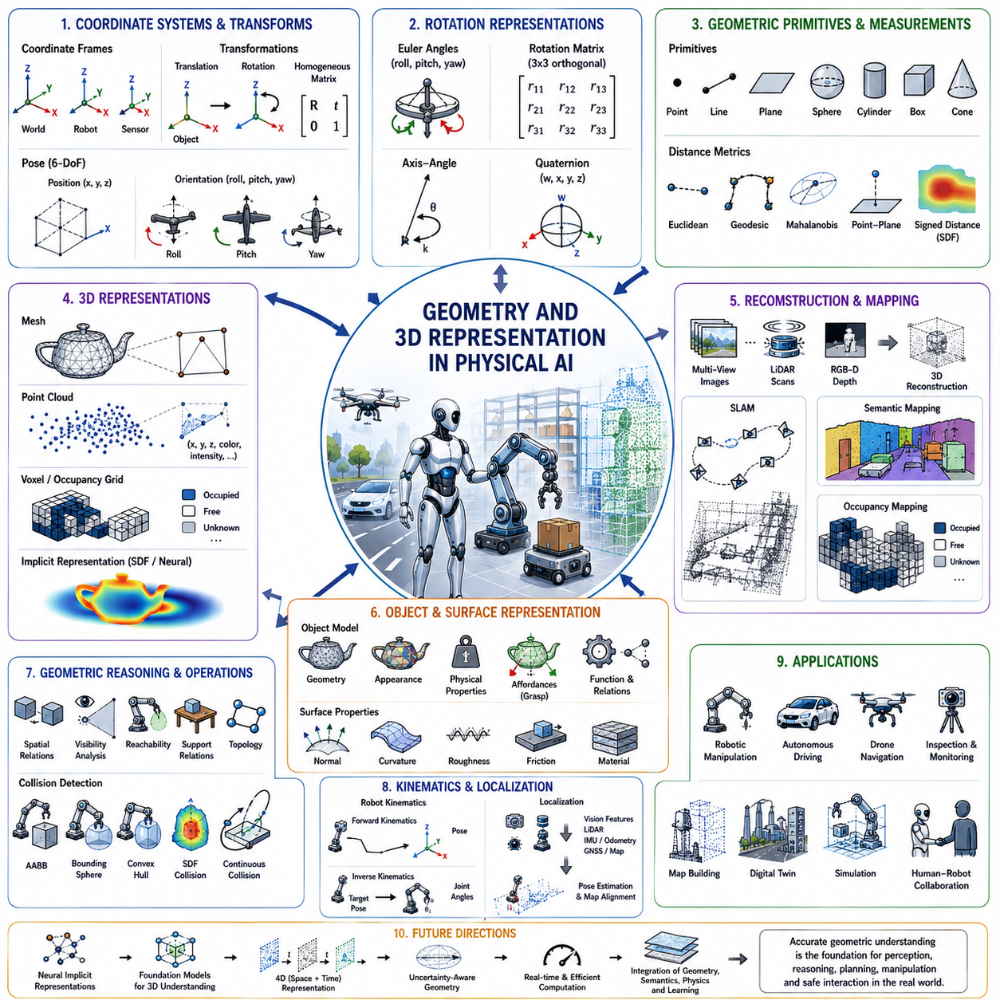
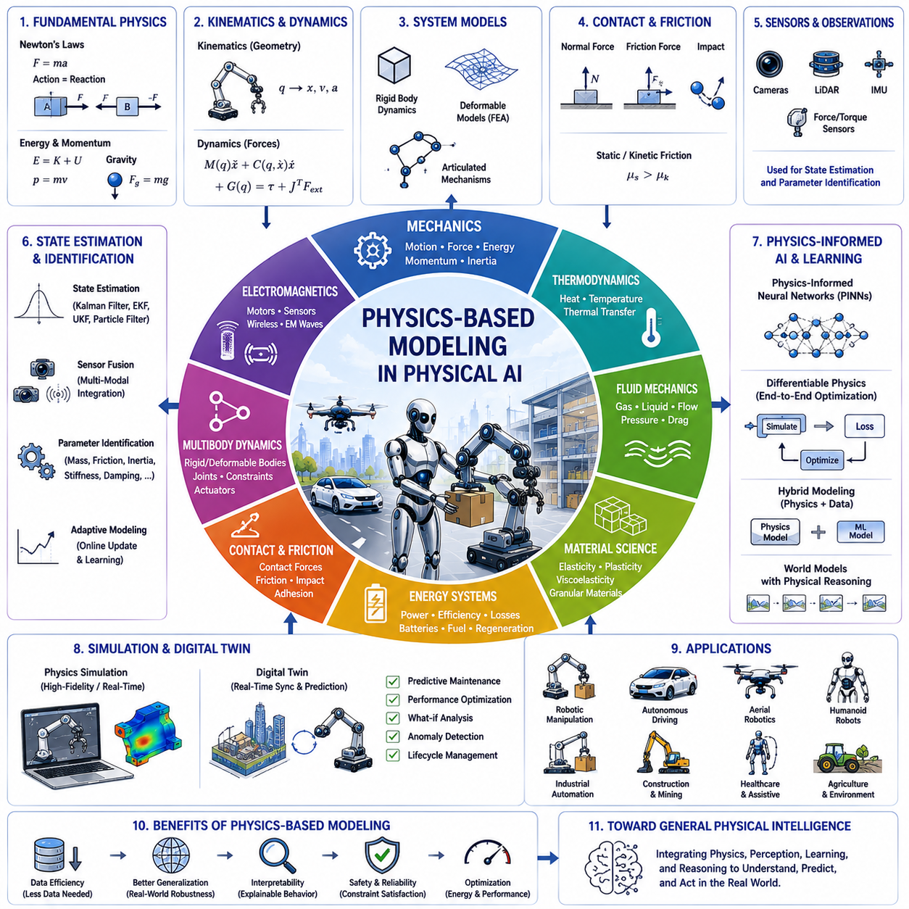
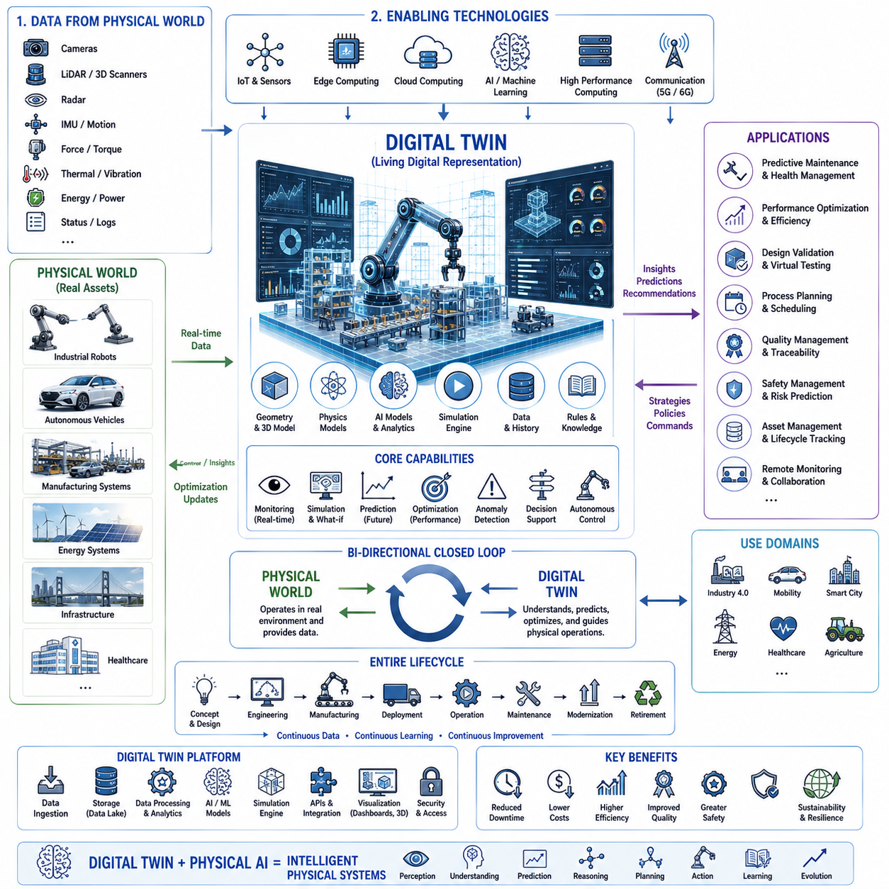
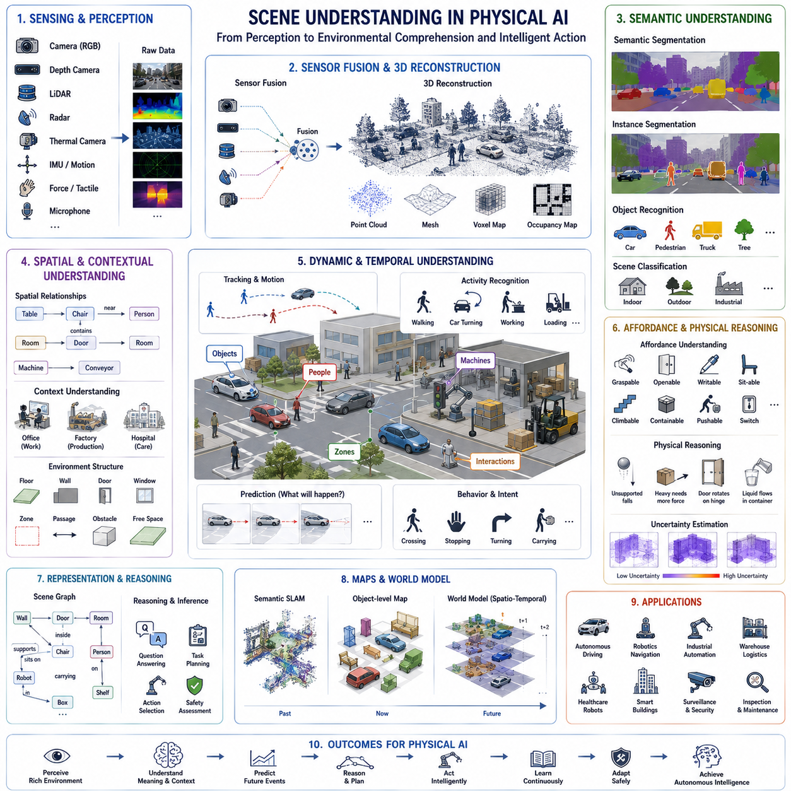
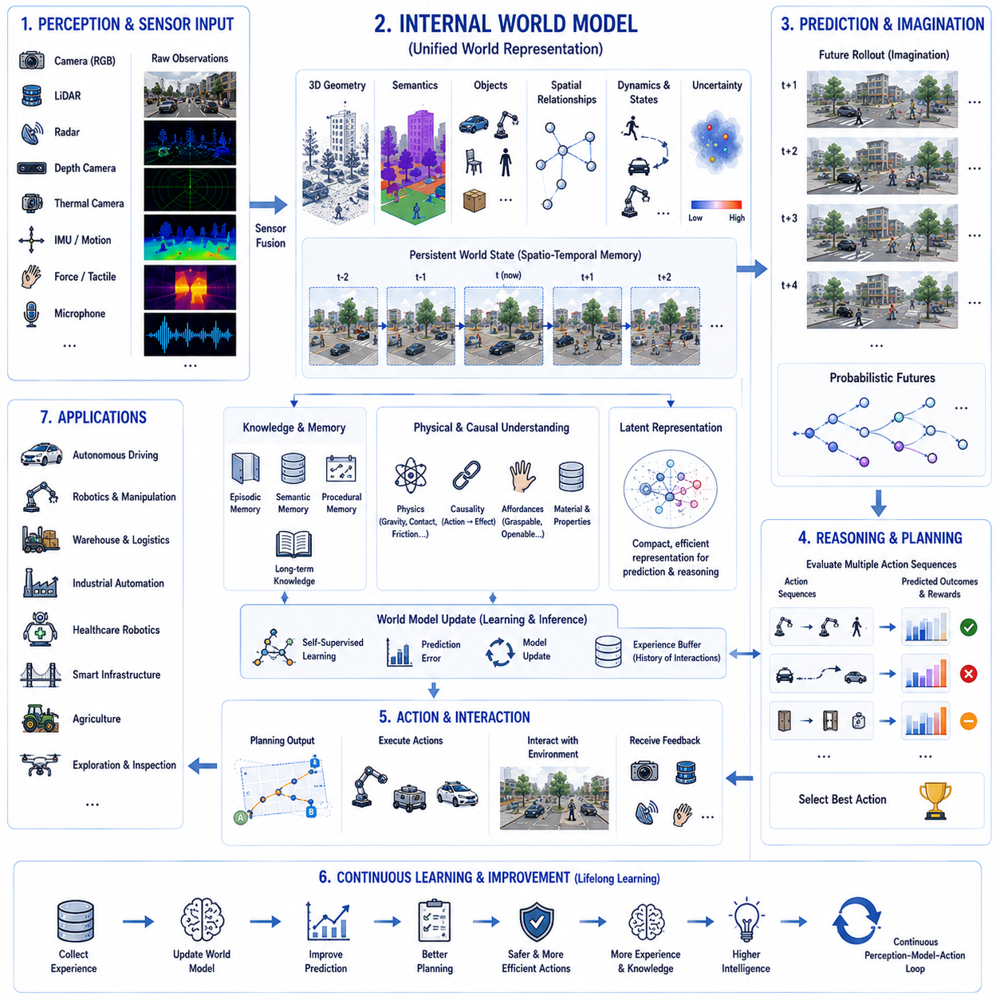
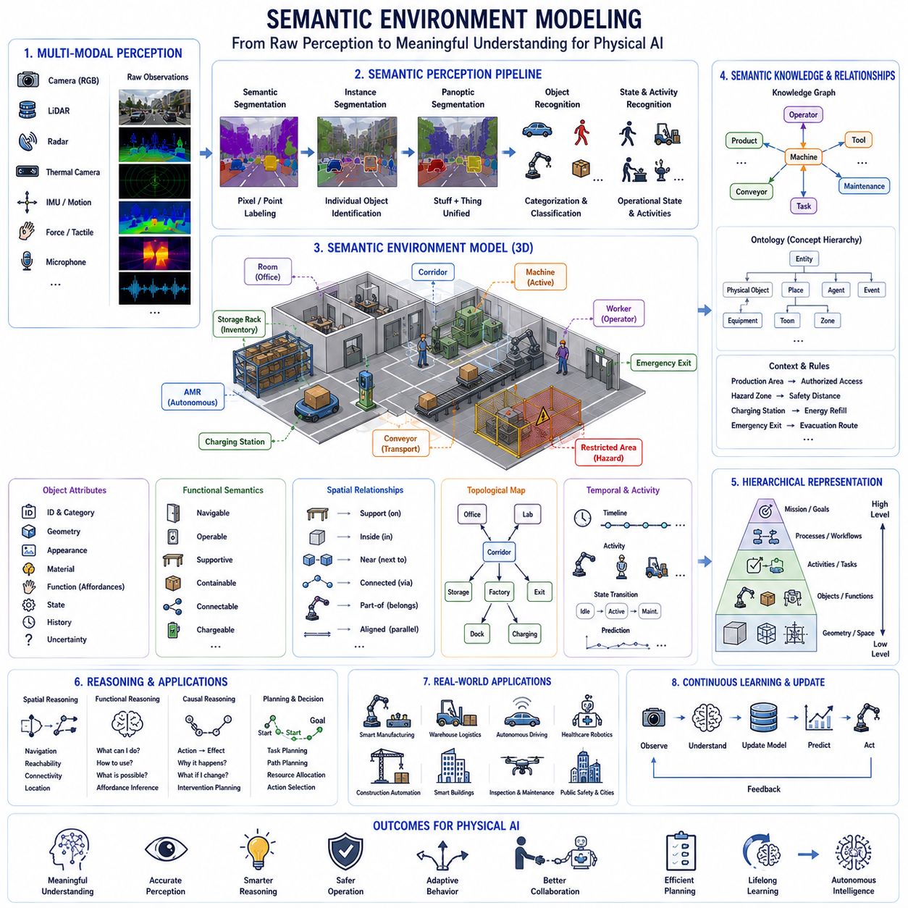
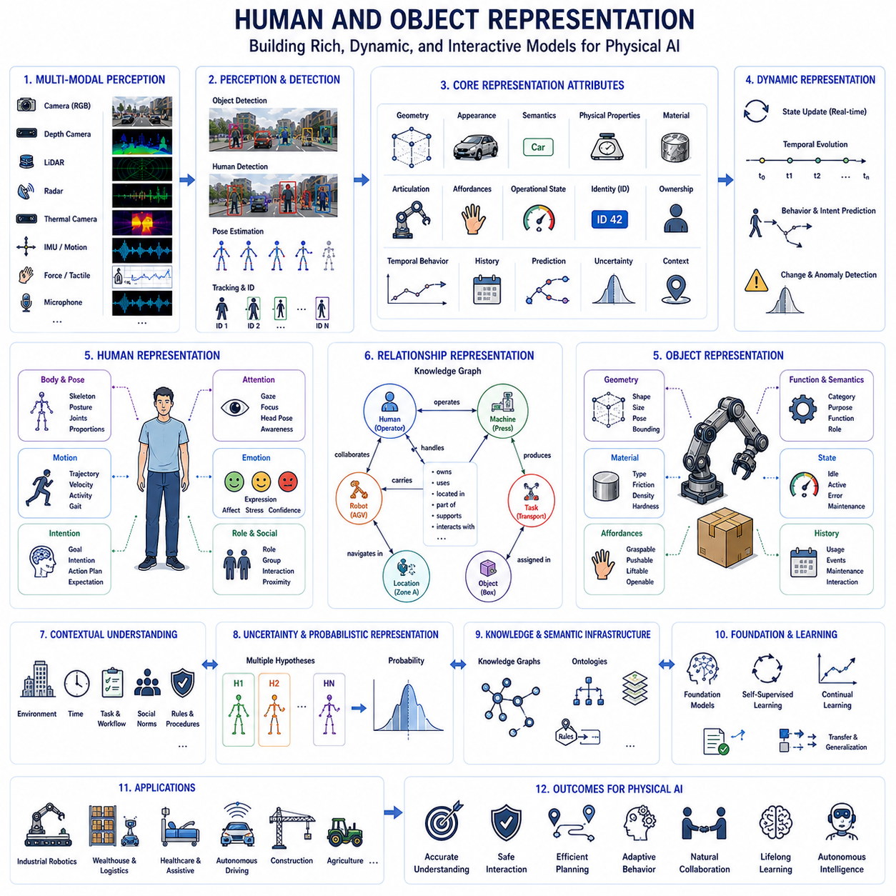
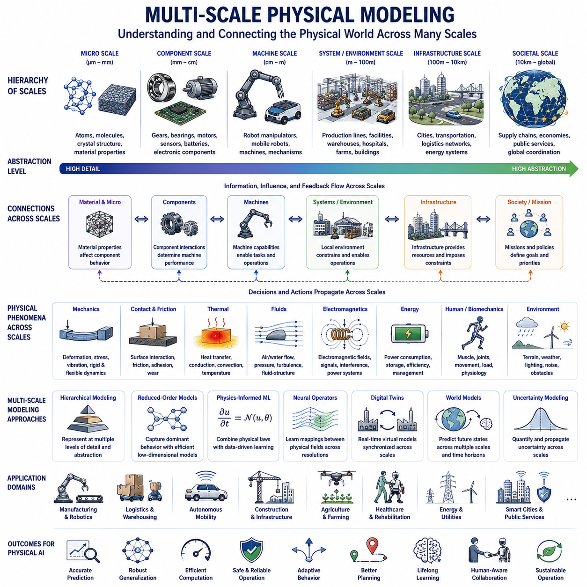

**Physical AI Engineering**

# Chapter 02 Physical World Modeling 

## 02-01 Geometry and 3D Representation

{width="7.268055555555556in" height="7.268055555555556in"}

기하학(Geometry)과 3차원 표현(Three-Dimensional Representation)은 **Physical AI(Physical AI)** 의 가장 근본적인 수학적·계산적 기반을 형성한다. 실제 세계에서 동작하는 모든 지능형 기계(Intelligent Machines)는 단순히 물체의 존재만을 인식하는 것이 아니라, 물체의 정확한 위치(Position), 자세(Orientation), 크기(Size), 형태(Shape), 그리고 주변 물체와의 공간적 관계(Spatial Relationships)까지 이해해야 한다. 기존의 인공지능이 주로 기호(Symbols)나 2차원 이미지(2D Images)를 처리하였다면, Physical AI는 실제 물리 세계에서 끊임없이 변화하는 3차원 환경을 이해하고 상호작용해야 한다. 로봇이 물체를 집거나, 자율주행 차량이 도로를 주행하거나, 드론이 장애물을 회피하거나, 산업용 로봇이 정밀 조립을 수행하는 모든 과정은 정확한 기하학적 이해를 기반으로 이루어진다. 따라서 기하학은 단순한 보조 기술이 아니라 Physical AI의 핵심적인 인지 능력(Cognitive Capability) 가운데 하나이다.

현실 세계는 본질적으로 3차원 공간으로 구성되어 있다. 모든 물체는 일정한 부피(Volume)를 가지며, 특정 위치와 방향을 유지하고, 주변 물체와 다양한 공간적 관계를 형성한다. 사람은 시각(Vision), 촉각(Touch), 균형 감각(Balance), 움직임(Motion)을 통해 이러한 공간 정보를 자연스럽게 이해한다. 반면 Physical AI는 센서 데이터와 수학적 모델(Mathematical Models), 그리고 계산 알고리즘(Computational Algorithms)을 이용하여 동일한 수준의 공간 이해를 수행해야 한다. 따라서 3차원 표현은 자율 시스템이 현실 세계를 이해하고 지능적인 행동을 수행하기 위한 공통 언어(Common Language)가 된다.

기하학의 가장 기본이 되는 개념은 좌표계(Coordinate System)이다. 좌표계는 공간상의 위치를 수학적으로 표현하기 위한 기준을 제공한다. 가장 널리 사용되는 방식은 직교 좌표계(Cartesian Coordinate System)이며, X축, Y축, Z축으로 구성된다. 공간의 모든 점(Point)은 세 개의 좌표값으로 표현되며, 이를 통해 거리 계산(Distance Computation), 충돌 검사(Collision Detection), 경로 계획(Path Planning), 위치 추정(Localization) 등 다양한 계산이 가능해진다. 이러한 이유로 직교 좌표계는 로보틱스(Robotics)와 Physical AI에서 가장 기본적인 공간 표현 방법으로 사용된다.

하나의 Physical AI 시스템에는 여러 개의 좌표계가 동시에 존재한다. 월드 좌표계(World Coordinate Frame)는 전체 환경을 표현하는 기준이며, 로봇 좌표계(Robot Coordinate Frame)는 로봇 자체를 기준으로 한다. 카메라(Camera), 라이다(LiDAR), 레이더(Radar), IMU(Inertial Measurement Unit)와 같은 센서들은 각각 자신의 센서 좌표계(Sensor Coordinate Frame)를 가진다. 또한 매니퓰레이터(Manipulator)는 관절 좌표계(Joint Coordinate Frame)와 말단 장치(End Effector Coordinate Frame)를 가지며, 작업 대상 물체 역시 자신의 객체 좌표계(Object Coordinate Frame)를 가진다. 이러한 다양한 좌표계를 정확하게 변환(Coordinate Transformation)하는 능력은 센서 융합(Sensor Fusion), 조작(Manipulation), 이동(Navigation), 협업 인식(Cooperative Perception)의 핵심이 된다.

좌표 변환(Coordinate Transformation)은 Physical AI에서 가장 중요한 수학적 연산 가운데 하나이다. 각각의 센서는 서로 다른 위치와 방향에서 환경을 관측하기 때문에, 모든 데이터를 동일한 기준 좌표계로 변환해야 한다. 평행 이동(Translation)은 좌표 원점을 이동시키며, 회전(Rotation)은 좌표계의 방향을 변경한다. 동차 변환 행렬(Homogeneous Transformation Matrix)은 평행 이동과 회전을 하나의 행렬로 표현하여 복잡한 좌표 변환을 효율적으로 수행할 수 있도록 한다. 현대의 로봇 시스템은 매초 수천 번 이상의 좌표 변환을 수행하면서도 전체 시스템의 공간적 일관성(Geometric Consistency)을 유지한다.

강체 변환(Rigid Body Transformation)은 물체의 형태를 유지한 채 공간에서 이동하는 운동을 의미한다. 모든 강체(Rigid Body)는 6자유도(6 Degrees of Freedom, 6-DoF)를 가진다. 여기에는 X, Y, Z 방향의 이동(Translation) 3개와 Roll, Pitch, Yaw 방향의 회전(Rotation) 3개가 포함된다. 이 여섯 개의 값이 물체의 자세(Pose)를 완전히 정의한다. 따라서 자세 추정(Pose Estimation)은 Physical AI에서 가장 중요한 계산 문제 가운데 하나이며, 이동, 조작, 검사, 인간-로봇 협업 등 거의 모든 작업의 기반이 된다.

3차원 회전(Rotation)은 위치보다 훨씬 복잡한 표현이 필요하다. 오일러 각(Euler Angles)은 Roll, Pitch, Yaw로 직관적인 표현이 가능하지만 짐벌락(Gimbal Lock)이라는 특이점(Singularity) 문제가 존재한다. 회전 행렬(Rotation Matrix)은 이러한 문제를 해결하면서도 수학적으로 안정적인 회전을 표현한다. 축-각 표현(Axis-Angle Representation)은 임의의 축을 기준으로 한 회전을 표현하며, 쿼터니언(Quaternion)은 연속적인 회전 계산과 센서 융합에서 매우 안정적인 표현 방식을 제공한다. 이러한 이유로 현대의 Physical AI에서는 쿼터니언이 가장 널리 사용되는 회전 표현 방식이 되었다.

거리 계산(Distance Measurement)은 기하학에서 가장 기본적인 연산이다. 유클리드 거리(Euclidean Distance)는 두 점 사이의 직선 거리를 계산하며, 측지 거리(Geodesic Distance)는 곡면을 따라 이동하는 최단 거리를 계산한다. 마할라노비스 거리(Mahalanobis Distance)는 확률적인 불확실성(Uncertainty)을 함께 고려하며, 점-평면 거리(Point-to-Plane Distance), 부호 거리 함수(Signed Distance Function)는 충돌 검사와 최적화에서 널리 활용된다. 자율주행, 장애물 회피, 조작, 경로 계획과 같은 거의 모든 자율 행동은 이러한 거리 계산을 기반으로 한다.

기하학적 기본 요소(Geometric Primitives)는 복잡한 물체를 단순한 형태로 표현하기 위한 수학적 모델이다. 점(Point), 선(Line), 평면(Plane), 원(Circle), 원통(Cylinder), 구(Sphere), 박스(Box), 원뿔(Cone), 다각형(Polygon)은 다양한 산업용 물체를 효율적으로 근사(Approximation)할 수 있으며, 충돌 검사와 공간 추론을 빠르게 수행할 수 있도록 한다.

복잡한 물체는 일반적으로 메시(Mesh)로 표현된다. 폴리곤 메시(Polygon Mesh)는 정점(Vertex), 모서리(Edge), 삼각형 또는 사각형 면(Face)으로 구성되며, 복잡한 물체의 표면을 매우 정밀하게 표현할 수 있다. 메시는 시각화(Visualization), 시뮬레이션(Simulation), 제조(Manufacturing), 디지털 트윈(Digital Twin)에 널리 사용된다. 각 면에는 법선 벡터(Surface Normal)가 존재하며, 이는 조명 계산, 접촉 계산(Contact Estimation), 파지 계획(Grasp Planning)에 활용된다. 메시 단순화(Mesh Simplification)는 계산량을 줄이면서도 중요한 형상을 유지하는 기술이다.

점군(Point Cloud)은 Physical AI에서 가장 많이 사용되는 3차원 표현 방식 가운데 하나이다. 점군은 메시처럼 면 정보를 가지지 않고 단순히 수많은 공간상의 점으로 구성된다. 라이다, 깊이 카메라(Depth Camera), 구조광 카메라(Structured Light Camera), 스테레오 비전(Stereo Vision)이 생성하는 데이터는 대부분 점군 형태이다. 각 점은 위치뿐 아니라 색상(Color), 반사 강도(Intensity), 반사율(Reflectivity), 의미 정보(Semantic Labels), 시간 정보(Timestamps), 불확실성(Uncertainty) 등을 함께 포함할 수 있다. 점군은 실제 환경을 매우 자연스럽게 표현하기 때문에 지도 작성(Mapping), 검사(Inspection), 자율주행(Navigation), 건설(Building Information Modeling) 등에서 널리 사용된다.

점군 처리(Point Cloud Processing)는 현대 Physical AI의 중요한 연구 분야이다. 필터링(Filtering)은 센서 잡음을 제거하고, 다운샘플링(Downsampling)은 계산량을 줄인다. 법선 추정(Normal Estimation)은 표면 방향을 계산하며, 클러스터링(Clustering)은 서로 다른 물체를 분리한다. 등록(Registration)은 여러 점군을 하나의 좌표계로 정렬하고, 분할(Segmentation)은 장면(Scene)을 의미 있는 부분으로 나눈다. 최근에는 점군 전용 딥러닝(Point Cloud Deep Learning)이 발전하면서 원시 점군(Raw Point Clouds)만으로도 의미 정보를 추출할 수 있게 되었다.

복셀(Voxel)은 3차원 공간을 작은 정육면체(Cell)로 나누어 표현하는 방법이다. 이는 2차원의 픽셀(Pixel)을 3차원으로 확장한 개념이다. 각 복셀에는 점유 여부(Occupancy), 의미 정보(Semantics), 확률(Probability), 재료(Material Properties) 등의 정보를 저장할 수 있다. 점유 격자(Occupancy Grid)는 공간을 자유 공간(Free Space), 점유 공간(Occupied Space), 미확인 공간(Unknown Space)으로 구분하여 자율주행과 경로 계획에서 널리 사용된다. 희소 복셀(Sparse Voxels)은 실제 데이터가 존재하는 부분만 저장하여 메모리 사용량을 크게 줄인다.

점유 지도(Occupancy Mapping)는 복셀을 확률적으로 표현하는 방법이다. 각 공간 셀(Cell)은 단순히 점유 여부만 가지는 것이 아니라 해당 위치에 물체가 존재할 확률(Occupancy Probability)을 저장한다. 새로운 센서 데이터가 들어올 때마다 베이즈 업데이트(Bayesian Update)를 수행하여 지도를 지속적으로 개선한다. 동적 점유 지도(Dynamic Occupancy Maps)는 이동하는 차량, 사람, 로봇까지 함께 표현하여 변화하는 환경에서도 안정적인 자율주행을 지원한다.

암시적 표현(Implicit Representation)은 최근 매우 주목받는 3차원 표현 방식이다. 기존의 메시나 점군처럼 표면을 직접 저장하는 대신, 수학적 함수(Mathematical Function)를 이용하여 표면을 표현한다. 대표적인 예가 부호 거리 함수(Signed Distance Function, SDF)이다. SDF는 공간의 모든 위치에서 가장 가까운 표면까지의 거리를 저장하며, 물체 내부와 외부를 동시에 표현한다. 최근에는 신경망을 이용한 암시적 표현(Neural Implicit Representation)이 등장하여 매우 복잡한 형상을 적은 메모리로 표현할 수 있게 되었다. 또한 NeRF(Neural Radiance Fields)와 Gaussian Splatting은 기하학뿐 아니라 색상과 조명까지 함께 표현할 수 있는 최신 기술이다.

3차원 재구성(3D Reconstruction)은 여러 센서 관측을 이용하여 하나의 일관된 환경 모델을 생성하는 기술이다. Structure-from-Motion(SfM)은 여러 장의 이미지로 카메라 위치와 희소한 3차원 구조를 계산한다. Multi-View Stereo(MVS)는 밀집(Dense) 표면을 생성하며, RGB-D 재구성은 컬러와 깊이 정보를 동시에 활용한다. LiDAR Mapping은 반복적인 스캔을 통합하여 대규모 환경 지도를 구축한다. SLAM(Simultaneous Localization and Mapping)은 위치 추정과 지도 생성을 동시에 수행하며, 최근에는 딥러닝과 확률 기반 최적화를 결합하여 더욱 강인한 성능을 제공하고 있다.

장면 표현(Scene Representation)은 단순한 기하학을 넘어 의미 정보까지 포함한다. 의미 지도(Semantic Mapping)는 벽(Walls), 문(Doors), 가구(Furniture), 차량(Vehicles), 기계(Machinery), 식물(Vegetation), 사람(People) 등을 각각 구분하여 표현한다. 인스턴스 표현(Instance Representation)은 동일한 종류의 물체도 개별 객체로 구분하며, 파놉틱 장면 이해(Panoptic Scene Understanding)는 의미 분할과 인스턴스 분할을 동시에 수행한다. 이러한 의미 기반 기하학은 경로 계획, 조작 계획, 작업 계획(Task Planning)에 중요한 정보를 제공한다.

Physical AI에서 객체 표현(Object Representation)은 단순히 형태만을 의미하지 않는다. 미래의 시스템은 물체의 형상, 질감(Appearance), 질량 분포(Mass Distribution), 재료(Material Properties), 마찰 계수(Friction Coefficients), 변형 특성(Deformability), 파지 가능성(Grasp Affordances), 기능(Functionality), 상호작용 이력(Interaction History)까지 포함하는 종합적인 객체 모델을 유지하게 된다.

표면 표현(Surface Representation)은 로봇 조작에서 매우 중요하다. 실제 조작은 대부분 표면과의 접촉(Contact)을 통해 이루어진다. 표면 곡률(Curvature)은 파지 안정성을 결정하고, 표면 거칠기(Roughness)는 마찰을 결정하며, 법선 벡터(Normal Vector)는 힘 전달 방향을 계산한다. 따라서 고정밀 표면 모델은 조립, 수술 로봇, 검사 시스템에서 매우 중요한 역할을 한다.

기하학적 추론(Geometric Reasoning)은 단순한 공간 표현을 넘어 물체 간의 관계를 이해하는 과정이다. 상대 위치(Relative Position), 가시성 분석(Visibility Analysis), 도달 가능성(Reachability), 포함 관계(Containment), 지지 관계(Support Relationships), 위상 관계(Topological Relationships)는 모두 자율 계획과 작업 수행에서 중요한 정보가 된다.

충돌 검사(Collision Detection)는 Physical AI에서 가장 많은 계산이 필요한 작업 가운데 하나이다. 로봇은 자신의 몸체, 주변 사람, 장애물, 작업 대상과의 충돌 가능성을 지속적으로 계산해야 한다. 경계 상자(Bounding Boxes), 경계 구(Bounding Spheres), 볼록 껍질(Convex Hulls), 부호 거리 함수(Signed Distance Fields), 공간 계층 구조(Bounding Volume Hierarchies)는 충돌 검사를 빠르게 수행하기 위한 대표적인 방법이다.

계산 기하학(Computational Geometry)은 다양한 공간 알고리즘을 제공한다. 볼록 껍질(Convex Hull)은 최소 외곽 형상을 계산하고, 들로네 삼각분할(Delaunay Triangulation)은 안정적인 메시를 생성한다. 보로노이 다이어그램(Voronoi Diagram)은 최근접 영역을 계산하며, KD-Tree, Octree, R-Tree는 최근접 탐색(Nearest Neighbor Search), 등록(Registration), 충돌 검사, 지도 검색을 매우 빠르게 수행할 수 있도록 한다.

기하학은 로봇 운동학(Kinematics)의 기반이기도 하다. 순기구학(Forward Kinematics)은 관절 각도(Joint Angles)로부터 말단 위치를 계산하며, 역기구학(Inverse Kinematics)은 원하는 위치를 달성하기 위한 관절 값을 계산한다. 자코비안 행렬(Jacobian Matrix)은 관절 속도와 말단 속도의 관계를 나타내며, 힘 제어(Force Control), 특이점 회피(Singularity Avoidance), 전신 제어(Whole-Body Coordination)에 활용된다.

위치 추정(Localization)은 기하학적 일관성(Geometric Consistency)에 크게 의존한다. 자율 시스템은 영상 특징(Image Features), LiDAR 스캔, GNSS(Global Navigation Satellite System), IMU, 휠 오도메트리(Wheel Odometry), 기존 지도(Map Information)를 이용하여 자신의 위치를 계산한다. ICP(Iterative Closest Point), NDT(Normal Distributions Transform), 특징 기반 정합(Feature-Based Registration)은 현재 센서 데이터를 기존 지도와 정렬하는 대표적인 알고리즘이다.

디지털 트윈(Digital Twin)은 정확한 3차원 기하학을 기반으로 한다. 현실의 장비와 동일한 기하 구조를 유지하면서 예지보전, 원격 모니터링(Remote Monitoring), 운영 최적화, 검사 계획, 생애주기 관리(Lifecycle Management)를 수행한다. 현실에서 발생한 변화는 즉시 디지털 트윈에 반영되며, 가상 공간에서 검증된 결과는 다시 실제 시스템으로 전달된다.

시뮬레이션(Simulation) 역시 정밀한 3차원 표현 없이는 구현될 수 없다. 물리 엔진(Physics Engine)은 충돌, 접촉, 강체 운동, 연성체 변형, 유체 상호작용을 모두 기하학적 모델을 기반으로 계산한다. 따라서 정확한 기하 모델은 Simulation-to-Reality(Sim-to-Real) 성능을 향상시키는 핵심 요소가 된다.

미래의 3차원 표현은 기존의 메시(Mesh), 점군(Point Clouds), 복셀(Voxels), 점유 지도(Occupancy Grids)뿐 아니라 신경망 기반 암시적 표현(Neural Implicit Representation), 미분 가능 렌더링(Differentiable Rendering), 월드 모델(World Models), 기반 모델(Foundation Models)과 결합될 것이다. 또한 기하학적 정보뿐 아니라 의미 정보(Semantics), 물리적 특성(Physical Properties), 시간 변화(Temporal Dynamics), 불확실성(Uncertainty)을 하나의 통합된 공간 표현으로 관리하는 방향으로 발전하게 될 것이다.

궁극적으로 **기하학(Geometry)** 과 **3차원 표현(3D Representation)** 은 단순히 공간을 표현하는 수학적 기법이 아니다. 그것은 Physical AI가 환경을 인식하고, 센서 데이터를 이해하며, 물체 간의 관계를 해석하고, 물리적 상호작용을 예측하며, 안전한 이동과 정밀한 조작을 수행하고, 사람과 협력하며, 현실 세계를 지속적으로 학습하기 위한 **공간 지능(Spatial Intelligence)** 의 핵심 언어이다. 미래의 **Artificial General Physical Intelligence(AGPI)** 역시 이러한 기하학적 이해를 기반으로 현실 세계를 인식하고 행동하게 될 것이며, Geometry와 3D Representation은 그 가장 중요한 기술적 토대가 될 것이다.

## 02-02 Physics-Based Modeling

{width="7.268055555555556in" height="7.268055555555556in"}

물리 기반 모델링(Physics-Based Modeling)은 **Physical AI(Physical AI)** 의 가장 중요한 과학적 기반 가운데 하나이다. 모든 지능형 기계(Intelligent Machines)는 궁극적으로 변하지 않는 물리 법칙(Laws of Physics)의 지배를 받으며 동작하기 때문이다. 기존의 인공지능(Artificial Intelligence)은 주로 디지털 정보(Digital Information)의 패턴을 인식하는 데 초점을 맞추었다면, Physical AI는 역학(Mechanics), 동역학(Dynamics), 열역학(Thermodynamics), 전자기학(Electromagnetics), 유체역학(Fluid Mechanics), 재료과학(Material Science), 에너지 전달(Energy Transfer)과 같은 다양한 물리 현상을 이해하고 예측하며 실제 환경과 상호작용해야 한다. 로봇의 모든 움직임, 모든 조작(Manipulation), 자율주행(Autonomous Navigation), 그리고 사람 및 주변 환경과의 상호작용은 모두 물리 법칙의 영향을 받는다. 따라서 물리 기반 모델링은 단순한 시뮬레이션 기법이 아니라, 인공지능이 인과관계(Cause and Effect)를 이해하고, 미래 상태(Future States)를 예측하며, 행동을 최적화하고, 실제 환경과 안전하게 상호작용하기 위한 핵심적인 인지 프레임워크(Cognitive Framework)이다.

순수한 데이터 기반 AI(Data-Driven AI)가 대규모 데이터셋으로부터 통계적 관계(Statistical Relationships)를 학습하는 것과 달리, 물리 기반 모델링은 과학적 지식(Scientific Knowledge)을 모델 내부에 직접 포함한다. 환경을 알 수 없는 블랙박스(Black Box)로 취급하는 대신 중력(Gravity), 마찰(Friction), 관성(Inertia), 운동량(Momentum), 힘 전달(Force Transmission), 접촉 역학(Contact Mechanics), 변형(Deformation), 에너지 소비(Energy Consumption), 환경 상호작용(Environmental Interaction)을 명시적으로 모델링한다. 이러한 물리 모델은 강력한 사전 지식(Prior Knowledge)을 제공하여 예측 정확도를 높이고, 데이터 요구량을 줄이며, 모델의 해석 가능성(Interpretability)과 일반화 성능(Generalization)을 향상시킨다.

물리 기반 모델링의 중요성은 로봇 조작(Robotic Manipulation)에서 가장 쉽게 확인할 수 있다. 로봇 팔(Robotic Arm)은 단순히 물체를 밀면 움직인다는 사실만 학습하는 것이 아니라, 질량 분포(Mass Distribution)가 가속도(Acceleration)에 어떤 영향을 미치는지, 마찰이 미끄러짐(Sliding Motion)을 어떻게 결정하는지, 중력이 평형 상태(Equilibrium)를 어떻게 유지하는지, 접촉력이 기계 구조를 통해 어떻게 전달되는지, 그리고 물체의 형상이 파지 안정성(Grasp Stability)에 어떤 영향을 미치는지를 이해해야 한다. 자율주행 차량 역시 타이어와 노면(Tire-Ground Interaction), 제동 특성(Braking Dynamics), 조향 특성(Steering Behavior), 서스펜션 응답(Suspension Response), 공기역학적 힘(Aerodynamic Forces), 노면 상태(Road Surface Conditions)를 예측해야 한다. 드론은 중력, 바람(Wind Disturbances), 프로펠러 추력(Rotor Thrust), 관성 효과(Inertial Effects), 공기 저항(Aerodynamic Drag)을 지속적으로 보상한다. 이러한 사례들은 지능적인 행동이 단순한 정보 처리만이 아니라 물리 법칙에 대한 이해를 기반으로 한다는 점을 보여준다.

물리 기반 모델링의 가장 기본은 고전역학(Classical Mechanics)이다. 뉴턴 역학(Newtonian Mechanics)은 뉴턴의 운동 법칙(Newton\'s Laws of Motion)을 이용하여 물체의 움직임을 설명한다. 제1법칙은 외력이 작용하지 않으면 물체는 현재의 운동 상태를 유지한다는 관성의 법칙(Law of Inertia)이다. 제2법칙은 힘(Force), 질량(Mass), 가속도(Acceleration)의 관계를 정의하며 로봇 운동의 기본 방정식이 된다. 제3법칙은 작용과 반작용(Action-Reaction)의 관계를 설명하며, 로봇 액추에이터가 생성한 힘이 주변 환경에 어떤 영향을 미치는지를 이해하는 기반이 된다. 이러한 원리는 오늘날 거의 모든 물리 시뮬레이션과 로봇 제어 시스템의 기초가 된다.

운동학(Kinematics)과 동역학(Dynamics)은 물리 모델링의 두 가지 핵심 관점이다. 운동학은 힘을 고려하지 않고 위치(Position), 속도(Velocity), 가속도(Acceleration), 궤적(Trajectory)과 같은 움직임 자체를 분석한다. 순기구학(Forward Kinematics)은 관절 각도(Joint Configuration)로부터 말단 장치(End Effector)의 위치를 계산하며, 역기구학(Inverse Kinematics)은 원하는 위치를 달성하기 위한 관절 값을 계산한다. 반면 동역학은 힘, 토크(Torque), 관성, 운동량, 에너지까지 포함하여 실제 움직임을 계산한다. 동역학 모델은 액추에이터가 실제 환경에서 어떻게 움직임을 생성하는지를 예측하며 제어(Control), 계획(Planning), 최적화(Optimization), 시뮬레이션(Simulation)의 핵심이 된다.

강체 동역학(Rigid Body Dynamics)은 Physical AI에서 가장 널리 사용되는 물리 모델 가운데 하나이다. 산업용 로봇, 자율주행 차량, 이동 로봇(Mobile Robots), 건설 장비, 드론과 같은 대부분의 시스템은 여러 개의 강체(Rigid Bodies)가 관절(Joints)과 액추에이터(Actuators)로 연결된 구조로 근사할 수 있다. 강체 모델은 구조 변형을 무시함으로써 계산을 단순화하면서도 병진 운동(Translation)과 회전 운동(Rotation)을 정확하게 표현한다. 각 강체는 6자유도(6 Degrees of Freedom)를 가지며, 운동 방정식은 외력과 토크를 이용하여 미래의 움직임을 계산한다. 이러한 모델은 실시간 제어, 디지털 트윈(Digital Twin), Simulation-to-Reality(Sim-to-Real), 자율 계획에서 핵심적인 역할을 수행한다.

그러나 모든 시스템이 강체는 아니다. 소프트 로보틱스(Soft Robotics), 생체 조직(Biological Tissues), 유연한 케이블(Flexible Cables), 의류(Clothing), 농산물(Agricultural Products), 고무와 같은 재료는 변형 가능한 물체(Deformable Bodies)로 모델링해야 한다. 이러한 시스템에서는 탄성(Elasticity), 응력(Stress), 변형률(Strain), 감쇠(Damping), 비선형 재료 특성(Nonlinear Constitutive Relationships)이 매우 중요하다. 유한요소해석(Finite Element Analysis, FEA)은 연속체를 작은 요소(Element)로 분할하여 매우 높은 정확도로 구조 변형을 계산하는 대표적인 방법이며, 수술 로봇(Surgical Robotics), 소프트 로봇, 웨어러블 로봇(Wearable Robotics), 바이오메디컬(Biomedical Engineering), 첨단 제조(Advanced Manufacturing)에서 널리 활용된다.

접촉 역학(Contact Mechanics)은 Physical AI에서 매우 중요한 요소이다. 대부분의 물리적 상호작용은 접촉(Contact)을 통해 이루어진다. 로봇이 물체를 잡거나, 차량이 도로를 주행하거나, 공구가 재료를 절삭하거나, 사람이 협동 로봇(Collaborative Robot)과 함께 작업하는 모든 과정에서 접촉력이 발생한다. 접촉 모델은 법선 힘(Normal Force), 접선 마찰(Tangential Friction), 충돌 응답(Collision Response), 구름 저항(Rolling Resistance), 표면 순응성(Surface Compliance), 접착력(Adhesion), 에너지 손실(Energy Dissipation)을 계산한다. 이러한 계산은 안정적인 파지, 정밀 조작, 조립 자동화(Assembly Automation), 보행 로봇, 충돌 회피 등에 필수적이다.

마찰 모델(Friction Modeling)은 모든 물리적 상호작용에 영향을 미치는 핵심 요소이다. 가장 기본적인 쿨롱 마찰(Coulomb Friction)은 정지 마찰(Static Friction)과 운동 마찰(Kinetic Friction)을 구분한다. 그러나 실제 환경에서는 속도 의존성(Velocity Dependence), 윤활(Lubrication), 온도 변화(Temperature Variation), 재료 마모(Material Wear), 표면 거칠기(Surface Roughness), 히스테리시스(Hysteresis)까지 함께 고려해야 한다. Sim-to-Real에서 가장 큰 오차 원인 가운데 하나가 마찰 모델의 부정확성인 경우가 많기 때문에, 적응형 마찰 추정(Adaptive Friction Estimation)과 온라인 파라미터 식별(Online Parameter Identification)은 매우 중요한 연구 분야가 되고 있다.

질량 특성(Mass Properties)은 동역학적 거동(Dynamic Behavior)을 결정하는 중요한 요소이다. 모든 물체는 질량(Mass), 무게 중심(Center of Gravity), 관성 모멘트(Moment of Inertia), 질량 분포(Mass Distribution)를 가진다. 이러한 값들은 가속, 회전, 균형 유지, 진동 응답을 결정한다. 로봇은 처음 보는 물체를 조작할 때 질량 특성을 추정해야 하며, 이동 로봇은 적재물(Payload)에 따라 차량의 안정성과 조향 특성이 달라지는 것을 지속적으로 보상해야 한다. 산업용 로봇 역시 말단 장치의 관성 변화를 고려하여 정밀 제어를 수행한다.

에너지 모델링(Energy Modeling)은 Physical AI의 또 다른 중요한 요소이다. 모든 자율 시스템은 에너지를 저장하고(Storage), 변환하며(Transformation), 소비하고(Dissipation), 유용한 작업(Useful Work)을 수행한다. 기계적 일(Mechanical Work), 전력(Electrical Power), 배터리(Battery), 열 손실(Thermal Loss), 회생 제동(Regenerative Braking), 액추에이터 효율(Actuator Efficiency), 유압 시스템(Hydraulic Systems), 연료 소비(Fuel Consumption)는 모두 시스템의 운용 능력에 영향을 미친다. 에너지 기반 계획(Energy-Aware Planning)은 배터리 용량을 고려하여 이동 경로를 최적화하고, 불필요한 가속을 줄이며, 충전 일정을 계획하고, 다양한 컴퓨팅 자원의 부하를 효율적으로 분산시킨다.

열역학(Thermodynamics)은 기계 시스템의 열적 거동(Thermal Behavior)을 설명한다. 전기 모터는 작동 중 열을 발생시키고, 배터리는 온도에 따라 성능이 달라지며, AI 프로세서는 과열을 방지하기 위한 열 관리(Thermal Management)가 필요하다. 제조 공정에서는 공구와 재료 사이에서 열 전달(Heat Transfer)이 발생하며, 기후 조건 역시 센서 성능과 배터리 효율에 영향을 미친다. 따라서 열 시뮬레이션(Thermal Simulation)은 냉각 시스템 설계(Cooling System Design), 예지보전(Predictive Maintenance), 에너지 최적화(Energy Optimization), 배터리 관리(Battery Management)의 핵심 기술이 된다.

유체역학(Fluid Mechanics)은 공기와 액체와 상호작용하는 시스템에서 필수적이다. 공기역학(Aerodynamics)은 항공기와 드론의 비행 특성을 결정하며, 유체역학(Hydrodynamics)은 수중 로봇(Underwater Robots), 선박(Marine Vessels), 해양 탐사 시스템에 적용된다. 또한 농업용 분무(Spray Robotics), 소방 로봇(Firefighting Robots), 파이프라인 검사(Pipeline Inspection), 화학 공정(Chemical Processing), 의료 시스템에서도 유체 모델이 활용된다. 전산 유체역학(Computational Fluid Dynamics, CFD)은 압력(Pressure), 속도(Velocity), 난류(Turbulence), 온도(Temperature), 유체-구조 상호작용(Fluid-Structure Interaction)을 수치적으로 계산하는 대표적인 방법이다.

전자기 모델링(Electromagnetic Modeling)은 눈에 잘 보이지 않지만 현대 Physical AI에서 매우 중요한 역할을 한다. 전기 모터는 전자기력을 이용하여 토크를 생성하며, 무선 통신(Wireless Communication)은 전자기파(Electromagnetic Waves)에 의존한다. 레이더(Radar)는 전파 반사를 이용하여 물체를 탐지하며, 무선 충전(Inductive Charging)은 자기장을 이용하여 에너지를 전달한다. 또한 전자기 간섭(Electromagnetic Interference)은 센서와 통신 시스템의 안정성에 큰 영향을 미치므로 전자기 시뮬레이션은 하드웨어 설계와 시스템 최적화에서 매우 중요하다.

재료 모델링(Material Modeling)은 로봇이 다양한 물질과 상호작용하기 위해 필요한 기술이다. 금속(Metals)은 탄성과 소성 변형(Plastic Deformation)을 가지며, 고분자(Polymers)는 점탄성(Viscoelasticity)을 나타낸다. 생체 조직은 매우 복잡한 비선형 특성을 가지며, 복합재(Composite Materials)는 여러 재료의 특성을 동시에 가진다. 모래, 토양, 곡물과 같은 입상 재료(Granular Materials)는 집단 거동(Collective Dynamics)을 보인다. 이러한 특성을 이해해야 로봇이 파지, 가공(Machining), 굴착(Excavation), 농업, 적층 제조(Additive Manufacturing), 사회기반시설 검사(Infrastructure Inspection)를 효과적으로 수행할 수 있다.

다물체 동역학(Multibody Dynamics)은 여러 개의 강체와 연성체가 연결된 복잡한 시스템을 모델링한다. 휴머노이드 로봇(Humanoid Robot)은 수십 개의 관절과 액추에이터를 포함하며, 건설 장비는 유압 시스템, 서스펜션, 회전 구조를 동시에 가진다. 스마트 공장(Smart Factory)은 컨베이어, 산업용 로봇, AMR, 협동 로봇이 함께 동작한다. 다물체 시뮬레이션은 이러한 복잡한 시스템 전체를 하나의 모델로 최적화할 수 있게 한다.

상태 추정(State Estimation)은 센서와 물리 모델을 결합하여 직접 측정할 수 없는 상태를 계산하는 기술이다. 칼만 필터(Kalman Filter)는 동적 예측과 센서 데이터를 결합하여 상태를 추정하며, 확장 칼만 필터(EKF), 무향 칼만 필터(UKF)는 비선형 시스템에 적용된다. 파티클 필터(Particle Filter)는 복잡한 확률 분포를 처리할 수 있으며, 팩터 그래프 최적화(Factor Graph Optimization)는 다양한 센서 정보를 통합하여 더욱 높은 정확도를 제공한다.

파라미터 식별(Parameter Identification)은 물리적 특성이 알려져 있지 않거나 시간이 지나면서 변화하는 경우를 해결하는 기술이다. 로봇은 새로운 적재물, 변화하는 노면, 기계 마모, 환경 변화에 지속적으로 적응해야 한다. 온라인 시스템 식별(Online System Identification)은 센서 데이터를 이용하여 질량, 마찰, 강성(Stiffness) 등의 물리 파라미터를 실시간으로 추정하며, 적응 제어(Adaptive Control)는 이를 이용하여 제어기를 자동으로 조정한다.

물리 기반 머신러닝(Physics-Informed Machine Learning)은 최근 가장 빠르게 발전하는 연구 분야 가운데 하나이다. 기존 신경망은 데이터만을 이용하여 입출력 관계를 학습하지만, 물리 기반 신경망(Physics-Informed Neural Networks, PINNs)은 미분방정식(Differential Equations), 보존 법칙(Conservation Laws), 경계 조건(Boundary Conditions)과 같은 물리 법칙을 학습 과정에 직접 포함한다. 그 결과 훨씬 적은 데이터만으로도 높은 정확도를 얻을 수 있으며, 물리적으로 일관된 예측을 수행할 수 있다.

미분 가능 물리(Differentiable Physics)는 물리 시뮬레이션 전체를 미분 가능한 형태로 구성하는 기술이다. 시뮬레이션 전체에서 그래디언트(Gradient)를 계산할 수 있기 때문에 로봇 설계(Robot Design), 제어 정책(Control Policies), 재료 파라미터(Material Parameters), 기계 구조(Mechanical Structures)를 직접 최적화할 수 있다. 강화학습, 경로 최적화(Trajectory Optimization), 시스템 식별, 역설계(Inverse Design) 모두 이러한 미분 가능 물리의 혜택을 받고 있다.

현대의 물리 엔진(Physics Engines)은 강체 동역학, 충돌 검사, 접촉 역학, 유체, 연성체, 입자 시스템(Particle Systems), 천(Cloth), 열 전달을 모두 통합하여 제공한다. 이러한 고충실도 시뮬레이션은 강화학습, 모방학습(Imitation Learning), 월드 모델(World Models) 학습을 지원하며, Sim-to-Real 성능을 크게 향상시킨다.

디지털 트윈(Digital Twin)은 물리 기반 모델링을 운영 단계까지 확장한다. 실제 시스템과 가상 모델은 지속적으로 동기화되며, 구조 피로(Structural Fatigue), 부품 열화(Component Degradation), 열 응력(Thermal Stress), 진동(Vibration), 마모(Wear), 윤활(Lubrication), 에너지 소비(Energy Consumption)를 지속적으로 예측한다. 센서 데이터와 물리 모델을 결합한 예지보전은 실제 고장이 발생하기 전에 이상을 발견할 수 있도록 지원한다.

Physical AI의 월드 모델(World Models) 역시 점점 더 명시적인 물리 추론(Physical Reasoning)을 포함하게 된다. 단순히 센서 데이터를 예측하는 것이 아니라, 물체의 운동(Motion), 충돌(Collision), 재료 상호작용(Material Interaction), 사람의 행동(Human Behavior), 환경 변화(Environmental Dynamics)를 물리 법칙에 기반하여 시뮬레이션한다. 이러한 물리 기반 월드 모델은 장기 계획(Long-Horizon Planning)과 위험 예측(Risk Prediction)의 핵심 기술이 된다.

인간-로봇 상호작용(Human-Robot Interaction) 역시 물리 기반 모델링의 혜택을 받는다. 협동 로봇은 사람이 어떻게 힘을 생성하고, 균형을 유지하며, 물체를 조작하는지를 예측해야 한다. 외골격 로봇(Exoskeleton)은 관절 토크(Joint Torque)와 생체역학(Biomechanics)을 계산하며, 재활 로봇(Rehabilitation Robots)은 환자의 근력과 피로도(Fatigue)에 맞추어 운동을 조절한다. 의수·의족(Prosthetic Devices)은 인체 근골격계(Musculoskeletal System)와 인공 구동계를 자연스럽게 연결해야 한다.

자율주행(Autonomous Driving) 역시 물리 기반 모델링 없이는 구현될 수 없다. 차량 동역학은 타이어-노면 마찰(Tire-Road Friction), 서스펜션(Suspension), 조향 응답(Steering Response), 제동력(Braking Forces), 공기 저항(Aerodynamic Drag), 도로 곡률(Road Curvature), 기상 조건(Weather Conditions), 적재 하중(Payload Distribution)에 의해 결정된다. 물리 기반 예측은 더욱 안전한 경로 계획과 차량 안정성 제어를 가능하게 한다.

미래에는 기존의 물리 시뮬레이션과 인공지능의 경계가 점차 사라질 것으로 예상된다. 기반 모델(Foundation Models)은 방대한 멀티모달 데이터를 학습하면서도 물리 법칙을 함께 이해하게 될 것이며, 월드 모델은 기하학(Geometry), 동역학(Dynamics), 의미 정보(Semantics), 불확실성(Uncertainty), 인과관계(Causality), 물리적 상호작용을 하나의 통합된 인지 모델로 결합하게 된다. 물리 기반 기반 모델(Physics-Informed Foundation Models)은 언어와 영상뿐 아니라 힘(Force), 에너지(Energy), 운동(Motion), 변형(Deformation), 재료(Material Behavior)까지 함께 이해하는 새로운 형태의 AI로 발전할 것이다.

궁극적으로 **물리 기반 모델링(Physics-Based Modeling)** 은 단순히 수치 시뮬레이션을 수행하기 위한 기술이 아니다. 그것은 현실 세계가 어떻게 움직이고 변화하는지를 설명하는 과학적 이해 자체이다. 운동(Motion), 힘(Force), 에너지(Energy), 물질(Matter), 상호작용(Interaction)에 대한 물리 법칙을 인공지능 내부에 통합함으로써, Physical AI는 행동하기 전에 결과를 예측하고(Predict Before Acting), 물리적 제약을 고려하여 최적의 행동을 계획하며(Physics-Constrained Planning), 센서 데이터를 인과적으로 해석하고(Causal Reasoning), 변화하는 환경에 안전하게 적응하며(Safe Adaptation), 사람과 자연스럽게 협력할 수 있게 된다. 미래의 **인공 일반 Physical Intelligence(Artificial General Physical Intelligence, AGPI)** 에서도 Physics-Based Modeling은 **과학적 지식(Scientific Knowledge)** 과 **계산 지능(Computational Intelligence)**, 그리고 **실제 물리 행동(Intelligent Physical Behavior)** 을 연결하는 가장 중요한 핵심 기술 가운데 하나로 자리매김하게 될 것이다.

## 02-03 Digital Twins

{width="7.268055555555556in" height="7.268055555555556in"}

디지털 트윈(Digital Twins)은 **Physical AI(Physical AI)** 의 발전을 이끄는 가장 혁신적인 기술 가운데 하나이다. 디지털 트윈은 현실 세계(Physical World)와 디지털 세계(Digital World)를 지속적으로 연결하는 지능형 가상 시스템(Intelligent Virtual System)을 구축한다. 기존의 컴퓨터 모델(Computer Models)이 한 번 생성된 이후 거의 변하지 않는 정적인 모델이었다면, 디지털 트윈은 실제 사물(Physical Assets), 기계(Machines), 로봇(Robots), 차량(Vehicles), 공장(Factories), 사회기반시설(Infrastructure), 심지어 도시(Cities) 전체를 실시간으로 반영하는 살아있는 계산 모델(Living Computational Model)이다. 현실 세계에서 지속적으로 데이터를 수집하여 자신의 내부 상태를 갱신하고, 미래를 예측하며, 의사결정을 지원하고, 물리 시스템의 전체 생애주기(Lifecycle)를 함께 관리한다. Physical AI에서 디지털 트윈은 센싱(Sensing), 시뮬레이션(Simulation), 인공지능(Artificial Intelligence), 물리 기반 모델링(Physics-Based Modeling), 클라우드 컴퓨팅(Cloud Computing), 자율 추론(Autonomous Reasoning)을 하나의 사이버-물리 시스템(Cyber-Physical System)으로 통합하는 핵심 기술이다. 이를 통해 지능형 기계는 자신이 동작하는 물리 환경을 이해하고 지속적으로 학습하며, 예측(Prediction), 최적화(Optimization), 적응(Adaptation), 자율 제어(Autonomous Control)를 수행할 수 있다.

디지털 트윈은 단순한 CAD(Computer-Aided Design) 모델이나 오프라인 시뮬레이션과는 근본적으로 다르다. CAD 모델은 기하학적 구조(Geometry)를 표현하고, 일반적인 시뮬레이션은 미리 정의된 조건에서 시스템의 동작을 분석한다. 반면 디지털 트윈은 센서 데이터(Sensor Data), 운영 이력(Operational History), 환경 정보(Environmental Information), 유지보수 기록(Maintenance Records), 예측 모델(Predictive Models)을 지속적으로 수집하여 실제 시스템과 항상 동기화(Synchronization)를 유지한다. 따라서 디지털 트윈은 설계 당시의 이상적인 상태를 표현하는 것이 아니라 현재 실제 시스템의 상태를 그대로 반영하는 살아있는 모델이 된다. 이러한 이유로 디지털 트윈은 설계(Design), 제조(Manufacturing), 구축(Deployment), 운영(Operation), 유지보수(Maintenance), 성능 개선(Modernization), 폐기(Retirement)에 이르는 전체 생애주기를 함께하는 지능형 동반자(Intelligent Companion)가 된다.

디지털 트윈이 가능해진 배경에는 여러 기술의 발전이 있다. 고성능 컴퓨팅(High-Performance Computing)은 복잡한 물리 시스템을 실시간으로 계산할 수 있도록 하였으며, 클라우드 컴퓨팅은 거의 무한한 저장 공간과 연산 능력을 제공한다. 엣지 컴퓨팅(Edge Computing)은 실제 장비 가까이에서 실시간 처리를 수행하며, 사물인터넷(IoT, Internet of Things)은 공장, 차량, 병원, 에너지 설비, 도시 곳곳에 설치된 센서를 통해 지속적으로 데이터를 수집한다. 인공지능은 이러한 방대한 데이터를 의미 있는 지식(Knowledge)으로 변환하고, 고속 통신망은 물리 시스템과 디지털 트윈 사이의 안정적인 데이터 교환을 지원한다. 이러한 기술들이 결합되면서 디지털 트윈은 지속적으로 운영되는 지능형 사이버-물리 생태계(Intelligent Cyber-Physical Ecosystem)가 되었다.

Physical AI에서 하나의 자율 시스템은 엄청난 양의 데이터를 생성한다. 카메라는 영상 정보를 제공하고, 라이다(LiDAR)는 3차원 공간을 측정하며, 레이더(Radar)는 물체의 움직임을 감지하고, IMU(Inertial Measurement Unit)는 자세와 움직임을 추정한다. 힘 센서(Force Sensors)는 접촉 상태를 측정하고, 열 센서(Thermal Sensors)는 온도 분포를 모니터링하며, 배터리 관리 시스템(Battery Management System)은 에너지 소비와 상태를 지속적으로 기록한다. 디지털 트윈은 이러한 서로 다른 센서 정보를 하나의 통합된 계산 모델로 결합하여 현재 시스템의 상태(Current System State)를 일관성 있게 표현한다. 단순히 데이터를 저장하는 것이 아니라 시스템 전체를 이해하는 내부 모델(Internal Model)을 유지함으로써 더욱 높은 수준의 추론과 자율 의사결정을 가능하게 한다.

디지털 트윈의 가장 중요한 특징 가운데 하나는 **양방향 통신(Bidirectional Communication)** 이다. 현실 시스템은 센서와 모니터링을 통해 자신의 상태를 디지털 트윈으로 전달하며, 디지털 트윈은 최적화된 제어 전략(Control Strategy), 유지보수 권장 사항(Maintenance Recommendations), 소프트웨어 업데이트(Software Updates), 운영 최적화(Operation Optimization) 결과를 다시 현실 시스템으로 전달한다. 이러한 지속적인 피드백 루프(Feedback Loop)를 통해 현실은 디지털 모델을 더욱 정확하게 만들고, 디지털 모델은 현실 시스템의 성능을 지속적으로 향상시킨다. 따라서 디지털 트윈은 단순한 모니터링 시스템이 아니라 실제 시스템의 동작에 적극적으로 참여하는 지능형 구성 요소(Intelligent Component)가 된다.

생애주기(Lifecycle) 관점은 디지털 트윈을 다른 디지털 기술과 구별하는 중요한 특징이다. 하나의 제품은 개념 설계(Conceptual Design), 상세 설계(Engineering Design), 제조, 품질 검사(Quality Inspection), 물류(Logistics), 설치(Deployment), 운영, 유지보수, 업그레이드, 폐기의 과정을 거친다. 기존에는 각 단계가 서로 분리되어 있어 정보가 단절되는 경우가 많았다. 그러나 디지털 트윈은 설계 정보가 운영 모델이 되고, 제조 데이터가 품질 기준이 되며, 운영 데이터가 유지보수 예측에 활용되고, 유지보수 이력이 다시 차세대 제품 설계에 반영되는 지속적인 디지털 연속성(Digital Continuity)을 제공한다.

기하학(Geometry)은 모든 디지털 트윈의 구조적 기반이다. 고정밀 3차원 모델은 물체의 형상(Shape), 크기(Dimensions), 위상 구조(Topology), 조립 관계(Assembly Relationships), 관절 구조(Articulation), 재료 분포(Material Distribution), 제조 오차(Manufacturing Tolerances)를 표현한다. 이러한 기하학 모델은 CAD 시스템에서 생성되며, 이후 3차원 스캐닝(3D Scanning), 라이다 매핑(LiDAR Mapping), 사진측량(Photogrammetry), 구조광 센싱(Structured-Light Sensing), 신경망 기반 재구성(Neural Reconstruction)을 이용하여 실제 시스템과 지속적으로 동기화된다. 이를 통해 충돌 분석(Collision Analysis), 시각화(Visualization), 로봇 조작 계획(Robotic Manipulation Planning), 구조 검사(Structural Inspection), 자율주행(Navigation), 가상 시뮬레이션(Virtual Simulation)을 정확하게 수행할 수 있다.

물리 기반 모델링(Physics-Based Modeling)은 디지털 트윈을 단순한 형상 모델에서 행동 예측 모델로 발전시킨다. 강체 운동(Rigid Body Motion), 유연 구조(Flexible Structures), 접촉 역학(Contact Mechanics), 열 전달(Thermal Behavior), 유체 흐름(Fluid Flow), 에너지 소비(Energy Consumption), 전기 시스템(Electrical Systems), 액추에이터 동역학(Actuator Dynamics), 센서 특성(Sensor Characteristics), 환경 상호작용(Environmental Interactions)을 함께 모델링함으로써 시스템이 앞으로 어떻게 동작할 것인지를 예측할 수 있다. 이러한 예측 능력은 최적화, 작업 계획, 이상 탐지(Anomaly Detection), 자율 적응의 핵심이 된다.

인공지능은 디지털 트윈의 능력을 더욱 확장한다. 머신러닝(Machine Learning)은 센서 데이터에서 복잡한 관계를 학습하고, 딥러닝(Deep Learning)은 영상, 음향, 열화상(Thermal Imaging), 진동(Vibration) 데이터로부터 장비의 이상 상태를 발견한다. 강화학습(Reinforcement Learning)은 시뮬레이션 환경에서 최적의 제어 정책을 학습하며, 기반 모델(Foundation Models)은 언어(Language), 이미지(Images), 센서 데이터, 유지보수 문서(Maintenance Documentation), 설계 사양(Engineering Specifications), 과거 운영 이력을 하나의 통합된 지식 표현으로 학습한다. 따라서 디지털 트윈은 단순한 시뮬레이션 플랫폼을 넘어 스스로 추론하고 의사결정을 지원하는 지능형 시스템(Intelligent Reasoning System)으로 발전하고 있다.

Physical AI에서 발전하고 있는 월드 모델(World Models)은 디지털 트윈과 매우 밀접한 관계를 가진다. 두 기술 모두 현실 세계를 내부적으로 표현하고, 물리적 변화, 객체 관계, 환경 변화, 미래 상태를 예측한다. 차이점은 디지털 트윈이 개별 장비와 공학적 정확성에 초점을 맞추는 반면, 월드 모델은 자율 행동을 위한 인지적 예측(Cognitive Prediction)에 더 큰 비중을 둔다는 점이다. 앞으로는 두 기술이 점차 통합되어 공학적 분석과 자율 추론을 동시에 수행하는 하나의 통합 모델로 발전할 가능성이 높다.

시뮬레이션은 디지털 트윈이 제공하는 가장 중요한 기능 가운데 하나이다. 현실 장비를 위험에 노출시키지 않고 다양한 실험을 수행할 수 있다. 새로운 제어 알고리즘(Control Algorithms), 소프트웨어 업데이트, 기계 구조 변경, 생산 일정(Production Scheduling), 비상 상황(Emergency Scenarios), 유지보수 절차를 실제 적용하기 전에 디지털 트윈에서 먼저 검증할 수 있다. 자율 로봇은 실제 환경에 배치되기 전에 디지털 트윈 환경에서 이동, 조작, 검사, 장애 복구(Recovery Behavior)를 반복적으로 학습한다. 이러한 가상 실험은 개발 비용을 크게 줄이고 안전성과 신뢰성을 향상시킨다.

Simulation-to-Reality(Sim-to-Real)는 디지털 트윈과 매우 밀접한 관계를 가진다. 강화학습으로 학습된 제어 정책(Control Policies)은 디지털 트윈이 실제 시스템과 매우 유사할수록 현실에서도 높은 성능을 유지할 수 있다. 또한 운영 과정에서 수집된 데이터가 지속적으로 디지털 트윈을 개선하므로 시간이 지날수록 Sim-to-Real 성능도 함께 향상된다.

예지보전(Predictive Maintenance)은 디지털 트윈의 가장 대표적인 산업 적용 사례이다. 기존의 유지보수는 일정 시간마다 장비를 점검하는 방식이었다. 그러나 디지털 트윈은 진동, 온도, 전류, 윤활 상태(Lubricant Quality), 구조 변형, 에너지 소비, 운전 부하(Operation Load), 음향 신호(Acoustic Signatures)를 지속적으로 분석한다. 물리 모델과 머신러닝을 결합하여 남은 수명(Remaining Useful Life)을 예측하고, 고장 가능성을 계산하며, 실제 고장이 발생하기 전에 유지보수를 수행하도록 권장한다. 이를 통해 장비 가동 중단(Downtime)을 줄이고 유지비를 절감하며 안전성을 향상시킬 수 있다.

제조 산업에서는 디지털 트윈이 공장 전체를 통합 관리한다. 개별 생산 설비(Machines), 로봇 셀(Robotic Workcells), 컨베이어(Conveyors), AMR(Autonomous Mobile Robots), 품질 검사 장비(Quality Inspection Systems), 창고 시스템(Warehouse Systems), ERP(Enterprise Resource Planning)가 하나의 디지털 트윈 아키텍처로 연결된다. 생산 일정, 자재 흐름(Material Flow), 에너지 사용(Energy Optimization), 예지보전, 품질 관리, 작업자 배치, 물류 계획을 모두 가상 공장에서 먼저 검토한 후 실제 공장에 적용할 수 있다. 이는 제조 시스템을 사후 대응(Reactive Management)에서 예측 기반 자율 운영(Predictive Autonomous Operation)으로 전환시킨다.

디지털 트윈은 지능형 로봇(Intelligent Robotics)에서도 매우 중요한 역할을 한다. 모든 자율 로봇은 자신의 기계 구조(Mechanical Configuration), 센서 보정(Sensor Calibration), 배터리 상태(Battery Status), 액추에이터 건강 상태(Actuator Health), 환경 이해(Environmental Understanding), 작업 진행(Task Progress), 운영 이력을 포함하는 내부 디지털 트윈을 유지할 수 있다. 위험한 행동을 수행하기 전에 여러 가지 행동을 디지털 트윈에서 먼저 시뮬레이션하고 가장 안전한 결과를 선택한다. 조작 전략, 이동 경로, 도킹(Docking), 사람과의 협업, 장애 복구 모두 디지털 트윈을 통해 사전에 검증할 수 있다.

자율주행 차량 역시 디지털 트윈을 적극 활용한다. 차량 형상, 서스펜션, 타이어 특성, 센서 배치, 구동계(Powertrain), 배터리, 열 관리(Thermal Management), 공기역학(Aerodynamics), 제어 소프트웨어를 하나의 디지털 모델로 유지한다. 운행 중 수집되는 데이터는 차량 진단(Diagnostics), 소프트웨어 검증, 에너지 최적화, 경로 계획(Route Planning), 예지보전, 플릿 관리(Fleet Management)에 활용된다. 앞으로는 개별 차량뿐 아니라 도로, 교차로, 교통 시스템 전체가 디지털 트윈으로 연결될 가능성이 높다.

사회기반시설 관리(Infrastructure Management)는 디지털 트윈이 가장 빠르게 확산되고 있는 분야 가운데 하나이다. 교량(Bridges), 터널(Tunnels), 철도(Railways), 송유관(Pipelines), 발전소(Power Plants), 공항(Airports), 항만(Seaports), 공장, 병원(Hospitals), 스마트 시티(Smart Cities)는 모두 수많은 센서를 통해 구조 상태, 환경 조건, 에너지 소비, 이용 현황, 유지보수 필요성을 지속적으로 디지털 트윈에 반영한다. AI는 이러한 데이터를 분석하여 사람이 발견하기 어려운 초기 이상 징후(Early Anomaly)를 찾아내고 선제적으로 유지보수를 수행하도록 지원한다.

의료(Healthcare) 분야에서도 디지털 트윈은 매우 중요한 역할을 수행한다. 환자 맞춤형 디지털 트윈(Patient-Specific Digital Twin)은 CT, MRI, 생체 신호, 웨어러블 센서(Wearable Sensors), 유전자 정보(Genomic Information), 병력(Medical History), 치료 반응(Treatment Response)을 하나의 계산 모델로 통합한다. 이를 이용하여 수술 계획(Surgical Planning), 재활(Rehabilitation), 약물 최적화(Pharmaceutical Optimization), 질병 진행 예측(Disease Progression Prediction), 원격 의료(Remote Healthcare)를 지원할 수 있다. 의료 로봇 역시 자신의 디지털 트윈을 이용하여 안전성 검증과 성능 최적화를 수행한다.

에너지 시스템(Energy Systems)도 디지털 트윈의 중요한 적용 분야이다. 전력망(Electrical Grids), 재생에너지 설비(Renewable Energy Systems), 에너지 저장 시스템(Battery Storage Systems), 수소 인프라(Hydrogen Infrastructure), 산업용 전력 시스템(Industrial Power Systems), 마이크로그리드(Microgrids)는 운영 상태를 지속적으로 모니터링하면서 미래의 전력 수요(Energy Demand), 장비 열화(Equipment Degradation), 환경 변화(Environmental Influence), 최적의 에너지 배분(Resource Allocation)을 예측한다. 이를 통해 운영 비용을 줄이고 지속 가능성을 향상시킬 수 있다.

클라우드 컴퓨팅은 대규모 디지털 트윈을 운영하기 위한 핵심 인프라이다. 클라우드는 수많은 시스템으로부터 데이터를 수집하고, 과거 이력을 저장하며, 대규모 시뮬레이션을 수행하고, 기반 모델을 실행하며, 여러 시스템을 동시에 최적화한다. 반면 엣지 컴퓨팅은 지연 시간이 중요한 작업을 현장에서 수행한다. 실시간 인식(Real-Time Perception), 안전 감시(Safety Monitoring), 로컬 제어(Local Control), 이상 탐지(Anomaly Detection)는 엣지에서 처리하고, 복잡한 최적화와 장기 분석은 클라우드에서 수행하는 하이브리드 클라우드-엣지 구조(Hybrid Cloud-Edge Architecture)가 일반적인 형태가 된다.

데이터 관리(Data Management)는 디지털 트윈의 핵심 요소이다. 시계열 데이터베이스(Time-Series Databases)는 센서 데이터를 저장하고, 3차원 모델은 기하학을 저장하며, 유지보수 기록은 장비 이력을 저장한다. 시뮬레이션 모델은 공학적 지식을 표현하고, AI 모델은 학습된 행동을 저장한다. 지식 그래프(Knowledge Graphs)는 구성 요소(Component), 기능(Function), 절차(Procedures), 운영 이벤트(Operation Events)의 의미 관계를 연결한다. 이러한 다양한 데이터를 통합함으로써 디지털 트윈은 단순한 데이터 저장소가 아니라 종합적인 운영 지능(Operational Intelligence)을 제공하게 된다.

보안(Security)과 신뢰성(Trustworthiness)은 디지털 트윈이 사회기반시설과 자율 시스템을 제어하게 될수록 더욱 중요해진다. 사이버보안(Cybersecurity)은 통신망, 데이터, 계산 인프라, 자율 의사결정을 보호해야 한다. 암호화 통신(Encrypted Communication), 안전한 인증(Authentication), 신뢰 실행 환경(Trusted Execution Environment), 제로 트러스트 아키텍처(Zero-Trust Architecture), 디지털 서명(Digital Signatures), 지속적인 이상 탐지(Continuous Anomaly Detection)는 모두 필수적인 구성 요소가 된다.

인간과의 상호작용(Human Interaction) 역시 디지털 트윈의 중요한 요소이다. 엔지니어는 직관적인 3차원 시각화(3D Visualization)를 이용하여 시스템을 이해하고, 운영자는 대시보드(Dashboard)를 통해 상태를 모니터링하며, 유지보수 담당자는 AI가 생성한 예측 결과를 확인한다. 최근에는 거대 언어 모델(Large Language Models)을 이용하여 자연어(Natural Language)로 "현재 어떤 장비가 가장 위험한가?", "다음 달 고장 가능성이 가장 높은 설비는 무엇인가?"와 같은 질문을 할 수 있는 대화형 디지털 트윈(Conversational Digital Twins)도 등장하고 있다.

표준화(Standardization)는 디지털 트윈의 대규모 확산을 위해 매우 중요하다. 다양한 하드웨어, 시뮬레이션 소프트웨어, 클라우드 플랫폼, 통신 프로토콜, AI 프레임워크, 산업 자동화 시스템이 서로 데이터를 교환하려면 공통 데이터 모델(Common Data Models)과 표준 인터페이스(Standardized Interfaces)가 필요하다. 개방형 아키텍처(Open Architecture)는 시스템 간 상호운용성(Interoperability)을 향상시키고 특정 공급업체(Vendor)에 대한 의존성을 줄여준다.

미래의 디지털 트윈은 기반 모델(Foundation Models), 월드 모델(World Models), 체화 지능(Embodied Intelligence), 지속학습(Continual Learning)과 결합하여 더욱 자율적으로 발전할 것이다. 사람의 지시를 기다리는 것이 아니라 스스로 성능 개선 기회를 찾고, 새로운 공학적 제안을 생성하며, 유지보수 일정을 계획하고, 자원을 배분하며, 로봇 플릿(Robot Fleets)을 조정하고, 운영 정책을 최적화하게 된다. 자기 발전형 디지털 트윈(Self-Improving Digital Twins)은 운영 경험을 통해 내부 모델을 지속적으로 개선하면서 예측 정확도를 더욱 높이게 될 것이다.

장기적으로는 개별 장비가 아니라 공장, 물류 네트워크(Logistics Networks), 교통 인프라(Transportation Infrastructure), 에너지 시스템(Energy Systems), 공급망(Supply Chains), 병원 네트워크(Hospital Networks), 스마트 시티 전체를 연결하는 **집단 디지털 트윈(Collective Digital Twins)** 이 등장할 것으로 예상된다. 이러한 계층적 디지털 트윈(Hierarchical Digital Twin Architecture)은 서로 정보를 공유하고, 공동으로 의사결정을 수행하며, 자원을 최적화함으로써 지금까지 경험하지 못했던 수준의 운영 효율성과 지속 가능성을 실현하게 될 것이다.

궁극적으로 **디지털 트윈(Digital Twins)** 은 단순한 시각화 도구나 시뮬레이션 소프트웨어가 아니다. 그것은 현실 세계의 모든 중요한 물리 시스템과 함께 성장하는 **지능형 디지털 파트너(Intelligent Digital Partner)** 이다. 기하학(Geometry), 물리 모델(Physics Models), 센싱(Sensing), 인공지능(AI), 시뮬레이션(Simulation), 예측(Prediction), 최적화(Optimization), 클라우드 컴퓨팅, 자율 추론(Autonomous Reasoning)을 하나의 통합된 사이버-물리 아키텍처(Cyber-Physical Architecture)로 결합함으로써, 디지털 트윈은 현재 상태를 이해하는 것을 넘어 미래를 예측하고, 운영 성능을 지속적으로 향상시키며, 사람과 협력하고, 경험을 통해 스스로 발전하는 지능을 제공한다. 앞으로 **인공 일반 Physical Intelligence(Artificial General Physical Intelligence, AGPI)** 시대가 도래할수록 디지털 트윈은 현실 세계와 계산 지능을 연결하는 가장 중요한 기반 기술 가운데 하나로 자리 잡게 될 것이며, 모든 중요한 물리 자산은 자신만의 디지털 지능(Digital Intelligence)을 함께 가지는 시대가 열리게 될 것이다.

## 02-04 Scene Understanding

{width="7.268055555555556in" height="7.268055555555556in"}

장면 이해(Scene Understanding)는 **Physical AI(Physical AI)** 의 가장 핵심적인 인지 능력(Cognitive Capability) 가운데 하나이다. 이는 지능형 시스템이 단순히 개별 물체를 인식하는 수준을 넘어, 전체 환경을 하나의 의미 있는 공간으로 이해하고, 객체들 사이의 관계를 해석하며, 미래 상황을 예측하고, 상황(Context)에 적합한 의사결정을 수행할 수 있도록 하기 때문이다. 기존의 컴퓨터 비전(Computer Vision)이 이미지 안에 존재하는 개별 객체(Object)를 인식하는 데 초점을 맞추었다면, Physical AI는 물체, 사람, 로봇, 구조물, 그리고 다양한 동적 이벤트(Dynamic Events)가 의미적 관계(Semantic Relationships)와 물리 법칙(Physical Laws)에 따라 상호작용하는 하나의 완전한 3차원 환경(Three-Dimensional Environment)을 이해해야 한다. 자율주행 로봇이 물류창고를 이동하거나, 서비스 로봇이 병원에서 사람을 지원하거나, 자율주행 자동차가 교차로를 통과하거나, 산업용 검사 로봇이 생산 설비를 점검하는 모든 과정은 단순한 객체 인식이 아니라 전체 장면에 대한 깊은 이해를 필요로 한다. 따라서 장면 이해는 단순한 인식(Perception)을 넘어 **환경 이해(Environmental Comprehension)** 로 발전하는 핵심 기술이며, Physical AI를 구성하는 가장 중요한 기반 가운데 하나이다.

객체 인식(Object Recognition)이 "이것은 무엇인가?" 또는 "이 물체는 어디에 있는가?"라는 질문에 답한다면, 장면 이해는 훨씬 더 복잡한 질문을 다룬다. 현재 환경은 어떤 장소인지, 물체들이 어떻게 배치되어 있는지, 어떤 객체들이 서로 상호작용하고 있는지, 지금 어떤 작업이 진행되고 있는지, 어떤 물리적 제약(Physical Constraints)이 존재하는지, 앞으로 환경이 어떻게 변화할 것인지, 그리고 지금 어떤 행동을 수행해야 하는지를 종합적으로 판단해야 한다. 이를 위해 Physical AI는 기하학(Geometry), 의미 정보(Semantics), 시간 변화(Temporal Dynamics), 사람의 행동(Human Behavior), 물리적 상호작용(Physical Interaction), 불확실성(Uncertainty), 작업 목표(Task Objectives)를 하나의 통합된 내부 표현(Internal Representation)으로 결합하여 자율적인 추론과 의사결정을 수행한다.

장면(Scene)은 단순한 카메라 영상 한 장을 의미하지 않는다. 장면은 다양한 센서(Sensors)를 통해 일정 시간 동안 관측된 전체 물리 환경을 의미한다. 실내 환경(Indoor Environment)은 벽(Walls), 문(Doors), 바닥(Floors), 가구(Furniture), 기계(Machines), 사람(People), 이동 로봇(Mobile Robots), 조명(Lighting), 작업 장비(Operational Equipment)를 포함할 수 있다. 실외 환경(Outdoor Environment)은 도로(Roads), 건물(Buildings), 식생(Vegetation), 차량(Vehicles), 보행자(Pedestrians), 기상 조건(Weather Conditions), 지형(Terrain), 교통 신호(Traffic Signals), 사회기반시설(Infrastructure)을 포함한다. 산업 환경(Industrial Environment)은 생산 라인(Production Lines), 산업용 로봇(Industrial Robots), AMR(Autonomous Mobile Robots), 컨베이어(Conveyors), 창고(Storage Systems), 안전 구역(Safety Zones), 사람과 로봇의 협업(Human-Robot Collaboration) 등으로 구성된다. Physical AI는 이러한 모든 요소를 하나의 통합된 환경 모델(Environment Model)로 이해해야 한다.

장면 이해의 첫 번째 단계는 인식(Perception)이다. 카메라(Camera)는 색상(Color)과 질감(Texture)을 제공하고, 깊이 카메라(Depth Camera)는 거리 정보를 측정한다. 라이다(LiDAR)는 고밀도 3차원 점군(Point Clouds)을 생성하며, 레이더(Radar)는 악천후에서도 물체의 움직임(Motion)을 안정적으로 측정한다. 열화상 카메라(Thermal Camera)는 사람의 눈으로 볼 수 없는 온도 분포를 제공하며, IMU(Inertial Measurement Unit)는 로봇의 움직임을 추정한다. 힘 센서(Force Sensors)는 물리적 접촉을 측정하고, 마이크(Microphones)는 음향 정보를 수집하며, 최근에는 촉각 센서(Tactile Sensors)도 표면 접촉 정보를 제공하기 시작하였다. 각각의 센서는 부분적인 정보만 제공하지만, 이들을 통합하면 훨씬 풍부한 환경 이해가 가능해진다.

센서 융합(Sensor Fusion)은 견고한 장면 이해를 위한 핵심 기술이다. 개별 센서는 각각의 한계를 가진다. 카메라는 조도가 낮거나 안개와 비가 있는 환경에서 성능이 저하되고, 라이다는 투명하거나 반사율이 높은 물체를 정확하게 측정하기 어렵다. 레이더는 공간 해상도는 낮지만 비와 먼지 속에서도 안정적으로 동작한다. 열화상 카메라는 형상 정보는 부족하지만 열원을 쉽게 탐지할 수 있다. Physical AI는 이러한 센서들의 장점을 결합하여 어느 하나의 센서가 실패하더라도 안정적으로 환경을 이해할 수 있는 통합 인식 시스템을 구축한다.

기하학(Geometry)은 장면 이해의 구조적 기반이다. 3차원 재구성(3D Reconstruction)은 원시 센서 데이터를 이용하여 표면(Surfaces), 물체(Objects), 장애물(Obstacles), 자유 공간(Free Space), 이동 가능한 영역(Navigable Regions)을 생성한다. 점군(Point Clouds), 메시(Meshes), 복셀(Voxels), 점유 지도(Occupancy Maps), 신경망 기반 암시적 표현(Neural Implicit Surfaces), 부호 거리 함수(Signed Distance Fields)는 각각 다른 목적에 적합한 기하학적 표현 방식이다. 이러한 구조적 정보는 충돌 회피(Collision Avoidance), 경로 계획(Path Planning), 조작(Manipulation), 위치 추정(Localization), 환경 상호작용(Environmental Interaction)의 기반이 된다.

의미 이해(Semantic Understanding)는 단순한 기하학을 실제 의미로 확장한다. Physical AI는 단순히 표면과 형상을 인식하는 것이 아니라, 벽, 문, 창문, 테이블, 의자, 기계, 선반, 차량, 사람, 공구, 생산 설비와 같은 객체를 각각의 의미로 구분한다. 의미 분할(Semantic Segmentation)은 모든 픽셀 또는 점(Point)에 의미 정보를 부여하며, 인스턴스 분할(Instance Segmentation)은 동일한 종류의 객체도 각각 독립적인 개체로 구분한다. 파놉틱 분할(Panoptic Segmentation)은 의미 정보와 객체 정보를 동시에 제공하여 환경 전체를 하나의 통합된 장면으로 이해할 수 있도록 한다.

객체 인식(Object Recognition)은 장면 이해의 중요한 구성 요소이지만 그것만으로는 충분하지 않다. 미래의 Physical AI는 물체의 형상, 외관(Appearance), 재료(Material Properties), 관절 구조(Articulation), 기능(Functionality), 사용 가능성(Affordances), 상호작용 이력(Interaction History), 현재 상태(Current State), 미래 행동(Predicted Behavior)을 포함하는 풍부한 객체 모델(Rich Object Models)을 유지한다. 예를 들어 의자는 단순히 가구(Furniture)가 아니라 사람이 앉을 수 있고(Sitting Affordance), 이동이 가능하며, 현재 사람이 사용 중인지 여부까지 함께 이해하는 객체가 된다.

공간 관계(Spatial Relationships)는 장면 이해의 또 다른 핵심 요소이다. 현실의 물체는 단순히 존재하는 것이 아니라 서로 의미 있는 관계를 형성한다. 테이블은 물체를 지지하고(Support Relationship), 문은 방을 연결하며, 기계는 특정 생산 셀(Production Cell)에 배치되고, 보행자는 인도를 따라 이동하며, 차량은 차선을 따라 주행한다. 장면 이해는 지지 관계, 포함 관계(Containment), 인접 관계(Adjacency), 가시성(Visibility), 접근 가능성(Accessibility), 도달 가능성(Reachability), 가림(Occlusion), 정렬(Alignment), 위상 연결성(Topological Connectivity)까지 함께 이해해야 한다.

맥락(Context)은 장면을 해석하는 데 매우 중요한 요소이다. 동일한 물체라도 주변 환경에 따라 의미가 달라질 수 있다. 사무실에 놓인 의자와 컨베이어 위에 놓인 의자는 동일한 형상이지만 완전히 다른 의미를 가진다. 산업 현장에서 기계 옆에 서 있는 사람은 정비 작업을 수행하는 엔지니어일 수도 있지만, 비상구 근처에 모여 있는 사람은 긴급 대피 상황일 수도 있다. 따라서 Physical AI는 의미 정보, 공간 구조, 시간 변화, 작업 목표를 종합하여 상황을 이해해야 한다.

시간 이해(Temporal Understanding)는 정적인 장면을 동적인 환경으로 확장한다. 현실 세계는 계속 변화한다. 사람은 이동하고, 차량은 주행하며, 로봇은 물체를 조작하고, 문은 열리고 닫히며, 조명과 날씨도 지속적으로 변한다. Physical AI는 이러한 변화를 지속적으로 추적하면서 객체의 이동 경로(Trajectory), 행동 패턴(Behavior Patterns), 환경 변화(Environmental Evolution)를 내부적으로 유지한다. 이를 통해 단순히 현재 상태를 이해하는 것이 아니라 미래를 예측(Prediction)할 수 있게 된다.

객체 추적(Object Tracking)은 시간적인 연속성을 유지하는 핵심 기술이다. 다중 객체 추적(Multi-Object Tracking)은 연속된 센서 데이터에서 동일한 객체를 지속적으로 인식하고, 위치(Position), 속도(Velocity), 가속도(Acceleration), 방향(Orientation), 이동 의도(Motion Intent)를 추정한다. 이를 통해 잠시 가려진(Occluded) 객체도 계속 추적할 수 있으며, 충돌 회피와 협업 작업의 안정성을 크게 향상시킨다.

사람 이해(Human Understanding)는 장면 이해에서 가장 어려운 분야 가운데 하나이다. Physical AI는 사람을 인식하는 것뿐만 아니라 신체 자세(Body Pose), 제스처(Gestures), 시선 방향(Gaze Direction), 얼굴 표정(Facial Expressions), 감정 상태(Emotional State), 이동 의도(Intention), 협업 상황(Collaborative Context)까지 이해해야 한다. 사람은 기계보다 훨씬 복잡하고 예측하기 어려운 존재이므로, 비전(Vision), 시간 모델링(Temporal Modeling), 생체역학(Biomechanics), 행동 예측(Behavior Prediction)을 함께 활용해야 한다.

행동 인식(Activity Recognition)은 현재 어떤 작업이 진행되고 있는지를 이해하는 기술이다. 산업용 로봇은 조립 작업과 유지보수 작업을 구분해야 하며, 자율주행 차량은 보행자의 횡단, 차선 변경, 긴급 차량 접근, 교통 체증을 이해해야 한다. 의료 로봇은 환자가 걷는지, 쉬고 있는지, 운동 중인지, 도움이 필요한지를 판단해야 한다. 스마트 환경(Smart Environments)은 사람의 활동 패턴과 안전 위반(Safety Violations)까지 함께 분석한다.

어포던스 이해(Affordance Understanding)는 장면 이해를 더욱 발전시키는 핵심 개념이다. Physical AI는 물체의 종류뿐 아니라 어떻게 사용할 수 있는지도 이해해야 한다. 손잡이는 잡을 수 있고(Graspable), 버튼은 누를 수 있으며(Pressable), 문은 열 수 있고(Openable), 계단은 올라갈 수 있으며(Climbable), 용기는 물건을 담을 수 있다(Containable). 이러한 기능적 이해는 처음 보는 환경에서도 일반화된 행동을 수행할 수 있도록 한다.

물리적 추론(Physical Reasoning)은 장면 이해를 실제 행동과 연결한다. 지지되지 않는 물체는 중력 때문에 떨어지고, 무거운 물체는 더 큰 힘이 필요하며, 액체는 용기의 형태에 따라 흐르고, 문은 경첩(Hinge)을 중심으로 회전하며, 유연한 물체는 힘을 받으면 변형된다. 이러한 물리적 직관(Physical Intuition)은 행동하기 전에 결과를 예측할 수 있도록 한다.

불확실성(Uncertainty)은 장면 이해에서 항상 존재한다. 센서는 잡음을 포함하며, 일부 환경은 관측되지 않을 수 있고, 미래는 완전히 예측할 수 없다. 따라서 Physical AI는 객체의 위치, 의미 정보, 행동 예측에 대한 신뢰도(Confidence)를 함께 계산한다. 베이즈 추론(Bayesian Inference), 확률 그래프 모델(Probabilistic Graphical Models), 파티클 필터(Particle Filters), 팩터 그래프 최적화(Factor Graph Optimization), 불확실성 기반 신경망(Uncertainty-Aware Neural Networks)은 이러한 문제를 해결하는 핵심 기술이다.

장면 그래프(Scene Graph)는 고수준 추론을 위한 매우 강력한 표현 방법이다. 단순히 객체를 저장하는 것이 아니라, 객체를 노드(Node)로 표현하고, 객체 간의 관계를 엣지(Edges)로 연결한다. "지지한다(Supports)", "포함한다(Contains)", "인접한다(Adjacent To)", "향하고 있다(Moving Toward)", "상호작용한다(Interacting With)"와 같은 관계를 명시적으로 표현한다. 그래프 신경망(Graph Neural Networks)은 이러한 구조를 이용하여 장면 전체를 이해하고 추론할 수 있다.

3차원 장면 이해(3D Scene Understanding)는 지속적인 지도 생성으로 확장된다. SLAM(Simultaneous Localization and Mapping)은 기하학, 의미 정보, 객체, 동적 변화, 불확실성을 하나의 통합된 세계 모델(World Model)로 구축한다. 의미 기반 SLAM(Semantic SLAM)은 환경을 의미적으로 분류하며, 객체 기반 SLAM(Object-Level SLAM)은 개별 객체를 지속적으로 추적한다. 이를 통해 로봇은 동일한 환경을 반복적으로 방문할수록 더욱 풍부한 지식을 축적하게 된다.

디지털 트윈(Digital Twins)은 장면 이해를 더욱 향상시킨다. 스마트 공장의 디지털 트윈은 생산 설비, 생산 상태, 로봇 작업 셀, 자재 흐름, 유지보수 상태를 지속적으로 유지한다. 지능형 건물은 사람의 위치, 환경 상태, 에너지 사용량, 보안 정보를 관리한다. 로봇은 자신의 센서 데이터와 디지털 트윈을 비교하여 예상과 실제의 차이를 분석하고 이상 상황(Anomaly Detection)을 발견할 수 있다.

월드 모델(World Models)은 장면 이해를 예측 중심의 인지 구조로 발전시킨다. 단순히 현재 환경을 저장하는 것이 아니라, 앞으로 객체가 어떻게 움직이고, 사람이 어떻게 행동하며, 환경이 어떻게 변할지를 내부적으로 시뮬레이션한다. 이러한 내부 시뮬레이션은 로봇이 여러 가지 미래 시나리오를 평가한 후 가장 적절한 행동을 선택하도록 지원한다.

기반 모델(Foundation Models)은 장면 이해를 새로운 수준으로 발전시키고 있다. 대규모 비전-언어 모델(Vision-Language Models)은 복잡한 환경을 자연어와 함께 이해하며, Vision-Language-Action Models는 장면 이해와 실제 행동을 직접 연결한다. 따라서 별도의 작업별 알고리즘을 개발하지 않아도 다양한 환경에서 일반화된 장면 이해가 가능해지고 있다.

자기지도학습(Self-Supervised Learning)은 장면 이해의 또 다른 중요한 발전 방향이다. 사람이 직접 라벨링(Labeling)한 데이터에만 의존하지 않고, 로봇은 예측(Prediction), 재구성(Reconstruction), 대조학습(Contrastive Learning), 시간 일관성(Temporal Consistency), 멀티모달 대응(Multimodal Correspondence)을 이용하여 스스로 환경을 학습한다. 이를 통해 새로운 환경에서도 지속적으로 성능을 향상시킬 수 있다.

장면 이해는 기능 안전(Functional Safety)에도 중요한 역할을 한다. 사람과 함께 작업하는 자율 시스템은 안전 구역(Safety Zones), 제한 구역(Restricted Areas), 비상구(Emergency Exits), 위험 설비(Hazardous Equipment), 보호 장벽(Protective Barriers), 이동 차량(Moving Vehicles), 예상하지 못한 장애물을 지속적으로 인식해야 한다. 의미 기반 장면 이해는 단순한 장애물 회피를 넘어 상황에 적합한 안전 판단(Context-Aware Safety Decisions)을 가능하게 한다.

산업 자동화(Industrial Automation)는 장면 이해가 가장 많이 활용되는 분야 가운데 하나이다. 제조 공장에는 수천 개의 로봇, 이동 차량, 생산 설비, 공구, 작업자, 안전 시스템, 검사 장비가 함께 존재한다. 장면 이해는 생산 계획, 자율 물류, 예지보전, 이상 탐지, 작업 일정 최적화, 협업 조작, 품질 검사를 모두 하나의 통합된 환경 이해를 기반으로 수행할 수 있도록 한다.

의료 환경(Healthcare Environment) 역시 고도화된 장면 이해를 필요로 한다. 서비스 로봇은 환자를 지원하고, 의료 장비를 운반하며, 혼잡한 병원을 이동하고, 재활 운동을 모니터링하며, 의료진과 협업해야 한다. 환자의 자세, 의료 장비의 상태, 병실 구조, 응급 상황, 의료진의 활동을 종합적으로 이해해야 안전하고 효율적인 의료 서비스를 제공할 수 있다.

미래의 장면 이해는 기하학, 의미 정보, 시간 추론(Temporal Reasoning), 물리 모델(Physics Models), 월드 모델, 디지털 트윈, 기반 모델을 하나의 통합된 환경 지능(Environmental Intelligence)으로 결합하게 될 것이다. 각각의 인식 알고리즘이 독립적으로 동작하는 것이 아니라, 모든 정보를 하나의 지속적으로 발전하는 내부 인지 모델(Cognitive Model)로 통합하여 제조, 물류, 교통, 의료, 농업, 사회기반시설 관리, 과학 탐사 등 다양한 분야에서 더욱 높은 수준의 자율성을 실현하게 된다.

궁극적으로 **장면 이해(Scene Understanding)** 는 단순히 발전된 컴퓨터 비전 기술이 아니다. 그것은 Physical AI가 현실 세계를 **기하학(Geometry)**, **의미 정보(Semantics)**, **물리 법칙(Physics)**, **사람의 행동(Human Behavior)**, **시간 변화(Temporal Evolution)**, **자율 작업 목표(Autonomous Objectives)** 가 끊임없이 상호작용하는 하나의 통합된 환경으로 이해할 수 있도록 하는 핵심 인지 능력이다. 장면 이해를 통해 지능형 기계는 개별 물체를 인식하는 수준을 넘어 **전체 환경을 이해하고(Understand Entire Environments)**, **미래를 예측하며(Anticipate Future Events)**, **사람과 자연스럽게 협력하고(Collaborate Naturally with Humans)**, **실제 현실을 기반으로 합리적인 의사결정을 수행하는(Intelligent Decision Making Based on Physical Reality)** 진정한 Physical AI로 발전하게 된다. 앞으로 **인공 일반 Physical Intelligence(Artificial General Physical Intelligence, AGPI)** 시대가 도래할수록 Scene Understanding은 모든 자율 시스템의 핵심 기반 기술로 더욱 중요한 역할을 수행하게 될 것이다.

## 02-05 World Models

{width="7.268055555555556in" height="7.268055555555556in"}

월드 모델(World Models)은 **Physical AI(Physical AI)** 발전 과정에서 가장 중요한 개념적 혁신 가운데 하나이다. 월드 모델은 지능형 시스템이 외부 세계를 내부적으로 표현(Internal Representation)할 수 있도록 하며, 이를 기반으로 미래를 예측(Prediction)하고, 추론(Reasoning)하며, 계획(Planning)을 수립하고, 자율적인 의사결정(Autonomous Decision Making)을 수행할 수 있도록 한다. 기존의 인식 시스템(Perception Systems)이 현재의 센서 입력(Current Sensory Input)만을 해석하는 데 초점을 맞추었다면, 월드 모델은 주변 환경의 기하학(Geometry), 의미 정보(Semantics), 물리적 특성(Physical Properties), 동적 변화(Dynamic Behavior), 인과관계(Causal Relationships), 그리고 미래의 변화(Future Evolution)까지 포함하는 내부 세계를 지속적으로 생성하고 유지하며 업데이트한다. 이러한 관점에서 월드 모델은 Physical AI의 **인지적 핵심(Cognitive Core)** 이라 할 수 있으며, 기계가 단순히 현실을 인식하는 것을 넘어 행동하기 전에 여러 미래를 상상(Imagination)하고 최적의 행동을 선택할 수 있도록 한다. 이러한 예측 능력은 단순히 현재 입력에 반응하는 시스템과 진정한 지능형 물리 에이전트(Intelligent Physical Agent)를 구분하는 가장 중요한 특징 가운데 하나이다.

사람은 성장 과정에서 자연스럽게 자신의 머릿속에 세계에 대한 내부 모델(Mental Model)을 형성한다. 익숙한 건물을 걸어가는 사람은 문이 어디에 있는지, 사람들이 어느 방향으로 움직일지, 무거운 문을 열면 어떤 일이 일어날지, 공이 굴러가면 어디까지 이동할지를 실제로 보기 전에 미리 예측할 수 있다. 이러한 능력은 단순히 현재의 시각 정보만이 아니라 오랜 경험과 축적된 지식을 기반으로 한다. Physical AI 역시 센서 데이터, 학습된 지식(Learned Knowledge), 물리 법칙(Physical Laws), 의미 정보(Semantics), 과거 경험(Historical Experience)을 통합한 계산 가능한 월드 모델을 구축하여 이와 유사한 능력을 구현하고자 한다.

전통적인 로보틱스(Robotics)는 정적인 지도(Static Maps), 사전에 정의된 규칙(Predefined Rules), 결정론적 계획 알고리즘(Deterministic Planning Algorithms)에 크게 의존해 왔다. 이러한 방법은 구조화된 환경에서는 효과적이지만, 동적으로 변화하거나 처음 접하는 환경에서는 쉽게 한계를 드러낸다. 월드 모델은 단순한 지도(Map)를 넘어 현재 존재하는 것뿐 아니라 앞으로 일어날 가능성까지 표현한다. 공간 구조(Spatial Structure), 시간 변화(Temporal Evolution), 객체의 행동(Object Behavior), 환경의 불확실성(Environmental Uncertainty), 작업 맥락(Task Context), 물리적 상호작용(Physical Interaction)을 하나의 통합된 계산 모델로 유지한다. 그 결과 자율 시스템은 미래를 예측하고, 여러 행동 전략을 비교하며, 예상치 못한 상황에서도 스스로 회복하고 변화하는 환경에 적응할 수 있게 된다.

월드 모델의 개념은 인지과학(Cognitive Science), 신경과학(Neuroscience), 제어이론(Control Theory), 인공지능(Artificial Intelligence)에서 비롯되었다. 생물은 주변 환경을 내부적으로 모델링하여 미래를 예측하고 효율적으로 행동한다. 신경과학 연구에서도 인간의 뇌는 행동하기 전에 다양한 미래 결과를 내부적으로 시뮬레이션한다는 사실이 알려져 있다. 이러한 원리는 현대 Physical AI에도 적용되어, 월드 모델은 여러 가능한 미래(Hypothetical Futures)를 내부적으로 시뮬레이션한 후 최적의 행동을 선택한다. 즉, 실제 환경에서 시행착오를 반복하기보다 내부 계산을 통해 먼저 미래를 평가하는 것이다.

월드 모델은 일반적인 환경 지도(Environmental Map)와는 본질적으로 다르다. 기하학적 지도(Geometric Map)는 벽, 장애물, 도로, 건물과 같은 공간 구조를 표현한다. 의미 지도(Semantic Map)는 객체의 종류와 기능적 의미를 추가한다. 디지털 트윈(Digital Twin)은 특정 물리 자산을 매우 정밀하게 표현하는 공학적 모델이다. 그러나 월드 모델은 이러한 모든 요소를 포함하면서도 동적 변화(Dynamics), 물리적 상호작용(Physical Interaction), 인과관계(Causality), 불확실성(Uncertainty), 사람의 행동(Human Behavior), 작업 목표(Task Objectives), 미래 예측(Future Prediction)까지 함께 표현한다. 따라서 월드 모델은 단순한 환경 표현이 아니라 **지능적인 사고(Intelligent Cognition)** 를 지원하는 내부 세계라고 할 수 있다.

월드 모델의 출발점은 인식(Perception)이다. 카메라(Camera)는 색상과 질감을 제공하고, 라이다(LiDAR)는 3차원 공간을 점군(Point Clouds) 형태로 측정한다. 레이더(Radar)는 악천후에서도 물체의 속도를 안정적으로 추정하며, 열 센서(Thermal Sensors)는 온도 분포를 제공한다. IMU(Inertial Measurement Unit)는 로봇의 움직임을 추정하고, 힘 센서(Force Sensors)는 물리적 접촉을 측정한다. 마이크(Microphones)는 음향 정보를 제공하며, 촉각 센서(Tactile Sensors)는 접촉 상태를 감지한다. 월드 모델은 이러한 다양한 센서 데이터를 지속적으로 통합하여 현실 세계와 동기화된 내부 세계를 유지한다.

센서 융합(Sensor Fusion)은 월드 모델의 필수 요소이다. 카메라는 의미 정보는 풍부하지만 조명 변화에 취약하고, 라이다는 정확한 기하학 정보를 제공하지만 색상과 질감 정보는 부족하다. 레이더는 악천후에서도 안정적이지만 공간 해상도가 낮고, 열화상은 열원 탐지에는 강하지만 형상 정보는 부족하다. 월드 모델은 이러한 센서의 장점을 결합하여 단일 센서보다 훨씬 견고하고 안정적인 환경 표현을 구축한다.

기하학(Geometry)은 월드 모델의 구조적 기반이다. 3차원 재구성(3D Reconstruction)은 점군(Point Clouds), 메시(Meshes), 복셀(Voxels), 점유 지도(Occupancy Maps), 신경망 기반 암시적 표현(Neural Implicit Surfaces), 부호 거리 함수(Signed Distance Fields) 등을 이용하여 공간을 표현한다. 이러한 기하학 모델은 자유 공간(Free Space), 장애물(Obstacles), 이동 가능한 영역(Navigable Regions), 구조물(Structural Boundaries), 관절 구조(Articulated Mechanisms), 공간 위상(Topology)을 포함하며, 위치 추정(Localization), 조작(Manipulation), 충돌 회피(Collision Avoidance), 이동(Navigation)의 기반이 된다.

의미 이해(Semantic Understanding)는 기하학에 의미를 부여한다. 벽은 단순한 평면이 아니라 건물의 경계가 되고, 문은 공간을 연결하는 통로가 되며, 기계는 생산 설비가 되고, 차량은 이동 수단이 되며, 사람은 협업 대상이 된다. 의미 분할(Semantic Segmentation), 인스턴스 분할(Instance Segmentation), 파놉틱 분할(Panoptic Segmentation), 객체 인식(Object Recognition), 비전-언어 정합(Vision-Language Grounding)은 단순한 공간 구조를 의미 있는 환경 지식으로 변환한다.

객체 중심 표현(Object-Centric Representation)은 현대 월드 모델에서 매우 중요한 개념이다. 기존에는 환경을 익명의 기하학 요소들의 집합으로 표현하였다면, 월드 모델은 각각의 객체를 독립적인 존재로 관리한다. 객체는 형상(Geometry), 외형(Appearance), 재료(Material Properties), 관절 구조(Articulation), 의미 정보(Semantic Category), 물리 상태(Physical State), 상호작용 이력(Interaction History), 어포던스(Affordances), 행동 모델(Behavior Models), 불확실성(Uncertainty Estimates)을 함께 가진다. 이러한 지속적인 객체 표현(Persistent Object Representation)은 장기간의 추론(Long-Term Reasoning)과 조작 계획을 가능하게 한다.

시간 표현(Temporal Representation)은 월드 모델을 정적인 환경 표현과 구분하는 중요한 특징이다. 현실 세계는 사람의 이동, 차량의 주행, 로봇의 조작, 기계의 작동, 날씨 변화 등으로 계속 변화한다. 월드 모델은 과거의 상태를 기억하면서 미래의 상태를 예측하는 시공간 표현(Spatiotemporal Representation)을 유지한다. 객체의 이동 경로(Trajectories), 행동 패턴(Behavior Patterns), 환경 변화(Environmental Transitions), 작업 순서(Operational Sequences)가 하나의 연속적인 모델 안에서 표현된다.

예측(Prediction)은 월드 모델의 가장 중요한 기능이다. 월드 모델은 현재 환경만 표현하는 것이 아니라 객체의 미래 위치, 사람의 행동, 환경 변화, 시스템 동역학(System Dynamics), 작업 결과, 잠재적 위험(Potential Hazards)을 예측한다. 또한 여러 개의 가능한 미래(Multiple Alternative Futures)를 각각의 확률과 함께 계산하여 행동하기 전에 최적의 전략을 선택할 수 있도록 한다.

물리적 추론(Physical Reasoning)은 예측 결과가 현실과 일치하도록 한다. 월드 모델은 중력(Gravity), 관성(Inertia), 마찰(Friction), 접촉(Contact Mechanics), 변형(Deformation), 에너지 전달(Energy Transfer), 유체 거동(Fluid Behavior), 환경 제약(Environmental Constraints)을 함께 고려한다. 지지되지 않은 물체는 떨어지고, 문은 경첩을 중심으로 회전하며, 무거운 물체는 더 천천히 가속되고, 액체는 용기의 형태를 따른다. 이러한 물리적 지식은 처음 보는 환경에서도 높은 일반화 성능을 제공한다.

인과 추론(Causal Reasoning)은 단순한 통계적 예측과 월드 모델을 구분하는 핵심 요소이다. 상관관계(Correlation)는 함께 발생하는 현상을 설명하지만, 인과관계(Causality)는 왜 그런 일이 발생하는지를 설명한다. 버튼을 누르면 기계가 작동하고, 밸브를 열면 유체 흐름이 변하며, 구조물을 제거하면 붕괴가 발생한다는 원인을 이해해야 실제 환경에서 적절한 행동을 수행할 수 있다. 이러한 능력은 조작, 유지보수, 협업 로봇, 자율주행, 산업 자동화에서 매우 중요하다.

기억(Memory)은 월드 모델의 핵심 구성 요소이다. 단기 기억(Short-Term Memory)은 최근의 센서 데이터를 유지하며, 장기 기억(Long-Term Memory)은 과거 경험을 축적한다. 에피소드 기억(Episodic Memory)은 특정 작업 과정을 저장하고, 의미 기억(Semantic Memory)은 일반화된 지식을 유지한다. 절차 기억(Procedural Memory)은 반복 학습을 통해 습득한 행동 전략을 저장한다. 이러한 다양한 기억 구조를 통해 월드 모델은 현재의 환경과 과거의 경험을 동시에 활용할 수 있다.

잠재 표현(Latent Representation)은 대규모 월드 모델을 효율적으로 구현하기 위한 기술이다. 모든 센서 데이터를 그대로 저장하는 대신, 핵심적인 특징만을 압축하여 잠재 공간(Latent Space)에 표현한다. 변분 오토인코더(Variational Autoencoder, VAE), 벡터 양자화 오토인코더(Vector Quantized Autoencoder, VQ-VAE), 트랜스포머(Transformer), 확산 모델(Diffusion Models), 순환 잠재 모델(Recurrent Latent Dynamics)은 이러한 잠재 표현을 학습하는 대표적인 기술이다. 이를 통해 계산량을 크게 줄이면서도 예측과 계획을 효율적으로 수행할 수 있다.

생성 모델(Generative Models)은 월드 모델의 중요한 구성 요소가 되고 있다. 생성 모델은 현재의 상태와 수행하려는 행동(Action)을 입력으로 받아 앞으로 발생할 센서 데이터를 생성한다. 자기회귀 모델(Autoregressive Models)은 미래를 순차적으로 생성하고, 확산 모델(Diffusion Models)은 매우 현실적인 미래 장면을 생성한다. 트랜스포머는 장기간의 시간적 의존성(Long-Term Temporal Dependencies)을 학습한다. 이를 통해 Physical AI는 실제 행동하기 전에 여러 미래를 내부적으로 상상할 수 있다.

자기지도학습(Self-Supervised Learning)은 사람이 라벨을 붙이지 않아도 월드 모델을 학습할 수 있도록 한다. 로봇은 미래를 예측하고, 누락된 정보를 복원하며, 시간적 일관성을 유지하고, 서로 다른 센서 데이터를 연결하는 과정에서 스스로 환경을 학습한다. 예측 오차(Prediction Error)가 학습 신호가 되어 지속적으로 월드 모델을 개선한다.

강화학습(Reinforcement Learning)은 월드 모델과 결합하면서 큰 발전을 이루고 있다. 기존의 모델 프리(Model-Free) 강화학습은 수많은 실제 시행착오가 필요하였다. 반면 모델 기반 강화학습(Model-Based Reinforcement Learning)은 환경의 동작을 월드 모델로 학습한 후, 내부 시뮬레이션에서 수많은 행동을 실험한다. 그 결과 실제 환경에서 필요한 데이터가 크게 줄어들고 학습 속도와 안전성이 향상된다.

계획(Planning)은 월드 모델을 통해 더욱 지능적으로 수행된다. 현재 상황만 보고 즉시 행동하는 것이 아니라, 여러 행동 시나리오(Action Sequences)를 내부적으로 시뮬레이션하고, 각각의 결과와 불확실성을 비교한 후 가장 적절한 행동을 선택한다. 이러한 모델 기반 계획(Model-Based Planning)은 자율주행, 조작, 물류, 산업 자동화 등 다양한 분야에서 활용된다.

계층적 월드 모델(Hierarchical World Models)은 여러 수준(Level)의 추상화를 사용한다. 저수준(Low-Level)은 센서 데이터와 기하학을 표현하고, 중간 수준(Mid-Level)은 객체와 활동(Activity), 작업 절차를 표현하며, 고수준(High-Level)은 목표(Goals), 임무(Missions), 전략(Strategy)을 표현한다. 이러한 계층 구조는 복잡한 환경에서도 효율적인 추론을 가능하게 한다.

다중 에이전트 월드 모델(Multi-Agent World Models)은 여러 대의 로봇과 차량이 함께 동작하는 환경을 표현한다. 협업 로봇(Collaborative Robots), 자율주행 차량, 드론 군집(Drone Swarms), 물류 플릿(Logistics Fleets), 스마트 팩토리(Smart Factory)는 서로의 행동을 예측하고 협력(Cooperation), 경쟁(Competition), 자원 배분(Resource Allocation)을 이해해야 한다. 월드 모델은 이러한 집단 행동(Collective Dynamics)을 하나의 통합 모델로 표현한다.

디지털 트윈(Digital Twins)은 월드 모델과 상호 보완적인 관계를 가진다. 디지털 트윈은 특정 장비를 매우 정밀하게 표현하는 공학적 모델이며, 월드 모델은 예측과 자율 추론을 위한 인지 모델이다. 앞으로는 디지털 트윈과 월드 모델이 통합되어 공학적 정확성과 자율 지능을 동시에 제공하는 새로운 형태의 시스템으로 발전할 가능성이 높다.

기반 모델(Foundation Models)은 월드 모델 연구를 크게 변화시키고 있다. 비전-언어 모델(Vision-Language Models)은 시각과 언어를 통합하며, Vision-Language-Action Models는 환경 이해와 행동을 직접 연결한다. 멀티모달 트랜스포머(Multimodal Transformers)는 영상, 점군, 언어, 음성, 센서 데이터를 하나의 잠재 표현으로 통합한다. 이러한 기반 모델은 매우 다양한 환경에서도 높은 일반화 성능을 제공한다.

체화 지능(Embodied Intelligence)은 월드 모델에 크게 의존한다. 로봇은 움직이고, 조작하고, 탐색하는 과정에서 얻는 센서 데이터를 통해 자신의 월드 모델을 지속적으로 수정한다. 행동(Action)은 새로운 인식(Perception)을 만들고, 새로운 인식은 다시 월드 모델을 업데이트하며, 업데이트된 월드 모델은 다음 행동을 결정한다. 이러한 **인식-행동-학습 순환(Perception-Action-Learning Cycle)** 은 생물학적 지능과 매우 유사한 구조를 가진다.

불확실성 관리(Uncertainty Management)는 월드 모델에서 반드시 필요한 요소이다. 현실 환경은 항상 부분적으로만 관측되며, 센서는 오차를 포함하고, 사람의 행동은 완전히 예측할 수 없다. 따라서 월드 모델은 여러 가능한 가설(Hypotheses)과 각각의 신뢰도(Confidence)를 함께 유지한다. 베이즈 추론(Bayesian Inference), 파티클 필터(Particle Filtering), 확률 그래프 모델(Probabilistic Graphical Models), 앙상블 예측(Ensemble Prediction), 불확실성 기반 신경망(Uncertainty-Aware Neural Networks)은 이러한 문제를 해결하는 핵심 기술이다.

안전(Safety)은 월드 모델이 제공하는 중요한 장점 가운데 하나이다. 사람과 함께 작업하는 자율 시스템은 충돌(Collisions), 위험한 상호작용(Hazardous Interactions), 장비 고장(Equipment Failures), 구조물 붕괴(Unstable Structures), 환경 변화(Environmental Changes)를 미리 예측해야 한다. 월드 모델은 실제 행동하기 전에 위험한 미래를 찾아내어 예방적인 의사결정을 가능하게 한다.

산업 현장에서도 월드 모델은 매우 중요한 역할을 수행한다. 제조 로봇은 조립 순서를 예측하고, 물류 시스템은 재고 이동과 교통 혼잡을 예측하며, 광산 장비는 지형 변화를 예측하고, 농업 로봇은 작물 성장과 기후를 예측한다. 건설 로봇은 구조물을 미리 시뮬레이션하며, 의료 로봇은 환자의 행동과 재활 과정을 예측한다. 사회기반시설은 유지보수 시점을 예측한다. 이러한 다양한 분야에서 월드 모델은 단순한 자동화를 넘어 **예측 기반 지능(Predictive Intelligence)** 을 실현한다.

미래의 월드 모델은 인식(Perception), 기억(Memory), 물리 모델(Physics), 의미 정보(Semantics), 인과 추론(Causality), 언어(Language), 계획(Planning), 추론(Reasoning), 지속학습(Continual Learning), 자율 의사결정(Autonomous Decision Making)을 하나의 통합된 인지 아키텍처(Unified Cognitive Architecture)로 결합할 것이다. 지도, 인식, 계획, 제어를 각각 독립적으로 구현하는 대신 하나의 통합된 월드 모델이 모든 기능을 수행하는 방향으로 발전할 가능성이 높다. 이는 더욱 강력한 일반화 능력(Generalization), 적응성(Adaptation), 설명 가능성(Explainability), 그리고 인간과 유사한 물리 지능(Human-Like Physical Intelligence)을 제공하게 될 것이다.

궁극적으로 **월드 모델(World Models)** 은 Physical AI가 단순히 현재 세계를 보는 것을 넘어 **세상이 어떻게 동작하는지(How the World Works)**, **왜 특정 현상이 발생하는지(Why Events Occur)**, **앞으로 어떤 변화가 일어날지(How the Environment Evolves)**, 그리고 **어떤 행동이 어떤 결과를 가져오는지(Consequences of Actions)** 를 이해하도록 만드는 핵심 기술이다. 인식(Perception), 기하학(Geometry), 의미 정보(Semantics), 물리 법칙(Physics), 기억(Memory), 예측(Prediction), 인과 추론(Causality), 계획(Planning), 지속학습(Continual Learning)을 하나의 통합된 내부 세계로 결합함으로써, 월드 모델은 기계를 단순한 반응형 시스템(Reactive System)에서 **행동하기 전에 먼저 사고하는 예측형 자율 에이전트(Predictive Autonomous Agent)** 로 발전시킨다. 앞으로 **인공 일반 Physical Intelligence(Artificial General Physical Intelligence, AGPI)** 시대가 도래할수록 월드 모델은 현실 세계를 이해하고, 미래를 상상하며, 사람과 안전하게 협력하고, 평생 학습을 통해 지속적으로 발전하는 Physical AI의 가장 핵심적인 인지 기반(Cognitive Foundation) 가운데 하나가 될 것이다.

## 02-06 Semantic Environment Modeling

{width="7.268055555555556in" height="7.268055555555556in"}

의미 기반 환경 모델링(Semantic Environment Modeling)은 **Physical AI(Physical AI)** 에서 가장 핵심적인 기술 가운데 하나이다. 이 기술은 센서가 획득한 원시 물리 정보(Raw Physical Observations)를 지능형 시스템이 이해하고, 추론하며, 자율적으로 의사결정을 수행할 수 있는 구조화된 지식(Structured Knowledge)으로 변환한다. 기하학적 지도(Geometric Mapping)가 객체의 위치와 공간 점유를 표현하는 데 집중한다면, 의미 기반 환경 모델링은 객체가 무엇인지, 서로 어떤 관계를 가지는지, 어떤 기능(Function)을 수행하는지, 시간이 지나면서 어떻게 변화하는지, 그리고 지능형 시스템이 해당 객체와 어떻게 상호작용해야 하는지를 설명한다. 이러한 **기하학(Geometry)에서 의미(Semantics)로의 전환**은 전통적인 로봇 인식(Robotic Perception)과 현대 Physical AI를 구분하는 가장 중요한 특징 가운데 하나이다. 단순히 벽과 장애물을 인식하는 로봇은 제한적인 환경 인식만 가능하지만, 사무실, 복도, 작업 공간, 비상구, 충전 스테이션, 창고 선반, 생산 설비, 사람의 작업 공간을 이해하는 로봇은 물리적으로 안전할 뿐 아니라 상황(Context)에 적합한 의사결정을 수행할 수 있다.

현실의 환경은 단순한 기하학 정보만으로 표현하기에는 훨씬 더 많은 의미를 포함하고 있다. 하나의 공장(Factory)은 기계와 벽만으로 구성되는 것이 아니라 생산 구역(Production Zones), 유지보수 구역(Maintenance Areas), 위험 구역(Hazardous Regions), 적재 구역(Loading Stations), 협업 작업 공간(Collaborative Workspaces), 품질 검사 셀(Quality Inspection Cells), 물류 이동 경로(Logistics Pathways), 비상 시설(Emergency Facilities), 작업자 구역(Human Operational Areas)까지 포함한다. 병원(Hospital)은 환자 병실(Patient Rooms), 수술실(Operating Theaters), 간호사 스테이션(Nurse Stations), 약국(Pharmacies), 검사실(Laboratories), 비상구(Emergency Exits), 의료 장비(Medical Equipment), 제한 구역(Restricted Zones)을 가진다. 물류창고(Warehouse)는 선반(Storage Racks), 재고 위치(Inventory Locations), AMR 이동 경로(Autonomous Vehicle Routes), 충전소(Charging Stations), 상·하역장(Loading Docks), 피킹 구역(Picking Areas)을 포함한다. 이러한 기능적 의미(Functionality)는 단순한 기하학만으로는 추론할 수 없으며, 의미 기반 환경 모델링은 공간 정보에 개념적 지식(Conceptual Knowledge)을 추가하여 인간과 유사한 환경 이해를 가능하게 한다.

의미(Semantics)는 외형(Appearance)이 아니라 **의미(Meaning)** 를 의미한다. 동일한 형태를 가진 두 개의 캐비닛(Cabinet)도 의료 장비를 보관할 수도 있고, 산업용 공구를 저장할 수도 있으며, 위험 화학 물질을 보관할 수도 있다. 또한 동일한 크기의 방이라도 사무실(Office), 실험실(Laboratory), 창고(Storage Facility), 수술실(Operating Room), 교실(Classroom), 생산 셀(Manufacturing Cell)로 사용될 수 있다. 반대로 매우 다른 형태를 가진 객체라도 동일한 목적을 수행하는 경우도 있다. 따라서 Physical AI는 단순한 기하학을 넘어 외형, 기능(Functionality), 운영 맥락(Operational Context), 상호작용 이력(Interaction History), 환경 구조(Environmental Organization)를 종합하여 의미를 학습해야 한다.

의미 기반 환경 모델링은 인식(Perception)에서 시작하지만 곧 해석(Interpretation)으로 확장된다. 카메라(Camera)는 외형을 제공하고, 라이다(LiDAR)는 3차원 기하학을 측정하며, 레이더(Radar)는 움직임을 추정하고, 열 센서(Thermal Sensors)는 온도 분포를 제공한다. 힘 센서(Force Sensors)는 물리적 상호작용을 감지하고, IMU(Inertial Measurement Unit)는 로봇의 움직임을 추정한다. 이러한 다양한 센서 데이터는 환경을 관측하지만, 실제 의미는 인공지능이 객체(Object), 활동(Activity), 환경 기능(Environmental Functions), 운영 상태(Operational States), 상황(Contextual Relationships)을 추론하면서 형성된다. 따라서 의미 모델은 저수준 센서 정보(Low-Level Sensory Measurements)와 고수준 추론(High-Level Reasoning)을 연결하는 추상화 계층(Abstraction Layer)이 된다.

의미 분할(Semantic Segmentation)은 의미 기반 모델링의 가장 기본적인 기술이다. 모든 이미지 픽셀(Pixels)이나 3차원 점(Point)에 바닥(Floor), 벽(Wall), 천장(Ceiling), 문(Door), 창문(Window), 기계(Machinery), 차량(Vehicle), 사람(Person), 테이블(Table), 선반(Storage Rack), 식생(Vegetation), 도로(Road), 건물(Building)과 같은 의미 라벨(Semantic Labels)을 부여한다. 기존의 객체 검출(Object Detection)이 일부 객체를 바운딩 박스(Bounding Box)로 표현하였다면, 의미 분할은 관측 가능한 모든 영역을 의미적으로 해석하여 환경 전체를 이해하도록 만든다. 이를 통해 이동 가능한 공간(Navigable Surfaces), 장애물(Obstacles), 작업 공간(Workspaces), 제한 구역(Restricted Areas), 생산 설비(Operational Equipment)를 명확하게 구분할 수 있다.

인스턴스 분할(Instance Segmentation)은 의미 분할을 더욱 발전시킨다. 동일한 종류의 객체라도 각각 독립적인 개체(Individual Object)로 구분한다. 예를 들어 여러 대의 차량이 존재하면 각각을 독립적으로 식별하고 시간에 따라 동일한 객체임을 유지한다. 산업용 로봇은 조립 라인 위의 여러 부품을 구별하고, 물류 로봇은 인접한 선반의 각각의 박스를 구분하며, 자율주행 차량은 여러 명의 보행자를 각각 독립적으로 추적한다. 이러한 지속적인 객체 식별(Persistent Identity)은 조작 계획(Manipulation Planning), 객체 추적(Tracking), 재고 관리(Inventory Management), 협업(Collaboration)의 핵심이 된다.

파놉틱 분할(Panoptic Segmentation)은 의미 분할과 인스턴스 분할을 통합한다. 도로(Roads), 벽(Walls), 식생(Vegetation), 물(Water), 바닥(Floors)과 같은 연속적인 영역은 의미 정보만 부여하고, 차량(Vehicles), 사람(Humans), 로봇(Robots), 공구(Tools), 기계(Machines), 가구(Furniture), 재고(Inventory)와 같은 독립 객체는 의미와 객체 ID를 동시에 유지한다. 이러한 통합 표현은 이동(Navigation), 조작(Manipulation), 모니터링(Monitoring), 검사(Inspection), 자율 계획(Autonomous Planning)을 더욱 효과적으로 수행하도록 지원한다.

객체 수준 의미 표현(Object-Level Semantic Representation)은 환경 이해를 더욱 풍부하게 만든다. 각각의 객체는 형상(Geometry), 외형(Appearance), 의미 정보(Semantic Category), 물리적 특성(Physical Properties), 관절 구조(Articulation), 기능(Functionality), 소유 정보(Ownership), 운영 상태(Operational State), 상호작용 이력(Interaction History), 유지보수 기록(Maintenance Records), 미래 행동(Predicted Behavior), 불확실성(Uncertainty Estimates), 관련 작업(Task Associations) 등을 함께 포함한다. 이러한 풍부한 객체 모델(Rich Object Model)은 단순한 객체 분류를 넘어 환경의 기능을 추론하도록 한다.

기능 이해(Functional Understanding)는 의미 기반 환경 모델링의 가장 중요한 특징이다. Physical AI는 객체가 무엇인지뿐 아니라 어떻게 사용되는지를 이해해야 한다. 문(Door)은 공간을 연결하고, 버튼(Button)은 기계를 작동시키며, 충전 스테이션(Charging Station)은 배터리를 충전하고, 컨베이어(Conveyor Belt)는 자재를 운반하며, 선반(Storage Rack)은 재고를 보관하고, 작업대(Workbench)는 조립 작업을 지원하며, 비상구(Emergency Exit)는 대피를 위한 통로가 된다. 이러한 기능적 의미(Function Semantics)는 처음 보는 환경에서도 일반화된 행동을 가능하게 한다.

어포던스 모델링(Affordance Modeling)은 기능 이해를 계산적으로 구현한다. 손잡이(Handle)는 잡을 수 있고(Graspable), 의자는 앉을 수 있으며(Sittable), 계단(Stairs)은 올라갈 수 있고(Climbable), 용기(Container)는 물건을 담을 수 있으며(Containable), 스위치(Switch)는 조작할 수 있고(Operable), 서랍(Drawer)은 열고 닫을 수 있으며(Openable), 기계(Machine)는 유지보수 접근(Maintenance Access)이 가능하다. 이러한 어포던스(Affordances)는 객체의 이름을 모르더라도 기능을 추론하도록 도와준다.

공간 의미(Spatial Semantics)는 환경 내 객체 간의 의미 있는 관계를 표현한다. 테이블(Table)은 물체를 지지하고(Support Relationship), 기계는 생산 셀(Production Cell)에 위치하며, 차량은 차선을 따라 이동하고, 재고는 창고 선반에 보관되며, 의료 장비는 병실에 위치하고, 소화기(Fire Extinguisher)는 벽에 설치된다. 이러한 관계는 단순한 거리 관계를 넘어 인간이 설계한 환경의 조직 구조(Organizational Knowledge)를 표현한다. 이를 통해 시스템은 이상 상태(Abnormalities)를 탐지하고, 장비 누락(Missing Equipment)을 발견하며, 작업 계획(Task Planning)을 효율적으로 수행할 수 있다.

위상 표현(Topological Representation)은 정밀한 거리보다 연결성(Connectivity)을 표현한다. 방(Room)은 문(Door)을 통해 연결되고, 복도(Hallway)는 여러 작업 공간을 연결하며, 엘리베이터(Elevator)는 층을 연결하고, 계단(Staircase)은 건물 층을 이어주며, 물류 통로(Logistics Corridor)는 창고와 생산 라인을 연결한다. 이러한 위상 지도(Topological Maps)는 대규모 환경에서 장거리 이동(Long-Range Navigation)을 효율적으로 수행하도록 한다.

계층적 의미 표현(Hierarchical Semantic Representation)은 여러 수준(Level)의 추상화를 사용한다. 저수준은 픽셀(Pixels), 점(Point Clouds), 표면(Surfaces), 기하학 요소(Geometric Primitives)를 표현한다. 중간 수준은 객체(Objects), 의미 정보(Semantic Categories), 활동(Activities), 기능 영역(Functional Regions)을 표현한다. 고수준은 생산 프로세스(Production Processes), 운영 임무(Operational Missions), 조직 구조(Organizational Structure), 작업 흐름(Workflow), 안전 규정(Safety Regulations), 비즈니스 목표(Business Objectives)를 표현한다. 이러한 계층 구조는 지역적인 물리 상호작용(Local Interaction)과 전체 전략(Global Planning)을 동시에 지원한다.

맥락 이해(Contextual Understanding)는 의미 모델을 더욱 강력하게 만든다. 동일한 객체라도 환경에 따라 의미가 달라진다. 창고에서 동작하는 이동 로봇과 병원 서비스 로봇은 같은 의자를 전혀 다른 방식으로 해석한다. 유지보수 시간에 기계 옆에 서 있는 작업자는 정상적인 행동이지만, 야간 운영 종료 후 같은 위치에 사람이 존재한다면 비인가 접근(Unauthorized Access)일 수 있다. 따라서 의미 기반 모델은 위치(Location), 시간(Time), 작업 일정(Operational Schedule), 환경 상태(Environmental State), 과거 이력(Historical Activity), 조직 목표(Organizational Objectives)를 함께 고려한다.

시간 의미(Temporal Semantics)는 환경 모델을 동적인 형태로 발전시킨다. 생산 활동, 사람의 이동, 장비 작동, 재고 변화, 유지보수 작업, 날씨 변화는 지속적으로 발생한다. 의미 기반 환경 모델은 단순히 현재 상태를 저장하는 것이 아니라 이러한 변화 과정을 함께 표현한다. 시스템은 대기(Idle), 작업(Active), 유지보수(Maintenance), 고장(Failure), 검사(Inspection), 충전(Charging), 운송(Transportation), 적재(Loading), 하역(Unloading), 청소(Cleaning), 비상(Emergency)과 같은 운영 상태를 지속적으로 추적한다.

사람 중심 의미 모델링(Human-Centered Semantic Modeling)은 사람과 협업하는 환경에서 매우 중요하다. 시스템은 작업자(Workers), 운영자(Operators), 방문자(Visitors), 유지보수 담당자(Maintenance Personnel), 환자(Patients), 의료진(Healthcare Providers), 고객(Customers), 보행자(Pedestrians), 긴급 대응 인력(Emergency Responders)을 역할(Role)에 따라 구분한다. 또한 조립(Assembly), 검사(Inspection), 운반(Transportation), 협업(Collaboration), 감독(Supervision), 재활(Rehabilitation), 의사소통(Communication), 응급 대응(Emergency Response)과 같은 활동을 의미적으로 표현한다.

활동 의미(Activity Semantics)는 환경에서 현재 어떤 작업이 진행되는지를 이해한다. 제조 시스템은 조립 작업, 품질 검사, 자재 운반, 장비 유지보수, 생산 계획을 이해하고, 병원은 치료(Treatment), 약품 전달(Medication Delivery), 재활 운동(Rehabilitation), 응급 절차(Emergency Procedures), 의료 업무 흐름(Clinical Workflows)을 이해한다. 물류창고는 피킹(Picking), 포장(Packing), 재고 보충(Inventory Replenishment), 적재(Loading), 하역(Unloading), 주문 처리(Order Fulfillment)를 이해한다. 이러한 활동 모델은 단순한 객체 인식보다 훨씬 높은 수준의 환경 이해를 제공한다.

지식 그래프(Knowledge Graphs)는 의미 기반 환경 모델의 중요한 기반 기술이다. 객체는 그래프(Graph)의 노드(Node)가 되고, 객체 간의 의미적 관계(Semantic Relationships), 기능적 관계(Functional Relationships), 공간 관계(Spatial Relationships), 시간 관계(Temporal Relationships), 인과관계(Causal Relationships), 조직 관계(Organizational Relationships)는 엣지(Edges)로 표현된다. 기계는 유지보수가 필요하고, 작업자는 생산 라인을 관리하며, 컨베이어는 자재를 운반하고, 충전소는 AMR을 지원하며, 비상구는 대피 경로와 연결된다. 이러한 구조는 그래프 신경망(Graph Neural Networks)과 기호 추론(Symbolic Reasoning)을 통해 설명 가능한 자율 의사결정(Explainable Autonomous Decision Making)을 가능하게 한다.

온톨로지 공학(Ontology Engineering)은 의미 표현을 더욱 체계적으로 만든다. 온톨로지는 객체 종류, 작업 절차, 물리 제약, 안전 규정, 조직 역할, 유지보수 프로토콜, 환경 개념 사이의 관계를 명확하게 정의한다. 표준화된 온톨로지는 서로 다른 로봇 시스템, 산업 자동화 시스템, 디지털 트윈(Digital Twins), 클라우드 서비스(Cloud Services), 스마트 인프라(Intelligent Infrastructure) 간의 상호운용성(Interoperability)을 향상시킨다.

의미 기반 SLAM(Semantic SLAM)은 위치 추정과 지도 작성(SLAM, Simultaneous Localization and Mapping)에 의미 정보를 결합한다. 단순한 기하학적 지도가 아니라 객체(Object), 기능 영역(Functional Regions), 이동 경로(Navigable Pathways), 운영 구역(Operational Zones), 환경 맥락(Environmental Context)을 함께 구축한다. 객체 기반 SLAM(Object-Level SLAM)은 객체의 ID를 장기간 유지한다. 이러한 의미 지도는 이동, 조작, 검사, 재고 관리, 자율 작업 수행을 크게 향상시킨다.

디지털 트윈(Digital Twins)은 의미 기반 환경 모델을 더욱 강화한다. 디지털 트윈은 설계 정보(Design Specifications), 유지보수 기록(Maintenance History), 장비 구성(Configuration), 운영 제약(Operational Constraints), 공정 문서(Process Documentation), 과거 성능(Historical Performance)을 제공한다. 의미 모델은 이를 실시간 센서 데이터와 결합하여 예상 상태(Expected Conditions)와 실제 상태(Observed Reality)를 비교하고 이상 상태, 성능 저하, 무단 변경, 부품 누락, 유지보수 필요성을 자동으로 탐지할 수 있다.

월드 모델(World Models)은 의미 기반 환경 모델을 핵심 구성 요소로 포함한다. 월드 모델이 미래를 예측하는 역할을 수행한다면, 의미 기반 환경 모델은 현재 환경에 존재하는 객체가 무엇이며, 어떤 기능을 수행하고, 서로 어떻게 상호작용하는지를 설명한다. 이러한 의미 정보는 미래 예측, 계획, 인과 추론, 자율 의사결정을 가능하게 하는 핵심 지식이 된다.

기반 모델(Foundation Models)은 의미 기반 환경 모델링을 크게 변화시키고 있다. 비전-언어 모델(Vision-Language Models)은 시각 정보와 자연어를 연결하여 사전에 정의되지 않은 객체도 자연스럽게 이해할 수 있도록 한다. Vision-Language-Action Models는 의미 이해를 실제 행동으로 직접 연결한다. 이러한 기반 모델은 처음 보는 객체와 새로운 환경에서도 별도의 학습 없이 인식(Zero-Shot Recognition)이 가능하도록 하여 개발 비용을 크게 줄인다.

자기지도학습(Self-Supervised Learning)은 의미 모델을 사람의 라벨링 없이도 지속적으로 발전시킨다. 로봇은 미래를 예측하고, 누락된 정보를 복원하며, 다양한 센서 간의 대응 관계를 학습하고, 반복적으로 나타나는 환경 구조를 스스로 발견한다. 이러한 과정에서 의미 개념은 사람의 개입 없이 자연스럽게 형성되며, 지속학습(Continual Learning)을 통해 새로운 환경과 작업을 경험할수록 의미 지식도 함께 성장한다.

확률 기반 의미 모델링(Probabilistic Semantic Modeling)은 현실 환경의 불확실성을 처리한다. 객체 분류, 기능 해석, 활동 인식, 공간 관계, 상황 판단은 모두 일정한 신뢰도(Confidence)를 가진다. 베이즈 추론(Bayesian Inference), 확률 그래프 모델(Probabilistic Graphical Models), 팩터 그래프 최적화(Factor Graph Optimization), 불확실성 기반 신경망(Uncertainty-Aware Neural Networks), 신념 전파(Belief Propagation)는 여러 가능한 의미 가설(Semantic Hypotheses)을 유지하면서 가장 신뢰할 수 있는 결과를 선택한다.

안전(Safety)은 의미 기반 환경 이해의 가장 큰 장점 가운데 하나이다. 위험 구역(Hazardous Regions)은 접근을 제한해야 하며, 비상 장비(Emergency Equipment)는 항상 접근 가능해야 하고, 사람과 협업하는 공간에서는 로봇이 속도를 줄여야 한다. 고전압 장비(High-Voltage Equipment)는 특별한 유지보수 절차가 필요하고, 화학물질 보관 구역(Chemical Storage Areas)은 별도의 취급 규정을 따라야 한다. 의미 정보는 단순한 장애물 회피를 넘어 상황(Context)에 적합한 안전 판단(Context-Aware Safety Decisions)을 가능하게 한다.

산업 자동화(Industrial Automation)는 의미 기반 환경 모델링이 가장 활발하게 활용되는 분야이다. 스마트 팩토리(Smart Factory)는 산업용 로봇, AMR, 컨베이어, 공작기계(Machine Tools), 품질 검사 시스템, 창고 자동화, 생산 일정, 작업자를 하나의 의미 환경(Semantic Environment)으로 통합한다. 이를 통해 생산 계획, 자율 물류, 예지보전(Predictive Maintenance), 협업 조작(Collaborative Manipulation), 재고 최적화(Inventory Optimization), 품질 관리(Quality Assurance), 운영 분석(Operational Analytics)을 수행할 수 있다.

의료 환경(Healthcare Environment) 역시 고도화된 의미 표현을 요구한다. 서비스 로봇은 병실(Patient Rooms), 간호사 스테이션(Nursing Stations), 약품 보관소(Medication Storage), 수술실(Operating Theaters), 중환자실(Intensive Care Units), 재활 센터(Rehabilitation Facilities), 검사실(Diagnostic Laboratories), 비상구, 의료 장비를 의미적으로 이해해야 한다. 또한 환자의 상태, 치료 절차, 의료 업무 흐름, 의료진의 역할까지 함께 표현하여 안전하고 효율적인 의료 서비스를 제공할 수 있다.

스마트 시티(Smart Cities)는 도시 규모의 의미 환경 모델을 필요로 한다. 도로(Roads), 교차로(Intersections), 대중교통(Public Transportation), 건물(Buildings), 보행 구역(Pedestrian Zones), 공공시설(Public Utilities), 환경 모니터링 시스템(Environmental Monitoring Stations), 통신 인프라(Communication Infrastructure), 긴급 대응 서비스(Emergency Services), 에너지 시스템(Energy Systems)이 모두 하나의 의미 기반 도시 모델(Semantic City Model)로 연결된다. 자율주행 차량, 배송 로봇, 시설 점검 시스템, 공공 안전 플랫폼은 이러한 공통 의미 정보를 공유하면서 도시 전체를 지능적으로 운영하게 된다.

미래의 의미 기반 환경 모델(Semantic Environment Models)은 기하학(Geometry), 의미 정보(Semantics), 물리 모델(Physics), 언어(Language), 기억(Memory), 디지털 트윈(Digital Twins), 월드 모델(World Models), 인과 추론(Causal Reasoning), 지속학습(Continual Learning), 기반 모델(Foundation Models)을 하나의 통합된 인지 지식 시스템(Unified Cognitive Knowledge System)으로 결합하게 될 것이다. 인식, 지도 작성, 계획, 지식 표현을 각각 독립적으로 수행하는 것이 아니라 하나의 통합된 의미 세계 모델(Semantic World Representation)이 모든 기능을 동시에 수행하게 될 가능성이 높다.

궁극적으로 **의미 기반 환경 모델링(Semantic Environment Modeling)** 은 단순한 물리 공간을 **의미 있는 지식(Meaningful Knowledge)** 으로 변환하는 핵심 기술이다. Physical AI는 더 이상 단순한 기하학 구조만을 인식하는 것이 아니라, 객체(Object), 활동(Activity), 관계(Relationships), 작업 절차(Operational Procedures), 사람의 의도(Human Intentions)가 서로 연결된 기능적 환경(Functional Environment)을 이해하게 된다. 인식(Perception), 기하학(Geometry), 의미 정보(Semantics), 상황(Context), 시간 변화(Temporal Evolution), 기능 추론(Functional Reasoning), 구조화된 지식(Structured Knowledge)을 하나의 환경 표현으로 통합함으로써, 의미 기반 환경 모델링은 인간과 매우 유사한 방식으로 현실을 이해하는 Physical AI를 구현한다. 앞으로 **인공 일반 Physical Intelligence(Artificial General Physical Intelligence, AGPI)** 시대가 도래할수록 의미 기반 환경 모델은 자율 추론(Autonomous Reasoning), 적응 행동(Adaptive Behavior), 자연스러운 인간 협업(Natural Human Collaboration), 평생학습(Lifelong Learning)을 가능하게 하는 가장 중요한 기반 기술 가운데 하나가 될 것이다.

## 02-07 Human and Object Representation

{width="7.268055555555556in" height="7.268055555555556in"}

사람과 객체 표현(Human and Object Representation)은 **Physical AI(Physical AI)** 의 가장 근본적인 핵심 기술 가운데 하나이다. 지능형 기계는 단순히 현실 세계의 기하학적 구조(Geometry)를 이해하는 것만으로는 충분하지 않다. 주변 환경에 존재하는 사람(Humans)과 객체(Objects)의 **정체성(Identity)**, **물리적 특성(Properties)**, **행동(Behavior)**, **관계(Relationships)**, **의도(Intentions)** 까지 이해해야 한다. 진정한 물리 지능(Physical Intelligence)은 단순히 영상 속의 패턴을 인식하는 것으로부터 생성되지 않는다. 대신 자율 시스템은 사람과 객체를 물리 구조(Physical Structure), 의미 정보(Semantics), 기능(Functionality), 시간적 변화(Temporal Behavior), 상호작용(Interaction)을 포함하는 동적인 존재(Dynamic Entities)로 표현하는 내부 모델(Internal Representation)을 구축해야 한다. 이러한 표현은 인식(Perception), 추론(Reasoning), 예측(Prediction), 계획(Planning), 조작(Manipulation), 이동(Navigation), 협업(Collaboration), 평생학습(Lifelong Learning)의 기반이 된다. 사람과 객체를 올바르게 표현하지 못하는 로봇은 주변 환경을 감지할 수는 있지만 현실 세계를 진정으로 이해하거나 지능적으로 상호작용할 수는 없다.

전통적인 컴퓨터 비전(Computer Vision)은 객체 인식을 주로 분류(Classification) 문제로 다루어 왔다. 이미지 속에 의자(Chair), 자동차(Vehicle), 사람(Person)과 같은 사전에 정의된 객체가 존재하는지를 판단하는 것이 주요 목적이었다. 이러한 인식도 유용하지만 Physical AI에는 훨씬 풍부한 표현이 요구된다. 현실의 모든 객체는 단순한 외형(Appearance) 이상의 속성을 가진다. 객체는 기하학적 구조(Geometry), 크기(Dimensions), 재질(Materials), 질량(Mass), 관절 구조(Articulation), 어포던스(Affordances), 운영 상태(Operational States), 소유 정보(Ownership), 상호작용 이력(Interaction History), 미래 행동 가능성(Future Behavioral Possibilities)을 가진다. 사람 역시 자세(Posture), 움직임(Motion), 의도(Intention), 주의 집중(Attention), 감정 상태(Emotional State), 생리적 제약(Physiological Constraints), 사회적 행동(Social Behavior), 협업 역할(Collaborative Roles)을 가진다. 따라서 현대 Physical AI는 사람과 객체를 단순한 클래스(Class Label)가 아니라 다차원적인 계산 모델(Multidimensional Computational Model)로 표현한다.

표현(Representation)이란 지능형 시스템이 현실 세계에 대한 지식을 내부적으로 조직하는 계산 구조(Computational Structure)를 의미한다. Physical AI는 센서 데이터를 그대로 저장하지 않고, 이를 추상화(Abstract)하여 효율적인 추론이 가능한 내부 표현으로 변환한다. 이러한 표현은 외형(Appearance), 3차원 기하학(Three-Dimensional Geometry), 의미 정보(Semantics), 물리 특성(Physical Properties), 시간 변화(Temporal Dynamics), 불확실성(Uncertainty), 상황(Context), 상호작용 이력(Interaction History)을 하나의 통합된 지식 구조(Knowledge Structure)로 결합한다. 이를 통해 시스템은 일부 정보가 가려져 있거나(Occlusion), 센서에 잡음이 존재하거나, 환경이 변화하더라도 일관성 있는 추론을 수행할 수 있다.

사람과 객체 표현은 인식(Perception)으로부터 시작된다. 카메라(Camera)는 색상(Color), 질감(Texture), 형상(Shape), 조명(Illumination), 외형 정보를 제공한다. 깊이 카메라(Depth Camera)는 거리 정보를 제공하고, 라이다(LiDAR)는 고밀도의 3차원 점군(Point Clouds)을 생성한다. 레이더(Radar)는 악천후에서도 물체의 속도를 측정하며, 열화상 카메라(Thermal Camera)는 열 분포를 제공한다. 촉각 센서(Tactile Sensors)는 조작 시 접촉 정보를 측정하고, 힘 센서(Force Sensors)는 상호작용 힘을 추정하며, IMU(Inertial Measurement Unit)는 자세와 움직임을 측정한다. 이러한 다양한 센서들이 서로 보완적으로 작동하여 사람과 객체의 풍부한 표현을 생성한다.

센서 융합(Sensor Fusion)은 표현의 품질을 크게 향상시킨다. 카메라는 의미 정보는 풍부하지만 조명에 민감하며, 라이다는 정확한 기하학을 제공하지만 색상 정보는 부족하다. 레이더는 비와 안개에서도 안정적으로 동작하지만 공간 해상도가 낮고, 열화상은 조명과 무관하게 사람과 열원을 탐지할 수 있다. Physical AI는 이러한 다양한 센서를 확률적으로 통합하여 단일 센서보다 훨씬 신뢰성이 높은 사람과 객체 표현을 구축한다.

기하학(Geometry)은 객체 표현의 구조적 기반이다. 모든 객체는 3차원 공간을 점유하며 크기(Size), 형태(Shape), 방향(Orientation), 표면 구조(Surface Topology), 공간 경계(Spatial Boundaries)를 가진다. 이러한 기하학은 점군(Point Clouds), 메시(Meshes), 복셀 모델(Voxel Models), 부호 거리 함수(Signed Distance Fields), 신경망 기반 암시적 표현(Neural Implicit Surfaces), 파라메트릭 형상 모델(Parametric Shape Models) 등으로 표현된다. 정확한 기하학은 충돌 회피(Collision Avoidance), 조작(Manipulation), 객체 추적(Object Tracking), 위치 추정(Localization), 조립 계획(Assembly Planning), 환경 이해(Environment Understanding)의 기반이 된다. 또한 디지털 트윈(Digital Twins)과 월드 모델(World Models)에서 미래의 물리적 상호작용을 시뮬레이션하는 데에도 활용된다.

의미 표현(Semantic Representation)은 기하학에 개념적인 의미를 부여한다. 단순한 기하학적 구조는 의자(Chair), 저장 용기(Storage Container), 산업용 로봇(Robot Manipulator), 컨베이어(Conveyor), 차량(Vehicle), 병상(Patient Bed), 산업 설비(Industrial Machine)와 같은 의미를 가진 객체가 된다. 의미 표현은 단순한 객체 분류를 넘어 목적(Purpose), 기능(Function), 운영 맥락(Operational Context), 조직 관계(Organizational Relationships), 예상 행동(Expected Behavior)까지 함께 포함한다. 따라서 Physical AI는 단순히 시각 패턴을 인식하는 것이 아니라 사람과 유사한 방식으로 환경을 이해하게 된다.

객체의 정체성(Object Identity)은 장기적인 환경 이해(Long-Term Representation)에 매우 중요하다. 자율 시스템은 동일한 객체를 오랜 시간 동안 추적해야 한다. 이를 통해 이전 상호작용, 유지보수 기록(Maintenance History), 운영 상태, 소유 정보, 위치 변화(Location Changes), 행동 패턴(Behavior Patterns)을 지속적으로 관리할 수 있다. 물류 로봇은 동일한 박스를 물류 과정 전체에서 추적하며, 산업용 검사 로봇은 특정 설비를 수개월 동안 지속적으로 관리하고, 의료 로봇은 특정 의료 장비를 병동별로 관리한다. 이러한 지속적인 객체 식별(Persistent Object Identity)은 단순한 인식을 장기적인 환경 지식(Environmental Knowledge)으로 발전시킨다.

물리적 특성(Physical Properties)은 객체 표현의 중요한 구성 요소이다. 재질(Material Composition)은 질량(Weight), 강성(Stiffness), 마찰(Friction), 탄성(Elasticity), 투명성(Transparency), 열전도율(Thermal Conductivity), 전기전도율(Electrical Conductivity), 구조 강도(Structural Strength)를 결정한다. 예를 들어 골판지 상자(Cardboard Box), 강철 부품(Steel Component), 유리 용기(Glass Container), 천(Fabric)은 모두 서로 다른 조작 전략을 요구한다. Physical AI는 다양한 센서를 통해 이러한 특성을 추정하고 과거 경험과 결합하여 안전하고 정확한 조작을 수행한다.

관절 객체 표현(Articulated Object Representation)은 고정된 강체(Rigid Body)를 넘어서는 개념이다. 현실의 많은 객체는 힌지(Hinges), 슬라이더(Sliders), 회전축(Rotating Mechanisms), 유연한 구조(Flexible Structures)를 가진다. 문(Door)은 회전하고, 서랍(Drawer)은 직선 이동하며, 로봇 팔(Robot Manipulator)은 여러 개의 관절을 가진다. 사람의 신체(Human Body) 역시 수많은 관절로 연결되어 있다. Physical AI는 관절 구조, 자유도(Degrees of Freedom), 운동학(Kinematics), 동역학(Dynamics)을 함께 모델링하여 이러한 객체를 올바르게 이해하고 조작한다.

어포던스 표현(Affordance Representation)은 객체의 기능을 이해하는 핵심 기술이다. 손잡이(Handle)는 잡을 수 있고(Graspable), 버튼(Button)은 누를 수 있으며(Pressable), 의자(Chair)는 앉을 수 있고(Sittable), 용기(Container)는 물건을 담을 수 있으며(Containable), 사다리(Ladder)는 올라갈 수 있고(Climbable), 충전 스테이션(Charging Station)은 배터리를 충전할 수 있다. Physical AI는 객체의 이름보다 기능(Functionality)을 중심으로 표현하기 때문에 처음 보는 객체라도 동일한 기능을 수행할 수 있다.

운영 상태 표현(Operational State Representation)은 객체의 시간에 따른 변화를 표현한다. 기계(Machines)는 대기(Idle), 작업(Active), 유지보수(Maintenance), 보정(Calibration), 고장(Failure), 검사(Inspection), 시작(Startup), 종료(Shutdown), 비상(Emergency) 상태를 가진다. 차량은 주차(Parked), 이동(Moving), 충전(Charging), 적재(Loading), 하역(Unloading), 정비(Service) 상태를 가진다. 의료 장비도 사용 가능(Available), 사용 중(Occupied), 멸균(Sterilized), 유지보수(Maintenance), 예약(Reserved) 상태를 가진다. Physical AI는 센서와 과거 정보를 이용하여 이러한 상태를 지속적으로 업데이트한다.

시간 표현(Temporal Representation)은 객체의 변화 과정을 이해하도록 한다. 객체의 이동 경로(Trajectory), 운영 이력(Operational History), 유지보수 기록(Maintenance Logs), 행동 모델(Behavior Models), 환경과의 상호작용은 시간이 지남에 따라 변화한다. 이러한 시간 정보는 예지보전(Predictive Maintenance), 이상 탐지(Anomaly Detection), 재고 관리(Inventory Management), 협업 계획(Collaborative Planning), 장기 자율 운영(Long-Horizon Autonomous Operation)의 기반이 된다.

사람 표현(Human Representation)은 객체 표현보다 훨씬 복잡하다. 사람은 단순한 물리적 구조를 넘어 인지(Cognition), 감정(Emotion), 생리(Physiology), 사회성(Social Characteristics)을 가진다. Physical AI는 사람의 신체 구조(Anatomy), 자세(Posture), 움직임(Motion), 의도(Intention), 주의 집중(Attention), 감정 상태(Emotional State), 협업 역할(Collaborative Role), 의사소통 행동(Communication Behavior), 안전 요구사항(Safety Requirements)을 동시에 표현해야 한다. 이러한 표현이 있어야 로봇은 사람과 자연스럽고 안전하게 협업할 수 있다.

사람의 신체 표현(Human Body Representation)은 해부학적 모델(Anatomical Modeling)에서 시작한다. 3차원 골격 모델(Three-Dimensional Skeletal Model)은 머리, 어깨, 팔꿈치, 손목, 엉덩이, 무릎, 발목과 같은 주요 관절(Keypoints)을 추정한다. 다중 카메라(Multi-Camera Systems), 깊이 센서(Depth Sensors), IMU, 웨어러블 장치(Wearable Devices), 생체역학(Biomechanics)을 함께 활용하면 더욱 정확한 자세 추정(Pose Estimation)이 가능하다. 이러한 표현은 제스처 인식(Gesture Recognition), 인간공학 분석(Ergonomic Assessment), 재활 모니터링(Rehabilitation Monitoring), 협업 로봇(Collaborative Robotics), 활동 이해(Activity Understanding)에 활용된다.

움직임 표현(Motion Representation)은 사람의 동작을 시간적으로 이해한다. 걷기(Walking), 팔 뻗기(Reaching), 물건 들기(Lifting), 몸 숙이기(Bending), 앉기(Sitting), 달리기(Running), 계단 오르기(Climbing), 협업 조작(Collaborative Manipulation)은 모두 고유한 움직임 패턴(Motion Patterns)을 가진다. 순환 신경망(Recurrent Neural Networks), 트랜스포머(Transformers), 그래프 신경망(Graph Neural Networks), 생체역학 시뮬레이션(Biomechanical Simulation)은 이러한 움직임을 분석하고 미래의 동작을 예측한다. 이를 통해 로봇은 충돌을 회피하고 사람과 자연스럽게 협업할 수 있다.

사람의 의도 표현(Human Intention Representation)은 Physical AI에서 가장 어려운 문제 가운데 하나이다. 동일한 움직임이라도 유지보수(Maintenance), 조작(Operation), 검사(Inspection), 비상 정지(Emergency Shutdown)와 같이 전혀 다른 목적을 가질 수 있다. 작업자가 공구를 향해 손을 뻗는 행동도 잡기(Grasping), 가리키기(Pointing), 신호(Signaling), 협업 요청(Collaborative Interaction)일 수 있다. Physical AI는 작업 맥락(Context), 과거 작업(Task History), 시선(Gaze Direction), 자세(Posture), 작업 흐름(Workflow), 확률적 추론(Probabilistic Reasoning)을 이용하여 사람의 의도를 추정한다.

주의 집중 모델링(Attention Modeling)은 사람이 어디를 바라보고 있는지를 추정한다. 머리 방향(Head Orientation), 시선(Eye Gaze), 자세(Posture), 작업 집중(Task Engagement), 환경 맥락(Context)을 이용하여 사람의 관심 대상을 추정한다. 협업 로봇은 작업자가 자신을 바라보고 있을 때만 공구를 전달하고, 자율주행 차량은 보행자의 시선을 분석하여 도로 횡단 의도를 예측하며, 의료 로봇은 환자가 의료진의 설명을 이해하고 있는지를 판단할 수 있다.

감정 표현(Emotion Representation)은 사회적 상호작용(Social Interaction)을 가능하게 한다. 얼굴 표정(Facial Expressions), 음성 특성(Vocal Characteristics), 자세(Posture), 움직임, 생체 신호(Physiological Signals), 환경 맥락을 분석하여 자신감(Confidence), 스트레스(Stress), 피로(Fatigue), 혼란(Confusion), 만족(Satisfaction), 불편함(Discomfort), 긴급성(Urgency)과 같은 감정 상태를 추정한다. 이러한 기능은 의료, 재활, 교육, 고객 서비스, 돌봄 로봇에서 매우 중요하다.

역할 표현(Role Representation)은 사람을 외형이 아닌 역할(Role)에 따라 구분한다. 산업 환경에서는 작업자(Operators), 유지보수 엔지니어(Maintenance Engineers), 감독자(Supervisors), 검사원(Inspectors), 방문자(Visitors), 물류 담당자(Logistics Personnel), 긴급 대응 인력(Emergency Responders)이 존재한다. 병원에서는 환자(Patients), 의사(Physicians), 간호사(Nurses), 기술자(Technicians), 치료사(Therapists), 보호자(Family Members)가 존재한다. 동일한 행동도 역할에 따라 완전히 다른 의미를 가진다.

사회적 표현(Social Representation)은 여러 사람 사이의 관계를 표현한다. 사람은 대화(Communication), 협력(Cooperation), 협상(Negotiation), 감독(Supervision), 교육(Teaching), 팀워크(Team Organization)를 수행한다. Physical AI는 그룹(Group), 대화 구조(Conversation Structure), 공동 작업(Collaborative Workflow), 개인 간 거리(Interpersonal Distance), 공동 주의(Shared Attention), 리더십(Leadership Roles)을 함께 표현하여 사람과 자연스럽게 협업할 수 있다.

관계 표현(Relationship Representation)은 사람과 객체를 의미적으로 연결한다. 작업자는 기계를 조작하고(Operates), 환자는 병상을 사용하며(Occupies), 기술자는 설비를 수리하고(Repairs), 차량은 화물을 운반하며(Transports), 로봇은 재고를 이동한다(Carries Inventory). 이러한 관계는 작업의 진행에 따라 지속적으로 변화한다. 그래프(Graph) 기반 표현은 사람, 객체, 위치, 활동을 노드(Node)로 표현하고, **소유(Owns)**, **운반(Carries)**, **감독(Supervises)**, **수리(Repairs)**, **협업(Collaborates With)** 와 같은 관계를 엣지(Edges)로 표현한다. 그래프 신경망(Graph Neural Networks)은 이러한 관계를 이용하여 복잡한 추론을 수행한다.

맥락 표현(Contextual Representation)은 동일한 관측 결과도 상황에 따라 다른 의미를 갖도록 한다. 바닥에 누워 있는 사람은 설비 아래에서 유지보수를 수행하는 것일 수도 있고, 재활 운동 중일 수도 있으며, 응급 상황일 수도 있다. 생산 설비 옆의 컨테이너(Container)는 작업을 위한 임시 적재일 수도 있고 위험한 장애물일 수도 있다. Physical AI는 환경(Context), 시간(Time), 운영 일정(Operational Schedule), 조직 절차(Organizational Procedures), 월드 모델(World Models)을 함께 고려하여 정확한 의미를 해석한다.

확률 표현(Probabilistic Representation)은 불확실성(Uncertainty)을 명시적으로 관리한다. 사람의 의도, 객체의 상태, 활동(Activity), 미래 행동은 완전히 확정적으로 예측할 수 없다. 따라서 여러 개의 가설(Hypotheses)을 신뢰도(Confidence)와 함께 유지한다. 베이즈 추론(Bayesian Inference), 확률 그래프 모델(Probabilistic Graphical Models), 파티클 필터(Particle Filtering), 불확실성 기반 신경망(Uncertainty-Aware Neural Networks), 앙상블 예측(Ensemble Prediction)은 이러한 문제를 해결하는 핵심 기술이다.

지식 그래프(Knowledge Graphs)는 사람과 객체를 통합적으로 표현하는 매우 강력한 구조이다. 사람, 객체, 위치, 활동, 절차, 운영 규칙, 조직 개념을 노드(Node)로 표현하고, 의미적 관계(Semantic Relationships), 기능 관계(Functional Relationships), 공간 관계(Spatial Relationships), 시간 관계(Temporal Relationships), 인과관계(Causal Relationships)를 엣지(Edges)로 연결한다. 이를 통해 디지털 트윈(Digital Twins), 월드 모델(World Models), 클라우드 플랫폼(Cloud Platforms), 분산 로봇 시스템(Distributed Robotic Systems) 간의 지식 공유와 설명 가능한 의사결정(Explainable Decision Making)이 가능해진다.

온톨로지 공학(Ontology Engineering)은 객체 종류, 사람의 역할, 상호작용 절차, 운영 규칙, 안전 규정, 유지보수 지식을 표준화된 개념 체계(Standardized Conceptual Hierarchy)로 정의한다. 이를 통해 서로 다른 로봇 시스템 간에도 동일한 의미 체계를 공유할 수 있으며 산업 생태계 전체에서 지식을 축적할 수 있다.

기반 모델(Foundation Models)은 사람과 객체 표현을 크게 변화시키고 있다. 비전-언어 모델(Vision-Language Models)은 시각 정보와 자연어를 통합하고, Vision-Language-Action Models는 환경 이해와 행동을 직접 연결한다. 대규모 멀티모달 모델(Large Multimodal Models)은 영상(Image), 언어(Language), 기하학(Geometry), 음성(Audio), 행동(Action)을 하나의 통합 표현으로 학습하여 처음 보는 객체와 사람의 행동도 높은 일반화 성능으로 이해할 수 있다.

자기지도학습(Self-Supervised Learning)은 사람과 객체 표현을 지속적으로 발전시킨다. 사람이 라벨을 붙이지 않아도 미래를 예측하고, 누락된 정보를 복원하며, 시간적 일관성(Temporal Consistency)을 유지하고, 다양한 센서를 연결하는 과정에서 새로운 표현을 스스로 학습한다. 지속학습(Continual Learning)을 통해 새로운 환경, 새로운 사용자, 새로운 객체에도 점차 적응한다.

디지털 트윈(Digital Twins)은 사람과 객체 표현을 공학적으로 관리하며, 월드 모델(World Models)은 이를 미래 예측(Predictive Cognition)에 활용한다. 의미 기반 환경 모델(Semantic Environment Models)은 객체의 기능과 역할을 설명한다. 이 세 기술이 결합되면 Physical AI는 현실 세계를 매우 풍부한 내부 지식(Internal Knowledge)으로 표현할 수 있다.

안전(Safety)은 사람과 객체 표현이 필요한 가장 중요한 이유 가운데 하나이다. 협업 로봇(Collaborative Robots)은 사람과 기계를 정확히 구분하고, 안전 거리(Safe Separation Distance)를 유지하며, 사람의 이동 의도를 예측하고, 보호 장비(Personal Protective Equipment)를 인식하며, 상황에 따라 자신의 속도와 행동을 조정해야 한다. 자율주행 차량은 보행자, 자전거, 차량, 도로 시설을 지속적으로 표현하고 미래 경로를 예측한다. 의료 로봇은 환자의 자세, 생리 상태, 재활 과정, 의료진과의 상호작용을 지속적으로 모니터링한다. 풍부한 사람과 객체 표현은 안전한 자율 시스템을 구축하는 핵심 요소이다.

산업 현장은 이러한 표현 기술의 대표적인 활용 분야이다. 제조 로봇은 작업물(Workpieces), 지그(Fixtures), 공구(Tools), 생산 설비, 작업자를 동시에 이해하며 조립을 수행한다. 물류 로봇은 재고, 저장 위치, AMR, 적재 구역, 작업자를 동시에 이해한다. 건설 로봇은 구조 부재(Structural Components), 장비, 작업자, 조립 순서를 이해하고, 농업 로봇은 작물(Crops), 잡초(Weeds), 토양 상태, 농기계, 작업자를 함께 이해한다. 이러한 다양한 분야에서 사람과 객체 표현은 단순한 센서 데이터를 실제 활용 가능한 운영 지능(Operational Intelligence)으로 변환한다.

미래의 사람과 객체 표현(Human and Object Representation)은 기하학(Geometry), 의미 정보(Semantics), 물리 모델(Physics), 어포던스(Affordances), 언어(Language), 기억(Memory), 디지털 트윈(Digital Twins), 월드 모델(World Models), 지속학습(Continual Learning), 기반 모델(Foundation Models)을 하나의 통합된 멀티모달 표현(Unified Multimodal Representation)으로 결합하게 될 것이다. 인식, 추적, 추론, 계획, 상호작용이 각각 독립적으로 동작하는 것이 아니라 하나의 통합된 표현이 전체 Physical AI의 인지 시스템(Cognitive System)을 구성하게 될 가능성이 높다. 이러한 통합 표현은 더욱 높은 적응성(Adaptability), 설명 가능성(Explainability), 협업 능력(Collaboration), 인간 친화성(Human Compatibility)을 제공하게 될 것이다.

궁극적으로 **사람과 객체 표현(Human and Object Representation)** 은 Physical AI가 현실 세계를 단순한 영상(Image)의 집합이 아니라 **의미를 가진(Meaningful)**, **동적으로 변화하는(Dynamic)**, **서로 긴밀하게 연결된(Interconnected)** 존재들의 집합으로 이해하도록 만드는 핵심 기술이다. 인식(Perception), 기하학(Geometry), 의미 정보(Semantics), 물리 특성(Physical Properties), 시간 변화(Temporal Evolution), 기능 추론(Functional Reasoning), 사회적 이해(Social Understanding), 불확실성 관리(Uncertainty Management), 지속학습(Continual Learning)을 하나의 계산 표현으로 통합함으로써 Physical AI는 사람과 객체를 지능적으로 이해하고 상호작용할 수 있는 인지 기반(Cognitive Foundation)을 갖추게 된다. 앞으로 **인공 일반 Physical Intelligence(Artificial General Physical Intelligence, AGPI)** 시대가 도래할수록 더욱 정교한 사람과 객체 표현은 기계가 인간과 유사한 수준으로 현실을 이해하고, 협력하며, 적응하고, 평생학습을 수행하기 위한 가장 필수적인 핵심 기술 가운데 하나가 될 것이다.

## 02-08 Multi-Scale Physical Modeling

{width="7.268055555555556in" height="7.268055555555556in"}

다중 스케일 물리 모델링(Multi-Scale Physical Modeling)은 **Physical AI(Physical AI)** 를 구성하는 가장 핵심적인 기반 기술 가운데 하나이다. 모든 지능형 물리 시스템은 공간(Spatial), 시간(Temporal), 물리적 특성(Physical Properties)의 다양한 규모(Scale)에서 동시에 현실 세계를 이해하고 추론해야 하기 때문이다. 현실 세계는 본질적으로 계층적(Hierarchical) 구조를 가진다. 미세한 재료(Material)의 구조는 거시적인 물체의 거동(Object Behavior)에 영향을 미치고, 개별 부품(Component)의 상호작용은 기계(Machine)의 성능을 결정하며, 지역적인 환경 변화(Local Environmental Changes)는 전체 시스템(Global System Dynamics)의 동작에 영향을 준다. 또한 짧은 시간 동안 발생한 사건은 장기적인 운영 결과(Long-Term Operational Consequences)로 이어진다. 하나의 스케일만을 고려하는 Physical AI는 현실 세계의 복잡성을 충분히 이해할 수 없다. 따라서 다중 스케일 물리 모델링은 서로 다른 규모에서 발생하는 물리 현상을 하나의 통합된 계산 모델(Unified Computational Framework)로 연결하여 인식(Perception), 예측(Prediction), 계획(Planning), 시뮬레이션(Simulation), 자율 의사결정(Autonomous Decision Making)을 지원한다.

현실 세계는 어디에서나 계층적인 구조(Hierarchical Organization)를 가진다. 미시적 수준(Microscopic Level)에서는 분자(Molecules), 결정 구조(Crystalline Structures), 재료(Materials)의 특성이 강성(Stiffness), 열전도율(Thermal Conductivity), 마찰(Friction), 전기 저항(Electrical Resistance), 탄성(Elasticity), 마모(Wear Characteristics)를 결정한다. 부품 수준(Component Level)에서는 기어(Gears), 베어링(Bearings), 모터(Motors), 센서(Sensors), 배터리(Batteries), 액추에이터(Actuators), 구조 부재(Structural Members)가 상호작용한다. 기계 수준(Machine Level)에서는 이러한 부품이 하나의 로봇 시스템(Robotic System)을 구성한다. 운영 수준(Operational Level)에서는 여러 대의 로봇이 공장, 물류창고, 병원, 농장, 도시에서 협력한다. 사회 수준(Societal Level)에서는 지능형 인프라(Intelligent Infrastructure)가 교통, 물류, 제조, 의료, 통신, 에너지 시스템을 연결한다. 각각의 수준은 서로 영향을 주고받으며, Physical AI는 이를 독립적으로 처리하는 것이 아니라 하나의 통합된 계층으로 이해해야 한다.

전통적인 공학(Engineering)은 각 스케일을 별도로 분석해 왔다. 재료공학(Material Science)은 미세 구조를 연구하고, 기계공학(Mechanical Engineering)은 구조와 부품을 분석하며, 로보틱스(Robotics)는 운동학(Kinematics)과 제어(Control)를 연구하고, 운영 연구(Operations Research)는 생산 시스템을 최적화한다. 이러한 접근은 여전히 중요하지만, Physical AI는 이 모든 계층을 동시에 연결하는 모델을 필요로 한다. 자율 로봇은 단순한 물리적 상호작용뿐 아니라 운영 환경 전체와 장기적인 결과까지 함께 고려해야 한다. 다중 스케일 물리 모델링은 이러한 다양한 공학 분야를 연결하는 통합적인 접근법을 제공한다.

공간 스케일(Spatial Scale)은 다중 스케일 모델링에서 가장 중요한 요소 가운데 하나이다. Physical AI는 미세한 접촉면(Contact Surface), 개별 객체(Object), 전체 로봇 시스템(Robotic Mechanism), 주변 환경(Environment), 대규모 산업 시설(Large-Scale Infrastructure)을 동시에 고려한다. 로봇의 물체 조작에서는 손가락 끝의 접촉은 밀리미터(Millimeter) 단위에서 이루어지지만, 물체 이동은 미터(Meter) 단위이며, 공장 전체는 수백 미터 규모가 된다. 자율주행 차량은 타이어와 노면의 접촉을 센티미터(Centimeter) 단위로 계산하면서 동시에 수 킬로미터(Kilometers) 이상의 경로를 계획한다. 검사 로봇은 미세한 균열(Microscopic Structural Defects)을 탐지하면서도 공장 전체의 운영 상태를 이해해야 한다. 따라서 작업 목적(Task Requirements)에 따라 공간 해상도(Spatial Resolution)를 유연하게 변경하는 것이 중요하다.

시간 스케일(Temporal Scale) 역시 매우 중요하다. 전기 신호(Electrical Signals)는 마이크로초(Microseconds) 단위로 전달되고, 모터 제어(Motor Control)는 밀리초(Milliseconds) 단위로 수행되며, 사람의 반응(Human Reaction)은 수백 밀리초(Hundreds of Milliseconds)가 걸린다. 로봇의 조작은 수 초(Seconds) 동안 이루어지고, 제조 공정은 수 시간(Hours) 동안 진행되며, 예지보전(Predictive Maintenance)은 수개월(Months) 이상의 데이터를 분석한다. 사회기반시설(Infrastructure Planning)은 수년(Years) 또는 수십 년(Decades)을 고려한다. 다중 스케일 물리 모델링은 이러한 서로 다른 시간 범위를 하나의 예측 모델(Predictive Framework)로 통합하여 빠른 제어와 장기 계획을 동시에 지원한다.

물리 현상(Physical Phenomena)은 본질적으로 여러 스케일에서 동시에 발생한다. 재료의 변형(Material Deformation)은 미세한 결정 구조(Grain Boundaries)에서 시작되어 구조물의 진동(Structural Vibration)에 영향을 미친다. 배터리 내부의 전기화학(Electrochemistry)은 저장 용량과 로봇의 임무 수행 시간을 결정한다. 전자 부품 내부의 열 전달(Thermal Conduction)은 시스템 전체의 신뢰성을 결정한다. 바퀴와 노면 사이의 마찰은 차량의 전체 안정성(Global Vehicle Stability)에 영향을 미치며, 바람(Wind Turbulence)은 드론 프로펠러뿐 아니라 여러 대의 드론이 협력하는 군집 비행(Fleet Coordination)에도 영향을 준다. 다중 스케일 물리 모델링은 이러한 현상을 하나의 연결된 시스템으로 표현한다.

기하학(Geometry)은 다중 스케일 표현의 구조적 기반이다. 미세한 수준에서는 표면 거칠기(Surface Roughness), 접촉 영역(Contact Regions), 세부 부품 구조를 표현하고, 중간 수준에서는 객체(Object), 관절 기구(Articulated Mechanisms), 로봇 플랫폼(Mobile Platforms)을 표현하며, 대규모 수준에서는 건물(Buildings), 생산 시설(Production Facilities), 교통망(Transportation Networks), 지형(Terrain), 도시(Urban Environments)를 표현한다. Physical AI는 작업의 목적에 따라 필요한 해상도를 선택하여 계산 효율성을 높인다. 예를 들어 초정밀 조립(Precision Assembly)에는 마이크로미터(Micrometer) 수준의 정확도가 필요하지만, 창고 내 이동은 방(Room) 수준의 표현만으로 충분하다.

의미 정보(Semantics) 역시 여러 스케일에서 표현된다. 하나의 볼트(Bolt)는 기계(Machine)의 일부가 되고, 기계는 생산 라인(Production Line)의 일부가 되며, 생산 라인은 공장(Manufacturing Plant)을 구성하고, 공장은 공급망(Supply Chain)의 일부가 된다. 따라서 Physical AI는 객체의 기능(Object Affordances), 기계의 역할(Machine Functions), 작업 흐름(Operational Workflows), 생산 계획(Production Schedules), 기업의 목표(Enterprise Missions)를 동시에 이해한다. 이러한 계층적 의미 표현(Hierarchical Semantic Modeling)은 개별 부품의 역할뿐 아니라 전체 조직에서의 목적까지 이해하도록 한다.

재료 모델링(Material Modeling)은 다중 스케일 물리 모델의 가장 기초적인 단계이다. 강철(Steel), 알루미늄(Aluminum), 탄소섬유(Carbon Fiber), 고무(Rubber), 복합재(Composite Materials), 생체 조직(Biological Tissue)은 각각 서로 다른 기계적(Mechanical), 열적(Thermal), 전기적(Electrical), 자기적(Magnetic), 광학적(Optical) 특성을 가진다. 이러한 재료 특성은 조작 계획(Manipulation Planning), 접촉 시뮬레이션(Contact Simulation), 디지털 트윈(Digital Twins), 월드 모델(World Models)에 반영되어 실제 상호작용 이전에 물체의 거동을 예측하도록 한다.

접촉 모델링(Contact Modeling)은 다중 스케일 접근의 필요성을 잘 보여주는 사례이다. 실제 접촉은 미세한 표면에서 발생하며, 마찰(Friction), 변형(Deformation), 접착(Adhesion), 윤활(Lubrication), 재료 특성(Material Properties)이 힘 전달을 결정한다. 이러한 국소적인 현상이 객체의 이동(Object Motion), 로봇의 안정성(Robot Stability), 조작 성공률(Manipulation Success), 장비의 마모(Environmental Wear)에 영향을 준다. 예를 들어 로봇 그리퍼(Robotic Gripper)는 유리컵을 잡을 때 미세한 힘을 제어하면서 동시에 물체를 공장 전체로 운반해야 한다. 자율주행 차량도 타이어와 노면의 접촉을 지속적으로 계산하면서 장거리 주행을 수행한다.

강체 동역학(Rigid Body Dynamics)은 중간 수준의 모델링을 담당한다. 대부분의 로봇, 차량, 기계, 물체는 일반적인 상황에서는 강체(Rigid Body)로 근사할 수 있다. 뉴턴 역학(Newtonian Mechanics), 다물체 동역학(Multibody Dynamics), 구속 방정식(Constraint Equations), 충돌 검출(Collision Detection), 경로 계획(Motion Planning)은 이러한 수준에서 동작한다. 그러나 실제 시스템에서는 구조물의 변형까지 고려하는 유연체 동역학(Flexible Body Dynamics)도 필요하다.

유연체 모델링(Flexible Body Modeling)은 경량 로봇(Lightweight Robots), 협업 로봇(Collaborative Manipulators), 웨어러블 장치(Wearable Devices), 소프트 로봇(Soft Robotics), 항공우주 구조(Aerospace Structures), 의료 시스템(Biomedical Systems), 고속 자동화(High-Speed Automation)에서 매우 중요하다. 탄성 변형(Elastic Deformation), 진동(Vibration), 감쇠(Damping), 피로(Fatigue), 좌굴(Buckling), 비선형 구조 응답(Nonlinear Structural Response)은 제어 성능과 장기 신뢰성을 결정한다. 유한요소해석(Finite Element Analysis, FEA), 축소 차수 모델(Reduced-Order Modeling), 모드 해석(Modal Analysis), 신경망 기반 대리 모델(Neural Surrogate Models)은 이러한 계산을 효율적으로 수행한다.

유체역학(Fluid Dynamics)은 또 다른 다중 스케일 문제이다. 공기(Air)는 드론의 비행 안정성에 영향을 주고, 유압(Hydraulics)은 중장비를 구동하며, 윤활유(Lubricants)는 마찰을 줄이고, 물의 흐름(Water Flow)은 농업 로봇의 작업에 영향을 준다. 연기(Smoke)는 화재 대응에 영향을 주고, 기상 시스템(Weather Systems)은 자율주행의 안전성을 결정한다. Physical AI는 계산 유체역학(Computational Fluid Dynamics, CFD)과 머신러닝 기반 모델을 결합하여 이러한 유체 현상을 효율적으로 예측한다.

열 모델링(Thermal Modeling)은 미세한 열 발생부터 환경 온도까지 연결한다. 전자 프로세서(Electronic Processors)는 국부적인 열을 발생시키고, 배터리(Battery)는 온도에 따라 충전 효율과 수명이 달라지며, 모터(Motor)는 장시간 동작 시 열팽창(Thermal Expansion)이 발생한다. 건물 내부의 온도와 계절 변화도 실외 로봇의 성능에 영향을 준다. 따라서 다중 스케일 열 모델은 국소적인 열 전달(Local Heat Transfer)과 전체 환경(Environmental Conditions)을 동시에 고려한다.

에너지 모델링(Energy Modeling) 역시 여러 수준에서 이루어진다. 전자 회로(Electronic Circuits)는 밀리와트(Milliwatts)를 소비하고, 임베디드 프로세서(Embedded Processors)는 수십 와트(Watts)를 사용하며, 전기 모터(Electric Motors)는 수백 또는 수천 와트의 전력을 소비한다. 여러 대의 로봇으로 구성된 플릿(Robot Fleets)은 메가와트(Megawatts) 규모의 에너지 관리가 필요하다. 스마트 팩토리(Smart Factory)는 재생에너지(Renewable Energy), 배터리 저장(Battery Storage), 충전 스케줄(Charging Schedules), 생산성을 동시에 최적화해야 한다.

생체역학 모델링(Biomechanical Modeling)은 사람 중심 Physical AI에서 매우 중요하다. 사람의 움직임은 근육(Muscles), 관절(Joints), 골격(Skeleton), 신경 제어(Neural Control), 생리적 적응(Physiological Adaptation)에 의해 결정된다. 재활 로봇(Rehabilitation Robots)은 관절 힘(Joint Forces)과 전신 자세(Whole-Body Posture)를 동시에 분석하며, 외골격 로봇(Exoskeletons)은 사람의 자연스러운 움직임과 근력을 보조한다. 의료 디지털 트윈(Medical Digital Twins)은 세포(Cellular Physiology), 장기 기능(Organ Function), 생체역학(Biomechanics), 행동(Activity)을 통합한다.

환경 모델링(Environmental Modeling) 역시 다중 스케일 구조를 가진다. 주변 장애물(Local Obstacles)은 즉각적인 이동에 영향을 주고, 건물 구조(Building Layout)는 경로를 결정하며, 공장 전체(Industrial Facilities)는 물류 흐름을 결정한다. 지역 인프라(Regional Infrastructure)는 교통 효율에 영향을 주고, 기상 정보(Weather)는 실외 자율 시스템의 임무 계획에 영향을 준다. Physical AI는 이러한 다양한 환경 수준을 통합하여 지역적인 행동(Local Behavior)과 전체 전략(Global Strategy)을 동시에 최적화한다.

계층적 모델링(Hierarchical Modeling)은 계산 효율성을 크게 향상시킨다. 세밀한 모델(Fine-Scale Models)은 정밀한 물리 상호작용이 필요한 경우에만 사용하고, 거친 모델(Coarse Models)은 환경 전체를 빠르게 표현한다. 적응형 계층 알고리즘(Adaptive Hierarchical Algorithms)은 작업 목적, 계산 자원, 불확실성, 운영 우선순위에 따라 자동으로 해상도를 조정한다.

축소 차수 모델(Reduced-Order Modeling)은 실시간 Physical AI에서 매우 중요하다. 모든 물리 방정식을 실시간으로 계산하는 것은 매우 비효율적이다. 대신 주요 동작만 유지하는 축소 모델을 사용하여 계산량을 크게 줄인다. POD(Proper Orthogonal Decomposition), 균형 절단(Balanced Truncation), 모드 축소(Modal Reduction), 신경 연산자(Neural Operators), 그래프 신경망 기반 대리 모델(Graph Neural Surrogates), 물리 기반 머신러닝(Physics-Informed Machine Learning)은 이러한 계산을 지원한다.

물리 기반 머신러닝(Physics-Informed Machine Learning)은 물리 법칙과 데이터 기반 학습을 결합한다. 순수한 머신러닝은 많은 데이터가 필요하고 물리적 일관성이 부족할 수 있으며, 순수한 해석 모델은 계산 비용이 매우 크다. 물리 기반 신경망(Physics-Informed Neural Networks, PINNs)은 보존 법칙(Conservation Laws), 경계 조건(Boundary Conditions), 구성 방정식(Constitutive Relationships), 물리 제약(Physical Constraints)을 학습 과정에 포함시켜 일반화 성능과 해석 가능성을 높인다.

신경 연산자(Neural Operators)는 개별 데이터가 아니라 물리장(Physical Fields) 전체를 예측한다. 탄성(Elasticity), 유체 흐름(Fluid Flow), 열 전달(Heat Transfer), 전자기(Electromagnetics), 구조 해석(Structural Mechanics)을 나타내는 편미분 방정식(Partial Differential Equations)의 해를 직접 근사한다. 이러한 모델은 다양한 형상과 경계 조건에서도 높은 일반화 성능을 제공한다.

디지털 트윈(Digital Twins)은 다중 스케일 물리 모델링의 대표적인 활용 분야이다. 센서 데이터는 개별 부품을 업데이트하고, 이러한 변화는 전체 생산 계획에도 영향을 준다. 예를 들어 베어링(Bearing)의 마모는 장기적으로 공장 전체의 생산 일정까지 변경할 수 있다. 따라서 다중 스케일 디지털 트윈은 미세한 공학 정보와 거시적인 운영 정보를 동시에 연결한다.

월드 모델(World Models)은 다중 스케일 물리 지식을 인지 모델(Cognitive Representation)로 통합한다. 단순한 환경 표현을 넘어 물리적 상호작용, 객체의 동역학(Object Dynamics), 사람의 행동(Human Behavior), 환경 변화(Environmental Evolution), 작업 흐름(Operational Workflows), 임무 목표(Mission Objectives)를 계층적으로 표현한다.

시뮬레이션 환경(Simulation Environments)도 다중 스케일 모델링을 활용한다. 세밀한 시뮬레이션은 접촉(Contact), 센서(Sensors), 사람과의 상호작용(Human Interaction)을 계산하고, 거친 시뮬레이션은 건물 구조(Building Layout), 물류 흐름(Logistics), 날씨(Weather), 교통(Traffic)을 표현한다. 강화학습(Reinforcement Learning), 정책 검증(Policy Validation), Sim-to-Real 전이, 자율 시스템 검증 모두 이러한 적응형 시뮬레이션을 활용한다.

다중 에이전트 시스템(Multi-Agent Systems)은 또 다른 다중 스케일 문제를 제시한다. 개별 로봇은 협업 팀을 이루고, 여러 팀은 공장을 구성하며, 공장은 물류 네트워크와 연결된다. 다중 스케일 모델은 지역적인 협업(Local Coordination)과 전체 시스템의 최적화(Global Optimization)를 동시에 수행하도록 지원한다.

불확실성 관리(Uncertainty Management)는 모든 스케일에서 중요하다. 재료 특성은 일정하지 않고, 센서에는 잡음이 존재하며, 사람의 행동은 예측하기 어렵고, 환경은 지속적으로 변화한다. 확률 기반 모델(Probabilistic Models)은 각 스케일에서 발생하는 불확실성을 명시적으로 표현하며, 베이즈 추론(Bayesian Inference), 몬테카를로 시뮬레이션(Monte Carlo Simulation), 확률 그래프 모델(Probabilistic Graphical Models), 앙상블 예측(Ensemble Prediction)을 이용하여 안전한 의사결정을 수행한다.

기반 모델(Foundation Models)은 다중 스케일 물리 모델링에서도 중요한 역할을 수행한다. 대규모 멀티모달 모델(Large Multimodal Models)은 객체, 재료, 물리 현상, 언어, 공학 지식, 사람의 행동을 학습하여 새로운 환경에서도 빠르게 적응할 수 있도록 한다.

지속학습(Continual Learning)은 다중 스케일 모델을 지속적으로 발전시킨다. 재료는 노화(Aging)되고, 부품은 마모(Wear)되며, 센서는 드리프트(Drift)가 발생하고, 작업 흐름은 계속 변화한다. Physical AI는 이러한 변화를 학습하면서 자신의 내부 모델을 지속적으로 수정하여 장기간에도 높은 정확도를 유지한다.

산업 현장은 다중 스케일 물리 모델링의 대표적인 적용 사례이다. 초정밀 제조(Precision Manufacturing)는 미세한 절삭력(Machining Forces), 기계 진동(Vibration), 로봇 운동(Robot Motion), 생산 계획(Production Scheduling), 공장 물류(Factory Logistics)를 동시에 고려한다. 자율 광산(Autonomous Mining)은 지질 모델(Geological Models), 장비 동역학(Equipment Dynamics), 운송 시스템, 기업 운영을 연결한다. 스마트 농업(Smart Agriculture)은 토양 화학(Soil Chemistry), 식물 생리(Plant Physiology), 농장 작업(Field Operations), 기상 예보(Weather Forecasting), 식품 공급망(Food Supply Chains)을 통합한다. 의료 분야에서는 세포 생물학(Cellular Biology), 생체역학(Biomechanics), 환자의 행동(Patient Behavior), 병원 운영(Hospital Operations), 공공 보건(Public Health)을 함께 고려한다. 이처럼 다양한 산업에서 지능적인 성능은 단일 수준의 분석이 아니라 여러 물리적 스케일을 동시에 이해하는 능력에서 나온다.

미래의 다중 스케일 물리 모델링(Multi-Scale Physical Modeling)은 기하학(Geometry), 물리 모델(Physics), 의미 정보(Semantics), 월드 모델(World Models), 디지털 트윈(Digital Twins), 기반 모델(Foundation Models), 물리 기반 학습(Physics-Informed Learning), 지속학습(Continual Learning), 자율 추론(Autonomous Reasoning)을 하나의 통합된 계층형 표현(Unified Hierarchical Representation)으로 결합하게 될 것이다. 각각의 공학 분야가 독립적인 시뮬레이션을 수행하는 것이 아니라 하나의 통합된 모델이 인식, 예측, 시뮬레이션, 기억, 계획, 의사결정을 동시에 수행하는 방향으로 발전할 가능성이 매우 높다. 이러한 통합 구조는 적응성(Adaptability), 설명 가능성(Explainability), 계산 효율성(Computational Efficiency), 일반화 성능(Generalization)을 크게 향상시키며 더욱 지능적인 Physical AI를 실현하게 될 것이다.

궁극적으로 **다중 스케일 물리 모델링(Multi-Scale Physical Modeling)** 은 현실 세계를 개별적인 물리 현상의 집합이 아니라 **공간(Space)**, **시간(Time)**, **재료(Materials)**, **기능(Function)**, **조직(Organization)** 의 여러 수준에서 동시에 상호작용하는 통합 시스템으로 이해하도록 만드는 핵심 기술이다. 미세한 물리 현상(Microscopic Physics), 부품의 동작(Component Behavior), 시스템의 동역학(System Dynamics), 환경(Context), 운영 절차(Operational Workflows), 전략적 목표(Strategic Objectives)를 하나의 계층형 내부 모델(Hierarchical Internal Model)로 통합함으로써 Physical AI는 세밀한 물리적 상호작용부터 복잡한 임무 계획까지 일관성 있게 추론할 수 있는 능력을 갖추게 된다. 앞으로 **인공 일반 Physical Intelligence(Artificial General Physical Intelligence, AGPI)** 시대가 도래할수록 다중 스케일 물리 모델링은 지능형 기계가 현실 세계를 이해하고, 예측하며, 적응하고, 사람과 협력하며, 완전한 자율성을 실현하기 위한 가장 중요한 과학적·계산적 기반 기술 가운데 하나가 될 것이다.
