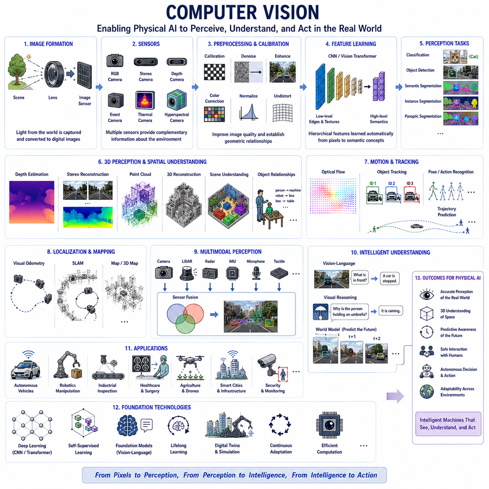
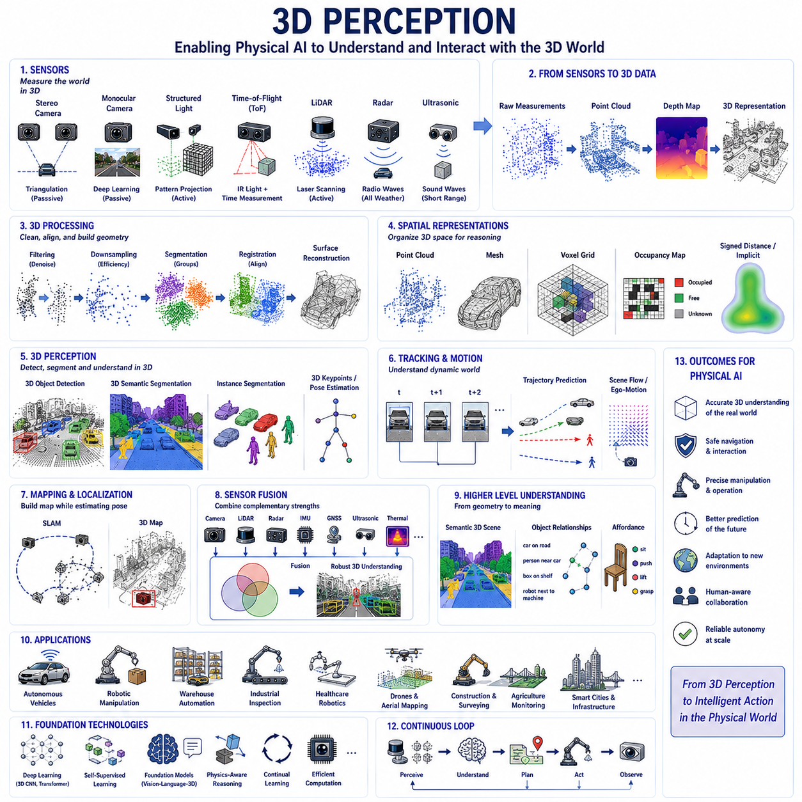
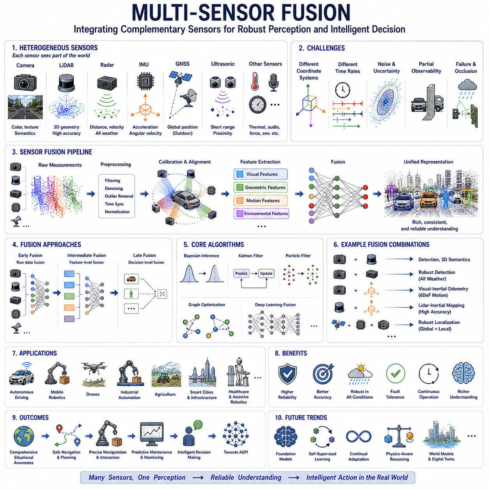
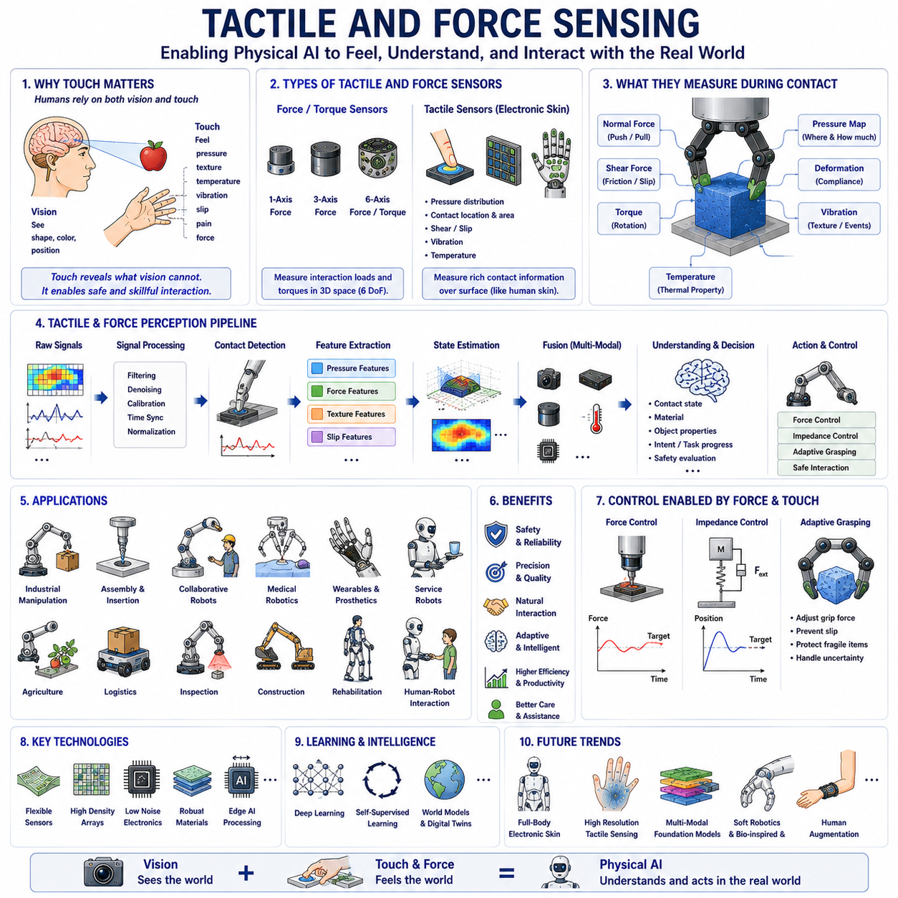
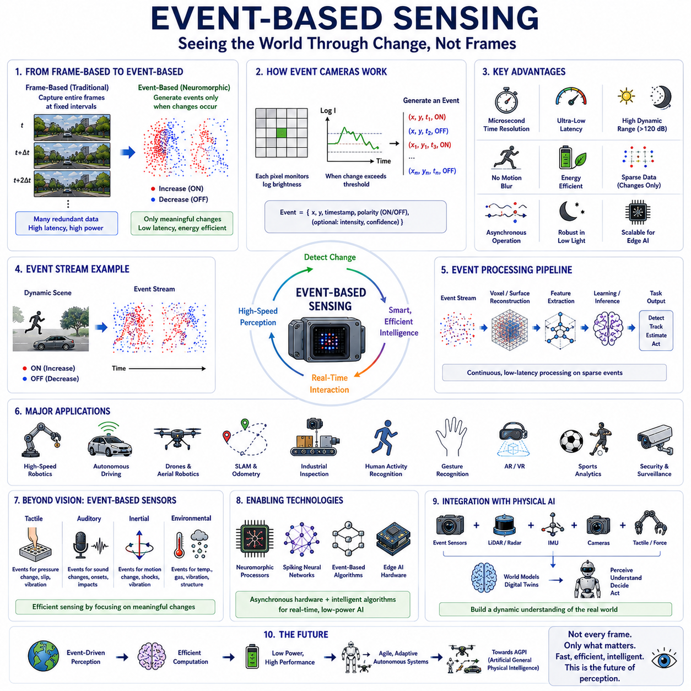
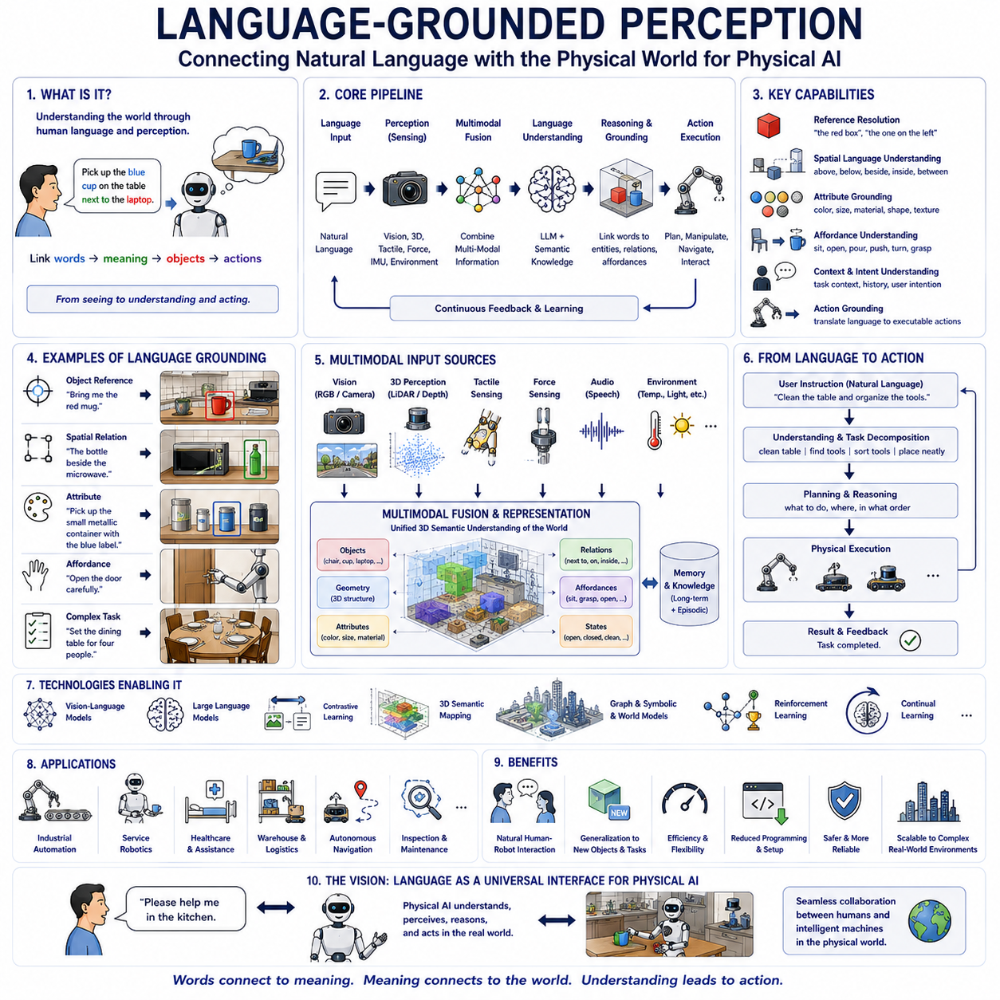
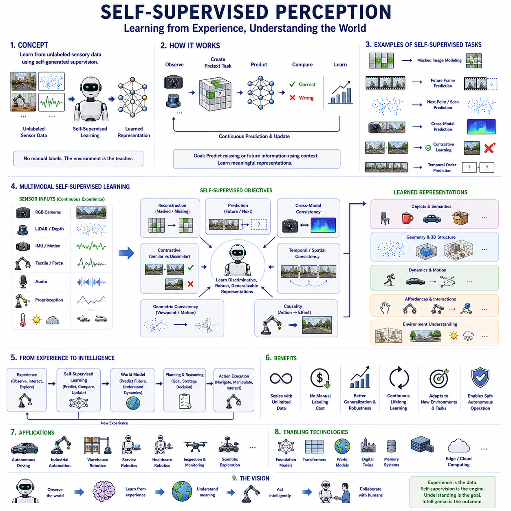
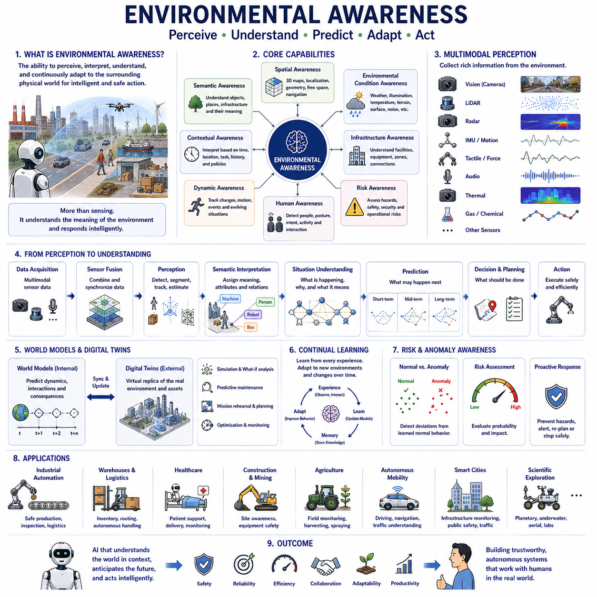
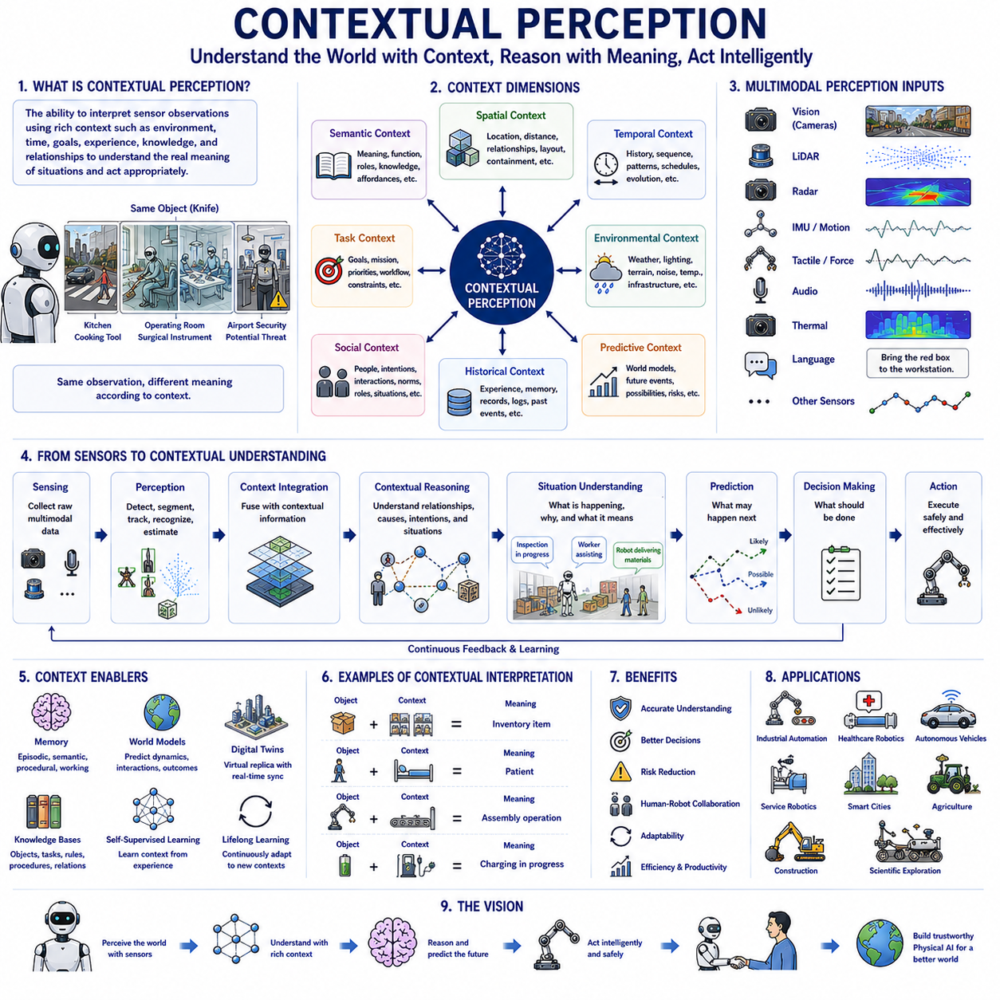

**Physical AI Engineering**

# Chapter 03 Perception for Physical AI 

## 03-01 Computer Vision

{width="7.268055555555556in" height="7.268055555555556in"}

Computer Vision is one of the most fundamental technologies in Physical AI because it enables intelligent machines to perceive, interpret, and understand the visual world in a manner that supports autonomous interaction with physical environments. Human intelligence relies heavily on vision, with a significant portion of sensory information originating from the eyes. Similarly, Physical AI depends on computer vision as the primary mechanism through which robots, autonomous vehicles, drones, industrial systems, healthcare devices, and intelligent infrastructure observe and reason about their surroundings. Without robust visual perception, an autonomous system cannot reliably identify objects, estimate spatial relationships, understand scenes, recognize human activities, or make safe decisions. Computer Vision therefore serves as the visual foundation upon which perception, reasoning, planning, and autonomous behavior are constructed.

Unlike traditional image processing, which focuses primarily on enhancing or transforming images, Computer Vision seeks to extract meaningful information from visual observations. An image consists merely of pixels containing intensity and color values, but Physical AI must transform these numerical measurements into semantic knowledge about the physical world. The system must recognize objects, estimate three-dimensional structures, understand spatial layouts, detect motion, interpret interactions, identify environmental conditions, and predict future events. Computer Vision therefore bridges the gap between raw visual sensing and high-level cognitive understanding.

Visual perception begins with image formation. Cameras convert incoming light reflected from physical objects into digital images through optical lenses and image sensors. The imaging process is governed by physical principles including geometric optics, perspective projection, illumination, reflection, refraction, exposure, focal length, depth of field, sensor characteristics, and optical distortion. Understanding these imaging principles is essential because every subsequent vision algorithm operates upon observations influenced by the physics of image formation. Physical AI therefore incorporates camera models directly into perception pipelines, Digital Twins, simulation environments, and calibration procedures.

Different camera technologies provide complementary information about the environment. Conventional RGB cameras capture color information with high spatial resolution and relatively low cost. Monochrome cameras offer improved sensitivity under challenging illumination. Stereo camera systems estimate depth through binocular disparity. Depth cameras actively measure distance using structured light or time-of-flight principles. Event cameras detect asynchronous brightness changes with microsecond temporal resolution, enabling efficient perception during high-speed motion. Thermal cameras observe infrared radiation, allowing object detection independent of visible illumination. Hyperspectral cameras measure hundreds of wavelength bands, revealing material composition invisible to human vision. Multispectral imaging supports agriculture, environmental monitoring, industrial inspection, and scientific observation by capturing information beyond the visible spectrum.

Camera calibration establishes precise relationships between image coordinates and physical geometry. Intrinsic calibration estimates focal length, optical center, lens distortion, and pixel geometry. Extrinsic calibration determines spatial relationships between cameras, sensors, robots, and world coordinate systems. Multi-camera calibration aligns observations across heterogeneous sensor networks including LiDAR, radar, inertial measurement units, Global Navigation Satellite Systems, and robotic manipulators. Accurate calibration ensures consistent spatial reasoning throughout Physical AI systems while enabling sensor fusion and three-dimensional reconstruction.

Image preprocessing improves observation quality before higher-level perception begins. Noise reduction removes sensor artifacts while preserving important structural information. Contrast enhancement increases visibility under difficult illumination. Color correction compensates for changing lighting conditions. Image normalization standardizes appearance across cameras and environments. Deblurring algorithms recover details degraded by motion or optical limitations. High Dynamic Range imaging combines multiple exposures to represent scenes containing extreme brightness variation. Such preprocessing significantly improves downstream perception reliability while reducing sensitivity to environmental variation.

Feature extraction has historically formed the foundation of Computer Vision. Early methods identified distinctive visual structures including edges, corners, contours, blobs, gradients, textures, and local descriptors. Algorithms such as SIFT, SURF, ORB, BRISK, FAST, and Harris corner detection enabled image matching, localization, mapping, and object recognition before deep learning became dominant. Although neural networks now perform many feature extraction tasks automatically, classical geometric features remain valuable within localization, visual odometry, simultaneous localization and mapping, industrial inspection, and computationally constrained embedded systems.

Deep learning fundamentally transformed Computer Vision by replacing manually designed features with hierarchical feature learning. Convolutional Neural Networks automatically discover increasingly abstract visual representations through multiple processing layers. Early layers identify edges and textures. Intermediate layers recognize object parts and geometric structures. Higher layers encode semantic concepts describing complete objects, scenes, and interactions. Such hierarchical learning significantly improves recognition accuracy while reducing manual engineering effort. Modern Physical AI systems increasingly rely upon learned visual representations adaptable across diverse environments.

Object detection represents one of the most important Computer Vision capabilities for Physical AI. Rather than classifying entire images, object detection identifies individual entities together with their spatial locations. Autonomous vehicles detect pedestrians, cyclists, traffic signs, vehicles, road infrastructure, and obstacles. Warehouse robots identify inventory containers, shelves, forklifts, and workers. Industrial inspection systems recognize tools, components, defects, and manufacturing equipment. Modern object detectors balance detection accuracy, computational efficiency, robustness, and real-time performance, allowing autonomous systems to operate safely within dynamic environments.

Image classification remains valuable despite advances in dense perception. Instead of locating individual objects, classification estimates the overall semantic category associated with an image or image region. Medical imaging systems classify disease conditions. Industrial inspection identifies acceptable or defective products. Agricultural robots recognize crop species and plant health. Environmental monitoring classifies terrain, weather, or ecological conditions. Image classification therefore provides efficient semantic understanding supporting numerous decision-making processes within Physical AI.

Semantic segmentation extends perception by assigning semantic labels to every image pixel. Rather than identifying isolated objects only, semantic segmentation constructs complete scene understanding describing roads, buildings, vegetation, machinery, humans, furniture, walls, floors, water, sky, and countless additional environmental categories. Such dense environmental interpretation supports navigation, robotic manipulation, autonomous driving, digital mapping, augmented reality, and intelligent infrastructure management. Physical AI benefits significantly because every observable region receives meaningful semantic interpretation rather than remaining anonymous background.

Instance segmentation further distinguishes individual objects belonging to identical semantic categories. Multiple people become separately identifiable despite sharing identical semantic labels. Numerous vehicles receive independent identities supporting long-term tracking. Industrial robots distinguish multiple workpieces occupying conveyor systems. Medical systems differentiate individual surgical instruments. Persistent object identity greatly improves manipulation planning, inventory management, collaborative robotics, and predictive tracking across extended operational durations.

Panoptic segmentation unifies semantic and instance segmentation into comprehensive scene representations. Continuous environmental regions including roads, walls, vegetation, floors, and water receive semantic interpretation while countable objects such as humans, vehicles, tools, furniture, machinery, and robots obtain both semantic labels and persistent identities. Such integrated scene understanding enables autonomous systems to combine environmental context with detailed object reasoning, significantly enhancing navigation, manipulation, planning, and collaborative interaction.

Three-dimensional Computer Vision represents an essential capability for Physical AI because intelligent machines operate within three-dimensional physical environments rather than two-dimensional images. Depth estimation, stereo reconstruction, monocular depth prediction, LiDAR integration, neural radiance fields, point cloud processing, volumetric reconstruction, and neural implicit representations collectively enable robots to estimate object geometry, environmental structure, free space, and navigable pathways. Three-dimensional perception supports manipulation, collision avoidance, autonomous navigation, Digital Twins, World Models, and simulation environments.

Scene understanding extends beyond recognizing isolated objects toward interpreting entire environments. Computer Vision identifies spatial organization, functional regions, environmental layouts, object relationships, human activities, operational workflows, and contextual meaning. Factories contain production cells, logistics pathways, maintenance zones, and safety regions. Hospitals contain patient rooms, nurse stations, operating theaters, laboratories, and emergency facilities. Warehouses include storage racks, loading docks, charging stations, and inventory zones. Such scene understanding enables intelligent systems to reason about environments similarly to human operators.

Visual relationship recognition further enriches scene understanding by identifying interactions among objects. A worker operates machinery. A robot transports inventory. A vehicle approaches an intersection. Medical equipment connects to patients. Tools rest upon workbenches. Boxes occupy storage racks. These relational descriptions significantly improve contextual reasoning because environmental meaning frequently depends upon interactions rather than isolated object recognition.

Human perception constitutes one of the most important application areas of Computer Vision. Human detection identifies people within complex environments. Pose estimation estimates skeletal structure describing body posture and movement. Gesture recognition interprets intentional communication. Action recognition identifies activities including walking, lifting, assembling, operating equipment, sitting, falling, running, or collaborative manipulation. Facial analysis estimates identity, attention, emotional expression, fatigue, and engagement while respecting ethical and privacy considerations. Such human understanding supports collaborative robotics, healthcare, manufacturing, rehabilitation, smart environments, and autonomous transportation.

Visual tracking enables persistent observation of moving objects across time. Autonomous vehicles continuously estimate trajectories of surrounding traffic participants. Warehouse robots monitor inventory movement. Security systems track individuals throughout facilities. Manufacturing inspection systems observe products progressing through assembly lines. Modern tracking algorithms integrate appearance modeling, motion prediction, temporal consistency, and probabilistic estimation, maintaining object identity despite occlusion, illumination changes, viewpoint variation, or temporary disappearance.

Motion estimation forms another central component of Computer Vision. Optical flow estimates pixel-level apparent motion between consecutive images. Scene flow extends motion estimation into three-dimensional space. Ego-motion estimation determines camera movement through visual observations. Visual odometry estimates robotic trajectories without external positioning infrastructure. Such motion understanding enables autonomous navigation, stabilization, mapping, collision avoidance, predictive planning, and environmental monitoring.

Simultaneous Localization and Mapping integrates Computer Vision with robotics by constructing environmental maps while simultaneously estimating robot location. Visual SLAM relies primarily upon cameras whereas Visual-Inertial SLAM combines cameras with inertial measurement units for greater robustness. Semantic SLAM enriches maps through object recognition and scene understanding. Object-level SLAM maintains persistent object identities throughout long-term operation. SLAM therefore provides one of the central technologies connecting Computer Vision with autonomous Physical AI systems.

Visual localization enables robots to determine their positions relative to previously mapped environments. Image retrieval, feature matching, geometric registration, place recognition, and map alignment collectively estimate global location. Localization remains essential within autonomous vehicles, warehouse robots, drones, planetary exploration, infrastructure inspection, and mobile service robotics. Robust localization algorithms tolerate seasonal variation, illumination changes, weather conditions, moving objects, and long-term environmental evolution.

Visual reasoning represents an emerging capability extending beyond perception toward cognitive understanding. Instead of merely identifying objects, intelligent systems answer questions regarding causal relationships, functional interactions, temporal evolution, operational procedures, and future events. Vision-language models integrate visual observations with natural language, allowing robots to interpret instructions, explain observations, answer questions, and communicate environmental knowledge naturally with human users. Such reasoning significantly advances explainable Physical AI.

Multimodal perception combines Computer Vision with additional sensing modalities including LiDAR, radar, thermal imaging, microphones, tactile sensors, inertial measurement units, force sensors, Global Navigation Satellite Systems, and environmental sensors. Sensor fusion improves robustness because each modality compensates for limitations of others. Cameras provide rich semantic information while LiDAR supplies accurate geometry. Radar operates reliably during adverse weather. Thermal imaging detects living organisms regardless of illumination. Multimodal Computer Vision therefore significantly enhances reliability across challenging real-world environments.

Foundation Models have transformed Computer Vision through large-scale self-supervised representation learning. Vision Transformers, Vision-Language Models, multimodal foundation models, and Vision-Language-Action architectures acquire broad visual understanding transferable across diverse applications. Rather than training specialized networks independently for every task, Physical AI increasingly adapts general-purpose visual representations through efficient fine-tuning, prompt engineering, instruction learning, or few-shot adaptation. Such models substantially reduce development effort while improving generalization to previously unseen environments.

Self-supervised learning further advances Computer Vision by enabling autonomous acquisition of visual representations without extensive manual annotation. Systems predict missing image regions, future observations, spatial consistency, temporal continuity, or cross-modal correspondence. Through repeated interaction with physical environments, robots continuously refine internal visual representations while adapting to new objects, lighting conditions, operational procedures, and environmental changes. Lifelong learning therefore becomes an essential characteristic of advanced Physical AI.

Digital Twins increasingly integrate Computer Vision into continuous virtual representations synchronized with physical assets. Cameras monitor production equipment, infrastructure, warehouses, hospitals, and transportation systems while updating Digital Twins in real time. Vision-based inspection detects anomalies, structural degradation, inventory changes, operational deviations, and maintenance requirements. Such integration enables predictive maintenance, operational optimization, remote monitoring, and intelligent asset management throughout industrial ecosystems.

World Models rely heavily upon Computer Vision because visual observations provide primary information regarding environmental state. Vision continuously updates object representations, scene layouts, human activities, environmental dynamics, and physical interactions within cognitive world representations. Predictive simulation subsequently estimates future environmental evolution, allowing autonomous systems to evaluate alternative actions before physical execution. Computer Vision therefore serves not only as a perception technology but also as the principal information source supporting predictive cognition.

Robotic manipulation depends extensively upon Computer Vision. Robots identify grasp points, estimate object orientation, recognize materials, infer affordances, evaluate accessibility, detect obstacles, and monitor manipulation progress. Visual servoing continuously adjusts robotic motion using camera feedback. Bin picking systems recognize randomly arranged components. Assembly robots verify part alignment. Surgical robots monitor tissue deformation during operations. Such vision-guided manipulation dramatically increases robotic precision, adaptability, and autonomy.

Industrial inspection represents another major application domain. High-resolution Computer Vision detects microscopic defects, dimensional deviations, surface damage, assembly errors, contamination, corrosion, cracks, and manufacturing inconsistencies. Deep neural inspection systems increasingly outperform manually designed algorithms while operating continuously with high repeatability. Combined with Digital Twins, these systems support automated quality assurance, predictive maintenance, process optimization, and intelligent manufacturing.

Autonomous transportation relies fundamentally upon Computer Vision for safe operation. Vehicles detect roads, traffic participants, lane markings, traffic signals, road signs, obstacles, weather conditions, and construction zones while estimating three-dimensional environmental geometry. Predictive vision models anticipate pedestrian movement, vehicle trajectories, and traffic evolution. Continuous perception enables safe navigation through highly dynamic environments requiring millisecond-level decision making.

Healthcare increasingly employs Computer Vision throughout diagnosis, surgery, rehabilitation, patient monitoring, medical imaging, and assistive robotics. Vision systems detect anatomical structures, estimate patient posture, monitor rehabilitation exercises, analyze medical imagery, recognize clinical activities, and support robotic surgery. Combined with biomechanical modeling and Digital Twins, Computer Vision contributes significantly to personalized healthcare and intelligent medical assistance.

Future Computer Vision will evolve toward unified perception architectures integrating geometry, semantics, physics, language, World Models, Digital Twins, multimodal sensing, continual learning, and autonomous reasoning. Rather than maintaining isolated algorithms for detection, segmentation, tracking, localization, and recognition, future Physical AI systems will construct continuously evolving visual world representations supporting perception, prediction, communication, planning, and decision making simultaneously. These integrated cognitive vision systems will increasingly approximate the flexibility, adaptability, and contextual understanding exhibited by human visual intelligence.

Ultimately, Computer Vision provides Physical AI with the capability to transform raw visual observations into meaningful knowledge about the physical world. By integrating image formation, geometric understanding, semantic interpretation, three-dimensional perception, temporal reasoning, multimodal sensing, predictive modeling, and continual learning into unified computational frameworks, Computer Vision enables intelligent machines to perceive, understand, and interact safely with complex real-world environments. As Artificial General Physical Intelligence continues to develop, Computer Vision will remain one of its most indispensable foundations, enabling autonomous systems to observe reality, interpret meaning, anticipate change, collaborate with humans, and make intelligent decisions across every domain where physical interaction is required.

## 03-02 3D Perception

{width="7.268055555555556in" height="7.268055555555556in"}

Three-Dimensional Perception, commonly referred to as 3D Perception, is one of the most fundamental technologies enabling Physical AI to understand and interact intelligently with the physical world. While conventional computer vision interprets two-dimensional images captured by cameras, intelligent autonomous systems must perceive the real world as a three-dimensional environment composed of objects, surfaces, free space, moving agents, and physical structures. Every autonomous robot, self-driving vehicle, industrial manipulator, drone, service robot, medical robot, and intelligent infrastructure system operates within a three-dimensional world where distance, depth, orientation, volume, and spatial relationships directly influence decision making. Consequently, 3D Perception transforms flat visual observations into comprehensive geometric representations that allow intelligent machines to reason about the physical environment with human-like spatial understanding.

The physical world is inherently three-dimensional. Every object possesses height, width, depth, orientation, shape, volume, material, and position within space. Humans naturally infer these characteristics through binocular vision, motion, prior knowledge, and continuous interaction with the environment. Physical AI attempts to reproduce this capability by combining visual sensing, geometric reasoning, probabilistic estimation, physics modeling, and machine learning into unified perception systems capable of constructing accurate spatial representations. Three-dimensional perception therefore serves as the bridge between sensory observations and intelligent interaction with reality.

Traditional computer vision primarily analyzes image appearance. Pixels represent intensity and color but contain no explicit depth information. Although two-dimensional images provide rich semantic content, they cannot directly determine how far an object is located, how large it actually is, whether one object lies behind another, or whether sufficient space exists for robotic navigation. Physical AI requires explicit geometric understanding because every action performed by an autonomous machine depends upon accurate spatial reasoning. Manipulation, grasping, collision avoidance, navigation, inspection, assembly, human interaction, and environmental understanding all rely upon reliable three-dimensional perception.

Depth estimation forms the foundation of nearly every 3D perception system. Depth refers to the physical distance between the sensing system and observed objects. Once depth becomes available, image pixels can be projected into three-dimensional space, allowing reconstruction of environmental geometry. Numerous computational approaches estimate depth using different sensing principles. Passive methods infer depth from visual observations without active illumination, whereas active sensing technologies directly measure distance using emitted energy. Modern Physical AI often combines multiple complementary depth estimation methods to maximize robustness under diverse environmental conditions.

Stereo vision represents one of the oldest and most biologically inspired approaches to depth estimation. Similar to human binocular vision, stereo systems employ two synchronized cameras separated by a known baseline distance. Corresponding image features are identified within both camera views, and geometric triangulation computes object distance through disparity measurements. Nearby objects produce larger disparities than distant objects. Stereo vision offers dense geometric reconstruction without requiring active illumination, making it suitable for outdoor robotics, autonomous driving, mobile manipulation, and aerial systems. However, stereo performance decreases in low-texture environments, repetitive patterns, adverse weather, or insufficient lighting conditions.

Monocular depth estimation has become increasingly powerful through deep learning. Instead of relying upon multiple cameras, neural networks infer depth directly from a single RGB image by learning statistical relationships between visual appearance and three-dimensional structure. Large datasets containing paired images and ground-truth depth enable supervised learning, while self-supervised techniques exploit geometric consistency across video sequences. Although monocular methods cannot recover absolute scale perfectly without additional information, they provide valuable dense depth estimation for applications where multiple cameras are impractical. Foundation models continue improving monocular depth estimation through generalized visual understanding acquired from enormous multimodal datasets.

Structured light sensing actively projects known illumination patterns onto surrounding surfaces. Cameras observe pattern deformation caused by object geometry, allowing reconstruction of detailed depth information through triangulation. Structured light provides highly accurate close-range measurements suitable for industrial inspection, robotic manipulation, reverse engineering, medical imaging, and consumer depth cameras. Performance decreases under strong sunlight because projected patterns become difficult to detect, making structured light primarily useful for indoor environments.

Time-of-Flight sensing directly measures distance by estimating the travel time of emitted light. Infrared illumination pulses propagate toward environmental surfaces before returning to specialized sensors. Since light travels at a known velocity, round-trip travel time determines object distance. Modern Time-of-Flight cameras generate dense depth maps with relatively simple processing pipelines while supporting real-time operation. These sensors perform effectively for indoor robotics, human tracking, gesture recognition, warehouse automation, healthcare monitoring, and collaborative robotics. Their accuracy depends upon sensor resolution, signal strength, environmental reflectivity, multipath interference, and ambient illumination.

LiDAR has become one of the most influential technologies within autonomous Physical AI. Light Detection and Ranging systems emit laser pulses while precisely measuring return time to generate highly accurate three-dimensional point clouds. Rotating mechanical LiDAR systems provide panoramic environmental coverage, whereas solid-state LiDAR increasingly reduces cost, size, complexity, and maintenance requirements. LiDAR offers exceptional geometric precision across long distances while remaining relatively independent of ambient illumination. Consequently, autonomous vehicles, outdoor mobile robots, intelligent infrastructure, surveying systems, agricultural automation, and industrial inspection rely extensively upon LiDAR for reliable environmental perception.

Radar complements optical sensing by operating reliably under adverse weather conditions. Radio waves penetrate fog, rain, dust, smoke, and darkness more effectively than visible light, allowing robust object detection when cameras and LiDAR experience degraded performance. Automotive radar estimates object distance, relative velocity, and direction simultaneously through Doppler measurements. Although radar provides lower spatial resolution than optical sensors, its robustness makes it indispensable for safety-critical autonomous transportation, maritime navigation, airport surveillance, industrial automation, and defense applications. Physical AI increasingly integrates radar with cameras and LiDAR to achieve resilient multimodal perception.

Ultrasonic sensing provides economical short-range distance estimation through acoustic wave propagation. Autonomous mobile robots, collaborative robots, service robots, warehouse automation systems, and intelligent household devices frequently employ ultrasonic sensors for obstacle avoidance, docking assistance, proximity monitoring, and human safety. Although ultrasonic sensors provide limited spatial resolution and operating range, they remain valuable because of low cost, low power consumption, and reliable short-distance performance.

Point clouds constitute one of the most important internal representations generated by three-dimensional perception. Each point represents a measured location within physical space, collectively describing environmental geometry without assuming explicit object models. Point clouds preserve accurate spatial measurements while supporting object recognition, localization, mapping, obstacle avoidance, Digital Twins, World Models, inspection, reconstruction, and robotic manipulation. Modern deep learning architectures increasingly operate directly upon point clouds, eliminating intermediate image representations while preserving geometric fidelity.

Point cloud processing encompasses numerous computational operations including filtering, denoising, downsampling, segmentation, registration, clustering, feature extraction, and surface reconstruction. Raw measurements frequently contain sensor noise, missing observations, dynamic objects, measurement uncertainty, and redundant information. Efficient preprocessing improves computational efficiency while preserving essential geometric characteristics. Advanced algorithms organize point clouds into hierarchical structures supporting real-time autonomous reasoning despite extremely large datasets.

Surface reconstruction transforms discrete point clouds into continuous geometric models. Triangle meshes, polygonal surfaces, signed distance fields, implicit neural representations, voxel grids, and neural radiance fields each provide different tradeoffs among accuracy, memory efficiency, computational complexity, and rendering quality. Continuous surface models facilitate simulation, collision detection, robotic planning, manufacturing inspection, Digital Twins, and virtual reality by providing physically meaningful environmental representations.

Voxel representations divide three-dimensional space into uniformly sized volumetric cells analogous to image pixels extended into three dimensions. Occupied voxels indicate physical matter while empty voxels represent free space. Voxel grids naturally support occupancy mapping, path planning, collision detection, volumetric reasoning, semantic mapping, and environmental simulation. Adaptive voxel structures including octrees improve computational efficiency by allocating high resolution only where necessary, enabling large-scale environmental representation despite finite computational resources.

Occupancy mapping forms a fundamental capability supporting autonomous navigation. Instead of reconstructing detailed object surfaces exclusively, occupancy maps estimate probabilities describing whether spatial regions contain obstacles, free space, or unknown areas. Bayesian occupancy grid mapping continuously integrates sensor observations while explicitly managing uncertainty. Autonomous robots utilize occupancy maps for path planning, obstacle avoidance, exploration, localization, and safety verification across dynamic environments.

Three-dimensional object detection extends conventional image-based detection into physical space. Instead of merely locating bounding boxes within images, 3D object detectors estimate spatial position, dimensions, orientation, velocity, and category simultaneously. Autonomous vehicles identify surrounding traffic participants while estimating their trajectories. Warehouse robots detect pallets, containers, forklifts, shelving systems, and workers. Industrial robots recognize tools, workpieces, fixtures, and production equipment. Such spatially aware detection significantly improves manipulation accuracy and autonomous navigation.

Three-dimensional object tracking maintains persistent identities for moving objects across time while estimating trajectories, orientations, and future behavior. Robust tracking integrates geometric observations, appearance information, motion models, probabilistic filtering, and temporal consistency. Tracking remains essential for autonomous driving, collaborative robotics, logistics automation, security monitoring, industrial inspection, healthcare, and intelligent transportation systems.

Scene reconstruction extends beyond individual object modeling toward complete environmental representation. Indoor mapping reconstructs walls, floors, ceilings, furniture, equipment, and architectural layouts. Outdoor reconstruction models roads, buildings, vegetation, terrain, infrastructure, and transportation networks. High-fidelity reconstruction supports Digital Twins, infrastructure inspection, construction monitoring, cultural heritage preservation, environmental simulation, disaster response, and intelligent urban management.

Simultaneous Localization and Mapping heavily depends upon three-dimensional perception. Cameras, LiDAR, inertial sensors, and wheel odometry collectively estimate robot position while constructing environmental maps. Three-dimensional SLAM significantly improves localization accuracy because environmental geometry provides stronger constraints than two-dimensional appearance alone. Modern SLAM systems increasingly integrate semantic understanding, object recognition, loop closure, and lifelong adaptation into unified mapping frameworks supporting long-term autonomous operation.

Visual-Inertial Odometry combines camera observations with inertial measurements to estimate six-degree-of-freedom motion continuously. Cameras provide rich geometric information while inertial sensors capture rapid rotational and translational dynamics between image frames. Sensor fusion significantly improves robustness under rapid motion, temporary visual degradation, changing illumination, and dynamic environments. Such integrated motion estimation supports drones, autonomous vehicles, wearable devices, augmented reality, mobile robots, and planetary exploration.

Sensor fusion represents one of the defining characteristics of advanced three-dimensional perception. Cameras contribute semantic appearance information. LiDAR supplies accurate geometry. Radar measures relative velocity robustly under adverse weather. Ultrasonic sensors improve short-range safety. Thermal imaging detects living organisms regardless of illumination. Global Navigation Satellite Systems provide global positioning, while inertial measurement units estimate local motion dynamics. Physical AI combines these complementary observations through probabilistic estimation, graph optimization, Kalman filtering, Bayesian inference, particle filtering, and deep multimodal learning to construct unified environmental representations substantially more reliable than any individual sensing modality.

Semantic three-dimensional perception enriches geometry by attaching conceptual meaning to reconstructed environments. Instead of representing anonymous point clouds alone, Physical AI identifies roads, sidewalks, buildings, machinery, storage areas, production equipment, humans, vehicles, vegetation, furniture, medical devices, and infrastructure. Semantic labels significantly improve autonomous planning because robots reason about environmental function rather than geometric shape only. Functional understanding supports intelligent manipulation, task planning, human collaboration, and contextual reasoning.

Instance-level three-dimensional perception distinguishes multiple objects belonging to identical semantic categories. Individual vehicles receive persistent identities despite sharing identical appearance classes. Multiple warehouse containers become independently traceable. Numerous production components remain distinguishable throughout assembly operations. Such persistent identity management supports inventory control, logistics automation, predictive maintenance, collaborative robotics, and long-term environmental understanding.

Affordance perception extends object understanding beyond recognition toward functional interaction. Three-dimensional geometry allows robots to identify graspable handles, pushable buttons, pullable drawers, climbable stairs, traversable surfaces, charging connectors, assembly interfaces, and safe manipulation regions. Rather than memorizing individual objects, Physical AI recognizes interaction opportunities transferable across previously unseen environments. Such affordance reasoning significantly improves robotic generalization.

Human-centered three-dimensional perception plays a central role within collaborative Physical AI. Three-dimensional human pose estimation reconstructs skeletal joint positions, body orientation, posture, movement, and gesture directly within physical space. Robots estimate interpersonal distance, predict motion trajectories, recognize collaborative intent, monitor ergonomic posture, detect falls, and maintain safe interaction zones. Such capabilities enable collaborative manufacturing, healthcare assistance, rehabilitation, service robotics, and intelligent public environments while prioritizing human safety.

Physics-aware perception further enhances three-dimensional understanding by incorporating physical constraints into environmental interpretation. Objects remain supported by surfaces. Gravity influences motion. Articulated mechanisms obey joint limitations. Materials deform under applied forces. Liquids flow continuously. Such physical reasoning enables robots to distinguish plausible environmental interpretations from physically impossible observations. World Models increasingly integrate learned physics with geometric perception, improving predictive accuracy across complex interaction scenarios.

Digital Twins rely heavily upon accurate three-dimensional perception because virtual environments must remain synchronized with continuously changing physical reality. Cameras, LiDAR, radar, and additional sensors update geometric models in real time. Structural deformation, equipment movement, inventory changes, infrastructure degradation, and environmental evolution become reflected immediately within virtual representations. Such synchronization enables predictive maintenance, intelligent inspection, lifecycle management, remote operation, and operational optimization throughout industrial ecosystems.

World Models similarly depend upon three-dimensional perception as their primary geometric information source. Environmental observations continuously update object representations, scene geometry, dynamic behavior, and physical interactions within predictive cognitive models. Rather than simply recording current environmental state, World Models simulate future evolution by combining geometric understanding with physical dynamics, semantic knowledge, human behavior, and autonomous planning. Three-dimensional perception therefore forms the geometric foundation supporting predictive Physical AI.

Simulation environments increasingly leverage high-fidelity three-dimensional perception for sim-to-real transfer. Digital reconstruction of real facilities allows reinforcement learning, policy optimization, synthetic data generation, robot testing, safety verification, and algorithm validation before physical deployment. Neural rendering, Gaussian splatting, neural radiance fields, and physics-based simulation significantly improve environmental realism while maintaining computational efficiency. Such realistic simulation accelerates autonomous system development while reducing deployment risk.

Foundation Models have begun transforming three-dimensional perception by integrating visual appearance, geometry, language, physical reasoning, and multimodal understanding into unified representations. Vision-language models describe reconstructed scenes using natural language. Vision-language-action architectures connect environmental understanding directly with robotic behavior. Generalized multimodal models transfer geometric knowledge across previously unseen environments, substantially improving adaptability while reducing task-specific engineering effort.

Self-supervised learning enables autonomous acquisition of three-dimensional representations without requiring extensive manual annotation. Systems exploit geometric consistency across multiple viewpoints, temporal continuity within video sequences, cross-modal correspondence among sensors, and predictive reconstruction objectives. Continuous interaction with physical environments gradually refines internal geometric understanding, allowing lifelong adaptation despite changing environments, evolving infrastructure, sensor aging, and operational variability.

Computational efficiency remains a major challenge because three-dimensional perception generates enormous data volumes. Modern LiDAR systems produce millions of points every second, high-resolution cameras capture gigabytes of imagery, and dense reconstruction requires substantial processing resources. Efficient data structures, hierarchical representations, adaptive sampling, edge computing, dedicated AI accelerators, sparse neural networks, and distributed computation collectively enable real-time perception despite increasing sensor complexity.

Safety represents perhaps the most important application of three-dimensional perception. Autonomous systems must accurately estimate free space, obstacle geometry, human proximity, vehicle trajectories, structural clearances, manipulation distances, and collision risk before executing physical actions. Errors in three-dimensional understanding may produce unsafe behavior, equipment damage, operational failure, or human injury. Consequently, robust uncertainty estimation, redundant sensing, probabilistic reasoning, and continuous validation constitute essential components of safety-critical three-dimensional perception.

Industrial applications demonstrate the importance of accurate spatial understanding. Manufacturing robots perform precision assembly using millimeter-level geometric measurements. Warehouse automation relies upon three-dimensional inventory recognition and pallet handling. Autonomous construction equipment models terrain, structures, and machinery. Agricultural robots estimate plant geometry, crop volume, and terrain topology. Medical robots reconstruct patient anatomy during minimally invasive surgery. Intelligent infrastructure continuously monitors bridges, tunnels, railways, airports, power plants, and smart cities through high-resolution three-dimensional sensing. Across every domain, intelligent autonomous operation depends fundamentally upon reliable geometric perception.

Future Three-Dimensional Perception will likely evolve toward unified cognitive perception systems integrating geometry, semantics, physics, language, Digital Twins, World Models, multimodal sensing, foundation models, continual learning, and predictive reasoning into coherent hierarchical representations. Rather than treating reconstruction, object detection, mapping, localization, tracking, and planning as separate computational modules, future Physical AI systems will construct continuously evolving world representations supporting perception, simulation, communication, prediction, and autonomous decision making simultaneously. These integrated perception architectures will increasingly approximate the flexibility, adaptability, and spatial intelligence exhibited by human cognition.

Ultimately, Three-Dimensional Perception enables Physical AI to transform raw sensor observations into meaningful spatial understanding of the physical world. By integrating depth estimation, geometric reconstruction, sensor fusion, semantic interpretation, physical reasoning, predictive modeling, and continual learning within unified computational frameworks, 3D Perception provides intelligent machines with the spatial awareness required to navigate, manipulate, collaborate, inspect, predict, and safely interact with complex real-world environments. As Artificial General Physical Intelligence continues to advance, Three-Dimensional Perception will remain one of its most indispensable foundations, enabling autonomous systems to perceive reality not as flat images but as rich, dynamic, and physically meaningful three-dimensional worlds.

## 03-03 Multi-Sensor Fusion

{width="7.268055555555556in" height="7.268055555555556in"}

Multi-Sensor Fusion is one of the most critical technologies in Physical AI because no single sensor can fully observe and understand the complexity of the physical world. Every sensing modality has inherent strengths and limitations that arise from its physical principles, environmental dependencies, spatial resolution, temporal resolution, operating range, and measurement uncertainty. Cameras provide rich semantic information but struggle to measure precise depth. LiDAR produces highly accurate geometric measurements but lacks detailed texture and color. Radar performs reliably in adverse weather but offers relatively low spatial resolution. Inertial Measurement Units measure rapid motion but accumulate drift over time. Global Navigation Satellite Systems provide global positioning but suffer from signal degradation in indoor environments, tunnels, urban canyons, and dense forests. Physical AI therefore integrates multiple complementary sensing modalities into a unified perception framework capable of producing a more complete, accurate, robust, and reliable understanding of reality than any individual sensor could achieve independently.

Human perception itself demonstrates the importance of sensor fusion. Humans simultaneously combine visual information, auditory perception, tactile sensation, proprioception, vestibular balance, smell, and prior experience to understand their surroundings. Vision identifies objects and environmental structure. Hearing detects events occurring outside the field of view. Touch confirms physical contact. The vestibular system estimates body orientation and acceleration. The brain continuously fuses these heterogeneous sensory signals into coherent representations of the surrounding world while compensating for noise, uncertainty, temporary sensor failure, and conflicting observations. Physical AI follows similar principles by integrating heterogeneous sensing systems through probabilistic estimation, geometric reasoning, machine learning, and cognitive modeling.

Every sensor measures only certain aspects of reality. RGB cameras observe reflected visible light and therefore provide appearance, color, texture, object identity, and semantic information. However, conventional cameras cannot directly estimate distance without additional processing. Depth cameras provide distance information but typically operate over limited ranges. LiDAR measures highly accurate three-dimensional geometry but contains little information regarding surface texture or material appearance. Radar measures distance, velocity, and direction under difficult environmental conditions but cannot distinguish fine object details. Thermal cameras observe infrared radiation rather than visible appearance, enabling reliable detection of living organisms regardless of lighting conditions. Ultrasonic sensors estimate short-range distances economically but provide limited angular resolution. Force sensors measure contact interaction while tactile sensors characterize pressure distribution during manipulation. Environmental sensors measure temperature, humidity, gas concentration, illumination, vibration, air quality, and atmospheric conditions. Physical AI integrates these complementary observations into unified environmental representations supporting intelligent decision making.

Sensor fusion fundamentally seeks to reduce uncertainty. Every measurement contains noise arising from sensor limitations, environmental variation, calibration error, electronic interference, quantization, mechanical vibration, and stochastic physical processes. Instead of treating measurements as absolute truth, Physical AI models uncertainty explicitly through probabilistic estimation. Multiple independent observations reduce ambiguity because consistent measurements reinforce confidence while inconsistent observations indicate potential errors requiring further analysis. Bayesian inference therefore forms one of the mathematical foundations of modern sensor fusion by continuously updating probabilistic beliefs as new evidence becomes available.

Spatial alignment represents one of the first requirements for successful sensor fusion. Measurements originating from different sensors initially exist within separate coordinate systems. Cameras produce image coordinates measured in pixels. LiDAR generates three-dimensional points relative to its own optical center. Radar estimates object locations within its own reference frame. Inertial Measurement Units measure acceleration and angular velocity relative to body coordinates. Global Navigation Satellite Systems estimate global geographic position. Physical AI transforms these heterogeneous coordinate systems into unified reference frames through precise extrinsic calibration, enabling consistent spatial reasoning across all sensing modalities.

Temporal synchronization is equally essential because sensors rarely operate simultaneously. Cameras typically capture images between thirty and one hundred twenty frames per second. LiDAR may complete rotational scans at five to twenty hertz. Radar operates at different update frequencies. Inertial Measurement Units generate measurements hundreds or thousands of times per second. Environmental sensors often sample once every few seconds or minutes. Without precise synchronization, observations representing different moments in time cannot accurately describe rapidly changing environments. Precision Time Protocol, hardware triggering, timestamp synchronization, sensor clocks, deterministic communication, and distributed time management therefore play central roles within advanced Physical AI systems.

Calibration establishes quantitative relationships among heterogeneous sensors. Intrinsic calibration estimates internal sensor parameters including focal length, lens distortion, sensor geometry, timing offsets, and measurement characteristics. Extrinsic calibration determines rigid spatial transformations connecting sensors within shared coordinate systems. Dynamic calibration compensates for thermal expansion, mechanical vibration, structural deformation, sensor aging, and mounting changes occurring throughout operational lifetimes. Automatic calibration methods increasingly exploit environmental observations to maintain long-term alignment without requiring frequent manual intervention.

Sensor fusion architectures can be categorized according to the stage at which information becomes integrated. Early fusion combines raw sensor measurements before extensive individual processing. Camera images, LiDAR point clouds, radar reflections, and inertial measurements are jointly processed through unified neural networks or probabilistic estimation frameworks. Early fusion preserves maximum information but demands considerable computational resources and careful synchronization.

Intermediate fusion extracts informative features independently from each sensing modality before combining higher-level representations. Camera networks identify visual features, LiDAR estimates geometric structures, radar extracts motion characteristics, and inertial sensors estimate dynamic motion states. Feature representations subsequently become integrated within common latent spaces supporting object recognition, localization, tracking, and environmental understanding. Intermediate fusion balances computational efficiency with representational richness and therefore appears frequently within modern Physical AI systems.

Late fusion integrates independently generated decisions or predictions rather than raw measurements or intermediate features. Individual perception modules independently estimate object identities, environmental maps, trajectories, or classifications before consensus algorithms combine final results. Late fusion simplifies system modularity while improving robustness because independent perception pipelines continue functioning despite partial subsystem failure. Ensemble learning, voting strategies, confidence weighting, probabilistic consensus, and decision-level optimization commonly support late fusion architectures.

Bayesian estimation provides the mathematical framework underlying many sensor fusion algorithms. Instead of maintaining deterministic estimates alone, Bayesian approaches represent uncertain variables through probability distributions. New measurements update prior beliefs according to statistical evidence, producing posterior estimates reflecting accumulated knowledge. Bayesian filtering continuously incorporates sequential observations while naturally handling uncertainty, sensor noise, missing measurements, and conflicting evidence. Such probabilistic reasoning significantly improves robustness within dynamic real-world environments.

The Kalman Filter remains one of the most influential sensor fusion algorithms. Originally developed for aerospace navigation, the Kalman Filter estimates continuously evolving system states through recursive prediction and correction. Motion models predict future states while incoming measurements update predictions according to estimated uncertainty. Variants including the Extended Kalman Filter, Unscented Kalman Filter, Error-State Kalman Filter, and Information Filter address nonlinear dynamics common within robotics, autonomous vehicles, drones, wearable devices, and industrial automation. These algorithms integrate inertial measurements, GNSS observations, wheel odometry, visual localization, and LiDAR positioning into highly accurate navigation solutions.

Particle Filters extend probabilistic estimation toward highly nonlinear, non-Gaussian systems. Instead of representing uncertainty through single Gaussian distributions, Particle Filters approximate arbitrary probability densities using large populations of weighted samples. Such approaches remain particularly effective for global localization, kidnapped robot problems, multi-hypothesis tracking, simultaneous localization and mapping, and environments exhibiting ambiguous observations. Although computationally more demanding than Kalman-based methods, Particle Filters provide exceptional flexibility for complex Physical AI applications.

Graph optimization has emerged as another powerful framework supporting multi-sensor fusion. Instead of processing measurements sequentially alone, graph-based methods represent sensor observations, robot poses, landmarks, objects, and environmental constraints as interconnected optimization problems. Simultaneous Localization and Mapping, bundle adjustment, pose graph optimization, factor graphs, and graph neural representations collectively improve global consistency while incorporating measurements from cameras, LiDAR, inertial sensors, GNSS, wheel encoders, radar, and additional sensing modalities. Graph optimization enables long-term autonomous operation despite accumulated measurement uncertainty.

Deep learning has fundamentally transformed sensor fusion by learning multimodal representations directly from data. Rather than manually designing fusion rules, neural networks discover relationships among heterogeneous sensing modalities automatically. Multimodal transformers, cross-attention mechanisms, graph neural networks, convolutional fusion architectures, recurrent temporal models, and foundation models jointly process images, point clouds, radar signals, inertial measurements, language instructions, and environmental observations. Learned fusion often outperforms manually engineered algorithms because neural networks capture complex nonlinear relationships difficult to express analytically.

Vision-LiDAR fusion has become one of the most successful combinations within autonomous Physical AI. Cameras contribute semantic appearance including object identity, color, traffic signals, textual information, and material characteristics. LiDAR supplies precise three-dimensional geometry, object boundaries, environmental structure, and accurate distance measurements. Together these sensing modalities enable highly reliable object detection, semantic segmentation, mapping, obstacle avoidance, and autonomous navigation. Modern autonomous vehicles increasingly rely upon tightly integrated camera-LiDAR perception rather than isolated sensor processing.

Vision-Radar fusion significantly improves robustness under adverse environmental conditions. Heavy rain, snow, fog, smoke, dust, or darkness frequently degrade optical sensing. Radar remains reliable despite such challenging conditions while simultaneously measuring relative velocity through Doppler effects. Cameras identify object categories whereas radar estimates distance and motion with high reliability. Combining both sensing modalities enables safer autonomous transportation, intelligent surveillance, maritime navigation, airport monitoring, and industrial automation.

Visual-Inertial fusion represents another foundational technology supporting Physical AI. Cameras estimate environmental geometry and visual motion while Inertial Measurement Units measure acceleration and angular velocity continuously at high frequency. Camera observations alone may fail during rapid motion or temporary visual degradation, whereas inertial estimates accumulate drift over time. Sensor fusion compensates for both limitations, producing accurate six-degree-of-freedom motion estimation supporting drones, wearable systems, mobile robots, augmented reality, autonomous vehicles, and planetary exploration.

LiDAR-Inertial fusion similarly combines complementary sensing capabilities. LiDAR provides highly accurate geometric constraints while inertial sensors estimate short-term motion dynamics between scans. Such integration improves localization accuracy, mapping consistency, motion compensation, and environmental reconstruction during rapid movement or dynamic operating conditions. Modern outdoor autonomous robots increasingly employ tightly coupled LiDAR-Inertial Odometry as primary navigation systems.

Global Navigation Satellite Systems complement local sensing by providing globally referenced positioning. However, satellite visibility frequently becomes degraded within urban environments, indoor facilities, tunnels, forests, underground infrastructure, or industrial plants. Multi-sensor fusion therefore integrates GNSS with inertial measurements, wheel odometry, cameras, LiDAR, radar, and map-based localization to maintain continuous navigation despite intermittent satellite availability. Such integrated positioning systems achieve centimeter-level accuracy under appropriate operating conditions while remaining robust against signal interruptions.

Wheel odometry remains valuable within ground robotics despite accumulated drift. Wheel encoders estimate traveled distance and rotational motion economically while operating independently of external infrastructure. Combining wheel odometry with inertial sensing, visual localization, LiDAR mapping, and GNSS positioning substantially reduces cumulative navigation error. Warehouse robots, Automated Guided Vehicles, Autonomous Mobile Robots, agricultural machinery, and industrial transportation platforms routinely exploit such integrated localization frameworks.

Environmental sensor fusion extends beyond geometric perception. Temperature sensors monitor thermal conditions affecting batteries, electronics, and mechanical components. Humidity influences agricultural operations, manufacturing processes, and environmental control. Gas sensors detect hazardous chemical releases. Vibration sensors identify mechanical degradation supporting predictive maintenance. Acoustic sensors recognize equipment anomalies. Air quality sensors monitor occupational safety. Physical AI integrates these heterogeneous environmental observations into Digital Twins and predictive maintenance systems supporting intelligent industrial infrastructure.

Human-centered sensor fusion combines visual perception, depth sensing, inertial measurement, wearable sensors, physiological monitoring, microphones, and environmental sensing to understand human behavior comprehensively. Three-dimensional human pose estimation integrates RGB images with depth observations. Wearable inertial sensors estimate body motion independently of external cameras. Physiological sensors monitor heart rate, respiration, muscle activity, and fatigue. Such multimodal understanding enables rehabilitation robotics, collaborative manufacturing, elderly care, assistive technologies, workplace safety, sports science, and intelligent healthcare.

Semantic sensor fusion enriches geometric measurements with conceptual understanding. Cameras recognize semantic object categories. LiDAR reconstructs three-dimensional geometry. Language models contribute prior knowledge regarding object function. World Models predict future environmental evolution. Digital Twins maintain persistent operational context. Rather than maintaining independent geometric and semantic representations, Physical AI increasingly constructs unified cognitive models integrating physical structure with functional meaning and predictive reasoning.

Multi-sensor fusion plays a central role within autonomous driving. Cameras recognize traffic signs, lane markings, traffic lights, pedestrians, and road appearance. LiDAR reconstructs surrounding geometry. Radar estimates relative speed under difficult weather conditions. GNSS provides global positioning while inertial sensors estimate local motion. Ultrasonic sensors support parking and close-range maneuvering. High-definition maps contribute prior environmental knowledge. World Models predict traffic evolution. Together these sensing modalities enable safe navigation through highly dynamic environments requiring millisecond-level decisions.

Industrial robotics similarly depends upon integrated sensing. Cameras identify workpieces and assembly components. Force sensors monitor manipulation interaction. Tactile sensors detect contact conditions. LiDAR ensures safe collaborative operation. Encoders estimate joint positions. Thermal cameras identify overheating equipment. Environmental sensors monitor manufacturing conditions. Fusion of these heterogeneous observations significantly improves robotic precision, reliability, flexibility, and operational safety.

Digital Twins continuously integrate data originating from multiple sensing modalities into coherent virtual representations. Structural health monitoring combines vibration sensors, strain gauges, thermal cameras, visual inspection, acoustic sensing, and environmental measurements to estimate infrastructure condition. Manufacturing Digital Twins integrate machine vision, force sensing, production monitoring, environmental sensing, and operational databases. Such comprehensive integration enables predictive maintenance, anomaly detection, lifecycle management, energy optimization, and intelligent decision support.

World Models depend upon multi-sensor fusion because accurate prediction requires comprehensive environmental understanding. Visual observations describe appearance. Three-dimensional sensors reconstruct geometry. Inertial sensing estimates motion. Language contributes semantic knowledge. Environmental sensors characterize operating conditions. Historical experience supports long-term prediction. Rather than relying upon isolated observations, World Models integrate heterogeneous information into unified representations capable of simulating future environmental evolution and evaluating alternative autonomous actions.

Foundation Models increasingly facilitate generalized sensor fusion by learning shared representations across multiple sensing modalities. Vision-language models integrate images with textual knowledge. Vision-language-action architectures connect perception directly with robotic behavior. Multimodal transformers jointly process images, point clouds, inertial signals, radar observations, environmental measurements, and language instructions. Such generalized architectures reduce task-specific engineering while improving adaptation to previously unseen operating environments.

Self-supervised learning further enhances multi-sensor fusion by exploiting natural relationships among sensing modalities without requiring extensive manual annotation. Camera observations predict depth estimated from LiDAR. Consecutive images provide temporal consistency. Inertial measurements constrain visual motion estimation. Environmental sensors correlate with operational events. Continuous autonomous interaction therefore refines fusion models throughout operational lifetimes while adapting to changing environments, sensor aging, calibration drift, and evolving infrastructure.

Computational efficiency remains an ongoing challenge because modern autonomous systems generate enormous multimodal data streams. High-resolution cameras, multiple LiDAR units, radar arrays, inertial sensors, thermal cameras, microphones, tactile arrays, and environmental sensors collectively produce gigabytes of information every second. Efficient edge computing, dedicated AI accelerators, sparse neural architectures, adaptive sensor scheduling, hierarchical processing, event-driven computation, and distributed cloud-edge collaboration enable real-time fusion despite growing sensing complexity.

Reliability and fault tolerance represent defining objectives of multi-sensor fusion. Individual sensors inevitably experience temporary degradation due to environmental conditions, mechanical damage, contamination, electronic failure, calibration drift, communication interruptions, or physical occlusion. Multi-sensor fusion allows autonomous systems to continue functioning safely despite partial sensor failure because redundant sensing modalities compensate for missing or unreliable observations. Confidence estimation, anomaly detection, uncertainty propagation, sensor health monitoring, and adaptive weighting further improve operational resilience.

Future Multi-Sensor Fusion will evolve toward unified cognitive perception architectures integrating cameras, LiDAR, radar, inertial sensing, tactile sensing, environmental sensing, language, Digital Twins, World Models, foundation models, continual learning, and physics-aware reasoning into coherent hierarchical representations. Rather than treating each sensing modality as an independent subsystem, future Physical AI will construct continuously evolving multimodal world representations capable of perception, prediction, explanation, planning, communication, and autonomous decision making simultaneously. These unified architectures will increasingly approximate the multisensory integration capabilities exhibited by biological intelligence while exceeding human perception in precision, consistency, operating range, and computational scalability.

Ultimately, Multi-Sensor Fusion enables Physical AI to transform heterogeneous sensor measurements into coherent, reliable, and semantically meaningful understanding of the physical world. By integrating complementary sensing modalities through probabilistic estimation, geometric reasoning, deep learning, semantic understanding, predictive modeling, and continual adaptation, multi-sensor fusion provides autonomous systems with the comprehensive situational awareness required for safe navigation, intelligent manipulation, collaborative interaction, predictive maintenance, industrial automation, and autonomous decision making. As Artificial General Physical Intelligence continues to mature, Multi-Sensor Fusion will remain one of its indispensable foundations, allowing intelligent machines to perceive reality with robustness, resilience, accuracy, and contextual understanding far beyond the capability of any individual sensing technology.

## 03-04 Tactile and Force Sensing 

{width="7.268055555555556in" height="7.268055555555556in"}

Tactile and Force Sensing is one of the essential perception technologies that enables Physical AI to move beyond passive observation toward intelligent physical interaction with the real world. While computer vision provides information about what exists within the environment, tactile sensing and force sensing allow intelligent machines to understand what happens during physical contact. Every manipulation task, collaborative operation, assembly process, medical procedure, industrial inspection, service interaction, and human-robot collaboration ultimately involves physical contact. Without the ability to measure touch, pressure, force, torque, vibration, deformation, and material properties, autonomous systems cannot safely or effectively manipulate objects or interact naturally with humans. Tactile and Force Sensing therefore provides Physical AI with an artificial sense of touch comparable to the human somatosensory system.

Human intelligence depends not only on vision but also on tactile perception. Human skin contains millions of mechanoreceptors capable of detecting pressure, vibration, temperature, texture, slip, deformation, and pain. Muscles and tendons continuously measure force, tension, and joint loading through proprioceptive sensing. During object manipulation, humans automatically regulate grip force according to object weight, surface friction, compliance, and intended task. A person can hold a fragile glass without crushing it, grasp a heavy tool firmly without dropping it, recognize material properties simply by touching an object, and immediately detect unexpected contact. Physical AI seeks to reproduce these remarkable capabilities through advanced tactile sensors, force sensors, torque sensors, compliant actuators, and intelligent learning algorithms.

Unlike vision, tactile perception is inherently local and interaction-dependent. Vision observes objects before contact occurs, whereas tactile sensing begins only when physical interaction is established. Consequently, tactile information complements visual perception by revealing characteristics that cannot be inferred from appearance alone. Surface roughness, friction coefficient, compliance, elasticity, stiffness, contact stability, internal deformation, and object weight often become measurable only after contact. Physical AI therefore combines visual perception with tactile sensing to construct comprehensive representations of objects and environments before, during, and after manipulation.

Force represents the fundamental physical quantity governing mechanical interaction. According to classical mechanics, force produces acceleration, deformation, and internal stress within physical systems. Every robotic manipulator, mobile robot, humanoid robot, surgical robot, industrial automation system, wearable device, and assistive robot continuously exchanges forces with surrounding objects. Measuring these interaction forces allows autonomous systems to estimate contact conditions, detect collisions, regulate manipulation behavior, evaluate task progress, and ensure operational safety.

Force sensing generally measures linear interaction loads applied along one or more coordinate axes. Single-axis force sensors estimate forces acting along one direction, while multi-axis force sensors simultaneously measure forces along three orthogonal translational axes. Six-axis force-torque sensors further estimate rotational moments around each axis, providing complete six-degree-of-freedom interaction information. Such sensors have become standard components within industrial robotic manipulators, collaborative robots, surgical systems, aerospace manufacturing, precision assembly, and scientific instrumentation.

Torque sensing complements force measurement by estimating rotational loading rather than translational interaction. During screw tightening, valve operation, robotic assembly, steering control, joint actuation, and compliant manipulation, rotational forces often provide more meaningful information than linear forces alone. Torque sensing therefore supports precision manufacturing, automotive assembly, robotic wrists, rehabilitation devices, powered exoskeletons, and intelligent prosthetics requiring accurate rotational interaction control.

Tactile sensing encompasses a broad range of sensing technologies designed to imitate biological skin. Artificial tactile sensors estimate contact location, pressure distribution, contact area, texture, vibration, shear stress, temperature, and object deformation across two-dimensional or three-dimensional sensing surfaces. Rather than producing single numerical force values, tactile arrays generate spatial pressure maps analogous to digital images. Such pressure distributions enable Physical AI to recognize object shape, detect grasp quality, identify slipping objects, estimate material properties, and interpret physical interaction patterns.

Pressure sensing represents one of the most widely deployed tactile sensing mechanisms. Resistive pressure sensors alter electrical resistance according to applied force. Capacitive sensors estimate pressure through changes in capacitance caused by mechanical deformation. Piezoelectric materials generate electrical charge under mechanical loading while providing excellent dynamic response for vibration detection. Optical tactile sensors estimate deformation through internal light propagation. Magnetic tactile sensors observe magnetic field changes resulting from mechanical displacement. Fiber-optic sensing enables distributed pressure measurement across flexible surfaces with high immunity to electromagnetic interference. Each sensing principle offers different tradeoffs regarding sensitivity, linearity, response time, durability, manufacturing complexity, and environmental robustness.

Flexible electronic skin has emerged as a major research direction within Physical AI. Electronic skin integrates dense arrays of miniature tactile sensing elements across compliant substrates capable of conforming to complex curved surfaces. Such systems imitate biological skin while providing pressure, temperature, vibration, and deformation sensing simultaneously. Flexible tactile skins increasingly cover robotic fingers, grippers, humanoid hands, wearable devices, prosthetic limbs, medical instruments, and service robots. Future electronic skin may contain millions of sensing elements distributed across entire humanoid bodies, dramatically improving physical interaction capabilities.

Distributed tactile sensing differs fundamentally from localized force sensing. Instead of measuring force only at isolated locations, distributed tactile arrays continuously estimate contact conditions across extended surfaces. Robotic grippers identify multiple simultaneous contact regions. Humanoid robots detect whole-body contact during navigation or human interaction. Medical robots estimate tissue deformation throughout surgical procedures. Autonomous vehicles monitor distributed pressure within seating systems supporting occupant safety and comfort. Such spatially rich tactile information substantially improves environmental understanding.

Slip detection represents one of the most important applications of tactile sensing. Successful manipulation requires maintaining sufficient grip force to prevent object loss while simultaneously avoiding excessive squeezing capable of damaging delicate objects. Humans unconsciously detect microscopic slip through specialized mechanoreceptors and automatically adjust grip force. Physical AI attempts to reproduce this capability by analyzing high-frequency vibration, shear stress, pressure redistribution, and contact dynamics. Real-time slip detection significantly improves robotic dexterity across industrial assembly, warehouse automation, food handling, agriculture, laboratory automation, and healthcare.

Texture recognition enables robots to distinguish material properties through tactile exploration. Surface roughness generates characteristic vibration signatures during sliding contact. Soft materials deform differently from rigid objects. Friction coefficients influence tangential interaction forces. Thermal conductivity determines heat transfer during contact. Intelligent tactile perception therefore recognizes wood, metal, plastic, fabric, glass, rubber, biological tissue, food products, and numerous additional materials independently of visual appearance. Such multimodal material understanding supports manufacturing, quality inspection, recycling, agriculture, food processing, and domestic service robotics.

Compliance estimation further enhances manipulation intelligence. Compliance describes the relationship between applied force and resulting deformation. Soft biological tissue exhibits high compliance, whereas steel structures remain comparatively rigid. Estimating compliance enables robots to regulate interaction safely when manipulating humans, food products, flexible components, electronic assemblies, or medical instruments. Compliance-aware manipulation substantially improves collaborative robotics because interaction behavior adapts automatically according to observed environmental stiffness.

Contact state estimation forms another critical capability supported by tactile sensing. Rather than merely detecting contact occurrence, Physical AI estimates whether contact remains stable, sliding, rolling, separating, sticking, penetrating, or deforming. Such dynamic interaction understanding enables robots to manipulate objects robustly despite uncertainty, external disturbances, varying surface conditions, and changing task requirements. Contact state estimation also supports locomotion by identifying stable footholds during walking across uneven terrain.

Force control represents one of the most significant control strategies enabled by tactile sensing. Traditional robotic systems emphasize position control, requiring robots to follow predetermined trajectories accurately. However, numerous practical tasks require regulating interaction force rather than motion alone. Polishing, grinding, sanding, assembly, welding, painting, cleaning, surgery, rehabilitation, and collaborative manipulation all depend upon maintaining appropriate contact forces despite environmental uncertainty. Force control continuously adjusts robotic motion according to measured interaction loads, enabling adaptive behavior impossible through position control alone.

Impedance control extends force regulation by controlling dynamic relationships among force, motion, velocity, and environmental interaction. Instead of commanding exact trajectories, impedance-controlled robots behave like virtual mechanical systems possessing adjustable stiffness, damping, and inertia. Such compliant behavior enables safe human collaboration while accommodating uncertain environmental geometry. Admittance control provides complementary functionality by converting measured external forces into desired robotic motion. Together, impedance and admittance control form the foundation of modern collaborative robotics.

Whole-body force sensing becomes particularly important within humanoid robots. Unlike fixed industrial manipulators, humanoid robots continuously experience physical contact through feet, legs, torso, arms, hands, and occasionally the entire body. Foot force sensors estimate ground reaction forces supporting balance control. Joint torque sensors monitor actuator loading. Distributed tactile skins detect unexpected collisions. Whole-body force perception therefore enables dynamic locomotion, obstacle negotiation, fall prevention, collaborative manipulation, and safe human interaction.

Robotic grasping depends fundamentally upon tactile and force sensing. Vision identifies object location before contact occurs, but successful grasp execution requires continuous tactile feedback throughout manipulation. Force sensors regulate grip intensity while tactile arrays detect contact distribution, slip initiation, and object orientation. Such feedback enables adaptive grasp adjustment despite uncertainty in object geometry, weight, surface friction, or external disturbances. Advanced manipulation increasingly relies upon tactile intelligence comparable to human hand function rather than geometric planning alone.

Collaborative robotics represents another domain fundamentally dependent upon force sensing. Collaborative robots operate directly alongside human workers without rigid physical separation. Consequently, safe interaction requires continuous monitoring of contact forces, collision intensity, joint torques, and unexpected environmental disturbances. International safety standards define allowable interaction forces preventing human injury during accidental contact. Modern collaborative robots integrate force sensors directly within robotic joints, end effectors, or external sensing skins to satisfy these stringent safety requirements.

Medical robotics demonstrates the importance of precise tactile perception. Minimally invasive surgery removes much of the natural tactile feedback available during traditional open procedures. Force sensing therefore restores surgeon awareness regarding tissue interaction while reducing accidental injury. Robotic palpation estimates tissue stiffness for tumor detection. Rehabilitation robots regulate therapeutic exercise intensity according to patient capability. Prosthetic hands increasingly incorporate tactile sensing, allowing amputees to recover partial touch perception through sensory feedback systems. Future medical Physical AI will likely integrate multimodal tactile intelligence supporting personalized diagnosis, surgery, rehabilitation, and assistive care.

Industrial automation benefits significantly from force-guided manipulation. Precision assembly requires detecting insertion forces while avoiding component damage. Peg-in-hole assembly relies upon force sensing to identify alignment errors. Electronic manufacturing requires extremely delicate contact regulation. Battery assembly, semiconductor production, aerospace manufacturing, and precision machining all depend upon accurate interaction force measurement. Intelligent force-controlled manufacturing significantly improves production quality while reducing mechanical wear and assembly failures.

Autonomous mobile robots also employ force sensing despite emphasizing navigation rather than manipulation. Bumper sensors detect unexpected collisions. Suspension load sensors estimate payload distribution. Wheel force estimation improves terrain classification and traction control. Legged robots estimate ground reaction forces for balance maintenance. Agricultural robots regulate harvesting force according to crop maturity. Construction robots monitor tool interaction during drilling, excavation, and material handling. Thus tactile and force sensing extends well beyond robotic hands alone.

Multi-modal tactile perception combines force sensing with vision, proximity sensing, inertial measurement, acoustic sensing, temperature sensing, and proprioception. Vision estimates object geometry before contact. Proximity sensors detect approaching surfaces. Tactile sensing evaluates contact quality. Force sensing regulates interaction intensity. Inertial sensors estimate manipulator motion. Acoustic sensing identifies material-specific vibration signatures. Temperature sensing reveals thermal characteristics. Such comprehensive sensory integration substantially enhances robotic manipulation robustness.

Machine learning increasingly transforms tactile perception. Instead of manually designing contact interpretation algorithms, neural networks learn relationships among pressure distributions, force measurements, object properties, manipulation outcomes, and task success directly from experience. Deep learning enables tactile object recognition, slip prediction, material classification, grasp quality estimation, contact localization, and manipulation policy learning. Foundation models may eventually integrate tactile knowledge alongside vision, language, and action representations, enabling generalized manipulation intelligence transferable across diverse tasks.

Self-supervised learning further enhances tactile intelligence because robots naturally generate interaction data during manipulation. Every grasp, push, pull, twist, insertion, collision, and exploration episode provides valuable supervisory information. Continuous autonomous interaction gradually improves tactile representations without requiring extensive manual annotation. Such lifelong tactile learning enables adaptation to new objects, materials, environmental conditions, sensor aging, and changing operational requirements.

Digital Twins increasingly incorporate tactile information to represent not only geometric structure but also physical interaction. Manufacturing Digital Twins monitor assembly forces continuously. Structural Digital Twins estimate mechanical loading throughout infrastructure. Medical Digital Twins simulate tissue interaction during robotic surgery. Human Digital Twins incorporate wearable force sensing for rehabilitation monitoring. Such physically informed Digital Twins improve predictive maintenance, process optimization, human health assessment, and intelligent simulation.

World Models similarly benefit from tactile perception because physical interaction reveals causal relationships impossible to infer visually alone. Touch distinguishes rigid objects from deformable materials. Force reveals mass distribution. Manipulation exposes articulated mechanisms. Surface interaction estimates friction. Such experiential information continuously updates internal predictive models describing object behavior under physical interaction. World Models therefore evolve beyond passive visual observation toward active embodied understanding acquired through continuous exploration.

Computational efficiency remains an important consideration because high-resolution tactile arrays generate substantial data streams comparable to digital images. Efficient signal processing, sparse sensing, event-based tactile sensors, dedicated edge AI processors, neuromorphic computing, and adaptive sampling strategies increasingly enable real-time tactile perception suitable for embedded robotic platforms with limited computational resources.

Reliability and durability present significant engineering challenges. Unlike cameras observing environments remotely, tactile sensors experience repeated physical contact, mechanical wear, contamination, temperature variation, humidity, chemical exposure, and material fatigue. Future tactile systems require flexible packaging, self-healing materials, waterproof construction, robust calibration, and fault-tolerant sensing architectures capable of maintaining reliable performance throughout prolonged industrial operation.

Future Tactile and Force Sensing will likely evolve toward artificial skin covering entire robotic bodies while integrating pressure, force, temperature, vibration, proximity, deformation, chemical sensing, and physiological interaction into unified multimodal perception systems. Foundation models may combine tactile experience with vision, language, and World Models, allowing robots to understand objects not only by seeing them but also by physically interacting with them. Soft robotics, bio-inspired materials, neuromorphic tactile processing, self-powered sensing, intelligent prosthetics, wearable robotics, and human augmentation technologies will further expand tactile intelligence throughout Physical AI.

Ultimately, Tactile and Force Sensing provides Physical AI with the ability to understand physical interaction through direct contact. By integrating touch perception, force measurement, torque estimation, compliant control, multimodal sensing, machine learning, Digital Twins, World Models, and continual adaptation, tactile intelligence transforms autonomous systems from passive observers into physically aware agents capable of manipulating objects safely, collaborating naturally with humans, performing delicate industrial operations, supporting advanced healthcare, and interacting intelligently with the complex physical world. As Artificial General Physical Intelligence continues to advance, tactile and force perception will become as indispensable as vision itself, completing the sensory foundation required for truly intelligent embodied machines.

## 03-05 Event-Based Sensing

{width="7.268055555555556in" height="7.268055555555556in"}

Event-Based Sensing represents one of the most transformative sensing paradigms in Physical AI because it fundamentally changes how intelligent machines perceive dynamic environments. Unlike conventional sensors that continuously capture complete frames at fixed time intervals, event-based sensors generate information only when meaningful changes occur within the observed scene. Rather than producing redundant data describing static regions, these sensors respond asynchronously to changes in brightness, motion, pressure, sound, force, or other physical stimuli. This event-driven sensing philosophy closely resembles the operation of biological nervous systems, where neurons fire only when significant changes are detected instead of transmitting continuous redundant information. As Physical AI evolves toward highly efficient, responsive, and intelligent autonomous systems, Event-Based Sensing is becoming an increasingly important foundation for perception, cognition, and real-time interaction with the physical world.

Traditional sensing systems typically operate using frame-based acquisition. Digital cameras capture complete images at fixed frame rates such as thirty, sixty, or one hundred twenty frames per second regardless of whether the observed environment changes significantly. LiDAR scanners repeatedly generate complete point clouds at predefined rotational frequencies. Radar systems periodically update environmental measurements according to scheduled scan cycles. While such approaches simplify processing, they also produce enormous quantities of redundant information because large portions of most environments remain unchanged between consecutive measurements. Consequently, substantial computational resources become devoted to processing static data that contributes little to intelligent decision making.

Biological perception follows a fundamentally different principle. Human retinas do not transmit complete visual images continuously. Instead, retinal ganglion cells respond primarily to changes in illumination, contrast, motion, and spatial structure. Similarly, auditory neurons respond to variations in acoustic signals rather than absolute sound pressure alone. Mechanoreceptors within human skin react strongly to changing contact conditions, vibration, and slip events rather than maintaining constant output under steady pressure. The nervous system therefore processes information efficiently by emphasizing changes that carry behavioral significance. Event-Based Sensing seeks to reproduce this biological efficiency within artificial perception systems.

The central concept underlying Event-Based Sensing is asynchronous event generation. Rather than synchronizing all sensing elements according to a global clock, each sensing element independently reports changes whenever local measurements exceed predefined thresholds. Every event contains spatial location, timestamp, polarity, and occasionally additional measurement attributes. Since only changing regions generate events, data generation naturally adapts to environmental activity rather than remaining fixed. Static environments produce very little information, while rapidly changing scenes automatically generate richer sensory streams reflecting their dynamic complexity.

Event cameras, often called Dynamic Vision Sensors or Neuromorphic Vision Sensors, represent the most widely known example of event-based sensing technology. Each pixel independently monitors changes in logarithmic brightness. Whenever brightness increases or decreases beyond a predefined threshold, the corresponding pixel immediately generates an event. No complete image frame is produced. Instead, perception becomes a continuous stream of asynchronous events precisely representing temporal changes throughout the visual scene. This sensing mechanism differs fundamentally from conventional cameras, which repeatedly capture complete images regardless of environmental dynamics.

An event generated by a Dynamic Vision Sensor generally contains four primary components. The spatial coordinates specify the pixel location where brightness changed. The timestamp records the exact moment at which the event occurred with microsecond-level precision. The polarity indicates whether brightness increased or decreased. Some advanced sensors additionally provide confidence values, intensity estimates, or sensor-specific metadata. Collectively, millions of such asynchronous events describe environmental motion with remarkable temporal precision while avoiding redundant transmission of static information.

Temporal resolution represents one of the greatest strengths of event-based sensing. Conventional cameras operating at thirty frames per second provide temporal updates approximately every thirty-three milliseconds. Even high-speed cameras capturing one thousand frames per second achieve only one millisecond temporal resolution. Event cameras routinely achieve microsecond-level timing accuracy because each pixel independently reports changes immediately upon detection. Such exceptional temporal precision enables accurate observation of extremely rapid motion impossible to capture using conventional imaging technologies.

Latency constitutes another major advantage. Frame-based cameras inherently delay information until complete images become available. Event cameras eliminate frame acquisition delays because events become available immediately after brightness changes occur. Consequently, autonomous systems receive sensory information almost instantaneously, substantially improving reaction time for high-speed manipulation, collision avoidance, autonomous navigation, drone stabilization, industrial inspection, and dynamic human-robot interaction.

High Dynamic Range represents another defining characteristic of event cameras. Conventional image sensors frequently suffer from overexposure under bright illumination or underexposure within dark environments. Event sensors measure relative brightness changes using logarithmic response functions, allowing operation across extremely wide illumination ranges often exceeding one hundred twenty decibels. Such capability enables reliable perception simultaneously within brightly illuminated outdoor environments and poorly lit indoor scenes where conventional cameras experience severe degradation.

Motion blur presents a persistent limitation of frame-based vision. During exposure intervals, rapidly moving objects become smeared across image regions, degrading feature extraction, object recognition, localization, and tracking accuracy. Event cameras essentially eliminate motion blur because each pixel responds immediately to local brightness changes without requiring long exposure periods. Consequently, rapidly rotating machinery, flying drones, industrial conveyors, sports activities, autonomous racing vehicles, and agile robotic manipulators remain sharply observable despite extreme motion speeds.

Power efficiency represents another significant advantage. Conventional vision systems repeatedly capture, digitize, compress, transmit, and process complete image frames even when environments remain static. Event sensors generate information only when changes occur, substantially reducing data transmission, computational workload, memory access, and processor utilization. This efficiency proves especially valuable for battery-powered autonomous robots, wearable devices, mobile inspection systems, drones, planetary exploration vehicles, and edge AI platforms where power consumption directly influences operational endurance.

Event-Based Sensing naturally supports sparse data representation. Instead of processing dense images containing millions of unchanged pixels, computational resources focus exclusively upon dynamically changing regions. Sparse computation significantly accelerates perception algorithms while reducing memory requirements. Modern AI accelerators, neuromorphic processors, and event-driven neural architectures increasingly exploit this sparsity to achieve real-time performance with remarkably low computational overhead.

Although event cameras excel at dynamic perception, they do not directly provide complete scene appearance. Static objects generate few or no events unless illumination changes or relative motion occurs. Consequently, event-based vision often complements conventional RGB cameras rather than replacing them entirely. Hybrid sensing architectures integrate event streams with frame-based imagery, combining high temporal resolution with rich appearance information. Such multimodal perception substantially improves robustness across diverse environmental conditions.

Optical flow estimation benefits enormously from event-based sensing. Continuous asynchronous events accurately describe local motion trajectories with microsecond precision. Instead of estimating motion between widely separated image frames, event-based algorithms directly reconstruct instantaneous motion fields from continuous event streams. Accurate optical flow supports autonomous navigation, drone stabilization, visual odometry, robotic manipulation, autonomous driving, and augmented reality under highly dynamic conditions.

Visual odometry similarly exploits event-based perception. Autonomous systems estimate ego-motion by tracking environmental changes across continuous event streams. Event-based visual odometry remains highly robust during rapid rotational movement, aggressive maneuvers, and low-light operation where conventional feature tracking frequently fails. Combining event cameras with inertial measurement units further improves localization accuracy by integrating complementary temporal and dynamic information.

Simultaneous Localization and Mapping increasingly incorporates event-based sensing. Event-driven feature extraction identifies dynamic environmental structures while asynchronous updates continuously refine map representations. Event-based SLAM demonstrates exceptional performance during rapid robot motion, highly dynamic scenes, and challenging illumination conditions. Integrating event cameras with LiDAR, inertial sensing, and conventional cameras produces robust multimodal localization frameworks suitable for high-speed autonomous platforms.

Object detection and tracking have also benefited from event-based perception. Instead of repeatedly detecting objects within every image frame, event-driven algorithms focus directly upon moving objects generating meaningful activity. Dynamic targets naturally produce dense event clusters while stationary background regions remain largely silent. Such selective processing significantly improves computational efficiency while reducing false detections associated with redundant background information.

Human activity recognition represents another promising application. Human movement generates distinctive temporal event patterns corresponding to walking, running, reaching, grasping, gesturing, and collaborative interaction. Event-based perception captures subtle temporal dynamics often lost within conventional frame sequences. Combined with deep learning, such representations support gesture recognition, sports analysis, rehabilitation monitoring, collaborative robotics, workplace safety, and healthcare applications requiring continuous human behavior understanding.

Industrial automation increasingly adopts event-based sensing for high-speed manufacturing processes. Rapidly moving production lines challenge conventional imaging because motion blur and frame-rate limitations reduce inspection quality. Event cameras accurately observe fast conveyors, rotating machinery, electronic assembly, semiconductor production, precision machining, packaging systems, and robotic pick-and-place operations while maintaining exceptional temporal precision and minimal latency.

Robotic manipulation similarly benefits from event-driven perception. Fast robotic arms performing assembly, sorting, catching, throwing, insertion, or collaborative manipulation require extremely low-latency sensory feedback. Event cameras provide continuous motion information enabling rapid trajectory adjustment, accurate grasp correction, dynamic obstacle avoidance, and real-time interaction with moving objects. Such capabilities become increasingly important as Physical AI transitions toward agile manipulation comparable to biological organisms.

Autonomous driving represents another domain where event-based sensing demonstrates significant potential. Traffic environments contain rapidly changing objects, varying illumination, shadows, tunnels, reflections, weather conditions, and high-speed motion. Event cameras maintain reliable perception during sunrise, sunset, nighttime operation, tunnel transitions, and adverse weather while reducing motion blur caused by vehicle movement. Hybrid camera systems combining RGB, event cameras, LiDAR, radar, and inertial sensing significantly improve robustness across diverse driving conditions.

Drone autonomy particularly benefits from event-based vision because aerial vehicles frequently perform rapid rotational and translational maneuvers. Conventional cameras experience severe motion blur during aggressive flight, whereas event cameras maintain accurate motion estimation with extremely low latency. Event-based perception therefore supports autonomous racing drones, inspection drones, warehouse inventory systems, search-and-rescue operations, agricultural monitoring, and aerial robotics requiring rapid response.

Neuromorphic computing naturally complements event-based sensing. Traditional digital processors execute synchronous instruction sequences regardless of incoming data activity. Neuromorphic processors instead emulate biological neural networks through asynchronous spike-based computation. Event sensors produce sparse asynchronous events ideally suited for spike-driven processing architectures. Together, event-based sensing and neuromorphic computing dramatically reduce latency, energy consumption, and computational complexity while enabling biologically inspired perception systems.

Spiking Neural Networks have emerged as particularly suitable machine learning models for event-driven perception. Instead of processing static numerical tensors exclusively, spiking networks communicate through discrete temporal spikes analogous to biological neurons. Such architectures naturally exploit precise event timing while achieving remarkable computational efficiency. Event cameras therefore provide ideal sensory inputs for neuromorphic learning systems supporting low-power embedded intelligence.

Event-Based Sensing extends beyond vision. Event-driven tactile sensors generate signals only when contact conditions change, efficiently representing slip, vibration, pressure redistribution, and dynamic manipulation. Event-based microphones detect meaningful acoustic transitions rather than continuously sampling stationary background noise. Event-driven inertial sensors report significant motion changes adaptively. Event-based environmental monitoring identifies sudden temperature, gas concentration, vibration, or structural changes requiring immediate attention. Consequently, event-driven sensing represents a general perception philosophy rather than a vision-specific technology.

Event-based tactile sensing enables highly responsive robotic manipulation. Instead of transmitting continuous pressure measurements, tactile arrays generate events only when pressure distributions change significantly. Slip initiation, object deformation, contact transitions, and texture variations naturally produce event streams supporting dexterous manipulation while minimizing communication bandwidth and processing requirements.

Event-driven auditory sensing similarly improves acoustic perception. Neuromorphic microphones emphasize changing sound characteristics including speech onsets, alarms, impacts, machinery faults, and environmental anomalies. Such sensing enables efficient continuous monitoring within industrial facilities, smart buildings, healthcare environments, autonomous vehicles, and wearable systems while reducing computational cost associated with constant audio processing.

Multi-modal event fusion represents an emerging research direction. Event cameras, event-driven tactile sensors, neuromorphic microphones, inertial sensors, LiDAR, radar, and conventional cameras jointly contribute asynchronous observations describing dynamic environmental behavior. Fusion algorithms integrate heterogeneous event streams through temporal synchronization, probabilistic estimation, graph optimization, and multimodal neural networks, constructing unified dynamic world representations supporting Physical AI.

Machine learning has fundamentally transformed event-based perception. Early event-processing algorithms relied primarily upon handcrafted feature extraction. Modern deep learning architectures directly process event streams using graph neural networks, recurrent neural networks, transformers, convolutional event representations, voxelized event tensors, and spiking neural networks. Learned representations significantly improve event-based object recognition, tracking, localization, gesture recognition, optical flow estimation, and autonomous navigation.

Self-supervised learning proves particularly attractive for event-based sensing because environmental interaction naturally generates abundant unlabeled event streams. Temporal consistency, sensor fusion, predictive reconstruction, contrastive learning, and multimodal correspondence enable autonomous acquisition of meaningful event representations without extensive manual annotation. Continuous experience gradually improves perception models while adapting to changing environments, sensor aging, and evolving operational conditions.

Digital Twins increasingly integrate event-based sensing to monitor rapidly changing industrial processes. Instead of periodically updating virtual models according to scheduled measurements, event-driven Digital Twins immediately respond whenever meaningful operational changes occur. Unexpected equipment vibration, abnormal thermal behavior, production anomalies, structural deformation, or environmental hazards automatically trigger digital updates supporting predictive maintenance and operational optimization.

World Models similarly benefit from event-based perception because meaningful environmental changes often carry greater predictive significance than static observations. Continuous event streams reveal object motion, interaction dynamics, causal relationships, behavioral transitions, and environmental evolution. Event-driven World Models therefore update internal predictions efficiently by focusing computational attention upon dynamic changes rather than redundant stationary information.

Edge AI platforms particularly benefit from event-based sensing because embedded autonomous systems operate under strict computational and energy constraints. Sparse event streams substantially reduce processor workload, memory traffic, communication bandwidth, and storage requirements. Event-based perception therefore supports long-duration autonomous operation within mobile robots, wearable devices, industrial inspection platforms, autonomous vehicles, drones, and intelligent sensor networks.

Despite its many advantages, Event-Based Sensing also presents important challenges. Sparse asynchronous data differs fundamentally from conventional images, requiring specialized algorithms, datasets, evaluation metrics, and machine learning architectures. Static scene reconstruction remains difficult because stationary objects generate few events. Sensor calibration, noise suppression, event threshold optimization, multimodal synchronization, and standardized processing frameworks remain active research topics. Consequently, event-based perception currently complements rather than completely replaces conventional sensing technologies.

Future Event-Based Sensing will likely become an integral component of Physical AI perception architectures combining event cameras, conventional RGB imaging, LiDAR, radar, tactile sensing, force sensing, neuromorphic processors, Digital Twins, World Models, and foundation models into unified multimodal cognitive systems. Rather than continuously processing redundant sensory information, future intelligent machines will allocate computational resources dynamically according to environmental significance, approaching the remarkable efficiency exhibited by biological nervous systems.

Ultimately, Event-Based Sensing enables Physical AI to perceive the world through meaningful changes rather than continuous redundant observation. By combining asynchronous sensing, neuromorphic computation, machine learning, multimodal fusion, Digital Twins, World Models, and continual adaptation, event-driven perception provides autonomous systems with exceptional temporal precision, ultra-low latency, high dynamic range, energy efficiency, and computational scalability. As Artificial General Physical Intelligence continues to advance, Event-Based Sensing will become one of the foundational technologies enabling intelligent machines to react to the physical world with the speed, efficiency, and adaptability characteristic of biological intelligence.

## 03-06 Language-Grounded Perception

{width="7.268055555555556in" height="7.268055555555556in"}

Language-Grounded Perception represents one of the most significant advances in Physical AI because it enables intelligent machines to connect human language with the physical world. Traditional perception systems primarily recognize objects, estimate geometry, classify scenes, and track motion using visual or sensor data. Although these systems can identify what exists within an environment, they often lack an understanding of what those objects mean in human language or how linguistic concepts correspond to physical reality. Language-Grounded Perception bridges this gap by linking visual observations, three-dimensional structures, sensor measurements, and physical interactions with natural language descriptions. This integration allows autonomous systems to perceive not only the geometry and appearance of the world but also its semantic meaning, functional relationships, contextual knowledge, and human intentions.

Human intelligence relies heavily on language-grounded perception throughout everyday life. When a person hears instructions such as "Pick up the blue cup on the kitchen table next to the laptop," the brain immediately associates linguistic concepts with physical objects, spatial relationships, colors, functions, and actions. The instruction does not merely identify an object but specifies its attributes, location, relationship to surrounding objects, and intended manipulation. Humans effortlessly connect language with perception because visual understanding and linguistic reasoning continuously interact within the brain. Physical AI seeks to reproduce this capability by integrating language models with multimodal perception systems capable of understanding both words and physical environments simultaneously.

Traditional computer vision generally treats perception as an isolated recognition problem. Image classification determines object categories, object detection identifies bounding boxes, semantic segmentation labels pixels, and pose estimation reconstructs geometric structures. While these techniques have achieved remarkable accuracy, they often operate independently of human language. They recognize objects numerically rather than conceptually. Language-Grounded Perception transforms perception from recognizing isolated objects into understanding semantically meaningful environments described using natural language. Objects become associated with names, properties, affordances, relationships, intentions, and contextual knowledge rather than simple numerical labels.

Grounding refers to the process of connecting abstract symbols with real-world entities. Words alone possess no inherent physical meaning until they become associated with actual observations or experiences. The word "chair" represents a linguistic symbol, but Language-Grounded Perception links this symbol to visual appearance, three-dimensional geometry, functional use, physical interaction, material properties, and contextual relationships. Similarly, verbs such as "push," "grasp," "open," "pour," or "assemble" become grounded through physical experiences rather than dictionary definitions alone. Physical AI therefore transforms language from abstract symbolic information into operational knowledge directly applicable to real-world interaction.

Grounded language understanding requires simultaneous reasoning across multiple modalities. Visual perception identifies objects, colors, textures, and spatial arrangements. Three-dimensional sensing reconstructs geometry and distance relationships. Tactile sensing characterizes physical contact and material properties. Force sensing measures interaction dynamics. Environmental sensing provides contextual information regarding temperature, lighting, humidity, or operating conditions. Language models contribute semantic knowledge, commonsense reasoning, procedural understanding, and contextual interpretation. By integrating these heterogeneous modalities, Physical AI constructs unified representations capable of interpreting human instructions within real physical environments.

Reference resolution represents one of the fundamental capabilities enabled by Language-Grounded Perception. Human instructions frequently refer to objects indirectly through descriptive phrases rather than unique identifiers. Expressions such as "the large red box," "the bottle beside the microwave," "the tool on the left," or "the nearest available pallet" require robots to identify specific objects according to contextual descriptions. Reference resolution therefore combines visual recognition, spatial reasoning, semantic understanding, and language interpretation to identify intended physical entities accurately.

Spatial language understanding forms another essential component. Humans naturally describe environments using relational concepts including above, below, beside, inside, outside, behind, between, near, far, facing, aligned, attached, and connected. These expressions describe relationships rather than absolute coordinates. Language-Grounded Perception converts such qualitative descriptions into quantitative geometric reasoning using three-dimensional environmental models, object localization, coordinate transformations, and scene understanding. Consequently, robots can execute instructions expressed naturally without requiring precise numerical coordinates.

Attribute grounding further enriches environmental understanding. Human language frequently specifies colors, sizes, materials, shapes, temperatures, textures, weights, or functional properties. A command such as "Bring the small metallic container with the blue label" requires simultaneous recognition of multiple visual and semantic attributes. Physical AI integrates object recognition with multimodal attribute estimation to identify objects matching complex linguistic descriptions despite environmental uncertainty or partial occlusion.

Affordance understanding represents one of the defining characteristics of Language-Grounded Perception. Objects possess functions extending beyond their visual appearance. A chair affords sitting. A handle affords pulling. A button affords pressing. A cup affords holding liquids. A door affords opening and closing. Such functional knowledge cannot always be inferred directly from geometry alone. Language models contribute commonsense knowledge describing typical object usage, while physical interaction validates these expectations through embodied experience. Consequently, Physical AI reasons not only about what objects are but also about what actions they support.

Contextual understanding significantly improves language grounding. The same object may possess different meanings depending upon environmental context, user intention, or ongoing tasks. A screwdriver located within a toolbox likely serves maintenance purposes, whereas the same screwdriver positioned beside electronic components may indicate assembly work. Language-Grounded Perception continuously integrates environmental context, task history, temporal observations, and prior knowledge to interpret ambiguous instructions appropriately. Such contextual reasoning greatly enhances flexibility during human-robot collaboration.

Action grounding extends perception beyond object recognition toward executable behavior. Human instructions frequently specify desired outcomes rather than explicit motion trajectories. Commands such as "Clean the table," "Organize the tools," "Inspect the equipment," or "Prepare the workspace" require robots to translate high-level linguistic objectives into sequences of physical actions. Language-Grounded Perception therefore connects semantic understanding with planning, manipulation, navigation, and control systems, enabling autonomous execution of complex tasks described using natural language.

Language grounding also supports task decomposition. High-level instructions often contain multiple implicit subtasks requiring sequential execution. For example, "Set the dining table for four people" involves locating dishes, utensils, glasses, napkins, and appropriate placement locations before arranging them according to social conventions. Language-Grounded Perception combines commonsense reasoning, environmental perception, object recognition, and planning to automatically infer intermediate task steps not explicitly specified within instructions.

Visual grounding has become a major research area within multimodal artificial intelligence. Visual grounding seeks to identify image regions corresponding to linguistic expressions. Referring expression comprehension, phrase grounding, visual question answering, image captioning, and vision-language alignment all contribute to language-grounded perception. Modern transformer architectures jointly encode visual and textual representations within shared embedding spaces, allowing semantic correspondence between words and observed physical entities.

Vision-Language Models have fundamentally transformed Language-Grounded Perception. Instead of treating vision and language independently, these models learn unified multimodal representations through large-scale self-supervised training. Images, videos, three-dimensional observations, and textual descriptions become embedded within common semantic spaces where related concepts naturally cluster together. Such models recognize objects, interpret instructions, answer questions, generate descriptions, retrieve relevant information, and support autonomous reasoning using integrated multimodal knowledge.

Contrastive learning plays an important role in aligning language with perception. During training, paired images and textual descriptions encourage representations describing identical concepts to become similar while separating unrelated observations. This learning process enables robots to recognize previously unseen objects described linguistically despite lacking explicit category-specific supervision. Consequently, Language-Grounded Perception exhibits substantially greater generalization than traditional closed-set recognition systems.

Three-dimensional language grounding extends beyond two-dimensional image understanding. Physical environments contain volumetric structures, spatial relationships, occlusions, and navigational constraints requiring geometric reasoning. Three-dimensional scene graphs, semantic maps, occupancy grids, Digital Twins, and World Models provide structured environmental representations supporting language-based interaction. Robots therefore understand instructions referring to locations, orientations, distances, containment relationships, accessibility, and navigational pathways within complex physical spaces.

Language-Grounded Perception also supports semantic mapping. Instead of representing environments solely through geometric coordinates, semantic maps associate locations with meaningful concepts including rooms, equipment, furniture, workstations, hazardous zones, charging stations, storage areas, inspection targets, and operational workflows. Such maps enable natural interaction because humans communicate using semantic place descriptions rather than numerical coordinates. Autonomous systems therefore navigate according to meaningful language rather than geometric abstractions alone.

Human intention recognition constitutes another major application. Spoken language frequently omits explicit details because humans assume substantial shared background knowledge. Requests such as "Can you help me?" or "Please move this over there" remain ambiguous without contextual understanding. Language-Grounded Perception integrates speech, gesture recognition, gaze estimation, object perception, task context, environmental observations, and interaction history to infer probable human intentions. Such capability greatly improves natural human-robot collaboration.

Gesture-language grounding further enhances multimodal communication. Humans naturally accompany speech with pointing gestures, eye gaze, hand movements, and body posture. A person saying "Bring me that one" while pointing toward an object combines linguistic and visual cues. Physical AI integrates gesture recognition with language understanding and scene perception to resolve ambiguous references accurately. Such multimodal interaction approaches natural human communication far more closely than speech recognition alone.

Dialogue-based perception enables interactive clarification when uncertainty remains high. Rather than executing potentially incorrect actions, intelligent robots may ask questions including "Do you mean the blue container or the green one?" or "Should I place it on the upper shelf?" Dialogue therefore becomes an active perception mechanism reducing ambiguity through human interaction. Language-Grounded Perception continuously updates environmental understanding based upon conversational feedback.

Memory plays a central role within grounded perception. Long-term semantic memory stores knowledge regarding object categories, functions, physical properties, and commonsense relationships. Episodic memory records previous interactions, environmental observations, and completed tasks. Working memory maintains temporary contextual information during ongoing dialogue or manipulation. Together these memory systems enable consistent interpretation across extended interactions while supporting continual learning within changing environments.

Digital Twins significantly enhance Language-Grounded Perception by maintaining persistent semantic representations of physical environments. Industrial facilities, hospitals, warehouses, laboratories, smart buildings, and autonomous factories increasingly maintain Digital Twins integrating geometry, equipment status, operational history, maintenance records, and semantic annotations. Language models query these Digital Twins using natural language, allowing robots to interpret instructions within continuously updated virtual representations synchronized with reality.

World Models further extend grounded perception by predicting future environmental evolution. Rather than interpreting language solely according to current observations, World Models anticipate likely consequences of planned actions. A command such as "Stack the boxes safely" requires predicting physical stability before execution. "Open the cabinet carefully" requires anticipating door motion. "Carry the liquid container without spilling" requires predicting fluid dynamics. World Models therefore connect language with predictive physical reasoning.

Robotic manipulation benefits substantially from Language-Grounded Perception. Instead of manually programming grasp poses for individual objects, robots interpret instructions including "Pick up the fragile glass carefully," "Fold the towel," "Insert the connector gently," or "Arrange the books alphabetically." Language conveys manipulation constraints, priorities, safety considerations, desired outcomes, and contextual expectations beyond purely geometric planning.

Autonomous navigation similarly becomes more intuitive through language grounding. Rather than specifying numerical coordinates, humans naturally request "Go to the nearest charging station," "Inspect the warehouse loading area," or "Wait beside the conference room entrance." Language-Grounded Perception transforms these semantic instructions into navigational objectives using semantic maps, localization systems, route planning, and environmental understanding.

Industrial automation increasingly integrates language-grounded interfaces. Maintenance technicians instruct inspection robots using spoken language rather than specialized programming languages. Warehouse operators assign logistics tasks conversationally. Manufacturing engineers describe inspection objectives semantically instead of configuring numerous low-level parameters. Such natural interaction substantially lowers technical barriers while improving operational flexibility.

Healthcare applications also benefit considerably. Assistive robots understand patient requests including "Please bring my medication," "Help me sit up," or "Find my glasses." Rehabilitation robots interpret therapist instructions naturally while adapting exercises according to patient progress. Hospital logistics robots navigate using semantic room descriptions rather than predefined numerical locations. Language-Grounded Perception therefore improves accessibility while reducing cognitive burden for patients and caregivers.

Machine learning continuously improves grounded perception through multimodal self-supervised learning. Images, videos, sensor observations, language descriptions, manipulation trajectories, environmental interactions, and human feedback jointly contribute supervisory information without requiring exhaustive manual annotation. Foundation models gradually acquire increasingly comprehensive semantic understanding spanning perception, language, action, and physical reasoning simultaneously.

Continual learning enables grounded perception systems to expand vocabulary, concepts, and environmental knowledge throughout operational lifetimes. Robots encounter previously unseen objects, novel terminology, changing environments, and evolving user preferences. Instead of remaining fixed after deployment, Language-Grounded Perception continuously incorporates new experiences while preserving previously acquired knowledge. Such lifelong adaptation represents an essential capability for long-term autonomous operation.

Computational efficiency remains an important engineering consideration because multimodal perception requires integrating large language models, vision encoders, three-dimensional representations, semantic reasoning, memory systems, planning modules, and real-time sensor processing simultaneously. Edge AI accelerators, distributed computing, model compression, adaptive inference, hierarchical reasoning, and cloud-edge collaboration increasingly support practical deployment within resource-constrained autonomous platforms.

Safety represents another critical requirement. Language may contain ambiguity, incomplete information, conflicting instructions, or unsafe requests. Language-Grounded Perception therefore combines semantic reasoning with physical verification before executing actions. Visual observations confirm referenced objects. Force sensing validates manipulation safety. World Models predict potential consequences. Human confirmation resolves remaining uncertainty. Such multi-layer verification significantly improves reliability within safety-critical applications.

Future Language-Grounded Perception will likely evolve toward fully integrated cognitive architectures where language, perception, memory, planning, Digital Twins, World Models, reasoning, and physical interaction operate within unified foundation models. Rather than translating language into isolated commands, future Physical AI systems will understand human intentions holistically, perceive environments semantically, predict future consequences, communicate naturally, and collaborate proactively. Language will become a universal interface connecting human cognition directly with intelligent physical machines.

Ultimately, Language-Grounded Perception transforms Physical AI from systems that merely recognize physical objects into intelligent agents capable of understanding the world through human concepts, natural language, and embodied experience. By integrating multimodal perception, large language models, semantic reasoning, spatial understanding, memory, Digital Twins, World Models, continual learning, and physical interaction, Language-Grounded Perception provides autonomous systems with the ability to perceive, interpret, communicate, plan, and act according to human intentions rather than numerical representations alone. As Artificial General Physical Intelligence continues to mature, Language-Grounded Perception will become one of its indispensable cognitive foundations, enabling seamless collaboration between humans and intelligent machines across industrial automation, healthcare, service robotics, scientific exploration, and everyday life.

## 03-07 Self-Supervised Perception

{width="7.268055555555556in" height="7.268055555555556in"}

Self-Supervised Perception represents one of the most transformative learning paradigms in Physical AI because it enables intelligent systems to learn directly from the enormous amount of unlabeled sensory experience continuously generated while interacting with the physical world. Traditional perception systems have relied heavily on supervised learning, where large collections of manually labeled images, videos, point clouds, audio recordings, and sensor measurements are required to train recognition models. Although supervised learning has achieved remarkable success in computer vision and robotics, it suffers from significant limitations. Manual annotation is expensive, time-consuming, error-prone, and fundamentally incapable of keeping pace with the diversity and complexity of real-world environments. Every new object category, environmental condition, sensor configuration, or robotic platform often requires additional labeled data, making large-scale deployment increasingly difficult. Self-Supervised Perception overcomes these limitations by allowing machines to create their own supervision signals directly from raw sensory observations without requiring extensive human annotation.

Human perception develops in a fundamentally self-supervised manner. Infants are not born with millions of manually labeled examples describing every object, action, material, or spatial relationship. Instead, they continuously observe, move, touch, manipulate, listen, predict, and compare sensory experiences. Through repeated interaction with the environment, the brain gradually discovers patterns, regularities, causal relationships, object permanence, motion consistency, physical constraints, and semantic concepts. Physical AI seeks to replicate this developmental process by enabling autonomous systems to learn directly from experience rather than depending exclusively on externally provided labels.

The fundamental idea behind self-supervised learning is surprisingly simple. Instead of asking humans to provide correct answers, the learning algorithm automatically generates prediction tasks using the structure naturally embedded within sensory data itself. A model may predict missing image regions, future video frames, hidden point cloud segments, missing words, sensor measurements, object motion, temporal ordering, spatial relationships, or multimodal correspondences. Because the correct answer already exists somewhere within the observed data, the environment itself becomes the teacher. Learning therefore scales naturally as additional experience is collected.

Self-Supervised Perception extends this philosophy specifically to physical perception systems. Cameras, LiDAR, radar, tactile sensors, force sensors, microphones, inertial measurement units, depth cameras, thermal cameras, proprioceptive sensors, and environmental sensors continuously generate enormous quantities of multimodal information. Rather than treating these observations merely as input for inference, Self-Supervised Perception uses them as continuous learning opportunities. Every interaction with the physical world provides new supervisory signals that improve perceptual understanding without explicit human intervention.

Prediction serves as the central learning mechanism. Intelligent systems continuously attempt to predict unseen portions of incoming sensory information. If the prediction proves inaccurate, internal representations are updated accordingly. This continual prediction-and-correction process gradually constructs increasingly sophisticated representations describing objects, environments, dynamics, semantics, and physical interactions. Accurate prediction therefore becomes an indicator that meaningful understanding has been acquired.

Masked prediction has become one of the most influential self-supervised learning strategies. Portions of an image, video, point cloud, or sensor sequence are intentionally hidden during training. The model must reconstruct the missing information using surrounding context. Successfully reconstructing missing content requires understanding object structure, spatial relationships, textures, geometry, semantics, and environmental regularities. Modern Vision Transformers frequently employ masked image modeling to learn highly transferable visual representations without manual labels.

Temporal prediction plays an equally important role within Physical AI because the physical world evolves continuously over time. Instead of predicting missing spatial regions alone, models predict future observations based upon past sensory experiences. Future camera images, LiDAR scans, tactile measurements, object trajectories, robot states, and environmental changes become prediction targets. Learning to anticipate future states encourages models to capture dynamic physical behavior rather than static appearance alone.

Video naturally provides rich self-supervised learning opportunities because consecutive frames exhibit strong temporal consistency. Objects usually move continuously rather than appearing randomly. Illumination changes gradually. Physical interactions obey causal relationships. Self-Supervised Perception exploits these temporal regularities by learning representations that remain consistent across adjacent video frames while accurately predicting future motion, object transformations, and environmental evolution.

Contrastive learning has become one of the most successful self-supervised learning approaches. Instead of reconstructing missing information, contrastive methods encourage representations describing similar observations to become closer while separating unrelated observations. Multiple augmented views of the same image, object, scene, or sensor measurement become positive examples, whereas unrelated observations serve as negative examples. Through this process, the model gradually organizes perceptual representations according to underlying semantic similarity rather than superficial appearance differences.

Representation learning constitutes the ultimate objective of Self-Supervised Perception. Rather than directly optimizing for specific downstream tasks such as object detection or segmentation, the system learns general-purpose feature representations capturing fundamental characteristics of physical environments. These representations subsequently support numerous applications including recognition, localization, navigation, manipulation, scene understanding, anomaly detection, planning, reasoning, and decision making with relatively little additional supervision.

Multimodal self-supervision significantly expands learning opportunities within Physical AI. Different sensors observe identical environments from complementary perspectives. RGB cameras capture color and texture. Depth sensors estimate geometry. LiDAR measures three-dimensional structure. IMUs provide motion dynamics. Tactile sensors characterize physical contact. Force sensors measure interaction dynamics. Audio sensors detect acoustic events. Since these sensors simultaneously observe common environmental events, each modality naturally supervises the others. Learning cross-modal consistency enables robust multimodal representations without manual annotation.

Vision-language self-supervision has fundamentally transformed multimodal artificial intelligence. Images paired with natural language descriptions provide abundant weak supervision available across the internet. Rather than manually labeling every object individually, models learn semantic alignment between visual observations and textual concepts through large-scale contrastive learning. These representations subsequently support open-vocabulary recognition, image retrieval, question answering, instruction following, and language-grounded perception within Physical AI systems.

Cross-modal prediction represents another powerful learning strategy. Images predict depth maps. Video predicts optical flow. Visual observations predict tactile outcomes. Robot actions predict future force measurements. Audio predicts visual events. Environmental observations predict sensor readings from alternative viewpoints. Successfully predicting across modalities requires discovering deep physical relationships connecting diverse sensory experiences.

Embodied interaction provides uniquely valuable supervisory information unavailable through passive observation alone. Robots actively manipulate objects, navigate environments, push, pull, grasp, open, close, lift, rotate, insert, stack, and assemble physical components. Every interaction generates immediate sensory consequences revealing object dynamics, material properties, affordances, friction, compliance, stability, and causality. Self-Supervised Perception continuously incorporates these experiences to refine internal representations describing physical reality.

Robot exploration naturally supports autonomous data collection. Rather than relying exclusively on curated datasets, autonomous systems intentionally seek novel experiences maximizing learning progress. Exploration strategies encourage interaction with unfamiliar objects, environments, materials, lighting conditions, weather patterns, and manipulation tasks. Such autonomous exploration dramatically expands perceptual diversity while reducing dependence upon manually constructed datasets.

Consistency learning exploits the observation that multiple measurements describing identical physical entities should produce similar representations despite variations in viewpoint, illumination, scale, orientation, sensor noise, or environmental conditions. The same object observed from different cameras, distances, or times should maintain semantic identity. Enforcing representational consistency across such variations significantly improves robustness and generalization.

Invariant representation learning constitutes another important objective. Useful perception should remain stable despite irrelevant environmental changes including camera position, lighting variation, background clutter, sensor noise, weather conditions, and partial occlusion. Self-supervised objectives encourage representations to preserve meaningful semantic information while discarding nuisance variables. Consequently, downstream perception becomes considerably more reliable under real-world operating conditions.

Geometric consistency provides rich supervisory signals within three-dimensional perception. Multiple camera viewpoints observe identical physical structures from different perspectives. Consecutive LiDAR scans overlap spatially. Robot motion transforms coordinate systems predictably. Self-Supervised Perception exploits these geometric relationships to learn depth estimation, pose estimation, scene reconstruction, and three-dimensional semantic understanding without requiring manually labeled geometry.

Motion itself provides valuable supervision. Moving objects exhibit coherent trajectories constrained by physical laws. Optical flow, object tracking, scene flow, and rigid-body transformations reveal object boundaries, dynamic behavior, articulation, and interaction patterns. Predicting motion encourages models to capture underlying physical structure rather than memorizing appearance statistics alone.

Causality distinguishes Physical AI from conventional perception systems. Self-supervised learning extends beyond recognizing statistical correlations toward discovering causal relationships governing physical interactions. Pushing an object causes movement. Grasping changes contact forces. Opening a door modifies environmental accessibility. Turning a valve changes fluid flow. Through repeated interaction, autonomous systems gradually infer action-effect relationships supporting planning, reasoning, and intelligent manipulation.

World Models benefit enormously from Self-Supervised Perception because prediction naturally encourages learning internal models describing environmental dynamics. Instead of storing isolated observations, World Models capture latent representations predicting future states, object behavior, physical interactions, and environmental evolution. Self-supervised prediction objectives continuously refine these internal simulations, enabling increasingly accurate anticipation of future events.

Digital Twins also integrate self-supervised perception. Industrial systems continuously compare observed sensor measurements against predicted behavior generated by virtual models. Discrepancies reveal equipment degradation, process anomalies, sensor drift, environmental changes, or emerging faults. These prediction errors become valuable supervisory signals enabling continuous refinement of both perceptual models and Digital Twin fidelity without manual intervention.

Language further enriches Self-Supervised Perception through multimodal alignment. Robots simultaneously observe environments while receiving spoken instructions, textual documentation, maintenance records, operational procedures, and conversational feedback. Language naturally describes object identities, functional relationships, goals, safety constraints, and procedural knowledge. Aligning language with physical perception substantially expands semantic understanding while preserving autonomous learning.

Memory plays an essential role because self-supervised learning accumulates knowledge across extended operational lifetimes. Episodic memory stores individual experiences. Semantic memory gradually organizes recurring concepts. Procedural memory captures learned skills. Working memory maintains temporary contextual information during active interaction. Together these memory systems enable continual accumulation of perceptual knowledge without repeatedly relearning identical concepts.

Continual learning represents one of the defining characteristics of Self-Supervised Perception. Unlike conventional models trained once before deployment, Physical AI systems continuously refine perceptual representations throughout operational life. New environments, unfamiliar objects, changing weather, evolving industrial facilities, updated equipment, and novel user behaviors all contribute additional learning experiences. Consequently, perception steadily improves rather than remaining fixed.

Catastrophic forgetting presents an important challenge during continual learning. As new experiences accumulate, previously acquired knowledge should remain preserved. Modern self-supervised systems employ memory replay, parameter regularization, modular architectures, adaptive expansion, and experience prioritization to balance learning flexibility with long-term knowledge retention. Achieving stable lifelong learning remains an active research area within Physical AI.

Anomaly detection naturally emerges from predictive learning. Since self-supervised models learn normal environmental behavior, unusual observations produce larger prediction errors. Unexpected equipment vibration, structural deformation, abnormal thermal patterns, sensor failures, manufacturing defects, environmental hazards, or unusual human activities therefore become detectable without requiring explicit anomaly labels. Prediction error itself becomes an indicator of abnormality.

Industrial automation increasingly relies upon Self-Supervised Perception because manufacturing environments generate enormous quantities of unlabeled operational data. Cameras observe production lines continuously. Robots execute repetitive manipulation tasks. Machines generate vibration signals. Thermal cameras monitor equipment. Rather than manually labeling millions of observations, self-supervised models continuously improve inspection, quality control, predictive maintenance, process optimization, and anomaly detection through everyday operation.

Autonomous driving similarly benefits from continuous self-supervised learning. Vehicles collect massive amounts of multimodal sensory information including cameras, LiDAR, radar, GPS, IMU, vehicle dynamics, and driver interactions. Future observations naturally supervise current predictions, enabling continuous improvement of perception, localization, scene understanding, obstacle prediction, and behavioral modeling across diverse driving conditions worldwide.

Service robotics particularly benefits because domestic environments exhibit enormous variability. Furniture arrangements, household objects, lighting conditions, user preferences, and daily activities differ substantially across homes. Self-Supervised Perception enables service robots to adapt autonomously to individual households through continuous observation and interaction rather than requiring exhaustive preprogrammed knowledge.

Healthcare applications similarly require continual adaptation. Rehabilitation robots observe patient progress over extended treatment periods. Assistive robots gradually learn individual mobility patterns, preferences, routines, and behavioral characteristics. Surgical systems refine tissue interaction models through accumulated procedural experience. Self-supervised learning therefore supports increasingly personalized healthcare without requiring repeated manual annotation.

Scientific exploration represents another important application. Planetary rovers, underwater vehicles, aerial survey platforms, environmental monitoring systems, and autonomous laboratories frequently encounter previously unseen environments where labeled data simply does not exist. Self-Supervised Perception allows these systems to acquire meaningful environmental understanding directly from exploration experience, substantially increasing scientific autonomy.

Foundation Models increasingly incorporate self-supervised objectives during large-scale pretraining. Massive collections of images, videos, language, sensor recordings, three-dimensional environments, robotic demonstrations, and simulation experiences jointly contribute supervisory information. Rather than optimizing exclusively for narrow benchmark tasks, foundation models acquire broad perceptual representations transferable across diverse Physical AI applications.

Simulation provides additional opportunities for self-supervised learning. Virtual environments generate unlimited sensory experiences, allowing robots to explore diverse scenarios safely before real-world deployment. Sim-to-Real adaptation subsequently aligns simulated representations with physical observations, combining synthetic scalability with real-world robustness. Self-supervised objectives significantly reduce the domain gap separating simulation from reality.

Computational efficiency remains essential because continuous learning generates substantial processing requirements. Edge AI processors perform lightweight online adaptation, while cloud infrastructure supports large-scale representation refinement. Hierarchical learning, experience selection, adaptive replay, model compression, parameter-efficient fine-tuning, and distributed training collectively enable practical lifelong self-supervised learning across autonomous robotic platforms.

Safety must remain a central consideration. Autonomous learning systems should not acquire unsafe behaviors through unrestricted exploration. Safe exploration strategies constrain interaction according to physical limitations, operational policies, human oversight, ethical principles, and risk assessment. Human feedback may supplement self-supervised objectives whenever safety-critical decisions require additional guidance.

Future Self-Supervised Perception will likely become the primary learning paradigm for Physical AI. Rather than depending primarily upon manually curated datasets, intelligent machines will continuously learn from every observation, every manipulation, every conversation, every navigation episode, every environmental change, and every physical interaction throughout their operational lifetime. Cameras, LiDAR, tactile sensors, force sensors, microphones, Digital Twins, World Models, large language models, and multimodal foundation models will cooperate within unified lifelong learning architectures capable of continuously expanding perceptual understanding with minimal human supervision.

Ultimately, Self-Supervised Perception transforms Physical AI from systems that merely execute pretrained recognition models into continuously learning intelligent agents capable of improving through autonomous experience. By integrating predictive learning, multimodal representation learning, embodied interaction, contrastive learning, World Models, Digital Twins, continual learning, language grounding, and physical reasoning, Self-Supervised Perception enables autonomous systems to develop increasingly comprehensive understanding of the physical world directly from experience. As Artificial General Physical Intelligence advances, Self-Supervised Perception will become one of its indispensable foundations, allowing intelligent machines to learn throughout their entire lifetime with an efficiency and adaptability approaching that of biological intelligence.

## 03-08 Environmental Awareness

{width="7.268055555555556in" height="7.268055555555556in"}

Environmental Awareness is one of the most fundamental capabilities of Physical AI because it enables intelligent systems to perceive, interpret, understand, and continuously adapt to the surrounding physical world. While perception technologies such as computer vision, three-dimensional sensing, tactile sensing, and language-grounded perception provide individual observations of the environment, Environmental Awareness integrates these heterogeneous observations into a coherent understanding of the current situation. It transforms isolated sensor measurements into actionable knowledge about objects, people, infrastructure, terrain, weather, dynamic events, operational constraints, and potential risks. Rather than simply recognizing what exists in the environment, Environmental Awareness enables Physical AI to understand what is happening, why it is happening, what may happen next, and how it should respond intelligently. As autonomous robots increasingly operate in factories, warehouses, hospitals, construction sites, agricultural fields, transportation systems, smart cities, and domestic environments, Environmental Awareness becomes the cognitive foundation supporting safe, reliable, adaptive, and autonomous behavior.

Human intelligence demonstrates remarkable environmental awareness throughout daily life. People continuously observe visual scenes, listen to surrounding sounds, sense physical contact, interpret social interactions, estimate environmental risks, predict future events, and modify their behavior accordingly. A person walking through a crowded street simultaneously notices approaching vehicles, moving pedestrians, changing traffic signals, uneven sidewalks, weather conditions, construction activities, and unexpected obstacles without consciously processing every sensory input independently. The human brain continuously integrates information from multiple sensory modalities into a unified situational understanding that supports rapid decision-making. Physical AI seeks to replicate this capability through advanced multimodal perception, sensor fusion, semantic reasoning, predictive modeling, and continual learning.

Environmental Awareness extends beyond traditional environmental sensing because sensing alone measures physical quantities without necessarily understanding their meaning. Cameras observe pixels. LiDAR measures distances. IMUs estimate motion. Temperature sensors measure thermal conditions. Gas sensors detect chemical concentrations. Microphones capture acoustic signals. Environmental Awareness combines these measurements with semantic interpretation, spatial reasoning, temporal analysis, causal inference, contextual knowledge, and predictive understanding to construct meaningful environmental representations. Consequently, intelligent systems move beyond passive observation toward active comprehension of operational situations.

Situational awareness represents one of the closest concepts to Environmental Awareness. Situational awareness traditionally consists of three interconnected levels. The first level involves perceiving relevant environmental elements through sensors. The second level interprets these observations to understand their significance within the current operational context. The third level predicts future environmental evolution, allowing proactive rather than purely reactive behavior. Physical AI extends this framework by incorporating autonomous learning, semantic reasoning, world models, Digital Twins, and continual adaptation, enabling increasingly sophisticated environmental understanding throughout prolonged operation.

Spatial awareness forms a major component of Environmental Awareness. Autonomous systems must understand not only object identities but also their positions, orientations, distances, accessibility, connectivity, and navigational relationships. Three-dimensional maps, occupancy grids, semantic maps, scene graphs, topological maps, and geometric reconstructions provide complementary representations describing environmental structure. These spatial models support navigation, manipulation, obstacle avoidance, inspection planning, logistics optimization, and collaborative human-robot interaction across complex physical environments.

Semantic awareness enriches purely geometric understanding by associating physical entities with meaningful concepts. A room becomes recognized as a laboratory rather than simply an enclosed space. A machine becomes identified as a CNC milling system rather than an arbitrary object. A corridor becomes understood as an emergency evacuation route. A charging station becomes associated with robot energy management. Such semantic interpretation enables autonomous systems to reason using human concepts instead of numerical coordinates alone, greatly improving communication, planning, and operational flexibility.

Contextual awareness significantly enhances intelligent perception because identical observations may require entirely different interpretations depending upon operational circumstances. A stationary pallet within a warehouse storage area represents normal operation, whereas the same pallet positioned across an emergency exit constitutes a safety hazard. A person standing beside industrial machinery during scheduled maintenance differs fundamentally from an unauthorized individual entering a restricted production area after working hours. Environmental Awareness continuously incorporates temporal information, operational schedules, historical observations, organizational policies, and task objectives to interpret environmental situations appropriately.

Dynamic awareness enables Physical AI to understand environmental change over time rather than treating each observation independently. Real environments continuously evolve as people move, machines operate, doors open, vehicles travel, lighting changes, weather varies, and objects become relocated. Dynamic awareness tracks these changes while identifying persistent patterns, transient events, and emerging situations requiring attention. Temporal modeling therefore becomes essential for understanding environmental behavior rather than merely describing instantaneous states.

Object awareness remains a central component of Environmental Awareness. Autonomous systems identify object categories, dimensions, material properties, functional affordances, operational status, ownership, accessibility, and interaction history. However, Environmental Awareness extends beyond recognizing individual objects by understanding relationships among multiple entities simultaneously. Machines connect to production lines. Tools belong to workstations. Medical devices support specific procedures. Agricultural equipment operates within designated fields. Such relational understanding significantly improves task planning and operational reasoning.

Human awareness becomes increasingly important as Physical AI collaborates more closely with people. Autonomous systems must recognize human presence, identity when appropriate, posture, gesture, gaze direction, movement, activity, emotional cues where relevant, work roles, safety equipment, and interaction intentions. Human awareness enables collaborative robots to maintain safe operating distances, predict pedestrian trajectories, interpret spoken instructions, recognize requests for assistance, and coordinate activities naturally with human coworkers.

Environmental Awareness also encompasses infrastructure understanding. Buildings contain walls, corridors, elevators, staircases, loading docks, emergency exits, power distribution systems, communication networks, safety equipment, charging stations, storage areas, and operational zones. Industrial facilities contain production cells, inspection stations, maintenance workshops, hazardous regions, and logistics pathways. Infrastructure awareness enables autonomous systems to operate efficiently while respecting physical constraints and organizational workflows.

Terrain awareness represents another important capability, particularly for outdoor Physical AI. Ground conditions influence mobility, stability, traction, energy consumption, safety, and navigation strategy. Autonomous vehicles and mobile robots evaluate terrain roughness, slope, friction, deformability, vegetation, gravel, mud, sand, snow, ice, water accumulation, and structural integrity before selecting appropriate motion behaviors. Terrain classification combines vision, LiDAR, radar, inertial sensing, wheel dynamics, and physical interaction to estimate traversability under diverse environmental conditions.

Weather awareness further expands environmental understanding. Rain, fog, snow, wind, dust, sunlight, temperature, humidity, and atmospheric pressure significantly influence sensor performance, vehicle dynamics, manipulation accuracy, battery efficiency, communication reliability, and operational safety. Environmental Awareness continuously monitors weather conditions while adapting perception algorithms, navigation strategies, and mission planning accordingly. Such adaptation proves especially important for outdoor autonomous systems operating across diverse climates.

Environmental Awareness also includes illumination awareness. Lighting conditions strongly influence visual perception. Bright sunlight, shadows, reflections, nighttime operation, artificial lighting, flashing signals, smoke, fog, and rapidly changing illumination challenge conventional computer vision systems. Adaptive perception continuously adjusts camera exposure, sensor fusion strategies, event-based sensing, and multimodal reasoning to maintain reliable environmental understanding despite changing optical conditions.

Acoustic awareness provides complementary environmental information unavailable through vision alone. Machinery produces characteristic operating sounds. Human speech indicates communication. Impact noises reveal collisions. Alarms indicate emergencies. Fluid flow generates acoustic signatures. Environmental Awareness integrates microphones with signal processing and machine learning to identify meaningful acoustic events supporting predictive maintenance, safety monitoring, collaborative interaction, and situational assessment.

Chemical awareness becomes increasingly important within industrial, environmental, and healthcare applications. Gas sensors identify hazardous leaks, oxygen concentration, carbon dioxide accumulation, volatile organic compounds, smoke, toxic chemicals, and environmental contamination. Water quality sensors evaluate pH, dissolved oxygen, conductivity, and biological indicators. Environmental Awareness integrates chemical sensing with spatial mapping and predictive modeling to support safety, environmental protection, and industrial process control.

Energy awareness represents another essential aspect of autonomous operation. Physical AI continuously monitors battery status, charging infrastructure, power consumption, thermal behavior, computational workload, mission duration, and energy availability. Environmental Awareness incorporates energy considerations into navigation planning, task scheduling, sensor management, and computational resource allocation. Intelligent energy awareness enables prolonged autonomous operation while preventing unexpected mission interruption.

Risk awareness distinguishes intelligent autonomy from simple automation. Autonomous systems continuously evaluate environmental hazards including collisions, unstable structures, hazardous materials, electrical equipment, moving machinery, fire risks, weather extremes, security threats, and human safety concerns. Risk assessment combines probabilistic reasoning, historical knowledge, predictive modeling, and sensor observations to estimate operational safety before executing actions. Consequently, Environmental Awareness supports proactive accident prevention rather than reactive emergency response alone.

Anomaly awareness extends risk monitoring by identifying unusual environmental conditions deviating from learned normal behavior. Unexpected equipment vibration, abnormal thermal signatures, misplaced inventory, unauthorized access, structural deformation, environmental contamination, unusual traffic patterns, or unexpected human behavior generate anomalies requiring investigation. Self-supervised perception, predictive learning, and Digital Twins naturally support anomaly detection by comparing observed behavior with predicted environmental dynamics.

Temporal awareness enables autonomous systems to understand environmental evolution across multiple timescales. Immediate observations describe current conditions. Short-term prediction anticipates motion and interaction. Medium-term reasoning estimates task progression. Long-term environmental models capture seasonal variations, maintenance schedules, operational cycles, and infrastructure aging. Such temporal understanding supports strategic planning beyond immediate sensor observations.

Environmental memory significantly enhances awareness by preserving accumulated knowledge. Rather than reconstructing environmental understanding from scratch during every observation, Physical AI continuously updates persistent semantic maps, historical event databases, operational records, interaction histories, maintenance logs, and learned environmental models. Long-term memory supports efficient navigation, adaptive planning, anomaly detection, and continual learning throughout extended operational lifetimes.

World Models provide a predictive representation supporting Environmental Awareness. Instead of describing only current environmental states, World Models estimate future object trajectories, environmental evolution, physical interactions, human behavior, machine dynamics, and operational consequences. Prediction enables proactive planning while reducing uncertainty during autonomous decision-making. Environmental Awareness therefore becomes predictive rather than purely descriptive.

Digital Twins provide complementary virtual representations synchronized continuously with physical environments. Industrial Digital Twins integrate equipment geometry, operational status, maintenance history, production schedules, sensor measurements, environmental conditions, and predictive analytics. Environmental Awareness continuously exchanges information with Digital Twins, enabling virtual simulation, predictive maintenance, mission planning, operational optimization, and anomaly investigation before physical actions occur.

Language-Grounded Perception further enhances Environmental Awareness by connecting semantic environmental representations with natural language. Humans naturally describe environments using concepts including "loading dock," "conference room," "restricted area," "inspection station," or "charging room" rather than numerical coordinates. Language grounding enables robots to understand spoken instructions, generate meaningful environmental descriptions, answer questions regarding surroundings, and communicate operational situations naturally with human users.

Self-Supervised Perception significantly improves Environmental Awareness through continual autonomous learning. Every navigation episode, manipulation task, inspection mission, environmental change, human interaction, and operational event contributes additional supervisory information. Environmental representations therefore become progressively richer without requiring exhaustive manual annotation. Lifelong learning allows awareness systems to adapt continuously as environments evolve over months or years.

Multimodal sensor fusion remains indispensable because no individual sensor sufficiently captures complete environmental complexity. Cameras provide appearance. LiDAR estimates geometry. Radar penetrates adverse weather. IMUs estimate motion. Tactile sensors characterize physical interaction. Thermal cameras observe heat distribution. Gas sensors monitor chemical conditions. Audio captures acoustic events. Environmental Awareness integrates these complementary modalities into unified situational understanding substantially more robust than any individual sensing technology.

Edge AI plays an increasingly important role because Environmental Awareness requires immediate interpretation close to sensor sources. Real-time obstacle avoidance, emergency response, industrial safety, collaborative robotics, autonomous vehicles, and healthcare applications cannot depend exclusively upon remote cloud processing. Edge computing performs low-latency perception and reasoning locally while cloud infrastructure supports long-term learning, Digital Twin synchronization, fleet coordination, and large-scale analytics.

Environmental Awareness directly supports autonomous decision-making. Navigation systems choose safe routes according to environmental conditions. Manipulation systems adapt grasp strategies according to object properties. Inspection robots prioritize abnormal equipment. Agricultural robots adjust harvesting according to crop maturity. Healthcare robots modify assistance according to patient activity. Intelligent decisions emerge naturally from comprehensive environmental understanding rather than isolated sensor measurements.

Industrial automation increasingly depends upon Environmental Awareness. Smart factories require robots to understand production workflows, equipment availability, inventory status, human activities, maintenance schedules, quality conditions, and safety constraints simultaneously. Environmental Awareness coordinates perception, planning, logistics, inspection, predictive maintenance, and collaborative manufacturing within integrated industrial ecosystems.

Healthcare environments present equally demanding requirements. Hospitals contain patients, caregivers, medical equipment, sterile zones, medication storage, emergency pathways, and continuously changing operational priorities. Environmental Awareness enables assistive robots to navigate safely, deliver supplies, monitor patient activity, support rehabilitation, identify emergencies, and collaborate naturally with healthcare professionals while respecting strict operational constraints.

Smart cities similarly benefit from Environmental Awareness. Autonomous vehicles, service robots, infrastructure monitoring systems, environmental sensors, intelligent transportation, public safety networks, and energy management platforms continuously exchange environmental information. Distributed awareness supports traffic optimization, pollution monitoring, infrastructure maintenance, emergency response, and sustainable urban operation.

Scientific exploration represents another major application. Planetary rovers, underwater vehicles, autonomous laboratories, environmental monitoring platforms, and aerial survey systems frequently encounter unknown environments lacking prior maps or labeled data. Environmental Awareness enables adaptive exploration by continuously interpreting unfamiliar terrain, identifying scientifically valuable observations, estimating operational risks, and planning future investigation autonomously.

Computational scalability remains an important engineering challenge because Environmental Awareness integrates enormous quantities of heterogeneous sensory information across extended operational periods. Hierarchical environmental representations, efficient data compression, adaptive attention mechanisms, semantic abstraction, distributed processing, and memory management become essential for maintaining real-time performance without sacrificing environmental understanding.

Safety, reliability, robustness, and explainability remain critical design objectives. Autonomous systems should understand not only what the environment contains but also why particular interpretations were generated. Explainable environmental reasoning improves operator trust, supports safety certification, facilitates debugging, and enables transparent human-robot collaboration across safety-critical applications including manufacturing, transportation, healthcare, defense, and infrastructure management.

Future Environmental Awareness will likely evolve toward comprehensive cognitive environmental intelligence integrating multimodal perception, World Models, Digital Twins, language grounding, continual learning, predictive reasoning, self-supervised perception, large multimodal foundation models, and embodied interaction within unified Physical AI architectures. Rather than passively observing surroundings, future intelligent systems will continuously understand environmental meaning, anticipate future developments, communicate naturally with humans, coordinate collaboratively with other autonomous agents, and adapt proactively to changing operational conditions.

Ultimately, Environmental Awareness transforms Physical AI from systems that merely perceive isolated sensor measurements into intelligent agents capable of understanding the surrounding world as an interconnected, dynamic, semantic, and predictive environment. By integrating multimodal sensing, sensor fusion, semantic reasoning, spatial understanding, temporal prediction, World Models, Digital Twins, language grounding, continual learning, risk assessment, and autonomous adaptation, Environmental Awareness provides the comprehensive situational intelligence required for safe, efficient, and trustworthy autonomous operation. As Artificial General Physical Intelligence continues to mature, Environmental Awareness will become one of its indispensable cognitive pillars, enabling intelligent machines to perceive, interpret, anticipate, and interact with the physical world at a level increasingly approaching human environmental understanding.

## 03-09 Contextual Perception

{width="7.268055555555556in" height="7.268055555555556in"}

Contextual Perception represents one of the most advanced capabilities in Physical AI because it enables intelligent systems to interpret sensory observations according to their surrounding context rather than treating every observation as an isolated event. Traditional perception systems primarily focus on recognizing objects, estimating geometry, identifying semantic categories, or measuring physical properties. Although these approaches have achieved remarkable performance, they often fail when identical objects or situations require different interpretations depending on environmental conditions, human intentions, temporal circumstances, operational goals, or historical experience. Contextual Perception addresses this limitation by integrating perceptual observations with semantic knowledge, environmental understanding, temporal reasoning, task awareness, memory, predictive models, and world knowledge. Instead of merely answering the question "What is this object?" Contextual Perception answers much richer questions including "Why is it here?", "What role does it currently play?", "How does it relate to surrounding entities?", "What is likely to happen next?", and "What should the autonomous system do in response?" This ability transforms Physical AI from reactive sensing systems into intelligent cognitive agents capable of understanding the deeper meaning of the physical world.

Human intelligence depends heavily upon contextual perception throughout everyday life. People rarely interpret objects independently of their surroundings. A knife located inside a kitchen drawer suggests food preparation, while the same knife positioned inside an operating room represents surgical equipment, and an identical knife lying unattended within an airport security checkpoint immediately indicates a potential safety concern. The physical appearance remains unchanged, yet the interpretation differs completely because the surrounding context changes. Humans effortlessly combine environmental knowledge, prior experience, social expectations, temporal information, and current goals to understand situations correctly. Physical AI seeks to reproduce this capability by integrating multimodal perception with contextual reasoning and lifelong learning.

Context itself can be understood as all additional information that influences the interpretation of sensory observations. Context includes spatial relationships, temporal evolution, environmental conditions, task objectives, operational workflows, social interactions, historical observations, organizational policies, physical constraints, semantic knowledge, and predicted future events. Context therefore provides the background against which perception becomes meaningful. Without contextual understanding, autonomous systems recognize isolated objects. With contextual understanding, they understand complete situations.

Traditional computer vision often treats perception as a classification problem. Images are processed independently, objects receive category labels, and geometric properties are estimated numerically. While such approaches perform extremely well under controlled conditions, real-world environments contain ambiguity, uncertainty, partial observations, occlusions, changing illumination, evolving activities, and incomplete information. Contextual Perception resolves these ambiguities by exploiting relationships among multiple observations instead of relying exclusively upon individual sensor measurements.

Spatial context represents one of the most fundamental forms of contextual information. Objects rarely exist independently but instead occupy meaningful positions relative to surrounding entities. A cup usually appears on a table, inside a cabinet, or within a person\'s hand. Medical instruments appear near patients and healthcare equipment. Industrial tools belong within production cells or maintenance stations. Agricultural machinery operates inside fields rather than office buildings. Contextual Perception continuously evaluates these spatial relationships to improve object recognition, anomaly detection, navigation, manipulation, and environmental understanding.

Spatial relationships include relative distance, orientation, containment, connectivity, accessibility, adjacency, visibility, support relationships, and physical interaction. These geometric relationships provide valuable information beyond object identity alone. A toolbox beside a maintenance robot indicates ongoing repair activities. Boxes stacked on a pallet suggest logistics operations. Charging connectors attached to autonomous vehicles indicate energy replenishment. Physical AI combines object recognition with relational reasoning to interpret such environmental configurations meaningfully.

Temporal context significantly enriches perception because physical environments evolve continuously. Every observation possesses temporal history and future implications. A person walking toward a doorway differs from a person leaving the room. A machine gradually increasing vibration indicates possible degradation, whereas identical vibration observed briefly during startup may represent normal behavior. Environmental interpretation therefore requires understanding not only current observations but also their evolution over time.

Temporal reasoning incorporates event sequences, activity progression, operational schedules, maintenance histories, seasonal changes, behavioral routines, production cycles, and long-term environmental evolution. Contextual Perception continuously integrates historical observations with current sensory information, allowing autonomous systems to recognize activities, predict future developments, and identify meaningful deviations from expected behavior.

Semantic context associates physical observations with conceptual knowledge. Objects possess names, functions, affordances, operational roles, ownership, organizational relationships, and domain-specific meanings extending beyond visual appearance. A robotic gripper differs functionally from a human hand despite performing similar manipulation tasks. Medical equipment supports diagnostic procedures. Laboratory instruments perform scientific measurements. Warehouse shelves organize inventory. Semantic context therefore transforms geometric environments into meaningful operational spaces.

Task context represents another critical component of Contextual Perception. The same environment often requires different interpretations depending upon current objectives. During warehouse inventory inspection, stationary pallets represent storage assets requiring identification. During emergency evacuation, identical pallets may become navigational obstacles. Autonomous systems continuously consider mission goals while interpreting sensory observations. Consequently, perception adapts dynamically according to operational priorities rather than remaining fixed.

Goal-directed perception closely resembles human attention mechanisms. Humans selectively prioritize information relevant to current objectives while ignoring irrelevant details. Drivers monitor traffic signals instead of decorative buildings. Surgeons focus upon operative anatomy rather than operating room furniture. Factory inspectors examine equipment conditions rather than wall decorations. Contextual Perception similarly allocates computational resources toward observations supporting ongoing tasks, thereby improving efficiency and decision quality.

Environmental context includes weather conditions, illumination, terrain characteristics, infrastructure layout, ambient temperature, humidity, acoustic conditions, electromagnetic interference, and operational constraints. Outdoor autonomous vehicles interpret sensor measurements differently during heavy rain than under clear skies. Industrial robots adapt visual perception according to changing factory lighting. Agricultural systems modify crop analysis according to seasonal variations. Environmental context therefore enables adaptive perception across diverse operating conditions.

Social context becomes increasingly important as Physical AI collaborates closely with humans. Human behavior depends strongly upon surrounding social situations. People waiting inside hospital corridors differ from people gathering during emergency evacuations. Workers wearing protective equipment inside hazardous industrial zones indicate authorized activities. Customers browsing retail stores exhibit different behavioral patterns than maintenance personnel operating after business hours. Contextual Perception incorporates social understanding to improve collaboration, safety, assistance, and interaction.

Human intention recognition particularly benefits from contextual reasoning. Spoken instructions frequently omit information because humans naturally assume shared environmental understanding. Expressions such as "Bring me that container," "Move this over there," or "Prepare the equipment" require contextual interpretation involving previous dialogue, gaze direction, gesture recognition, object visibility, task history, and environmental knowledge. Physical AI combines multimodal perception with contextual memory to infer intended meanings accurately.

Language-Grounded Perception provides an essential mechanism for integrating natural language with contextual understanding. Human language rarely specifies complete environmental details explicitly. Instead, linguistic expressions reference previously established context. Pronouns, abbreviated descriptions, implied relationships, and conversational history require contextual interpretation. Physical AI therefore integrates language models with environmental representations, semantic memory, and situational awareness to support natural human-robot communication.

Memory provides the persistent knowledge necessary for contextual perception. Episodic memory records previous interactions, environmental changes, completed tasks, and historical observations. Semantic memory stores conceptual knowledge regarding object functions, organizational structures, and operational procedures. Procedural memory represents learned skills and behaviors. Working memory maintains temporary contextual information throughout ongoing activities. Together these memory systems enable coherent interpretation across extended operational periods.

World Models substantially enhance Contextual Perception by predicting environmental evolution. Rather than interpreting observations solely according to current sensor measurements, World Models estimate future object trajectories, physical interactions, human activities, machine behavior, and operational consequences. Prediction enables autonomous systems to anticipate context before situations fully develop. Consequently, perception becomes predictive rather than purely descriptive.

Digital Twins provide complementary contextual knowledge by maintaining synchronized virtual representations of physical environments. Industrial Digital Twins incorporate facility geometry, equipment status, maintenance records, production schedules, inventory databases, operational workflows, and environmental monitoring. Contextual Perception continuously exchanges information with Digital Twins, enriching real-time observations using accumulated organizational knowledge unavailable through sensors alone.

Scene understanding represents a major application of Contextual Perception. Instead of recognizing isolated objects independently, autonomous systems identify meaningful environmental situations involving multiple interacting entities. A factory production line, hospital patient room, warehouse loading operation, agricultural harvesting process, construction site, or laboratory experiment each possesses characteristic contextual structures. Recognizing complete situations significantly improves planning, navigation, inspection, and human collaboration.

Scene graphs provide structured representations supporting contextual reasoning. Nodes represent objects, people, infrastructure, locations, or semantic concepts, while edges describe spatial, functional, temporal, causal, or social relationships. Scene graphs enable Physical AI to reason systematically regarding complex environmental configurations. Relationships become equally important as individual object identities.

Relational reasoning extends contextual understanding beyond object recognition. Autonomous systems learn that forklifts transport pallets, robotic manipulators assemble components, hospital beds accommodate patients, laboratory microscopes analyze biological samples, and charging stations replenish autonomous vehicles. Such relational knowledge supports task planning, anomaly detection, predictive reasoning, and intelligent decision-making.

Causal reasoning represents another essential component. Contextual Perception seeks not merely to observe correlations but to understand underlying causes governing environmental behavior. Increased machine vibration may result from bearing wear. Elevated temperature may indicate excessive computational workload. Traffic congestion may emerge following accidents. Low battery levels influence navigation decisions. Discovering causal relationships substantially improves prediction, diagnosis, maintenance, and autonomous planning.

Self-Supervised Perception naturally contributes to Contextual Perception because continuous interaction reveals recurring environmental patterns. Every navigation episode, manipulation task, maintenance procedure, human interaction, and operational event provides additional contextual experience. Instead of requiring manually labeled contextual examples, autonomous systems gradually discover regularities directly from long-term observation. Lifelong learning therefore continuously enriches contextual understanding.

Multimodal sensor fusion greatly enhances contextual reasoning because different sensing modalities capture complementary environmental information. Cameras observe appearance. LiDAR reconstructs geometry. Radar penetrates adverse weather. IMUs estimate motion. Tactile sensors characterize contact. Force sensors measure interaction dynamics. Thermal cameras reveal heat distributions. Audio sensors detect acoustic events. Language models contribute semantic understanding. Combining these modalities produces substantially richer context than individual sensors alone.

Edge computing supports Contextual Perception by enabling immediate reasoning close to sensor sources. Industrial safety monitoring, autonomous driving, collaborative manipulation, healthcare robotics, and emergency response require contextual interpretation within milliseconds. Cloud infrastructure simultaneously supports long-term memory, Digital Twin synchronization, continual learning, and fleet-wide contextual knowledge sharing. Hybrid edge-cloud architectures therefore balance responsiveness with accumulated intelligence.

Anomaly detection benefits considerably from contextual understanding. Traditional anomaly detection identifies statistical deviations from expected sensor behavior. Contextual Perception additionally evaluates whether unusual observations remain reasonable within current operational circumstances. Elevated machine temperature during scheduled stress testing may be normal, whereas identical temperatures during idle operation indicate malfunction. Context therefore significantly reduces false alarms while improving diagnostic accuracy.

Risk assessment similarly depends upon contextual interpretation. Identical environmental observations may possess dramatically different safety implications depending upon surrounding circumstances. An autonomous vehicle approaching pedestrians near a school crossing requires greater caution than identical pedestrians standing behind protective barriers. Industrial robots operate differently when humans enter collaborative workspaces. Contextual Perception continuously evaluates environmental risk according to operational context rather than isolated sensor thresholds.

Environmental awareness forms the broader framework within which Contextual Perception operates. Environmental Awareness integrates perception, prediction, semantic understanding, situational reasoning, and autonomous adaptation into comprehensive cognitive representations describing operational environments. Contextual Perception specifically enriches these representations by incorporating historical knowledge, task objectives, semantic relationships, memory, prediction, and human understanding. Together they establish the cognitive foundation supporting intelligent autonomous behavior.

Industrial automation increasingly relies upon Contextual Perception. Smart factories require robots to understand production workflows, maintenance procedures, equipment dependencies, inventory organization, quality inspection protocols, operator activities, and safety regulations simultaneously. Contextual reasoning enables autonomous systems to coordinate efficiently with manufacturing processes while adapting to changing production requirements.

Healthcare environments similarly demand sophisticated contextual understanding. Medical robots distinguish routine patient care from emergency interventions according to contextual information including patient condition, clinical schedules, physician instructions, equipment availability, medication timing, and environmental priorities. Contextual Perception therefore supports safe, personalized, and adaptive healthcare assistance.

Service robotics benefits substantially because domestic environments vary enormously between households. Furniture arrangements, user preferences, cultural practices, daily routines, and family interactions create highly individualized contexts. Contextual Perception enables service robots to personalize assistance according to accumulated experience rather than relying exclusively upon generic programming.

Autonomous vehicles also require extensive contextual reasoning. Road geometry, traffic regulations, weather conditions, pedestrian behavior, surrounding vehicles, construction zones, emergency vehicles, school crossings, traffic signals, and navigation objectives jointly determine appropriate driving behavior. Contextual Perception integrates these diverse factors into coherent situational understanding supporting safe autonomous navigation.

Scientific exploration provides another important application. Planetary rovers, underwater vehicles, environmental monitoring platforms, and autonomous laboratories frequently encounter unfamiliar environments lacking predefined contextual knowledge. Self-supervised learning, World Models, and continual adaptation gradually construct contextual understanding throughout exploration, enabling increasingly intelligent scientific investigation.

Computational efficiency remains an important engineering challenge because contextual reasoning requires integrating perception, memory, prediction, semantic knowledge, language understanding, task planning, environmental models, and historical observations simultaneously. Hierarchical representations, adaptive attention mechanisms, efficient memory retrieval, modular architectures, and foundation models collectively enable scalable contextual reasoning suitable for real-time Physical AI systems.

Explainability becomes especially valuable within Contextual Perception because autonomous decisions increasingly depend upon complex contextual relationships rather than simple sensor observations. Intelligent systems should explain not only what they perceived but why specific contextual interpretations influenced decisions. Transparent contextual reasoning strengthens operator trust, facilitates debugging, supports regulatory compliance, and improves collaborative human-machine interaction.

Future Contextual Perception will likely evolve toward unified cognitive architectures integrating multimodal perception, language grounding, World Models, Digital Twins, semantic memory, self-supervised learning, predictive reasoning, continual adaptation, and embodied interaction within large multimodal foundation models. Rather than interpreting isolated observations, future Physical AI systems will continuously understand complete environmental situations, anticipate future developments, reason about human intentions, collaborate naturally with people, and autonomously adapt to changing operational contexts across diverse real-world environments.

Ultimately, Contextual Perception transforms Physical AI from systems that merely recognize objects into intelligent agents capable of understanding the meaning, purpose, relationships, and future implications of everything they observe. By integrating multimodal sensing, semantic reasoning, temporal understanding, spatial relationships, memory, World Models, Digital Twins, task awareness, language grounding, continual learning, causal inference, and predictive intelligence, Contextual Perception provides the comprehensive cognitive understanding required for trustworthy autonomous operation. As Artificial General Physical Intelligence continues to mature, Contextual Perception will become one of its indispensable cognitive foundations, enabling intelligent machines to perceive the physical world with contextual understanding increasingly approaching the richness, flexibility, and adaptability of human cognition.
