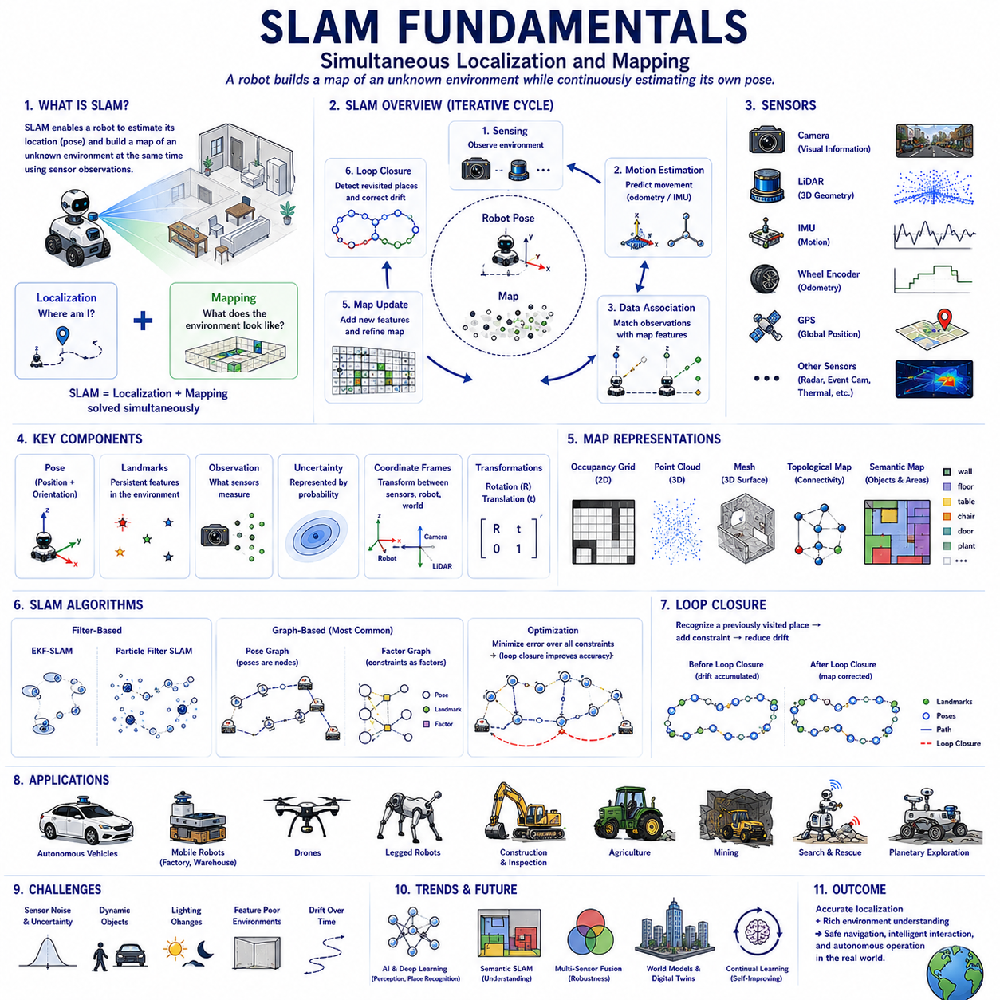
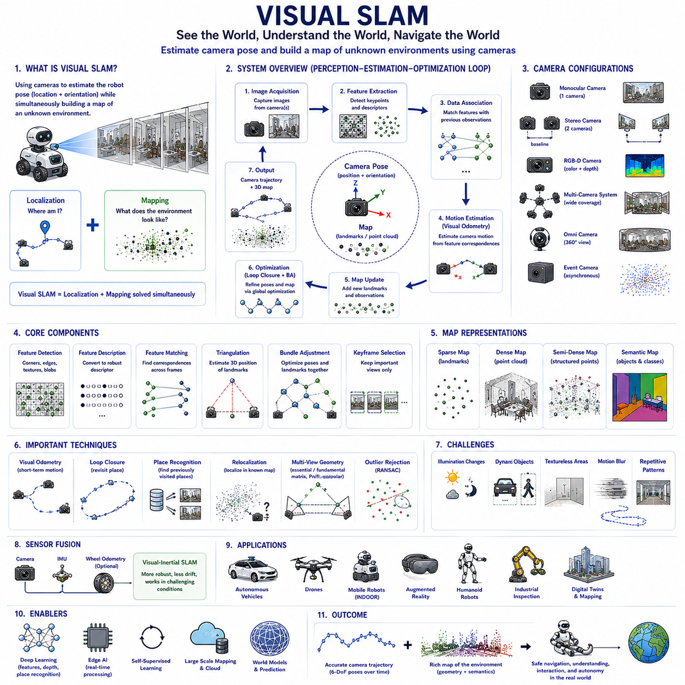
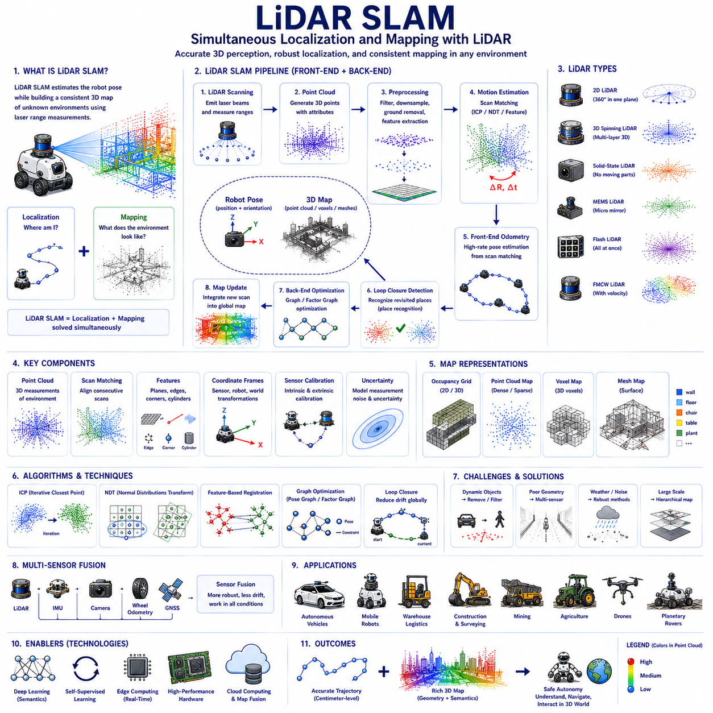
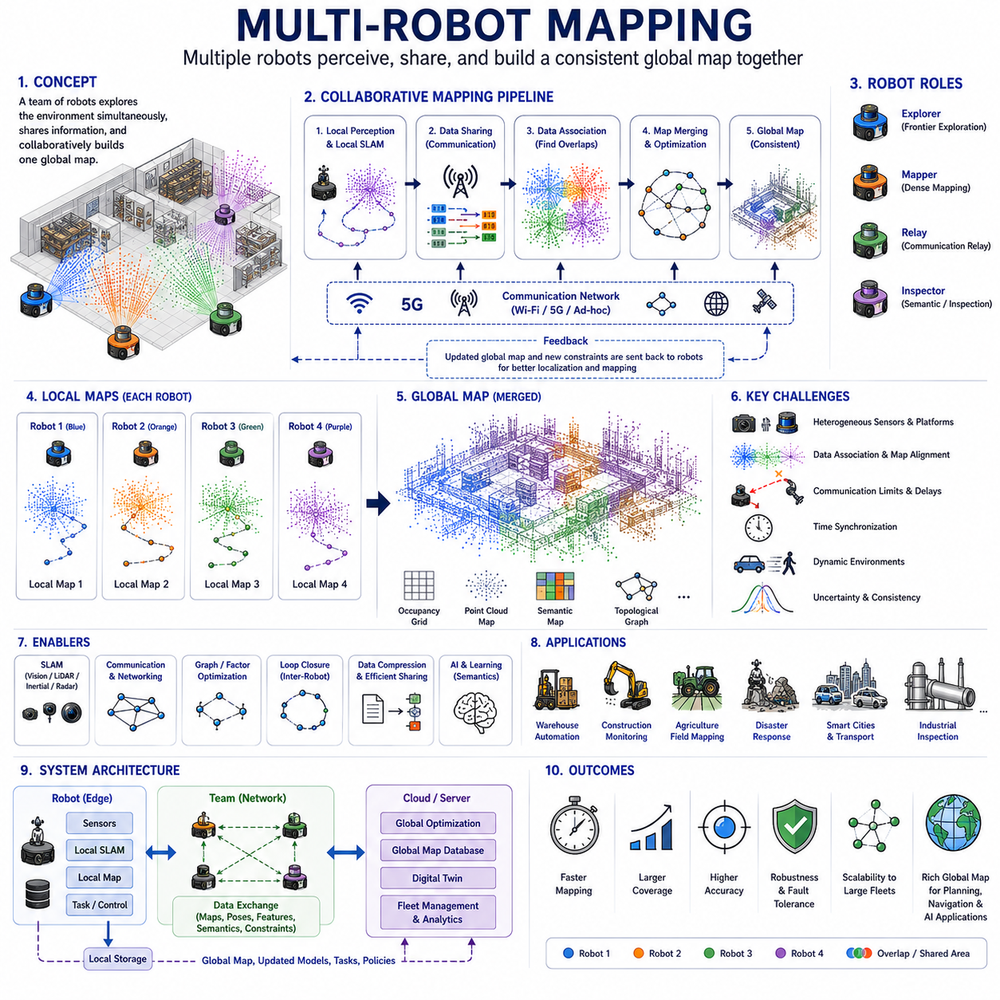
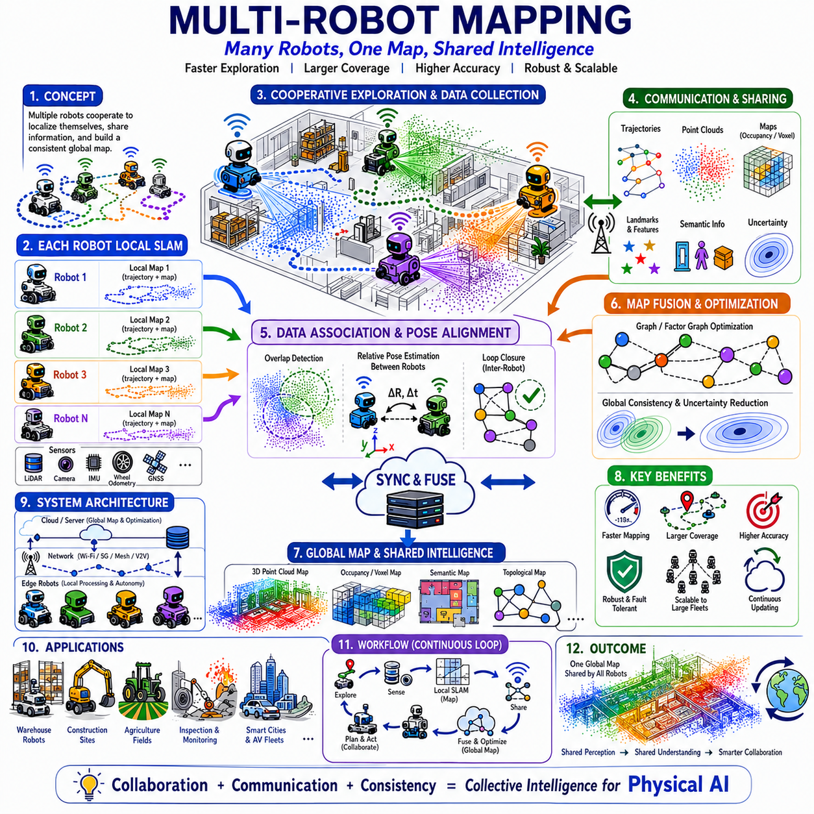
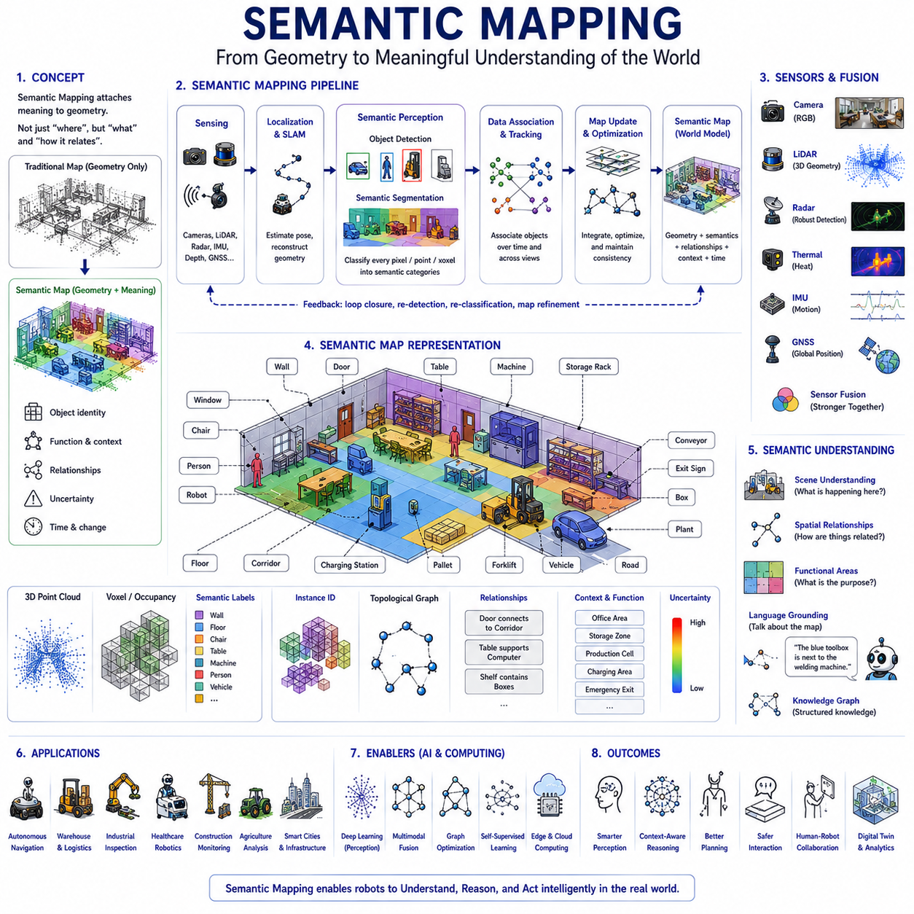
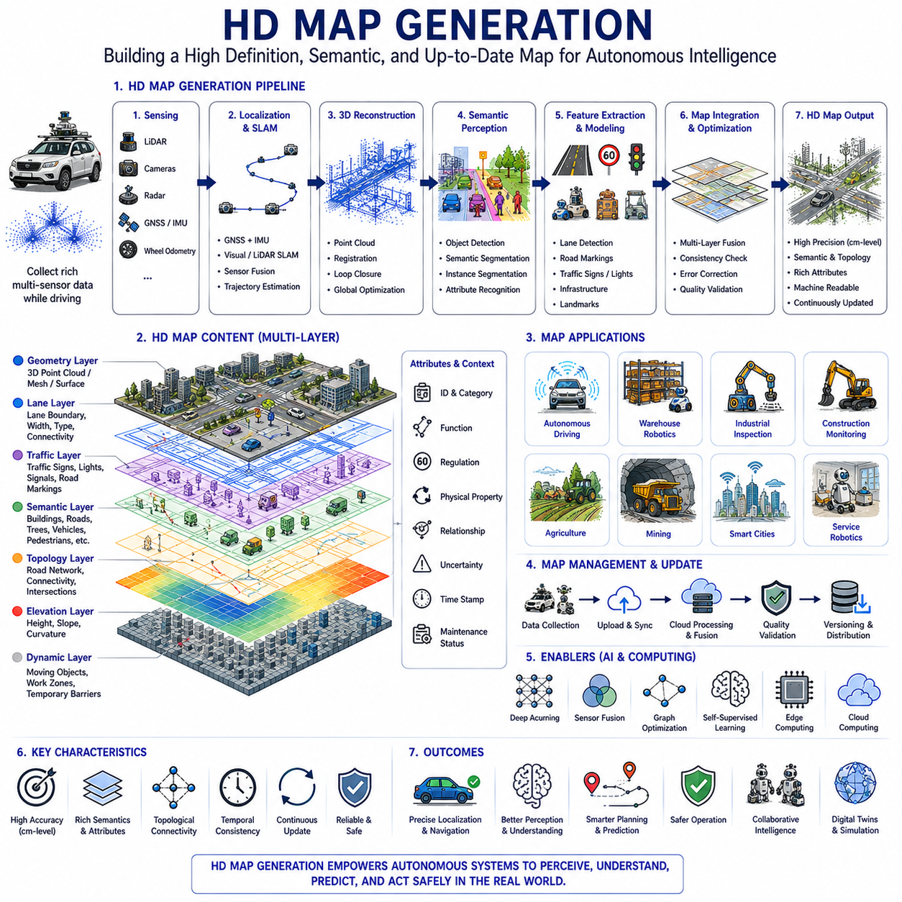
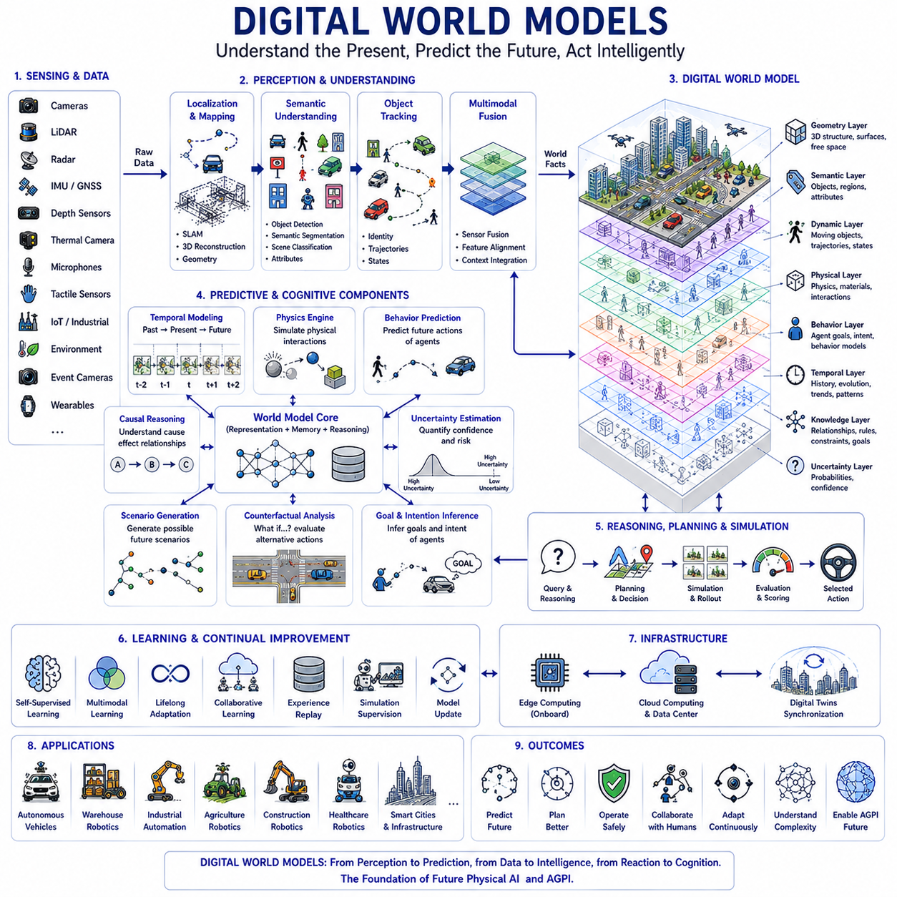
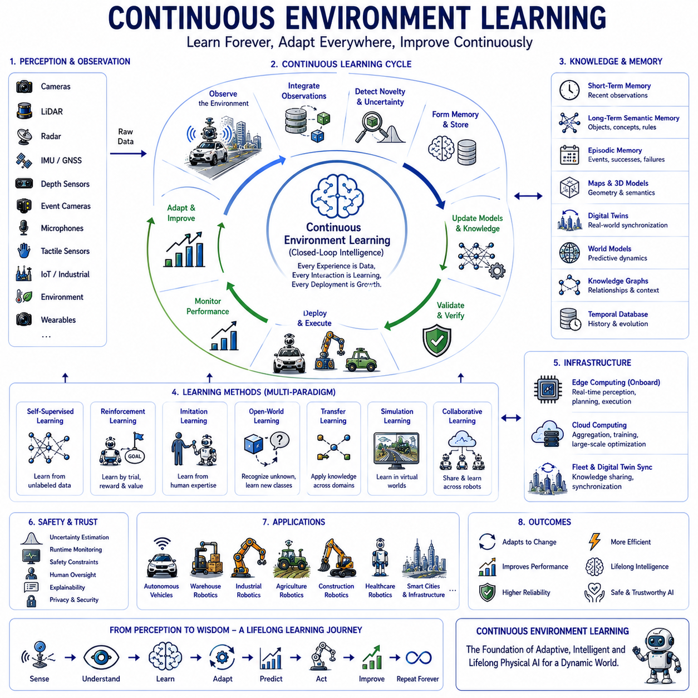

**Physical AI Engineering**

# Chapter 04 Localization, Mapping and World Understanding 

## 04-01 SLAM Fundamentals

{width="7.268055555555556in" height="7.268055555555556in"}

Simultaneous Localization and Mapping, commonly known as SLAM, is one of the most fundamental technologies in robotics, autonomous vehicles, and Physical AI because it enables an intelligent system to determine its own position while simultaneously constructing a map of an unknown environment. Before the emergence of SLAM, mobile robots generally required pre-installed infrastructure, predefined maps, external positioning systems, or manually configured navigation paths. These approaches significantly limited autonomy because robots could only operate reliably inside carefully prepared environments. SLAM fundamentally changed autonomous robotics by allowing machines to explore unknown spaces, continuously estimate their own location, construct increasingly accurate environmental maps, and adapt to environmental changes without requiring external localization infrastructure. Today, SLAM serves as one of the essential foundations of autonomous navigation, intelligent perception, environmental understanding, Digital Twins, World Models, and Artificial General Physical Intelligence.

The localization problem and the mapping problem are individually difficult estimation tasks. Localization requires a robot to determine its own position and orientation within an existing map. Mapping requires the robot to construct an accurate representation of the environment while assuming its own position is already known. SLAM combines these two problems simultaneously, creating an apparent paradox. Accurate localization requires a reliable map, while accurate mapping depends upon precise localization. Because neither the map nor the robot position is initially available, the robot must estimate both continuously using uncertain sensory observations and probabilistic reasoning. Solving this coupled estimation problem represents one of the greatest achievements in modern robotics.

Human navigation provides an intuitive analogy for understanding SLAM. When entering an unfamiliar building, people gradually recognize corridors, doors, intersections, furniture, windows, and landmarks while simultaneously estimating their own movement through the structure. Every observed feature contributes to improving both environmental understanding and self-localization. As additional observations accumulate, previously visited locations become recognizable, allowing accumulated errors to be corrected naturally. Humans rarely construct explicit numerical maps consciously, yet they continuously maintain internal spatial representations supporting navigation, memory, and planning. SLAM seeks to reproduce this capability computationally using sensors, estimation algorithms, and probabilistic models.

The fundamental objective of SLAM is to estimate three interconnected quantities continuously. The first is the robot trajectory describing the sequence of positions and orientations visited throughout operation. The second is the environmental map representing geometric and semantic characteristics of surrounding space. The third is the uncertainty associated with both trajectory and map estimates. Rather than producing absolute certainty, SLAM continuously refines probabilistic estimates as additional sensory information becomes available. Consequently, localization accuracy and map quality improve progressively throughout exploration.

Every SLAM system operates according to an iterative perception-estimation-update cycle. Sensors continuously observe the surrounding environment while motion sensors estimate robot displacement. Incoming observations are associated with previously observed environmental features whenever possible. Mathematical estimation algorithms combine motion predictions with sensor measurements to update robot pose and environmental structure. The resulting map then supports subsequent localization, creating a continuous feedback loop that gradually reduces uncertainty. This iterative process allows autonomous systems to navigate for extended periods within complex environments.

Robot pose estimation represents one of the core concepts within SLAM. A pose describes both the position and orientation of a robot within a chosen coordinate system. Two-dimensional robots typically estimate planar position together with heading angle, while three-dimensional robots estimate full six-degree-of-freedom motion consisting of three translations and three rotations. Pose estimation continuously integrates information from wheel encoders, inertial sensors, visual observations, LiDAR scans, GPS when available, and environmental landmarks. Because every measurement contains uncertainty, pose estimation remains probabilistic rather than deterministic.

Coordinate systems provide the mathematical framework supporting SLAM. Sensor observations originate within individual sensor coordinate frames. Cameras possess optical coordinate systems. LiDAR units measure distances relative to their mounting positions. IMUs estimate acceleration and rotation within body coordinates. Robot coordinate frames describe vehicle motion. World coordinate systems represent environmental structure. Transformation matrices continuously convert information among these coordinate systems, enabling consistent sensor fusion throughout the SLAM pipeline.

Motion estimation, sometimes called dead reckoning or odometry, predicts robot displacement using internal motion measurements. Wheeled robots estimate motion from encoder measurements. Legged robots estimate body displacement from joint kinematics. Drones integrate inertial measurements with motor dynamics. Although motion estimation provides high-frequency updates, small measurement errors accumulate continuously, causing position estimates to drift over time. SLAM therefore combines motion estimation with environmental observations that periodically correct accumulated drift.

Odometry constitutes one of the primary motion estimation sources. Wheel encoders measure rotational displacement which converts into estimated vehicle translation and rotation according to vehicle kinematics. Differential drive robots, Ackermann steering vehicles, omnidirectional platforms, tracked vehicles, and legged robots each require different kinematic models relating actuator motion to body movement. Wheel slip, uneven terrain, mechanical wear, encoder quantization, and calibration errors gradually degrade odometric accuracy, making external environmental observations essential for long-term localization.

Inertial Measurement Units provide complementary motion information. Accelerometers estimate linear acceleration while gyroscopes measure angular velocity. Magnetometers may estimate heading relative to Earth\'s magnetic field. IMUs operate at extremely high frequencies and remain independent of environmental visibility, making them particularly valuable during rapid motion or temporary sensor occlusion. However, inertial integration accumulates bias rapidly, requiring continual correction through visual, LiDAR, GPS, or landmark observations.

Environmental observations distinguish SLAM from pure odometry. Rather than relying exclusively upon internal motion estimation, SLAM continuously recognizes environmental features providing external reference information. Corners, edges, planes, textured regions, distinctive objects, reflective targets, semantic landmarks, and structural geometry all serve as reference features supporting localization. Whenever previously observed features become visible again, accumulated localization errors can be corrected significantly.

Landmarks represent persistent environmental features repeatedly observable from different robot positions. Effective landmarks should remain visually distinctive, geometrically stable, and observable under varying viewpoints. Natural landmarks include building corners, door frames, poles, trees, furniture, machinery, and structural edges. Artificial landmarks include AprilTags, QR markers, reflective targets, fiducial markers, and engineered reference objects. Landmark quality directly influences SLAM robustness because reliable feature association depends upon stable environmental references.

Feature extraction identifies meaningful structures within incoming sensor observations. Computer vision algorithms detect image corners, edges, blobs, textures, or learned visual descriptors. LiDAR processing identifies geometric points, planes, surface boundaries, or structural segments. Radar extracts reflective targets. Event cameras identify dynamic brightness changes. Feature extraction compresses raw sensor measurements into compact representations suitable for matching across multiple observations.

Feature descriptors encode distinctive characteristics allowing environmental features to be recognized repeatedly despite viewpoint changes, illumination variation, scale differences, and partial occlusion. Classical descriptors include SIFT, SURF, ORB, BRISK, and FAST. Modern Physical AI increasingly employs learned neural descriptors generated by deep convolutional networks or transformer architectures. Robust feature descriptors significantly improve data association and loop closure reliability.

Data association represents one of the most challenging components of SLAM. Whenever new observations arrive, the system must determine whether observed features correspond to previously mapped landmarks or represent entirely new environmental structures. Incorrect associations introduce severe mapping errors, while missed associations reduce localization accuracy. Modern algorithms employ probabilistic matching, geometric consistency, descriptor similarity, semantic reasoning, and temporal constraints to improve association reliability.

Observation models mathematically describe how sensors perceive environmental features. Camera models relate three-dimensional landmarks to image coordinates through perspective projection. LiDAR observation models describe range measurements relative to robot pose. Radar models incorporate signal reflection characteristics. IMU models estimate body dynamics. Accurate observation models allow estimation algorithms to compare predicted observations with actual sensor measurements, thereby refining localization and mapping simultaneously.

Probabilistic estimation forms the mathematical foundation of SLAM because all sensor measurements contain uncertainty. Rather than assuming perfect observations, SLAM represents robot poses, landmark locations, sensor measurements, and environmental structure as probability distributions. Bayesian estimation continuously updates these distributions as new evidence becomes available. Consequently, uncertainty gradually decreases whenever additional consistent observations accumulate.

Bayesian filtering provides one of the earliest probabilistic frameworks supporting SLAM. Motion models predict future robot states while observation models update predictions using sensor measurements. Prediction and correction alternate continuously throughout operation. This recursive estimation framework naturally accommodates measurement uncertainty while supporting real-time localization. Bayesian principles remain central throughout modern SLAM despite significant algorithmic advances.

Extended Kalman Filter SLAM historically represented one of the earliest successful probabilistic SLAM algorithms. EKF-SLAM jointly estimates robot pose and landmark positions within a single Gaussian probability distribution. Linearization approximates nonlinear robot motion and sensor models around current estimates. Although computational complexity limits scalability within extremely large environments, EKF-SLAM established many theoretical principles underlying later SLAM research.

Particle Filter SLAM represents probability distributions using numerous weighted hypotheses rather than single Gaussian estimates. Each particle describes one possible robot trajectory while maintaining corresponding environmental maps. Observations increase weights of consistent particles while inconsistent hypotheses gradually disappear. Particle filters naturally accommodate nonlinear motion, multimodal uncertainty, and ambiguous observations better than Gaussian filters, although computational cost increases substantially with environmental complexity.

Graph-Based SLAM has become one of the dominant modern formulations. Robot poses and environmental landmarks become graph nodes while sensor observations establish graph constraints. Optimization algorithms adjust node positions collectively until all constraints achieve maximum consistency. Rather than updating estimates incrementally alone, graph optimization revisits previous estimates whenever new observations become available, dramatically improving long-term accuracy and scalability.

Factor graphs extend graph-based formulations by representing probabilistic relationships explicitly. Variables describe unknown robot poses and landmark positions while factors encode measurement constraints. Nonlinear optimization simultaneously minimizes residual errors across all observations. Factor graph optimization supports large-scale mapping, loop closure correction, multi-sensor fusion, semantic observations, and collaborative multi-robot SLAM within unified mathematical frameworks.

Loop closure represents one of the defining characteristics distinguishing SLAM from ordinary localization. Whenever a robot revisits previously explored locations, accumulated localization drift becomes observable because current observations match earlier environmental features. Recognizing these revisited locations allows optimization algorithms to distribute accumulated errors throughout the trajectory, substantially improving both localization accuracy and map consistency. Reliable loop closure enables long-duration autonomous navigation within extensive environments.

Place recognition supports loop closure detection by identifying previously visited locations despite environmental changes, viewpoint differences, illumination variation, seasonal effects, and partial occlusion. Classical approaches compare handcrafted feature descriptors while modern systems increasingly employ deep neural embeddings, transformer representations, semantic understanding, and multimodal perception. Accurate place recognition significantly enhances map consistency during extended operation.

Map representations vary according to application requirements. Occupancy grids divide environments into discrete cells estimating free space, occupied regions, and unknown areas. Feature maps store sparse landmark locations. Point clouds preserve detailed three-dimensional geometry. Surface meshes reconstruct continuous environmental surfaces. Topological maps represent connectivity among significant locations. Semantic maps integrate object identities, room categories, functional regions, and contextual knowledge. Physical AI increasingly combines multiple complementary map representations simultaneously.

Two-dimensional SLAM remains common for indoor mobile robots operating primarily upon planar floors. Warehouse robots, service robots, hospital delivery systems, and factory logistics platforms frequently employ two-dimensional LiDAR together with wheel odometry and inertial sensing. Although simplified relative to three-dimensional environments, two-dimensional SLAM remains highly effective for many industrial navigation applications.

Three-dimensional SLAM has become increasingly important as autonomous systems operate within complex environments containing multiple elevation levels, staircases, ramps, bridges, vegetation, buildings, and irregular terrain. Drones, autonomous vehicles, quadruped robots, construction robots, mining vehicles, agricultural machines, and planetary rovers require full three-dimensional environmental understanding. Three-dimensional SLAM integrates stereo vision, RGB-D cameras, LiDAR, radar, IMUs, and semantic perception to reconstruct complete spatial environments.

Visual SLAM estimates robot motion using cameras as primary sensors. Monocular cameras provide rich semantic information but require scale estimation. Stereo cameras recover metric depth directly. RGB-D cameras simultaneously measure color and depth. Visual SLAM offers relatively low hardware cost while capturing extensive environmental detail, although performance depends upon illumination, texture, weather, and camera calibration.

LiDAR SLAM constructs maps using precise laser range measurements. LiDAR provides highly accurate geometric information independent of illumination conditions, making it particularly effective within industrial facilities, tunnels, underground mines, nighttime operation, and outdoor autonomous driving. Scan matching algorithms align successive LiDAR observations while optimization gradually refines complete environmental maps. Modern autonomous vehicles frequently combine LiDAR SLAM with visual perception to improve robustness.

Visual-Inertial SLAM integrates cameras with inertial measurement units. High-frequency inertial sensing stabilizes motion estimation during rapid movement while cameras periodically correct accumulated inertial drift. Visual-Inertial Odometry forms the front-end estimation process, while optimization and loop closure provide global consistency. This combination supports drones, augmented reality devices, humanoid robots, wearable systems, and mobile manipulation platforms.

Multi-Sensor SLAM represents the current state of the art within Physical AI. Cameras contribute semantic understanding. LiDAR supplies precise geometry. Radar remains robust during adverse weather. IMUs estimate rapid motion. GPS provides global reference outdoors. Wheel encoders estimate local displacement. Event cameras support high-speed operation. Thermal cameras contribute additional environmental understanding. Sensor fusion substantially improves robustness because weaknesses of individual sensors become compensated by complementary modalities.

Semantic SLAM extends geometric mapping by incorporating object recognition and environmental understanding. Instead of representing only points and surfaces, semantic maps identify doors, windows, machines, people, vehicles, furniture, vegetation, traffic signs, medical equipment, storage racks, and functional work areas. Semantic understanding greatly improves navigation, manipulation, human interaction, task planning, Digital Twin construction, and contextual reasoning.

Dynamic environments present major challenges because traditional SLAM assumes static surroundings. Moving people, vehicles, machinery, doors, elevators, animals, vegetation, and temporary obstacles violate this assumption. Modern Dynamic SLAM identifies moving objects separately from stable environmental structure, allowing reliable localization despite continuous environmental activity. Physical AI increasingly integrates motion segmentation, semantic perception, and predictive modeling to distinguish transient dynamics from permanent infrastructure.

World Models increasingly complement SLAM by extending geometric mapping toward predictive environmental understanding. Rather than merely estimating current geometry, World Models predict future environmental evolution, object interactions, human activities, and physical consequences. SLAM therefore becomes one component within broader cognitive environmental modeling rather than an isolated localization algorithm.

Digital Twins similarly build upon SLAM-generated maps. Accurate localization and environmental reconstruction provide the geometric foundation upon which Digital Twins integrate operational status, maintenance history, sensor telemetry, simulation models, production workflows, and predictive analytics. Continuous synchronization between SLAM observations and Digital Twins enables real-time monitoring, infrastructure management, predictive maintenance, and intelligent industrial automation.

Artificial Intelligence is transforming SLAM fundamentally. Deep neural networks improve feature extraction, place recognition, semantic segmentation, loop closure detection, uncertainty estimation, sensor fusion, and environmental understanding. Transformer architectures increasingly replace handcrafted feature engineering with learned representations adaptable across diverse environments. Large Vision Models and Vision-Language Models further enrich mapping by incorporating semantic reasoning directly into localization pipelines.

Edge AI enables real-time SLAM directly aboard autonomous robots. Dedicated GPU accelerators, AI processors, heterogeneous computing architectures, and optimized neural inference engines allow simultaneous perception, localization, mapping, planning, obstacle avoidance, and semantic reasoning under strict computational constraints. Cloud infrastructure complements edge processing by supporting large-scale map fusion, fleet coordination, Digital Twin synchronization, and continual model improvement.

SLAM supports nearly every major Physical AI application. Autonomous mobile robots navigate factories and warehouses. Self-driving vehicles localize within urban environments. Agricultural robots map crop fields. Construction robots inspect infrastructure. Mining vehicles operate underground without GPS. Search-and-rescue robots explore disaster sites. Planetary rovers investigate extraterrestrial terrain. Medical robots navigate hospitals. Humanoid robots interact naturally with human environments. In every case, accurate localization and mapping constitute essential prerequisites for intelligent autonomy.

Future SLAM will evolve beyond simultaneous localization and geometric mapping toward comprehensive cognitive world understanding. Multimodal perception, semantic reasoning, World Models, Digital Twins, continual learning, self-supervised perception, contextual understanding, environmental awareness, large foundation models, and predictive intelligence will merge into unified Physical AI architectures. Rather than constructing only geometric maps, future systems will continuously develop rich, dynamic, semantic, predictive, and interactive representations of the physical world that support reasoning, planning, communication, collaboration, and lifelong autonomous learning. As Artificial General Physical Intelligence continues to mature, SLAM Fundamentals will remain one of the indispensable scientific and engineering foundations enabling intelligent machines to perceive, understand, navigate, and interact safely with complex real-world environments.

## 04-02 Visual SLAM

{width="7.268055555555556in" height="7.268055555555556in"}

Visual SLAM, commonly abbreviated as V-SLAM, is one of the most influential technologies in modern robotics, autonomous vehicles, augmented reality, virtual reality, drones, humanoid robots, and Physical AI because it enables intelligent systems to estimate their own motion while simultaneously constructing an environmental map using cameras as the primary sensing modality. Unlike traditional navigation systems that depend upon laser scanners, external positioning infrastructure, or pre-existing maps, Visual SLAM utilizes visual information captured from one or more cameras to continuously estimate the robot\'s pose and reconstruct the surrounding environment. Since cameras provide dense semantic information together with geometric observations, Visual SLAM not only supports localization and mapping but also forms the perception foundation for object recognition, scene understanding, semantic reasoning, contextual perception, environmental awareness, Digital Twins, and World Models. As camera technology becomes increasingly affordable, lightweight, and computationally efficient, Visual SLAM has become one of the most widely adopted localization technologies within Physical AI systems.

The motivation for Visual SLAM originates from biological vision. Humans primarily navigate unfamiliar environments using visual perception rather than external positioning systems. When entering an unknown building, people observe walls, corridors, furniture, doors, windows, signs, and other landmarks while simultaneously estimating their own movement. Previously visited locations become recognizable, allowing accumulated navigation errors to be corrected naturally. Humans continuously integrate visual observations into internal spatial representations without explicitly constructing numerical maps. Visual SLAM attempts to reproduce this capability computationally by combining cameras, geometric estimation, probabilistic optimization, and machine learning into a unified localization and mapping framework.

Visual SLAM fundamentally solves two tightly coupled estimation problems simultaneously. The first estimates the camera trajectory representing the sequence of positions and orientations observed throughout operation. The second reconstructs a geometric representation of the surrounding environment. Since camera observations contain uncertainty and robot motion continuously accumulates estimation errors, both trajectory estimation and environmental reconstruction must evolve together. Each newly observed visual feature contributes simultaneously to improving localization accuracy and map consistency. This mutual dependence represents the defining characteristic of all SLAM systems.

A Visual SLAM system operates through a continuous perception-estimation-optimization loop. Cameras capture images of the environment at high frequency. Visual features are extracted from incoming images and matched against previously observed features. Camera motion is estimated according to feature displacement. Newly observed environmental structures are incorporated into the map. Optimization algorithms refine both camera trajectory and map consistency whenever additional observations become available. This iterative process allows localization accuracy and environmental representation to improve progressively throughout exploration.

Cameras serve as the primary sensing modality within Visual SLAM. Compared with LiDAR or radar, cameras offer significantly richer semantic information because they capture object appearance, texture, color, lighting, shadows, materials, and contextual relationships simultaneously. Cameras are also relatively inexpensive, lightweight, compact, energy efficient, and widely available. Consequently, Visual SLAM can be deployed across mobile robots, autonomous vehicles, drones, wearable devices, smartphones, industrial inspection platforms, and service robots without requiring expensive sensing hardware.

Different camera configurations provide different capabilities. Monocular cameras utilize a single imaging sensor. Stereo cameras employ two synchronized cameras separated by a known baseline. RGB-D cameras simultaneously capture color images together with depth measurements. Multi-camera systems combine several synchronized viewpoints covering wide fields of view. Omnidirectional cameras provide nearly complete environmental visibility. Event cameras capture asynchronous brightness changes instead of conventional image frames. Each camera configuration presents unique advantages and engineering tradeoffs depending upon operational requirements.

Monocular Visual SLAM represents the simplest and most economical configuration because only one camera is required. However, monocular systems cannot directly observe metric depth from individual images. Scale ambiguity therefore becomes one of the primary challenges. Motion estimation remains accurate only up to an unknown scale factor unless additional information becomes available. Scale recovery may utilize inertial measurements, known object dimensions, stereo initialization, GPS observations, wheel odometry, or learned depth estimation models. Despite this limitation, monocular Visual SLAM remains extremely popular because of its low hardware cost and broad applicability.

Stereo Visual SLAM eliminates scale ambiguity by observing the environment simultaneously from two horizontally separated cameras. Corresponding image features appear at different pixel locations according to object distance. Triangulation estimates metric three-dimensional positions directly from disparity measurements. Accurate depth estimation substantially improves map quality, initialization robustness, motion estimation, obstacle avoidance, and navigation accuracy. Stereo systems require precise calibration and synchronization but generally outperform monocular systems within metric localization tasks.

RGB-D Visual SLAM incorporates cameras capable of measuring both color information and dense depth simultaneously. Structured light sensors and time-of-flight cameras directly estimate depth for every visible pixel. Consequently, environmental reconstruction becomes significantly easier than monocular or stereo approaches because explicit geometric information accompanies visual appearance. RGB-D systems perform particularly well indoors where illumination remains controlled and sensing range remains appropriate.

Feature detection represents one of the earliest stages of Visual SLAM. Rather than processing every image pixel equally, the system identifies visually distinctive image regions likely to remain recognizable across multiple viewpoints. Corners, edges, textured regions, blobs, junctions, and repetitive geometric structures frequently provide robust features suitable for localization. Stable features significantly improve tracking performance because they remain detectable despite moderate viewpoint changes, illumination variation, image noise, and partial occlusion.

Feature description transforms detected image features into compact numerical representations supporting repeated recognition. Classical feature descriptors include SIFT, SURF, ORB, BRISK, FAST, and BRIEF. These descriptors encode local appearance patterns while remaining relatively invariant to rotation, scale changes, brightness variation, and perspective distortion. Modern Physical AI increasingly replaces handcrafted descriptors with deep neural embeddings learned directly from large visual datasets, substantially improving robustness across diverse environments.

Feature matching establishes correspondences between observations acquired at different times. Visual descriptors extracted from current images are compared with descriptors stored from previous observations. Successful matching allows the system to recognize identical environmental features viewed from different robot positions. Reliable correspondence estimation forms the foundation of motion estimation, map construction, loop closure detection, and long-term localization accuracy. Incorrect feature matches introduce localization errors, making robust matching algorithms essential.

Visual tracking continuously estimates camera motion by analyzing how image features move across successive frames. Small feature displacements correspond to camera movement relative to environmental structure. Motion estimation algorithms calculate the camera trajectory explaining observed feature motion while accounting for geometric constraints, projection models, and measurement uncertainty. Successful tracking maintains continuous localization even during extended autonomous operation.

Optical flow provides another important mechanism supporting visual motion estimation. Optical flow estimates apparent pixel movement between consecutive images. Dense optical flow computes motion throughout the entire image, whereas sparse optical flow estimates motion only for selected feature points. Optical flow supports camera tracking, dynamic object detection, motion segmentation, obstacle avoidance, and prediction of environmental changes during autonomous navigation.

Visual odometry constitutes the front-end motion estimation process within many Visual SLAM systems. Instead of constructing globally consistent maps immediately, visual odometry estimates incremental camera motion using consecutive image observations. Although visual odometry alone gradually accumulates drift, it provides accurate short-term motion estimates at high frequency. Back-end optimization subsequently corrects accumulated errors through loop closure and global map refinement.

Image registration aligns multiple observations captured from different viewpoints. Geometric transformations estimate camera motion explaining image correspondence while minimizing reprojection error. Image registration supports map reconstruction, loop closure detection, dense mapping, multi-view reconstruction, and panoramic environmental representation. Robust registration becomes particularly challenging under changing illumination, viewpoint variation, dynamic environments, and repetitive visual patterns.

Camera calibration forms an essential prerequisite for Visual SLAM accuracy. Calibration estimates intrinsic camera parameters including focal length, principal point, distortion coefficients, and pixel geometry. Extrinsic calibration estimates spatial relationships among multiple cameras or between cameras and additional sensors such as LiDAR, IMUs, wheel encoders, and robotic manipulators. Calibration errors directly influence localization precision, depth estimation, and map consistency.

Camera projection models mathematically describe how three-dimensional environmental points become projected onto two-dimensional image coordinates. The pinhole camera model provides the most widely used approximation. Real cameras additionally exhibit radial distortion, tangential distortion, rolling shutter effects, chromatic aberration, lens imperfections, and exposure variation. Accurate projection models significantly improve geometric reconstruction and optimization accuracy.

Triangulation estimates three-dimensional landmark positions from multiple camera observations. When identical visual features become visible from different viewpoints, intersecting observation rays estimate corresponding three-dimensional coordinates. Triangulated landmarks gradually populate the environmental map while simultaneously supporting subsequent localization. Higher observation diversity generally improves triangulation accuracy by reducing geometric uncertainty.

Bundle adjustment represents one of the most powerful optimization techniques within Visual SLAM. Rather than optimizing camera poses or landmark positions independently, bundle adjustment simultaneously refines both by minimizing reprojection error across all available observations. Although computationally demanding, bundle adjustment substantially improves localization precision, map consistency, and long-term trajectory accuracy. Modern optimization libraries enable efficient bundle adjustment even for very large environments.

Loop closure represents one of the defining capabilities distinguishing Visual SLAM from pure visual odometry. Whenever previously visited locations become visible again, corresponding visual features establish constraints connecting current observations with historical maps. Optimization algorithms distribute accumulated localization errors across the complete trajectory, significantly reducing drift while improving environmental consistency. Reliable visual place recognition therefore becomes essential for long-duration autonomous navigation.

Visual place recognition identifies previously visited locations despite changes in viewpoint, illumination, weather, seasonal appearance, partial occlusion, or environmental modifications. Classical methods compare handcrafted feature descriptors, whereas modern systems increasingly employ deep neural embeddings, transformer representations, semantic features, and vision-language models. Robust place recognition substantially improves large-scale mapping reliability.

Sparse mapping represents environments using only selected visual landmarks extracted from feature observations. Sparse maps require relatively little memory and computational effort while supporting efficient localization. However, sparse representations provide limited environmental detail, making them less suitable for manipulation, obstacle avoidance, or Digital Twin generation.

Dense mapping reconstructs nearly complete environmental geometry by estimating depth throughout visible image regions. Dense reconstruction captures surfaces, walls, floors, furniture, vegetation, and structural details with high spatial resolution. Although computationally intensive, dense maps support manipulation planning, Digital Twin construction, semantic scene understanding, inspection, simulation, and immersive visualization.

Semi-dense mapping provides a compromise between sparse and dense reconstruction by reconstructing only visually informative image regions while ignoring textureless surfaces. This approach significantly reduces computational requirements while preserving most useful geometric information required for navigation and environmental understanding.

Keyframes provide an efficient strategy for managing long visual sequences. Rather than storing every captured image indefinitely, Visual SLAM selects representative images whenever sufficient camera motion occurs. Keyframes maintain long-term environmental memory while limiting computational growth. Optimization primarily operates over selected keyframes rather than complete image sequences, improving scalability significantly.

Pose graphs represent relationships among camera poses within graph-based Visual SLAM. Nodes correspond to camera positions while edges encode relative motion constraints derived from visual observations. Global optimization adjusts all poses simultaneously until graph consistency becomes maximized. Pose graph optimization remains one of the dominant back-end formulations within modern Visual SLAM.

Visual-Inertial SLAM combines cameras with inertial measurement units to improve robustness. IMUs provide high-frequency motion estimation independent of visual texture or illumination. Cameras periodically correct inertial drift using environmental observations. This combination substantially improves localization during rapid motion, temporary image degradation, or feature-poor environments. Visual-Inertial SLAM has therefore become standard within drones, augmented reality, humanoid robotics, and mobile manipulation.

Semantic Visual SLAM extends geometric mapping by recognizing environmental objects and assigning semantic labels to reconstructed structures. Instead of mapping only points and surfaces, semantic maps identify doors, tables, vehicles, people, machinery, corridors, vegetation, storage shelves, medical equipment, and functional workspaces. Semantic understanding improves navigation, manipulation, contextual reasoning, Digital Twin construction, and human-robot interaction.

Dynamic Visual SLAM addresses one of the most significant limitations of traditional approaches. Classical Visual SLAM assumes static environments, whereas real-world scenes contain moving people, vehicles, machinery, doors, animals, vegetation, and temporary obstacles. Dynamic Visual SLAM separates moving objects from static environmental structure using motion segmentation, semantic perception, optical flow, object tracking, and learned motion prediction. Consequently, localization remains reliable despite continuous environmental activity.

Deep learning increasingly transforms Visual SLAM. Neural networks improve feature detection, descriptor generation, place recognition, depth estimation, semantic segmentation, uncertainty estimation, dynamic object detection, image enhancement, and environmental understanding. Transformer architectures and large vision models provide generalized visual representations significantly more robust than handcrafted features across diverse operational environments.

Self-supervised learning further enhances Visual SLAM by enabling continuous adaptation without extensive manual annotation. Cameras naturally generate enormous quantities of unlabeled visual data throughout robot operation. Predictive learning, photometric consistency, temporal continuity, geometric constraints, and multimodal supervision collectively provide supervisory signals allowing visual representations to improve continually during deployment.

World Models increasingly complement Visual SLAM by extending geometric reconstruction toward predictive environmental understanding. Rather than reconstructing only current scene geometry, World Models estimate future environmental evolution, object interactions, human activities, physical dynamics, and task-relevant contextual information. Visual SLAM therefore becomes one component within broader cognitive environmental intelligence.

Digital Twins similarly build upon Visual SLAM maps by integrating operational status, maintenance history, sensor telemetry, simulation models, workflow information, inspection results, and predictive analytics. Continuous synchronization between Visual SLAM observations and Digital Twin representations enables real-time industrial monitoring, infrastructure management, predictive maintenance, autonomous inspection, and intelligent decision support.

Edge AI enables real-time Visual SLAM aboard autonomous platforms. Modern GPUs, AI accelerators, heterogeneous processors, and optimized inference engines simultaneously execute image processing, feature extraction, optimization, semantic perception, and neural inference under strict power constraints. Cloud infrastructure complements onboard processing through large-scale map fusion, fleet coordination, continual learning, and long-term environmental memory.

Visual SLAM supports an extraordinary diversity of Physical AI applications. Autonomous mobile robots navigate factories and warehouses. Humanoid robots understand human environments. Agricultural robots map crop fields. Construction robots inspect infrastructure. Drones perform aerial mapping. Autonomous vehicles localize within urban environments. Planetary rovers explore extraterrestrial surfaces. Service robots navigate homes and hospitals. Wearable augmented reality devices estimate user motion continuously. Industrial inspection systems reconstruct Digital Twins of manufacturing facilities. Across all these applications, cameras provide both localization and rich environmental understanding simultaneously.

Future Visual SLAM will continue evolving from purely geometric localization toward comprehensive cognitive perception systems integrating multimodal sensing, semantic reasoning, contextual perception, environmental awareness, World Models, Digital Twins, continual learning, self-supervised adaptation, foundation models, vision-language reasoning, and predictive intelligence. Rather than simply estimating camera trajectories and reconstructing geometry, future Visual SLAM systems will continuously develop rich semantic understanding of dynamic environments, anticipate future environmental evolution, communicate naturally with humans, cooperate with other autonomous agents, and support lifelong autonomous learning. As Artificial General Physical Intelligence progresses, Visual SLAM will remain one of the indispensable technologies enabling intelligent machines to perceive, understand, navigate, and interact safely within the visual complexity of the real world.

## 04-03 LiDAR SLAM

{width="7.268055555555556in" height="7.268055555555556in"}

LiDAR SLAM, which stands for Light Detection and Ranging Simultaneous Localization and Mapping, is one of the most accurate and reliable localization technologies in modern robotics, autonomous vehicles, industrial automation, mining, construction, logistics, and Physical AI. Unlike Visual SLAM, which primarily depends on cameras to estimate motion and reconstruct the surrounding environment, LiDAR SLAM utilizes laser ranging measurements to generate precise three-dimensional geometric representations of the physical world. By continuously scanning the surrounding environment with laser beams, estimating robot motion, matching consecutive scans, and optimizing the global map, LiDAR SLAM enables autonomous systems to localize themselves while simultaneously constructing highly accurate maps even under challenging environmental conditions. Because laser measurements are largely independent of illumination and visual texture, LiDAR SLAM provides exceptional robustness in situations where conventional vision systems may struggle, including darkness, low-light environments, underground tunnels, warehouses, industrial facilities, forests, construction sites, and outdoor autonomous driving.

The motivation behind LiDAR SLAM originates from the limitations of traditional localization methods. GPS provides global positioning but performs poorly inside buildings, underground structures, urban canyons, forests, or dense industrial environments. Camera-based systems offer rich semantic information but depend heavily on lighting conditions, visual texture, weather, and image quality. Wheel odometry accumulates drift because of wheel slip and mechanical uncertainty. LiDAR introduces a fundamentally different sensing principle by directly measuring geometric distances through laser reflections. Since every scan represents an accurate measurement of surrounding geometry, localization becomes significantly more reliable, particularly in environments where geometric structures remain stable over time.

The fundamental objective of LiDAR SLAM is identical to all SLAM systems: simultaneously estimate the robot trajectory while constructing a consistent environmental map. However, instead of relying upon image features, LiDAR SLAM estimates robot motion using geometric correspondence between consecutive laser scans. Every scan captures thousands or even millions of distance measurements describing surrounding objects, walls, floors, ceilings, machinery, vehicles, vegetation, buildings, and terrain. These geometric observations provide the foundation for localization, mapping, loop closure detection, and long-term environmental reconstruction.

LiDAR itself operates according to a simple but highly precise physical principle. A laser emitter generates narrow pulses of coherent light which propagate through space until striking surrounding objects. Reflected light returns to the receiver, allowing the system to calculate distance according to the measured time of flight. Since the speed of light remains constant, extremely accurate range measurements become possible. Modern LiDAR systems often produce millions of distance measurements every second while maintaining centimeter-level or even millimeter-level accuracy under appropriate operating conditions.

Various LiDAR architectures exist depending upon application requirements. Mechanical spinning LiDAR employs rotating laser assemblies that provide full three-dimensional environmental coverage. Solid-state LiDAR eliminates moving mechanical components through electronic beam steering, improving durability and reducing manufacturing cost. MEMS LiDAR utilizes micro-electromechanical mirrors for compact beam steering. Flash LiDAR illuminates entire scenes simultaneously without mechanical scanning. Frequency-modulated continuous-wave LiDAR measures both distance and relative velocity while improving interference resistance. Each architecture offers unique tradeoffs among field of view, measurement density, scanning speed, cost, robustness, and power consumption.

Two-dimensional LiDAR has traditionally dominated indoor robotics applications. A rotating laser scanner measures distances within a horizontal plane, producing accurate representations of walls, furniture, machinery, storage racks, and obstacles. Two-dimensional LiDAR remains highly effective for warehouse robots, hospital delivery systems, factory logistics platforms, and service robots operating primarily on flat floors. Because computational complexity remains relatively low, two-dimensional LiDAR SLAM supports highly reliable real-time localization with modest hardware requirements.

Three-dimensional LiDAR extends environmental perception beyond planar mapping. Multiple laser channels simultaneously measure surrounding geometry across vertical and horizontal directions, generating dense point clouds describing complete three-dimensional environments. Autonomous vehicles, construction robots, mining equipment, agricultural machinery, quadruped robots, drones, and planetary rovers increasingly depend upon three-dimensional LiDAR to navigate complex terrain containing elevation changes, vegetation, bridges, tunnels, buildings, and irregular structures.

The primary output of every LiDAR sensor is a point cloud. Each measured point contains three-dimensional spatial coordinates representing the location where a laser beam reflected from the environment. Additional attributes may include reflectivity, return intensity, timestamp, ring index, multiple return information, confidence values, or Doppler velocity depending upon sensor architecture. Point clouds collectively represent detailed geometric snapshots of the surrounding environment at successive moments in time.

Point cloud processing forms one of the central components of LiDAR SLAM. Raw point clouds frequently contain measurement noise, atmospheric interference, dynamic objects, multiple reflections, sensor artifacts, and redundant information. Filtering algorithms remove invalid measurements while downsampling reduces computational complexity. Ground segmentation separates floor surfaces from elevated structures. Surface normal estimation characterizes local geometry. Clustering identifies distinct objects. Feature extraction identifies stable geometric structures suitable for localization. Effective preprocessing substantially improves subsequent scan matching accuracy.

Coordinate systems provide the mathematical framework supporting LiDAR SLAM. Every LiDAR measurement originates within the sensor coordinate frame. Transformations relate sensor coordinates to robot body coordinates, inertial coordinates, camera coordinates, manipulator coordinates, and global world coordinates. Accurate extrinsic calibration ensures that observations from multiple sensors remain geometrically consistent throughout localization and mapping.

Motion estimation predicts robot displacement between consecutive LiDAR scans. Wheel odometry, inertial measurement units, visual odometry, GNSS observations, vehicle kinematic models, or previous LiDAR estimates may provide initial motion predictions. These predictions reduce scan matching search space while improving computational efficiency. However, prediction errors inevitably accumulate over time, requiring continuous correction through geometric alignment of environmental observations.

Scan matching represents the defining algorithmic component of LiDAR SLAM. Consecutive point clouds are aligned by estimating the rigid transformation minimizing geometric discrepancy between overlapping observations. Successful scan matching estimates robot motion directly from environmental geometry rather than external positioning systems. Because surrounding infrastructure typically changes relatively slowly, geometric correspondence provides highly stable localization references.

The Iterative Closest Point algorithm remains one of the most influential scan matching methods. ICP repeatedly establishes correspondences between neighboring points and estimates the rigid transformation minimizing point-to-point or point-to-plane distances. Although conceptually straightforward, ICP requires sufficiently accurate initialization because convergence depends upon reasonable initial alignment. Numerous ICP variants improve robustness, computational efficiency, and convergence properties across different operational environments.

Normal Distributions Transform represents another widely adopted scan matching technique. Rather than matching individual points directly, NDT models local environmental structure using probabilistic Gaussian distributions. Incoming scans optimize alignment by maximizing consistency with these distributions. NDT generally exhibits greater robustness within sparse environments and often converges successfully under larger initial misalignment than classical ICP approaches.

Feature-based LiDAR SLAM extracts distinctive geometric structures instead of matching complete point clouds. Corners, edges, planes, cylinders, poles, building facades, structural boundaries, and other stable geometric primitives become localization landmarks. Matching compact feature sets substantially reduces computational cost while improving robustness in large-scale environments. Modern algorithms often combine point-based and feature-based registration for optimal performance.

Geometric features within LiDAR data differ fundamentally from visual features. Instead of image textures or color patterns, LiDAR identifies structural geometry. Vertical walls produce planar features. Building corners generate edge features. Utility poles become cylindrical features. Road surfaces define ground planes. Trees produce volumetric structures. Industrial machinery exhibits characteristic geometric signatures. These features remain observable regardless of illumination conditions, making LiDAR particularly reliable across diverse operating environments.

Registration quality depends strongly upon environmental structure. Rich geometric environments containing diverse architectural features generally produce highly accurate localization. Conversely, long featureless corridors, open parking lots, tunnels with repetitive geometry, deserts, snow-covered landscapes, or dense vegetation may reduce registration reliability because geometric uniqueness becomes limited. Multi-sensor fusion frequently compensates for such environmental weaknesses.

Probabilistic estimation remains fundamental throughout LiDAR SLAM because every range measurement contains uncertainty. Sensor noise, beam divergence, atmospheric effects, surface reflectivity, incidence angle, moving objects, and calibration errors all influence measurement quality. Bayesian estimation frameworks continuously integrate prior motion predictions with new geometric observations while explicitly modeling uncertainty throughout localization and mapping.

Graph optimization has become the dominant back-end formulation within modern LiDAR SLAM. Robot poses become graph nodes while scan matching constraints establish graph edges. Additional observations from loop closure, GPS, IMUs, cameras, wheel encoders, semantic landmarks, or Digital Twin references create supplementary constraints. Nonlinear optimization simultaneously adjusts all poses until global consistency becomes maximized. Graph optimization enables long-duration operation while effectively distributing accumulated localization errors.

Factor graph formulations further generalize graph optimization by explicitly modeling probabilistic relationships among robot poses, landmarks, sensor observations, and motion estimates. Optimization minimizes residual errors across all measurements simultaneously. Factor graphs naturally support heterogeneous sensor fusion, semantic observations, dynamic environments, collaborative multi-robot mapping, and large-scale environmental reconstruction within unified mathematical frameworks.

Loop closure represents one of the most important mechanisms maintaining long-term map consistency. Whenever robots revisit previously explored locations, newly acquired scans become matched against historical observations. Successful recognition reveals accumulated localization drift. Optimization subsequently redistributes accumulated errors throughout the robot trajectory, dramatically improving both localization accuracy and map quality. Reliable loop closure enables autonomous operation over hundreds of kilometers or months of continuous mapping.

Place recognition within LiDAR SLAM differs significantly from visual place recognition. Instead of comparing visual appearance, LiDAR systems compare geometric signatures extracted from point clouds. Scan descriptors, shape histograms, global geometric fingerprints, learned point cloud embeddings, voxel representations, and neural geometric descriptors increasingly support reliable recognition despite viewpoint changes, seasonal variation, weather conditions, or partial environmental modification.

Map representations vary according to application objectives. Occupancy grids estimate free and occupied space for navigation. Sparse feature maps store only geometric landmarks. Dense point cloud maps preserve detailed three-dimensional geometry. Voxel maps discretize environmental volume into regular cells supporting efficient computation. Surface meshes reconstruct continuous environmental surfaces. Semantic maps associate geometric structures with object categories, functional regions, operational workflows, and contextual knowledge. Hybrid mapping approaches frequently combine multiple complementary representations simultaneously.

Voxelization significantly improves computational scalability by partitioning space into volumetric cells. Rather than processing millions of individual points independently, LiDAR SLAM aggregates neighboring measurements within shared voxels. Voxel filtering reduces memory consumption while preserving essential geometric information. Modern real-time systems frequently employ adaptive voxel structures allowing computational complexity to scale efficiently with environmental size.

Ground segmentation provides another essential preprocessing step. Since ground surfaces often dominate outdoor point clouds, separating ground from elevated structures improves obstacle detection, feature extraction, and registration robustness. Plane fitting, surface normal estimation, progressive filtering, machine learning, and semantic segmentation all contribute to reliable ground estimation across diverse terrain conditions.

Dynamic object removal has become increasingly important as autonomous systems operate within populated environments. Traditional LiDAR SLAM assumes static surroundings, yet moving vehicles, pedestrians, forklifts, machinery, doors, vegetation, and temporary obstacles introduce inconsistent observations. Dynamic LiDAR SLAM identifies transient objects using temporal consistency, motion segmentation, semantic perception, occupancy reasoning, and learned object detection. Removing dynamic observations significantly improves localization stability.

Multi-sensor fusion substantially enhances LiDAR SLAM robustness. Cameras contribute semantic information unavailable from geometry alone. IMUs provide high-frequency motion estimation during rapid movement. Wheel odometry estimates local displacement. GNSS supplies global positioning outdoors. Radar improves perception during rain, fog, snow, or dust. Thermal cameras detect heat signatures. Event cameras support high-speed motion estimation. Fusing complementary sensing modalities compensates for limitations of individual sensors while improving overall localization accuracy.

LiDAR-Inertial SLAM has become one of the most successful modern localization architectures. High-frequency inertial measurements predict robot motion between LiDAR scans, while geometric registration continuously corrects inertial drift. Tight coupling between LiDAR and IMU measurements significantly improves localization during aggressive motion, uneven terrain, high-speed driving, and temporary geometric degradation. Numerous state-of-the-art autonomous vehicles employ tightly integrated LiDAR-Inertial systems.

Semantic LiDAR SLAM extends geometric mapping toward cognitive environmental understanding. Deep neural networks identify buildings, roads, sidewalks, vegetation, vehicles, pedestrians, industrial machinery, utility infrastructure, storage racks, hospital equipment, agricultural crops, and construction materials directly within point clouds. Semantic understanding transforms geometric maps into operational knowledge supporting autonomous planning, manipulation, inspection, Digital Twin generation, and contextual reasoning.

Deep learning increasingly transforms LiDAR SLAM. Neural networks improve feature extraction, scan registration, loop closure detection, semantic segmentation, dynamic object identification, uncertainty estimation, place recognition, point cloud completion, and environmental understanding. Transformer architectures and geometric foundation models learn generalized point cloud representations significantly more robust than handcrafted geometric descriptors across diverse environments.

Self-supervised learning further enables continual adaptation without extensive manual annotation. Robots naturally generate enormous quantities of unlabeled LiDAR data during routine operation. Geometric consistency, temporal continuity, cross-modal supervision, predictive reconstruction, and contrastive learning provide supervisory signals allowing neural representations to improve continuously throughout deployment. This continual learning capability becomes increasingly important for long-term autonomous systems operating across changing environments.

World Models complement LiDAR SLAM by extending geometric mapping toward predictive physical understanding. Rather than representing only current environmental geometry, World Models estimate future object trajectories, environmental evolution, human activities, physical interactions, and task-relevant consequences. LiDAR geometry therefore becomes one component within broader cognitive environmental intelligence supporting reasoning, planning, prediction, and decision making.

Digital Twins similarly depend heavily upon LiDAR SLAM for accurate geometric reconstruction. Industrial facilities, warehouses, factories, transportation infrastructure, mines, power plants, construction projects, and smart cities frequently employ LiDAR-generated maps as geometric foundations supporting Digital Twin synchronization. Real-time updates from autonomous robots continuously maintain accurate virtual representations of changing physical environments while integrating operational data, maintenance records, inspection results, and predictive analytics.

Edge computing plays an essential role in modern LiDAR SLAM because localization must operate under strict real-time constraints. Dedicated GPUs, AI accelerators, heterogeneous processors, FPGA architectures, and optimized point cloud processing libraries enable simultaneous scan registration, mapping, obstacle detection, semantic perception, planning, and sensor fusion aboard mobile robots with limited power budgets. Cloud infrastructure complements onboard processing by supporting fleet-wide map fusion, Digital Twin synchronization, collaborative localization, large-scale optimization, and continual learning.

LiDAR SLAM has become indispensable across numerous Physical AI applications. Autonomous mobile robots navigate warehouses and factories with centimeter-level accuracy. Self-driving vehicles localize robustly under changing lighting conditions. Mining equipment operates underground where GPS is unavailable. Construction robots reconstruct evolving infrastructure. Agricultural vehicles map fields and orchards. Forest robots navigate dense vegetation. Planetary rovers explore extraterrestrial terrain. Inspection robots survey industrial facilities. Autonomous forklifts transport heavy materials safely through warehouses. Service robots localize reliably within hospitals and airports. Across every application, accurate geometric localization provides the foundation for intelligent autonomous behavior.

Future LiDAR SLAM will evolve beyond purely geometric localization toward unified cognitive environmental understanding. Multi-modal perception, semantic reasoning, World Models, Digital Twins, self-supervised learning, continual adaptation, foundation models, contextual perception, environmental awareness, predictive intelligence, and collaborative multi-agent mapping will become increasingly integrated into unified Physical AI architectures. Rather than constructing only accurate geometric maps, future LiDAR SLAM systems will continuously develop rich semantic, predictive, dynamic, and interactive representations of the physical world capable of supporting lifelong learning, autonomous reasoning, intelligent planning, natural human collaboration, and safe operation across increasingly complex environments. As Artificial General Physical Intelligence continues to advance, LiDAR SLAM will remain one of the indispensable technological foundations enabling intelligent machines to perceive, understand, navigate, and interact confidently with the three-dimensional physical world.

## 04-04 Multi-Robot Mapping

{width="7.268055555555556in" height="7.268055555555556in"}{width="7.268055555555556in" height="7.268055555555556in"}

Multi-Robot Mapping is one of the most important technologies supporting the next generation of autonomous robotics, Physical AI, intelligent transportation, warehouse automation, industrial inspection, agriculture, construction, defense, disaster response, mining, and smart cities. While conventional SLAM systems focus on enabling a single robot to simultaneously localize itself and construct an environmental map, Multi-Robot Mapping extends this concept to a cooperative team of autonomous robots working together within the same physical environment. Instead of relying on a single platform to explore an entire workspace, multiple robots simultaneously collect sensor observations, estimate their own trajectories, exchange mapping information, merge partial maps, and collaboratively construct a unified representation of the environment. This cooperative approach significantly improves mapping speed, localization robustness, environmental coverage, fault tolerance, operational efficiency, and scalability. As Physical AI evolves toward distributed intelligence and autonomous robot fleets, Multi-Robot Mapping is becoming a fundamental capability enabling intelligent machines to perceive and understand large, dynamic, and continuously changing environments.

The motivation for Multi-Robot Mapping originates from the practical limitations of single-robot exploration. A single robot requires considerable time to explore large facilities, urban districts, industrial plants, underground tunnels, warehouses, forests, agricultural fields, or disaster sites. Battery capacity, computational resources, sensing range, communication bandwidth, and mechanical reliability all limit the operational capability of an individual robot. By deploying multiple autonomous robots simultaneously, exploration tasks can be distributed across the team, dramatically reducing mission duration while increasing environmental coverage and operational redundancy. Even if one robot becomes unavailable due to hardware failure or environmental obstacles, the remaining robots can continue constructing the shared map, improving mission resilience.

Nature provides numerous examples of collaborative mapping behavior. Ant colonies collectively explore unknown terrain while exchanging environmental information through chemical signals. Honeybees communicate resource locations through coordinated behavior. Human construction teams simultaneously survey, measure, inspect, and document complex infrastructure using shared information. Military reconnaissance units distribute observation responsibilities across multiple agents while continuously updating shared situational awareness. Multi-Robot Mapping follows similar principles by allowing autonomous systems to cooperate through distributed perception, communication, and collective environmental understanding.

The primary objective of Multi-Robot Mapping is to generate a single globally consistent environmental map using observations acquired independently by multiple robots. Each robot estimates its own trajectory using onboard localization algorithms while constructing a local environmental representation. Whenever communication becomes available, robots exchange trajectories, landmark observations, point clouds, occupancy grids, semantic information, and uncertainty estimates. Map merging algorithms integrate these local representations into a unified global map while maintaining consistency across all participating platforms. The resulting environmental model contains significantly richer information than any individual robot could produce independently.

Every Multi-Robot Mapping system operates through a continuous cycle consisting of exploration, localization, mapping, communication, synchronization, optimization, and collaborative decision making. Individual robots continuously perceive their local surroundings using cameras, LiDAR, radar, depth sensors, inertial measurement units, wheel odometry, GNSS receivers, tactile sensors, or additional sensing modalities. Local SLAM algorithms estimate robot motion and generate partial maps. Communication infrastructure enables robots to exchange selected mapping information whenever connectivity permits. Data association algorithms identify overlapping observations among different robots. Global optimization subsequently aligns all local maps into a unified environmental representation. This cooperative perception loop repeats continuously throughout mission execution.

Each participating robot maintains its own local coordinate system while simultaneously contributing to the construction of a shared global coordinate frame. Local coordinate systems simplify onboard computation and allow robots to continue operating independently even when communication becomes temporarily unavailable. Once communication resumes, map alignment algorithms estimate transformations between local coordinate systems, enabling consistent integration into the global map. Maintaining both local autonomy and global consistency represents one of the defining characteristics of distributed mapping systems.

Robot trajectory estimation remains a fundamental component of Multi-Robot Mapping. Every robot continuously estimates its own position and orientation using onboard SLAM algorithms. Depending upon the application, localization may rely on Visual SLAM, LiDAR SLAM, Visual-Inertial SLAM, LiDAR-Inertial SLAM, wheel odometry, GNSS observations, radar localization, or multi-sensor fusion. Although each robot initially estimates its trajectory independently, collaborative optimization later improves trajectory accuracy using shared observations contributed by the entire robot team.

Local maps represent each robot\'s individual understanding of its explored environment. Local maps may consist of occupancy grids, feature maps, point clouds, voxel maps, surface meshes, semantic maps, topological graphs, or hybrid environmental representations. Local mapping emphasizes computational efficiency and real-time operation because robots must maintain continuous autonomy regardless of communication availability. Consequently, local mapping often prioritizes incremental updates while postponing large-scale optimization until collaborative synchronization becomes possible.

Global maps combine multiple local maps into a unified environmental representation. Rather than simply concatenating local observations, global mapping requires careful estimation of relative transformations, uncertainty propagation, loop closure constraints, and probabilistic optimization. The resulting map provides complete environmental coverage while preserving geometric consistency across all participating robots. Global maps support fleet navigation, collaborative planning, Digital Twin generation, inspection, maintenance, logistics, and long-term environmental monitoring.

Map merging represents one of the central challenges within Multi-Robot Mapping. Since robots generally begin exploring from different locations and orientations, local maps initially possess unrelated coordinate systems. Successful map merging estimates spatial transformations aligning overlapping environmental observations. Scan matching, visual feature correspondence, semantic landmark recognition, point cloud registration, graph optimization, probabilistic estimation, and learned neural representations collectively contribute to accurate map alignment. Reliable map merging significantly improves environmental coverage while reducing duplicate exploration.

Relative pose estimation determines the spatial relationship between different robots. Whenever robots observe one another directly or recognize overlapping environmental features, algorithms estimate relative translation and rotation connecting their coordinate systems. Accurate relative pose estimation substantially improves map merging because transformation uncertainty decreases whenever direct robot-to-robot observations become available. Relative localization may utilize cameras, LiDAR, ultra-wideband ranging, GNSS, fiducial markers, wireless signal measurements, or cooperative perception algorithms.

Data association becomes substantially more difficult in Multi-Robot Mapping than in single-robot SLAM because observations originate from different sensors, viewpoints, trajectories, environmental conditions, and time periods. Algorithms must determine whether landmarks observed by different robots correspond to identical physical structures or entirely different objects. Robust correspondence estimation frequently combines geometric consistency, semantic understanding, temporal reasoning, probabilistic inference, neural feature embeddings, and contextual environmental knowledge to improve matching reliability.

Communication plays a central role throughout collaborative mapping. Robots exchange trajectory estimates, environmental observations, feature descriptors, semantic labels, uncertainty models, sensor metadata, optimization constraints, and mission status information. Communication may occur continuously through wireless local networks, intermittently through delay-tolerant synchronization, or opportunistically whenever robots encounter one another physically. Designing communication-efficient mapping algorithms remains essential because wireless bandwidth often becomes the primary operational bottleneck within large robot fleets.

Communication architectures vary according to mission requirements. Centralized systems transmit all mapping information to a central server responsible for global optimization and map maintenance. Distributed systems allow robots to exchange information directly without requiring permanent infrastructure. Hybrid architectures combine centralized cloud processing with decentralized local autonomy. Edge computing increasingly performs real-time optimization aboard individual robots while cloud infrastructure supports long-term map management, Digital Twin synchronization, and fleet-wide learning.

Bandwidth limitations significantly influence collaborative mapping performance. Raw sensor data generated by high-resolution LiDAR systems, multiple cameras, radar sensors, thermal imagers, and depth cameras may easily exceed available wireless communication capacity. Consequently, Multi-Robot Mapping frequently employs compressed map representations, sparse feature transmission, incremental updates, keyframe selection, semantic abstraction, learned embeddings, or adaptive communication strategies to reduce transmitted information while preserving essential environmental knowledge.

Time synchronization becomes increasingly important whenever multiple robots contribute observations simultaneously. Sensor timestamps must remain consistent across distributed platforms to support accurate data fusion. Precision Time Protocol, Network Time Protocol, hardware trigger synchronization, GNSS timing references, and distributed clock estimation collectively maintain temporal consistency throughout collaborative mapping operations. Accurate synchronization improves trajectory alignment, sensor fusion, loop closure detection, and dynamic object analysis.

Loop closure extends naturally into Multi-Robot Mapping. In addition to recognizing previously visited locations within a single robot trajectory, collaborative systems detect overlaps among trajectories generated by different robots. Inter-robot loop closure establishes powerful optimization constraints because observations acquired independently validate environmental consistency from multiple perspectives. These collaborative loop closures substantially reduce localization drift while improving global map accuracy.

Graph optimization provides the dominant mathematical framework supporting collaborative mapping. Robot poses generated by multiple platforms become nodes within a unified graph, while local odometry, scan matching, visual observations, semantic correspondences, inter-robot constraints, loop closures, and GNSS measurements establish graph edges. Nonlinear optimization simultaneously adjusts every robot trajectory until global consistency becomes maximized. Graph optimization therefore transforms multiple independent local maps into one coherent environmental representation.

Factor graph formulations extend graph optimization by representing probabilistic relationships explicitly among robot trajectories, landmarks, sensor observations, and communication events. Factor graphs naturally support heterogeneous sensing modalities, asynchronous observations, intermittent communication, uncertainty modeling, semantic information, and distributed optimization. Consequently, factor graphs have become one of the most influential mathematical foundations for large-scale collaborative SLAM.

Distributed optimization enables collaborative mapping without requiring complete centralization. Rather than transmitting all raw observations continuously, robots exchange compact optimization variables and probabilistic constraints. Local optimization proceeds independently while periodic synchronization gradually improves global consistency. Distributed optimization substantially improves scalability because computational effort becomes shared across the robot fleet rather than concentrated within a single processing server.

Cloud robotics further extends Multi-Robot Mapping by integrating cloud computing into collaborative perception. Individual robots perform real-time localization using onboard processors while cloud servers maintain global environmental maps, Digital Twins, semantic databases, historical observations, machine learning models, and fleet coordination services. Continuous synchronization between edge and cloud allows robots to benefit from collective environmental experience accumulated across months or years of operation.

Semantic mapping significantly enriches collaborative environmental understanding. Instead of exchanging only geometric observations, robots identify doors, corridors, machinery, storage racks, elevators, workstations, roads, vegetation, construction materials, vehicles, pedestrians, agricultural crops, medical equipment, or hazardous regions. Shared semantic knowledge improves task planning, navigation, human-robot interaction, contextual reasoning, and autonomous decision making because robots understand not only environmental geometry but also functional meaning.

Dynamic environments introduce additional complexity because different robots frequently observe changing scenes at different times. Moving vehicles, pedestrians, forklifts, construction equipment, industrial machinery, doors, elevators, vegetation, and temporary obstacles produce inconsistent observations across robot trajectories. Dynamic Multi-Robot Mapping separates permanent infrastructure from transient environmental activity using temporal reasoning, semantic segmentation, object tracking, occupancy prediction, and motion modeling. Maintaining accurate maps under continuously changing conditions represents one of the most active research areas within collaborative robotics.

Uncertainty estimation remains fundamental throughout collaborative mapping. Every robot possesses different sensor quality, localization accuracy, calibration uncertainty, environmental visibility, communication reliability, and computational capability. Probabilistic estimation frameworks explicitly model these uncertainties while weighting observations according to confidence. Consequently, highly reliable observations influence global optimization more strongly than uncertain measurements, improving overall map quality.

Artificial Intelligence increasingly transforms Multi-Robot Mapping. Deep neural networks improve feature extraction, place recognition, semantic segmentation, object identification, scan registration, uncertainty estimation, dynamic object removal, communication scheduling, and cooperative decision making. Transformer architectures learn generalized environmental representations supporting robust collaboration across highly diverse operational environments. Foundation models further enable semantic reasoning, contextual understanding, and natural language interaction with collaborative mapping systems.

Self-supervised learning enables robot fleets to improve continuously through operational experience. Rather than relying exclusively on manually labeled datasets, robots naturally generate enormous quantities of multimodal sensor observations during routine missions. Cross-robot consistency, temporal continuity, geometric reconstruction, predictive modeling, contrastive learning, and collaborative supervision collectively provide learning signals allowing perception models to improve autonomously throughout deployment.

World Models represent the next evolutionary stage beyond collaborative mapping. Rather than merely constructing accurate geometric maps, World Models integrate geometry, semantics, temporal dynamics, object interactions, human activities, physical reasoning, and predictive environmental evolution into unified cognitive representations. Multi-Robot Mapping therefore becomes a foundational component supporting distributed environmental intelligence rather than simply collaborative localization.

Digital Twins depend heavily upon Multi-Robot Mapping because maintaining accurate virtual representations of large industrial facilities, smart cities, transportation infrastructure, construction projects, warehouses, hospitals, airports, mines, and agricultural environments requires continuous observation from numerous autonomous platforms. Robot fleets collectively update Digital Twins by contributing synchronized environmental observations, operational measurements, inspection results, maintenance records, and semantic information. Continuous collaborative mapping ensures Digital Twins remain synchronized with rapidly changing physical environments.

Edge computing plays a critical role because each robot must maintain real-time autonomy regardless of communication availability. High-performance onboard processors execute local SLAM, perception, obstacle avoidance, semantic understanding, planning, and sensor fusion independently. Cloud infrastructure complements edge processing through fleet-wide optimization, map storage, collaborative learning, Digital Twin management, and long-term environmental memory. This hybrid architecture balances autonomy, scalability, reliability, and computational efficiency.

Multi-Robot Mapping supports an extraordinary range of Physical AI applications. Warehouse robot fleets simultaneously map logistics facilities while coordinating material transport. Construction robots document evolving infrastructure throughout project lifecycles. Agricultural robots survey extensive farmland cooperatively. Mining robots explore underground tunnels where communication remains intermittent. Disaster response robots collaboratively inspect collapsed buildings while generating real-time situational awareness. Autonomous vehicle fleets collectively maintain continuously updated city-scale maps. Military reconnaissance robots construct battlefield terrain models. Inspection robots monitor pipelines, power plants, and industrial facilities. Hospital service robots maintain accurate indoor maps despite changing operational conditions. Smart city infrastructure continuously evolves through collaborative sensing performed by heterogeneous autonomous platforms.

Future Multi-Robot Mapping will evolve from distributed geometric reconstruction toward collaborative cognitive intelligence. Large autonomous robot fleets will share not only maps but also semantic understanding, predictive environmental models, operational experience, learned behaviors, task knowledge, and reasoning capabilities. Foundation models, World Models, Digital Twins, continual learning, multimodal perception, cloud robotics, edge intelligence, collaborative planning, and autonomous decision making will merge into unified distributed Physical AI architectures. Rather than merely constructing accurate maps, future robot collectives will continuously develop comprehensive shared understanding of complex physical environments, anticipate future changes, coordinate cooperative actions, communicate naturally with humans, and learn collectively throughout lifelong deployment. As Artificial General Physical Intelligence advances toward large-scale autonomous ecosystems, Multi-Robot Mapping will remain one of the indispensable technological foundations enabling intelligent robot teams to perceive, understand, navigate, and collaborate safely across the real world.

## 04-05 Semantic Mapping

{width="7.268055555555556in" height="7.268055555555556in"}

Semantic Mapping is one of the most important technologies driving the evolution of Physical AI, autonomous robotics, intelligent transportation, industrial automation, digital twins, warehouse automation, healthcare robotics, agriculture, smart cities, and future Artificial General Physical Intelligence. While conventional mapping systems primarily focus on reconstructing the geometric structure of the environment, Semantic Mapping extends environmental representation by attaching meaningful semantic information to every observed object, region, surface, and spatial relationship. Instead of merely recognizing that a three-dimensional surface exists at a particular location, Semantic Mapping enables intelligent systems to understand that the surface represents a wall, a table, a storage rack, a machine, a vehicle, a human, a door, a corridor, or an emergency exit. This transformation from purely geometric representation toward semantic environmental understanding fundamentally changes how autonomous systems perceive, reason about, and interact with the physical world.

The motivation behind Semantic Mapping originates from an important limitation of traditional mapping. Classical SLAM systems produce highly accurate geometric maps containing points, lines, planes, voxels, occupancy grids, or meshes. Although these maps accurately represent spatial geometry, they provide little understanding of what the observed structures actually represent. A robot navigating through a factory may know that an obstacle exists, but without semantic understanding it cannot determine whether the obstacle is a temporary pallet, an autonomous forklift, a human worker, a production machine, or a permanent structural column. Consequently, geometric mapping alone cannot support intelligent decision making, contextual reasoning, autonomous manipulation, or natural human-robot collaboration. Semantic Mapping addresses this limitation by enriching every component of the environmental model with meaningful labels, functional descriptions, contextual relationships, and operational knowledge.

Human perception naturally integrates geometry and semantics simultaneously. People entering an unfamiliar room immediately recognize walls, furniture, doors, windows, people, equipment, lighting fixtures, pathways, and workstations. More importantly, humans understand the functional purpose of each object. A chair affords sitting, a door enables passage, a machine performs manufacturing, and a fire extinguisher supports emergency response. Humans continuously organize environmental knowledge according to both spatial relationships and semantic meaning. Semantic Mapping attempts to provide autonomous systems with a comparable capability by integrating perception, machine learning, scene understanding, language grounding, and spatial reasoning into unified environmental representations.

The central objective of Semantic Mapping is to construct environmental models that simultaneously represent geometry, object identity, functional relationships, contextual information, uncertainty, and temporal evolution. Every observed component of the environment becomes associated with semantic attributes describing its category, physical properties, operational role, interaction possibilities, ownership, accessibility, movement characteristics, and relationship with neighboring objects. Consequently, the resulting map becomes not merely a spatial representation but an operational knowledge base supporting perception, planning, reasoning, manipulation, communication, and prediction.

Every Semantic Mapping system operates through a continuous perception cycle consisting of sensing, localization, geometric reconstruction, semantic perception, object association, map updating, optimization, and knowledge integration. Sensors continuously observe the surrounding environment using cameras, LiDAR, radar, depth sensors, thermal cameras, tactile sensors, event cameras, inertial measurement units, microphones, GNSS receivers, and additional sensing modalities. Localization algorithms estimate robot motion while SLAM simultaneously reconstructs environmental geometry. Artificial intelligence algorithms subsequently classify observed objects, identify semantic categories, estimate contextual relationships, recognize functional regions, and integrate these observations into a continuously evolving semantic world model.

Geometry remains the structural foundation of Semantic Mapping. Every semantic label must correspond to accurately reconstructed spatial geometry. Occupancy grids identify free and occupied regions. Point clouds describe three-dimensional surfaces. Meshes reconstruct continuous geometry. Voxel representations organize volumetric space efficiently. Surface normals characterize local shape. Topological graphs capture connectivity between locations. Semantic information builds directly upon these geometric representations rather than replacing them. Consequently, successful Semantic Mapping depends upon reliable localization and geometric reconstruction provided by modern SLAM systems.

Object recognition represents one of the most fundamental components of Semantic Mapping. Deep neural networks identify individual environmental objects directly from sensor observations. Modern perception systems recognize vehicles, humans, robots, machinery, tools, furniture, storage racks, conveyor systems, agricultural equipment, medical devices, road infrastructure, vegetation, construction materials, household appliances, and thousands of additional object categories. Every recognized object becomes associated with geometric boundaries, semantic labels, confidence estimates, and physical properties within the environmental map.

Semantic segmentation extends object recognition by assigning semantic labels to every pixel, point, or voxel throughout the observed environment. Instead of identifying only discrete objects, segmentation classifies complete environmental surfaces such as roads, sidewalks, walls, floors, ceilings, vegetation, water, sky, workspaces, hazardous regions, production lines, storage zones, loading docks, or agricultural fields. Dense semantic segmentation significantly enriches environmental understanding because robots perceive functional structure continuously across the entire workspace rather than only isolated objects.

Instance segmentation further distinguishes multiple objects belonging to identical semantic categories. Instead of labeling all vehicles simply as vehicles, instance segmentation individually identifies each vehicle, assigns unique identities, estimates geometric boundaries, tracks temporal evolution, and maintains persistent object representations across time. Persistent instance identification enables reliable manipulation, inventory management, autonomous logistics, multi-robot collaboration, and long-term environmental monitoring.

Semantic classification relies heavily upon modern machine learning techniques. Convolutional neural networks initially revolutionized visual object recognition through hierarchical feature extraction. More recently, transformer architectures have significantly improved semantic understanding by modeling long-range contextual relationships throughout images and point clouds. Vision transformers, large vision models, multimodal foundation models, and vision-language models increasingly provide generalized semantic representations capable of recognizing thousands of object categories across highly diverse operational environments.

Point cloud semantics extends semantic understanding directly into three-dimensional space. Instead of performing recognition solely within two-dimensional camera images, modern neural architectures classify every LiDAR point according to semantic category. Buildings, trees, vehicles, pedestrians, roads, sidewalks, utility poles, construction machinery, industrial equipment, storage shelves, and terrain become identifiable directly within geometric point cloud representations. Three-dimensional semantic understanding significantly improves autonomous navigation, obstacle avoidance, mapping accuracy, and manipulation planning.

Semantic occupancy mapping integrates occupancy estimation with semantic understanding. Every occupied cell within an occupancy grid becomes associated with semantic labels describing environmental content. Rather than representing simply occupied or free space, semantic occupancy grids identify storage areas, machinery, corridors, workstations, parking zones, hazardous regions, charging stations, maintenance facilities, emergency exits, agricultural plots, or inspection zones. Such maps support significantly more intelligent navigation and task planning than conventional occupancy representations.

Semantic landmarks represent highly recognizable environmental features maintaining stable identities across long periods of operation. Doors, elevators, staircases, charging stations, loading docks, machinery, storage racks, intersections, utility equipment, medical devices, or architectural structures frequently become semantic landmarks supporting localization, navigation, communication, and collaborative planning. Because semantic landmarks possess meaningful identities rather than purely geometric descriptions, they naturally facilitate human-robot communication.

Scene understanding extends beyond recognizing isolated objects. Intelligent systems infer higher-level environmental organization by analyzing relationships among multiple semantic entities. A table surrounded by chairs suggests a meeting room. Medical equipment near hospital beds indicates a treatment area. Conveyor systems connected to robotic manipulators define production cells. Agricultural machinery adjacent to crop rows indicates harvesting operations. Through contextual reasoning, robots recognize functional environments rather than merely collections of independent objects.

Spatial relationships constitute another critical component of Semantic Mapping. Objects rarely exist independently. Tables support computers. Shelves contain inventory. Machines connect through production lines. Corridors link workspaces. Emergency exits remain adjacent to evacuation routes. Autonomous systems therefore represent spatial relationships such as adjacency, containment, support, visibility, accessibility, connectivity, ownership, interaction potential, and operational dependency. These semantic relationships substantially improve reasoning and autonomous planning.

Temporal semantic mapping addresses continuously changing environments. Industrial facilities evolve throughout production shifts. Warehouses experience inventory movement. Construction sites change daily. Hospitals reorganize equipment according to patient requirements. Agricultural environments evolve throughout seasonal growth cycles. Semantic Mapping therefore continuously updates object identities, spatial relationships, operational states, and environmental context while preserving historical knowledge supporting long-term analysis and predictive modeling.

Dynamic object modeling represents an increasingly important research direction. Traditional mapping assumes static environments, yet humans, vehicles, robots, machinery, forklifts, drones, construction equipment, doors, elevators, and vegetation frequently change position. Semantic Mapping distinguishes permanent infrastructure from temporary environmental activity. Dynamic semantic representations maintain object trajectories, behavioral predictions, operational states, and future motion estimates while preserving stable geometric structure separately. Such representations significantly improve autonomous navigation and collision avoidance.

Uncertainty estimation remains essential because semantic predictions inevitably contain classification errors. Neural networks assign confidence scores to object recognition, segmentation, and semantic classification results. Bayesian estimation, probabilistic graphical models, evidential learning, ensemble methods, and uncertainty-aware neural architectures explicitly represent semantic confidence throughout environmental maps. Consequently, autonomous planning algorithms naturally incorporate uncertainty into decision making rather than assuming semantic labels are always correct.

Sensor fusion substantially enhances Semantic Mapping. Cameras contribute appearance and color information. LiDAR provides accurate three-dimensional geometry. Radar operates robustly during adverse weather. Thermal cameras detect heat signatures. Event cameras capture high-speed motion. Tactile sensors identify physical contact. Microphones recognize acoustic events. IMUs estimate motion. GNSS supports global positioning. Combining complementary sensing modalities significantly improves semantic robustness because different sensors contribute distinct environmental information unavailable from any individual sensing modality.

Language grounding increasingly connects Semantic Mapping with natural language understanding. Vision-language models associate semantic environmental representations with human language. Instead of representing merely geometric coordinates, robots understand statements such as "the blue toolbox is next to the welding station," "the emergency exit is behind the storage shelves," or "inspect the conveyor beside machine number three." Language-grounded semantic representations dramatically improve natural human-robot collaboration because environmental knowledge becomes directly accessible through conversational interaction.

Knowledge graphs further enrich Semantic Mapping by organizing semantic entities according to structured relational knowledge. Nodes represent objects, locations, activities, people, machines, infrastructure, tasks, or operational procedures. Edges describe relationships including ownership, functional dependency, containment, accessibility, communication, temporal sequence, maintenance responsibility, or safety constraints. Knowledge graphs transform semantic maps into reasoning systems capable of supporting complex planning, explanation, and autonomous decision making.

Artificial Intelligence continuously improves Semantic Mapping through continual learning. Environmental observations acquired during routine robot operation provide enormous quantities of unlabeled multimodal data. Self-supervised learning, contrastive representation learning, multimodal alignment, predictive modeling, and foundation model adaptation allow robots to improve semantic understanding continuously without requiring extensive manual annotation. Lifelong learning enables semantic representations to adapt naturally as environments evolve.

World Models represent the natural evolution of Semantic Mapping. Rather than representing only current semantic state, World Models predict future environmental evolution, object interactions, human behavior, operational workflows, physical dynamics, and task consequences. Semantic Mapping therefore becomes one essential layer within broader cognitive environmental intelligence supporting planning, simulation, reasoning, and autonomous decision making.

Digital Twins rely heavily upon Semantic Mapping because accurate virtual representations require significantly more than geometric reconstruction. Digital Twins integrate semantic object identities, maintenance histories, operational states, sensor telemetry, inspection records, manufacturing workflows, equipment configurations, human activities, environmental conditions, and predictive analytics. Continuous synchronization between Semantic Maps and Digital Twins enables intelligent monitoring, predictive maintenance, operational optimization, infrastructure management, and simulation across industrial facilities, hospitals, warehouses, airports, construction sites, and smart cities.

Cloud robotics significantly expands Semantic Mapping capabilities by enabling environmental knowledge sharing across robot fleets. Individual robots maintain local semantic maps while cloud infrastructure integrates observations into large-scale shared knowledge repositories. Collective semantic understanding allows newly deployed robots to immediately benefit from prior environmental experience accumulated across months or years of operation. Collaborative semantic mapping therefore supports continual improvement throughout entire robot ecosystems rather than isolated individual platforms.

Edge computing remains indispensable because semantic perception must operate under strict real-time constraints. High-performance GPUs, AI accelerators, heterogeneous processors, optimized neural inference engines, and dedicated vision hardware execute semantic segmentation, object recognition, localization, sensor fusion, and autonomous planning directly aboard mobile robots. Cloud infrastructure complements onboard intelligence through long-term learning, Digital Twin synchronization, fleet management, semantic database maintenance, and computationally intensive optimization tasks.

Semantic Mapping supports an extraordinarily broad spectrum of Physical AI applications. Autonomous mobile robots navigate warehouses according to functional workspace organization rather than geometric obstacles alone. Industrial inspection robots understand machinery identities, maintenance schedules, and operational states. Agricultural robots distinguish crops, weeds, irrigation systems, soil conditions, and harvesting regions. Healthcare robots recognize medical equipment, treatment rooms, patient beds, emergency pathways, and sterile environments. Construction robots monitor evolving infrastructure while understanding structural components and construction progress. Autonomous vehicles interpret roads, traffic signs, intersections, sidewalks, pedestrians, vehicles, and surrounding infrastructure simultaneously. Smart city robots maintain semantic understanding of transportation systems, utilities, public spaces, buildings, and environmental conditions. Across every application, semantic understanding transforms autonomous behavior from reactive navigation toward intelligent environmental reasoning.

The future of Semantic Mapping will extend far beyond environmental labeling toward comprehensive cognitive environmental intelligence. Foundation models, multimodal perception, vision-language reasoning, continual learning, World Models, Digital Twins, knowledge graphs, collaborative cloud robotics, predictive intelligence, and lifelong semantic adaptation will gradually merge into unified Physical AI architectures. Rather than constructing maps containing only geometry and semantic labels, future Semantic Mapping systems will develop rich, dynamic, predictive, explainable, and continuously evolving environmental knowledge capable of supporting reasoning, planning, natural communication, collaborative decision making, autonomous manipulation, and safe interaction with humans. As Artificial General Physical Intelligence continues to mature, Semantic Mapping will remain one of the indispensable technological foundations enabling intelligent machines not merely to perceive the physical world, but to understand its meaning, anticipate its evolution, and participate intelligently within its continuously changing environments.

## 04-06 HD Map Generation

{width="7.268055555555556in" height="7.268055555555556in"}

HD Map Generation is one of the foundational technologies supporting autonomous driving, intelligent mobile robotics, Physical AI, industrial automation, smart cities, warehouse logistics, precision agriculture, mining, construction, and future Artificial General Physical Intelligence. While conventional digital maps primarily provide road layouts, navigation routes, building locations, and geographic information intended for human navigation, High Definition Maps extend mapping into a machine-readable representation containing centimeter-level geometric accuracy, semantic environmental understanding, lane-level topology, regulatory information, dynamic infrastructure, and contextual knowledge. Rather than serving merely as navigation aids, HD Maps function as continuously evolving digital models of the physical world that allow intelligent machines to localize precisely, understand complex environments, predict future situations, and execute safe autonomous behavior.

The motivation behind HD Map Generation originates from the limitations of traditional navigation maps. Standard digital maps were designed primarily for human users and therefore emphasize readability rather than precise geometric accuracy. Road centerlines, intersections, buildings, and landmarks are often represented with meter-level precision, which is sufficient for route planning but inadequate for autonomous navigation. Autonomous robots and self-driving vehicles require centimeter-level localization because even small positioning errors may result in unsafe operation, inaccurate docking, failed manipulation, or collision with surrounding infrastructure. HD Maps address these limitations by representing environmental geometry, semantic information, traffic infrastructure, physical constraints, and operational context with significantly higher precision and completeness.

The central objective of HD Map Generation is to construct an accurate, consistent, continuously maintainable digital representation of the physical environment that supports localization, perception, planning, prediction, simulation, Digital Twins, and collaborative robot intelligence. Every component of the environment becomes represented not only by geometric coordinates but also by semantic meaning, functional relationships, physical properties, regulatory information, uncertainty estimates, temporal characteristics, and operational relevance. Consequently, HD Maps become far more than static geographic databases; they evolve into intelligent environmental knowledge systems supporting autonomous decision making.

Every HD Map Generation system follows a continuous workflow consisting of environmental sensing, localization, geometric reconstruction, semantic perception, feature extraction, map integration, quality validation, optimization, version management, and long-term maintenance. Autonomous mapping platforms continuously observe the surrounding environment using cameras, LiDAR, radar, GNSS, inertial measurement units, wheel odometry, depth sensors, event cameras, thermal sensors, and additional sensing modalities. Simultaneous Localization and Mapping algorithms estimate platform motion while reconstructing environmental geometry. Artificial intelligence subsequently identifies semantic objects, extracts structural features, recognizes regulatory infrastructure, estimates uncertainty, and integrates observations into a globally consistent high-definition environmental model.

Environmental sensing represents the foundation of HD Map Generation. Multiple complementary sensors contribute different environmental information. LiDAR produces highly accurate three-dimensional geometry independent of illumination conditions. Cameras capture rich visual appearance, colors, textures, traffic signs, road markings, and semantic information. Radar provides robust perception under rain, fog, dust, or snow while directly measuring object velocity. GNSS establishes global geographic positioning. IMUs estimate short-term motion. Wheel encoders contribute local odometry. Thermal cameras detect heat signatures. Event cameras support high-speed perception with extremely low latency. Sensor diversity significantly improves mapping robustness because each sensing modality compensates for limitations of the others.

Localization represents one of the most critical stages of HD Map Generation. Accurate mapping requires precise estimation of the mapping vehicle trajectory throughout the entire data collection process. GNSS alone rarely provides sufficient accuracy because satellite signals degrade in urban canyons, tunnels, industrial facilities, forests, underground environments, and indoor workspaces. Consequently, modern mapping systems combine GNSS, inertial navigation, wheel odometry, Visual SLAM, LiDAR SLAM, LiDAR-Inertial SLAM, Visual-Inertial SLAM, and probabilistic sensor fusion to achieve centimeter-level trajectory estimation over extended operational periods.

Three-dimensional geometric reconstruction transforms raw sensor observations into spatial environmental models. LiDAR point clouds provide dense geometric measurements describing roads, buildings, sidewalks, vegetation, utility poles, barriers, bridges, tunnels, traffic infrastructure, industrial equipment, warehouse shelving, construction materials, pipelines, and terrain. Surface reconstruction algorithms generate continuous geometric models from discrete observations. Mesh generation, voxelization, occupancy estimation, and surface interpolation collectively produce detailed three-dimensional environmental representations suitable for autonomous localization and planning.

Point cloud processing plays a central role throughout HD Map Generation. Raw point clouds inevitably contain sensor noise, atmospheric interference, moving objects, vegetation motion, multiple reflections, measurement uncertainty, and redundant observations. Filtering algorithms remove invalid measurements. Downsampling reduces computational complexity. Ground segmentation separates road surfaces from elevated structures. Surface normal estimation characterizes local geometry. Clustering identifies individual objects. Registration aligns multiple observations acquired from different viewpoints. These preprocessing operations significantly improve map quality while reducing storage requirements.

Registration represents one of the most important computational processes within HD Map Generation. Consecutive sensor observations collected during platform motion must be accurately aligned into a unified coordinate system. Scan matching algorithms estimate rigid transformations between overlapping observations using geometric correspondence. Iterative Closest Point, Normal Distributions Transform, feature-based registration, probabilistic optimization, graph optimization, neural registration networks, and hybrid approaches collectively contribute to highly accurate large-scale environmental reconstruction.

Loop closure significantly improves map consistency. During long-duration mapping missions, accumulated localization drift gradually introduces geometric inconsistencies. Whenever mapping platforms revisit previously observed locations, loop closure algorithms identify overlapping environmental observations and introduce optimization constraints correcting accumulated errors. Graph optimization subsequently distributes corrections throughout the entire mapping trajectory, dramatically improving global geometric consistency.

Feature extraction converts dense environmental observations into stable mapping landmarks. Road markings, lane boundaries, traffic signs, guardrails, building facades, utility poles, intersections, pedestrian crossings, parking boundaries, tunnel entrances, structural columns, warehouse aisles, charging stations, machinery, storage racks, and architectural features become highly reliable localization references. Stable environmental features significantly improve localization performance because they remain observable throughout extended operational periods.

Lane-level modeling represents one of the defining characteristics distinguishing HD Maps from conventional navigation maps. Rather than representing roads simply as centerlines, HD Maps describe every individual traffic lane using precise geometric boundaries, widths, curvatures, elevations, lane connectivity, directional constraints, merge regions, intersection topology, speed regulations, and permitted vehicle behaviors. Autonomous vehicles utilize these lane models to perform accurate trajectory planning, lane changes, intersection navigation, merging, overtaking, and regulatory compliance.

Road infrastructure representation extends significantly beyond lane geometry. HD Maps include traffic signs, traffic lights, stop lines, crosswalks, speed bumps, guardrails, barriers, medians, road shoulders, drainage structures, utility covers, road markings, reflective markers, construction zones, parking spaces, bicycle lanes, bus stops, and emergency infrastructure. Every infrastructure component becomes associated with geometric location, semantic category, operational function, regulatory meaning, visibility characteristics, maintenance status, and uncertainty estimates.

Semantic mapping constitutes another fundamental layer of HD Map Generation. Artificial intelligence algorithms identify buildings, sidewalks, vegetation, vehicles, pedestrians, construction equipment, industrial machinery, loading docks, warehouse storage locations, agricultural fields, inspection zones, hazardous regions, emergency exits, charging stations, and operational workspaces. Semantic understanding enables autonomous systems to reason about environmental function rather than relying solely upon geometric information. Consequently, robots understand not only where objects exist but also what they represent and how they should influence autonomous behavior.

Topological modeling complements geometric representation by describing environmental connectivity. Intersections connect roads. Corridors connect workspaces. Warehouse aisles connect storage regions. Elevators connect building floors. Tunnel networks connect underground infrastructure. Bridges connect transportation segments. Charging stations connect operational workflows. Rather than emphasizing metric geometry alone, topological models represent navigational relationships supporting efficient route planning and mission execution.

Spatial relationships enrich HD Maps by explicitly representing adjacency, containment, accessibility, visibility, connectivity, ownership, operational dependency, interaction possibilities, safety boundaries, maintenance zones, and functional organization. Such relational knowledge significantly improves contextual reasoning because autonomous systems understand not only object positions but also environmental structure and operational context.

Temporal mapping addresses continuously evolving environments. Construction projects, warehouses, industrial facilities, agricultural fields, transportation infrastructure, and urban environments change over time. HD Maps therefore maintain temporal versions describing historical states, current observations, predicted future evolution, maintenance history, and environmental modifications. Continuous updating ensures mapping databases remain synchronized with changing physical reality throughout long-term deployment.

Dynamic map layers distinguish permanent environmental structure from transient activity. Permanent infrastructure including roads, buildings, utility poles, storage racks, structural walls, tunnels, and bridges forms stable mapping layers. Dynamic layers represent moving vehicles, pedestrians, robots, construction equipment, temporary barriers, loading operations, seasonal vegetation, temporary work zones, and operational workflows. Separating static and dynamic environmental components significantly improves localization robustness while supporting predictive planning.

Map quality assurance represents an essential stage of HD Map Generation because autonomous decision making depends directly upon mapping accuracy. Validation algorithms verify geometric consistency, semantic correctness, topological connectivity, localization accuracy, regulatory completeness, temporal consistency, sensor calibration, uncertainty estimation, and data integrity. Automated validation increasingly combines artificial intelligence with statistical analysis and human expert review to ensure reliable operational performance.

Map compression becomes increasingly important because HD Maps contain enormous quantities of environmental information. Efficient compression techniques preserve essential geometric accuracy while minimizing storage requirements and communication bandwidth. Sparse landmark representations, hierarchical map structures, adaptive voxelization, semantic abstraction, feature selection, learned compression models, and incremental update strategies collectively support practical deployment across large autonomous robot fleets.

Cloud-based map management enables collaborative HD Map Generation across numerous autonomous platforms. Individual robots continuously contribute environmental observations to centralized mapping infrastructure. Cloud servers integrate distributed observations, resolve inconsistencies, optimize global maps, maintain historical versions, distribute updates, and synchronize Digital Twins. Collaborative cloud mapping substantially improves map completeness because multiple robots observe environments under diverse operational conditions over extended periods.

Edge computing complements cloud infrastructure by supporting real-time onboard localization and perception. Autonomous vehicles and mobile robots cannot depend exclusively upon remote cloud connectivity because communication delays, network outages, or bandwidth limitations may occur unexpectedly. High-performance onboard processors execute localization, sensor fusion, obstacle detection, semantic perception, and trajectory planning using locally stored HD Maps while cloud infrastructure performs large-scale optimization, fleet synchronization, and continual map improvement.

Artificial intelligence increasingly transforms HD Map Generation. Deep neural networks improve semantic segmentation, object recognition, lane detection, road boundary extraction, point cloud classification, registration, uncertainty estimation, dynamic object identification, map completion, and quality validation. Transformer architectures learn generalized environmental representations supporting robust mapping across highly diverse operational conditions. Foundation models further integrate multimodal environmental understanding, language grounding, contextual reasoning, and predictive intelligence into unified mapping systems.

Self-supervised learning enables HD Maps to improve continuously through operational experience. Autonomous platforms naturally collect enormous quantities of unlabeled sensor observations during routine missions. Geometric consistency, temporal continuity, multimodal correspondence, predictive reconstruction, contrastive learning, and collaborative supervision collectively provide learning signals allowing mapping models to improve without extensive manual annotation. Lifelong adaptation enables HD Maps to remain accurate despite changing infrastructure, evolving operational environments, and long-term deployment.

World Models extend HD Maps beyond static environmental representation toward predictive cognitive understanding. Rather than storing only current environmental geometry and semantics, World Models estimate future traffic evolution, human activities, robot interactions, infrastructure utilization, operational workflows, physical dynamics, and environmental uncertainty. HD Maps therefore become one component within comprehensive cognitive environmental intelligence supporting autonomous reasoning and decision making.

Digital Twins depend fundamentally upon HD Map Generation because virtual representations require highly accurate geometric structure, semantic information, operational data, sensor telemetry, maintenance history, infrastructure configuration, inspection records, environmental conditions, simulation parameters, and predictive analytics. Continuous synchronization between HD Maps and Digital Twins enables intelligent infrastructure management, predictive maintenance, industrial optimization, construction monitoring, warehouse automation, transportation management, and smart city operation.

Collaborative Multi-Robot Mapping further accelerates HD Map Generation. Multiple autonomous mapping vehicles simultaneously collect sensor observations across extensive operational environments while sharing localization constraints, semantic information, environmental changes, uncertainty estimates, and mapping progress. Distributed graph optimization, cloud synchronization, cooperative localization, semantic data fusion, and shared World Models collectively produce highly accurate large-scale HD Maps significantly faster than single-platform mapping approaches.

HD Map Generation supports an extraordinarily broad spectrum of Physical AI applications. Autonomous vehicles require lane-level localization and traffic infrastructure understanding. Warehouse robots utilize semantic storage maps supporting logistics optimization. Industrial inspection robots navigate precisely around complex machinery. Agricultural robots maintain detailed field models supporting precision farming. Construction robots monitor infrastructure evolution. Mining vehicles navigate underground tunnel systems. Airport service robots localize within continuously changing terminals. Hospital robots understand corridors, treatment rooms, medical equipment, and emergency pathways. Smart cities maintain continuously updated digital representations of transportation networks, utilities, public infrastructure, and environmental conditions. Across every application, HD Maps provide the environmental intelligence required for safe, reliable, and efficient autonomous operation.

The future of HD Map Generation will evolve from static high-precision geographic databases toward continuously learning cognitive environmental intelligence. Foundation models, multimodal perception, semantic reasoning, World Models, Digital Twins, cloud robotics, edge intelligence, collaborative mapping, continual learning, predictive analytics, and large-scale autonomous data collection will gradually merge into unified Physical AI ecosystems. Future HD Maps will not merely describe the geometry of roads, buildings, factories, or cities. Instead, they will understand environmental meaning, anticipate future changes, explain operational context, support natural language interaction, coordinate collaborative robot fleets, and continuously improve through lifelong learning. As Artificial General Physical Intelligence advances toward globally distributed autonomous systems, HD Map Generation will remain one of the indispensable technological foundations enabling intelligent machines to perceive, understand, navigate, predict, and safely interact with the continuously evolving physical world.

## 04-07 Digital World Models

{width="7.268055555555556in" height="7.268055555555556in"}

Digital World Models represent one of the most transformative technologies in the evolution of Physical AI, autonomous robotics, intelligent transportation, industrial automation, Digital Twins, smart cities, embodied intelligence, and future Artificial General Physical Intelligence. While traditional mapping technologies focus primarily on reconstructing geometric structures and Semantic Mapping associates those structures with meaningful labels, Digital World Models advance environmental understanding to an entirely new level by constructing dynamic, predictive, and continuously evolving computational representations of the real world. Rather than storing only the current state of the environment, Digital World Models attempt to understand how the world behaves, why it changes, how objects interact, how humans make decisions, how physical processes evolve over time, and how future events are likely to unfold. Consequently, a Digital World Model becomes not simply a map, but a computational simulation of reality that enables intelligent machines to reason, predict, plan, and interact safely within complex physical environments.

The motivation behind Digital World Models originates from the limitations of static environmental representations. Conventional maps describe where objects exist, while Semantic Maps explain what those objects are. However, autonomous systems operating in real-world environments require significantly richer knowledge. They must understand how vehicles move through intersections, how pedestrians behave near crosswalks, how factory workers interact with machinery, how warehouse inventory changes throughout the day, how construction sites evolve over months, how agricultural crops grow across seasons, and how environmental conditions influence future operations. Static geometric representations cannot answer these questions because they contain little or no temporal or causal knowledge. Digital World Models address this challenge by integrating geometry, semantics, physical dynamics, temporal evolution, causal relationships, uncertainty, and predictive reasoning into unified computational models of reality.

Human intelligence naturally depends upon internal world models. People continuously construct mental representations describing their surrounding environment, predicting future events, anticipating human behavior, estimating physical consequences, and selecting appropriate actions before acting. When someone observes a ball rolling toward the edge of a table, they immediately predict that it may fall. When a pedestrian approaches a crosswalk, drivers anticipate possible crossing behavior before it occurs. When factory operators hear unusual mechanical sounds, they infer potential equipment failures before visible damage appears. Human cognition depends fundamentally upon predictive world models rather than purely reactive perception. Digital World Models attempt to provide autonomous systems with comparable predictive capabilities through computational representations of physical reality.

The central objective of Digital World Models is to construct continuously evolving digital representations capable of explaining current environmental state, predicting future evolution, reasoning about physical interactions, estimating uncertainty, supporting autonomous planning, enabling simulation, facilitating human collaboration, and continuously improving through lifelong learning. Every observed object becomes represented not only through geometric coordinates and semantic labels but also through dynamic properties, behavioral characteristics, interaction rules, functional relationships, historical observations, probabilistic uncertainty, and predicted future states. Consequently, Digital World Models become cognitive knowledge systems supporting intelligent autonomous behavior rather than passive environmental databases.

Every Digital World Model operates through a continuous perception-reasoning-learning cycle consisting of environmental sensing, localization, semantic understanding, temporal modeling, physical simulation, behavioral prediction, uncertainty estimation, knowledge integration, planning, execution, and continual adaptation. Sensors continuously observe the surrounding environment using cameras, LiDAR, radar, depth sensors, thermal imagers, tactile sensors, microphones, inertial measurement units, GNSS receivers, event cameras, wearable devices, industrial sensors, environmental monitoring systems, and additional sensing modalities. Simultaneous Localization and Mapping algorithms estimate robot trajectories while reconstructing environmental geometry. Semantic perception identifies objects and functional regions. Artificial intelligence subsequently integrates multimodal observations into dynamic computational representations capable of predicting future environmental evolution.

Geometry provides the structural foundation supporting every Digital World Model. Accurate geometric reconstruction defines object positions, shapes, dimensions, orientations, surfaces, free space, obstacles, navigable regions, structural boundaries, and spatial relationships. Three-dimensional point clouds, surface meshes, occupancy grids, voxel representations, signed distance fields, topological graphs, and neural scene representations collectively describe environmental geometry. Although geometry alone cannot explain environmental behavior, it provides the essential framework upon which semantic understanding, physical reasoning, and predictive intelligence are constructed.

Semantic understanding transforms geometric structures into meaningful environmental entities. Buildings become hospitals, warehouses, factories, schools, or residential areas. Corridors become evacuation routes. Machines become production equipment. Vehicles become forklifts, delivery trucks, autonomous mobile robots, or emergency response units. Human activities become manufacturing operations, warehouse logistics, medical treatment, maintenance procedures, or collaborative assembly tasks. Semantic understanding enables Digital World Models to reason about environmental function rather than merely spatial arrangement.

Temporal modeling represents one of the defining characteristics distinguishing Digital World Models from traditional mapping systems. Every environmental observation becomes associated with temporal information describing historical evolution, current state, expected duration, periodic behavior, seasonal variation, maintenance cycles, operational schedules, and predicted future changes. Rather than maintaining static snapshots, Digital World Models continuously reconstruct evolving environmental histories supporting long-term reasoning and predictive planning.

Physical modeling provides another essential component. Autonomous systems must understand gravity, friction, inertia, collision dynamics, deformation, energy transfer, thermal behavior, fluid motion, material properties, mechanical constraints, and physical interactions between objects. Physics engines, differentiable simulation, finite element analysis, rigid-body dynamics, soft-body modeling, particle systems, and neural physics models collectively enable Digital World Models to estimate future physical behavior. Consequently, robots predict not only where objects exist but also how they are likely to move and interact under changing conditions.

Behavior modeling extends physical reasoning toward intelligent agents. Humans, animals, autonomous robots, vehicles, drones, industrial machinery, warehouse systems, and collaborative manipulators exhibit behavior influenced by goals, intentions, operational constraints, environmental context, and interactions with other agents. Digital World Models estimate likely future trajectories, behavioral probabilities, decision policies, social interactions, cooperative behaviors, collision avoidance strategies, and task execution patterns. Such predictive behavioral understanding significantly improves autonomous planning and human-robot collaboration.

Object persistence represents an important capability supporting long-term environmental understanding. Traditional perception systems frequently treat every observation independently. Digital World Models instead maintain persistent identities for individual objects across time, preserving historical trajectories, operational states, maintenance records, interaction histories, ownership, semantic relationships, and predicted future behavior. Persistent object memory enables reliable inventory management, predictive maintenance, collaborative manufacturing, logistics optimization, and long-term infrastructure monitoring.

Causal reasoning distinguishes Digital World Models from purely statistical prediction systems. Rather than learning only correlations among observations, Digital World Models attempt to understand cause-and-effect relationships governing environmental behavior. Machine failures influence production schedules. Traffic congestion alters vehicle trajectories. Weather conditions affect agricultural operations. Human decisions influence collaborative robot behavior. Construction progress modifies infrastructure geometry. Understanding causal structure significantly improves robustness because predictions remain meaningful under previously unseen operational conditions.

Uncertainty estimation remains fundamental because every sensor observation, physical model, semantic prediction, behavioral forecast, and simulation contains inherent uncertainty. Bayesian inference, probabilistic graphical models, ensemble learning, evidential deep learning, particle filtering, Gaussian processes, and uncertainty-aware neural architectures explicitly represent confidence throughout Digital World Models. Consequently, planning algorithms naturally balance predicted outcomes against associated uncertainty, improving safety and operational reliability.

Simulation forms one of the most powerful applications of Digital World Models. Before executing physical actions, autonomous systems may evaluate multiple alternative strategies entirely within virtual environments. Robots simulate navigation trajectories before movement. Industrial systems evaluate production scheduling alternatives. Autonomous vehicles estimate traffic evolution before changing lanes. Construction planners assess equipment utilization scenarios. Agricultural robots simulate harvesting strategies. Medical robots predict surgical instrument motion. Digital simulation substantially reduces operational risk because potential failures become detectable before physical execution.

Digital Twins naturally complement Digital World Models while serving distinct purposes. Digital Twins primarily maintain synchronized virtual representations of physical assets, infrastructure, factories, transportation systems, hospitals, warehouses, cities, or industrial processes. Digital World Models extend beyond synchronization by incorporating prediction, reasoning, simulation, learning, causal understanding, and autonomous decision making. In practice, Digital Twins frequently provide accurate infrastructure representations while Digital World Models transform those representations into cognitive intelligence supporting future-oriented planning.

Multimodal sensor fusion significantly enriches Digital World Models. Cameras contribute visual appearance. LiDAR provides geometric structure. Radar estimates motion under adverse weather. Thermal sensors identify heat distributions. Tactile sensors recognize physical interaction. Microphones detect acoustic events. Environmental sensors measure temperature, humidity, pressure, gas concentration, vibration, illumination, or electromagnetic activity. Industrial Internet of Things devices continuously monitor operational status. Integrating heterogeneous sensing modalities enables comprehensive environmental understanding extending beyond purely visual perception.

Language grounding increasingly integrates Digital World Models with natural language understanding. Vision-language models associate environmental entities with linguistic descriptions, allowing humans to communicate naturally with autonomous systems. Instructions such as "inspect the conveyor beside machine three," "avoid the crowded loading dock," "monitor the overheating transformer," or "deliver supplies to the emergency treatment room" become directly interpretable because environmental knowledge connects semantic representations with linguistic concepts. Language grounding significantly improves explainability, transparency, and collaborative human-robot interaction.

Knowledge graphs provide structured organization for Digital World Models. Objects, locations, machines, people, activities, workflows, regulations, maintenance procedures, production schedules, environmental conditions, and operational constraints become represented as interconnected graph nodes. Relationships describe ownership, functional dependency, physical connection, accessibility, communication, causality, temporal ordering, safety requirements, and operational hierarchy. Knowledge graphs transform environmental representations into reasoning systems supporting explanation, planning, question answering, and autonomous decision making.

Foundation models increasingly provide generalized environmental intelligence supporting Digital World Models. Large multimodal models integrate vision, language, geometry, robotics, simulation, planning, and physical reasoning into unified representations transferable across highly diverse operational domains. Rather than training separate models for every application, foundation models learn broad environmental knowledge enabling rapid adaptation to manufacturing, logistics, agriculture, healthcare, construction, transportation, mining, household robotics, and scientific exploration.

Self-supervised learning enables Digital World Models to improve continuously throughout deployment. Autonomous platforms naturally generate enormous quantities of unlabeled multimodal observations during routine operation. Temporal consistency, predictive reconstruction, contrastive learning, masked modeling, multimodal alignment, cross-agent supervision, simulation consistency, and environmental reconstruction collectively provide learning signals allowing cognitive environmental models to evolve without extensive manual annotation. Lifelong adaptation becomes essential because real-world environments continuously change.

Collaborative learning extends Digital World Models beyond individual robots toward distributed intelligence. Multiple autonomous agents contribute observations, behavioral experiences, operational outcomes, simulation results, semantic knowledge, maintenance records, environmental changes, and learned policies into shared cognitive repositories. Cloud robotics integrates distributed experience into globally consistent environmental intelligence. Newly deployed robots immediately benefit from collective operational knowledge accumulated across entire robot fleets rather than beginning from isolated individual experience.

Edge computing remains indispensable because Digital World Models frequently support real-time autonomous decision making under strict latency constraints. High-performance GPUs, AI accelerators, heterogeneous processors, neural inference engines, and dedicated robotics hardware execute localization, perception, simulation, planning, reasoning, and policy inference directly aboard autonomous platforms. Cloud computing complements onboard intelligence through long-term learning, fleet optimization, Digital Twin synchronization, large-scale simulation, model training, historical storage, and collaborative knowledge integration.

Digital World Models support an extraordinarily broad spectrum of Physical AI applications. Autonomous vehicles predict traffic evolution, pedestrian behavior, road conditions, and infrastructure changes. Warehouse robots anticipate inventory movement, human activities, and logistics demand. Industrial robots understand production workflows, equipment utilization, maintenance schedules, and collaborative assembly operations. Agricultural robots model crop growth, irrigation requirements, weather effects, pest evolution, and harvesting schedules. Construction robots estimate project progress, equipment interaction, structural evolution, and safety risks. Healthcare robots understand patient movement, treatment workflows, medical equipment utilization, and emergency response priorities. Smart cities integrate transportation systems, utilities, environmental monitoring, energy management, public safety, and infrastructure maintenance into unified predictive urban intelligence. Across every application, Digital World Models transform autonomous systems from reactive machines into predictive cognitive agents.

The future of Digital World Models will extend far beyond environmental prediction toward comprehensive artificial cognitive infrastructure. Foundation models, multimodal perception, embodied intelligence, causal reasoning, World Models, Digital Twins, knowledge graphs, cloud robotics, edge intelligence, continual learning, collaborative simulation, reinforcement learning, predictive analytics, and autonomous reasoning will gradually converge into unified Physical AI architectures. Future intelligent machines will not simply observe the physical world. They will continuously construct internal computational models explaining environmental behavior, predicting future evolution, evaluating alternative actions, understanding human intentions, coordinating collaborative robot teams, adapting through lifelong experience, and safely interacting with increasingly complex real-world environments. As Artificial General Physical Intelligence continues to mature, Digital World Models will become one of the most fundamental technological foundations enabling intelligent systems to perceive, understand, simulate, reason about, predict, and ultimately participate intelligently within the continuously evolving physical universe.

## 04-08 Continuous Environment Learning

{width="7.268055555555556in" height="7.268055555555556in"}

Continuous Environment Learning represents one of the most important technological foundations enabling Physical AI, autonomous robotics, intelligent transportation, industrial automation, Digital Twins, embodied intelligence, and future Artificial General Physical Intelligence to operate effectively in dynamic real-world environments. Traditional autonomous systems are typically trained before deployment using large offline datasets and fixed machine learning models. Once deployed, these systems often operate with frozen parameters, relying entirely upon knowledge acquired during training. Although this approach performs well under carefully controlled conditions, it becomes increasingly inadequate when autonomous systems encounter continuously changing environments, evolving infrastructure, new object categories, unexpected operational conditions, changing human behavior, seasonal variations, or entirely novel situations that were never represented in the original training data. Continuous Environment Learning addresses this limitation by enabling intelligent systems to continuously observe, understand, learn from, and adapt to their operational environments throughout their entire lifetime. Rather than treating deployment as the end of learning, Continuous Environment Learning transforms deployment into the beginning of lifelong environmental intelligence.

The motivation behind Continuous Environment Learning originates from the reality that the physical world never remains static. Cities continuously construct new buildings, modify roads, install new traffic infrastructure, and reorganize transportation networks. Industrial factories introduce new production equipment, relocate machinery, modify workflows, and optimize manufacturing processes. Warehouses constantly change inventory layouts, storage locations, and logistics operations. Agricultural environments evolve according to weather conditions, seasonal growth cycles, irrigation schedules, pest activity, and harvesting operations. Hospitals continuously rearrange medical equipment, patient rooms, emergency facilities, and treatment workflows. Even indoor office environments experience furniture relocation, lighting changes, occupancy variation, and infrastructure upgrades. Because real environments evolve continuously, intelligent machines must evolve continuously as well. Static machine learning models inevitably become outdated, whereas Continuous Environment Learning allows autonomous systems to remain synchronized with changing reality.

Human intelligence naturally exhibits continuous learning throughout life. Children gradually learn object categories, language, physical interactions, and social behavior through continuous experience. Adults refine professional expertise through years of practical work. Drivers improve road awareness after thousands of kilometers of experience. Surgeons continuously enhance procedural accuracy through repeated operations. Factory workers become increasingly efficient as they accumulate operational knowledge. Human cognition never completely stops learning because every new experience contributes additional environmental understanding. Continuous Environment Learning attempts to provide autonomous systems with comparable lifelong adaptation by integrating perception, memory, reasoning, prediction, simulation, and self-improvement into continuously evolving cognitive architectures.

The central objective of Continuous Environment Learning is to construct autonomous systems capable of continuously acquiring environmental knowledge, updating internal world models, refining perception algorithms, improving prediction accuracy, adapting planning strategies, optimizing behavioral policies, correcting previous mistakes, and transferring accumulated knowledge toward future tasks. Every environmental interaction becomes a potential learning opportunity. Sensor observations, robot actions, task outcomes, environmental feedback, human demonstrations, simulation results, collaborative experiences, and operational failures collectively contribute to improving future autonomous behavior. Consequently, Continuous Environment Learning transforms every operational mission into an incremental improvement process rather than merely task execution.

Every Continuous Environment Learning system operates through an iterative cognitive cycle consisting of environmental perception, observation integration, novelty detection, uncertainty estimation, memory formation, knowledge representation, model updating, validation, deployment, performance monitoring, and continual adaptation. Autonomous platforms continuously collect multimodal sensor observations using cameras, LiDAR, radar, depth sensors, event cameras, thermal imagers, tactile sensors, microphones, inertial measurement units, GNSS receivers, industrial Internet of Things devices, wearable sensors, environmental monitoring systems, and additional sensing modalities. Artificial intelligence analyzes incoming observations, compares them with existing environmental knowledge, identifies discrepancies, estimates uncertainty, detects novel situations, and determines whether newly acquired information should update long-term environmental memory.

Perception provides the foundation supporting Continuous Environment Learning. Every learning process begins with accurate environmental observation. Object recognition, semantic segmentation, instance segmentation, scene understanding, localization, tracking, behavior recognition, language grounding, and multimodal perception collectively transform raw sensor data into structured environmental representations. Improvements in perception directly improve learning quality because environmental understanding depends fundamentally upon observation accuracy.

Environmental novelty detection represents one of the defining characteristics of Continuous Environment Learning. Intelligent systems continuously compare newly acquired observations against existing internal knowledge. Novel object categories, previously unseen infrastructure, unexpected human behavior, new operational procedures, modified traffic patterns, environmental damage, equipment replacement, or unusual weather conditions become identifiable through statistical anomaly detection, probabilistic uncertainty estimation, representation learning, open-world recognition, and foundation model reasoning. Novelty detection prevents autonomous systems from incorrectly assuming that previously learned knowledge always remains valid.

Open-world learning significantly extends conventional supervised learning. Traditional classifiers recognize only predefined object categories introduced during training. Real environments continuously introduce entirely new objects, tools, machines, vehicles, products, architectural structures, and operational equipment. Open-world learning enables autonomous systems to identify unfamiliar objects, represent them explicitly as unknown entities, gather additional observations, request human assistance when necessary, gradually construct semantic understanding, and ultimately integrate new object categories into long-term environmental knowledge without retraining complete perception systems.

Memory architecture forms another essential component of Continuous Environment Learning. Human cognition distinguishes short-term working memory from long-term semantic memory and episodic memory. Intelligent autonomous systems similarly maintain multiple forms of environmental memory. Short-term memory temporarily stores recent observations supporting immediate decision making. Long-term semantic memory preserves stable environmental knowledge describing objects, infrastructure, physical relationships, operational procedures, and conceptual understanding. Episodic memory records historical operational experiences including successful task execution, failures, unusual environmental events, human interactions, maintenance activities, and collaborative operations. These complementary memory systems collectively enable continual improvement throughout extended operational deployment.

Knowledge representation determines how learned environmental information becomes organized within autonomous systems. Geometric maps describe spatial structure. Semantic maps represent object identities. Knowledge graphs organize relationships among entities. Digital Twins synchronize infrastructure state. World Models capture predictive dynamics. Neural scene representations encode environmental appearance. Probabilistic graphical models represent uncertainty. Temporal databases preserve environmental history. Integrating these heterogeneous knowledge representations enables comprehensive environmental intelligence supporting perception, reasoning, planning, prediction, and lifelong adaptation.

Self-supervised learning represents one of the most powerful technologies supporting Continuous Environment Learning because autonomous systems naturally generate enormous quantities of unlabeled sensor observations throughout routine operation. Temporal consistency, predictive reconstruction, masked representation learning, contrastive learning, multimodal correspondence, cross-view prediction, motion consistency, physical interaction prediction, and environmental reconstruction collectively provide supervision signals without requiring manual annotation. Consequently, autonomous systems continuously improve environmental understanding simply by interacting with the physical world.

Foundation models substantially accelerate Continuous Environment Learning by providing generalized prior knowledge transferable across highly diverse environments. Rather than learning every environmental concept from scratch, foundation models initially provide broad semantic understanding acquired from large-scale multimodal pretraining. Operational experience subsequently specializes these representations toward specific industrial facilities, transportation networks, agricultural fields, healthcare environments, warehouses, or construction sites. This combination of generalized prior knowledge and environment-specific continual adaptation significantly improves sample efficiency while reducing required manual supervision.

Reinforcement learning contributes adaptive behavioral optimization through continuous interaction with the environment. Autonomous systems execute actions, observe resulting consequences, evaluate operational rewards, estimate long-term value, and gradually improve decision policies through accumulated experience. Navigation strategies become increasingly efficient. Manipulation accuracy improves. Energy consumption decreases. Safety margins increase. Human collaboration becomes smoother. Mission completion time decreases. Rather than relying exclusively upon manually engineered behavior, reinforcement learning enables autonomous systems to discover increasingly effective operational strategies through experience.

Imitation learning complements reinforcement learning by incorporating human expertise into environmental adaptation. Skilled operators demonstrate task execution while autonomous systems observe motion trajectories, manipulation sequences, operational decisions, safety practices, and collaborative interactions. Behavioral cloning, inverse reinforcement learning, preference learning, interactive demonstration, and corrective human feedback collectively accelerate environmental learning while maintaining operational safety. Human demonstrations become valuable educational experiences supporting continual behavioral refinement.

Simulation provides another critical learning mechanism. Digital Twins and Digital World Models enable autonomous systems to generate synthetic environmental experiences beyond those encountered physically. Virtual environments expose robots to rare failure conditions, dangerous scenarios, unusual weather, equipment malfunction, emergency response situations, collaborative operations, and large-scale optimization experiments impossible or impractical within physical deployment. Simulation therefore complements real-world experience while dramatically accelerating continual learning.

Transfer learning enables knowledge acquired in one operational environment to benefit unrelated future tasks. Experience gained within one warehouse may improve navigation in another warehouse. Industrial inspection knowledge transfers across manufacturing facilities. Agricultural understanding generalizes across crop types. Healthcare robots adapt procedures across hospitals. Rather than learning independently within every deployment location, Continuous Environment Learning accumulates reusable environmental intelligence supporting increasingly efficient adaptation throughout expanding operational domains.

Collaborative learning extends individual adaptation toward collective intelligence. Multiple autonomous robots simultaneously explore different environments while continuously exchanging semantic observations, mapping updates, behavioral experiences, operational knowledge, anomaly reports, simulation outcomes, maintenance information, and learned policies through cloud robotics infrastructure. Fleet-wide learning allows newly deployed robots to immediately benefit from operational knowledge accumulated across thousands of previous missions rather than beginning with isolated individual experience.

Cloud computing plays an increasingly important role in Continuous Environment Learning because long-term knowledge accumulation often exceeds onboard computational resources. Edge computing performs real-time perception, localization, planning, and policy execution under strict latency constraints. Cloud infrastructure subsequently aggregates observations from entire robot fleets, performs large-scale model optimization, retrains foundation models, validates knowledge consistency, maintains Digital Twins, synchronizes World Models, distributes software updates, and coordinates collaborative learning among geographically distributed autonomous systems.

Catastrophic forgetting represents one of the greatest technical challenges facing continual learning systems. Neural networks frequently lose previously acquired knowledge while adapting to new information. Numerous computational strategies address this problem including experience replay, elastic weight consolidation, progressive neural architectures, memory-based rehearsal, parameter isolation, modular learning, dynamic architecture expansion, and foundation model adaptation. Successful Continuous Environment Learning must simultaneously preserve valuable historical knowledge while incorporating newly acquired environmental information.

Uncertainty estimation remains indispensable throughout continual adaptation. Autonomous systems must recognize the limits of their own knowledge before making high-risk decisions. Bayesian inference, probabilistic neural networks, ensemble learning, evidential deep learning, Gaussian processes, conformal prediction, and uncertainty-aware transformers quantify confidence associated with perception, prediction, planning, simulation, and policy learning. High uncertainty naturally triggers additional sensing, human intervention, conservative planning, or delayed autonomous execution until sufficient environmental understanding becomes available.

Explainability becomes increasingly important because continuously adapting autonomous systems inevitably modify internal reasoning processes over time. Engineers, operators, regulators, and end users require transparent explanations describing why behavioral changes occurred, which environmental observations influenced model updates, how uncertainty affected decisions, and whether newly learned behaviors remain consistent with safety regulations. Explainable artificial intelligence therefore becomes an essential component supporting trustworthy lifelong environmental adaptation.

Safety remains the highest priority throughout Continuous Environment Learning. Learning systems must improve operational performance without compromising reliability, regulatory compliance, ethical behavior, cybersecurity, privacy protection, or functional safety. Formal verification, runtime monitoring, safety envelopes, constrained optimization, policy validation, simulation testing, human oversight, and staged deployment collectively ensure that newly acquired knowledge satisfies operational safety requirements before influencing mission-critical autonomous behavior.

Continuous Environment Learning supports an extraordinarily broad spectrum of Physical AI applications. Autonomous vehicles continuously improve road understanding, traffic prediction, weather adaptation, and driving behavior. Warehouse robots optimize inventory management, traffic coordination, and logistics planning. Industrial robots learn new manufacturing procedures, equipment configurations, and collaborative workflows. Agricultural robots adapt to changing crop conditions, irrigation patterns, pest evolution, and harvesting schedules. Construction robots accommodate evolving infrastructure throughout long-duration projects. Healthcare robots improve patient interaction, clinical workflow understanding, and medical equipment utilization. Service robots personalize human interaction according to individual preferences and environmental context. Smart cities continuously integrate environmental sensing, transportation management, energy optimization, infrastructure maintenance, and public safety into evolving urban intelligence.

The future of Continuous Environment Learning will extend far beyond incremental machine learning toward fully autonomous cognitive evolution. Foundation models, multimodal perception, World Models, Digital Twins, reinforcement learning, self-supervised learning, causal reasoning, cloud robotics, edge intelligence, collaborative simulation, lifelong memory, embodied intelligence, and predictive environmental understanding will gradually merge into unified Physical AI architectures capable of learning throughout decades of autonomous operation. Future intelligent systems will no longer require complete retraining whenever environments change. Instead, they will continuously observe, understand, reason, predict, adapt, validate, and improve themselves while interacting safely with the physical world. As Artificial General Physical Intelligence continues to mature, Continuous Environment Learning will become one of the most essential technological foundations enabling intelligent machines not only to perceive and navigate reality but also to grow intellectually through lifelong experience, accumulating environmental knowledge that expands continuously across individuals, robot fleets, industries, cities, and ultimately the entire physical world.
