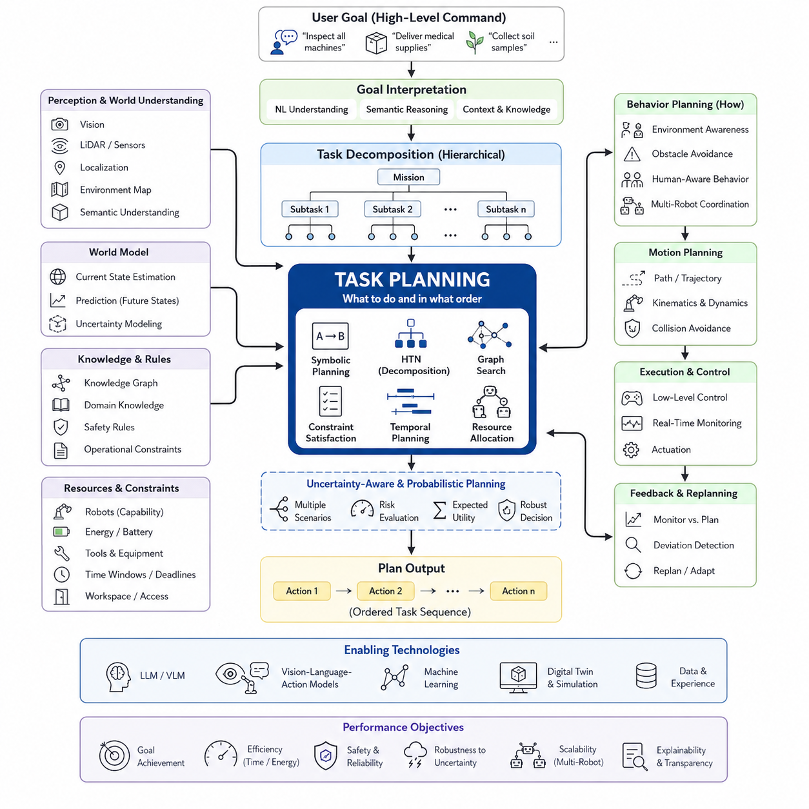
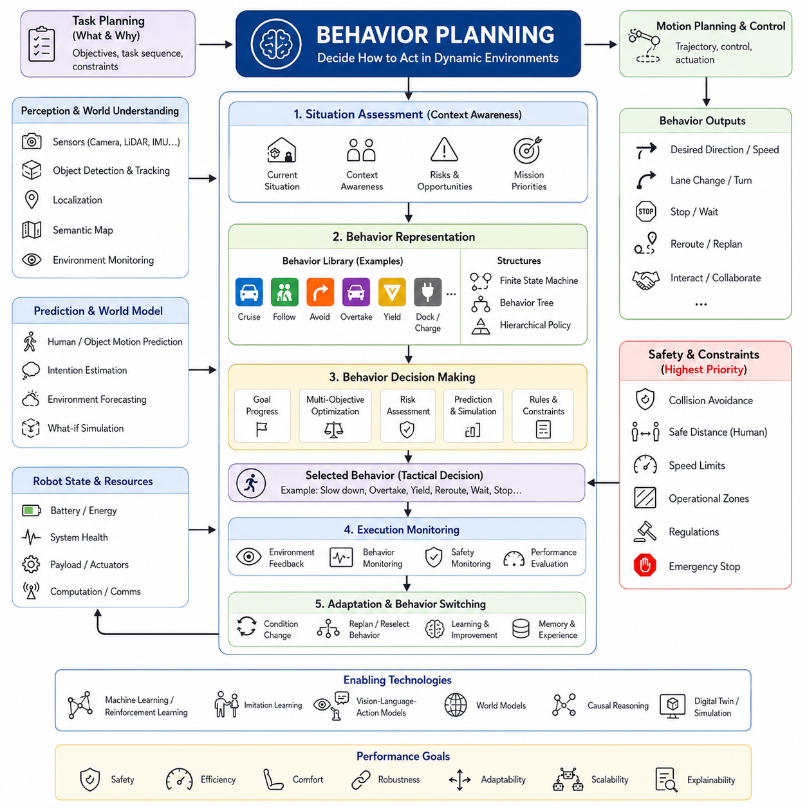
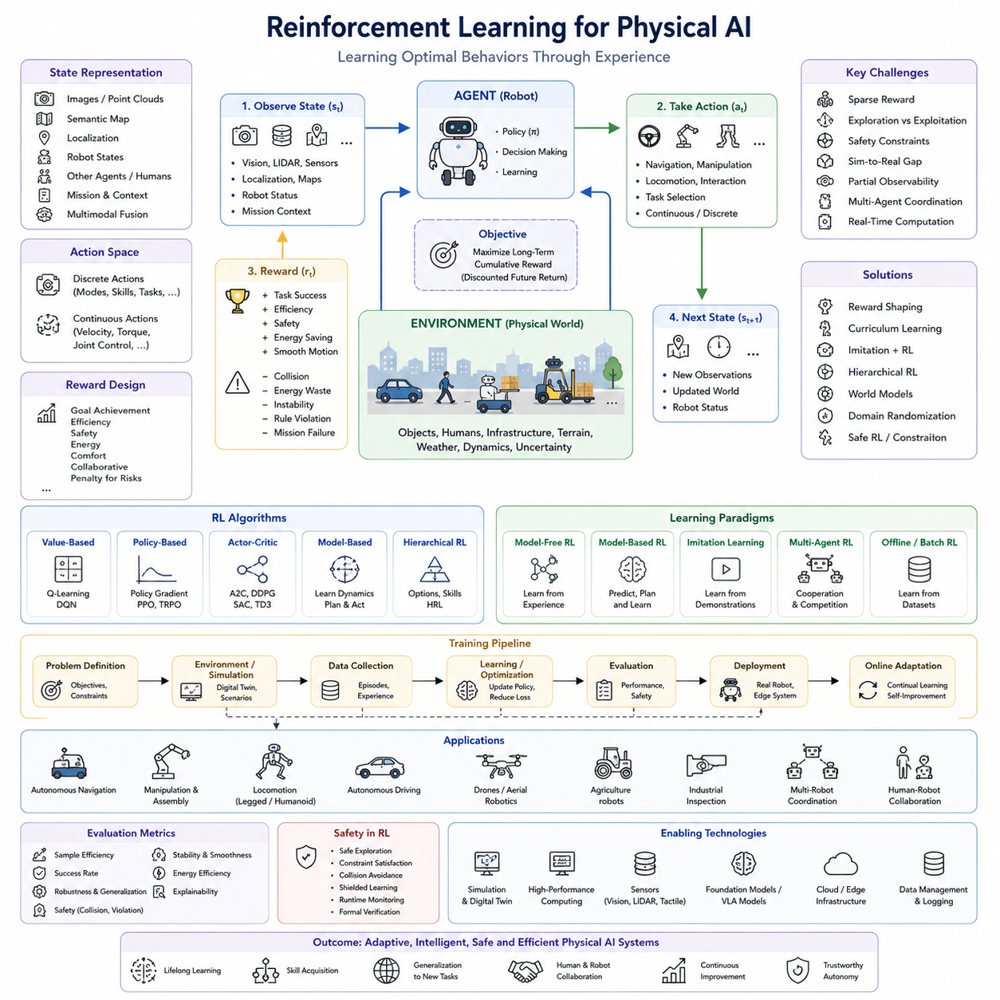
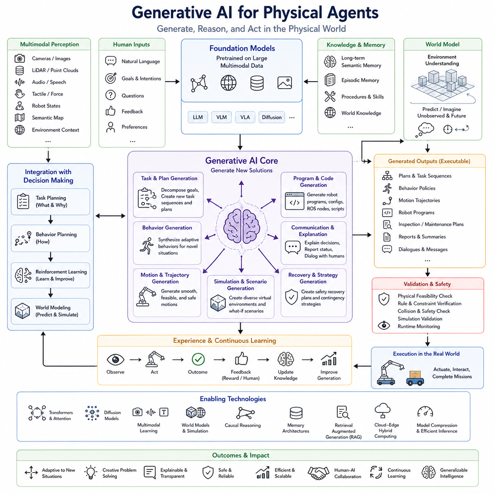
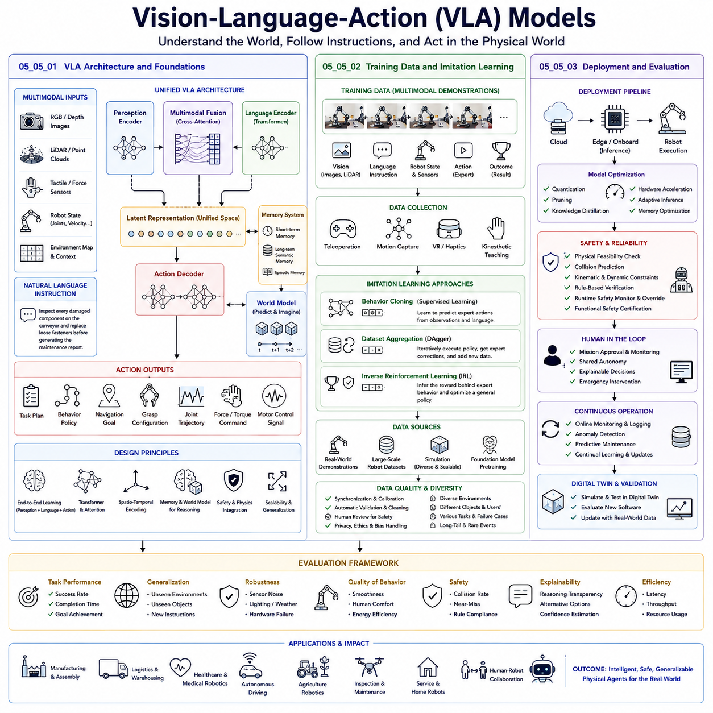
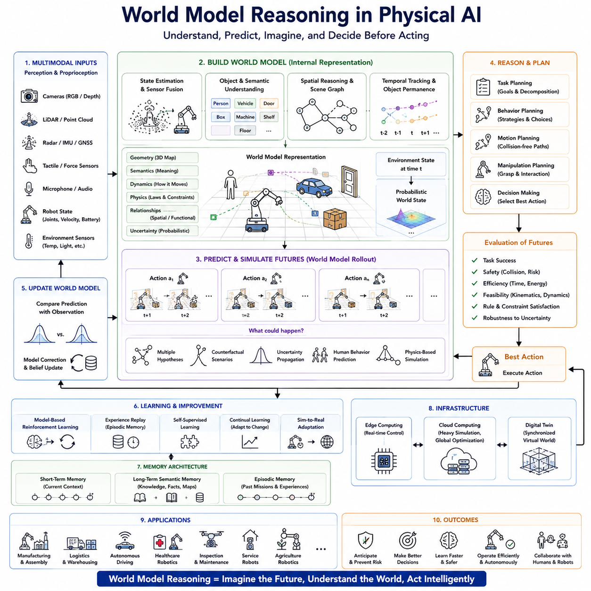
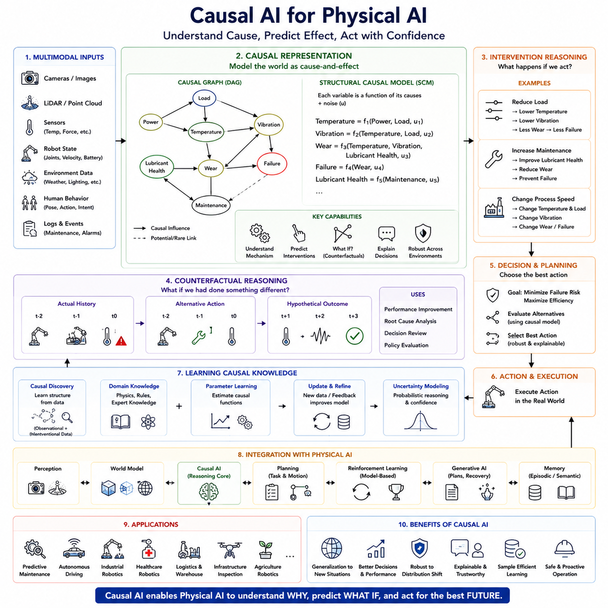
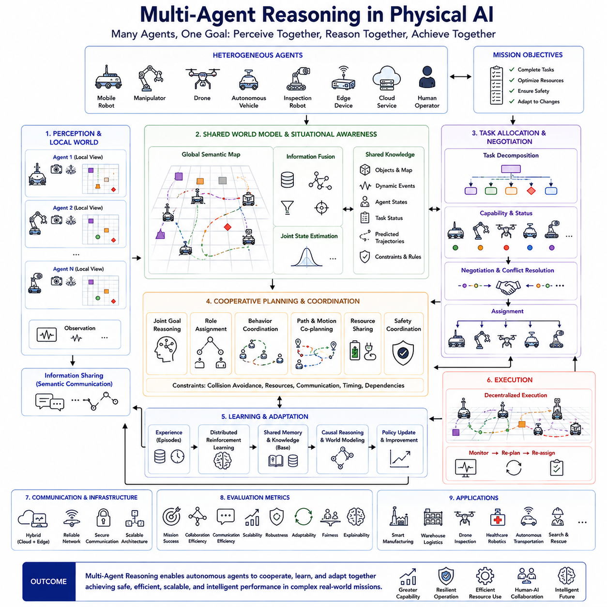
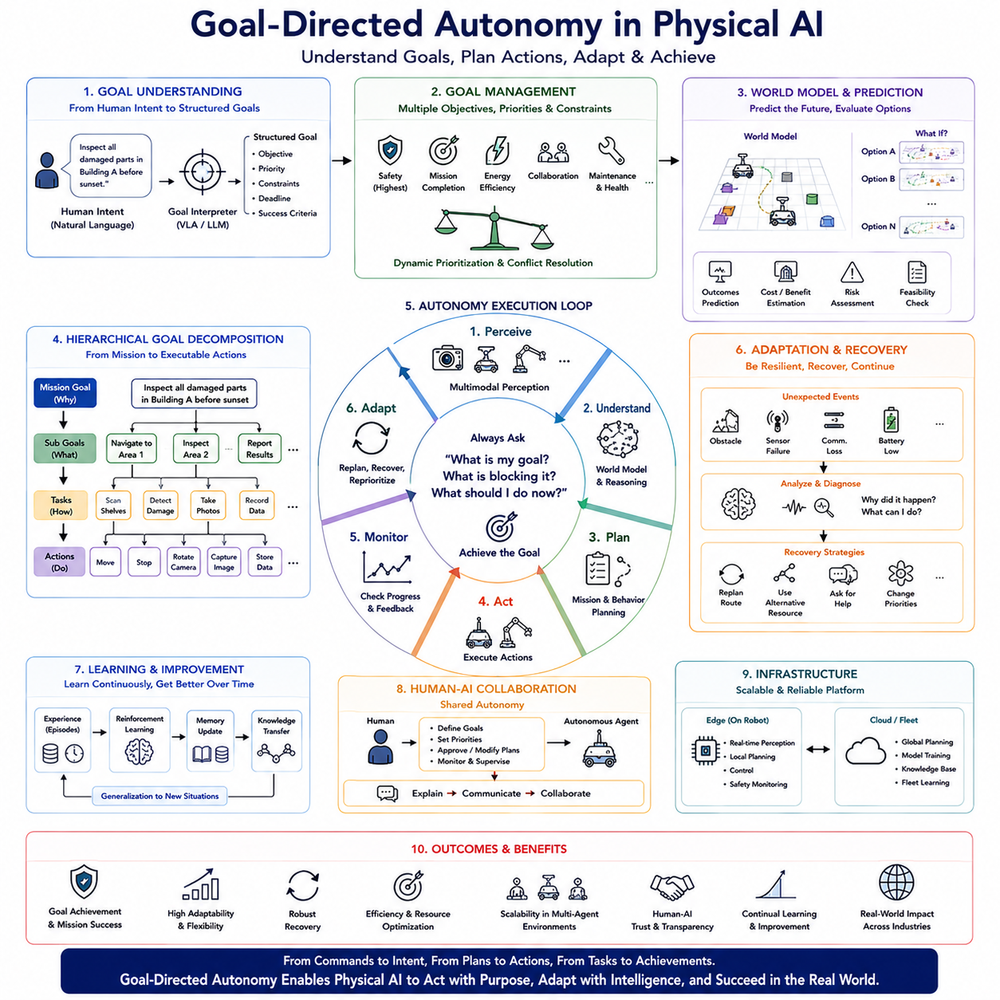

**Physical AI Engineering**

# Chapter 05 Decision Making and Reasoning 

## 05-01 Task Planning

{width="7.268055555555556in" height="7.268055555555556in"}

**05_01_작업 계획(Task Planning)**

작업 계획(Task Planning)은 **피지컬 AI(Physical AI)**를 기존 자동화 시스템과 구분하는 가장 핵심적인 능력 가운데 하나이다. 기존의 산업용 로봇은 미리 정의된 명령 순서를 그대로 실행하는 데 초점을 맞추지만, 피지컬 AI 시스템은 어떤 작업을 수행해야 하는지, 어떤 순서로 수행해야 하는지, 어떠한 제약 조건을 고려해야 하는지, 그리고 예상하지 못한 상황이 발생했을 때 어떻게 적응해야 하는지를 스스로 결정해야 한다. 따라서 작업 계획은 높은 수준의 목표와 실제 실행 가능한 로봇 행동 사이를 연결하는 인지적(Cognitive) 다리 역할을 수행한다. 의사결정 및 추론(Decision Making and Reasoning) 전체 구조에서 작업 계획은 추상적인 목표를 행동 계획(Behavior Planning), 모션 계획(Motion Planning), 제어(Control), 실시간 실행(Real-Time Execution)으로 이어질 수 있는 체계적인 작업 시퀀스로 변환한다. 이러한 이유로 작업 계획은 단순한 스케줄링 알고리즘이 아니라 피지컬 AI 기술 스택에서 핵심적인 추론 엔진으로 자리 잡고 있다.

작업 계획의 가장 중요한 목적은 **미션 수준(Mission-Level)의 목표를 실제 수행 가능한 계획으로 변환하는 것**이다. 사용자는 "생산 라인의 모든 설비를 검사하라", "응급실에 의료 물품을 전달하라", "농경지에서 지정된 위치의 토양 샘플을 수집하라"와 같이 결과 중심의 명령을 내린다. 이러한 명령은 개별 로봇 동작이 아니라 최종 목표만을 제시한다. 작업 계획기는 이러한 목표를 세부 작업으로 분해하면서 환경 조건, 자원 제약, 운영 우선순위, 안전 규정, 그리고 로봇의 능력을 함께 고려한다. 이렇게 생성된 계획은 이후 모든 자율 실행 과정을 안내하는 로드맵이 된다.

작업 계획은 먼저 **목표 해석(Goal Interpretation)** 과정에서 시작된다. 사람의 명령은 종종 모호하거나 불완전하며 상황에 따라 의미가 달라질 수 있다. 따라서 최신 피지컬 AI 시스템은 자연어 이해(Natural Language Understanding), 의미 기반 추론(Semantic Reasoning), 월드 모델(World Model)을 활용하여 사용자의 실제 의도를 추론한다. 예를 들어 창고 작업자가 "오늘 출고 물품을 준비하라"고 지시하면, 시스템은 단순히 물건을 이동하는 것이 아니라 물품 식별, 재고 확인, 운송 일정 생성, 적재 최적화, 출고 확인까지 포함된 전체 작업 절차를 자동으로 추론한다. 이러한 중간 과정은 명령에 직접 포함되어 있지 않지만 도메인 지식과 운영 규칙을 활용하여 완전한 작업 흐름으로 확장된다.

목표가 해석되면 작업 계획기는 **작업 분해(Task Decomposition)** 를 수행한다. 현실 세계의 복잡한 임무는 하나의 행동만으로 수행될 수 없기 때문에 여러 단계의 하위 작업으로 분해된다. 예를 들어 산업 검사 미션은 위치 추정(Localization), 검사 지점까지 이동, 환경 확인, 검사 장비 준비, 센서 보정, 영상 획득, 결함 분석, 보고서 생성, 충전소 복귀 등의 작업으로 구성될 수 있다. 각 하위 작업 역시 다시 세부 작업으로 분해될 수 있으며, 이러한 계층적 구조는 대규모 미션을 효율적으로 관리하고 실패 복구를 쉽게 만든다.

이러한 계층적 작업 분해를 구현하기 위한 대표적인 방법이 **계층적 작업 네트워크(Hierarchical Task Network, HTN)** 이다. HTN은 추상적인 작업을 점진적으로 더 구체적인 작업으로 분해하여 최종적으로 로봇이 실행 가능한 기본 행동(Primitive Action)까지 내려간다. 이는 사람이 프로젝트를 업무, 절차, 세부 작업으로 나누어 계획하는 방식과 매우 유사하다. 피지컬 AI에서는 수천 개의 행동으로 구성된 대규모 미션도 계산 가능한 수준으로 관리할 수 있으며, 전체 논리 구조도 유지할 수 있다는 장점이 있다.

또 다른 중요한 접근 방식은 **기호 기반 계획(Symbolic Planning)** 이다. 기호 계획에서는 환경을 논리적 술어(Predicate)로 표현하며 객체, 관계, 능력, 환경 상태 등을 명확하게 기술한다. 각각의 행동은 수행 조건(Preconditions)과 수행 결과(Effects)를 가진다. 예를 들어 로봇이 물체를 집으려면 물체가 도달 가능한 위치에 있고, 그리퍼가 비어 있으며, 물체가 인식되어 있어야 한다. 물체를 집은 이후에는 환경 상태가 변경되며 이후 운반이나 적재와 같은 다음 행동이 가능해진다. 이러한 방식은 계획 과정을 사람이 쉽게 이해하고 검증할 수 있다는 장점이 있다.

대표적인 기호 계획 언어로는 **PDDL(Planning Domain Definition Language)** 이 있다. PDDL은 객체(Object), 행동(Action), 조건(Condition), 제약(Constraint), 최적화 목표 등을 체계적으로 정의하는 표준 언어이다. 원래는 인공지능 계획 연구를 위해 개발되었지만 현재는 설명 가능성과 검증 가능성이 중요한 산업용 피지컬 AI에서도 널리 활용되고 있다.

그래프 탐색(Graph Search) 기법 역시 작업 계획에서 중요한 역할을 수행한다. 작업 그래프(Task Graph)에서는 노드(Node)가 시스템 상태를 나타내고, 간선(Edge)이 가능한 행동을 의미한다. 그래프 탐색 알고리즘은 실행 시간, 에너지 소비, 위험도, 자원 사용량 등의 비용을 최소화하면서 목표를 달성하는 최적의 작업 순서를 찾는다. 이러한 접근 방식은 대규모 작업 공간에서도 매우 효율적인 계획 생성을 가능하게 한다.

현실 세계에서는 **제약 조건 만족(Constraint Satisfaction)** 이 매우 중요하다. 로봇은 배터리 용량, 적재 중량, 계산 자원, 통신 대역폭, 센서 가시성, 구동기 성능 등의 한계를 가진다. 또한 환경에는 장애물, 사람의 근무 일정, 출입 제한 구역, 기상 조건, 장비 사용 가능 여부, 안전 규정 등 다양한 제약이 존재한다. 우수한 작업 계획기는 이러한 제약을 모두 고려하여 실제 실행 가능한 계획만을 생성한다.

시간에 대한 추론도 중요한 요소이다. **시간 계획(Temporal Planning)** 은 작업의 실행 순서뿐 아니라 수행 시점과 지속 시간까지 함께 고려한다. 예를 들어 여러 대의 검사 로봇이 생산 라인을 방해하지 않으면서 순차적으로 검사해야 할 수도 있고, 의료 로봇은 정해진 투약 시간에 맞추어 약품을 전달해야 할 수도 있다. 시간 계획기는 선행 관계, 동기화 조건, 작업 시간, 마감 시간 등을 모두 만족하도록 일정을 최적화한다.

작업 계획은 **자원 할당(Resource Allocation)** 과도 밀접하게 연결된다. 여러 로봇이 충전기, 작업 도구, 검사 장비, 통신 채널, 작업 공간을 동시에 사용할 수 없기 때문에 자원 충돌을 방지하고 전체 시스템의 활용도를 높이는 계획이 필요하다. 자원 인식(Resource-Aware) 계획은 대기 시간을 줄이고 생산성을 높이는 핵심 기술이다.

피지컬 AI에서 가장 중요한 특징 가운데 하나는 **불확실성(Uncertainty)** 을 고려해야 한다는 점이다. 실제 환경에서는 사람의 이동, 날씨 변화, 장애물 발생, 센서 오차, 장비 고장 등 다양한 변화가 지속적으로 발생한다. 따라서 계획은 완전한 환경 정보를 가정할 수 없으며 항상 여러 가능성을 고려해야 한다.

이를 위해 **확률 기반 계획(Probabilistic Planning)** 이 사용된다. 이러한 계획은 하나의 결과만을 가정하지 않고 여러 가능한 미래를 평가하여 가장 높은 기대 성능(Expected Utility)을 가지는 행동을 선택한다. 이러한 접근은 자율주행차, 야외 로봇, 재난 구조 로봇처럼 불확실성이 매우 큰 환경에서 특히 중요하다.

최신 피지컬 AI에서는 **지속적 재계획(Continuous Replanning)** 이 핵심 기능으로 자리 잡고 있다. 기존 계획 방식은 한 번 계획을 세우면 끝까지 유지하는 경우가 많았지만, 최신 시스템은 실행 결과를 지속적으로 관찰하면서 예상과 실제 환경이 달라질 경우 계획을 즉시 수정한다. 이러한 동적 재계획은 예기치 않은 상황에서도 임무를 계속 수행할 수 있도록 한다.

작업 계획은 **월드 모델(World Model)** 과도 긴밀하게 연결된다. 계획기는 현재 환경뿐 아니라 미래 환경이 어떻게 변화할 것인지까지 예측해야 한다. 월드 모델은 사람, 차량, 물체, 환경 상태의 미래를 예측하여 교통 혼잡을 피하고, 자원 충돌을 예방하며, 장비 고장을 사전에 고려하는 계획을 가능하게 한다.

환경에 대한 **의미 기반 이해(Semantic Understanding)** 역시 작업 계획의 품질을 크게 향상시킨다. 단순한 3차원 지도 대신 작업장, 위험 구역, 충전소, 비상구, 창고, 생산 셀, 협업 공간 등의 의미를 함께 표현하면 계획기는 단순한 좌표가 아니라 실제 작업 목적을 이해하면서 의사결정을 수행할 수 있다.

또한 **지식 그래프(Knowledge Graph)** 는 객체, 작업, 사람, 장비 사이의 관계를 체계적으로 저장한다. 이를 활용하면 검사 장비가 특정 생산 라인 근처에 있다는 사실이나, 특정 유지보수 작업에는 전문 기술자가 필요하다는 사실 등을 자동으로 추론할 수 있으며, 작업 분해와 자원 선택이 더욱 지능적으로 이루어진다.

최근에는 **대규모 언어 모델(Large Language Model, LLM)** 이 작업 계획에 적극 활용되고 있다. LLM은 사용자의 명령을 이해하고 초기 작업 구조를 생성하거나 관련 지식을 검색하고 계획을 설명하는 역할을 수행한다. 이후 기호 기반 계획기가 논리적 일관성과 제약 조건을 검증하여 실제 실행 가능한 계획을 완성한다. 이러한 하이브리드 구조는 생성형 AI의 유연성과 전통적 계획기의 신뢰성을 동시에 제공한다.

더 나아가 **비전-언어-행동 모델(Vision-Language-Action Model, VLA)** 은 영상, 언어, 행동을 하나의 모델에서 통합적으로 학습한다. VLA는 물체를 인식하고, 사용자의 명령을 이해하며, 적절한 행동을 예측하고, 시각 정보를 기반으로 작업을 수행할 수 있다. 그러나 산업 환경에서는 높은 신뢰성과 안전성이 요구되므로 여전히 기호 기반 검증과 함께 사용하는 경우가 많다.

작업 계획은 **행동 계획(Behavior Planning)** 과 밀접하게 연결되지만 역할은 명확히 구분된다. 작업 계획은 무엇을 수행해야 하는지를 결정하고, 행동 계획은 현재 환경에서 그것을 어떻게 수행할 것인지를 결정한다. 예를 들어 작업 계획이 "창고로 물품을 운반하라"를 결정했다면, 행동 계획은 사람을 추월할지, 잠시 기다릴지, 우회할지, 속도를 줄일지를 판단한다.

그 이후에는 **모션 계획(Motion Planning)** 이 수행된다. 모션 계획은 행동 계획이 결정한 목표를 실제 충돌 없는 경로(Trajectory)로 변환하며 로봇의 운동학(Kinematics)과 동역학(Dynamics)을 만족하도록 한다. 이러한 계층 구조는 전략적 계획, 전술적 의사결정, 실제 이동 경로 생성을 명확하게 분리하여 전체 시스템의 확장성과 유지보수성을 향상시킨다.

사람과 함께 작업하는 환경에서는 **사람 중심 계획(Human-Aware Planning)** 이 매우 중요하다. 로봇은 안전뿐 아니라 사람의 편안함, 예측 가능성, 사회적 규범, 협업 효율성까지 고려해야 한다. 따라서 작업 계획기는 사람의 일정, 업무량, 협업 방식 등을 함께 고려하여 자연스럽게 사람과 역할을 분담한다.

여러 대의 로봇이 동시에 작업하는 경우에는 **다중 로봇 작업 계획(Multi-Robot Task Planning)** 이 필요하다. 중앙 집중식 계획은 전체 최적화를 수행하지만 계산량이 많고, 분산 계획은 각 로봇이 협상하면서 작업을 나누지만 전체 최적성이 떨어질 수 있다. 최근에는 중앙 집중식 미션 할당과 분산형 지역 적응(Local Adaptation)을 결합한 하이브리드 방식이 널리 사용되고 있으며, 이를 통해 대규모 물류센터, 스마트 공장, 농업, 사회기반시설 검사에서 높은 생산성과 안정성을 달성하고 있다.

안전은 모든 계획 과정에 통합되어야 한다. 위험 작업에서는 단순한 효율성보다 실패 시의 영향을 함께 평가해야 하며, 위험 구역 회피, 사람과의 안전 거리 유지, 비상 탈출 경로 확보, 규제 준수 등이 계획 과정 자체에 포함된다.

배터리 기반 자율 시스템에서는 **에너지 인식 계획(Energy-Aware Planning)** 도 중요하다. 계획기는 지형, 적재 중량, 환경 조건, 계산 부하 등을 고려하여 에너지 소비를 예측하고 충전 시점을 결정한다. 이러한 최적화는 동일한 하드웨어에서도 운용 시간을 크게 향상시킨다.

최근에는 **학습 기반 작업 계획(Learning-Based Task Planning)** 도 빠르게 발전하고 있다. 강화학습(Reinforcement Learning), 모방학습(Imitation Learning), 자기지도학습(Self-Supervised Learning)을 통해 계획기는 반복적인 경험을 학습하며 점점 더 효율적이고 강인한 의사결정을 수행할 수 있다. 앞으로의 피지컬 AI는 수천 번의 임무 수행 경험을 바탕으로 지속적으로 계획 성능을 향상시키면서도 형식적 검증(Formal Verification)을 통해 안전성을 유지하는 방향으로 발전할 것이다.

작업 계획 알고리즘의 개발에는 **디지털 트윈(Digital Twin)** 과 시뮬레이션 환경이 매우 중요한 역할을 한다. 실제 환경에 적용하기 전에 수백만 개의 가상 시나리오를 시험하여 다양한 환경 변화, 장애 상황, 교통 밀도, 자원 제약 조건을 평가할 수 있으며, 이를 통해 개발 비용과 위험을 크게 줄일 수 있다.

작업 계획의 성능은 하나의 지표만으로 평가되지 않는다. 목표 달성 성공률, 계획 생성 속도, 실행 효율성, 에너지 소비, 자원 활용도, 환경 변화에 대한 강인성(Robustness), 설명 가능성(Explainability), 그리고 대규모 환경에서의 확장성(Scalability) 등이 함께 평가된다.

피지컬 AI가 더욱 지능적이고 범용적인 시스템으로 발전함에 따라 작업 계획은 **인지(Cognition), 추론(Reasoning), 예측(Prediction), 학습(Learning), 행동(Action)** 을 하나로 연결하는 핵심 두뇌 역할을 수행하게 될 것이다. 미래의 작업 계획기는 기호 기반 추론(Symbolic Reasoning), 확률 추론(Probabilistic Reasoning), 파운데이션 모델(Foundation Model), 월드 모델(World Model), 인과 추론(Causal Reasoning), 강화학습, 멀티모달 이해를 하나의 통합 인지 구조로 결합하여 사람의 개입을 최소화하면서도 복잡한 현실 세계의 임무를 안정적으로 수행할 수 있을 것이다. 단순히 행동 순서를 생성하는 수준을 넘어 목표를 이해하고, 미래를 예측하며, 여러 지능형 에이전트를 협력시키고, 자원을 최적화하며, 안전을 보장하고, 모든 경험으로부터 지속적으로 학습하는 것이 미래 작업 계획의 핵심 방향이 될 것이다.

## 05-02 Behavior Planning

{width="7.268055555555556in" height="7.268055555555556in"}

행동 계획(Behavior Planning)은 **작업 계획(Task Planning)** 에서 결정된 목표를 실제 환경에서 **어떻게 수행할 것인가**를 결정하는 피지컬 AI(Physical AI)의 핵심 의사결정 계층이다. 작업 계획이 어떤 목표를 달성해야 하는지와 논리적인 작업 순서를 결정한다면, 행동 계획은 현재 변화하는 환경 속에서 가장 적절한 실행 전략을 선택하는 역할을 수행한다. 행동 계획은 주변 상황을 지속적으로 평가하고, 미래에 발생할 수 있는 사건을 예측하며, 서로 경쟁하는 여러 목표를 동시에 고려하여 안전성(Safety), 효율성(Efficiency), 강인성(Robustness)을 유지하면서 임무 성공률을 최대화하는 행동을 선택한다. 피지컬 AI 전체 구조에서 행동 계획은 상위 수준의 미션 추론과 하위 수준의 모션 생성(Motion Generation)을 연결하는 핵심 계층으로서, 추상적인 계획을 실제 환경에 적합한 행동으로 변환한다.

현실 세계는 정적인 환경이 아니라 끊임없이 변화하는 동적인 환경이다. 사람은 예측하기 어려운 방식으로 이동하고, 차량은 방향을 변경하며, 기계는 가동과 정지를 반복하고, 날씨는 계속 변하며, 통신 상태도 변동되고, 예상하지 못한 장애물이 언제든지 나타날 수 있다. 따라서 로봇은 미리 생성된 계획만을 그대로 실행해서는 안 되며, 환경 변화에 맞추어 지속적으로 행동을 수정하면서도 전체 임무 목표를 유지해야 한다. 행동 계획은 이러한 적응 능력을 제공하여 전략적인 목표를 상황에 맞는 전술적(Tactical) 의사결정으로 변환한다.

행동 계획은 먼저 작업 계획 계층으로부터 미션 목표를 전달받는다. 이 목표는 최종적으로 무엇을 수행해야 하는지를 정의하지만 현재 환경에서 그것을 어떻게 수행할지는 명시하지 않는다. 예를 들어 자율주행 물류 로봇이 창고에서 출하장까지 물품을 운반하는 임무를 부여받았다면, 행동 계획기는 느리게 이동하는 차량을 추월할 것인지, 작업자가 지나갈 때까지 기다릴 것인지, 교차로에서 속도를 줄일 것인지, 임시 장애물을 우회할 것인지, 보행자에게 양보할 것인지, 위험 상황에서는 이동을 잠시 중단할 것인지를 결정한다. 이러한 의사결정은 센서 정보가 갱신될 때마다 지속적으로 변경될 수 있다.

행동 계획의 가장 중요한 기능 가운데 하나는 **상황 평가(Situation Assessment)** 이다. 적절한 행동을 선택하기 위해서는 현재 환경을 정확하게 이해해야 한다. 이를 위해 행동 계획은 인식(Perception), 위치 추정(Localization), 의미 지도(Semantic Map), 객체 추적(Object Tracking), 월드 모델(World Model), 환경 예측(Environment Prediction), 미션 우선순위 등을 통합하여 현재 상황을 종합적으로 이해한다. 단순히 물체를 인식하는 것이 아니라, 그 물체가 앞으로의 의사결정에 어떤 영향을 줄 것인지까지 판단한다. 예를 들어 정지된 팔레트(Pallet)는 단순한 장애물이지만, 빠르게 접근하는 지게차(Forklift)나 깨지기 쉬운 장비를 운반하는 작업자는 훨씬 다른 행동 전략을 요구한다.

따라서 행동 계획에서의 환경 이해는 단순한 센서 인식보다 훨씬 풍부하다. 센서는 데이터를 수집하고, 인식 알고리즘은 물체를 식별하며, 위치 추정은 로봇의 현재 위치를 계산하고, 의미 지도는 환경의 의미를 부여한다. 행동 계획은 이러한 다양한 정보를 통합하여 실제 의사결정에 사용할 수 있는 운영 지식(Operation Knowledge)으로 변환한다. 이를 통해 장애물이 단순히 어디에 있는지를 아는 것이 아니라, 그것이 일시적인지, 이동 가능한지, 위험한지, 사람인지, 앞으로 이동할 가능성이 높은지까지 이해할 수 있다.

행동 계획의 또 다른 핵심 요소는 **상황 인식(Context Awareness)** 이다. 동일한 환경이라도 현재의 작업 목적에 따라 적절한 행동은 달라진다. 예를 들어 공장 근무 시간에 로봇 주변에 사람이 있는 것은 정상적인 상황이지만, 무인으로 운영되는 야간 시간에 동일한 상황이 발생하면 침입자로 판단하여 즉시 안전 절차를 수행해야 할 수도 있다. 병원의 복도를 이동하는 로봇과 자동차 공장의 생산라인을 이동하는 로봇 역시 동일한 구조를 가지더라도 서로 다른 행동 정책을 적용해야 한다. 행동 계획은 이러한 작업 목적과 환경을 고려하여 가장 적절한 행동을 선택한다.

행동 선택은 일반적으로 여러 개의 **행동 상태(Behavior State)** 로 표현된다. 로봇은 임의의 행동을 생성하는 것이 아니라 순항(Cruising), 장애물 회피(Obstacle Avoidance), 사람 따라가기(Following), 추월(Overtaking), 양보(Yielding), 도킹(Docking), 비상 정지(Emergency Stop), 검사(Inspection), 충전(Charging), 협업(Collaboration)과 같은 명확한 행동 모드를 가진다. 각 행동 상태는 특정 상황에 최적화된 의사결정 논리를 포함하며, 환경 변화와 미션 진행 상황, 안전 조건에 따라 상태 전이가 이루어진다. 이러한 구조는 시스템 검증과 유지보수를 쉽게 만든다.

초기의 행동 계획은 **유한 상태 기계(Finite State Machine, FSM)** 를 이용하여 구현되었다. FSM에서는 각 행동을 하나의 상태(State)로 정의하고, 조건이 만족되면 다음 상태로 전환한다. 이러한 방식은 구조가 단순한 산업 환경에서는 매우 효과적이지만, 행동의 수가 많아질수록 유지보수가 어려워진다. 따라서 최근에는 FSM 대신 계층적 계획(Hierarchical Planning), 행동 트리(Behavior Tree), 학습 기반 정책(Learning-Based Policy)을 함께 사용하는 경우가 많다.

특히 **행동 트리(Behavior Tree)** 는 현대 로봇 분야에서 가장 널리 사용되는 행동 표현 방식 가운데 하나이다. 행동 트리는 조건 노드(Condition), 제어 노드(Control Node), 실행 노드(Action), 데코레이터(Decorator)를 계층적으로 구성하여 복잡한 행동을 작은 모듈로 분리한다. 이러한 구조는 모듈 재사용이 쉽고 유지보수가 편리하며 확장성이 뛰어나 산업용 로봇, 자율주행차, 서비스 로봇, 협동 로봇 등에서 널리 활용되고 있다.

행동 계획에서는 여러 목표를 동시에 고려해야 한다. 일반적으로 안전성이 가장 높은 우선순위를 가지지만 생산성(Productivity), 효율성(Efficiency), 에너지 소비(Energy Consumption), 승차감(Passenger Comfort), 작업 마감 시간(Mission Deadline), 장비 보호(Equipment Protection), 운영 비용(Operation Cost) 등도 함께 최적화해야 한다. 이러한 목표는 서로 충돌하는 경우가 많다. 속도를 높이면 생산성은 증가하지만 안전 여유는 감소할 수 있으며, 가장 안전한 경로를 선택하면 이동 시간이 증가할 수 있다. 따라서 행동 계획기는 다목적 최적화(Multi-Objective Optimization)를 수행하여 균형 잡힌 결정을 내린다.

행동 계획에서는 **위험 평가(Risk Assessment)** 도 매우 중요하다. 모든 행동은 미래에 일정한 위험을 가진다. 행동을 선택하기 전에 충돌 가능성, 환경 위험, 시스템 상태, 통신 안정성, 임무 실패 가능성 등을 함께 평가한다. 따라서 최신 행동 계획은 단순히 가장 짧은 경로나 가장 빠른 이동이 아니라 위험도를 포함한 종합적인 최적화를 수행한다. 이러한 기능은 자율주행차, 의료 로봇, 건설 장비, 농업 로봇, 국방 시스템에서 특히 중요하다.

행동 계획은 **예측(Prediction)** 기능을 적극적으로 활용한다. 올바른 행동은 현재 상황뿐 아니라 미래 상황을 예측해야 가능하다. 행동 계획기는 사람의 이동 경로(Human Trajectory Prediction), 차량의 진행 의도(Intention Estimation), 장애물의 이동 예측, 환경 변화 등을 수 초 앞까지 예측하여 충돌을 사전에 방지한다. 이러한 예측 덕분에 로봇은 위험이 발생한 이후 대응하는 것이 아니라 미리 예방하는 행동을 선택할 수 있다.

특히 **사람 행동 예측(Human Behavior Prediction)** 은 가장 어려운 문제 가운데 하나이다. 사람은 의도(Intention), 주의력(Attention), 사회적 상호작용(Social Interaction), 감정(Emotion), 환경(Context)에 따라 다양한 행동을 보인다. 따라서 최신 행동 계획기는 기계학습(Machine Learning)을 이용하여 여러 가능한 사람의 행동을 예측하고, 모든 가능성을 고려한 안전한 행동을 생성한다.

행동 계획은 단순한 충돌 회피를 넘어 **사회적 행동(Socially Aware Navigation)** 도 고려한다. 사람은 로봇이 갑자기 뒤에서 접근하거나, 너무 가까이 지나가거나, 불필요하게 길을 막는 행동을 불편하게 느낀다. 따라서 로봇은 적절한 개인 공간(Personal Space)을 유지하고, 부드럽게 움직이며, 양보하고, 자신의 이동 의도를 쉽게 이해할 수 있도록 행동해야 한다. 이러한 사회적 행동은 사람과 로봇의 협업을 크게 향상시킨다.

행동 계획은 **자율주행(Autonomous Driving)** 에서도 핵심 역할을 수행한다. 자율주행차는 차선 변경(Lane Change), 차간 거리 유지(Following Distance), 합류(Merging), 추월(Overtaking), 교차로 정지, 보행자 양보, 교통 혼잡 우회 등을 지속적으로 결정해야 한다. 이러한 결정은 교통 법규, 도로 구조, 주변 차량, 날씨, 승차감 등을 모두 고려하여 이루어진다.

공장 내 **자율이동로봇(Autonomous Mobile Robot, AMR)** 역시 행동 계획에 크게 의존한다. 공장에서는 지게차, 협동 로봇, 작업자, 자동 생산설비가 동시에 이동하기 때문에 행동 계획기는 통로가 막힌 경우, 긴급 작업이 발생한 경우, 생산 일정이 변경된 경우에도 적절한 행동을 선택하여 생산성을 유지하면서 안전을 확보해야 한다.

행동 계획은 **다중 로봇(Multi-Robot)** 환경에서 더욱 복잡해진다. 여러 대의 로봇은 충돌을 피하면서도 협력하여 작업을 수행해야 한다. 이를 위해 자원을 협상하고, 작업을 분배하며, 교차로 통과 순서를 조정하고, 환경 정보를 공유하면서 집단 전체의 효율을 높인다. 이러한 다중 에이전트 행동 계획(Multi-Agent Behavior Planning)은 개별 로봇보다 훨씬 높은 시스템 성능을 달성하게 한다.

최근에는 **통신 인식 행동 계획(Communication-Aware Behavior Planning)** 도 중요해지고 있다. 광산, 농업, 재난 현장처럼 통신이 불안정한 환경에서는 네트워크 품질도 행동 결정의 일부가 된다. 로봇은 통신이 좋은 위치까지 이동한 후 대용량 데이터를 전송하거나, 통신이 끊기면 독립적인 자율 모드로 전환하는 등의 행동을 선택할 수 있다.

행동 계획은 외부 환경뿐 아니라 **로봇 자신의 상태(Self-Awareness)** 도 고려한다. 배터리 잔량, 모터 온도, 센서 성능 저하, 계산 부하, 통신 지연, 하드웨어 이상 등이 행동 결정에 영향을 준다. 예를 들어 배터리가 부족하면 가까운 작업만 수행하거나 충전소로 먼저 이동하도록 행동을 변경할 수 있다.

최근 가장 활발하게 연구되는 분야는 **학습 기반 행동 계획(Learning-Based Behavior Planning)** 이다. 강화학습(Reinforcement Learning)은 시뮬레이션과 실제 환경을 반복적으로 경험하면서 장기적인 보상(Long-Term Reward)을 최대화하는 행동 정책을 스스로 학습한다. 이러한 방식은 자율주행, 이동 로봇, 매니퓰레이션(Manipulation), 다중 로봇 협력 등에서 뛰어난 성능을 보이고 있다.

또 다른 접근법은 **모방학습(Imitation Learning)** 이다. 로봇은 사람 전문가나 우수한 자율 시스템의 행동을 학습하여 새로운 상황에서도 유사한 의사결정을 수행한다. 이러한 방식은 강화학습보다 학습 시간이 짧고 현실적인 행동을 쉽게 습득할 수 있다는 장점이 있다.

최근에는 **파운데이션 모델(Foundation Model)** 과 **비전-언어-행동 모델(Vision-Language-Action Model, VLA)** 이 행동 계획에도 적용되고 있다. 이러한 모델은 방대한 영상, 언어, 센서, 행동 데이터를 학습하여 새로운 환경에서도 적절한 행동을 생성할 수 있다. 그러나 안전성이 매우 중요한 산업 분야에서는 여전히 규칙 기반 시스템과 형식적 검증(Formal Verification)을 함께 사용하여 신뢰성을 확보하고 있다.

행동 계획은 **월드 모델(World Model)** 과 긴밀하게 연결된다. 월드 모델은 여러 행동을 수행했을 때 미래 환경이 어떻게 변할지를 예측한다. 행동 계획기는 이러한 미래 시뮬레이션을 비교하여 가장 바람직한 행동을 선택한다. 예를 들어 지금 가속하면 이동 시간은 줄어들지만 보행자와 충돌할 위험이 커질 수 있고, 몇 초 기다리면 전체 안전성이 크게 향상될 수 있다. 이러한 미래 예측은 행동 계획의 핵심 요소이다.

또한 **인과 추론(Causal Reasoning)** 은 단순한 상관관계(Correlation)가 아니라 실제 원인(Cause)을 분석한다. 예를 들어 특정 장소에서 항상 혼잡이 발생한다면, 단순히 혼잡을 피하는 것이 아니라 혼잡이 발생하는 원인을 분석하여 보다 근본적인 행동 전략을 생성할 수 있다.

행동 계획에서 가장 중요한 기준은 **안전(Safety)** 이다. 모든 행동은 효율성보다 먼저 안전 규칙을 만족해야 한다. 비상 정지(Emergency Stop), 충돌 회피(Collision Avoidance), 사람과의 안전 거리 유지, 위험 구역 회피, 장비 보호, 규정 준수 등이 행동 선택의 가장 우선적인 조건이 된다. 최신 시스템에서는 실행 중에도 안전 모니터(Runtime Safety Monitor)가 행동을 지속적으로 검증하고 필요하면 즉시 개입한다.

장시간 자율 운용에서는 **에너지 인식 행동 계획(Energy-Aware Behavior Planning)** 도 중요하다. 가속 방식, 이동 속도, 경로 선택, 센서 사용, 계산 부하 등이 모두 배터리 소비에 영향을 미친다. 행동 계획기는 에너지 소비를 최소화하면서도 미션을 성공적으로 수행할 수 있도록 행동을 최적화한다.

행동 계획 알고리즘은 대부분 **디지털 트윈(Digital Twin)** 과 시뮬레이션 환경에서 개발된다. 수백만 개의 가상 시나리오를 통해 교통 상황, 사람과의 상호작용, 환경 변화, 장비 고장, 희귀 위험 상황 등을 반복적으로 시험하여 행동 정책을 개선한다. 이후 **시뮬레이션에서 현실로(Simulation-to-Reality, Sim-to-Real)** 기술을 이용하여 실제 로봇에 적용한다.

행동 계획의 성능은 다양한 지표를 통해 평가된다. 의사결정 지연 시간(Decision Latency), 임무 성공률(Mission Success Rate), 충돌 빈도(Collision Frequency), 안전 여유(Safety Margin), 이동 부드러움(Trajectory Smoothness), 승차감(Passenger Comfort), 에너지 효율(Energy Efficiency), 계산 비용(Computational Cost), 설명 가능성(Explainability), 적응성(Adaptability), 강인성(Robustness), 확장성(Scalability) 등이 함께 고려된다. 하나의 지표만으로는 우수한 행동 계획을 평가할 수 없으며, 다양한 요소를 균형 있게 만족해야 한다.

피지컬 AI가 더욱 발전함에 따라 행동 계획은 단순히 환경에 반응하는 수준을 넘어 **예측(Predictive)**, **자기 개선(Self-Improving)**, **협력(Collaborative)** 이 가능한 지능형 시스템으로 진화할 것이다. 미래의 행동 계획기는 기호 기반 추론(Symbolic Reasoning), 강화학습(Reinforcement Learning), 파운데이션 모델(Foundation Model), 월드 모델(World Model), 인과 추론(Causal Inference), 멀티모달 인식(Multimodal Perception), 사회적 지능(Social Intelligence), 다중 에이전트 협력(Multi-Agent Cooperation)을 하나의 통합된 의사결정 구조로 결합하여 복잡한 현실 환경에서도 안전하고 효율적이며 설명 가능하고 적응적인 행동을 생성할 것이다. 단순히 환경 변화에 대응하는 것이 아니라 미래를 예측하고, 사람과 다른 로봇과 지능적으로 협력하며, 지속적인 평생학습(Lifelong Learning)을 통해 행동 전략을 스스로 개선하는 것이 차세대 행동 계획의 핵심 방향이 될 것이다.

## 05-03 Reinforcement Learning for Physical AI 

{width="7.268055555555556in" height="7.268055555555556in"}

피지컬 AI를 위한 **강화학습(Reinforcement Learning, RL)** 은 자율 시스템이 실제 물리 환경과 지속적으로 상호작용하면서 지능적인 행동을 스스로 습득할 수 있도록 하는 가장 혁신적인 기술 가운데 하나이다. 기존의 로봇 프로그래밍에서는 엔지니어가 모든 의사결정 규칙과 제어 전략을 직접 정의해야 했지만, 강화학습에서는 로봇이 경험(Experience)을 통해 최적의 행동을 스스로 발견한다. 피지컬 AI 시스템은 환경을 반복적으로 관찰하고, 행동(Action)을 선택하며, 그 결과를 평가한 뒤, 보상(Reward)을 기반으로 의사결정 정책(Policy)을 지속적으로 개선한다. 이러한 학습 방식은 사람이 일일이 규칙을 설계하기 어려운 매우 복잡한 문제까지 해결할 수 있도록 한다. 의사결정 및 추론(Decision Making and Reasoning) 전체 구조에서 강화학습은 기호 기반 추론(Symbolic Reasoning), 행동 계획(Behavior Planning), 월드 모델(World Model), 모션 생성(Motion Generation)을 보완하는 **경험 기반 최적화(Experience-Based Optimization)** 기술로서 중요한 역할을 수행한다.

강화학습의 가장 중요한 목적은 **즉각적인 결과보다 장기적인 누적 보상(Long-Term Cumulative Reward)** 을 최대화하는 것이다. 로봇이 수행하는 하나의 행동은 현재 상태뿐 아니라 미래의 선택 가능성과 제약 조건에도 영향을 미친다. 따라서 피지컬 AI 시스템은 단기적인 이익과 장기적인 목표를 동시에 고려하는 방법을 학습해야 한다. 예를 들어 물류 창고의 자율이동로봇(Autonomous Mobile Robot, AMR)은 일시적으로 속도를 줄여 혼잡을 피함으로써 현재의 이동 시간은 증가하더라도 전체 임무 수행 시간과 생산성을 향상시킬 수 있다. 강화학습은 이러한 순차적 의사결정(Sequential Decision Making)을 자연스럽게 최적화한다.

강화학습은 몇 가지 핵심 구성 요소로 이루어진다. **에이전트(Agent)** 는 학습을 수행하는 지능형 로봇이며, **환경(Environment)** 은 주변의 사람, 물체, 시설, 지형, 날씨, 장애물 등 모든 물리적 요소를 포함한다. 에이전트는 현재 상태(State)를 관찰하고 행동(Action)을 선택한 뒤, 환경으로부터 보상(Reward)을 받고 새로운 상태(New State)로 전이된다. 이러한 **상태-행동-보상(State-Action-Reward)** 순환 구조를 반복하면서 로봇은 장기적으로 가장 높은 보상을 제공하는 행동 정책을 학습하게 된다.

**상태 표현(State Representation)** 은 강화학습에서 가장 중요한 요소 가운데 하나이다. 상태는 로봇 자신과 주변 환경을 충분히 표현할 수 있어야 한다. 피지컬 AI에서는 카메라 영상(Camera Image), 라이다 포인트 클라우드(LiDAR Point Cloud), 의미 지도(Semantic Map), 위치 추정(Localization), 관절 위치(Joint Position), 속도(Velocity), 배터리 상태(Battery Status), 모터 온도(Actuator Temperature), 힘 센서(Force Sensor), 사람 위치(Human Position), 장애물 이동 경로(Trajectory), 임무 진행 상황(Mission Progress), 환경 정보(Context) 등이 상태에 포함된다. 최근에는 영상(Vision), 언어(Language), 촉각(Tactile), 음성(Audio), 의미 정보(Semantic Knowledge)를 하나로 통합한 **멀티모달 상태 표현(Multimodal State Representation)** 이 널리 연구되고 있다.

**행동(Action)** 은 에이전트가 선택할 수 있는 의사결정을 의미한다. 응용 분야에 따라 행동은 매우 다양하다. 이산 행동(Discrete Action)은 이동 모드 선택, 조작 전략 선택, 행동 상태 전환, 다중 로봇 작업 할당 등을 의미한다. 연속 행동(Continuous Action)은 조향각(Steering Angle), 바퀴 속도(Wheel Velocity), 관절 토크(Joint Torque), 가속도, 그리퍼 힘(Gripper Force), 전신 보행(Whole-Body Locomotion) 등을 포함한다. 실제 피지컬 AI에서는 상위 계층의 이산 행동과 하위 계층의 연속 제어를 결합한 계층적 구조(Hierarchical Architecture)가 일반적으로 사용된다.

강화학습에서 가장 중요한 요소는 **보상 함수(Reward Function)** 이다. 보상 함수는 시스템에게 무엇이 좋은 행동인지를 숫자로 알려주는 역할을 한다. 성공적인 작업 수행, 효율적인 이동, 부드러운 동작, 에너지 절약, 정확한 조작, 안전한 사람과의 상호작용에는 양의 보상(Positive Reward)이 주어지고, 충돌(Collision), 과도한 에너지 소비, 불안정한 움직임, 장비 손상, 안전 규칙 위반, 임무 실패에는 음의 보상(Negative Reward)이 부여된다. 실제 운영 목표를 정확하게 표현하는 보상 함수를 설계하는 것은 강화학습에서 가장 어려운 문제 가운데 하나이다.

복잡한 로봇 작업에서는 **희소 보상(Sparse Reward)** 문제가 자주 발생한다. 실제 환경에서는 수백 개의 행동을 성공적으로 수행한 이후에야 최종 보상이 주어지는 경우가 많다. 예를 들어 산업용 조립 로봇은 긴 조립 과정을 모두 완료해야만 성공 보상을 받을 수 있다. 이러한 환경에서는 어떤 행동이 성공에 기여했는지를 학습하기 어렵기 때문에 보상 설계(Reward Shaping), 교육 과정 학습(Curriculum Learning), 계층적 강화학습(Hierarchical Reinforcement Learning), 내재적 동기(Intrinsic Motivation), 전문가 시연(Demonstration) 등을 함께 활용한다.

강화학습의 핵심 개념 가운데 하나는 **탐험과 활용의 균형(Exploration-Exploitation Tradeoff)** 이다. 로봇은 새로운 행동을 탐색하여 더 나은 전략을 찾아야 하지만, 동시에 이미 학습한 우수한 전략도 활용해야 한다. 탐험이 지나치면 안전성이 떨어지고 생산성이 감소할 수 있으며, 반대로 탐험이 부족하면 더 좋은 해결책을 발견하지 못할 수 있다. 따라서 최신 강화학습 알고리즘은 안전성을 유지하면서도 새로운 행동을 효율적으로 탐색할 수 있도록 설계된다.

강화학습의 수학적 기반은 **마르코프 의사결정 과정(Markov Decision Process, MDP)** 이다. MDP는 상태(State), 행동(Action), 상태 전이 확률(Transition Probability), 보상 함수(Reward Function), 할인 계수(Discount Factor)를 이용하여 순차적인 의사결정을 모델링한다. 마르코프 가정(Markov Assumption)은 미래가 현재 상태와 현재 행동만으로 결정된다고 가정하지만, 실제 환경은 부분 관측성(Partial Observability) 때문에 완벽하게 만족하지 않는 경우가 많다. 그럼에도 불구하고 MDP는 자율 시스템의 의사결정을 설명하는 가장 중요한 이론적 기반으로 사용된다.

**가치 함수(Value Function)** 는 현재 상태나 행동이 미래에 얼마나 유용한지를 예측한다. 즉각적인 보상만 평가하는 것이 아니라 앞으로 얻을 수 있는 누적 보상을 추정한다. 상태 가치 함수(State Value Function)는 특정 상태의 중요성을 평가하며, 행동 가치 함수(Action Value Function)는 특정 상태에서 특정 행동을 수행했을 때의 장기적인 가치를 예측한다. 강화학습은 반복적인 경험을 통해 이러한 가치 함수를 점차 정확하게 학습한다.

**정책 학습(Policy Learning)** 은 가치 함수를 계산하는 대신 상태를 직접 행동으로 연결하는 정책(Policy)을 학습한다. 정책은 현재 상태에서 어떤 행동을 선택해야 하는지를 정의하는 함수이다. 최근의 정책 최적화 알고리즘은 매우 복잡한 환경에서도 부드럽고 자연스러운 제어 명령을 생성할 수 있어 로봇 제어 분야에서 널리 활용되고 있다.

**심층 강화학습(Deep Reinforcement Learning, DRL)** 은 강화학습과 심층신경망(Deep Neural Network)을 결합한 기술이다. 사람이 직접 특징을 설계하는 대신, 심층신경망이 영상(Image), 포인트 클라우드(Point Cloud), 촉각(Tactile), 언어(Language), 다양한 센서 정보를 자동으로 학습하여 의미 있는 특징을 추출한다. 이러한 기술 덕분에 매우 복잡한 피지컬 AI 시스템에서도 엔드투엔드(End-to-End) 학습이 가능해졌다.

대표적인 심층 강화학습 알고리즘인 **심층 Q 네트워크(Deep Q-Network, DQN)** 는 심층신경망을 이용하여 행동 가치 함수를 근사한다. 원래는 이산 행동 공간을 대상으로 개발되었지만, 이후 다양한 응용으로 확장되면서 현대 강화학습의 기반 기술이 되었다.

**정책 경사법(Policy Gradient)** 은 가치 함수를 거치지 않고 정책 자체를 직접 최적화한다. 이러한 방법은 매니퓰레이션(Manipulation), 보행(Locomotion), 드론 비행(Drone Flight), 자율주행과 같이 연속적인 제어가 필요한 문제에서 매우 우수한 성능을 보인다. 대표적으로 PPO(Proximal Policy Optimization)와 TRPO(Trust Region Policy Optimization)가 널리 사용된다.

**액터-크리틱 구조(Actor-Critic Architecture)** 는 정책과 가치 함수를 함께 학습한다. 액터(Actor)는 실제 행동을 생성하고, 크리틱(Critic)은 그 행동의 미래 가치를 평가한다. 이러한 구조는 학습 효율을 높이고 안정성을 향상시키며, 대부분의 최신 피지컬 AI 강화학습 시스템에서 표준 구조로 활용된다.

**계층적 강화학습(Hierarchical Reinforcement Learning)** 은 여러 수준의 추상화 계층을 이용하여 학습한다. 모든 행동을 직접 학습하는 대신 재사용 가능한 기술(Skill)을 먼저 학습하고, 이러한 기술을 조합하여 복잡한 임무를 수행한다. 상위 정책은 전략적인 목표를 결정하고, 하위 정책은 실제 모터 제어를 수행한다. 이러한 구조는 계층적 작업 계획(Task Planning)과 매우 유사하며 장시간 임무에서 높은 효율을 제공한다.

**모델 프리 강화학습(Model-Free Reinforcement Learning)** 은 환경 모델 없이 직접 경험만으로 정책을 학습한다. 매우 유연하지만 방대한 학습 데이터가 필요하다. 실제 로봇에서 이러한 데이터를 수집하는 것은 비용과 시간이 많이 들고 위험할 수 있기 때문에 대부분 시뮬레이션을 활용한다.

반면 **모델 기반 강화학습(Model-Based Reinforcement Learning)** 은 환경의 동역학(Dynamics)을 예측하는 모델을 함께 학습한다. 행동을 실제로 수행하기 전에 내부적으로 미래를 시뮬레이션하여 결과를 예측하기 때문에 훨씬 적은 데이터만으로도 효율적인 학습이 가능하다. 이러한 방식은 월드 모델(World Model)과 매우 자연스럽게 결합된다.

강화학습에서는 **시뮬레이션(Simulation)** 이 필수적이다. 디지털 트윈(Digital Twin)을 이용하면 실제 장비를 손상시키지 않고 수백만 번의 학습을 수행할 수 있다. 다양한 지형, 조명 변화, 센서 노이즈, 장비 고장, 사람과의 상호작용, 기상 변화, 희귀한 위험 상황까지 반복적으로 생성하여 정책을 학습시킬 수 있다.

이후에는 **시뮬레이션에서 현실로(Simulation-to-Reality, Sim-to-Real)** 기술이 적용된다. 아무리 정밀한 시뮬레이션이라도 실제 환경과는 차이가 존재하기 때문에, 도메인 랜덤화(Domain Randomization), 도메인 적응(Domain Adaptation), 온라인 미세조정(Online Fine-Tuning), 적응형 시스템 식별(Adaptive System Identification), 지속 학습(Continual Learning)을 이용하여 현실 환경에 적응시킨다.

**교육 과정 학습(Curriculum Learning)** 은 쉬운 문제부터 어려운 문제로 점진적으로 학습을 진행하는 방식이다. 처음부터 복잡한 환경을 학습하는 것이 아니라 단순한 환경에서 시작하여 장애물, 불확실성, 복잡한 환경 조건을 단계적으로 추가한다. 이는 사람이 공부하는 방식과 매우 유사하며 학습 속도를 크게 향상시킨다.

실제 산업에서는 **모방학습(Imitation Learning)** 과 강화학습을 함께 사용하는 경우가 많다. 전문가가 수행한 시연(Demonstration)을 이용하여 초기 정책을 학습한 후, 강화학습을 통해 성능을 지속적으로 향상시킨다. 이러한 하이브리드 학습 방식은 초기 탐험을 줄이고 안전성을 크게 향상시킨다.

**다중 에이전트 강화학습(Multi-Agent Reinforcement Learning, MARL)** 은 여러 대의 로봇이 함께 학습하는 방식이다. 각 로봇은 개별 성능뿐 아니라 전체 시스템의 목표를 고려하여 작업 분배(Task Allocation), 협력 이동(Cooperative Navigation), 분산 센싱(Distributed Sensing), 공동 조작(Collaborative Manipulation)을 학습한다. 통신(Communication), 공동 보상(Shared Reward), 경쟁과 협력(Cooperation and Competition) 등이 학습 과정에 중요한 영향을 미친다.

사람과 함께 작업하는 환경에서는 **사람-로봇 협업(Human-Robot Collaboration)** 을 위한 강화학습이 필요하다. 사람의 의도(Intention), 선호도(Preference), 편안함(Comfort), 협업 방식(Workflow)을 학습하면서 동시에 로봇 행동을 최적화해야 한다. 최근에는 사람의 피드백(Human Feedback), 선호도 학습(Preference Learning), 자연어 지시(Natural Language Instruction)도 보상 함수의 일부로 활용되고 있다.

실제 산업 환경에서는 **안전 제약 강화학습(Safety-Constrained Reinforcement Learning)** 이 매우 중요하다. 일반적인 강화학습은 자유로운 탐험을 가정하지만 실제 로봇은 위험한 행동을 수행할 수 없다. 따라서 충돌 회피(Collision Avoidance), 자세 안정성(Stability), 액추에이터 보호(Actuator Protection), 규정 준수(Regulatory Compliance), 사람의 안전(Human Safety)을 항상 만족하는 범위 안에서만 학습이 이루어진다. 이를 위해 제약 최적화(Constrained Optimization), 보호 학습(Shielded Learning), 실행 중 안전 검증(Runtime Verification), 형식적 안전 보장(Formal Safety Guarantee) 등이 함께 사용된다.

장시간 자율 운용을 위해서는 **에너지 인식 강화학습(Energy-Aware Reinforcement Learning)** 도 중요하다. 보상 함수에 배터리 소비(Battery Consumption), 계산 부하(Computational Workload), 액추에이터 효율(Actuator Efficiency), 열 관리(Thermal Management)를 포함하여 임무 수행과 에너지 절약을 동시에 최적화한다. 이러한 접근은 자율주행차, 농업 로봇, 드론, 우주 탐사 로봇에서 특히 효과적이다.

강화학습은 다양한 피지컬 AI 분야에서 뛰어난 성과를 보여주고 있다. 이동 로봇은 복잡한 환경에서 효율적인 경로를 학습하고, 매니퓰레이터는 정교한 파지(Grasping)와 조립(Assembly)을 익히며, 사족보행 로봇(Quadruped Robot)은 험지 보행을 학습한다. 휴머노이드 로봇(Humanoid Robot)은 균형 유지와 전신 협조 제어를 습득하고, 자율주행차는 복잡한 교통 환경에서 최적의 주행 전략을 학습한다. 농업 로봇은 수확 효율을 향상시키고, 산업 검사 로봇은 검사 위치와 센서 자세를 최적화하여 검사 시간을 최소화할 수 있다.

최근에는 **파운데이션 모델(Foundation Model)** 이 강화학습에도 적용되고 있다. 대규모 사전학습 모델은 풍부한 의미 정보를 제공하며, 이후 강화학습이 특정 작업에 맞게 정책을 미세 조정(Fine-Tuning)한다. 즉, 모든 것을 처음부터 배우는 것이 아니라 방대한 사전 지식을 활용하여 학습 효율과 일반화 성능을 크게 향상시킨다.

또한 **비전-언어-행동 모델(Vision-Language-Action Model, VLA)** 은 영상, 언어, 행동을 하나의 구조로 통합한다. 자연어 명령이 목표를 정의하고, 시각 정보가 환경을 이해하며, 강화학습이 최적의 행동 정책을 학습한다. 이러한 멀티모달(Multimodal) 구조는 피지컬 AI를 범용 인공지능에 더욱 가깝게 발전시키고 있다.

강화학습 시스템은 단순한 성공률만으로 평가되지 않는다. **샘플 효율성(Sample Efficiency)**, **수렴 안정성(Convergence Stability)**, **일반화 성능(Generalization)**, **강인성(Robustness)**, **안전성(Safety)**, **설명 가능성(Explainability)**, **확장성(Scalability)** 등이 함께 평가된다. 특히 실제 환경에서는 센서 노이즈, 환경 변화, 하드웨어 오차에도 안정적으로 동작하는 것이 매우 중요하다.

피지컬 AI가 **인공 일반 피지컬 지능(Artificial General Physical Intelligence, AGPI)** 으로 발전함에 따라 강화학습은 평생학습(Lifelong Learning), 새로운 기술 습득(Skill Acquisition), 지속적인 성능 향상을 가능하게 하는 핵심 기술이 될 것이다. 미래의 강화학습은 기호 기반 추론(Symbolic Reasoning), 월드 모델(World Model), 인과 추론(Causal Inference), 파운데이션 모델(Foundation Model), 자기지도학습(Self-Supervised Learning), 멀티모달 인식(Multimodal Perception), 계층적 계획(Hierarchical Planning)을 하나의 통합 인지 구조로 결합하게 될 것이다. 차세대 강화학습은 단순히 제어 정책을 최적화하는 수준을 넘어 재사용 가능한 기술(Skill)을 습득하고, 복잡한 환경을 이해하며, 사람과 다른 자율 시스템과 자연스럽게 협력하고, 실제 환경과 시뮬레이션을 모두 활용하여 평생 동안 지속적으로 학습하는 범용적이고 강인하며 설명 가능하고 신뢰할 수 있는 피지컬 AI를 실현하는 핵심 기술로 자리 잡게 될 것이다.

## 05-04 Generative AI for Physical Agents

{width="7.268055555555556in" height="7.268055555555556in"}

**피지컬 에이전트를 위한 생성형 AI(Generative AI for Physical Agents)** 는 로봇과 자율 시스템이 미리 정의된 행동을 단순히 수행하는 수준을 넘어, 환경과 상황에 따라 스스로 새로운 행동과 해결책을 만들어낼 수 있도록 하는 차세대 인공지능 기술이다. 기존의 로봇 시스템은 사람이 작성한 규칙이나 최적화된 제어 정책(Control Policy)을 실행하는 데 중점을 두었지만, 생성형 AI는 새로운 작업 계획(Task Plan), 행동 전략(Behavior Strategy), 이동 경로(Trajectory), 협업 방식(Collaboration Strategy), 문제 해결 절차(Problem-Solving Procedure) 등을 스스로 생성할 수 있다. 즉, 생성형 AI는 기존에 존재하는 선택지 가운데 하나를 고르는 것이 아니라, 현재의 환경과 임무에 가장 적합한 새로운 해결책을 창조한다. 의사결정 및 추론(Decision Making and Reasoning) 구조에서 생성형 AI는 작업 계획(Task Planning), 행동 계획(Behavior Planning), 강화학습(Reinforcement Learning), 월드 모델(World Model)을 보완하는 지능형 추론 계층(Intelligent Reasoning Layer)으로서 유연하고 설명 가능하며 적응적인 행동 전략을 생성하는 핵심 역할을 수행한다.

최근 등장한 **파운데이션 모델(Foundation Model)** 은 피지컬 AI의 능력을 근본적으로 변화시키고 있다. 방대한 멀티모달(Multimodal) 데이터를 이용해 학습된 생성형 모델은 언어(Language), 영상(Vision), 공간 추론(Spatial Reasoning), 물리적 상호작용(Physical Interaction), 사람의 행동(Human Behavior)에 대한 폭넓은 지식을 보유하고 있다. 따라서 모든 규칙을 엔지니어가 직접 작성하지 않아도, 로봇은 다양한 환경을 이해하고, 복잡한 명령을 해석하며, 실행 가능한 계획을 생성하고, 이전에 경험하지 못한 상황에도 적응할 수 있다. 이러한 변화는 개발 비용을 줄이는 동시에 시스템의 유연성과 일반화 능력을 크게 향상시킨다.

생성형 AI는 기존의 **판별형 AI(Discriminative AI)** 와 본질적으로 다르다. 판별형 AI는 객체를 분류하고(Classification), 확률을 추정하며, 물체를 인식하고(Object Detection), 활동을 식별(Activity Recognition)하거나 미리 정의된 범주를 예측하는 것이 목적이다. 즉, 이미 존재하는 답 가운데 가장 적절한 것을 선택한다. 반면 생성형 AI는 데이터의 내부 확률 분포를 학습하여 지금까지 존재하지 않았던 새로운 결과를 생성한다. 예를 들어 판별형 AI는 장애물이나 공구, 사람의 손짓을 인식하지만, 생성형 AI는 그러한 정보를 바탕으로 새로운 조작 전략(Manipulation Strategy), 검사 절차(Inspection Sequence), 협업 방식(Collaborative Workflow), 장애 복구 절차(Recovery Procedure)를 새롭게 만들어낼 수 있다.

피지컬 에이전트에서 생성의 대상은 단순히 자연어(Text)만이 아니다. 생성형 AI는 작업 순서(Task Sequence), 행동 정책(Behavior Policy), 이동 경로(Motion Trajectory), 로봇 프로그램(Robot Program), 의미 지도(Semantic Map), 환경 가설(Environment Hypothesis), 월드 모델(World Model), 시뮬레이션 시나리오(Simulation Scenario), 유지보수 절차(Maintenance Procedure), 검사 보고서(Inspection Report), 사람과의 대화(Dialogue), 안전 복구 전략(Safety Recovery Strategy)까지 생성할 수 있다. 이러한 생성 결과는 추상적인 추론과 실제 물리 행동을 연결하는 실행 가능한 지식(Executable Knowledge)이 된다.

**대규모 언어 모델(Large Language Model, LLM)** 은 피지컬 AI에서 가장 중요한 생성형 기술 가운데 하나이다. LLM은 자연어 명령을 이해하고, 로봇의 의사결정을 설명하며, 임무 진행 상황을 요약하고, 작업 계획을 생성하며, 필요한 지식을 검색하고, 사람과 자연스럽게 대화할 수 있도록 한다. 사람은 더 이상 복잡한 명령어를 입력할 필요 없이 일상적인 언어로 목표를 설명할 수 있으며, 생성형 모델은 이를 실행 가능한 로봇 계획으로 변환한다.

그러나 언어 이해만으로는 실제 물리 환경에서 행동할 수 없다. 피지컬 에이전트는 언어를 영상, 공간 정보, 환경 변화, 로봇의 능력과 연결해야 한다. 이를 위해서는 이미지(Image), 비디오(Video), 라이다(LiDAR), 촉각(Tactile), 음성(Audio), 의미 지도(Semantic Map), 로봇 상태(Robot State), 자연어(Language)를 동시에 처리할 수 있는 **멀티모달 생성 모델(Multimodal Generative Model)** 이 필요하다. 이러한 모델은 다양한 정보를 하나의 통합된 내부 표현으로 변환하여 종합적인 추론을 수행한다.

**비전-언어 모델(Vision-Language Model, VLM)** 은 시각 정보와 의미 이해를 결합하여 환경을 더욱 깊이 이해할 수 있도록 한다. 단순히 물체를 인식하는 것이 아니라, 물체들 사이의 관계를 이해하고, 사람의 의도를 추정하며, 환경의 의미를 해석하고, 복잡한 질문에도 답할 수 있다. 예를 들어 제조 공장의 작업대를 관찰한 로봇은 부품을 인식하는 것뿐 아니라 조립 진행 상태를 파악하고, 빠진 공구를 찾으며, 비정상적인 장비 상태를 발견하고, 적절한 조치를 제안할 수 있다.

더 나아가 **비전-언어-행동 모델(Vision-Language-Action Model, VLA)** 은 인식, 추론, 행동을 하나의 모델로 통합한다. 예를 들어 "손상된 부분을 검사하고 느슨한 부품을 교체하라"는 명령을 받으면 VLA는 이동(Navigation), 위치 추정(Localization), 검사(Inspection), 조작(Manipulation), 검증(Verification), 보고(Reporting)까지 포함하는 전체 작업 절차를 자동으로 생성할 수 있다. 중간 과정을 사람이 직접 프로그래밍할 필요가 없다는 점이 가장 큰 특징이다.

생성형 AI는 **작업 계획(Task Planning)** 에서도 매우 중요한 역할을 한다. 기존의 계획 알고리즘은 미리 정의된 행동 공간(Action Space)을 탐색했지만, 생성형 계획은 환경, 자원, 과거 경험을 고려하여 새로운 작업 계층(Task Hierarchy)을 직접 생성한다. 따라서 산업 현장, 재난 대응, 물류 시스템, 의료 환경, 건설 현장과 같이 예측하기 어려운 환경에서도 높은 적응성을 제공한다.

**행동 생성(Behavior Generation)** 역시 중요한 응용 분야이다. 기존의 행동 라이브러리는 미리 준비된 행동만을 수행할 수 있었지만, 실제 환경에서는 설계 단계에서 예상하지 못한 상황이 자주 발생한다. 생성형 행동 모델은 기존의 행동 요소들을 조합하거나 새로운 행동을 생성하여 현재 상황에 가장 적합한 대응 전략을 만들어낸다. 이러한 능력은 낯선 환경에서도 지능적으로 대응할 수 있게 한다.

**모션 생성(Motion Generation)** 역시 생성형 AI의 중요한 응용 분야이다. 기존에는 수학적 최적화를 통해 이동 경로를 계산했지만, 생성형 모델은 환경 구조, 작업 목표, 사람과의 거리, 로봇의 동역학(Dynamics), 안전 제약을 모두 고려하여 부드럽고 자연스러운 움직임을 생성할 수 있다. 특히 확산 모델(Diffusion Model), 트랜스포머(Transformer), 생성형 시퀀스 모델(Generative Sequence Model)은 조작, 보행, 협업 조립, 휴머노이드 움직임 생성에서 매우 뛰어난 성능을 보여주고 있다.

최근에는 **확산 모델(Diffusion Model)** 이 피지컬 AI에서도 주목받고 있다. 원래 이미지 생성(Image Generation)을 위해 개발된 기술이지만, 무작위 노이즈(Random Noise)를 점진적으로 의미 있는 결과로 변환하는 원리를 이용하여 이동 경로, 조작 순서, 파지 자세(Grasp Configuration), 보행 패턴, 행동 전략 등을 반복적으로 개선해 최종적인 최적 해를 생성할 수 있다.

또한 **트랜스포머(Transformer)** 구조는 생성형 추론의 핵심 기술로 자리 잡고 있다. 자기 주의(Self-Attention) 메커니즘을 이용하여 언어, 영상, 행동, 환경 정보, 과거 경험 사이의 장거리 관계(Long-Range Dependency)를 동시에 고려할 수 있다. 기존의 순환신경망(Recurrent Neural Network, RNN)보다 훨씬 긴 시간의 계획과 복잡한 추론을 수행할 수 있기 때문에 현대 생성형 AI의 핵심 구조로 사용된다.

생성형 AI는 **월드 모델(World Model)** 구축에도 큰 역할을 한다. 직접 관찰한 정보만을 저장하는 것이 아니라 보이지 않는 영역을 추론하고, 미래 환경을 예측하며, 누락된 정보를 복원하고, 다양한 가상 시나리오를 생성한다. 예를 들어 일부만 관찰된 공간에서도 보이지 않는 장애물이나 사람의 이동 방향을 예측하여 보다 안정적인 계획을 생성할 수 있다.

또 하나의 중요한 기능은 **반사실적 추론(Counterfactual Reasoning)** 이다. 생성형 AI는 "만약 이 통로가 막힌다면?", "배터리가 갑자기 부족해진다면?", "여러 대의 로봇이 동시에 도착한다면?"과 같은 가상의 상황을 스스로 생성하여 다양한 미래를 시뮬레이션할 수 있다. 이러한 능력은 실제 문제가 발생하기 전에 가장 강인한 계획을 선택할 수 있도록 한다.

생성형 AI는 **시뮬레이션 생성(Simulation Generation)** 에도 활용된다. 강화학습과 자율 시스템 검증에는 수많은 시나리오가 필요한데, 생성형 AI는 다양한 지형, 조명, 날씨, 장애물 배치, 사람의 행동, 장비 고장, 희귀한 위험 상황까지 자동으로 생성하여 학습 데이터를 크게 확장할 수 있다.

**디지털 트윈(Digital Twin)** 과 생성형 AI를 결합하면 더욱 강력한 시스템이 된다. 단순히 현실을 복제하는 수준을 넘어 미래의 시스템 상태를 예측하고, 유지보수 시점을 제안하며, 공정을 최적화하고, 다양한 운영 전략을 사전에 평가할 수 있는 지능형 의사결정 시스템으로 발전한다.

사람과 로봇의 상호작용에서도 생성형 AI는 매우 중요한 역할을 한다. 로봇은 자신의 행동 이유를 설명하고, 현재 상황을 요약하며, 작업 진행 상황을 보고하고, 사람의 질문에 자연스럽게 답하며, 협업 방식을 함께 결정할 수 있다. 이러한 설명 가능한 대화는 신뢰성과 협업 효율을 크게 향상시킨다.

생성형 AI는 **자율적인 지식 획득(Autonomous Knowledge Acquisition)** 도 가능하게 한다. 로봇은 센서 데이터를 단순히 저장하는 것이 아니라 경험을 요약하고, 반복되는 패턴을 발견하며, 작업 절차를 일반화하고, 의미 기반 지식(Semantic Knowledge)으로 재구성한다. 즉, 경험이 단순한 기록이 아니라 미래 의사결정을 위한 지식으로 발전한다.

이를 위해서는 **메모리 아키텍처(Memory Architecture)** 가 중요하다. 단기 기억(Short-Term Memory)은 현재 환경 정보를 저장하며, 장기 의미 기억(Long-Term Semantic Memory)은 환경, 물체, 작업 절차, 사람의 선호도 등을 저장한다. 또한 에피소드 기억(Episodic Memory)은 이전 미션의 경험을 저장하여 유사한 상황에서 재활용할 수 있도록 한다. 생성형 AI는 이러한 다양한 기억 구조를 통합하여 상황에 맞는 추론을 수행한다.

생성형 AI는 **소프트웨어 자동 생성(Adaptive Software Generation)** 도 지원한다. 사람 프로그래머가 모든 기능을 직접 구현하는 대신, 생성형 모델은 ROS 노드(Node), 설정 파일(Configuration File), 진단 프로그램(Diagnostic Routine), 센서 처리 파이프라인(Sensor Processing Pipeline), 미션 스크립트(Mission Script) 등을 자동으로 생성할 수 있다. 물론 최종 검증과 안전성 확인은 여전히 사람이 수행해야 하지만 개발 생산성은 크게 향상된다.

피지컬 AI에서는 **안전(Safety)** 이 가장 중요한 요소이다. 생성형 AI가 만들어낸 행동은 실제 사람과 기계, 시설을 직접 제어하기 때문에 물리적 실행 가능성(Physical Feasibility), 안전 규정(Safety Regulation), 운영 제약(Operation Constraint), 하드웨어 한계(Hardware Limitation)를 반드시 만족해야 한다. 따라서 생성된 결과는 규칙 기반 검증(Rule-Based Verification), 물리 시뮬레이션(Physics Simulation), 실행 중 모니터링(Runtime Monitoring), 형식적 검증(Formal Verification), 안전 인증 제어(Safety-Certified Control)를 반드시 거쳐야 한다.

또 다른 중요한 요소는 **그라운딩(Grounding)** 이다. 대규모 생성형 모델은 그럴듯하지만 사실과 다른 내용을 생성하는 경우가 있다. 실제 피지컬 에이전트는 내부적으로 생성한 정보만을 신뢰해서는 안 되며, 반드시 센서 데이터, 월드 모델, 실제 환경 정보와 지속적으로 비교하여 생성 결과가 현실과 일치하는지를 확인해야 한다.

생성형 AI는 **설명 가능성(Explainability)** 도 제공한다. 산업 환경에서는 사람이 로봇의 의사결정을 이해할 수 있어야 한다. 따라서 생성형 모델은 작업 계획뿐 아니라 왜 이러한 결정을 내렸는지, 예상되는 결과는 무엇인지, 안전성은 어떻게 확보되는지, 다른 대안은 무엇이었는지까지 설명할 수 있어야 한다. 이러한 투명성은 사용자 신뢰와 인증 과정에서 매우 중요하다.

생성형 AI는 **강화학습(Reinforcement Learning)** 과도 매우 잘 결합된다. 강화학습은 경험을 통해 최적의 정책을 학습하고, 생성형 AI는 다양한 해결책을 생성한다. 생성형 AI가 여러 후보 전략을 제안하면 강화학습이 장기적인 성능을 평가하여 가장 우수한 전략을 선택한다. 이러한 결합은 학습 속도를 높이고 행동의 다양성도 크게 향상시킨다.

또한 **인과 추론(Causal Reasoning)** 은 생성형 AI를 더욱 강력하게 만든다. 단순한 통계적 상관관계(Correlation)가 아니라 실제 원인(Cause)을 이해함으로써 보다 설명 가능하고 일반화 가능한 행동을 생성할 수 있다.

생성형 AI는 계산량이 매우 크기 때문에 **에너지 인식 생성(Energy-Aware Generation)** 도 중요하다. 대규모 생성형 모델은 엣지 컴퓨터(Edge Computer)에서 실행하기 어려울 수 있으므로 클라우드-엣지 하이브리드 구조(Cloud-Edge Hybrid Architecture)를 사용한다. 계산량이 많은 추론은 클라우드에서 수행하고, 실시간 제어는 로컬 시스템에서 수행한다. 또한 모델 압축(Model Compression), 양자화(Quantization), 지식 증류(Knowledge Distillation), 적응형 추론(Adaptive Inference)을 이용하여 자원이 제한된 로봇에서도 생성형 AI를 실행할 수 있도록 한다.

최근에는 **다중 에이전트 생성형 지능(Multi-Agent Generative Intelligence)** 도 활발히 연구되고 있다. 여러 대의 로봇이 생성된 지식을 서로 공유하고, 계획을 협의하며, 역할을 분담하고, 함께 문제를 해결한다. 단순한 센서 데이터가 아니라 의미 정보를 교환함으로써 전체 시스템의 확장성과 협업 능력이 크게 향상된다.

생성형 AI는 이미 다양한 산업 분야에 적용되고 있다. 제조 로봇은 제품별 맞춤형 조립 절차를 생성하고, 검사 로봇은 결함에 따라 검사 계획을 변경하며, 물류 시스템은 수요 변화에 맞추어 배송 계획을 새롭게 생성한다. 농업 로봇은 작물 상태에 맞는 수확 전략을 만들고, 의료 로봇은 환자의 회복 상태에 따라 재활 프로그램을 생성한다. 건설 로봇은 현장 상황에 맞는 작업 절차를 생성하며, 서비스 로봇은 사용자의 선호도에 맞는 서비스를 제공할 수 있다.

생성형 피지컬 AI는 단순한 정확도만으로 평가되지 않는다. **기능적 정확성(Functional Correctness)**, **물리적 실행 가능성(Physical Feasibility)**, **안전성(Safety)**, **일반화 성능(Generalization)**, **창의성(Creativity)**, **설명 가능성(Explainability)**, **계산 효율(Computational Efficiency)**, **사용자 만족도(Human Satisfaction)** 등이 함께 평가된다.

피지컬 AI가 점차 **범용 자율 지능(General Autonomous Intelligence)** 으로 발전함에 따라 생성형 AI는 가장 중요한 인지 능력 가운데 하나가 될 것이다. 미래의 피지컬 에이전트는 단순히 미리 정의된 행동을 실행하거나 기존 정책을 최적화하는 수준을 넘어, 새로운 전략을 스스로 생성하고, 다양한 미래를 상상하며, 자신의 판단을 설명하고, 경험으로부터 지속적으로 학습하며, 사람과 다른 자율 시스템과 자연스럽게 협력할 수 있게 될 것이다. 파운데이션 모델(Foundation Model), 멀티모달 인식(Multimodal Perception), 월드 모델(World Model), 강화학습(Reinforcement Learning), 인과 추론(Causal Reasoning), 메모리 아키텍처(Memory Architecture), 안전 검증(Safety Verification)이 하나의 통합된 인지 시스템으로 결합됨으로써, 생성형 AI는 프로그래밍된 기계를 넘어 창의적이고 신뢰할 수 있으며 설명 가능한 지능형 파트너(Intelligent Autonomous Partner)를 실현하는 핵심 기술로 자리 잡게 될 것이다.

## 05-05 Vision-Language-Action Models

{width="7.268055555555556in" height="7.268055555555556in"}

**비전-언어-행동 모델(Vision-Language-Action Model, VLA)** 은 피지컬 AI(Physical AI)의 발전을 이끄는 가장 중요한 기술 가운데 하나이다. 기존의 로봇 시스템은 인식(Perception), 언어 이해(Language Understanding), 작업 계획(Task Planning), 모션 제어(Motion Control)를 각각 독립적인 모듈로 구성하고, 사람이 설계한 인터페이스를 통해 정보를 전달하는 구조를 사용해 왔다. 이러한 구조는 각 모듈을 독립적으로 개발할 수 있다는 장점이 있지만, 정보가 여러 단계를 거치면서 오류가 누적되고 환경 변화에 대한 일반화 능력이 제한되는 문제가 있다.

VLA 모델은 이러한 기존 구조와 달리 **영상(Vision), 언어(Language), 행동(Action)** 을 하나의 통합된 신경망 구조에서 동시에 학습한다. 즉, 로봇은 카메라와 센서로부터 환경을 인식하고, 사람의 자연어 명령을 이해하며, 주변 상황을 종합적으로 해석한 후, 이를 바탕으로 실제 실행 가능한 행동을 생성한다. 인식, 추론, 실행을 서로 독립적인 문제로 다루는 것이 아니라 하나의 연속적인 인지 과정으로 학습하기 때문에 정보 손실이 줄어들고 새로운 환경에서도 높은 일반화 성능을 발휘할 수 있다. 의사결정 및 추론(Decision Making and Reasoning) 계층에서 VLA 모델은 **멀티모달 인식(Multimodal Perception)** 과 **지능형 행동 생성(Intelligent Action Generation)** 을 연결하는 핵심 인지 엔진(Cognitive Engine)의 역할을 수행한다.

비전-언어-행동 모델의 가장 중요한 특징은 **인식(Perception), 언어(Language), 행동(Action)** 을 각각 별도로 학습하지 않고 하나의 통합된 표현(Unified Representation)으로 학습한다는 점이다. 사람은 사물을 볼 때 시각 정보만 사용하는 것이 아니라 언어적 의미와 과거 경험, 행동 계획을 동시에 연결하여 이해한다. VLA 역시 이러한 인간의 인지 방식을 모방하여 영상, 언어, 환경 정보, 행동을 하나의 잠재 공간(Latent Space)에서 함께 표현한다. 이 통합 표현으로부터 추론과 행동이 동시에 생성되므로, 여러 모듈을 반복적으로 거치며 발생하는 정보 손실을 크게 줄일 수 있다.

현대의 VLA 시스템은 일반적으로 여러 개의 핵심 구성 요소로 이루어진다. 먼저 **인식 인코더(Perception Encoder)** 는 RGB 카메라, 깊이 카메라(Depth Camera), 라이다(LiDAR), 촉각 센서(Tactile Sensor), 힘 센서(Force Sensor), 로봇 관절 상태(Robot Joint State), 환경 지도(Environment Map) 등의 다양한 센서 데이터를 입력받는다. 이러한 데이터는 **비전 트랜스포머(Vision Transformer, ViT)**, 합성곱 신경망(Convolutional Neural Network, CNN), 멀티모달 인식 네트워크를 통해 특징 벡터(Feature Embedding)로 변환된다. 이 특징은 단순한 객체 인식이 아니라 공간 구조, 사람의 행동, 환경 의미, 작업에 필요한 정보를 포함하는 고차원 표현이다.

동시에 **언어 인코더(Language Encoder)** 는 자연어 명령, 대화 내용, 작업 절차, 유지보수 매뉴얼, 의미 태그(Semantic Label), 기호 기반 작업 설명(Symbolic Task Description)을 처리한다. 최근에는 대부분 **트랜스포머 기반 언어 모델(Transformer-Based Language Model)** 을 사용하며, 단순한 문장 번역이 아니라 사용자의 의도(Intention), 작업 목표(Goal), 제약 조건(Constraint), 시간 관계(Temporal Relation), 도메인 지식(Domain Knowledge)을 함께 이해한다. 예를 들어 "컨베이어의 손상된 부품을 모두 검사하고 느슨한 볼트를 교체한 후 유지보수 보고서를 작성하라"는 복잡한 명령도 하나의 작업 목표로 이해할 수 있다.

VLA에서 가장 핵심적인 기술은 **멀티모달 융합(Multimodal Fusion)** 이다. 기존 시스템처럼 영상과 언어를 각각 처리하는 것이 아니라, **교차 주의(Cross-Attention)** 메커니즘을 이용하여 영상과 언어를 하나의 의미 공간으로 통합한다. 예를 들어 "밸브(Valve)"라는 단어가 입력되면 영상에서 해당 부품에 집중하도록 유도하며, 반대로 영상 속 특정 부품은 언어 명령의 의미를 더욱 정확하게 해석하도록 돕는다. 이러한 양방향 상호작용(Bidirectional Interaction)은 실제 환경에서 의미 기반 추론(Grounded Reasoning)을 가능하게 한다.

최종적으로 **행동 생성(Action Generation)** 모듈은 실제 실행 가능한 행동을 생성한다. 출력은 응용 분야에 따라 다양하다. 작업 계획(Task Plan), 행동 정책(Behavior Policy), 조작 동작(Manipulation Primitive), 이동 목표(Navigation Goal), 파지 자세(Grasp Configuration), 관절 궤적(Joint Trajectory), 힘 제어 명령(Force Command), 연속적인 모터 제어 신호(Motor Control Signal) 등이 생성될 수 있다. 일반적으로 상위 계층은 전략적 계획을 담당하고, 하위 계층은 실제 액추에이터를 제어하는 계층적 디코더(Hierarchical Decoder)를 사용한다.

현대 VLA 시스템의 대부분은 **트랜스포머(Transformer)** 구조를 기반으로 한다. 자기 주의(Self-Attention) 메커니즘은 영상, 언어, 행동, 환경 정보, 과거 경험 사이의 장거리 관계(Long-Range Dependency)를 동시에 고려할 수 있다. 순환신경망(RNN)과 달리 전체 입력을 한 번에 처리하기 때문에 장시간 계획(Long-Horizon Planning)과 복잡한 추론에서 뛰어난 성능을 보인다.

피지컬 AI에서는 **위치 인코딩(Positional Encoding)** 도 매우 중요하다. 영상에는 공간 정보가 포함되어 있고, 언어에는 시간 순서가 있으며, 행동은 연속적으로 변화한다. 따라서 최신 VLA는 공간 인코딩(Spatial Encoding), 시간 인코딩(Temporal Encoding), 3차원 위치 표현(3D Positional Representation)을 함께 사용하여 객체 위치, 이동 방향, 작업 순서, 미래 환경 변화까지 일관되게 추론한다.

VLA의 성능을 높이는 또 다른 요소는 **메모리 시스템(Memory System)** 이다. 단기 기억(Short-Term Memory)은 현재 작업에 필요한 최근 정보를 저장하고, 장기 의미 기억(Long-Term Semantic Memory)은 물체, 환경, 절차, 과거 경험을 저장한다. 또한 에피소드 기억(Episodic Memory)은 이전 미션 전체를 저장하여 유사한 상황에서 활용할 수 있도록 한다. 이러한 메모리 구조는 장시간 작업에서도 상황(Context)을 유지하게 해준다.

최근에는 **월드 모델(World Model)** 과 VLA를 결합하는 연구가 활발하다. 월드 모델은 현재 상황뿐 아니라 미래 환경을 예측하며, VLA는 여러 미래 시나리오를 내부적으로 시뮬레이션한 후 가장 안전하고 효율적인 행동을 선택한다. 이로 인해 VLA는 단순히 현재 상황에 반응하는 시스템이 아니라 미래를 예측하는 인지 시스템으로 발전하고 있다.

또한 **생성형 AI(Generative AI)** 와 결합된 VLA는 새로운 작업 계획, 복구 전략, 대화 내용, 조작 절차 등을 스스로 생성할 수 있다. 기존처럼 정해진 행동을 선택하는 것이 아니라 이전에 경험하지 못한 환경에서도 새로운 행동을 만들어낼 수 있다는 점이 가장 큰 장점이다.

안전(Safety)은 VLA 구조 전반에 통합되어 있다. 생성된 모든 행동은 물리적 실행 가능성(Physical Feasibility), 충돌 예측(Collision Prediction), 운동학(Kinematics), 동역학(Dynamics), 규칙 기반 검증(Rule-Based Verification), 실행 중 안전 모니터링(Runtime Safety Monitoring)을 거친다. 특히 산업용 로봇, 의료 로봇, 자율주행차에서는 신경망 기반 의사결정과 기호 기반 안전 검증(Symbolic Safety Verification)을 함께 사용하는 하이브리드 구조가 일반적이다.

확장성(Scalability) 역시 중요한 설계 목표이다. 미래의 피지컬 AI는 모바일 로봇, 매니퓰레이터, 휴머노이드, 자율주행차, 농업 로봇, 검사 로봇, 의료 로봇 등 다양한 플랫폼에서 동일한 VLA 기반을 공유해야 한다. 이를 위해 모듈형 인코더-디코더 구조(Modular Encoder-Decoder), 클라우드-엣지 협업(Cloud-Edge Collaboration), 모델 압축(Model Compression), 효율적인 미세조정(Parameter-Efficient Fine-Tuning) 등이 적극 활용된다.

결국 VLA의 구조는 **인식, 의미 이해, 추론, 예측, 메모리, 계획, 행동** 을 하나의 통합된 인지 구조로 연결하며, 향후 **인공 일반 피지컬 지능(Artificial General Physical Intelligence, AGPI)** 의 핵심 기반 기술이 될 것으로 기대된다.

비전-언어-행동 모델의 성능은 **학습 데이터(Training Data)** 의 품질과 다양성, 그리고 규모에 의해 결정된다. 기존의 로봇 시스템은 사람이 직접 규칙을 작성했지만, VLA는 영상, 언어, 환경, 행동 사이의 관계를 데이터로부터 학습한다. 따라서 고품질의 **멀티모달 데이터셋(Multimodal Dataset)** 구축이 피지컬 AI 개발에서 가장 중요한 과제 가운데 하나가 되었다.

학습 데이터는 사람과 로봇, 그리고 물리 환경이 상호작용하는 전체 과정을 포함해야 한다. 하나의 데이터에는 일반적으로 카메라 영상(Camera Image), 언어 명령(Language Instruction), 로봇 상태(Robot State), 환경 정보(Environment State), 실행된 행동(Action), 그리고 그 결과(Outcome)가 동시에 저장된다. 이러한 데이터는 로봇이 실제 환경에서 어떻게 행동해야 하는지를 보여주는 경험 데이터가 된다.

멀티모달 데이터에서는 **시간 동기화(Synchronization)** 가 매우 중요하다. 카메라, 라이다, 힘 센서, 관절 엔코더, IMU, 자연어 명령은 서로 다른 주기로 데이터를 생성한다. 따라서 하드웨어 트리거(Hardware Trigger), 정밀 시간 프로토콜(Precision Time Protocol, PTP) 등을 이용하여 모든 데이터를 정확한 시간에 맞추어 저장해야 한다. 작은 시간 오차도 잘못된 행동을 학습하게 만들 수 있다.

가장 중요한 데이터는 **전문가 시연(Expert Demonstration)** 이다. 숙련된 작업자가 원격 조작(Teleoperation), 모션 캡처(Motion Capture), 가상현실(VR), 햅틱 장치(Haptic Device), 키네스테틱 티칭(Kinesthetic Teaching)을 이용하여 작업을 수행하면, 로봇은 그 과정을 그대로 기록한다. 이러한 데이터는 가장 효율적이고 안전한 행동을 학습하는 기준이 된다.

이를 이용한 대표적인 학습 방법이 **모방학습(Imitation Learning)** 이다. 강화학습처럼 무작위 탐험을 수행하는 대신 전문가의 행동을 그대로 따라 배우기 때문에 학습 속도가 빠르고 초기 안전성이 높다. 산업용 조립, 물류, 가정용 서비스, 농업, 의료, 협동 로봇 분야에서 매우 널리 사용된다.

가장 기본적인 모방학습은 **행동 복제(Behavior Cloning)** 이다. 입력된 영상과 언어에 대해 전문가가 수행한 행동을 그대로 예측하도록 지도학습(Supervised Learning)을 수행한다. 그러나 실행 시간이 길어질수록 작은 오차가 누적될 수 있기 때문에 보다 발전된 기법들이 사용된다.

대표적인 방법이 **데이터셋 집계(Dataset Aggregation, DAgger)** 이다. 로봇이 스스로 행동한 후 잘못된 부분을 전문가가 수정하면 그 데이터를 다시 학습 데이터에 추가한다. 이러한 과정을 반복하면서 실제 환경에서도 더욱 안정적인 정책을 학습하게 된다.

또 다른 중요한 방법은 **역강화학습(Inverse Reinforcement Learning, IRL)** 이다. 전문가의 행동 자체를 모방하는 것이 아니라 전문가가 어떤 보상 함수(Reward Function)를 최적화했는지를 추정한다. 이후 강화학습을 이용하여 더욱 일반화된 정책을 학습할 수 있기 때문에 행동 복제보다 높은 적응성을 가진다.

최근에는 여러 연구기관과 기업이 공동으로 구축한 **대규모 로봇 데이터셋(Large-Scale Robotics Dataset)** 이 활용되고 있다. 다양한 로봇 플랫폼, 환경, 사용자, 작업 절차를 포함하기 때문에 특정 로봇에 과적합되지 않고 일반화 성능을 높일 수 있다.

**시뮬레이션(Simulation)** 역시 매우 중요한 데이터 생성 방법이다. 디지털 트윈(Digital Twin)을 이용하면 실제 환경에서 만들기 어려운 조명 변화, 날씨, 장애물, 센서 노이즈, 장비 고장, 사람의 행동, 희귀한 위험 상황을 무한히 생성할 수 있다.

그러나 시뮬레이션과 실제 환경은 차이가 있기 때문에 **시뮬레이션에서 현실로(Simulation-to-Reality, Sim-to-Real)** 기술이 필요하다. 도메인 랜덤화(Domain Randomization), 도메인 적응(Domain Adaptation), 실제 환경 미세조정(Fine-Tuning)을 통해 현실 환경에서도 높은 성능을 유지할 수 있도록 한다.

최근에는 먼저 **파운데이션 모델(Foundation Model)** 을 대규모 인터넷 데이터로 학습한 뒤, 로봇 데이터셋으로 미세조정(Fine-Tuning)하는 방식이 일반적이다. 이를 통해 언어 이해와 시각 인식 능력을 먼저 확보한 후 로봇 행동만 추가 학습하게 된다.

데이터는 양보다 **다양성(Diversity)** 이 더욱 중요하다. 다양한 환경, 물체, 사람, 날씨, 조명, 작업 방식, 실패 사례, 문화적 차이를 포함해야 실제 환경에서도 일반화가 가능하다.

또한 **데이터 품질 관리(Data Quality Assurance)** 도 중요하다. 시간 동기 오류, 잘못된 센서 데이터, 오류가 있는 주석(Label), 물리적으로 불가능한 행동 등을 자동으로 검출해야 하며, 안전과 관련된 데이터는 사람이 직접 검토하는 과정이 필요하다.

데이터 구축 과정에서는 **윤리(Ethics)** 도 고려해야 한다. 전문가의 잘못된 행동이나 사회적 편향(Bias)이 그대로 학습되지 않도록 데이터를 선별해야 하며, 사람의 개인정보와 산업 현장의 민감한 정보도 보호되어야 한다.

결국 고품질 멀티모달 데이터, 전문가 시연, 모방학습, 대규모 데이터셋, 시뮬레이션, 파운데이션 모델, 지속적인 데이터 관리가 결합되어야만 VLA는 다양한 환경에서도 안전하고 효율적인 행동을 학습할 수 있다.

VLA 모델을 실제 피지컬 AI 시스템에 적용하는 것은 단순히 학습된 모델을 실행하는 것 이상의 복잡한 과정이다. 연구실에서 높은 성능을 보였다고 해서 공장, 병원, 물류센터, 농장, 자율주행 환경에서도 동일한 성능을 보장할 수는 없다. 따라서 실제 배포(Deployment)는 인식, 추론, 제어, 컴퓨팅, 안전 검증, 운영 모니터링까지 포함하는 전체 시스템 통합 과정이다.

대부분의 VLA는 **엣지 컴퓨팅(Edge Computing)** 에서 실행된다. 카메라, 라이다, 로봇 상태, 언어 명령을 실시간으로 처리해야 하기 때문에 GPU, AI 프로세서, 임베디드 컴퓨터를 사용한다. 실시간 제어는 로컬에서 수행하고, 대규모 추론은 필요에 따라 클라우드와 협력한다.

이를 위해 **클라우드-엣지 협업(Cloud-Edge Collaboration)** 이 널리 사용된다. 수십억 개의 파라미터를 가진 파운데이션 모델은 엣지에서 모두 실행하기 어렵기 때문에, 실시간 인식과 제어는 엣지에서 수행하고, 장기 계획, 지식 검색, 모델 업데이트는 클라우드에서 수행한다.

실제 배포를 위해서는 **모델 최적화(Model Optimization)** 가 필수적이다. 양자화(Quantization), 가지치기(Pruning), 지식 증류(Knowledge Distillation), 하드웨어 최적화(Hardware Optimization), 메모리 최적화(Memory Optimization), 적응형 추론(Adaptive Inference)을 이용하여 계산량을 줄이면서도 성능을 유지한다.

배포 이전에는 반드시 **안전 검증(Safety Validation)** 이 수행된다. 생성된 모든 행동은 물리적 실행 가능성, 충돌 가능성, 운동학, 동역학, 운영 규칙, 법규 준수 여부를 검증한다. 실행 중에도 안전 모니터(Runtime Safety Monitor)가 지속적으로 행동을 감시하여 위험한 행동이 발생하면 즉시 중단한다.

실제 운영에서는 **사람의 감독(Human Supervision)** 도 여전히 중요하다. 사람은 미션 승인, 긴급 개입, 목표 설정, 시스템 모니터링을 담당하며, VLA는 사람과 협력하는 **공유 자율성(Shared Autonomy)** 구조를 형성한다. 또한 VLA는 자신의 판단 근거와 대안까지 설명할 수 있어야 한다.

운영 중에는 **지속적인 모니터링(Continuous Monitoring)** 이 수행된다. 추론 시간(Inference Latency), GPU 사용률, 에너지 소비, 센서 상태, 통신 품질, 행동 안정성, 임무 성공률, 안전 거리, 하드웨어 이상 등을 지속적으로 기록하고 분석한다. 이상 탐지(Anomaly Detection)는 고장이 발생하기 전에 문제를 발견하도록 돕는다.

미래의 VLA는 **지속 학습(Continual Learning)** 을 수행하게 된다. 환경은 계속 변하기 때문에 새로운 데이터를 이용하여 지속적으로 모델을 업데이트해야 한다. 물론 기존 지식을 잃지 않도록 **파국적 망각(Catastrophic Forgetting)** 을 방지하는 기술도 함께 필요하다.

VLA의 평가는 단순한 정확도(Accuracy)만으로는 충분하지 않다. **작업 성공률(Task Completion Rate)**, **일반화 성능(Generalization)**, **강인성(Robustness)**, **적응성(Adaptability)** 을 함께 평가해야 한다.

행동 품질도 중요한 평가 요소이다. 움직임의 부드러움(Motion Smoothness), 사람의 편안함(Human Comfort), 에너지 효율(Energy Efficiency), 설명 가능성(Explainability), 안전성(Safety) 등이 모두 고려된다.

배포 이후에도 **디지털 트윈(Digital Twin)** 은 중요한 역할을 수행한다. 실제 환경에서 수집한 데이터를 이용하여 가상 환경을 지속적으로 업데이트하고, 새로운 소프트웨어를 먼저 가상 환경에서 시험한 후 실제 로봇에 적용함으로써 위험을 크게 줄일 수 있다.

최근에는 VLA를 위한 **표준 벤치마크(Standard Benchmark)** 도 활발히 개발되고 있다. 공통 데이터셋, 시뮬레이션 환경, 조작 작업, 이동 작업, 언어 이해 평가를 이용하여 서로 다른 모델을 객관적으로 비교할 수 있다.

산업 현장에서는 **사이버 보안(Cybersecurity)**, **신뢰성 공학(Reliability Engineering)**, **소프트웨어 생명주기 관리(Software Lifecycle Management)**, **기능 안전 인증(Functional Safety Certification)** 도 반드시 고려해야 한다. 안전한 통신, 버전 관리, 중복 센서(Redundant Sensor), 국제 안전 규격 준수는 연구용 시스템을 실제 산업용 제품으로 발전시키기 위한 필수 요소이다.

미래에는 여러 대의 로봇이 하나의 **지능형 로봇 플릿(Intelligent Robot Fleet)** 으로 동작하게 될 것이다. 클라우드 기반 지식 공유, 분산 월드 모델(Distributed World Model), 연합학습(Federated Learning), 협력 계획(Cooperative Planning), 의미 기반 통신(Semantic Communication)을 통해 개별 로봇이 아닌 전체 로봇 시스템이 함께 학습하고 발전하게 된다.

궁극적으로 **배포와 평가(Deployment and Evaluation)** 는 VLA를 연구 기술에서 실제 산업 기술로 전환시키는 가장 중요한 단계이다. 효율적인 컴퓨팅 구조, 강력한 안전 검증, 지속 학습, 표준화된 벤치마크, 클라우드-엣지 협업, 설명 가능한 추론, 지속적인 운영 모니터링이 결합됨으로써 VLA는 제조, 물류, 의료, 자율주행, 농업, 사회기반시설 검사 등 다양한 분야에서 실제로 활용 가능한 핵심 인공지능 기술로 자리 잡게 될 것이다. 미래의 피지컬 AI에서 VLA는 환경을 이해하고, 추론하며, 학습하고, 사람과 소통하고, 안전하게 행동하는 **통합 인지 엔진(Unified Cognitive Engine)** 의 중심 기술이 될 것이다.

## 05-06 World Model Reasoning

{width="7.268055555555556in" height="7.268055555555556in"}

**월드 모델 추론(World Model Reasoning)** 은 현대 피지컬 AI(Physical AI)에서 가장 중요한 인지 능력 가운데 하나로, 지능형 에이전트가 실제 행동을 수행하기 전에 물리 세계를 이해하고, 미래를 예측하며, 가상으로 시뮬레이션하고, 다양한 가능성을 추론할 수 있도록 하는 핵심 기술이다. 기존의 로봇 시스템은 현재 센서가 관측한 정보에 반응하는 방식으로 동작하는 경우가 많았지만, 월드 모델을 갖춘 피지컬 AI는 주변 환경에 대한 내부 표현(Internal Representation)을 스스로 구축하고, 시간이 지남에 따라 환경이 어떻게 변화할지를 지속적으로 예측한다. 이러한 예측 능력을 통해 로봇은 여러 개의 가능한 미래를 동시에 평가하고, 다양한 의사결정의 결과를 비교하며, 위험을 사전에 예측하고, 장기적으로 가장 성공 가능성이 높은 행동을 선택할 수 있다. 의사결정 및 추론(Decision Making and Reasoning) 구조에서 월드 모델 추론은 **인지 시뮬레이션 엔진(Cognitive Simulation Engine)** 으로서 인식(Perception), 메모리(Memory), 작업 계획(Task Planning), 강화학습(Reinforcement Learning), 생성형 AI(Generative AI), 모션 실행(Motion Execution)을 연결하는 핵심 역할을 수행한다. 즉, 현재 상황에 단순히 반응하는 것이 아니라 행동하기 전에 미래를 상상(Imagination)할 수 있게 만드는 기술이다.

월드 모델이라는 개념은 인간의 사고 방식에서 출발하였다. 사람은 현재 눈에 보이는 정보만을 이용하여 행동하지 않는다. 문을 열기 전에는 문이 어떻게 열릴지를 예상하고, 공을 잡기 전에는 공의 궤적을 예측하며, 길을 건널 때는 자동차의 움직임을 미리 계산한다. 즉, 인간은 항상 내부에 **정신적 세계 모델(Mental World Model)** 을 구축하고 미래를 시뮬레이션한 후 행동을 결정한다. 피지컬 AI 역시 이러한 능력을 모방하여 외부 환경과 그 변화 법칙을 내부적으로 표현하고 예측하는 계산 모델을 구축한다.

월드 모델은 단순한 지도(Map)가 아니다. 기존의 지도는 벽, 도로, 장애물과 같은 정적인 기하학 정보를 저장하는 데 그쳤다. 그러나 월드 모델은 공간 구조뿐 아니라 의미 정보(Semantics), 시간에 따른 변화(Temporal Evolution), 객체 간 관계(Object Relationship), 환경의 동역학(Dynamics), 물리 법칙(Physical Constraints), 사람의 행동(Human Behavior), 로봇의 능력(Robot Capability), 운영 규칙(Operational Rules), 불확실성(Uncertainty)까지 모두 포함한다. 따라서 로봇은 물체가 어디 있는지만 아는 것이 아니라 앞으로 어떻게 움직이고, 서로 어떤 영향을 미칠 것인지까지 이해할 수 있다.

신뢰성 있는 월드 모델은 **인식(Perception)** 으로부터 시작된다. 카메라(Camera), 라이다(LiDAR), 레이더(Radar), 촉각 센서(Tactile Sensor), 관성측정장치(Inertial Measurement Unit, IMU), 위성항법장치(Global Navigation Satellite System, GNSS), 힘 센서(Force Sensor), 마이크(Microphone), 환경 센서(Environment Sensor), 그리고 로봇 자체의 내부 상태(Proprioception)가 지속적으로 환경을 관찰한다. 인식 알고리즘은 객체를 식별하고, 자세(Pose)를 추정하며, 의미를 분류하고, 사람의 행동을 인식하며, 이상 상태를 탐지한다. 그러나 센서 데이터는 항상 노이즈가 존재하고 일부가 가려질 수 있으며 지연도 발생하기 때문에 단순한 인식만으로는 충분하지 않다. 따라서 월드 모델은 여러 시점의 관측을 통합하여 안정적이고 일관된 환경 표현을 생성한다.

월드 모델의 첫 번째 계산 단계는 **상태 추정(State Estimation)** 이다. 서로 다른 센서에서 얻어진 정보를 하나의 통합된 환경 상태로 융합한다. 이를 위해 **칼만 필터(Kalman Filter)**, **입자 필터(Particle Filter)**, **베이지안 필터(Bayesian Filter)**, **그래프 최적화(Graph Optimization)**, **팩터 그래프(Factor Graph)**, **동시 위치 추정 및 지도 작성(Simultaneous Localization and Mapping, SLAM)**, **센서 융합(Sensor Fusion)** 등의 기술이 사용된다. 결과적으로 개별 센서가 아니라 하나의 통합된 현실 모델이 생성된다.

월드 모델의 가장 중요한 특징 가운데 하나는 **시간적 일관성(Temporal Consistency)** 이다. 센서는 현재 순간만 관찰하지만, 실제 세계는 연속적으로 변화한다. 사람은 계속 걸어가고, 자동차는 관성을 유지하며, 문은 열려 있는 동안 계속 열려 있고, 로봇은 연속적인 경로를 따라 움직인다. 월드 모델은 이러한 연속성을 유지하여 시간에 따라 일관된 환경 표현을 구축한다.

또한 **객체 지속성(Object Permanence)** 도 매우 중요한 개념이다. 사람이나 물체가 일시적으로 보이지 않는다고 해서 사라진 것은 아니다. 예를 들어 보행자가 트럭 뒤로 들어가거나 팔레트가 선반 뒤에 가려져도 월드 모델은 해당 객체가 여전히 존재한다고 가정하고 추적을 계속한다. 이러한 기능은 안전한 경로 계획과 충돌 방지에서 매우 중요한 역할을 한다.

월드 모델은 **의미 추론(Semantic Reasoning)** 도 포함한다. 모든 객체는 단순한 기하학적 구조가 아니라 의미를 가진다. 문(Door)은 열릴 수 있지만 벽(Wall)은 열리지 않는다. 사람(Human)은 산업용 기계보다 움직임이 훨씬 예측하기 어렵기 때문에 더 넓은 안전 거리를 유지해야 한다. 충전 스테이션(Charging Station), 비상구(Emergency Exit), 위험 구역(Hazard Zone), 생산 설비(Production Machine), 지게차(Forklift), 협동 로봇(Collaborative Robot), 검사 대상(Inspection Target)은 모두 서로 다른 의미와 행동 규칙을 가진다. 따라서 월드 모델은 위치뿐 아니라 의미까지 함께 저장한다.

**공간 추론(Spatial Reasoning)** 은 객체 사이의 공간적 관계를 이해하는 기능이다. 거리(Distance), 가시성(Visibility), 접근 가능성(Accessibility), 연결성(Connectivity), 지지 관계(Support Relationship), 포함 관계(Containment), 충돌 가능성(Collision Potential), 조작 가능성(Manipulation Reachability), 이동 가능성(Navigation Feasibility) 등을 분석하여 작업 계획과 행동 계획을 지원한다.

월드 모델은 **동적 모델링(Dynamic Modeling)** 을 통해 시간이 지나면서 환경이 어떻게 변하는지도 표현한다. 자동차는 속도와 가속도를 가지고 움직이고, 사람은 방향을 변경하며, 로봇 팔은 관절을 중심으로 회전하고, 액체는 중력(Gravity)에 따라 흐른다. 월드 모델은 로봇의 행동뿐 아니라 환경 자체가 어떻게 변화할지를 예측하여 미래 상태를 계산한다.

최근에는 **물리 추론(Physics Reasoning)** 도 매우 중요해지고 있다. 피지컬 AI는 중력(Gravity), 마찰(Friction), 운동량(Momentum), 충돌(Collision Dynamics), 재질(Material Property), 안정성(Stability), 변형(Deformation), 에너지 전달(Energy Transfer), 접촉(Contact Interaction) 등을 이해해야 한다. 깨지기 쉬운 부품을 조작하거나 상자를 쌓고, 무거운 문을 열거나, 액체를 운반하고, 험지를 이동하는 작업은 모두 물리 법칙을 이해해야 가능하다.

가장 어려운 문제 가운데 하나는 **사람 행동 예측(Human Behavior Prediction)** 이다. 물체는 대부분 물리 법칙을 따르지만 사람은 의도(Intention), 감정(Emotion), 선호도(Preference), 사회적 상호작용(Social Interaction)에 따라 행동이 달라진다. 따라서 월드 모델은 하나의 미래만 예측하는 것이 아니라 여러 개의 가능한 사람의 행동을 동시에 예측하고 각각의 확률을 계산한다.

월드 모델에서 **불확실성(Uncertainty)** 은 매우 중요한 요소이다. 센서 노이즈, 가려짐(Occlusion), 통신 지연, 환경 변화, 사람의 행동은 모두 불확실성을 가진다. 따라서 현대 월드 모델은 하나의 정답만 저장하지 않고 각 예측에 대한 신뢰도(Confidence)를 함께 계산한다. 이를 위해 **베이지안 신경망(Bayesian Neural Network)**, **몬테카를로 추정(Monte Carlo Estimation)**, **앙상블 학습(Ensemble Learning)**, **불확실성 전파(Uncertainty Propagation)** 등의 기술이 사용된다.

또한 **인과 추론(Causal Reasoning)** 은 단순한 상관관계(Correlation)를 넘어 실제 원인(Cause)을 이해한다. 예를 들어 적재 구역 근처에서 항상 혼잡이 발생한다면 단순히 혼잡을 예측하는 것이 아니라 왜 혼잡이 발생하는지를 이해하고, 다른 행동을 수행했을 때 어떤 결과가 나타날지를 추론할 수 있다. 이러한 인과 모델은 새로운 환경에서도 높은 일반화 성능을 제공한다.

**반사실적 추론(Counterfactual Reasoning)** 은 월드 모델의 가장 강력한 기능 가운데 하나이다. "만약 다른 경로를 선택한다면?", "장애물이 움직이기 시작한다면?", "배터리가 갑자기 감소한다면?", "통신이 끊어진다면?"과 같은 가상의 미래를 동시에 생성하고 각각의 결과를 평가한다. 실제 행동 전에 여러 개의 미래를 비교할 수 있기 때문에 훨씬 강인한 의사결정이 가능하다.

최근에는 **생성형 월드 모델(Generative World Model)** 이 활발히 연구되고 있다. 기존의 결정론적 예측(Deterministic Prediction)은 하나의 미래만 생성했지만, 생성형 모델은 다양한 가능한 미래를 동시에 생성한다. **확산 모델(Diffusion Model)**, **변분 오토인코더(Variational Autoencoder, VAE)**, **자기회귀 트랜스포머(Autoregressive Transformer)**, **잠재 동역학 모델(Latent Dynamics Model)** 등이 여러 개의 가능한 미래를 생성하여 더욱 강인한 계획을 가능하게 한다.

이러한 모델에서는 **잠재 월드 모델(Latent World Model)** 도 중요하다. 수백만 개의 픽셀이나 포인트 클라우드를 그대로 예측하는 대신, 환경을 저차원의 잠재 공간(Latent Space)으로 압축한 후 그 공간에서 미래를 시뮬레이션한다. 이러한 방법은 계산량을 크게 줄이면서도 높은 예측 성능을 유지할 수 있다.

월드 모델은 **강화학습(Reinforcement Learning)** 과 매우 밀접하게 연결된다. 기존 강화학습은 실제 환경에서 반복적인 시행착오를 수행해야 했지만, 월드 모델은 내부 시뮬레이터 역할을 수행하여 실제 행동을 하지 않고도 다양한 행동을 시험할 수 있다. 따라서 **모델 기반 강화학습(Model-Based Reinforcement Learning)** 은 훨씬 적은 데이터로도 빠르게 학습할 수 있으며 실제 장비의 손상도 줄일 수 있다.

또한 작업 계획(Task Planning), 행동 계획(Behavior Planning), 모션 계획(Motion Planning), 매니퓰레이션 계획(Manipulation Planning)은 모두 월드 모델을 기반으로 동작한다. 월드 모델이 생성한 미래 시뮬레이션을 이용하여 작업 계획은 장기적인 전략을 세우고, 행동 계획은 여러 행동을 비교하며, 모션 계획은 충돌 없는 이동 경로를 계산하고, 조작 계획은 파지 안정성을 예측한다.

**비전-언어-행동 모델(Vision-Language-Action Model, VLA)** 도 월드 모델에 크게 의존한다. 영상은 현재 환경을 설명하고, 언어는 목표를 정의하며, 월드 모델은 행동 이후의 미래를 예측한다. 이러한 통합 덕분에 VLA는 단순한 객체 인식을 넘어 장기적인 의사결정을 수행할 수 있다.

월드 모델은 **메모리 아키텍처(Memory Architecture)** 와도 긴밀하게 연결된다. 단기 기억(Short-Term Memory)은 최근 환경을 저장하고, 장기 의미 기억(Long-Term Semantic Memory)은 물체, 절차, 환경 지식을 저장하며, 에피소드 기억(Episodic Memory)은 이전 미션 전체를 저장한다. 월드 모델은 이러한 기억을 통합하여 과거 경험을 현재 추론에 활용한다.

**디지털 트윈(Digital Twin)** 은 월드 모델의 대표적인 응용 사례이다. 현실 세계와 실시간으로 동기화된 가상 환경을 구축하여 장비 상태를 예측하고, 유지보수 시점을 계산하며, 생산성을 최적화하고, 다양한 작업 전략을 실제 수행 전에 평가할 수 있다. 생성형 AI와 결합된 디지털 트윈은 단순한 모니터링 시스템을 넘어 지능형 의사결정 시스템으로 발전하고 있다.

다수의 로봇이 함께 작업하는 환경에서는 **다중 에이전트 월드 모델(Multi-Agent World Model)** 이 사용된다. 여러 로봇이 서로 환경 정보, 의미 지도(Semantic Map), 미래 경로, 작업 지식을 공유하여 하나의 통합된 세계 모델을 구축한다. 이를 통해 협력 이동(Cooperative Navigation), 분산 센싱(Distributed Sensing), 공동 조작(Collaborative Manipulation), 플릿 최적화(Fleet Optimization)가 가능해진다.

최근에는 **클라우드-엣지 협업(Cloud-Edge Collaboration)** 을 이용한 월드 모델도 활발히 연구되고 있다. 엣지 컴퓨터는 실시간 제어를 위한 빠른 예측을 수행하고, 클라우드는 장기 시뮬레이션, 대규모 학습, 글로벌 최적화, 플릿 전체의 지식 통합을 담당한다. 계산량과 응답 시간을 고려하여 작업을 동적으로 분배한다.

월드 모델에서는 **안전(Safety)** 이 항상 최우선이다. 생성된 모든 미래는 충돌 가능성(Collision Analysis), 물리적 실행 가능성(Physical Feasibility), 법규 준수(Regulatory Compliance), 동적 안정성(Dynamic Stability), 위험도(Risk Estimation)를 평가한 후에만 실제 행동에 반영된다. 또한 실행 중에는 실제 센서 데이터와 예측 결과를 지속적으로 비교하여 예상과 다른 상황이 발생하면 즉시 새로운 계획을 생성한다.

월드 모델은 단순한 예측 정확도만으로 평가되지 않는다. **상태 추정 정확도(State Estimation Accuracy)**, **예측 가능 시간(Prediction Horizon)**, **물리적 일관성(Physical Consistency)**, **일반화 성능(Generalization)**, **불확실성 보정(Uncertainty Calibration)**, **계산 효율(Computational Efficiency)**, **설명 가능성(Explainability)**, **강인성(Robustness)** 등이 함께 평가된다.

피지컬 AI가 **인공 일반 피지컬 지능(Artificial General Physical Intelligence, AGPI)** 으로 발전함에 따라 월드 모델 추론은 가장 핵심적인 인지 능력 가운데 하나가 될 것이다. 미래의 지능형 에이전트는 현재 환경에 단순히 반응하는 것이 아니라, 여러 개의 가능한 미래를 지속적으로 생성하고, 다양한 공간 및 시간 규모에서 내부 시뮬레이션을 수행하며, 최적의 행동을 선택하게 될 것이다. **파운데이션 모델(Foundation Model)**, **멀티모달 인식(Multimodal Perception)**, **생성형 AI(Generative AI)**, **강화학습(Reinforcement Learning)**, **인과 추론(Causal Reasoning)**, **메모리 아키텍처(Memory Architecture)**, **기호 기반 추론(Symbolic Reasoning)**, **물리 시뮬레이션(Physics Simulation)** 이 하나의 통합된 월드 모델로 결합됨으로써, 피지컬 AI는 실제 세상을 이해하고, 미래를 예측하며, 다양한 가능성을 상상하고, 경험과 상상을 함께 이용하여 학습하며, 사람과 자연스럽게 협력하고, 복잡한 현실 세계에서도 안전하고 지능적으로 행동할 수 있는 차세대 인공지능으로 발전하게 될 것이다.

## 05-07 Causal AI

{width="7.268055555555556in" height="7.268055555555556in"}

**인과 AI(Causal AI)** 는 단순히 데이터 속의 통계적 패턴(Statistical Pattern)을 학습하는 기존 인공지능을 넘어, **사건이 왜 발생하는지**와 **어떤 행동이 어떤 결과를 만들어내는지**를 이해하는 차세대 인공지능 기술이다. 기존의 기계학습(Machine Learning)은 방대한 데이터에서 높은 정확도로 패턴을 찾아낼 수 있지만, 특정 현상이 왜 발생했는지, 또는 어떤 개입(Intervention)이 이루어졌을 때 미래가 어떻게 변할지를 설명하는 데에는 한계가 있다. 반면 피지컬 AI(Physical AI)는 실제 세계에서 사람, 기계, 환경과 지속적으로 상호작용하기 때문에 단순한 패턴 인식만으로는 충분하지 않다. 환경이 조금만 바뀌어도 기존 통계 모델은 쉽게 성능이 저하될 수 있다. 인과 AI는 이러한 문제를 해결하기 위해 **원인과 결과(Cause and Effect)** 를 이해하고, 행동의 결과를 예측하며, 우연한 상관관계(Correlation)와 실제 원인(Causation)을 구분함으로써 새로운 환경에서도 안정적인 의사결정을 가능하게 한다. 의사결정 및 추론(Decision Making and Reasoning) 구조에서 인과 AI는 인식(Perception), 월드 모델(World Model), 강화학습(Reinforcement Learning), 생성형 AI(Generative AI), 작업 계획(Task Planning), 설명 가능한 의사결정(Explainable Decision Making)을 연결하는 핵심 추론 엔진(Reasoning Engine)의 역할을 수행한다.

인과 AI의 가장 기본적인 개념은 **상관관계(Correlation)** 와 **인과관계(Causation)** 를 구분하는 것이다. 상관관계는 두 변수(Variable)가 함께 변화하는 현상을 의미하지만, 인과관계는 한 변수가 다른 변수의 원인이 되는지를 설명한다. 예를 들어 산업 현장에서 장비의 온도(Temperature)가 높을수록 고장(Failure)이 자주 발생한다고 하더라도, 단순한 상관관계만으로는 높은 온도가 고장의 원인인지, 고장이 발생하면서 온도가 높아진 것인지, 혹은 생산량 증가라는 제3의 요인이 두 변수 모두를 증가시킨 것인지를 알 수 없다. 통계 기반 모델은 과거 데이터에서는 높은 예측 성능을 보일 수 있지만 환경이 변하면 쉽게 실패할 수 있다. 반면 인과 AI는 이러한 현상을 만들어낸 근본적인 원인을 찾아내어 새로운 상황에서도 올바른 의사결정을 수행할 수 있도록 한다.

피지컬 AI에서 인과관계는 특히 중요하다. 로봇은 단순히 환경을 관찰하는 존재가 아니라 자신의 행동을 통해 환경을 변화시키기 때문이다. 밸브를 닫으면 압력이 변하고, 팔레트를 이동하면 이동 경로가 달라지며, 문을 열면 접근 가능한 공간이 확대된다. 배터리를 충전하면 이후 수행 가능한 작업 시간이 늘어나며, 사람의 개입 또한 시스템 전체의 동작에 영향을 준다. 따라서 피지컬 AI는 단순히 "무엇이 일어날 것인가"를 예측하는 것이 아니라 "내가 어떤 행동을 하면 무엇이 달라질 것인가"를 이해해야 한다. 이것이 인과 AI가 필요한 이유이다.

인과 AI는 먼저 환경에 대한 **인과 표현(Causal Representation)** 을 구축한다. 단순히 변수들을 나열하는 것이 아니라 객체(Object), 사건(Event), 환경(Environment), 로봇 행동(Robot Action), 사람의 행동(Human Behavior), 작업 결과(Operation Outcome) 사이의 방향성 있는 관계를 표현한다. 이러한 관계는 일반적으로 **방향성 그래프(Directed Graph)** 로 표현되며, 각 노드(Node)는 변수(Variable)를 나타내고 간선(Edge)은 인과 관계를 나타낸다. 이러한 그래프는 단순한 연결 관계가 아니라 어떤 행동이 어떤 결과를 만들어내는지를 설명한다.

인과 AI의 대표적인 수학적 기반은 **구조적 인과 모델(Structural Causal Model, SCM)** 이다. SCM은 환경을 구성하는 변수와 변수 사이의 인과 방정식을 함께 표현한다. 각 변수는 자신에게 영향을 주는 원인 변수들의 함수(Function)로 표현되며, 숨겨진 교란 요인(Hidden Disturbance)도 함께 고려된다. SCM의 가장 큰 장점은 특정 변수만 변경하여 전체 시스템이 어떻게 변하는지를 시뮬레이션할 수 있다는 점이다. 따라서 실제 행동을 수행하기 전에 다양한 개입 효과를 평가할 수 있다.

이러한 인과 구조는 일반적으로 **방향성 비순환 그래프(Directed Acyclic Graph, DAG)** 로 표현된다. DAG에서는 노드가 변수, 화살표가 인과 방향을 나타낸다. 순환(Cycle)이 존재하지 않기 때문에 시간적 또는 논리적 순서를 명확하게 표현할 수 있으며, 복잡한 산업 시스템이나 자율주행 환경에서도 변수 간의 의존성을 직관적으로 이해할 수 있다.

인과 AI에서 가장 중요한 개념 가운데 하나는 **개입(Intervention)** 이다. 기존 통계 모델은 "보통 어떤 일이 일어나는가?"를 예측하지만, 인과 AI는 "내가 특정 행동을 하면 어떻게 변할 것인가?"를 예측한다. 예를 들어 로봇이 생산 속도를 낮추면 장비 온도는 어떻게 변할지, 특정 경로를 선택하면 작업 시간이 얼마나 단축될지와 같은 질문에 답할 수 있다. 이러한 개입 추론은 작업 계획(Task Planning)과 행동 계획(Behavior Planning)의 핵심 요소이다.

인과 AI는 여기에서 한 단계 더 나아가 **반사실적 추론(Counterfactual Reasoning)** 도 수행한다. 이는 "다른 선택을 했다면 어떤 결과가 나타났을까?"를 분석하는 과정이다. 예를 들어 산업 검사 로봇이 다른 이동 경로를 선택했다면 검사 시간이 얼마나 줄었을지, 장비 고장이 발생하기 전에 미리 정비를 수행했다면 고장을 예방할 수 있었는지를 분석할 수 있다. 이러한 추론은 단순한 경험 축적이 아니라 원인과 결과를 기반으로 한 지속적인 성능 향상을 가능하게 한다.

반사실적 추론은 **월드 모델(World Model)** 과도 긴밀하게 연결된다. 월드 모델은 다양한 미래를 시뮬레이션하고, 인과 AI는 왜 그러한 미래가 발생하는지를 설명한다. 월드 모델이 미래를 예측한다면 인과 AI는 미래가 만들어지는 메커니즘을 이해하는 것이다. 두 기술이 결합되면 새로운 환경에서도 높은 일반화 성능을 제공할 수 있다.

최근에는 **인과 발견(Causal Discovery)** 기술이 활발히 연구되고 있다. 과거에는 전문가가 직접 인과 그래프를 설계했지만, 최근에는 데이터만으로 인과 구조를 자동으로 학습하려는 연구가 진행되고 있다. 조건부 독립성 검사(Conditional Independence Test), 그래프 최적화(Graph Optimization), 정보 이론(Information Theory), 베이지안 추론(Bayesian Inference), 점수 기반 탐색(Score-Based Search), 제약 기반 학습(Constraint-Based Learning), 미분 가능한 그래프 최적화(Differentiable Graph Optimization), 신경망 기반 인과 발견(Neural Causal Discovery) 등이 대표적인 방법이다. 아직 완전한 자동 인과 발견은 어려운 문제이지만 전문가 지식과 데이터 기반 학습을 결합한 하이브리드 방식이 빠르게 발전하고 있다.

인과 AI는 **사전 지식(Prior Knowledge)** 도 적극 활용한다. 현실 세계는 물리 법칙(Physics), 전기(Electricity), 유체역학(Fluid Mechanics), 열역학(Thermodynamics), 재료공학(Material Science) 등 이미 잘 알려진 과학적 원리에 따라 동작한다. 이러한 지식을 인과 모델에 포함하면 학습해야 할 데이터의 양이 크게 줄어들고 설명 가능성도 향상된다. 즉, 모든 물리 법칙을 데이터만으로 다시 학습할 필요가 없다.

특히 **물리 기반 인과 추론(Physics-Informed Causal Reasoning)** 은 로봇 분야에서 매우 중요하다. 매니퓰레이션은 마찰(Friction), 중력(Gravity), 운동량(Momentum), 접촉(Contact), 물체 안정성(Stability)을 이해해야 하며, 자율주행은 차량 동역학(Vehicle Dynamics), 제동(Braking), 타이어와 노면(Tire-Road Interaction), 충돌(Collision Mechanics)을 이해해야 한다. 산업 검사에서는 피로(Fatigue), 열 팽창(Thermal Expansion), 진동(Vibration), 재료 열화(Material Degradation)를 이해해야 한다. 물리 법칙과 인과 추론이 결합될 때 가장 신뢰성 높은 예측이 가능하다.

사람은 물체보다 훨씬 복잡한 인과 구조를 가진다. 사람의 행동은 목표(Goal), 믿음(Belief), 선호도(Preference), 사회적 관계(Social Interaction), 감정(Emotion), 환경(Context)에 의해 결정된다. 따라서 인과 AI는 사람의 관찰 가능한 행동뿐 아니라 보이지 않는 내부 요인까지 모델링하여 사람의 미래 행동을 더욱 정확하게 예측한다.

인과 AI의 가장 큰 장점 가운데 하나는 **설명 가능성(Explainability)** 이다. 심층학습(Deep Learning)은 높은 정확도를 가지지만 왜 그런 결과가 나왔는지 설명하기 어렵다. 반면 인과 모델은 원인과 결과의 연결 과정을 명확하게 보여준다. 예를 들어 단순히 "모터가 고장 날 가능성이 높다"가 아니라 "베어링 온도 상승 → 윤활유 열화 → 마찰 증가 → 진동 증가 → 모터 고장"이라는 원인 사슬(Causal Chain)을 설명할 수 있다. 이러한 설명은 엔지니어와 작업자의 신뢰를 크게 향상시킨다.

인과 AI는 **고장 진단(Fault Diagnosis)** 에서도 매우 효과적이다. 대부분의 산업 장비는 하나의 원인으로 고장 나는 것이 아니라 기계 마모(Mechanical Wear), 열 응력(Thermal Stress), 전기 열화(Electrical Degradation), 오염(Contamination), 과부하(Overload), 유지보수 이력(Maintenance History)이 연속적으로 연결되면서 고장이 발생한다. 인과 AI는 이러한 연쇄 구조를 분석하여 근본 원인(Root Cause)을 찾아낸다.

이러한 능력은 **예지보전(Predictive Maintenance)** 에서 특히 중요하다. 기존 방식은 일정 주기마다 부품을 교체하거나 단순한 통계 모델을 이용했지만, 인과 AI는 실제 열화 원인을 분석하여 불필요한 교체를 줄이고 실제 고장을 미리 예방할 수 있도록 한다.

**자율주행(Autonomous Driving)** 역시 인과 AI의 중요한 응용 분야이다. 교통은 차량, 보행자, 날씨, 도로, 교통 규칙, 사람의 의도가 복잡하게 상호작용하는 시스템이다. 단순한 상관관계만으로는 새로운 교통 상황에 대응하기 어렵다. 인과 AI는 왜 정체가 발생하는지, 왜 사고 위험이 증가하는지, 특정 운전 행동이 다른 차량에 어떤 영향을 주는지를 이해함으로써 보다 안전한 주행 전략을 생성한다.

인과 AI는 **강화학습(Reinforcement Learning)** 도 향상시킨다. 기존 강화학습은 어떤 행동이 높은 보상을 주는지는 학습하지만 그 이유는 이해하지 못한다. 인과 AI는 행동과 결과를 연결하는 메커니즘을 학습하기 때문에 다른 환경으로도 쉽게 일반화할 수 있으며, 모델 기반 강화학습(Model-Based Reinforcement Learning)의 효율도 크게 향상시킨다.

최근에는 **생성형 AI(Generative AI)** 에도 인과 추론이 적용되고 있다. 생성형 AI는 통계적 관계만으로도 그럴듯한 결과를 생성할 수 있지만 물리적으로 잘못된 계획을 생성하는 경우가 있다. 인과 제약(Causal Constraint)을 함께 적용하면 생성된 작업 계획(Task Plan), 유지보수 절차(Maintenance Procedure), 행동 전략(Behavior Strategy)이 실제 환경에서도 실행 가능한 수준으로 향상된다.

또한 **비전-언어-행동 모델(Vision-Language-Action Model, VLA)** 역시 인과 추론을 필요로 한다. 영상은 현재 상태를 설명하고, 언어는 목표를 정의하며, 인과 AI는 특정 행동이 미래 환경에 어떤 영향을 줄지를 계산한다. 따라서 VLA는 단순히 명령을 수행하는 것이 아니라 장기적인 결과를 고려한 행동을 생성할 수 있다.

**월드 모델(World Model)** 과 인과 AI는 서로를 보완한다. 월드 모델은 미래를 시뮬레이션하고, 인과 AI는 왜 그러한 미래가 발생하는지를 설명한다. 예측만으로는 새로운 환경에서 실패할 수 있으며, 인과 추론만으로는 미래를 시뮬레이션할 수 없다. 두 기술이 결합될 때 가장 강력한 인지 시스템이 만들어진다.

**메모리 아키텍처(Memory Architecture)** 역시 인과 학습을 지원한다. 에피소드 기억(Episodic Memory)은 과거 행동과 결과를 저장하고, 의미 기억(Semantic Memory)은 반복적으로 학습된 인과 관계를 저장하며, 작업 기억(Working Memory)은 현재 상황의 인과 구조를 유지한다. 지속 학습(Continual Learning)을 통해 이러한 인과 지식은 시간이 지날수록 더욱 정교해진다.

현실 세계는 항상 불확실성을 가지기 때문에 **확률적 인과 추론(Probabilistic Causal Reasoning)** 도 필요하다. 숨겨진 변수(Hidden Variable), 센서 노이즈(Sensor Noise), 불완전한 관측(Incomplete Observation), 사람의 예측 불가능한 행동은 모두 불확실성을 만든다. 이를 위해 **베이지안 인과 네트워크(Bayesian Causal Network)**, **확률 그래프 모델(Probabilistic Graphical Model)**, **몬테카를로 시뮬레이션(Monte Carlo Simulation)**, **신념 갱신(Belief Update)** 등의 기법이 활용된다.

여러 대의 로봇이 협력하는 환경에서는 **다중 에이전트 인과 추론(Multi-Agent Causal Reasoning)** 이 필요하다. 각 로봇의 행동은 다른 로봇과 전체 시스템에 영향을 준다. 인과 AI는 개별 행동이 집단 전체의 성능에 어떤 영향을 미치는지를 분석하여 협력 계획(Cooperative Planning), 자원 분배(Resource Allocation), 협업 최적화(Collaborative Optimization)를 지원한다.

최근에는 **클라우드-엣지 컴퓨팅(Cloud-Edge Computing)** 을 이용한 인과 AI도 활발히 연구되고 있다. 엣지 컴퓨터는 실시간 인과 추론을 수행하고, 클라우드는 대규모 인과 그래프 학습, 플릿(Fleet) 전체의 경험 통합, 구조적 인과 모델 업데이트를 담당한다. 이러한 하이브리드 구조는 빠른 응답성과 지속적인 학습을 동시에 제공한다.

특히 **안전 필수 시스템(Safety-Critical System)** 에서 인과 AI는 매우 중요하다. 위험이 발생한 이후 대응하는 것이 아니라 위험이 발생하는 원인을 미리 찾아내어 사전에 예방할 수 있기 때문이다. 제조 설비는 고장을 예방하고, 의료 로봇은 환자의 위험을 줄이며, 자율주행차는 사고 가능성을 낮추고, 검사 로봇은 구조물의 열화를 미리 발견할 수 있다.

인과 AI의 성능은 단순한 예측 정확도만으로 평가되지 않는다. **구조 정확도(Structural Accuracy)**, **개입 예측 정확도(Intervention Accuracy)**, **반사실적 일관성(Counterfactual Consistency)**, **설명 가능성(Explainability)**, **일반화 성능(Generalization)**, **강인성(Robustness)**, **계산 효율(Computational Efficiency)** 등을 종합적으로 평가해야 한다.

피지컬 AI가 **인공 일반 피지컬 지능(Artificial General Physical Intelligence, AGPI)** 으로 발전함에 따라 인과 AI는 가장 핵심적인 인지 기술 가운데 하나가 될 것이다. 미래의 지능형 에이전트는 단순히 과거 데이터를 기반으로 패턴을 인식하는 수준을 넘어, 사건이 발생하는 근본적인 원인을 이해하고, 특정 행동이 미래에 어떤 영향을 미칠지를 예측하며, 여러 개의 가능한 미래를 상상하고, 자신의 판단을 논리적으로 설명하며, 실제 환경과의 상호작용을 통해 평생 동안 인과 지식을 지속적으로 발전시킬 것이다. **파운데이션 모델(Foundation Model)**, **멀티모달 인식(Multimodal Perception)**, **월드 모델(World Model)**, **강화학습(Reinforcement Learning)**, **생성형 AI(Generative AI)**, **메모리 아키텍처(Memory Architecture)**, **기호 기반 추론(Symbolic Reasoning)**, **물리 기반 시뮬레이션(Physics-Based Simulation)** 과 인과 AI가 하나의 통합 인지 시스템으로 결합됨으로써, 피지컬 AI는 단순히 통계적으로 똑똑한 시스템을 넘어 현실 세계의 원리를 이해하고 설명하며, 신뢰성과 일반화 성능을 갖춘 진정한 지능형 자율 시스템으로 발전하게 될 것이다.

## 05-08 Multi-Agent Reasoning

{width="7.268055555555556in" height="7.268055555555556in"}

**다중 에이전트 추론(Multi-Agent Reasoning)** 은 현대 피지컬 AI(Physical AI)에서 가장 발전된 인지 능력 가운데 하나로, 여러 개의 지능형 에이전트(Intelligent Agent)가 서로 협력(Cooperation), 통신(Communication), 협상(Negotiation), 공동 의사결정(Collective Decision Making)을 수행하여 단일 로봇이 해결할 수 없는 복잡한 문제를 함께 해결할 수 있도록 하는 핵심 기술이다. 기존의 로봇 시스템은 각각의 로봇이 자신의 센서로 환경을 인식하고 독립적으로 판단하며 개별적으로 행동하는 구조가 대부분이었다. 이러한 방식은 단순한 작업에는 적합하지만 넓은 공간, 복잡한 임무, 분산 센싱(Distributed Sensing), 이기종(Heterogeneous) 로봇 협력, 사람과의 협업이 필요한 환경에서는 효율성이 크게 떨어진다. 다중 에이전트 추론은 이러한 한계를 극복하기 위해 여러 에이전트가 지식을 공유하고, 역할을 분담하며, 미래를 함께 예측하고, 변화하는 환경에 따라 협력 전략을 지속적으로 수정할 수 있도록 한다. 의사결정 및 추론(Decision Making and Reasoning) 구조에서 다중 에이전트 추론은 인식(Perception), 통신(Communication), 월드 모델(World Model), 작업 계획(Task Planning), 강화학습(Reinforcement Learning), 인과 추론(Causal Reasoning), 분산 실행(Distributed Execution)을 하나의 협력 인지 시스템(Cooperative Cognitive Framework)으로 연결하는 핵심 계층이다.

다중 에이전트 추론의 개념은 인간 사회와 자연계의 집단 지능(Collective Intelligence)에서 시작되었다. 인간은 서로 의사소통하고 역할을 분담하기 때문에 혼자서는 수행할 수 없는 거대한 프로젝트를 완성할 수 있다. 또한 개미(Ant Colony), 벌(Bee Colony), 늑대(Wolf Pack), 새 떼(Flock of Birds)는 개별 개체의 능력은 제한적이지만 집단으로는 매우 높은 수준의 지능을 보여준다. 피지컬 AI 역시 이러한 원리를 적용하여 여러 대의 로봇이 독립적으로 동작하는 것이 아니라 하나의 지능형 시스템처럼 협력하도록 설계된다. 즉, 개별 성능이 아니라 전체 임무의 성공을 최적화하는 것이 목표이다.

다중 에이전트 시스템(Multi-Agent System)은 각각 독립적으로 인식(Perception), 추론(Reasoning), 통신(Communication), 학습(Learning), 행동(Action)을 수행할 수 있는 여러 개의 자율 시스템으로 구성된다. 여기에는 모바일 로봇(Mobile Robot), 매니퓰레이터(Manipulator), 자율주행 차량(Autonomous Vehicle), 드론(Drone), 물류 로봇(Warehouse Robot), 산업 검사 로봇(Inspection Robot), 휴머노이드(Humanoid), 클라우드 서비스(Cloud Service), 디지털 트윈(Digital Twin), 엣지 컴퓨터(Edge Computer), 그리고 사람(Human Operator)까지 포함될 수 있다. 각 에이전트는 자신의 센서, 계산 능력, 장비, 작업 능력, 제약 조건을 가지고 있으며, 다중 에이전트 추론은 이러한 다양한 요소를 하나의 협력 시스템으로 통합한다.

가장 중요한 문제 가운데 하나는 **분산 인식(Distributed Perception)** 이다. 하나의 로봇만으로는 전체 환경을 동시에 관찰할 수 없다. 카메라는 시야가 제한되고, 라이다(LiDAR)는 일정 거리까지만 측정 가능하며, 건물이나 장애물에 의해 가려짐(Occlusion)도 발생한다. 따라서 각각의 로봇은 환경의 일부만 인식할 수 있다. 다중 에이전트 추론은 여러 로봇이 각자의 관찰 결과를 결합하여 하나의 통합된 환경 정보를 생성한다. 이를 통해 단일 로봇보다 훨씬 높은 수준의 상황 인식(Situational Awareness)을 달성할 수 있다.

협력 지능(Cooperative Intelligence)의 핵심은 **정보 공유(Information Sharing)** 이다. 현대의 다중 에이전트 시스템은 모든 센서 데이터를 그대로 전송하는 대신, 객체(Object), 장애물(Hazard), 작업 상태(Task Progress), 예상 이동 경로(Predicted Trajectory), 환경 변화(Environmental Change), 우선순위(Priority)와 같은 의미 기반 정보(Semantic Information)를 공유한다. 이러한 의미 기반 통신(Semantic Communication)은 네트워크 사용량을 크게 줄이면서도 의사결정의 효율성을 향상시킨다.

다중 에이전트에서는 **공유 월드 모델(Shared World Model)** 이 매우 중요한 역할을 한다. 각각의 로봇이 별도의 환경 지도를 유지하는 대신, 자신이 새롭게 발견한 정보를 다른 로봇과 지속적으로 공유한다. 모든 로봇이 환경을 조금씩 관찰하여 하나의 통합된 세계 모델을 구축하기 때문에 개별 로봇이 알지 못하는 정보도 전체 시스템은 이해할 수 있게 된다.

이를 위해서는 **분산 상태 추정(Distributed State Estimation)** 이 필요하다. 여러 로봇이 서로 다른 위치에서 같은 물체를 관찰하면 센서 융합(Sensor Fusion)을 통해 위치, 자세(Pose), 사람의 행동(Human Activity), 환경 변화 등을 훨씬 높은 정확도로 추정할 수 있다. 또한 **협력 위치 추정(Cooperative Localization)** 을 이용하면 GPS가 불안정하거나 실내 환경에서도 서로의 위치를 보정하면서 정밀한 이동이 가능하다.

또 하나의 핵심 기능은 **작업 할당(Task Allocation)** 이다. 복잡한 임무는 일반적으로 여러 개의 세부 작업으로 구성된다. 다중 에이전트 추론은 이러한 작업을 자동으로 분해한 후, 각 로봇의 위치(Location), 장비(Capability), 현재 작업량(Workload), 배터리(Battery), 센서 종류(Sensor Type), 미래의 작업 가능성 등을 고려하여 가장 적합한 로봇에게 작업을 배정한다. 환경이 변하면 작업 할당도 실시간으로 변경된다.

여러 로봇이 동시에 같은 자원을 사용하려고 할 때는 **협상(Negotiation)** 이 필요하다. 좁은 통로(Narrow Corridor), 충전기(Charging Station), 동일한 작업 대상(Target Object), 통신 자원(Communication Resource) 등은 동시에 사용할 수 없기 때문이다. 협상 알고리즘은 우선순위(Priority), 공정성(Fairness), 효율(Efficiency), 긴급성(Urgency), 안전(Safety)을 고려하여 가장 적절한 해결책을 결정한다. 중앙 관리자가 없어도 로봇들이 스스로 충돌을 해결할 수 있다는 점이 특징이다.

다중 에이전트의 **작업 계획(Planning)** 은 단일 로봇과 크게 다르다. 단일 로봇은 자신의 이동 경로만 계산하면 되지만, 다중 에이전트는 여러 로봇의 이동, 작업 순서, 충돌 회피(Collision Avoidance), 자원 공유(Resource Sharing), 통신 가능성, 작업 의존성(Task Dependency), 환경 불확실성(Uncertainty)까지 모두 고려해야 한다. 따라서 전체 팀의 성능을 최적화하는 것이 목표가 된다.

실제 시스템에서는 **계층적 계획(Hierarchical Planning)** 이 자주 사용된다. 상위 계층은 전체 플릿(Fleet)의 전략을 결정하고, 중간 계층은 협력 그룹(Group)을 관리하며, 하위 계층은 개별 로봇의 실시간 행동을 계산한다. 일반적으로 클라우드는 전체 전략을 담당하고, 엣지 컴퓨터는 실시간 제어를 수행한다.

다중 에이전트 추론에서는 **행동 협력(Behavior Coordination)** 도 매우 중요하다. 여러 대의 로봇이 무거운 물체를 함께 운반하거나, 드론이 함께 지도(Map)를 생성하거나, 물류 로봇이 교통 흐름을 조절하거나, 검사 로봇이 시설을 분담하여 점검하거나, 재난 지역을 동시에 탐색하는 경우에는 정교한 행동 협력이 필요하다.

이를 위해 **역할 할당(Role Assignment)** 기능이 사용된다. 로봇마다 역할을 고정하는 것이 아니라, 현재 환경, 장비 상태, 센서, 배터리, 통신 품질, 작업 우선순위 등을 고려하여 역할을 지속적으로 변경한다. 예를 들어 배터리가 부족한 로봇은 운반 작업을 중단하고 다른 로봇이 대신 작업을 이어받을 수 있다.

다중 에이전트 시스템에서는 **통신 구조(Communication Strategy)** 도 매우 중요하다. 중앙집중형(Centralized)은 관리가 쉽지만 하나의 서버가 고장 나면 전체 시스템이 멈출 수 있다. 분산형(Decentralized)은 안정성이 높지만 알고리즘이 복잡하다. 최근에는 중앙에서 전체 임무를 관리하면서 개별 로봇은 독립적으로 협력하는 **하이브리드 구조(Hybrid Architecture)** 가 가장 많이 사용된다.

현실에서는 통신이 항상 안정적인 것은 아니다. 무선 네트워크(Wireless Network)는 지연(Latency), 패킷 손실(Packet Loss), 대역폭 제한(Bandwidth Limitation), 간섭(Interference), 연결 끊김(Disconnection)이 발생할 수 있다. 따라서 다중 에이전트 추론은 통신이 없어도 안전하게 동작하고, 통신이 복구되면 정보를 다시 동기화할 수 있어야 한다.

여러 에이전트가 동일한 결정을 내려야 하는 경우에는 **합의 알고리즘(Consensus Algorithm)** 이 사용된다. 각 로봇이 독립적으로 환경을 추정한 후 반복적인 정보 교환을 통해 동일한 결과에 도달한다. 이러한 방식은 협력 위치 추정(Cooperative Localization), 지도 생성(Mapping), 작업 스케줄링(Scheduling), 군집 이동(Formation Control) 등에 널리 활용된다.

또 다른 중요한 이론은 **게임 이론(Game Theory)** 이다. 협력 게임(Cooperative Game)은 공동 목표를 최적화하며, 경쟁 게임(Competitive Game)은 자원 경쟁과 협상을 모델링한다. **내시 균형(Nash Equilibrium)**, 협상(Bargaining), 연합 형성(Coalition Formation), 경매 기반 할당(Auction-Based Coordination), 시장 기반 할당(Market-Based Coordination)은 다중 에이전트 시스템에서 자주 사용되는 기법이다.

**연합 형성(Coalition Formation)** 은 특정 작업을 위해 일부 로봇만 일시적으로 협력하는 방식이다. 모든 로봇이 항상 함께 움직일 필요는 없다. 예를 들어 무거운 화물을 운반할 때는 여러 대의 모바일 로봇이 협력하고, 시설 검사에서는 드론과 지상 로봇이 함께 작업한다. 작업이 끝나면 연합은 해체되고 새로운 작업에 맞추어 다시 구성된다.

또 다른 접근법은 **군집 지능(Swarm Intelligence)** 이다. 여기서는 개별 로봇이 복잡한 추론을 수행하지 않고 단순한 규칙만 따르지만, 전체적으로는 매우 지능적인 행동이 나타난다. 새 떼(Flocking), 군집 이동(Formation), 분산 탐색(Distributed Exploration), 환경 모니터링(Environment Monitoring), 공동 운반(Collective Transport)은 대표적인 예이다.

최근에는 **다중 에이전트 강화학습(Multi-Agent Reinforcement Learning, MARL)** 도 활발히 연구되고 있다. 여러 에이전트가 동시에 학습하기 때문에 한 에이전트의 행동이 다른 에이전트의 환경을 변화시킨다. 따라서 단일 강화학습보다 훨씬 어려운 문제이며, 현재는 **중앙 집중 학습과 분산 실행(Centralized Training with Decentralized Execution, CTDE)** 방식이 가장 널리 사용되고 있다.

**생성형 AI(Generative AI)** 도 다중 에이전트 협력을 크게 향상시킨다. 생성형 AI는 작업 계획(Task Plan), 협상 전략(Negotiation Strategy), 복구 절차(Recovery Procedure), 통신 메시지(Communication Message)를 상황에 맞게 자동 생성하여 기존의 고정된 프로토콜보다 훨씬 유연한 협업을 가능하게 한다.

또한 **비전-언어-행동 모델(Vision-Language-Action Model, VLA)** 과 결합하면 각 로봇이 자신이 관찰한 내용을 자연어 수준의 의미 정보로 설명하고, 다른 로봇에게 도움을 요청하거나 작업 진행 상황을 공유할 수 있다. 사람 역시 동일한 의미 기반 언어를 통해 협력할 수 있다.

다중 에이전트에서는 **공유 월드 모델(Shared World Model)** 의 가치가 더욱 커진다. 각 로봇은 서로 다른 위치에서 환경을 관찰하므로, 모든 관찰 결과를 통합하면 단일 로봇보다 훨씬 완전한 세계 모델을 구축할 수 있다. 이러한 집단 월드 모델은 미래 예측과 장기 계획의 정확도를 크게 향상시킨다.

**인과 추론(Causal Reasoning)** 역시 여러 로봇의 경험을 결합할 때 더욱 강력해진다. 각 로봇은 서로 다른 환경에서 원인과 결과를 관찰하므로, 이를 통합하면 더욱 일반화된 인과 모델을 구축할 수 있다.

메모리 또한 **분산 메모리(Distributed Memory)** 로 발전한다. 개별 로봇은 자신의 에피소드 기억(Episodic Memory)을 저장하고, 클라우드는 모든 로봇의 경험을 통합하여 의미 기억(Semantic Memory)을 구축한다. 새로운 지식은 다시 전체 플릿으로 배포되어 모든 로봇이 동일한 경험을 공유할 수 있게 된다.

다중 에이전트 추론에서는 **사람(Human)** 도 하나의 에이전트로 간주된다. 사람은 전략적 판단, 윤리적 결정, 경험 기반 추론을 제공하며, 로봇은 반복적이고 위험한 작업을 수행한다. 자연어 기반 협업(Natural Language Collaboration)은 사람과 로봇이 하나의 팀으로 협력할 수 있도록 한다.

여러 로봇이 함께 동작할수록 **안전(Safety)** 은 더욱 중요해진다. 로봇은 사람뿐 아니라 다른 로봇과의 충돌도 피해야 하며, 공동 작업 공간(Shared Workspace), 통신 장애, 긴급 정지(Emergency Stop), 연쇄 고장(Cascading Failure)까지 고려해야 한다. 이를 위해 분산 안전 검증(Distributed Safety Verification), 런타임 모니터링(Runtime Monitoring), 협력 충돌 예측(Cooperative Collision Prediction), 공동 비상 계획(Cooperative Emergency Planning)이 사용된다.

또한 **사이버 보안(Cybersecurity)** 도 매우 중요하다. 여러 로봇이 네트워크로 연결되기 때문에 인증(Authentication), 암호화(Encryption), 신뢰 관리(Trust Management), 침입 탐지(Intrusion Detection), 장애 격리(Fault Isolation)가 필수적이다.

다중 에이전트 추론에서는 계산 복잡도가 로봇 수에 따라 급격히 증가한다. 따라서 **계층적 분해(Hierarchical Decomposition)**, **분산 최적화(Distributed Optimization)**, **근사 추론(Approximate Inference)**, **그래프 신경망(Graph Neural Network, GNN)**, **희소 통신(Sparse Communication)** 등을 이용하여 대규모 시스템에서도 효율적인 계산이 가능하도록 한다.

다중 에이전트 추론은 단일 로봇의 성능만으로 평가되지 않는다. **임무 성공률(Mission Completion Rate)**, **협업 효율(Collaboration Efficiency)**, **통신 효율(Communication Efficiency)**, **확장성(Scalability)**, **강인성(Robustness)**, **적응성(Adaptability)**, **공정성(Fairness)**, **사람과의 협업 품질(Human Collaboration Quality)**, **설명 가능성(Explainability)** 등이 종합적으로 평가된다.

다중 에이전트 추론은 이미 다양한 산업 분야에서 활용되고 있다. 스마트 팩토리(Smart Factory)에서는 모바일 로봇이 자재 운반, 검사, 조립을 협력하여 수행하며, 물류 창고(Warehouse)는 수백 대의 AMR이 교통 혼잡 없이 동시에 작업한다. 드론 플릿(Drone Fleet)은 대규모 시설 검사와 환경 모니터링을 수행하고, 병원에서는 서비스 로봇과 배송 로봇이 협력한다. 자율주행 교통 시스템은 차량, 도로 인프라, 교통 관제 시스템이 함께 협력하며, 국방(Defense), 광산(Mining), 해양 탐사(Marine Exploration), 에너지 인프라(Energy Infrastructure), 건설(Construction), 우주 탐사(Space Exploration)에서도 다중 에이전트 기술이 핵심 역할을 수행하고 있다.

피지컬 AI가 **인공 일반 피지컬 지능(Artificial General Physical Intelligence, AGPI)** 으로 발전함에 따라 다중 에이전트 추론은 가장 중요한 인지 기술 가운데 하나가 될 것이다. 미래의 지능형 시스템은 더 이상 독립적인 로봇이 아니라 하나의 **협력 인지 생태계(Collaborative Cognitive Ecosystem)** 를 형성하게 된다. 여러 에이전트는 지식을 공유하고, 함께 추론하며, 지속적으로 학습하고, 스스로 협상하며, 자신의 판단을 설명하고, 복잡한 현실 환경에 협력적으로 적응할 수 있게 될 것이다. **멀티모달 인식(Multimodal Perception)**, **의미 기반 통신(Semantic Communication)**, **분산 월드 모델(Distributed World Model)**, **인과 추론(Causal Reasoning)**, **강화학습(Reinforcement Learning)**, **생성형 AI(Generative AI)**, **메모리 아키텍처(Memory Architecture)**, **기호 기반 계획(Symbolic Planning)**, **클라우드-엣지 협업 컴퓨팅(Cloud-Edge Collaborative Computing)** 이 하나의 통합된 협력 인지 시스템으로 결합됨으로써, 미래의 피지컬 AI는 단일 로봇이 아닌 **지능형 로봇 팀(Intelligent Robotic Team)** 으로 진화하여 제조, 물류, 의료, 교통, 사회기반시설 관리, 농업, 환경 모니터링 등 다양한 산업에서 안전하고 확장 가능하며 신뢰성 높은 협력 지능을 실현하게 될 것이다.

## 05-09 Goal-Directed Autonomy

{width="7.268055555555556in" height="7.268055555555556in"}

**목표 지향 자율성(Goal-Directed Autonomy)** 은 고도화된 피지컬 AI(Physical AI)를 정의하는 가장 중요한 특성 가운데 하나로, 지능형 에이전트(Intelligent Agent)가 단순히 미리 정의된 명령을 수행하는 것이 아니라 스스로 목표(Objective)를 이해하고 지속적으로 달성해 나갈 수 있도록 하는 핵심 기술이다. 기존의 로봇 시스템은 사람이 미리 작성한 작업 순서(Task Sequence)에 따라 정해진 명령을 정확하게 수행하는 데 초점을 맞추었다. 이러한 방식은 반복 작업에서는 매우 높은 정확성을 제공하지만, 환경이 변화하거나 예상하지 못한 상황이 발생하면 적응 능력이 제한된다. 반면 목표 지향 자율성은 로봇이 상위 수준의 목표(High-Level Goal)를 이해하고, 이를 달성하기 위한 전략을 스스로 수립하며, 작업 진행 상황을 지속적으로 평가하고, 실패가 발생하면 새로운 계획을 생성하여 최종 목표를 달성할 수 있도록 한다. 즉, "다음 명령은 무엇인가?"를 수행하는 것이 아니라 "내 목표는 무엇이며, 현재 무엇이 목표 달성을 방해하고 있고, 이를 해결하기 위해 지금 무엇을 해야 하는가?"를 지속적으로 판단하는 것이 목표 지향 자율성의 핵심이다. 의사결정 및 추론(Decision Making and Reasoning) 구조에서 목표 지향 자율성은 인식(Perception), 월드 모델(World Model), 작업 계획(Task Planning), 강화학습(Reinforcement Learning), 인과 추론(Causal Reasoning), 메모리(Memory), 행동 생성(Action Generation)을 하나의 목표 중심 인지 시스템(Objective-Driven Intelligence)으로 통합하는 최상위 실행 계층(Executive Cognitive Layer)의 역할을 수행한다.

목표 지향 행동의 개념은 인간의 지능에서 비롯되었다. 사람은 정해진 행동 순서를 그대로 반복하는 것이 아니라 목표를 달성하기 위해 상황에 따라 행동을 유연하게 변경한다. 이동 경로가 막히면 다른 길을 선택하고, 필요한 도구가 없으면 대체 수단을 찾으며, 새로운 기회가 생기면 계획을 수정한다. 중요한 것은 행동이 아니라 최종 목표이다. 피지컬 AI도 이러한 인간의 사고 방식을 모방하여 목표는 유지하면서 실행 방법은 환경에 따라 지속적으로 변화시키는 능력을 갖추도록 설계된다.

**목표(Goal)** 와 **명령(Command)** 은 근본적으로 다르다. 명령은 "앞으로 2미터 이동하라"처럼 구체적인 행동을 지시한다. 반면 목표는 "해가 지기 전에 A동의 모든 손상된 부품을 검사하라"와 같이 원하는 미래 상태를 정의한다. 동일한 목표는 여러 가지 방법으로 달성될 수 있기 때문에 목표 지향 자율성은 행동보다 결과를 중심으로 사고한다. 이를 통해 로봇은 현재 환경에 가장 적합한 해결 방법을 스스로 선택할 수 있다.

따라서 **목표 표현(Goal Representation)** 은 자율 추론의 핵심 요소가 된다. 목표는 단순한 문자열이 아니라 원하는 상태, 우선순위(Priority), 제약 조건(Constraint), 마감 시간(Deadline), 작업 의존성(Dependency), 자원(Resource), 품질 요구(Quality Requirement), 완료 기준(Completion Criteria) 등을 포함하는 구조화된 인지 객체(Cognitive Object)로 표현된다. 이러한 목표 표현은 이후의 모든 추론과 계획 과정의 기준이 된다.

목표를 실제 행동으로 연결하기 위해서는 **계층적 목표 분해(Hierarchical Goal Decomposition)** 가 필요하다. 추상적인 상위 목표는 여러 단계의 하위 목표(Subgoal)로 분해되며, 최종적으로 실제 실행 가능한 행동(Action)으로 연결된다. 예를 들어 "창고 재고를 모두 조사하라"는 목표는 창고 이동(Navigation), 선반 검사(Shelf Inspection), 바코드 인식(Barcode Recognition), 재고 확인(Inventory Verification), 이상 보고(Anomaly Reporting), 데이터베이스 동기화(Database Synchronization) 등으로 분해된다. 각 하위 목표는 다시 인식, 이동, 조작, 제어와 같은 세부 행동으로 나누어진다. 이러한 계층 구조는 장기 목표와 단기 행동을 일관성 있게 연결해 준다.

이러한 구조를 기반으로 **미션 계획(Mission Planning)** 이 이루어진다. 기존의 로봇은 정적인 작업 순서를 따랐지만, 목표 지향 자율성에서는 현재 환경, 사용 가능한 자원, 제약 조건, 미래 예측 결과, 과거 경험을 고려하여 계획을 지속적으로 수정한다. 계획은 한 번 수립하고 끝나는 과정이 아니라 새로운 환경 정보가 들어올 때마다 계속 최적화되는 동적인 과정이다.

**행동 계획(Behavior Planning)** 은 미션 계획을 보완한다. 상위 목표는 동일하지만 현재 상황에 따라 가장 적절한 행동 전략은 달라질 수 있다. 예를 들어 창고 로봇이 깨지기 쉬운 물품을 운반할 때 평상시에는 최단 경로를 선택하지만, 혼잡한 통로, 지게차 이동, 미끄러운 바닥, 배터리 부족, 사람의 이동이 발생하면 다른 경로와 다른 속도를 선택하게 된다. 목표 지향 자율성은 항상 현재 행동과 장기 목표 사이의 균형을 유지한다.

이러한 판단에는 **월드 모델 추론(World Model Reasoning)** 이 중요한 역할을 한다. 로봇은 현재 센서 정보에만 반응하지 않고 여러 개의 가능한 미래를 내부적으로 시뮬레이션한다. 각 행동이 임무 진행, 에너지 소비, 안전 위험, 환경 변화, 자원 사용, 실패 가능성에 어떤 영향을 미치는지를 미리 계산한 후 가장 목표 달성 가능성이 높은 행동을 선택한다. 목표 지향 추론은 이러한 미래 예측을 기반으로 장기적인 성과를 최대화한다.

또한 **인과 추론(Causal Reasoning)** 은 행동이 왜 특정 결과를 만드는지를 이해하게 한다. 단순한 통계적 예측은 익숙한 환경에서는 성공할 수 있지만 새로운 상황에서는 쉽게 실패한다. 인과 추론은 원인과 결과의 관계를 이해하기 때문에 환경이 바뀌어도 안정적으로 목표를 달성할 수 있다. 결과적으로 목표 지향 자율성은 단순한 패턴 인식이 아니라 메커니즘 기반 의사결정을 수행한다.

**메모리 아키텍처(Memory Architecture)** 역시 목표 달성을 지속적으로 향상시킨다. 작업 기억(Working Memory)은 현재 목표와 환경 상태를 유지하고, 에피소드 기억(Episodic Memory)은 과거 임무와 성공 또는 실패 사례를 저장하며, 의미 기억(Semantic Memory)은 물체, 절차, 규칙과 같은 일반적인 지식을 축적한다. 이러한 경험은 새로운 문제를 해결할 때 유사 사례를 참고하는 데 활용된다.

현실에서는 여러 개의 목표가 동시에 존재하기 때문에 **목표 관리(Goal Management)** 가 중요하다. 생산성(Productivity), 안전(Safety), 에너지 효율(Energy Efficiency), 통신 품질(Communication Reliability), 규정 준수(Regulatory Compliance), 유지보수(Maintenance), 협업(Collaboration), 임무 완료(Mission Completion)는 서로 충돌할 수 있다. 예를 들어 이동 속도를 높이면 생산성은 향상되지만 에너지 소비와 안전 위험이 증가할 수 있다. 목표 지향 자율성은 이러한 목표들을 동시에 고려하여 우선순위를 조정하고 최적의 균형을 찾는다.

이를 위해 **우선순위 관리(Priority Management)** 가 수행된다. 긴급 안전 상황은 생산성보다 항상 우선하며, 배터리가 부족하면 검사 작업보다 충전이 우선될 수 있다. 사람이 도움을 요청하면 기존 작업을 일시적으로 중단할 수도 있다. 이러한 우선순위는 고정되어 있지 않고 상황에 따라 지속적으로 변경된다.

목표 추론은 항상 **제약 조건 추론(Constraint Reasoning)** 과 함께 동작한다. 생성된 행동은 물리적 한계, 환경 조건, 하드웨어 성능, 법규, 시간 제한, 통신 가능성, 배터리 용량, 조작 능력, 안전 규정을 모두 만족해야 한다. 즉, 목표가 바람직한지뿐 아니라 실제로 달성 가능한지도 동시에 판단해야 한다.

목표 지향 자율성의 가장 큰 특징 가운데 하나는 **실패 복구(Failure Recovery)** 이다. 실제 환경에서는 장애물, 센서 고장, 통신 장애, 위치 추정 오류, 환경 변화, 장비 열화, 작업 실패가 언제든 발생할 수 있다. 기존 자동화 시스템은 이러한 상황에서 작업을 중단하는 경우가 많았지만, 목표 지향 자율성은 실패 원인을 분석하고 새로운 계획을 생성하며 대체 자원을 찾고 복구 전략을 실행하여 가능한 한 목표를 계속 달성하려고 한다. 즉, 원래의 계획보다 목표 자체를 유지하는 것이 더 중요하다.

이를 위해 **적응형 재계획(Adaptive Replanning)** 이 지속적으로 수행된다. 사람의 이동, 장비 상태 변화, 날씨 변화, 교통 상황, 자원의 사용 가능 여부 등 환경은 계속 변한다. 이러한 변화는 최적의 계획도 계속 바꾸게 된다. 따라서 목표 지향 자율성은 초기 계획만 사용하는 것이 아니라 작업이 진행되는 동안 계속 새로운 계획을 생성한다.

학습(Learning)은 목표 지향 자율성을 지속적으로 향상시킨다. **강화학습(Reinforcement Learning)** 은 행동 정책을 개선하고, **모방학습(Imitation Learning)** 은 전문가의 지식을 습득하며, **파운데이션 모델(Foundation Model)** 은 폭넓은 의미 지식을 제공하고, **생성형 AI(Generative AI)** 는 새로운 해결 전략을 생성하며, **인과 추론(Causal Reasoning)** 은 행동과 결과의 메커니즘을 이해한다. **지속 학습(Continual Learning)** 은 새로운 경험을 기존 지식과 통합하면서도 **파국적 망각(Catastrophic Forgetting)** 을 방지하여 시간이 지날수록 더욱 뛰어난 성능을 제공한다.

특히 **생성형 AI(Generative AI)** 는 목표 지향 자율성을 크게 확장한다. 기존에는 준비된 행동만 선택할 수 있었지만, 생성형 AI는 새로운 작업 분해(Task Decomposition), 복구 절차(Recovery Procedure), 통신 전략(Communication Strategy), 조작 순서(Manipulation Sequence), 이동 계획(Navigation Plan), 협업 방식(Collaborative Workflow)을 현재 상황에 맞게 새롭게 생성할 수 있다. 따라서 이전에 경험하지 못한 문제도 창의적으로 해결할 수 있다.

또한 **비전-언어-행동 모델(Vision-Language-Action Model, VLA)** 은 목표 지향 추론과 자연스럽게 결합된다. 사람은 로봇에게 세부 명령이 아니라 자연어로 목표를 전달하는 경우가 많다. VLA는 이러한 언어적 목표를 이해하고 환경 정보와 연결하여 실행 가능한 행동을 생성한다. 목표 지향 자율성은 생성된 행동이 목표와 계속 일치하는지를 지속적으로 평가한다.

복잡한 임무에서는 **다중 에이전트 추론(Multi-Agent Reasoning)** 이 목표 달성을 더욱 향상시킨다. 여러 대의 로봇이 작업을 분담하고, 환경 정보를 공유하며, 서로 협력하여 공동 목표를 달성한다. 목표 중심 협력(Cooperative Goal Achievement)은 제조, 물류, 시설 검사, 재난 대응, 자율주행 등 다양한 분야에서 핵심 기술이 된다.

목표 지향 자율성에서는 **사람과 AI의 협업(Human-AI Collaboration)** 도 매우 중요하다. 사람은 전략적 목표, 윤리적 기준, 우선순위, 작업 범위를 정의하고, 로봇은 이를 실현하기 위한 구체적인 실행 전략을 결정한다. 자연어 기반 인터페이스(Natural Language Interface)를 통해 사람은 언제든 목표를 수정하거나 새로운 목표를 추가할 수 있으며, 로봇은 자신의 계획을 설명하고 승인을 받을 수 있다.

이처럼 로봇이 독립적으로 의사결정을 수행할수록 **설명 가능성(Explainability)** 이 중요해진다. 목표 지향 자율성은 왜 특정 계획을 선택했는지, 왜 목표의 우선순위를 변경했는지, 왜 복구 전략을 실행했는지, 현재 행동이 최종 목표에 어떻게 기여하는지를 사람에게 이해하기 쉬운 형태로 설명할 수 있어야 한다. 이러한 설명은 신뢰성과 인증(Certification), 규제 준수(Regulatory Compliance), 협업 효율을 높이는 중요한 요소가 된다.

최근에는 **디지털 트윈(Digital Twin)** 이 목표 지향 자율성을 지원하는 핵심 기술로 활용되고 있다. 실제 환경과 동일한 가상 환경에서 다양한 전략을 미리 시뮬레이션하여 임무 성공률, 자원 사용량, 장비 열화, 안전 여유도 등을 평가한 후 가장 효과적인 계획을 실제 환경에 적용한다. 이를 통해 운영 위험을 크게 줄이고 의사결정의 품질을 향상시킬 수 있다.

또한 **클라우드-엣지 협업(Cloud-Edge Collaboration)** 은 대규모 자율성을 지원한다. 엣지 컴퓨터는 실시간 인식과 제어를 수행하고, 클라우드는 장기 지식 관리, 파운데이션 모델, 플릿(Fleet) 학습, 글로벌 최적화, 전략적 임무 계획을 담당한다. 계산량과 통신 지연을 고려하여 작업을 적절히 분배함으로써 고성능 자율성을 실현한다.

목표 지향 자율성에서도 **안전(Safety)** 은 절대적인 우선순위를 가진다. 어떠한 경우에도 목표 달성을 위해 안전을 희생해서는 안 된다. 목표 추론과 동시에 안전 추론이 항상 수행되며, 충돌 위험(Collision Risk), 물리적 실행 가능성(Physical Feasibility), 법규 준수(Regulatory Compliance), 사람과의 거리(Human Proximity), 장비 보호(Equipment Protection), 환경 위험(Environmental Hazard)을 지속적으로 평가한다. 생산성보다 안전이 항상 우선하며, **런타임 검증(Runtime Verification)** 은 실행 중에도 위험 행동을 지속적으로 감시한다.

**사이버 보안(Cybersecurity)** 또한 신뢰할 수 있는 자율성을 위해 필수적이다. 목표 추론은 정확한 센서 정보, 신뢰성 있는 통신, 인증된 소프트웨어, 보호된 데이터에 의존한다. 악의적인 목표 변경, 허위 센서 정보, 계획 조작 등을 방지하기 위한 보안 기술이 함께 적용된다.

목표 지향 자율성은 기존 로봇 성능 평가와는 다른 기준으로 평가된다. **목표 달성률(Goal Achievement Rate)**, **환경 적응성(Adaptability)**, **실패 복구 능력(Recovery Capability)**, **계획 효율(Planning Efficiency)**, **일반화 성능(Generalization)**, **설명 가능성(Explainability)**, **안전성(Safety)**, **사람과의 협업 품질(Human Collaboration Quality)**, **장시간 자율 운영(Long-Term Autonomy)** 등이 주요 평가 항목이 된다.

현재 목표 지향 자율성은 다양한 산업에서 활용되고 있다. 스마트 제조(Smart Manufacturing)는 장비 고장과 주문 변화에 대응하여 생산 계획을 스스로 수정하고, 물류 로봇은 변화하는 창고 환경에서도 재고 관리를 지속적으로 수행한다. 자율주행차는 교통과 날씨 변화에 따라 주행 전략을 변경하며, 농업 로봇은 작물의 성장 상태에 맞추어 수확 계획을 조정한다. 검사 로봇은 구조물의 열화 상태를 분석하여 점검 우선순위를 변경하고, 의료 로봇은 환자의 회복 상태에 따라 재활 계획을 지속적으로 최적화한다. 재난 대응 로봇은 제한된 정보 속에서도 구조 전략을 스스로 수정하며 임무를 수행한다.

미래의 목표 지향 자율성은 단일 임무를 수행하는 수준을 넘어 **평생 자율성(Lifelong Autonomy)** 으로 발전할 것이다. 지능형 에이전트는 지속적으로 새로운 지식을 축적하고, 목표를 수정하며, 우선순위를 재조정하고, 사람과 다른 에이전트와 협력하며, 미래의 요구를 예측하고, 장기간에 걸쳐 생산성, 지속 가능성(Sustainability), 안전성, 자원 관리(Resource Management), 사람과의 협업을 동시에 최적화하게 될 것이다.

피지컬 AI가 **인공 일반 피지컬 지능(Artificial General Physical Intelligence, AGPI)** 으로 발전함에 따라 목표 지향 자율성은 가장 핵심적인 인지 능력 가운데 하나가 될 것이다. 미래의 자율 에이전트는 더 이상 사람이 작성한 절차를 그대로 수행하는 기계가 아니라, 임무의 의도를 이해하고, 스스로 전략을 수립하며, 미래 결과를 예측하고, 자신의 판단을 설명하며, 예기치 않은 실패를 스스로 복구하고, 사람과 다른 지능형 에이전트와 자연스럽게 협력하며, 현실 세계와의 지속적인 상호작용을 통해 평생 동안 학습하고 발전하는 지능형 파트너(Intelligent Partner)로 진화하게 될 것이다. **멀티모달 인식(Multimodal Perception)**, **월드 모델(World Model)**, **인과 추론(Causal Reasoning)**, **강화학습(Reinforcement Learning)**, **생성형 AI(Generative AI)**, **메모리 아키텍처(Memory Architecture)**, **기호 기반 계획(Symbolic Planning)**, **디지털 트윈(Digital Twin)**, **클라우드-엣지 컴퓨팅(Cloud-Edge Computing)**, **사람 중심 협업(Human-Centered Collaboration)** 이 하나의 통합된 인지 프레임워크로 결합됨으로써, 목표 지향 자율성은 로봇을 단순한 자동화 장비에서 안전하고 신뢰할 수 있으며 적응력이 뛰어난 진정한 지능형 피지컬 AI 시스템으로 발전시키는 핵심 기반 기술이 될 것이다.
