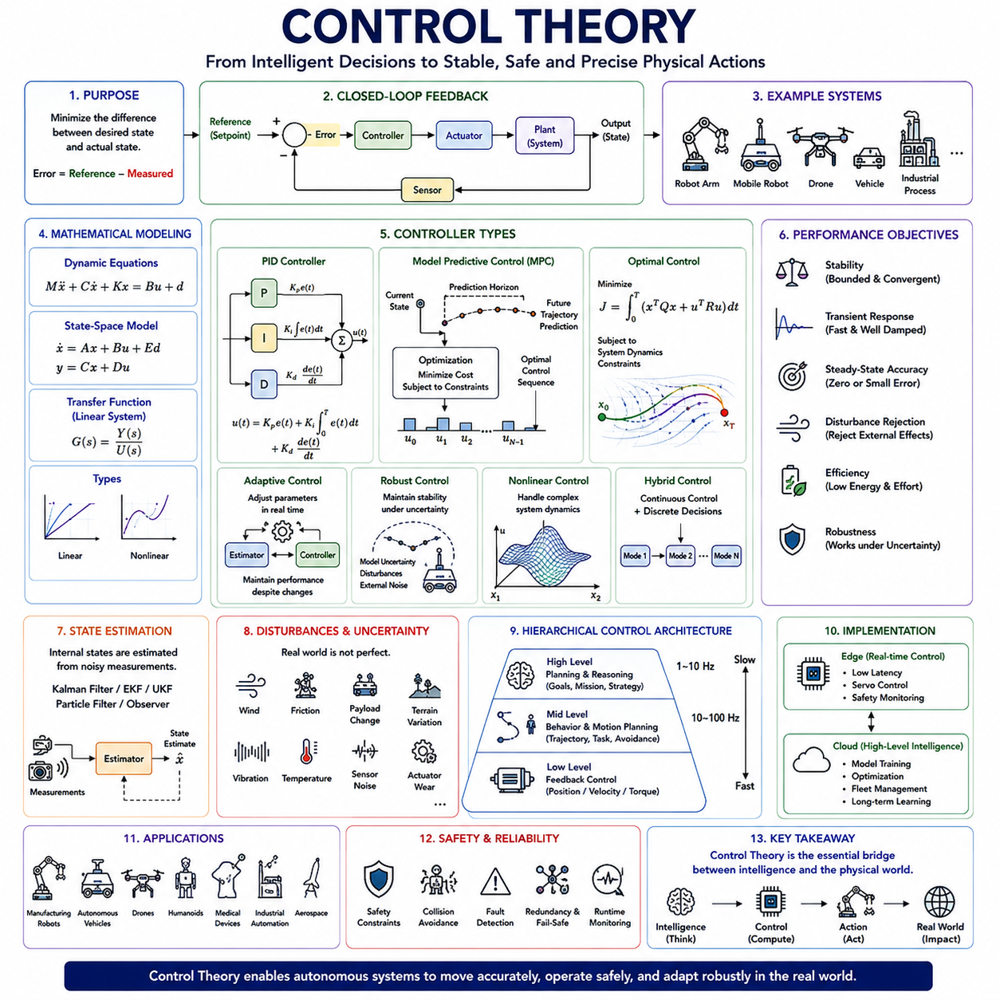
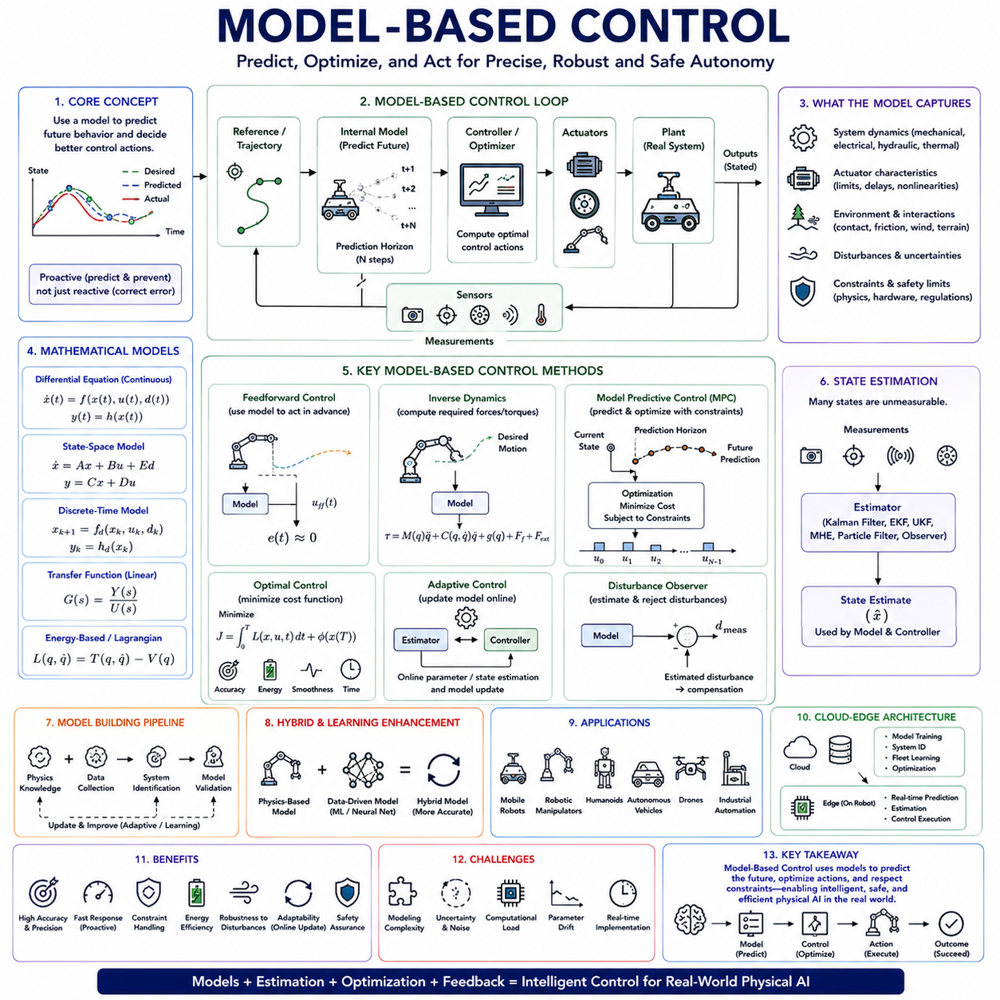
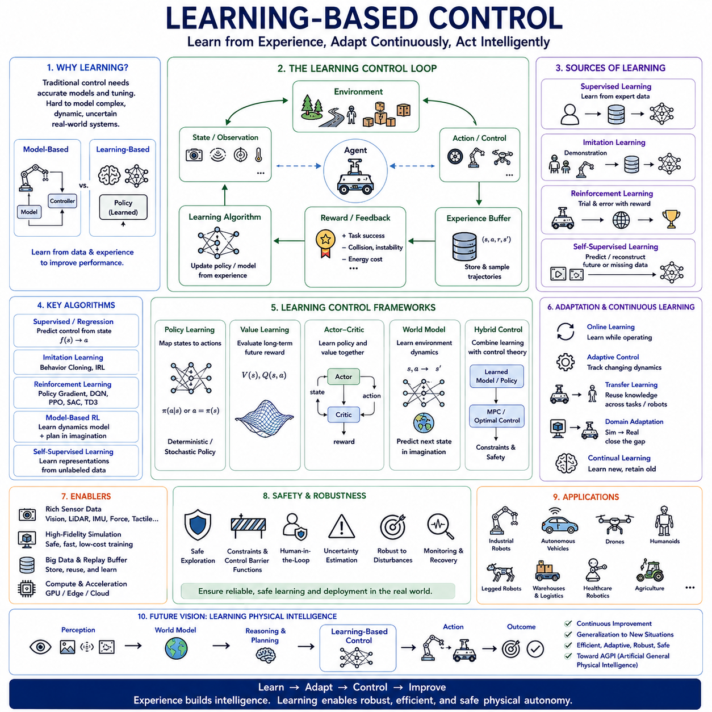
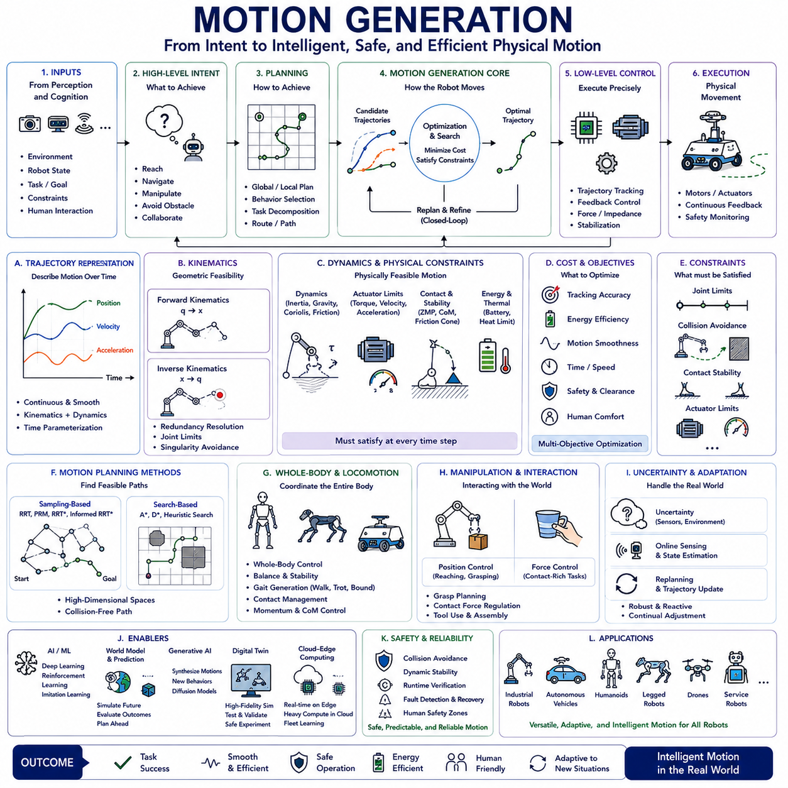
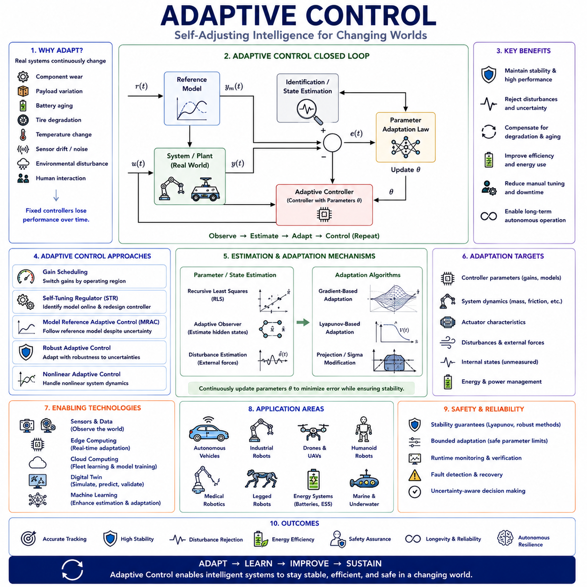
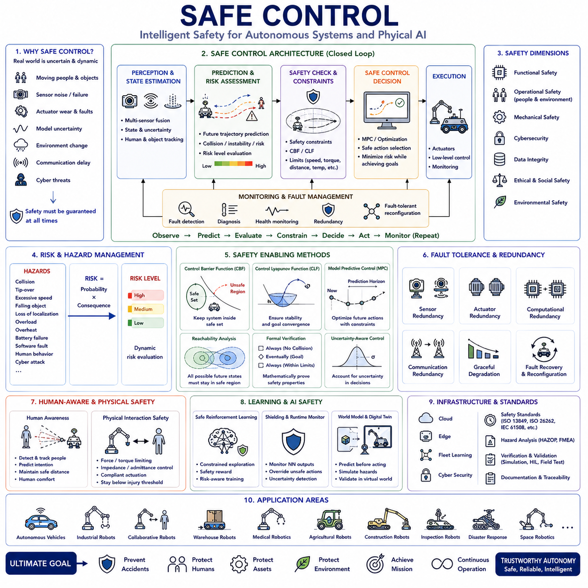
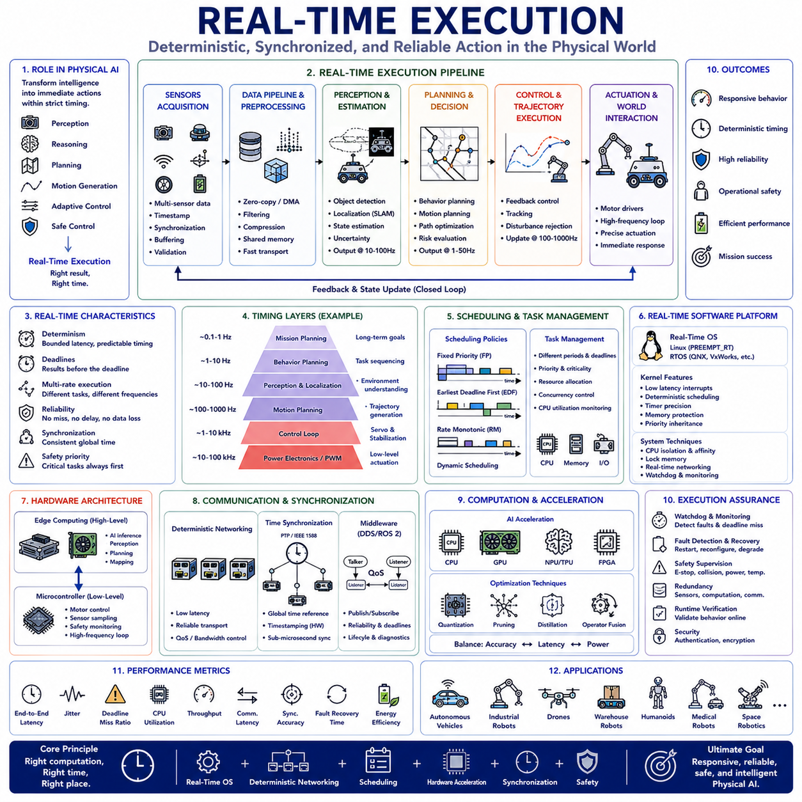
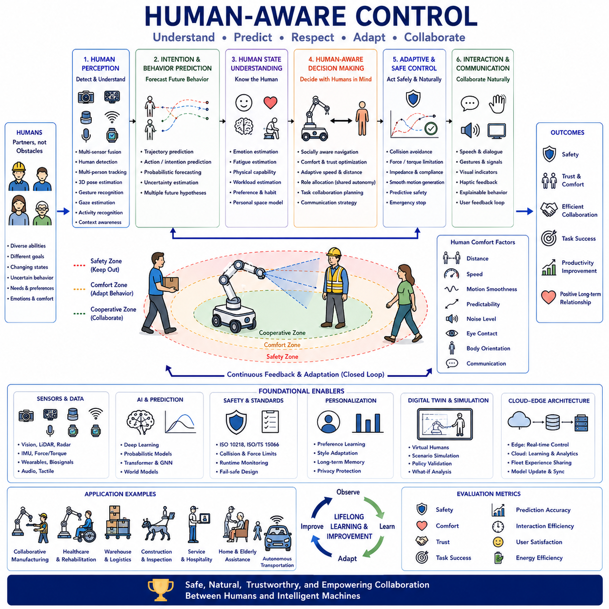

**Physical AI Engineering**

# Chapter 06 Control and Actuation 

## 06-01 Control Theory

{width="7.268055555555556in" height="7.268055555555556in"}

**제어 이론(Control Theory)** 은 피지컬 AI(Physical AI), 로보틱스(Robotics), 자율 시스템(Autonomous System), 지능형 차량(Intelligent Vehicle), 산업 자동화(Industrial Automation), 항공우주(Aerospace), 사이버-물리 시스템(Cyber-Physical System)의 기반이 되는 가장 중요한 공학 및 수학 분야 가운데 하나이다. 모든 지능형 피지컬 에이전트(Physical Agent)는 주변 환경을 지속적으로 인식하고, 현재 상태를 추정하며, 적절한 행동을 결정하고, 액추에이터(Actuator)를 제어하여 원하는 목표를 달성해야 한다. 현대의 인공지능(AI)은 인식(Perception), 추론(Reasoning), 계획(Planning), 의사결정(Decision Making)을 담당하지만, 제어 이론은 이러한 고수준의 결정을 실제 세계에서 안정적이고 안전하며 정밀한 물리적 행동으로 변환하는 수학적 기반을 제공한다. 제어 시스템이 없다면 아무리 뛰어난 인공지능이라도 균형 유지(Balance), 경로 추종(Trajectory Following), 물체 조작(Manipulation), 힘 제어(Force Control), 그리고 변화하는 환경과의 안전한 상호작용을 수행할 수 없다. 피지컬 AI 아키텍처에서 제어 이론은 지능적인 추론과 실제 물리적 움직임을 연결하는 최종 실행 계층(Final Execution Layer)으로서, 계획된 행동이 불확실성(Uncertainty), 외란(Disturbance), 비선형성(Nonlinearity), 환경 변화 속에서도 정확하게 수행될 수 있도록 한다.

제어 이론의 역사는 현대 컴퓨터보다 훨씬 오래되었다. 초기 증기기관(Steam Engine)에 사용된 **원심 조속기(Centrifugal Governor)** 는 음의 피드백(Negative Feedback)을 이용하여 엔진 속도를 자동으로 조절함으로써 인간의 지속적인 개입 없이도 시스템이 스스로 안정화될 수 있음을 보여주었다. 이후 20세기에는 전기공학(Electrical Engineering), 항공우주공학(Aerospace Engineering), 산업 자동화, 시스템 공학(System Engineering)의 발전과 함께 제어 이론은 엄밀한 수학적 체계를 갖추게 되었으며, 오늘날 산업용 로봇(Industrial Robot), 자율주행 로봇(Autonomous Mobile Robot), 우주선(Spacecraft), 항공기(Aircraft), 의료기기(Medical Device), 협동 로봇(Collaborative Robot), 휴머노이드(Humanoid)에 이르기까지 거의 모든 자율 시스템의 핵심 기술로 자리 잡았다.

모든 제어 시스템의 가장 기본적인 목적은 **목표 상태(Desired State)** 와 **현재 상태(Current State)** 사이의 차이를 최소화하는 것이다. 목표 상태는 일반적으로 **기준값(Reference)**, **설정값(Setpoint)**, **목표(Target)** 라고 부르며, 실제 측정값과 목표값의 차이는 **제어 오차(Control Error)** 라고 한다. 제어기는 이 오차를 지속적으로 계산하고, 오차를 줄일 수 있는 제어 명령(Control Command)을 생성하여 액추에이터에 전달한다. 로봇이 균형을 유지하거나, 경로를 따라 이동하거나, 바퀴 속도를 제어하거나, 모터 토크(Motor Torque)를 조절하거나, 카메라 방향을 안정화하거나, 그리퍼(Gripper)의 힘을 제어하는 모든 과정은 결국 제어 오차를 최소화하는 문제로 귀결된다.

제어 시스템(Control System)은 여러 구성 요소가 긴밀하게 연결되어 있다. 센서(Sensor)는 위치(Position), 속도(Velocity), 가속도(Acceleration), 힘(Force), 온도(Temperature), 압력(Pressure), 자세(Orientation), 배터리 전압(Battery Voltage), 전류(Current), 환경 정보(Environmental Condition) 등을 측정한다. 이러한 측정값은 상태 추정(State Estimation)을 거쳐 계획기(Planner)나 자율 추론 시스템이 생성한 목표값과 비교된다. 제어기(Controller)는 오차를 줄이기 위한 제어 명령을 계산하고, 모터(Motor), 유압 실린더(Hydraulic Cylinder), 공압 시스템(Pneumatic System), 서보(Servo), 로봇 관절(Robot Joint), 조향 장치(Steering System), 제동 장치(Brake System) 등 다양한 액추에이터에 전달한다. 액추에이터는 실제 시스템을 움직이고, 그 결과는 다시 센서를 통해 측정되어 반복적인 **피드백 루프(Feedback Loop)** 를 형성한다.

현대 제어 이론의 핵심은 **피드백(Feedback)** 이다. 피드백은 시스템이 자신의 실제 상태를 지속적으로 관찰하고 이를 목표 상태와 비교하여 자동으로 오차를 수정하는 원리이다. 실제 환경에서는 외란, 기계 마모(Mechanical Wear), 센서 오차(Sensor Error), 적재물 변화(Payload Change), 지형 변화(Terrain Irregularity), 바람(Wind), 진동(Vibration), 온도 변화(Thermal Effect), 부품 노화(Component Aging) 등이 지속적으로 발생한다. **개루프 제어(Open-Loop Control)** 는 실제 결과를 확인하지 않기 때문에 이러한 변화를 보상할 수 없지만, **폐루프 제어(Closed-Loop Control)** 는 지속적으로 실제 결과를 측정하여 예상과 다른 부분을 자동으로 수정할 수 있다.

대부분의 제어 시스템은 **음의 피드백(Negative Feedback)** 을 사용한다. 출력(Output)이 목표보다 커지면 제어 입력(Control Input)을 줄이고, 출력이 목표보다 작아지면 제어 입력을 증가시켜 오차를 감소시킨다. 이러한 자기 보정(Self-Correction) 메커니즘은 외란이 존재하더라도 시스템을 안정적으로 유지한다. 반대로 **양의 피드백(Positive Feedback)** 은 오차를 더욱 증폭시키므로 특별한 응용을 제외하면 일반적인 로봇 제어에서는 거의 사용되지 않는다.

효율적인 제어기를 설계하기 위해서는 **수학적 모델링(Mathematical Modeling)** 이 필요하다. 모든 물리 시스템은 힘(Force), 운동(Motion), 에너지(Energy), 운동량(Momentum), 관성(Inertia), 마찰(Friction), 감쇠(Damping), 탄성(Elasticity), 외란(Disturbance) 사이의 관계를 나타내는 미분방정식(Differential Equation)으로 표현할 수 있다. 이러한 모델은 실제 시스템을 제작하기 전에 동작을 예측할 수 있게 해준다. 단순한 경우에는 선형 모델(Linear Model)을 사용하지만, 실제 환경에서는 보다 현실적인 **비선형 모델(Nonlinear Model)** 이 많이 활용된다.

현대 로보틱스에서는 **상태 공간 모델(State-Space Model)** 이 매우 중요하다. 전달함수(Transfer Function)가 입력과 출력만을 표현하는 반면, 상태 공간 모델은 위치, 속도, 자세, 관절각(Joint Angle), 모터 전류, 배터리 상태, 환경 변수 등 시스템 내부의 상태(State)를 모두 포함한다. 이러한 표현은 다변수 제어(Multivariable Control), 상태 추정(State Estimation), 옵저버(Observer), 최적 제어(Optimal Control), AI 기반 제어와 자연스럽게 연결된다.

한편 **전달함수(Transfer Function)** 는 선형 시스템의 입력과 출력 사이의 관계를 주파수 영역(Frequency Domain)에서 표현하는 대표적인 방법이다. 전달함수를 이용하면 시스템의 안정성(Stability), 과도 응답(Transient Response), 공진(Resonance), 대역폭(Bandwidth), 외란 제거 능력(Disturbance Rejection)을 분석할 수 있으며, **보드 선도(Bode Plot)**, **나이퀴스트 선도(Nyquist Diagram)**, **니콜스 선도(Nichols Chart)**, **근궤적(Root Locus)** 등의 고전 제어 기법(Classical Control Technique)이 이를 기반으로 한다.

제어 이론에서 가장 중요한 요소는 **안정성(Stability)** 이다. 안정한 시스템은 외란이 발생하더라도 시간이 지나면 다시 목표 상태로 수렴하지만, 불안정한 시스템은 진동(Oscillation), 발산(Divergence), 제어 불능(Uncontrollable Behavior)을 일으킨다. 사람과 함께 동작하는 자율 로봇은 작은 불안정성도 안전에 큰 영향을 미치기 때문에 매우 높은 수준의 안정성이 요구된다. 따라서 제어기는 항상 시스템이 안정적인 영역에서 동작하도록 설계되어야 한다.

또한 **과도 응답(Transient Response)** 은 목표값이 변경되거나 외란이 발생했을 때 시스템이 얼마나 빠르게 새로운 상태에 도달하는지를 나타낸다. 상승 시간(Rise Time), 정착 시간(Settling Time), 오버슈트(Overshoot), 언더슈트(Undershoot), 진동(Oscillation), 감쇠비(Damping Ratio), 고유 주파수(Natural Frequency), 정상 상태 오차(Steady-State Error) 등이 대표적인 성능 지표이다. 로봇은 빠르게 반응해야 하지만 과도한 진동은 정밀도와 안전성을 떨어뜨리므로 적절한 균형이 필요하다.

**정상 상태 성능(Steady-State Performance)** 은 과도 응답이 끝난 이후 얼마나 정확하게 목표를 유지하는지를 의미한다. 이상적으로는 정상 상태 오차가 0이 되어야 하지만, 실제 시스템에서는 마찰, 중력, 적재물 변화, 센서 오차 등으로 인해 지속적인 오차가 발생할 수 있다. 이러한 오차를 제거하기 위해 적분 제어(Integral Control), 외란 관측기(Disturbance Observer), 모델 보상(Model Compensation) 등이 사용된다.

현실 환경에서는 항상 다양한 외란이 존재하기 때문에 **외란 제거(Disturbance Rejection)** 능력이 매우 중요하다. 드론은 바람의 영향을 받고, 모바일 로봇은 울퉁불퉁한 지형을 이동하며, 로봇 팔은 적재물 변화에 따라 동역학이 달라지고, 사람과의 상호작용은 예기치 않은 힘을 발생시킨다. 우수한 제어기는 이러한 외란을 빠르게 보상하면서도 목표 추종 성능을 유지해야 한다.

제어 시스템은 **연속 시간 제어(Continuous-Time Control)** 와 **이산 시간 제어(Discrete-Time Control)** 로 구분된다. 과거의 아날로그 제어는 연속적인 전기 신호를 사용했지만, 현대의 대부분의 로봇은 디지털 프로세서(Digital Processor)를 이용하여 일정한 주기(Sampling Interval)마다 제어 알고리즘을 수행한다. 따라서 샘플링 주파수(Sampling Frequency), 계산 지연(Computational Delay), 양자화(Quantization), 통신 지연(Communication Latency), 동기화(Synchronization)가 중요한 설계 요소가 된다.

가장 널리 사용되는 제어기는 **비례-적분-미분 제어기(Proportional-Integral-Derivative Controller, PID Controller)** 이다. 비례 제어(Proportional Control)는 현재 오차에 즉시 반응하고, 적분 제어(Integral Control)는 장기적으로 누적된 오차를 제거하며, 미분 제어(Derivative Control)는 오차의 변화율을 예측하여 미래를 미리 고려한다. 이 세 가지 요소가 결합되어 산업용 모터 속도 제어, 위치 제어, 온도 제어, 압력 제어, 조향 제어, 균형 유지 등 다양한 분야에서 매우 높은 성능을 제공한다.

최근의 피지컬 AI에서는 PID와 함께 **모델 예측 제어(Model Predictive Control, MPC)** 가 활발하게 활용되고 있다. MPC는 현재 오차만 보는 것이 아니라 시스템 모델을 이용하여 미래의 상태를 예측하고, 일정한 예측 구간(Prediction Horizon) 동안의 최적 행동을 계산한다. 이 과정에서 액추에이터 한계, 안전 제약, 에너지 소비, 장애물 회피, 임무 목표 등을 동시에 고려할 수 있어 자율주행차, 모바일 로봇, 휴머노이드, 협동 로봇 등에서 매우 높은 성능을 제공한다.

또 다른 중요한 분야는 **최적 제어(Optimal Control)** 이다. 최적 제어는 에너지 소비(Energy Consumption), 추종 오차(Tracking Error), 액추에이터 사용량(Actuator Effort), 임무 시간(Mission Duration), 진동(Vibration), 열 부하(Thermal Loading), 운영 비용(Operation Cost) 등을 최소화하는 제어 입력을 수학적으로 계산한다. **선형 이차 조절기(Linear Quadratic Regulator, LQR)**, **동적 계획법(Dynamic Programming)**, **해밀턴-야코비(Hamilton-Jacobi)** 기반 최적화 등이 대표적인 기법이다.

현실에서는 시스템 특성이 계속 변하기 때문에 **적응 제어(Adaptive Control)** 가 필요하다. 기계 마모, 적재물 변화, 배터리 방전, 온도 변화, 타이어 변형, 유압 누설, 지형 변화는 모두 시스템 동역학을 변화시킨다. 적응 제어는 이러한 변화를 실시간으로 추정하여 제어기 파라미터를 자동으로 수정함으로써 항상 일정한 성능을 유지한다.

이와 함께 **강인 제어(Robust Control)** 는 모델 오차와 불확실성을 고려하여 설계된다. 실제 시스템은 항상 모델과 차이가 존재하기 때문에, 강인 제어는 일정 수준의 모델 오차가 존재하더라도 안정성과 성능을 보장하는 것을 목표로 한다. 이는 안전 필수 시스템(Safety-Critical System)에서 매우 중요한 기술이다.

또한 많은 로봇은 비선형 동역학을 가지므로 **비선형 제어(Nonlinear Control)** 가 필요하다. 모바일 로봇의 바퀴 미끄러짐(Wheel Slip), 매니퓰레이터의 자세에 따른 관성 변화, 휴머노이드의 보행, 드론의 회전 운동 등은 모두 강한 비선형성을 가진다. 비선형 제어는 이러한 특성을 직접 고려하여 더 넓은 동작 범위에서 높은 성능을 제공한다.

현대의 피지컬 AI는 **하이브리드 제어(Hybrid Control)** 도 많이 사용한다. 로봇은 연속적인 운동을 수행하면서도 작업 단계(Task Phase), 장애물 회피, 충전, 비상 정지, 작업 완료 등에 따라 동작 모드를 변경한다. 따라서 상태 머신(State Machine), 비헤이비어 트리(Behavior Tree), 기호 기반 계획(Symbolic Planning)과 연속 제어를 함께 사용하는 하이브리드 구조가 널리 활용된다.

복잡한 로봇 시스템에서는 **계층적 제어(Hierarchical Control)** 가 일반적이다. 상위 계층은 추론과 미션 계획을 수행하고, 중간 계층은 행동 계획과 이동 계획을 담당하며, 하위 계층은 모터 위치, 속도, 토크, 전류, 힘을 직접 제어한다. 실시간 서보 제어(Servo Control)는 일반적으로 kHz 수준에서 수행되며, 상위 계획은 수 초 단위로 갱신될 수 있다. 이러한 계층 구조는 AI와 제어 시스템을 자연스럽게 통합한다.

많은 상태 변수는 직접 측정할 수 없기 때문에 **상태 추정(State Estimation)** 이 매우 중요하다. 속도, 바퀴 미끄러짐, 외란, 내부 모터 상태, 마찰 계수, 배터리 건강 상태, 적재물 분포 등은 직접 측정하기 어렵다. 이를 위해 **칼만 필터(Kalman Filter)**, **확장 칼만 필터(Extended Kalman Filter, EKF)**, **무향 칼만 필터(Unscented Kalman Filter, UKF)**, **입자 필터(Particle Filter)**, **옵저버 이론(Observer Theory)** 등이 사용된다.

현대의 인공지능은 제어 이론을 대체하는 것이 아니라 보완한다. 심층학습(Deep Learning)은 인식과 의미 이해를 담당하고, 강화학습은 정책을 최적화하며, 월드 모델은 미래를 예측하고, 인과 추론은 시스템의 메커니즘을 이해하며, 파운데이션 모델은 사람의 의도를 이해한다. 그러나 이러한 모든 지능은 결국 수학적으로 안정적인 제어 시스템을 통해서만 실제 물리적 행동으로 구현될 수 있다.

최근에는 **학습 기반 제어(Learning-Based Control)** 도 활발히 연구되고 있다. 머신러닝(Machine Learning)은 시스템 모델을 자동으로 학습하고, 제어기 파라미터를 최적화하며, 불확실성을 추정하고, 복잡한 비선형 효과를 보상할 수 있다. 그러나 안전성이 중요한 응용에서는 여전히 수학적 안정성과 강인성을 보장하는 기존 제어 이론이 필수적이다.

사람과 함께 동작하는 협동 로봇에서는 **사람-로봇 상호작용(Human-Robot Interaction)** 제어가 중요하다. 협동 로봇은 순응 제어(Compliant Control), 힘 제어(Force Control), **임피던스 제어(Impedance Control)**, **어드미턴스 제어(Admittance Control)**, 공유 자율성(Shared Autonomy)을 이용하여 사람과 안전하고 자연스럽게 협력한다.

또한 **클라우드-엣지 컴퓨팅(Cloud-Edge Computing)** 은 현대 제어 구조에도 영향을 미친다. 실시간 제어는 지연이 거의 없는 엣지 컴퓨터에서 수행되고, 장기 최적화, 플릿 관리(Fleet Management), 학습, 전략 수립은 클라우드에서 수행된다. 이를 통해 실시간성과 고성능 계산을 동시에 확보할 수 있다.

제어 이론에서 **안전(Safety)** 은 절대적으로 중요하다. **제어 장벽 함수(Control Barrier Function, CBF)**, 안전 집합 알고리즘(Safe Set Algorithm), 런타임 검증(Runtime Verification), 결함 허용 제어(Fault-Tolerant Control), 비상 제동(Emergency Braking), 충돌 회피(Collision Avoidance), 액추에이터 모니터링(Actuator Monitoring), 시스템 건강 관리(Health Management)는 외란이나 고장이 발생하더라도 로봇이 항상 안전한 동작 범위 안에서 움직이도록 보장한다. 필요할 경우 안전 제어기는 성능보다 안전을 우선시하여 모든 행동을 제한한다.

제어 시스템의 성능은 단순한 추종 오차만으로 평가되지 않는다. **안정 여유(Stability Margin)**, **응답 속도(Response Speed)**, **정상 상태 정확도(Steady-State Accuracy)**, **외란 제거 능력(Disturbance Rejection)**, **에너지 효율(Energy Efficiency)**, **계산 효율(Computational Efficiency)**, **신뢰성(Reliability)**, **안전 인증(Safety Certification)** 등이 함께 평가되며, 이러한 요소들이 실제 산업 적용 가능성을 결정한다.

피지컬 AI가 **인공 일반 피지컬 지능(Artificial General Physical Intelligence, AGPI)** 으로 발전하더라도 제어 이론은 여전히 가장 중요한 기반 기술 가운데 하나로 남을 것이다. 미래의 지능형 시스템은 **멀티모달 인식(Multimodal Perception)**, **월드 모델(World Model)**, **인과 추론(Causal Reasoning)**, **강화학습(Reinforcement Learning)**, **생성형 AI(Generative AI)**, **디지털 트윈(Digital Twin)**, **클라우드-엣지 컴퓨팅(Cloud-Edge Computing)**, **지속 학습(Lifelong Learning)** 을 통합한 고도의 인지 구조를 갖추게 될 것이다. 그러나 이러한 모든 지능적 판단은 결국 정밀하고 안정적인 물리적 움직임으로 변환되어야만 현실 세계에서 의미를 가진다. 따라서 제어 이론은 **추상적인 인공지능과 실제 물리 세계를 연결하는 가장 핵심적인 다리(Bridge)** 로서, 자율 로봇이 안전하게 이동하고, 정밀하게 조작하며, 사람과 자연스럽게 협력하고, 변화하는 환경에 지속적으로 적응하며, 다양한 현실 환경에서 신뢰성 있게 동작할 수 있도록 하는 근본적인 기반 기술로 계속 발전해 나갈 것이다.

## 06-02 Model-Based Control

{width="7.268055555555556in" height="7.268055555555556in"}

**모델 기반 제어(Model-Based Control)** 는 현대 제어공학에서 가장 중요한 제어 패러다임 가운데 하나로, 고성능 로보틱스(Robotics), 자율주행 차량(Autonomous Vehicle), 항공우주(Aerospace), 산업 자동화(Industrial Automation), 피지컬 AI(Physical AI)의 핵심 기반 기술이다. 기존의 제어기가 주로 현재 발생한 오차(Error)에 반응하는 방식이었다면, 모델 기반 제어는 시스템의 수학적 모델(Mathematical Model)을 이용하여 미래의 동작을 예측하고, 최적의 제어 입력(Control Input)을 계산하며, 외란(Disturbance)이 실제 성능에 영향을 미치기 전에 미리 보상(Proactive Compensation)하는 것을 목표로 한다. 즉, 물리 법칙(Physical Law), 시스템 동역학(System Dynamics), 액추에이터 특성(Actuator Characteristics), 환경과의 상호작용(Environment Interaction), 운영 제약(Operational Constraints)에 대한 지식을 제어기 내부에 포함시킴으로써, 자율 시스템은 더욱 높은 정밀도(Precision), 빠른 응답(Response), 강인성(Robustness), 안전성(Safety)을 동시에 달성할 수 있다. 피지컬 AI 아키텍처에서 모델 기반 제어는 상위 수준의 계획(Planning)과 추론(Reasoning)을 실제 물리적 행동으로 변환하는 핵심 실행 지능(Execution Intelligence)이며, 지속적으로 변화하는 환경에서도 안정적인 동작을 유지하는 기반이 된다.

모델 기반 제어의 핵심 원리는 제어기가 시스템이 어떻게 움직이는지를 이해할수록 더욱 우수한 제어를 수행할 수 있다는 점이다. 기존의 피드백 제어(Feedback Control)는 오차가 발생한 이후에 이를 수정하지만, 모델 기반 제어는 내부 모델을 이용하여 현재의 제어 입력이 미래에 어떤 결과를 만들지를 미리 계산한다. 따라서 로봇은 오차가 발생한 이후 수정하는 것이 아니라, 미래의 오차를 예측하여 미리 방지할 수 있다. 이러한 예측 기반(Proactive) 제어는 추종 정확도(Tracking Accuracy), 동작의 부드러움(Motion Smoothness), 시스템 효율(System Efficiency)을 크게 향상시킨다.

모델 기반 제어의 중심에는 **수학적 모델(Mathematical Model)** 이 존재한다. 모델은 입력(Input), 내부 상태(State), 출력(Output), 외란(Disturbance) 사이의 관계를 수학적으로 표현한다. 응용 분야에 따라 기계 동역학(Mechanical Dynamics), 전기 시스템(Electrical System), 유압 시스템(Hydraulic System), 열 시스템(Thermal Process), 공기역학(Aerodynamics), 배터리 특성(Battery Characteristics), 접촉 역학(Contact Dynamics), 또는 로봇 전체 플랫폼을 표현할 수도 있다. 이러한 모델은 뉴턴 역학(Newtonian Mechanics), 에너지 보존(Conservation of Energy), 강체 동역학(Rigid-Body Dynamics), 마찰(Friction), 탄성(Elasticity), 유체역학(Fluid Dynamics), 전자기학(Electromagnetics), 액추에이터 응답(Actuator Response)과 같은 물리 법칙을 기반으로 한다. 실제 시스템과 모델이 유사할수록 제어기의 예측 성능도 향상된다.

물리 시스템은 다양한 형태로 모델링될 수 있다. **미분방정식(Differential Equation)** 은 연속 시간에서 변수의 변화율을 표현하며, **차분방정식(Difference Equation)** 은 디지털 제어기를 위한 이산 시간 모델을 제공한다. **상태 공간 모델(State-Space Model)** 은 내부 상태를 명시적으로 표현하여 다변수 시스템(Multivariable System)을 효과적으로 제어할 수 있도록 한다. **전달함수(Transfer Function)** 는 선형 시스템을 주파수 영역(Frequency Domain)에서 분석하는 데 사용되며, **라그랑주 역학(Lagrangian Dynamics)** 과 **해밀토니안 역학(Hamiltonian Dynamics)** 은 다관절 로봇과 같은 복잡한 기계 시스템을 표현하는 데 적합하다. 각각의 표현 방식은 응용 분야와 계산 요구 사항에 따라 적절하게 선택된다.

현대 로보틱스에서는 **상태 공간 모델(State-Space Model)** 이 가장 널리 사용된다. 모바일 로봇은 바퀴 속도(Wheel Velocity), 차량 자세(Vehicle Orientation), 배터리 상태(Battery Condition), 위치 추정(Localization), 적재물(Payload), 센서 상태를 동시에 제어해야 한다. 로봇 팔은 여러 관절(Joint)의 움직임과 관성(Inertia), 중력(Gravity), 마찰(Friction), 외부 힘(External Force)을 함께 고려해야 한다. 휴머노이드(Humanoid)는 수십 개의 관절을 동시에 제어하면서 균형(Balance)을 유지해야 한다. 상태 공간 모델은 이러한 복잡한 시스템을 하나의 통합된 수학적 구조로 표현할 수 있으며, 상태 추정(State Estimation), 최적 제어(Optimal Control), 예측 제어(Predictive Control), AI 기반 제어와 자연스럽게 연결된다.

모델 기반 제어의 가장 중요한 특징은 **예측(Prediction)** 이다. 현재 상태(Current State)와 후보 제어 입력(Candidate Control Input)이 주어지면 내부 모델은 일정한 **예측 구간(Prediction Horizon)** 동안 시스템의 미래 상태를 계산한다. 단순히 현재 오차만 고려하는 것이 아니라, 현재의 행동이 미래의 위치, 속도, 에너지 소비(Energy Consumption), 안전 여유(Safety Margin), 액추에이터 한계(Actuator Saturation), 임무 완료(Mission Completion)에 어떤 영향을 미치는지를 함께 평가한다. 이러한 미래 예측은 제어를 단순한 오차 수정이 아니라 지능적인 의사결정 과정으로 발전시킨다.

예측 성능은 모델의 정확도(Model Fidelity)에 크게 의존한다. 고정밀 모델은 비선형 동역학(Nonlinear Dynamics), 액추에이터 한계, 센서 특성, 접촉 역학(Contact Mechanics), 외란, 열 특성(Thermal Behavior), 구조 변형(Structural Flexibility), 불확실성(Uncertainty)까지 포함한다. 반면 단순 모델은 계산량을 줄일 수 있지만 예측 정확도는 낮아진다. 실제 시스템에서는 계산 효율과 모델 정확도의 균형을 고려하여 적절한 수준의 모델을 선택한다. 일반적으로 실시간 제어는 단순 모델을 사용하고, 장기 계획이나 최적화는 보다 정밀한 모델을 사용한다.

정확한 모델을 얻기 위해서는 **시스템 식별(System Identification)** 이 필요하다. 물리 법칙은 기본적인 구조를 제공하지만, 질량 분포(Mass Distribution), 마찰 계수(Friction Coefficient), 모터 상수(Motor Constant), 감쇠 계수(Damping Ratio), 센서 오프셋(Sensor Offset), 타이어 특성(Tire Characteristic), 유압 특성(Hydraulic Property), 배터리 특성(Battery Characteristic)은 실제 실험을 통해 추정해야 한다. 시스템 식별은 입력과 출력 데이터를 분석하여 시뮬레이션 결과와 실제 측정 결과의 차이를 최소화하도록 모델 파라미터를 최적화한다.

최근의 피지컬 AI는 **물리 기반 모델(Physics-Based Model)** 과 **데이터 기반 학습(Data-Driven Learning)** 을 결합하는 방향으로 발전하고 있다. 물리 모델은 시스템의 기본 원리를 설명하고, 머신러닝(Machine Learning)은 알려지지 않은 비선형성, 환경 변화, 모델 오차를 보정한다. 이러한 **하이브리드 모델(Hybrid Model)** 은 물리적 일관성(Physical Consistency)을 유지하면서도 높은 적응성을 제공한다.

모델 기반 제어에서는 **피드포워드 제어(Feedforward Control)** 가 피드백 제어와 함께 사용된다. 피드백 제어는 오차가 발생한 이후에 수정하지만, 피드포워드 제어는 시스템 모델을 이용하여 목표 궤적(Desired Trajectory)에 필요한 제어 입력을 미리 계산한다. 예를 들어 로봇 팔에서는 중력 보상(Gravity Compensation), 관성 보상(Inertia Compensation), 마찰 보상(Friction Compensation), 차량에서는 조향 보상(Steering Compensation)이 대표적인 피드포워드 제어의 예이다.

또 다른 중요한 기술은 **역동역학(Inverse Dynamics)** 이다. 일반적인 동역학이 힘을 주었을 때 어떻게 움직이는지를 계산한다면, 역동역학은 원하는 움직임을 만들기 위해 필요한 힘이나 토크(Torque)를 계산한다. 로봇 팔은 역동역학을 이용하여 중력, 관성, 코리올리 힘(Coriolis Force), 원심력(Centrifugal Force), 적재물을 모두 보상하면서 정확한 관절 토크를 계산한다. 이를 통해 피드백 제어기의 부담을 줄이고 매우 높은 위치 정밀도를 얻을 수 있다.

실제 환경에는 항상 외란이 존재하므로 **외란 추정(Disturbance Estimation)** 도 매우 중요하다. 바람(Wind), 적재물 변화(Payload Variation), 울퉁불퉁한 지형(Uneven Terrain), 바퀴 미끄러짐(Wheel Slip), 유압 누설(Hydraulic Leakage), 진동(Vibration), 온도 변화(Temperature Change), 사람과의 접촉(Human Interaction) 등은 모델에 포함되지 않는 외란이다. **외란 관측기(Disturbance Observer)** 는 실제 측정값과 모델 예측값의 차이를 분석하여 외란을 추정하고 이를 사전에 보상한다.

마찬가지로 **상태 추정(State Estimation)** 도 매우 중요하다. 바퀴 미끄러짐, 배터리 내부 저항(Battery Internal Resistance), 접촉력(Contact Force), 마찰, 적재물 분포는 직접 측정하기 어렵다. 모델 기반 제어는 **칼만 필터(Kalman Filter)**, **확장 칼만 필터(Extended Kalman Filter, EKF)**, **무향 칼만 필터(Unscented Kalman Filter, UKF)**, **이동 지평선 추정(Moving Horizon Estimation, MHE)**, **입자 필터(Particle Filter)** 등을 이용하여 이러한 상태를 추정하고 제어 성능을 향상시킨다.

모델 기반 제어의 대표적인 기술이 **모델 예측 제어(Model Predictive Control, MPC)** 이다. MPC는 예측 구간 동안 다양한 제어 입력을 시뮬레이션하고, 액추에이터 한계, 안전 제약, 에너지 소비, 충돌 회피, 임무 목표를 모두 고려하여 최적의 제어 입력을 계산한다. 계산된 입력 가운데 첫 번째 입력만 실제 시스템에 적용한 후 다시 새로운 센서 정보를 이용하여 동일한 과정을 반복한다. 이러한 **이동 예측 구간(Receding Horizon)** 방식은 변화하는 환경에서도 매우 높은 적응성을 제공한다.

MPC의 가장 큰 장점은 **제약 조건 처리(Constraint Handling)** 이다. 실제 시스템은 최대 토크(Maximum Torque), 최대 조향각(Maximum Steering Angle), 배터리 전류(Battery Current), 유압 압력(Hydraulic Pressure), 관절 속도(Joint Velocity), 충돌 회피(Collision Avoidance), 안정성(Stability) 등의 제약을 가진다. MPC는 이러한 제약을 최적화 과정에 직접 포함하기 때문에 계산된 제어 입력이 항상 실제 시스템에서 실행 가능하다.

또 다른 중요한 분야는 **최적 제어(Optimal Control)** 이다. 최적 제어는 추종 오차, 에너지 소비, 액추에이터 사용량, 진동, 열 발생(Thermal Loading), 임무 수행 시간 등을 동시에 최소화하는 목적 함수(Objective Function)를 정의하고 이를 최적화한다. **선형 이차 조절기(Linear Quadratic Regulator, LQR)**, **동적 계획법(Dynamic Programming)**, **해밀턴-야코비-벨만(Hamilton-Jacobi-Bellman, HJB)** 최적화, **미분 동적 계획법(Differential Dynamic Programming, DDP)** 등이 대표적인 방법이다.

현실에서는 시스템 특성이 계속 변하므로 **적응형 모델 기반 제어(Adaptive Model-Based Control)** 가 필요하다. 기계 마모(Mechanical Wear), 구조물 노화(Structural Aging), 배터리 열화(Battery Degradation), 적재물 변화, 타이어 변형(Tire Deformation), 센서 드리프트(Sensor Drift), 환경 변화는 시스템 모델을 지속적으로 변화시킨다. 적응 알고리즘은 이러한 변화를 실시간으로 추정하여 모델을 업데이트함으로써 장기간 높은 성능을 유지한다.

반면 **강인 모델 기반 제어(Robust Model-Based Control)** 는 모델이 완벽하지 않다는 사실을 전제로 설계된다. 실제 시스템에는 항상 모델 오차, 센서 노이즈(Sensor Noise), 통신 지연(Communication Delay), 수치 오차(Numerical Approximation), 환경 변화가 존재한다. 강인 제어는 이러한 불확실성이 존재하더라도 안정성과 성능을 보장하는 것을 목표로 하며, 자율주행차, 협동 로봇, 의료기기, 항공우주 시스템 등 안전이 중요한 분야에서 필수적인 기술이다.

많은 로봇은 강한 비선형성을 가지므로 **비선형 모델 기반 제어(Nonlinear Model-Based Control)** 도 매우 중요하다. 모바일 로봇의 바퀴 미끄러짐, 보행 로봇(Legged Robot)의 접촉 변화(Contact Change), 매니퓰레이터의 자세에 따른 관성 변화, 드론(Drone)의 급격한 회전 운동, 소프트 로봇(Soft Robot)의 변형은 모두 선형 모델로는 정확하게 표현하기 어렵다. 비선형 모델은 이러한 현상을 보다 정확하게 예측할 수 있다.

휴머노이드에서는 **전신 제어(Whole-Body Control)** 가 대표적인 모델 기반 제어 응용 분야이다. 수십 개의 관절, 균형 유지, 접촉력, 운동량(Momentum), 무게중심(Center of Mass), 환경과의 접촉을 동시에 고려해야 하므로, 동적 모델과 최적화 알고리즘을 함께 사용하여 안정적인 전신 동작을 생성한다.

자율주행 차량 역시 모델 기반 제어에 크게 의존한다. 차량 모델은 조향(Steering), 타이어와 노면(Tire-Road Interaction), 서스펜션(Suspension), 제동(Braking), 가속(Acceleration), 요(Yaw) 운동, 공기 저항(Aerodynamic Drag), 안정성을 모두 포함한다. 예측 제어기는 도로 곡률(Road Curvature), 교통 상황(Traffic Condition), 장애물, 승차감(Passenger Comfort), 안전을 함께 고려하여 조향, 가속, 제동 명령을 계산한다.

산업용 로봇도 모델 기반 제어를 적극 활용한다. 고속 매니퓰레이터는 중력 보상, 진동 억제(Vibration Suppression), 적재물 적응(Payload Adaptation), 충돌 회피, 힘 제어를 수행하며, 동적 모델을 이용하여 높은 정밀도와 낮은 에너지 소비를 동시에 달성한다.

사람과 협력하는 로봇에서는 모델링이 더욱 복잡하다. 사람의 움직임은 불확실하고 의도를 가진다. 협동 로봇(Collaborative Robot)은 사람과의 물리적 상호작용을 모델링하여 **임피던스 제어(Impedance Control)**, **어드미턴스 제어(Admittance Control)**, 순응 제어(Compliant Control), 힘 제어(Force Control), 공유 자율성(Shared Autonomy)을 수행한다. 또한 사람의 미래 움직임도 예측하여 더욱 자연스러운 협력을 제공한다.

최근에는 **디지털 트윈(Digital Twin)** 이 모델 기반 제어와 결합되고 있다. 실제 시스템과 동기화된 가상 시스템에서 여러 제어 전략을 미리 시험하고, 에너지 소비, 장비 열화, 안전 여유, 임무 수행 시간 등을 평가한 후 가장 우수한 전략을 실제 시스템에 적용한다. 이를 통해 위험을 줄이고 제어 성능을 향상시킬 수 있다.

인공지능(AI)은 모델 기반 제어를 대체하는 것이 아니라 더욱 강화한다. 심층 신경망(Deep Neural Network)은 알려지지 않은 동역학을 학습하고, 모델 파라미터를 추정하며, 외란을 예측하고, 제어기 튜닝을 최적화한다. 강화학습은 장기적인 제어 정책을 개선하고, 월드 모델(World Model)은 미래를 예측하며, 인과 추론(Causal Reasoning)은 시스템의 원인과 결과를 설명하고, 생성형 AI(Generative AI)는 새로운 제어 전략을 생성한다. 그러나 실제 물리 시스템에서는 여전히 수학적으로 검증된 동적 모델이 안정성과 안전성을 보장하는 핵심 요소이다.

또한 **클라우드-엣지 컴퓨팅(Cloud-Edge Computing)** 은 모델 기반 제어의 성능을 더욱 향상시킨다. 엣지 컴퓨터는 밀리초(Millisecond) 단위의 실시간 예측과 제어를 수행하고, 클라우드는 시스템 식별, 대규모 최적화, 플릿(Fleet) 전체의 학습, 모델 업데이트, 장기 지식 축적을 수행한다. 이러한 계산 분담은 제한된 연산 자원을 가진 로봇에서도 고성능 모델 기반 제어를 가능하게 한다.

모델 기반 제어에서는 **안전(Safety)** 이 항상 포함된다. 내부 모델은 충돌 위험(Collision Risk), 액추에이터 한계, 구조물 응력(Structural Loading), 배터리 한계, 열 상태(Thermal Condition), 전복 위험(Tipping Stability), 사람과의 거리(Human Proximity)를 지속적으로 예측한다. 안전 제약은 항상 최적화 과정에 포함되며, 실행 중에도 예측과 실제 결과를 비교하여 허용 범위를 벗어나면 즉시 복구 전략을 수행한다.

모델 기반 제어의 성능은 단순한 추종 오차만으로 평가되지 않는다. **예측 정확도(Prediction Accuracy)**, **안정 여유(Stability Margin)**, **제약 만족도(Constraint Satisfaction)**, **에너지 효율(Energy Efficiency)**, **계산 효율(Computational Efficiency)**, **적응성(Adaptability)**, **강인성(Robustness)**, **안전성(Safety)**, **설명 가능성(Explainability)** 등을 종합적으로 평가하여 실제 산업 적용 가능성을 판단한다.

피지컬 AI가 **인공 일반 피지컬 지능(Artificial General Physical Intelligence, AGPI)** 으로 발전함에 따라 모델 기반 제어는 더욱 중요한 역할을 수행하게 될 것이다. 미래의 자율 시스템은 자기 자신(Self), 주변 환경(Environment), 사람(Human), 운영 제약(Operational Constraint), 미래의 임무(Mission Evolution)를 모두 포함하는 내부 모델을 지속적으로 생성하고 업데이트하게 된다. 이러한 예측 모델은 **월드 모델(World Model)**, **인과 추론(Causal Reasoning)**, **강화학습(Reinforcement Learning)**, **파운데이션 모델(Foundation Model)**, **생성형 AI(Generative AI)**, **디지털 트윈(Digital Twin)**, **지속 학습(Lifelong Learning)** 과 결합되어 더욱 고도화된 자율 행동을 생성하게 될 것이다. 수학적으로 검증된 예측, 최적화, 안정성, 안전성을 제공하는 모델 기반 제어는 앞으로도 인공지능을 **신뢰할 수 있는 피지컬 AI(Physical AI)** 로 발전시키는 가장 핵심적인 기반 기술 가운데 하나로 자리매김할 것이다.

## 06-03 Learning-Based Control

{width="7.268055555555556in" height="7.268055555555556in"}

**학습 기반 제어(Learning-Based Control)** 는 현대 로보틱스(Robotics), 자율 시스템(Autonomous System), 피지컬 AI(Physical AI)에서 가장 혁신적인 기술 가운데 하나이다. 기존의 제어 방식이 사람이 설계한 수학적 모델(Mathematical Model)과 정밀하게 조정된 제어기(Controller)에 의존했다면, 학습 기반 제어는 시스템이 경험(Experience), 관찰(Observation), 환경과의 상호작용(Interaction), 지속적인 적응(Continuous Adaptation)을 통해 스스로 제어 성능을 향상시키도록 한다. 즉, 엔지니어가 복잡한 물리 시스템의 모든 특성을 직접 모델링하는 대신, 로봇이 데이터를 통해 제어 정책(Control Policy)을 학습하고 새로운 경험이 축적될수록 더욱 우수한 제어 능력을 획득하도록 하는 것이 핵심이다. 피지컬 AI 아키텍처에서 학습 기반 제어는 인공지능과 고전 제어 이론(Classical Control Theory)을 연결하는 적응형 실행 지능(Adaptive Execution Intelligence)으로서, 불확실하고 동적인 실제 환경에서도 안정적이고 효율적인 제어를 가능하게 한다.

학습 기반 제어가 등장한 이유는 기존 **모델 기반 제어(Model-Based Control)** 의 한계 때문이다. 전통적인 제어기는 시스템 동역학(System Dynamics), 액추에이터 특성(Actuator Characteristics), 환경 상호작용(Environmental Interaction), 외란(Disturbance)을 정확하게 표현하는 수학적 모델을 필요로 한다. 그러나 실제 환경에서는 이러한 모델을 완벽하게 만드는 것이 매우 어렵다. 모바일 로봇(Mobile Robot)은 다양한 지형(Terrain), 바퀴 미끄러짐(Wheel Slip), 적재물 변화(Payload Variation), 타이어 변형(Tire Deformation), 예측하기 어려운 장애물을 경험한다. 매니퓰레이터(Manipulator)는 변형 가능한 물체를 다루며, 보행 로봇(Legged Robot)은 지속적으로 접촉 조건(Contact Condition)이 변화한다. 휴머노이드(Humanoid)는 사람과 복잡하게 상호작용한다. 이러한 환경에서는 사람이 모든 물리 모델을 직접 만드는 것이 현실적으로 어렵기 때문에, 학습 기반 제어는 실제 경험을 통해 시스템 특성을 스스로 학습하도록 한다.

학습 기반 제어의 목적은 기존 제어기를 완전히 대체하는 것이 아니라 **고전 제어를 지능적으로 확장하는 것** 이다. 현대의 피지컬 AI는 대부분 수학적 제어 이론을 유지하면서 머신러닝(Machine Learning)을 이용하여 알려지지 않은 동역학(Unknown Dynamics)을 추정하고, 제어기 파라미터를 최적화하며, 비선형성(Nonlinearity)을 보상하고, 외란을 예측하며, 변화하는 환경에 지속적으로 적응한다. 이러한 하이브리드 접근법(Hybrid Approach)은 기존 제어기의 안정성을 유지하면서도 학습 기반 시스템의 높은 적응성을 동시에 제공한다.

학습 기반 제어는 제어를 **경험 기반 최적화(Experience-Driven Optimization)** 문제로 본다. 로봇이 수행하는 모든 행동(Action)은 시스템의 반응(System Response), 환경 변화(Environment Response), 작업 결과(Task Outcome), 에너지 소비(Energy Consumption), 액추에이터 사용량(Actuator Effort), 추종 정확도(Tracking Accuracy) 등의 데이터를 생성한다. 이러한 데이터는 학습 알고리즘의 입력이 되며, 시간이 지날수록 제어 정책은 지속적으로 개선된다. 따라서 기존의 고정된 제어기와 달리 학습 기반 제어기는 운영 기간 동안 계속 발전하는 특징을 가진다.

학습 기반 제어의 핵심은 **데이터(Data)** 이다. 센서는 위치(Position), 속도(Velocity), 가속도(Acceleration), 자세(Orientation), 관절각(Joint Angle), 모터 전류(Motor Current), 배터리 상태(Battery Condition), 힘(Force), 토크(Torque), 촉각(Tactile Feedback), 카메라 영상(Image), 라이다(LiDAR), 깊이 영상(Depth Map), 음성(Audio), 열 정보(Thermal Information), 환경 정보(Environment Context) 등을 지속적으로 수집한다. 이러한 멀티모달 데이터(Multimodal Data)는 제어 명령과 실제 시스템 반응을 함께 기록하며, 학습 알고리즘은 이를 이용하여 행동과 결과 사이의 관계를 학습한다. 데이터의 다양성과 품질은 학습 성능을 결정하는 가장 중요한 요소이다.

가장 기본적인 접근 방식은 **지도학습(Supervised Learning)** 이다. 전문가(Expert), 최적 제어기(Optimal Controller), 사람의 조작(Teleoperation)이 생성한 제어 명령을 정답(Label)으로 사용하여 신경망(Neural Network), 결정 트리(Decision Tree), 서포트 벡터 머신(Support Vector Machine) 등이 현재 상태(State)에서 적절한 제어 입력(Control Input)을 예측하도록 학습한다. 학습이 완료되면 로봇은 전문가와 유사한 제어 성능을 제공할 수 있다. 지도학습은 로봇 조작, 산업 자동화, 자율주행, 드론 제어 등에서 널리 활용된다.

이를 발전시킨 방법이 **모방학습(Imitation Learning)** 이다. 사람이나 기존의 우수한 제어기가 수행한 작업을 로봇이 그대로 학습하는 방식이다. 전문가가 수행한 성공적인 궤적(Trajectory)을 분석하여 제어 정책을 학습함으로써 복잡한 최적화 문제를 처음부터 해결하지 않고도 빠르게 기술(Skill)을 습득할 수 있다.

모방학습의 가장 단순한 형태는 **행동 복제(Behavior Cloning)** 이다. 전문가의 상태(State)-행동(Action) 데이터를 지도학습 데이터처럼 사용하여 현재 상태에서 적절한 행동을 직접 예측한다. 계산량이 적고 구현이 간단하지만, 작은 오차가 누적되면 학습 데이터에 존재하지 않는 상태로 이동하여 성능이 급격히 저하되는 문제가 있다. 이를 해결하기 위해 상호작용 기반 모방학습(Interactive Learning), 보정 학습(Corrective Demonstration), 강화학습과의 결합이 많이 연구되고 있다.

보다 발전된 방법은 **역강화학습(Inverse Reinforcement Learning, IRL)** 이다. 역강화학습은 전문가가 수행한 행동 자체를 모방하는 것이 아니라 전문가가 최적화한 **보상 함수(Reward Function)** 를 추정한다. 보상 함수를 추정한 이후에는 강화학습(Reinforcement Learning)을 이용하여 새로운 환경에서도 동일한 목적을 달성할 수 있는 제어 정책을 학습할 수 있다. 따라서 행동 복제보다 일반화 성능(Generalization)이 뛰어나다.

현재 가장 중요한 기술은 **강화학습(Reinforcement Learning, RL)** 이다. 강화학습은 정답(Label)이 없이 환경과 반복적으로 상호작용하면서 최적의 제어 정책을 학습한다. 로봇은 행동을 수행한 후 보상(Reward)을 받으며, 충돌(Collision), 불안정(Instability), 높은 에너지 소비(Energy Consumption), 위험한 행동은 패널티(Penalty)를 받는다. 이러한 시행착오(Trial-and-Error)를 반복하면서 장기적으로 가장 높은 누적 보상(Cumulative Reward)을 제공하는 제어 전략을 학습한다.

강화학습은 제어 문제와 매우 잘 맞는다. 현재의 행동은 미래의 상태를 결정하고, 미래의 상태는 다시 다음 행동의 선택에 영향을 준다. 강화학습은 이러한 장기 의존성(Long-Term Dependency)을 고려하여 현재의 즉각적인 성능보다 장기적인 임무 성공(Mission Success)을 최적화한다. 자율주행, 이동 로봇, 보행 로봇, 협동 로봇 등에서 특히 강력한 성능을 보인다.

강화학습에서 **정책 학습(Policy Learning)** 은 센서 정보로부터 직접 제어 명령을 생성하는 함수(Function)를 학습한다. 정책 네트워크(Policy Network)는 현재 상태를 입력으로 받아 모터, 조향 장치(Steering System), 드론, 로봇 팔 등에 필요한 제어 명령을 출력한다. 정책은 하나의 행동만 출력하는 **결정론적 정책(Deterministic Policy)** 과 확률 분포를 출력하는 **확률론적 정책(Stochastic Policy)** 으로 구분된다.

반면 **가치 함수(Value Function)** 는 현재 상태나 행동이 미래에 얼마나 큰 보상을 받을 수 있는지를 예측한다. 가치 함수는 단기적인 성능이 아니라 장기적인 결과를 평가하며, **액터-크리틱(Actor-Critic)** 구조에서는 정책 학습과 가치 추정을 동시에 수행하여 더욱 효율적인 강화학습을 가능하게 한다.

강화학습은 **모델 프리(Model-Free)** 와 **모델 기반(Model-Based)** 방식으로 구분된다. 모델 프리 강화학습은 시스템 모델 없이 직접 정책을 학습하므로 매우 유연하지만, 방대한 학습 데이터가 필요하다. 반면 모델 기반 강화학습(Model-Based Reinforcement Learning)은 환경의 동적 모델을 함께 학습하여 내부 시뮬레이션을 수행한다. 따라서 실제 데이터를 훨씬 적게 사용하면서도 높은 성능을 얻을 수 있으며, 현재 피지컬 AI에서 가장 활발하게 연구되는 분야 가운데 하나이다.

최근에는 **심층학습(Deep Learning)** 이 학습 기반 제어를 크게 발전시켰다. **합성곱 신경망(Convolutional Neural Network, CNN)** 은 영상 기반 제어를 수행하고, **순환 신경망(Recurrent Neural Network, RNN)** 과 **트랜스포머(Transformer)** 는 시간에 따른 행동을 학습하며, **그래프 신경망(Graph Neural Network, GNN)** 은 다관절 로봇의 구조를 표현하고, **확산 모델(Diffusion Model)** 은 부드러운 제어 궤적을 생성한다. 또한 **파운데이션 모델(Foundation Model)** 은 고수준 의미 이해를 제공하여 보다 지능적인 제어를 가능하게 한다.

또 다른 중요한 기술은 **자기지도학습(Self-Supervised Learning)** 이다. 자기지도학습은 사람이 정답을 제공하지 않아도 미래의 센서 값을 예측하거나, 누락된 정보를 복원하거나, 시간적 일관성(Temporal Consistency)을 학습하면서 유용한 내부 표현(Representation)을 스스로 생성한다. 이러한 표현은 이후 강화학습이나 지도학습의 성능을 크게 향상시킨다.

현대 학습 기반 제어에서 **표현 학습(Representation Learning)** 도 매우 중요하다. 원시 센서 데이터(Raw Sensor Data)는 매우 복잡하지만, 실제 제어에는 일부 정보만 필요하다. 표현 학습은 제어에 필요한 핵심 정보만 포함하는 잠재 공간(Latent Space)을 생성하여 정책 학습을 더욱 효율적으로 만든다.

실제 환경에서는 로봇이 운영 중에도 계속 학습해야 하므로 **온라인 학습(Online Learning)** 이 필요하다. 오프라인 학습(Offline Learning)은 고정된 데이터만 사용하지만, 온라인 학습은 새로운 경험을 지속적으로 반영한다. 적재물 변화, 기계 마모, 센서 드리프트(Sensor Drift), 날씨 변화, 사람과의 상호작용, 새로운 환경은 모두 학습 데이터가 되어 제어 정책을 계속 개선한다.

그러나 지속적인 학습은 **파국적 망각(Catastrophic Forgetting)** 이라는 문제를 가진다. 새로운 지식을 학습하면서 기존의 기술을 잃어버리는 현상이다. 이를 해결하기 위해 **지속 학습(Continual Learning)** 은 기존의 지식을 유지하면서 새로운 경험을 통합하여 평생 학습(Lifelong Learning)을 가능하게 한다.

또한 **전이학습(Transfer Learning)** 은 하나의 로봇에서 학습한 제어 정책을 다른 로봇이나 유사한 작업에 재사용하는 기술이다. 자율주행 차량 간의 주행 정책, 로봇 팔의 조작 기술, 모바일 로봇의 이동 기술은 서로 전이될 수 있다. 이를 통해 새로운 시스템의 학습 시간을 크게 줄일 수 있다.

**도메인 적응(Domain Adaptation)** 은 시뮬레이션과 실제 환경의 차이를 줄이는 기술이다. 대부분의 학습 기반 제어는 먼저 시뮬레이터(Simulator)에서 학습한 후 실제 로봇으로 이전한다. 그러나 시뮬레이션과 현실 사이에는 항상 차이가 존재한다. 도메인 적응은 이러한 차이를 줄여 실제 환경에서도 높은 성능을 유지하도록 한다.

특히 **시뮬레이션-현실 전이(Simulation-to-Real, Sim-to-Real)** 는 매우 중요한 기술이다. 현대 시뮬레이터는 강체 동역학, 접촉, 마찰, 센서 노이즈, 액추에이터 지연, 환경 외란을 매우 정밀하게 모델링한다. 또한 **도메인 랜덤화(Domain Randomization)** 를 통해 다양한 조건을 생성하여 실제 환경에서도 일반화 가능한 제어기를 학습한다.

학습 기반 제어는 **적응형 제어(Adaptive Control)** 와도 밀접하게 연결된다. 기계 노화, 배터리 열화(Battery Degradation), 적재물 변화, 타이어 마모, 액추에이터 비선형성은 시스템 특성을 계속 변화시킨다. 학습 알고리즘은 이러한 변화를 실시간으로 추정하여 제어기를 자동으로 조정한다.

최근에는 **모델 예측 제어(Model Predictive Control, MPC)** 와 학습 기반 제어가 결합되고 있다. 신경망은 알려지지 않은 동역학이나 외란을 예측하고, MPC는 이러한 정보를 이용하여 최적의 제어 입력을 계산한다. 이러한 **하이브리드 예측 제어(Hybrid Predictive Control)** 는 머신러닝의 적응성과 최적 제어의 안정성을 동시에 제공한다.

학습 기반 제어에서 가장 중요한 문제 가운데 하나는 **안전(Safety)** 이다. 실제 로봇은 사람과 함께 동작하기 때문에 위험한 탐색(Exploration)을 허용할 수 없다. 따라서 **안전 강화학습(Safe Reinforcement Learning)** 은 위험한 행동을 제한하고, **실드 기법(Shielding Method)** 은 위험한 제어 입력을 실행 전에 차단하며, **제어 장벽 함수(Control Barrier Function, CBF)** 는 항상 안전한 영역 안에서만 제어가 이루어지도록 한다. 초기 단계에서는 사람의 감독(Human Supervision)도 함께 활용된다.

또 다른 중요한 연구 분야는 **설명 가능한 학습 기반 제어(Explainable Learning-Based Control)** 이다. 심층 신경망은 내부 동작을 이해하기 어려운 블랙박스(Black Box)라는 문제가 있다. 이를 해결하기 위해 설명 가능한 AI(Explainable AI), 인과 추론(Causal Reasoning), 불확실성 추정(Uncertainty Estimation), 심볼릭 추상화(Symbolic Abstraction), 어텐션 시각화(Attention Visualization) 등이 활용되고 있으며, 이는 안전성과 인증(Certification)을 위해 매우 중요하다.

또한 **사람 참여형 학습(Human-in-the-Loop Learning)** 은 사람과 AI가 함께 제어기를 학습하는 방식이다. 사람은 시범(Demonstration), 수정(Correction), 선호도(Preference), 안전 개입(Safety Intervention), 전략적 지식을 제공하고, AI는 이를 이용하여 자동으로 제어 정책을 최적화한다. 이러한 방식은 학습 속도를 높이고 위험한 탐색을 줄일 수 있다.

학습 기반 제어는 **다중 에이전트 학습(Multi-Agent Learning)** 으로도 확장된다. 여러 대의 로봇이 작업 분담(Task Allocation), 군집 이동(Formation Control), 공동 운반(Cooperative Manipulation), 창고 협업(Warehouse Coordination), 군집 로봇(Swarm Robotics), 시설 검사(Inspection)를 함께 학습한다. 여러 로봇이 경험을 공유하면 단일 로봇보다 훨씬 빠르게 학습할 수 있다.

최근에는 **디지털 트윈(Digital Twin)** 이 학습 기반 제어를 크게 지원한다. 실제 시스템과 동기화된 가상 환경에서 수백만 개의 제어 전략을 안전하게 시험한 후 성공적인 정책만 실제 시스템에 적용한다. 이를 통해 운영을 중단하지 않고도 지속적으로 성능을 향상시킬 수 있다.

또한 **클라우드-엣지 컴퓨팅(Cloud-Edge Computing)** 은 학습 기반 제어를 더욱 발전시킨다. 엣지 컴퓨터는 실시간 제어와 상태 추정을 수행하고, 클라우드는 대규모 강화학습, 정책 최적화, 파운데이션 모델 학습, 플릿(Fleet) 전체 경험 통합, 장기 지식 관리(Long-Term Knowledge Management)를 수행한다. 플릿 학습(Fleet Learning)을 통해 한 대의 로봇이 얻은 경험이 모든 로봇에게 공유될 수 있다.

학습 기반 제어는 단순한 추종 오차만으로 평가되지 않는다. **추종 정확도(Tracking Accuracy)**, **샘플 효율(Sample Efficiency)**, **일반화 성능(Generalization)**, **적응성(Adaptability)**, **강인성(Robustness)**, **계산 효율(Computational Efficiency)**, **안전성(Safety)**, **설명 가능성(Explainability)**, **평생 학습 능력(Lifelong Learning Capability)** 등을 종합적으로 평가한다.

현재 학습 기반 제어는 다양한 산업으로 빠르게 확산되고 있다. 산업용 로봇은 생산 환경 변화에 자동으로 적응하고, 자율주행차는 플릿 학습을 통해 운전 성능을 지속적으로 향상시키며, 사족보행 로봇(Quadruped Robot)은 다양한 지형에서 안정적인 보행을 학습한다. 휴머노이드는 모방학습과 강화학습을 통해 정교한 조작 기술을 습득하고, 농업 로봇은 작물 상태에 맞게 수확 전략을 변경하며, 의료 로봇은 환자의 회복 상태에 따라 재활 보조 방식을 조정한다. 창고 로봇은 변화하는 물류 환경에서도 이동 경로를 최적화하며, 우주 로봇(Space Robotics), 해양 탐사(Underwater Exploration), 드론, 건설 로봇, 서비스 로봇 등에서도 학습 기반 제어가 핵심 기술로 활용되고 있다.

피지컬 AI가 **인공 일반 피지컬 지능(Artificial General Physical Intelligence, AGPI)** 으로 발전함에 따라 학습 기반 제어는 가장 핵심적인 기반 기술 가운데 하나가 될 것이다. 미래의 자율 시스템은 사람이 설계한 고정된 제어기에 의존하지 않고, 스스로 **월드 모델(World Model)** 을 구축하고, **인과 관계(Causal Relationship)** 를 학습하며, **강화학습(Reinforcement Learning)** 으로 제어 전략을 최적화하고, 내부 동역학 모델을 지속적으로 수정하며, 다른 지능형 에이전트와 협력하고, **멀티모달 인식(Multimodal Perception)** 을 통합하며, 현실 세계와의 상호작용을 통해 평생 동안 행동을 개선하게 될 것이다. **고전 제어 이론(Classical Control Theory)**, **모델 기반 최적화(Model-Based Optimization)**, **머신러닝(Machine Learning)**, **심층학습(Deep Learning)**, **월드 모델(World Model)**, **생성형 AI(Generative AI)**, **디지털 트윈(Digital Twin)**, **클라우드-엣지 컴퓨팅(Cloud-Edge Computing)**, **지속 학습(Continual Learning)** 이 하나의 통합된 인지 프레임워크로 결합됨으로써, 학습 기반 제어는 로봇을 단순히 프로그래밍된 기계가 아니라 스스로 성장하고, 환경에 적응하며, 안전하고 효율적으로 장기간 운영되는 진정한 지능형 피지컬 AI 시스템으로 발전시키는 핵심 기술이 될 것이다.

## 06-04 Motion Generation

{width="7.268055555555556in" height="7.268055555555556in"}

**모션 생성(Motion Generation)** 은 피지컬 AI(Physical AI)의 가장 핵심적인 기능 가운데 하나로, 고수준의 지능(Intelligence)과 실제 물리적 실행(Physical Execution)을 연결하는 역할을 수행한다. 인식(Perception)은 주변 환경을 이해하고, 추론(Reasoning)은 무엇을 해야 하는지를 결정하며, 계획(Planning)은 적절한 전략을 선택하고, 제어(Control)는 안정적인 실행을 보장한다. 반면 모션 생성은 이러한 목표를 실제 움직임으로 변환하는 과정이다. 즉, 추상적인 목표를 연속적인 궤적(Trajectory), 신체 움직임(Body Motion), 액추에이터 명령(Actuator Command), 그리고 물리적으로 실행 가능한 행동으로 변환하면서 동역학 제약(Dynamic Constraint), 환경 조건(Environmental Limitation), 안전 요구(Safety Requirement), 작업 목표(Task Objective)를 동시에 만족시키는 역할을 한다. 피지컬 AI 아키텍처에서 모션 생성은 인지적 의사결정을 실제 물리적 행동으로 변환하는 핵심 계산 과정이며, 이를 통해 로봇은 이동(Navigation), 조작(Manipulation), 균형 유지(Balance), 협업(Collaboration), 그리고 현실 세계와의 자연스러운 상호작용을 수행할 수 있다.

모션 생성은 단순히 움직임을 만드는 기술이 아니다. 지능적인 움직임(Intelligent Motion)은 로봇 자신의 구조와 주변 환경을 동시에 이해해야 한다. 생성되는 모든 움직임은 기계적 한계(Mechanical Limitation), 액추에이터 성능(Actuator Capability), 관절 한계(Joint Limit), 균형 조건(Balance Constraint), 충돌 회피(Collision Avoidance), 에너지 효율(Energy Efficiency), 환경의 불확실성(Environmental Uncertainty), 접촉력(Contact Force), 작업 우선순위(Task Priority), 그리고 미래 결과(Future Consequence)를 함께 고려해야 한다. 기존 산업용 로봇이 동일한 궤적을 반복적으로 수행하는 것과 달리, 현대 피지컬 AI는 변화하는 환경과 임무에 맞추어 새로운 움직임을 지속적으로 생성한다. 따라서 모션 생성은 고정된 프로그램이 아니라 **적응형 추론 과정(Adaptive Reasoning Process)** 으로 이해되어야 한다.

인간의 움직임은 모션 생성을 이해하는 가장 좋은 예이다. 사람은 컵을 집거나 문을 열거나 계단을 오를 때 각 관절의 정확한 궤적을 계산하지 않는다. 대신 "컵을 잡는다", "문을 연다", "계단을 오른다"와 같은 높은 수준의 의도(Intent)를 결정하면 신경계(Nervous System)가 자동으로 근육(Muscle)의 움직임을 생성하여 균형, 효율성, 편안함, 환경과의 상호작용을 동시에 만족시킨다. 현대의 모션 생성 기술 역시 이러한 인간의 운동 생성 방식을 계산적으로 구현하여, 의미적 목표(Semantic Goal)를 구체적인 물리적 행동으로 자동 변환하는 것을 목표로 한다.

모션 생성은 여러 시간 및 공간 수준에서 동시에 수행된다. 상위 수준의 계획기(Strategic Planner)는 창고 물류나 시설 검사와 같은 장기 임무(Long-Term Mission)를 정의한다. 행동 계획기(Behavior Planner)는 이동, 장애물 회피, 도킹(Docking), 조작 등의 중간 수준 행동을 결정한다. 모션 생성기는 이를 기반으로 실제 신체 움직임과 궤적을 계산하고, 하위 제어기(Low-Level Controller)는 모터(Motor), 유압 시스템(Hydraulic System), 기타 액추에이터를 통해 이를 실행한다. 각 계층은 상위 계층의 의도를 더욱 구체적인 물리적 행동으로 변환하면서 원래의 목표와 일관성을 유지한다.

모션 생성의 핵심 기능 가운데 하나는 **궤적 생성(Trajectory Generation)** 이다. 궤적은 위치(Position), 속도(Velocity), 가속도(Acceleration), 자세(Orientation), 관절각(Joint Angle), 힘(Force), 토크(Torque), 접촉 상태(Contact State)가 시간에 따라 어떻게 변화하는지를 정의한다. 모션 생성기는 단순히 목표 위치를 계산하는 것이 아니라, 로봇이 실제로 실행 가능한 연속적이고 동적으로 일관된 궤적을 생성한다. 이러한 궤적은 운동학(Kinematics)과 동역학(Dynamics)을 동시에 만족하면서 불필요한 진동(Vibration), 과도한 가속도, 높은 에너지 소비, 액추에이터 부담을 최소화하도록 설계된다.

실제 로봇 움직임에서는 **부드러움(Smoothness)** 이 매우 중요하다. 급격한 속도 변화나 방향 전환은 기계적 충격(Mechanical Shock)을 유발하고, 액추에이터의 마모를 증가시키며, 에너지 효율을 낮추고, 센서 정확도를 떨어뜨리며, 사람과 협업하는 환경에서는 불안감을 줄 수 있다. 따라서 모션 생성은 속도와 가속도뿐 아니라 **저크(Jerk)** 와 같은 고차 미분값까지 최소화한다. 이를 위해 **다항식 보간(Polynomial Interpolation)**, **스플라인(Spline)**, **베지어 곡선(Bézier Curve)**, **최소 저크 궤적(Minimum Jerk Trajectory)**, **최적 궤적 생성(Optimal Trajectory Optimization)** 등의 다양한 기법이 활용된다.

모션 생성의 수학적 기반은 **운동학 모델(Kinematic Model)** 이다. **순기구학(Forward Kinematics)** 은 관절 상태로부터 말단 효과기(End-Effector)의 위치를 계산하고, **역기구학(Inverse Kinematics)** 은 원하는 말단 위치를 만들기 위한 관절각을 계산한다. 모바일 로봇은 조향(Steering)과 바퀴 속도를 계산하며, 매니퓰레이터는 목표 위치에 맞는 관절 구성을 결정하고, 휴머노이드는 여러 팔다리를 동시에 조정하면서 균형을 유지한다. 정확한 운동학 모델은 생성된 움직임이 실제로 실행 가능하도록 보장한다.

특히 **역기구학(Inverse Kinematics)** 은 가장 널리 사용되는 기술 가운데 하나이다. 하나의 말단 위치에 대해 여러 개의 관절 해(Joint Solution)가 존재할 수 있기 때문에, 모션 생성기는 장애물 회피(Collision Avoidance), 관절 한계(Joint Limit Avoidance), 조작성(Manipulability), 에너지 효율(Energy Efficiency), 특이점 회피(Singularity Avoidance), 움직임의 부드러움(Smoothness)을 동시에 고려하여 최적의 해를 선택한다.

모션 생성에서는 단순한 기하학적 계산만으로는 충분하지 않다. 기하학적으로 가능한 움직임도 실제로는 토크(Torque) 부족, 과도한 가속도, 접촉 불안정, 에너지 부족 등으로 인해 실행이 불가능할 수 있다. 따라서 모션 생성은 강체 동역학(Rigid-Body Dynamics), 관성(Inertia), 중력(Gravity), 마찰(Friction), 액추에이터 특성(Actuator Characteristics), 환경과의 상호작용(Environment Interaction)을 모두 포함하여 실제 실행 가능한 움직임을 생성한다.

현대 모션 생성의 핵심은 **최적화(Optimization)** 이다. 과거에는 정해진 알고리즘으로 궤적을 생성했지만, 최근에는 다양한 목적(Objective)을 동시에 만족하는 최적화 문제로 표현한다. 추종 정확도(Tracking Accuracy), 에너지 소비(Energy Consumption), 실행 시간(Execution Time), 충돌 회피, 균형 유지(Balance Stability), 액추에이터 사용량, 사람의 편안함(Human Comfort), 센서 시야(Sensor Visibility), 작업 완료(Task Completion)를 모두 고려하여 가장 적절한 움직임을 계산한다.

이 과정에서 **제약 조건 만족(Constraint Satisfaction)** 은 매우 중요하다. 로봇은 관절 범위(Joint Range), 최대 토크(Maximum Torque), 최대 속도(Maximum Velocity), 최대 가속도(Maximum Acceleration), 충돌 회피, 접촉 안정성(Contact Stability), 마찰 원뿔(Friction Cone), 배터리 용량(Battery Capacity), 열 제한(Thermal Limit), 안전 규정(Safety Regulation) 등을 항상 만족해야 한다. 따라서 생성된 모든 궤적은 시작과 끝뿐 아니라 전체 실행 과정에서 이러한 제약을 지속적으로 만족해야 한다.

고차원 자유도(Degree of Freedom)를 가진 시스템에서는 **샘플링 기반 계획(Sampling-Based Motion Planning)** 이 널리 사용된다. **급속 탐색 랜덤 트리(Rapidly Exploring Random Tree, RRT)**, **확률적 로드맵(Probabilistic Roadmap, PRM)** 등은 복잡한 공간에서도 충돌이 없는 경로를 효율적으로 찾을 수 있다. 최근에는 여기에 동역학(Dynamics), 불확실성(Uncertainty), 학습(Learning), 최적화(Optimization)를 함께 적용하여 더욱 지능적인 모션 생성이 가능해지고 있다.

또 다른 접근 방식은 **탐색 기반 계획(Search-Based Planning)** 이다. 환경을 그래프(Graph) 형태로 표현하고, 이동 거리, 에너지 소비, 안전성, 지형 난이도(Terrain Difficulty), 임무 우선순위 등을 비용 함수(Cost Function)로 정의하여 최적의 경로를 탐색한다. 이러한 방법은 물류, 창고, 산업 자동화 등 구조화된 환경에서 매우 효과적이다.

휴머노이드와 모바일 매니퓰레이터에서는 **전신 모션 생성(Whole-Body Motion Generation)** 이 매우 중요하다. 개별 관절을 독립적으로 제어하는 것이 아니라, 모든 자유도를 동시에 고려하여 균형, 접촉 상태, 운동량(Momentum), 무게중심(Center of Mass), 작업 목표, 환경과의 상호작용을 동시에 만족하는 움직임을 생성한다. 이를 통해 계단 오르기, 무거운 물체 운반, 문 열기, 공구 사용, 사람과의 협업과 같은 복잡한 작업을 수행할 수 있다.

특히 보행 로봇에서는 **균형 생성(Balance Generation)** 이 핵심 기술이다. 보행 중에는 여러 개의 접촉 상태(Contact State)가 지속적으로 변하므로, 무게중심, **영모멘트점(Zero Moment Point, ZMP)**, **캡처 포인트(Capture Point)**, **지지 다각형(Support Polygon)**, 접촉력(Contact Force), 운동량 변화를 지속적으로 계산해야 한다. 이러한 예측을 통해 울퉁불퉁한 지형이나 외부 충격이 발생하더라도 안정적으로 걸을 수 있다.

모션 생성은 단순한 보행만을 의미하지 않는다. 사족보행 로봇(Quadruped Robot)은 보행(Walk), 트로트(Trot), 페이스(Pace), 바운드(Bound), 등반(Climbing), 복구(Recovery)와 같은 다양한 보행 패턴(Gait)을 생성하며, 바퀴형 로봇은 조향과 속도를 최적화하고, 드론(Drone)은 추력(Thrust)과 자세를 동시에 계산하며, 수중 로봇은 유체역학(Hydrodynamics)을 고려한 추진(Propulsion)을 수행한다. 각각의 플랫폼은 서로 다른 모션 생성 알고리즘을 필요로 한다.

**조작 모션 생성(Manipulation Motion Generation)** 은 로봇 팔, 손, 손가락, 그리퍼(Gripper)의 움직임을 생성하는 기술이다. 성공적인 조작을 위해서는 물체 형상(Object Geometry), 파지 안정성(Grasp Stability), 접촉력, 충돌 회피, 카메라 시야(Visual Accessibility), 힘 제어(Force Regulation), 손의 기민성(Dexterity)을 동시에 고려해야 한다.

특히 **접촉 기반 조작(Contact-Rich Manipulation)** 은 더욱 복잡하다. 문 열기, 커넥터 삽입, 조립(Assembly), 연마(Polishing), 글쓰기(Writing), 드릴링(Drilling), 요리(Cooking), 의류 접기(Folding), 수술(Surgery)과 같은 작업은 지속적인 물리적 접촉을 포함한다. 따라서 위치뿐 아니라 힘도 함께 제어하면서 접촉 상태에 따라 움직임을 실시간으로 수정해야 한다.

사람과 협업하는 환경에서는 **사람-로봇 협업(Human-Robot Collaboration)** 을 고려한 모션 생성이 중요하다. 생성되는 움직임은 사람이 쉽게 예측할 수 있어야 하며, 적절한 거리(Interpersonal Distance)를 유지하고, 갑작스러운 가속을 피하며, 사람의 작업 공간을 존중하고, 자연스러운 움직임으로 의도를 전달해야 한다. 이러한 예측 가능한 움직임은 사람의 신뢰를 높이고 협업 효율을 향상시킨다.

실제 환경은 항상 불확실하기 때문에 **환경 불확실성(Environmental Uncertainty)** 을 고려해야 한다. 이동하는 장애물(Moving Obstacle), 센서 오차(Sensor Uncertainty), 위치 추정 오차(Localization Error), 지형 변화, 미완성 지도(Incomplete Map), 새로운 물체, 사람의 움직임은 언제든 발생할 수 있다. 따라서 모션 생성기는 새로운 센서 정보를 이용하여 궤적을 지속적으로 수정하며, **재계획(Replanning)** 을 반복 수행한다.

현대 로봇에서는 **실시간 모션 생성(Real-Time Motion Generation)** 이 매우 중요하다. 장애물이 갑자기 나타나거나, 사람이 접근하거나, 액추에이터 고장이 발생하거나, 임무가 변경되면 수 밀리초(Millisecond) 안에 새로운 궤적을 생성해야 한다. 이를 위해 계층적 계획(Hierarchical Planning), 증분 탐색(Incremental Search), 병렬 계산(Parallel Computing), 하드웨어 가속(Hardware Acceleration) 등이 활용된다.

최근에는 **인공지능(AI)** 이 모션 생성을 크게 발전시키고 있다. 심층 신경망(Deep Neural Network)은 센서 데이터로부터 직접 궤적을 생성하고, 강화학습(Reinforcement Learning)은 보행 정책을 학습하며, **확산 모델(Diffusion Model)** 은 부드러운 움직임을 생성하고, **트랜스포머(Transformer)** 는 긴 시간 동안의 움직임을 모델링하며, **그래프 신경망(Graph Neural Network)** 은 다관절 구조를 효율적으로 표현한다. 또한 **파운데이션 모델(Foundation Model)** 은 자연어로 주어진 작업을 실제 움직임으로 연결하는 역할을 수행한다.

**학습 기반 모션 생성(Learning-Based Motion Generation)** 은 로봇이 경험을 통해 점점 더 우수한 움직임을 생성하도록 한다. 사람이 설계한 비용 함수(Cost Function)에만 의존하는 것이 아니라, 시연(Demonstration), 강화학습, 시뮬레이션 경험, 자기지도학습(Self-Supervised Learning)을 통해 더욱 효율적이고 자연스러운 움직임을 학습한다.

특히 **모방학습(Imitation Learning)** 은 휴머노이드와 정교한 조작에서 매우 중요하다. 모션 캡처(Motion Capture), 원격 조작(Teleoperation), 가상현실(Virtual Reality), 웨어러블 센서(Wearable Sensor), 디지털 트윈(Digital Twin)을 이용하여 사람의 움직임을 수집하고, 이를 학습하여 자연스럽고 효율적인 움직임을 생성한다.

강화학습은 새로운 움직임을 스스로 발견하도록 한다. 단순히 기존 움직임을 모방하는 것이 아니라 안정성, 속도, 에너지 효율, 강인성, 안전성 등을 보상 함수로 정의하여 사람이 설계하지 않은 새로운 보행이나 조작 전략을 생성할 수 있다. 최근 사족보행 로봇의 뛰어난 운동 성능은 대부분 이러한 강화학습 기반 모션 생성 덕분이다.

최근에는 **월드 모델(World Model)** 도 모션 생성에 적극 활용되고 있다. 로봇은 실제 행동을 하기 전에 내부 시뮬레이션을 수행하여 충돌, 에너지 소비, 균형, 센서 품질, 작업 성공 가능성을 예측한다. 이러한 미래 예측은 더욱 안전하고 효율적인 움직임을 생성하게 한다.

또한 **생성형 AI(Generative AI)** 는 기존의 모션 라이브러리(Motion Library)에 없는 새로운 움직임까지 생성할 수 있다. **확산 모델(Diffusion Model)**, **자기회귀 모델(Autoregressive Model)**, 잠재 공간 생성 모델(Latent Generative Model), 멀티모달 파운데이션 모델(Multimodal Foundation Model)은 현재 환경과 작업 목표에 맞는 새로운 움직임을 실시간으로 생성한다.

**디지털 트윈(Digital Twin)** 은 모션 생성 개발에도 중요한 역할을 한다. 실제 시스템과 동일한 가상 환경에서 수많은 후보 움직임을 시뮬레이션하고, 가장 우수한 움직임만 실제 로봇에 적용한다. 또한 실제 시스템과 지속적으로 동기화하여 운영 중에도 모션 생성 성능을 개선할 수 있다.

**클라우드-엣지 컴퓨팅(Cloud-Edge Computing)** 역시 중요한 기반 기술이다. 엣지 컴퓨터는 실시간 궤적 추종(Trajectory Tracking)과 충돌 회피를 수행하고, 클라우드는 대규모 최적화, 시뮬레이션, 모션 데이터베이스(Motion Database), 플릿(Fleet) 경험 공유, 장기 적응(Long-Term Adaptation)을 수행한다. 이를 통해 제한된 연산 능력을 가진 로봇도 고성능 모션 생성을 수행할 수 있다.

모션 생성에서 **안전(Safety)** 은 절대적인 요소이다. 생성되는 모든 궤적은 충돌 회피, 균형 유지, 사람과의 안전 거리, 액추에이터 한계, 물리적 실행 가능성, 장애 발생 시 복구(Fault Recovery)를 항상 만족해야 한다. 또한 **런타임 검증(Runtime Verification)** 은 실제 움직임과 예측 궤적을 지속적으로 비교하여 차이가 발생하면 즉시 새로운 모션을 생성한다.

모션 생성의 성능은 단순히 경로(Path)의 길이만으로 평가되지 않는다. **궤적 부드러움(Trajectory Smoothness)**, **동역학 실행 가능성(Dynamic Feasibility)**, **에너지 효율(Energy Efficiency)**, **작업 성공률(Task Completion Accuracy)**, **계산 효율(Computational Efficiency)**, **강인성(Robustness)**, **사람의 편안함(Human Comfort)**, **일반화 성능(Generalization)**, **안전성(Safety)** 등을 종합적으로 평가한다.

현재 모션 생성은 거의 모든 로봇 분야에서 활용되고 있다. 산업용 매니퓰레이터는 서브밀리미터(Sub-Millimeter) 수준의 정밀도로 제품을 조립하고, 창고 로봇은 변화하는 물류 환경에서 충돌 없는 이동을 수행하며, 자율주행차는 안전하고 편안한 주행 궤적을 생성한다. 휴머노이드는 계단을 오르고 공구를 사용하며 사람과 협업하고, 의료 로봇은 매우 정밀한 수술 동작을 수행한다. 농업 로봇은 작물의 형태에 맞게 수확 경로를 변경하며, 우주 로봇(Space Robot)은 무중력 환경에서 장비를 조작하고, 재난 대응 로봇은 위험한 지형에서도 안정적인 이동을 수행한다.

미래의 모션 생성은 **기호 기반 추론(Symbolic Reasoning)**, **월드 모델(World Model)**, **강화학습(Reinforcement Learning)**, **생성형 AI(Generative AI)**, **멀티모달 인식(Multimodal Perception)**, **인과 추론(Causal Reasoning)**, **평생 적응(Lifelong Adaptation)** 을 하나의 통합된 인지 구조(Cognitive Architecture)로 결합하게 될 것이다. 앞으로의 피지컬 AI는 계획, 최적화, 학습, 제어를 독립된 모듈로 처리하는 것이 아니라 하나의 연속적인 추론 과정으로 통합하여, 목표를 이해하고, 여러 미래를 예측하며, 물리적 실행 가능성을 평가하고, 최적의 움직임을 생성하며, 자신의 움직임을 설명하고, 사람과 자연스럽게 협력하며, 현실 세계에서의 경험을 통해 평생 동안 모션 생성 능력을 향상시키게 될 것이다.

피지컬 AI가 **인공 일반 피지컬 지능(Artificial General Physical Intelligence, AGPI)** 으로 발전함에 따라 모션 생성은 단순한 궤적 계산 기술을 넘어 **진정한 물리적 지능(Physical Intelligence)** 으로 진화할 것이다. 미래의 로봇은 더 이상 미리 정의된 움직임을 반복하는 기계가 아니라, 변화하는 환경과 임무, 사람과의 협업, 축적된 경험을 바탕으로 새로운 움직임을 스스로 창조하고, 지속적으로 적응하며, 최적화하는 지능형 시스템이 될 것이다. **고전적 모션 계획(Classical Motion Planning)**, **동적 최적화(Dynamic Optimization)**, **학습 기반 적응(Learning-Based Adaptation)**, **월드 모델(World Model)**, **생성형 AI(Generative AI)**, **디지털 트윈(Digital Twin)**, **클라우드-엣지 컴퓨팅(Cloud-Edge Computing)**, **실시간 피드백(Real-Time Feedback)** 이 하나의 통합된 실행 프레임워크로 결합됨으로써, 모션 생성은 로봇을 단순한 자동화 기계에서 안전하고, 효율적이며, 자연스럽고, 자율적으로 움직이는 진정한 지능형 피지컬 에이전트(Intelligent Physical Agent)로 발전시키는 핵심 기술이 될 것이다.

## 06-05 Adaptive Control

{width="7.268055555555556in" height="7.268055555555556in"}

**적응 제어(Adaptive Control)** 는 현대 제어공학에서 가장 중요한 분야 가운데 하나로, 자율 시스템(Autonomous System)이 지속적으로 변화하는 운용 조건(Operating Condition), 불확실한 시스템 동역학(System Dynamics), 환경 외란(Environmental Disturbance), 그리고 부품 성능 저하(Component Degradation) 속에서도 높은 성능을 유지할 수 있도록 하는 기술이다. 기존의 제어기가 설계와 튜닝 이후 고정된 제어 파라미터(Control Parameter)를 사용하는 반면, 적응 제어는 시스템의 동작을 지속적으로 관찰하고 변화하는 동역학을 추정하며, 그 결과에 따라 제어기 내부 파라미터를 실시간으로 수정한다. 이러한 자기 조정(Self-Adjustment) 능력을 통해 로봇(Robot), 자율주행차(Autonomous Vehicle), 산업용 기계(Industrial Machinery), 드론(Drone), 의료기기(Medical Device), 그리고 다양한 피지컬 AI(Physical AI) 시스템은 시간이 지나면서 물리적 특성이 변하더라도 안정성(Stability), 정밀도(Precision), 효율(Efficiency), 안전성(Safety)을 지속적으로 유지할 수 있다. 피지컬 AI 아키텍처에서 적응 제어는 인식(Perception), 학습(Learning), 예측(Prediction), 실시간 제어(Real-Time Control)를 연결하는 **자기 조정 실행 지능(Self-Adjusting Execution Intelligence)** 으로서, 사람의 지속적인 개입 없이도 불확실성에 대응할 수 있도록 한다.

적응 제어가 필요한 이유는 실제 물리 시스템은 운용 기간 동안 결코 동일한 상태를 유지하지 않기 때문이다. 기계의 마모(Mechanical Wear)는 마찰 계수(Friction Coefficient)를 변화시키고, 배터리 열화(Battery Aging)는 전압 특성과 출력 성능을 바꾸며, 적재물(Payload)의 변화는 관성(Inertia)과 무게중심(Center of Mass)을 변경한다. 타이어의 마모는 차량 동역학을 변화시키고, 유압 시스템(Hydraulic System)은 시간이 지나면서 압력 변화와 누설이 발생한다. 전자 부품(Electronic Component)은 온도 변화에 따라 특성이 변하며, 센서(Sensor)는 노이즈 증가나 보정 오차(Calibration Drift)를 경험한다. 또한 바람(Wind), 비(Rain), 눈(Snow), 먼지(Dust), 거친 지형(Rough Terrain), 조명 변화(Lighting Change)와 같은 환경 요인은 시스템의 거동에 지속적인 영향을 준다. 사람과의 상호작용(Human Interaction) 역시 예측하기 어려운 힘과 새로운 작업 요구를 만들어낸다. 이러한 변화는 고정된 제어기의 성능을 점차 저하시킨다. 적응 제어는 이러한 문제를 해결하기 위해 시스템의 변화를 지속적으로 추정하고 제어기를 자동으로 수정한다.

적응 제어의 핵심 철학은 **지능적인 제어 시스템은 자기 자신과 주변 환경을 지속적으로 이해하고 수정해야 한다** 는 것이다. 적응 제어는 시스템 모델이 항상 정확하다고 가정하지 않는다. 대신 실제 동작을 지속적으로 관찰하고, 예측 결과와 실제 측정값을 비교하며, 차이가 발생하는 원인을 추정하고, 이후의 오차를 줄이기 위해 내부 제어 파라미터를 자동으로 변경한다. 이러한 **관찰(Observation)-추정(Estimation)-적응(Adaptation)-실행(Execution)** 의 반복 과정은 제어를 단순한 설계 문제가 아니라 끊임없이 발전하는 지능적인 과정으로 변화시킨다.

일반적인 적응 제어기는 여러 구성 요소로 이루어진다. 센서는 시스템 출력과 환경 정보를 측정하고, **기준 모델(Reference Model)** 은 이상적인 시스템 동작을 정의한다. **식별기(Identification Mechanism)** 는 변화하는 시스템 파라미터를 추정하고, **적응 알고리즘(Adaptation Algorithm)** 은 오차를 기반으로 새로운 파라미터를 계산한다. 제어기는 이러한 정보를 이용하여 내부 제어 이득(Control Gain)이나 시스템 모델을 수정하고, 최종적으로 액추에이터(Actuator)가 새로운 제어 명령을 실행한다. 이러한 과정은 작업을 중단하지 않고 실시간으로 반복된다.

적응 제어가 중요한 이유 가운데 하나는 **모델 불확실성(Model Uncertainty)** 때문이다. 어떤 수학적 모델도 현실 세계를 완벽하게 표현할 수 없다. 엔지니어는 비선형성(Nonlinearity)을 단순화하고, 작은 외란을 무시하며, 마찰(Friction)이나 구조 변형(Structural Flexibility)을 근사화하고, 액추에이터 특성을 일정하다고 가정하는 경우가 많다. 이러한 단순화는 모델 오차(Model Error)를 발생시키며, 적응 제어는 실제 측정 데이터를 이용하여 이러한 오차를 지속적으로 보상한다.

또한 **파라미터 불확실성(Parameter Uncertainty)** 도 중요한 문제이다. 로봇이 운반하는 물체의 질량(Mass)은 계속 달라지고, 배터리 용량(Battery Capacity)은 시간이 지날수록 감소하며, 관절 강성(Joint Stiffness)은 기계 마모로 변하고, 바퀴 직경(Wheel Diameter)은 마모로 작아지며, 유압 압력(Hydraulic Pressure)은 온도에 따라 변한다. 적응 제어는 이러한 파라미터를 실시간으로 추정하여 사람이 반복적으로 재보정(Recalibration)하지 않아도 시스템 성능을 유지한다.

적응 제어는 **학습 기반 제어(Learning-Based Control)** 와 유사하지만 중요한 차이가 있다. 적응 제어는 주로 물리 시스템의 변화에 빠르게 대응하여 안정성과 추종 성능을 유지하는 것을 목표로 하며, 밀리초(Millisecond) 또는 수 초(Second) 단위에서 제어 파라미터를 수정한다. 반면 학습 기반 제어는 장기간의 경험과 대규모 데이터를 이용하여 정책(Policy) 자체를 발전시키는 것이 목적이며, 시간 규모는 수 시간(Hour), 수 일(Day), 수 개월(Month)에 이를 수 있다. 현대 피지컬 AI에서는 두 기술을 함께 사용하여 단기 적응과 장기 학습을 동시에 수행하는 경우가 많다.

가장 초기의 적응 기법 가운데 하나는 **이득 스케줄링(Gain Scheduling)** 이다. 하나의 고정된 제어 이득을 사용하는 대신, 운용 조건에 따라 여러 개의 제어기 파라미터를 미리 준비해 두고 상황에 따라 선택한다. 예를 들어 차량은 저속과 고속에서 서로 다른 조향 이득(Steering Gain)을 사용하고, 항공기는 고도(Altitude)와 속도(Airspeed)에 따라 제어기를 변경하며, 산업용 로봇은 적재물의 무게에 따라 제어 이득을 수정한다. 그러나 이득 스케줄링은 예상하지 못한 새로운 상황에는 대응하기 어렵다는 한계를 가진다.

보다 발전된 방식은 **자기 조정 조절기(Self-Tuning Regulator, STR)** 이다. STR은 시스템 동역학을 실시간으로 식별하고, 식별된 모델을 이용하여 새로운 제어기를 자동으로 설계한다. **재귀 파라미터 추정(Recursive Parameter Estimation)** 알고리즘은 센서 데이터를 이용하여 시스템 모델을 지속적으로 업데이트하며, 제어기 설계 알고리즘은 새로운 모델에 맞는 최적의 제어 이득을 계산한다.

가장 널리 연구되는 구조는 **모델 기준 적응 제어(Model Reference Adaptive Control, MRAC)** 이다. MRAC는 단순히 오차를 줄이는 것이 아니라, 이상적인 동작을 나타내는 기준 모델을 정의한다. 적응 제어기는 실제 시스템이 불확실성과 외란이 존재하더라도 기준 모델과 동일한 동작을 하도록 제어 파라미터를 지속적으로 수정한다. 이러한 방식은 복잡한 시스템을 "기준 모델을 따라가는 문제"로 변환하기 때문에 수학적 분석이 용이하다.

MRAC에서 가장 중요한 요소는 **적응 법칙(Adaptation Law)** 이다. 실제 출력과 기준 모델 출력의 차이를 이용하여 제어 파라미터를 수정하며, 일반적으로 **리아푸노프 안정성 이론(Lyapunov Stability Theory)** 을 이용하여 적응 과정에서도 시스템의 안정성이 유지됨을 수학적으로 증명한다. 이러한 엄밀한 이론적 기반은 적응 제어를 순수한 데이터 기반 학습과 구별하는 중요한 특징이다.

가장 널리 사용되는 추정 기법은 **재귀 최소자승법(Recursive Least Squares, RLS)** 이다. 일반적인 최소자승법(Least Squares)이 오프라인 실험 데이터를 이용하여 한 번만 파라미터를 추정하는 것과 달리, RLS는 새로운 센서 데이터가 들어올 때마다 기존 결과를 갱신한다. 계산량이 적기 때문에 임베디드 실시간 시스템에서도 널리 사용된다.

또 다른 방법은 **경사 기반 적응(Gradient-Based Adaptation)** 이다. 제어 오차(Control Error)를 줄이는 방향으로 제어 파라미터를 조금씩 수정하며, 반복적인 업데이트를 통해 원하는 성능에 도달한다. 그러나 적응 속도가 너무 빠르면 시스템이 불안정해질 수 있고, 너무 느리면 환경 변화에 제대로 대응하지 못하므로 적절한 적응률(Adaptation Rate)의 설정이 중요하다.

**리아푸노프 기반 적응 제어(Lyapunov-Based Adaptive Control)** 는 가장 강력한 수학적 안정성 보장을 제공하는 방법이다. 리아푸노프 함수(Lyapunov Function)를 이용하여 시스템의 에너지 또는 오차 크기를 정의하고, 적응 법칙이 항상 이를 감소시키도록 설계한다. 따라서 시스템은 학습하면서도 안정성을 유지할 수 있다.

현실에서는 적응만으로 모든 문제를 해결할 수 없기 때문에 **강인 적응 제어(Robust Adaptive Control)** 가 사용된다. 센서 노이즈(Sensor Noise), 통신 지연(Communication Delay), 액추에이터 포화(Actuator Saturation), 모델링되지 않은 동역학(Unmodeled Dynamics)은 적응만으로 완벽하게 보상하기 어렵다. 강인 적응 제어는 이러한 요소를 고려하여 일정 수준의 오차가 존재하더라도 안정성과 성능을 유지할 수 있도록 설계된다.

복잡한 로봇 시스템에서는 **비선형 적응 제어(Nonlinear Adaptive Control)** 도 중요하다. 모바일 로봇의 바퀴와 노면의 상호작용, 매니퓰레이터의 자세에 따른 관성 변화, 보행 로봇의 접촉 상태 변화, 드론의 공기역학적 비선형성, 의료 로봇과 생체 조직의 상호작용은 모두 강한 비선형성을 가진다. 적응 알고리즘은 이러한 비선형 특성을 지속적으로 추정하고 제어기를 수정한다.

적응 제어는 **적응 옵저버(Adaptive Observer)** 와 함께 사용되는 경우도 많다. 접촉력(Contact Force), 바퀴 미끄러짐(Wheel Slip), 배터리 내부 저항(Battery Internal Resistance), 적재물 분포(Payload Distribution), 구조 변형(Structural Deformation), 액추에이터 효율(Actuator Efficiency)은 직접 측정하기 어렵다. 적응 옵저버는 수학적 모델과 센서 정보를 결합하여 이러한 내부 상태를 추정하고, 동시에 모델 파라미터도 지속적으로 수정한다.

또 다른 중요한 응용은 **외란 적응(Disturbance Adaptation)** 이다. 드론은 바람의 영향을 받고, 수중 로봇은 해류(Ocean Current)의 영향을 받으며, 모바일 로봇은 울퉁불퉁한 바닥을 주행하고, 협동 로봇은 사람의 힘을 지속적으로 받는다. 적응 제어는 이러한 외란을 실시간으로 추정하고 보상하여 안정적인 성능을 유지한다.

최근에는 **머신러닝(Machine Learning)** 과 적응 제어가 결합되고 있다. 신경망(Neural Network)은 수학적으로 표현하기 어려운 비선형성을 근사하고, **가우시안 프로세스(Gaussian Process)** 는 불확실성과 신뢰도를 함께 추정하며, 강화학습(Reinforcement Learning)은 적응 전략 자체를 최적화한다. 또한 **메타 학습(Meta-Learning)** 은 "빠르게 적응하는 방법" 자체를 학습하여 새로운 환경에서도 즉시 적응할 수 있도록 한다. 이러한 하이브리드 구조는 기존 적응 제어보다 훨씬 높은 성능을 제공하면서도 안정성을 유지한다.

자율주행 차량에서는 적응 제어가 매우 중요한 역할을 한다. 승객 수와 화물의 무게에 따라 차량 질량이 달라지고, 타이어는 마모와 온도, 노면 상태에 따라 특성이 변하며, 서스펜션(Suspension)과 배터리 특성도 지속적으로 변화한다. 적응 제어는 이러한 변화를 실시간으로 추정하여 조향(Steering), 가속(Acceleration), 제동(Braking), 차량 자세 제어(Stability Control)를 지속적으로 최적화한다.

산업용 로봇도 적응 제어의 대표적인 응용 분야이다. 생산 라인에서는 다양한 질량과 형태의 물체를 반복적으로 다루며, 조립(Assembly), 연마(Polishing), 용접(Welding), 가공(Machining), 삽입(Insertion) 작업에서는 접촉 특성이 계속 변한다. 적응형 힘 제어(Adaptive Force Control)는 이러한 변화를 자동으로 보상하여 생산성과 품질을 높이고 반복적인 수동 튜닝을 줄인다.

협동 로봇(Collaborative Robot)은 사람과 직접 협력하기 때문에 더욱 정교한 적응이 필요하다. 사람마다 움직임 속도, 힘, 작업 방식, 선호도가 모두 다르다. **적응형 임피던스 제어(Adaptive Impedance Control)** 는 사람과의 상호작용을 실시간으로 추정하여 로봇의 강성(Stiffness)과 순응성(Compliance)을 자동으로 조절한다. 장기간 협업을 통해 각 작업자의 특성에 맞는 개인화된 동작도 가능하다.

의료 로봇에서는 적응 제어의 중요성이 더욱 커진다. 생체 조직(Biological Tissue)은 환자마다 강성(Stiffness), 변형(Deformation), 출혈(Bleeding), 호흡(Respiration), 생리적 움직임이 다르다. 수술 로봇은 이러한 변화를 실시간으로 추정해야 하며, 재활 로봇(Rehabilitation Robot)은 환자의 회복 정도, 근력(Muscle Strength), 피로도(Fatigue)에 따라 보조 수준을 자동으로 조절한다. 이를 통해 보다 안전하고 개인 맞춤형 의료 서비스를 제공할 수 있다.

에너지 관리(Energy Management)에서도 적응 제어는 중요한 역할을 수행한다. 배터리의 성능은 사용 기간, 온도, 충전 이력, 방전 속도에 따라 계속 변한다. 적응형 에너지 제어기는 사용 가능한 용량, 내부 저항, 열 특성, 열화 상태를 지속적으로 추정하여 전력 분배(Power Distribution), 충전 전략(Charging Strategy), 배터리 수명(Battery Lifetime), 임무 계획(Mission Planning)을 최적화한다.

보행 로봇에서는 **적응형 보행(Adaptive Locomotion)** 이 핵심 기술이다. 콘크리트, 잔디, 진흙, 자갈, 모래, 눈, 계단, 암석은 모두 서로 다른 접촉 특성을 가진다. 적응 제어는 지면 특성을 지속적으로 추정하고 발의 위치(Foot Placement), 몸의 자세(Body Posture), 관절 강성, 균형 전략을 자동으로 수정하여 다양한 환경에서도 안정적인 이동을 가능하게 한다.

**클라우드-엣지 컴퓨팅(Cloud-Edge Computing)** 은 적응 제어의 성능을 더욱 향상시킨다. 엣지 컴퓨터는 밀리초 단위의 빠른 파라미터 추정과 제어기 업데이트를 수행하며, 클라우드는 여러 대의 로봇으로부터 축적된 데이터를 분석하여 장기적인 열화 추세를 파악하고, 더 우수한 적응 모델을 학습하여 다시 로봇에 배포한다. 이러한 **플릿 적응(Fleet Adaptation)** 은 모든 로봇이 개별 경험뿐 아니라 집단 경험을 공유하도록 만든다.

또한 **디지털 트윈(Digital Twin)** 은 적응 제어의 개발과 검증에 매우 중요한 역할을 한다. 실제 시스템과 동기화된 가상 시스템은 숨겨진 상태를 추정하고, 미래의 성능 저하를 예측하며, 다양한 적응 전략을 안전하게 시험한 후 실제 시스템에 적용할 수 있도록 한다.

적응 제어에서는 **안전(Safety)** 이 무엇보다 중요하다. 제어 파라미터가 계속 변하기 때문에 잘못된 적응은 시스템을 불안정하게 만들 수 있다. 따라서 적응 알고리즘은 허용 가능한 범위 안에서만 파라미터를 변경하며, **런타임 검증(Runtime Verification)** 은 적응 과정 전체를 지속적으로 감시하여 위험한 상태를 조기에 탐지한다. **안전 적응(Safe Adaptation)** 기법은 내부 파라미터가 변화하더라도 안전 규정을 항상 만족하도록 보장한다.

또한 적응 시스템은 시간이 지나면서 행동이 변하기 때문에 **검증과 검증(Verification and Validation)** 도 기존 제어기보다 훨씬 어렵다. 이를 해결하기 위해 **형식 검증(Formal Verification)**, **도달 가능 집합 분석(Reachable Set Analysis)**, **확률 기반 안전성 평가(Probabilistic Safety Assessment)**, **런타임 보증(Runtime Assurance)**, **디지털 트윈 기반 검증(Digital Twin Validation)** 등이 활용되고 있다.

적응 제어의 성능은 단순한 추종 오차만으로 평가되지 않는다. **적응 속도(Adaptation Speed)** 는 환경 변화에 얼마나 빠르게 대응하는지를 나타내며, **파라미터 수렴(Parameter Convergence)** 은 추정 정확도를 평가한다. 또한 **안정 여유(Stability Margin)**, **에너지 효율(Energy Efficiency)**, **계산 효율(Computational Efficiency)**, **외란 제거 능력(Disturbance Rejection)**, **장기 신뢰성(Long-Term Reliability)**, **안전성(Safety)** 등을 함께 평가하여 실제 산업 적용 가능성을 판단한다.

미래의 적응 제어는 **월드 모델(World Model)**, **파운데이션 모델(Foundation Model)**, **인과 추론(Causal Reasoning)**, **강화학습(Reinforcement Learning)**, **디지털 트윈(Digital Twin)**, **생성형 AI(Generative AI)**, **평생 학습(Lifelong Learning)** 과 통합되어 **인공 일반 피지컬 지능(Artificial General Physical Intelligence, AGPI)** 의 핵심 기술로 발전할 것이다. 미래의 시스템은 단순히 제어기 이득만 조정하는 것이 아니라, 내부 물리 모델, 환경 이해, 작업 전략, 모션 생성, 사람과의 협업 방식, 에너지 관리, 임무 계획까지 모두 지속적으로 적응하게 될 것이다. 또한 시스템 변화의 원인을 스스로 이해하고, 미래의 성능 저하를 미리 예측하며, 능동적인 적응 전략(Proactive Adaptation Strategy)을 생성하고, 자신의 적응 과정을 설명하며, 여러 로봇과 적응 경험을 공유하는 수준으로 발전하게 될 것이다.

피지컬 AI가 더욱 높은 수준의 자율성과 지능을 갖추게 될수록 적응 제어는 단순한 **파라미터 조정(Parameter Adjustment)** 기술을 넘어 **종합적인 자기 조절(Self-Regulation)** 기술로 진화하게 될 것이다. 미래의 지능형 피지컬 에이전트(Intelligent Physical Agent)는 스스로 자신의 상태를 관찰하고, 변화 원인을 진단하며, 미래의 시스템 변화를 예측하고, 최적의 제어 전략을 생성하며, 상위 추론 시스템과 협력하여 수년 동안 지속적으로 안전하고 효율적이며 신뢰성 높은 동작을 유지하게 될 것이다. **고전 적응 제어 이론(Classical Adaptive Control Theory)**, **온라인 시스템 식별(Online System Identification)**, **강인 최적화(Robust Optimization)**, **머신러닝(Machine Learning)**, **예측형 월드 모델(Predictive World Model)**, **디지털 트윈(Digital Twin)**, **클라우드-엣지 컴퓨팅(Cloud-Edge Computing)**, **평생 적응(Lifelong Adaptation)** 이 하나의 통합된 실행 프레임워크로 결합됨으로써, 적응 제어는 복잡한 현실 세계에서 자율적으로 운영되는 **신뢰할 수 있고(Trustworthy)**, **강인하며(Resilient)**, **지속적으로 발전하는(Continuously Improving)** 피지컬 AI 시스템을 실현하는 가장 핵심적인 기반 기술 가운데 하나가 될 것이다.

## 06-06 Safe Control

{width="7.268055555555556in" height="7.268055555555556in"}

**안전 제어(Safe Control)** 는 현대 로보틱스(Robotics), 자율 시스템(Autonomous System), 피지컬 AI(Physical AI)에서 가장 핵심적인 기술 가운데 하나이다. 아무리 높은 수준의 지능(Intelligence)을 갖추고 있더라도 안전(Safety)이 보장되지 않는다면 실제 환경에서는 신뢰할 수 있는 시스템이 될 수 없다. 인식(Perception)은 주변 환경을 이해하고, 계획(Planning)은 미래의 행동을 결정하며, 모션 생성(Motion Generation)은 실행 가능한 움직임을 만들고, 적응 제어(Adaptive Control)는 변화하는 환경에서도 성능을 유지한다. 그러나 **안전 제어** 는 이러한 모든 과정에서 생성되는 제어 명령이 환경의 복잡성, 하드웨어의 불확실성, 소프트웨어 오류, 사람과의 예기치 않은 상호작용 속에서도 항상 허용 가능한 안전 범위 안에서 실행되도록 보장한다. 피지컬 AI에서 안전 제어는 단순히 기존 제어기 위에 추가되는 보호 기능이 아니라, 인식, 추론(Reasoning), 계획, 학습(Learning), 제어(Control), 실행(Execution) 전체에 내재된 기본 속성이다. 궁극적인 목적은 자율 시스템이 임무를 효율적으로 수행하는 동시에 사람(Human), 시설(Infrastructure), 장비(Equipment), 주변 환경(Environment), 그리고 로봇 자신(Self)을 허용할 수 없는 위험으로부터 지속적으로 보호하는 것이다.

안전 제어가 필요한 이유는 현실 세계가 본질적으로 불확실하고 동적인 환경이기 때문이다. 산업 현장에는 작업자, 지게차(Forklift), 자동화 설비가 끊임없이 이동하고 생산 라인도 변화한다. 실외 로봇은 보행자(Pedestrian), 차량(Vehicle), 동물, 기상 변화, 울퉁불퉁한 지형, 불완전한 지도와 마주한다. 의료 로봇은 매우 민감한 인체 조직 근처에서 작업하며, 협동 로봇(Collaborative Robot)은 사람과 동일한 공간에서 함께 작업한다. 자율주행 차량은 예측하기 어려운 다양한 교통 참여자와 지속적으로 상호작용한다. 이러한 환경에서는 성능만을 최우선으로 하는 제어기가 예기치 않은 상황에서 효율적이지만 위험한 행동을 생성할 수 있다. 따라서 안전 제어는 외란(Disturbance), 센서 고장(Sensor Failure), 모델 불확실성(Model Uncertainty), 액추에이터 성능 저하(Actuator Degradation), 통신 지연(Communication Delay), 사이버 공격(Cyberattack), 예측하지 못한 환경 변화가 발생하더라도 시스템이 항상 허용 가능한 수준의 안전을 유지하도록 보장한다.

안전 제어의 철학은 기존 산업 안전과는 다르다. 전통적인 산업 안전은 비상 정지(Emergency Stop), 물리적 안전 펜스(Safety Fence), 고정된 안전 구역(Safety Zone), 중복 하드웨어(Redundant Hardware)에 크게 의존하였다. 이러한 방법은 여전히 중요하지만, 현대의 자율 시스템은 운용 중에도 지속적으로 안전을 판단하는 지능이 필요하다. 즉, 불확실성이 발생했다고 무조건 정지하는 것이 아니라 위험(Risk)을 실시간으로 평가하고, 미래의 위험을 예측하며, 행동을 능동적으로 수정하고, 가능한 한 임무를 지속하면서 안전을 유지해야 한다. 따라서 안전은 단순한 보호 기능이 아니라 **예측 기반 위험 관리(Predictive Risk Management)** 로 발전하고 있다.

피지컬 AI에서 안전은 여러 차원을 동시에 포함한다. **기능 안전(Functional Safety)** 은 전자 시스템이 고장이 발생하더라도 올바르게 동작하도록 보장한다. **운용 안전(Operational Safety)** 은 사람과 주변 환경과의 안전한 상호작용을 의미한다. **기계 안전(Mechanical Safety)** 은 과도한 힘, 불안정한 움직임, 구조적 파손을 방지한다. **사이버 보안(Cybersecurity)** 은 악의적인 제어 명령 조작을 차단한다. **데이터 무결성(Data Integrity)** 은 센서 정보의 신뢰성을 보장한다. **윤리적 안전(Ethical Safety)** 은 사회적 책임과 윤리적 행동을 고려한다. **환경 안전(Environmental Safety)** 은 주변 환경과 생태계에 대한 영향을 최소화한다. 따라서 안전 제어는 제어공학, 인공지능, 신뢰성 공학(Reliability Engineering), 사이버 보안, 윤리학(Ethics), 인간공학(Human Factors)을 통합하는 다학제적 기술이다.

안전 제어의 출발점은 **위험 평가(Risk Assessment)** 이다. 모든 제어 명령은 일정한 사고 가능성과 결과를 가진다. 안전 제어는 충돌 확률(Collision Probability), 전복 위험(Tipping Risk), 액추에이터 과부하(Actuator Overload), 에너지 부족(Energy Depletion), 센서 신뢰도(Sensor Reliability), 환경 위험(Environmental Hazard), 사람과의 거리(Human Proximity), 임무 중요도(Mission Criticality)를 지속적으로 평가한다. 현대의 안전 시스템은 상황을 단순히 "안전"과 "위험"으로 구분하지 않고 위험 수준(Risk Level)을 연속적으로 계산하여 효율성과 안전 사이의 균형을 유지한다.

위험을 관리하기 위해서는 먼저 **위험 요소 식별(Hazard Identification)** 이 필요하다. 위험 요소에는 과도한 속도(Excessive Speed), 균형 상실(Loss of Balance), 충돌(Collision), 낙하(Falling Object), 위치 추정 실패(Localization Failure), 통신 장애(Communication Failure), 과열(Overheating), 배터리 이상(Battery Failure), 과도한 토크(Excessive Torque), 소프트웨어 오류(Software Failure), 인식 오류(Perception Uncertainty), 사이버 공격, 사람의 예측하기 어려운 행동 등이 포함된다. 안전 제어는 이러한 위험 요소를 지속적으로 감시하여 사고가 발생하기 전에 위험을 인식하고 대응한다.

안전 제어에서 **상태 추정(State Estimation)** 은 매우 중요하다. 카메라(Camera), 라이다(LiDAR), 레이더(Radar), IMU(Inertial Measurement Unit), 힘 센서(Force Sensor), 엔코더(Encoder), GPS, 열 센서(Thermal Sensor), 배터리 모니터(Battery Monitor), 통신 상태를 모두 통합하여 로봇의 위치(Position), 속도(Velocity), 자세(Orientation), 액추에이터 상태, 장애물 위치, 사람의 위치를 추정한다. 그러나 모든 센서에는 노이즈와 불확실성이 존재하므로 안전 제어는 항상 추정 오차(Uncertainty)를 함께 고려한다.

현대의 안전 제어는 단순히 현재 상태만 보는 것이 아니라 **미래 예측(Prediction)** 을 수행한다. 로봇, 사람, 차량, 장애물의 미래 움직임을 수 초 동안 예측하고, 충돌 가능성(Collision Prediction), 균형 유지(Balance Prediction), 에너지 소비(Energy Prediction), 열 상태(Thermal Prediction), 통신 품질(Communication Prediction), 액추에이터 수명(Actuator Health Prediction)을 미리 계산한다. 이러한 예측을 통해 위험이 실제로 발생하기 전에 행동을 수정할 수 있다.

안전 제어의 가장 중요한 특징은 **제약 조건 만족(Constraint Satisfaction)** 이다. 로봇은 최대 속도(Maximum Velocity), 최대 가속도(Maximum Acceleration), 최대 저크(Maximum Jerk), 관절 한계(Joint Limit), 토크 한계(Torque Limit), 배터리 전류(Battery Current), 온도(Temperature), 작업 공간(Workspace Boundary), 충돌 회피 거리(Collision Avoidance Distance), 안정성(Stability Margin), 사람과의 안전 거리(Human Separation Distance), 적재 중량(Payload Limit), 통신 지연 등을 항상 만족해야 한다. 안전 제어는 이러한 제약을 모든 제어 주기(Control Cycle)에서 지속적으로 확인한다.

최근 가장 중요한 수학적 기법 가운데 하나는 **제어 장벽 함수(Control Barrier Function, CBF)** 이다. 제어 장벽 함수는 시스템 상태 공간(State Space)에서 안전한 영역(Safe Region)을 정의한다. 예측된 궤적이 위험 영역에 접근하면 최적화 알고리즘이 제어 입력을 최소한으로 수정하여 안전을 유지한다. 따라서 기존의 비상 정지처럼 작업을 완전히 중단하지 않고도 생산성과 안전성을 동시에 확보할 수 있다.

**제어 리아푸노프 함수(Control Lyapunov Function, CLF)** 는 목표를 향해 안정적으로 수렴하도록 보장하는 역할을 한다. 현대의 안전 제어기는 CLF와 CBF를 동시에 사용하는 경우가 많으며, 이를 통해 목표 달성과 안전 보장을 동시에 만족하는 최적 제어를 수행한다.

**모델 예측 제어(Model Predictive Control, MPC)** 역시 안전 제어에서 매우 중요한 기술이다. MPC는 미래의 시스템 상태를 예측하고, 장애물 회피, 액추에이터 한계, 에너지 제한, 안전 제약을 모두 고려하여 최적의 제어 입력을 계산한다. 계산된 첫 번째 입력만 실행하고 새로운 센서 정보를 이용하여 반복 계산하는 **이동 예측 구간(Receding Horizon)** 방식은 변화하는 환경에서도 높은 안전성을 제공한다.

보다 엄밀한 안전 보장을 위해 **도달 가능성 분석(Reachability Analysis)** 이 사용된다. 이는 불확실성과 외란을 고려했을 때 시스템이 미래에 도달할 수 있는 모든 상태를 계산하는 방법이다. 만약 모든 가능한 상태가 안전 영역 안에 존재한다면 수학적으로 안전성이 보장된다. 최근에는 계산 속도의 향상으로 자율주행차, 드론, 산업용 로봇에서도 점차 활용되고 있다.

또 다른 중요한 기술은 **형식 검증(Formal Verification)** 이다. 단순한 시뮬레이션이 아니라 수학적으로 제어기가 항상 안전 규칙을 만족함을 증명한다. **시간 논리(Temporal Logic)** 를 이용하여 충돌 회피, 목표 도달, 안전 거리 유지, 비상 대응, 통신 신뢰성 등의 요구사항을 정의하고, 모든 가능한 상황에서 이를 만족하는지 검증한다.

안전 제어에서는 **고장 탐지 및 진단(Fault Detection and Diagnosis)** 도 필수적이다. 센서 고장, 액추에이터 성능 저하, 통신 단절, 배터리 과열, 소프트웨어 오류는 언제든 발생할 수 있다. 안전 제어는 예상된 시스템 반응과 실제 측정 결과를 비교하여 이상 현상(Anomaly)을 탐지하고, 고장의 종류(Type), 위치(Location), 심각도(Severity), 잔여 성능(Remaining Capability)을 추정한다.

고장이 발생했다고 항상 시스템을 정지시키는 것은 아니다. **고장 허용 제어(Fault-Tolerant Control)** 는 남아 있는 센서와 액추에이터를 이용하여 안전하게 임무를 계속 수행하도록 한다. 예를 들어 하나의 센서가 고장 나면 다른 센서가 이를 대신하고, 일부 모터가 고장 나더라도 나머지 모터로 움직임을 유지하며, 모션 계획(Motion Planning)은 감소된 성능에 맞게 새로운 경로를 생성한다. 이러한 **점진적 성능 저하(Graceful Degradation)** 는 장시간 자율 임무에서 매우 중요하다.

안전 제어에서 **중복성(Redundancy)** 은 핵심 설계 원칙이다. 센서 중복(Sensor Redundancy)은 여러 센서를 사용하여 하나의 센서 고장을 보완하고, 계산 중복(Computational Redundancy)은 서로 다른 프로세서가 동일한 안전 알고리즘을 실행하여 결과를 비교한다. 액추에이터 중복(Actuator Redundancy)은 일부 기계 고장에도 계속 동작할 수 있도록 하며, 통신 중복(Communication Redundancy)은 여러 네트워크를 이용하여 연결을 유지한다. 기능 중복(Functional Redundancy)은 하나의 알고리즘이 실패하더라도 다른 알고리즘이 동일한 기능을 수행하도록 한다.

최근에는 **사람 인식 제어(Human-Aware Control)** 가 매우 중요해지고 있다. 협동 로봇은 사람과 같은 공간에서 작업하기 때문에 사람의 이동 방향(Direction), 속도(Speed), 의도(Intention), 반응 능력(Reaction Capability), 주의 상태(Attention Level)를 지속적으로 추정해야 한다. 로봇은 사람의 미래 움직임을 예측하고 안전 거리를 유지하면서도 자연스럽고 편안한 협업이 가능하도록 자신의 움직임을 수정한다.

사람과 직접 접촉하는 경우에는 **힘 제한 제어(Force-Limited Control)** 가 중요하다. **임피던스 제어(Impedance Control)**, **어드미턴스 제어(Admittance Control)**, **순응 제어(Compliant Control)**, **직렬 탄성 액추에이터(Series Elastic Actuator)**, 토크 센서(Torque Sensor), 촉각 센서(Tactile Sensor)는 접촉력을 항상 허용 가능한 범위 이하로 유지하도록 한다.

최근의 AI 기반 시스템에서는 **학습 기반 안전 제어(Learning-Based Safe Control)** 도 활발히 연구되고 있다. 강화학습은 학습 과정에서 위험한 행동을 할 수 있기 때문에 **안전 강화학습(Safe Reinforcement Learning)** 은 탐색(Exploration)을 안전 범위 안으로 제한한다. **실드 기법(Shielding)** 은 신경망이 위험한 제어 명령을 출력하면 실행 전에 이를 수정한다. 또한 **런타임 안전 모니터(Runtime Safety Monitor)** 와 **불확실성 추정(Uncertainty Estimation)** 은 학습되지 않은 상황을 인식하여 보수적인 행동을 선택하도록 한다.

현실 환경에서는 항상 불확실성이 존재하기 때문에 **불확실성 인식 제어(Uncertainty-Aware Control)** 도 중요하다. 센서에는 오차가 존재하고, 모델은 완벽하지 않으며, 사람의 행동은 정확히 예측할 수 없다. 따라서 안전 제어는 결정론적 값이 아니라 확률 분포(Probability Distribution)를 기반으로 위험을 계산한다. **베이즈 추정(Bayesian Estimation)**, **가우시안 프로세스(Gaussian Process)**, **입자 필터(Particle Filter)** 등이 이러한 불확실성 계산에 활용된다.

최근에는 **월드 모델(World Model)** 이 안전 제어를 더욱 발전시키고 있다. 실제 행동을 하기 전에 내부 시뮬레이션을 수행하여 충돌 가능성, 균형 상실, 액추에이터 과부하, 시야 확보, 에너지 부족, 통신 품질, 작업 성공 가능성을 미리 평가한다. 위험한 행동은 실제 실행 전에 제거되므로 안전성이 크게 향상된다.

또한 **디지털 트윈(Digital Twin)** 은 실제 시스템과 동기화된 가상 환경을 이용하여 숨겨진 상태를 추정하고, 다양한 고장 시나리오를 시험하며, 복구 전략을 검증하고, 부품 열화를 예측한다. 이를 통해 예측 유지보수(Predictive Maintenance)와 안전성을 동시에 향상시킬 수 있다.

**클라우드-엣지 컴퓨팅(Cloud-Edge Computing)** 도 안전 제어의 중요한 기반 기술이다. 엣지 컴퓨터는 충돌 회피, 균형 유지, 비상 제동(Emergency Braking), 센서 검증을 밀리초 단위로 수행하며, 클라우드는 플릿(Fleet) 전체의 이상 탐지(Anomaly Detection), 장기 신뢰성 분석, 머신러닝 모델 검증, 사이버 보안 감시, 지식 공유를 수행한다.

최근에는 **사이버 보안(Cybersecurity)** 과 안전 제어가 긴밀하게 연결되고 있다. 악의적인 공격은 센서, 통신망, 소프트웨어, 제어 명령을 조작하여 물리적인 사고를 유발할 수 있다. 따라서 암호화 통신(Encrypted Communication), 인증(Authentication), 침입 탐지(Intrusion Detection), 신뢰 실행 환경(Trusted Execution Environment), 강인 제어(Resilient Control)를 안전 제어와 통합해야 한다.

국제적인 **안전 표준(Safety Standard)** 도 중요한 역할을 한다. 기능 안전 표준은 위험 분석(Hazard Analysis), 위험 평가(Risk Analysis), 안전 메커니즘 구현, 검증(Verification), 시스템 검증(Validation), 문서화(Documentation), 추적성(Traceability)을 체계적으로 수행하도록 요구한다. 산업용 로봇, 자동차, 항공, 의료기기, 자동화 설비마다 적용되는 표준은 다르지만 기본 원칙은 공통적이다.

안전 검증은 단순한 테스트(Test)만으로 끝나지 않는다. 시뮬레이션(Simulation)은 수백만 개의 가상 시나리오를 시험하고, **하드웨어-인-더-루프(Hardware-in-the-Loop, HIL)** 시험은 실제 제어기와 가상 환경을 연결하며, 디지털 트윈은 장기간의 운용을 재현하고, 현장 시험(Field Test)은 다양한 실제 환경에서 성능을 검증한다. 또한 운영 이후에도 **런타임 모니터링(Runtime Monitoring)** 을 통해 지속적으로 안전성을 확인한다.

안전 제어의 성능은 단순한 충돌 여부만으로 평가되지 않는다. **충돌 빈도(Collision Frequency)**, **안전 개입 횟수(Intervention Rate)**, **최소 장애물 거리(Minimum Obstacle Clearance)**, **정지 거리(Stopping Distance)**, **고장 복구 시간(Fault Recovery Time)**, **안정 여유(Stability Margin)**, **사람의 편안함(Human Comfort)**, **불확실성 대응 능력(Uncertainty Tolerance)**, **안전 동작 시 에너지 소비(Energy Consumption)**, **계산 지연(Computational Latency)**, **오경보(False Alarm Rate)**, **위험 미탐지율(Missed Hazard Rate)**, **가동률(Operational Availability)** 등을 종합적으로 평가한다.

안전 제어는 거의 모든 피지컬 AI 분야에서 활용된다. 자율주행 차량은 승객의 편안함을 유지하면서 충돌을 회피하고, 창고 로봇은 작업자와 함께 안전하게 이동하며, 산업용 매니퓰레이터는 작업자를 다치게 하지 않으면서 조립을 수행한다. 의료 로봇은 수술 중 엄격한 안전 거리를 유지하고, 농업 로봇은 작물과 사람을 보호하며, 건설 로봇은 변화하는 공사 현장에서 안전하게 작업한다. 시설 점검 로봇은 위험한 환경을 대신 탐사하고, 우주 로봇(Space Robot)은 고가의 우주 장비를 손상시키지 않도록 안전하게 작업하며, 재난 대응 로봇은 구조 작업과 구조대원의 안전을 동시에 고려한다.

미래의 안전 제어는 **월드 모델(World Model)**, **인과 추론(Causal Reasoning)**, **강화학습(Reinforcement Learning)**, **형식 검증(Formal Verification)**, **적응 제어(Adaptive Control)**, **디지털 트윈(Digital Twin)**, **생성형 AI(Generative AI)**, **클라우드-엣지 지능(Cloud-Edge Intelligence)**, **평생 학습(Lifelong Learning)** 을 하나의 통합된 인지 구조(Cognitive Architecture)로 결합하게 될 것이다. 미래의 피지컬 AI는 안전을 별도의 모듈이 아니라 인식, 계획, 학습, 이동, 협업, 통신, 조작의 모든 과정에서 지속적으로 추론하게 된다. 또한 위험이 발생하는 원인을 이해하고, 미래의 사고를 미리 예측하며, 자신의 안전 판단을 설명하고, 여러 대의 로봇이 안전 정보를 공유하며, 사람의 특성에 맞게 안전 전략을 개인화하고, 장기간 축적된 경험을 이용하여 지속적으로 안전성을 향상시키게 될 것이다.

피지컬 AI가 **인공 일반 피지컬 지능(Artificial General Physical Intelligence, AGPI)** 으로 발전함에 따라 안전 제어는 단순히 제약 조건을 강제하는 기술을 넘어 **위험을 이해하는 지능형 자율성(Intelligent Risk-Aware Autonomy)** 으로 진화하게 될 것이다. 미래의 자율 시스템은 단순히 사고를 피하는 것이 아니라, 불확실성을 이해하고, 미래의 위험을 예측하며, 여러 목표 사이에서 책임감 있게 의사결정을 수행하고, 사람과 안전하게 협력하며, 고장을 스스로 복구하고, 사이버 공격으로부터 자신을 보호하며, 장기간 운영을 통해 스스로의 안전성과 강인성을 지속적으로 향상시키게 될 것이다. **고전 제어 이론(Classical Control Theory)**, **강인 최적화(Robust Optimization)**, **적응 추정(Adaptive Estimation)**, **확률적 추론(Probabilistic Reasoning)**, **머신러닝(Machine Learning)**, **월드 모델(World Model)**, **형식 검증(Formal Verification)**, **디지털 트윈(Digital Twin)**, **클라우드-엣지 컴퓨팅(Cloud-Edge Computing)**, **평생 안전 적응(Lifelong Safety Adaptation)** 이 하나의 통합된 실행 프레임워크로 결합됨으로써, 안전 제어는 복잡한 현실 세계에서 사람과 함께 신뢰성 있게 운영될 수 있는 **신뢰 가능한(Trustworthy)**, **설명 가능한(Explainable)**, **의존 가능한(Dependable)** 피지컬 AI를 구현하는 가장 중요한 기반 기술 가운데 하나가 될 것이다.

## 06-07 Real-Time Execution

{width="7.268055555555556in" height="7.268055555555556in"}

**실시간 실행(Real-Time Execution)** 은 피지컬 AI(Physical AI)에서 가장 핵심적인 요소 가운데 하나이며, 지능적인 의사결정(Intelligent Decision)을 실제 물리적 행동(Physical Action)으로 정해진 시간 안에 정확하게 수행하도록 만드는 기술이다. 인식(Perception)은 주변 환경의 정보를 획득하고, 추론(Reasoning)은 적절한 행동을 결정하며, 계획(Planning)은 실행 가능한 전략을 생성하고, 모션 생성(Motion Generation)은 물리적으로 가능한 궤적을 만들며, 적응 제어(Adaptive Control)는 변화하는 환경에 맞게 제어기를 수정하고, 안전 제어(Safe Control)는 안전성을 보장한다. 그러나 **실시간 실행** 은 이러한 모든 계산 결과가 필요한 순간에 정확하게 전달되고, 동기화(Synchronization)되며, 실행되도록 보장한다. 자율 시스템에서는 계산 속도가 빠른 것만으로는 충분하지 않다. 아무리 정확한 제어 명령이라도 실행 시점이 늦어지면 무의미하거나 오히려 위험할 수 있다. 따라서 실시간 실행은 결정론적 시간 보장(Deterministic Timing), 예측 가능한 지연 시간(Predictable Latency), 계산 동기화(Computation Synchronization), 그리고 신뢰성 있는 작업 스케줄링(Task Scheduling)을 보장하는 것을 목표로 한다.

일반적인 소프트웨어에서는 실행이 다소 늦어져도 사용자 경험만 감소하는 경우가 많다. 그러나 피지컬 AI는 실제 물리 세계와 직접 상호작용한다. 모바일 로봇(Mobile Robot)은 움직이는 사람 사이를 이동하고, 산업용 매니퓰레이터(Industrial Manipulator)는 빠르게 변화하는 생산 라인에서 작업하며, 자율주행차(Autonomous Vehicle)는 수 밀리초(Millisecond) 안에 교통 상황에 대응해야 하고, 드론(Drone)은 바람에 의해 발생하는 외란(Disturbance)을 지속적으로 보정하며, 의료 로봇(Medical Robot)은 매우 높은 시간 정밀도를 요구하는 수술을 수행한다. 이러한 시스템에서는 계산의 정확성뿐 아니라 **정해진 시간 안에 반드시 실행되는 것(Time Correctness)** 이 필수 조건이다.

실시간 실행의 핵심 철학은 **시간적 정확성(Temporal Correctness)** 이 논리적 정확성(Logical Correctness)만큼 중요하다는 것이다. 기존 소프트웨어는 출력 결과가 올바른지만 확인하지만, 실시간 시스템은 결과가 반드시 **정해진 기한(Deadline)** 이전에 생성되어야 한다. 동일한 계산 결과라도 기한을 넘기면 성능 저하, 임무 실패, 장비 손상, 심지어 사람의 안전까지 위협할 수 있다. 따라서 실행 시간 자체가 하드웨어(Hardware), 운영체제(Operating System), 미들웨어(Middleware), 통신(Network), 제어(Control), 인공지능(AI) 모델 전체에서 중요한 설계 요소가 된다.

실시간 시스템은 일반적으로 마감 시간의 중요도에 따라 구분된다. **하드 실시간(Hard Real-Time)** 시스템은 단 한 번의 기한 초과도 허용되지 않는다. 항공기 비행 제어, 자율주행 긴급 제동, 수술 로봇, 산업용 안전 제어기, 서보 모터 제어가 대표적인 예이다. **펌 실시간(Firm Real-Time)** 시스템은 가끔 기한을 넘길 수 있지만, 늦게 계산된 결과는 가치가 없어 폐기된다. **소프트 실시간(Soft Real-Time)** 시스템은 일정 수준의 지연을 허용하며, 성능은 감소하지만 즉각적인 실패로 이어지지는 않는다. 현대의 피지컬 AI는 이러한 세 가지 실시간 특성을 동시에 포함하는 복합 구조를 가진다.

피지컬 AI는 다양한 시간 계층(Time Layer)을 동시에 운영한다. 임무 계획(Mission Planning)은 수 초 단위로 실행되고, 행동 계획(Behavior Planning)은 초당 수 회, 인식 시스템은 초당 수십 회, 위치 추정(Localization)은 수십 헤르츠(Hz), 모션 계획(Motion Planning)은 수 밀리초 단위, 모터 제어(Motor Control)는 수백에서 수천 헤르츠, 전력 전자(Power Electronics)는 수만 헤르츠 이상의 주기로 동작한다. 실시간 실행은 이러한 서로 다른 주기의 작업을 모두 조화롭게 동기화한다.

실시간 시스템의 가장 중요한 특징은 **결정론성(Determinism)** 이다. 평균 실행 속도가 빠른 것만으로는 충분하지 않다. 실행 시간이 예측 가능해야 한다. 따라서 평균 실행 시간(Average Execution Time)보다 **최악 실행 시간(Worst-Case Execution Time, WCET)** 이 훨씬 중요하다. 안전이 중요한 시스템에서는 가장 불리한 상황에서도 항상 정해진 시간 안에 계산이 완료되어야 하기 때문이다.

**최악 실행 시간 분석(Worst-Case Execution Time Analysis)** 은 이러한 결정론성을 확보하는 핵심 기술이다. 모든 소프트웨어 구성 요소에 대해 가장 복잡한 상황에서 필요한 최대 계산 시간을 분석한다. 프로세서 구조(Processor Architecture), 캐시(Cache), 메모리 접근(Memory Access), 인터럽트(Interrupt), 분기 예측(Branch Prediction), 통신 오버헤드(Communication Overhead), 운영체제 스케줄링이 모두 영향을 미친다.

실시간 실행에서 **스케줄링(Scheduling)** 은 언제 어떤 작업을 실행할 것인지를 결정한다. 작업(Task)은 중요도, 실행 주기, 기한, 자원(Resource)에 따라 우선순위가 결정된다. **고정 우선순위 스케줄링(Fixed-Priority Scheduling)** 은 우선순위를 미리 정하고, **동적 스케줄링(Dynamic Scheduling)** 은 상황에 따라 우선순위를 변경한다. **최조 기한 우선(Earliest Deadline First, EDF)** 은 가장 먼저 마감되는 작업을 우선 실행하며, **주기 단조 스케줄링(Rate Monotonic Scheduling, RMS)** 은 실행 주기가 짧은 작업에 높은 우선순위를 부여한다. 현대 피지컬 AI는 다양한 스케줄링 방식을 혼합하여 사용한다.

또 다른 중요한 요소는 **작업 관리(Task Management)** 이다. 로봇은 인식, 위치 추정, 지도 생성(Mapping), 계획, 장애물 탐지, 통신, 진단(Diagnostics), 로그 기록(Logging), 배터리 관리, 안전 감시, 사람과의 상호작용, 액추에이터 제어를 동시에 수행한다. 이러한 작업은 계산량과 실행 주기, 중요도가 모두 다르다. 실시간 운영체제는 이러한 작업들이 서로 충돌하지 않도록 조정한다.

이를 위해 **실시간 운영체제(Real-Time Operating System, RTOS)** 가 사용된다. 일반 운영체제는 평균 성능을 최적화하지만, RTOS는 예측 가능한 지연 시간, 빠른 인터럽트 처리, 정밀한 타이머(Timer), 결정론적 스케줄링을 제공한다. 우선순위 상속(Priority Inheritance), 메모리 보호(Memory Protection), 프로세스 간 통신(Inter-Process Communication)은 실시간 환경에서 중요한 기능이다.

현재 피지컬 AI에서는 **PREEMPT_RT** 가 적용된 리눅스(Linux)가 가장 널리 사용된다. PREEMPT_RT는 기존 Linux를 실시간 운영체제로 변환하여 인터럽트 지연을 크게 줄이고 마이크로초(Microsecond) 수준의 응답성을 제공한다. CPU 분리(CPU Isolation), 프로세서 고정(Processor Affinity), 메모리 잠금(Memory Locking), 결정론적 네트워크를 함께 사용하면 산업용 로봇에서도 충분한 실시간 성능을 제공할 수 있다.

또한 **임베디드 마이크로컨트롤러(Embedded Microcontroller)** 는 고성능 엣지 컴퓨터(Edge Computer)와 함께 사용된다. 엣지 컴퓨터는 AI 추론과 인식, 계획을 수행하고, 마이크로컨트롤러는 모터 제어, 센서 샘플링, 엔코더 처리, 안전 감시, 통신 인터페이스를 담당한다. 이러한 계층적 구조는 계산 부하를 효율적으로 분산한다.

현대 로봇은 여러 개의 컴퓨터와 센서로 구성되므로 **통신 지연(Communication Latency)** 도 매우 중요하다. 센서, 모터 제어기(Motor Controller), 엣지 컴퓨터, 안전 제어기, 배터리 관리 시스템(Battery Management System), 클라우드는 지속적으로 데이터를 교환한다. 과도한 통신 지연은 제어 성능 저하와 불안정성을 유발하므로 결정론적 네트워크가 필수적이다.

이를 위해 **시간 동기화(Time Synchronization)** 가 필요하다. 카메라, 라이다, IMU, GNSS, 모터 제어기, 산업용 네트워크는 모두 동일한 기준 시계(Global Clock)를 사용해야 한다. **정밀 시간 프로토콜(Precision Time Protocol, PTP)** 은 이더넷(Ethernet) 환경에서 마이크로초 이하 수준의 동기화를 제공하며, **하드웨어 타임스탬프(Hardware Timestamp)** 는 더욱 높은 정확도를 제공한다. 정확한 동기화는 센서 융합(Sensor Fusion), 위치 추정, 제어, 데이터 기록의 정확성을 크게 향상시킨다.

센서 데이터 획득(Sensor Acquisition) 역시 중요한 실시간 과제이다. 카메라는 고해상도 영상, 라이다는 수백만 개의 거리 데이터, 레이더는 객체 정보를 제공하며, IMU는 고주파 관성 데이터를 생성한다. 또한 엔코더, 힘 센서, 배터리 모니터 등은 모두 서로 다른 샘플링 주기와 통신 프로토콜을 가진다. 실시간 실행은 이러한 데이터를 동기화하고 버퍼(Buffer)를 관리하며 필요한 시점에 정확히 전달해야 한다.

이후에는 **데이터 파이프라인(Data Pipeline)** 이 데이터를 처리한다. 메모리 복사(Memory Copy), 직렬화(Serialization), 압축(Compression), 큐 관리(Queue Management), 동기화 과정은 모두 지연 시간을 증가시킨다. 따라서 **제로 카피(Zero-Copy)**, **공유 메모리(Shared Memory)**, **직접 메모리 접근(Direct Memory Access, DMA)**, **락 프리 자료구조(Lock-Free Data Structure)** 와 같은 기술이 사용된다.

이러한 모듈들을 연결하는 역할은 **미들웨어(Middleware)** 가 수행한다. 현대 로봇 미들웨어는 퍼블리시-서브스크라이브(Publish-Subscribe), 서비스 호출(Service), 파라미터 관리(Parameter Management), 라이프사이클 관리(Lifecycle Management), 진단(Diagnostics), 분산 실행(Distributed Execution)을 지원한다. 또한 **서비스 품질(Quality of Service, QoS)** 설정을 통해 통신 신뢰성, 버퍼 크기, 마감 시간, 메시지 유효 기간, 대역폭(Bandwidth), 지연 시간(Latency)을 제어할 수 있다.

최근에는 AI 모델 자체가 실시간 실행의 새로운 과제가 되고 있다. **비전 트랜스포머(Vision Transformer)**, **대규모 언어 모델(Large Language Model)**, **확산 모델(Diffusion Model)**, **월드 모델(World Model)**, **강화학습 정책(Reinforcement Learning Policy)** 은 매우 많은 계산을 요구한다. 따라서 모델 압축(Model Compression), 양자화(Quantization), 가지치기(Pruning), 지식 증류(Knowledge Distillation), 연산 융합(Operator Fusion), 엣지 추론(Edge Inference) 등을 통해 계산 시간을 줄인다.

이를 위해 **GPU 가속(GPU Acceleration)** 이 적극 활용된다. GPU는 CNN, 트랜스포머, SLAM, 포인트 클라우드(Point Cloud), 최적화 알고리즘을 CPU보다 훨씬 빠르게 실행한다. 그러나 여러 AI 작업이 동시에 GPU를 사용할 경우 자원 경쟁(Resource Contention)이 발생할 수 있으므로 GPU 스케줄링과 CPU-GPU 협업도 중요한 연구 분야이다.

최근에는 GPU뿐 아니라 **TPU(Tensor Processing Unit)**, **FPGA(Field Programmable Gate Array)**, **NPU(Neural Processing Unit)**, **DSP(Digital Signal Processor)** 와 같은 다양한 하드웨어 가속기(Hardware Accelerator)가 사용된다. 이러한 이기종 컴퓨팅(Heterogeneous Computing)은 각 작업의 특성에 맞는 최적의 프로세서를 선택하여 지연 시간을 줄인다.

실시간 실행에서 가장 중요한 요소 가운데 하나는 **제어 루프(Control Loop)** 이다. 모터 제어기는 센서를 읽고, 상태를 추정하고, 제어 입력을 계산하고, 모터를 구동하는 과정을 정해진 주기마다 반복한다. 샘플링 주기(Sampling Period), 계산 지연(Computation Delay), 통신 지연, 액추에이터 응답 시간은 제어 안정성에 직접적인 영향을 미친다.

또한 **모션 실행(Motion Execution)** 은 생성된 궤적과 실제 움직임이 항상 일치하도록 유지한다. 외란, 바퀴 미끄러짐(Wheel Slip), 적재물 변화(Payload Variation), 통신 지연으로 인해 실제 움직임이 계획과 달라질 수 있다. 피드백 제어기(Feedback Controller)는 이를 지속적으로 보정한다.

실시간 실행에서는 **안전 감시(Safety Supervision)** 도 독립적으로 수행된다. 비상 정지(Emergency Stop), 충돌 감지(Collision Detection), 액추에이터 감시, 배터리 보호(Battery Protection), 열 관리(Thermal Management), 통신 감시, 워치독 타이머(Watchdog Timer), 중복성 관리(Redundancy), 런타임 검증(Runtime Verification)은 AI와 독립적으로 항상 최고 우선순위에서 실행된다.

**워치독(Watchdog)** 은 프로세스 멈춤, 기한 초과, 통신 장애, 메모리 오류, 프로세서 이상을 지속적으로 감시한다. 문제가 발생하면 프로세스 재시작, 제어기 초기화, 성능 제한 모드(Degraded Mode), 비상 정지, 시스템 재부팅(System Reboot) 등을 자동으로 수행한다.

또 다른 중요한 기능은 **고장 복구(Fault Recovery)** 이다. 최근 자율 시스템은 작은 이상이 발생했다고 즉시 정지하지 않는다. 계산 부하를 다른 프로세서로 이동하고, 고장 난 센서를 다른 센서가 대신하며, 복잡한 AI 모델 대신 간단한 알고리즘을 일시적으로 사용하고, 임무 계획도 남은 성능에 맞게 수정한다. 이러한 **점진적 성능 저하(Graceful Degradation)** 는 장시간 자율 운용에 매우 중요하다.

**클라우드-엣지 컴퓨팅(Cloud-Edge Computing)** 에서는 시간 요구사항에 따라 작업이 분리된다. 엣지는 제어, 인식, 위치 추정, 안전 기능을 실시간으로 수행하고, 클라우드는 최적화, AI 학습, 디지털 트윈 시뮬레이션, 플릿 관리(Fleet Management), 장기 분석을 수행한다. 이러한 역할 분리는 실시간 성능과 높은 계산 성능을 동시에 확보하게 한다.

또한 **디지털 트윈(Digital Twin)** 은 계산 부하를 예측하고, 시스템 열화를 분석하며, 새로운 제어기를 검증하고, 소프트웨어 업데이트를 사전에 시험하여 실시간 실행의 안정성을 향상시킨다.

**에너지 관리(Energy Management)** 역시 실시간 실행에 직접적인 영향을 미친다. 고성능 AI 추론은 많은 전력을 소비하며, 온도가 상승하면 프로세서는 클럭(Clock)을 낮추는 **열 스로틀링(Thermal Throttling)** 을 수행한다. 이는 예상하지 못한 실행 지연을 발생시킬 수 있다. 따라서 전력 관리(Power Management)는 프로세서 사용률, 냉각 시스템(Cooling System), 작업 배분, 배터리 자원을 함께 최적화한다.

최근에는 **사이버 보안(Cybersecurity)** 도 실시간 실행과 밀접하게 연결된다. 인증(Authentication), 암호화(Encryption), 데이터 무결성(Integrity Verification), 침입 탐지(Intrusion Detection)는 모두 계산 자원을 사용한다. 따라서 보안 기능도 지연 시간을 최소화하도록 하드웨어 보안 모듈(Hardware Security Module)과 암호화 가속기를 활용한다.

실시간 실행의 성능은 단순한 CPU 사용률만으로 평가되지 않는다. **종단 간 지연 시간(End-to-End Latency)** 은 센서 입력부터 액추에이터 출력까지의 전체 시간을 의미한다. **지터(Jitter)** 는 실행 시간의 변동성을 나타내며, **기한 초과율(Deadline Miss Ratio)** 은 스케줄링의 신뢰성을 평가한다. 또한 CPU 사용률, 통신 지연, 시간 동기화 정확도(Synchronization Accuracy), 처리량(Throughput), 고장 복구 시간(Fault Recovery Time), 에너지 효율(Energy Efficiency)도 중요한 평가 지표이다.

실시간 실행은 거의 모든 피지컬 AI 분야에서 활용된다. 자율주행차는 교통 상황을 수 밀리초 안에 분석하고 차량을 제어하며, 창고 로봇은 이동과 플릿 협업을 동시에 수행한다. 산업용 로봇은 높은 속도로 정밀 조립을 수행하고, 의료 로봇은 매우 정밀한 수술 동작을 수행한다. 농업 로봇은 변화하는 농장 환경에서 수확 장비를 제어하고, 시설 점검 로봇은 위험한 환경에서도 안정적으로 이동하며, 휴머노이드는 전신 제어, 균형 유지, 조작, 사람과의 상호작용을 동시에 수행한다. 우주 로봇(Space Robot)은 제한된 통신 환경에서도 결정론적인 자율 제어를 수행한다.

미래의 실시간 실행은 **결정론적 스케줄링(Deterministic Scheduling)**, **AI 가속(AI Acceleration)**, **월드 모델(World Model)**, **적응 제어(Adaptive Control)**, **디지털 트윈(Digital Twin)**, **클라우드-엣지 오케스트레이션(Cloud-Edge Orchestration)**, **이기종 컴퓨팅(Heterogeneous Computing)**, **평생 최적화(Lifelong Optimization)** 를 하나의 통합된 계산 아키텍처로 결합하게 될 것이다. 미래의 피지컬 AI는 단순히 계산을 수행하는 것이 아니라, 계산 자원(Resource), 실행 기한(Deadline), 통신 품질(Communication Quality), 에너지 상태(Energy Availability), 안전 우선순위(Safety Priority), 임무 목표(Mission Objective)를 동시에 고려하여 최적의 실행 전략을 스스로 결정하게 된다. 또한 계산 병목(Bottleneck)을 미리 예측하고, 실행 계획을 설명하며, 여러 프로세서를 자율적으로 조정하고, 운영 경험을 통해 지속적으로 실행 효율을 향상시키게 될 것이다.

피지컬 AI가 **인공 일반 피지컬 지능(Artificial General Physical Intelligence, AGPI)** 으로 발전함에 따라 실시간 실행은 단순한 **결정론적 계산(Deterministic Computation)** 을 넘어 **지능형 시간 오케스트레이션(Intelligent Temporal Orchestration)** 으로 진화하게 될 것이다. 미래의 자율 시스템은 무엇을 해야 하는지만이 아니라, **언제(When)**, **어디에서(Where)**, **어떤 계산 자원(On Which Computational Resource)** 에서 실행해야 하는지까지 스스로 판단하게 된다. **실시간 운영체제(Real-Time Operating System)**, **결정론적 네트워크(Deterministic Networking)**, **분산 스케줄링(Distributed Scheduling)**, **하드웨어 가속(Hardware Acceleration)**, **적응형 계산(Adaptive Computation)**, **예측형 월드 모델(Predictive World Model)**, **디지털 트윈(Digital Twin)**, **안전 실행(Safe Execution)**, **클라우드-엣지 지능(Cloud-Edge Intelligence)**, **평생 최적화(Lifelong Optimization)** 가 하나의 통합된 실행 프레임워크로 결합됨으로써, 실시간 실행은 변화하는 현실 세계와 안전하고 효율적으로 상호작용할 수 있는 **응답성이 뛰어난(Responsive)**, **신뢰성 높은(Reliable)**, **신뢰 가능한(Trustworthy)** 진정한 피지컬 AI 시스템을 구현하는 가장 핵심적인 기반 기술 가운데 하나가 될 것이다.

## 06-08 Human-Aware Control

{width="7.268055555555556in" height="7.268055555555556in"}

**사람 인지 제어(Human-Aware Control)** 는 현대 피지컬 AI(Physical AI)에서 가장 중요한 기술 가운데 하나로, 지능형 기계(Intelligent Machine)가 사람과 동일한 공간에서 안전하고(Safe), 자연스럽고(Natural), 효율적이며(Efficient), 협력적으로(Collaborative) 작업할 수 있도록 하는 제어 기술이다. 기존의 로봇 제어 시스템은 사람이 접근하지 않는 산업용 작업 셀(Industrial Work Cell)을 대상으로 설계되었으며, 정밀도(Precision), 속도(Speed), 반복성(Repeatability), 생산성(Productivity)을 최우선 목표로 하였다. 그러나 로봇이 제조(Manufacturing), 의료(Healthcare), 물류(Logistics), 서비스(Service Robotics), 건설(Construction), 농업(Agriculture), 공공 인프라(Public Infrastructure), 자율주행(Autonomous Transportation), 가정(Home) 등으로 확산되면서 사람과 동일한 공간을 공유하는 상황이 일반화되고 있다. 이에 따라 현대의 제어 시스템은 단순히 작업을 수행하는 것이 아니라 사람의 존재(Presence), 행동(Behavior), 의도(Intention), 감정(Emotion), 편안함(Comfort), 안전(Safety)을 지속적으로 인식하고 이해하며 예측하고 적응해야 한다. 사람 인지 제어는 기계 중심 자동화(Machine-Centered Automation)를 사람 중심 지능(Human-Centered Intelligence)으로 전환하여 사람과 로봇이 자연스럽게 협력할 수 있도록 만드는 핵심 기술이다.

사람 인지 제어의 가장 중요한 철학은 **사람을 단순한 움직이는 장애물(Moving Obstacle)** 로 취급하지 않는 것이다. 사람은 의도(Intention), 선호도(Preference), 감정(Emotion), 습관(Habit), 능력(Limitation), 예측하기 어려운 행동(Unpredictable Behavior), 지속적으로 변화하는 목표(Goal)를 가진 지능적인 존재이다. 따라서 자율 로봇은 사람의 현재 위치뿐 아니라 앞으로 무엇을 하려고 하는지, 왜 움직이는지, 어떻게 행동할 가능성이 높은지, 그리고 자신의 행동이 사람의 신뢰(Trust), 편안함, 생산성에 어떤 영향을 미치는지를 함께 이해해야 한다.

사람 중심 로보틱스(Human-Centered Robotics)는 기존 산업 자동화와 근본적으로 다르다. 사람의 움직임은 결정론적이지 않으며, 보행 속도는 주의 집중 상태(Attention), 피로(Fatigue), 연령(Age), 신체 상태(Physical Condition), 주변 환경, 사회적 상황(Social Context)에 따라 계속 변한다. 작업자는 언제든 예상하지 못한 작업으로 전환할 수 있고, 협업 조립에서는 손의 움직임도 부분적으로 예측이 어렵다. 의료 환경에서는 환자마다 재활 반응이 다르고, 서비스 로봇의 사용자는 서로 다른 의사소통 방식과 선호도를 가진다. 따라서 사람 인지 제어는 이러한 불확실성을 명시적으로 모델링한다.

사람을 이해하기 위한 첫 번째 단계는 **사람 인식(Human Perception)** 이다. 로봇은 RGB 카메라(RGB Camera), 깊이 카메라(Depth Camera), 스테레오 비전(Stereo Vision), 라이다(LiDAR), 레이더(Radar), 초음파 센서(Ultrasonic Sensor), 열화상 카메라(Thermal Camera), 웨어러블 장치(Wearable Device), 마이크(Microphone), 관성 센서(Inertial Sensor), 압력 센서(Pressure Sensor), 촉각 센서(Tactile Sensor), 무선 위치 추정(Wireless Localization) 등을 이용하여 주변 사람을 지속적으로 탐지한다. 이러한 다양한 센서 정보를 **다중 센서 융합(Multi-Sensor Fusion)** 으로 통합하여 조명 변화, 가림(Occlusion), 날씨 변화, 복잡한 환경에서도 안정적인 인식을 수행한다.

사람 탐지(Human Detection)는 단순한 객체 인식(Object Recognition)을 넘어 여러 사람을 구별하고 지속적으로 추적하는 과정이다. 최신 딥러닝(Deep Learning) 알고리즘은 복잡한 배경, 다양한 복장, 체형 변화, 부분 가림 상황에서도 사람을 안정적으로 인식한다. 또한 **추적(Tracking)** 을 통해 시간에 따라 동일한 사람을 식별하며, 장기간의 협업과 개인 맞춤형 서비스를 가능하게 한다.

사람 인지 제어에서 매우 중요한 요소는 **자세 추정(Pose Estimation)** 이다. 자세 추정은 머리 방향(Head Orientation), 어깨 위치(Shoulder Position), 팔 움직임(Arm Motion), 손 위치(Hand Position), 몸통 자세(Torso Posture), 골반(Hip), 다리(Leg), 발(Foot)의 위치를 3차원으로 추정한다. 이러한 정보는 단순한 위치보다 훨씬 많은 의미를 제공한다. 예를 들어 팔을 뻗는 동작은 물체를 집으려는 의도를 의미하며, 몸의 회전은 이동 방향을 수백 밀리초 전에 예측하게 해준다.

**제스처 인식(Gesture Recognition)** 은 사람과 로봇의 자연스러운 비언어적 의사소통을 가능하게 한다. 손가락으로 방향을 가리키는 동작은 목적지를 의미하고, 손 신호는 작업 시작 또는 종료를 지시하며, 손을 흔드는 동작은 로봇의 주의를 요청할 수 있다. 의료 재활에서는 특정 손동작이 운동 수행 정도를 나타내기도 한다. 사람 인지 제어는 이러한 제스처를 실시간으로 이해하여 별도의 인터페이스 없이도 자연스럽게 상호작용한다.

또 다른 중요한 정보는 **시선 추정(Gaze Estimation)** 이다. 사람의 눈 방향은 현재 어디에 관심을 가지고 있는지, 무엇을 의도하는지, 상황을 얼마나 인식하고 있는지를 나타낸다. 협업 로봇은 작업자가 로봇을 보고 있는지, 공구를 찾고 있는지, 다른 작업자와 상호작용하고 있는지를 파악하여 자신의 행동을 조정할 수 있다.

사람 인지 제어를 기존 장애물 회피와 구별하는 가장 중요한 특징은 **의도 예측(Intention Prediction)** 이다. 단순히 사람이 움직인 후 반응하는 것이 아니라 앞으로 어떤 행동을 할지를 미리 예측한다. 보행 경로 예측(Walking Trajectory Prediction), 손 뻗기 예측(Reaching Prediction), 물체 조작 예측(Object Manipulation Prediction), 작업 순서 예측(Task Sequence Prediction), 협업 의도 인식(Collaborative Intention Recognition)을 통해 충돌이나 작업 간섭이 발생하기 전에 로봇이 스스로 행동을 수정한다.

이를 위해 **행동 예측(Behavior Prediction)** 기술이 활용된다. 순환 신경망(Recurrent Neural Network), 트랜스포머(Transformer), 그래프 신경망(Graph Neural Network), 베이즈 추론(Bayesian Inference), 가우시안 프로세스(Gaussian Process), 은닉 마르코프 모델(Hidden Markov Model), 역강화학습(Inverse Reinforcement Learning), 확산 모델(Diffusion Model) 등을 이용하여 사람의 미래 움직임을 여러 가지 가능한 시나리오와 함께 확률적으로 예측한다.

또한 **사람 활동 인식(Human Activity Recognition)** 은 현재 사람이 어떤 작업을 수행하고 있는지를 이해한다. 걷기(Walking), 서 있기(Standing), 앉기(Sitting), 물건 들기(Lifting), 운반(Carrying), 조립(Assembly), 기계 조작(Machine Operation), 운전(Driving), 운동(Exercise), 휴식(Resting), 대화(Communication), 설비 점검(Inspection), 도움 요청(Requesting Assistance) 등을 인식하여 로봇이 상황에 맞게 행동하도록 한다.

동일한 행동이라도 환경에 따라 의미가 달라질 수 있기 때문에 **상황 인식(Context Awareness)** 도 중요하다. 예를 들어 창고에서 사람이 뛰는 것은 비상 상황일 수 있지만 운동장에서는 정상적인 행동이다. 협동 로봇을 향해 다가오는 것도 협업을 위한 접근인지 단순한 통행인지 구분해야 한다. 따라서 사람 인지 제어는 환경, 작업 목표, 과거 상호작용, 현재 상황을 함께 고려하여 행동을 해석한다.

사람과 로봇 사이에는 **개인 공간(Personal Space)** 이 존재한다. 사람은 문화(Culture), 친밀도(Familiarity), 사회적 관계(Social Relationship), 작업 내용(Task Requirement), 환경(Environment)에 따라 서로 다른 거리에서 편안함을 느낀다. 물리적으로 충돌하지 않더라도 로봇이 지나치게 가까이 접근하면 심리적 불편함을 유발할 수 있다. 따라서 사회적 이동(Socially Aware Navigation)은 효율성과 함께 적절한 개인 공간을 유지한다.

사람의 **편안함(Human Comfort)** 은 단순한 충돌 회피보다 훨씬 넓은 개념이다. 부드러운 움직임(Smooth Motion), 완만한 가속도(Gradual Acceleration), 예측 가능한 궤적(Predictable Trajectory), 낮은 소음(Low Noise), 적절한 접근 속도(Appropriate Speed), 이해하기 쉬운 행동(Understandable Behavior), 시선 맞춤(Eye Contact), 몸의 방향(Body Orientation), 적절한 의사소통 타이밍, 개인 공간 존중 등이 모두 사람의 심리적 편안함에 영향을 준다.

또한 **신뢰(Trust)** 는 사람 인지 제어의 가장 중요한 목표 가운데 하나이다. 사람은 일관성 있고 예측 가능하며 설명 가능한 로봇을 더 쉽게 신뢰한다. 갑작스러운 움직임, 이해할 수 없는 행동, 불규칙한 반응은 신뢰를 떨어뜨린다. 따라서 로봇은 행동의 일관성, 설명 가능성(Explainability), 안정적인 의사소통을 유지해야 하며, 신뢰는 반복적인 긍정적 경험을 통해 점진적으로 형성된다.

**의사소통(Communication)** 역시 사람 인지 제어의 핵심 요소이다. 로봇은 음성(Speech), 디스플레이(Display), 프로젝션(Projected Information), 제스처, 몸짓, 표시등(Indicator Light), 소리(Sound), 촉각 피드백(Tactile Feedback), 증강현실(Augmented Reality), 웨어러블 장치 등을 이용하여 자신의 의도를 사람에게 전달한다. 동시에 사람의 명령을 자연스럽게 이해하여 양방향 상호작용을 수행한다.

최근에는 **자연어 이해(Natural Language Understanding)** 가 사람 인지 제어와 통합되고 있다. **멀티모달 파운데이션 모델(Multimodal Foundation Model)** 은 언어(Language), 영상(Vision), 제스처, 환경 정보를 동시에 이해한다. 사용자는 자연어로 작업 목표와 제약 조건을 설명하고, 로봇은 이를 상황에 맞게 해석하며 필요할 경우 질문을 통해 모호성을 해결한다.

사람과 함께 하나의 물체를 다루는 **협업 조작(Collaborative Manipulation)** 은 가장 어려운 응용 분야 가운데 하나이다. 사람과 로봇은 함께 큰 물체를 운반하거나, 조립을 수행하거나, 정밀한 작업을 함께 수행한다. 이를 위해 로봇은 물체의 동역학(Object Dynamics), 사람이 가하는 힘(Human Force), 이동 방향, 작업 진행 상태를 지속적으로 추정해야 한다. **적응형 임피던스 제어(Adaptive Impedance Control)** 와 **순응형 조작(Compliant Manipulation)** 은 이러한 협업을 가능하게 한다.

사람과 직접 접촉하는 경우에는 **힘 인지 제어(Force-Aware Control)** 가 필요하다. 힘 센서, 토크 센서(Torque Sensor), 촉각 피부(Tactile Skin), 직렬 탄성 액추에이터(Series Elastic Actuator), 순응 메커니즘(Compliant Mechanism)은 접촉력을 지속적으로 측정하고 허용 가능한 수준 이하로 유지한다. 또한 상황에 따라 로봇의 강성(Stiffness)을 실시간으로 조절한다.

최근에는 **공유 자율성(Shared Autonomy)** 도 중요한 연구 분야이다. 사람과 로봇이 각각의 장점을 활용하여 작업을 분담한다. 로봇은 작업 난이도(Task Complexity), 환경 불확실성(Environmental Uncertainty), 작업자의 부담(Operator Workload), 통신 품질(Communication Quality), 시스템 신뢰도(Confidence)를 고려하여 언제 사람이 직접 제어하고 언제 자율적으로 수행할지를 결정한다.

장기간 협업에서는 **적응형 개인화(Adaptive Personalization)** 가 중요하다. 작업자마다 선호하는 이동 거리, 로봇 속도, 의사소통 방식, 도움의 수준이 모두 다르다. 머신러닝(Machine Learning)은 이러한 개인의 특성을 학습하여 시간이 지날수록 더 자연스럽고 효율적인 협업을 가능하게 한다.

**피로 추정(Human Fatigue Estimation)** 은 산업 안전과 생산성 향상에 중요한 역할을 한다. 비전 시스템은 자세 변화, 움직임 속도 감소, 얼굴 표정, 눈 깜박임, 몸의 흔들림 등을 분석하고, 웨어러블 센서는 심박수(Heart Rate), 근육 활동(Muscle Activity), 관성 데이터를 이용하여 피로를 추정한다. 로봇은 이에 따라 작업량과 보조 수준을 자동으로 조절한다.

또 다른 연구 분야는 **감정 인식(Emotion Recognition)** 이다. 얼굴 표정(Facial Expression), 음성 특성(Vocal Characteristic), 자세, 생체 신호(Physiological Signal), 과거 상호작용을 이용하여 자신감, 불안, 스트레스, 혼란, 만족도 등을 추정한다. 감정 해석에는 윤리적 고려가 필요하지만 교육, 재활, 고령자 지원, 서비스 로봇에서는 상호작용 품질을 크게 향상시킬 수 있다.

사람 인지 제어에서 가장 중요한 것은 **사람의 안전(Human Safety)** 이다. 충돌 회피(Collision Avoidance), 속도 제한(Speed Adaptation), 안전 거리 유지(Protective Separation Distance), 비상 정지(Emergency Stop), 힘 제한(Force Limitation), 런타임 검증(Runtime Verification)을 통해 국제 안전 표준이 요구하는 접촉력(Contact Force), 정지 거리, 응답 시간을 항상 만족해야 한다.

최근에는 **학습 기반 사람 인지 제어(Learning-Based Human-Aware Control)** 도 활발히 연구되고 있다. **모방학습(Imitation Learning)**, **강화학습(Reinforcement Learning)**, **역강화학습(Inverse Reinforcement Learning)**, **행동 복제(Behavior Cloning)**, **선호도 학습(Preference Learning)**, 대규모 멀티모달 모델을 이용하여 사람의 협업 방식을 학습하고 현실 환경으로 이전한다. 안전 학습(Safe Learning)은 학습 과정에서도 항상 안전을 유지하도록 한다.

**디지털 트윈(Digital Twin)** 은 사람 인지 제어 개발에 매우 중요한 도구이다. 가상의 사람(Virtual Human)은 실제와 유사한 생체역학(Biomechanics), 행동 모델, 인지 모델, 상호작용 특성을 가진다. 이를 이용하여 수천 가지 협업 시나리오를 안전하게 검증할 수 있다.

**클라우드-엣지 컴퓨팅(Cloud-Edge Computing)** 은 계산 자원을 효율적으로 활용한다. 엣지는 사람 인식, 의도 예측, 충돌 회피, 힘 제어를 실시간으로 수행하고, 클라우드는 파운데이션 모델 학습, 플릿(Fleet) 전체 경험 공유, 개인화 모델 업데이트, 대규모 행동 분석을 수행한다.

사람 인지 제어에서는 **개인정보 보호(Privacy)** 와 **윤리(Ethics)** 도 매우 중요하다. 로봇은 영상(Image), 음성(Voice), 행동 패턴, 생체 신호 등 민감한 정보를 처리한다. 따라서 불필요한 정보는 수집하지 않고, 가능한 한 로컬(Local)에서 처리하며, 저장 시 익명화(Anonymization)를 수행하고, 사용자 동의(User Consent)를 확보하며, 강력한 사이버 보안을 적용해야 한다. 사람 인지 제어는 기술적 성능뿐 아니라 인간의 존엄성(Dignity), 자율성(Autonomy), 공정성(Fairness), 책임성(Accountability), 인권(Human Rights)을 함께 고려해야 한다.

사람 인지 제어의 성능은 기존 로봇 제어와 다른 기준으로 평가된다. 물리적 안전은 충돌 빈도(Collision Frequency), 최소 거리(Minimum Separation Distance), 접촉력(Contact Force), 비상 개입 횟수로 평가된다. 상호작용 품질은 의사소통 성공률, 작업 완료율, 협업의 부드러움, 작업 분담, 사람의 신뢰도, 만족도, 편안함, 정신적 부담(Mental Workload), 설명 가능성으로 평가된다. 또한 의도 예측 정확도, 행동 예측 성능, 실시간 지연 시간(Latency), 에너지 효율(Energy Efficiency), 여러 사람과 동시에 협업할 수 있는 확장성(Scalability)도 중요한 평가 항목이다.

사람 인지 제어는 거의 모든 피지컬 AI 분야에서 활용된다. 협동 제조(Collaborative Manufacturing)에서는 작업자와 로봇이 함께 제품을 조립하고, 병원에서는 간호사와 의사를 지원하며, 물류 창고에서는 작업자와 모바일 로봇이 협력한다. 농업에서는 수확 작업을 함께 수행하고, 건설 현장에서는 작업자의 육체적 부담을 줄이며, 공공 서비스에서는 공항, 박물관, 호텔, 쇼핑몰에서 방문객을 안내한다. 가정용 로봇은 노인과 장애인을 지원하며, 자율주행차는 보행자와 승객을 자연스럽게 이해하고 상호작용한다. 휴머노이드(Humanoid)는 교육, 점검, 서비스, 산업 협업 등 다양한 분야에서 사람과 함께 작업하게 될 것이다.

미래의 사람 인지 제어는 **멀티모달 인식(Multimodal Perception)**, **월드 모델(World Model)**, **인과 추론(Causal Reasoning)**, **대규모 언어 모델(Large Language Model)**, **비전-언어-행동 모델(Vision-Language-Action Model)**, **강화학습(Reinforcement Learning)**, **적응 제어(Adaptive Control)**, **디지털 트윈(Digital Twin)**, **클라우드-엣지 지능(Cloud-Edge Intelligence)**, **평생 학습(Lifelong Learning)**, **설명 가능한 AI(Explainable Artificial Intelligence)** 를 하나의 통합된 인지 구조(Cognitive Architecture)로 결합하게 될 것이다. 미래의 피지컬 AI는 단순히 사람의 움직임에 반응하는 것이 아니라 사람의 의도를 이해하고, 앞으로 필요한 협업을 예측하며, 자신의 행동을 자연스럽게 설명하고, 공동 계획을 협의하며, 개인의 선호도를 자동으로 학습하고, 여러 사람과 여러 대의 로봇이 동시에 안전하게 협업하며, 평생 동안 축적된 경험을 통해 상호작용 품질을 지속적으로 향상시키게 될 것이다.

피지컬 AI가 **인공 일반 피지컬 지능(Artificial General Physical Intelligence, AGPI)** 으로 발전함에 따라 사람 인지 제어는 단순한 **안전한 공존(Safe Coexistence)** 을 넘어 **지능형 협력(Intelligent Partnership)** 으로 발전하게 될 것이다. 미래의 자율 시스템은 사람을 외부의 제약 조건이 아니라 **협력하는 팀원(Collaborative Teammate)** 으로 인식하게 된다. 또한 사람의 물리적 행동뿐 아니라 인지적 의도(Cognitive Intention), 감정적 상태(Emotional Context), 사회적 규범(Social Norm), 윤리적 책임(Ethical Responsibility), 문화적 기대(Cultural Expectation), 장기적인 협업 관계(Long-Term Collaborative Relationship)를 함께 이해하게 될 것이다. **사람 인식(Human Perception)**, **행동 예측(Predictive Behavior Modeling)**, **멀티모달 의사소통(Multimodal Communication)**, **적응형 개인화(Adaptive Personalization)**, **안전한 상호작용(Safe Interaction)**, **공유 자율성(Shared Autonomy)**, **학습 기반 협업(Learning-Based Collaboration)**, **디지털 트윈(Digital Twin)**, **클라우드-엣지 지능(Cloud-Edge Intelligence)**, **평생 사람 중심 적응(Lifelong Human-Centered Adaptation)** 이 하나의 통합된 실행 프레임워크로 결합됨으로써, 사람 인지 제어는 일상생활과 산업 현장의 모든 영역에서 사람과 자연스럽고 신뢰성 있게 협력할 수 있는 **사회적 지능(Social Intelligence)** 과 **진정한 협업 능력(Genuine Collaborative Capability)** 을 갖춘 피지컬 AI를 실현하는 가장 중요한 핵심 기술 가운데 하나가 될 것이다.
