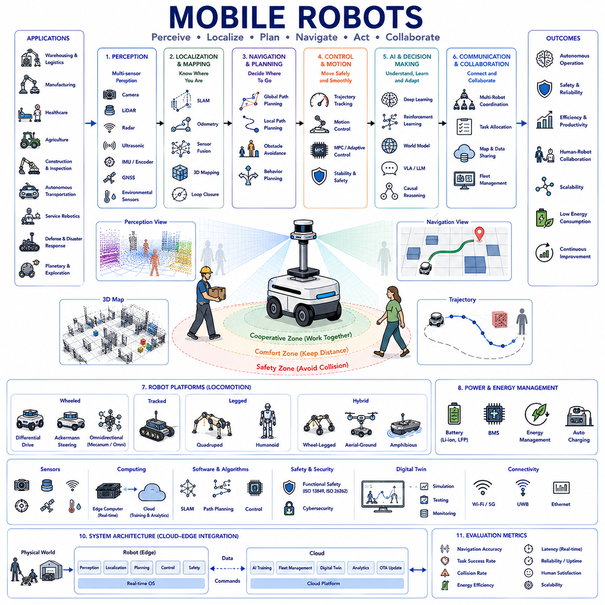
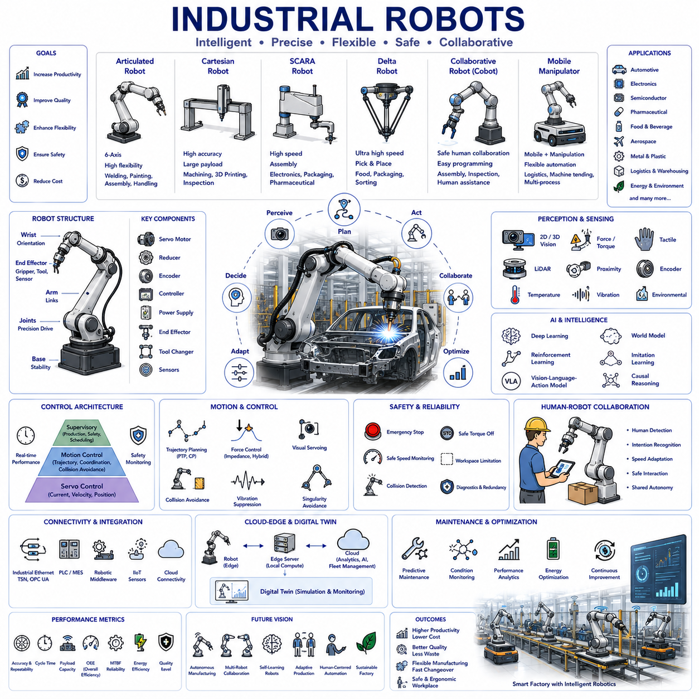
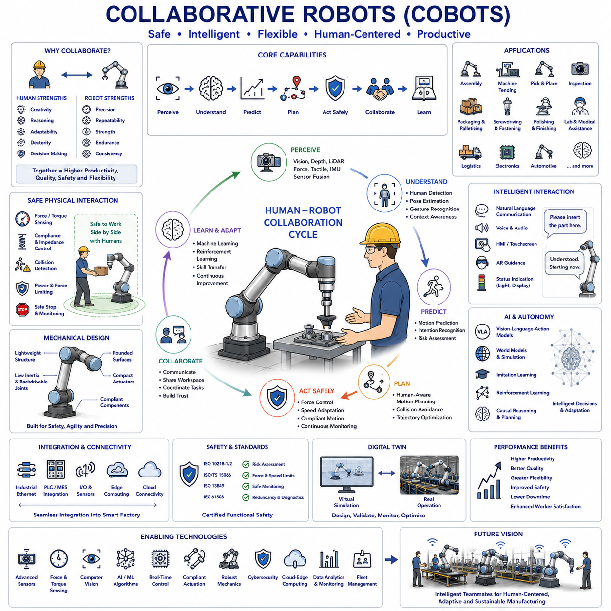
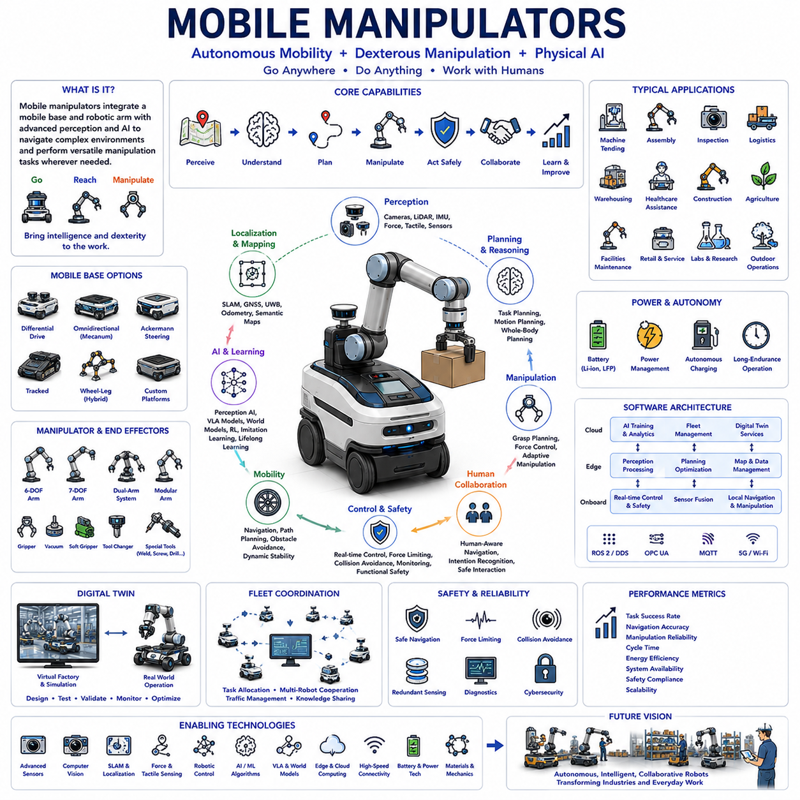
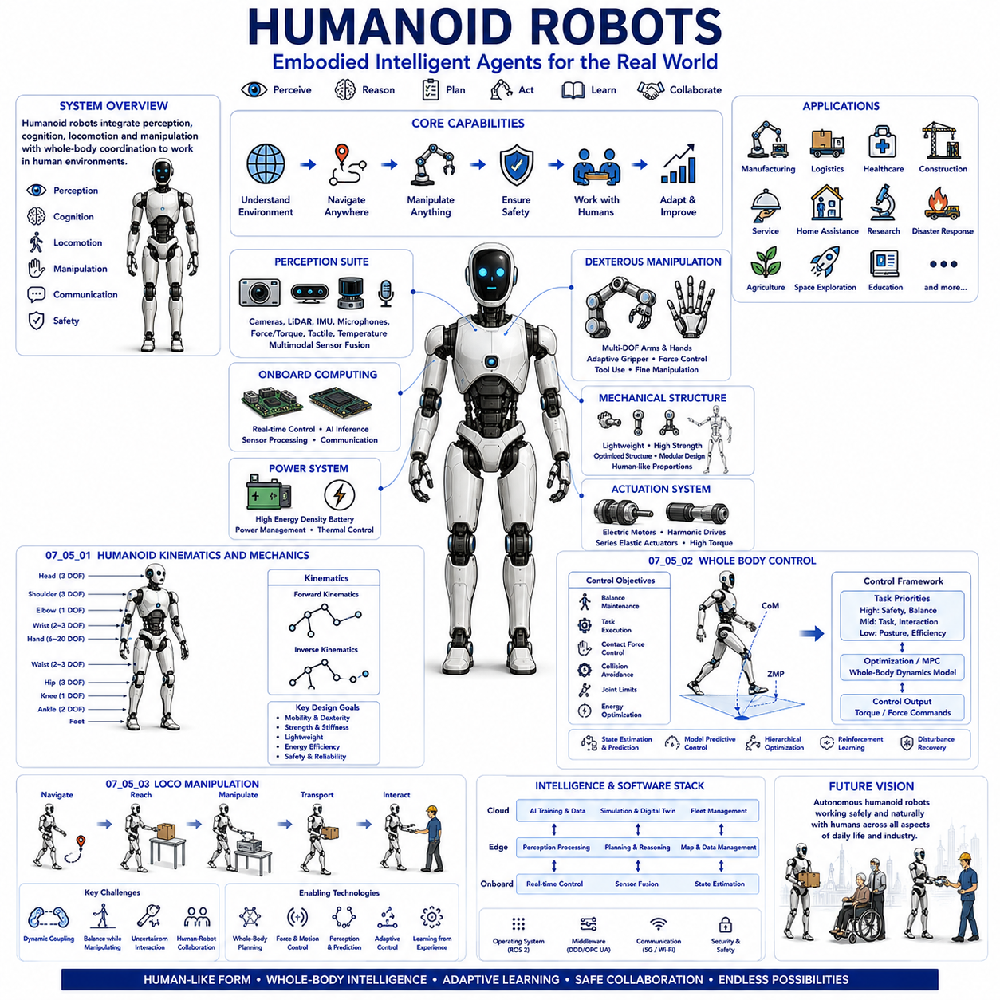
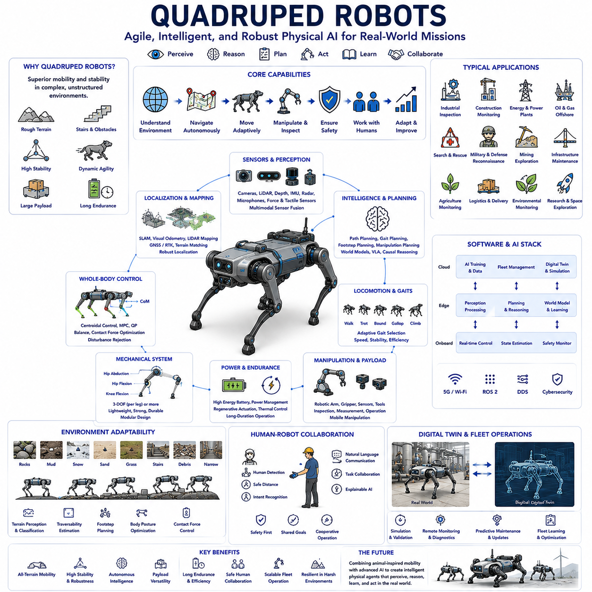
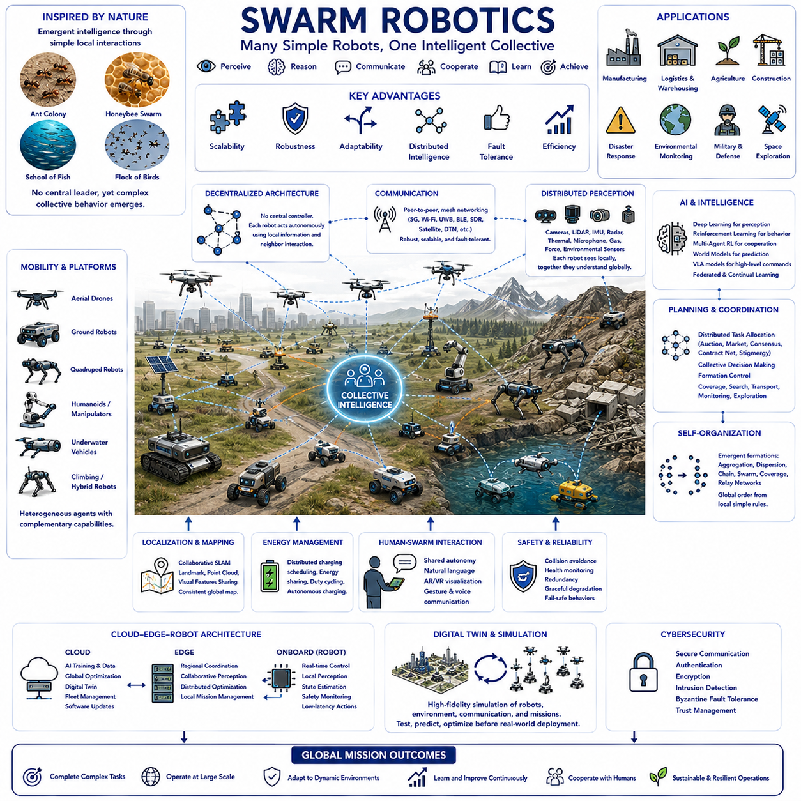
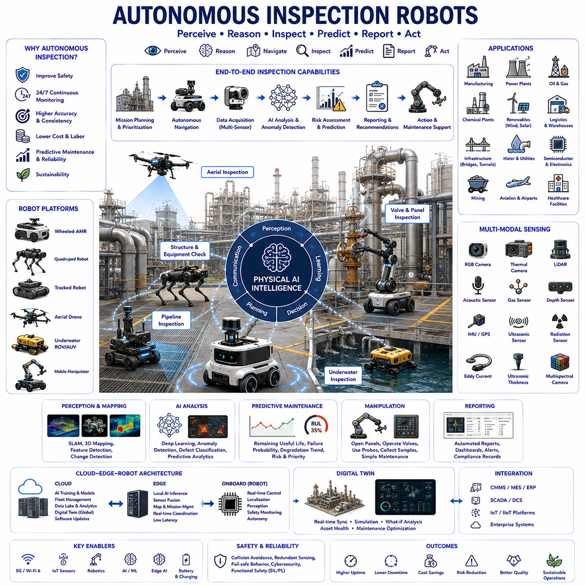

**Physical AI Engineering**

# Chapter 07 Robotics as Physical AI 

## 07-01 Mobile Robots

{width="7.268055555555556in" height="7.268055555555556in"}

Mobile robots represent one of the most fundamental and transformative technologies in modern robotics and Physical AI because they enable intelligent systems to perceive, navigate, interact, and perform useful tasks while moving autonomously through dynamic environments. Unlike fixed industrial robots that operate within predefined workspaces, mobile robots continuously change their position in physical space, requiring the integration of perception, localization, mapping, planning, control, communication, and intelligent decision-making into a unified autonomous platform. Mobility allows robots to transport materials, inspect infrastructure, assist humans, monitor environments, explore hazardous areas, and execute missions over large geographic regions. As Physical AI continues to evolve toward Artificial General Physical Intelligence, mobile robots become the physical embodiment of intelligent agents capable of sensing, reasoning, learning, and acting continuously in the real world.

The concept of mobile robotics extends far beyond simply attaching wheels to a robotic platform. True mobility requires the ability to understand surroundings, estimate current location, predict environmental changes, select safe and efficient paths, coordinate with humans and other robots, recover from unexpected events, and adapt behavior according to mission objectives. Consequently, a mobile robot represents an integrated cyber-physical system where mechanical engineering, electrical engineering, computer science, artificial intelligence, control theory, communication systems, and human-centered design converge into a unified autonomous architecture.

The history of mobile robotics reflects the evolution of artificial intelligence itself. Early mobile robots relied upon simple line-following mechanisms, predefined magnetic guidance, or manually programmed routes within highly structured environments. Industrial Automated Guided Vehicles demonstrated that autonomous transportation could improve manufacturing efficiency, but their capabilities remained limited because navigation depended upon external infrastructure rather than environmental understanding. The introduction of simultaneous localization and mapping, probabilistic robotics, computer vision, machine learning, and high-performance embedded computing transformed mobile robots into intelligent autonomous systems capable of operating within partially known and continuously changing environments.

Modern mobile robots are generally classified according to operational environments and mission objectives. Indoor robots primarily operate inside factories, warehouses, hospitals, offices, shopping centers, airports, hotels, and homes where Global Navigation Satellite System signals may be unavailable. Outdoor robots navigate roads, sidewalks, farms, mines, construction sites, forests, campuses, military environments, and urban infrastructure under varying weather conditions. Hybrid mobile robots transition seamlessly between indoor and outdoor environments while maintaining continuous localization and operational capability. Specialized robots perform underwater exploration, aerial inspection, planetary exploration, underground mining, disaster response, or hazardous material handling under extremely challenging environmental conditions.

Locomotion constitutes one of the defining characteristics of mobile robots. Wheeled robots dominate industrial applications because wheels provide high efficiency, relatively simple control, low energy consumption, and reliable operation on prepared surfaces. Differential drive systems employ independently controlled left and right wheels to generate forward motion and turning. Ackermann steering follows conventional automobile geometry, enabling stable high-speed outdoor navigation. Omnidirectional platforms utilize mecanum wheels or omni wheels to move freely in arbitrary directions without changing orientation. Four-wheel steering and independent steering systems significantly improve maneuverability within confined environments while supporting larger payloads.

Tracked mobile robots provide superior mobility over soft terrain, loose soil, snow, sand, mud, and uneven surfaces where wheels may lose traction. Continuous tracks distribute vehicle weight across larger contact areas while increasing obstacle climbing capability. However, tracked systems generally consume more energy, produce greater mechanical wear, and require more complex maintenance compared with wheeled platforms. Consequently, tracked locomotion is commonly selected for military, construction, agricultural, mining, and disaster response applications requiring exceptional terrain adaptability.

Legged robots have emerged as increasingly important mobile platforms because biological locomotion demonstrates remarkable adaptability across highly irregular environments. Quadrupeds provide stable walking over rocks, stairs, forests, and construction sites while maintaining balance despite external disturbances. Humanoid robots combine bipedal locomotion with human-like manipulation capability, allowing operation within environments originally designed for people. Multi-legged robots further improve terrain adaptability while sacrificing mechanical simplicity and energy efficiency. Although legged locomotion remains computationally demanding, advances in reinforcement learning, model predictive control, and whole-body control have dramatically improved practical performance.

Hybrid locomotion combines multiple mobility mechanisms into unified robotic platforms. Wheel-legged robots integrate efficient rolling motion with obstacle climbing capability. Flying-ground robots transition between aerial navigation and terrestrial operation. Amphibious robots move through both water and land environments. Reconfigurable locomotion systems adapt mechanical structure according to changing terrain conditions. Such hybrid architectures maximize operational flexibility while introducing additional control complexity.

The mechanical architecture of a mobile robot directly influences overall system capability. Chassis design determines structural rigidity, payload capacity, center of gravity, vibration characteristics, environmental protection, and maintenance accessibility. Suspension systems isolate sensitive sensors and computing hardware from terrain-induced vibration while maintaining wheel contact across uneven surfaces. Drive modules integrate motors, gearboxes, encoders, brakes, steering mechanisms, and power transmission components into compact electromechanical assemblies optimized for efficiency and reliability.

Power systems constitute another essential foundation of mobile robotics. Lithium-ion and lithium iron phosphate batteries currently dominate autonomous mobile platforms because they provide high energy density, long operational lifetime, and relatively fast charging capability. Battery management systems continuously monitor voltage, current, temperature, cell balancing, and state of charge to maximize safety and operational availability. Hybrid power architectures increasingly integrate batteries with fuel cells, supercapacitors, or onboard generators for extended endurance. Intelligent energy management continuously optimizes power allocation according to mission priorities, environmental conditions, computational workload, and remaining battery capacity.

Perception enables mobile robots to understand surrounding environments through continuous acquisition and interpretation of sensory information. Cameras provide rich visual information supporting object recognition, semantic understanding, human detection, gesture recognition, visual localization, and scene interpretation. LiDAR generates precise three-dimensional geometric representations essential for mapping, localization, obstacle detection, and navigation. Radar performs robust perception under adverse weather conditions including rain, fog, dust, and snow. Ultrasonic sensors provide inexpensive short-range obstacle detection. Inertial measurement units estimate orientation and motion dynamics, while wheel encoders measure relative displacement. Global Navigation Satellite Systems support outdoor positioning, and environmental sensors monitor temperature, humidity, air quality, radiation, or hazardous gases according to application requirements.

Sensor fusion combines complementary measurements from multiple sensing modalities to improve robustness, accuracy, redundancy, and reliability. Cameras provide semantic understanding but suffer under poor illumination. LiDAR supplies accurate geometry but limited semantic information. Radar detects distant objects under adverse weather while providing lower spatial resolution. Inertial sensors maintain short-term motion estimation despite temporary perception failures. Probabilistic fusion algorithms integrate these heterogeneous information sources into consistent environmental representations supporting reliable autonomous operation.

Localization enables robots to estimate their current position within global or local coordinate systems. Accurate localization remains essential because navigation, planning, manipulation, inspection, and coordination all depend upon reliable position estimates. Dead reckoning integrates wheel encoder measurements but gradually accumulates error over time. Global Navigation Satellite Systems provide absolute positioning outdoors but become unavailable inside buildings or urban canyons. Vision-based localization compares current camera observations against previously constructed maps. LiDAR localization aligns point clouds using scan matching algorithms. Modern localization systems combine multiple complementary techniques through probabilistic estimation frameworks supporting continuous operation despite changing environmental conditions.

Mapping constructs spatial representations describing robot environments. Metric maps represent precise geometric information supporting obstacle avoidance and trajectory planning. Topological maps describe connectivity among important locations while reducing computational complexity. Semantic maps incorporate object identities, room functions, road classifications, and task-relevant environmental knowledge. Dynamic maps continuously update moving obstacles, temporary structures, traffic conditions, and changing environmental features. Three-dimensional maps support manipulation, inspection, construction, and infrastructure maintenance applications requiring accurate volumetric understanding.

Simultaneous Localization and Mapping represents one of the foundational technologies of autonomous mobile robotics. Rather than assuming known environments, SLAM algorithms estimate robot position while constructing maps simultaneously. This dual estimation problem initially appeared computationally intractable because localization depends upon maps while mapping depends upon localization. Probabilistic estimation, graph optimization, factor graphs, bundle adjustment, visual odometry, LiDAR odometry, and loop closure detection collectively transformed SLAM into practical real-time technology widely deployed across autonomous robots operating in unknown environments.

Navigation integrates perception, localization, mapping, planning, and control into coherent autonomous motion. Global path planning computes efficient routes toward mission objectives while considering known environmental constraints. Local trajectory planning continuously adapts robot motion according to nearby obstacles, moving humans, vehicle traffic, terrain conditions, and safety requirements. Obstacle avoidance generates collision-free motion despite dynamic environmental uncertainty. Behavior planning determines appropriate operational modes including exploration, following, docking, waiting, charging, inspection, or emergency response according to changing mission contexts.

Motion planning computes feasible trajectories satisfying kinematic, dynamic, safety, energy, and environmental constraints simultaneously. Differential drive robots require curvature-constrained trajectories compatible with nonholonomic motion. Ackermann steering systems obey steering geometry limitations. Legged robots generate dynamically stable foothold sequences. Manipulation during navigation introduces coupled whole-body planning problems integrating locomotion with robotic arms. Modern optimization algorithms balance computational efficiency against motion quality while supporting real-time autonomous operation.

Control systems convert planned trajectories into physical actuator commands. Low-level motor controllers regulate wheel velocity, steering angle, joint torque, or body posture with millisecond responsiveness. Higher-level controllers coordinate vehicle dynamics, path tracking, balance maintenance, and disturbance rejection. Adaptive control compensates for payload variation, terrain changes, actuator wear, and environmental uncertainty. Model predictive control increasingly enables simultaneous optimization of trajectory tracking, obstacle avoidance, energy efficiency, and safety constraints over future prediction horizons.

Artificial intelligence fundamentally transforms mobile robotics by enabling perception, reasoning, learning, adaptation, and decision-making beyond conventional rule-based programming. Deep neural networks recognize objects, estimate semantic environments, classify terrain, detect anomalies, and predict human behavior. Reinforcement learning optimizes navigation strategies through interaction with simulated and physical environments. Vision-language-action models enable natural language instruction following combined with visual understanding and physical execution. World models support predictive simulation before action execution. Causal reasoning improves robustness under unfamiliar conditions by identifying underlying relationships rather than statistical correlations alone.

Human-aware navigation has become increasingly important because mobile robots frequently operate alongside workers, patients, customers, and pedestrians. Robots must maintain appropriate interpersonal distance, predict future human movement, communicate intentions clearly, adapt speed according to surrounding activity, and generate socially acceptable trajectories respecting human comfort in addition to physical safety. Human-centered navigation therefore integrates social conventions, behavioral prediction, multimodal communication, and collaborative decision-making into conventional motion planning.

Multi-robot systems significantly expand operational capability through distributed cooperation. Fleet management coordinates dozens or hundreds of mobile robots sharing warehouses, factories, hospitals, airports, and logistics facilities. Distributed task allocation assigns missions according to robot capability, battery status, geographic proximity, workload, and operational priority. Cooperative mapping combines observations from multiple robots into unified environmental models. Collective transportation enables multiple robots to manipulate heavy objects beyond individual capability. Swarm robotics demonstrates emergent intelligence arising from decentralized local interaction rather than centralized global control.

Communication infrastructure supports information exchange among robots, cloud services, industrial equipment, enterprise software, and human operators. Wireless communication technologies including Wi-Fi, private cellular networks, fifth-generation mobile communication, industrial Ethernet, ultra-wideband positioning, satellite communication, and mesh networking provide connectivity according to operational requirements. Middleware frameworks standardize communication interfaces while supporting distributed computation, diagnostics, software updates, mission coordination, and cloud integration.

Cloud-edge computing increasingly defines modern mobile robot architecture. Edge computing performs latency-sensitive perception, localization, planning, safety monitoring, and control directly onboard autonomous platforms. Cloud infrastructure executes computationally intensive learning, fleet optimization, digital twin simulation, predictive maintenance, knowledge sharing, and large-scale analytics asynchronously. Intelligent workload partitioning balances deterministic real-time execution against scalable cloud intelligence while minimizing communication dependency.

Digital twins provide virtual representations synchronized continuously with physical mobile robots. Simulation environments evaluate navigation algorithms, control strategies, perception pipelines, mission planning, energy consumption, and maintenance scheduling before deployment. Runtime synchronization supports predictive diagnostics, anomaly detection, software validation, operator training, and continuous system optimization. Digital twins substantially reduce development cost while increasing operational reliability.

Safety remains the highest priority throughout autonomous mobile robotics. Collision avoidance combines predictive trajectory planning, emergency braking, redundant sensing, safety-certified controllers, runtime verification, and functional safety mechanisms. Cybersecurity protects communication networks, software, sensors, and control commands against malicious interference. Fault-tolerant architectures detect component failures, reconfigure computational resources, and maintain degraded yet safe operation whenever possible. Explainable artificial intelligence increases operator trust by providing understandable reasoning supporting autonomous decisions.

Energy efficiency significantly influences mobile robot productivity because operational endurance directly affects mission completion capability. Efficient locomotion, intelligent route planning, adaptive processor scheduling, sensor power management, regenerative braking, thermal optimization, and predictive charging collectively maximize useful operating time. Autonomous docking enables robots to recharge without human intervention, supporting continuous long-term deployment across industrial facilities.

Performance evaluation encompasses numerous complementary metrics. Navigation accuracy measures localization precision and path following quality. Obstacle avoidance evaluates collision-free operation. Mission efficiency considers task completion time, travel distance, energy consumption, and resource utilization. Reliability measures operational availability and fault recovery capability. Human interaction evaluates safety, comfort, trust, and collaborative effectiveness. Computational performance assesses real-time responsiveness, processor utilization, communication latency, and scalability. Together these multidimensional metrics characterize practical autonomous capability rather than isolated subsystem performance.

Applications of mobile robots continue expanding rapidly across virtually every sector of society. Warehouses employ autonomous mobile robots for goods transportation and inventory management. Hospitals utilize delivery robots, disinfection platforms, rehabilitation assistants, and autonomous logistics systems. Manufacturing facilities integrate mobile manipulators supporting flexible production. Agricultural robots perform precision spraying, harvesting, crop monitoring, and autonomous field operations. Mining robots inspect underground infrastructure while reducing human exposure to hazardous environments. Construction robots conduct surveying, material transport, and structural inspection. Autonomous vehicles transform urban transportation. Service robots assist customers within hotels, restaurants, shopping centers, airports, and museums. Military and disaster response robots operate under dangerous conditions protecting human personnel. Planetary rovers explore extraterrestrial environments beyond direct human reach.

The future of mobile robotics lies in deeply integrated Physical AI architectures combining multimodal perception, world models, causal reasoning, reinforcement learning, vision-language-action models, digital twins, cloud-edge intelligence, lifelong learning, adaptive control, safe autonomy, and collaborative human-robot interaction. Rather than simply following predefined routes, future mobile robots will understand mission intent, predict environmental evolution, explain decisions transparently, coordinate autonomously with heterogeneous robot teams, personalize interaction according to individual human preferences, continuously improve through accumulated experience, and transfer knowledge across diverse operational domains. As Artificial General Physical Intelligence gradually becomes achievable, mobile robots will evolve from autonomous machines into intelligent physical partners capable of working naturally, safely, efficiently, and collaboratively alongside humans while addressing increasingly complex challenges across industrial, commercial, medical, agricultural, scientific, and everyday environments.

## 07-02 Industrial Robots

{width="7.268055555555556in" height="7.268055555555556in"}

Industrial robots represent one of the most influential technologies in modern manufacturing and have become the foundation of intelligent automation, smart factories, and Physical AI-driven production systems. Unlike traditional machines that execute fixed mechanical operations, industrial robots combine precision mechanics, advanced control systems, sensing technologies, artificial intelligence, and adaptive decision-making to perform complex manufacturing tasks with high accuracy, repeatability, flexibility, and reliability. Over the past several decades, industrial robots have evolved from simple programmable manipulators performing repetitive point-to-point motions into intelligent autonomous systems capable of perceiving their environments, collaborating with humans, adapting to changing production requirements, and continuously improving through learning. As Physical AI progresses toward Artificial General Physical Intelligence, industrial robots are becoming intelligent manufacturing agents capable of understanding production goals, reasoning about complex tasks, coordinating with other robots and humans, and autonomously optimizing manufacturing processes.

The primary objective of industrial robotics is to increase productivity while simultaneously improving product quality, manufacturing flexibility, workplace safety, operational consistency, and economic efficiency. Modern manufacturing demands frequent product changes, customized production, shorter product life cycles, and rapid adaptation to market requirements. Conventional fixed automation lacks the flexibility necessary to accommodate these changes economically. Industrial robots overcome these limitations by providing programmable, reconfigurable, and increasingly intelligent manufacturing platforms capable of executing multiple production tasks without extensive hardware modification.

The history of industrial robotics illustrates the gradual convergence of mechanical engineering and artificial intelligence. The earliest industrial robots appeared during the 1960s as hydraulically powered programmable manipulators designed primarily for material transfer and die casting operations. These early systems executed predetermined motion sequences with limited sensing capability and minimal environmental awareness. Subsequent generations introduced electric servo motors, digital controllers, programmable logic controllers, computer numerical control integration, and increasingly sophisticated software architectures. During the 1990s and early 2000s, computer vision, force sensing, sensor fusion, and networked manufacturing significantly expanded robotic capability. Today, artificial intelligence, machine learning, digital twins, cloud-edge computing, foundation models, and collaborative robotics are transforming industrial robots into adaptive Physical AI systems capable of autonomous reasoning and intelligent decision-making.

Industrial robots may be classified according to mechanical architecture, operational capability, application domain, payload capacity, workspace geometry, and control strategy. Articulated robots represent the most widely deployed industrial manipulators because multiple rotary joints provide exceptional flexibility, allowing access to complex three-dimensional workspaces. Six-axis articulated robots closely resemble human arms and perform welding, painting, assembly, material handling, machine tending, inspection, and palletizing across numerous industries. Additional joints further improve dexterity while enabling obstacle avoidance and singularity reduction during complex manipulation tasks.

Cartesian robots employ orthogonal linear axes to achieve highly accurate positioning within rectangular workspaces. Their relatively simple kinematic structure provides excellent repeatability, high payload capacity, and straightforward motion planning. Cartesian systems commonly perform computer numerical control machining, additive manufacturing, precision assembly, coordinate measurement, semiconductor manufacturing, laboratory automation, and automated storage systems requiring high positional accuracy.

SCARA robots specialize in high-speed planar assembly applications. Their selective compliance provides rigidity along the vertical direction while maintaining compliance within the horizontal plane, enabling rapid insertion tasks such as electronic component assembly, packaging, pharmaceutical production, and precision handling. SCARA robots remain particularly effective for repetitive assembly requiring exceptional speed and repeatability within relatively constrained workspaces.

Delta robots utilize parallel kinematic mechanisms supporting extremely rapid pick-and-place operations. Lightweight moving structures minimize inertia while maintaining exceptional acceleration and precision. Food processing, pharmaceutical packaging, electronics manufacturing, sorting, and lightweight assembly benefit significantly from delta robot performance. Although payload capacity remains relatively limited compared with articulated robots, their outstanding speed enables extremely high production throughput.

Parallel robots more generally employ multiple coordinated kinematic chains supporting rigid end-effector positioning with high structural stiffness. Flight simulators, precision machining, optical alignment, medical applications, and high-accuracy positioning frequently utilize parallel mechanisms because distributed structural loads improve accuracy while reducing deformation under external forces.

Collaborative robots, often called cobots, represent one of the most important recent developments in industrial robotics. Unlike conventional industrial robots operating inside isolated safety cages, collaborative robots safely share workspaces with human operators. Integrated force sensors, torque monitoring, compliant control, vision systems, collision detection, and safety-certified controllers enable direct human-robot collaboration without complete physical separation. Collaborative robotics supports flexible manufacturing, high-mix low-volume production, ergonomic assistance, and human-centered automation where robotic precision complements human creativity and problem-solving capability.

Mobile manipulators combine autonomous mobile robots with robotic arms to create highly flexible manufacturing systems. Rather than remaining fixed at dedicated workstations, mobile manipulators travel autonomously between production stations while transporting tools, materials, and components. Such systems significantly increase manufacturing flexibility while reducing dedicated equipment requirements. Future smart factories increasingly employ fleets of coordinated mobile manipulators dynamically allocated according to production demand.

The mechanical structure of industrial robots directly influences operational capability. Robot bases provide structural stability while supporting entire manipulator loads. Rotary joints generate rotational degrees of freedom through precision bearings, harmonic drives, cycloidal reducers, planetary gearboxes, or direct-drive motors. Linear joints enable translational movement where appropriate. Structural links balance stiffness, weight, vibration characteristics, manufacturability, and cost. End effectors perform physical interaction with workpieces through grippers, welding torches, spray guns, screwdrivers, polishing tools, laser scanners, cameras, inspection probes, vacuum cups, or specialized process equipment. Modular end-effector interfaces increasingly allow automatic tool changing supporting multiple manufacturing processes within unified robotic platforms.

Degrees of freedom determine robot dexterity. Six degrees of freedom permit arbitrary positioning and orientation throughout three-dimensional space. Seven-axis robots introduce kinematic redundancy allowing improved obstacle avoidance, enhanced singularity management, optimized joint utilization, and greater flexibility within confined workspaces. Humanoid industrial manipulators may eventually incorporate even greater whole-body redundancy supporting complex collaborative manufacturing environments.

Robot kinematics mathematically describes relationships between joint variables and end-effector motion. Forward kinematics computes end-effector position from joint angles, whereas inverse kinematics determines joint configurations achieving desired end-effector poses. Analytical inverse kinematics provides efficient closed-form solutions where available, while numerical optimization solves more general redundant robotic configurations. Kinematic modeling forms the mathematical foundation supporting trajectory generation, collision avoidance, calibration, simulation, and control.

Robot dynamics extends beyond geometry by incorporating mass distribution, inertia, gravitational forces, friction, actuator characteristics, external disturbances, and interaction forces. Dynamic models enable feedforward compensation improving motion accuracy during high-speed operation. Inverse dynamics computes required actuator torques producing desired motion, whereas forward dynamics predicts resulting robot behavior under applied control inputs. Accurate dynamic modeling significantly improves precision, energy efficiency, and stability.

Industrial robot control systems operate across hierarchical computational architectures. Low-level servo controllers regulate motor current, velocity, and position with sub-millisecond timing precision. Mid-level controllers coordinate joint synchronization, trajectory tracking, singularity avoidance, and vibration suppression. High-level supervisory controllers manage task sequencing, production scheduling, safety monitoring, communication, diagnostics, and integration with manufacturing execution systems. Modern control architectures increasingly distribute computation across embedded processors, edge computers, and cloud infrastructure.

Motion generation transforms manufacturing objectives into executable robot trajectories. Point-to-point motion minimizes travel time between discrete locations, whereas continuous path motion preserves smooth end-effector movement throughout welding, painting, sealing, polishing, cutting, or additive manufacturing processes. Trajectory planners simultaneously satisfy velocity, acceleration, jerk, collision avoidance, joint limit, energy, and process quality constraints while maintaining real-time responsiveness.

Perception fundamentally expands industrial robot capability beyond preprogrammed automation. High-resolution cameras, three-dimensional vision systems, structured light scanners, laser profilers, LiDAR, force sensors, tactile sensors, torque sensors, proximity sensors, and environmental monitoring continuously observe workpieces, tools, fixtures, surrounding equipment, and human coworkers. Sensor fusion integrates complementary information supporting robust perception despite illumination variation, occlusion, vibration, reflective surfaces, or manufacturing uncertainty.

Computer vision enables autonomous object recognition, pose estimation, defect detection, quality inspection, barcode reading, dimensional measurement, bin picking, visual servoing, and process monitoring. Deep learning has dramatically improved visual recognition accuracy while enabling semantic understanding of complex manufacturing scenes. Three-dimensional perception further supports grasp planning, collision avoidance, adaptive assembly, and autonomous manipulation of previously unseen objects.

Force sensing represents another critical capability because many industrial processes require physical interaction rather than purely geometric positioning. Assembly insertion, polishing, grinding, deburring, machining, screw fastening, and collaborative manipulation all depend upon controlled contact forces. Impedance control, admittance control, hybrid position-force control, and compliant manipulation regulate interaction dynamics while accommodating environmental uncertainty and dimensional variation.

Artificial intelligence increasingly transforms industrial robots from programmable automation devices into adaptive intelligent manufacturing systems. Deep neural networks recognize manufacturing defects, classify components, estimate object poses, monitor process quality, and interpret sensor data. Reinforcement learning optimizes manipulation strategies through simulation before deployment within physical factories. Imitation learning allows robots to acquire new skills by observing expert demonstrations. Foundation models combine language, vision, reasoning, and manipulation into unified architectures enabling intuitive task programming using natural language instructions.

Vision-language-action models represent one of the most promising developments for next-generation industrial robotics. Rather than manually programming every robotic operation, engineers describe desired tasks using natural language combined with visual demonstrations. Multimodal foundation models interpret workpiece geometry, manufacturing intent, environmental context, and operational constraints before generating executable manipulation policies. Such capability dramatically reduces engineering effort while increasing production flexibility.

World models enable industrial robots to simulate future manufacturing outcomes before executing physical actions. Predictive internal representations estimate workpiece behavior, robot dynamics, collision probability, assembly success, process quality, and production efficiency across multiple hypothetical action sequences. Model-based reasoning therefore improves decision quality while reducing trial-and-error experimentation within expensive manufacturing environments.

Human-robot collaboration continues expanding throughout modern manufacturing. Collaborative industrial robots recognize human presence, predict operator intention, maintain safe interaction distances, regulate motion speed according to proximity, communicate operational status clearly, and adapt behavior according to human workload. Shared autonomy allows humans and robots to combine complementary strengths rather than replacing human expertise entirely. Workers provide creativity, flexible reasoning, and problem solving while robots contribute precision, endurance, strength, and consistency.

Safety remains the highest priority within industrial robotics. Functional safety standards define protective stopping distances, collision force limits, emergency stop behavior, speed monitoring, protective separation, and certified control architectures. Safety functions include emergency stopping, safe speed monitoring, safe torque off, workspace limitation, collision detection, redundancy management, runtime verification, cybersecurity protection, and continuous diagnostics. Modern industrial robots integrate safety directly into control architecture rather than treating it as external protective equipment.

Industrial communication enables seamless integration throughout smart manufacturing environments. Industrial Ethernet, fieldbus protocols, Time-Sensitive Networking, OPC Unified Architecture, MQTT, DDS, and robotic middleware support deterministic communication among robots, programmable logic controllers, sensors, enterprise software, digital twins, and cloud infrastructure. Standardized communication enables interoperability across heterogeneous equipment manufactured by different vendors.

Manufacturing execution systems coordinate industrial robots within broader production environments. Production scheduling, inventory management, quality assurance, maintenance planning, traceability, process optimization, and enterprise resource planning exchange information continuously with robotic systems. Real-time manufacturing data enables dynamic scheduling, predictive maintenance, adaptive quality control, and production optimization across entire factories.

Cloud-edge computing increasingly defines industrial robot architecture. Embedded controllers perform deterministic real-time servo control, perception preprocessing, safety supervision, and trajectory execution locally. Edge servers coordinate multiple robots, execute computationally intensive perception algorithms, optimize production scheduling, and maintain digital twins. Cloud platforms aggregate manufacturing data across facilities, train artificial intelligence models, distribute software updates, analyze long-term production trends, and optimize global manufacturing performance.

Digital twins provide synchronized virtual representations of industrial robots, manufacturing cells, production lines, and entire factories. Simulation validates robotic programs before deployment, predicts maintenance requirements, estimates production throughput, evaluates process modifications, and optimizes energy consumption. Runtime synchronization between physical and virtual systems supports anomaly detection, predictive diagnostics, operator training, continuous improvement, and intelligent decision support throughout manufacturing operations.

Predictive maintenance has become increasingly important because unexpected robot failures significantly disrupt production. Continuous monitoring of motor current, vibration, temperature, gearbox wear, lubrication condition, encoder accuracy, communication quality, and actuator performance enables early detection of degradation before catastrophic failure occurs. Machine learning identifies subtle performance changes indicating impending maintenance requirements, reducing downtime while extending equipment lifetime.

Energy efficiency represents another significant objective because manufacturing facilities consume substantial electrical power. Lightweight mechanical design, optimized trajectory generation, regenerative braking, intelligent motor control, adaptive processor scheduling, efficient cooling systems, and coordinated production planning collectively reduce energy consumption without sacrificing productivity. Sustainable manufacturing increasingly considers both operational efficiency and environmental impact.

Industrial robots are deployed across virtually every manufacturing sector. Automotive production utilizes robots for welding, painting, assembly, inspection, sealing, material handling, and battery manufacturing. Electronics factories perform precision assembly, semiconductor handling, testing, packaging, and microcomponent manipulation. Pharmaceutical production requires sterile automation supporting laboratory processes, packaging, inspection, and drug manufacturing. Food processing employs robots for sorting, packaging, palletizing, quality inspection, and hygienic handling. Aerospace manufacturing depends upon robotic drilling, composite layup, inspection, and precision assembly. Metal fabrication, plastics manufacturing, logistics, renewable energy production, and recycling facilities similarly rely upon industrial robotics to improve productivity and quality.

Performance evaluation extends beyond traditional measures of speed and accuracy. Position repeatability characterizes motion consistency across repeated operations. Absolute positioning accuracy measures geometric precision. Cycle time evaluates manufacturing productivity. Mean time between failures assesses operational reliability. Overall equipment effectiveness integrates availability, performance, and quality. Human collaboration metrics evaluate safety, ergonomic benefit, operator acceptance, and workflow efficiency. Artificial intelligence performance considers perception accuracy, adaptation capability, learning efficiency, and decision quality. Energy efficiency, scalability, maintainability, cybersecurity resilience, and environmental sustainability collectively define comprehensive industrial robot performance.

The future of industrial robotics lies in deeply integrated Physical AI architectures combining multimodal perception, causal reasoning, world models, reinforcement learning, vision-language-action models, digital twins, cloud-edge intelligence, lifelong learning, adaptive control, explainable artificial intelligence, collaborative autonomy, and autonomous manufacturing orchestration. Rather than simply executing predefined motion sequences, future industrial robots will understand manufacturing objectives, reason about process constraints, explain their decisions transparently, collaborate naturally with human workers, learn continuously from operational experience, optimize production autonomously, coordinate intelligently with fleets of heterogeneous robots, and adapt rapidly to changing product designs without extensive reprogramming.

As Physical AI advances toward Artificial General Physical Intelligence, industrial robots will evolve from programmable automation equipment into intelligent manufacturing partners capable of understanding production intent, predicting process outcomes, reasoning across multiple manufacturing domains, transferring knowledge between tasks, collaborating seamlessly with humans, and continuously improving factory performance through lifelong learning. By integrating advanced mechanics, intelligent perception, adaptive control, multimodal foundation models, cloud-edge computing, digital twins, safe human collaboration, and autonomous decision-making into unified cognitive manufacturing systems, industrial robots will become one of the central technologies enabling the next generation of highly flexible, resilient, efficient, sustainable, and intelligent smart factories.

## 07-03 Collaborative Robots

{width="7.268055555555556in" height="7.268055555555556in"}

Collaborative robots, commonly known as cobots, represent one of the most significant technological advancements in modern robotics and Physical AI because they fundamentally redefine the relationship between humans and machines. Unlike conventional industrial robots that operate inside isolated safety cages and perform repetitive tasks independently from human workers, collaborative robots are specifically designed to share physical workspaces with people while enabling safe, intelligent, and productive cooperation. They combine advanced mechanical design, compliant actuation, intelligent sensing, real-time control, artificial intelligence, and human-centered interaction into a unified robotic platform capable of assisting rather than replacing human workers. As Physical AI evolves toward Artificial General Physical Intelligence, collaborative robots are becoming intelligent teammates that understand human intentions, adapt to changing environments, communicate naturally, and continuously improve through shared experience.

The central philosophy of collaborative robotics differs fundamentally from traditional industrial automation. Conventional automation seeks to eliminate human involvement from repetitive manufacturing processes by maximizing speed, precision, and production efficiency. Collaborative robotics instead recognizes that humans possess creativity, reasoning ability, adaptability, dexterity, and decision-making skills that remain difficult for autonomous systems to replicate completely. Robots, on the other hand, excel at repetitive motion, precise positioning, endurance, strength, consistency, and continuous operation. Collaborative robotics therefore combines the complementary strengths of humans and intelligent machines to create production systems that are more flexible, efficient, safe, and resilient than either humans or robots operating independently.

The evolution of collaborative robotics reflects broader developments in artificial intelligence, sensing technology, safety engineering, and manufacturing philosophy. Early industrial robots required physical barriers because they operated with high speed, high force, and limited environmental awareness. Human entry into robotic workspaces required complete production shutdown to avoid injury. Advances in lightweight mechanical structures, torque sensing, compliant actuators, force-controlled manipulation, real-time perception, and functional safety standards gradually enabled robots to interact safely with nearby humans. The introduction of intelligent sensors, computer vision, machine learning, and multimodal perception further transformed collaborative robots from passive automation tools into intelligent partners capable of understanding human behavior and adapting accordingly.

Collaborative robots are distinguished not only by their hardware but also by their operational philosophy. A collaborative robot continuously observes the surrounding environment, estimates human positions, predicts future movements, evaluates potential safety risks, adapts motion speed, modifies trajectories, regulates interaction forces, and communicates its intentions clearly throughout task execution. Collaboration therefore becomes a dynamic process involving continuous perception, reasoning, prediction, planning, execution, and learning rather than simple simultaneous operation within the same workspace.

Mechanical design plays a critical role in collaborative robotics. Cobots generally employ lightweight structures with reduced moving mass to minimize collision energy. Compact actuators, optimized link geometry, rounded external surfaces, enclosed joints, and compliant mechanical components reduce injury risk during unintended contact. Harmonic drives, direct-drive motors, series elastic actuators, and low-inertia transmissions provide precise motion while enabling safe force regulation. The mechanical architecture intentionally balances structural rigidity with controlled compliance, allowing accurate task execution without sacrificing human safety.

Degrees of freedom significantly influence collaborative capability. Most collaborative robots employ six or seven rotational joints, allowing human-arm-like flexibility for manipulation within three-dimensional environments. Seven-axis configurations provide kinematic redundancy, enabling improved obstacle avoidance, enhanced reachability, reduced singularities, and more natural cooperative motion. Additional degrees of freedom further increase dexterity during assembly, inspection, machine tending, laboratory automation, healthcare assistance, and logistics operations.

End effectors represent the physical interface between collaborative robots and the surrounding world. Collaborative applications utilize adaptive grippers, soft robotic fingers, vacuum suction devices, compliant grasping mechanisms, electric screwdrivers, dispensing systems, polishing tools, inspection cameras, laser scanners, force-sensitive tools, and interchangeable modular tooling. Automatic tool changers enable a single collaborative robot to perform multiple production processes sequentially without manual intervention. Intelligent end effectors increasingly incorporate embedded sensors measuring grasp force, tactile pressure, slip detection, object deformation, and contact quality during manipulation.

Safe physical interaction constitutes the defining characteristic of collaborative robotics. Force sensors, torque sensors, tactile skins, joint current estimation, impedance control, admittance control, collision detection algorithms, and compliant motion generation continuously regulate robot behavior during human interaction. Instead of rigidly resisting unexpected contact, collaborative robots absorb external forces while immediately reducing speed or stopping motion when predefined safety thresholds are exceeded. Such compliant behavior significantly reduces injury risk while maintaining operational effectiveness.

Perception forms the cognitive foundation of collaborative robotics. High-resolution RGB cameras, depth cameras, stereo vision systems, LiDAR, ultrasonic sensors, force sensors, tactile arrays, inertial measurement units, microphones, thermal cameras, and wearable devices continuously observe both the environment and nearby human coworkers. Sensor fusion combines complementary information from these heterogeneous sensing modalities to generate robust environmental understanding despite changing illumination, partial occlusions, reflective surfaces, or dynamic industrial conditions.

Human detection represents one of the most essential perception capabilities within collaborative robotics. Modern deep neural networks accurately distinguish humans from machinery, tools, workpieces, vehicles, and surrounding equipment while maintaining robust performance across varying body shapes, clothing, lighting conditions, and workplace configurations. Continuous tracking associates observations across time, enabling long-duration interaction with individual workers throughout complex manufacturing processes.

Pose estimation significantly enhances collaborative interaction by reconstructing three-dimensional human body configurations. Head orientation, shoulder position, arm motion, hand trajectory, torso posture, lower-body movement, and overall skeletal configuration collectively provide detailed understanding of worker activity. Such information enables robots to anticipate future actions before motion occurs physically, thereby improving coordination while reducing unnecessary waiting or interruption.

Gesture recognition enables intuitive nonverbal communication between collaborative robots and human operators. Pointing gestures identify desired work locations. Hand signals initiate production cycles, request assistance, confirm completion, or trigger emergency stopping. Waving attracts robotic attention, while predefined industrial gestures provide reliable communication under noisy manufacturing conditions. Gesture-based interfaces reduce dependence upon traditional control panels while increasing workplace flexibility.

Natural language interaction is becoming increasingly important as multimodal foundation models integrate language understanding with visual perception and robotic control. Operators describe desired tasks using ordinary spoken or written language rather than specialized robot programming languages. Collaborative robots interpret manufacturing objectives, clarify ambiguous instructions, explain intended actions, and communicate operational status through natural dialogue. Such capability substantially lowers technical barriers while enabling broader adoption across small and medium-sized manufacturing enterprises.

Human intention recognition distinguishes collaborative robots from conventional automation systems. Rather than reacting only after observing completed human movement, advanced predictive models estimate future worker actions using body posture, gaze direction, gesture interpretation, task context, historical behavior, and environmental conditions. Predictive intention recognition enables proactive robot adaptation that improves safety, coordination, and overall manufacturing efficiency.

Human-aware motion planning represents another defining capability of collaborative robotics. Planned trajectories simultaneously optimize productivity, safety, ergonomic quality, energy consumption, and psychological comfort. Rather than simply minimizing travel distance, collaborative robots maintain appropriate interpersonal separation, avoid sudden acceleration, generate predictable movement patterns, communicate directional intent through body motion, and adapt trajectories continuously according to changing human behavior. Socially acceptable motion contributes significantly to operator trust and long-term collaboration effectiveness.

Force-controlled manipulation enables collaborative robots to perform complex assembly operations requiring compliant physical interaction. Peg insertion, connector assembly, screw fastening, polishing, grinding, surface finishing, precision fitting, and machine tending frequently involve uncertain contact conditions that cannot be solved using purely position-based control. Hybrid position-force control, impedance control, admittance control, and adaptive compliance continuously regulate interaction forces while compensating for dimensional variation, fixture tolerance, and workpiece uncertainty.

Artificial intelligence fundamentally transforms collaborative robotics by enabling perception, adaptation, reasoning, and lifelong learning. Deep neural networks recognize manufacturing components, detect process anomalies, estimate object pose, monitor product quality, and classify worker activities. Reinforcement learning optimizes manipulation policies through simulation before deployment in physical factories. Imitation learning allows robots to acquire new collaborative skills from expert demonstrations. Preference learning adapts robotic behavior according to individual operator preferences, while continual learning enables performance improvement throughout long-term deployment.

Vision-Language-Action models represent one of the most promising developments for next-generation collaborative robotics. Rather than manually programming every robot action, engineers and operators communicate desired manufacturing objectives using natural language supported by visual examples. Multimodal foundation models combine scene understanding, language reasoning, manipulation planning, and motor control into unified architectures capable of generating executable robotic behaviors directly from human instructions. Such systems significantly reduce engineering complexity while increasing manufacturing flexibility.

World models further enhance collaborative intelligence by allowing robots to internally simulate possible future outcomes before executing physical actions. Predictive simulation estimates collision probability, assembly success, workpiece behavior, human response, process quality, and production efficiency across multiple hypothetical action sequences. Model-based reasoning therefore improves decision quality while minimizing costly trial-and-error experimentation during real manufacturing operations.

Digital twins have become essential development tools for collaborative robotics. Virtual factories synchronize continuously with physical production systems, enabling engineers to evaluate collaborative workflows, safety strategies, robot trajectories, ergonomic conditions, production scheduling, maintenance planning, and human-robot interaction before deployment. Runtime synchronization supports predictive diagnostics, anomaly detection, software validation, operator training, and continuous optimization throughout the robot lifecycle.

Cloud-edge computing provides computational infrastructure supporting intelligent collaboration. Embedded controllers perform deterministic real-time servo control, force regulation, safety monitoring, collision detection, and trajectory execution locally with minimal latency. Edge servers coordinate multiple collaborative robots, process high-bandwidth sensor streams, execute advanced perception algorithms, and manage production scheduling. Cloud platforms train foundation models, aggregate operational knowledge across manufacturing facilities, optimize fleet performance, distribute software updates, and analyze long-term production trends.

Functional safety represents the highest priority within collaborative robotics. International safety standards define permissible contact forces, maximum operating speeds, protective separation distances, emergency stopping requirements, power and force limiting behavior, speed and separation monitoring, hand-guided operation, and safety-rated monitored stop functions. Safety-certified controllers continuously verify compliance while monitoring redundant sensing channels, communication integrity, computational health, actuator performance, and environmental conditions. Runtime verification ensures that learned behaviors remain within formally verified safety boundaries throughout autonomous operation.

Cybersecurity has become increasingly important because collaborative robots connect directly with enterprise networks, manufacturing execution systems, cloud services, and remote maintenance infrastructure. Secure communication, encrypted software updates, authentication, access control, anomaly detection, intrusion prevention, and continuous monitoring protect collaborative robotic systems from malicious interference while preserving operational reliability and intellectual property.

Human-centered design extends beyond physical safety to include cognitive ergonomics and psychological comfort. Collaborative robots communicate operational status through displays, indicator lights, speech synthesis, body posture, projected information, auditory signals, and augmented reality interfaces. Explainable artificial intelligence provides understandable reasoning supporting autonomous decisions, allowing operators to trust robotic behavior during complex collaborative tasks. Adaptive personalization further improves user experience by learning preferred communication styles, movement speeds, interaction distances, and task allocation strategies for individual workers.

Collaborative robots support an extraordinarily wide range of industrial applications. Assembly operations benefit from robotic precision combined with human dexterity. Machine tending enables robots to load and unload computer numerical control machines while operators perform inspection and process optimization. Packaging and palletizing improve productivity while reducing repetitive physical strain. Electronics manufacturing utilizes collaborative robots for precision component placement, testing, soldering assistance, and quality inspection. Automotive factories deploy collaborative robots for final assembly, battery production, sealant application, and inspection. Pharmaceutical manufacturing relies upon collaborative automation for sterile handling, laboratory procedures, packaging, and quality assurance. Food processing employs collaborative robots for hygienic packaging, sorting, and material handling. Healthcare environments increasingly integrate collaborative robotic assistants supporting rehabilitation, surgical preparation, laboratory automation, medication handling, and patient assistance.

Performance evaluation for collaborative robots extends beyond conventional industrial robotics metrics. Position repeatability and trajectory accuracy remain important, but successful collaboration additionally requires low collision risk, reliable human detection, accurate intention prediction, safe force regulation, natural communication, ergonomic improvement, reduced operator workload, increased worker satisfaction, high production flexibility, rapid task adaptation, and trustworthy autonomous behavior. Artificial intelligence performance further evaluates perception accuracy, continual learning capability, reasoning quality, adaptation speed, explainability, and multimodal understanding. Long-term deployment emphasizes reliability, maintainability, cybersecurity resilience, energy efficiency, scalability, and sustainable operation.

The future of collaborative robotics lies in deeply integrated Physical AI architectures combining multimodal perception, world models, causal reasoning, Vision-Language-Action models, reinforcement learning, digital twins, cloud-edge intelligence, lifelong learning, adaptive control, explainable artificial intelligence, human-aware planning, and autonomous manufacturing orchestration. Rather than functioning merely as programmable assistants, future collaborative robots will understand manufacturing objectives, predict human intentions, negotiate shared plans, explain their decisions naturally, coordinate seamlessly with heterogeneous robot teams, personalize interaction continuously, transfer knowledge between tasks, and improve collaborative performance through accumulated lifelong experience.

As Physical AI advances toward Artificial General Physical Intelligence, collaborative robots will evolve from intelligent tools into genuine manufacturing partners capable of understanding human goals, adapting to individual working styles, reasoning about complex production processes, coordinating autonomously across entire factories, and continuously learning from interaction with people and machines. By integrating advanced mechanical design, compliant control, intelligent perception, multimodal foundation models, world modeling, digital twins, cloud-edge computing, safe human-robot collaboration, adaptive learning, and explainable autonomous reasoning into unified cognitive robotic architectures, collaborative robots will become one of the central technologies enabling the next generation of flexible, resilient, sustainable, and human-centered intelligent manufacturing systems.

## 07-04 Mobile Manipulators

{width="7.268055555555556in" height="7.268055555555556in"}

Mobile manipulators represent one of the most important developments in modern robotics because they combine autonomous mobility with dexterous manipulation into a single integrated intelligent system. Traditional industrial robots possess highly capable manipulation abilities but remain fixed to a stationary base, limiting their operational workspace to a predefined area. Autonomous Mobile Robots (AMRs), on the other hand, can travel throughout factories, warehouses, hospitals, construction sites, and outdoor environments but typically lack sophisticated manipulation capabilities beyond simple transportation. Mobile manipulators bridge these two domains by integrating a mobile platform with one or more robotic arms, advanced perception systems, intelligent planning algorithms, and Physical AI technologies, enabling robots to move freely through complex environments while performing sophisticated manipulation tasks wherever they are required. As Physical AI progresses toward Artificial General Physical Intelligence, mobile manipulators are evolving into autonomous physical agents capable of understanding high-level mission objectives, navigating dynamically changing environments, manipulating diverse objects, collaborating with humans, and continuously learning from real-world experience.

The concept of mobile manipulation fundamentally changes robotic automation by eliminating the traditional separation between transportation and manipulation. In conventional manufacturing systems, products are transported between fixed robotic workstations using conveyors, automated guided vehicles, forklifts, or human operators. Each robotic cell performs only a specific task at a dedicated location. This architecture requires significant infrastructure investment, reduces manufacturing flexibility, and limits production adaptability. Mobile manipulators transform manufacturing into a distributed robotic ecosystem where intelligent robots travel directly to workpieces, machines, inspection stations, storage areas, or human operators. Instead of bringing work to the robot, the robot brings intelligent manipulation capabilities to the work. This paradigm significantly increases production flexibility while reducing equipment redundancy and infrastructure complexity.

The evolution of mobile manipulators reflects the convergence of multiple technological disciplines. Early mobile robots focused primarily on autonomous navigation using relatively simple transportation platforms, while robotic manipulators concentrated on high-precision industrial operations within structured environments. Advances in simultaneous localization and mapping, computer vision, force control, embedded computing, artificial intelligence, battery technology, and high-performance sensors gradually enabled these previously independent technologies to merge into unified autonomous robotic systems. Modern mobile manipulators integrate navigation, manipulation, perception, planning, reasoning, communication, and adaptive learning into cohesive Physical AI architectures capable of performing increasingly sophisticated autonomous missions.

The mechanical architecture of a mobile manipulator consists of several tightly integrated subsystems. The mobile base provides locomotion, stability, power distribution, onboard computation, communication, and environmental sensing. The robotic manipulator performs object interaction through multiple articulated joints, end effectors, and compliant control mechanisms. The integration between these subsystems must consider overall center of gravity, structural rigidity, dynamic stability, vibration isolation, payload distribution, cable routing, thermal management, and maintenance accessibility. Unlike stationary robots, every manipulation action influences the stability and motion characteristics of the mobile platform, requiring coordinated whole-body control rather than independent subsystem operation.

Mobile bases may employ differential drive, omnidirectional wheels, mecanum wheels, Ackermann steering, independent steering, tracked locomotion, wheel-legged mechanisms, or hybrid mobility systems depending on application requirements. Differential drive provides mechanical simplicity and reliability for indoor logistics. Omnidirectional platforms maximize maneuverability within confined industrial environments. Ackermann steering supports efficient outdoor navigation over long distances. Tracked systems improve mobility across rough terrain. Wheel-legged platforms combine efficient rolling with obstacle climbing capability. The selected mobility architecture directly influences navigation algorithms, energy consumption, operational speed, payload capacity, and manipulation performance.

The robotic arm represents the manipulation component responsible for physical interaction with surrounding objects. Most industrial mobile manipulators employ six- or seven-axis articulated manipulators because these configurations provide excellent workspace flexibility while maintaining manageable computational complexity. Seven-degree-of-freedom manipulators offer kinematic redundancy that improves obstacle avoidance, singularity management, and ergonomic manipulation within constrained environments. Future mobile manipulators may incorporate dual-arm configurations, humanoid upper bodies, or modular reconfigurable manipulators supporting increasingly diverse operational tasks.

End effectors determine the functional capabilities of mobile manipulators. Parallel grippers provide reliable grasping for industrial components. Adaptive grippers accommodate objects with varying geometries. Vacuum suction systems handle boxes, panels, glass, and packaging materials. Soft robotic grippers manipulate delicate products including food, pharmaceuticals, and biological samples. Specialized tools perform welding, polishing, painting, drilling, screw fastening, dispensing, cutting, inspection, ultrasonic measurement, laser scanning, thermal imaging, and non-destructive evaluation. Automatic tool changers allow mobile manipulators to switch autonomously among multiple manufacturing processes during a single mission, significantly increasing operational flexibility.

Power systems must simultaneously support locomotion, manipulation, perception, communication, and onboard computation while maintaining sufficient operational endurance. Lithium-ion and lithium iron phosphate battery technologies dominate current deployments because they provide high energy density, long cycle life, and robust safety characteristics. Intelligent battery management continuously monitors voltage, current, temperature, cell balancing, and state of charge while optimizing power allocation among propulsion motors, robotic joints, sensor suites, computing hardware, communication systems, and environmental conditioning. Future mobile manipulators may incorporate hybrid power architectures combining batteries, fuel cells, supercapacitors, or autonomous charging infrastructure to support continuous long-duration operation.

Perception provides comprehensive environmental understanding necessary for autonomous mobile manipulation. High-resolution RGB cameras, stereo vision systems, depth cameras, structured light scanners, LiDAR, radar, ultrasonic sensors, inertial measurement units, wheel encoders, force sensors, torque sensors, tactile arrays, thermal cameras, hyperspectral sensors, and environmental monitoring devices continuously observe both the robot itself and its surroundings. Sensor fusion integrates complementary information from multiple sensing modalities, producing robust environmental representations despite changing illumination, reflective surfaces, vibration, dust, weather, or dynamic obstacles.

Three-dimensional perception plays a particularly important role because successful manipulation requires accurate understanding of object geometry, orientation, accessibility, grasp points, and surrounding obstacles. Dense point clouds generated by LiDAR, structured light, stereo vision, or time-of-flight cameras provide geometric information supporting grasp planning, collision avoidance, object reconstruction, and manipulation planning. Semantic perception further classifies objects according to category, function, material, operational state, and task relevance, allowing intelligent selection of appropriate manipulation strategies.

Localization enables mobile manipulators to determine their position continuously within complex environments. Indoor localization combines LiDAR-based mapping, visual localization, inertial estimation, wheel odometry, fiducial markers, ultra-wideband positioning, and simultaneous localization and mapping algorithms. Outdoor operation integrates global navigation satellite systems, real-time kinematic positioning, inertial navigation, visual odometry, radar localization, and terrain matching. Because manipulation often requires millimeter-level positioning accuracy, localization systems must provide significantly greater precision than transportation-only robots.

Mapping extends beyond geometric representation by incorporating semantic and task-specific knowledge. Industrial maps include machinery locations, storage areas, docking stations, charging facilities, hazardous zones, workcell boundaries, inspection targets, and production resources. Dynamic mapping continuously updates temporary obstacles, moving equipment, human workers, autonomous vehicles, and changing workpiece locations. Semantic mapping enables intelligent task planning by associating operational meaning with physical locations rather than representing only geometric structure.

Navigation for mobile manipulators differs substantially from navigation for conventional autonomous mobile robots because manipulation objectives influence movement decisions. Rather than minimizing travel distance alone, navigation algorithms consider arm reachability, manipulation posture, sensor visibility, obstacle clearance, stability margins, energy consumption, future manipulation feasibility, and task sequencing simultaneously. Positioning the mobile base appropriately often determines whether subsequent manipulation tasks succeed, making integrated navigation-manipulation planning essential.

Whole-body motion planning represents one of the defining characteristics of mobile manipulation. Instead of planning mobile base trajectories and robotic arm motions independently, whole-body planners optimize the combined movement of every degree of freedom simultaneously. Mobile platform position, manipulator configuration, end-effector trajectory, joint limits, obstacle avoidance, dynamic stability, energy consumption, visibility constraints, and manipulation objectives all influence the optimization process. Such coordinated planning significantly expands operational capability while reducing unnecessary movement.

Manipulation planning determines how objects should be grasped, transported, manipulated, assembled, inspected, or processed. Grasp planners identify stable contact configurations considering object geometry, center of mass, friction characteristics, material properties, and task requirements. Motion planners generate collision-free trajectories satisfying kinematic and dynamic constraints. Force planning regulates contact interactions during insertion, assembly, polishing, screw fastening, or precision alignment. Adaptive planning continuously updates manipulation strategies according to sensor feedback and environmental changes encountered during execution.

Control architectures integrate locomotion, manipulation, perception, and reasoning into unified real-time systems. Low-level controllers regulate motor current, joint position, wheel velocity, steering angle, and force interaction with millisecond responsiveness. Mid-level controllers coordinate whole-body motion, trajectory tracking, compliance regulation, vibration suppression, and disturbance rejection. High-level supervisors manage mission execution, task allocation, autonomous recovery, communication, diagnostics, and interaction with manufacturing execution systems or fleet management platforms. Distributed computing architectures increasingly separate deterministic control from computationally intensive perception and reasoning processes.

Force-controlled manipulation remains essential because mobile manipulators frequently interact with uncertain environments where geometric precision alone proves insufficient. Assembly operations, connector insertion, machine tending, surface finishing, laboratory automation, medical assistance, infrastructure inspection, and maintenance tasks all require compliant physical interaction. Impedance control, admittance control, hybrid position-force control, and adaptive compliance enable robust task execution despite dimensional variation, fixture tolerances, flexible structures, or environmental uncertainty.

Artificial intelligence significantly expands the capabilities of mobile manipulators beyond conventional automation. Deep neural networks recognize objects, estimate poses, detect defects, classify materials, interpret scenes, and predict environmental changes. Reinforcement learning optimizes manipulation strategies through large-scale simulation before transferring policies to physical robots. Imitation learning enables acquisition of new skills from human demonstrations. Foundation models integrate language, vision, reasoning, planning, and manipulation into unified cognitive architectures supporting intuitive task specification through natural language instructions.

Vision-Language-Action models provide particularly powerful capabilities for mobile manipulation because they connect high-level human instructions directly with autonomous robotic execution. Operators specify desired objectives using natural language while multimodal models interpret environmental observations, reason about task requirements, generate manipulation plans, and execute coordinated locomotion and manipulation actions. Such systems substantially reduce programming effort while enabling rapid adaptation to previously unseen tasks.

World models further enhance autonomous capability by allowing mobile manipulators to predict future environmental evolution before physical action occurs. Internal simulation estimates object movement, collision probability, grasp success, manipulation stability, human response, and mission completion likelihood across multiple hypothetical action sequences. Predictive reasoning therefore improves decision quality while reducing costly execution failures.

Human-robot collaboration becomes particularly valuable because mobile manipulators frequently operate in shared workspaces alongside human workers. Human-aware navigation maintains appropriate interpersonal distance while moving. Human-aware manipulation regulates interaction forces, predicts operator intention, coordinates shared object handling, communicates operational status, and adapts task allocation dynamically according to worker activity. Collaborative mobile manipulators therefore function as intelligent physical assistants rather than isolated automation systems.

Fleet coordination enables multiple mobile manipulators to cooperate throughout large manufacturing facilities, warehouses, hospitals, laboratories, airports, construction sites, and logistics centers. Fleet management assigns tasks according to robot capability, battery status, geographic location, manipulator availability, tool configuration, operational priority, and environmental conditions. Cooperative manipulation allows multiple robots to transport or assemble objects exceeding individual payload capacity. Distributed knowledge sharing accelerates learning by allowing experience acquired by one robot to benefit the entire robotic fleet.

Communication infrastructure supports continuous information exchange among mobile manipulators, industrial equipment, enterprise software, cloud services, digital twins, and human operators. Industrial Ethernet, Wi-Fi, fifth-generation mobile communication, private cellular networks, ultra-wideband systems, Time-Sensitive Networking, OPC Unified Architecture, MQTT, DDS, and robotic middleware provide reliable connectivity supporting distributed computation and coordinated autonomous operation.

Cloud-edge computing defines modern mobile manipulation architecture. Embedded processors execute deterministic servo control, safety supervision, low-level perception, and force regulation. Edge servers coordinate multiple robots, process computationally intensive perception algorithms, optimize fleet scheduling, and maintain synchronized digital twins. Cloud infrastructure performs foundation model training, global optimization, long-term analytics, software deployment, predictive maintenance, and knowledge sharing across geographically distributed robotic systems.

Digital twins provide continuously synchronized virtual representations of mobile manipulators, manufacturing cells, logistics systems, warehouses, hospitals, and entire industrial facilities. Engineers validate navigation strategies, manipulation plans, production workflows, ergonomic conditions, maintenance procedures, and software updates within virtual environments before deployment. Runtime synchronization supports anomaly detection, predictive diagnostics, operator training, mission replay, performance optimization, and continuous system improvement.

Safety remains the highest priority throughout mobile manipulation because locomotion and physical interaction occur simultaneously. Functional safety integrates emergency stopping, collision avoidance, force limitation, speed regulation, protective separation monitoring, redundant sensing, safety-certified controllers, runtime verification, cybersecurity protection, and fault-tolerant operation. Dynamic risk assessment continuously evaluates environmental hazards while adjusting robot behavior appropriately. Explainable artificial intelligence further increases operator trust by providing understandable reasoning supporting autonomous decisions.

Energy efficiency significantly influences operational productivity because mobile manipulators consume substantial power for propulsion, robotic motion, perception, and onboard computing simultaneously. Intelligent trajectory optimization minimizes unnecessary movement. Adaptive processor scheduling reduces computational energy consumption. Regenerative braking recovers kinetic energy during deceleration. Autonomous charging enables long-duration operation with minimal human intervention. Future systems may optimize entire factory energy consumption through coordinated fleet scheduling.

Mobile manipulators are transforming numerous industries. Manufacturing facilities employ them for machine tending, assembly, inspection, palletizing, logistics, and flexible production. Warehouses utilize mobile manipulators for automated picking, inventory management, order fulfillment, and parcel handling. Hospitals deploy robotic assistants for medication delivery, laboratory automation, specimen transport, patient assistance, and medical equipment management. Construction sites use autonomous manipulators for material handling, inspection, drilling, fastening, and infrastructure maintenance. Agriculture benefits from autonomous harvesting, pruning, crop monitoring, and precision treatment. Airports integrate mobile manipulators for baggage handling, facility maintenance, and security inspection. Space exploration relies upon autonomous mobile manipulators for planetary sampling, habitat construction, equipment maintenance, and scientific experimentation.

Performance evaluation extends beyond isolated navigation or manipulation metrics because successful mobile manipulation requires integrated system optimization. Navigation accuracy, localization precision, manipulation success rate, grasp reliability, force regulation, mission completion time, energy efficiency, computational latency, operational robustness, safety performance, fleet scalability, maintenance requirements, cybersecurity resilience, and human collaboration effectiveness collectively characterize system capability. Artificial intelligence performance additionally measures perception accuracy, reasoning quality, adaptation speed, continual learning efficiency, and generalization across diverse operational scenarios.

The future of mobile manipulators lies in deeply integrated Physical AI architectures combining multimodal perception, Vision-Language-Action models, world models, causal reasoning, reinforcement learning, digital twins, cloud-edge intelligence, adaptive control, lifelong learning, autonomous fleet coordination, explainable artificial intelligence, and human-centered collaboration. Rather than functioning as autonomous transportation platforms equipped with robotic arms, future mobile manipulators will become intelligent physical coworkers capable of understanding mission objectives, reasoning about complex operational environments, coordinating seamlessly with humans and heterogeneous robotic teams, transferring knowledge across tasks, adapting continuously to changing production requirements, and improving performance through accumulated experience.

As Artificial General Physical Intelligence gradually becomes achievable, mobile manipulators will evolve from programmable robotic platforms into autonomous physical agents capable of perceiving, reasoning, planning, manipulating, learning, communicating, and collaborating across highly dynamic real-world environments. By integrating intelligent mobility, dexterous manipulation, multimodal perception, adaptive control, foundation models, cloud-edge computing, digital twins, predictive reasoning, safe human interaction, and lifelong learning into unified cognitive robotic architectures, mobile manipulators will become one of the central technologies enabling the next generation of flexible manufacturing, intelligent logistics, autonomous healthcare, adaptive infrastructure maintenance, planetary exploration, and human-centered Physical AI ecosystems.

## 07-05 Humanoid Robots

{width="7.268055555555556in" height="7.268055555555556in"}

07-05-01 Humanoid Kinematics and Mechanics

07-05-02 Whole-Body Control

07-05-03 Loco-Manipulation

Humanoid robots represent one of the most ambitious goals in modern robotics and Physical AI because they seek to reproduce the versatility, adaptability, and intelligence of the human body within an autonomous robotic system. Unlike conventional industrial robots that are optimized for repetitive manipulation or mobile robots that primarily focus on navigation, humanoid robots combine locomotion, manipulation, perception, communication, reasoning, and whole-body coordination into a unified embodied intelligence platform. Their human-like morphology enables them to operate naturally within environments that have been designed for people, including factories, warehouses, offices, hospitals, homes, construction sites, laboratories, and public infrastructure. Rather than requiring the environment to be redesigned for robots, humanoid robots are designed to adapt themselves to existing human environments. As Artificial General Physical Intelligence continues to evolve, humanoid robots are expected to become one of the primary embodiments of intelligent autonomous agents capable of performing a broad spectrum of physical and cognitive tasks.

The design philosophy of humanoid robotics extends beyond simply imitating human appearance. The objective is to reproduce the functional capabilities of the human musculoskeletal system while integrating advanced sensing, artificial intelligence, real-time control, and autonomous reasoning. A humanoid robot must continuously maintain balance, coordinate dozens of joints, perceive complex environments, interact safely with humans, manipulate diverse objects, and adapt its behavior according to changing task requirements. This requires the seamless integration of mechanical engineering, biomechanics, control theory, machine learning, computer vision, motion planning, cognitive reasoning, and cloud-edge computing into a unified robotic architecture.

Modern humanoid robots generally consist of a torso, head, two arms, two hands, two legs, and an integrated sensor suite. The head typically contains stereo cameras, depth sensors, microphones, inertial measurement units, and sometimes LiDAR or radar, allowing multimodal perception similar to human sensory systems. The torso houses high-performance onboard computing, batteries, communication hardware, and power distribution systems. The arms and hands provide dexterous manipulation capabilities, while the legs enable bipedal locomotion across human-centered environments. Every subsystem must operate cooperatively because movement of one body part influences the dynamics of the entire robot.

One of the greatest advantages of humanoid robots is compatibility with existing infrastructure. Human society has built factories, buildings, vehicles, staircases, elevators, doors, handrails, furniture, and tools according to human body dimensions and movement capabilities. Wheeled robots often require specialized infrastructure or environmental modification to perform effectively. Humanoid robots, however, can theoretically use existing equipment without significant changes because their morphology closely resembles that of human workers. This compatibility makes humanoid robots particularly attractive for industries seeking automation without extensive facility redesign.

The emergence of large-scale foundation models, Vision-Language-Action models, reinforcement learning, world models, causal reasoning, digital twins, and cloud robotics is rapidly transforming humanoid robots from research platforms into increasingly practical autonomous systems. Rather than relying solely on manually programmed behaviors, future humanoid robots will learn continuously from simulation, human demonstrations, operational experience, and multimodal knowledge shared across robotic fleets. This transition marks the beginning of a new generation of Physical AI capable of generalized embodied intelligence.

Humanoid kinematics and mechanics provide the physical foundation upon which every higher-level capability of a humanoid robot depends. Without an appropriately designed mechanical structure and accurate mathematical representation of body movement, advanced perception, artificial intelligence, and autonomous planning cannot be translated into effective physical behavior. The objective of humanoid mechanics is not simply to copy human anatomy but to reproduce the functional characteristics of human movement while maintaining structural strength, dynamic stability, energy efficiency, manufacturability, maintainability, and operational safety. Consequently, humanoid mechanical design integrates biomechanics, robotics, materials science, structural engineering, dynamics, and actuator technology into a unified engineering discipline.

The human body contains more than two hundred bones and hundreds of muscles connected through highly flexible joints. Humanoid robots simplify this complexity while preserving essential movement capabilities. Most modern humanoid robots employ between twenty-five and fifty-five actively controlled degrees of freedom. The neck provides head orientation for visual perception. Shoulder joints typically include three rotational degrees of freedom allowing wide manipulation workspaces. Elbows provide flexion and extension, while wrists contribute additional rotational flexibility. Multi-finger robotic hands often contain numerous independently actuated joints supporting dexterous grasping and object manipulation. The torso introduces waist rotation and body bending that improve balance, reachability, and whole-body coordination. Hip joints, knees, and ankles together generate stable bipedal locomotion across complex terrain.

The kinematic structure defines the mathematical relationship between joint motion and body movement. Forward kinematics computes the position and orientation of every body segment from measured joint angles, enabling perception, visualization, and control. Inverse kinematics determines the joint configurations required to achieve desired hand positions, foot placements, gaze directions, or body postures. Because humanoid robots possess redundant degrees of freedom, multiple joint configurations often produce identical end-effector positions. Optimization algorithms therefore select solutions according to secondary objectives such as energy minimization, obstacle avoidance, joint limit avoidance, balance preservation, ergonomic posture, or manipulation quality.

Mechanical design strongly influences dynamic performance. Lightweight structural materials including aluminum alloys, titanium, carbon fiber composites, and high-strength engineering polymers reduce inertia while maintaining sufficient structural stiffness. Low mass decreases actuator requirements, improves energy efficiency, and reduces collision forces during human interaction. At the same time, structural rigidity must remain sufficiently high to preserve positioning accuracy under varying payloads and dynamic motion. Engineers therefore optimize structural topology using finite element analysis, topology optimization, and fatigue analysis to achieve balanced mechanical performance.

Actuation systems determine how mechanical motion is generated. Electric servo motors dominate modern humanoid robotics because they provide high precision, low maintenance, quiet operation, and compatibility with battery-powered systems. Harmonic drives, cycloidal reducers, planetary gearboxes, direct-drive motors, and series elastic actuators each provide different trade-offs among torque density, backlash, compliance, efficiency, and robustness. Series elastic actuators have become particularly important because compliant elastic elements improve force control, impact tolerance, and safe human interaction while enabling accurate torque estimation through spring deformation.

The feet represent critical mechanical interfaces between the robot and its environment. Foot geometry influences stability, walking efficiency, slip resistance, and terrain adaptability. Some humanoids employ rigid flat feet optimized for structured indoor environments, while others incorporate articulated toes or compliant soles improving dynamic locomotion over irregular terrain. Ground reaction forces continuously flow through the feet, making precise structural design essential for maintaining stable balance during walking, turning, jumping, and manipulation.

Mechanical integration also requires careful placement of batteries, onboard computers, sensors, cooling systems, communication hardware, and wiring. Component distribution directly affects center of mass location, inertia tensor, thermal behavior, maintenance accessibility, and overall dynamic stability. Designers therefore optimize internal layouts to minimize cable complexity while maximizing serviceability and mechanical robustness.

Future humanoid mechanics will increasingly incorporate variable stiffness actuators, artificial muscles, soft robotic components, lightweight additive manufacturing, bio-inspired structures, self-monitoring materials, and modular mechanical architectures. These innovations will enable humanoid robots to achieve greater agility, improved safety, lower energy consumption, easier maintenance, and enhanced adaptability across diverse physical environments.

Whole Body Control represents one of the most fundamental technologies enabling humanoid robots to move naturally and safely. Unlike conventional industrial robots where a fixed base allows each manipulator joint to be controlled relatively independently, humanoid robots possess floating-base dynamics in which every body segment influences the motion of the entire system. Walking, reaching, carrying objects, opening doors, climbing stairs, pushing carts, recovering from disturbances, and collaborating with humans all require coordinated control of the entire body rather than isolated joint motion. Whole Body Control therefore transforms multiple independent actuators into a single coordinated physical organism capable of executing complex behaviors while maintaining dynamic stability.

The central objective of Whole Body Control is to satisfy multiple simultaneous constraints. The robot must maintain balance, avoid collisions, achieve manipulation objectives, respect joint limits, regulate contact forces, minimize energy consumption, preserve visual perception, and execute task priorities simultaneously. These requirements frequently conflict with one another. Reaching farther may reduce stability. Increasing walking speed may reduce manipulation precision. Carrying heavy objects changes the center of mass and influences foot contact forces. Whole Body Control continuously resolves these competing objectives through real-time optimization.

Dynamic balance forms the foundation of every whole-body behavior. Humanoid robots continuously estimate the position of the center of mass relative to the support polygon created by foot-ground contact. Zero Moment Point, Capture Point, Divergent Component of Motion, centroidal momentum, and full-body dynamics models provide mathematical frameworks for evaluating stability during movement. Rather than simply maintaining static equilibrium, modern controllers predict future body motion and proactively adjust posture before instability occurs.

Contact modeling is equally important because humanoid robots frequently establish multiple simultaneous contacts with their environments. Feet contact the floor while hands grasp tools, push objects, hold railings, or manipulate equipment. Every contact introduces force constraints influencing overall body dynamics. Whole Body Control coordinates these interactions by regulating contact forces according to friction limits, structural capacity, manipulation objectives, and environmental uncertainty. Force optimization prevents slipping, excessive loading, and unstable body configurations while supporting robust task execution.

Hierarchical task control enables multiple objectives to coexist efficiently. Safety-critical constraints including balance preservation, collision avoidance, and joint limit protection receive highest priority. Manipulation objectives such as hand positioning, gaze control, and object transportation occupy intermediate priority levels. Secondary optimization minimizes energy consumption, joint motion, actuator effort, or posture deviation without compromising primary objectives. Hierarchical quadratic programming, null-space projection, operational space control, and optimization-based controllers provide mathematical foundations supporting this prioritization.

Whole Body Control increasingly incorporates predictive optimization. Model Predictive Control estimates future body evolution across finite prediction horizons while simultaneously optimizing control actions according to dynamic constraints. Predictive methods improve walking stability, disturbance rejection, manipulation accuracy, and energy efficiency by considering anticipated future events rather than reacting only to current sensor measurements. Such foresight becomes particularly valuable during dynamic locomotion over uneven terrain or collaborative manipulation with humans.

Artificial intelligence further enhances Whole Body Control by improving model accuracy, disturbance estimation, adaptive parameter identification, and policy generation. Reinforcement learning enables robots to discover highly effective coordination strategies through millions of simulated interactions before transferring learned policies into physical hardware. Learning-based controllers complement analytical dynamic models, allowing adaptation to unknown payloads, changing terrain, actuator aging, or mechanical uncertainty. Hybrid model-based and learning-based control architectures increasingly represent the state of the art.

Future Whole Body Control systems will integrate multimodal perception, world models, causal reasoning, adaptive optimization, digital twins, cloud-assisted computation, and lifelong learning into unified embodied intelligence frameworks. Rather than executing predefined control laws, humanoid robots will continuously interpret environmental context, anticipate future interactions, negotiate multiple objectives, adapt dynamically to changing conditions, and coordinate every degree of freedom as a single intelligent physical system.

Loco Manipulation, often referred to as locomotion-manipulation integration, represents one of the defining capabilities separating advanced humanoid robots from conventional robotic systems. Traditional mobile robots primarily navigate through environments while stationary manipulators perform object interaction from fixed positions. Humanoid robots, however, must move and manipulate simultaneously because many real-world tasks require coordinated body movement during physical interaction. Carrying boxes while walking, opening doors during locomotion, climbing stairs while holding tools, pushing carts, assembling components across large workspaces, supporting unstable objects, or assisting humans all require continuous integration between locomotion and manipulation. Loco Manipulation therefore constitutes one of the central challenges in Physical AI and embodied intelligence.

The fundamental difficulty arises because locomotion and manipulation are dynamically coupled. Every arm movement shifts the center of mass, influencing balance. Every footstep changes body posture, affecting hand positioning. Carrying heavy objects modifies overall system inertia while changing required joint torques. External interaction forces generated through manipulation propagate throughout the body, influencing walking stability and contact dynamics. Consequently, locomotion and manipulation cannot be planned independently. Successful execution requires unified optimization across the entire robot.

Integrated planning begins with task understanding. The robot first interprets mission objectives through perception, language understanding, and environmental reasoning. Navigation goals, manipulation targets, environmental constraints, human activity, obstacle distribution, and safety requirements are jointly analyzed before generating coordinated locomotion-manipulation strategies. Rather than separating navigation from manipulation, planning algorithms treat both behaviors as interconnected components of a single physical mission.

Whole-body trajectory optimization generates synchronized movement for every joint throughout task execution. Foot placement, body orientation, hand trajectory, gaze direction, center of mass motion, contact timing, and manipulation force evolve together according to unified optimization criteria. Dynamic stability, obstacle avoidance, energy efficiency, collision prevention, manipulation accuracy, and ergonomic interaction all influence trajectory generation simultaneously. Optimization-based planning significantly increases operational robustness compared with sequential planning approaches.

Object transportation illustrates the complexity of loco manipulation. Carrying large or heavy objects requires continuous adjustment of walking gait, body posture, arm stiffness, grasp force, and balance strategy according to object mass distribution and external disturbances. Cooperative transportation with humans or additional robots further introduces uncertainty because object motion depends upon multiple independently acting agents. Predictive force estimation, compliant control, intention recognition, and adaptive coordination therefore become essential components of integrated locomotion-manipulation systems.

Environmental interaction further expands loco manipulation capability. Humanoid robots frequently use surrounding structures to improve stability during complex movement. Handrails provide additional support while climbing stairs. Walls assist balance during narrow passage navigation. Furniture enables posture transitions between standing, sitting, kneeling, or crouching. Multi-contact planning determines when and where additional body contacts should be established to maximize stability while minimizing task completion time and energy expenditure.

Artificial intelligence dramatically improves loco manipulation by enabling adaptive skill acquisition beyond manually engineered behaviors. Reinforcement learning trains integrated walking and manipulation policies within high-fidelity simulation before transferring learned behaviors to physical robots. Imitation learning captures complex human coordination strategies from motion capture demonstrations. Vision-Language-Action models connect natural language task descriptions directly with integrated body motion generation. World models predict future interaction outcomes before execution, while causal reasoning improves generalization across unfamiliar tasks and environments.

Perception plays an indispensable role throughout loco manipulation. Continuous estimation of terrain geometry, object pose, human movement, contact conditions, environmental obstacles, and robot body configuration provides feedback supporting closed-loop adaptation. Multimodal sensor fusion combines cameras, LiDAR, force sensors, tactile arrays, inertial measurements, and proprioceptive joint sensing into unified situational awareness enabling reliable operation under uncertain conditions.

Applications of loco manipulation span numerous industries. Manufacturing requires robots to transport components while performing assembly across distributed workstations. Logistics combines warehouse navigation with package handling. Construction integrates climbing, material transportation, fastening, drilling, and inspection. Healthcare requires patient assistance during walking, rehabilitation support, and medical equipment handling. Disaster response demands climbing over debris while manipulating rescue equipment. Space exploration combines planetary locomotion with scientific sampling, infrastructure assembly, and equipment maintenance. Domestic service robots perform cleaning, cooking, organization, and elderly assistance through integrated mobility and manipulation.

Future loco manipulation will increasingly rely upon generalized Physical AI architectures integrating whole-body control, multimodal perception, foundation models, world models, causal reasoning, reinforcement learning, digital twins, cloud-edge intelligence, adaptive optimization, and lifelong learning. Rather than executing isolated walking or manipulation skills, future humanoid robots will understand complete physical missions, coordinate entire body motion intelligently, collaborate naturally with humans, adapt continuously to changing environments, and transfer learned experience across previously unseen tasks. As Artificial General Physical Intelligence becomes increasingly achievable, loco manipulation will transform humanoid robots from specialized robotic platforms into highly versatile embodied intelligent agents capable of performing complex physical work across virtually every human environment.

## 07-06 Quadruped Robots

{width="7.268055555555556in" height="7.268055555555556in"}

Quadruped robots have emerged as one of the most promising embodiments of Physical AI because they combine robust locomotion, high terrain adaptability, dynamic balance, and autonomous intelligence within a versatile four-legged robotic platform. Unlike wheeled mobile robots that excel primarily on flat structured surfaces or humanoid robots that emphasize compatibility with human environments, quadruped robots are specifically designed to operate across highly variable, unstructured, and challenging terrain while maintaining exceptional mobility and stability. Their four-legged architecture enables them to traverse rocky landscapes, muddy fields, forests, industrial facilities, underground tunnels, construction sites, disaster zones, offshore platforms, and military environments where conventional mobile robots often fail. As Artificial General Physical Intelligence continues to evolve, quadruped robots are becoming autonomous physical agents capable of perceiving, reasoning, navigating, manipulating, and collaborating safely in complex real-world environments.

The inspiration for quadruped robotics originates from biological locomotion. Mammals such as dogs, wolves, horses, goats, and felines demonstrate extraordinary mobility, agility, and energy efficiency while moving through natural environments containing uneven terrain, slippery surfaces, steep slopes, obstacles, and unpredictable disturbances. Evolution has optimized their musculoskeletal systems over millions of years, producing remarkable dynamic stability, rapid adaptation, compliant motion, and efficient energy utilization. Modern quadruped robots do not simply imitate animal appearance but instead reproduce the underlying functional principles governing stable locomotion, compliant interaction, whole-body coordination, and adaptive movement. By combining biomechanics, robotics, control theory, machine learning, artificial intelligence, and advanced sensing technologies, quadruped robots seek to achieve similar versatility while providing capabilities beyond those of biological systems through precision sensing, autonomous reasoning, and continuous learning.

The development of quadruped robots represents the convergence of multiple engineering disciplines. Early walking robots relied primarily on statically stable gait patterns and relatively simple mechanical structures with limited sensing and computational capabilities. These machines could walk slowly on predefined paths but lacked adaptability and dynamic responsiveness. Advances in lightweight actuators, embedded computing, inertial sensing, computer vision, LiDAR, reinforcement learning, optimization-based control, battery technology, and real-time software have transformed quadruped robots into highly agile autonomous systems capable of running, jumping, climbing, recovering from disturbances, and interacting intelligently with complex environments. Today, quadruped robotics stands at the intersection of embodied intelligence, adaptive control, and Physical AI.

The mechanical architecture of a quadruped robot consists of a rigid central body connected to four articulated legs, each typically containing three actively controlled joints corresponding to hip abduction, hip flexion, and knee flexion. Some advanced platforms introduce additional ankle joints or passive compliance mechanisms that improve terrain adaptability and force regulation. The body houses batteries, onboard computers, communication hardware, inertial measurement units, environmental sensors, thermal management systems, and power distribution electronics. The structural design must balance lightweight construction, mechanical rigidity, impact resistance, environmental sealing, thermal efficiency, and maintenance accessibility while ensuring sufficient payload capacity for sensors, manipulators, inspection equipment, or mission-specific payloads.

Each leg functions as an independent manipulation mechanism while simultaneously contributing to whole-body locomotion. Electric servo actuators dominate modern quadruped designs because they provide precise position, velocity, and torque control while supporting battery-powered operation. Harmonic drives, planetary gearboxes, cycloidal reducers, and direct-drive motors each offer different trade-offs between torque density, efficiency, compliance, weight, backlash, and robustness. Increasingly, quadruped robots employ series elastic actuators and variable stiffness actuators that introduce controlled compliance, improving force estimation, impact tolerance, and energy efficiency while reducing mechanical stress during dynamic locomotion.

The arrangement of four legs provides significant advantages over both wheeled and bipedal locomotion. At least three feet frequently remain in contact with the ground during walking, creating stable support polygons that naturally enhance balance. Even during dynamic running or trotting, the robot maintains multiple contact points enabling rapid recovery from external disturbances. Compared with humanoid robots, quadrupeds require substantially less computational effort to maintain balance while offering greater robustness under uncertain environmental conditions. This inherent mechanical stability makes quadruped robots particularly attractive for long-duration autonomous operation across challenging terrain.

Locomotion forms the defining capability of quadruped robots. Multiple gait patterns provide flexibility across different operational scenarios. Walking prioritizes stability and energy efficiency during low-speed inspection missions. Trotting balances speed with stability and serves as the most common operational gait. Bounding and galloping maximize velocity during rapid traversal while requiring sophisticated dynamic balance control. Crawling improves stability under confined or hazardous conditions, whereas stepping, climbing, side-stepping, turning, and obstacle negotiation enable operation within highly constrained environments. Intelligent gait selection continuously adapts locomotion according to terrain geometry, mission objectives, energy availability, payload characteristics, and environmental uncertainty.

Dynamic balance distinguishes modern quadruped robots from earlier statically stable walking machines. Rather than maintaining the center of mass strictly within static support regions, dynamic locomotion intentionally exploits momentum, inertial forces, compliant contact interactions, and predictive control to achieve efficient movement. Concepts including Zero Moment Point, centroidal momentum, Capture Point, contact force optimization, and Model Predictive Control provide mathematical foundations supporting dynamically stable locomotion across rapidly changing environments. Reinforcement learning further enables discovery of highly agile locomotion strategies that often surpass manually engineered controllers.

Terrain adaptability represents one of the greatest strengths of quadruped robots. Uneven rocks, loose gravel, muddy surfaces, snow, sand, grass, forest floors, industrial debris, stairs, ladders, pipes, narrow beams, and collapsed infrastructure all present unique locomotion challenges requiring continuous adaptation. High-resolution perception systems generate detailed terrain maps that estimate elevation, slope, roughness, friction, deformability, obstacle geometry, and traversability. Footstep planners then determine optimal contact locations while locomotion controllers continuously regulate contact forces, joint trajectories, body posture, and balance according to sensed environmental conditions.

Perception provides comprehensive environmental understanding supporting autonomous navigation and interaction. Stereo cameras, RGB cameras, depth sensors, LiDAR, radar, thermal cameras, ultrasonic sensors, inertial measurement units, force sensors, joint encoders, tactile sensors, and environmental monitoring devices continuously observe both the robot itself and its surroundings. Sensor fusion combines these heterogeneous information sources into coherent three-dimensional world models enabling obstacle detection, semantic scene understanding, localization, terrain classification, object recognition, and hazard identification under highly variable environmental conditions.

Localization remains essential because quadruped robots frequently operate beyond structured indoor environments. Simultaneous Localization and Mapping integrates visual odometry, LiDAR mapping, inertial estimation, wheel-free proprioceptive sensing, Global Navigation Satellite Systems, Real-Time Kinematic positioning, radar localization, and terrain matching depending upon operational conditions. Robust localization supports autonomous navigation through forests, mines, tunnels, construction sites, disaster environments, and remote outdoor terrain where traditional infrastructure-based positioning systems may be unavailable.

Navigation extends beyond path planning by incorporating terrain traversability, locomotion feasibility, energy optimization, environmental risk assessment, communication availability, mission objectives, and dynamic obstacle prediction. Unlike wheeled robots that often require smooth surfaces, quadruped navigation evaluates whether footholds exist, whether body clearance remains sufficient, whether expected contact forces remain safe, and whether future terrain changes might compromise locomotion stability. Integrated navigation therefore combines geometric planning with dynamic locomotion reasoning.

Whole-body control coordinates every leg, body segment, actuator, and sensor into a unified locomotion system. Body orientation, center of mass location, leg trajectories, foot placement timing, contact forces, actuator torques, and environmental interactions are optimized simultaneously rather than independently. Disturbance rejection continuously compensates for slipping, external pushes, payload variation, terrain uncertainty, and actuator imperfections. Optimization-based controllers integrate dynamic balance, locomotion objectives, manipulation tasks, and perception constraints within unified mathematical frameworks.

Artificial intelligence significantly enhances quadruped capability. Deep neural networks perform terrain classification, semantic mapping, object recognition, anomaly detection, infrastructure inspection, environmental monitoring, and visual localization. Reinforcement learning discovers highly agile locomotion policies through millions of simulated interactions before transferring learned behaviors to physical robots using sim-to-real adaptation techniques. Imitation learning enables robots to acquire navigation and manipulation skills from expert demonstrations. Continual learning allows operational performance to improve throughout long-term deployment across diverse environments.

World models further extend autonomous reasoning by allowing quadruped robots to internally simulate possible future locomotion outcomes before executing physical movement. Predictive simulation estimates terrain stability, slip probability, energy consumption, collision risk, foothold quality, and mission success across multiple hypothetical action sequences. Such internal prediction significantly improves safety, robustness, and operational efficiency while reducing costly trial-and-error behavior during physical execution.

Vision-Language-Action models represent an emerging capability enabling intuitive interaction between human operators and quadruped robots. Rather than manually programming navigation routes or mission scripts, operators describe objectives using natural language. Multimodal foundation models interpret visual observations, understand linguistic instructions, reason about environmental context, generate locomotion strategies, and coordinate autonomous mission execution. Such systems dramatically simplify robot deployment while increasing operational flexibility.

Although quadruped robots primarily emphasize locomotion, manipulation capabilities are becoming increasingly important. Lightweight robotic arms, dexterous grippers, inspection tools, valve manipulators, ultrasonic probes, thermal cameras, gas detectors, laser scanners, and maintenance equipment can be mounted directly onto the robot body. Coordinating locomotion with manipulation requires integrated whole-body planning because arm movement influences body balance while locomotion affects manipulation accuracy. Mobile manipulation therefore represents an important future direction for quadruped robotics.

Human-robot collaboration is becoming increasingly significant as quadruped robots enter industrial workplaces, infrastructure inspection, emergency response, and public environments. Human-aware navigation maintains safe interpersonal distances while adapting movement according to human behavior. Natural language communication, gesture recognition, explainable decision making, shared task planning, and cooperative transportation enable productive collaboration between human workers and autonomous quadruped robots. Functional safety mechanisms continuously regulate speed, contact forces, obstacle avoidance, emergency stopping, and environmental awareness to ensure safe operation.

Cloud-edge computing provides computational infrastructure supporting intelligent quadruped autonomy. Embedded processors execute deterministic real-time control, sensor fusion, state estimation, and safety monitoring with minimal latency. Edge computing platforms process computationally intensive perception algorithms, coordinate multiple robots, maintain digital twins, and optimize mission execution. Cloud infrastructure trains foundation models, aggregates operational knowledge, distributes software updates, performs predictive maintenance, and supports collaborative learning across geographically distributed robotic fleets.

Digital twins enable continuous synchronization between physical quadruped robots and high-fidelity virtual environments. Engineers validate locomotion controllers, navigation strategies, inspection procedures, maintenance operations, payload integration, software updates, and mission planning before physical deployment. Runtime synchronization supports anomaly detection, predictive diagnostics, operator training, mission replay, fleet optimization, and continuous performance improvement throughout the robot lifecycle.

Energy efficiency represents a critical operational consideration because quadruped locomotion generally consumes more energy than wheeled transportation. Intelligent gait optimization minimizes actuator effort while maintaining stability. Adaptive speed regulation balances mission duration against battery consumption. Regenerative actuation recovers energy during deceleration or downhill movement. Thermal management maintains actuator efficiency under prolonged high-power operation. Future quadruped robots may integrate hybrid energy systems combining batteries, fuel cells, or autonomous charging infrastructure to support extended autonomous missions.

Quadruped robots are finding applications across numerous industries. Industrial facilities employ them for autonomous inspection, predictive maintenance, hazardous area monitoring, pipeline inspection, valve operation, thermal imaging, gas leak detection, and equipment diagnostics. Construction sites utilize quadrupeds for progress monitoring, material transportation, structural inspection, and digital surveying. Energy companies deploy them across power plants, substations, offshore platforms, wind farms, and solar installations. Mining operations benefit from autonomous underground exploration and infrastructure inspection. Disaster response teams employ quadrupeds for search and rescue, hazardous material detection, structural assessment, and emergency communication. Military organizations utilize them for reconnaissance, logistics support, surveillance, explosive hazard detection, and autonomous resupply. Agriculture applies quadrupeds to crop monitoring, livestock management, environmental sensing, and precision farming. Scientific researchers employ quadrupeds for planetary exploration, ecological monitoring, volcanic inspection, polar research, and environmental data collection.

Performance evaluation extends beyond locomotion speed. Stability margins, terrain adaptability, localization accuracy, obstacle negotiation success, mission completion rate, energy efficiency, payload capacity, operational endurance, environmental robustness, perception accuracy, manipulation capability, autonomy level, human collaboration effectiveness, safety performance, cybersecurity resilience, maintainability, and fleet scalability collectively characterize system performance. Artificial intelligence introduces additional evaluation metrics including learning efficiency, reasoning quality, adaptation speed, generalization capability, explainability, and continual improvement throughout deployment.

The future of quadruped robotics lies in increasingly integrated Physical AI architectures combining multimodal perception, reinforcement learning, Vision-Language-Action models, world models, causal reasoning, digital twins, adaptive control, cloud-edge intelligence, lifelong learning, fleet coordination, mobile manipulation, and explainable artificial intelligence. Rather than functioning merely as autonomous walking machines, future quadruped robots will become intelligent physical coworkers capable of understanding mission objectives, reasoning about uncertain environments, coordinating naturally with humans and heterogeneous robotic teams, learning continuously from operational experience, and transferring acquired knowledge across diverse applications.

As Artificial General Physical Intelligence gradually becomes achievable, quadruped robots will evolve into highly capable autonomous agents that combine animal-inspired mobility with advanced cognitive intelligence. By integrating dynamic locomotion, whole-body control, multimodal perception, adaptive planning, intelligent manipulation, cloud robotics, digital twins, predictive reasoning, and lifelong learning into unified embodied robotic architectures, quadruped robots will become one of the foundational technologies enabling the next generation of autonomous inspection, intelligent infrastructure maintenance, disaster response, industrial automation, environmental monitoring, planetary exploration, and resilient Physical AI ecosystems.

## 07-07 Swarm Robotics

{width="7.268055555555556in" height="7.268055555555556in"}

Swarm Robotics represents one of the most transformative paradigms in modern robotics and Physical AI because it shifts the focus from building increasingly capable individual robots toward creating large populations of relatively simple autonomous agents that cooperate to achieve complex collective objectives. Inspired by biological systems such as ant colonies, honeybee swarms, schools of fish, flocks of birds, and termite colonies, swarm robotics demonstrates that highly intelligent global behavior can emerge from numerous local interactions among decentralized agents without relying on a central controller. Instead of maximizing the capability of a single robot, swarm robotics emphasizes scalability, robustness, adaptability, distributed intelligence, and collective decision-making. As Artificial General Physical Intelligence continues to evolve, swarm robotic systems are expected to become autonomous ecosystems composed of heterogeneous physical agents capable of perceiving, reasoning, communicating, learning, and coordinating across large spatial and temporal scales.

Traditional robotic systems often rely on centralized planning architectures in which a single controller allocates tasks, computes paths, schedules resources, and supervises execution for all robots. While centralized systems perform effectively in structured environments with limited scale, they become increasingly vulnerable as the number of robots, environmental uncertainty, communication latency, and computational complexity increase. A failure in the central coordinator may disable the entire robotic fleet. Swarm robotics addresses these limitations by distributing intelligence among all participating robots. Every robot independently perceives its local environment, communicates with nearby neighbors, makes decisions using local information, and contributes to global objectives through decentralized cooperation. The resulting collective behavior emerges naturally from local interactions rather than explicit global planning.

The scientific foundation of swarm robotics originates from swarm intelligence, a field studying how simple biological organisms collectively solve complex problems. Ant colonies discover efficient transportation routes through pheromone communication. Honeybees collectively determine optimal nesting locations using distributed voting mechanisms. Bird flocks maintain coordinated flight through local alignment and separation rules. Fish schools avoid predators by reacting only to nearby neighbors. These biological systems demonstrate remarkable scalability, fault tolerance, adaptability, and self-organization despite each individual possessing relatively limited cognitive capability. Swarm robotics seeks to reproduce these emergent properties within autonomous robotic systems while extending them through artificial intelligence, digital communication, high-performance sensing, and advanced computation.

The architectural philosophy of swarm robotics differs fundamentally from conventional multi-robot systems. In traditional coordinated robotics, robots often receive explicit assignments from centralized fleet managers. Swarm robots instead operate according to distributed behavioral policies that continuously adapt to changing local conditions. Every robot functions simultaneously as an autonomous agent, information source, communication relay, environmental sensor, and cooperative team member. Global mission success emerges through continuous interactions among all participating robots, allowing the entire swarm to remain operational even when individual robots fail, become disconnected, or encounter unexpected environmental conditions.

A swarm robotic system typically consists of numerous autonomous mobile platforms that may vary significantly in size, sensing capability, locomotion mechanisms, computational resources, payload capacity, and operational responsibilities. Homogeneous swarms employ identical robots executing similar behaviors, simplifying deployment and maintenance while supporting highly scalable collective algorithms. Heterogeneous swarms integrate specialized robot types including aerial vehicles, mobile manipulators, quadruped robots, humanoids, underwater vehicles, industrial manipulators, sensor nodes, logistics robots, and autonomous inspection platforms. Each specialized agent contributes unique capabilities while participating within unified cooperative frameworks.

Physical mobility forms the operational foundation of swarm robotics. Individual robots may utilize differential drive, omnidirectional wheels, tracked locomotion, quadruped walking, humanoid locomotion, aerial flight, underwater propulsion, climbing mechanisms, or hybrid mobility systems depending upon mission requirements. Because different mobility mechanisms possess complementary strengths, heterogeneous swarm architectures frequently outperform homogeneous fleets across complex environments containing multiple terrain types. Ground robots provide payload capacity and endurance, aerial robots supply rapid situational awareness, quadrupeds traverse difficult terrain, while manipulators perform physical interaction with infrastructure and equipment.

Communication enables decentralized coordination among swarm members. Unlike centralized wireless networks requiring continuous connectivity with a control station, swarm communication often emphasizes peer-to-peer information exchange. Wireless local area networks, fifth-generation mobile communication, ultra-wideband communication, Bluetooth Low Energy, mesh networking, software-defined radio, satellite communication, optical communication, acoustic communication, and Delay-Tolerant Networking each support different operational scenarios. Communication protocols prioritize robustness, scalability, low latency, bandwidth efficiency, fault tolerance, and graceful degradation under adverse environmental conditions.

Distributed perception allows swarm robots to observe environments collectively. Each robot acquires only limited local observations using RGB cameras, stereo vision, depth sensors, LiDAR, radar, thermal cameras, inertial measurement units, ultrasonic sensors, environmental monitors, force sensors, microphones, gas detectors, radiation sensors, and specialized industrial instruments. Sensor fusion extends beyond individual robots by integrating observations collected throughout the swarm into globally consistent environmental representations. Collective perception substantially improves coverage, robustness, redundancy, and situational awareness compared with isolated robotic sensing.

Localization and mapping become distributed processes within swarm robotics. Rather than maintaining independent maps, swarm robots collaboratively construct and continuously update shared world representations. Simultaneous Localization and Mapping extends naturally into Collaborative SLAM, where multiple robots exchange landmarks, point clouds, visual features, trajectory estimates, semantic observations, and environmental changes. Shared mapping significantly accelerates exploration while improving localization accuracy and environmental consistency across the entire robotic population.

Task allocation represents one of the defining research challenges in swarm robotics. Because no centralized scheduler exists, robots must determine autonomously which agent should perform each task. Distributed auction algorithms, market-based coordination, consensus protocols, behavior-based allocation, stigmergy, contract-net mechanisms, reinforcement learning, and distributed optimization each provide alternative approaches to decentralized task assignment. Effective allocation minimizes travel distance, balances workload, maximizes resource utilization, preserves energy, and adapts continuously to changing operational conditions without centralized supervision.

Self-organization constitutes one of the most remarkable properties of swarm systems. Formation control, aggregation, dispersion, chain formation, cooperative transportation, perimeter monitoring, area coverage, search patterns, adaptive clustering, and communication relay networks all emerge through decentralized behavioral rules. Individual robots respond only to nearby neighbors and local environmental conditions, yet coherent global structures naturally appear across the swarm. Self-organization significantly increases scalability because coordination complexity grows gradually rather than exponentially with increasing swarm size.

Collective decision-making enables swarm robots to evaluate alternative strategies without centralized leadership. Consensus algorithms allow populations of autonomous agents to converge upon common decisions despite uncertain information, communication delays, noisy observations, and individual failures. Distributed voting mechanisms, Bayesian inference, confidence propagation, multi-agent reinforcement learning, federated learning, and belief sharing enable robust decision-making while preserving decentralized autonomy. Collective reasoning becomes increasingly valuable when operating across geographically distributed environments where no single robot possesses complete situational awareness.

Artificial intelligence significantly expands swarm capability beyond biologically inspired behavioral rules. Deep neural networks perform perception, semantic mapping, anomaly detection, object recognition, terrain classification, infrastructure inspection, and environmental monitoring. Reinforcement learning enables individual robots to optimize cooperative behaviors through large-scale simulation before deployment into physical environments. Multi-agent reinforcement learning further trains entire robotic populations simultaneously, allowing cooperative strategies to emerge naturally through repeated interaction. Imitation learning transfers expert demonstrations into distributed policies, while continual learning enables adaptation throughout long-term operation.

World models introduce predictive reasoning into swarm robotics by allowing distributed agents to anticipate future environmental evolution before executing collective actions. Internal simulation predicts traffic congestion, communication quality, energy consumption, resource availability, collision probability, task completion time, and mission success under multiple hypothetical coordination strategies. Predictive planning therefore improves efficiency while reducing unnecessary movement, communication overhead, and operational risk throughout the swarm.

Vision-Language-Action models provide intuitive interfaces between human supervisors and large robotic populations. Rather than programming hundreds of robots individually, operators specify high-level mission objectives using natural language. Foundation models interpret environmental observations, understand mission intent, decompose objectives into distributed subtasks, generate cooperative behaviors, and supervise autonomous execution across heterogeneous robotic teams. Such architectures dramatically simplify large-scale swarm deployment while increasing operational flexibility.

Swarm robotics increasingly incorporates heterogeneous Physical AI agents possessing complementary sensing and manipulation capabilities. Aerial drones rapidly survey wide geographic regions while quadruped robots inspect difficult terrain. Mobile manipulators repair damaged infrastructure. Humanoid robots interact naturally with human workers. Industrial manipulators perform precision manufacturing. Autonomous underwater vehicles inspect submerged structures. Ground logistics robots transport supplies. Distributed intelligence coordinates these diverse physical agents into unified mission-oriented ecosystems rather than isolated robotic platforms.

Human-swarm interaction has become an important research direction because future robotic systems will frequently collaborate with human operators rather than replacing them entirely. Shared autonomy allows human supervisors to specify strategic objectives while swarm robots autonomously determine detailed execution. Explainable artificial intelligence provides understandable explanations supporting collective decisions. Adaptive interfaces summarize swarm status without overwhelming operators with excessive information. Gesture recognition, natural language dialogue, augmented reality visualization, and multimodal communication further simplify interaction between humans and large robotic populations.

Cloud-edge computing provides scalable computational infrastructure supporting swarm autonomy. Individual robots execute deterministic control, local perception, state estimation, and safety monitoring using embedded processors. Edge servers coordinate regional information exchange, collaborative perception, distributed optimization, and local mission management. Cloud infrastructure trains foundation models, aggregates operational experience, maintains global digital twins, distributes software updates, performs predictive maintenance, and enables knowledge sharing across geographically distributed robotic fleets. Hierarchical cloud-edge architectures balance computational efficiency with communication latency and operational resilience.

Digital twins represent virtual counterparts of entire swarm ecosystems rather than individual robots alone. High-fidelity simulation continuously synchronizes physical robot states, environmental conditions, communication networks, energy resources, infrastructure status, and mission progress. Engineers evaluate distributed algorithms, cooperative behaviors, fleet scaling, software updates, failure scenarios, maintenance strategies, and operational policies before deployment into physical environments. Runtime synchronization further supports anomaly detection, mission replay, predictive diagnostics, and continuous optimization throughout the lifecycle of swarm systems.

Cybersecurity becomes increasingly critical as swarm size expands. Every robot represents both a computational resource and a potential attack surface. Secure authentication, encrypted communication, distributed trust management, resilient consensus algorithms, intrusion detection, blockchain-inspired coordination, secure software distribution, fault isolation, and Byzantine fault tolerance protect swarm integrity against cyber attacks, communication spoofing, compromised agents, and malicious interference. Decentralized architectures naturally improve resilience by preventing single points of failure while requiring robust distributed security mechanisms.

Energy management significantly influences swarm performance because hundreds or thousands of autonomous robots may operate simultaneously. Distributed charging schedules prevent charging station congestion. Cooperative energy sharing, autonomous battery replacement, adaptive duty cycling, mission-aware power optimization, and predictive energy allocation maximize operational endurance while minimizing downtime. Future swarm ecosystems may coordinate renewable energy resources, autonomous charging stations, wireless charging infrastructure, and intelligent power scheduling across entire robotic populations.

Swarm robotics has applications across numerous industries. Manufacturing utilizes distributed robot teams for flexible assembly, logistics, quality inspection, inventory management, and autonomous material handling. Warehouses employ cooperative mobile robots for order fulfillment and package transportation. Agriculture benefits from distributed crop monitoring, precision spraying, autonomous harvesting, soil analysis, and livestock management. Construction integrates aerial mapping, material transport, structural inspection, and collaborative assembly. Disaster response deploys heterogeneous swarms for search and rescue, hazard detection, environmental monitoring, communication restoration, and infrastructure assessment. Environmental science utilizes robotic swarms for forest monitoring, ocean observation, wildlife tracking, pollution assessment, and climate research. Military operations employ distributed reconnaissance, surveillance, logistics, mine detection, and autonomous resupply. Space exploration envisions robotic swarms constructing extraterrestrial habitats, exploring planetary surfaces, deploying scientific instruments, and maintaining long-duration infrastructure.

Performance evaluation extends far beyond measuring individual robot capability. Swarm effectiveness depends upon scalability, collective robustness, communication efficiency, task completion rate, coverage efficiency, energy utilization, fault tolerance, self-organization quality, adaptability, learning speed, localization consistency, mapping accuracy, mission resilience, human collaboration effectiveness, cybersecurity resilience, and long-term maintainability. Artificial intelligence introduces additional evaluation metrics including cooperative learning efficiency, distributed reasoning quality, emergent behavior stability, generalization capability, explainability, and continual improvement across evolving operational environments.

The future of swarm robotics lies in the convergence of distributed artificial intelligence, Physical AI, foundation models, reinforcement learning, world models, causal reasoning, digital twins, cloud-edge intelligence, lifelong learning, autonomous mobile manipulation, heterogeneous robotic ecosystems, and explainable collective intelligence. Rather than functioning as collections of independently operating robots, future swarms will behave as unified intelligent organisms capable of perceiving, reasoning, learning, communicating, and adapting collectively across highly dynamic environments. As Artificial General Physical Intelligence gradually becomes achievable, swarm robotics will evolve into large-scale autonomous ecosystems where thousands of heterogeneous physical agents cooperate seamlessly to perform manufacturing, logistics, infrastructure maintenance, environmental protection, disaster response, scientific exploration, and planetary-scale missions with levels of resilience, flexibility, and intelligence that exceed the capabilities of any individual robot.

## 07-08 Autonomous Inspection Robots

{width="7.268055555555556in" height="7.268055555555556in"}

Autonomous Inspection Robots represent one of the fastest-growing application domains of Physical AI because they combine autonomous mobility, intelligent perception, advanced sensing, real-time reasoning, and mission-level decision-making into robotic systems capable of continuously monitoring physical assets without direct human intervention. Unlike conventional inspection methods that rely heavily on manual operation, scheduled maintenance, or fixed sensor installations, autonomous inspection robots actively navigate through industrial environments, collect multimodal sensor data, analyze equipment conditions, identify anomalies, prioritize maintenance actions, and generate comprehensive inspection reports with minimal human supervision. As Artificial General Physical Intelligence continues to mature, autonomous inspection robots are evolving beyond programmable automation into intelligent physical agents capable of understanding operational objectives, adapting inspection strategies according to changing environmental conditions, learning continuously from accumulated operational experience, and collaborating with both human operators and heterogeneous robotic systems.

The importance of autonomous inspection has increased dramatically as industrial facilities become larger, more complex, and increasingly interconnected. Modern factories, power plants, semiconductor fabrication facilities, logistics centers, airports, seaports, refineries, offshore platforms, chemical processing plants, data centers, transportation infrastructure, hospitals, and smart cities contain enormous numbers of mechanical, electrical, thermal, hydraulic, pneumatic, and structural assets requiring continuous monitoring. Manual inspection remains labor intensive, expensive, inconsistent, and potentially hazardous, particularly within environments containing high temperatures, toxic gases, radiation, explosive materials, confined spaces, elevated structures, or continuously operating machinery. Autonomous inspection robots significantly reduce these challenges by providing continuous, repeatable, objective, and data-driven inspection capabilities while minimizing human exposure to hazardous conditions.

The philosophy of autonomous inspection extends beyond replacing human inspectors. The objective is to create intelligent systems capable of performing inspections more frequently, more consistently, more accurately, and with substantially richer information than conventional inspection procedures. Rather than executing predefined measurement sequences alone, modern inspection robots continuously observe their environments, understand operational context, recognize abnormal conditions, predict equipment degradation, optimize inspection routes, and dynamically adapt sensing strategies according to mission objectives. Consequently, autonomous inspection becomes an intelligent cognitive process rather than a simple data acquisition task.

An autonomous inspection robot integrates multiple engineering disciplines into a unified Physical AI architecture. Mechanical engineering provides robust mobile platforms capable of operating across diverse environments. Robotics contributes autonomous navigation, manipulation, localization, and motion planning. Computer vision enables visual inspection and semantic understanding. Artificial intelligence supports anomaly detection, predictive reasoning, and adaptive learning. Sensor engineering supplies multimodal environmental measurements. Industrial communication enables integration with enterprise information systems. Cloud-edge computing provides scalable computational infrastructure supporting both real-time operation and long-term knowledge accumulation.

Mechanical architecture varies according to operational environments. Indoor industrial facilities commonly employ Autonomous Mobile Robots equipped with differential drive, omnidirectional wheels, or Ackermann steering depending upon floor conditions and mobility requirements. Outdoor inspection frequently utilizes all-terrain mobile platforms, quadruped robots, tracked vehicles, or hybrid wheel-leg systems capable of traversing uneven terrain, stairs, gravel, mud, vegetation, and construction environments. Aerial inspection employs autonomous drones for elevated structures, transmission lines, wind turbines, bridges, and large industrial plants. Underwater inspection relies on remotely operated vehicles or autonomous underwater vehicles for offshore infrastructure, pipelines, dams, and marine facilities. Each mobility platform is selected according to operational accessibility, environmental conditions, payload capacity, endurance, and safety requirements.

The sensing system forms the technological core of every autonomous inspection robot. RGB cameras provide high-resolution visual inspection for corrosion, leakage, deformation, contamination, wear, labeling verification, and structural damage. Stereo cameras and depth sensors reconstruct three-dimensional geometry supporting dimensional measurement and pose estimation. LiDAR generates dense point clouds enabling accurate mapping, localization, structural inspection, and obstacle avoidance. Thermal imaging cameras reveal abnormal heat generation associated with electrical faults, bearing failures, insulation degradation, fluid leakage, overheating components, or inefficient thermal management. Acoustic sensors identify abnormal vibration patterns, ultrasonic emissions, mechanical wear, compressed air leakage, electrical arcing, and rotating machinery faults. Gas sensors detect hazardous chemicals, combustible gases, oxygen concentration, toxic emissions, and environmental contamination. Radiation detectors monitor nuclear facilities. Multispectral and hyperspectral cameras characterize material composition beyond human visual perception. Ultrasonic thickness gauges evaluate corrosion and structural degradation. Eddy current probes inspect conductive materials for cracks and fatigue damage. Ground penetrating radar investigates subsurface infrastructure. Every sensing modality contributes complementary information supporting comprehensive asset evaluation.

Multimodal sensor fusion dramatically enhances inspection reliability. Individual sensors possess inherent limitations caused by lighting conditions, weather, occlusion, electromagnetic interference, or measurement uncertainty. By combining visual, thermal, acoustic, LiDAR, inertial, chemical, force, and environmental observations into unified probabilistic representations, autonomous inspection robots achieve significantly higher detection accuracy, reduced false alarms, and improved robustness under challenging operational conditions. Sensor fusion further supports semantic understanding by correlating multiple physical phenomena associated with underlying equipment behavior.

Localization and mapping provide spatial awareness essential for repeatable inspection. Simultaneous Localization and Mapping continuously estimates robot position while constructing detailed environmental maps. Industrial facilities often require centimeter-level localization accuracy to compare repeated observations across months or years. Visual landmarks, LiDAR features, inertial measurements, wheel odometry, Ultra-Wideband positioning, Global Navigation Satellite Systems, Real-Time Kinematic positioning, fiducial markers, and infrastructure-based localization collectively support robust operation across indoor and outdoor environments. Persistent mapping further enables long-term change detection by comparing newly acquired observations with historical baseline data.

Autonomous navigation extends beyond collision-free movement. Inspection missions frequently require precise positioning relative to valves, electrical cabinets, pressure gauges, control panels, pipelines, rotating machinery, storage tanks, transformers, production equipment, robotic cells, conveyor systems, and safety infrastructure. Navigation algorithms therefore optimize routes according to inspection priorities, energy consumption, environmental accessibility, communication availability, operational schedules, safety restrictions, and dynamic obstacles including human workers, forklifts, and mobile machinery. Mission planners continuously adjust navigation strategies as operational conditions evolve.

Inspection planning represents a higher level of autonomous intelligence. Rather than following fixed waypoint sequences, advanced robots reason about inspection objectives, asset criticality, environmental conditions, historical maintenance records, previous anomaly locations, operational schedules, weather forecasts, and equipment utilization. Artificial intelligence dynamically determines which assets require increased inspection frequency, which sensing modalities should be prioritized, and how limited operational resources should be allocated to maximize predictive maintenance effectiveness. Adaptive planning substantially increases operational efficiency while reducing unnecessary inspection effort.

Computer vision has become one of the most powerful technologies enabling autonomous inspection. Deep convolutional neural networks perform object detection, semantic segmentation, defect classification, optical character recognition, barcode reading, gauge interpretation, corrosion detection, crack identification, foreign object detection, liquid leakage recognition, insulation damage assessment, surface wear evaluation, structural deformation measurement, and assembly verification. Transformer-based architectures further improve contextual understanding by integrating global scene information across complex industrial environments. Vision foundation models increasingly support generalized inspection across previously unseen equipment categories with minimal task-specific retraining.

Artificial intelligence extends inspection beyond visual recognition toward predictive reasoning. Machine learning models correlate multimodal observations with historical maintenance outcomes to estimate remaining useful life, failure probability, degradation progression, maintenance urgency, operational risk, and production impact. Reinforcement learning continuously optimizes inspection policies according to operational experience. Continual learning enables robots to improve anomaly detection throughout long-term deployment while adapting to evolving equipment conditions. Federated learning allows inspection knowledge acquired across multiple facilities to improve global inspection models without exposing proprietary industrial data.

World models significantly enhance autonomous inspection by allowing robots to internally simulate future equipment behavior before physical failures occur. Digital representations predict degradation trajectories, estimate future inspection requirements, evaluate maintenance alternatives, optimize scheduling decisions, and anticipate operational risks under multiple hypothetical scenarios. Instead of merely identifying current anomalies, inspection robots increasingly forecast future failures and recommend preventive interventions. Such predictive reasoning transforms inspection from reactive maintenance toward proactive asset management.

Vision-Language-Action models introduce intuitive human-robot collaboration within industrial inspection. Maintenance engineers describe inspection objectives using natural language while multimodal foundation models interpret both verbal instructions and visual observations. Robots autonomously identify relevant equipment, generate inspection procedures, execute navigation, collect measurements, interpret results, explain anomalies, and summarize findings in structured maintenance reports. This significantly reduces manual programming while improving operational flexibility across diverse inspection tasks.

Manipulation capability is becoming increasingly important. Mobile manipulators equipped with robotic arms can open inspection panels, operate switches, rotate valves, reposition sensors, deploy ultrasonic probes, replace batteries, collect samples, manipulate test instruments, and perform simple maintenance tasks during inspection missions. Whole-body planning coordinates locomotion, manipulation, perception, and safety to ensure stable operation while interacting physically with industrial infrastructure. Inspection robots therefore evolve from passive observers into active maintenance assistants.

Industrial communication integrates autonomous inspection robots within broader digital manufacturing ecosystems. OPC UA, MQTT, DDS, ROS 2, industrial Ethernet, Time-Sensitive Networking, Modbus, Profinet, EtherCAT, wireless industrial communication, and cloud APIs enable seamless interaction with Manufacturing Execution Systems, Enterprise Resource Planning platforms, Computerized Maintenance Management Systems, Digital Twins, Supervisory Control and Data Acquisition systems, and Industrial Internet of Things infrastructures. Inspection data therefore becomes immediately available for enterprise-wide operational optimization.

Cloud-edge computing provides scalable computational architecture supporting intelligent inspection. Embedded processors execute deterministic control, sensor synchronization, localization, safety monitoring, and real-time perception. Edge computing performs computationally intensive computer vision, multimodal sensor fusion, collaborative inspection coordination, digital twin synchronization, and anomaly inference with low communication latency. Cloud infrastructure trains foundation models, aggregates operational knowledge, performs predictive analytics, coordinates fleet management, distributes software updates, and supports continual learning across geographically distributed industrial facilities.

Digital twins fundamentally transform inspection by maintaining continuously synchronized virtual representations of physical infrastructure. Every inspection updates structural geometry, thermal behavior, equipment condition, maintenance history, operational parameters, environmental measurements, and predictive models. Engineers evaluate maintenance strategies, simulate future degradation, optimize asset utilization, perform root-cause analysis, and validate operational decisions before implementing physical interventions. Runtime synchronization enables continuous monitoring throughout the complete lifecycle of industrial assets.

Human-robot collaboration remains essential because autonomous inspection complements rather than replaces experienced maintenance professionals. Human operators establish strategic objectives, interpret complex engineering situations, authorize maintenance actions, and supervise unusual operational conditions. Robots perform repetitive measurements, hazardous inspections, large-scale monitoring, continuous data acquisition, and routine anomaly detection. Explainable artificial intelligence provides understandable justifications supporting inspection decisions while preserving human trust and operational accountability.

Safety constitutes the highest priority throughout autonomous inspection. Functional safety architectures continuously monitor robot health, sensor integrity, localization confidence, actuator performance, communication quality, battery condition, environmental hazards, and human proximity. Emergency stopping, collision avoidance, speed regulation, redundant sensing, runtime verification, fail-safe behaviors, cybersecurity protection, and fault-tolerant software collectively ensure reliable operation within occupied industrial environments. Inspection robots must satisfy rigorous industrial safety standards before widespread deployment.

Energy management significantly influences operational productivity because inspection missions often require many hours of continuous operation across extensive facilities. Intelligent mission scheduling minimizes unnecessary travel. Adaptive sensing activates high-power instruments only when required. Autonomous charging stations enable fully unattended operation. Predictive battery management estimates remaining operational endurance according to planned mission complexity, environmental conditions, and payload requirements. Future systems may integrate wireless charging, battery swapping, renewable energy infrastructure, and cooperative fleet energy optimization.

Fleet coordination becomes increasingly valuable as inspection scales expand. Multiple robots cooperate to inspect large industrial facilities simultaneously while avoiding duplicated effort and minimizing mission duration. Heterogeneous fleets combine aerial drones, ground mobile robots, quadrupeds, mobile manipulators, underwater vehicles, and fixed sensor networks into unified inspection ecosystems. Distributed task allocation, collaborative mapping, shared perception, cooperative localization, and synchronized reporting significantly increase operational efficiency while improving inspection coverage.

Autonomous inspection robots are finding applications across virtually every industrial sector. Manufacturing facilities employ them for machine health monitoring, quality inspection, production line supervision, inventory verification, and predictive maintenance. Semiconductor factories inspect cleanrooms, process equipment, chemical delivery systems, and wafer transport infrastructure. Power generation facilities monitor turbines, transformers, switchgear, boilers, substations, cooling systems, and transmission equipment. Oil and gas industries inspect pipelines, storage tanks, offshore platforms, compressors, flare systems, and hazardous processing facilities. Logistics centers supervise conveyors, autonomous vehicles, storage systems, and warehouse infrastructure. Transportation infrastructure requires inspection of bridges, tunnels, railways, airports, ports, and highways. Hospitals monitor sterile environments, laboratory equipment, medical storage, and facility infrastructure. Construction projects employ autonomous inspection for structural verification, progress monitoring, digital surveying, and safety compliance. Mining operations utilize inspection robots within underground tunnels, processing plants, ventilation systems, and hazardous extraction environments.

Performance evaluation extends beyond navigation accuracy or sensing precision. Inspection effectiveness depends upon anomaly detection accuracy, false alarm rate, localization repeatability, inspection coverage, mission completion time, energy efficiency, environmental robustness, perception reliability, predictive maintenance effectiveness, fleet scalability, cybersecurity resilience, maintainability, human collaboration quality, operational autonomy, digital twin synchronization accuracy, and long-term learning capability. Artificial intelligence introduces additional metrics including reasoning quality, generalization across unseen equipment, adaptation speed, explainability, continual learning performance, and predictive forecasting accuracy.

The future of autonomous inspection robots lies in the convergence of Physical AI, multimodal perception, Vision-Language-Action models, world models, foundation models, reinforcement learning, causal reasoning, digital twins, cloud-edge intelligence, adaptive mission planning, mobile manipulation, fleet coordination, explainable artificial intelligence, and lifelong learning. Rather than serving merely as autonomous mobile sensing platforms, future inspection robots will function as intelligent maintenance partners capable of understanding industrial objectives, reasoning about equipment behavior, predicting failures before they occur, collaborating naturally with engineers, coordinating heterogeneous robotic teams, and continuously improving operational performance through accumulated experience. As Artificial General Physical Intelligence gradually becomes achievable, autonomous inspection robots will become one of the foundational technologies supporting resilient manufacturing, intelligent infrastructure management, predictive maintenance, sustainable industrial operations, smart cities, and fully autonomous industrial ecosystems.
