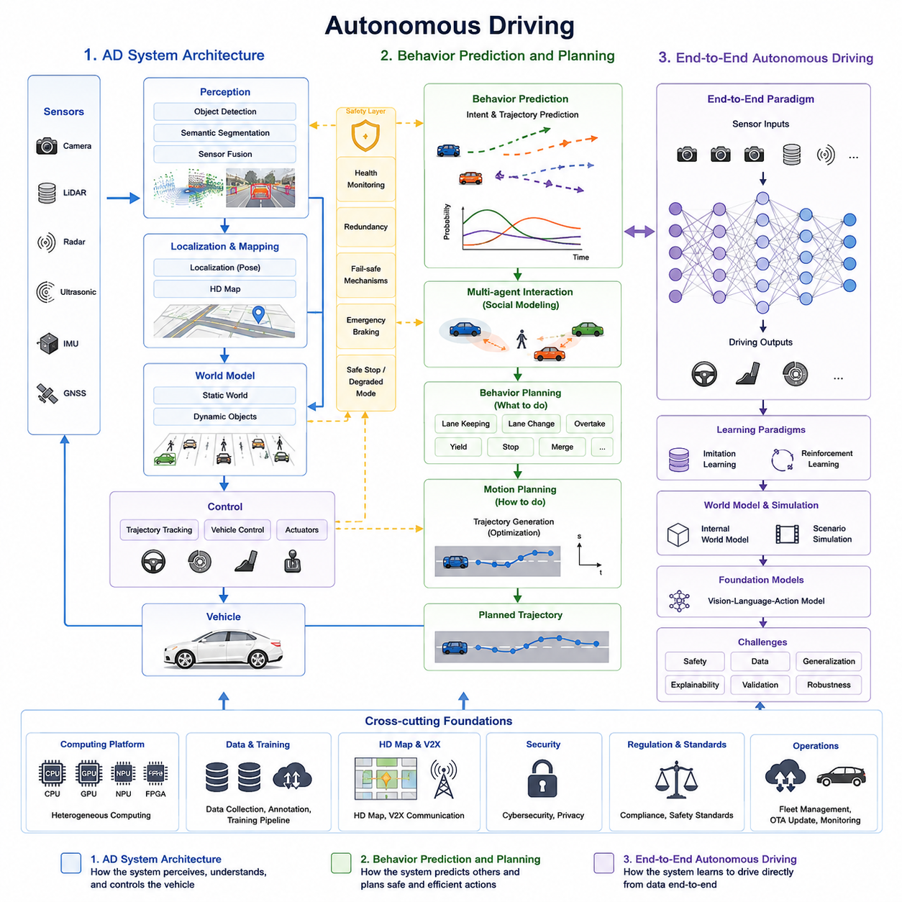
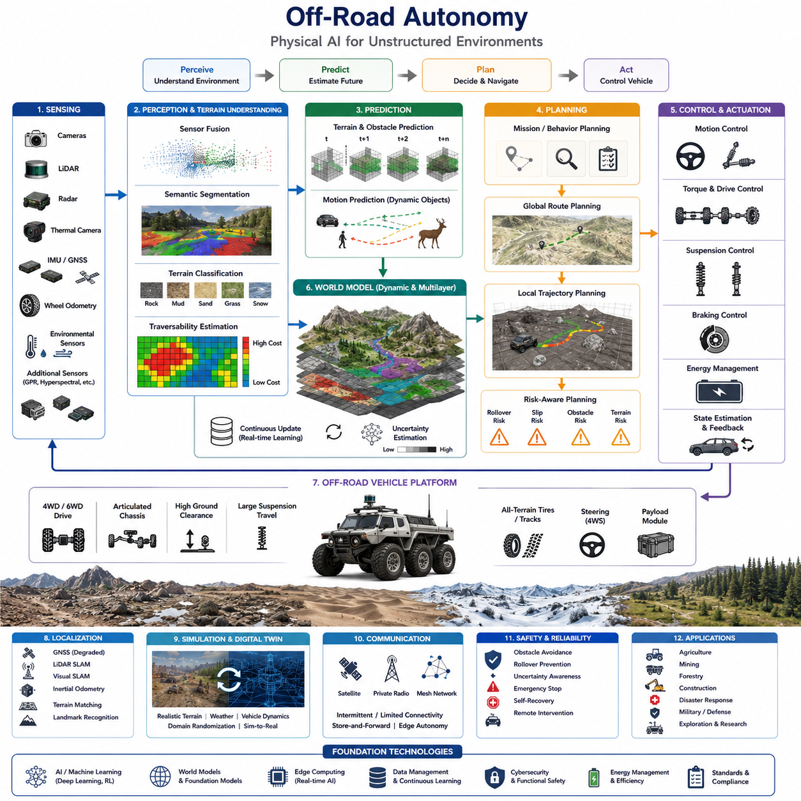
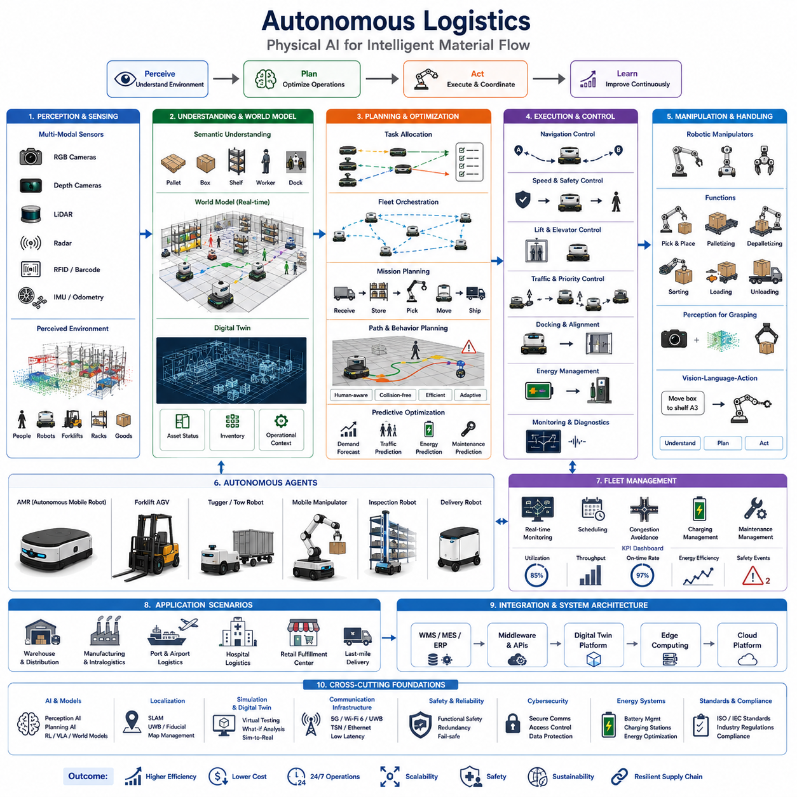
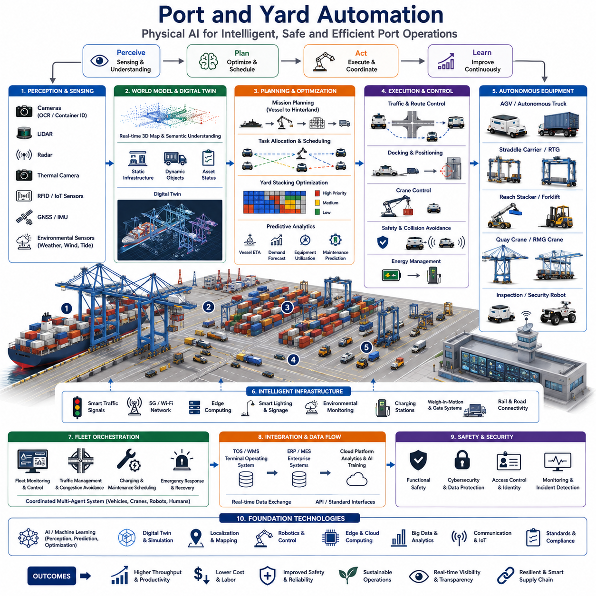
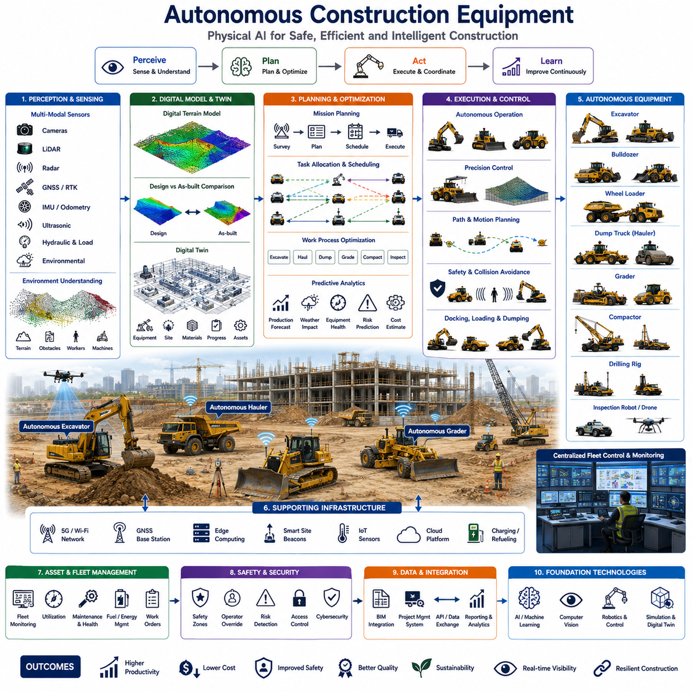
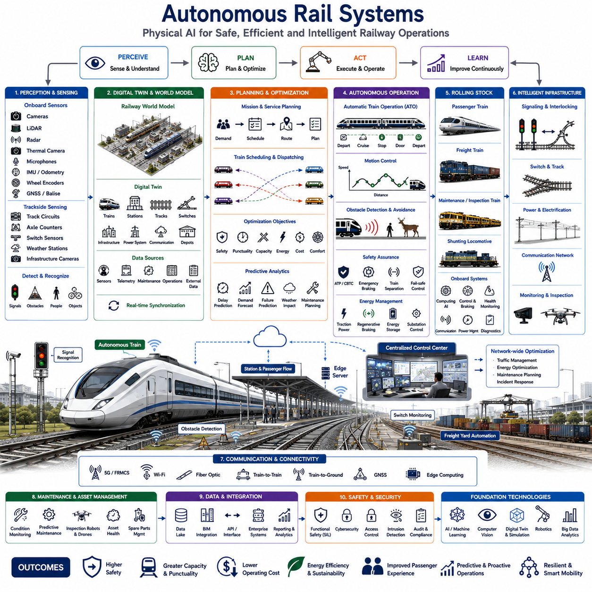
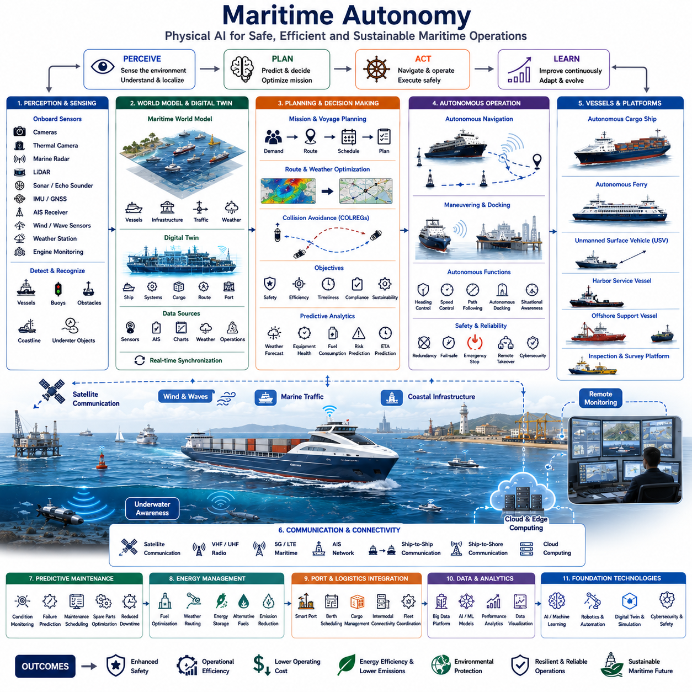
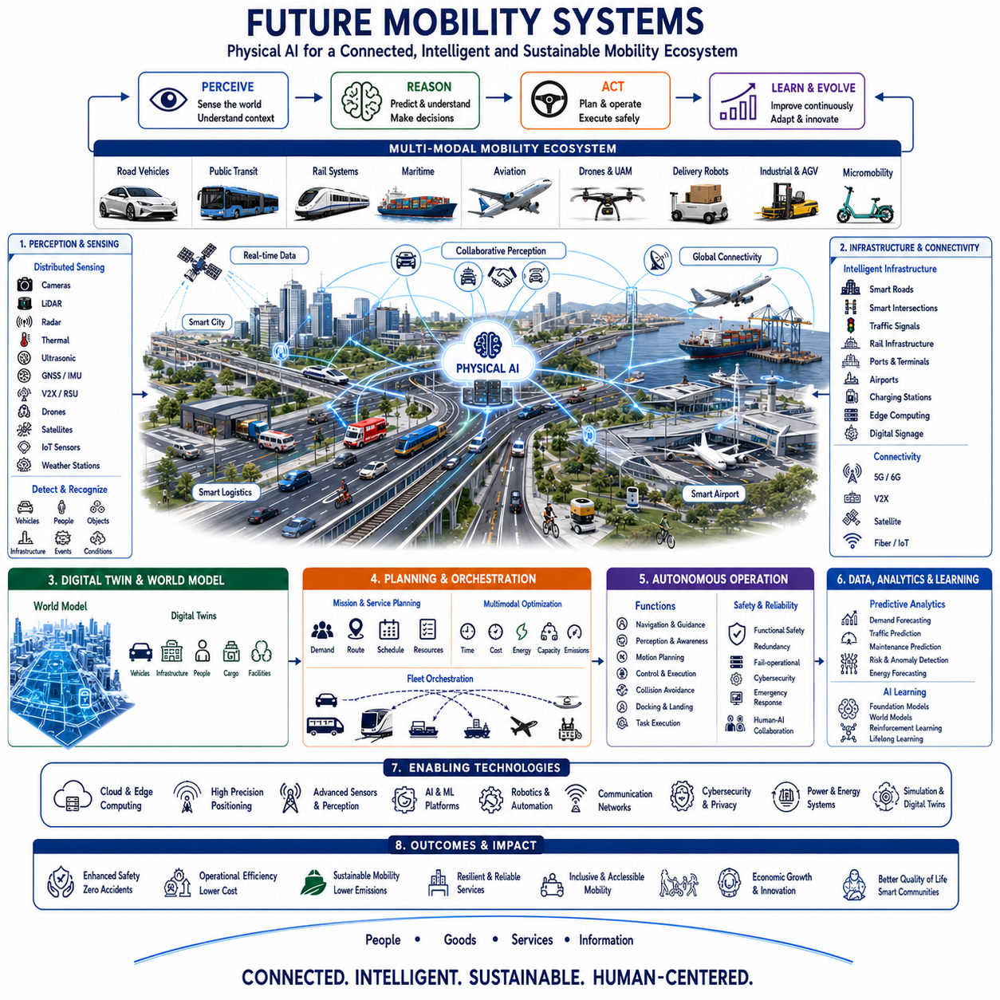

**Physical AI Engineering**

# Chapter 08 Autonomous Vehicles and Mobility 

## 08-01 Autonomous Driving

{width="7.268055555555556in" height="7.268055555555556in"}

08-01-01 AD System Architecture

08-01-02 Behavior Prediction and Planning

08-01-03 End-to-End Autonomous Driving

Autonomous Driving (AD) represents one of the most advanced manifestations of Physical AI because it requires an intelligent system to perceive, understand, predict, decide, and act within a highly dynamic physical environment. Unlike conventional software systems that operate within digital boundaries, autonomous vehicles must continuously interact with real-world objects, humans, road infrastructure, weather conditions, and unpredictable events. As a result, autonomous driving architecture has evolved into a layered Physical AI architecture that integrates perception, localization, mapping, prediction, planning, control, and safety management into a unified operational framework. The structure shown in the Physical AI Engineering tree highlights Autonomous Driving as a major application domain within Physical AI.

A typical autonomous driving system begins with a perception layer. This layer serves as the sensory system of the vehicle and is responsible for collecting information from cameras, LiDARs, radars, ultrasonic sensors, inertial measurement units, and GNSS receivers. Each sensor contributes different strengths. Cameras provide rich semantic information such as traffic signs, lane markings, pedestrians, and vehicle classifications. LiDAR generates highly accurate three-dimensional geometric representations of the surrounding environment. Radar performs reliably under adverse weather conditions and provides robust velocity measurements. Sensor fusion algorithms combine these heterogeneous inputs into a coherent representation of the external world.

The output of perception is passed to the localization and mapping subsystem. Localization determines the precise position and orientation of the vehicle within a known environment. Modern autonomous vehicles often achieve localization accuracy at the centimeter level through a combination of GNSS, inertial navigation systems, LiDAR matching, visual landmarks, and high-definition maps. Mapping systems provide detailed descriptions of road geometry, lane boundaries, traffic signals, intersections, speed limits, and static infrastructure. Together, localization and mapping form the spatial awareness capability required for autonomous operation.

Above the perception and localization layers lies the world modeling layer. This component transforms raw sensor observations into a structured representation of the driving environment. Static elements such as roads, buildings, and barriers are represented alongside dynamic objects including vehicles, cyclists, pedestrians, and animals. The world model continuously updates as new observations arrive. It serves as the foundation for reasoning and decision-making processes throughout the autonomous driving stack.

The prediction layer operates on top of the world model. Its primary purpose is to estimate future states of surrounding objects. Human drivers constantly anticipate the intentions of others, and autonomous systems must perform the same function computationally. Prediction algorithms estimate whether a nearby vehicle intends to change lanes, whether a pedestrian may cross the road, or whether a cyclist may suddenly alter direction. Multiple future trajectories are often generated to account for uncertainty.

The planning subsystem converts predictions into actionable driving strategies. Planning is commonly divided into behavioral planning and motion planning. Behavioral planning determines high-level decisions such as lane changes, overtaking maneuvers, yielding at intersections, merging into traffic, or stopping at crosswalks. Motion planning generates precise trajectories that satisfy safety constraints, dynamic limitations, passenger comfort requirements, and traffic regulations.

The control layer converts planned trajectories into physical actuator commands. Steering systems, braking systems, throttle controllers, electric motors, and transmission systems execute these commands in real time. Control algorithms continuously compensate for disturbances, road surface variations, vehicle dynamics, and environmental uncertainties. The objective is to ensure that the actual vehicle trajectory closely follows the planned path.

Safety forms an independent architectural layer spanning the entire autonomous driving stack. Safety monitoring systems evaluate sensor health, computational integrity, communication reliability, localization confidence, and planning consistency. Redundant architectures are frequently employed to guarantee fail-operational behavior. Safety mechanisms may initiate emergency braking, safe stop procedures, or controlled degradation modes whenever anomalies are detected.

Modern autonomous driving architectures increasingly incorporate AI foundation models and Physical AI reasoning engines. Traditional rule-based architectures are being supplemented by large-scale neural networks capable of understanding complex traffic scenes and generating context-aware decisions. This evolution is driving the transition from modular autonomy toward AI-native autonomous vehicles.

Another important architectural consideration is computational deployment. Autonomous vehicles typically employ heterogeneous computing platforms composed of CPUs, GPUs, NPUs, FPGAs, and dedicated accelerators. Real-time perception and deep learning inference often execute on GPUs, while deterministic safety-critical functions may remain on CPUs or specialized controllers. Edge computing constraints require careful optimization of power consumption, thermal management, latency, and reliability.

As Physical AI continues to advance, autonomous driving architectures are gradually evolving into world-model-centric systems. Instead of relying solely on hand-engineered modules, future systems will construct internal representations of reality, reason about possible futures, and generate optimal actions through learned intelligence. This transition reflects the broader movement toward Artificial General Physical Intelligence, where machines develop a comprehensive understanding of both digital and physical environments.

Behavior Prediction and Planning represent the cognitive core of autonomous driving systems. While perception provides awareness of the present world, prediction and planning provide awareness of the future. These capabilities distinguish intelligent autonomous vehicles from conventional automated systems because safe driving fundamentally depends on anticipating events before they occur.

Human drivers constantly perform behavior prediction without conscious effort. When observing a pedestrian approaching a crosswalk, a driver naturally estimates the probability that the pedestrian will enter the road. When following another vehicle, the driver predicts whether it will brake, accelerate, or change lanes. Autonomous vehicles must replicate this anticipatory capability using computational models.

Behavior prediction begins with understanding the intentions of surrounding agents. Modern road environments contain a diverse collection of participants including passenger vehicles, trucks, buses, motorcycles, cyclists, pedestrians, and service robots. Each participant exhibits unique behavioral characteristics. Prediction systems analyze motion history, environmental context, traffic regulations, and social interactions to estimate future actions.

Traditional prediction methods relied heavily on kinematic and probabilistic models. Constant velocity models, constant acceleration models, Kalman filters, and Bayesian frameworks were widely used to estimate future trajectories. While computationally efficient, these methods often struggle in complex urban environments where human behavior is highly nonlinear and context dependent.

Deep learning has significantly advanced behavior prediction capabilities. Recurrent neural networks, temporal convolution networks, graph neural networks, transformers, and diffusion models are now employed to model interactions among traffic participants. These models learn patterns from large-scale driving datasets and generate more realistic future trajectory predictions.

One of the major challenges in behavior prediction is uncertainty. The future cannot be predicted with absolute certainty because multiple outcomes may be plausible. A vehicle approaching an intersection may proceed straight, turn left, or turn right. Therefore, modern prediction systems generate multimodal predictions rather than single deterministic forecasts. Multiple candidate trajectories are assigned probabilities representing the likelihood of each future behavior.

Social interaction modeling has become increasingly important. Human drivers adapt their actions based on the anticipated reactions of others. Similarly, autonomous vehicles must consider reciprocal interactions among road users. Multi-agent prediction frameworks attempt to model these dependencies by treating traffic as a dynamic social system rather than a collection of independent objects.

Planning operates directly on the outputs of prediction systems. Once future possibilities have been estimated, the autonomous vehicle must select a safe and efficient course of action. Planning can be viewed as the process of searching for an optimal trajectory within a highly constrained environment.

Behavior planning operates at a strategic level. It determines what the vehicle intends to do. Examples include following a lane, overtaking a slower vehicle, yielding to pedestrians, stopping at a red light, merging onto a highway, or navigating a roundabout. These decisions must satisfy traffic regulations while balancing safety, efficiency, comfort, and mission objectives.

Motion planning operates at a tactical level. It transforms behavioral intentions into physically feasible trajectories. Constraints include vehicle dynamics, steering limitations, acceleration limits, road geometry, obstacle avoidance requirements, and passenger comfort considerations. Optimization techniques are frequently employed to generate smooth and safe trajectories.

Trajectory generation is often formulated as a constrained optimization problem. The planner searches for paths that minimize risk, energy consumption, travel time, or discomfort while maintaining compliance with all safety requirements. Sampling-based methods, graph search algorithms, model predictive control, and learning-based planners are commonly used.

Physical AI is introducing a new generation of planning systems based on world models and generative intelligence. Instead of relying solely on predefined rules, these systems internally simulate future scenarios and evaluate potential outcomes before selecting actions. This approach resembles human mental simulation and represents a significant step toward more general autonomous reasoning.

Large-scale foundation models are also beginning to influence planning systems. Vision-language-action architectures can integrate semantic understanding with driving decisions. For example, a vehicle may interpret verbal instructions, understand complex environmental contexts, and generate driving strategies consistent with human intentions.

Safety remains the primary objective throughout prediction and planning. Every decision must account for uncertainty, sensor limitations, environmental variability, and rare edge cases. The planner must remain robust even when predictions are imperfect. Conservative fallback strategies, safety envelopes, and risk-aware optimization methods help ensure safe operation under uncertain conditions.

Future behavior prediction and planning systems are expected to evolve toward fully integrated Physical AI reasoning architectures. These systems will maintain persistent world models, continuously learn from experience, anticipate long-term consequences, and coordinate with humans and other autonomous agents. Such capabilities will play a critical role in the realization of intelligent mobility ecosystems.

End-to-End Autonomous Driving represents a transformative shift in the design philosophy of autonomous vehicle systems. Traditional autonomous driving architectures are constructed as modular pipelines consisting of perception, localization, prediction, planning, and control modules. End-to-end systems seek to replace some or all of these intermediate components with unified neural architectures that directly map sensory observations to driving actions.

The motivation for end-to-end learning originates from the remarkable success of deep learning in computer vision, natural language processing, and reinforcement learning. Researchers observed that neural networks trained on sufficiently large datasets can automatically learn hierarchical representations without requiring extensive manual engineering. This insight led to the hypothesis that driving itself could be learned directly from data.

In its simplest form, an end-to-end driving system receives camera images as inputs and generates steering, acceleration, and braking commands as outputs. Early demonstrations showed that neural networks could successfully learn lane following and basic driving behaviors from human driving examples. Although limited in complexity, these experiments established the feasibility of data-driven driving systems.

Modern end-to-end architectures are significantly more sophisticated. Multi-camera systems provide panoramic environmental perception. LiDAR, radar, GPS, and vehicle state information are incorporated into unified neural representations. Transformer architectures process large amounts of spatial and temporal information simultaneously, enabling more comprehensive scene understanding.

One major advantage of end-to-end learning is optimization across the entire decision pipeline. Traditional modular systems often suffer from information loss between modules. Errors introduced during perception may propagate through planning and control stages. End-to-end architectures can theoretically learn representations optimized directly for driving performance rather than intermediate objectives.

Another advantage lies in scalability. Hand-engineering complex rules for every possible traffic scenario is difficult and expensive. End-to-end systems instead learn behaviors from large datasets containing millions of driving examples. As dataset size increases, performance may continue improving without requiring extensive manual redesign.

Imitation learning serves as a foundational training methodology for many end-to-end systems. Human driving demonstrations provide supervision, allowing neural networks to learn mappings between observations and actions. Large-scale fleet data collected from production vehicles can provide enormous quantities of training examples spanning diverse environments, weather conditions, and driving cultures.

Reinforcement learning offers another training paradigm. Rather than directly imitating human behavior, reinforcement learning agents learn driving policies through interaction with simulated environments. Rewards encourage safe, efficient, and goal-directed driving behavior. Recent advances in simulation technology have significantly expanded the feasibility of reinforcement learning for autonomous driving.

World models have emerged as a critical component of advanced end-to-end systems. Instead of generating actions directly from observations, these systems first construct internal representations of the environment and predict future states. Action decisions are then derived from simulated future outcomes. This approach combines the advantages of end-to-end learning with the interpretability and reasoning capabilities of model-based methods.

Vision-language-action models are also influencing end-to-end autonomous driving. These architectures integrate visual perception, linguistic understanding, and action generation within a single framework. Vehicles may eventually interpret high-level human instructions such as destination preferences, route constraints, or contextual objectives while autonomously generating detailed driving behaviors.

Despite their promise, end-to-end systems face significant challenges. Safety validation remains one of the most difficult problems. Traditional modular systems provide explicit intermediate outputs that engineers can inspect and verify. End-to-end neural networks often operate as complex black boxes, making failure analysis more challenging.

Data requirements are another important consideration. End-to-end systems typically require enormous quantities of training data to achieve robust performance. Rare events such as unusual traffic scenarios, accidents, extreme weather conditions, or unexpected pedestrian behaviors may be underrepresented in datasets, creating potential vulnerabilities.

Interpretability also remains a major research area. Regulators, safety engineers, and customers often require explanations for vehicle decisions. Understanding why a neural network selected a particular action is considerably more difficult than analyzing rule-based decision logic. Researchers are therefore developing explainable AI techniques for autonomous driving applications.

Simulation has become an essential tool for end-to-end development. Large-scale virtual environments allow autonomous systems to experience billions of driving scenarios that would be impractical or unsafe to collect in the real world. Simulation-to-reality transfer techniques help bridge the gap between virtual training environments and physical deployment.

The future of end-to-end autonomous driving is closely linked to the broader evolution of Physical AI. As foundation models, world models, generative AI, and reinforcement learning continue to mature, autonomous vehicles are expected to become increasingly capable of understanding, reasoning about, and interacting with the physical world. Rather than relying on rigid engineering pipelines, future systems may function as intelligent physical agents capable of learning, adapting, and improving throughout their operational lifetimes. This progression represents an important milestone on the path toward Artificial General Physical Intelligence and truly autonomous mobility systems.

## 08-02 Off-Road Autonomy

{width="7.268055555555556in" height="7.268055555555556in"}

Off-Road Autonomy represents one of the most demanding application domains of Physical AI because autonomous systems must operate in environments that are largely unstructured, continuously changing, and often lack the infrastructure available in urban roads. Unlike highway or city autonomous driving, where vehicles can rely on lane markings, traffic lights, road signs, and high-definition maps, off-road autonomous systems must interpret natural terrain, estimate traversability, adapt to uncertain environmental conditions, and make intelligent decisions with incomplete information. This capability requires Physical AI to combine perception, reasoning, planning, learning, and control into a tightly integrated autonomous system capable of surviving and performing missions in highly dynamic physical environments. Within the Physical AI Engineering architecture, Off-Road Autonomy extends the concepts of autonomous driving toward intelligent mobility across forests, deserts, agricultural fields, mines, military zones, construction sites, disaster areas, and remote wilderness where traditional transportation infrastructure does not exist.

The fundamental challenge of off-road autonomy begins with environmental uncertainty. Natural environments are rarely static and cannot be fully represented using predefined maps. Ground surfaces continuously change due to rainfall, snow, mud, vegetation growth, erosion, loose rocks, sand movement, or seasonal variations. A route that was safe yesterday may become impassable today. Consequently, an autonomous off-road vehicle must perceive the environment in real time rather than depending solely on prior map information. Physical AI therefore shifts from map-centric navigation toward perception-driven world understanding.

Perception systems for off-road autonomy differ significantly from those used in urban autonomous driving. Cameras remain important because they provide rich semantic information regarding vegetation, rocks, water, soil, obstacles, and terrain texture. However, visual information alone is often insufficient because lighting conditions can vary dramatically due to sunlight, shadows, fog, rain, snow, or dust. LiDAR provides reliable three-dimensional geometry that enables accurate estimation of terrain elevation, slopes, depressions, and obstacle shapes. Radar contributes robust detection capability during adverse weather conditions and can penetrate dust, fog, and vegetation more effectively than optical sensors. Thermal cameras may identify humans, animals, vehicles, or heat-emitting equipment during nighttime operations or low-visibility conditions. Ground-penetrating radar and hyperspectral sensors may also be integrated for specialized applications such as geological exploration or agricultural analysis.

Sensor fusion becomes increasingly important because no single sensing modality can provide sufficient environmental understanding under all conditions. Physical AI continuously combines camera images, point clouds, radar reflections, inertial measurements, GNSS observations, wheel odometry, and environmental sensors into a unified three-dimensional world model. This world model represents not only obstacles but also terrain characteristics, vegetation density, water boundaries, soil conditions, and potential hazards.

Terrain understanding is one of the defining capabilities of off-road Physical AI. Unlike paved roads, natural terrain varies continuously in elevation, roughness, deformability, friction, and load-bearing capacity. A traversable surface cannot simply be identified through visual appearance. Mud may appear similar to dry soil, while loose sand may resemble stable ground under certain lighting conditions. Physical AI therefore combines visual semantics with physical reasoning to estimate terrain properties that directly affect vehicle mobility. Machine learning models are increasingly trained to classify terrain types such as gravel, grass, sand, snow, ice, mud, rocks, forest floors, and agricultural fields while simultaneously estimating traversability costs for each surface.

Traversability analysis transforms environmental perception into mobility intelligence. Rather than asking whether an obstacle exists, the system evaluates whether a vehicle can safely drive across a specific region. Traversability depends on vehicle dimensions, wheel configuration, suspension characteristics, tire properties, ground clearance, payload distribution, slope angle, soil strength, and dynamic stability. Physical AI continuously predicts how the terrain will interact with the vehicle before selecting a safe trajectory.

Localization in off-road environments presents unique challenges. High-definition road maps are generally unavailable, and GNSS signals may be degraded by dense forests, mountains, tunnels, or deep valleys. Consequently, off-road systems rely heavily on multi-modal localization techniques. LiDAR SLAM, Visual SLAM, inertial navigation, wheel odometry, terrain matching, and landmark recognition operate together to maintain accurate localization even when satellite navigation becomes unreliable. In many remote environments, localization uncertainty must itself become part of the planning process, requiring autonomous systems to actively seek better observations before committing to risky maneuvers.

World models used in off-road autonomy differ substantially from urban HD maps. Instead of storing predefined lane information, they represent continuously evolving environmental knowledge. Terrain elevation models, occupancy grids, semantic terrain classifications, vegetation maps, water distributions, obstacle locations, and dynamic environmental changes are integrated into hierarchical world representations. Modern Physical AI continuously updates these models as new observations become available, allowing the vehicle to adapt to environmental changes throughout long-duration missions.

Behavior planning for off-road vehicles is fundamentally mission-driven rather than traffic-driven. Urban autonomous vehicles primarily obey traffic regulations while interacting with other road users. Off-road vehicles instead optimize mission objectives such as reaching exploration targets, surveying infrastructure, transporting cargo, inspecting pipelines, collecting agricultural data, supporting military reconnaissance, or performing search-and-rescue operations. Planning algorithms therefore balance mission efficiency, vehicle safety, energy consumption, terrain risk, and operational constraints simultaneously.

Motion planning in natural environments requires significantly greater flexibility than road driving. Instead of following predefined lanes, planners generate free-space trajectories across uneven terrain while avoiding obstacles, minimizing rollover risk, reducing suspension loads, preserving traction, and maintaining passenger or equipment stability. Optimization methods frequently incorporate vehicle dynamics, terrain mechanics, energy models, and uncertainty estimation to generate robust trajectories under changing environmental conditions.

Learning-based planning has become increasingly important in off-road autonomy. Reinforcement learning enables autonomous systems to learn driving strategies through repeated interaction with realistic simulation environments. Rather than relying exclusively on manually designed rules, vehicles gradually discover efficient behaviors for crossing rocks, climbing hills, descending slopes, traversing mud, avoiding unstable surfaces, and recovering from wheel slip. Simulation environments provide billions of virtual experiences that would be impossible to obtain safely in real-world testing.

Vehicle dynamics become significantly more complex during off-road operation. Suspension articulation, tire deformation, wheel slip, ground pressure, body roll, pitch motion, and terrain deformation all influence mobility. Physical AI integrates vehicle dynamic models with perception systems to predict how control actions will affect future vehicle behavior. Adaptive controllers continuously modify steering, braking, torque distribution, suspension settings, and traction control according to changing terrain conditions.

Mobility management extends beyond path following. Intelligent torque allocation among multiple wheels, active suspension control, differential locking, tire pressure adjustment, and energy-aware driving strategies contribute to maintaining mobility under difficult terrain conditions. Autonomous vehicles equipped with four-wheel steering, articulated chassis, tracked mobility systems, or hybrid locomotion mechanisms require Physical AI architectures capable of coordinating multiple actuators simultaneously.

Energy management plays a critical role in off-road autonomy because many operations occur far from charging infrastructure or fuel supplies. Mission planners continuously estimate remaining energy based on terrain roughness, elevation changes, wheel slip, weather conditions, payload weight, and anticipated mission duration. Route optimization therefore considers both geometric distance and predicted energy consumption. Physical AI increasingly integrates energy-aware planning into overall mission optimization to maximize operational endurance.

Communication infrastructure in remote environments is frequently unavailable or unreliable. Off-road autonomous systems therefore emphasize onboard intelligence and edge computing. AI inference, perception, planning, localization, and control must execute locally with minimal dependence on cloud connectivity. Opportunistic communication using satellite links, private radio networks, mesh communication, or delayed synchronization may supplement onboard autonomy, but mission success cannot depend upon continuous external connectivity.

Simulation plays an essential role in developing off-road autonomy because collecting diverse real-world data across all environmental conditions is prohibitively expensive. Modern digital twin environments reproduce realistic terrain geometry, vegetation, weather, soil mechanics, vehicle dynamics, and sensor characteristics. Domain randomization techniques expose AI models to countless combinations of lighting, weather, terrain, and obstacle conditions, enabling better generalization when deployed in real environments. Simulation-to-reality transfer remains one of the most active research areas in Physical AI for autonomous mobility.

Safety considerations extend beyond collision avoidance. Off-road vehicles must detect rollover risks, unstable ground, deep water, falling rocks, hidden obstacles, wildlife, hazardous vegetation, and terrain collapse. Risk-aware planning continuously evaluates uncertainty within perception and localization while selecting conservative actions whenever environmental confidence decreases. Emergency recovery behaviors such as controlled stopping, autonomous rerouting, self-recovery maneuvers, or remote operator intervention provide additional layers of operational safety.

Recent advances in Foundation Models, World Models, Vision-Language-Action models, and Generative AI are transforming off-road autonomy into a new generation of intelligent physical systems. Rather than relying solely on handcrafted algorithms, future autonomous vehicles will build persistent internal world models, reason about terrain using learned physical knowledge, predict long-term environmental evolution, and generate adaptive driving strategies for previously unseen environments. Large-scale multimodal models capable of integrating vision, language, maps, sensor data, mission objectives, and vehicle dynamics will enable increasingly generalized off-road intelligence.

Off-road autonomy is expected to become one of the defining technologies of future Physical AI because it represents autonomy under the most challenging physical conditions. Applications continue to expand across agriculture, mining, forestry, infrastructure inspection, environmental monitoring, planetary exploration, military operations, disaster response, logistics, and scientific research. As autonomous systems become capable of understanding complex natural environments, reasoning under uncertainty, continuously learning from experience, and safely interacting with the physical world, off-road autonomy will serve as a critical stepping stone toward Artificial General Physical Intelligence, where intelligent machines possess the adaptability and robustness required to operate effectively across virtually any real-world environment.

## 08-03 Autonomous Logistics

{width="7.268055555555556in" height="7.268055555555556in"}

Autonomous Logistics represents one of the most commercially significant application domains of Physical AI because it extends artificial intelligence beyond perception and navigation into the complete orchestration of physical material flow. Traditional logistics has historically relied on human operators to transport, sort, load, unload, inspect, and coordinate goods across warehouses, factories, ports, airports, distribution centers, hospitals, retail facilities, and urban transportation networks. As global supply chains become increasingly complex and labor shortages continue to grow, Physical AI enables logistics systems to operate with higher efficiency, greater flexibility, and continuous autonomous decision-making. Within the Physical AI Engineering framework, Autonomous Logistics combines intelligent mobility, robotic manipulation, digital infrastructure, fleet coordination, predictive reasoning, and real-time optimization into a unified physical intelligence ecosystem capable of managing material movement from production to final delivery. The Physical AI Engineering architecture identifies Autonomous Logistics as one of the primary application areas within Autonomous Vehicles and Mobility.

Unlike conventional warehouse automation, which typically relies on fixed conveyors, automated storage systems, and predefined workflows, Autonomous Logistics emphasizes adaptive and intelligent operations. Physical AI systems continuously perceive changing environments, understand operational contexts, predict future demands, optimize resource allocation, and coordinate multiple autonomous agents without requiring rigid infrastructure. This transition transforms logistics from automation based on predefined sequences into intelligent systems capable of responding dynamically to real-world uncertainty.

The logistics environment consists of highly diverse operational scenarios. Manufacturing plants require continuous material transportation between production cells. Warehouses manage inbound receiving, storage, picking, replenishment, packing, and outbound shipping. Hospitals transport medicines, laboratory samples, surgical instruments, meals, and medical waste. Airports coordinate baggage handling and cargo transportation. Retail fulfillment centers process millions of customer orders with constantly changing priorities. Each environment imposes unique operational constraints while sharing common Physical AI principles.

Perception forms the sensory foundation of Autonomous Logistics. Intelligent mobile robots continuously observe their surroundings using multiple sensing technologies. RGB cameras recognize packages, pallets, containers, labels, workers, forklifts, and infrastructure. Depth cameras generate three-dimensional geometry for obstacle detection and object localization. LiDAR provides accurate environmental mapping and navigation, while radar improves robustness in dusty or low-visibility environments. RFID readers, barcode scanners, QR code recognition systems, and industrial identification technologies complement visual sensing by enabling reliable inventory tracking and asset identification.

Sensor fusion integrates heterogeneous observations into a unified representation of warehouse or logistics environments. Static infrastructure such as shelves, racks, conveyors, docking stations, elevators, and charging stations are combined with dynamic objects including workers, autonomous mobile robots, forklifts, delivery carts, and transported goods. Physical AI continuously maintains an updated world model representing operational conditions throughout the facility.

Localization remains a critical capability within autonomous logistics. Indoor environments often lack reliable GNSS signals, requiring alternative positioning methods. LiDAR SLAM, Visual SLAM, fiducial markers, AprilTags, Ultra-Wideband positioning, inertial navigation, wheel odometry, and map matching operate together to provide centimeter-level localization accuracy. Modern logistics facilities increasingly integrate digital infrastructure that assists autonomous systems through intelligent localization beacons and infrastructure-based sensing.

Semantic understanding extends beyond simple object detection. Physical AI must understand the operational meaning of observed objects. A pallet awaiting shipment requires different handling from one scheduled for inspection. Empty containers, hazardous materials, temperature-sensitive products, medical supplies, and high-value goods each require distinct operational policies. AI therefore combines visual recognition with enterprise information systems to interpret the semantic context associated with physical assets.

Digital Twins play an increasingly important role in Autonomous Logistics. Every physical asset---including robots, storage locations, packages, vehicles, equipment, and inventory---may possess a continuously synchronized digital representation. The Digital Twin maintains current operational status, historical movement records, maintenance information, inventory levels, destination assignments, and predicted future activities. Physical AI continuously synchronizes physical observations with digital models, creating comprehensive operational awareness across entire logistics facilities.

Task allocation represents one of the central intelligence functions of Autonomous Logistics. Incoming transportation requests must be assigned dynamically among multiple autonomous vehicles while considering robot availability, battery status, payload capacity, location, traffic congestion, delivery urgency, and mission priorities. Rather than assigning fixed routes, Physical AI continuously optimizes fleet-wide efficiency using dynamic scheduling algorithms capable of adapting to changing operational conditions.

Fleet orchestration extends beyond individual vehicle navigation. Modern logistics facilities may deploy hundreds or even thousands of autonomous mobile robots simultaneously. Fleet management systems coordinate task assignments, traffic flow, charging schedules, maintenance windows, congestion avoidance, and emergency recovery procedures. Physical AI ensures that autonomous agents cooperate efficiently rather than competing for shared resources.

Mission planning integrates transportation objectives with broader operational workflows. A single logistics mission may involve receiving raw materials, transporting them to manufacturing cells, collecting finished products, delivering quality inspection samples, transferring pallets to storage locations, retrieving customer orders, loading outbound trucks, and returning empty containers. Physical AI coordinates these interconnected activities while continuously adapting to production changes and customer demand fluctuations.

Behavior planning within logistics environments differs substantially from autonomous driving. Rather than interacting with public traffic, logistics robots operate among human workers, industrial equipment, forklifts, collaborative robots, conveyors, elevators, and automated storage systems. Human-aware navigation therefore becomes a fundamental requirement. Robots must predict pedestrian intentions, maintain comfortable safety distances, communicate movement intentions, yield appropriately, and adapt their behavior according to workplace safety regulations.

Motion planning emphasizes smooth, efficient, and predictable movement rather than maximum speed. Warehouses frequently contain narrow aisles, dense shelving systems, loading docks, dynamic intersections, and congested workspaces. Physical AI generates collision-free trajectories while minimizing travel distance, energy consumption, waiting time, and traffic interference. Real-time replanning allows robots to respond immediately to newly appearing obstacles or operational changes.

Autonomous manipulation increasingly complements autonomous mobility. Logistics robots no longer transport only fixed payload platforms but also perform picking, palletizing, depalletizing, sorting, loading, unloading, and package handling. Vision-guided robotic manipulators identify grasp points, estimate object pose, evaluate object stability, and generate adaptive grasp strategies for items with varying shapes, weights, and packaging conditions. Vision-Language-Action models enable robots to interpret high-level instructions while generating complex manipulation sequences autonomously.

Inventory intelligence represents another major application of Physical AI. Autonomous inspection robots continuously monitor warehouse inventory, verify stock levels, detect misplaced items, identify damaged packaging, and update digital inventory databases automatically. Computer vision algorithms compare observed inventory against enterprise resource planning systems, reducing manual counting while improving inventory accuracy and operational transparency.

Predictive logistics introduces proactive intelligence into supply chain operations. Rather than simply reacting to transportation requests, Physical AI predicts future demand patterns, anticipated congestion, equipment utilization, battery consumption, maintenance requirements, inventory shortages, and production bottlenecks. Predictive reasoning allows logistics systems to reposition autonomous vehicles, prepare charging resources, optimize inventory distribution, and schedule maintenance before disruptions occur.

Energy management is essential for large autonomous fleets. Battery-powered logistics robots must coordinate charging schedules without interrupting operational productivity. Physical AI continuously predicts energy consumption based on travel distance, payload weight, traffic conditions, floor friction, acceleration profiles, and expected future assignments. Fleet-level charging optimization ensures balanced battery utilization while maximizing operational availability.

Communication infrastructure supports collaborative autonomy throughout logistics facilities. High-speed industrial Ethernet, private 5G networks, Wi-Fi 6, Ultra-Wideband communication, and Time Sensitive Networking provide reliable low-latency communication among robots, servers, industrial controllers, warehouse management systems, manufacturing execution systems, and enterprise planning platforms. Nevertheless, autonomous robots retain onboard intelligence to continue safe operation during temporary communication failures.

Cloud-edge computing architectures balance centralized optimization with local autonomy. Edge computers installed onboard autonomous vehicles execute perception, localization, planning, and real-time control with deterministic latency. Cloud platforms perform large-scale optimization, fleet analytics, machine learning, digital twin synchronization, predictive maintenance, and enterprise integration. Physical AI distributes computational workloads across these layers according to latency, bandwidth, reliability, and computational requirements.

Safety remains fundamental throughout Autonomous Logistics. Industrial environments contain both autonomous systems and human workers operating simultaneously. Functional safety architectures monitor sensor health, vehicle dynamics, obstacle detection, communication integrity, actuator performance, and computational reliability. Emergency stopping, speed adaptation, safe zones, collision prediction, fail-safe operation, and human override mechanisms ensure compliance with industrial safety standards while maintaining operational productivity.

Cybersecurity becomes increasingly important as logistics infrastructure evolves toward highly connected intelligent systems. Autonomous robots exchange operational information with cloud platforms, enterprise software, production equipment, suppliers, and customers. Secure communication protocols, authentication mechanisms, encrypted data exchange, intrusion detection systems, and secure software update frameworks protect logistics operations against cyber threats while preserving data integrity and operational continuity.

Simulation and Digital Twins provide indispensable development tools for Autonomous Logistics. Before deployment, virtual logistics facilities reproduce warehouse layouts, robot fleets, traffic conditions, production schedules, storage systems, and worker interactions. Large-scale simulations evaluate scheduling strategies, fleet sizes, charging policies, traffic management algorithms, and emergency procedures before physical implementation. Simulation-to-Reality methodologies significantly reduce deployment risks while accelerating system optimization.

Recent advances in Foundation Models, Vision-Language Models, Vision-Language-Action architectures, World Models, and Generative AI are transforming Autonomous Logistics into intelligent cognitive systems. Rather than executing predefined transportation tasks, future logistics robots will understand natural language instructions, reason about complex operational objectives, collaborate with human workers, learn new workflows through demonstration, and continuously improve operational efficiency through experience. Persistent world models will enable robots to anticipate future operational conditions and optimize logistics networks proactively rather than reactively.

The future of Autonomous Logistics extends beyond individual facilities toward globally connected intelligent supply chains. Factories, warehouses, ports, airports, hospitals, retail distribution centers, autonomous trucks, cargo drones, and last-mile delivery robots will operate as cooperative Physical AI agents sharing information through continuously synchronized digital ecosystems. Autonomous decision-making will occur across multiple organizational layers, integrating production planning, transportation scheduling, inventory optimization, maintenance management, energy allocation, and customer demand forecasting into a unified physical intelligence platform.

Autonomous Logistics therefore represents far more than automated transportation. It embodies the convergence of robotics, artificial intelligence, distributed computing, digital twins, intelligent infrastructure, and enterprise decision-making into an integrated Physical AI ecosystem capable of managing the movement of physical goods with the adaptability, efficiency, and reasoning capabilities traditionally associated only with human logistics experts. As Physical AI continues to mature, Autonomous Logistics will become one of the foundational technologies enabling intelligent factories, resilient supply chains, sustainable transportation networks, and fully autonomous industrial ecosystems.

## 08-04 Port and Yard Automation

{width="7.268055555555556in" height="7.268055555555556in"}

Port and Yard Automation represents one of the largest and most complex applications of Physical AI because it combines autonomous transportation, intelligent logistics, robotic manipulation, large-scale infrastructure management, and multi-agent coordination within highly dynamic industrial environments. Modern ports and container yards process millions of containers every year while operating continuously under strict safety, efficiency, and reliability requirements. As international trade expands and global supply chains become increasingly interconnected, conventional manually operated terminals struggle to satisfy growing throughput demands. Physical AI enables ports and logistics yards to transform into intelligent cyber-physical ecosystems where autonomous machines continuously cooperate to move, store, inspect, schedule, and transport cargo with minimal human intervention. Within the Physical AI Engineering architecture, Port and Yard Automation extends Autonomous Logistics into large-scale outdoor environments that integrate autonomous vehicles, cranes, intelligent infrastructure, fleet orchestration, predictive scheduling, and digital twins into a unified operational intelligence platform. The Physical AI Engineering framework positions Port and Yard Automation as one of the major application domains under Autonomous Vehicles and Mobility.

Unlike traditional container terminals that depend heavily on human operators, manually driven trucks, and isolated automation equipment, Physical AI introduces end-to-end intelligent coordination across the entire cargo handling process. Every container, vehicle, crane, storage block, docking position, shipping schedule, and transportation resource becomes part of a continuously updated digital ecosystem. Autonomous systems no longer optimize individual operations independently but instead optimize the complete logistics flow from vessel arrival to inland transportation.

Modern ports represent extremely challenging operational environments. Hundreds of container trucks, automated guided vehicles, autonomous mobile robots, reach stackers, rubber-tired gantry cranes, rail-mounted gantry cranes, quay cranes, straddle carriers, forklifts, maintenance vehicles, and human workers operate simultaneously across large outdoor facilities. Weather conditions, vessel schedules, cargo priorities, equipment availability, and traffic congestion change continuously throughout daily operations. Physical AI must therefore coordinate thousands of dynamic interactions while maintaining operational safety and maximizing terminal productivity.

Perception serves as the sensory foundation of autonomous port operations. RGB cameras monitor container identification numbers, vehicle positions, personnel, equipment, road markings, and operational activities. High-resolution stereo cameras estimate object geometry and support precise docking operations. LiDAR generates accurate three-dimensional representations of cranes, stacked containers, road infrastructure, storage yards, and moving vehicles. Radar provides reliable obstacle detection under rain, fog, dust, or nighttime conditions where optical sensors may experience degraded performance. Thermal cameras monitor equipment temperatures, identify overheating machinery, and enhance nighttime safety monitoring. RFID systems, optical character recognition, container identification technologies, and industrial IoT sensors provide additional operational awareness throughout terminal facilities.

Sensor fusion integrates these heterogeneous observations into comprehensive operational world models. Rather than maintaining isolated perception systems for individual machines, Physical AI constructs shared environmental representations that are continuously synchronized across the entire port. Static infrastructure including quay walls, container stacks, storage blocks, railway lines, truck lanes, maintenance areas, charging stations, and vessel berths coexist with dynamic entities such as trucks, cranes, autonomous vehicles, containers, workers, ships, and inspection robots. Shared situational awareness significantly improves cooperative decision-making across distributed autonomous systems.

Localization within port environments presents unique technical challenges. Although GNSS generally performs better outdoors than indoors, large steel containers, cranes, warehouses, vessels, and industrial structures frequently introduce multipath effects and signal degradation. High-precision localization therefore combines RTK GNSS, inertial navigation, LiDAR SLAM, Visual SLAM, wheel odometry, infrastructure landmarks, Ultra-Wideband positioning, and map matching techniques. Physical AI continuously estimates localization confidence while adapting operational behavior according to positioning uncertainty.

Digital infrastructure plays a much greater role in port automation than in conventional autonomous driving. Intelligent infrastructure components including smart traffic signals, connected cranes, edge computing nodes, wireless communication systems, infrastructure cameras, environmental sensors, weather stations, and digital signage cooperate directly with autonomous vehicles. Physical AI distributes intelligence across both mobile platforms and fixed infrastructure, creating collaborative cyber-physical environments rather than isolated autonomous machines.

Container identification represents a fundamental operational requirement. Every container possesses unique identification numbers, ownership information, destination assignments, hazardous material classifications, customs status, weight information, shipping documentation, and handling priorities. AI-powered computer vision automatically recognizes container identification codes even under difficult lighting conditions, partial occlusions, contamination, or varying viewing angles. Continuous verification significantly reduces operational errors while improving cargo traceability.

Digital Twins become central operational intelligence platforms within modern ports. Every physical entity---including containers, cranes, autonomous vehicles, storage blocks, vessels, maintenance equipment, railway wagons, truck fleets, energy systems, and terminal infrastructure---maintains continuously synchronized digital representations. Digital Twins record current operational status, historical movement records, maintenance histories, energy consumption, cargo assignments, predicted arrival times, equipment utilization, and operational constraints. Physical AI continuously synchronizes sensor observations with digital models, enabling comprehensive real-time situational awareness across entire terminal operations.

Mission planning within automated ports extends far beyond simple vehicle routing. A single import container may require unloading from a vessel, transportation to temporary storage, customs inspection, relocation to export staging, loading onto rail transport, transfer to distribution centers, and final delivery to customers. Every step depends upon equipment availability, cargo priorities, transportation schedules, weather conditions, maintenance activities, and workforce coordination. Physical AI dynamically generates coordinated mission plans that optimize overall cargo flow rather than individual transportation tasks.

Task allocation becomes an extremely large-scale optimization problem. Thousands of transportation requests compete simultaneously for autonomous guided vehicles, container carriers, cranes, storage locations, charging resources, maintenance personnel, and docking infrastructure. AI scheduling algorithms continuously assign resources while minimizing waiting time, reducing unnecessary travel, balancing equipment utilization, and maximizing terminal throughput. Dynamic scheduling adapts immediately whenever vessels arrive early, weather conditions deteriorate, equipment failures occur, or customer priorities change unexpectedly.

Fleet orchestration coordinates large populations of autonomous machines operating simultaneously throughout terminal facilities. Autonomous Guided Vehicles, Autonomous Trucks, container carriers, inspection robots, maintenance robots, security patrol vehicles, and autonomous cleaning machines cooperate through centralized and distributed coordination architectures. Traffic management systems regulate intersections, optimize route selection, prevent congestion, coordinate charging schedules, allocate parking areas, and recover efficiently from unexpected operational disruptions.

Motion planning within ports differs significantly from urban autonomous driving. Autonomous vehicles frequently transport extremely heavy containers while operating within constrained industrial environments containing narrow traffic lanes, crane operating zones, loading docks, rail crossings, maintenance areas, and temporary construction sites. Motion planning therefore prioritizes stability, predictability, collision avoidance, energy efficiency, and precise positioning rather than high-speed travel. Trajectories are continuously optimized according to changing traffic conditions and operational priorities.

Precise docking represents one of the most demanding motion control tasks. Autonomous container carriers must position themselves accurately beneath quay cranes, automated stacking cranes, rail-mounted gantry cranes, charging stations, maintenance platforms, and loading docks. Centimeter-level positioning accuracy is often required to ensure safe and efficient cargo transfer. Physical AI combines sensor fusion, visual servoing, localization refinement, and adaptive motion control to achieve highly repeatable docking performance under varying environmental conditions.

Autonomous crane operation has become a defining technology within advanced container terminals. AI-controlled quay cranes automatically identify containers, estimate load dynamics, suppress swing motion, optimize lifting trajectories, coordinate with autonomous vehicles, and execute high-speed loading and unloading operations. Machine learning algorithms continuously improve crane productivity while reducing operator workload and enhancing operational safety.

Container stacking optimization represents another major Physical AI application. Yard storage locations directly influence future transportation efficiency. AI continuously predicts future vessel arrivals, export schedules, customs inspections, truck arrivals, rail departures, and equipment availability before selecting optimal storage positions for incoming containers. Rather than minimizing immediate travel distance, intelligent stacking strategies optimize long-term operational efficiency across multiple future logistics activities.

Predictive logistics transforms reactive port operations into proactive intelligence. Foundation Models, World Models, and machine learning algorithms analyze vessel schedules, historical cargo flows, weather forecasts, maintenance records, equipment utilization, seasonal demand, and customer logistics patterns to anticipate future operational requirements. Physical AI proactively reallocates vehicles, prepares storage locations, schedules maintenance activities, and balances terminal workloads before congestion occurs.

Energy management has become increasingly important as ports transition toward electric autonomous equipment. Battery-powered autonomous guided vehicles, electric cranes, hybrid container carriers, and charging infrastructure require coordinated energy optimization. AI predicts energy consumption according to payload weight, travel distance, traffic density, crane utilization, environmental conditions, and future operational schedules. Charging activities are intelligently coordinated to maximize fleet availability while minimizing peak electrical demand.

Communication infrastructure provides the nervous system of intelligent terminals. Private 5G networks, industrial Wi-Fi, Time Sensitive Networking, industrial Ethernet, fiber-optic communication, satellite links, and edge computing platforms enable low-latency coordination among thousands of distributed autonomous systems. Nevertheless, each autonomous machine retains sufficient onboard intelligence to continue safe operation during temporary communication disruptions, ensuring robust autonomous behavior under real-world network conditions.

Cloud-edge computing architectures distribute computational workloads according to latency requirements. Edge computers installed on vehicles perform real-time perception, localization, planning, motion control, and safety monitoring locally. Cloud platforms execute large-scale fleet optimization, Digital Twin synchronization, predictive maintenance analytics, long-term scheduling, machine learning model training, and enterprise integration. This hierarchical computing architecture balances responsiveness with global optimization capabilities.

Safety remains the highest operational priority throughout automated port environments. Heavy machinery, large moving vehicles, suspended containers, high stacking structures, hazardous cargo, and human workers operate simultaneously within shared workspaces. Functional safety architectures continuously monitor perception confidence, localization accuracy, actuator health, communication integrity, obstacle detection, structural stability, and environmental conditions. Emergency braking, safe stop procedures, collision prediction, speed adaptation, exclusion zones, redundant sensing, and human override mechanisms ensure compliance with international industrial safety standards.

Cybersecurity has become an essential consideration because modern ports represent critical national infrastructure. Autonomous systems exchange operational information with shipping companies, customs authorities, logistics providers, transportation companies, energy management systems, and cloud services. Secure communication protocols, encrypted data transmission, identity management, intrusion detection, secure software deployment, zero-trust architectures, and continuous cybersecurity monitoring protect terminal operations against increasingly sophisticated cyber threats.

Simulation and Digital Twins significantly accelerate the development and deployment of autonomous port technologies. Virtual terminals accurately reproduce crane operations, autonomous vehicle fleets, vessel traffic, cargo handling workflows, environmental conditions, communication systems, equipment failures, and maintenance activities. Simulation enables engineers to evaluate operational strategies under millions of hypothetical scenarios before physical deployment. Simulation-to-Reality methodologies improve AI robustness while reducing implementation risks and operational costs.

Recent advances in Foundation Models, Vision-Language Models, Vision-Language-Action architectures, World Models, and Generative AI are transforming port automation beyond conventional industrial automation. Future Physical AI systems will understand natural language operational instructions, reason about complex logistics objectives, learn new workflows from demonstration, explain scheduling decisions, coordinate collaboratively with human operators, and continuously improve terminal efficiency through operational experience. Persistent world models will enable intelligent reasoning across multiple temporal horizons, allowing autonomous systems to anticipate congestion, weather disruptions, maintenance requirements, and vessel arrivals well before they occur.

The future of Port and Yard Automation extends toward globally interconnected autonomous logistics ecosystems. Smart ports, inland container depots, rail freight terminals, autonomous trucking corridors, airports, manufacturing facilities, warehouses, and distribution centers will operate as cooperative Physical AI agents sharing synchronized Digital Twins and coordinated planning systems. Cargo movement will be optimized across entire international supply chains rather than individual logistics facilities.

Port and Yard Automation therefore represents far more than the automation of cranes or vehicles. It embodies the convergence of robotics, artificial intelligence, distributed computing, intelligent infrastructure, cyber-physical systems, Digital Twins, predictive reasoning, and enterprise logistics into a unified Physical AI platform capable of managing the continuous movement of goods across some of the world\'s largest and most complex industrial environments. As Physical AI continues to evolve, autonomous ports and logistics yards will become foundational components of resilient global supply chains, sustainable transportation networks, and next-generation intelligent industrial infrastructure.

## 08-05 Autonomous Construction Equipment

{width="7.268055555555556in" height="7.268055555555556in"}

Autonomous Construction Equipment represents one of the most transformative application domains of Physical AI because it enables intelligent machines to perform earthmoving, excavation, grading, lifting, hauling, compaction, and site preparation with minimal human intervention. Construction environments are fundamentally different from structured industrial facilities or public road networks. They are highly dynamic, continuously changing, and often contain incomplete infrastructure, unpredictable terrain, temporary obstacles, multiple contractors, and heavy machinery operating simultaneously. Physical AI allows construction equipment to perceive these evolving environments, understand work progress, predict operational risks, coordinate with other machines, and execute construction tasks with high precision, efficiency, and safety. Within the Physical AI Engineering framework, Autonomous Construction Equipment extends autonomous mobility into large-scale construction operations by integrating intelligent perception, robotic control, digital twins, fleet orchestration, mission planning, and AI-driven decision making into a unified cyber-physical construction ecosystem.

The global construction industry faces increasing pressure to improve productivity while addressing labor shortages, rising operational costs, strict safety regulations, and sustainability requirements. Traditional construction methods depend heavily on experienced operators who manually control excavators, bulldozers, wheel loaders, dump trucks, cranes, compactors, graders, and drilling equipment. While operator expertise remains valuable, productivity varies significantly depending on skill level, fatigue, weather conditions, and visibility. Physical AI introduces intelligent autonomy that continuously optimizes equipment behavior while maintaining consistent performance throughout extended operations.

Construction sites differ significantly from manufacturing facilities because the environment changes continuously as work progresses. Roads may not yet exist, terrain elevations change daily, temporary structures appear and disappear, excavation boundaries evolve, and material stockpiles are constantly relocated. Consequently, autonomous construction equipment cannot rely solely on predefined maps or fixed infrastructure. Instead, Physical AI continuously builds and updates a dynamic world model representing the current construction site in real time.

Perception serves as the sensory foundation of autonomous construction equipment. Multi-modal sensing systems combine RGB cameras, stereo vision, depth cameras, LiDAR, radar, ultrasonic sensors, GNSS receivers, inertial measurement units, wheel encoders, hydraulic pressure sensors, boom angle sensors, payload sensors, and environmental monitoring systems. Cameras recognize workers, construction vehicles, materials, safety barriers, road markings, excavation zones, and temporary structures. LiDAR generates accurate three-dimensional terrain geometry and obstacle representations. Radar improves perception under dust, rain, fog, and low-visibility conditions commonly encountered during construction activities. Thermal cameras support nighttime operations and monitor overheating equipment.

Sensor fusion combines heterogeneous observations into a continuously evolving three-dimensional world model. Static objects including buildings, retaining walls, roads, utility infrastructure, temporary offices, storage areas, and safety fences coexist with dynamic entities such as workers, excavators, dump trucks, cranes, loaders, compactors, drones, and autonomous inspection robots. Physical AI continuously updates environmental understanding as construction activities modify the site throughout each workday.

Terrain understanding represents one of the defining capabilities of autonomous construction systems. Unlike highway autonomy, construction equipment operates directly on unfinished ground surfaces exhibiting highly variable elevation, slope, roughness, soil strength, moisture, compaction quality, and material composition. AI analyzes terrain geometry together with geotechnical characteristics to estimate load-bearing capacity, slope stability, machine mobility, rollover risk, and excavation feasibility. Machine learning models classify gravel, clay, sand, rock, asphalt, concrete, loose soil, reinforced structures, and mixed construction debris while estimating their influence on machine performance.

Localization presents unique technical challenges because construction sites often lack stable landmarks while changing continuously. High-precision RTK GNSS provides centimeter-level positioning outdoors, but localization accuracy may degrade near buildings, cranes, tunnels, or underground operations. Therefore, autonomous construction equipment combines RTK GNSS, LiDAR SLAM, Visual SLAM, inertial navigation, wheel odometry, terrain matching, and infrastructure markers to maintain robust localization throughout evolving construction environments. Localization confidence is continuously monitored and incorporated into operational decision making.

Digital terrain models form an essential component of autonomous construction. Rather than simply representing existing ground conditions, Digital Terrain Models continuously compare planned designs with current site measurements. Autonomous equipment evaluates excavation depth, grading accuracy, fill volumes, slope geometry, drainage requirements, and construction tolerances while updating digital terrain representations in real time. Continuous comparison between design models and measured terrain enables precise execution of earthmoving operations.

Building Information Modeling (BIM) increasingly integrates with Physical AI. Construction equipment accesses digital building models containing structural layouts, utility locations, foundation geometries, construction sequences, material specifications, and engineering constraints. AI interprets BIM information together with real-time perception, enabling autonomous machines to execute construction activities according to engineering design while adapting to actual site conditions.

Digital Twins extend beyond terrain representation by maintaining synchronized digital models of equipment, materials, workers, schedules, infrastructure, and project progress. Every excavator, bulldozer, dump truck, crane, generator, storage container, and construction zone maintains a continuously updated digital counterpart. Physical AI synchronizes sensor observations, equipment telemetry, maintenance records, operational histories, fuel consumption, and project schedules into integrated digital construction ecosystems.

Mission planning coordinates construction activities across multiple machines. Earthmoving projects frequently require excavation, hauling, dumping, grading, compaction, inspection, and utility installation to occur simultaneously. Physical AI generates coordinated work plans that minimize idle time, optimize equipment utilization, reduce transportation distances, and maximize overall construction productivity. Mission planning continuously adapts to weather conditions, equipment availability, project priorities, and unexpected operational events.

Task allocation distributes work intelligently among heterogeneous equipment fleets. Excavators perform digging operations while autonomous dump trucks transport materials. Bulldozers reshape terrain, graders achieve precise surface finishing, compactors stabilize soil, and inspection robots verify construction quality. AI scheduling algorithms continuously balance workloads, equipment availability, fuel consumption, battery levels, maintenance requirements, operator supervision capacity, and project deadlines to optimize fleet-wide efficiency.

Motion planning differs substantially from road vehicle autonomy because construction equipment performs task-oriented movement rather than transportation. Excavators coordinate boom, arm, bucket, swing, and track motions simultaneously. Bulldozers optimize blade trajectories while maintaining machine stability. Wheel loaders perform coordinated loading cycles. Mobile cranes execute complex lifting trajectories under strict safety constraints. Physical AI generates smooth, energy-efficient, collision-free trajectories while satisfying dynamic limitations and task objectives.

Autonomous excavation represents one of the most technically demanding applications. AI estimates excavation boundaries, soil characteristics, bucket filling efficiency, digging forces, hydraulic pressures, machine stability, and material flow. Vision-guided excavation continuously compares actual excavation geometry against design specifications while adapting digging strategies according to changing soil conditions. Reinforcement learning increasingly enables excavators to optimize digging cycles through experience accumulated in both simulation and real-world operations.

Autonomous grading requires extremely high positioning accuracy. Construction graders continuously measure blade position relative to desired surface profiles while compensating for machine dynamics, terrain deformation, tire slip, and soil displacement. Physical AI combines RTK positioning, LiDAR terrain scanning, inertial sensing, and adaptive control to achieve centimeter-level grading precision over large construction areas.

Autonomous hauling integrates intelligent transportation with coordinated fleet management. Autonomous dump trucks receive loading assignments, navigate safely through changing construction sites, coordinate with excavators during loading operations, transport materials efficiently, unload at designated locations, and return for subsequent assignments. AI continuously optimizes haul routes according to traffic conditions, terrain changes, fuel consumption, payload distribution, and project priorities.

Construction cranes increasingly incorporate AI-assisted autonomy. Computer vision estimates load positions, sling configurations, obstacle locations, and worker proximity. AI suppresses load swing, predicts dynamic stability, optimizes lifting trajectories, and coordinates crane operations with surrounding autonomous vehicles. Semi-autonomous lifting systems improve productivity while reducing operator workload and enhancing safety.

Construction quality inspection represents another major Physical AI application. Autonomous ground robots, aerial drones, mobile scanners, and robotic inspection systems continuously compare completed work against digital engineering models. LiDAR scanning, photogrammetry, thermal imaging, ultrasonic sensing, and computer vision identify dimensional deviations, structural defects, incomplete installations, material damage, and construction tolerances automatically. Continuous inspection enables rapid quality assurance while reducing manual surveying effort.

Predictive maintenance significantly improves equipment availability. Modern construction machines generate extensive telemetry including engine performance, hydraulic pressure, vibration signatures, fuel consumption, battery health, actuator loads, transmission behavior, lubrication conditions, and thermal characteristics. Machine learning models analyze these signals to predict component degradation before failures occur. Maintenance activities are scheduled proactively, minimizing unexpected downtime while maximizing equipment utilization.

Energy management becomes increasingly important as construction equipment transitions toward hybrid and fully electric powertrains. AI continuously estimates energy consumption according to terrain, payload, digging resistance, hydraulic demand, weather conditions, and anticipated work schedules. Intelligent charging strategies coordinate electric excavators, loaders, dump trucks, and support equipment while minimizing operational interruptions and electrical infrastructure requirements.

Communication infrastructure enables collaboration among autonomous construction systems. Private 5G networks, industrial Wi-Fi, edge computing platforms, mesh communication, ultra-wideband positioning, and industrial Ethernet support reliable low-latency communication among construction equipment, drones, project management systems, surveying instruments, Digital Twins, and cloud platforms. Nevertheless, autonomous machines retain onboard intelligence sufficient to continue safe operation during temporary communication interruptions.

Cloud-edge computing architectures distribute computational responsibilities according to latency requirements. Edge computers execute perception, localization, planning, motion control, hydraulic coordination, and safety monitoring directly onboard construction equipment. Cloud platforms perform project-wide optimization, BIM synchronization, Digital Twin management, machine learning model training, predictive analytics, progress reporting, and enterprise integration. This hierarchical architecture balances deterministic real-time control with global project intelligence.

Functional safety remains the highest priority throughout autonomous construction operations. Heavy machinery operates in close proximity to human workers under highly dynamic environmental conditions. Safety architectures continuously monitor perception confidence, equipment health, hydraulic systems, actuator integrity, localization uncertainty, obstacle detection, machine stability, load distribution, rollover risk, communication reliability, and emergency stop functionality. Redundant sensing, fail-safe control, safety zones, collision prediction, speed adaptation, human detection, and operator override mechanisms ensure compliance with international construction safety standards.

Cybersecurity becomes increasingly important as construction projects adopt connected intelligent equipment. Autonomous machines exchange operational information with project management platforms, engineering databases, BIM systems, contractors, suppliers, maintenance providers, and cloud services. Secure communication protocols, encrypted telemetry, authenticated software deployment, identity management, intrusion detection, and zero-trust cybersecurity architectures protect construction operations against cyber threats while preserving operational continuity.

Simulation and Digital Twins dramatically accelerate autonomous construction development. High-fidelity digital construction sites reproduce terrain evolution, machine dynamics, weather conditions, soil mechanics, structural development, equipment interactions, worker activities, and project schedules. Engineers evaluate excavation strategies, fleet sizes, scheduling algorithms, machine coordination policies, safety procedures, and emergency responses within simulation before deployment. Simulation-to-Reality methodologies improve AI generalization while reducing implementation risk and development cost.

Recent advances in Foundation Models, Vision-Language Models, Vision-Language-Action architectures, World Models, and Generative AI are transforming construction automation beyond traditional machine control. Future Physical AI systems will understand natural language engineering instructions, interpret construction drawings, reason about project objectives, coordinate collaboratively with engineers and operators, explain planning decisions, learn new construction techniques through demonstration, and continuously improve productivity through accumulated operational experience. Persistent world models will enable autonomous construction systems to anticipate future project progress, resource requirements, weather impacts, and operational risks while optimizing long-term project execution.

The future of Autonomous Construction Equipment extends toward fully autonomous construction ecosystems in which excavators, bulldozers, loaders, dump trucks, cranes, drones, robotic surveyors, inspection robots, autonomous material transport systems, and intelligent infrastructure cooperate continuously through synchronized Digital Twins. Construction projects will evolve into adaptive cyber-physical systems capable of self-monitoring, self-optimizing, and self-coordinating throughout every phase of project execution.

Autonomous Construction Equipment therefore represents far more than automated machine operation. It embodies the convergence of robotics, artificial intelligence, digital engineering, cyber-physical systems, Building Information Modeling, Digital Twins, predictive analytics, distributed computing, and intelligent infrastructure into a unified Physical AI platform capable of transforming one of the world\'s largest industries. As Physical AI continues to mature, autonomous construction systems will deliver safer workplaces, higher productivity, improved quality, lower environmental impact, and more resilient infrastructure development, becoming one of the foundational technologies supporting the future of intelligent cities and sustainable industrial transformation.

## 08-06 Autonomous Rail Systems

{width="7.268055555555556in" height="7.268055555555556in"}

Autonomous Rail Systems represent one of the most mature and safety-critical application domains of Physical AI because railway transportation combines large-scale infrastructure, high-capacity mobility, deterministic operations, and stringent safety requirements. Unlike autonomous road vehicles, which operate in highly unstructured environments, rail systems move along predefined tracks while interacting with complex signaling networks, stations, switches, maintenance facilities, freight terminals, and thousands of passengers. Although the constrained nature of railway infrastructure simplifies certain navigation tasks, the operational scale, safety integrity, scheduling complexity, and infrastructure coordination introduce entirely different engineering challenges. Physical AI extends conventional railway automation by integrating intelligent perception, predictive reasoning, autonomous operation, digital twins, fleet optimization, infrastructure intelligence, and real-time decision making into a unified cyber-physical railway ecosystem. Within the Physical AI Engineering architecture, Autonomous Rail Systems represent an important extension of intelligent mobility toward high-capacity transportation networks capable of operating continuously with minimal human intervention.

Railway transportation has evolved through several stages of automation. Early railway systems depended entirely upon human operators who manually controlled train movement and signaling. Subsequent developments introduced centralized traffic control, automatic train protection, automatic train operation, and communication-based train control systems. Modern autonomous rail systems build upon these technologies by incorporating Physical AI capable of perceiving the environment, reasoning about operational conditions, coordinating multiple trains, predicting infrastructure failures, and continuously optimizing railway operations across entire transportation networks.

One of the defining characteristics of railway autonomy is the existence of fixed guideways. Unlike automobiles that continuously determine where to drive, trains follow predefined tracks that constrain lateral movement. This significantly simplifies path planning while shifting engineering complexity toward traffic scheduling, switch management, obstacle detection, energy optimization, passenger flow management, and infrastructure coordination. Physical AI therefore emphasizes system-level intelligence rather than simply vehicle autonomy.

Perception serves as the sensory foundation of autonomous railway operation. Multiple sensing modalities continuously monitor both onboard and trackside environments. High-resolution RGB cameras identify signals, switches, station platforms, passengers, maintenance workers, level crossings, foreign objects, and surrounding infrastructure. Stereo cameras estimate distances to trackside objects and assist precise platform docking. LiDAR generates detailed three-dimensional representations of railway corridors, tunnels, bridges, stations, and surrounding terrain. Radar provides robust obstacle detection under rain, snow, fog, and nighttime conditions while extending detection range beyond optical sensors. Thermal cameras identify overheated equipment, electrical faults, human presence, wildlife, and infrastructure anomalies during low-visibility operations.

Sensor fusion integrates observations from onboard sensors together with trackside monitoring systems into a comprehensive railway world model. Track geometry, switches, signaling equipment, overhead power lines, stations, tunnels, bridges, maintenance vehicles, neighboring trains, workers, and environmental conditions are represented within continuously synchronized digital environments. Physical AI maintains real-time situational awareness across both individual trains and entire railway networks.

Localization differs fundamentally from road vehicle localization because railway vehicles remain constrained to fixed tracks. High-precision positioning combines GNSS, inertial navigation, wheel encoders, balises, axle counters, track maps, odometry correction, LiDAR localization, and visual landmark recognition. Communication-Based Train Control systems provide additional infrastructure-supported positioning information. Localization confidence remains continuously monitored to ensure safe train separation and reliable operational decision making.

Infrastructure awareness represents one of the greatest strengths of autonomous railway systems. Intelligent railways incorporate extensive fixed infrastructure including signaling systems, interlocking equipment, track circuits, power substations, switch machines, communication networks, weather stations, vibration sensors, and structural monitoring systems. Physical AI integrates these distributed sensing resources into unified operational intelligence platforms where infrastructure itself actively contributes to autonomous decision making.

Digital Twins provide comprehensive operational representations of railway assets. Every train, locomotive, freight wagon, passenger carriage, railway station, switch, tunnel, bridge, signaling device, maintenance depot, power system, communication network, and track segment maintains a continuously synchronized digital counterpart. Digital Twins record operational status, maintenance history, energy consumption, component degradation, scheduling information, passenger demand, freight assignments, and predicted future conditions. Physical AI continuously synchronizes physical observations with digital representations, enabling predictive management of railway systems at unprecedented scale.

Mission planning within railway operations extends far beyond route selection. Passenger rail systems coordinate departure schedules, station dwell times, platform assignments, passenger transfers, maintenance windows, energy management, and emergency procedures. Freight railways optimize train assembly, cargo routing, yard operations, locomotive allocation, loading schedules, customs inspections, and multimodal transportation integration. Physical AI generates coordinated operational plans balancing safety, punctuality, energy efficiency, infrastructure utilization, passenger satisfaction, and economic performance simultaneously.

Train scheduling represents one of the largest optimization problems in transportation engineering. Thousands of trains share limited railway infrastructure while maintaining strict safety separation. AI scheduling algorithms continuously optimize departure times, crossing priorities, platform allocations, switch utilization, overtaking operations, freight sequencing, maintenance intervals, and disruption recovery. Dynamic scheduling enables railway systems to adapt rapidly to equipment failures, weather conditions, passenger demand fluctuations, and unexpected operational events while minimizing network-wide delays.

Fleet orchestration coordinates multiple autonomous trains operating across extensive railway networks. Rather than treating each train independently, Physical AI manages entire transportation ecosystems. Passenger trains, freight trains, maintenance vehicles, inspection trains, high-speed services, regional services, and autonomous shunting locomotives cooperate through centralized and distributed intelligence architectures. Traffic management systems continuously regulate train spacing, optimize network capacity, coordinate energy consumption, schedule maintenance activities, and recover efficiently from disruptions.

Motion planning within rail systems differs substantially from autonomous road vehicles because track geometry determines available trajectories. Instead of generating arbitrary paths, AI optimizes train velocity profiles, acceleration, braking, energy consumption, passenger comfort, wheel-rail interaction, and timetable compliance. Predictive control algorithms continuously calculate optimal speed trajectories considering gradients, curves, speed restrictions, signal aspects, platform arrivals, energy prices, and interactions with neighboring trains.

Automatic Train Operation represents one of the most mature autonomous railway technologies. AI supervises acceleration, cruising, braking, station stopping, door operation, departure timing, and schedule adherence while maintaining passenger comfort and minimizing energy consumption. Advanced systems continuously adapt operational behavior according to passenger loading, weather conditions, infrastructure status, and real-time traffic conditions rather than following static control profiles.

Obstacle detection remains essential despite fixed railway infrastructure. Trains must identify fallen trees, rocks, vehicles at level crossings, animals, maintenance equipment, unauthorized persons, damaged tracks, landslides, flooding, snow accumulation, and foreign objects on the rails. Multi-modal perception systems combine computer vision, LiDAR, radar, thermal imaging, and infrastructure sensors to detect hazards at long distances while minimizing false alarms. AI continuously evaluates obstacle risk and initiates appropriate responses including speed reduction, emergency braking, operator notification, or traffic rerouting.

Autonomous railway maintenance represents another rapidly growing Physical AI application. Inspection trains, autonomous track vehicles, aerial drones, climbing robots, tunnel inspection robots, and mobile sensing platforms continuously monitor track geometry, rail wear, ballast conditions, overhead power systems, bridges, tunnels, signaling equipment, and surrounding infrastructure. Computer vision, LiDAR scanning, ultrasonic inspection, thermal imaging, vibration analysis, and acoustic sensing automatically identify defects before failures occur.

Predictive maintenance significantly improves railway reliability. Modern railway systems generate enormous volumes of operational telemetry including wheel temperatures, bearing vibrations, traction motor performance, brake system behavior, pantograph dynamics, electrical current, track forces, structural strain, communication quality, and environmental measurements. Machine learning models analyze these signals to estimate remaining useful life, predict component failures, schedule maintenance proactively, and optimize spare parts inventory. Maintenance activities become condition-based rather than schedule-based, reducing operational cost while improving safety and equipment availability.

Passenger intelligence represents an increasingly important component of autonomous railway systems. AI analyzes ticketing information, passenger flow, station occupancy, transfer patterns, crowd density, boarding behavior, and service demand to optimize train frequency, platform allocation, passenger information systems, and station operations. Computer vision assists crowd monitoring while preserving privacy through anonymized analytics. Real-time passenger prediction enables more adaptive transportation services capable of responding dynamically to changing demand patterns.

Freight railway autonomy extends beyond train operation toward fully automated logistics. Autonomous classification yards coordinate wagon sorting, locomotive assignment, cargo inspection, container transfer, crane operations, warehouse integration, and multimodal transportation. Physical AI synchronizes freight movement with ports, warehouses, trucking fleets, manufacturing facilities, and distribution centers, creating highly efficient end-to-end logistics ecosystems.

Energy management plays a central role in autonomous rail systems because railway transportation represents one of the world\'s largest electrically powered transportation infrastructures. AI continuously optimizes traction power consumption, regenerative braking utilization, substation loading, battery operation, hydrogen fuel cell integration, energy storage systems, and renewable energy utilization. Predictive energy optimization reduces operational costs while supporting sustainable railway infrastructure development.

Communication infrastructure forms the nervous system of intelligent railways. Railway communication networks integrate fiber-optic infrastructure, dedicated railway communication systems, private 5G networks, edge computing platforms, train-to-train communication, train-to-infrastructure communication, satellite connectivity, and cloud services. These communication systems enable continuous coordination among trains, signaling equipment, maintenance systems, passenger information platforms, and centralized traffic management while maintaining deterministic reliability suitable for safety-critical operations.

Cloud-edge computing architectures distribute intelligence according to latency requirements. Onboard edge computers execute perception, localization, train control, obstacle detection, safety supervision, and motion planning locally with deterministic response times. Cloud platforms perform network-wide scheduling optimization, Digital Twin synchronization, predictive maintenance analytics, passenger demand forecasting, infrastructure management, machine learning model training, and enterprise integration. This hierarchical architecture balances real-time responsiveness with large-scale optimization across entire railway systems.

Functional safety represents the highest engineering priority throughout autonomous railway operations. Railway systems must satisfy rigorous international safety integrity standards because trains transport large numbers of passengers at high speeds while operating within interconnected infrastructure. Safety architectures continuously monitor perception confidence, localization accuracy, braking systems, communication integrity, signaling consistency, infrastructure health, train separation, switch positions, power systems, and computational reliability. Redundant sensors, fail-safe control, emergency braking, automatic train protection, independent verification channels, and operator intervention mechanisms ensure safe operation under all foreseeable conditions.

Cybersecurity has become increasingly important because modern railways represent national critical infrastructure. Autonomous rail systems exchange operational information with signaling centers, passenger information systems, freight operators, maintenance providers, power utilities, transportation authorities, customs agencies, and cloud platforms. Secure communication protocols, encrypted data exchange, authenticated software deployment, identity management, intrusion detection systems, zero-trust cybersecurity architectures, and continuous security monitoring protect railway operations against cyber threats while preserving safety and service continuity.

Simulation and Digital Twins provide indispensable development and operational tools for autonomous rail systems. Virtual railway environments reproduce train dynamics, signaling logic, passenger behavior, infrastructure degradation, weather conditions, communication networks, maintenance activities, and emergency scenarios with high fidelity. Engineers evaluate scheduling algorithms, fleet sizes, safety procedures, energy optimization strategies, maintenance policies, and disruption recovery techniques before deployment. Simulation-to-Reality methodologies improve AI robustness while reducing implementation risk and accelerating railway modernization.

Recent advances in Foundation Models, Vision-Language Models, Vision-Language-Action architectures, World Models, and Generative AI are transforming autonomous rail systems beyond conventional railway automation. Future Physical AI systems will understand natural language operating instructions, interpret engineering documentation, reason about complex transportation objectives, coordinate collaboratively with dispatchers and maintenance personnel, explain scheduling decisions, learn new operational procedures through demonstration, and continuously improve railway performance through accumulated operational experience. Persistent world models will enable AI to anticipate passenger demand, infrastructure degradation, weather impacts, network congestion, maintenance requirements, and service disruptions well before they occur.

The future of Autonomous Rail Systems extends toward fully integrated intelligent transportation ecosystems connecting high-speed railways, urban metros, commuter trains, freight corridors, autonomous logistics centers, ports, airports, manufacturing facilities, warehouses, and smart cities through continuously synchronized Digital Twins. Railway infrastructure will evolve from isolated transportation assets into intelligent Physical AI platforms capable of self-monitoring, self-optimizing, self-healing, and collaborative decision making across national and international transportation networks.

Autonomous Rail Systems therefore represent far more than driverless trains. They embody the convergence of robotics, artificial intelligence, railway engineering, cyber-physical systems, Digital Twins, predictive analytics, distributed computing, intelligent infrastructure, and transportation management into a unified Physical AI platform capable of transforming one of the world\'s most important transportation systems. As Physical AI continues to mature, autonomous railways will deliver safer operations, greater transportation capacity, improved punctuality, lower operating costs, higher energy efficiency, enhanced passenger experiences, and more resilient national transportation infrastructure, becoming one of the foundational technologies supporting the future of sustainable intelligent mobility.

## 08-07 Maritime Autonomy

{width="7.268055555555556in" height="7.268055555555556in"}

Maritime Autonomy represents one of the most challenging and strategically important application domains of Physical AI because autonomous vessels must operate safely and efficiently across vast, dynamic, and highly uncertain marine environments. Unlike autonomous road vehicles that rely on structured infrastructure or railway systems constrained by fixed tracks, autonomous maritime systems navigate open water where routes are only loosely defined, environmental conditions change continuously, and communication infrastructure may be limited. Wind, waves, tides, ocean currents, fog, rain, floating debris, marine traffic, and changing weather conditions all influence vessel behavior. Physical AI enables autonomous ships, unmanned surface vessels, autonomous ferries, harbor service vessels, offshore support vessels, and maritime inspection platforms to perceive their surroundings, reason about complex navigation scenarios, predict future environmental changes, and execute safe navigation while cooperating with human operators and other autonomous systems. Within the Physical AI Engineering framework, Maritime Autonomy extends intelligent mobility into the world\'s oceans, rivers, lakes, and coastal environments by integrating perception, navigation, fleet intelligence, Digital Twins, predictive analytics, and intelligent mission planning into a unified cyber-physical maritime ecosystem.

Global maritime transportation carries more than eighty percent of international trade, making shipping one of the most critical infrastructures supporting the global economy. Increasing vessel size, labor shortages, stricter environmental regulations, fuel efficiency requirements, and the need for continuous twenty-four-hour operation have accelerated the adoption of intelligent autonomous technologies. Rather than replacing human crews entirely, Physical AI initially augments maritime operations through intelligent navigation assistance, autonomous maneuvering, predictive maintenance, automated inspection, remote supervision, and intelligent decision support before progressing toward higher levels of autonomous operation.

The maritime environment differs fundamentally from terrestrial transportation because there are no painted lanes, road boundaries, or permanent guideways. Vessel motion is influenced by six degrees of freedom including surge, sway, heave, roll, pitch, and yaw, all of which change continuously due to waves and environmental disturbances. Consequently, autonomous navigation requires AI models that understand vessel dynamics, hydrodynamics, weather systems, collision regulations, and long-term voyage planning simultaneously. Physical AI combines these diverse information sources into a comprehensive understanding of maritime operations.

Perception forms the sensory foundation of autonomous maritime systems. Modern autonomous vessels employ multi-modal sensing architectures consisting of RGB cameras, stereo cameras, thermal cameras, marine radar, LiDAR, sonar, forward-looking sonar, acoustic sensors, inertial measurement units, GNSS receivers, Automatic Identification System receivers, weather stations, wave sensors, wind sensors, depth sounders, and engine monitoring systems. RGB cameras identify nearby vessels, navigation buoys, harbor infrastructure, coastlines, floating objects, and human activities. Thermal cameras provide reliable detection during nighttime operations or poor visibility. Marine radar supplies long-range target detection under adverse weather conditions. LiDAR improves precise docking and short-range obstacle detection near ports and offshore facilities. Sonar extends environmental awareness beneath the water surface by detecting underwater obstacles, seabed structures, marine life, and submerged infrastructure.

Sensor fusion integrates heterogeneous observations into a continuously evolving maritime world model. Surface vessels, underwater objects, coastlines, ports, navigation channels, offshore platforms, bridges, buoys, lighthouses, fishing boats, recreational vessels, cargo ships, weather systems, and environmental conditions become unified components of a shared operational environment. Physical AI continuously updates this world model while estimating uncertainty associated with sensor observations and environmental predictions.

Localization within maritime environments combines multiple complementary technologies. High-precision GNSS provides global positioning, while inertial navigation systems maintain short-term accuracy during signal degradation. Radar landmark matching, visual shoreline recognition, LiDAR localization near ports, celestial navigation backups, bathymetric matching, and simultaneous localization and mapping techniques further improve navigation reliability. Harbor operations often integrate shore-based positioning infrastructure that enhances localization accuracy during docking and maneuvering. Physical AI continuously evaluates localization confidence before making navigation decisions, particularly in congested waterways or restricted visibility.

Marine navigation requires compliance with the International Regulations for Preventing Collisions at Sea. Unlike road traffic laws, maritime collision avoidance depends heavily upon interpreting vessel intentions over large distances while considering vessel size, maneuverability, speed, environmental conditions, and right-of-way rules. Physical AI continuously predicts the future trajectories of neighboring vessels using historical motion, Automatic Identification System data, environmental conditions, and behavioral models. AI evaluates multiple possible encounter scenarios before selecting collision avoidance maneuvers that satisfy international maritime regulations while maintaining operational efficiency.

Environmental understanding extends beyond object recognition toward comprehensive ocean awareness. Autonomous vessels analyze wave height, wave direction, wind speed, current velocity, tidal information, sea state, water depth, salinity, temperature, visibility, precipitation, and ice conditions. These environmental factors directly influence vessel stability, propulsion efficiency, route planning, fuel consumption, cargo safety, and operational risk. Physical AI integrates oceanographic models with real-time sensor observations to generate continuously updated environmental predictions supporting long-duration autonomous navigation.

Digital nautical charts provide structured navigational knowledge similar to high-definition maps used in autonomous driving. Electronic Navigational Charts describe shipping lanes, water depths, restricted areas, navigation hazards, harbor entrances, traffic separation schemes, anchorage locations, underwater cables, pipelines, and maritime regulations. Physical AI continuously combines chart information with real-time perception, allowing autonomous vessels to distinguish between expected infrastructure and newly emerging hazards.

Digital Twins have become central operational platforms within intelligent maritime systems. Every vessel, propulsion system, navigation sensor, engine, cargo container, offshore platform, harbor facility, and shipping route may possess a continuously synchronized digital representation. Digital Twins integrate structural health, machinery status, fuel consumption, maintenance history, cargo information, weather forecasts, voyage progress, and operational constraints into unified operational intelligence platforms. Physical AI continuously synchronizes onboard observations with digital models, enabling predictive maintenance, voyage optimization, fleet management, and remote supervision.

Mission planning within maritime autonomy extends across multiple temporal scales. Harbor maneuvering requires second-by-second control accuracy, while transoceanic voyages require optimization over weeks of operation. Physical AI simultaneously considers destination schedules, fuel efficiency, weather routing, traffic congestion, port availability, maintenance requirements, environmental regulations, and cargo priorities while generating optimal voyage plans. Mission planning continuously adapts whenever weather forecasts change, equipment failures occur, cargo priorities evolve, or port schedules are modified.

Fleet orchestration coordinates multiple autonomous vessels operating across regional or global maritime networks. Cargo ships, ferries, tugboats, pilot boats, harbor service vessels, autonomous inspection craft, offshore maintenance vessels, unmanned surface vehicles, and autonomous research platforms cooperate through distributed operational intelligence. Fleet management systems optimize vessel assignments, berth scheduling, cargo distribution, maintenance planning, energy consumption, and route coordination while maximizing operational efficiency across entire shipping networks.

Motion planning within maritime environments differs fundamentally from autonomous road driving because vessels possess large inertia and relatively slow maneuverability. Physical AI predicts vessel response several minutes into the future while considering hydrodynamic forces, propulsion limitations, rudder effectiveness, wind disturbances, current drift, and surrounding traffic. Trajectory optimization emphasizes safety, fuel efficiency, passenger comfort, cargo stability, and regulatory compliance rather than rapid maneuvering.

Autonomous docking represents one of the most demanding technical capabilities. Large commercial vessels must approach harbor berths with centimeter-level positioning despite environmental disturbances including wind gusts, tidal currents, wave motion, and nearby vessel traffic. Physical AI combines LiDAR, radar, computer vision, differential GNSS, inertial sensing, and adaptive control algorithms to achieve highly reliable docking performance. Autonomous tugboats increasingly cooperate with intelligent docking systems to assist large vessel maneuvering in confined harbor environments.

Autonomous inspection has become an increasingly important maritime application. Surface robots, underwater autonomous vehicles, aerial drones, and climbing inspection robots examine ship hulls, propellers, ballast tanks, offshore platforms, bridges, harbor infrastructure, pipelines, and underwater foundations. Computer vision, sonar imaging, LiDAR scanning, ultrasonic inspection, thermal imaging, and acoustic analysis automatically identify corrosion, structural cracks, marine growth, coating degradation, leakage, and mechanical damage before failures occur.

Predictive maintenance significantly improves vessel availability while reducing operational cost. Modern ships continuously generate telemetry describing engine performance, fuel consumption, propulsion efficiency, shaft vibration, bearing temperatures, electrical systems, hydraulic pressure, lubrication quality, hull stress, ballast conditions, and environmental loads. Machine learning models analyze these signals to estimate component degradation, predict equipment failures, schedule maintenance proactively, and optimize spare parts logistics. Condition-based maintenance reduces downtime while improving fleet reliability.

Energy management has become increasingly important as maritime transportation transitions toward low-emission propulsion technologies. Hybrid-electric propulsion, battery systems, hydrogen fuel cells, ammonia engines, methanol fuels, wind-assisted propulsion, and renewable energy integration require sophisticated optimization. Physical AI continuously predicts propulsion efficiency according to weather conditions, vessel loading, route geometry, wave resistance, and operational schedules. Intelligent voyage optimization balances fuel consumption, emissions, arrival time, cargo safety, and machinery utilization simultaneously.

Communication infrastructure within maritime environments presents unique challenges because vessels frequently operate far beyond terrestrial communication networks. Satellite communication, maritime broadband, coastal radio systems, private wireless networks, ship-to-ship communication, ship-to-shore communication, Automatic Identification System networks, and edge computing architectures together support distributed autonomous operation. Since communication latency and bandwidth vary significantly, onboard Physical AI must remain capable of independent decision making whenever external connectivity becomes unavailable.

Cloud-edge computing architectures distribute computational responsibilities appropriately. Onboard edge computers perform perception, localization, navigation, motion planning, collision avoidance, machinery monitoring, and safety supervision with deterministic response times. Cloud platforms execute fleet-wide optimization, weather routing, Digital Twin synchronization, predictive maintenance analytics, machine learning model development, regulatory reporting, and enterprise logistics integration. This hierarchical architecture balances autonomy with global operational optimization.

Functional safety remains the highest priority throughout maritime autonomy. Autonomous vessels operate in environments where emergency response may require considerable time and where human life, valuable cargo, and environmental protection must all be safeguarded. Safety architectures continuously monitor sensor health, navigation confidence, propulsion systems, steering mechanisms, power generation, communication integrity, machinery status, collision risk, flooding detection, fire monitoring, and cybersecurity conditions. Redundant navigation systems, emergency propulsion control, fail-safe operating modes, independent verification channels, and remote operator intervention provide multiple layers of operational resilience.

Cybersecurity has become increasingly important because modern vessels function as highly connected cyber-physical systems. Ships exchange operational information with ports, logistics companies, customs agencies, weather services, vessel traffic management centers, offshore facilities, cloud platforms, and fleet management systems. Secure communication protocols, encrypted navigation data, authenticated software deployment, intrusion detection, identity management, zero-trust architectures, and continuous cybersecurity monitoring protect maritime operations against increasingly sophisticated cyber threats while preserving navigational safety.

Simulation and Digital Twins play indispensable roles in developing autonomous maritime technologies. High-fidelity maritime simulators reproduce vessel dynamics, hydrodynamic interactions, weather systems, wave behavior, harbor environments, marine traffic, navigation rules, machinery operation, emergency scenarios, and communication networks with remarkable realism. Engineers evaluate navigation algorithms, collision avoidance strategies, fleet coordination policies, autonomous docking procedures, maintenance planning, and emergency responses across millions of simulated voyages before deployment. Simulation-to-Reality methodologies substantially improve AI robustness while reducing development cost and operational risk.

Recent advances in Foundation Models, Vision-Language Models, Vision-Language-Action architectures, World Models, and Generative AI are transforming Maritime Autonomy beyond traditional marine automation. Future Physical AI systems will understand natural language voyage instructions, interpret nautical publications, reason about complex maritime operations, coordinate collaboratively with captains, pilots, harbor authorities, and logistics operators, explain navigation decisions, learn new operational procedures through demonstration, and continuously improve performance through accumulated operational experience. Persistent world models will enable autonomous vessels to anticipate weather changes, traffic congestion, equipment degradation, port delays, environmental hazards, and mission opportunities well before they occur.

The future of Maritime Autonomy extends toward globally interconnected intelligent ocean transportation ecosystems linking autonomous cargo ships, offshore platforms, smart ports, autonomous harbor equipment, underwater robots, aerial maritime drones, coastal monitoring systems, rail terminals, logistics centers, and manufacturing facilities through synchronized Digital Twins and distributed Physical AI platforms. Ocean transportation will evolve from independently operated vessels into cooperative intelligent networks capable of optimizing international trade across entire maritime supply chains.

Maritime Autonomy therefore represents far more than autonomous ship navigation. It embodies the convergence of robotics, artificial intelligence, naval architecture, ocean engineering, cyber-physical systems, Digital Twins, distributed computing, intelligent infrastructure, predictive analytics, and global logistics into a unified Physical AI platform capable of transforming one of humanity\'s oldest and most essential transportation industries. As Physical AI continues to mature, autonomous maritime systems will deliver safer navigation, higher operational efficiency, reduced emissions, lower operating costs, enhanced environmental protection, improved logistics resilience, and more intelligent utilization of global ocean transportation networks, becoming one of the foundational technologies supporting the future of sustainable intelligent mobility and global commerce.

## 08-08 Future Mobility Systems

{width="7.268055555555556in" height="7.268055555555556in"}

Future Mobility Systems represent the ultimate convergence of Physical AI, intelligent transportation, robotics, cyber-physical infrastructure, and autonomous decision-making into a unified mobility ecosystem capable of transporting people, goods, services, and information seamlessly across multiple transportation domains. Rather than viewing autonomous vehicles, railways, ships, aircraft, drones, and logistics robots as independent technologies, Future Mobility Systems integrate all forms of intelligent mobility into a continuously connected digital environment. Physical AI serves as the cognitive layer that enables these heterogeneous transportation systems to perceive the physical world, understand operational context, reason about complex interactions, predict future events, and coordinate collective behavior across entire transportation networks. Within the Physical AI Engineering framework, Future Mobility Systems represent the highest level of mobility intelligence, integrating autonomous driving, intelligent infrastructure, digital twins, distributed AI, predictive analytics, and human-centered decision support into a globally connected cyber-physical mobility ecosystem.

Transportation has evolved through several technological revolutions. The first generation relied entirely on human-operated mechanical vehicles. The second generation introduced electronic control systems, digital navigation, and intelligent transportation infrastructure. The third generation introduced autonomous vehicles capable of perceiving their surroundings and performing limited decision-making independently. The next generation extends beyond individual autonomous vehicles toward collaborative intelligent mobility networks where every vehicle, infrastructure component, robot, cloud platform, and human participant contributes to a shared operational intelligence. Future Mobility Systems therefore shift engineering focus from vehicle autonomy toward ecosystem intelligence.

The defining characteristic of Future Mobility Systems is interoperability across multiple transportation modes. Instead of separating road transportation, railways, maritime shipping, aviation, urban mobility, logistics, and industrial transportation, Physical AI enables continuous coordination among all mobility assets. A shipment leaving a manufacturing facility may travel via autonomous mobile robots to an automated warehouse, transfer onto autonomous trucks, continue through intelligent railway systems, move via autonomous cargo vessels, enter automated port logistics, transfer to urban delivery robots, and finally reach consumers through autonomous last-mile delivery platforms. Every transportation stage becomes part of one continuously optimized Physical AI network.

Perception remains the sensory foundation of future mobility. However, perception expands beyond individual vehicles into distributed environmental awareness. Cameras, LiDAR, radar, thermal imaging, ultrasonic sensors, GNSS receivers, inertial measurement units, weather stations, smart infrastructure sensors, roadside perception systems, airborne observation platforms, satellites, drones, industrial IoT devices, and mobile robots collectively generate enormous quantities of environmental information. Physical AI integrates these distributed sensing resources into unified world models representing cities, transportation corridors, logistics facilities, ports, airports, factories, warehouses, and public infrastructure simultaneously.

Distributed sensor fusion transforms isolated perception systems into collaborative environmental intelligence. Rather than each autonomous vehicle independently detecting surrounding objects, Future Mobility Systems allow vehicles and infrastructure to exchange perception information continuously. Roadside sensors observe intersections, railway infrastructure monitors train movements, ports supervise maritime traffic, drones inspect infrastructure, satellites provide regional observations, and mobile robots contribute localized sensing. Physical AI fuses these heterogeneous observations into continuously updated global world models that significantly improve situational awareness beyond individual sensor capabilities.

Localization evolves toward globally synchronized positioning. Future mobility combines high-precision GNSS, Visual SLAM, LiDAR SLAM, Ultra-Wideband positioning, inertial navigation, infrastructure landmarks, satellite augmentation, digital map matching, and collaborative localization. Vehicles continuously share localization information with neighboring systems while infrastructure provides positioning corrections. Persistent localization confidence estimation enables safe autonomous operation even when individual positioning technologies become temporarily unavailable.

Semantic understanding extends beyond recognizing objects toward understanding transportation intent. Physical AI distinguishes emergency vehicles, public transportation, construction equipment, freight vehicles, maintenance robots, vulnerable road users, autonomous drones, delivery robots, and infrastructure assets according to operational roles rather than visual appearance alone. AI understands traffic regulations, transportation priorities, logistics objectives, emergency response procedures, environmental restrictions, and human behavioral patterns while generating context-aware operational decisions.

Digital Twins become foundational components of Future Mobility Systems. Every vehicle, robot, passenger, cargo shipment, infrastructure asset, traffic signal, railway switch, harbor facility, airport terminal, charging station, bridge, tunnel, roadway, warehouse, and logistics center maintains continuously synchronized digital representations. Digital Twins integrate structural health, maintenance history, operational status, environmental conditions, energy consumption, transportation demand, scheduling information, regulatory constraints, and predictive analytics into comprehensive cyber-physical mobility platforms. Physical AI continuously synchronizes real-world observations with digital models, creating persistent operational awareness extending across entire transportation ecosystems.

Mission planning evolves from vehicle routing toward integrated mobility orchestration. Physical AI simultaneously optimizes passenger transportation, freight movement, energy distribution, infrastructure utilization, maintenance scheduling, emergency response, environmental sustainability, and economic efficiency. Instead of optimizing isolated transportation segments, AI coordinates complete multimodal journeys spanning autonomous vehicles, public transportation, logistics systems, railways, aviation, maritime transportation, and robotic delivery networks.

Task allocation becomes a large-scale distributed optimization problem. Autonomous vehicles, delivery robots, aerial drones, warehouse systems, railway operations, maritime fleets, and infrastructure resources continuously negotiate responsibilities according to operational priorities, energy availability, maintenance status, environmental conditions, customer requirements, and overall transportation objectives. Multi-agent AI algorithms dynamically allocate transportation resources while maximizing efficiency, minimizing congestion, reducing energy consumption, and improving service quality.

Fleet orchestration expands from coordinating homogeneous vehicle fleets toward managing heterogeneous intelligent mobility ecosystems. Passenger vehicles, autonomous buses, taxis, freight trucks, construction equipment, agricultural robots, warehouse automation systems, railway fleets, cargo vessels, unmanned aerial vehicles, emergency response systems, inspection robots, and intelligent infrastructure collaborate through hierarchical Physical AI architectures. Distributed intelligence continuously balances transportation demand, infrastructure capacity, weather conditions, maintenance activities, charging requirements, and emergency priorities while maintaining resilient mobility services.

Motion planning becomes predictive, cooperative, and socially aware. Future autonomous systems anticipate intentions of both human participants and intelligent machines while considering traffic regulations, environmental uncertainty, energy optimization, passenger comfort, cargo safety, infrastructure constraints, and long-term mission objectives. Cooperative planning enables multiple autonomous systems to negotiate trajectories, share operational intent, and optimize collective behavior rather than competing for limited transportation resources.

Human-AI collaboration remains a central design principle. Future Mobility Systems are not designed to eliminate human involvement entirely but to augment human capabilities through intelligent assistance. Drivers, passengers, dispatchers, maintenance engineers, emergency responders, logistics operators, traffic controllers, and city planners collaborate continuously with Physical AI. Natural language interaction, multimodal communication, explainable decision making, adaptive interfaces, augmented reality, and personalized mobility services enable intuitive cooperation between humans and autonomous systems.

Future mobility increasingly incorporates embodied intelligence through robotics integration. Autonomous mobile robots transport materials within factories, humanoid robots assist passengers at transportation hubs, robotic manipulators automate cargo handling, autonomous inspection robots monitor infrastructure, drones provide aerial surveillance, and underwater robots inspect maritime facilities. Physical AI coordinates these robotic platforms as integrated mobility agents contributing to comprehensive transportation ecosystems.

Intelligent infrastructure becomes an active participant rather than passive support. Smart intersections, adaptive traffic signals, intelligent roadways, digital railways, connected ports, autonomous airports, charging infrastructure, environmental monitoring stations, communication networks, and edge computing platforms continuously exchange information with autonomous vehicles. Infrastructure contributes perception, localization, computation, predictive analytics, energy management, and traffic optimization capabilities, transforming cities into collaborative Physical AI environments.

Energy management represents one of the defining challenges of Future Mobility Systems. Electrification, hydrogen technologies, sustainable fuels, renewable energy integration, wireless charging, battery swapping, smart grids, vehicle-to-grid interaction, and distributed energy storage create highly interconnected energy ecosystems. Physical AI continuously predicts transportation demand, charging requirements, renewable energy availability, electricity prices, infrastructure capacity, and environmental conditions while optimizing energy distribution across entire mobility networks.

Communication infrastructure evolves toward ubiquitous low-latency connectivity. Private 5G networks, future 6G technologies, satellite communication, optical wireless systems, edge computing, cloud computing, vehicle-to-everything communication, Time Sensitive Networking, quantum-safe communication protocols, and distributed AI platforms collectively support massive real-time information exchange among billions of connected mobility devices. Nevertheless, every autonomous system retains sufficient onboard intelligence to operate safely whenever communication becomes unavailable.

Cloud-edge computing architectures become deeply hierarchical. Onboard edge computers execute perception, localization, planning, control, safety supervision, and local decision making with deterministic response times. Regional edge computing nodes coordinate local transportation infrastructure, fleet management, traffic optimization, and collaborative perception. Cloud platforms perform Digital Twin synchronization, global optimization, machine learning development, predictive analytics, regulatory compliance, enterprise integration, and long-term transportation planning. This distributed computational hierarchy enables both local autonomy and global system intelligence.

Predictive analytics transforms transportation management from reactive operation toward proactive optimization. Foundation Models, World Models, Graph Neural Networks, large-scale simulation, reinforcement learning, and probabilistic forecasting analyze transportation demand, weather evolution, infrastructure degradation, passenger behavior, logistics patterns, maintenance requirements, energy markets, and economic activity simultaneously. Physical AI anticipates congestion, infrastructure failures, accidents, environmental hazards, and service disruptions long before they occur, enabling preventive operational strategies.

Cybersecurity becomes increasingly critical because Future Mobility Systems connect transportation with national infrastructure, industrial production, healthcare, finance, energy systems, telecommunications, and public services. Secure identity management, encrypted communication, zero-trust architectures, trusted hardware, authenticated software deployment, intrusion detection, anomaly monitoring, resilient distributed control, and AI-assisted cybersecurity protect transportation ecosystems against sophisticated cyber threats while maintaining operational continuity.

Functional safety extends beyond individual autonomous vehicles toward system-wide safety assurance. Physical AI continuously evaluates sensor reliability, localization confidence, infrastructure health, communication integrity, computational correctness, environmental uncertainty, traffic interactions, energy availability, human behavior, and mission risk across entire transportation ecosystems. Redundant sensing, distributed decision verification, fail-operational architectures, emergency coordination protocols, graceful degradation strategies, and human supervisory intervention collectively ensure safe operation under highly complex conditions.

Simulation and Digital Twins become indispensable engineering platforms supporting Future Mobility Systems throughout their lifecycle. Entire cities, transportation corridors, logistics networks, energy infrastructure, communication systems, weather conditions, economic activities, and human mobility patterns can be reproduced within high-fidelity virtual environments. Engineers evaluate new AI algorithms, transportation policies, infrastructure investments, emergency procedures, energy strategies, regulatory changes, and societal impacts before deployment. Simulation-to-Reality methodologies accelerate AI learning while minimizing operational risks.

Foundation Models, Vision-Language Models, Vision-Language-Action architectures, World Models, Generative AI, and Physical AI Foundation Models fundamentally redefine mobility intelligence. Future systems will understand natural language transportation objectives, interpret engineering documentation, learn from demonstrations, explain planning decisions, reason across multiple transportation domains, generate novel operational strategies, and continuously improve through lifelong learning. Persistent world models will maintain comprehensive representations of global transportation ecosystems spanning physical infrastructure, environmental conditions, economic activities, regulatory frameworks, and human mobility behaviors.

Sustainability becomes an inherent optimization objective rather than an external constraint. Future Mobility Systems continuously balance transportation efficiency, carbon emissions, renewable energy utilization, environmental impact, infrastructure longevity, urban livability, resource consumption, and economic productivity simultaneously. AI enables transportation systems that are not only faster and safer but also significantly more environmentally responsible and socially beneficial.

The future evolution of mobility extends beyond autonomous vehicles toward intelligent planetary-scale transportation ecosystems. Smart cities, intelligent highways, autonomous railways, smart ports, autonomous airports, logistics centers, industrial robots, agricultural automation, healthcare mobility, disaster response systems, space transportation, and future urban air mobility platforms will operate as interconnected Physical AI agents sharing synchronized Digital Twins and collaborative decision-making frameworks. Mobility will become a continuously adaptive intelligent service rather than isolated transportation events.

Future Mobility Systems therefore represent far more than the next generation of autonomous transportation technologies. They embody the convergence of robotics, artificial intelligence, cyber-physical systems, Digital Twins, distributed computing, intelligent infrastructure, sustainable energy, predictive analytics, communication networks, and human-centered engineering into a unified Physical AI ecosystem capable of transforming how humanity moves people, goods, knowledge, and services across the planet. As Physical AI continues to evolve, Future Mobility Systems will provide unprecedented levels of safety, efficiency, sustainability, resilience, accessibility, and global connectivity, becoming one of the defining technological foundations of future intelligent civilization.
