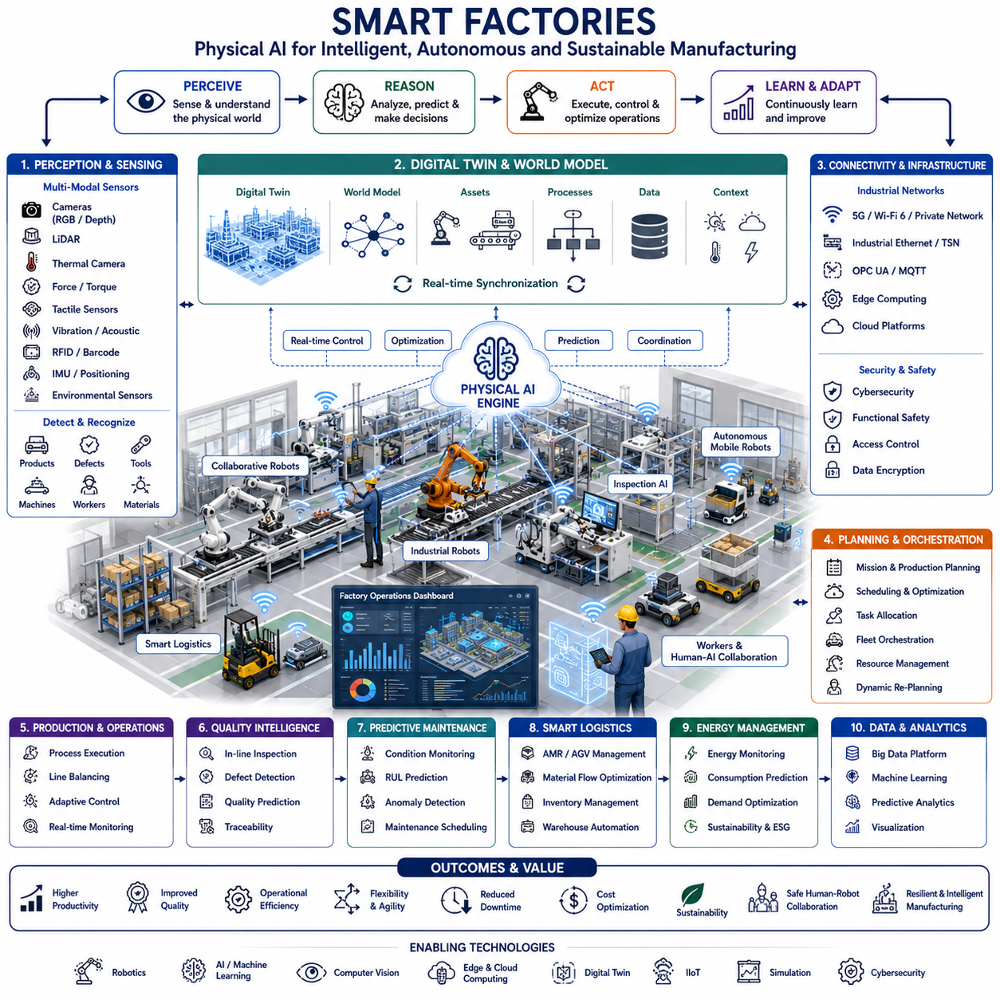
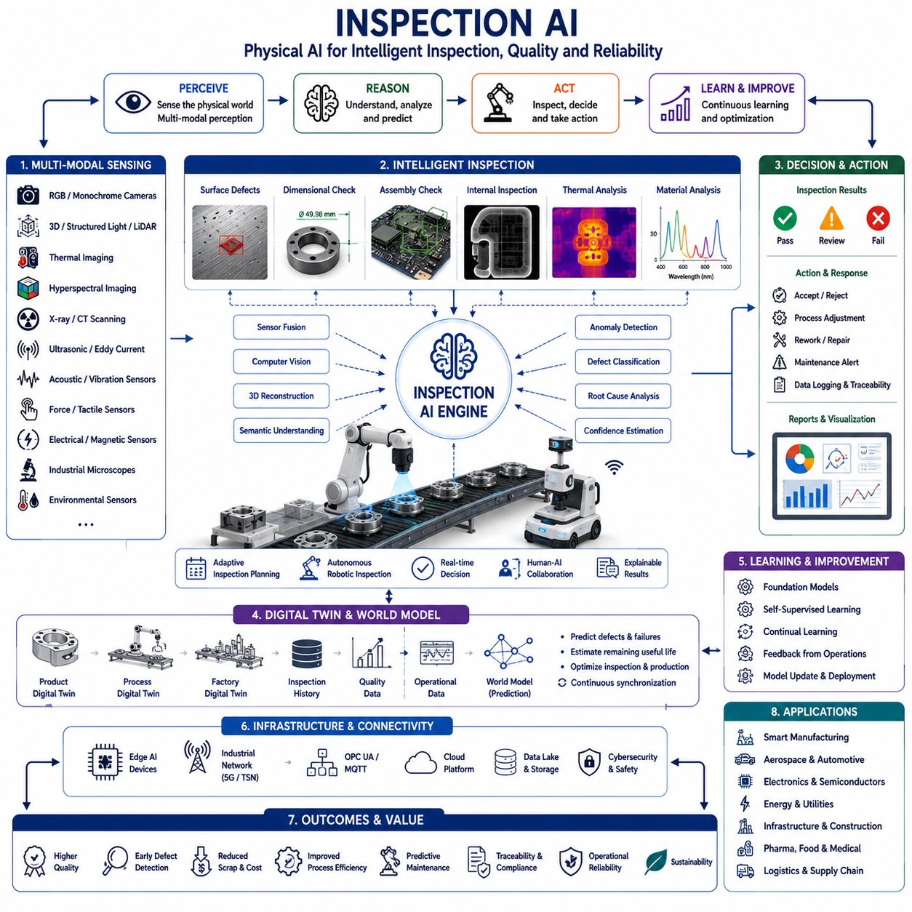
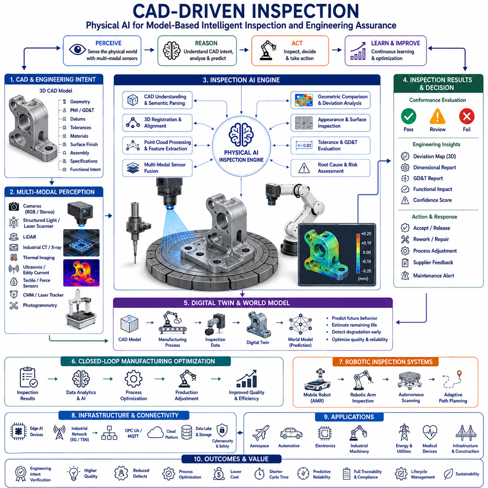
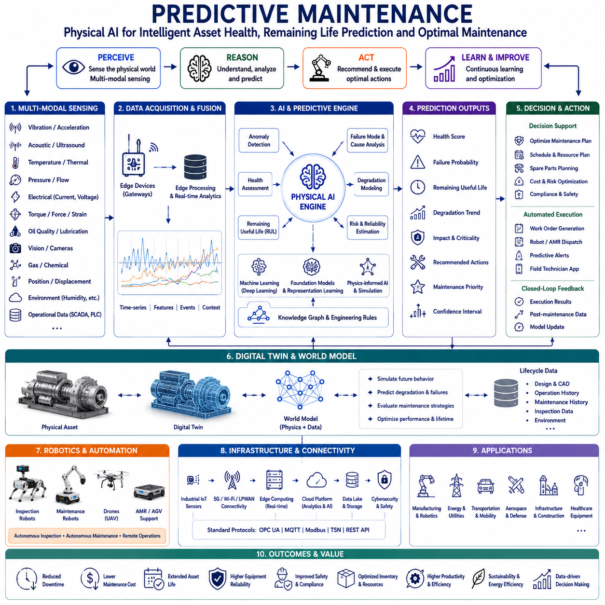
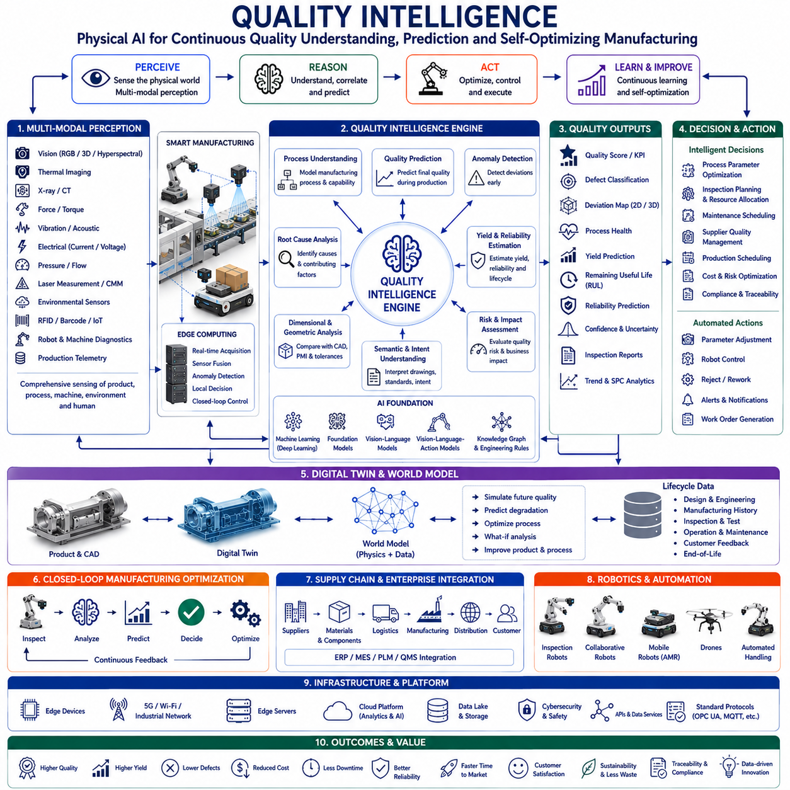
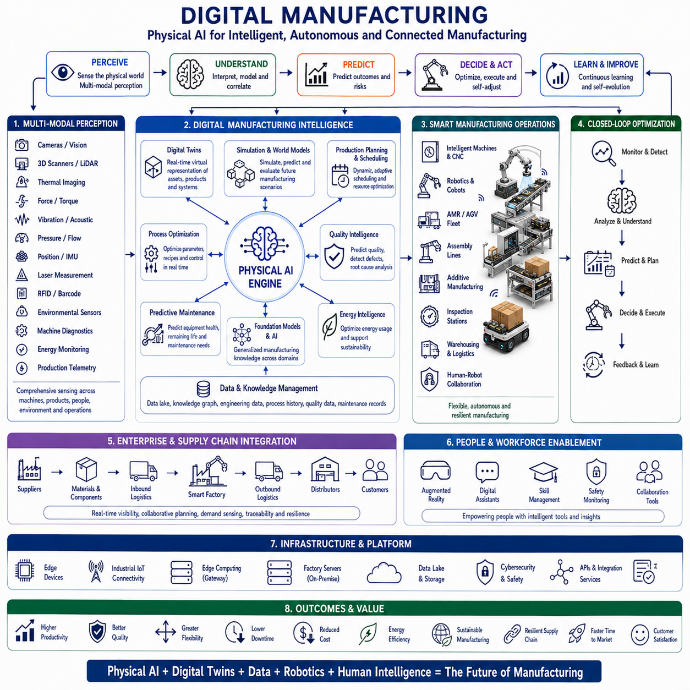
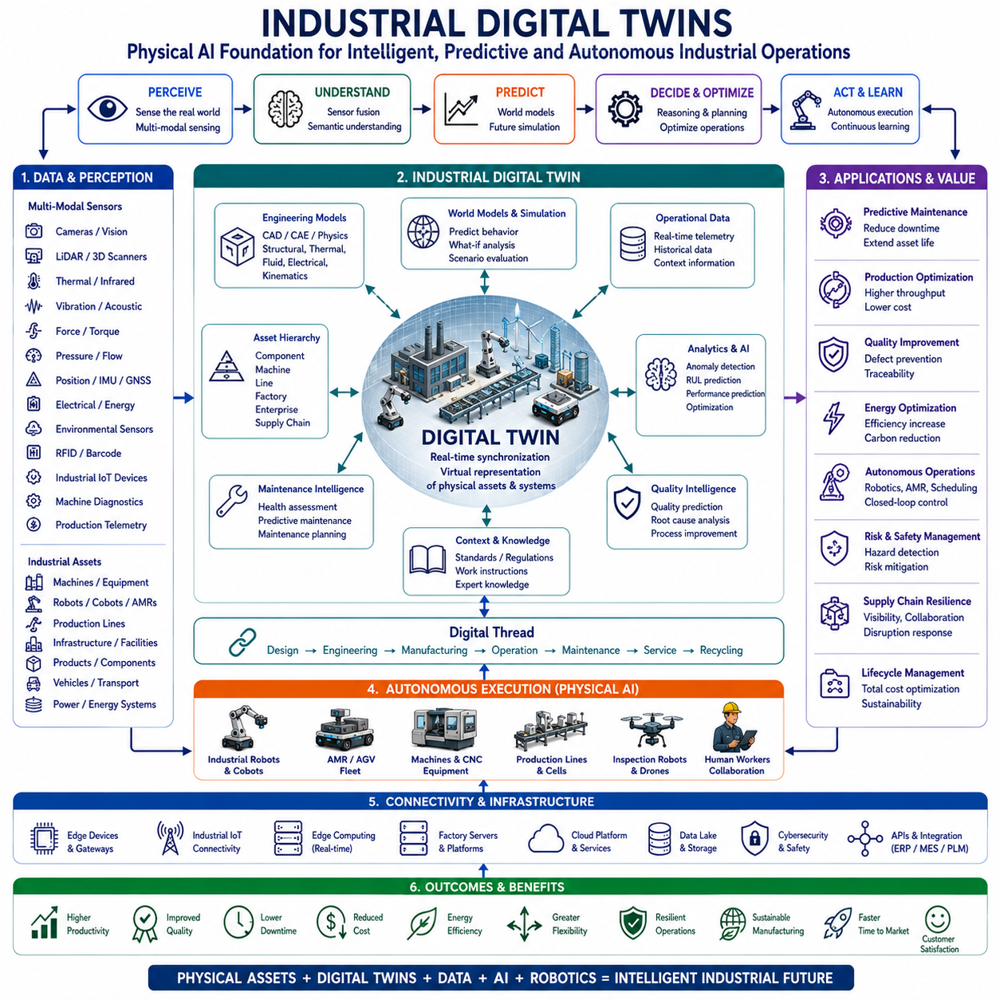
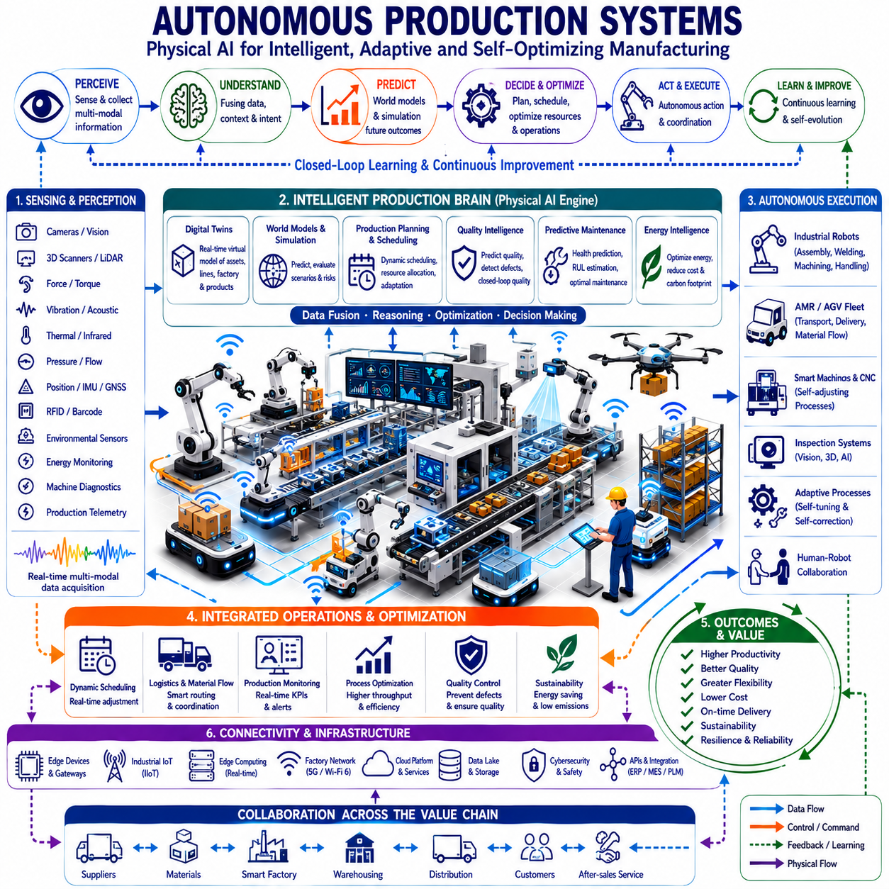

**Physical AI Engineering**


# Chapter 09 Industrial Physical AI 

##  

## 09-01 Smart Factories

{width="7.268055555555556in" height="7.268055555555556in"}

Smart Factories represent one of the most significant realizations of Physical AI in industrial environments, where intelligent machines, autonomous robots, advanced sensing systems, cyber-physical infrastructure, and artificial intelligence collaborate to create manufacturing systems capable of self-perception, self-optimization, and autonomous decision-making. Unlike conventional automated factories that rely on predefined production sequences and isolated programmable controllers, Smart Factories integrate distributed intelligence throughout every layer of manufacturing, allowing production systems to continuously understand their operational state, predict future conditions, coordinate resources, and adapt dynamically to changing customer demands. Within the Physical AI Engineering framework, Smart Factories transform manufacturing from deterministic automation into adaptive physical intelligence by combining robotics, AI, Digital Twins, Industrial Internet of Things, edge computing, cloud intelligence, and autonomous production orchestration into a unified cyber-physical manufacturing ecosystem.

Manufacturing has experienced several technological revolutions throughout history. The first industrial revolution introduced mechanization through steam power, enabling mass production beyond manual labor. The second revolution introduced electricity, assembly lines, and standardized manufacturing processes that dramatically increased productivity. The third revolution incorporated electronics, programmable logic controllers, industrial robots, and computer numerical control machines into automated production systems. The fourth industrial revolution, often referred to as Industry 4.0, integrated connectivity, Industrial Internet of Things, cloud computing, and artificial intelligence into manufacturing. Physical AI represents the next evolutionary stage, extending Industry 4.0 toward intelligent factories capable of autonomous reasoning, continuous learning, adaptive decision-making, and collaborative operation among humans, robots, and intelligent infrastructure.

The defining characteristic of Smart Factories is the continuous interaction between the physical manufacturing environment and intelligent digital systems. Every production asset becomes both a physical machine and an intelligent computational entity capable of sensing, reasoning, communicating, and adapting. Machines no longer execute isolated instructions but instead contribute to a distributed manufacturing intelligence where every robot, conveyor, inspection system, warehouse, logistics platform, and production line participates in collective operational optimization.

Perception forms the sensory foundation of Smart Factory intelligence. Modern manufacturing facilities deploy large numbers of RGB cameras, stereo cameras, depth cameras, LiDAR systems, thermal cameras, hyperspectral cameras, force sensors, torque sensors, tactile sensors, laser scanners, ultrasonic sensors, vibration sensors, acoustic sensors, RFID readers, barcode scanners, inertial sensors, environmental sensors, and machine health monitoring devices. These sensing technologies continuously observe products, equipment, workers, materials, tools, environmental conditions, and production activities. Physical AI transforms these heterogeneous sensor streams into comprehensive factory awareness capable of understanding not only object locations but also manufacturing context, process quality, machine conditions, operator activities, and production objectives.

Sensor fusion integrates observations from multiple sensing modalities into unified manufacturing world models. Computer vision identifies products, components, defects, tools, human operators, and robotic manipulators. Three-dimensional perception reconstructs workspaces and assembly stations with millimeter-level precision. Thermal imaging monitors welding quality, electrical equipment, motors, bearings, and overheating conditions. Force and torque sensing evaluate assembly quality, insertion operations, fastening processes, and robotic interaction forces. Acoustic sensing identifies machine anomalies through changes in operational sound signatures. Physical AI continuously combines these diverse information sources to maintain an accurate understanding of factory operations.

Localization within Smart Factories extends beyond robot positioning toward comprehensive spatial intelligence. Autonomous Mobile Robots, Automated Guided Vehicles, robotic manipulators, production equipment, inventory containers, pallets, tools, and even individual products maintain continuously updated spatial representations. Localization technologies combine LiDAR SLAM, Visual SLAM, Ultra-Wideband positioning, RFID localization, QR-code landmarks, inertial navigation, wheel odometry, industrial vision systems, and collaborative localization supported by intelligent infrastructure. Persistent spatial awareness enables efficient logistics, robotic coordination, dynamic scheduling, and safe human-robot collaboration throughout manufacturing facilities.

Semantic understanding enables Physical AI to interpret manufacturing environments according to functional meaning rather than visual appearance alone. Instead of simply recognizing objects, Smart Factory AI distinguishes workstations, assembly cells, production lines, quality inspection stations, logistics zones, storage areas, maintenance equipment, hazardous regions, emergency exits, collaborative workspaces, charging stations, and transportation corridors according to their operational roles. Products are understood not only as physical objects but also as manufacturing tasks progressing through production workflows.

Digital Twins serve as the central intelligence platform of Smart Factories. Every machine, robot, conveyor, production line, warehouse, product, worker, tooling system, utility network, and factory building maintains a continuously synchronized digital representation. Digital Twins integrate machine health, operational history, maintenance records, production schedules, quality measurements, energy consumption, inventory levels, environmental conditions, and business objectives into comprehensive cyber-physical manufacturing models. Physical AI continuously synchronizes sensor observations with Digital Twins, enabling predictive optimization across every manufacturing process.

World Models extend Digital Twins by enabling predictive reasoning about future manufacturing states. Rather than representing only the current factory condition, World Models simulate how production systems will evolve under different operational decisions. AI predicts machine utilization, bottleneck formation, inventory shortages, equipment failures, workforce availability, logistics congestion, quality trends, and energy consumption before they occur. These predictive capabilities allow manufacturing systems to proactively optimize operations rather than react to problems after they emerge.

Mission planning within Smart Factories coordinates complete manufacturing objectives instead of isolated machine operations. Customer orders are decomposed into production schedules, material requirements, robot assignments, inspection tasks, logistics operations, packaging processes, maintenance activities, and shipping plans. Physical AI continuously balances production throughput, quality, energy efficiency, equipment utilization, workforce allocation, and delivery commitments while adapting dynamically to unexpected disruptions. Mission planning spans multiple temporal scales, from millisecond robotic control to long-term production planning extending across weeks or months.

Task allocation becomes a distributed optimization problem involving heterogeneous manufacturing resources. Industrial robots, collaborative robots, mobile robots, machine tools, autonomous forklifts, warehouse automation systems, inspection stations, human operators, and logistics infrastructure continuously negotiate manufacturing responsibilities according to production priorities, equipment capability, maintenance status, energy availability, material flow, and workforce constraints. Multi-agent AI algorithms dynamically redistribute production tasks whenever operational conditions change, maximizing manufacturing flexibility while minimizing idle time and production delays.

Fleet orchestration extends beyond mobile robot coordination toward comprehensive production ecosystem management. Hundreds of intelligent manufacturing assets cooperate through distributed Physical AI architectures. Mobile robots transport materials, robotic manipulators perform assembly, collaborative robots assist workers, autonomous inspection systems verify product quality, warehouse robots manage inventory, and predictive maintenance systems schedule equipment servicing. Production orchestration continuously synchronizes these diverse resources to maintain balanced manufacturing operations despite changing demand and unexpected disruptions.

Motion planning remains essential within Smart Factories because robotic systems perform highly precise physical manipulation. Industrial manipulators generate collision-free trajectories while considering dynamic obstacles, neighboring robots, human workers, tooling constraints, payload characteristics, force control requirements, and cycle-time optimization. Mobile robots continuously plan efficient transportation routes through dynamic factory environments while coordinating with pedestrians, forklifts, and other autonomous vehicles. Physical AI integrates motion planning with production scheduling, enabling robotics to adapt seamlessly to changing manufacturing conditions.

Human-robot collaboration represents one of the defining characteristics of next-generation Smart Factories. Collaborative robots operate safely alongside human workers without physical barriers. Vision systems detect worker intentions, body posture, hand movements, and operational context. Force sensing enables compliant robotic interaction while adaptive safety algorithms continuously regulate robot speed, workspace boundaries, and operational behavior according to human proximity. Physical AI supports intuitive collaboration through natural language communication, gesture recognition, augmented reality guidance, and explainable robot behavior that allows human operators to understand AI decisions.

Quality assurance evolves from end-of-line inspection toward continuous quality intelligence integrated throughout manufacturing processes. Computer vision, three-dimensional scanning, laser measurement, hyperspectral imaging, X-ray inspection, ultrasonic testing, thermal analysis, and AI-based anomaly detection continuously evaluate products during every manufacturing stage. Instead of identifying defects after production completion, Physical AI predicts quality deviations before they occur by analyzing machine behavior, process parameters, environmental conditions, and material characteristics. Continuous quality intelligence minimizes waste while improving product consistency and customer satisfaction.

Predictive maintenance significantly enhances manufacturing reliability. Smart Factory equipment continuously generates telemetry describing vibration, temperature, electrical current, hydraulic pressure, lubrication quality, motor torque, actuator performance, tool wear, structural stress, and operational efficiency. Machine learning models analyze these data streams to estimate remaining useful life, predict component degradation, schedule maintenance proactively, and optimize spare parts inventory. Maintenance transitions from reactive repair toward predictive asset management, reducing downtime while maximizing equipment availability and operational efficiency.

Industrial logistics becomes fully autonomous within Smart Factories. Autonomous Mobile Robots, Automated Guided Vehicles, intelligent conveyors, robotic warehouses, automated storage and retrieval systems, palletizing robots, packaging systems, and inventory management platforms cooperate continuously to transport materials throughout manufacturing facilities. Physical AI dynamically adjusts logistics operations according to production demand, inventory status, equipment availability, transportation congestion, and customer priorities. Material flow becomes self-optimizing rather than predefined.

Energy management represents an increasingly important optimization objective as manufacturing facilities pursue sustainability. Smart Factories monitor electricity consumption, compressed air systems, heating and cooling infrastructure, renewable energy generation, battery storage, machine utilization, and utility demand continuously. Physical AI predicts future energy requirements while optimizing production schedules according to electricity prices, renewable energy availability, equipment efficiency, and carbon emission objectives. Manufacturing systems become energy-aware participants within broader intelligent energy ecosystems.

Communication infrastructure provides the nervous system connecting every manufacturing asset. Industrial Ethernet, Time Sensitive Networking, private 5G, Wi-Fi 6, OPC UA, MQTT, edge computing platforms, cloud services, and Industrial Internet of Things technologies enable deterministic real-time communication throughout production facilities. Machines exchange operational information continuously while maintaining low latency and high reliability required for industrial automation. Even when external connectivity becomes unavailable, local edge intelligence ensures uninterrupted manufacturing operation.

Cloud-edge computing architectures distribute computational intelligence according to operational requirements. Edge computers located near production equipment perform perception, robot control, motion planning, safety supervision, quality inspection, and machine monitoring with deterministic response times. Factory-level servers coordinate production scheduling, fleet orchestration, Digital Twin synchronization, and collaborative optimization. Cloud platforms execute enterprise resource planning integration, long-term production analytics, AI model training, predictive maintenance optimization, supplier coordination, and global manufacturing management. This hierarchical computational architecture balances local autonomy with enterprise-wide optimization.

Functional safety remains essential because intelligent factories combine powerful industrial machinery with human workers. Physical AI continuously monitors sensor reliability, robot positioning, machine health, emergency stop systems, workspace occupancy, communication integrity, and operational risk. Redundant sensing, safety-rated control systems, collaborative robot standards, emergency shutdown procedures, fail-operational architectures, and human override mechanisms ensure safe manufacturing under all operational conditions. Safety becomes dynamically adaptive rather than relying solely on fixed physical barriers.

Cybersecurity becomes increasingly important because Smart Factories connect operational technology with enterprise information systems and cloud infrastructure. Manufacturing equipment exchanges data with suppliers, customers, logistics providers, maintenance organizations, Digital Twin platforms, and enterprise resource planning systems. Secure communication protocols, authenticated software deployment, zero-trust architectures, encrypted industrial communication, trusted hardware, intrusion detection systems, and AI-assisted cybersecurity continuously protect manufacturing operations against cyber threats while preserving operational continuity.

Simulation and Digital Twins play indispensable roles throughout Smart Factory development and operation. Entire manufacturing facilities can be reproduced within high-fidelity virtual environments that simulate robots, machine tools, conveyors, logistics systems, production schedules, workforce activities, energy consumption, maintenance operations, and supply chain interactions. Engineers evaluate production strategies, robot programming, facility layouts, scheduling algorithms, maintenance policies, quality control procedures, and emergency scenarios before implementation. Simulation-to-Reality methodologies accelerate AI deployment while reducing commissioning cost and operational risk.

Foundation Models, Vision-Language Models, Vision-Language-Action architectures, World Models, and Generative AI are fundamentally transforming industrial manufacturing. Future Smart Factories will understand natural language production instructions, interpret engineering drawings, analyze CAD models, generate robot programs automatically, explain manufacturing decisions, learn new assembly procedures through demonstration, optimize production strategies continuously, and collaborate naturally with engineers, operators, and management personnel. Persistent World Models will enable manufacturing systems to anticipate market demand, equipment degradation, material shortages, supplier disruptions, workforce requirements, and customer priorities before they impact production.

The future evolution of Smart Factories extends beyond isolated manufacturing facilities toward globally connected intelligent industrial ecosystems. Factories, suppliers, warehouses, logistics centers, transportation systems, energy infrastructure, maintenance providers, recycling facilities, and customers will operate through synchronized Digital Twins supported by distributed Physical AI platforms. Manufacturing becomes an adaptive network where every participant contributes to collective optimization across entire industrial supply chains rather than individual production facilities.

Smart Factories therefore represent far more than automated manufacturing. They embody the convergence of robotics, artificial intelligence, cyber-physical systems, Digital Twins, Industrial Internet of Things, distributed computing, predictive analytics, intelligent infrastructure, advanced manufacturing, and human-centered engineering into a unified Physical AI platform capable of transforming industrial production. As Physical AI continues to evolve, Smart Factories will deliver unprecedented levels of productivity, flexibility, quality, sustainability, resilience, operational intelligence, and autonomous decision-making, becoming one of the foundational technologies supporting the next generation of intelligent manufacturing and global industrial transformation.

스마트 팩토리(Smart Factories)는 물리적 AI(Physical AI)가 산업 환경에서 가장 대표적으로 구현되는 응용 분야 가운데 하나이다. 스마트 팩토리는 지능형 기계(Intelligent Machines), 자율 로봇(Autonomous Robots), 첨단 센서 시스템(Advanced Sensing Systems), 사이버-물리 인프라(Cyber-Physical Infrastructure), 인공지능(Artificial Intelligence)이 유기적으로 협력하여 스스로 인식(Self-Perception), 스스로 최적화(Self-Optimization), 스스로 의사결정(Autonomous Decision-Making)을 수행하는 제조 시스템을 구현한다. 기존의 자동화 공장이 미리 정의된 생산 순서와 개별적인 제어기(Programmable Logic Controller, PLC)에 의존하였다면, 스마트 팩토리는 제조 공장의 모든 계층에 분산형 지능(Distributed Intelligence)을 배치하여 생산 시스템이 자신의 상태를 지속적으로 이해하고, 미래를 예측하며, 자원을 스스로 조정하고, 고객 요구 변화에 따라 실시간으로 적응하도록 만든다. Physical AI Engineering 관점에서 스마트 팩토리는 로보틱스(Robotics), 인공지능(AI), 디지털 트윈(Digital Twin), 산업용 사물인터넷(Industrial Internet of Things, IIoT), 엣지 컴퓨팅(Edge Computing), 클라우드 지능(Cloud Intelligence), 자율 생산 오케스트레이션(Autonomous Production Orchestration)을 하나의 통합된 사이버-물리 제조 생태계(Cyber-Physical Manufacturing Ecosystem)로 결합하여 기존의 자동화를 지능형 제조로 발전시키는 핵심 기술이다.

제조 산업은 여러 차례의 산업혁명을 거치며 발전해 왔다. 제1차 산업혁명은 증기기관을 이용한 기계화를 통해 대량생산의 기반을 마련하였다. 제2차 산업혁명은 전기(Electricity)와 조립라인(Assembly Line)을 도입하여 생산성을 획기적으로 향상시켰다. 제3차 산업혁명에서는 전자제어(Electronics), PLC, 산업용 로봇(Industrial Robot), CNC(Computer Numerical Control) 장비가 자동화를 실현하였다. 제4차 산업혁명(Industry 4.0)은 산업용 사물인터넷, 클라우드 컴퓨팅, 인공지능을 제조 시스템과 연결하였다. 물리적 AI는 이러한 Industry 4.0을 더욱 발전시켜 공장이 스스로 추론하고, 지속적으로 학습하며, 환경 변화에 적응하고, 사람과 로봇이 함께 협력하는 차세대 제조 시스템을 구현한다.

스마트 팩토리의 가장 중요한 특징은 현실의 제조 환경과 디지털 지능 시스템이 끊임없이 상호작용한다는 점이다. 모든 생산 설비는 단순한 기계가 아니라 센싱(Sensing), 추론(Reasoning), 통신(Communication), 적응(Adaptation)이 가능한 지능형 컴퓨팅 객체가 된다. 각각의 기계는 독립적으로 동작하는 것이 아니라 공장 전체의 분산형 제조 지능(Distributed Manufacturing Intelligence)에 참여하여 로봇, 컨베이어, 검사 시스템, 창고, 물류 플랫폼, 생산 라인이 공동으로 최적화를 수행한다.

인지(Perception)는 스마트 팩토리의 감각기관이다. 현대 제조 공장에는 RGB 카메라(Camera), 스테레오 카메라(Stereo Camera), 깊이 카메라(Depth Camera), 라이다(LiDAR), 열화상 카메라(Thermal Camera), 하이퍼스펙트럴 카메라(Hyperspectral Camera), 힘 센서(Force Sensor), 토크 센서(Torque Sensor), 촉각 센서(Tactile Sensor), 레이저 스캐너(Laser Scanner), 초음파 센서(Ultrasonic Sensor), 진동 센서(Vibration Sensor), 음향 센서(Acoustic Sensor), RFID 리더(RFID Reader), 바코드 스캐너(Barcode Scanner), IMU, 환경 센서(Environmental Sensor), 장비 상태 모니터링 센서(Machine Health Monitoring Device) 등이 설치된다. 이러한 센서는 제품, 부품, 장비, 작업자, 자재, 공구, 생산 공정을 지속적으로 감시한다. 물리적 AI는 다양한 센서 데이터를 통합하여 제품 위치뿐 아니라 제조 상황, 공정 품질, 장비 상태, 작업자의 작업 내용, 생산 목표까지 이해한다.

센서 융합(Sensor Fusion)은 여러 센서의 정보를 하나의 제조 세계 모델(Manufacturing World Model)로 통합한다. 컴퓨터 비전(Computer Vision)은 제품, 부품, 결함, 공구, 작업자, 로봇을 인식하며, 3차원 인지(3D Perception)는 작업 공간을 밀리미터 수준으로 재구성한다. 열화상은 용접 품질, 전기 장비, 모터, 베어링의 과열 상태를 감시한다. 힘 및 토크 센서는 조립 상태, 삽입 작업, 체결 품질을 평가한다. 음향 분석은 기계 소리의 변화를 이용하여 이상 상태를 조기에 발견한다. 물리적 AI는 이러한 다양한 센서 정보를 결합하여 공장 전체를 정확하게 이해한다.

위치추정(Localization)은 로봇의 위치만 계산하는 것이 아니라 공장 전체의 공간 지능(Spatial Intelligence)을 구축한다. 자율 이동 로봇(AMR), 무인 운반 차량(Automated Guided Vehicle, AGV), 산업용 로봇, 생산 설비, 팔레트, 공구, 제품 모두가 실시간 위치 정보를 가진다. 위치추정은 LiDAR SLAM, Visual SLAM, UWB(Ultra-Wideband), RFID 위치추정, QR 코드 마커, 관성항법(Inertial Navigation), 휠 오도메트리(Wheel Odometry), 산업용 비전 시스템, 협력형 위치추정(Cooperative Localization)을 이용하여 수행된다. 이러한 공간 정보는 물류 최적화, 로봇 협업, 생산 스케줄링, 사람과 로봇의 안전한 협업을 가능하게 한다.

의미 기반 이해(Semantic Understanding)는 단순히 객체를 인식하는 것을 넘어 제조 환경의 의미를 이해한다. AI는 작업 셀(Work Cell), 조립 공정(Assembly Cell), 생산 라인, 검사 공정, 물류 구역, 창고, 유지보수 공간, 위험 구역, 비상구, 협업 공간, 충전소 등을 각각의 기능에 따라 이해한다. 또한 제품 역시 단순한 물체가 아니라 제조 공정의 어느 단계에 있는지를 포함한 생산 흐름(Process Flow)의 일부로 인식한다.

디지털 트윈(Digital Twin)은 스마트 팩토리의 핵심 운영 플랫폼이다. 모든 기계, 로봇, 컨베이어, 생산 라인, 창고, 제품, 작업자, 공구, 유틸리티 설비는 현실과 동기화된 디지털 객체를 가진다. 디지털 트윈은 장비 상태, 운영 이력, 유지보수 기록, 생산 일정, 품질 데이터, 에너지 소비, 재고 수준, 환경 상태를 지속적으로 관리한다. 물리적 AI는 센서 데이터를 디지털 트윈과 실시간으로 동기화하여 공장 전체를 최적화한다.

세계 모델(World Model)은 디지털 트윈을 더욱 발전시킨 개념이다. 현재 상태를 표현하는 것을 넘어 미래의 제조 환경을 예측한다. AI는 장비 가동률, 병목 현상(Bottleneck), 재고 부족, 장비 고장, 작업 인력 부족, 물류 혼잡, 품질 변화, 에너지 소비를 사전에 예측한다. 이를 통해 문제가 발생한 이후 대응하는 것이 아니라 문제가 발생하기 전에 선제적으로 최적화를 수행할 수 있다.

미션 계획(Mission Planning)은 개별 장비의 작업이 아니라 전체 생산 목표를 관리한다. 고객 주문은 생산 일정, 자재 계획, 로봇 작업, 검사 계획, 물류 이동, 포장, 유지보수, 출하 계획으로 자동 분해된다. 물리적 AI는 생산량, 품질, 에너지 효율, 장비 활용률, 작업자 배치, 납기 일정을 동시에 고려하여 생산을 최적화하며, 예상하지 못한 상황이 발생하면 즉시 새로운 계획을 생성한다. 이러한 계획은 밀리초 단위의 로봇 제어부터 수주 또는 수개월에 걸친 생산 계획까지 모두 포함한다.

작업 할당(Task Allocation)은 다양한 제조 자원을 대상으로 하는 분산 최적화 문제이다. 산업용 로봇, 협동 로봇(Collaborative Robot), 자율 이동 로봇, 공작기계(Machine Tool), 자율 지게차, 자동 창고, 검사 장비, 작업자가 생산 우선순위, 장비 성능, 유지보수 상태, 에너지 상황, 자재 흐름을 고려하여 작업을 나누어 수행한다. 멀티 에이전트 AI(Multi-Agent AI)는 환경 변화에 따라 작업을 실시간으로 재배치하여 생산 효율을 극대화한다.

플릿 관리(Fleet Orchestration)는 이동 로봇만 관리하는 것이 아니라 공장 전체의 생산 생태계를 관리한다. 자율 이동 로봇은 자재를 운반하고, 산업용 로봇은 조립을 수행하며, 협동 로봇은 작업자를 지원하고, 자동 검사 장비는 품질을 확인하며, 창고 로봇은 재고를 관리하고, 예측 유지보수 시스템은 장비 정비를 수행한다. 생산 오케스트레이션은 이러한 모든 시스템을 하나의 플랫폼에서 조정하여 변화하는 생산 요구에도 안정적인 제조를 유지한다.

경로 계획(Motion Planning)은 정밀한 제조 작업을 위해 필수적인 기술이다. 산업용 로봇은 충돌을 피하면서 최적의 작업 경로를 생성하고, 주변 로봇, 작업자, 공구, 부품을 고려하여 움직인다. 자율 이동 로봇은 사람과 지게차, 다른 로봇이 함께 존재하는 환경에서도 효율적인 이동 경로를 지속적으로 계산한다. 물리적 AI는 이러한 경로 계획을 생산 일정과 통합하여 제조 공정 전체를 최적화한다.

사람과 로봇의 협업(Human-Robot Collaboration)은 차세대 스마트 팩토리의 핵심이다. 협동 로봇은 안전 펜스 없이 사람과 함께 작업한다. 비전 시스템은 작업자의 자세, 손 움직임, 작업 의도를 인식하며, 힘 센서는 안전한 접촉을 보장한다. 물리적 AI는 작업자의 위치에 따라 로봇 속도를 조절하고, 작업 공간을 동적으로 변경하며, 자연어 대화(Natural Language Communication), 제스처 인식(Gesture Recognition), 증강현실(Augmented Reality), 설명 가능한 AI(Explainable AI)를 이용하여 직관적인 협업 환경을 제공한다.

품질 관리(Quality Assurance)는 최종 검사 중심에서 공정 전체의 품질 지능(Quality Intelligence)으로 발전한다. 컴퓨터 비전, 3차원 스캐닝(3D Scanning), 레이저 측정(Laser Measurement), 하이퍼스펙트럴 영상(Hyperspectral Imaging), X-ray 검사, 초음파 검사(Ultrasonic Testing), 열화상 분석, AI 기반 이상 탐지(Anomaly Detection)가 모든 생산 단계에서 제품 품질을 평가한다. 물리적 AI는 장비 상태, 공정 변수, 환경 조건, 자재 특성을 분석하여 불량이 발생하기 전에 품질 문제를 예측하고 수정한다.

예측 유지보수(Predictive Maintenance)는 공장의 가동률을 크게 향상시킨다. 장비는 진동, 온도, 전류, 유압, 윤활 상태, 모터 토크, 공구 마모, 구조 응력 등을 지속적으로 측정한다. 머신러닝은 이러한 데이터를 분석하여 잔여 수명(Remaining Useful Life)을 예측하고, 부품이 고장 나기 전에 유지보수를 수행한다. 유지보수는 고장 후 수리 방식에서 예측 기반 자산 관리(Predictive Asset Management) 방식으로 전환된다.

산업 물류(Industrial Logistics)는 완전 자율화된다. AMR, AGV, 지능형 컨베이어, 자동 창고(Automated Storage and Retrieval System), 팔레타이징 로봇(Palletizing Robot), 포장 시스템이 협력하여 공장 내부의 자재를 자동으로 이동시킨다. 물리적 AI는 생산 수요, 재고, 장비 상태, 물류 혼잡도를 고려하여 자재 흐름(Material Flow)을 스스로 최적화한다.

에너지 관리(Energy Management)는 지속 가능한 제조(Sustainable Manufacturing)를 위한 핵심 요소이다. 스마트 팩토리는 전력 소비, 압축공기 시스템, 냉난방 설비, 재생에너지, 배터리 저장장치, 장비 가동률을 지속적으로 모니터링한다. 물리적 AI는 전기요금, 재생에너지 발전량, 장비 효율, 탄소 배출량을 고려하여 생산 계획을 최적화하고 에너지 사용을 최소화한다.

통신 인프라(Communication Infrastructure)는 공장의 신경망 역할을 수행한다. 산업용 이더넷(Industrial Ethernet), TSN(Time Sensitive Networking), 전용 5G, Wi-Fi 6, OPC UA, MQTT, 엣지 컴퓨팅, 클라우드 서비스, IIoT 기술을 이용하여 모든 장비가 실시간으로 데이터를 교환한다. 외부 통신이 끊기더라도 엣지 AI가 생산을 지속할 수 있도록 설계된다.

클라우드-엣지 컴퓨팅(Cloud-Edge Computing)은 연산을 계층적으로 분산한다. 엣지 컴퓨터는 로봇 제어, 인지, 품질 검사, 안전 감시를 수행하고, 공장 서버는 생산 스케줄링, 플릿 관리, 디지털 트윈을 운영한다. 클라우드는 ERP(Enterprise Resource Planning) 연동, 장기 생산 분석, AI 모델 학습, 공급망 관리, 글로벌 제조 운영을 담당한다. 이러한 구조는 실시간성과 공장 전체 최적화를 동시에 달성한다.

기능 안전(Functional Safety)은 스마트 팩토리에서 매우 중요하다. 물리적 AI는 센서 신뢰도, 로봇 위치, 장비 상태, 비상 정지(Emergency Stop), 작업 공간, 통신 상태를 지속적으로 감시한다. 중복 센서(Redundant Sensor), 안전 등급 제어(Safety-Rated Control), 협동 로봇 안전 규격, 비상 정지 절차, Fail-Operational 구조, 사람 우선 제어(Human Override)를 통해 안전한 제조 환경을 유지한다.

사이버 보안(Cybersecurity)은 공장 운영 기술(Operational Technology)과 기업 정보 시스템이 연결되면서 더욱 중요해지고 있다. 제조 장비는 공급업체, 고객, 물류 시스템, 유지보수 기관, 디지털 트윈 플랫폼, ERP와 지속적으로 데이터를 교환한다. 암호화 통신, 인증(Authentication), 제로 트러스트(Zero Trust), 신뢰 가능한 하드웨어(Trusted Hardware), 침입 탐지(Intrusion Detection), AI 기반 보안을 통해 생산 시스템을 보호한다.

시뮬레이션(Simulation)과 디지털 트윈은 스마트 팩토리 구축의 핵심 기술이다. 공장 전체를 가상환경에서 재현하여 로봇, 생산 설비, 물류, 작업자, 에너지 소비, 공급망까지 모두 시뮬레이션할 수 있다. 이를 통해 생산 전략, 로봇 프로그램, 설비 배치(Layout), 생산 스케줄, 유지보수 정책, 품질 관리, 비상 대응을 실제 적용 전에 검증할 수 있다. 시뮬레이션-현실 전이(Sim-to-Real)는 AI 개발 기간을 단축하고 구축 위험을 줄여준다.

파운데이션 모델(Foundation Model), 비전-언어 모델(Vision-Language Model), 비전-언어-행동 모델(Vision-Language-Action Model), 세계 모델(World Model), 생성형 AI(Generative AI)는 제조 산업을 근본적으로 변화시키고 있다. 미래의 스마트 팩토리는 자연어 생산 지시를 이해하고, CAD 모델과 설계 도면을 해석하며, 로봇 프로그램을 자동 생성하고, 생산 의사결정을 설명하며, 시범 작업을 통해 새로운 조립 공정을 학습하고, 지속적으로 생산 전략을 최적화하게 된다. 또한 세계 모델은 시장 수요, 장비 노후화, 자재 부족, 공급망 문제, 작업자 요구사항을 미리 예측하여 생산에 반영하게 된다.

미래의 스마트 팩토리는 개별 공장을 넘어 전 세계의 공장, 협력업체, 창고, 물류센터, 운송 시스템, 에너지 인프라, 유지보수 업체, 재활용 시설, 고객을 하나의 디지털 트윈으로 연결하는 지능형 산업 생태계(Intelligent Industrial Ecosystem)로 발전하게 된다. 제조는 개별 공장의 최적화가 아니라 공급망(Supply Chain) 전체의 공동 최적화(Cooperative Optimization)를 수행하는 방향으로 변화할 것이다.

결국 스마트 팩토리는 단순한 자동화 공장이 아니다. 이는 로보틱스(Robotics), 인공지능(Artificial Intelligence), 사이버-물리 시스템(Cyber-Physical System), 디지털 트윈(Digital Twin), 산업용 사물인터넷(Industrial Internet of Things), 분산 컴퓨팅(Distributed Computing), 예측 분석(Predictive Analytics), 지능형 인프라(Intelligent Infrastructure), 첨단 제조(Advanced Manufacturing), 인간 중심 공학(Human-Centered Engineering)이 하나의 통합된 물리적 AI 플랫폼으로 융합된 형태이다. 물리적 AI 기술이 지속적으로 발전함에 따라 스마트 팩토리는 이전에는 경험하지 못했던 수준의 생산성(Productivity), 유연성(Flexibility), 품질(Quality), 지속가능성(Sustainability), 회복력(Resilience), 운영 지능(Operational Intelligence), 자율 의사결정(Autonomous Decision-Making)을 제공하게 될 것이며, 차세대 지능형 제조(Intelligent Manufacturing)와 글로벌 산업 혁신(Global Industrial Transformation)을 실현하는 핵심 기반 기술이 될 것이다.

##  

## 09-02 Inspection AI

{width="7.268055555555556in" height="7.268055555555556in"}

Inspection AI represents one of the most valuable application domains of Physical AI because it enables intelligent systems to perceive, analyze, evaluate, and continuously improve the quality, safety, and reliability of physical products, industrial assets, and manufacturing processes. Unlike traditional machine vision systems that rely on manually engineered rules, threshold-based image processing, or isolated inspection algorithms, Inspection AI combines multimodal perception, foundation models, deep learning, world modeling, Digital Twins, predictive analytics, and autonomous reasoning to create intelligent inspection systems capable of understanding physical objects, manufacturing intent, operational context, and long-term asset conditions. Within the Physical AI Engineering framework, Inspection AI transforms quality control from simple defect detection into continuous physical intelligence capable of autonomous inspection, predictive diagnosis, adaptive learning, and collaborative decision-making across entire industrial ecosystems.

Industrial inspection has evolved through several generations of technological development. Early inspection relied entirely on human visual examination, where experienced operators manually identified defects according to established quality standards. Although human inspectors possess remarkable adaptability and contextual reasoning, manual inspection suffers from fatigue, inconsistency, limited throughput, subjective judgment, and increasing labor shortages. The next generation introduced rule-based machine vision systems using image processing algorithms, geometric measurements, edge detection, template matching, and predefined thresholds. While these systems improved consistency, they remained highly sensitive to illumination changes, product variations, and unforeseen defect patterns. Deep learning significantly expanded inspection capability by enabling convolutional neural networks to recognize complex visual features directly from large datasets. Physical AI represents the next evolutionary stage by integrating perception, reasoning, predictive understanding, Digital Twins, multimodal sensing, foundation models, and autonomous decision-making into comprehensive intelligent inspection platforms.

The primary objective of Inspection AI extends beyond identifying defective products. Intelligent inspection seeks to understand why defects occur, predict future failures, optimize manufacturing processes, estimate product reliability, support maintenance decisions, improve production efficiency, and continuously learn from operational experience. Inspection therefore becomes an active participant within intelligent manufacturing rather than a passive quality verification process.

Perception forms the sensory foundation of Inspection AI. Modern inspection systems integrate RGB cameras, monochrome cameras, stereo vision, structured light scanners, laser profilers, LiDAR, hyperspectral cameras, thermal imaging systems, X-ray imaging, computed tomography scanners, ultrasonic sensors, eddy current sensors, acoustic sensors, force sensors, tactile sensors, vibration sensors, infrared sensors, ultraviolet imaging, magnetic field sensors, optical coherence tomography, and industrial microscopes. Each sensing modality contributes complementary information describing geometry, surface condition, internal structure, thermal behavior, electrical characteristics, mechanical integrity, and material composition. Physical AI combines these heterogeneous observations into unified representations of inspected objects.

Computer vision remains the central sensing modality for many industrial inspection tasks. High-resolution cameras continuously examine products, components, assemblies, tools, packaging, welds, electronic circuits, mechanical parts, and manufactured surfaces. Modern vision models recognize scratches, cracks, dents, contamination, missing components, dimensional deviations, assembly errors, corrosion, discoloration, deformation, surface roughness, coating defects, printing errors, and numerous other quality issues. Rather than merely classifying products as acceptable or defective, Physical AI generates semantic understanding of defect characteristics, manufacturing context, severity, probable root causes, and downstream operational implications.

Three-dimensional perception significantly enhances inspection capability. Structured light systems, laser triangulation, LiDAR, stereo vision, and photogrammetry reconstruct accurate geometric models of inspected objects with sub-millimeter precision. Three-dimensional inspection identifies dimensional inaccuracies, assembly misalignment, warpage, surface deformation, volumetric defects, clearance violations, and geometric tolerances that cannot be observed reliably through two-dimensional imaging alone. Physical AI integrates three-dimensional geometry with semantic reasoning, enabling comprehensive evaluation of structural integrity and manufacturing quality.

Thermal inspection expands perception beyond visible appearance by analyzing heat distribution throughout physical systems. Thermal cameras identify overheating electrical components, excessive bearing friction, poor weld quality, insulation failures, electronic hotspots, battery anomalies, fluid leakage, manufacturing inconsistencies, and abnormal energy dissipation. Because thermal behavior often changes before visible defects emerge, Physical AI uses thermal perception as an early indicator of developing equipment failures or manufacturing process deviations.

Hyperspectral imaging enables material-level understanding by measuring reflected light across hundreds of spectral wavelengths. Unlike conventional RGB imaging, hyperspectral systems identify chemical composition, coating thickness, contamination, moisture content, material degradation, pharmaceutical consistency, food quality, agricultural conditions, composite material integrity, and semiconductor characteristics. Physical AI combines spectral analysis with visual appearance to create richer representations supporting highly accurate industrial inspection.

X-ray imaging and computed tomography extend inspection into internal object structures that remain invisible externally. Weld integrity, casting defects, electronic solder joints, battery cell construction, additive manufacturing porosity, composite material delamination, internal cracks, void formation, and structural inclusions become observable through volumetric imaging. Physical AI analyzes three-dimensional internal structures automatically while correlating internal defects with external manufacturing conditions and future operational reliability.

Sensor fusion integrates heterogeneous inspection modalities into unified world representations. Visual appearance, geometry, thermal behavior, acoustic signatures, material properties, vibration characteristics, electrical measurements, and manufacturing metadata collectively describe inspected products. Physical AI reasons across these multimodal observations simultaneously, significantly improving robustness compared with isolated sensing systems. Multimodal reasoning enables AI to distinguish genuine defects from harmless variations while reducing false positives and false negatives.

Semantic understanding transforms inspection from pattern recognition into manufacturing intelligence. Rather than detecting isolated visual anomalies, Physical AI understands products according to engineering function, assembly sequence, production history, intended operational behavior, quality requirements, customer specifications, and manufacturing context. A surface irregularity may be acceptable for one product but unacceptable for another depending upon engineering intent. Semantic reasoning allows Inspection AI to evaluate defects according to functional significance instead of appearance alone.

Digital Twins provide persistent digital representations of inspected products throughout their lifecycle. Every manufactured component, production batch, machine tool, inspection station, assembly operation, and quality measurement contributes continuously to synchronized Digital Twins. Inspection results become permanently associated with manufacturing history, supplier information, process parameters, maintenance records, operational performance, warranty data, and field reliability. Physical AI analyzes these interconnected Digital Twins to discover relationships between manufacturing conditions and long-term product performance.

World Models extend Digital Twins by predicting future product behavior. Rather than evaluating only current quality, Physical AI estimates remaining useful life, fatigue development, structural degradation, wear progression, corrosion evolution, battery aging, thermal stability, and future maintenance requirements. Inspection therefore transitions from quality verification toward predictive engineering intelligence supporting entire product lifecycles.

Anomaly detection represents one of the most important capabilities of Inspection AI. Conventional inspection systems require extensive examples of every possible defect category, which becomes impractical for rare failures. Self-supervised learning, unsupervised learning, representation learning, autoencoders, diffusion models, generative adversarial networks, and foundation models instead learn normal product characteristics directly from large collections of acceptable products. Deviations from learned normality automatically indicate potential anomalies, enabling detection of previously unseen defect categories without explicit supervision.

Foundation Models fundamentally redefine industrial inspection by learning universal visual representations spanning multiple manufacturing domains. Rather than training separate inspection models for every product line, foundation models generalize across automotive manufacturing, semiconductor fabrication, electronics assembly, pharmaceutical production, food processing, aerospace components, battery manufacturing, medical devices, steel production, additive manufacturing, and consumer products. Fine-tuning adapts pretrained knowledge rapidly to new industrial applications while requiring significantly fewer labeled samples.

Vision-Language Models further enhance inspection capability by integrating natural language reasoning with visual understanding. Engineers may describe inspection objectives using ordinary language while AI interprets engineering drawings, manufacturing instructions, quality specifications, maintenance manuals, and regulatory documents simultaneously. Inspection results become explainable through natural language reports describing observed defects, probable causes, engineering implications, recommended corrective actions, and confidence estimates.

Vision-Language-Action Models extend perception into autonomous physical inspection. Intelligent robotic inspection systems navigate manufacturing facilities, position sensors automatically, manipulate cameras, adjust illumination, perform measurement sequences, inspect difficult-to-access regions, and collaborate safely with human inspectors. Physical AI integrates perception with robotic manipulation, enabling adaptive inspection strategies optimized according to observed conditions rather than fixed inspection routines.

Inspection planning evolves from predefined inspection sequences toward adaptive decision-making. Physical AI continuously determines which products require additional inspection, selects appropriate sensing modalities, adjusts inspection resolution, modifies camera viewpoints, allocates robotic inspection resources, prioritizes high-risk components, and optimizes inspection throughput according to manufacturing conditions, quality trends, customer requirements, and operational constraints.

Autonomous inspection robots increasingly replace fixed inspection stations within modern manufacturing. Mobile robots carrying cameras, LiDAR systems, thermal sensors, ultrasonic equipment, and robotic manipulators inspect production lines, warehouses, pipelines, bridges, wind turbines, aircraft, ships, railway infrastructure, offshore platforms, electrical substations, solar farms, and industrial facilities. Physical AI enables these robots to navigate autonomously while adapting inspection procedures according to observed environmental conditions and inspection objectives.

Collaborative human-AI inspection remains essential because many industrial decisions require engineering expertise. Physical AI supports inspectors rather than replacing them entirely. AI highlights suspicious regions, explains reasoning, estimates confidence, retrieves similar historical cases, recommends corrective actions, and generates comprehensive inspection documentation while human engineers perform final verification whenever necessary. Explainable AI increases trust, improves productivity, and accelerates knowledge transfer across inspection teams.

Predictive maintenance depends heavily upon continuous intelligent inspection. Inspection AI monitors equipment health by analyzing vibration, temperature, acoustic emissions, lubrication quality, electrical signatures, structural deformation, corrosion progression, fatigue accumulation, and operational performance continuously. Machine learning predicts remaining useful life, identifies emerging failure mechanisms, estimates maintenance urgency, and optimizes spare parts logistics. Maintenance therefore shifts from scheduled servicing toward condition-based intelligent asset management.

Inspection AI contributes directly to closed-loop manufacturing optimization. Inspection results automatically influence upstream production processes by adjusting machining parameters, robotic assembly trajectories, welding conditions, additive manufacturing settings, material selection, process temperatures, tool replacement schedules, and equipment calibration. Physical AI establishes continuous feedback loops connecting quality measurement with autonomous production optimization.

Industrial logistics also benefits from intelligent inspection. Incoming materials, supplier components, inventory conditions, warehouse environments, packaging integrity, transportation damage, and shipping quality are inspected continuously throughout supply chains. Physical AI ensures quality consistency from raw materials through final customer delivery while enabling complete product traceability across global manufacturing networks.

Energy infrastructure increasingly employs Inspection AI for asset reliability. Wind turbines, photovoltaic systems, transformers, substations, power transmission lines, batteries, fuel cells, pipelines, and industrial utilities undergo autonomous inspection using drones, climbing robots, mobile robots, and intelligent sensing platforms. Continuous inspection significantly improves infrastructure availability while reducing maintenance cost and preventing catastrophic failures.

Communication infrastructure connects distributed inspection systems across manufacturing enterprises. Industrial Ethernet, Time Sensitive Networking, OPC UA, MQTT, private 5G, edge computing, Industrial Internet of Things platforms, cloud computing, and Digital Twin synchronization enable continuous information sharing among inspection stations, production equipment, maintenance systems, enterprise resource planning platforms, suppliers, and customers. Edge intelligence performs real-time inspection while cloud platforms support long-term analytics, model training, and enterprise optimization.

Cloud-edge computing architectures distribute computational responsibilities according to latency requirements. Edge AI performs image acquisition, defect detection, robotic control, sensor fusion, and immediate quality decisions near production equipment. Factory servers coordinate inspection scheduling, Digital Twin synchronization, fleet management, and quality analytics. Cloud platforms perform foundation model training, enterprise-wide optimization, predictive analytics, supplier collaboration, regulatory compliance, and knowledge sharing across multiple manufacturing sites.

Functional safety remains essential whenever Inspection AI operates alongside industrial robots or directly influences manufacturing decisions. Safety architectures continuously verify sensor integrity, inspection confidence, robot positioning, communication reliability, computational correctness, and operational risk before permitting autonomous production decisions. Redundant sensing, fail-safe architectures, independent verification channels, and human supervisory intervention ensure reliable industrial operation under all conditions.

Cybersecurity protects Inspection AI because quality data, Digital Twins, manufacturing processes, and intellectual property represent highly valuable industrial assets. Secure communication, authenticated model deployment, encrypted inspection records, trusted hardware, zero-trust architectures, intrusion detection, anomaly monitoring, and AI-assisted cybersecurity collectively preserve manufacturing integrity while protecting sensitive industrial knowledge.

Simulation and Digital Twins significantly accelerate development of intelligent inspection systems. Virtual factories reproduce cameras, sensors, robots, lighting conditions, products, manufacturing processes, defects, environmental variations, and operational workflows with high realism. Synthetic data generation, domain randomization, Sim-to-Real transfer, reinforcement learning, and virtual validation reduce annotation effort while improving inspection robustness before physical deployment.

The future evolution of Inspection AI extends beyond isolated quality control toward globally connected industrial intelligence. Manufacturing facilities, suppliers, logistics providers, maintenance organizations, customers, recycling systems, and engineering services will share synchronized Digital Twins supported by Physical AI. Inspection knowledge accumulated throughout entire product lifecycles continuously improves design quality, manufacturing efficiency, operational reliability, sustainability, and customer satisfaction.

Inspection AI therefore represents far more than automated defect detection. It embodies the convergence of computer vision, robotics, artificial intelligence, Digital Twins, multimodal sensing, foundation models, predictive analytics, cyber-physical systems, advanced manufacturing, and human-centered engineering into a unified Physical AI platform capable of understanding, evaluating, predicting, and continuously improving physical products throughout their complete lifecycle. As Physical AI continues to evolve, Inspection AI will become one of the foundational technologies supporting autonomous manufacturing, intelligent infrastructure, predictive maintenance, resilient supply chains, sustainable industrial production, and the next generation of globally connected intelligent factories.

검사 AI(Inspection AI)는 물리적 AI(Physical AI)의 가장 가치 있는 응용 분야 가운데 하나로, 지능형 시스템이 물리적 제품, 산업 설비, 제조 공정의 품질(Quality), 안전성(Safety), 신뢰성(Reliability)을 스스로 인식하고 분석하며 평가하고 지속적으로 향상시킬 수 있도록 한다. 기존의 머신 비전(Machine Vision) 시스템은 사람이 설계한 규칙(Rule-Based Algorithm), 임계값 기반 영상 처리(Threshold-Based Image Processing), 또는 독립적인 검사 알고리즘에 의존하였다. 반면 검사 AI는 다중 모달 인지(Multimodal Perception), 파운데이션 모델(Foundation Model), 딥러닝(Deep Learning), 세계 모델(World Model), 디지털 트윈(Digital Twin), 예측 분석(Predictive Analytics), 자율 추론(Autonomous Reasoning)을 통합하여 제품의 형상뿐 아니라 제조 의도(Manufacturing Intent), 공정 상황(Operational Context), 장기적인 자산 상태(Long-Term Asset Condition)까지 이해하는 지능형 검사 시스템을 구축한다. Physical AI Engineering 관점에서 검사 AI는 단순한 불량 검출(Defect Detection)을 넘어 자율 검사(Autonomous Inspection), 예측 진단(Predictive Diagnosis), 적응형 학습(Adaptive Learning), 협업 의사결정(Collaborative Decision-Making)을 수행하는 연속적인 물리적 지능으로 발전한다.

산업 검사 기술은 여러 세대를 거쳐 발전하였다. 초기에는 숙련된 작업자가 육안으로 제품을 검사하는 방식이 사용되었다. 사람은 높은 적응력과 상황 판단 능력을 가지고 있지만, 피로(Fatigue), 검사 편차(Inconsistency), 처리 속도의 한계, 주관적인 판단, 숙련 인력 부족 등의 문제가 존재하였다. 이후 영상 처리(Image Processing), 에지 검출(Edge Detection), 템플릿 매칭(Template Matching), 기하학적 측정(Geometric Measurement) 등을 이용한 규칙 기반 머신 비전이 등장하였다. 이러한 시스템은 일관성은 향상시켰지만 조명 변화, 제품 편차, 새로운 불량 유형에는 매우 취약하였다. 이후 딥러닝이 도입되면서 CNN(Convolutional Neural Network)이 복잡한 특징을 자동으로 학습하여 검사 성능이 크게 향상되었다. 물리적 AI는 여기에 인지, 추론, 예측, 디지털 트윈, 다중 센서, 파운데이션 모델, 자율 의사결정을 통합하여 차세대 지능형 검사 시스템으로 발전시키고 있다.

검사 AI의 궁극적인 목적은 단순히 불량품을 찾아내는 것이 아니다. 지능형 검사는 불량이 발생한 원인을 이해하고, 미래의 고장을 예측하며, 제조 공정을 최적화하고, 제품의 신뢰성을 평가하며, 유지보수 의사결정을 지원하고, 생산성을 향상시키며, 운영 경험을 지속적으로 학습하는 것을 목표로 한다. 즉, 검사는 생산이 끝난 후 수행되는 독립적인 품질 확인이 아니라 제조 시스템 전체를 지속적으로 개선하는 핵심 요소가 된다.

인지(Perception)는 검사 AI의 감각기관이다. 현대의 검사 시스템은 RGB 카메라(Camera), 흑백 카메라(Monochrome Camera), 스테레오 비전(Stereo Vision), 구조광 스캐너(Structured Light Scanner), 레이저 프로파일러(Laser Profiler), 라이다(LiDAR), 하이퍼스펙트럴 카메라(Hyperspectral Camera), 열화상 카메라(Thermal Camera), X-ray 영상(X-ray Imaging), 컴퓨터 단층촬영(Computed Tomography, CT), 초음파 센서(Ultrasonic Sensor), 와전류 센서(Eddy Current Sensor), 음향 센서(Acoustic Sensor), 힘 센서(Force Sensor), 촉각 센서(Tactile Sensor), 진동 센서(Vibration Sensor), 적외선 센서(Infrared Sensor), 자외선 영상(Ultraviolet Imaging), 자기장 센서(Magnetic Field Sensor), 광간섭 단층촬영(Optical Coherence Tomography), 산업용 현미경(Industrial Microscope) 등을 활용한다. 각각의 센서는 형상(Geometry), 표면 상태(Surface Condition), 내부 구조(Internal Structure), 열 특성(Thermal Behavior), 전기적 특성(Electrical Characteristics), 기계적 건전성(Mechanical Integrity), 재료 특성(Material Composition)에 대한 정보를 제공한다. 물리적 AI는 이러한 다양한 센서 정보를 하나의 통합된 객체 표현으로 결합한다.

컴퓨터 비전(Computer Vision)은 산업 검사에서 가장 핵심적인 센서 기술이다. 고해상도 카메라는 제품, 부품, 조립 상태, 공구, 포장, 용접부, 전자 회로, 기계 부품, 표면 상태를 지속적으로 검사한다. 최신 비전 모델은 스크래치(Scratch), 균열(Crack), 찌그러짐(Dent), 오염(Contamination), 부품 누락(Missing Component), 치수 오차(Dimensional Deviation), 조립 오류(Assembly Error), 부식(Corrosion), 변색(Discoloration), 변형(Deformation), 표면 거칠기(Surface Roughness), 도장 불량(Coating Defect), 인쇄 오류(Printing Error) 등 다양한 결함을 자동으로 인식한다. 물리적 AI는 단순히 양품과 불량품을 구분하는 것이 아니라 결함의 종류, 심각도, 발생 원인, 향후 제품 성능에 미치는 영향까지 의미적으로 이해한다.

3차원 인지(Three-Dimensional Perception)는 검사 능력을 크게 향상시킨다. 구조광, 레이저 삼각측량(Laser Triangulation), 라이다, 스테레오 비전, 사진측량(Photogrammetry)은 밀리미터 이하의 정밀도로 제품의 3차원 형상을 재구성한다. 이를 통해 치수 오차, 조립 위치 불일치, 뒤틀림(Warpage), 형상 변형, 체적 결함(Volumetric Defect), 간섭(Clearance Violation), 기하 공차(Geometric Tolerance)를 2차원 영상만으로는 확인하기 어려운 수준까지 검사할 수 있다. 물리적 AI는 이러한 3차원 정보를 의미 기반 추론과 결합하여 제품의 구조적 건전성을 종합적으로 평가한다.

열화상 검사(Thermal Inspection)는 제품의 외형을 넘어 열 분포를 분석한다. 열화상 카메라는 과열된 전기 부품, 베어링 마찰, 용접 불량, 절연 파손, 전자회로 발열, 배터리 이상, 유체 누설, 제조 공정의 불균일성을 탐지한다. 열 특성은 육안으로 보이는 결함보다 먼저 이상을 나타내는 경우가 많기 때문에 물리적 AI는 열 정보를 조기 고장 예측(Early Failure Prediction)에 적극 활용한다.

하이퍼스펙트럴 영상(Hyperspectral Imaging)은 수백 개의 파장을 분석하여 재료 자체를 이해한다. 일반 RGB 카메라와 달리 화학 성분, 코팅 두께, 오염 물질, 수분 함량, 재료 열화, 의약품 품질, 식품 상태, 농산물 품질, 복합재 상태, 반도체 특성 등을 분석할 수 있다. 물리적 AI는 스펙트럼 정보와 시각 정보를 결합하여 더욱 높은 검사 정확도를 달성한다.

X-ray 영상과 컴퓨터 단층촬영(CT)은 제품 내부를 검사한다. 용접부 내부 결함, 주조 기공(Casting Defect), 전자기판 납땜(Solder Joint), 배터리 셀 구조, 적층 제조(Additive Manufacturing) 기공(Porosity), 복합재 박리(Delamination), 내부 균열, 공극(Void), 이물질(Inclusion)을 자동으로 분석한다. 물리적 AI는 내부 구조와 외부 제조 조건을 함께 분석하여 제품의 장기적인 신뢰성까지 예측한다.

센서 융합(Sensor Fusion)은 시각 정보, 형상 정보, 열 정보, 음향 정보, 재료 정보, 진동 정보, 전기적 측정값, 제조 이력을 하나의 통합된 세계 모델로 결합한다. 물리적 AI는 여러 센서를 동시에 해석하여 단일 센서보다 훨씬 높은 신뢰성과 정확도를 제공한다. 또한 다양한 센서를 함께 활용함으로써 오검출(False Positive)과 미검출(False Negative)을 크게 줄일 수 있다.

의미 기반 이해(Semantic Understanding)는 검사 AI를 단순한 패턴 인식에서 제조 지능으로 발전시킨다. 물리적 AI는 제품의 외형뿐 아니라 제품의 기능(Function), 조립 순서(Assembly Sequence), 제조 이력(Production History), 설계 의도(Engineering Intent), 품질 기준(Quality Requirement), 고객 요구사항(Customer Specification), 제조 공정까지 함께 이해한다. 동일한 표면 결함이라도 제품에 따라 허용 여부가 달라질 수 있으며, AI는 이러한 공학적 의미를 고려하여 판단한다.

디지털 트윈(Digital Twin)은 검사 결과를 제품의 전체 생애주기(Lifecycle)와 연결한다. 모든 부품, 생산 배치(Batch), 장비, 검사 결과, 공정 정보는 하나의 디지털 트윈에 저장된다. 검사 데이터는 제조 이력, 공급업체 정보, 공정 변수, 유지보수 기록, 현장 운용 데이터(Field Data), 보증 정보(Warranty Data)와 연결되어 장기적인 품질 분석에 활용된다.

세계 모델(World Model)은 디지털 트윈을 기반으로 미래를 예측한다. 현재의 품질만 평가하는 것이 아니라 잔여 수명(Remaining Useful Life), 피로(Fatigue), 마모(Wear), 부식(Corrosion), 배터리 열화(Battery Aging), 열 안정성(Thermal Stability), 향후 유지보수 시기를 예측한다. 따라서 검사는 단순한 품질 확인이 아니라 예측 기반 엔지니어링(Predictive Engineering)으로 발전한다.

이상 탐지(Anomaly Detection)는 검사 AI의 핵심 기술 가운데 하나이다. 기존 검사 시스템은 모든 불량 사례를 학습해야 했지만, 실제 산업에서는 희귀 결함(Rare Failure)을 충분히 확보하기 어렵다. 자기지도학습(Self-Supervised Learning), 비지도학습(Unsupervised Learning), 표현학습(Representation Learning), 오토인코더(Autoencoder), 확산 모델(Diffusion Model), 생성적 적대 신경망(Generative Adversarial Network, GAN), 파운데이션 모델은 정상 제품만 학습하여 새로운 이상을 자동으로 탐지할 수 있다. 따라서 이전에 존재하지 않았던 새로운 불량도 효과적으로 검출할 수 있다.

파운데이션 모델(Foundation Model)은 산업 검사 방식을 근본적으로 변화시키고 있다. 자동차, 반도체, 전자제품, 의약품, 식품, 항공우주, 배터리, 의료기기, 철강, 적층 제조 등 다양한 제조 분야에서 공통적으로 활용 가능한 시각 표현을 학습한다. 새로운 제품은 소량의 데이터만으로도 빠르게 적응(Fine-Tuning)할 수 있어 데이터 구축 비용을 크게 줄일 수 있다.

비전-언어 모델(Vision-Language Model)은 자연어와 영상을 함께 이해한다. 엔지니어는 자연어로 검사 목표를 설명할 수 있으며, AI는 설계 도면, 제조 지침, 품질 규격, 유지보수 매뉴얼을 함께 해석한다. 검사 결과는 발견된 결함, 원인, 영향, 개선 방안을 사람이 이해하기 쉬운 자연어 보고서로 자동 생성된다.

비전-언어-행동 모델(Vision-Language-Action Model)은 검사 AI를 실제 로봇과 연결한다. 지능형 검사 로봇은 스스로 이동하고, 카메라 위치를 조정하며, 조명을 변경하고, 측정 순서를 최적화하며, 접근하기 어려운 영역까지 검사한다. 물리적 AI는 검사 결과에 따라 검사 전략 자체를 실시간으로 변경할 수 있다.

검사 계획(Inspection Planning)은 미리 정해진 절차를 수행하는 것이 아니라 상황에 따라 스스로 결정된다. 물리적 AI는 어떤 제품을 추가 검사할 것인지, 어떤 센서를 사용할 것인지, 어느 위치에서 검사할 것인지, 검사 해상도를 얼마나 높일 것인지, 어떤 로봇을 사용할 것인지를 실시간으로 판단한다.

자율 검사 로봇(Autonomous Inspection Robot)은 고정형 검사 설비를 점차 대체하고 있다. 이동형 로봇은 카메라, 라이다, 열화상, 초음파 장비, 로봇 팔을 이용하여 생산 라인, 창고, 파이프라인, 교량, 풍력 발전기, 항공기, 선박, 철도, 해양 플랫폼, 변전소, 태양광 발전소 등을 자율적으로 검사한다. 물리적 AI는 검사 환경에 따라 검사 절차를 스스로 변경한다.

사람과 AI의 협업(Human-AI Collaboration)은 앞으로도 매우 중요하다. AI는 의심되는 영역을 표시하고, 판단 근거를 설명하며, 과거 유사 사례를 검색하고, 개선 방법을 제안하고, 검사 보고서를 자동 생성한다. 최종 판단은 필요한 경우 엔지니어가 수행하며, 설명 가능한 AI(Explainable AI)는 검사 결과에 대한 신뢰성을 높이고 숙련자의 지식을 빠르게 전수하는 역할을 수행한다.

예측 유지보수(Predictive Maintenance)는 검사 AI와 밀접하게 연결된다. 검사 AI는 진동, 온도, 음향, 윤활 상태, 전기 신호, 구조 변형, 부식, 피로를 지속적으로 분석하여 장비의 잔여 수명과 고장 가능성을 예측한다. 이를 통해 유지보수는 정기 점검 중심에서 상태 기반 유지보수(Condition-Based Maintenance)로 전환된다.

검사 AI는 폐쇄형 제조 최적화(Closed-Loop Manufacturing Optimization)를 실현한다. 검사 결과는 즉시 가공 조건, 로봇 경로, 용접 조건, 적층 제조 변수, 재료 선택, 공구 교환 시기, 장비 보정값에 반영된다. 즉, 품질 검사 결과가 생산 공정을 자동으로 개선하는 피드백 루프(Feedback Loop)를 형성한다.

산업 물류(Industrial Logistics)에서도 검사 AI는 중요한 역할을 한다. 입고 자재, 공급업체 부품, 창고 상태, 포장 품질, 운송 손상, 출하 품질을 지속적으로 검사하여 원재료부터 고객에게 전달되는 전 과정의 품질을 보장하고 완전한 제품 이력 관리(Product Traceability)를 지원한다.

에너지 인프라(Energy Infrastructure) 역시 검사 AI의 중요한 응용 분야이다. 풍력 발전기(Wind Turbine), 태양광 발전소(Photovoltaic System), 변압기(Transformer), 변전소(Substation), 송전선(Power Transmission Line), 배터리(Battery), 연료전지(Fuel Cell), 파이프라인(Pipeline)은 드론, 이동 로봇, 벽면 검사 로봇 등을 이용하여 지속적으로 검사된다. 이를 통해 설비의 가동률을 높이고 유지보수 비용을 절감하며 대형 사고를 예방할 수 있다.

통신 인프라(Communication Infrastructure)는 분산된 검사 시스템을 하나로 연결한다. 산업용 이더넷(Industrial Ethernet), TSN(Time Sensitive Networking), OPC UA, MQTT, 전용 5G, 엣지 컴퓨팅, IIoT, 클라우드, 디지털 트윈 동기화를 이용하여 검사 장비, 생산 설비, 유지보수 시스템, ERP, 공급업체, 고객이 실시간으로 정보를 공유한다. 엣지 AI는 실시간 검사를 수행하고, 클라우드는 장기 분석과 AI 모델 학습을 담당한다.

클라우드-엣지 컴퓨팅(Cloud-Edge Computing)은 연산을 효율적으로 분산한다. 엣지 AI는 영상 획득, 불량 검출, 로봇 제어, 센서 융합, 실시간 품질 판정을 수행하며, 공장 서버는 검사 일정, 디지털 트윈, 품질 분석을 담당한다. 클라우드는 파운데이션 모델 학습, 기업 전체 최적화, 예측 분석, 공급망 협업, 품질 지식 공유를 수행한다.

기능 안전(Functional Safety)은 검사 AI가 로봇과 함께 동작하거나 생산을 직접 제어하는 경우 매우 중요하다. 시스템은 센서 상태, 검사 신뢰도, 로봇 위치, 통신 상태, 계산 결과를 지속적으로 검증하며, 중복 센서, Fail-Safe 구조, 독립 검증 시스템, 사람의 감독(Human Supervisory Intervention)을 통해 안전성을 확보한다.

사이버 보안(Cybersecurity)은 검사 데이터와 디지털 트윈, 제조 공정, 산업 지식재산(Intellectual Property)을 보호하기 위해 필수적이다. 암호화 통신, 인증된 AI 모델 배포(Authenticated Model Deployment), 암호화된 검사 데이터, 신뢰 가능한 하드웨어, 제로 트러스트 보안 구조, 침입 탐지, AI 기반 보안 기술을 통해 제조 시스템을 보호한다.

시뮬레이션(Simulation)과 디지털 트윈은 검사 AI 개발을 크게 가속화한다. 가상 공장은 카메라, 센서, 로봇, 조명, 제품, 제조 공정, 결함, 환경 변화를 현실과 유사하게 재현한다. 합성 데이터(Synthetic Data), 도메인 랜덤화(Domain Randomization), 시뮬레이션-현실 전이(Sim-to-Real), 강화학습(Reinforcement Learning)을 이용하여 실제 데이터를 최소화하면서도 높은 성능의 검사 AI를 개발할 수 있다.

미래의 검사 AI는 개별 공장의 품질 관리 수준을 넘어 전 세계의 제조사, 공급업체, 물류회사, 유지보수 업체, 고객, 재활용 시스템, 엔지니어링 서비스가 하나의 디지털 트윈을 공유하는 글로벌 산업 지능(Global Industrial Intelligence)으로 발전하게 된다. 제품의 전체 생애주기에서 축적되는 검사 지식은 설계 품질, 제조 효율, 운영 신뢰성, 지속가능성, 고객 만족도를 지속적으로 향상시키게 된다.

결국 검사 AI는 단순한 자동 불량 검출 기술이 아니다. 이는 컴퓨터 비전(Computer Vision), 로보틱스(Robotics), 인공지능(Artificial Intelligence), 디지털 트윈(Digital Twin), 다중 모달 센싱(Multimodal Sensing), 파운데이션 모델(Foundation Model), 예측 분석(Predictive Analytics), 사이버-물리 시스템(Cyber-Physical System), 첨단 제조(Advanced Manufacturing), 인간 중심 공학(Human-Centered Engineering)이 하나의 통합된 물리적 AI 플랫폼으로 융합된 형태이다. 물리적 AI 기술이 지속적으로 발전함에 따라 검사 AI는 자율 제조(Autonomous Manufacturing), 지능형 인프라(Intelligent Infrastructure), 예측 유지보수(Predictive Maintenance), 회복력 있는 공급망(Resilient Supply Chain), 지속 가능한 산업 생산(Sustainable Industrial Production), 그리고 차세대 글로벌 지능형 공장(Global Intelligent Factory)을 구현하는 핵심 기반 기술로 자리매김하게 될 것이다.

##  

## 09-03 CAD-Driven Inspection

{width="7.268055555555556in" height="7.268055555555556in"}

CAD-Driven Inspection represents one of the most advanced application domains of Physical AI, where intelligent inspection systems utilize engineering design data as the primary source of semantic knowledge rather than relying solely on sensor observations. Unlike conventional vision inspection systems that compare captured images against predefined templates or manually labeled datasets, CAD-Driven Inspection integrates Computer-Aided Design models, Product Manufacturing Information (PMI), Digital Twins, physics-based simulation, multimodal perception, and artificial intelligence into a unified inspection framework capable of understanding the engineering intent behind every manufactured component. Within the Physical AI Engineering framework, CAD-Driven Inspection transforms inspection from image-based defect detection into model-based engineering intelligence that continuously verifies whether physical products conform to their intended digital definitions throughout the entire manufacturing lifecycle.

Traditional industrial inspection has historically depended upon reference images, manually selected features, dimensional gauges, coordinate measuring machines, or operator expertise. Although these methods remain valuable for many applications, they often evaluate only visible product characteristics without fully understanding why particular dimensions, tolerances, surface finishes, assembly relationships, or geometric constraints are important. A CAD model, however, contains the complete engineering definition of a product, including geometry, functional surfaces, assembly interfaces, material specifications, tolerance requirements, manufacturing constraints, and design intent. Physical AI leverages this rich engineering knowledge to perform inspection with significantly greater intelligence than conventional machine vision systems.

The digital transformation of manufacturing has fundamentally changed how products are designed, manufactured, assembled, and maintained. Modern engineering workflows originate with three-dimensional CAD models that describe products long before physical manufacturing begins. These models subsequently generate simulation data, manufacturing programs, robotic trajectories, tooling definitions, process planning, quality requirements, Digital Twins, and lifecycle management information. CAD-Driven Inspection extends this digital continuity by making the original engineering model the reference for all inspection activities rather than creating separate inspection datasets disconnected from design knowledge.

The central concept of CAD-Driven Inspection is that inspection should evaluate engineering intent instead of merely recognizing visual appearance. Physical AI understands that every geometric feature exists for functional reasons. Holes provide mechanical fastening. Flat surfaces establish assembly references. Welds transfer structural loads. Electrical connectors require precise alignment. Bearing seats require dimensional precision. Surface finishes influence friction and fatigue performance. Consequently, inspection becomes a process of verifying engineering functionality rather than simply detecting image anomalies.

Perception remains the sensory foundation of CAD-Driven Inspection. Modern inspection systems employ RGB cameras, stereo vision, structured light scanners, laser profile sensors, LiDAR, industrial computed tomography, X-ray imaging, hyperspectral cameras, thermal imaging systems, ultrasonic sensors, force sensors, tactile probes, coordinate measuring machines, laser trackers, photogrammetry systems, and robotic vision platforms. Each sensing modality contributes complementary information describing geometry, material characteristics, thermal behavior, internal structures, assembly conditions, and dimensional accuracy. Physical AI fuses these heterogeneous observations into comprehensive digital representations directly comparable with CAD geometry.

Three-dimensional perception plays a particularly important role because CAD models inherently represent products in three-dimensional space. Structured light scanning, laser triangulation, photogrammetry, LiDAR, stereo vision, and industrial CT generate dense point clouds describing physical object geometry. Registration algorithms align measured point clouds with corresponding CAD models using iterative closest point methods, feature-based matching, semantic correspondence estimation, or AI-assisted geometric alignment. Once alignment is established, Physical AI performs comprehensive geometric comparison between measured products and intended design geometry.

Point cloud processing becomes a fundamental capability within CAD-Driven Inspection. Raw point clouds undergo filtering, segmentation, feature extraction, normal estimation, mesh reconstruction, semantic labeling, and geometric simplification before comparison against engineering models. Physical AI identifies critical functional regions, assembly interfaces, free-form surfaces, machined features, holes, slots, edges, fillets, chamfers, and reference datums automatically. Semantic understanding significantly improves registration accuracy while reducing computational complexity during inspection.

Computer vision complements three-dimensional inspection by analyzing appearance-related characteristics that CAD geometry alone cannot represent. Surface scratches, discoloration, contamination, coating defects, welding quality, printed markings, labels, corrosion, foreign objects, assembly completeness, cable routing, adhesive application, seal integrity, and cosmetic defects require visual analysis beyond geometric comparison. Physical AI combines visual understanding with geometric verification, creating comprehensive inspection systems capable of evaluating both engineering functionality and product appearance simultaneously.

Semantic understanding distinguishes CAD-Driven Inspection from conventional dimensional metrology. Physical AI interprets engineering drawings, geometric dimensioning and tolerancing specifications, Product Manufacturing Information, assembly documentation, manufacturing instructions, and functional requirements. AI understands why specific tolerances exist, how components interact mechanically, which dimensions influence product performance, and which deviations represent genuine engineering risks. Inspection decisions therefore become functionally meaningful rather than purely geometric.

Product Manufacturing Information serves as a rich source of engineering semantics. Modern CAD models increasingly embed dimensional tolerances, geometric tolerances, datum references, material specifications, surface finish requirements, welding symbols, manufacturing notes, assembly constraints, inspection procedures, and quality standards directly within digital product definitions. Physical AI automatically extracts this information to guide inspection planning, sensor selection, measurement resolution, feature prioritization, and quality assessment without requiring extensive manual programming.

Digital Twins provide persistent lifecycle representations connecting CAD models with manufacturing, inspection, maintenance, and operational performance. Every manufactured component maintains continuous synchronization between engineering design, production history, inspection measurements, assembly records, operational telemetry, maintenance activities, warranty information, and end-of-life recycling data. CAD-Driven Inspection contributes continuously updated measurement data to Digital Twins, enabling lifecycle quality intelligence extending far beyond manufacturing completion.

World Models expand Digital Twins by enabling predictive engineering reasoning. Instead of merely verifying dimensional conformance, Physical AI predicts fatigue development, stress concentration, thermal deformation, wear progression, structural degradation, assembly reliability, vibration behavior, and expected service life directly from measured deviations relative to CAD geometry. Inspection evolves from dimensional verification toward predictive engineering analysis supporting long-term product reliability.

Simulation becomes deeply integrated with CAD-Driven Inspection. Finite Element Analysis, Computational Fluid Dynamics, multibody dynamics, thermal simulation, electromagnetic analysis, manufacturing simulation, and robotic simulation all originate from CAD models. Physical AI compares measured geometry against simulation predictions to determine whether observed manufacturing deviations significantly influence structural integrity, thermal performance, aerodynamic efficiency, vibration characteristics, or functional behavior. Inspection therefore incorporates engineering simulation rather than relying solely upon dimensional measurements.

Foundation Models significantly enhance CAD understanding by learning universal geometric representations across multiple engineering domains. Rather than training inspection systems separately for automotive components, aerospace structures, semiconductor equipment, medical devices, consumer electronics, industrial machinery, or additive manufacturing, Foundation Models develop transferable geometric reasoning capable of generalizing across diverse product categories. Fine-tuning rapidly adapts pretrained knowledge to new engineering applications while reducing annotation requirements.

Vision-Language Models introduce natural language understanding into CAD-Driven Inspection. Engineers interact with inspection systems using ordinary engineering terminology instead of specialized programming languages. AI interprets engineering drawings, manufacturing documentation, inspection procedures, assembly manuals, regulatory standards, maintenance records, and customer specifications while simultaneously analyzing sensor observations and CAD geometry. Inspection reports become automatically generated engineering documents describing measured deviations, probable causes, functional implications, recommended corrective actions, and confidence assessments using professional engineering language.

Vision-Language-Action Models extend CAD reasoning into autonomous robotic inspection. Intelligent inspection robots receive CAD models directly, identify critical inspection locations automatically, generate optimized scanning trajectories, position sensors adaptively, manipulate cameras or laser scanners, and inspect inaccessible regions without extensive manual programming. Physical AI integrates engineering understanding with robotic autonomy, enabling flexible inspection of highly variable products and manufacturing environments.

Inspection planning becomes knowledge-driven rather than manually programmed. CAD models define functional surfaces, critical dimensions, assembly interfaces, tolerance zones, inaccessible regions, material transitions, inspection priorities, and measurement requirements. Physical AI automatically determines optimal sensor placement, scanning resolution, camera viewpoints, robotic trajectories, measurement density, inspection sequence, and computational resources according to engineering significance rather than uniform inspection coverage. Inspection efficiency increases substantially while preserving measurement accuracy where it matters most.

Adaptive inspection represents another major advantage of CAD-Driven Inspection. Physical AI dynamically modifies inspection strategies according to observed conditions. Regions exhibiting higher uncertainty automatically receive additional measurements. Suspected defects trigger higher-resolution scanning. Assembly inconsistencies initiate supplementary inspections of neighboring components. Machine learning continuously improves inspection planning using accumulated manufacturing experience, defect history, simulation results, and operational performance data.

Robotic inspection systems become considerably more capable when guided by CAD intelligence. Autonomous Mobile Robots transport inspection equipment throughout manufacturing facilities while robotic manipulators position scanners precisely around complex geometries. Mobile inspection platforms inspect aircraft fuselages, automobile bodies, railway vehicles, ships, industrial machinery, pipelines, offshore platforms, wind turbines, construction equipment, and large manufacturing assemblies by referencing CAD geometry directly. Physical AI generates collision-free inspection trajectories while maintaining optimal sensor orientation relative to engineering features.

Collaborative human-AI inspection remains an essential engineering principle. Experienced quality engineers possess domain expertise regarding manufacturing processes, customer requirements, regulatory compliance, and practical engineering judgment. Physical AI supports inspectors by highlighting critical deviations, explaining engineering implications, retrieving historical inspection cases, predicting future reliability, recommending corrective actions, and generating comprehensive engineering documentation. Explainable AI increases confidence while accelerating engineering decision-making without replacing professional expertise.

CAD-Driven Inspection naturally supports closed-loop manufacturing optimization. Inspection results immediately influence upstream manufacturing processes by adjusting machining parameters, robotic assembly trajectories, additive manufacturing strategies, welding programs, fixture alignment, tooling calibration, process temperatures, material selection, and quality assurance procedures. Manufacturing continuously converges toward intended engineering geometry through autonomous Physical AI feedback loops linking design, production, inspection, and process optimization.

Predictive maintenance benefits substantially from CAD-based inspection intelligence. Infrastructure components, industrial machinery, turbines, railway equipment, aircraft, ships, bridges, pipelines, construction machinery, medical equipment, and manufacturing systems maintain Digital Twins synchronized with original CAD definitions. Physical AI continuously compares operational inspection data against engineering models, identifying gradual geometric deformation, structural fatigue, wear progression, corrosion, settlement, misalignment, and mechanical degradation before catastrophic failures occur.

Industrial metrology evolves significantly under Physical AI. Coordinate Measuring Machines, laser trackers, articulated measuring arms, optical scanners, structured light systems, industrial CT, and portable metrology equipment become intelligent sensing agents rather than isolated measurement devices. AI automatically selects measurement strategies, estimates uncertainty, verifies datum definitions, validates tolerance interpretations, detects measurement anomalies, and optimizes inspection efficiency using engineering knowledge extracted directly from CAD models.

Cloud-edge computing architectures enable scalable deployment of CAD-Driven Inspection across global manufacturing enterprises. Edge computers located near inspection stations perform sensor acquisition, geometric registration, feature extraction, defect analysis, robotic control, and immediate engineering verification with deterministic latency. Factory servers coordinate Digital Twin synchronization, production analytics, quality management, and fleet orchestration. Cloud platforms execute Foundation Model training, enterprise-wide CAD knowledge management, simulation integration, predictive analytics, supplier collaboration, and global lifecycle optimization spanning multiple manufacturing sites.

Cybersecurity becomes increasingly important because CAD models represent highly valuable intellectual property describing proprietary engineering knowledge. Secure communication, authenticated CAD repositories, encrypted Digital Twins, trusted hardware, access control, zero-trust architectures, secure model deployment, and AI-assisted cybersecurity collectively protect engineering data while preserving collaborative manufacturing across distributed industrial ecosystems.

Functional safety remains essential whenever CAD-driven inspection directly influences autonomous manufacturing decisions or robotic operations. Physical AI continuously validates sensor integrity, registration confidence, geometric consistency, computational correctness, robotic positioning, communication reliability, and engineering decision confidence before permitting autonomous process adjustments. Independent verification channels, redundant sensing, fail-safe architectures, and human supervisory intervention guarantee reliable industrial operation under all manufacturing conditions.

Simulation-to-Reality methodologies significantly accelerate deployment of CAD-Driven Inspection systems. Synthetic point clouds, simulated camera images, physics-based rendering, domain randomization, virtual manufacturing, robotic simulation, and Digital Twin environments generate enormous quantities of realistic training data directly from engineering models. Physical AI learns inspection strategies before physical manufacturing begins, substantially reducing annotation effort while improving robustness across varying manufacturing conditions.

The future evolution of CAD-Driven Inspection extends toward completely model-driven manufacturing ecosystems where every physical product remains continuously synchronized with its digital engineering definition throughout design, production, logistics, operation, maintenance, refurbishment, recycling, and lifecycle optimization. Engineering knowledge accumulated through inspection continuously improves future product design, manufacturing processes, quality standards, maintenance strategies, sustainability objectives, and customer satisfaction across globally distributed manufacturing enterprises.

CAD-Driven Inspection therefore represents far more than dimensional verification or automated metrology. It embodies the convergence of Computer-Aided Design, robotics, computer vision, artificial intelligence, Digital Twins, World Models, engineering simulation, multimodal sensing, Foundation Models, predictive analytics, cyber-physical systems, advanced manufacturing, and human-centered engineering into a unified Physical AI platform capable of understanding engineering intent, verifying manufacturing quality, predicting long-term reliability, and continuously optimizing products throughout their complete lifecycle. As Physical AI continues to mature, CAD-Driven Inspection will become one of the foundational technologies enabling intelligent manufacturing, autonomous quality assurance, digital engineering continuity, resilient industrial production, and globally connected next-generation smart factories.

CAD 기반 검사(CAD-Driven Inspection)는 물리적 AI(Physical AI)의 가장 발전된 응용 분야 가운데 하나로, 지능형 검사 시스템이 단순히 센서 데이터만을 이용하는 것이 아니라 CAD(Computer-Aided Design) 모델을 제품의 의미(Semantic Knowledge)를 담고 있는 핵심 정보로 활용하는 기술이다. 기존의 머신 비전(Machine Vision) 기반 검사 시스템은 촬영된 영상과 기준 이미지(Reference Image)를 비교하거나 사전에 학습된 데이터셋을 이용하여 불량을 검출하였다. 반면 CAD 기반 검사는 CAD 모델, 제품 제조 정보(Product Manufacturing Information, PMI), 디지털 트윈(Digital Twin), 물리 기반 시뮬레이션(Physics-Based Simulation), 다중 모달 인지(Multimodal Perception), 인공지능(Artificial Intelligence)을 하나의 통합된 검사 프레임워크로 결합하여 제품의 형상뿐 아니라 설계 의도(Engineering Intent)까지 이해한다. Physical AI Engineering 관점에서 CAD 기반 검사는 단순한 영상 기반 불량 검출을 넘어 제품이 원래의 디지털 설계와 얼마나 정확하게 일치하는지를 제조 생애주기 전반에서 지속적으로 검증하는 모델 기반 엔지니어링(Model-Based Engineering Intelligence)으로 발전한다.

기존 산업 검사에서는 기준 이미지, 측정 게이지(Gauge), 3차원 측정기(Coordinate Measuring Machine, CMM), 또는 숙련자의 경험에 의존하는 경우가 많았다. 이러한 방식은 여전히 유용하지만 제품의 외형적인 특성만을 평가할 뿐 특정 형상이나 치수, 공차(Tolerance), 표면 조도(Surface Finish), 조립 관계(Assembly Relationship), 기하학적 제약 조건(Geometric Constraint)이 왜 중요한지를 이해하지 못한다. 반면 CAD 모델은 제품의 완전한 디지털 정의(Digital Definition)를 포함하고 있으며, 형상(Geometry), 기능 면(Function Surface), 조립 인터페이스(Assembly Interface), 재질(Material Specification), 공차, 제조 조건, 설계 의도까지 모두 포함하고 있다. 물리적 AI는 이러한 풍부한 엔지니어링 정보를 활용하여 기존 머신 비전보다 훨씬 높은 수준의 지능형 검사를 수행한다.

디지털 제조(Digital Manufacturing)의 발전으로 모든 제품은 먼저 3차원 CAD 모델에서 설계된 후 생산이 시작된다. CAD 모델은 이후 시뮬레이션(Simulation), CAM(Computer-Aided Manufacturing), 로봇 경로(Robot Trajectory), 공구 설계(Tooling Design), 공정 계획(Process Planning), 품질 기준(Quality Requirement), 디지털 트윈(Digital Twin), 제품 수명주기 관리(Product Lifecycle Management)의 기준이 된다. CAD 기반 검사는 이러한 디지털 연속성(Digital Continuity)을 검사 단계까지 확장하여 CAD 모델을 검사 기준으로 직접 활용한다.

CAD 기반 검사의 핵심 개념은 단순한 외형 비교가 아니라 설계 의도(Engineering Intent)를 검증하는 것이다. 물리적 AI는 모든 형상이 기능적인 목적(Function)을 가지고 있다는 사실을 이해한다. 구멍(Hole)은 체결을 위한 것이며, 평면(Flat Surface)은 조립 기준면(Datum)이고, 용접부(Weld)는 구조 하중을 전달하며, 베어링 장착부(Bearing Seat)는 높은 치수 정밀도를 요구한다. 따라서 검사는 단순히 결함을 찾는 작업이 아니라 제품이 설계된 목적대로 기능할 수 있는지를 확인하는 과정이 된다.

인지(Perception)는 CAD 기반 검사의 기본 요소이다. 검사 시스템은 RGB 카메라(Camera), 스테레오 비전(Stereo Vision), 구조광 스캐너(Structured Light Scanner), 레이저 프로파일 센서(Laser Profile Sensor), 라이다(LiDAR), 산업용 CT(Industrial Computed Tomography), X-ray 영상(X-ray Imaging), 하이퍼스펙트럴 카메라(Hyperspectral Camera), 열화상(Thermal Imaging), 초음파 센서(Ultrasonic Sensor), 힘 센서(Force Sensor), 촉각 프로브(Tactile Probe), 3차원 측정기(CMM), 레이저 트래커(Laser Tracker), 사진측량 시스템(Photogrammetry), 로봇 비전(Robotic Vision) 등을 이용한다. 각 센서는 형상, 재질, 열 특성, 내부 구조, 조립 상태, 치수 정보를 제공하며, 물리적 AI는 이러한 정보를 CAD 모델과 직접 비교할 수 있는 디지털 표현으로 변환한다.

3차원 인지(Three-Dimensional Perception)는 CAD 기반 검사에서 가장 중요한 역할을 한다. 구조광, 레이저 삼각측량(Laser Triangulation), 라이다, 스테레오 비전, 사진측량은 제품의 3차원 점군(Point Cloud)을 생성한다. 이후 정합(Registration) 알고리즘은 점군을 CAD 모델과 정렬한다. 이 과정에서는 ICP(Iterative Closest Point), 특징 기반 정합(Feature-Based Matching), 의미 기반 정합(Semantic Correspondence), AI 기반 정합 기술이 사용된다. 정렬이 완료되면 물리적 AI는 실제 제품과 CAD 모델의 형상 차이를 정밀하게 분석한다.

점군 처리(Point Cloud Processing)는 CAD 기반 검사의 핵심 기술이다. 원시 점군(Raw Point Cloud)은 노이즈 제거(Filter), 분할(Segmentation), 특징 추출(Feature Extraction), 법선 벡터 추정(Normal Estimation), 메쉬 생성(Mesh Reconstruction), 의미 기반 분류(Semantic Labeling), 형상 단순화(Geometric Simplification)를 수행한 후 CAD와 비교된다. 물리적 AI는 기능 면, 조립 인터페이스, 자유곡면(Free-Form Surface), 가공 면(Machined Surface), 구멍, 슬롯(Slot), 모서리(Edge), 필렛(Fillet), 챔퍼(Chamfer), 기준면(Datum)을 자동으로 인식한다. 이를 통해 정합 정확도는 높아지고 계산량은 감소한다.

컴퓨터 비전(Computer Vision)은 3차원 검사와 함께 표면 외관을 검사한다. CAD 모델만으로는 확인할 수 없는 스크래치(Scratch), 변색(Discoloration), 오염(Contamination), 도장 불량(Coating Defect), 용접 품질(Weld Quality), 인쇄 상태(Printed Marking), 부식(Corrosion), 이물질(Foreign Object), 조립 상태, 케이블 배선(Cable Routing), 접착제 도포(Adhesive Application), 씰링(Seal Integrity), 외관 품질(Cosmetic Quality)을 함께 평가한다. 물리적 AI는 형상 검사와 외관 검사를 동시에 수행하여 종합적인 품질 평가를 제공한다.

의미 기반 이해(Semantic Understanding)는 CAD 기반 검사를 기존 치수 측정과 구별하는 가장 큰 특징이다. 물리적 AI는 엔지니어링 도면(Engineering Drawing), GD&T(Geometric Dimensioning and Tolerancing), PMI(Product Manufacturing Information), 조립 문서, 제조 지침, 기능 요구사항(Function Requirement)을 이해한다. 또한 특정 공차가 왜 존재하는지, 어떤 치수가 제품 성능에 영향을 주는지, 어떤 오차가 실제 위험 요소인지를 판단한다. 따라서 단순한 치수 비교가 아니라 기능 중심의 검사(Function-Oriented Inspection)가 가능해진다.

제품 제조 정보(PMI)는 CAD 기반 검사의 중요한 의미 정보(Semantic Information)이다. 최신 CAD 시스템은 치수 공차(Dimensional Tolerance), 기하 공차(Geometric Tolerance), 기준면(Datum), 재질(Material), 표면 거칠기(Surface Finish), 용접 기호(Weld Symbol), 제조 메모, 조립 제약 조건, 검사 절차, 품질 기준을 CAD 내부에 포함한다. 물리적 AI는 이러한 PMI를 자동으로 해석하여 검사 순서, 센서 선택, 측정 해상도, 검사 우선순위를 스스로 결정한다.

디지털 트윈(Digital Twin)은 CAD 모델과 제조, 검사, 유지보수를 연결한다. 모든 제품은 CAD 설계, 제조 이력, 검사 결과, 조립 기록, 운용 데이터, 유지보수 정보, 보증 이력(Warranty Information), 재활용 정보(Recycling Information)를 하나의 디지털 트윈으로 관리한다. CAD 기반 검사는 지속적으로 측정 데이터를 디지털 트윈에 반영하여 제품 생애주기 전체의 품질을 관리한다.

세계 모델(World Model)은 디지털 트윈을 기반으로 미래의 제품 상태를 예측한다. 물리적 AI는 단순히 치수 오차를 측정하는 것이 아니라 피로(Fatigue), 응력 집중(Stress Concentration), 열 변형(Thermal Deformation), 마모(Wear), 구조 열화(Structural Degradation), 조립 신뢰성(Assembly Reliability), 진동 특성(Vibration Behavior), 예상 수명(Service Life)을 예측한다. 따라서 검사는 예측 기반 엔지니어링(Predictive Engineering)으로 발전한다.

시뮬레이션(Simulation)은 CAD 기반 검사와 긴밀하게 연결된다. 유한요소해석(Finite Element Analysis), 전산유체역학(Computational Fluid Dynamics), 다물체 동역학(Multibody Dynamics), 열해석(Thermal Simulation), 전자기 해석(Electromagnetic Analysis), 제조 시뮬레이션, 로봇 시뮬레이션은 모두 CAD 모델을 기반으로 수행된다. 물리적 AI는 실제 측정값과 시뮬레이션 결과를 비교하여 구조 강도, 열 성능, 공기역학(Aerodynamics), 진동 특성에 미치는 영향을 평가한다.

파운데이션 모델(Foundation Model)은 CAD 형상 자체를 이해한다. 자동차, 항공우주, 반도체, 의료기기, 산업기계, 적층 제조(Additive Manufacturing) 등 다양한 제품에서 공통적인 형상 표현(Geometric Representation)을 학습하여 새로운 제품에도 적은 데이터만으로 빠르게 적응(Fine-Tuning)할 수 있다.

비전-언어 모델(Vision-Language Model)은 자연어와 CAD를 동시에 이해한다. 엔지니어는 자연어로 검사 목표를 설명할 수 있으며, AI는 CAD 모델, 도면, 제조 문서, 검사 절차, 조립 매뉴얼, 품질 규격을 동시에 해석한다. 검사 결과는 측정 오차, 원인 분석, 기능 영향, 개선 방안을 포함하는 전문적인 검사 보고서로 자동 생성된다.

비전-언어-행동 모델(Vision-Language-Action Model)은 CAD 기반 검사를 자율 로봇과 연결한다. 검사 로봇은 CAD 모델을 입력받아 검사 위치를 자동으로 결정하고, 최적의 스캔 경로를 생성하며, 센서를 제어하고, 접근하기 어려운 영역까지 검사한다. 물리적 AI는 설계 정보를 로봇의 행동(Action)으로 직접 변환한다.

검사 계획(Inspection Planning)은 CAD 정보를 기반으로 자동 생성된다. CAD 모델은 기능 면, 중요 치수, 조립 인터페이스, 공차 영역, 접근이 어려운 영역, 재질 변화, 검사 우선순위를 정의한다. 물리적 AI는 이를 이용하여 센서 위치, 스캔 해상도, 카메라 시점(Viewpoint), 로봇 경로, 검사 순서를 자동으로 생성한다. 중요도가 높은 영역은 더 정밀하게 검사하고, 중요도가 낮은 영역은 검사 시간을 줄여 전체 검사 효율을 크게 향상시킨다.

적응형 검사(Adaptive Inspection)는 CAD 기반 검사의 또 다른 장점이다. 측정 오차가 큰 영역은 자동으로 추가 측정을 수행하고, 의심되는 결함은 고해상도 스캔으로 변경하며, 조립 이상이 발견되면 주변 부품까지 추가 검사한다. 머신러닝은 제조 경험과 과거 불량 데이터를 학습하여 검사 전략을 지속적으로 개선한다.

로봇 기반 검사(Robotic Inspection)는 CAD 정보를 활용하여 더욱 지능적으로 수행된다. AMR은 검사 장비를 운반하고, 로봇 팔은 복잡한 형상 주변을 따라 스캐너를 이동시킨다. 항공기 동체(Aircraft Fuselage), 자동차 차체(Automobile Body), 철도 차량, 선박, 산업 기계, 파이프라인, 해양 플랫폼, 풍력 발전기, 건설 장비와 같은 대형 구조물도 CAD 모델을 기준으로 자율 검사할 수 있다. 물리적 AI는 CAD를 기반으로 충돌 없는 검사 경로를 생성하고 최적의 센서 자세를 유지한다.

사람과 AI의 협업(Human-AI Collaboration)은 CAD 기반 검사에서도 매우 중요하다. 품질 엔지니어는 제조 경험과 규격 해석 능력을 가지고 있으며, 물리적 AI는 중요한 오차를 표시하고, 기능적 영향을 설명하며, 과거 사례를 검색하고, 개선 방안을 제안하며, 자동으로 검사 문서를 생성한다. 설명 가능한 AI(Explainable AI)는 엔지니어의 의사결정을 더욱 빠르고 정확하게 지원한다.

CAD 기반 검사는 폐쇄형 제조 최적화(Closed-Loop Manufacturing Optimization)를 자연스럽게 구현한다. 검사 결과는 즉시 가공 조건, 로봇 조립 경로, 적층 제조 전략, 용접 프로그램, 지그(Jig) 정렬, 공구 보정, 공정 온도, 재료 선택에 반영된다. 설계, 제조, 검사, 공정 개선이 하나의 자동 피드백 루프(Feedback Loop)로 연결된다.

예측 유지보수(Predictive Maintenance)도 CAD 기반 검사와 긴밀하게 연결된다. 산업 설비, 터빈, 철도 차량, 항공기, 선박, 교량, 파이프라인, 건설 장비는 CAD 모델과 디지털 트윈을 유지한다. 물리적 AI는 실제 측정 결과와 CAD를 지속적으로 비교하여 구조 변형, 피로, 마모, 부식, 정렬 오차(Misalignment)를 조기에 발견한다.

산업 계측(Industrial Metrology)은 물리적 AI를 통해 크게 발전한다. CMM, 레이저 트래커, 측정 암(Articulated Measuring Arm), 광학 스캐너, 구조광 장비, 산업용 CT는 단순한 측정 장비가 아니라 지능형 센서가 된다. AI는 CAD를 이용하여 측정 전략을 자동 생성하고, 측정 불확실성(Uncertainty)을 계산하며, 기준면 정의를 검증하고, 공차 해석을 자동 수행하며, 검사 시간을 최적화한다.

클라우드-엣지 컴퓨팅(Cloud-Edge Computing)은 CAD 기반 검사를 전 세계 제조 현장으로 확장한다. 엣지 컴퓨터는 센서 데이터 수집, 형상 정합, 특징 추출, 결함 분석, 로봇 제어를 수행하며, 공장 서버는 디지털 트윈과 품질 데이터를 관리한다. 클라우드는 파운데이션 모델 학습, CAD 지식 관리, 시뮬레이션 통합, 예측 분석, 공급망 협업, 제품 생애주기 최적화를 수행한다.

사이버 보안(Cybersecurity)은 CAD가 기업의 핵심 지식재산(Intellectual Property)이기 때문에 매우 중요하다. CAD 저장소(CAD Repository), 디지털 트윈, 검사 데이터, AI 모델은 암호화 통신, 인증(Authentication), 접근 제어(Access Control), 제로 트러스트(Zero Trust), AI 기반 보안 기술을 이용하여 보호된다.

기능 안전(Functional Safety)은 CAD 기반 검사가 생산 공정을 직접 제어하거나 로봇을 운용하는 경우 반드시 보장되어야 한다. 물리적 AI는 센서 상태, 정합 정확도, 계산 결과, 로봇 위치, 통신 상태를 지속적으로 검증하며, 중복 센서(Redundant Sensor), Fail-Safe 구조, 독립 검증 시스템, 사람의 감독(Human Supervisory Intervention)을 통해 안전성을 확보한다.

시뮬레이션-현실 전이(Simulation-to-Reality, Sim-to-Real)는 CAD 기반 검사의 구축 속도를 크게 향상시킨다. CAD 모델만으로 합성 점군(Synthetic Point Cloud), 가상 카메라 영상(Synthetic Camera Image), 물리 기반 렌더링(Physics-Based Rendering), 도메인 랜덤화(Domain Randomization), 가상 제조(Virtual Manufacturing), 로봇 시뮬레이션 데이터를 생성할 수 있다. 물리적 AI는 실제 제품이 생산되기 이전부터 검사 전략을 학습할 수 있으므로 데이터 구축 비용과 개발 기간을 크게 줄일 수 있다.

미래의 CAD 기반 검사는 설계, 제조, 물류, 운영, 유지보수, 재활용까지 모든 제품 생애주기에서 디지털 모델과 실제 제품이 항상 동기화되는 완전한 모델 기반 제조(Model-Driven Manufacturing)로 발전하게 될 것이다. 검사 과정에서 축적되는 지식은 차세대 제품 설계, 제조 공정, 품질 기준, 유지보수 전략, 지속가능성(Sustainability), 고객 만족도를 지속적으로 향상시키는 핵심 자산이 된다.

결국 CAD 기반 검사는 단순한 치수 측정(Dimensional Verification)이나 자동 계측(Automated Metrology)이 아니다. 이는 CAD(Computer-Aided Design), 로보틱스(Robotics), 컴퓨터 비전(Computer Vision), 인공지능(Artificial Intelligence), 디지털 트윈(Digital Twin), 세계 모델(World Model), 공학 시뮬레이션(Engineering Simulation), 다중 모달 센싱(Multimodal Sensing), 파운데이션 모델(Foundation Model), 예측 분석(Predictive Analytics), 사이버-물리 시스템(Cyber-Physical System), 첨단 제조(Advanced Manufacturing), 인간 중심 공학(Human-Centered Engineering)이 하나의 통합된 물리적 AI 플랫폼으로 융합된 형태이다. 물리적 AI 기술이 성숙함에 따라 CAD 기반 검사는 지능형 제조(Intelligent Manufacturing), 자율 품질 보증(Autonomous Quality Assurance), 디지털 엔지니어링 연속성(Digital Engineering Continuity), 회복력 있는 산업 생산(Resilient Industrial Production), 그리고 차세대 글로벌 스마트 팩토리(Global Smart Factory)를 구현하는 핵심 기반 기술로 자리잡게 될 것이다.

##  

## 09-04 Predictive Maintenance

{width="7.268055555555556in" height="7.268055555555556in"}

Predictive Maintenance represents one of the most impactful application domains of Physical AI because it transforms industrial maintenance from a reactive activity into an intelligent, continuously adaptive decision-making process. Traditional maintenance strategies either repair equipment after failure or replace components according to fixed maintenance schedules regardless of their actual condition. Both approaches introduce significant inefficiencies. Reactive maintenance results in unexpected downtime, expensive emergency repairs, production losses, and safety risks, while preventive maintenance often replaces components that still possess considerable remaining useful life. Physical AI enables a fundamentally different maintenance paradigm by continuously understanding equipment behavior, predicting degradation, estimating future failures, and autonomously recommending optimal maintenance actions before failures occur. Within the Physical AI Engineering framework, Predictive Maintenance integrates intelligent sensing, multimodal perception, Digital Twins, World Models, machine learning, foundation models, robotics, and autonomous decision-making into a unified cyber-physical maintenance ecosystem capable of maximizing equipment reliability, operational efficiency, and lifecycle value.

Industrial assets have become increasingly complex throughout modern manufacturing, transportation, energy, logistics, healthcare, and infrastructure systems. Industrial robots, CNC machines, production lines, autonomous mobile robots, railway vehicles, aircraft, ships, wind turbines, power plants, pipelines, construction equipment, mining machinery, semiconductor fabrication systems, medical devices, and autonomous logistics platforms all generate enormous volumes of operational data during daily operation. Historically, much of this data remained unused because conventional maintenance methods lacked the computational capability to interpret complex relationships among equipment condition, operational environment, mechanical wear, thermal behavior, and future reliability. Physical AI transforms this previously underutilized data into actionable engineering intelligence capable of supporting autonomous maintenance decisions.

The primary objective of Predictive Maintenance extends far beyond predicting individual equipment failures. Intelligent maintenance systems seek to understand equipment health continuously, estimate remaining useful life, optimize maintenance schedules, minimize operational interruptions, reduce maintenance cost, improve safety, maximize equipment utilization, support inventory planning, coordinate maintenance personnel, and continuously improve engineering knowledge throughout complete asset lifecycles. Maintenance therefore becomes an intelligent optimization process integrated directly with manufacturing, logistics, operations, and enterprise management rather than an isolated support function.

Perception forms the sensory foundation of Predictive Maintenance. Modern industrial equipment continuously generates data from vibration sensors, acoustic emission sensors, microphones, accelerometers, inertial measurement units, temperature sensors, thermal cameras, pressure sensors, hydraulic sensors, flow sensors, electrical current sensors, voltage sensors, power analyzers, torque sensors, force sensors, strain gauges, displacement sensors, laser measurement systems, optical encoders, oil quality sensors, lubrication monitoring systems, humidity sensors, environmental sensors, machine vision cameras, ultrasonic sensors, magnetic field sensors, gas sensors, GNSS receivers, and numerous embedded diagnostic systems. Each sensing modality provides complementary information describing mechanical behavior, structural integrity, thermal conditions, electrical performance, fluid dynamics, environmental influence, and operational loading. Physical AI integrates these heterogeneous observations into comprehensive health representations for every industrial asset.

Sensor fusion significantly improves maintenance intelligence because equipment degradation rarely manifests through a single measurable variable. Bearing wear influences vibration signatures, acoustic emissions, temperature distribution, electrical power consumption, rotational stability, lubrication quality, and machine geometry simultaneously. Motor degradation changes electrical current, thermal behavior, vibration frequency, and mechanical efficiency concurrently. Hydraulic failures affect pressure, flow rate, temperature, vibration, and actuator response. Physical AI combines all available sensing modalities into unified equipment health models capable of detecting subtle degradation patterns long before traditional threshold-based monitoring systems identify abnormal conditions.

Computer vision increasingly contributes to Predictive Maintenance through continuous visual inspection of industrial assets. Cameras monitor structural cracks, corrosion, coating degradation, leakage, surface wear, belt conditions, cable routing, mechanical deformation, welding quality, fluid contamination, electrical insulation, robotic motion, and machine cleanliness. Deep learning models recognize visual anomalies while correlating appearance changes with underlying mechanical degradation. Vision-based monitoring complements traditional condition monitoring by detecting external symptoms of internal equipment deterioration.

Thermal perception provides particularly valuable maintenance information because heat often reveals equipment degradation before catastrophic failure occurs. Thermal cameras identify bearing friction, motor overheating, electrical resistance increases, transformer anomalies, battery degradation, insulation failures, lubrication deficiencies, cooling system malfunction, hydraulic leakage, semiconductor overheating, and abnormal energy dissipation. Physical AI continuously analyzes spatial and temporal thermal evolution, enabling early identification of emerging maintenance issues invisible to conventional sensors.

Acoustic intelligence has become an increasingly important sensing modality. Rotating machinery, pumps, compressors, gearboxes, turbines, motors, hydraulic systems, and industrial robots all produce characteristic sound signatures during normal operation. Wear, misalignment, imbalance, cavitation, lubrication failure, structural fatigue, and mechanical defects modify these acoustic patterns gradually over time. Deep learning models automatically recognize subtle acoustic deviations while distinguishing meaningful degradation from environmental noise. Physical AI integrates acoustic perception with vibration, thermal, and electrical monitoring to improve maintenance reliability.

Vibration analysis remains one of the most mature predictive maintenance technologies. Frequency-domain analysis, time-domain analysis, wavelet transforms, order tracking, envelope detection, cepstrum analysis, modal analysis, and spectral decomposition reveal characteristic signatures associated with bearing defects, gear wear, shaft misalignment, rotor imbalance, looseness, resonance, structural fatigue, and mechanical degradation. Physical AI extends classical signal processing through deep representation learning capable of discovering complex degradation patterns without extensive manual feature engineering.

Digital Twins provide persistent lifecycle representations for every industrial asset. Each machine maintains continuously synchronized digital models describing structural configuration, operational history, maintenance records, sensor measurements, replacement components, manufacturing information, software updates, environmental exposure, inspection results, operational loading, and performance characteristics. Digital Twins transform maintenance from isolated repair events into continuous lifecycle intelligence where every operational observation contributes to increasingly accurate equipment understanding.

World Models extend Digital Twins by predicting future equipment evolution. Rather than merely representing current machine condition, Physical AI simulates future degradation trajectories according to operational loading, environmental conditions, maintenance actions, production schedules, operator behavior, and historical reliability. AI estimates remaining useful life, predicts failure probability distributions, evaluates maintenance alternatives, and forecasts long-term operational consequences before maintenance decisions are executed. Predictive reasoning significantly improves maintenance planning compared with reactive monitoring.

Remaining Useful Life estimation represents one of the central objectives of Predictive Maintenance. Instead of simply identifying abnormal conditions, Physical AI continuously estimates how much operational life remains before equipment reaches unacceptable performance levels. Machine learning combines sensor observations, operational history, degradation models, maintenance records, environmental conditions, and engineering knowledge to generate probabilistic lifetime predictions. Accurate Remaining Useful Life estimation optimizes maintenance timing while minimizing both unexpected failures and unnecessary component replacement.

Anomaly detection enables early identification of previously unseen equipment failures. Conventional monitoring systems require predefined fault categories and manually selected thresholds that often fail under changing operational conditions. Self-supervised learning, unsupervised representation learning, autoencoders, diffusion models, generative models, graph neural networks, and foundation models instead learn normal equipment behavior directly from operational data. Deviations from learned normality indicate emerging degradation without requiring explicit fault labels, making Physical AI highly adaptable across diverse industrial assets.

Foundation Models significantly enhance predictive maintenance by learning universal representations spanning multiple industrial domains. Rather than developing separate maintenance models for every machine type, Foundation Models generalize across manufacturing equipment, transportation systems, energy infrastructure, industrial robots, medical devices, construction machinery, mining equipment, agricultural machinery, logistics automation, and process industries. Fine-tuning rapidly adapts pretrained knowledge to previously unseen equipment while substantially reducing training data requirements.

Vision-Language Models introduce engineering reasoning into maintenance workflows. Engineers communicate naturally with AI using ordinary technical language while inspection images, vibration spectra, maintenance logs, engineering documentation, CAD models, operational manuals, Digital Twins, and historical maintenance records are interpreted simultaneously. Physical AI automatically generates maintenance reports describing equipment condition, probable degradation mechanisms, failure risk, recommended actions, spare parts requirements, maintenance priority, expected downtime, and confidence estimates using professional engineering terminology.

Vision-Language-Action Models extend maintenance intelligence into autonomous robotic servicing. Mobile maintenance robots navigate industrial facilities, inspect equipment visually, manipulate cameras, collect sensor data, perform thermal scanning, tighten fasteners, replace consumables, lubricate mechanical components, inspect hazardous environments, and assist maintenance engineers safely. Physical AI coordinates perception, reasoning, and robotic manipulation while adapting maintenance procedures according to observed equipment condition.

Maintenance planning evolves from fixed schedules toward adaptive optimization. Physical AI continuously balances equipment health, production demand, spare parts availability, workforce scheduling, maintenance cost, energy consumption, operational risk, environmental conditions, regulatory requirements, and business priorities. Instead of servicing equipment according to calendar intervals, maintenance occurs precisely when engineering analysis indicates maximum lifecycle benefit. Multiple maintenance tasks are intelligently grouped to minimize production interruptions while maximizing workforce efficiency.

Fleet-level maintenance coordination becomes increasingly important as industrial enterprises deploy thousands of connected assets. Autonomous mobile robots, manufacturing equipment, transportation fleets, railway systems, wind farms, aircraft, ships, mining equipment, logistics centers, and utility infrastructure all contribute health information continuously. Fleet orchestration optimizes maintenance resources across geographically distributed operations while balancing equipment availability, maintenance capacity, spare parts logistics, transportation constraints, and business objectives.

Closed-loop operational optimization distinguishes Physical AI maintenance from conventional condition monitoring. Predicted equipment degradation immediately influences production scheduling, robot trajectories, process parameters, operational loading, energy management, inspection frequency, spare parts procurement, inventory planning, supplier coordination, and maintenance resource allocation. Operational strategies adapt automatically to preserve equipment health while maintaining production objectives.

Industrial robotics particularly benefit from Predictive Maintenance because robotic precision depends directly upon mechanical integrity. Joint wear, gearbox degradation, motor efficiency, encoder accuracy, harmonic drive condition, cable fatigue, end-effector performance, lubrication quality, and structural rigidity all influence robotic positioning accuracy. Physical AI predicts gradual precision degradation before production quality deteriorates, enabling proactive maintenance without interrupting manufacturing unnecessarily.

Energy infrastructure represents another major application domain. Wind turbines, photovoltaic systems, substations, transformers, power transmission networks, battery storage facilities, hydrogen production plants, fuel cells, hydroelectric stations, and nuclear facilities all require continuous health monitoring. Physical AI integrates weather conditions, operational loading, inspection results, thermal behavior, vibration analysis, electrical measurements, and Digital Twins to optimize infrastructure reliability while reducing maintenance cost and preventing catastrophic failures.

Transportation systems similarly rely upon Predictive Maintenance. Railway vehicles, autonomous trucks, commercial aircraft, maritime vessels, construction machinery, mining vehicles, logistics robots, and autonomous delivery platforms continuously monitor propulsion systems, braking systems, steering mechanisms, suspension components, batteries, electric motors, hydraulic systems, structural integrity, and communication equipment. Physical AI predicts maintenance requirements while coordinating servicing according to fleet availability and operational schedules.

Cloud-edge computing architectures distribute maintenance intelligence efficiently. Embedded edge computers perform real-time sensor acquisition, anomaly detection, local diagnostics, safety monitoring, and immediate operational decision-making with deterministic latency. Regional edge servers coordinate fleet monitoring, Digital Twin synchronization, maintenance scheduling, and collaborative analytics. Cloud platforms execute Foundation Model training, enterprise-wide optimization, predictive analytics, lifecycle simulation, supplier collaboration, warranty analysis, and knowledge sharing across global industrial operations.

Cybersecurity becomes increasingly important because maintenance systems possess direct access to critical industrial infrastructure. Secure communication, authenticated software deployment, encrypted Digital Twins, trusted hardware, zero-trust architectures, intrusion detection, anomaly monitoring, and AI-assisted cybersecurity protect industrial assets while preserving operational continuity. Maintenance intelligence must remain trustworthy because incorrect predictions or malicious interference could directly affect safety, production, and infrastructure reliability.

Functional safety remains essential whenever Predictive Maintenance influences autonomous operational decisions. Physical AI continuously validates sensor integrity, diagnostic confidence, computational correctness, communication reliability, Digital Twin consistency, and maintenance recommendations before modifying production or operational parameters. Independent verification channels, redundant sensing, fail-safe architectures, human supervisory approval, and explainable AI collectively ensure that autonomous maintenance decisions remain safe, reliable, and transparent.

Simulation and Digital Twins significantly accelerate development of Predictive Maintenance systems. Physics-based simulation reproduces mechanical wear, fatigue propagation, thermal evolution, lubrication degradation, electrical aging, corrosion development, structural vibration, and operational loading under diverse environmental conditions. Synthetic operational data generated through simulation supports machine learning development while reducing dependence upon expensive real-world failure datasets. Sim-to-Real methodologies improve generalization while accelerating deployment across new industrial assets.

The future evolution of Predictive Maintenance extends toward autonomous self-maintaining industrial ecosystems where intelligent machines continuously monitor themselves, predict their own degradation, schedule maintenance automatically, coordinate robotic servicing, order replacement components, optimize operational strategies, update Digital Twins, and continuously improve engineering knowledge through lifelong learning. Maintenance will become an intelligent cooperative activity involving humans, robots, AI systems, suppliers, manufacturers, infrastructure operators, and enterprise management within globally connected Physical AI ecosystems.

Predictive Maintenance therefore represents far more than condition monitoring or failure prediction. It embodies the convergence of intelligent sensing, robotics, artificial intelligence, Digital Twins, World Models, multimodal perception, foundation models, predictive analytics, cyber-physical systems, advanced manufacturing, industrial engineering, and human-centered decision support into a unified Physical AI platform capable of understanding equipment behavior, predicting future degradation, optimizing maintenance strategies, maximizing asset value, and continuously improving industrial reliability throughout complete operational lifecycles. As Physical AI continues to mature, Predictive Maintenance will become one of the foundational technologies supporting autonomous manufacturing, intelligent infrastructure, sustainable industrial operation, resilient supply chains, and the next generation of self-optimizing cyber-physical industries.

예측 유지보수(Predictive Maintenance)는 물리적 AI(Physical AI)의 가장 영향력이 큰 응용 분야 가운데 하나로, 산업 설비의 유지보수를 사후 대응(Reactive Maintenance) 방식에서 지능적이고 지속적으로 적응하는 의사결정 과정으로 전환하는 기술이다. 기존의 유지보수는 설비가 고장 난 이후 수리하거나, 실제 상태와 관계없이 정해진 주기에 따라 부품을 교체하는 예방 유지보수(Preventive Maintenance)에 의존하였다. 그러나 이러한 방식은 각각 한계를 가진다. 사후 유지보수는 예기치 않은 가동 중단(Unplanned Downtime), 긴급 복구 비용 증가, 생산 손실, 안전 사고의 위험을 초래하며, 예방 유지보수는 아직 충분히 사용할 수 있는 부품까지 불필요하게 교체하여 유지보수 비용을 증가시킨다. 물리적 AI는 설비의 상태를 지속적으로 이해하고, 열화(Degradation)를 예측하며, 미래의 고장을 추정하고, 최적의 유지보수 시점을 스스로 결정함으로써 전혀 새로운 유지보수 패러다임을 제시한다. Physical AI Engineering 관점에서 예측 유지보수는 지능형 센싱(Intelligent Sensing), 다중 모달 인지(Multimodal Perception), 디지털 트윈(Digital Twin), 세계 모델(World Model), 머신러닝(Machine Learning), 파운데이션 모델(Foundation Model), 로보틱스(Robotics), 자율 의사결정(Autonomous Decision-Making)을 하나의 통합된 사이버-물리 유지보수 생태계(Cyber-Physical Maintenance Ecosystem)로 결합하여 설비의 신뢰성, 운영 효율, 자산 가치를 극대화한다.

현대 산업 설비는 제조, 물류, 에너지, 교통, 의료, 사회기반시설 등 다양한 분야에서 점점 더 복잡해지고 있다. 산업용 로봇(Industrial Robot), CNC 장비(CNC Machine), 생산 라인(Production Line), 자율 이동 로봇(Autonomous Mobile Robot, AMR), 철도 차량(Railway Vehicle), 항공기(Aircraft), 선박(Ship), 풍력 발전기(Wind Turbine), 발전소(Power Plant), 파이프라인(Pipeline), 건설 장비(Construction Equipment), 광산 장비(Mining Equipment), 반도체 제조 장비(Semiconductor Fabrication System), 의료기기(Medical Device), 자율 물류 시스템은 운용 과정에서 막대한 양의 데이터를 생성한다. 과거에는 이러한 데이터가 충분히 활용되지 못했지만, 물리적 AI는 복잡한 센서 데이터와 설비 상태를 종합적으로 해석하여 유지보수에 필요한 공학적 지식으로 변환한다.

예측 유지보수의 목적은 단순히 설비 고장을 예측하는 것이 아니다. 지능형 유지보수는 설비의 상태를 지속적으로 이해하고, 잔여 수명(Remaining Useful Life, RUL)을 추정하며, 유지보수 일정을 최적화하고, 생산 중단을 최소화하며, 유지보수 비용을 절감하고, 안전성을 향상시키며, 설비 활용률을 극대화하고, 부품 재고를 최적화하며, 유지보수 인력을 효율적으로 운영하고, 장비의 전체 생애주기 동안 축적되는 지식을 지속적으로 개선하는 것을 목표로 한다. 따라서 유지보수는 독립적인 지원 업무가 아니라 제조와 운영을 최적화하는 핵심 요소가 된다.

인지(Perception)는 예측 유지보수의 감각기관이다. 현대 산업 설비는 진동 센서(Vibration Sensor), 음향 방출 센서(Acoustic Emission Sensor), 마이크로폰(Microphone), 가속도 센서(Accelerometer), 관성측정장치(IMU), 온도 센서(Temperature Sensor), 열화상 카메라(Thermal Camera), 압력 센서(Pressure Sensor), 유압 센서(Hydraulic Sensor), 유량 센서(Flow Sensor), 전류 센서(Current Sensor), 전압 센서(Voltage Sensor), 전력 분석기(Power Analyzer), 토크 센서(Torque Sensor), 힘 센서(Force Sensor), 스트레인 게이지(Strain Gauge), 변위 센서(Displacement Sensor), 레이저 측정기(Laser Measurement System), 광학 엔코더(Optical Encoder), 윤활유 품질 센서(Oil Quality Sensor), 윤활 모니터링 시스템(Lubrication Monitoring System), 습도 센서(Humidity Sensor), 환경 센서(Environmental Sensor), 머신 비전 카메라(Machine Vision Camera), 초음파 센서(Ultrasonic Sensor), 자기장 센서(Magnetic Field Sensor), 가스 센서(Gas Sensor), GNSS 수신기(GNSS Receiver), 내장 진단 시스템(Embedded Diagnostic System) 등으로부터 지속적으로 데이터를 수집한다. 각각의 센서는 기계적 거동(Mechanical Behavior), 구조 건전성(Structural Integrity), 열 특성(Thermal Condition), 전기적 성능(Electrical Performance), 유체 상태(Fluid Dynamics), 환경 영향(Environmental Influence), 운전 부하(Operational Loading)에 대한 정보를 제공하며, 물리적 AI는 이를 하나의 통합된 설비 건강 모델(Equipment Health Model)로 결합한다.

센서 융합(Sensor Fusion)은 예측 유지보수의 핵심 기술이다. 대부분의 설비 열화는 하나의 센서만으로는 확인되지 않는다. 예를 들어 베어링(Bearing)의 마모는 진동 증가뿐 아니라 소음, 온도 상승, 전력 소비 증가, 회전 안정성 저하, 윤활 상태 변화, 기계적 변형을 동시에 유발한다. 모터 열화는 전류 변화, 발열, 진동, 효율 저하를 함께 발생시키며, 유압 시스템의 이상은 압력, 유량, 온도, 진동, 액추에이터 응답 속도에 모두 영향을 미친다. 물리적 AI는 이러한 다양한 센서 데이터를 통합하여 기존의 임계값 기반 모니터링보다 훨씬 이른 시점에서 미세한 열화를 발견할 수 있다.

컴퓨터 비전(Computer Vision)은 예측 유지보수에서도 중요한 역할을 수행한다. 카메라는 균열(Crack), 부식(Corrosion), 도장 손상(Coating Degradation), 누유(Leakage), 표면 마모(Surface Wear), 벨트 상태(Belt Condition), 케이블 배선(Cable Routing), 기계 변형(Mechanical Deformation), 용접 품질(Welding Quality), 오염(Contamination), 전기 절연(Electrical Insulation), 로봇 동작(Robot Motion), 장비 청결 상태를 지속적으로 감시한다. 딥러닝은 이러한 외관 변화를 내부의 기계적 열화와 연관시켜 설비 상태를 평가한다.

열 기반 인지(Thermal Perception)는 유지보수에서 매우 중요한 정보를 제공한다. 열화상 카메라는 베어링 마찰, 모터 과열, 전기 저항 증가, 변압기 이상, 배터리 열화, 절연 손상, 윤활 부족, 냉각 시스템 이상, 유압 누설, 반도체 과열 등을 조기에 발견한다. 물리적 AI는 시간에 따른 온도 변화와 공간적인 열 분포를 동시에 분석하여 일반 센서로는 발견하기 어려운 초기 이상 상태를 예측한다.

음향 지능(Acoustic Intelligence)은 최근 예측 유지보수에서 빠르게 활용되고 있다. 회전 기계(Rotating Machinery), 펌프(Pump), 압축기(Compressor), 기어박스(Gearbox), 터빈(Turbine), 모터(Motor), 유압 시스템(Hydraulic System), 산업용 로봇은 정상 상태에서 고유한 음향 패턴을 생성한다. 마모, 축 정렬 불량(Misalignment), 불평형(Imbalance), 공동현상(Cavitation), 윤활 부족, 구조 피로, 기계 결함은 이러한 음향 특성을 점진적으로 변화시킨다. 딥러닝은 환경 소음과 실제 설비 이상을 구분하면서 미세한 음향 변화를 자동으로 인식한다. 물리적 AI는 음향 정보를 진동, 열, 전기적 데이터와 결합하여 더욱 신뢰성 높은 유지보수를 수행한다.

진동 분석(Vibration Analysis)은 예측 유지보수에서 가장 오래되고 검증된 기술 가운데 하나이다. 주파수 영역(Frequency Domain), 시간 영역(Time Domain), 웨이블릿 변환(Wavelet Transform), 오더 트래킹(Order Tracking), 엔벨로프 분석(Envelope Detection), 켑스트럼 분석(Cepstrum Analysis), 모드 해석(Modal Analysis), 스펙트럼 분해(Spectral Decomposition)는 베어링 결함, 기어 마모, 축 정렬 불량, 회전자 불평형, 체결 풀림, 공진(Resonance), 구조 피로를 분석하는 데 사용된다. 물리적 AI는 기존 신호처리 기법에 딥러닝 기반 표현학습(Representation Learning)을 결합하여 사람이 정의하지 않은 새로운 열화 패턴까지 자동으로 학습한다.

디지털 트윈(Digital Twin)은 모든 산업 설비의 생애주기를 관리하는 핵심 플랫폼이다. 각각의 장비는 구조 정보, 운전 이력, 유지보수 기록, 센서 데이터, 교체 부품, 제조 정보, 소프트웨어 버전, 환경 조건, 검사 결과, 운전 부하, 성능 데이터를 포함하는 디지털 모델을 유지한다. 디지털 트윈은 개별적인 유지보수 작업을 설비의 전체 생애주기 지능(Lifecycle Intelligence)으로 확장하며, 운전 과정에서 축적되는 모든 데이터를 지속적으로 반영한다.

세계 모델(World Model)은 디지털 트윈을 기반으로 미래의 설비 상태를 예측한다. 물리적 AI는 현재 상태를 표현하는 데 그치지 않고 운전 부하, 환경 조건, 유지보수 이력, 생산 계획, 작업자 운전 습관, 과거 고장 이력을 기반으로 열화 진행 경로(Degradation Trajectory)를 시뮬레이션한다. 이를 통해 잔여 수명, 고장 확률, 유지보수 대안, 장기적인 운영 결과를 사전에 예측하여 유지보수 계획을 최적화한다.

잔여 수명 추정(Remaining Useful Life Estimation)은 예측 유지보수의 핵심 목표이다. 단순히 이상 여부를 판단하는 것이 아니라 설비가 언제 성능 한계에 도달하는지를 확률적으로 예측한다. 머신러닝은 센서 데이터, 운전 이력, 열화 모델, 유지보수 기록, 환경 조건, 공학적 지식을 통합하여 잔여 수명을 계산한다. 정확한 RUL 예측은 예상치 못한 고장을 줄이고 불필요한 부품 교체도 최소화한다.

이상 탐지(Anomaly Detection)는 새로운 고장을 조기에 발견하는 핵심 기술이다. 기존 시스템은 미리 정의된 고장 유형과 임계값에 의존하였지만, 물리적 AI는 자기지도학습(Self-Supervised Learning), 비지도학습(Unsupervised Learning), 오토인코더(Autoencoder), 확산 모델(Diffusion Model), 생성형 모델(Generative Model), 그래프 신경망(Graph Neural Network), 파운데이션 모델을 이용하여 정상 운전 상태를 학습한다. 이후 정상 패턴에서 벗어나는 변화가 발생하면 새로운 고장 유형이라도 자동으로 탐지할 수 있다.

파운데이션 모델(Foundation Model)은 다양한 산업 장비에서 공통적으로 활용할 수 있는 유지보수 지식을 학습한다. 제조 설비, 철도 차량, 에너지 인프라, 산업용 로봇, 의료기기, 건설 장비, 광산 장비, 농업 기계, 물류 자동화 설비 등 여러 산업에 공통 적용 가능한 표현을 학습하며, 새로운 장비에도 적은 데이터만으로 빠르게 적응(Fine-Tuning)할 수 있다.

비전-언어 모델(Vision-Language Model)은 유지보수에 공학적 추론을 도입한다. 엔지니어는 자연어로 설비 상태를 질의할 수 있으며, AI는 검사 영상, 진동 스펙트럼, 유지보수 기록, CAD 모델, 운전 매뉴얼, 디지털 트윈, 과거 고장 이력을 동시에 이해한다. 이후 설비 상태, 열화 원인, 고장 위험도, 권장 유지보수, 필요한 부품, 예상 정지 시간, 신뢰도 등을 전문적인 유지보수 보고서로 자동 생성한다.

비전-언어-행동 모델(Vision-Language-Action Model)은 유지보수를 자율 로봇과 연결한다. 이동형 유지보수 로봇은 공장 내부를 자율 이동하며 설비를 점검하고, 카메라를 조작하며, 열화상을 촬영하고, 센서를 부착하며, 볼트를 조이고, 윤활 작업을 수행하고, 위험 지역을 대신 점검한다. 물리적 AI는 설비 상태에 따라 유지보수 절차를 자동으로 변경한다.

유지보수 계획(Maintenance Planning)은 고정된 주기가 아니라 적응형 최적화(Adaptive Optimization)를 기반으로 수행된다. 물리적 AI는 설비 상태, 생산 일정, 부품 재고, 작업 인력, 유지보수 비용, 에너지 소비, 운영 위험, 환경 조건, 규제 요구사항, 기업 목표를 동시에 고려하여 최적의 유지보수 시점을 결정한다. 또한 여러 유지보수 작업을 묶어서 수행함으로써 생산 중단을 최소화하고 작업 효율을 높인다.

플릿 수준 유지보수(Fleet-Level Maintenance Coordination)는 대규모 산업 환경에서 매우 중요하다. 수천 대의 AMR, 산업용 로봇, 생산 설비, 철도 차량, 풍력 발전기, 항공기, 선박, 광산 장비, 물류 설비가 지속적으로 상태 정보를 전송하며, 물리적 AI는 지역적으로 분산된 장비들의 유지보수 우선순위, 부품 공급, 정비 인력, 장비 가동률을 동시에 최적화한다.

폐쇄형 운영 최적화(Closed-Loop Operational Optimization)는 물리적 AI 기반 예측 유지보수의 특징이다. 열화 예측 결과는 즉시 생산 계획, 로봇 경로, 공정 조건, 운전 부하, 에너지 관리, 검사 주기, 부품 구매, 재고 관리, 공급망 운영에 반영된다. 생산 시스템은 설비의 건강 상태를 고려하여 스스로 운전 전략을 변경한다.

산업용 로봇(Industrial Robot)은 예측 유지보수의 대표적인 적용 대상이다. 로봇의 관절 마모(Joint Wear), 감속기(Gearbox), 모터 효율, 엔코더 정확도(Encoder Accuracy), 하모닉 드라이브(Harmonic Drive), 케이블 피로, 엔드 이펙터(End Effector), 윤활 상태, 구조 강성은 위치 정밀도에 직접적인 영향을 미친다. 물리적 AI는 정밀도가 저하되기 전에 열화를 예측하여 생산 품질을 유지하면서 계획된 시점에 유지보수를 수행할 수 있도록 지원한다.

에너지 인프라(Energy Infrastructure)는 또 다른 중요한 응용 분야이다. 풍력 발전기, 태양광 발전소, 변전소(Substation), 변압기(Transformer), 송전망(Power Transmission Network), 배터리 저장장치(Battery Storage System), 수소 생산 설비(Hydrogen Production Plant), 연료전지(Fuel Cell), 수력 발전소(Hydroelectric Station), 원자력 발전소(Nuclear Facility)는 기상 조건, 운전 부하, 검사 결과, 열 특성, 진동, 전기적 특성, 디지털 트윈을 통합적으로 분석하여 유지보수를 최적화한다.

교통 시스템(Transportation System)에서도 예측 유지보수는 필수적이다. 철도 차량, 자율 트럭, 항공기, 선박, 건설 장비, 광산 차량, 물류 로봇, 배송 로봇은 추진 시스템(Propulsion System), 제동 장치(Brake System), 조향 장치(Steering System), 서스펜션(Suspension), 배터리, 전기 모터, 유압 시스템, 차체 구조, 통신 장비를 지속적으로 모니터링한다. 물리적 AI는 운행 일정과 차량 가용성을 고려하여 최적의 유지보수 시점을 결정한다.

클라우드-엣지 컴퓨팅(Cloud-Edge Computing)은 유지보수 지능을 효율적으로 분산한다. 장비 내부의 엣지 컴퓨터는 실시간 센서 수집, 이상 탐지, 진단, 안전 감시를 수행하며, 지역 서버는 플릿 모니터링, 디지털 트윈 동기화, 유지보수 계획을 담당한다. 클라우드는 파운데이션 모델 학습, 기업 전체 최적화, 예측 분석, 생애주기 시뮬레이션, 공급망 협업, 품질 지식 공유를 수행한다.

사이버 보안(Cybersecurity)은 유지보수 시스템이 핵심 산업 설비에 직접 연결되기 때문에 매우 중요하다. 암호화 통신, 인증된 소프트웨어 배포(Authenticated Software Deployment), 디지털 트윈 암호화, 신뢰 가능한 하드웨어(Trusted Hardware), 제로 트러스트 보안(Zero Trust), 침입 탐지(Intrusion Detection), AI 기반 보안은 유지보수 시스템의 신뢰성과 산업 인프라를 보호한다.

기능 안전(Functional Safety)은 예측 유지보수가 설비 운전을 자동으로 변경하는 경우 반드시 보장되어야 한다. 물리적 AI는 센서 상태, 진단 신뢰도, 계산 정확도, 통신 상태, 디지털 트윈 일관성, 유지보수 권고를 지속적으로 검증한다. 또한 독립 검증 시스템, 중복 센서, Fail-Safe 구조, 사람의 승인(Human Supervisory Approval), 설명 가능한 AI(Explainable AI)를 통해 안전하고 신뢰할 수 있는 유지보수를 보장한다.

시뮬레이션(Simulation)과 디지털 트윈은 예측 유지보수 개발을 크게 가속화한다. 물리 기반 시뮬레이션은 기계 마모, 피로 진행, 열 변화, 윤활 열화, 전기적 노화, 부식, 구조 진동, 운전 부하를 가상환경에서 재현한다. 또한 합성 데이터(Synthetic Data)를 생성하여 실제 고장 데이터를 충분히 확보하기 어려운 문제를 해결하며, 시뮬레이션-현실 전이(Simulation-to-Reality, Sim-to-Real)를 통해 새로운 장비에도 빠르게 적용할 수 있다.

미래의 예측 유지보수는 자가 유지보수(Self-Maintaining) 산업 생태계로 발전하게 될 것이다. 지능형 장비는 자신의 상태를 스스로 진단하고, 열화를 예측하며, 유지보수를 자동으로 예약하고, 유지보수 로봇과 협력하며, 필요한 부품을 자동 주문하고, 운전 전략을 최적화하며, 디지털 트윈을 지속적으로 업데이트하고, 평생 학습(Lifelong Learning)을 통해 유지보수 지식을 계속 발전시킬 것이다. 유지보수는 사람, 로봇, AI, 제조사, 공급업체, 운영자가 함께 협력하는 지능형 협업 시스템으로 변화하게 된다.

결국 예측 유지보수는 단순한 상태 모니터링(Condition Monitoring)이나 고장 예측(Failure Prediction)이 아니다. 이는 지능형 센싱(Intelligent Sensing), 로보틱스(Robotics), 인공지능(Artificial Intelligence), 디지털 트윈(Digital Twin), 세계 모델(World Model), 다중 모달 인지(Multimodal Perception), 파운데이션 모델(Foundation Model), 예측 분석(Predictive Analytics), 사이버-물리 시스템(Cyber-Physical System), 첨단 제조(Advanced Manufacturing), 산업 공학(Industrial Engineering), 인간 중심 의사결정(Human-Centered Decision Support)이 하나의 통합된 물리적 AI 플랫폼으로 융합된 형태이다. 물리적 AI 기술이 지속적으로 발전함에 따라 예측 유지보수는 자율 제조(Autonomous Manufacturing), 지능형 인프라(Intelligent Infrastructure), 지속 가능한 산업 운영(Sustainable Industrial Operation), 회복력 있는 공급망(Resilient Supply Chain), 그리고 스스로 최적화되는 차세대 사이버-물리 산업(Self-Optimizing Cyber-Physical Industry)을 구현하는 핵심 기반 기술로 자리매김하게 될 것이다.

##  

## 09-05 Quality Intelligence

{width="7.268055555555556in" height="7.268055555555556in"}

Quality Intelligence represents one of the highest levels of Physical AI within modern industrial systems because it transforms quality management from isolated inspection activities into a continuous, intelligent, and self-optimizing decision-making process that spans the entire product lifecycle. Traditional quality control focuses primarily on identifying defective products after manufacturing has already occurred. While this approach prevents some defective products from reaching customers, it neither explains the root causes of quality problems nor prevents future defects. Physical AI fundamentally changes this paradigm by integrating perception, reasoning, prediction, Digital Twins, foundation models, robotics, engineering knowledge, and autonomous optimization into a comprehensive Quality Intelligence ecosystem capable of continuously improving manufacturing quality before defects occur. Within the Physical AI Engineering framework, Quality Intelligence unifies production, inspection, maintenance, logistics, supply chain management, and engineering into a closed-loop cyber-physical quality system that continuously learns from every product, every machine, every process, and every operational experience.

Manufacturing quality has evolved through several technological generations. Early industrial production relied almost entirely upon skilled craftsmen who manually evaluated product quality using personal experience. Although highly flexible, manual inspection suffered from inconsistency, subjectivity, limited throughput, and human fatigue. Statistical Quality Control introduced quantitative measurement techniques that monitored production variation using sampling and statistical analysis. Total Quality Management expanded quality responsibility across entire organizations, emphasizing continuous improvement and customer satisfaction. Industry 4.0 further connected production systems through Industrial Internet of Things, cloud computing, and machine learning. Physical AI extends this evolution by enabling manufacturing systems to perceive, understand, predict, optimize, and autonomously improve quality throughout every stage of product realization.

The primary objective of Quality Intelligence extends far beyond defect detection. Intelligent quality systems seek to understand manufacturing processes, predict quality outcomes before production completion, optimize process parameters continuously, coordinate inspection resources, improve equipment performance, identify root causes, estimate long-term product reliability, minimize waste, reduce operational cost, increase customer satisfaction, and accumulate engineering knowledge throughout complete product lifecycles. Quality therefore becomes a continuously optimized engineering objective integrated directly with manufacturing rather than a separate verification process performed after production.

Perception provides the sensory foundation of Quality Intelligence. Modern manufacturing environments deploy extensive sensing infrastructures including RGB cameras, stereo cameras, structured light scanners, LiDAR systems, hyperspectral cameras, thermal imaging systems, X-ray inspection equipment, industrial computed tomography, force sensors, torque sensors, vibration sensors, acoustic sensors, pressure sensors, flow sensors, laser measurement systems, coordinate measuring machines, environmental sensors, machine vision systems, RFID infrastructure, barcode readers, production telemetry, Industrial Internet of Things devices, robot diagnostics, and process monitoring systems. Every manufacturing event generates sensory information describing product geometry, material properties, assembly conditions, environmental influence, machine behavior, production parameters, and operator interaction. Physical AI continuously integrates these observations into comprehensive manufacturing awareness.

Sensor fusion significantly enhances Quality Intelligence because manufacturing quality emerges from complex interactions among machines, materials, processes, operators, environmental conditions, and supply chains. A dimensional deviation may result from thermal expansion, tool wear, machine vibration, material inconsistency, robotic calibration drift, fixture deformation, or environmental humidity. Surface defects may originate from machining conditions, contamination, coating variations, lubrication deficiencies, transportation damage, or assembly misalignment. Physical AI simultaneously analyzes multimodal observations across these heterogeneous information sources to identify subtle relationships invisible to conventional quality monitoring systems.

Computer vision forms one of the central perception technologies within Quality Intelligence. Deep learning models inspect products continuously throughout manufacturing, recognizing scratches, cracks, dimensional deviations, assembly errors, missing components, contamination, discoloration, surface roughness, welding quality, adhesive application, cable routing, printed markings, corrosion, deformation, packaging quality, and cosmetic appearance. Unlike traditional machine vision, Physical AI understands both visual appearance and engineering function, allowing quality evaluation according to operational significance rather than visual similarity alone.

Three-dimensional perception further expands manufacturing understanding by reconstructing highly accurate geometric models of manufactured products. Structured light scanning, laser triangulation, stereo vision, photogrammetry, LiDAR, industrial CT, and coordinate metrology provide dense geometric information describing dimensional accuracy, assembly alignment, free-form surfaces, geometric tolerances, structural deformation, volumetric consistency, and functional interfaces. Physical AI compares measured geometry against CAD models, Product Manufacturing Information, Digital Twins, and engineering specifications while simultaneously evaluating manufacturing capability and process stability.

Semantic understanding distinguishes Quality Intelligence from conventional quality inspection. Physical AI interprets engineering drawings, manufacturing procedures, assembly instructions, quality standards, customer requirements, regulatory compliance, product functionality, manufacturing intent, and operational context. Quality decisions therefore consider engineering significance rather than isolated measurements. A geometric deviation becomes important only if it influences structural integrity, functional performance, assembly compatibility, safety, durability, or customer experience. AI understands these relationships explicitly, enabling intelligent quality reasoning instead of threshold-based classification.

Digital Twins serve as persistent quality knowledge repositories throughout product lifecycles. Every manufactured product maintains synchronized digital representations connecting engineering design, manufacturing history, inspection results, machine parameters, environmental conditions, supplier information, maintenance records, logistics events, operational telemetry, warranty claims, customer feedback, and end-of-life recycling. Quality Intelligence continuously updates Digital Twins with new observations while using accumulated historical knowledge to improve future manufacturing decisions.

World Models extend Digital Twins by predicting future quality evolution. Instead of evaluating only completed products, Physical AI simulates manufacturing outcomes before production finishes. AI predicts dimensional variation, assembly success, thermal distortion, residual stress, structural fatigue, corrosion development, reliability degradation, battery aging, wear progression, customer satisfaction, maintenance requirements, and expected service life according to current manufacturing conditions. Predictive quality management therefore replaces reactive quality correction.

Quality prediction becomes one of the defining capabilities of Physical AI. Rather than waiting until inspection reveals defective products, machine learning models estimate final product quality continuously during manufacturing. Sensor observations, machine conditions, environmental variables, operator activities, process parameters, material characteristics, and historical production knowledge collectively support probabilistic quality forecasting. Production processes automatically adapt whenever predicted quality begins to deteriorate, preventing defects before physical products become nonconforming.

Root cause analysis represents another major capability. Conventional quality engineering often requires extensive investigation involving multiple engineering teams before identifying underlying causes of recurring defects. Physical AI continuously correlates inspection results with production parameters, machine health, maintenance history, operator actions, supplier information, environmental conditions, tooling wear, process settings, and production scheduling. Causal inference models identify probable defect origins while estimating confidence levels and recommending corrective actions automatically.

Foundation Models significantly enhance Quality Intelligence through universal manufacturing knowledge. Rather than training separate quality models for each production line, product family, or industrial sector, Foundation Models learn transferable representations spanning automotive manufacturing, electronics, semiconductor fabrication, aerospace, battery production, pharmaceuticals, food processing, heavy machinery, additive manufacturing, medical devices, and consumer products. Fine-tuning rapidly adapts generalized manufacturing intelligence to new applications while dramatically reducing annotation requirements.

Vision-Language Models enable natural interaction between engineers and intelligent quality systems. Engineers describe quality objectives using ordinary technical language while AI simultaneously interprets CAD models, manufacturing documentation, quality standards, inspection images, maintenance records, engineering drawings, production logs, and Digital Twins. Inspection reports become automatically generated engineering documents explaining quality deviations, probable causes, engineering implications, recommended process adjustments, and confidence estimates using professional terminology understandable by multidisciplinary engineering teams.

Vision-Language-Action Models extend Quality Intelligence into autonomous manufacturing. Intelligent robots receive quality objectives directly from engineering specifications, inspect products autonomously, reposition sensors adaptively, manipulate inspection equipment, adjust production parameters, perform corrective operations, and collaborate safely with human workers. Physical AI integrates perception, engineering reasoning, and robotic execution into closed-loop quality improvement systems capable of continuously optimizing manufacturing performance without extensive manual intervention.

Closed-loop manufacturing optimization represents the defining characteristic of Quality Intelligence. Inspection no longer concludes manufacturing but instead continuously modifies upstream production activities. Machine tools automatically compensate for wear. Robot trajectories adapt to assembly variation. Welding parameters change according to observed joint quality. Additive manufacturing adjusts deposition strategies dynamically. Conveyor routing prioritizes products requiring additional inspection. Maintenance scheduling adapts according to quality trends. Every manufacturing decision continuously incorporates quality intelligence.

Statistical Process Control evolves significantly through Physical AI. Instead of monitoring isolated process variables using traditional control charts, Quality Intelligence analyzes thousands of interacting variables simultaneously. Machine learning identifies nonlinear relationships among production parameters while detecting subtle process drift long before conventional statistical thresholds indicate abnormal operation. AI continuously estimates process capability, production stability, quality risk, and manufacturing confidence using probabilistic reasoning across complete production ecosystems.

Supply chain quality becomes increasingly important because manufacturing quality depends heavily upon supplier consistency. Incoming materials, purchased components, logistics conditions, storage environments, transportation events, supplier process capability, and traceability information all influence final product quality. Physical AI continuously evaluates supplier performance while integrating procurement, inspection, logistics, and manufacturing data into comprehensive quality models. Supplier collaboration improves through shared Digital Twins and continuous engineering knowledge exchange.

Predictive maintenance directly supports Quality Intelligence because equipment degradation often precedes manufacturing defects. Tool wear, bearing degradation, robotic calibration drift, thermal expansion, lubrication deterioration, structural fatigue, sensor aging, actuator backlash, electrical instability, and environmental degradation all influence manufacturing quality gradually. Physical AI continuously predicts equipment health while coordinating maintenance activities to preserve consistent product quality before defects appear.

Industrial robotics play an essential role within intelligent quality ecosystems. Robotic manipulators perform precision assembly while autonomous mobile robots transport products between manufacturing stages. Inspection robots acquire multimodal sensor data. Collaborative robots assist human operators during complex manufacturing operations. Physical AI coordinates robotic perception, manipulation, transportation, inspection, and process optimization according to continuously evolving quality objectives across entire production facilities.

Cloud-edge computing architectures distribute Quality Intelligence efficiently. Edge computers perform real-time perception, sensor fusion, robotic control, quality prediction, anomaly detection, and immediate process optimization near production equipment. Factory servers coordinate Digital Twin synchronization, fleet orchestration, production scheduling, quality analytics, and enterprise integration. Cloud platforms execute Foundation Model training, enterprise-wide optimization, lifecycle analytics, supplier collaboration, simulation, regulatory compliance, and continuous engineering knowledge accumulation across globally distributed manufacturing operations.

Cybersecurity becomes critically important because quality information represents valuable industrial knowledge. Manufacturing processes, engineering specifications, Digital Twins, supplier information, inspection data, machine parameters, and quality models require secure communication, authenticated software deployment, encrypted data storage, trusted hardware, zero-trust architectures, intrusion detection, anomaly monitoring, and AI-assisted cybersecurity. Protecting quality intelligence preserves both manufacturing competitiveness and operational safety.

Functional safety remains essential because Quality Intelligence increasingly influences autonomous production decisions. Physical AI continuously validates sensor integrity, model confidence, computational correctness, Digital Twin consistency, robotic positioning, communication reliability, and engineering recommendations before modifying manufacturing processes automatically. Independent verification channels, redundant sensing, explainable AI, human supervisory approval, and fail-safe architectures collectively guarantee safe industrial operation even within highly autonomous manufacturing environments.

Simulation significantly accelerates Quality Intelligence development. Digital manufacturing environments reproduce complete factories including robots, machine tools, production lines, material flow, environmental conditions, inspection systems, operator interactions, logistics operations, and equipment degradation. Synthetic defect generation, physics-based simulation, Digital Twins, Sim-to-Real methodologies, reinforcement learning, and virtual commissioning enable AI systems to learn quality optimization strategies before physical production begins, dramatically reducing deployment cost and engineering risk.

The future evolution of Quality Intelligence extends toward autonomous manufacturing ecosystems capable of continuously improving themselves through lifelong learning. Every manufactured product contributes new engineering knowledge. Every inspection updates Digital Twins. Every maintenance activity refines predictive models. Every customer experience improves future design decisions. Every supplier interaction strengthens manufacturing collaboration. Physical AI transforms isolated quality management into continuously evolving industrial intelligence spanning complete global manufacturing ecosystems.

Quality Intelligence therefore represents far more than automated quality control. It embodies the convergence of robotics, artificial intelligence, computer vision, multimodal perception, Digital Twins, World Models, Foundation Models, predictive analytics, cyber-physical systems, advanced manufacturing, industrial engineering, and human-centered decision support into a unified Physical AI platform capable of understanding manufacturing quality, predicting future outcomes, optimizing production autonomously, and continuously improving engineering knowledge throughout complete product lifecycles. As Physical AI continues to mature, Quality Intelligence will become one of the foundational technologies enabling autonomous factories, resilient manufacturing systems, sustainable industrial production, intelligent global supply chains, and the next generation of self-improving cyber-physical manufacturing ecosystems.

품질 지능(Quality Intelligence)은 현대 산업에서 물리적 AI(Physical AI)를 가장 높은 수준으로 구현하는 대표적인 응용 분야 가운데 하나이다. 이는 기존의 품질 관리(Quality Management)를 생산 이후 수행되는 독립적인 검사 활동에서 벗어나 제품의 전체 생애주기(Product Lifecycle)를 대상으로 하는 지속적이고 지능적이며 스스로 최적화(Self-Optimizing)되는 의사결정 시스템으로 발전시킨다. 기존 품질 관리는 주로 생산이 완료된 이후 불량품을 찾아내는 데 집중하였다. 이러한 방식은 일부 불량품의 출하를 방지할 수는 있지만 품질 문제가 발생한 근본 원인(Root Cause)을 설명하거나 미래의 품질 문제를 예방하지는 못한다. 물리적 AI는 인지(Perception), 추론(Reasoning), 예측(Prediction), 디지털 트윈(Digital Twin), 파운데이션 모델(Foundation Model), 로보틱스(Robotics), 공학 지식(Engineering Knowledge), 자율 최적화(Autonomous Optimization)를 통합하여 제조 과정에서 결함이 발생하기 이전부터 품질을 지속적으로 향상시키는 종합적인 품질 지능 생태계(Quality Intelligence Ecosystem)를 구축한다. Physical AI Engineering 관점에서 품질 지능은 생산, 검사, 유지보수, 물류, 공급망 관리, 엔지니어링을 하나의 폐쇄형 사이버-물리 품질 시스템(Closed-Loop Cyber-Physical Quality System)으로 통합하여 모든 제품, 모든 설비, 모든 공정, 모든 운영 경험으로부터 지속적으로 학습한다.

제조 품질은 산업 발전과 함께 여러 단계를 거쳐 진화해 왔다. 초기 제조 산업에서는 숙련된 장인이 자신의 경험을 바탕으로 제품 품질을 직접 판단하였다. 이러한 방식은 유연성은 높았지만 일관성이 부족하고, 주관적인 판단과 작업자의 피로에 크게 영향을 받았다. 이후 통계적 품질관리(Statistical Quality Control)는 샘플링(Sampling)과 통계 분석을 이용하여 공정 변동을 관리하기 시작하였다. 전사적 품질관리(Total Quality Management)는 품질을 특정 부서가 아닌 조직 전체의 책임으로 확대하였으며, 지속적인 개선과 고객 만족을 강조하였다. 이후 Industry 4.0은 산업용 사물인터넷(Industrial Internet of Things), 클라우드 컴퓨팅(Cloud Computing), 머신러닝(Machine Learning)을 제조 시스템과 연결하였다. 물리적 AI는 이러한 발전을 한 단계 더 확장하여 제조 시스템이 스스로 품질을 인식하고, 이해하며, 예측하고, 최적화하고, 지속적으로 개선하는 지능형 제조 환경을 구현한다.

품질 지능의 목표는 단순히 불량을 검출하는 것이 아니다. 지능형 품질 시스템은 제조 공정을 이해하고, 생산이 완료되기 전에 최종 품질을 예측하며, 공정 조건을 지속적으로 최적화하고, 검사 자원을 효율적으로 배분하며, 설비 성능을 향상시키고, 품질 문제의 근본 원인을 분석하며, 장기적인 제품 신뢰성을 예측하고, 폐기물과 불량률을 줄이며, 생산 비용을 절감하고, 고객 만족도를 향상시키며, 제품의 전체 생애주기에 걸쳐 공학적 지식을 축적하는 것을 목표로 한다. 따라서 품질은 생산 이후 수행되는 검사가 아니라 제조 시스템 전체를 최적화하는 핵심 요소가 된다.

인지(Perception)는 품질 지능의 감각기관이다. 현대 제조 환경은 RGB 카메라(Camera), 스테레오 카메라(Stereo Camera), 구조광 스캐너(Structured Light Scanner), 라이다(LiDAR), 하이퍼스펙트럴 카메라(Hyperspectral Camera), 열화상 카메라(Thermal Camera), X-ray 검사 장비(X-ray Inspection Equipment), 산업용 CT(Industrial Computed Tomography), 힘 센서(Force Sensor), 토크 센서(Torque Sensor), 진동 센서(Vibration Sensor), 음향 센서(Acoustic Sensor), 압력 센서(Pressure Sensor), 유량 센서(Flow Sensor), 레이저 측정 시스템(Laser Measurement System), 3차원 측정기(Coordinate Measuring Machine, CMM), 환경 센서(Environmental Sensor), 머신 비전(Machine Vision), RFID, 바코드 리더(Barcode Reader), 생산 설비 데이터(Production Telemetry), 산업용 사물인터넷(Industrial Internet of Things), 로봇 진단 데이터(Robot Diagnostics), 공정 모니터링(Process Monitoring) 등 다양한 센서를 활용한다. 모든 제조 과정은 제품 형상, 재료 특성, 조립 상태, 환경 조건, 장비 상태, 공정 변수, 작업자 활동에 관한 정보를 생성하며, 물리적 AI는 이를 종합적으로 이해한다.

센서 융합(Sensor Fusion)은 품질 지능의 핵심 기술이다. 제조 품질은 장비, 재료, 공정, 작업자, 환경, 공급망이 복합적으로 상호작용하여 결정된다. 예를 들어 치수 오차(Dimensional Deviation)는 열팽창(Thermal Expansion), 공구 마모(Tool Wear), 기계 진동(Machine Vibration), 재료 편차(Material Variation), 로봇 보정 오차(Robot Calibration Drift), 지그(Jig) 변형, 습도(Humidity) 등의 영향을 동시에 받을 수 있다. 표면 결함(Surface Defect)은 가공 조건, 오염, 코팅 상태, 윤활 조건, 운송 과정, 조립 오차 등 다양한 원인으로 발생할 수 있다. 물리적 AI는 이러한 여러 센서와 데이터를 동시에 분석하여 기존 품질 시스템이 발견하지 못했던 복잡한 상관관계를 이해한다.

컴퓨터 비전(Computer Vision)은 품질 지능에서 가장 핵심적인 인지 기술이다. 딥러닝 모델은 생산 과정 전체에서 제품을 지속적으로 검사하며 스크래치(Scratch), 균열(Crack), 치수 오차(Dimensional Deviation), 조립 오류(Assembly Error), 부품 누락(Missing Component), 오염(Contamination), 변색(Discoloration), 표면 거칠기(Surface Roughness), 용접 품질(Weld Quality), 접착 상태(Adhesive Application), 케이블 배선(Cable Routing), 인쇄 상태(Printed Marking), 부식(Corrosion), 변형(Deformation), 포장 상태(Packaging Quality), 외관 품질(Cosmetic Appearance)을 인식한다. 물리적 AI는 단순한 영상 유사성이 아니라 제품의 기능(Function)과 공학적 의미를 이해하여 품질을 평가한다.

3차원 인지(Three-Dimensional Perception)는 제조 품질을 더욱 정확하게 평가한다. 구조광, 레이저 삼각측량(Laser Triangulation), 스테레오 비전, 사진측량(Photogrammetry), 라이다, 산업용 CT, 3차원 계측 시스템은 제품의 정밀한 형상을 재구성한다. 물리적 AI는 CAD 모델, 제품 제조 정보(Product Manufacturing Information, PMI), 디지털 트윈, 설계 사양과 실제 제품을 비교하여 치수 정확도, 조립 정렬 상태, 자유곡면(Free-Form Surface), 기하 공차(Geometric Tolerance), 구조 변형, 체적 일관성(Volumetric Consistency), 기능 인터페이스(Function Interface)를 종합적으로 평가한다.

의미 기반 이해(Semantic Understanding)는 품질 지능과 기존 검사 시스템을 구분하는 가장 큰 특징이다. 물리적 AI는 엔지니어링 도면(Engineering Drawing), 제조 절차(Manufacturing Procedure), 조립 지침(Assembly Instruction), 품질 규격(Quality Standard), 고객 요구사항(Customer Requirement), 규제 기준(Regulatory Compliance), 제품 기능(Product Function), 제조 의도(Manufacturing Intent), 운영 환경(Operation Context)을 이해한다. 따라서 품질은 단순한 치수 오차가 아니라 구조 강도, 기능 성능, 조립 적합성, 안전성, 내구성, 고객 경험에 미치는 영향을 기준으로 평가된다.

디지털 트윈(Digital Twin)은 품질 지식을 저장하는 핵심 플랫폼이다. 모든 제품은 설계 정보, 제조 이력, 검사 결과, 장비 데이터, 환경 정보, 공급업체 정보, 유지보수 기록, 물류 이력, 운용 데이터, 보증 정보, 고객 피드백, 재활용 정보와 함께 디지털 트윈으로 관리된다. 품질 지능은 새로운 검사 결과를 지속적으로 디지털 트윈에 반영하며, 과거의 품질 경험을 미래 제품 생산에 활용한다.

세계 모델(World Model)은 디지털 트윈을 기반으로 미래 품질을 예측한다. 물리적 AI는 현재 생산 중인 제품뿐 아니라 치수 변화, 조립 성공 가능성, 열 변형, 잔류 응력(Residual Stress), 구조 피로(Fatigue), 부식, 배터리 열화(Battery Aging), 마모(Wear), 고객 만족도(Customer Satisfaction), 유지보수 요구사항, 예상 수명(Service Life)까지 예측한다. 이에 따라 품질 관리는 사후 수정이 아니라 예측 기반 관리(Predictive Quality Management)로 발전한다.

품질 예측(Quality Prediction)은 물리적 AI의 핵심 기능이다. 최종 검사가 완료될 때까지 기다리는 것이 아니라 제조가 진행되는 동안 센서 데이터, 장비 상태, 환경 변수, 작업자 활동, 공정 조건, 재료 특성, 과거 생산 데이터를 분석하여 최종 품질을 지속적으로 예측한다. 품질이 저하될 가능성이 감지되면 생산 조건을 자동으로 변경하여 실제 불량이 발생하기 전에 예방할 수 있다.

근본 원인 분석(Root Cause Analysis)은 품질 지능의 또 다른 핵심 기능이다. 기존 품질 문제는 여러 엔지니어가 장기간 분석해야 원인을 찾을 수 있었지만, 물리적 AI는 검사 결과와 생산 조건, 장비 상태, 유지보수 이력, 작업자 행동, 공급업체 정보, 환경 조건, 공구 마모, 공정 설정, 생산 일정 등을 자동으로 연관 분석한다. 인과 추론(Causal Inference)을 이용하여 가장 가능성이 높은 원인을 찾고 개선 방안을 제안한다.

파운데이션 모델(Foundation Model)은 다양한 제조 산업에서 공통적으로 활용 가능한 품질 지식을 학습한다. 자동차, 전자제품, 반도체, 항공우주, 배터리, 의약품, 식품, 중공업, 적층 제조(Additive Manufacturing), 의료기기 등 다양한 산업에서 공통적인 제조 표현을 학습하며, 새로운 생산 라인에도 적은 데이터만으로 빠르게 적응(Fine-Tuning)할 수 있다.

비전-언어 모델(Vision-Language Model)은 엔지니어와 AI가 자연스럽게 협력하도록 한다. 엔지니어는 자연어로 품질 목표를 설명할 수 있으며, AI는 CAD 모델, 제조 문서, 품질 규격, 검사 영상, 유지보수 기록, 엔지니어링 도면, 생산 로그, 디지털 트윈을 동시에 이해한다. 이후 품질 편차, 발생 원인, 공학적 영향, 권장 공정 수정, 신뢰도를 포함하는 전문적인 품질 보고서를 자동 생성한다.

비전-언어-행동 모델(Vision-Language-Action Model)은 품질 지능을 자율 제조와 연결한다. 지능형 로봇은 설계 규격을 직접 이해하고 제품을 자율 검사하며, 센서 위치를 자동으로 조정하고, 검사 장비를 제어하며, 생산 조건을 수정하고, 필요한 보정 작업을 수행하며, 작업자와 안전하게 협력한다. 물리적 AI는 인지와 추론, 로봇 동작을 하나의 폐쇄형 품질 개선 시스템으로 통합한다.

폐쇄형 제조 최적화(Closed-Loop Manufacturing Optimization)는 품질 지능의 가장 중요한 특징이다. 품질 검사는 생산 종료를 의미하는 것이 아니라 생산을 지속적으로 개선하는 피드백 시스템이 된다. 공구는 마모를 자동 보정하고, 로봇은 조립 오차를 고려하여 경로를 수정하며, 용접 조건은 실시간 품질에 따라 변경되고, 적층 제조는 재료 적층 전략을 조정하며, 컨베이어는 추가 검사가 필요한 제품을 우선 분류하고, 유지보수 일정도 품질 추세에 따라 자동으로 변경된다.

통계적 공정관리(Statistical Process Control)는 물리적 AI를 통해 크게 발전한다. 기존 관리도(Control Chart)는 일부 변수만 감시하였지만, 품질 지능은 수천 개의 생산 변수를 동시에 분석한다. 머신러닝은 복잡한 비선형 관계를 학습하여 기존 SPC보다 훨씬 이른 시점에 공정 이상을 발견하고, 공정 능력(Process Capability), 생산 안정성(Production Stability), 품질 위험(Quality Risk), 제조 신뢰도를 확률적으로 계산한다.

공급망 품질(Supply Chain Quality)은 최종 제품 품질에 직접적인 영향을 미친다. 원자재, 구매 부품, 물류 상태, 창고 환경, 운송 과정, 공급업체의 공정 능력, 추적 정보는 모두 품질에 영향을 준다. 물리적 AI는 공급업체 성능을 지속적으로 평가하며 조달, 검사, 물류, 생산 데이터를 통합하여 공급망 전체의 품질을 최적화한다. 또한 디지털 트윈을 공유하여 공급업체와 지속적인 품질 개선 협력을 수행할 수 있다.

예측 유지보수(Predictive Maintenance)는 품질 지능과 밀접하게 연결된다. 공구 마모, 베어링 열화, 로봇 보정 오차, 열팽창, 윤활 열화, 구조 피로, 센서 노화, 액추에이터 백래시(Backlash), 전기적 불안정성은 모두 제품 품질에 영향을 준다. 물리적 AI는 설비 열화를 예측하고 적절한 시점에 유지보수를 수행하여 품질 저하를 사전에 방지한다.

산업용 로봇(Industrial Robot)은 품질 지능에서 중요한 역할을 수행한다. 로봇은 정밀 조립을 수행하고, AMR은 제품을 운반하며, 검사 로봇은 다중 센서를 이용하여 품질을 측정하고, 협동 로봇(Collaborative Robot)은 작업자를 지원한다. 물리적 AI는 이러한 로봇들의 작업을 품질 목표에 맞추어 통합적으로 제어한다.

클라우드-엣지 컴퓨팅(Cloud-Edge Computing)은 품질 지능을 효율적으로 분산한다. 엣지 컴퓨터는 실시간 인지, 센서 융합, 로봇 제어, 품질 예측, 이상 탐지, 공정 최적화를 수행한다. 공장 서버는 디지털 트윈, 플릿 관리(Fleet Orchestration), 생산 계획, 품질 분석을 담당하며, 클라우드는 파운데이션 모델 학습, 기업 전체 최적화, 생애주기 분석, 공급업체 협업, 시뮬레이션, 규제 대응, 글로벌 품질 지식 축적을 수행한다.

사이버 보안(Cybersecurity)은 품질 정보가 기업의 핵심 자산이기 때문에 매우 중요하다. 제조 공정, 설계 데이터, 디지털 트윈, 공급업체 정보, 검사 결과, 장비 설정, 품질 모델은 암호화 통신, 인증된 소프트웨어 배포(Authenticated Software Deployment), 데이터 암호화, 신뢰 가능한 하드웨어(Trusted Hardware), 제로 트러스트(Zero Trust), 침입 탐지(Intrusion Detection), AI 기반 보안 기술을 통해 보호된다.

기능 안전(Functional Safety)은 품질 지능이 생산 설비를 자동으로 제어하는 경우 반드시 보장되어야 한다. 물리적 AI는 센서 상태, 모델 신뢰도, 계산 정확도, 디지털 트윈 일관성, 로봇 위치, 통신 상태를 지속적으로 검증한다. 독립 검증 시스템, 중복 센서(Redundant Sensor), 설명 가능한 AI(Explainable AI), 사람의 승인(Human Supervisory Approval), Fail-Safe 구조를 이용하여 안전한 생산 환경을 유지한다.

시뮬레이션(Simulation)은 품질 지능 개발을 크게 가속화한다. 가상 공장은 로봇, 공작기계(Machine Tool), 생산 라인, 자재 흐름, 환경 조건, 검사 시스템, 작업자 행동, 장비 열화를 현실과 유사하게 재현한다. 합성 결함 생성(Synthetic Defect Generation), 물리 기반 시뮬레이션(Physics-Based Simulation), 디지털 트윈, 시뮬레이션-현실 전이(Simulation-to-Real, Sim-to-Real), 강화학습(Reinforcement Learning), 가상 시운전(Virtual Commissioning)을 이용하여 실제 생산 이전에 품질 최적화 전략을 충분히 학습할 수 있다.

미래의 품질 지능은 스스로 지속적으로 발전하는 자율 제조 생태계(Autonomous Manufacturing Ecosystem)로 진화하게 될 것이다. 모든 제품은 새로운 품질 지식을 제공하고, 모든 검사는 디지털 트윈을 업데이트하며, 모든 유지보수는 예측 모델을 개선하고, 고객의 사용 경험은 차세대 제품 설계에 반영되며, 공급업체와의 협업은 지속적으로 강화된다. 물리적 AI는 기존의 독립적인 품질 관리를 전 세계 제조 생태계를 연결하는 지속적인 산업 지능(Industrial Intelligence)으로 발전시킬 것이다.

결국 품질 지능은 단순한 자동 품질 관리(Automated Quality Control)가 아니다. 이는 로보틱스(Robotics), 인공지능(Artificial Intelligence), 컴퓨터 비전(Computer Vision), 다중 모달 인지(Multimodal Perception), 디지털 트윈(Digital Twin), 세계 모델(World Model), 파운데이션 모델(Foundation Model), 예측 분석(Predictive Analytics), 사이버-물리 시스템(Cyber-Physical System), 첨단 제조(Advanced Manufacturing), 산업 공학(Industrial Engineering), 인간 중심 의사결정(Human-Centered Decision Support)이 하나의 통합된 물리적 AI 플랫폼으로 융합된 형태이다. 물리적 AI 기술이 더욱 발전함에 따라 품질 지능은 자율 공장(Autonomous Factory), 회복력 있는 제조 시스템(Resilient Manufacturing System), 지속 가능한 산업 생산(Sustainable Industrial Production), 지능형 글로벌 공급망(Intelligent Global Supply Chain), 그리고 스스로 학습하고 스스로 개선하는 차세대 사이버-물리 제조 생태계(Self-Improving Cyber-Physical Manufacturing Ecosystem)를 구현하는 핵심 기반 기술이 될 것이다.

##  

## 09-06 Digital Manufacturing

{width="7.268055555555556in" height="7.268055555555556in"}

Digital Manufacturing represents one of the most comprehensive implementations of Physical AI because it transforms manufacturing from isolated production operations into an intelligent cyber-physical ecosystem where engineering knowledge, physical assets, autonomous robots, artificial intelligence, Digital Twins, and continuous learning operate together throughout the complete product lifecycle. Traditional manufacturing primarily focuses on converting raw materials into finished products through predefined processes controlled by human operators and programmable automation. Although modern production systems have achieved remarkable levels of automation, many manufacturing decisions still depend upon static process parameters, manual engineering expertise, periodic inspection, and reactive operational adjustments. Physical AI fundamentally changes this paradigm by enabling manufacturing systems to continuously perceive, understand, predict, optimize, and autonomously coordinate every aspect of production. Within the Physical AI Engineering framework, Digital Manufacturing integrates design, simulation, production, inspection, logistics, maintenance, quality management, supply chain operations, and lifecycle engineering into a unified intelligent manufacturing environment capable of continuously improving itself through experience.

The evolution of manufacturing has progressed through several technological revolutions. Mechanized production introduced machines powered by steam and water. Electrification enabled mass production using assembly lines. Computer-controlled automation introduced programmable logic controllers, industrial robots, and numerical control machining systems. Industry 4.0 connected manufacturing resources through Industrial Internet of Things, cloud computing, artificial intelligence, and advanced communication networks. Physical AI represents the next stage of manufacturing evolution by integrating perception, reasoning, autonomous decision-making, robotics, foundation models, Digital Twins, and World Models into manufacturing systems that continuously adapt to changing operational conditions while learning from every production cycle.

The primary objective of Digital Manufacturing extends beyond increasing production efficiency. Intelligent manufacturing seeks to optimize every engineering decision across product design, process planning, machine operation, quality control, maintenance scheduling, energy management, logistics coordination, workforce collaboration, supplier integration, and customer satisfaction. Manufacturing therefore evolves from isolated production activities into an adaptive engineering intelligence platform capable of continuously improving productivity, flexibility, sustainability, resilience, and product quality.

Perception provides the sensory foundation of Digital Manufacturing. Modern manufacturing facilities deploy extensive sensing infrastructures consisting of RGB cameras, stereo vision systems, structured light scanners, LiDAR sensors, hyperspectral imaging, thermal cameras, machine vision systems, force sensors, torque sensors, vibration sensors, acoustic monitoring systems, pressure sensors, flow sensors, displacement sensors, laser measurement systems, coordinate measuring machines, RFID readers, barcode scanners, inertial measurement units, environmental sensors, machine diagnostics, energy monitoring devices, Industrial Internet of Things sensors, and production telemetry systems. Every production activity generates enormous quantities of information describing machine conditions, product geometry, environmental influence, operator interaction, material flow, equipment utilization, and process behavior. Physical AI continuously fuses these multimodal observations into comprehensive manufacturing awareness.

Sensor fusion enables Digital Manufacturing to understand manufacturing environments as interconnected physical systems rather than independent machines. Temperature variations influence machining accuracy. Machine vibration affects dimensional quality. Tool wear modifies cutting forces. Environmental humidity changes material behavior. Robotic calibration influences assembly precision. Transportation delays impact production scheduling. Physical AI simultaneously analyzes these heterogeneous relationships to understand how every manufacturing event influences overall production performance. Unlike conventional monitoring systems that evaluate individual variables separately, Physical AI reasons across complete manufacturing ecosystems.

Computer vision serves as one of the most important perception technologies within Digital Manufacturing. Deep learning continuously monitors production lines, robotic workcells, machining centers, assembly stations, material handling systems, warehouses, logistics operations, inspection cells, packaging systems, and human-robot collaboration environments. Vision systems recognize products, components, tools, fixtures, workers, robots, autonomous vehicles, production progress, assembly conditions, safety hazards, machine status, inventory levels, and operational anomalies. Physical AI interprets visual information according to engineering context, allowing manufacturing systems to understand not only what is happening but also why it matters for production objectives.

Three-dimensional perception further enhances manufacturing intelligence. Structured light scanning, laser triangulation, photogrammetry, stereo vision, LiDAR, industrial computed tomography, and coordinate metrology generate highly accurate geometric representations of products, tooling, workspaces, and manufacturing equipment. Physical AI compares measured geometry against CAD models, Product Manufacturing Information, Digital Twins, and engineering specifications while simultaneously evaluating manufacturing capability, dimensional accuracy, assembly alignment, tooling conditions, and production consistency.

Semantic understanding distinguishes Digital Manufacturing from conventional factory automation. Physical AI understands engineering drawings, CAD assemblies, manufacturing procedures, process plans, robotic programs, quality standards, maintenance documentation, safety regulations, production schedules, enterprise resource planning information, and customer requirements simultaneously. Manufacturing decisions therefore become knowledge-driven rather than parameter-driven. AI understands engineering intent, production objectives, functional relationships, and operational priorities, allowing manufacturing systems to adapt intelligently under changing conditions.

Digital Twins represent one of the central technologies within Digital Manufacturing. Every machine, robot, production line, product, tooling system, warehouse, autonomous vehicle, inspection station, energy system, and logistics resource maintains a continuously synchronized digital representation. Digital Twins integrate engineering design, manufacturing history, operational telemetry, maintenance activities, inspection results, quality information, software configuration, environmental exposure, production scheduling, and lifecycle knowledge. Physical AI continuously updates Digital Twins while using accumulated knowledge to optimize future manufacturing decisions.

World Models extend Digital Twins by enabling predictive manufacturing intelligence. Instead of representing only current production conditions, World Models simulate future manufacturing outcomes before physical operations occur. AI predicts production bottlenecks, equipment degradation, quality variation, energy consumption, logistics congestion, maintenance requirements, workforce utilization, supply chain disruptions, and customer demand according to current operational conditions. Manufacturing therefore evolves from reactive production control toward predictive autonomous optimization.

Simulation forms an essential component of Digital Manufacturing. Virtual manufacturing environments reproduce complete factories including robots, machine tools, conveyors, autonomous mobile robots, warehouses, logistics systems, human operators, inspection stations, environmental conditions, production scheduling, and material flow. Finite Element Analysis, Computational Fluid Dynamics, thermal simulation, robotic simulation, manufacturing process simulation, ergonomic analysis, factory layout optimization, and discrete event simulation all contribute engineering knowledge supporting intelligent production planning. Physical AI continuously compares simulated predictions with real production data, enabling highly accurate model refinement and autonomous decision-making.

Foundation Models introduce universal manufacturing intelligence across diverse industrial domains. Rather than training independent AI systems for every production line, machine type, or product family, Foundation Models learn transferable representations spanning automotive manufacturing, aerospace production, electronics assembly, semiconductor fabrication, battery manufacturing, pharmaceutical production, food processing, heavy equipment manufacturing, medical device production, additive manufacturing, and consumer products. Fine-tuning rapidly adapts generalized manufacturing knowledge to previously unseen applications while substantially reducing development effort.

Vision-Language Models transform human interaction with manufacturing systems. Engineers communicate using natural language while AI simultaneously interprets CAD models, engineering drawings, production documentation, maintenance manuals, inspection reports, machine telemetry, quality records, Digital Twins, and enterprise databases. Manufacturing knowledge becomes accessible through conversational engineering assistants capable of explaining production conditions, recommending process improvements, generating manufacturing documentation, and supporting engineering decision-making across multidisciplinary teams.

Vision-Language-Action Models extend manufacturing intelligence into autonomous robotic execution. Intelligent robots receive high-level manufacturing objectives instead of manually programmed trajectories. AI generates robotic assembly sequences, inspection routines, material handling operations, collaborative workflows, adaptive manipulation strategies, and autonomous recovery procedures according to real-time production conditions. Manufacturing robots continuously adapt their behavior through perception, reasoning, and engineering understanding while safely collaborating with human workers.

Production planning evolves significantly under Physical AI. Conventional manufacturing planning relies upon predefined schedules generated before production begins. Intelligent manufacturing continuously updates production plans according to machine availability, equipment health, workforce allocation, material flow, supplier performance, customer priorities, quality predictions, maintenance requirements, and energy availability. Dynamic scheduling algorithms coordinate thousands of production activities while optimizing throughput, delivery performance, operational flexibility, and resource utilization simultaneously.

Autonomous Mobile Robots play increasingly important roles within Digital Manufacturing. Mobile robots transport materials, components, tooling, finished products, inspection equipment, maintenance supplies, and production resources throughout intelligent factories. Fleet orchestration systems coordinate robot navigation, traffic management, charging schedules, mission allocation, warehouse integration, production synchronization, and safety monitoring. Physical AI continuously optimizes logistics operations according to changing production requirements while minimizing transportation delays and energy consumption.

Industrial robotics become considerably more intelligent through Physical AI integration. Robot manipulators no longer execute only predefined trajectories but instead perceive workpieces, understand assembly objectives, adapt to manufacturing variation, compensate for positioning uncertainty, optimize motion planning, monitor process quality, collaborate safely with humans, and learn improved manipulation strategies through continuous operational experience. Adaptive robotic manufacturing significantly increases flexibility while reducing programming effort.

Quality Intelligence becomes deeply integrated with manufacturing operations. Inspection no longer occurs only after production but continuously influences machining parameters, robotic trajectories, process temperatures, assembly sequencing, additive manufacturing strategies, tooling calibration, maintenance scheduling, logistics prioritization, and supplier management. Every manufacturing decision incorporates quality predictions, creating closed-loop production systems that prevent defects before they occur rather than merely detecting them afterward.

Predictive Maintenance operates as an integral component of Digital Manufacturing. Machine health directly influences production quality, scheduling reliability, energy efficiency, and operational cost. Physical AI continuously predicts equipment degradation using multimodal sensing, Digital Twins, historical maintenance knowledge, and machine learning. Maintenance activities become dynamically coordinated with production schedules, minimizing operational disruption while maximizing equipment availability and manufacturing performance.

Energy Intelligence plays an increasingly important role within sustainable manufacturing. Physical AI continuously monitors electricity consumption, compressed air systems, thermal energy, renewable generation, battery storage, machine utilization, environmental conditions, and production requirements. AI optimizes manufacturing schedules according to energy availability, utility pricing, equipment efficiency, and carbon reduction objectives while maintaining production targets. Sustainable manufacturing therefore becomes an engineering optimization problem rather than an environmental afterthought.

Supply chain integration significantly expands Digital Manufacturing beyond factory boundaries. Suppliers, manufacturers, logistics providers, warehouses, distributors, service organizations, and customers exchange synchronized Digital Twins, production forecasts, quality information, inventory status, transportation conditions, maintenance knowledge, and engineering documentation continuously. Physical AI coordinates global manufacturing ecosystems through intelligent collaboration, improving resilience against disruptions while optimizing material availability, delivery performance, and customer responsiveness.

Human-centered manufacturing remains a fundamental design principle despite increasing autonomy. Physical AI supports engineers, operators, technicians, maintenance personnel, inspectors, logistics coordinators, and production managers through intelligent decision support rather than complete replacement. Explainable AI provides transparent engineering reasoning, natural language interaction, adaptive user interfaces, augmented reality guidance, collaborative robotics, automated documentation, and personalized knowledge assistance. Human expertise and AI intelligence complement one another throughout manufacturing operations.

Cloud-edge computing architectures distribute manufacturing intelligence efficiently. Edge computers perform deterministic robot control, sensor fusion, machine vision, safety monitoring, process optimization, anomaly detection, and local decision-making directly beside manufacturing equipment. Factory servers coordinate Digital Twin synchronization, production scheduling, robot fleet orchestration, quality analytics, maintenance planning, and enterprise integration. Cloud platforms execute Foundation Model training, enterprise-wide optimization, simulation, predictive analytics, supply chain coordination, engineering collaboration, and lifecycle knowledge management across globally distributed manufacturing facilities.

Cybersecurity becomes increasingly important because Digital Manufacturing integrates operational technology with enterprise information systems. Production equipment, robots, Digital Twins, engineering models, supplier networks, customer information, quality databases, and maintenance records represent valuable industrial assets requiring secure communication, authenticated software deployment, encrypted data management, trusted hardware, zero-trust architectures, intrusion detection, anomaly monitoring, and AI-assisted cybersecurity. Protecting digital manufacturing infrastructure ensures both operational continuity and intellectual property preservation.

Functional safety remains essential because autonomous manufacturing systems increasingly make independent engineering decisions. Physical AI continuously validates sensor integrity, robotic positioning, computational correctness, communication reliability, Digital Twin consistency, model confidence, and operational safety before modifying manufacturing behavior. Redundant sensing, fail-safe architectures, independent verification channels, explainable AI, and human supervisory approval collectively guarantee safe operation within highly autonomous industrial environments.

Simulation-to-Reality methodologies accelerate deployment of intelligent manufacturing systems. Synthetic manufacturing data generated through Digital Twins, robotic simulation, virtual factories, physics-based rendering, reinforcement learning, and domain randomization allows AI systems to learn production strategies before physical deployment. Virtual commissioning validates production lines, robot programs, logistics operations, safety systems, and manufacturing workflows, significantly reducing engineering cost, commissioning time, and operational risk.

The future evolution of Digital Manufacturing extends toward autonomous cyber-physical manufacturing ecosystems capable of continuously improving themselves through lifelong learning. Every production cycle contributes engineering knowledge. Every machine continuously refines Digital Twins. Every inspection improves quality prediction. Every maintenance activity strengthens reliability models. Every customer interaction enhances future product design. Manufacturing systems become increasingly intelligent, adaptive, sustainable, resilient, and collaborative through continuous Physical AI learning across globally connected industrial enterprises.

Digital Manufacturing therefore represents far more than factory automation or digital transformation. It embodies the convergence of robotics, artificial intelligence, Digital Twins, World Models, multimodal perception, foundation models, simulation, predictive analytics, cyber-physical systems, intelligent logistics, advanced manufacturing, industrial engineering, and human-centered decision support into a unified Physical AI platform capable of understanding manufacturing operations, predicting future outcomes, autonomously optimizing production, and continuously improving industrial performance throughout complete product lifecycles. As Physical AI continues to mature, Digital Manufacturing will become one of the foundational technologies enabling autonomous factories, intelligent industrial ecosystems, resilient global supply chains, sustainable production systems, and the next generation of self-evolving cyber-physical manufacturing environments.

디지털 제조(Digital Manufacturing)는 물리적 AI(Physical AI)를 가장 포괄적으로 구현하는 대표적인 응용 분야 가운데 하나이다. 이는 제조를 단순한 생산 공정이 아니라 공학 지식(Engineering Knowledge), 물리적 설비(Physical Assets), 자율 로봇(Autonomous Robots), 인공지능(Artificial Intelligence), 디지털 트윈(Digital Twin), 지속적인 학습(Continuous Learning)이 제품의 전체 생애주기(Product Lifecycle)에 걸쳐 유기적으로 협력하는 지능형 사이버-물리 제조 생태계(Intelligent Cyber-Physical Manufacturing Ecosystem)로 발전시킨다. 기존 제조는 원자재를 완제품으로 변환하는 일련의 공정을 중심으로 발전해 왔으며, 대부분의 의사결정은 작업자나 미리 설정된 자동화 프로그램에 의해 이루어졌다. 오늘날의 생산 시스템은 높은 수준의 자동화를 달성했지만, 여전히 많은 제조 의사결정은 고정된 공정 변수(Process Parameters), 엔지니어의 경험, 주기적인 검사, 사후 대응 방식에 의존하고 있다. 물리적 AI는 이러한 패러다임을 근본적으로 변화시켜 제조 시스템이 생산 과정의 모든 요소를 스스로 인식하고(Perceive), 이해하며(Understand), 예측하고(Predict), 최적화하며(Optimize), 자율적으로 조정(Autonomously Coordinate)하도록 만든다. Physical AI Engineering 관점에서 디지털 제조는 설계(Design), 시뮬레이션(Simulation), 생산(Production), 검사(Inspection), 물류(Logistics), 유지보수(Maintenance), 품질 관리(Quality Management), 공급망(Supply Chain), 제품 생애주기 엔지니어링(Lifecycle Engineering)을 하나의 통합된 지능형 제조 환경으로 연결하며, 경험을 통해 스스로 지속적으로 발전하는 제조 시스템을 구현한다.

제조 산업은 여러 차례의 기술 혁신을 거치며 발전해 왔다. 기계화(Mechanized Production)는 증기기관과 수력을 이용하여 생산성을 향상시켰으며, 전기화(Electrification)는 조립라인(Assembly Line)을 통한 대량생산을 가능하게 하였다. 이후 컴퓨터 기반 자동화는 PLC(Programmable Logic Controller), 산업용 로봇(Industrial Robot), CNC(Computer Numerical Control) 장비를 도입하여 생산의 자동화를 실현하였다. Industry 4.0은 산업용 사물인터넷(Industrial Internet of Things, IIoT), 클라우드 컴퓨팅(Cloud Computing), 인공지능(AI), 고속 통신 네트워크를 제조 현장에 연결하였다. 물리적 AI는 이러한 발전을 더욱 확장하여 인지(Perception), 추론(Reasoning), 자율 의사결정(Autonomous Decision-Making), 로보틱스(Robotics), 파운데이션 모델(Foundation Model), 디지털 트윈(Digital Twin), 세계 모델(World Model)을 통합한 차세대 지능형 제조 시스템을 구축한다.

디지털 제조의 궁극적인 목표는 단순히 생산성을 향상시키는 것이 아니다. 지능형 제조는 제품 설계, 공정 계획, 장비 운영, 품질 관리, 유지보수 일정, 에너지 관리, 물류 운영, 작업자 협업, 공급망 관리, 고객 만족도까지 제조 전반의 모든 의사결정을 최적화하는 것을 목표로 한다. 따라서 제조는 단순한 생산 활동이 아니라 생산성(Productivity), 유연성(Flexibility), 지속가능성(Sustainability), 회복력(Resilience), 품질(Quality)을 지속적으로 향상시키는 지능형 엔지니어링 플랫폼(Intelligent Engineering Platform)으로 발전한다.

인지(Perception)는 디지털 제조의 감각기관이다. 현대 스마트 공장은 RGB 카메라(Camera), 스테레오 비전(Stereo Vision), 구조광 스캐너(Structured Light Scanner), 라이다(LiDAR), 하이퍼스펙트럴 카메라(Hyperspectral Camera), 열화상 카메라(Thermal Camera), 머신 비전(Machine Vision), 힘 센서(Force Sensor), 토크 센서(Torque Sensor), 진동 센서(Vibration Sensor), 음향 모니터링 시스템(Acoustic Monitoring System), 압력 센서(Pressure Sensor), 유량 센서(Flow Sensor), 변위 센서(Displacement Sensor), 레이저 측정기(Laser Measurement System), 3차원 측정기(Coordinate Measuring Machine, CMM), RFID, 바코드 스캐너(Barcode Scanner), IMU(Inertial Measurement Unit), 환경 센서(Environmental Sensor), 장비 진단 시스템(Machine Diagnostics), 에너지 모니터링 장치(Energy Monitoring Device), IIoT 센서, 생산 데이터(Production Telemetry) 등을 활용한다. 모든 생산 활동은 장비 상태, 제품 형상, 환경 조건, 작업자 행동, 자재 흐름, 설비 활용률, 공정 상태에 관한 정보를 생성하며, 물리적 AI는 이러한 데이터를 통합하여 제조 현장을 종합적으로 이해한다.

센서 융합(Sensor Fusion)은 제조 현장을 개별 장비가 아닌 하나의 통합된 시스템으로 이해하도록 만든다. 온도 변화는 가공 정밀도에 영향을 미치고, 기계 진동은 제품 치수에 영향을 주며, 공구 마모는 절삭력(Cutting Force)을 변화시키고, 습도는 재료 특성을 변화시키며, 로봇의 보정 오차는 조립 정밀도에 영향을 준다. 또한 물류 지연은 생산 일정 전체를 변경시킬 수 있다. 물리적 AI는 이러한 상호작용을 동시에 분석하여 제조 전체를 하나의 유기적인 시스템으로 이해한다.

컴퓨터 비전(Computer Vision)은 디지털 제조에서 가장 중요한 인지 기술 가운데 하나이다. 딥러닝은 생산 라인, 로봇 셀(Robotic Workcell), 가공 장비(Machining Center), 조립 공정, 자재 이송 시스템(Material Handling System), 창고(Warehouse), 물류 시스템, 검사 셀(Inspection Cell), 포장 설비(Packaging System), 사람과 로봇의 협업 공간(Human-Robot Collaboration Environment)을 지속적으로 분석한다. 비전 시스템은 제품, 부품, 공구, 지그(Fixture), 작업자, 로봇, 자율주행 차량, 생산 진행 상황, 조립 상태, 안전 위험, 장비 상태, 재고 수준, 운영 이상을 인식한다. 물리적 AI는 단순히 무엇이 발생했는지를 넘어서 왜 그것이 중요한지를 공학적인 의미로 해석한다.

3차원 인지(Three-Dimensional Perception)는 제조 시스템의 공간 이해 능력을 향상시킨다. 구조광, 레이저 삼각측량(Laser Triangulation), 사진측량(Photogrammetry), 스테레오 비전, 라이다, 산업용 CT, 3차원 계측 시스템은 제품, 공구, 작업 공간, 설비의 정밀한 3차원 모델을 생성한다. 물리적 AI는 이를 CAD 모델(Computer-Aided Design), 제품 제조 정보(Product Manufacturing Information, PMI), 디지털 트윈, 설계 사양과 비교하여 치수 정확도, 조립 상태, 공구 마모, 생산 안정성을 평가한다.

의미 기반 이해(Semantic Understanding)는 디지털 제조를 기존 자동화와 구별하는 핵심 요소이다. 물리적 AI는 CAD 모델, 공정 계획(Process Plan), 제조 절차, 로봇 프로그램, 품질 규격, 유지보수 문서, 안전 규정, 생산 일정, ERP(Enterprise Resource Planning), 고객 요구사항을 동시에 이해한다. 따라서 제조 시스템은 단순히 미리 설정된 파라미터(Parameter)에 따라 움직이는 것이 아니라 설계 의도(Engineering Intent)와 생산 목표를 이해하면서 자율적으로 의사결정을 수행할 수 있다.

디지털 트윈(Digital Twin)은 디지털 제조의 핵심 기술이다. 모든 기계, 로봇, 생산 라인, 제품, 공구, 창고, AMR, 검사 장비, 에너지 설비, 물류 시스템은 현실과 동기화된 디지털 모델을 가진다. 디지털 트윈은 설계 정보, 제조 이력, 운영 데이터, 유지보수 기록, 검사 결과, 품질 데이터, 소프트웨어 버전, 환경 조건, 생산 계획, 생애주기 정보를 지속적으로 저장하고 갱신한다. 물리적 AI는 이러한 디지털 트윈을 기반으로 미래의 제조 전략을 최적화한다.

세계 모델(World Model)은 디지털 트윈을 기반으로 미래를 예측한다. 현재 생산 상황만 표현하는 것이 아니라 생산 병목(Bottleneck), 장비 열화, 품질 변화, 에너지 소비, 물류 혼잡, 유지보수 요구, 작업자 활용도, 공급망 문제, 고객 수요까지 예측한다. 제조는 사후 대응 방식에서 예측 기반 자율 최적화(Predictive Autonomous Optimization) 방식으로 발전한다.

시뮬레이션(Simulation)은 디지털 제조의 핵심 요소이다. 가상 제조 환경(Virtual Manufacturing Environment)은 공장 전체를 재현하며 로봇, 공작기계(Machine Tool), 컨베이어(Conveyor), AMR, 창고, 물류 시스템, 작업자, 검사 설비, 환경 조건, 생산 계획, 자재 흐름을 모두 포함한다. 유한요소해석(Finite Element Analysis), 전산유체역학(Computational Fluid Dynamics), 열해석(Thermal Simulation), 로봇 시뮬레이션(Robotic Simulation), 제조 공정 시뮬레이션(Manufacturing Process Simulation), 작업성 분석(Ergonomic Analysis), 공장 배치 최적화(Layout Optimization), 이산 이벤트 시뮬레이션(Discrete Event Simulation)은 생산 계획 수립에 필요한 공학적 정보를 제공한다. 물리적 AI는 실제 생산 결과와 시뮬레이션 결과를 지속적으로 비교하여 모델의 정확도를 향상시킨다.

파운데이션 모델(Foundation Model)은 제조 산업 전체를 아우르는 범용 제조 지식을 학습한다. 자동차, 항공우주, 전자제품, 반도체, 배터리, 의약품, 식품, 중장비, 의료기기, 적층 제조(Additive Manufacturing) 등 다양한 제조 분야에서 공통적으로 활용 가능한 표현을 학습하며, 새로운 공정이나 제품에도 적은 데이터만으로 빠르게 적응(Fine-Tuning)할 수 있다.

비전-언어 모델(Vision-Language Model)은 엔지니어와 제조 시스템의 상호작용을 크게 변화시킨다. 엔지니어는 자연어(Natural Language)로 생산 상태를 질의할 수 있으며, AI는 CAD 모델, 도면, 제조 문서, 유지보수 매뉴얼, 검사 결과, 장비 데이터, 디지털 트윈, ERP 정보를 동시에 이해한다. 이를 통해 생산 상황을 설명하고, 공정 개선 방안을 제안하며, 제조 문서를 자동 생성하고, 다양한 분야의 엔지니어를 지원한다.

비전-언어-행동 모델(Vision-Language-Action Model)은 제조 지능을 실제 로봇 행동으로 연결한다. 로봇은 사람이 세부적인 경로를 직접 프로그래밍하지 않아도 조립 작업, 검사 작업, 자재 운반, 협업 작업, 적응형 조작(Adaptive Manipulation), 예외 상황 대응을 스스로 수행한다. 물리적 AI는 실시간 인지와 공학적 이해를 바탕으로 로봇의 행동을 지속적으로 최적화한다.

생산 계획(Production Planning)은 물리적 AI를 통해 크게 발전한다. 기존에는 생산 시작 전에 고정된 일정이 작성되었지만, 지능형 제조는 장비 가용성, 설비 상태, 작업자 배치, 자재 흐름, 공급업체 성능, 고객 우선순위, 품질 예측, 유지보수 일정, 에너지 공급 상황을 실시간으로 고려하여 생산 계획을 지속적으로 변경한다. 동적 스케줄링(Dynamic Scheduling)은 생산성, 납기 준수, 유연성, 자원 활용률을 동시에 최적화한다.

자율 이동 로봇(Autonomous Mobile Robot, AMR)은 디지털 제조에서 중요한 역할을 수행한다. AMR은 자재, 부품, 공구, 완제품, 검사 장비, 유지보수 자재를 공장 전체에서 자동으로 운반한다. 플릿 오케스트레이션(Fleet Orchestration)은 로봇의 경로 계획, 교통 제어, 충전 일정, 작업 할당, 창고 연계, 생산 동기화, 안전 관리를 수행한다. 물리적 AI는 생산 상황 변화에 맞추어 물류를 지속적으로 최적화한다.

산업용 로봇(Industrial Robot)은 물리적 AI를 통해 더욱 지능화된다. 로봇은 더 이상 고정된 궤적(Trajectory)만 반복하는 장비가 아니라 작업물을 인식하고, 조립 목표를 이해하며, 공정 편차에 적응하고, 위치 오차를 보정하며, 경로를 최적화하고, 품질을 감시하며, 사람과 안전하게 협업하고, 경험을 통해 작업 능력을 지속적으로 향상시킨다.

품질 지능(Quality Intelligence)은 제조 시스템 전체와 통합된다. 품질 검사는 생산 이후 수행되는 작업이 아니라 가공 조건, 로봇 경로, 공정 온도, 조립 순서, 적층 제조 전략, 공구 보정, 유지보수 일정, 물류 우선순위, 공급업체 관리에 지속적으로 반영된다. 모든 생산 의사결정은 품질 예측을 기반으로 이루어지며, 결함이 발생하기 전에 품질을 예방하는 폐쇄형 제조 시스템(Closed-Loop Manufacturing System)이 구축된다.

예측 유지보수(Predictive Maintenance)는 디지털 제조의 필수 요소이다. 장비의 건강 상태는 품질, 생산 일정, 에너지 효율, 운영 비용에 직접적인 영향을 미친다. 물리적 AI는 다중 센서 데이터, 디지털 트윈, 유지보수 이력, 머신러닝을 이용하여 설비 열화를 예측하고, 생산 계획과 연계하여 최적의 유지보수 시점을 결정한다.

에너지 지능(Energy Intelligence)은 지속 가능한 제조(Sustainable Manufacturing)를 위한 중요한 요소이다. 물리적 AI는 전력 소비, 압축공기 시스템, 열에너지, 재생에너지, 배터리 저장장치, 장비 가동률, 환경 조건, 생산 수요를 지속적으로 모니터링한다. AI는 전기요금, 에너지 공급량, 장비 효율, 탄소 배출량을 고려하여 생산 계획을 최적화하고 에너지 소비를 최소화한다.

공급망 통합(Supply Chain Integration)은 디지털 제조를 공장 밖으로 확장한다. 공급업체, 제조사, 물류 업체, 창고, 유통센터, 서비스 조직, 고객은 디지털 트윈, 생산 계획, 품질 정보, 재고 상태, 운송 정보, 유지보수 데이터, 엔지니어링 문서를 지속적으로 공유한다. 물리적 AI는 글로벌 제조 생태계를 하나의 시스템으로 연결하여 공급망의 회복력과 생산 효율을 향상시킨다.

인간 중심 제조(Human-Centered Manufacturing)는 높은 수준의 자율화 속에서도 매우 중요한 원칙이다. 물리적 AI는 엔지니어, 작업자, 유지보수 기술자, 검사 담당자, 물류 관리자, 생산 관리자 등을 대체하는 것이 아니라 지능적으로 지원한다. 설명 가능한 AI(Explainable AI), 자연어 인터페이스(Natural Language Interface), 증강현실(Augmented Reality), 협동 로봇(Collaborative Robot), 자동 문서 생성, 개인 맞춤형 지식 지원을 통해 사람과 AI가 함께 제조를 수행하는 환경을 제공한다.

클라우드-엣지 컴퓨팅(Cloud-Edge Computing)은 제조 지능을 계층적으로 분산한다. 엣지 컴퓨터는 로봇 제어, 센서 융합, 머신 비전, 안전 감시, 공정 최적화, 이상 탐지를 실시간으로 수행한다. 공장 서버는 디지털 트윈, 생산 계획, 로봇 플릿 관리, 품질 분석, 유지보수 계획, ERP 연동을 담당한다. 클라우드는 파운데이션 모델 학습, 기업 전체 최적화, 시뮬레이션, 예측 분석, 공급망 협업, 글로벌 제조 지식 관리를 수행한다.

사이버 보안(Cybersecurity)은 디지털 제조에서 매우 중요하다. 생산 설비, 로봇, 디지털 트윈, CAD 모델, 공급망, 고객 정보, 품질 데이터, 유지보수 기록은 모두 기업의 핵심 자산이다. 암호화 통신, 인증(Authentication), 신뢰 가능한 하드웨어(Trusted Hardware), 제로 트러스트(Zero Trust), 침입 탐지(Intrusion Detection), AI 기반 보안 기술을 통해 제조 시스템의 안전성과 지식재산(Intellectual Property)을 보호한다.

기능 안전(Functional Safety)은 자율 제조에서 필수적이다. 물리적 AI는 센서 상태, 로봇 위치, 계산 정확도, 통신 상태, 디지털 트윈 일관성, AI 신뢰도를 지속적으로 검증한다. 또한 중복 센서(Redundant Sensor), Fail-Safe 구조, 독립 검증 시스템, 설명 가능한 AI, 사람의 감독(Human Supervisory Approval)을 통해 안전한 제조 환경을 유지한다.

시뮬레이션-현실 전이(Simulation-to-Reality, Sim-to-Real)는 지능형 제조 시스템의 구축을 크게 가속화한다. 디지털 트윈, 로봇 시뮬레이션, 가상 공장, 물리 기반 렌더링(Physics-Based Rendering), 강화학습(Reinforcement Learning), 도메인 랜덤화(Domain Randomization)를 통해 실제 생산 이전에 AI가 제조 전략을 충분히 학습할 수 있다. 또한 가상 시운전(Virtual Commissioning)은 생산 라인, 로봇 프로그램, 물류 시스템, 안전 시스템을 실제 구축 전에 검증하여 비용과 위험을 크게 줄인다.

미래의 디지털 제조는 평생 학습(Lifelong Learning)을 수행하는 자율 사이버-물리 제조 생태계(Autonomous Cyber-Physical Manufacturing Ecosystem)로 발전하게 될 것이다. 모든 생산은 새로운 공학 지식을 생성하고, 모든 장비는 디지털 트윈을 지속적으로 개선하며, 모든 검사는 품질 예측을 향상시키고, 모든 유지보수는 신뢰성 모델을 발전시키며, 모든 고객 경험은 차세대 제품 설계에 반영된다. 제조 시스템은 전 세계적으로 연결된 산업 생태계 속에서 점점 더 지능적이고, 적응적이며, 지속 가능하고, 회복력 있는 시스템으로 진화하게 된다.

결국 디지털 제조는 단순한 공장 자동화(Factory Automation)나 디지털 전환(Digital Transformation)이 아니다. 이는 로보틱스(Robotics), 인공지능(Artificial Intelligence), 디지털 트윈(Digital Twin), 세계 모델(World Model), 다중 모달 인지(Multimodal Perception), 파운데이션 모델(Foundation Model), 시뮬레이션(Simulation), 예측 분석(Predictive Analytics), 사이버-물리 시스템(Cyber-Physical System), 지능형 물류(Intelligent Logistics), 첨단 제조(Advanced Manufacturing), 산업 공학(Industrial Engineering), 인간 중심 의사결정(Human-Centered Decision Support)이 하나의 통합된 물리적 AI 플랫폼으로 융합된 형태이다. 물리적 AI 기술이 지속적으로 발전함에 따라 디지털 제조는 자율 공장(Autonomous Factory), 지능형 산업 생태계(Intelligent Industrial Ecosystem), 회복력 있는 글로벌 공급망(Resilient Global Supply Chain), 지속 가능한 생산 시스템(Sustainable Production System), 그리고 스스로 진화하는 차세대 사이버-물리 제조 환경(Self-Evolving Cyber-Physical Manufacturing Environment)을 구현하는 핵심 기반 기술이 될 것이다.

##  

## 09-07 Industrial Digital Twins

{width="7.268055555555556in" height="7.268055555555556in"}

Industrial Digital Twins represent one of the most fundamental enabling technologies of Physical AI because they establish a continuously synchronized digital representation of physical assets, manufacturing systems, infrastructure, and industrial operations throughout their complete lifecycle. Unlike conventional digital models that simply describe the geometry or configuration of a system, Industrial Digital Twins continuously evolve by integrating real-time sensor observations, operational history, engineering knowledge, simulation results, maintenance activities, environmental conditions, and artificial intelligence into a living virtual representation capable of understanding, predicting, optimizing, and autonomously supporting industrial decision-making. Within the Physical AI Engineering framework, Industrial Digital Twins serve as the intelligent bridge connecting the physical world and the digital world, allowing autonomous systems to perceive reality, reason about future outcomes, and continuously improve engineering performance through closed-loop cyber-physical interaction.

The concept of Digital Twins has evolved significantly over the past two decades. Initially, digital models were used primarily during product design to support Computer-Aided Design, engineering simulation, and manufacturing planning. These models remained largely static after products entered operation. As Industrial Internet of Things technologies matured, physical assets became increasingly connected through embedded sensors, communication networks, cloud computing, and edge computing. Continuous data synchronization enabled digital models to reflect actual operating conditions rather than ideal engineering assumptions. Physical AI extends this evolution further by transforming Digital Twins from passive monitoring systems into intelligent reasoning engines capable of autonomous perception, prediction, planning, optimization, and lifecycle learning.

The primary objective of Industrial Digital Twins extends far beyond visualization. Modern Digital Twins continuously integrate engineering models, operational telemetry, manufacturing records, maintenance history, inspection results, quality measurements, logistics information, energy consumption, environmental conditions, software configurations, regulatory documentation, and customer usage patterns into unified engineering knowledge systems. These continuously updated virtual representations enable Physical AI to understand the current state of industrial systems, predict future behavior, evaluate alternative decisions, optimize operational strategies, and accumulate engineering knowledge across complete product and infrastructure lifecycles.

Industrial assets generate enormous quantities of operational information throughout daily operation. Manufacturing equipment records machine parameters, vibration signatures, thermal behavior, electrical characteristics, tool wear, production throughput, and quality measurements. Autonomous mobile robots continuously generate localization data, sensor observations, battery conditions, navigation performance, mission history, and fleet coordination information. Power systems monitor voltage, current, temperature, efficiency, and energy distribution. Transportation systems record vehicle dynamics, environmental exposure, maintenance activities, and operational utilization. Without Digital Twins, these valuable data streams remain fragmented across independent software systems. Physical AI integrates all information into coherent engineering representations capable of supporting intelligent industrial decision-making.

Perception forms the sensory foundation of Industrial Digital Twins. Modern industrial environments deploy extensive sensing infrastructures including RGB cameras, stereo vision systems, LiDAR sensors, structured light scanners, thermal imaging systems, hyperspectral cameras, industrial computed tomography, vibration sensors, acoustic sensors, force sensors, torque sensors, pressure sensors, flow sensors, displacement sensors, inertial measurement units, GNSS receivers, environmental sensors, machine diagnostics, energy monitoring systems, RFID infrastructure, barcode readers, Industrial Internet of Things devices, and production telemetry systems. Every sensing modality contributes complementary observations describing geometry, motion, structural integrity, environmental influence, operational loading, machine health, and product quality. Physical AI continuously fuses these heterogeneous observations into synchronized Digital Twin representations that accurately reflect physical reality.

Sensor fusion significantly enhances Digital Twin fidelity because complex industrial systems rarely exhibit meaningful behavior through isolated measurements. Mechanical degradation simultaneously influences vibration, temperature, acoustic emissions, power consumption, geometric accuracy, and production quality. Environmental changes affect machine precision, material behavior, logistics efficiency, and energy consumption. Autonomous robots continuously integrate camera observations, LiDAR mapping, inertial measurements, wheel odometry, GNSS positioning, and semantic perception to maintain accurate environmental understanding. Physical AI combines all available information into unified Digital Twins capable of representing complete industrial system behavior.

Computer vision contributes extensive semantic information to Industrial Digital Twins. Deep learning continuously identifies products, machines, robots, workers, infrastructure, material flow, assembly progress, production status, safety conditions, quality deviations, equipment utilization, logistics activities, and operational anomalies. Unlike conventional monitoring systems that merely record images, Physical AI interprets visual observations according to engineering context, allowing Digital Twins to understand functional relationships among industrial assets, manufacturing processes, and operational objectives.

Three-dimensional perception substantially improves Digital Twin accuracy. Structured light scanning, LiDAR mapping, stereo vision, photogrammetry, industrial computed tomography, laser triangulation, and coordinate metrology generate dense geometric representations describing manufacturing equipment, production facilities, autonomous robots, industrial infrastructure, warehouses, transportation systems, and completed products. Physical AI continuously compares measured geometry against CAD models, Product Manufacturing Information, engineering specifications, and historical Digital Twin states, allowing autonomous detection of deformation, wear, structural changes, assembly variation, and dimensional degradation throughout operational lifecycles.

Semantic understanding distinguishes Industrial Digital Twins from conventional industrial databases. Physical AI understands engineering drawings, CAD assemblies, production workflows, maintenance documentation, quality standards, operational procedures, safety regulations, manufacturing intent, process planning, enterprise resource planning information, customer requirements, and engineering constraints simultaneously. Every Digital Twin therefore represents not merely physical geometry but complete engineering knowledge describing how industrial systems function, why engineering decisions were made, and how future operational changes should be evaluated.

Digital Twins operate across multiple hierarchical levels. Component-level Digital Twins represent individual bearings, motors, gearboxes, batteries, actuators, sensors, valves, pumps, and structural elements. Machine-level Digital Twins describe complete robots, machine tools, production equipment, autonomous vehicles, and industrial systems. Production-line Digital Twins coordinate multiple manufacturing stations. Factory Digital Twins integrate manufacturing operations, logistics, warehousing, utilities, workforce activities, and enterprise management. Supply-chain Digital Twins synchronize suppliers, transportation networks, distribution centers, manufacturing facilities, customers, and lifecycle services. Physical AI reasons simultaneously across all hierarchical levels while maintaining consistent engineering representations throughout industrial ecosystems.

World Models extend Digital Twins by introducing predictive reasoning. Rather than simply describing current operational conditions, World Models simulate future industrial behavior according to physical laws, engineering constraints, operational objectives, maintenance strategies, production schedules, environmental changes, and human interaction. Physical AI predicts equipment degradation, production bottlenecks, logistics congestion, energy consumption, quality variation, structural fatigue, maintenance requirements, workforce utilization, and customer demand before physical events occur. Predictive reasoning transforms Digital Twins from monitoring platforms into intelligent engineering advisors.

Simulation forms one of the central computational engines supporting Industrial Digital Twins. Finite Element Analysis evaluates structural stress, deformation, vibration, fatigue, and mechanical integrity. Computational Fluid Dynamics predicts airflow, thermal distribution, cooling performance, hydraulic behavior, and aerodynamic characteristics. Multibody dynamics simulate robotic motion, vehicle dynamics, suspension systems, steering mechanisms, and industrial machinery. Thermal simulation predicts temperature evolution throughout manufacturing equipment, batteries, electronics, and industrial facilities. Electromagnetic simulation evaluates motors, power electronics, communication systems, and sensing technologies. Manufacturing simulation analyzes production scheduling, material flow, factory layouts, and robotic coordination. Physical AI continuously compares simulation predictions with measured operational data while automatically refining engineering models through lifelong learning.

Foundation Models significantly expand the capability of Industrial Digital Twins by learning universal engineering representations across diverse industrial domains. Instead of constructing Digital Twins independently for each product family or industrial sector, Foundation Models develop transferable knowledge spanning manufacturing, logistics, energy systems, autonomous transportation, robotics, aerospace, construction equipment, semiconductor production, healthcare devices, agriculture, mining, maritime operations, and smart infrastructure. Fine-tuning enables previously trained Digital Twin intelligence to adapt rapidly to new industrial applications while substantially reducing engineering effort.

Vision-Language Models enable engineers to interact naturally with Industrial Digital Twins. Instead of navigating complex engineering databases manually, engineers communicate using ordinary technical language while AI simultaneously interprets CAD models, engineering documentation, maintenance manuals, operational logs, inspection reports, simulation results, production history, quality measurements, and sensor observations. Digital Twins become conversational engineering assistants capable of explaining equipment behavior, recommending operational improvements, generating maintenance documentation, supporting troubleshooting, and answering complex engineering questions across multidisciplinary industrial environments.

Vision-Language-Action Models further extend Digital Twins into autonomous industrial execution. Robots receive high-level engineering objectives rather than low-level programming instructions. AI interprets Digital Twin knowledge, generates robotic motion plans, coordinates autonomous inspection, adjusts manufacturing processes, performs predictive maintenance, optimizes logistics, manipulates equipment, and collaborates safely with human operators. Digital Twins therefore become active participants in industrial operations rather than passive repositories of engineering information.

Predictive maintenance represents one of the most important applications of Industrial Digital Twins. Continuous synchronization between physical equipment and digital representations enables accurate estimation of equipment health, Remaining Useful Life, degradation trajectories, maintenance priorities, spare parts requirements, workforce scheduling, and operational risk. Physical AI continuously updates Digital Twins according to sensor observations while evaluating alternative maintenance strategies before physical interventions occur. Maintenance therefore becomes predictive, optimized, and lifecycle-oriented rather than reactive.

Quality Intelligence similarly depends heavily upon Industrial Digital Twins. Every manufactured product maintains complete traceability connecting engineering design, production history, machine parameters, operator activities, inspection results, logistics records, customer feedback, warranty information, and recycling data. Physical AI continuously identifies relationships among manufacturing conditions, product quality, customer satisfaction, and long-term reliability while automatically improving future production strategies through accumulated engineering experience.

Autonomous manufacturing increasingly relies upon Digital Twins as operational coordination platforms. Production planning, robot scheduling, logistics routing, warehouse management, machine allocation, energy optimization, maintenance planning, workforce coordination, inspection scheduling, and supply chain synchronization all operate using continuously updated Digital Twin knowledge. Manufacturing systems therefore become capable of autonomous coordination under changing operational conditions without requiring extensive human intervention.

Autonomous mobile robots maintain continuously updated Digital Twins describing both internal operational status and surrounding environments. Robot Digital Twins integrate localization accuracy, battery condition, sensor calibration, navigation performance, mission execution, fleet coordination, obstacle maps, infrastructure models, and maintenance history. Fleet-level Digital Twins coordinate hundreds or thousands of autonomous robots while optimizing transportation efficiency, charging infrastructure, traffic management, warehouse operations, and manufacturing synchronization throughout intelligent factories.

Cloud-edge computing architectures distribute Digital Twin intelligence efficiently. Embedded edge computers perform deterministic sensor fusion, robot control, machine diagnostics, safety monitoring, local Digital Twin synchronization, and real-time operational decision-making with minimal latency. Factory servers coordinate production scheduling, fleet orchestration, enterprise integration, maintenance planning, and quality management. Cloud platforms execute Foundation Model training, simulation, enterprise-wide analytics, lifecycle optimization, engineering collaboration, supply chain coordination, and long-term Digital Twin knowledge accumulation across globally distributed industrial facilities.

Cybersecurity becomes critically important because Industrial Digital Twins contain comprehensive engineering knowledge describing industrial assets, manufacturing processes, infrastructure, supplier information, operational strategies, quality records, maintenance history, software configurations, and customer usage patterns. Secure communication, encrypted Digital Twins, trusted hardware, authenticated software deployment, zero-trust architectures, intrusion detection, anomaly monitoring, AI-assisted cybersecurity, and resilient distributed storage collectively protect industrial knowledge while ensuring operational continuity and intellectual property security.

Functional safety remains essential whenever Digital Twins directly influence autonomous industrial operations. Physical AI continuously validates sensor integrity, communication reliability, simulation consistency, model confidence, engineering assumptions, robotic positioning, computational correctness, and operational recommendations before implementing autonomous decisions. Independent verification channels, redundant sensing, explainable AI, fail-safe architectures, and human supervisory approval collectively guarantee trustworthy operation within highly autonomous cyber-physical environments.

Simulation-to-Reality methodologies significantly accelerate Digital Twin deployment. Virtual factories, synthetic sensor data, physics-based simulation, reinforcement learning, robotic simulation, domain randomization, Digital Twin simulation, and virtual commissioning enable AI systems to develop operational intelligence before physical deployment. Continuous synchronization between simulation and reality allows Digital Twins to improve automatically throughout industrial lifecycles while reducing engineering cost, deployment time, and operational risk.

The future evolution of Industrial Digital Twins extends toward persistent industrial intelligence where every physical object maintains a continuously evolving digital counterpart throughout design, manufacturing, logistics, operation, maintenance, refurbishment, recycling, and lifecycle optimization. Every operational experience enriches engineering knowledge. Every maintenance activity improves predictive models. Every inspection refines quality understanding. Every customer interaction enhances future product development. Digital Twins become continuously learning engineering knowledge systems supporting autonomous industrial ecosystems operating across globally connected cyber-physical infrastructure.

Industrial Digital Twins therefore represent far more than digital visualization or industrial monitoring. They embody the convergence of robotics, artificial intelligence, multimodal perception, Digital Twins, World Models, simulation, Foundation Models, predictive analytics, cyber-physical systems, advanced manufacturing, industrial engineering, cloud-edge computing, and human-centered engineering into a unified Physical AI platform capable of understanding industrial reality, predicting future behavior, autonomously optimizing engineering systems, and continuously accumulating knowledge throughout complete industrial lifecycles. As Physical AI continues to mature, Industrial Digital Twins will become one of the foundational technologies enabling autonomous factories, intelligent infrastructure, resilient industrial ecosystems, sustainable engineering, globally connected manufacturing networks, and the next generation of self-evolving cyber-physical industries.

산업용 디지털 트윈(Industrial Digital Twins)은 물리적 AI(Physical AI)를 구현하는 가장 핵심적인 기반 기술 가운데 하나이다. 이는 물리적 자산(Physical Asset), 제조 시스템(Manufacturing System), 산업 인프라(Industrial Infrastructure), 운영 환경(Operation Environment)의 전체 생애주기(Lifecycle)에 걸쳐 현실 세계와 지속적으로 동기화되는 디지털 표현(Digital Representation)을 제공한다. 기존의 디지털 모델(Digital Model)은 단순히 제품의 형상이나 구조를 표현하는 수준에 머물렀지만, 산업용 디지털 트윈은 실시간 센서 데이터(Real-Time Sensor Data), 운영 이력(Operational History), 공학 지식(Engineering Knowledge), 시뮬레이션 결과(Simulation Result), 유지보수 정보(Maintenance Activity), 환경 정보(Environmental Condition), 인공지능(Artificial Intelligence)을 지속적으로 통합하여 살아있는(Living) 디지털 객체로 발전한다. 이러한 디지털 객체는 현재 상태를 이해할 뿐 아니라 미래를 예측하고, 최적의 운영 전략을 도출하며, 산업 현장의 자율적인 의사결정을 지원한다. Physical AI Engineering 관점에서 산업용 디지털 트윈은 현실 세계와 디지털 세계를 연결하는 지능형 교량(Intelligent Bridge) 역할을 수행하며, 자율 시스템이 현실을 인식하고 미래를 추론하며 폐쇄형 사이버-물리 시스템(Closed-Loop Cyber-Physical System)을 통해 지속적으로 성능을 향상시킬 수 있도록 한다.

디지털 트윈(Digital Twin)의 개념은 지난 20여 년 동안 크게 발전하였다. 초기에는 CAD(Computer-Aided Design), 공학 해석(Engineering Simulation), 제조 계획(Manufacturing Planning)을 위한 정적인 디지털 모델로 활용되었다. 그러나 제품이 실제 운용 단계에 들어간 이후에는 이러한 모델이 거의 갱신되지 않았다. 이후 산업용 사물인터넷(Industrial Internet of Things, IIoT), 클라우드 컴퓨팅(Cloud Computing), 엣지 컴퓨팅(Edge Computing), 임베디드 센서(Embedded Sensor)가 발전하면서 실제 설비의 상태가 지속적으로 디지털 모델에 반영되기 시작하였다. 물리적 AI는 이러한 발전을 더욱 확장하여 디지털 트윈을 단순한 모니터링 도구가 아니라 자율 인지(Autonomous Perception), 예측(Prediction), 계획(Planning), 최적화(Optimization), 평생 학습(Lifelong Learning)을 수행하는 지능형 추론 엔진(Intelligent Reasoning Engine)으로 발전시킨다.

산업용 디지털 트윈의 목적은 단순한 시각화(Visualization)가 아니다. 현대의 디지털 트윈은 설계 모델(Engineering Model), 운영 데이터(Operational Telemetry), 제조 기록(Manufacturing Record), 유지보수 이력(Maintenance History), 검사 결과(Inspection Result), 품질 데이터(Quality Measurement), 물류 정보(Logistics Information), 에너지 소비(Energy Consumption), 환경 정보(Environmental Condition), 소프트웨어 설정(Software Configuration), 규제 문서(Regulatory Documentation), 고객 사용 정보(Customer Usage Pattern)를 하나의 통합된 공학 지식 시스템(Engineering Knowledge System)으로 연결한다. 이를 통해 물리적 AI는 현재 산업 시스템의 상태를 이해하고, 미래를 예측하며, 다양한 운영 시나리오를 평가하고, 최적의 전략을 선택하며, 제품과 설비의 전체 생애주기 동안 축적되는 공학 지식을 지속적으로 활용할 수 있다.

현대 산업 설비는 운용 과정에서 막대한 양의 데이터를 생성한다. 제조 장비는 기계 설정값, 진동, 열 특성, 전기적 특성, 공구 마모, 생산량, 품질 데이터를 생성한다. 자율 이동 로봇(Autonomous Mobile Robot, AMR)은 위치 정보(Localisation), 센서 데이터, 배터리 상태, 주행 성능, 작업 이력, 플릿(Fleet) 협업 정보를 생성한다. 전력 시스템(Power System)은 전압, 전류, 온도, 효율, 에너지 분배 정보를 기록하며, 교통 시스템(Transportation System)은 차량 동역학, 환경 조건, 유지보수 기록, 운행 정보를 생성한다. 이러한 데이터는 각각 독립적인 시스템에 저장되는 경우가 많지만, 물리적 AI는 이를 하나의 디지털 트윈으로 통합하여 산업 현장을 전체적으로 이해할 수 있도록 한다.

인지(Perception)는 산업용 디지털 트윈의 감각기관이다. 현대 산업 환경은 RGB 카메라(Camera), 스테레오 비전(Stereo Vision), 라이다(LiDAR), 구조광 스캐너(Structured Light Scanner), 열화상 카메라(Thermal Camera), 하이퍼스펙트럴 카메라(Hyperspectral Camera), 산업용 CT(Industrial Computed Tomography), 진동 센서(Vibration Sensor), 음향 센서(Acoustic Sensor), 힘 센서(Force Sensor), 토크 센서(Torque Sensor), 압력 센서(Pressure Sensor), 유량 센서(Flow Sensor), 변위 센서(Displacement Sensor), IMU(Inertial Measurement Unit), GNSS(Global Navigation Satellite System), 환경 센서(Environmental Sensor), 장비 진단 시스템(Machine Diagnostics), 에너지 모니터링(Energy Monitoring), RFID, 바코드 리더(Barcode Reader), IIoT 센서, 생산 데이터(Production Telemetry) 등을 사용한다. 각각의 센서는 형상, 움직임, 구조 건전성(Structural Integrity), 환경 변화, 장비 상태, 생산 품질에 관한 정보를 제공하며, 물리적 AI는 이를 하나의 디지털 트윈으로 통합한다.

센서 융합(Sensor Fusion)은 디지털 트윈의 정확성을 크게 향상시킨다. 복잡한 산업 시스템은 하나의 센서만으로는 이해할 수 없다. 예를 들어 기계의 열화는 진동 증가뿐 아니라 온도 상승, 소음 변화, 전력 소비 증가, 치수 변화, 생산 품질 저하를 동시에 유발한다. 환경 변화는 장비의 정밀도, 재료 특성, 물류 효율, 에너지 소비에 영향을 미친다. 자율 로봇은 카메라, 라이다, IMU, 휠 오도메트리(Wheel Odometry), GNSS, 의미 기반 인지(Semantic Perception)를 동시에 사용하여 주변 환경을 이해한다. 물리적 AI는 이러한 다양한 정보를 통합하여 현실과 매우 높은 수준으로 일치하는 디지털 트윈을 구축한다.

컴퓨터 비전(Computer Vision)은 산업용 디지털 트윈에 풍부한 의미 정보(Semantic Information)를 제공한다. 딥러닝은 제품, 기계, 로봇, 작업자, 공장 설비, 자재 흐름, 조립 진행 상황, 생산 상태, 안전 상황, 품질 문제, 설비 가동률, 물류 활동을 지속적으로 인식한다. 기존의 감시 시스템이 단순히 영상을 저장하는 것과 달리, 물리적 AI는 이러한 정보를 공학적인 의미로 해석하여 디지털 트윈이 산업 시스템의 기능적 관계를 이해할 수 있도록 한다.

3차원 인지(Three-Dimensional Perception)는 디지털 트윈의 정확도를 더욱 향상시킨다. 구조광, 라이다, 스테레오 비전, 사진측량(Photogrammetry), 산업용 CT, 레이저 삼각측량(Laser Triangulation), 3차원 계측 시스템은 생산 설비, 공장, 자율 로봇, 창고, 제품의 정밀한 3차원 형상을 생성한다. 물리적 AI는 이를 CAD 모델(Computer-Aided Design), 제품 제조 정보(Product Manufacturing Information, PMI), 설계 사양과 비교하여 구조 변형, 마모, 조립 오차, 치수 열화를 자동으로 검출한다.

의미 기반 이해(Semantic Understanding)는 산업용 디지털 트윈을 기존 데이터베이스와 구분하는 핵심 요소이다. 물리적 AI는 CAD 모델, 공정 계획(Process Plan), 유지보수 문서(Maintenance Documentation), 품질 규격(Quality Standard), 운영 절차(Operation Procedure), 안전 규정(Safety Regulation), 제조 의도(Manufacturing Intent), ERP(Enterprise Resource Planning), 고객 요구사항(Customer Requirement)을 동시에 이해한다. 따라서 디지털 트윈은 단순한 데이터 저장소가 아니라 산업 시스템이 어떻게 동작하는지, 왜 그렇게 설계되었는지, 앞으로 어떤 변화가 필요한지를 이해하는 공학 지식 시스템이 된다.

산업용 디지털 트윈은 여러 계층(Hierarchical Level)으로 구성된다. 부품 수준(Component-Level)에서는 베어링(Bearing), 모터(Motor), 감속기(Gearbox), 배터리(Battery), 액추에이터(Actuator), 센서(Sensor), 밸브(Valve), 펌프(Pump) 등을 표현한다. 장비 수준(Machine-Level)에서는 산업용 로봇, 공작기계, 생산 장비, AMR 등을 관리한다. 생산 라인 수준(Production Line-Level)은 여러 장비를 연결하며, 공장 수준(Factory-Level)은 생산, 물류, 창고, 에너지, 작업자 활동을 통합한다. 공급망 수준(Supply Chain-Level)은 공급업체, 물류망, 생산 공장, 고객을 연결한다. 물리적 AI는 이러한 모든 계층을 동시에 이해하고 일관성 있는 디지털 표현을 유지한다.

세계 모델(World Model)은 디지털 트윈을 미래 예측 시스템으로 발전시킨다. 현재 상태를 표현하는 것을 넘어 물리 법칙(Physical Law), 공학 제약(Engineering Constraint), 생산 목표(Operation Objective), 유지보수 전략(Maintenance Strategy), 생산 일정(Production Schedule), 환경 변화(Environmental Change), 사람과의 상호작용(Human Interaction)을 고려하여 미래의 상태를 시뮬레이션한다. 물리적 AI는 장비 열화, 생산 병목, 물류 혼잡, 에너지 소비, 품질 변화, 구조 피로, 유지보수 요구, 작업자 활용도, 고객 수요를 사전에 예측할 수 있다.

시뮬레이션(Simulation)은 산업용 디지털 트윈의 핵심 계산 엔진이다. 유한요소해석(Finite Element Analysis)은 구조 응력, 변형, 진동, 피로를 분석하고, 전산유체역학(Computational Fluid Dynamics)은 공기 흐름, 열 분포, 냉각 성능, 유체 거동을 예측한다. 다물체 동역학(Multibody Dynamics)은 로봇, 차량, 산업 기계의 움직임을 시뮬레이션하며, 열해석(Thermal Simulation)은 장비, 배터리, 전자장치의 온도 변화를 분석한다. 전자기 해석(Electromagnetic Simulation)은 모터와 전력전자(Power Electronics)를 분석하며, 제조 시뮬레이션(Manufacturing Simulation)은 생산 일정과 자재 흐름을 평가한다. 물리적 AI는 실제 운영 결과와 시뮬레이션 결과를 지속적으로 비교하여 모델을 자동으로 개선한다.

파운데이션 모델(Foundation Model)은 산업용 디지털 트윈의 활용 범위를 크게 확장한다. 제조, 물류, 에너지, 자율주행, 로보틱스, 항공우주, 건설 장비, 반도체, 의료기기, 농업, 광산, 해양 산업 등 다양한 분야에서 공통적으로 활용 가능한 공학 표현을 학습하며, 새로운 산업에도 적은 데이터만으로 빠르게 적응(Fine-Tuning)할 수 있다.

비전-언어 모델(Vision-Language Model)은 엔지니어와 디지털 트윈의 상호작용을 혁신한다. 엔지니어는 자연어(Natural Language)로 질문을 할 수 있으며, AI는 CAD 모델, 설계 문서, 유지보수 매뉴얼, 운영 로그, 검사 결과, 시뮬레이션 데이터, 생산 이력, 센서 데이터를 동시에 이해한다. 디지털 트윈은 설비 상태를 설명하고, 유지보수 전략을 제안하며, 문제를 분석하고, 다양한 공학적 질문에 답하는 지능형 엔지니어링 비서(Intelligent Engineering Assistant)로 발전한다.

비전-언어-행동 모델(Vision-Language-Action Model)은 디지털 트윈을 실제 산업 운영과 연결한다. 로봇은 세부적인 프로그램 대신 상위 수준의 작업 목표를 입력받고, AI는 디지털 트윈을 활용하여 로봇 경로를 생성하고, 자율 검사를 수행하며, 제조 공정을 조정하고, 유지보수를 계획하며, 물류를 최적화하고, 사람과 안전하게 협업한다. 디지털 트윈은 더 이상 단순한 데이터 저장소가 아니라 산업 운영에 직접 참여하는 능동적인 시스템이 된다.

예측 유지보수(Predictive Maintenance)는 산업용 디지털 트윈의 대표적인 응용 분야이다. 설비와 디지털 트윈이 지속적으로 동기화되므로 장비의 건강 상태, 잔여 수명(Remaining Useful Life, RUL), 열화 경로(Degradation Trajectory), 유지보수 우선순위, 부품 재고, 작업자 일정, 운영 위험을 정확하게 예측할 수 있다. 물리적 AI는 다양한 유지보수 시나리오를 미리 평가하여 가장 효율적인 전략을 선택한다.

품질 지능(Quality Intelligence) 역시 산업용 디지털 트윈과 밀접하게 연결된다. 모든 제품은 설계 정보, 제조 이력, 공정 변수, 작업자 정보, 검사 결과, 물류 기록, 고객 피드백, 보증 정보, 재활용 데이터를 하나의 디지털 트윈으로 관리한다. 물리적 AI는 생산 조건과 품질, 고객 만족도, 장기 신뢰성 사이의 관계를 지속적으로 학습하여 다음 생산 공정에 반영한다.

자율 제조(Autonomous Manufacturing)는 산업용 디지털 트윈을 중심으로 운영된다. 생산 계획, 로봇 작업 할당, 물류 경로, 창고 관리, 장비 배치, 에너지 최적화, 유지보수 계획, 작업자 배치, 검사 일정, 공급망 운영은 모두 실시간으로 업데이트되는 디지털 트윈을 기반으로 수행된다. 따라서 제조 시스템은 사람의 개입을 최소화하면서도 변화하는 환경에 스스로 적응할 수 있다.

자율 이동 로봇(AMR)은 내부 상태와 주변 환경을 동시에 표현하는 디지털 트윈을 유지한다. 로봇의 위치 정확도, 배터리 상태, 센서 보정, 주행 성능, 작업 수행 이력, 플릿 협업, 장애물 지도, 공장 지도, 유지보수 기록은 모두 디지털 트윈에 저장된다. 플릿 수준 디지털 트윈(Fleet-Level Digital Twin)은 수백 대의 AMR을 동시에 관리하며 물류 효율, 충전 스케줄, 교통 관리, 창고 운영, 생산 연계를 최적화한다.

클라우드-엣지 컴퓨팅(Cloud-Edge Computing)은 디지털 트윈을 효율적으로 분산 운영한다. 엣지 컴퓨터는 센서 융합, 로봇 제어, 장비 진단, 안전 감시, 실시간 디지털 트윈 동기화를 수행한다. 공장 서버는 생산 계획, 플릿 관리, ERP 연동, 유지보수, 품질 관리를 담당한다. 클라우드는 파운데이션 모델 학습, 시뮬레이션, 기업 전체 분석, 생애주기 최적화, 공급망 협업, 글로벌 디지털 트윈 지식 관리 기능을 수행한다.

사이버 보안(Cybersecurity)은 산업용 디지털 트윈에서 매우 중요한 요소이다. 디지털 트윈에는 생산 설비, 제조 공정, 공급망, 운영 전략, 품질 기록, 유지보수 정보, 소프트웨어 설정, 고객 사용 정보 등 기업의 핵심 지식이 저장된다. 암호화 통신(Encrypted Communication), 신뢰 가능한 하드웨어(Trusted Hardware), 인증(Authentication), 제로 트러스트(Zero Trust), 침입 탐지(Intrusion Detection), AI 기반 보안은 산업 지식과 운영 시스템을 보호한다.

기능 안전(Functional Safety)은 디지털 트윈이 자율 운영에 직접 활용되는 경우 반드시 보장되어야 한다. 물리적 AI는 센서 상태, 통신 안정성, 시뮬레이션 결과, 모델 신뢰도, 로봇 위치, 계산 정확도를 지속적으로 검증한다. 또한 중복 센서(Redundant Sensor), 독립 검증 시스템, 설명 가능한 AI(Explainable AI), Fail-Safe 구조, 사람의 감독(Human Supervisory Approval)을 통해 안전성을 확보한다.

시뮬레이션-현실 전이(Simulation-to-Reality, Sim-to-Real)는 산업용 디지털 트윈 구축을 크게 가속화한다. 가상 공장(Virtual Factory), 합성 센서 데이터(Synthetic Sensor Data), 물리 기반 시뮬레이션(Physics-Based Simulation), 강화학습(Reinforcement Learning), 로봇 시뮬레이션(Robotic Simulation), 도메인 랜덤화(Domain Randomization), 디지털 트윈 시뮬레이션, 가상 시운전(Virtual Commissioning)은 실제 시스템이 구축되기 이전에 AI가 충분한 학습을 수행하도록 지원한다. 현실과 시뮬레이션은 지속적으로 동기화되며 디지털 트윈은 운용 기간 동안 계속 진화한다.

미래의 산업용 디지털 트윈은 설계, 제조, 물류, 운영, 유지보수, 재생산, 재활용, 생애주기 최적화에 이르기까지 모든 물리적 객체가 지속적으로 연결되는 영속적인 산업 지능(Persistent Industrial Intelligence)으로 발전하게 될 것이다. 모든 운영 경험은 새로운 공학 지식을 생성하고, 모든 유지보수는 예측 모델을 향상시키며, 모든 검사는 품질 모델을 개선하고, 모든 고객 경험은 차세대 제품 개발에 반영된다. 디지털 트윈은 전 세계적으로 연결된 산업 생태계를 지속적으로 학습하는 공학 지식 시스템으로 발전하게 된다.

결국 산업용 디지털 트윈은 단순한 디지털 시각화(Digital Visualization)나 산업 모니터링(Industrial Monitoring)이 아니다. 이는 로보틱스(Robotics), 인공지능(Artificial Intelligence), 다중 모달 인지(Multimodal Perception), 디지털 트윈(Digital Twin), 세계 모델(World Model), 시뮬레이션(Simulation), 파운데이션 모델(Foundation Model), 예측 분석(Predictive Analytics), 사이버-물리 시스템(Cyber-Physical System), 첨단 제조(Advanced Manufacturing), 산업 공학(Industrial Engineering), 클라우드-엣지 컴퓨팅(Cloud-Edge Computing), 인간 중심 공학(Human-Centered Engineering)이 하나의 통합된 물리적 AI 플랫폼으로 융합된 형태이다. 물리적 AI 기술이 지속적으로 발전함에 따라 산업용 디지털 트윈은 자율 공장(Autonomous Factory), 지능형 산업 인프라(Intelligent Infrastructure), 회복력 있는 산업 생태계(Resilient Industrial Ecosystem), 지속 가능한 공학(Sustainable Engineering), 글로벌 제조 네트워크(Global Manufacturing Network), 그리고 스스로 진화하는 차세대 사이버-물리 산업(Self-Evolving Cyber-Physical Industry)을 구현하는 핵심 기반 기술로 자리매김하게 될 것이다.

##  

## 09-08 Autonomous Production Systems

{width="7.268055555555556in" height="7.268055555555556in"}

Autonomous Production Systems represent one of the highest levels of Physical AI implementation in modern industry because they transform conventional manufacturing from programmable automation into intelligent, self-adaptive, self-optimizing, and continuously learning production ecosystems. Traditional manufacturing automation relies heavily on predefined process sequences, deterministic control logic, fixed production schedules, and manual engineering intervention whenever unexpected situations occur. Although industrial automation has significantly improved productivity during the past several decades, most manufacturing systems remain reactive rather than proactive. Human operators still perform scheduling adjustments, diagnose production problems, coordinate maintenance activities, optimize process parameters, resolve quality issues, and recover from unexpected operational events. Physical AI fundamentally changes this manufacturing paradigm by enabling production systems to perceive their environments, understand engineering objectives, predict future outcomes, optimize operational decisions, coordinate multiple autonomous agents, and continuously improve through accumulated experience. Within the Physical AI Engineering framework, Autonomous Production Systems integrate robotics, artificial intelligence, Digital Twins, World Models, multimodal perception, industrial communication, simulation, cloud-edge computing, and engineering knowledge into intelligent cyber-physical manufacturing ecosystems capable of operating with minimal human intervention while maintaining high levels of productivity, quality, safety, flexibility, and sustainability.

Manufacturing automation has evolved through multiple technological generations. Early production relied almost entirely upon skilled human workers performing manual operations using mechanical tools. The introduction of mechanization increased production capacity through powered equipment, while electrification enabled assembly-line manufacturing and mass production. Numerical control machining, programmable logic controllers, industrial robots, and computer-integrated manufacturing significantly improved automation during the late twentieth century. Industry 4.0 introduced Industrial Internet of Things, cloud computing, artificial intelligence, advanced analytics, and connected manufacturing systems. Physical AI represents the next stage of industrial evolution by transforming manufacturing systems from programmable automation into autonomous engineering intelligence capable of reasoning about manufacturing objectives, understanding physical environments, learning from operational experience, and continuously improving production performance throughout complete industrial lifecycles.

The primary objective of Autonomous Production Systems extends far beyond replacing human labor. Intelligent production seeks to optimize manufacturing efficiency, product quality, operational flexibility, energy utilization, equipment reliability, logistics coordination, workforce collaboration, supply chain integration, lifecycle sustainability, and customer satisfaction simultaneously. Manufacturing therefore becomes an intelligent engineering process rather than a collection of independent production operations. Every machine, robot, sensor, software service, production line, logistics vehicle, and enterprise management system continuously contributes knowledge supporting collective industrial intelligence.

Perception provides the sensory foundation of autonomous production. Modern intelligent factories deploy comprehensive sensing infrastructures including RGB cameras, stereo vision systems, LiDAR sensors, structured light scanners, hyperspectral imaging systems, thermal cameras, force sensors, torque sensors, vibration sensors, acoustic monitoring systems, laser measurement devices, pressure sensors, flow sensors, environmental monitoring equipment, inertial measurement units, RFID infrastructure, barcode readers, Industrial Internet of Things devices, machine diagnostics, energy monitoring systems, autonomous robot telemetry, production telemetry, and quality inspection systems. Every manufacturing activity generates continuous information describing machine behavior, product conditions, material flow, environmental influence, equipment health, operator interaction, and production progress. Physical AI continuously integrates these heterogeneous observations into comprehensive situational awareness supporting intelligent production decisions.

Sensor fusion enables Autonomous Production Systems to understand manufacturing environments as interconnected engineering ecosystems rather than collections of isolated machines. Temperature variation influences machining precision. Machine vibration affects product quality. Tool wear changes cutting forces. Material variability modifies assembly performance. Environmental humidity influences adhesive curing and dimensional stability. Robot calibration drift affects positioning accuracy. Logistics delays alter production scheduling. Energy availability influences manufacturing capacity. Physical AI simultaneously analyzes all these relationships while reasoning across complete manufacturing environments instead of monitoring independent variables separately.

Computer vision serves as one of the most important perception technologies within autonomous manufacturing. Deep learning continuously monitors machining centers, robotic workcells, assembly stations, autonomous mobile robots, warehouse operations, conveyor systems, production cells, quality inspection stations, packaging facilities, collaborative workspaces, and industrial infrastructure. Vision systems recognize products, components, fixtures, tools, robots, workers, materials, inventory, production status, machine conditions, assembly progress, quality defects, safety hazards, and operational anomalies. Unlike conventional vision systems that merely classify images, Physical AI understands manufacturing context, engineering objectives, process relationships, and operational priorities while continuously supporting intelligent production decisions.

Three-dimensional perception further enhances production intelligence. Structured light scanning, LiDAR mapping, stereo vision, industrial computed tomography, photogrammetry, coordinate metrology, and laser triangulation generate precise geometric representations describing manufacturing equipment, robotic workspaces, products, tooling systems, assembly fixtures, production lines, and factory infrastructure. Physical AI continuously compares measured geometry against CAD models, Product Manufacturing Information, Digital Twins, engineering tolerances, and historical production states, enabling automatic detection of dimensional variation, structural deformation, assembly errors, equipment wear, and production inconsistency.

Semantic understanding distinguishes Autonomous Production Systems from conventional industrial automation. Physical AI understands engineering drawings, CAD assemblies, manufacturing procedures, process plans, robot programs, quality standards, maintenance documentation, production schedules, enterprise resource planning information, supply chain constraints, customer requirements, safety regulations, operational priorities, and engineering intent simultaneously. Manufacturing systems therefore reason according to engineering objectives instead of merely executing predefined instructions. Production decisions become adaptive, context-aware, and knowledge-driven.

Digital Twins represent the central engineering knowledge platform supporting autonomous production. Every robot, machine tool, production line, autonomous vehicle, warehouse, conveyor, inspection station, energy system, manufacturing process, and completed product maintains a continuously synchronized digital representation. Digital Twins integrate engineering design, operational telemetry, maintenance history, production scheduling, quality records, logistics information, software configuration, environmental exposure, and lifecycle knowledge into continuously evolving engineering models. Physical AI continuously updates Digital Twins while using accumulated operational experience to improve future production decisions automatically.

World Models significantly expand Digital Twin capability by introducing predictive reasoning. Instead of representing only current manufacturing conditions, World Models simulate future production scenarios according to engineering constraints, physical laws, operational objectives, machine behavior, maintenance strategies, logistics conditions, workforce allocation, customer demand, and environmental influence. Physical AI predicts equipment degradation, production bottlenecks, quality variation, material shortages, logistics congestion, energy consumption, workforce utilization, and maintenance requirements before physical events occur. Predictive reasoning enables proactive manufacturing optimization rather than reactive operational correction.

Simulation forms one of the fundamental computational engines supporting Autonomous Production Systems. Robotic simulation validates manipulation strategies before deployment. Manufacturing simulation evaluates production scheduling, factory layouts, logistics coordination, and material flow. Finite Element Analysis predicts structural integrity and mechanical performance. Thermal simulation analyzes equipment cooling, battery performance, electronics reliability, and production stability. Computational Fluid Dynamics evaluates airflow, cooling systems, hydraulic circuits, and process behavior. Multibody dynamics simulate robotic motion, autonomous vehicles, production machinery, and mechanical assemblies. Physical AI continuously compares simulation predictions with operational observations while refining engineering models through lifelong learning.

Foundation Models introduce universal manufacturing intelligence spanning diverse industrial sectors. Instead of developing independent AI systems for each production line or manufacturing process, Foundation Models learn transferable engineering knowledge across automotive manufacturing, electronics assembly, aerospace production, semiconductor fabrication, battery manufacturing, pharmaceutical production, heavy equipment manufacturing, food processing, additive manufacturing, logistics automation, and healthcare devices. Fine-tuning rapidly adapts generalized manufacturing intelligence to new industrial environments while dramatically reducing engineering effort, annotation requirements, and deployment time.

Vision-Language Models transform interaction between engineers and autonomous production systems. Engineers communicate manufacturing objectives using ordinary technical language while AI simultaneously interprets CAD models, engineering drawings, production documentation, maintenance manuals, inspection reports, machine telemetry, Digital Twins, simulation results, quality databases, enterprise information, and operational history. Intelligent production assistants explain manufacturing conditions, generate engineering documentation, recommend process improvements, support troubleshooting, answer technical questions, and coordinate multidisciplinary engineering activities using conversational interaction.

Vision-Language-Action Models extend manufacturing intelligence into autonomous execution. Robots receive high-level production objectives instead of manually programmed trajectories. Physical AI generates robotic manipulation strategies, assembly sequences, inspection routines, material handling operations, adaptive manufacturing processes, collaborative workflows, autonomous recovery procedures, and production optimization strategies according to continuously changing factory conditions. Intelligent robots perceive environments, understand engineering goals, reason about operational alternatives, and safely execute manufacturing tasks while collaborating naturally with human workers.

Autonomous production planning continuously adapts manufacturing schedules according to real-time operational conditions. Conventional production planning relies upon fixed schedules generated before manufacturing begins. Physical AI continuously evaluates machine availability, production progress, material inventory, supplier performance, equipment health, workforce allocation, logistics conditions, energy availability, customer priorities, and quality predictions while automatically updating production schedules. Dynamic planning significantly improves throughput, delivery reliability, manufacturing flexibility, and operational resilience under uncertain industrial conditions.

Industrial robotics become substantially more capable within Autonomous Production Systems. Robot manipulators perceive workpieces, identify assembly variation, compensate for positioning uncertainty, adapt to manufacturing tolerance changes, monitor process quality, optimize manipulation strategies, coordinate with other robots, share operational knowledge, and continuously improve through reinforcement learning and operational experience. Instead of executing fixed trajectories repeatedly, autonomous robots understand manufacturing objectives and generate context-aware actions supporting overall production optimization.

Autonomous Mobile Robots play essential roles within intelligent production ecosystems. Mobile robots transport raw materials, intermediate products, tooling systems, finished goods, maintenance equipment, inspection devices, and logistics resources throughout manufacturing facilities. Fleet orchestration continuously coordinates navigation, traffic management, battery charging, task allocation, warehouse integration, production synchronization, safety monitoring, and mission scheduling. Physical AI dynamically reallocates transportation resources according to changing production priorities while minimizing congestion, energy consumption, and operational delays.

Quality Intelligence operates as an integrated component of Autonomous Production Systems rather than an independent inspection function. Inspection results continuously influence machining parameters, robot trajectories, assembly sequences, process temperatures, additive manufacturing strategies, tooling calibration, logistics priorities, supplier management, and maintenance planning. Production systems therefore prevent defects proactively through continuous quality prediction and closed-loop manufacturing optimization instead of detecting defective products after manufacturing completion.

Predictive maintenance similarly operates as a continuously integrated production function. Machine health directly influences manufacturing quality, production scheduling, operational reliability, energy efficiency, and equipment utilization. Physical AI continuously estimates Remaining Useful Life, predicts degradation trajectories, schedules maintenance interventions, coordinates spare parts logistics, optimizes workforce allocation, and evaluates operational risk according to continuously synchronized Digital Twins. Maintenance becomes predictive, intelligent, and fully integrated with autonomous production planning.

Energy Intelligence increasingly influences autonomous manufacturing because energy efficiency directly affects production cost, sustainability, and operational resilience. Physical AI continuously monitors electrical consumption, thermal systems, compressed air networks, renewable energy generation, battery storage, equipment utilization, environmental conditions, and production requirements. Autonomous production systems dynamically adjust manufacturing schedules, machine utilization, charging strategies, and energy distribution according to utility pricing, renewable availability, carbon reduction objectives, and operational priorities.

Supply chain integration extends autonomous production beyond factory boundaries. Suppliers, manufacturing facilities, logistics providers, warehouses, distribution centers, maintenance organizations, and customers exchange synchronized Digital Twins, production forecasts, inventory information, quality records, transportation status, engineering documentation, maintenance knowledge, and lifecycle information continuously. Physical AI coordinates globally distributed manufacturing ecosystems through intelligent collaboration, improving resilience against supply disruptions while optimizing inventory levels, production capacity, logistics efficiency, and customer responsiveness.

Human-centered manufacturing remains an essential design philosophy despite increasing industrial autonomy. Physical AI supports engineers, production operators, maintenance technicians, logistics coordinators, quality inspectors, manufacturing managers, and enterprise decision-makers through intelligent decision support rather than complete replacement. Explainable AI provides transparent engineering reasoning, augmented reality delivers contextual guidance, conversational interfaces simplify interaction, collaborative robots enhance worker productivity, and adaptive human-machine interfaces personalize operational assistance according to individual expertise. Human creativity and engineering judgment remain central components of intelligent manufacturing ecosystems.

Cloud-edge computing architectures distribute manufacturing intelligence efficiently across industrial infrastructure. Embedded edge computers perform deterministic robot control, machine vision, sensor fusion, anomaly detection, safety monitoring, process optimization, and local Digital Twin synchronization with extremely low latency. Factory servers coordinate production scheduling, fleet orchestration, quality analytics, maintenance planning, warehouse management, enterprise integration, and operational optimization. Cloud platforms execute Foundation Model training, enterprise-wide analytics, simulation, predictive optimization, engineering collaboration, Digital Twin lifecycle management, and global manufacturing coordination across distributed industrial facilities.

Cybersecurity becomes critically important because Autonomous Production Systems integrate operational technology, enterprise information systems, cloud services, industrial communication networks, autonomous robots, Digital Twins, and engineering knowledge into highly connected industrial ecosystems. Secure communication, authenticated software deployment, encrypted data management, trusted hardware, zero-trust architectures, intrusion detection, anomaly monitoring, AI-assisted cybersecurity, resilient distributed computing, and secure industrial protocols collectively protect manufacturing infrastructure against cyber threats while preserving operational continuity and intellectual property.

Functional safety remains fundamental because autonomous production increasingly influences physical equipment, robotic motion, manufacturing operations, and human collaboration. Physical AI continuously validates sensor integrity, communication reliability, Digital Twin consistency, simulation accuracy, model confidence, robotic positioning, computational correctness, engineering assumptions, and operational recommendations before executing autonomous decisions. Redundant sensing, fail-safe architectures, independent verification systems, explainable reasoning, safety-certified control systems, and human supervisory approval collectively ensure trustworthy industrial operation within highly autonomous manufacturing environments.

Simulation-to-Reality methodologies significantly accelerate deployment of Autonomous Production Systems. Digital manufacturing environments reproduce complete factories including robots, machine tools, production lines, logistics operations, warehouses, autonomous vehicles, safety systems, environmental conditions, workforce interaction, and enterprise coordination. Reinforcement learning, synthetic sensor generation, virtual commissioning, domain randomization, robotics simulation, and Digital Twin synchronization allow Physical AI to learn complex manufacturing strategies before physical deployment while continuously refining production intelligence using real operational experience.

The future evolution of Autonomous Production Systems extends toward self-organizing industrial ecosystems where manufacturing resources autonomously negotiate production objectives, coordinate engineering decisions, optimize operational strategies, share accumulated knowledge, and continuously improve through lifelong learning. Every production cycle contributes engineering knowledge. Every machine enhances Digital Twins. Every inspection improves predictive quality. Every maintenance activity strengthens reliability models. Every logistics operation refines supply chain intelligence. Every customer interaction influences future product design. Manufacturing systems therefore become increasingly adaptive, resilient, intelligent, sustainable, and autonomous across globally interconnected industrial enterprises.

Autonomous Production Systems therefore represent far more than advanced factory automation. They embody the convergence of robotics, artificial intelligence, Digital Twins, World Models, multimodal perception, Foundation Models, simulation, predictive analytics, cyber-physical systems, intelligent logistics, advanced manufacturing, industrial engineering, cloud-edge computing, and human-centered decision support into a unified Physical AI platform capable of understanding manufacturing environments, predicting future industrial behavior, autonomously optimizing production operations, and continuously improving engineering performance throughout complete industrial lifecycles. As Physical AI continues to mature, Autonomous Production Systems will become one of the foundational technologies enabling self-organizing factories, resilient industrial ecosystems, intelligent global manufacturing networks, sustainable production, and the next generation of autonomous cyber-physical industries.

자율 생산 시스템(Autonomous Production Systems)은 현대 산업에서 물리적 AI(Physical AI)를 가장 높은 수준으로 구현하는 대표적인 기술 가운데 하나이다. 이는 기존의 제조 자동화를 지능적(Intelligent), 자기 적응(Self-Adaptive), 자기 최적화(Self-Optimizing), 지속적 학습(Continuously Learning)이 가능한 생산 생태계로 발전시킨다. 기존 제조 자동화는 미리 정의된 공정 순서(Process Sequence), 결정론적 제어 로직(Deterministic Control Logic), 고정된 생산 일정(Fixed Production Schedule), 그리고 예상하지 못한 상황이 발생했을 때 사람의 개입에 크게 의존하였다. 산업 자동화는 지난 수십 년 동안 생산성을 크게 향상시켰지만, 대부분의 제조 시스템은 여전히 사후 대응(Reactive) 방식으로 운영된다. 생산 일정 조정, 품질 문제 해결, 공정 최적화, 유지보수 계획, 예외 상황 복구와 같은 중요한 의사결정은 여전히 엔지니어와 작업자의 경험에 의존하고 있다. 물리적 AI는 이러한 제조 패러다임을 근본적으로 변화시켜 생산 시스템이 스스로 환경을 인식하고(Perceive), 공학적 목표를 이해하며(Understand Engineering Objectives), 미래를 예측하고(Predict Future Outcomes), 운영을 최적화하며(Optimize Operational Decisions), 여러 자율 시스템을 협업시키고(Coordinate Multiple Autonomous Agents), 경험을 통해 지속적으로 발전하도록 만든다. Physical AI Engineering 관점에서 자율 생산 시스템은 로보틱스(Robotics), 인공지능(Artificial Intelligence), 디지털 트윈(Digital Twin), 세계 모델(World Model), 다중 모달 인지(Multimodal Perception), 산업 통신(Industrial Communication), 시뮬레이션(Simulation), 클라우드-엣지 컴퓨팅(Cloud-Edge Computing), 공학 지식(Engineering Knowledge)을 하나의 지능형 사이버-물리 제조 생태계(Intelligent Cyber-Physical Manufacturing Ecosystem)로 통합하여 최소한의 사람 개입만으로도 높은 생산성(Productivity), 품질(Quality), 안전성(Safety), 유연성(Flexibility), 지속가능성(Sustainability)을 유지할 수 있도록 한다.

제조 자동화는 여러 세대를 거쳐 발전해 왔다. 초기에는 숙련된 작업자가 수작업으로 생산을 수행하였고, 이후 기계화(Mechanization)는 동력 기계를 이용하여 생산성을 향상시켰다. 전기화(Electrification)는 조립라인(Assembly Line)을 통한 대량생산을 가능하게 하였으며, 이후 수치제어(Numerical Control), PLC(Programmable Logic Controller), 산업용 로봇(Industrial Robot), 컴퓨터 통합 제조(Computer-Integrated Manufacturing)가 제조 자동화를 크게 발전시켰다. Industry 4.0은 산업용 사물인터넷(Industrial Internet of Things, IIoT), 클라우드 컴퓨팅(Cloud Computing), 인공지능(AI), 빅데이터(Big Data)를 제조 시스템과 연결하였다. 물리적 AI는 이러한 발전을 한 단계 더 확장하여 제조 시스템이 단순히 프로그램을 실행하는 수준을 넘어 생산 목표를 이해하고, 물리적 환경을 해석하며, 운영 경험으로부터 학습하고, 생산 성능을 지속적으로 향상시키는 자율 공학 시스템(Autonomous Engineering System)으로 진화시킨다.

자율 생산 시스템의 목적은 단순히 사람을 대체하는 것이 아니다. 지능형 생산은 생산 효율(Manufacturing Efficiency), 제품 품질(Product Quality), 운영 유연성(Operational Flexibility), 에너지 활용(Energy Utilization), 설비 신뢰성(Equipment Reliability), 물류 협업(Logistics Coordination), 작업자 협력(Workforce Collaboration), 공급망 통합(Supply Chain Integration), 지속가능성(Lifecycle Sustainability), 고객 만족(Customer Satisfaction)을 동시에 최적화하는 것을 목표로 한다. 따라서 제조는 독립적인 생산 공정들의 집합이 아니라 하나의 지능형 엔지니어링 시스템(Intelligent Engineering System)으로 발전한다. 모든 장비, 로봇, 센서, 소프트웨어 서비스, 생산 라인, 물류 차량, 기업 관리 시스템은 함께 협력하여 산업 지능(Industrial Intelligence)을 형성한다.

인지(Perception)는 자율 생산 시스템의 감각기관이다. 현대 스마트 공장은 RGB 카메라(Camera), 스테레오 비전(Stereo Vision), 라이다(LiDAR), 구조광 스캐너(Structured Light Scanner), 하이퍼스펙트럴 카메라(Hyperspectral Camera), 열화상 카메라(Thermal Camera), 힘 센서(Force Sensor), 토크 센서(Torque Sensor), 진동 센서(Vibration Sensor), 음향 모니터링 시스템(Acoustic Monitoring System), 레이저 측정기(Laser Measurement Device), 압력 센서(Pressure Sensor), 유량 센서(Flow Sensor), 환경 센서(Environmental Sensor), IMU(Inertial Measurement Unit), RFID, 바코드 리더(Barcode Reader), 산업용 사물인터넷 센서(IIoT Sensor), 장비 진단 시스템(Machine Diagnostics), 에너지 모니터링(Energy Monitoring), AMR 데이터(Autonomous Robot Telemetry), 생산 데이터(Production Telemetry), 품질 검사 시스템(Quality Inspection System) 등을 활용한다. 생산 과정에서 발생하는 모든 정보는 장비 상태, 제품 상태, 자재 흐름, 환경 변화, 설비 건강 상태, 작업자 활동, 생산 진행 상황을 나타내며, 물리적 AI는 이를 통합하여 제조 현장을 종합적으로 이해한다.

센서 융합(Sensor Fusion)은 자율 생산 시스템이 제조 환경을 개별 장비가 아니라 하나의 통합된 공학 생태계(Engineering Ecosystem)로 이해하도록 만든다. 온도 변화는 가공 정밀도에 영향을 미치고, 기계 진동은 제품 품질을 저하시킬 수 있으며, 공구 마모는 절삭력을 변화시키고, 재료 편차는 조립 성능에 영향을 준다. 또한 환경 습도는 접착제 경화와 치수 안정성을 변화시키고, 로봇의 보정 오차는 위치 정밀도에 영향을 준다. 물류 지연은 생산 계획 전체를 변경시키며, 에너지 공급량은 생산 능력에 직접적인 영향을 준다. 물리적 AI는 이러한 다양한 관계를 동시에 분석하여 제조 환경 전체를 이해한다.

컴퓨터 비전(Computer Vision)은 자율 생산에서 가장 중요한 인지 기술 가운데 하나이다. 딥러닝은 가공 장비(Machining Center), 로봇 셀(Robotic Workcell), 조립 공정(Assembly Station), AMR, 창고(Warehouse), 컨베이어 시스템(Conveyor System), 생산 셀(Production Cell), 검사 장비(Inspection Station), 포장 설비(Packaging Facility), 사람과 로봇의 협업 공간(Collaborative Workspace)을 지속적으로 분석한다. 비전 시스템은 제품, 부품, 지그(Fixture), 공구(Tool), 로봇, 작업자, 자재, 재고, 생산 상태, 장비 상태, 조립 진행 상황, 품질 문제, 안전 위험 요소를 인식한다. 물리적 AI는 단순히 영상을 분류하는 것이 아니라 제조 목적과 공학적 의미를 이해하여 생산 의사결정을 지원한다.

3차원 인지(Three-Dimensional Perception)는 생산 시스템의 공간 이해 능력을 더욱 향상시킨다. 구조광, 라이다, 스테레오 비전, 산업용 CT(Industrial Computed Tomography), 사진측량(Photogrammetry), 3차원 계측(Coordinate Metrology), 레이저 삼각측량(Laser Triangulation)은 생산 설비, 로봇 작업 공간, 제품, 공구, 조립 지그, 생산 라인의 정밀한 3차원 모델을 생성한다. 물리적 AI는 이를 CAD 모델(Computer-Aided Design), 제품 제조 정보(Product Manufacturing Information, PMI), 디지털 트윈, 공차(Tolerance), 과거 생산 데이터와 비교하여 치수 변화, 구조 변형, 조립 오류, 설비 마모를 자동으로 검출한다.

의미 기반 이해(Semantic Understanding)는 자율 생산 시스템과 기존 자동화 시스템을 구분하는 핵심 요소이다. 물리적 AI는 CAD 모델, 공정 계획(Process Plan), 제조 절차, 로봇 프로그램, 품질 규격(Quality Standard), 유지보수 문서(Maintenance Documentation), 생산 일정(Production Schedule), ERP(Enterprise Resource Planning), 공급망 제약(Supply Chain Constraint), 고객 요구사항(Customer Requirement), 안전 규정(Safety Regulation), 운영 우선순위(Operational Priority), 제조 의도(Engineering Intent)를 동시에 이해한다. 따라서 생산 시스템은 단순히 미리 작성된 명령을 실행하는 것이 아니라 공학적 목표를 이해하고 상황에 따라 자율적으로 판단한다.

디지털 트윈(Digital Twin)은 자율 생산 시스템의 핵심 공학 지식 플랫폼이다. 모든 로봇, 공작기계(Machine Tool), 생산 라인, 자율 이동 로봇, 창고, 컨베이어, 검사 설비, 에너지 시스템, 제조 공정, 완성 제품은 현실과 지속적으로 동기화되는 디지털 모델을 유지한다. 디지털 트윈은 설계 정보, 운영 데이터, 유지보수 이력, 생산 일정, 품질 기록, 물류 정보, 소프트웨어 설정, 환경 조건, 생애주기 정보를 통합한다. 물리적 AI는 이러한 디지털 트윈을 지속적으로 갱신하면서 축적된 경험을 이용하여 미래의 생산 전략을 자동으로 개선한다.

세계 모델(World Model)은 디지털 트윈을 예측 시스템으로 확장한다. 현재 상태만 표현하는 것이 아니라 공학적 제약(Engineering Constraint), 물리 법칙(Physical Law), 운영 목표(Operation Objective), 장비 상태, 유지보수 계획, 물류 상황, 작업자 배치, 고객 수요, 환경 조건을 고려하여 미래 생산 상황을 시뮬레이션한다. 물리적 AI는 장비 열화, 생산 병목(Bottleneck), 품질 변화, 자재 부족(Material Shortage), 물류 혼잡(Logistics Congestion), 에너지 소비, 작업자 활용도, 유지보수 요구사항을 사전에 예측한다. 이를 통해 제조는 사후 대응 방식이 아니라 예측 기반 최적화(Predictive Optimization) 방식으로 운영된다.

시뮬레이션(Simulation)은 자율 생산 시스템의 핵심 계산 엔진이다. 로봇 시뮬레이션(Robotic Simulation)은 로봇의 작업 전략을 실제 적용 전에 검증하고, 제조 시뮬레이션(Manufacturing Simulation)은 생산 계획과 자재 흐름을 분석한다. 유한요소해석(Finite Element Analysis)은 구조 강도와 기계 성능을 평가하며, 열해석(Thermal Simulation)은 장비 냉각과 배터리 성능을 분석한다. 전산유체역학(Computational Fluid Dynamics)은 공기 흐름과 유압 시스템을 해석하고, 다물체 동역학(Multibody Dynamics)은 로봇과 산업 기계의 움직임을 시뮬레이션한다. 물리적 AI는 실제 생산 데이터와 시뮬레이션 결과를 비교하여 공학 모델을 지속적으로 개선한다.

파운데이션 모델(Foundation Model)은 자동차, 전자, 항공우주, 반도체, 배터리, 제약, 식품, 중공업, 적층 제조(Additive Manufacturing), 물류 자동화, 의료기기 등 다양한 산업에서 공통적으로 활용 가능한 제조 지식을 학습한다. 새로운 공장이나 생산 라인에서도 적은 데이터만으로 빠르게 적응(Fine-Tuning)할 수 있으며, 개발 시간과 비용을 크게 줄일 수 있다.

비전-언어 모델(Vision-Language Model)은 엔지니어와 자율 생산 시스템 사이의 상호작용을 혁신한다. 엔지니어는 자연어(Natural Language)로 생산 목표를 설명할 수 있으며, AI는 CAD 모델, 설계 도면, 생산 문서, 유지보수 매뉴얼, 검사 보고서, 장비 데이터, 디지털 트윈, 시뮬레이션 결과, 품질 데이터, ERP 정보를 동시에 이해한다. AI는 생산 상황을 설명하고, 공정 개선안을 제안하며, 기술 문서를 자동 생성하고, 엔지니어의 의사결정을 지원한다.

비전-언어-행동 모델(Vision-Language-Action Model)은 제조 지능을 실제 로봇 동작으로 연결한다. 로봇은 세부적인 프로그램 없이 상위 수준의 생산 목표만 입력받아 조립 작업, 검사 작업, 자재 운반, 적응형 제조, 협업 작업, 예외 상황 복구를 스스로 수행한다. 물리적 AI는 로봇이 환경을 인식하고, 공학적 목표를 이해하며, 다양한 대안을 평가한 뒤 안전하게 작업을 수행하도록 한다.

자율 생산 계획(Autonomous Production Planning)은 생산 일정이 실시간으로 변화하는 환경에 맞추어 지속적으로 수정되는 것을 의미한다. 기존 생산 계획은 생산 시작 전에 한 번 작성되었지만, 물리적 AI는 장비 가용성, 생산 진행 상황, 자재 재고, 공급업체 성능, 설비 건강 상태, 작업자 배치, 물류 상황, 에너지 공급, 고객 우선순위, 품질 예측을 실시간으로 분석하여 생산 계획을 자동으로 수정한다. 이러한 동적 생산 계획(Dynamic Planning)은 생산성, 납기 준수율, 유연성, 운영 안정성을 크게 향상시킨다.

산업용 로봇(Industrial Robot)은 자율 생산 시스템에서 더욱 지능적으로 동작한다. 로봇은 작업물을 인식하고, 조립 오차를 보정하며, 공정 편차에 적응하고, 위치 오차를 자동 보정하며, 작업 품질을 모니터링하고, 다른 로봇과 협력하며, 강화학습(Reinforcement Learning)을 통해 작업 능력을 지속적으로 향상시킨다. 고정된 경로를 반복하는 기존 로봇과 달리 제조 목표를 이해하고 상황에 맞는 행동을 스스로 생성한다.

자율 이동 로봇(Autonomous Mobile Robot, AMR)은 자율 생산 생태계의 핵심 요소이다. AMR은 원자재, 반제품, 공구, 완제품, 유지보수 장비, 검사 장비를 공장 전체에서 자동으로 운반한다. 플릿 오케스트레이션(Fleet Orchestration)은 경로 계획, 교통 관리, 충전 일정, 작업 할당, 창고 연계, 생산 동기화, 안전 관리, 작업 스케줄링을 수행한다. 물리적 AI는 생산 우선순위 변화에 따라 물류 자원을 실시간으로 재배치하여 혼잡과 에너지 소비를 줄이고 생산 효율을 높인다.

품질 지능(Quality Intelligence)은 자율 생산 시스템에 완전히 통합된다. 검사 결과는 가공 조건, 로봇 경로, 조립 순서, 공정 온도, 적층 제조 전략, 공구 보정, 물류 우선순위, 공급업체 관리, 유지보수 계획에 즉시 반영된다. 따라서 생산 시스템은 생산 완료 후 결함을 발견하는 것이 아니라 결함이 발생하기 전에 품질을 예측하고 예방하는 폐쇄형 제조 시스템(Closed-Loop Manufacturing System)으로 발전한다.

예측 유지보수(Predictive Maintenance)는 자율 생산의 필수 기능이다. 장비의 건강 상태는 품질, 생산 일정, 에너지 효율, 장비 활용률에 직접적인 영향을 미친다. 물리적 AI는 잔여 수명(Remaining Useful Life, RUL), 열화 경로(Degradation Trajectory), 유지보수 일정, 부품 공급, 작업자 배치, 운영 위험을 지속적으로 예측하며 생산 계획과 통합하여 유지보수를 수행한다.

에너지 지능(Energy Intelligence)은 자율 생산에서 점점 더 중요한 요소가 되고 있다. 물리적 AI는 전력 소비, 열 시스템, 압축공기 네트워크, 재생에너지(Renewable Energy), 배터리 저장장치(Battery Storage), 장비 가동률, 환경 조건, 생산 요구사항을 지속적으로 분석한다. 전기요금, 재생에너지 공급량, 탄소 배출 목표, 생산 우선순위를 고려하여 생산 계획과 장비 운영을 자동으로 최적화한다.

공급망 통합(Supply Chain Integration)은 자율 생산을 공장 외부까지 확장한다. 공급업체, 제조 공장, 물류 회사, 창고, 유통센터, 유지보수 조직, 고객은 디지털 트윈, 생산 계획, 재고 정보, 품질 데이터, 운송 상태, 공학 문서, 유지보수 정보를 지속적으로 공유한다. 물리적 AI는 글로벌 제조 생태계를 하나의 시스템으로 연결하여 공급망 장애에도 유연하게 대응하고 재고와 생산 능력을 최적화한다.

인간 중심 제조(Human-Centered Manufacturing)는 높은 수준의 자율화 속에서도 매우 중요한 원칙이다. 물리적 AI는 엔지니어, 생산 작업자, 유지보수 기술자, 물류 관리자, 품질 검사원, 생산 관리자, 경영진을 대체하는 것이 아니라 지원한다. 설명 가능한 AI(Explainable AI), 증강현실(Augmented Reality), 자연어 인터페이스(Natural Language Interface), 협동 로봇(Collaborative Robot), 적응형 사용자 인터페이스(Adaptive Human-Machine Interface)는 사람과 AI가 함께 효율적으로 협력하도록 지원한다. 인간의 창의성과 공학적 판단은 여전히 자율 생산 시스템의 핵심 요소로 남는다.

클라우드-엣지 컴퓨팅(Cloud-Edge Computing)은 제조 지능을 계층적으로 분산한다. 엣지 컴퓨터는 로봇 제어, 머신 비전, 센서 융합, 이상 탐지, 안전 감시, 공정 최적화, 디지털 트윈 동기화를 실시간으로 수행한다. 공장 서버는 생산 계획, 플릿 관리, 품질 분석, 유지보수 계획, 창고 관리, ERP 연동을 담당한다. 클라우드는 파운데이션 모델 학습, 기업 전체 분석, 시뮬레이션, 예측 최적화, 글로벌 디지털 트윈 관리, 공급망 협업을 수행한다.

사이버 보안(Cybersecurity)은 자율 생산 시스템에서 매우 중요한 요소이다. 생산 설비, 로봇, 디지털 트윈, 산업 통신, ERP, MES, 공급망, 품질 데이터, 유지보수 기록은 모두 기업의 핵심 자산이다. 암호화 통신(Encrypted Communication), 인증(Authentication), 신뢰 가능한 하드웨어(Trusted Hardware), 제로 트러스트(Zero Trust), 침입 탐지(Intrusion Detection), AI 기반 보안은 제조 시스템을 외부 공격으로부터 보호하면서 생산을 안정적으로 유지한다.

기능 안전(Functional Safety)은 자율 생산 시스템에서 반드시 보장되어야 한다. 물리적 AI는 센서 상태, 통신 신뢰성, 디지털 트윈 일관성, 시뮬레이션 정확도, AI 모델 신뢰도, 로봇 위치, 계산 정확도, 공학적 가정을 지속적으로 검증한다. 또한 중복 센서(Redundant Sensor), Fail-Safe 구조, 독립 검증 시스템, 설명 가능한 AI, 안전 인증 제어기(Safety-Certified Controller), 사람의 감독(Human Supervisory Approval)을 통해 신뢰성 높은 산업 운영을 보장한다.

시뮬레이션-현실 전이(Simulation-to-Reality, Sim-to-Real)는 자율 생산 시스템 구축을 크게 가속화한다. 가상 공장(Virtual Factory), 합성 센서 데이터(Synthetic Sensor Data), 강화학습(Reinforcement Learning), 로봇 시뮬레이션(Robotic Simulation), 가상 시운전(Virtual Commissioning), 도메인 랜덤화(Domain Randomization), 디지털 트윈 동기화는 실제 생산 이전에 AI가 제조 전략을 충분히 학습하도록 지원한다. 이후 실제 생산 데이터를 통해 제조 지능은 지속적으로 향상된다.

미래의 자율 생산 시스템은 자기 조직화(Self-Organizing)가 가능한 산업 생태계로 발전할 것이다. 생산 자원들은 스스로 생산 목표를 협의하고, 공학적 의사결정을 수행하며, 운영 전략을 최적화하고, 경험을 공유하며, 평생 학습(Lifelong Learning)을 통해 지속적으로 발전한다. 모든 생산은 새로운 공학 지식을 생성하고, 모든 장비는 디지털 트윈을 발전시키며, 모든 검사는 품질 예측을 향상시키고, 모든 유지보수는 신뢰성 모델을 강화하며, 모든 물류 작업은 공급망 지능을 향상시키고, 모든 고객 경험은 차세대 제품 설계에 반영된다. 제조 시스템은 점점 더 적응적이고(Adaptive), 회복력이 높으며(Resilient), 지능적이고(Intelligent), 지속 가능하며(Sustainable), 자율적인(Autonomous) 글로벌 산업 생태계로 발전하게 된다.

결국 자율 생산 시스템은 단순한 첨단 공장 자동화(Advanced Factory Automation)가 아니다. 이는 로보틱스(Robotics), 인공지능(Artificial Intelligence), 디지털 트윈(Digital Twin), 세계 모델(World Model), 다중 모달 인지(Multimodal Perception), 파운데이션 모델(Foundation Model), 시뮬레이션(Simulation), 예측 분석(Predictive Analytics), 사이버-물리 시스템(Cyber-Physical System), 지능형 물류(Intelligent Logistics), 첨단 제조(Advanced Manufacturing), 산업 공학(Industrial Engineering), 클라우드-엣지 컴퓨팅(Cloud-Edge Computing), 인간 중심 의사결정(Human-Centered Decision Support)이 하나의 통합된 물리적 AI 플랫폼으로 융합된 형태이다. 물리적 AI 기술이 지속적으로 발전함에 따라 자율 생산 시스템은 자기 조직화 공장(Self-Organizing Factory), 회복력 있는 산업 생태계(Resilient Industrial Ecosystem), 지능형 글로벌 제조 네트워크(Intelligent Global Manufacturing Network), 지속 가능한 생산 시스템(Sustainable Production System), 그리고 스스로 진화하는 차세대 자율 사이버-물리 산업(Self-Evolving Autonomous Cyber-Physical Industry)을 구현하는 핵심 기반 기술이 될 것이다.
