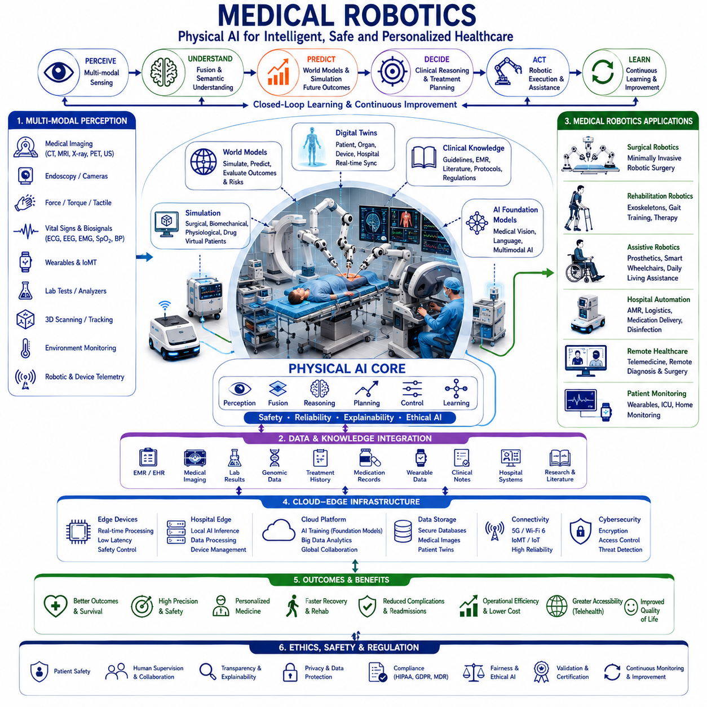
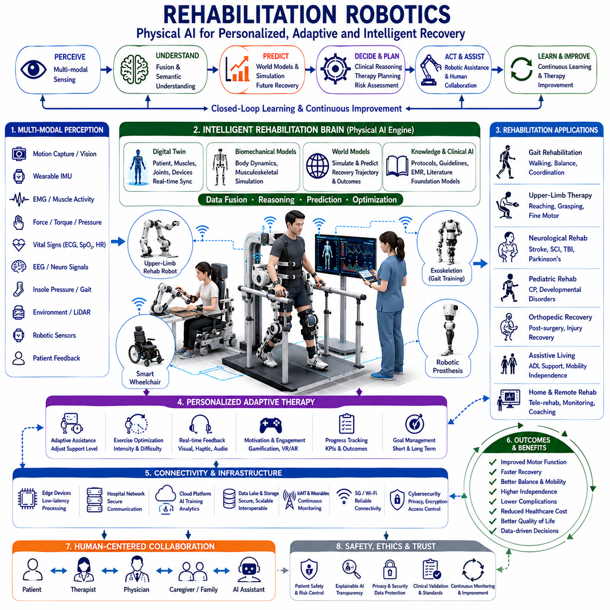
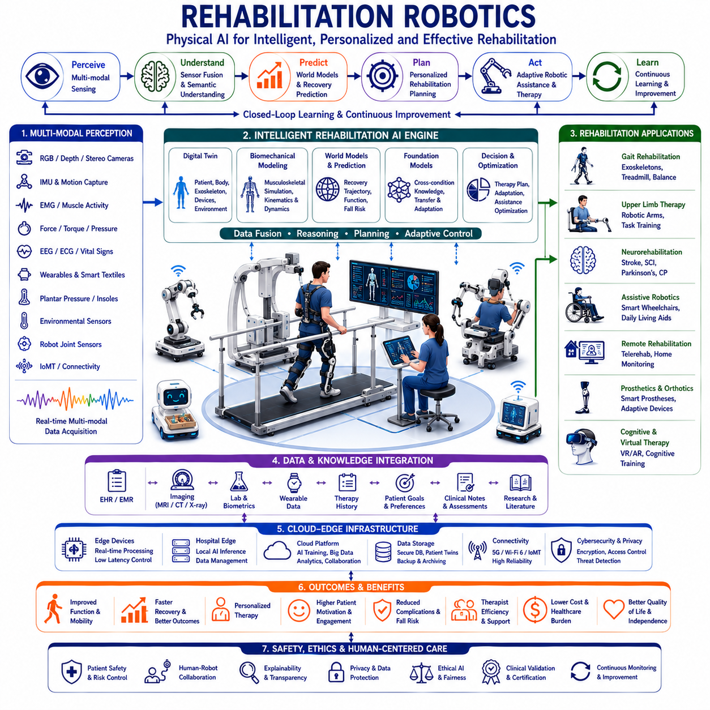
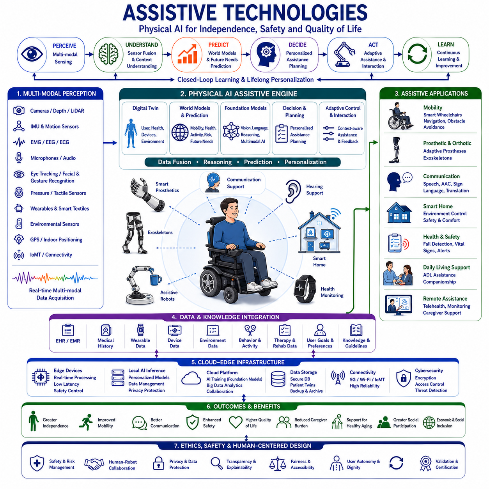
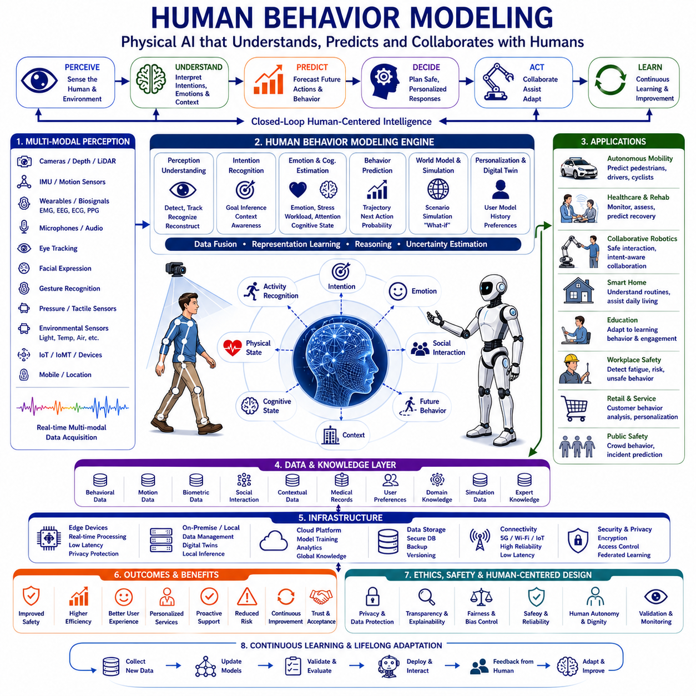
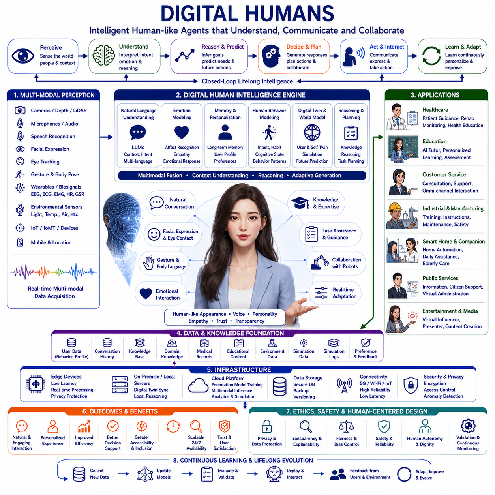
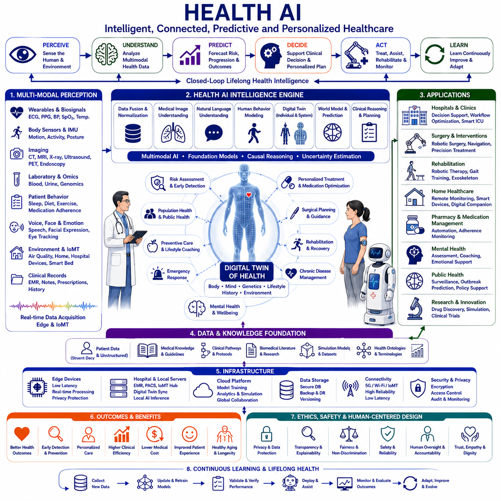
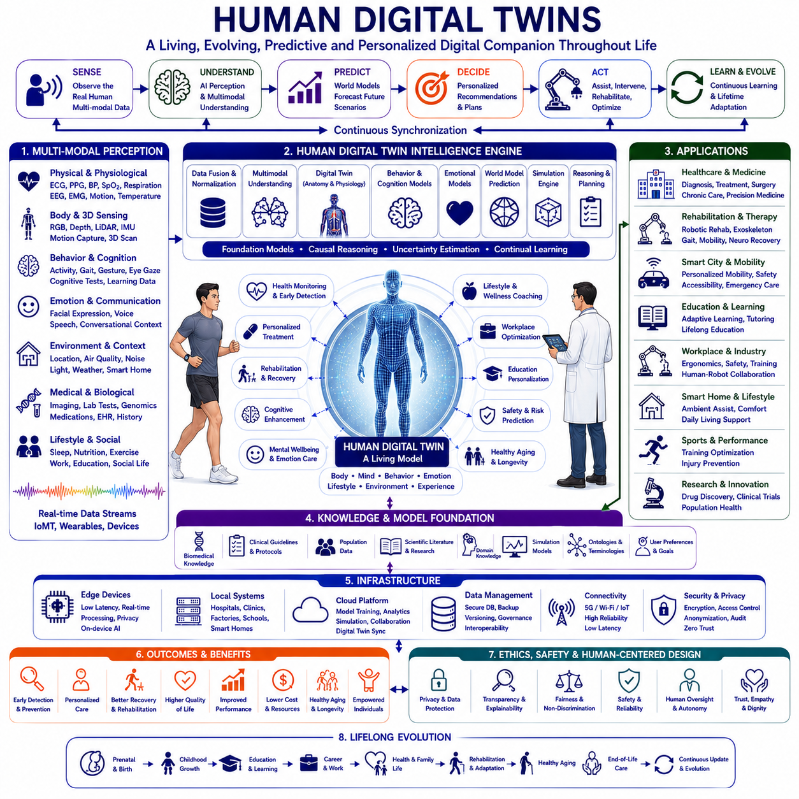
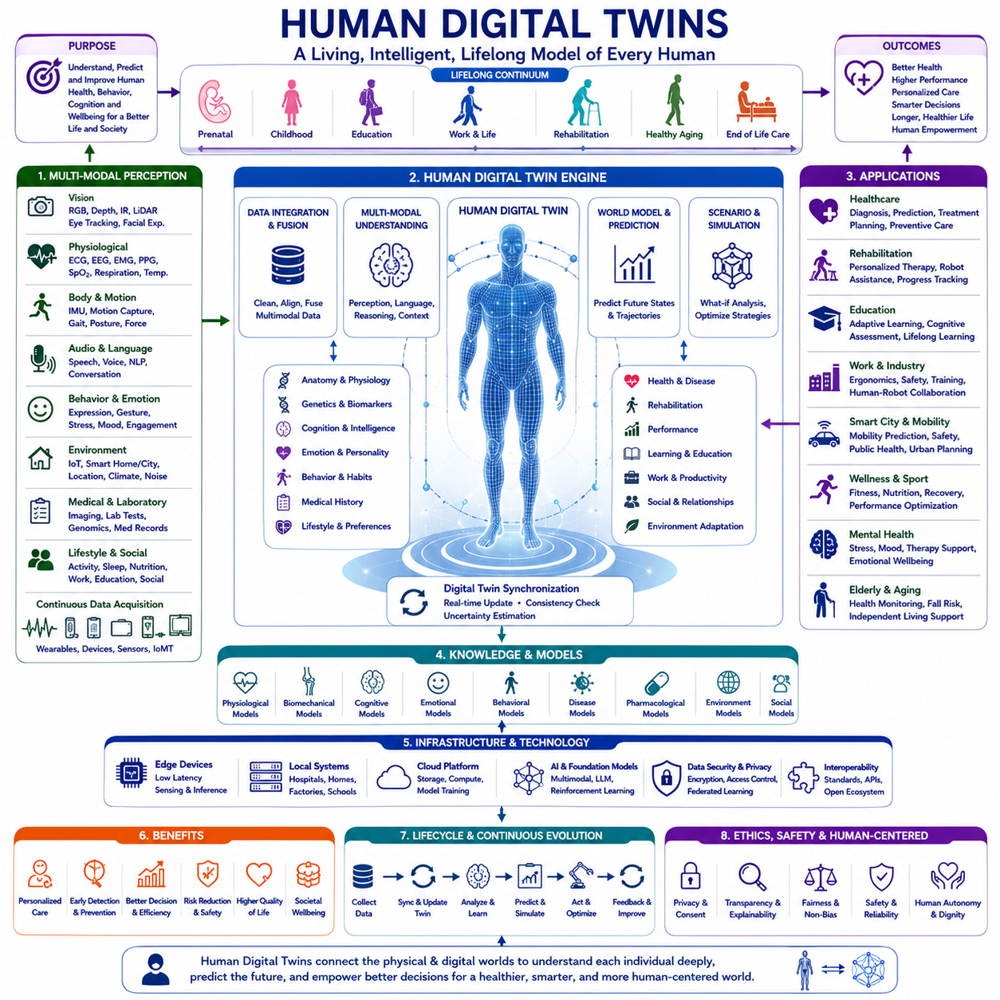
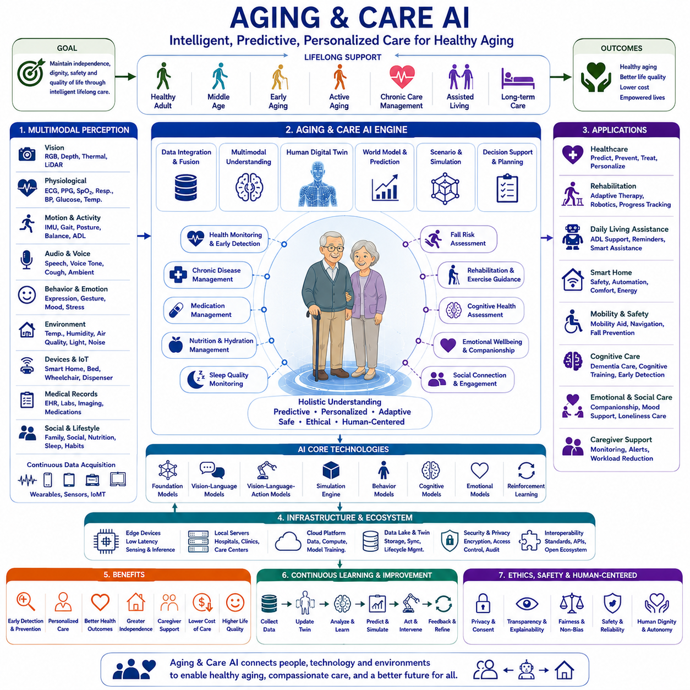

**Physical AI Engineering**

# Chapter 10 Medical and Human-Centric Physical AI 

## 10-01 Medical Robotics

{width="7.268055555555556in" height="7.268055555555556in"}

Medical Robotics represents one of the most advanced and socially significant applications of Physical AI because it combines intelligent perception, autonomous decision-making, precision manipulation, multimodal sensing, human-robot collaboration, and clinical knowledge to improve the quality, safety, accessibility, and efficiency of healthcare services. Unlike conventional industrial robots that operate in structured manufacturing environments, medical robots function in highly dynamic, uncertain, and safety-critical environments where every action directly influences human health and patient outcomes. Consequently, Medical Robotics requires Physical AI to understand not only the physical environment but also anatomical structures, physiological conditions, clinical objectives, medical workflows, and ethical constraints. Within the Physical AI Engineering framework, Medical Robotics integrates robotics, artificial intelligence, Digital Twins, World Models, multimodal perception, foundation models, cloud-edge computing, medical imaging, and clinical decision support into intelligent healthcare systems capable of assisting physicians, nurses, surgeons, rehabilitation specialists, caregivers, and patients throughout the complete continuum of medical care.

The evolution of Medical Robotics has progressed through several technological generations. Early medical robots primarily functioned as mechanically precise positioning systems designed to improve surgical accuracy or automate repetitive laboratory procedures. These systems executed predefined motions under direct physician supervision without understanding patient conditions or clinical context. The introduction of computer vision, medical imaging, force sensing, navigation systems, and minimally invasive surgical techniques significantly expanded robotic capabilities. Recent developments in artificial intelligence, deep learning, cloud computing, wearable sensors, and multimodal learning have transformed medical robots from programmable machines into intelligent assistants capable of perception, reasoning, adaptation, and collaborative decision support. Physical AI represents the next stage of this evolution by enabling medical robots to continuously understand patient conditions, predict clinical outcomes, adapt treatment strategies, and learn from accumulated medical experience while maintaining strict safety and ethical standards.

The primary objective of Medical Robotics extends far beyond automating medical procedures. Intelligent medical systems aim to enhance diagnostic accuracy, surgical precision, rehabilitation effectiveness, patient monitoring, hospital logistics, medication safety, clinical efficiency, personalized treatment, healthcare accessibility, and overall quality of life. Rather than replacing physicians, Physical AI enhances human clinical expertise by providing continuous perception, data-driven reasoning, predictive analysis, intelligent assistance, and highly precise robotic execution. Human intelligence and machine intelligence therefore operate cooperatively to achieve safer and more effective healthcare.

Perception provides the sensory foundation of Medical Robotics. Modern medical robots integrate RGB cameras, stereo vision systems, depth cameras, structured light scanners, hyperspectral imaging systems, thermal cameras, endoscopic cameras, ultrasound probes, X-ray systems, computed tomography, magnetic resonance imaging, positron emission tomography, fluoroscopy, force sensors, torque sensors, tactile sensors, inertial measurement units, biosignal sensors, electromyography, electroencephalography, electrocardiography, respiratory monitoring, pulse oximetry, blood pressure sensors, biochemical analyzers, wearable devices, environmental monitoring systems, and Internet of Medical Things infrastructure. Every sensing modality contributes complementary information describing anatomical structures, physiological conditions, patient motion, tissue characteristics, surgical instruments, environmental conditions, and medical workflows. Physical AI continuously integrates these heterogeneous observations into comprehensive clinical situational awareness.

Sensor fusion significantly enhances medical understanding because individual sensing modalities rarely provide sufficient information independently. Ultrasound provides real-time soft tissue visualization but limited anatomical context. Computed tomography offers excellent structural detail yet lacks continuous real-time observation. Force sensing detects tissue interaction but cannot identify anatomy visually. Wearable sensors continuously monitor physiological status while medical imaging reveals internal structures. Physical AI combines all available information into unified patient representations that continuously describe anatomy, physiology, pathology, treatment progress, and procedural context.

Computer vision has become one of the most important technologies within Medical Robotics. Deep learning continuously recognizes anatomical structures, organs, blood vessels, tumors, bones, surgical instruments, medical devices, wounds, skin abnormalities, cellular morphology, pathological findings, patient posture, facial expression, rehabilitation motion, hospital environments, healthcare workers, and clinical workflows. Rather than simply classifying medical images, Physical AI interprets visual observations according to anatomical relationships, physiological function, disease progression, treatment objectives, and clinical priorities. Intelligent perception therefore supports diagnosis, treatment planning, robotic manipulation, rehabilitation guidance, and patient monitoring simultaneously.

Three-dimensional perception substantially improves robotic medical procedures. Stereo vision, structured light scanning, optical tracking, electromagnetic tracking, photogrammetry, LiDAR for hospital navigation, intraoperative imaging, and volumetric medical imaging generate accurate three-dimensional representations of patient anatomy, operating rooms, rehabilitation environments, hospital infrastructure, and robotic workspaces. Physical AI continuously compares measured anatomy with preoperative planning, Digital Twins, surgical navigation systems, and medical imaging to improve procedural accuracy, robotic positioning, treatment precision, and patient safety.

Semantic understanding distinguishes Medical Robotics from conventional automation. Physical AI simultaneously understands anatomical terminology, clinical documentation, electronic medical records, diagnostic reports, surgical procedures, rehabilitation protocols, treatment guidelines, pharmacological information, laboratory results, radiology reports, physician instructions, nursing workflows, hospital logistics, regulatory requirements, and ethical principles. Medical robots therefore reason according to clinical objectives instead of executing predefined mechanical operations. Every robotic action reflects understanding of patient condition, medical intent, and therapeutic goals.

Digital Twins represent one of the most transformative technologies within Medical Robotics. Individual patients maintain continuously evolving Digital Twins integrating medical imaging, physiological measurements, laboratory results, genomic information, wearable sensor observations, treatment history, medication records, rehabilitation progress, surgical planning, and disease evolution. Medical devices, surgical robots, hospital infrastructure, rehabilitation systems, and healthcare facilities likewise maintain Digital Twins describing operational status, maintenance history, software configuration, utilization patterns, and clinical performance. Physical AI continuously synchronizes Digital Twins with real-world observations while supporting predictive medical decision-making throughout patient lifecycles.

World Models extend Digital Twins by enabling predictive clinical reasoning. Rather than representing only current patient conditions, World Models simulate disease progression, treatment response, surgical outcomes, rehabilitation trajectories, physiological adaptation, medication effects, hospital resource utilization, infection spread, and healthcare logistics according to patient-specific characteristics. Physical AI predicts complications before clinical deterioration occurs, evaluates alternative treatment strategies, optimizes personalized care plans, and supports evidence-based medical decision-making through predictive simulation.

Simulation forms an essential engineering component of Medical Robotics. Biomechanical simulation predicts musculoskeletal movement, tissue deformation, orthopedic alignment, rehabilitation progress, and prosthetic performance. Finite Element Analysis evaluates implant mechanics, bone loading, surgical devices, orthopedic fixation, cardiovascular stents, and biomedical equipment. Computational Fluid Dynamics models blood circulation, respiratory airflow, cardiovascular hemodynamics, and medical device fluid behavior. Surgical simulation validates robotic procedures before patient treatment. Virtual patients allow physicians and robots to rehearse complex interventions while reducing procedural risk. Physical AI continuously compares simulated outcomes with actual clinical observations to improve predictive accuracy and treatment effectiveness.

Foundation Models introduce universal medical intelligence spanning numerous healthcare specialties. Rather than developing isolated artificial intelligence systems for every disease or clinical department, Foundation Models learn transferable medical knowledge across surgery, radiology, pathology, cardiology, oncology, neurology, orthopedics, rehabilitation medicine, intensive care, emergency medicine, pediatrics, geriatrics, infectious diseases, and medical imaging. Fine-tuning rapidly adapts generalized medical knowledge to new hospitals, patient populations, medical devices, and healthcare applications while significantly reducing development effort.

Vision-Language Models transform interaction between healthcare professionals and intelligent medical systems. Physicians communicate naturally using clinical language while AI simultaneously interprets medical images, radiology reports, pathology findings, electronic medical records, laboratory data, surgical videos, rehabilitation assessments, treatment guidelines, and biomedical literature. Medical assistants explain diagnostic reasoning, summarize patient history, generate clinical documentation, recommend treatment options, support multidisciplinary collaboration, and answer complex medical questions while maintaining transparency and clinical interpretability.

Vision-Language-Action Models further extend Physical AI into autonomous clinical assistance. Surgical robots receive procedural objectives rather than manually programmed trajectories. Intelligent rehabilitation robots adapt therapy according to patient performance. Hospital service robots autonomously transport medications, laboratory specimens, medical supplies, and equipment while understanding hospital workflows. Robotic nursing assistants support patient mobility, monitoring, medication delivery, and daily care. Physical AI continuously perceives patient conditions, reasons about clinical objectives, and safely executes robotic actions while maintaining close collaboration with healthcare professionals.

Surgical robotics represents one of the most mature applications of Medical Robotics. Robot-assisted surgery provides enhanced precision, tremor reduction, minimally invasive access, motion scaling, improved visualization, and ergonomic advantages for surgeons. Physical AI further expands surgical capability through autonomous camera positioning, intelligent instrument tracking, anatomical recognition, intraoperative navigation, predictive safety monitoring, adaptive motion planning, tissue classification, and surgical workflow understanding. Rather than replacing surgeons, intelligent surgical robots operate as highly capable collaborative partners supporting safer and more consistent clinical procedures.

Rehabilitation robotics has become increasingly important because aging populations and chronic diseases require long-term physical therapy. Robotic exoskeletons, upper-limb rehabilitation devices, gait training systems, balance assistance robots, therapeutic manipulators, and intelligent wheelchairs continuously monitor patient movement while adapting exercise intensity according to recovery progress. Physical AI personalizes rehabilitation strategies using biomechanical models, patient Digital Twins, reinforcement learning, physiological monitoring, and long-term outcome prediction. Every rehabilitation session contributes new knowledge supporting individualized therapy optimization.

Assistive robotics significantly improves quality of life for elderly individuals and people living with disabilities. Intelligent wheelchairs, robotic feeding systems, wearable exoskeletons, robotic prostheses, service robots, communication assistants, smart home integration, and cognitive support systems enable independent living while reducing caregiver burden. Physical AI continuously learns user preferences, physical capabilities, environmental conditions, and behavioral patterns, allowing assistive technologies to adapt naturally to individual lifestyles rather than requiring patients to adapt to technology.

Hospital automation increasingly relies upon Medical Robotics beyond direct patient treatment. Autonomous mobile robots transport medications, sterile instruments, linens, laboratory samples, meals, medical waste, and logistics supplies throughout healthcare facilities. Intelligent inventory management coordinates pharmaceutical storage, operating room supplies, blood products, emergency equipment, and consumable materials. Physical AI continuously optimizes hospital logistics while reducing operational cost, minimizing infection risk, improving staff efficiency, and increasing patient safety.

Remote healthcare has expanded rapidly through telemedicine and robotic teleoperation. Physical AI enables physicians to examine patients remotely using intelligent diagnostic robots, robotic ultrasound systems, remote surgical platforms, wearable health monitoring devices, and autonomous healthcare assistants. High-bandwidth communication, edge computing, cloud intelligence, and Digital Twins support continuous healthcare delivery across geographically distributed populations. Intelligent telemedicine significantly improves healthcare accessibility while addressing shortages of specialized medical professionals.

Predictive healthcare represents one of the most promising applications of Physical AI. Continuous physiological monitoring, wearable devices, smart implants, environmental sensing, laboratory data, genomic information, medical imaging, and patient history collectively enable early prediction of disease progression, hospital readmission, cardiovascular events, neurological disorders, metabolic diseases, postoperative complications, and rehabilitation outcomes. Physical AI continuously analyzes longitudinal patient data while recommending preventive interventions before serious clinical deterioration occurs.

Human-centered healthcare remains a fundamental principle despite increasing medical automation. Medical Robotics is designed to support physicians, nurses, therapists, caregivers, and patients rather than replace human compassion, empathy, ethical judgment, and clinical expertise. Explainable AI provides transparent reasoning supporting physician trust. Conversational interfaces improve communication. Collaborative robots reduce physical workload. Personalized assistance respects individual preferences, cultural considerations, and patient autonomy. Physical AI therefore enhances rather than diminishes human-centered medical care.

Cloud-edge computing architectures distribute medical intelligence efficiently. Embedded edge devices perform deterministic robotic control, medical image processing, physiological monitoring, sensor fusion, patient safety verification, and low-latency decision support directly within medical equipment. Hospital servers coordinate Digital Twins, electronic medical records, clinical workflow management, imaging databases, resource scheduling, and institutional analytics. Cloud platforms support Foundation Model training, medical research, population health analysis, simulation, predictive healthcare, and collaborative clinical knowledge sharing across healthcare organizations while respecting regulatory and privacy requirements.

Cybersecurity and patient privacy represent critical requirements within Medical Robotics because healthcare systems manage highly sensitive personal information. Secure communication, encrypted medical records, authenticated devices, trusted hardware, zero-trust architectures, access control, audit logging, anomaly detection, AI-assisted cybersecurity, and privacy-preserving machine learning collectively protect patient information while ensuring safe clinical operation. Regulatory compliance with international healthcare standards remains essential throughout system design and deployment.

Functional safety is equally fundamental because robotic decisions directly influence patient health. Physical AI continuously validates sensor integrity, robotic positioning accuracy, communication reliability, model confidence, software correctness, physiological consistency, medical assumptions, and procedural safety before executing autonomous actions. Redundant sensing, fail-safe architectures, explainable reasoning, independent verification systems, clinician supervision, and rigorous medical validation collectively ensure trustworthy operation in safety-critical healthcare environments.

Simulation-to-Reality methodologies significantly accelerate development of intelligent medical systems. Synthetic medical images, virtual patients, digital anatomy, robotic surgery simulation, rehabilitation simulation, biomechanical modeling, reinforcement learning, and Digital Twin synchronization enable Physical AI to learn complex medical procedures before clinical deployment. Continuous synchronization between simulation and real-world clinical experience allows medical systems to improve safely while reducing development cost, procedural risk, and regulatory complexity.

The future evolution of Medical Robotics extends toward lifelong intelligent healthcare ecosystems where every patient maintains a continuously evolving Digital Twin throughout prevention, diagnosis, treatment, rehabilitation, wellness management, aging, and long-term healthcare. Every clinical encounter contributes medical knowledge. Every surgery improves robotic capability. Every rehabilitation session enhances personalized therapy. Every diagnostic examination strengthens predictive models. Every patient outcome refines future treatment strategies. Physical AI therefore enables continuously learning healthcare systems capable of delivering increasingly personalized, predictive, preventive, precise, and participatory medicine.

Medical Robotics therefore represents far more than robotic surgery or hospital automation. It embodies the convergence of robotics, artificial intelligence, Digital Twins, World Models, multimodal perception, medical imaging, simulation, Foundation Models, predictive healthcare, cyber-physical systems, biomedical engineering, cloud-edge computing, human-centered medicine, and clinical decision support into a unified Physical AI platform capable of understanding patient conditions, predicting medical outcomes, autonomously assisting healthcare professionals, and continuously improving clinical performance throughout complete healthcare lifecycles. As Physical AI continues to mature, Medical Robotics will become one of the foundational technologies enabling intelligent hospitals, personalized medicine, autonomous clinical assistance, resilient healthcare systems, and the next generation of patient-centered digital healthcare ecosystems.

## 10-02 Rehabilitation Robotics

{width="7.268055555555556in" height="7.268055555555556in"}{width="7.268055555555556in" height="7.268055555555556in"}

Rehabilitation Robotics represents one of the fastest growing and most human-centered applications of Physical AI because it combines intelligent sensing, biomechanical modeling, adaptive control, personalized therapy, human-robot collaboration, and lifelong learning to restore physical function, cognitive capability, and independent living for individuals affected by injury, neurological disorders, musculoskeletal diseases, aging, or congenital disabilities. Unlike conventional industrial robots that repeatedly execute predetermined tasks in structured environments, rehabilitation robots interact continuously with highly variable human bodies whose physical abilities, muscle strength, coordination, fatigue, pain, and recovery progress change over time. Consequently, Rehabilitation Robotics requires Physical AI to understand not only mechanical motion but also human biomechanics, neurophysiology, motor learning, rehabilitation science, psychological factors, clinical objectives, and patient-specific adaptation. Within the Physical AI Engineering framework, Rehabilitation Robotics integrates robotics, artificial intelligence, Digital Twins, World Models, multimodal perception, Foundation Models, biomechanical simulation, cloud-edge computing, wearable sensing, and clinical rehabilitation knowledge into intelligent therapeutic systems capable of assisting therapists while providing highly personalized rehabilitation throughout the complete recovery process.

The evolution of Rehabilitation Robotics has progressed through several technological generations. Early rehabilitation devices consisted primarily of passive mechanical exercise machines designed to assist repetitive joint movement without sensing patient intention or physiological response. Later systems introduced powered actuators, programmable exercise trajectories, and simple force control to support repetitive rehabilitation training. The incorporation of motion capture, wearable sensors, electromyography, force sensing, and virtual reality significantly expanded therapeutic capability. More recently, deep learning, reinforcement learning, Digital Twins, cloud computing, and multimodal artificial intelligence have transformed rehabilitation robots into intelligent therapy partners capable of understanding patient movement, adapting exercise strategies, predicting recovery progression, and continuously optimizing rehabilitation according to individual patient characteristics. Physical AI represents the next stage of this evolution by enabling rehabilitation systems to perceive human intention, understand biomechanical limitations, predict functional recovery, personalize therapy, and learn continuously from long-term rehabilitation experience while maintaining safety, comfort, and patient motivation.

The primary objective of Rehabilitation Robotics extends far beyond automating physical exercise. Intelligent rehabilitation seeks to maximize functional recovery, improve motor control, restore independence, reduce disability, enhance quality of life, increase therapy efficiency, reduce healthcare cost, support long-term rehabilitation, improve patient motivation, and enable personalized treatment. Rather than replacing rehabilitation professionals, Physical AI augments clinical expertise by providing continuous monitoring, objective assessment, adaptive assistance, intelligent coaching, and precise robotic intervention. Human therapists and intelligent robotic systems therefore collaborate to deliver more effective rehabilitation than either could achieve independently.

Perception forms the sensory foundation of Rehabilitation Robotics. Modern rehabilitation systems integrate RGB cameras, stereo vision systems, depth cameras, structured light sensors, wearable inertial measurement units, electromyography sensors, electroencephalography systems, electrocardiography monitors, force sensors, torque sensors, pressure sensors, tactile sensors, plantar pressure measurement systems, respiratory sensors, pulse oximeters, muscle oxygenation sensors, motion capture systems, optical tracking, LiDAR for indoor navigation, environmental sensors, wearable smart textiles, smart insoles, robotic joint encoders, prosthetic sensors, and Internet of Medical Things infrastructure. These sensing modalities collectively describe body posture, joint motion, muscle activation, gait characteristics, balance control, cardiovascular response, respiratory function, fatigue, environmental conditions, patient interaction, and rehabilitation performance. Physical AI continuously integrates heterogeneous observations into comprehensive understanding of patient status throughout every rehabilitation session.

Sensor fusion significantly improves rehabilitation intelligence because individual sensing technologies capture only limited aspects of human movement. Motion capture accurately measures joint trajectories but cannot directly observe muscular effort. Electromyography reveals muscle activation while providing little information about external movement. Force sensors quantify interaction between patient and robot without identifying movement intention. Physiological sensors monitor cardiovascular response but cannot describe biomechanical performance. Physical AI fuses biomechanical, physiological, neurological, environmental, and behavioral observations into unified patient representations capable of describing complete rehabilitation status while continuously estimating patient capability, fatigue, motivation, and recovery progression.

Computer vision has become one of the most influential technologies within Rehabilitation Robotics. Deep learning continuously recognizes body posture, skeletal motion, gait patterns, upper-limb coordination, facial expression, exercise execution, assistive device usage, wheelchair positioning, balance performance, fall risk, rehabilitation exercises, therapist interaction, patient engagement, and environmental obstacles. Instead of simply detecting human motion, Physical AI interprets movement according to biomechanical principles, neurological recovery, rehabilitation objectives, therapeutic protocols, and individual patient limitations. Intelligent perception therefore supports objective clinical evaluation, adaptive robotic assistance, automatic exercise assessment, and long-term functional monitoring.

Three-dimensional perception substantially enhances rehabilitation accuracy. Stereo vision, depth sensing, structured light scanning, optical tracking systems, photogrammetry, wearable motion capture, robotic localization, and Digital Twin synchronization generate accurate three-dimensional representations of patient anatomy, body movement, rehabilitation environments, assistive devices, robotic workspaces, and hospital infrastructure. Physical AI continuously compares measured movement against biomechanical models, rehabilitation goals, Digital Twins, and historical patient performance to quantify functional improvement, detect compensatory movement, identify incorrect exercise techniques, and personalize future rehabilitation strategies.

Semantic understanding distinguishes Rehabilitation Robotics from conventional exercise automation. Physical AI simultaneously understands rehabilitation protocols, clinical documentation, anatomical terminology, neurological disorders, orthopedic conditions, rehabilitation guidelines, electronic medical records, physician prescriptions, therapist instructions, assistive technology, mobility assessment, cognitive function, psychological condition, patient goals, and quality-of-life outcomes. Rehabilitation systems therefore reason according to therapeutic objectives rather than merely repeating predefined movement trajectories. Every robotic intervention reflects understanding of patient-specific recovery needs and long-term rehabilitation planning.

Digital Twins represent one of the most transformative technologies in intelligent rehabilitation. Each patient maintains a continuously evolving Digital Twin integrating medical imaging, biomechanical measurements, wearable sensor observations, muscle activation, neurological assessments, rehabilitation history, mobility evaluation, assistive device configuration, clinical outcomes, medication information, and physiological monitoring. Exoskeletons, prosthetic devices, rehabilitation robots, therapy equipment, and healthcare facilities likewise maintain Digital Twins describing operational status, calibration, maintenance history, usage patterns, and performance characteristics. Physical AI continuously synchronizes Digital Twins with real-world observations while supporting personalized rehabilitation planning throughout long-term recovery.

World Models extend Digital Twins by enabling predictive rehabilitation intelligence. Rather than representing only current patient status, World Models simulate motor recovery, muscle strengthening, gait improvement, neurological adaptation, prosthetic learning, exercise progression, balance development, fatigue accumulation, cognitive improvement, and long-term functional independence according to patient-specific characteristics. Physical AI predicts rehabilitation outcomes, estimates future mobility, identifies optimal intervention timing, compares alternative therapeutic strategies, and continuously recommends personalized rehabilitation plans based on predictive clinical reasoning.

Biomechanical simulation forms a fundamental engineering component of Rehabilitation Robotics. Musculoskeletal models simulate joint movement, muscle force generation, tendon behavior, skeletal loading, balance control, posture stability, prosthetic interaction, and exoskeleton assistance. Finite Element Analysis evaluates orthopedic implants, prosthetic sockets, rehabilitation devices, wearable robotics, and assistive mechanisms. Multibody dynamics simulate whole-body motion during walking, standing, reaching, lifting, stair climbing, and daily living activities. Reinforcement learning environments enable rehabilitation robots to optimize assistance policies before deployment. Physical AI continuously compares simulated predictions with measured patient performance while improving biomechanical models through lifelong learning.

Foundation Models introduce generalized rehabilitation intelligence spanning numerous medical specialties including stroke rehabilitation, spinal cord injury, orthopedic recovery, neurological disorders, Parkinson\'s disease, cerebral palsy, traumatic brain injury, sports medicine, geriatric rehabilitation, pediatric rehabilitation, prosthetics, occupational therapy, physical therapy, and assistive technology. Rather than developing isolated artificial intelligence systems for every rehabilitation condition, Foundation Models learn transferable biomechanical and clinical knowledge that can rapidly adapt to new patient populations, rehabilitation devices, healthcare institutions, and therapeutic protocols through efficient fine-tuning.

Vision-Language Models transform communication between rehabilitation professionals, patients, and intelligent rehabilitation systems. Therapists describe rehabilitation objectives using natural clinical language while AI simultaneously interprets motion capture data, biomechanical analysis, wearable sensor observations, patient history, rehabilitation documentation, exercise videos, clinical guidelines, Digital Twins, and therapeutic outcomes. Intelligent rehabilitation assistants summarize patient progress, explain movement deficiencies, generate rehabilitation documentation, recommend exercise modifications, support multidisciplinary collaboration, and provide transparent reasoning supporting clinical decision-making.

Vision-Language-Action Models extend rehabilitation intelligence into autonomous therapeutic assistance. Rehabilitation robots receive functional goals rather than predefined movement trajectories. Intelligent exoskeletons adapt walking assistance according to patient effort. Upper-limb rehabilitation robots personalize exercise resistance according to muscular recovery. Robotic prostheses continuously learn user intention and optimize movement execution. Intelligent wheelchairs autonomously navigate while understanding environmental context and patient capability. Physical AI continuously perceives patient condition, reasons about rehabilitation objectives, and safely generates adaptive robotic assistance while maintaining close collaboration with therapists and caregivers.

Robotic exoskeletons represent one of the most recognizable applications of Rehabilitation Robotics. Lower-limb exoskeletons restore walking ability following spinal cord injury, stroke, or neurological disease by providing coordinated joint assistance synchronized with patient intention. Upper-limb exoskeletons support shoulder, elbow, wrist, and hand rehabilitation through adaptive movement guidance and resistance control. Physical AI continuously estimates patient effort, predicts intended movement, optimizes assistance magnitude, prevents compensatory motion, and gradually reduces robotic support as functional recovery improves. Rehabilitation therefore becomes highly personalized rather than uniformly programmed.

Robot-assisted gait rehabilitation has become increasingly sophisticated through Physical AI. Intelligent gait trainers continuously evaluate walking symmetry, step length, cadence, balance, weight distribution, joint coordination, muscle activation, cardiovascular response, and fatigue. Adaptive assistance modifies body-weight support, robotic guidance, treadmill speed, resistance, and therapeutic difficulty according to patient progress. Continuous biomechanical assessment enables rehabilitation systems to maximize motor learning while maintaining patient safety and motivation.

Upper-limb rehabilitation similarly benefits from intelligent robotic assistance. Robotic manipulators support reaching, grasping, object manipulation, fine motor coordination, bilateral movement, and activities of daily living. Physical AI recognizes movement intention, compensates for muscular weakness, evaluates coordination quality, predicts recovery progression, and continuously adjusts therapeutic difficulty. Patients therefore receive individualized rehabilitation matching their neurological recovery and functional capability.

Assistive Robotics significantly extends rehabilitation beyond hospitals and rehabilitation centers. Intelligent wheelchairs, robotic prosthetic limbs, wearable exoskeletons, robotic feeding assistants, dressing assistants, household service robots, smart home integration, cognitive support systems, communication assistants, and mobility aids enable patients to maintain independent living after clinical rehabilitation concludes. Physical AI continuously learns user preferences, environmental characteristics, behavioral routines, and physical capability while adapting assistive technologies to changing patient needs throughout daily life.

Remote rehabilitation has expanded rapidly through telemedicine, wearable sensing, cloud computing, and Physical AI. Patients perform rehabilitation exercises at home while rehabilitation robots, wearable devices, motion analysis systems, and intelligent coaching platforms continuously monitor performance. Therapists remotely supervise treatment using Digital Twins, predictive analytics, biomechanical assessment, and real-time communication. Personalized rehabilitation therefore becomes continuously available regardless of geographical location while reducing healthcare cost and improving long-term patient adherence.

Motivation and patient engagement represent essential components of successful rehabilitation. Physical AI integrates gamification, virtual reality, augmented reality, adaptive coaching, conversational interaction, personalized feedback, and emotional recognition to maintain long-term patient participation. Intelligent rehabilitation systems recognize frustration, fatigue, boredom, confidence, and motivation while automatically adjusting exercise complexity, encouragement, rewards, and therapeutic strategies to maximize engagement and treatment effectiveness.

Predictive rehabilitation constitutes one of the most promising applications of Physical AI. Continuous physiological monitoring, wearable sensing, biomechanical analysis, neurological assessment, rehabilitation history, environmental observations, Digital Twins, and longitudinal patient data collectively enable prediction of functional recovery, fall risk, muscle degeneration, mobility decline, therapy response, prosthetic adaptation, and long-term independence. Physical AI recommends preventive interventions before functional deterioration occurs while optimizing rehabilitation timing and therapeutic intensity according to predicted outcomes.

Human-centered rehabilitation remains the fundamental design principle despite increasing robotic autonomy. Rehabilitation Robotics supports therapists, physicians, occupational therapists, caregivers, family members, and patients rather than replacing empathy, encouragement, emotional support, and professional clinical judgment. Explainable AI provides transparent therapeutic reasoning. Collaborative robots reduce therapist physical workload. Adaptive interfaces personalize interaction according to patient capability. Conversational systems encourage patient participation. Physical AI therefore strengthens rather than diminishes the human relationship that remains central to successful rehabilitation.

Cloud-edge computing architectures efficiently distribute rehabilitation intelligence. Embedded edge computers perform deterministic robot control, wearable sensor processing, motion analysis, biomechanical computation, safety monitoring, and low-latency rehabilitation assistance directly within robotic devices. Hospital servers coordinate Digital Twins, rehabilitation documentation, patient management, therapy scheduling, multidisciplinary collaboration, and institutional analytics. Cloud platforms support Foundation Model training, rehabilitation research, longitudinal patient analysis, predictive recovery modeling, simulation, and collaborative clinical knowledge sharing across healthcare organizations while maintaining privacy and regulatory compliance.

Cybersecurity and patient privacy remain essential because rehabilitation systems continuously collect sensitive physiological, behavioral, biomechanical, neurological, and clinical information throughout long-term patient care. Secure communication, encrypted patient records, authenticated medical devices, trusted hardware, zero-trust architectures, access control, anomaly detection, audit logging, privacy-preserving machine learning, and AI-assisted cybersecurity collectively protect patient information while ensuring trustworthy operation throughout rehabilitation lifecycles.

Functional safety is equally critical because rehabilitation robots directly interact with vulnerable patients whose physical capability may be significantly impaired. Physical AI continuously validates sensor integrity, robotic positioning, force limits, communication reliability, biomechanical consistency, physiological monitoring, model confidence, software correctness, and patient safety before executing robotic assistance. Redundant sensing, fail-safe architectures, explainable reasoning, clinician supervision, emergency stop mechanisms, independent verification systems, and rigorous medical validation collectively ensure safe therapeutic interaction throughout rehabilitation.

Simulation-to-Reality methodologies significantly accelerate development of intelligent rehabilitation systems. Virtual patients, biomechanical simulation, musculoskeletal Digital Twins, reinforcement learning, robotic simulation, synthetic rehabilitation data, rehabilitation environment simulation, and Digital Twin synchronization enable Physical AI to learn therapeutic strategies before deployment. Continuous synchronization between simulation and clinical observation allows rehabilitation systems to improve safely while reducing development cost, regulatory complexity, and patient risk.

The future evolution of Rehabilitation Robotics extends toward lifelong intelligent rehabilitation ecosystems where every individual maintains a continuously evolving biomechanical and physiological Digital Twin throughout injury prevention, acute treatment, rehabilitation, healthy aging, disability management, wellness promotion, and independent living. Every rehabilitation session contributes therapeutic knowledge. Every movement improves biomechanical understanding. Every patient interaction strengthens predictive recovery models. Every assistive device continuously adapts to individual capability. Physical AI therefore enables rehabilitation systems that become increasingly personalized, adaptive, predictive, preventive, intelligent, and human-centered throughout complete healthcare lifecycles.

Rehabilitation Robotics therefore represents far more than robotic exercise equipment or powered exoskeletons. It embodies the convergence of robotics, artificial intelligence, Digital Twins, World Models, multimodal perception, biomechanical engineering, neuroscience, wearable sensing, simulation, Foundation Models, predictive rehabilitation, cyber-physical systems, cloud-edge computing, human-centered healthcare, and clinical rehabilitation science into a unified Physical AI platform capable of understanding human movement, predicting functional recovery, autonomously assisting therapeutic intervention, and continuously improving rehabilitation outcomes throughout lifelong patient care. As Physical AI continues to mature, Rehabilitation Robotics will become one of the foundational technologies enabling intelligent rehabilitation hospitals, personalized therapy, autonomous assistive healthcare, resilient rehabilitation ecosystems, healthy aging, independent living, and the next generation of patient-centered Physical AI healthcare.

## 10-03 Assistive Technologies

{width="7.268055555555556in" height="7.268055555555556in"}

Assistive Technologies represent one of the most human-centered and socially transformative applications of Physical AI because they empower individuals with disabilities, age-related impairments, temporary injuries, and chronic medical conditions to live more independently, safely, and confidently. Unlike conventional automation systems that primarily improve industrial productivity or manufacturing efficiency, Assistive Technologies focus directly on enhancing human capability by compensating for physical, sensory, cognitive, or communication limitations. Physical AI significantly expands the capabilities of assistive systems by integrating intelligent perception, multimodal sensing, adaptive reasoning, personalized learning, autonomous decision-making, and human-centered interaction into everyday devices that continuously understand user intentions, environmental conditions, physiological states, and changing functional abilities. Within the Physical AI Engineering framework, Assistive Technologies integrate robotics, artificial intelligence, Digital Twins, World Models, multimodal perception, Foundation Models, wearable computing, biomedical engineering, cloud-edge intelligence, and smart environments into intelligent assistance ecosystems capable of supporting users throughout their entire lives while preserving dignity, independence, safety, and quality of life.

The evolution of Assistive Technologies has progressed through several technological generations. Traditional assistive devices primarily consisted of passive mechanical tools including walking canes, crutches, manual wheelchairs, hearing aids, magnifying devices, prosthetic limbs, orthotic braces, and communication boards. These devices provided valuable physical assistance but possessed little or no ability to understand user behavior or adapt to changing conditions. The introduction of microprocessors, embedded electronics, electric actuators, wearable sensors, speech recognition, and wireless communication enabled powered wheelchairs, intelligent prostheses, environmental control systems, and digital communication aids. Recent advances in artificial intelligence, deep learning, multimodal learning, cloud computing, wearable computing, and Physical AI have transformed assistive devices into intelligent companions capable of understanding human intention, predicting user needs, adapting continuously to changing environments, and providing proactive assistance instead of passive support.

The primary objective of Assistive Technologies extends far beyond replacing lost physical function. Intelligent assistance seeks to maximize independence, improve mobility, enhance communication, restore daily living capability, reduce caregiver burden, improve safety, increase social participation, support employment opportunities, promote healthy aging, and ultimately improve overall quality of life. Rather than encouraging dependency upon technology, Physical AI enables individuals to perform activities independently while preserving personal autonomy, confidence, and self-determination. Assistive intelligence therefore complements human capability instead of replacing human decision-making.

Perception forms the sensory foundation of intelligent assistive systems. Modern Assistive Technologies integrate RGB cameras, stereo vision systems, depth cameras, LiDAR sensors, ultrasonic sensors, infrared sensors, structured light scanners, inertial measurement units, electromyography sensors, electroencephalography systems, electrocardiography monitors, pressure sensors, tactile sensors, environmental monitoring systems, smart textiles, wearable physiological sensors, GPS, indoor positioning systems, microphones, speaker arrays, eye tracking systems, facial recognition cameras, gesture recognition sensors, smart watches, smart rings, biosignal monitors, and Internet of Medical Things infrastructure. Every sensing modality contributes complementary information describing user posture, movement, physiological condition, emotional state, environmental context, communication intent, surrounding obstacles, and interaction patterns. Physical AI continuously integrates these heterogeneous observations into comprehensive understanding of both user capability and environmental conditions.

Sensor fusion significantly enhances assistive intelligence because individual sensing technologies capture only limited aspects of human behavior. Cameras recognize environmental obstacles but cannot directly measure muscular effort. Electromyography detects movement intention while providing limited environmental awareness. Pressure sensors identify sitting posture but cannot predict walking intention. Eye tracking reveals visual attention but not physiological fatigue. Voice recognition understands spoken commands but cannot interpret physical limitations independently. Physical AI combines visual, auditory, biomechanical, physiological, neurological, environmental, and behavioral observations into unified user representations that continuously estimate physical capability, cognitive status, emotional condition, environmental safety, and assistance requirements.

Computer vision has become one of the most influential technologies within Assistive Technologies. Deep learning continuously recognizes human posture, body movement, wheelchair positioning, hand gestures, facial expressions, object locations, room layouts, obstacles, traffic conditions, household appliances, medication containers, food items, assistive devices, caregivers, family members, healthcare professionals, public infrastructure, and environmental hazards. Rather than merely detecting visual objects, Physical AI interprets scenes according to user capability, accessibility requirements, daily activities, safety considerations, and personalized assistance objectives. Intelligent perception therefore enables context-aware support throughout everyday life.

Three-dimensional perception substantially improves environmental understanding. Stereo vision, structured light sensing, LiDAR mapping, depth cameras, simultaneous localization and mapping, photogrammetry, wearable localization, robotic navigation, and Digital Twin synchronization generate accurate three-dimensional representations of homes, hospitals, workplaces, public transportation, shopping centers, rehabilitation facilities, outdoor environments, and smart cities. Physical AI continuously compares observed environments with Digital Twins and accessibility models to identify barriers, optimize navigation, recommend safe routes, and proactively avoid dangerous situations before accidents occur.

Semantic understanding distinguishes intelligent Assistive Technologies from conventional assistive devices. Physical AI simultaneously understands user preferences, medical conditions, rehabilitation goals, communication history, home layouts, occupational requirements, transportation systems, medication schedules, caregiver instructions, clinical recommendations, accessibility regulations, environmental context, social interactions, and daily routines. Assistive systems therefore reason according to individual human needs rather than executing predefined commands. Every recommendation and robotic action reflects understanding of long-term user objectives and personalized assistance strategies.

Digital Twins represent one of the most transformative technologies supporting intelligent assistance. Every individual maintains a continuously evolving Digital Twin integrating physiological measurements, mobility assessments, medical history, rehabilitation progress, wearable sensor observations, behavioral patterns, environmental interaction, cognitive performance, communication preferences, emotional trends, assistive device configuration, and long-term health information. Smart wheelchairs, robotic prostheses, hearing systems, exoskeletons, home automation devices, service robots, wearable technologies, and intelligent environments likewise maintain Digital Twins describing operational condition, calibration, software configuration, maintenance history, and performance characteristics. Physical AI continuously synchronizes Digital Twins with real-world observations while supporting highly personalized assistance throughout complete human lifecycles.

World Models significantly extend Digital Twins by enabling predictive assistive intelligence. Rather than representing only current user status, World Models simulate mobility progression, disease evolution, functional decline, rehabilitation recovery, cognitive adaptation, prosthetic learning, environmental interaction, caregiver requirements, medication response, healthy aging, and future assistance needs according to individual characteristics. Physical AI predicts fall risk, mobility deterioration, cognitive decline, equipment maintenance requirements, environmental hazards, caregiver workload, and healthcare intervention timing before serious problems occur. Predictive reasoning therefore enables preventive assistance instead of reactive support.

Simulation serves as a critical engineering foundation within Assistive Technologies. Biomechanical simulation predicts walking dynamics, wheelchair movement, prosthetic interaction, exoskeleton performance, musculoskeletal loading, balance control, upper-limb coordination, and activities of daily living. Human digital simulation evaluates accessibility, environmental adaptation, ergonomic interaction, smart home design, public infrastructure, transportation accessibility, and assistive device usability. Reinforcement learning environments enable assistive robots to optimize support strategies before interacting with users. Physical AI continuously compares simulation predictions with real-world observations while refining personalized assistance models through lifelong learning.

Foundation Models introduce generalized assistive intelligence spanning mobility assistance, communication support, visual impairment, hearing impairment, cognitive assistance, neurological disorders, elderly care, rehabilitation, smart home automation, service robotics, education, employment support, and community participation. Rather than developing isolated artificial intelligence systems for every disability category, Foundation Models learn transferable human-centered knowledge that rapidly adapts to diverse users, environments, assistive devices, healthcare systems, and cultural contexts through efficient fine-tuning.

Vision-Language Models fundamentally transform interaction between users and assistive systems. Individuals communicate naturally using spoken language, sign language, text, gesture, eye movement, facial expression, or multimodal communication while AI simultaneously interprets environmental context, Digital Twins, wearable sensor observations, rehabilitation records, healthcare information, navigation data, smart home status, and daily activities. Intelligent assistants explain recommendations, summarize health information, generate reminders, answer questions, coordinate caregivers, support education, facilitate employment, and provide transparent reasoning supporting user independence.

Vision-Language-Action Models extend assistive intelligence into autonomous physical assistance. Intelligent wheelchairs receive destination objectives instead of manually programmed routes. Robotic manipulators assist meal preparation, dressing, object retrieval, and household tasks according to user intention. Prosthetic limbs predict desired movement before execution. Smart home systems proactively adjust lighting, temperature, doors, appliances, and emergency systems according to user activity. Physical AI continuously perceives user condition, reasons about assistance objectives, and safely generates adaptive robotic actions while maintaining human control and autonomy.

Intelligent mobility assistance represents one of the most recognizable applications of Assistive Technologies. Smart wheelchairs continuously analyze environmental obstacles, user intention, terrain conditions, battery status, traffic flow, indoor maps, pedestrian movement, elevator availability, and public transportation accessibility. Physical AI optimizes navigation while preventing collisions, reducing user workload, improving travel efficiency, and maintaining safe mobility across complex indoor and outdoor environments.

Robotic prosthetic systems have advanced dramatically through Physical AI. Modern prosthetic limbs integrate electromyography, pressure sensing, inertial measurement, tactile feedback, computer vision, and reinforcement learning to estimate user intention with remarkable accuracy. Intelligent prostheses continuously adapt walking patterns, grasping strategies, balance control, object manipulation, and force generation according to environmental conditions and individual preference. Rather than functioning as passive mechanical replacements, prosthetic systems become adaptive extensions of the human body.

Wearable exoskeletons provide intelligent mobility assistance for individuals experiencing spinal cord injury, stroke, muscular weakness, neurological disorders, or age-related mobility decline. Physical AI estimates muscle effort, predicts intended movement, adjusts assistance levels, prevents compensatory motion, monitors fatigue, and continuously personalizes support according to rehabilitation progress and long-term physical adaptation. Exoskeletons therefore enhance human mobility while encouraging natural motor recovery whenever possible.

Assistive communication technologies significantly improve social participation for individuals experiencing speech, hearing, cognitive, or neurological impairments. Physical AI supports automatic speech generation, real-time speech recognition, sign language translation, eye-gaze communication, facial expression interpretation, predictive text generation, multilingual translation, emotional understanding, conversational assistance, and personalized communication interfaces. Intelligent communication systems therefore enable more natural interaction across healthcare, education, employment, and community environments.

Smart home integration represents another major application of Assistive Technologies. Intelligent environmental control coordinates lighting, climate systems, security devices, doors, windows, kitchen appliances, healthcare monitoring, medication reminders, entertainment systems, robotic assistants, emergency response, and energy management according to user preference, physiological condition, daily routine, and environmental context. Physical AI transforms conventional homes into adaptive living environments that continuously support independent living while reducing caregiver burden.

Assistive service robots increasingly support activities of daily living including meal preparation, medication management, object delivery, dressing assistance, cleaning, shopping support, companionship, cognitive stimulation, emergency response, and healthcare monitoring. Physical AI enables service robots to understand user intention, recognize environmental context, predict future needs, adapt assistance strategies, and safely collaborate with family members, caregivers, and healthcare professionals throughout daily life.

Remote assistance has expanded rapidly through cloud computing, wearable sensing, telehealth, and intelligent robotics. Physical AI enables caregivers, rehabilitation specialists, physicians, family members, and emergency responders to monitor user wellbeing remotely while respecting privacy and personal independence. Intelligent systems continuously analyze physiological status, environmental safety, mobility performance, cognitive function, medication adherence, and emergency conditions while automatically notifying caregivers only when meaningful intervention becomes necessary.

Human-centered design remains the fundamental philosophy underlying Assistive Technologies despite increasing technological sophistication. Physical AI prioritizes user dignity, privacy, autonomy, emotional wellbeing, cultural diversity, accessibility, inclusiveness, and personal choice. Assistive systems adapt to individual preferences instead of forcing users to adapt to technology. Explainable AI provides transparent reasoning supporting user trust. Conversational interaction promotes natural communication. Adaptive interfaces personalize system behavior according to changing human capability throughout life.

Cloud-edge computing architectures efficiently distribute assistive intelligence. Embedded edge computers perform deterministic robotic control, wearable sensor processing, speech recognition, navigation, environmental perception, physiological monitoring, and safety verification directly within assistive devices. Local smart home servers coordinate Digital Twins, environmental automation, service robots, healthcare monitoring, and family communication. Cloud platforms support Foundation Model training, personalized learning, long-term health analytics, predictive assistance, simulation, collaborative knowledge sharing, and large-scale accessibility research while maintaining strict privacy protection.

Cybersecurity and privacy represent essential requirements because Assistive Technologies continuously collect highly sensitive physiological, behavioral, medical, environmental, and personal information throughout daily life. Secure communication, encrypted storage, authenticated devices, trusted hardware, zero-trust architectures, access control, anomaly detection, audit logging, privacy-preserving machine learning, and AI-assisted cybersecurity collectively protect user information while ensuring trustworthy operation of assistive ecosystems.

Functional safety remains equally important because intelligent assistive devices directly influence human mobility, physical support, environmental control, medication management, emergency response, and healthcare monitoring. Physical AI continuously validates sensor integrity, robotic positioning, communication reliability, environmental awareness, physiological monitoring, model confidence, software correctness, user intention estimation, and operational safety before executing autonomous assistance. Redundant sensing, fail-safe architectures, emergency intervention, explainable reasoning, independent verification, human supervision, and rigorous validation collectively ensure safe interaction between intelligent systems and vulnerable users.

Simulation-to-Reality methodologies significantly accelerate development of Assistive Technologies. Virtual humans, biomechanical simulation, smart home simulation, reinforcement learning, robotic simulation, synthetic accessibility data, Digital Twin synchronization, and human-environment interaction modeling enable Physical AI to learn assistance strategies before real-world deployment. Continuous synchronization between simulation and everyday user experience allows assistive systems to improve safely while reducing engineering cost, regulatory complexity, and deployment risk.

The future evolution of Assistive Technologies extends toward lifelong intelligent assistance ecosystems where every individual maintains a continuously evolving Digital Twin throughout childhood, education, employment, rehabilitation, independent living, healthy aging, chronic disease management, and long-term healthcare. Every interaction contributes new human-centered knowledge. Every movement improves biomechanical understanding. Every communication strengthens personalized assistance models. Every environmental adaptation enhances accessibility intelligence. Every user experience continuously improves future assistive technologies. Physical AI therefore enables increasingly adaptive, predictive, personalized, inclusive, autonomous, and human-centered assistance throughout complete human lifecycles.

Assistive Technologies therefore represent far more than mobility aids, communication devices, or smart home automation. They embody the convergence of robotics, artificial intelligence, Digital Twins, World Models, multimodal perception, wearable sensing, biomechanical engineering, human-computer interaction, simulation, Foundation Models, cyber-physical systems, cloud-edge computing, healthcare, accessibility engineering, rehabilitation science, and human-centered design into a unified Physical AI platform capable of understanding human capability, predicting future assistance needs, autonomously supporting daily activities, and continuously improving quality of life throughout lifelong independent living. As Physical AI continues to mature, Assistive Technologies will become one of the foundational technologies enabling intelligent accessible cities, inclusive healthcare, adaptive education, independent aging, resilient community support systems, and the next generation of universally accessible Physical AI societies.

## 10-04 Human Behavior Modeling

{width="7.268055555555556in" height="7.268055555555556in"}

Human Behavior Modeling represents one of the most fundamental technologies enabling Physical AI because intelligent robots must understand not only the physical environment but also the intentions, emotions, habits, preferences, social interactions, and future actions of the people who share that environment. While traditional automation systems primarily respond to explicit commands or predefined rules, Physical AI continuously interprets human behavior through perception, reasoning, prediction, and adaptive interaction. Human Behavior Modeling therefore serves as the cognitive bridge connecting perception with intelligent decision-making, allowing robots to anticipate human actions before they occur, collaborate naturally with people, avoid unsafe situations, personalize services, and continuously improve long-term human-robot interaction. Within the Physical AI Engineering framework, Human Behavior Modeling integrates robotics, artificial intelligence, cognitive science, behavioral psychology, neuroscience, biomechanics, Digital Twins, World Models, multimodal perception, Foundation Models, reinforcement learning, and cloud-edge computing into comprehensive human-aware intelligence capable of understanding human behavior across healthcare, manufacturing, autonomous mobility, smart homes, education, public services, and collaborative robotics.

The evolution of Human Behavior Modeling has progressed through several technological generations. Early robotic systems treated humans as moving obstacles that simply needed to be avoided. Motion planning algorithms focused exclusively on collision avoidance without understanding why people moved or what they intended to accomplish. The introduction of computer vision, machine learning, activity recognition, gesture recognition, facial analysis, and probabilistic prediction allowed robots to recognize common human actions such as walking, sitting, reaching, pointing, or waving. Recent advances in deep learning, transformer architectures, multimodal learning, large language models, world modeling, reinforcement learning, and Physical AI have transformed human behavior understanding from simple action recognition into comprehensive cognitive modeling capable of interpreting goals, intentions, emotions, social context, and future behavior. Physical AI represents the next stage of this evolution by enabling robots to learn continuously from human interaction while adapting behavior according to individual users and changing environments.

The primary objective of Human Behavior Modeling extends far beyond recognizing observable human motion. Intelligent behavior modeling seeks to understand why people perform particular actions, what goals they are attempting to achieve, how environmental context influences decision-making, how physical capability changes over time, how emotional states affect behavior, how social relationships modify interaction patterns, and how future actions can be predicted before they occur. Rather than reacting after human behavior has already been observed, Physical AI proactively anticipates future actions and prepares appropriate responses while preserving safety, efficiency, comfort, trust, and natural collaboration.

Perception provides the sensory foundation for Human Behavior Modeling. Modern Physical AI systems integrate RGB cameras, stereo vision systems, depth cameras, LiDAR, radar, thermal cameras, hyperspectral imaging, wearable sensors, inertial measurement units, electromyography sensors, electroencephalography systems, microphones, microphone arrays, physiological sensors, eye tracking systems, facial recognition cameras, gesture recognition sensors, pressure sensors, tactile sensors, environmental monitoring systems, smart home devices, mobile devices, wearable computers, smart watches, smart glasses, vehicle sensors, Internet of Things infrastructure, and Internet of Medical Things platforms. These sensing modalities collectively capture body posture, joint movement, facial expression, eye gaze, speech, physiological response, environmental interaction, spatial relationships, social engagement, and behavioral history. Physical AI continuously integrates heterogeneous sensory observations into comprehensive understanding of human behavior across diverse situations.

Sensor fusion significantly enhances behavioral understanding because individual sensing modalities provide only partial observations. Cameras capture body movement but cannot directly measure muscular effort or physiological stress. Wearable sensors reveal internal physiological conditions while providing limited environmental awareness. Microphones detect speech and emotional tone but cannot determine physical posture. Eye tracking identifies visual attention without revealing muscular activity. Environmental sensors describe surrounding context but not individual intention. Physical AI fuses visual, auditory, biomechanical, physiological, neurological, environmental, linguistic, and behavioral information into unified human representations that continuously estimate intention, attention, emotional state, cognitive workload, physical capability, and future behavioral probability.

Computer vision has become one of the most influential technologies within Human Behavior Modeling. Deep learning continuously recognizes body posture, skeletal motion, gait characteristics, upper-limb movement, facial expressions, hand gestures, object interaction, group behavior, crowd movement, workplace activity, rehabilitation exercises, driving behavior, shopping patterns, sports performance, educational participation, workplace collaboration, and daily living activities. Rather than merely classifying actions, Physical AI interprets human movement according to underlying goals, environmental constraints, biomechanical capability, psychological context, and long-term behavioral patterns. Intelligent perception therefore enables robots to understand not only what humans are doing but also why those actions occur.

Three-dimensional perception substantially improves behavioral interpretation. Stereo vision, structured light sensing, LiDAR mapping, motion capture systems, photogrammetry, simultaneous localization and mapping, wearable localization, Digital Twin synchronization, and human pose estimation generate accurate three-dimensional representations of human anatomy, body movement, environmental interaction, collaborative workspaces, homes, hospitals, factories, vehicles, and public infrastructure. Physical AI continuously compares observed behavior against Digital Twins, biomechanical models, social interaction models, and historical behavioral patterns to identify normal activity, abnormal behavior, unsafe conditions, rehabilitation progress, occupational performance, and future movement trajectories.

Human intention recognition represents one of the central objectives of Physical AI. Observable human movement often reflects deeper objectives that cannot be directly measured. A person reaching toward a table may intend to grasp a cup, move an object, assist another individual, or perform rehabilitation exercises depending upon environmental context. Physical AI combines motion analysis, object recognition, environmental understanding, previous interaction history, conversational context, and Digital Twins to infer likely human intentions before physical actions are completed. Early intention prediction enables robots to coordinate naturally with people while reducing unnecessary delays and improving collaborative efficiency.

Behavior prediction extends beyond recognizing current actions toward anticipating future human decisions. World Models continuously estimate probable future trajectories, destination choices, manipulation sequences, interaction requests, rehabilitation progress, shopping behavior, driving intentions, workplace collaboration, household activities, emergency responses, and healthcare outcomes according to contextual information and historical experience. Predictive intelligence allows Physical AI to prepare robotic actions proactively rather than reacting after human behavior has already changed. Human-aware prediction therefore improves both safety and efficiency across collaborative environments.

Emotion recognition significantly influences Human Behavior Modeling because emotional states modify decision-making, movement quality, communication style, motivation, attention, learning efficiency, rehabilitation progress, and social interaction. Physical AI integrates facial expression analysis, voice characteristics, body posture, physiological monitoring, behavioral history, contextual understanding, and multimodal reasoning to estimate emotional conditions including stress, fatigue, frustration, anxiety, confidence, happiness, confusion, pain, engagement, and motivation. Emotional awareness enables intelligent systems to personalize interaction while improving user comfort, trust, and long-term acceptance.

Cognitive state estimation further expands behavioral understanding by modeling human attention, workload, memory, decision complexity, learning progression, situational awareness, and mental fatigue. Eye tracking, physiological monitoring, interaction timing, behavioral consistency, conversational analysis, and task performance collectively provide indirect indicators describing cognitive condition. Physical AI adapts information presentation, robotic assistance, interaction speed, user interface complexity, and collaborative behavior according to estimated cognitive capability while minimizing overload and maximizing task performance.

Digital Twins provide comprehensive representations of individual human behavior. Personal Digital Twins integrate anatomical structure, physiological characteristics, mobility assessment, behavioral history, medical information, occupational activities, rehabilitation progress, emotional trends, communication preferences, environmental interaction, social relationships, and long-term lifestyle patterns. Digital Twins continuously evolve through lifelong observation while supporting personalized assistance, healthcare, education, workforce development, intelligent mobility, and adaptive robotics. Physical AI synchronizes Digital Twins with real-world observations while preserving privacy, transparency, and user autonomy.

World Models extend Digital Twins by simulating future human behavior under alternative conditions. Rather than representing only present behavioral status, World Models predict rehabilitation recovery, disease progression, workplace productivity, learning outcomes, mobility adaptation, emotional development, aging effects, collaborative performance, transportation behavior, consumer activity, emergency response, and long-term lifestyle evolution according to individual characteristics. Predictive behavioral simulation enables preventive intervention before undesirable outcomes occur while supporting proactive healthcare, personalized education, autonomous driving, and intelligent human-robot collaboration.

Behavioral simulation constitutes an essential engineering methodology for Physical AI development. Virtual humans, digital avatars, biomechanical simulation, social interaction simulation, reinforcement learning environments, crowd simulation, transportation simulation, smart city simulation, rehabilitation simulation, manufacturing simulation, and smart home simulation enable robots to learn human interaction safely before deployment. Simulation accelerates algorithm development while reducing engineering cost, minimizing deployment risk, and supporting validation across millions of realistic behavioral scenarios. Continuous synchronization between simulation and real-world observation enables lifelong improvement of behavioral models.

Foundation Models introduce generalized behavioral intelligence spanning healthcare, rehabilitation, manufacturing, autonomous vehicles, education, public services, logistics, hospitality, retail, construction, agriculture, security, sports, and home environments. Rather than constructing independent artificial intelligence systems for every application domain, Foundation Models learn transferable human behavioral knowledge capable of adapting rapidly to new individuals, cultures, occupations, environments, languages, disabilities, and collaborative tasks through efficient fine-tuning. Generalized behavioral understanding therefore significantly accelerates deployment across diverse Physical AI applications.

Vision-Language Models fundamentally transform Human Behavior Modeling by integrating natural language understanding with visual perception and contextual reasoning. Humans communicate intentions through speech, gesture, facial expression, eye movement, body posture, object manipulation, and environmental interaction simultaneously. Vision-Language Models interpret these multimodal communication channels while explaining behavioral reasoning, answering questions, generating recommendations, supporting healthcare professionals, assisting educators, improving workplace collaboration, and enabling transparent human-AI interaction. Natural communication substantially improves trust and usability throughout Physical AI systems.

Vision-Language-Action Models extend behavioral understanding into autonomous robotic collaboration. Robots receive high-level objectives instead of manually programmed trajectories while continuously observing human activity, interpreting intention, predicting future behavior, planning collaborative actions, executing adaptive manipulation, and modifying strategies according to changing human needs. Collaborative robots, autonomous vehicles, intelligent wheelchairs, rehabilitation systems, service robots, and industrial assistants therefore behave as proactive teammates rather than passive automation systems.

Social interaction modeling represents another critical dimension of Human Behavior Modeling. Humans rarely behave independently; instead, individual behavior reflects communication, cooperation, cultural norms, leadership, trust, social hierarchy, group dynamics, and interpersonal relationships. Physical AI models conversational turn-taking, personal space, joint attention, cooperative manipulation, emotional synchronization, collaborative decision-making, and team coordination while respecting cultural diversity and individual preferences. Social intelligence therefore enables robots to integrate naturally into homes, hospitals, factories, schools, and public environments.

Personalization remains one of the defining characteristics of intelligent behavioral modeling. Every individual demonstrates unique movement characteristics, communication styles, learning preferences, cognitive capability, emotional response, occupational habits, rehabilitation progression, health condition, cultural background, and lifestyle. Physical AI continuously learns individual behavioral patterns through lifelong interaction while adapting robotic assistance, communication style, navigation behavior, rehabilitation exercises, educational support, workplace collaboration, and healthcare recommendations according to evolving user characteristics. Personalized adaptation significantly improves performance, acceptance, and user satisfaction.

Human Behavior Modeling plays a central role in autonomous mobility. Autonomous vehicles, delivery robots, intelligent wheelchairs, warehouse robots, and public transportation systems continuously predict pedestrian trajectories, cyclist behavior, driver intention, passenger movement, crowd dynamics, emergency situations, and traffic interaction. Physical AI anticipates future human actions before they occur, allowing intelligent mobility systems to navigate safely, comfortably, and naturally while minimizing unnecessary braking, abrupt motion, and collision risk.

Healthcare represents another major application of behavioral modeling. Intelligent healthcare systems continuously analyze rehabilitation exercises, gait recovery, neurological disorders, elderly mobility, patient engagement, cognitive decline, medication adherence, daily activity, emotional wellbeing, and caregiver interaction. Physical AI predicts fall risk, rehabilitation outcomes, disease progression, mental health changes, and emergency conditions while supporting physicians, therapists, caregivers, and patients through personalized intervention and continuous monitoring.

Industrial collaboration similarly benefits from behavioral intelligence. Collaborative robots estimate worker intention, predict motion trajectories, monitor fatigue, recognize unsafe behavior, coordinate material handling, optimize assembly operations, support training, and improve occupational safety. Human-aware manufacturing therefore increases productivity while reducing physical workload and preventing workplace accidents through intelligent anticipation rather than reactive collision avoidance.

Smart homes increasingly rely upon Human Behavior Modeling to support independent living, healthy aging, energy optimization, healthcare monitoring, security, entertainment, and environmental adaptation. Physical AI learns household routines, predicts daily activities, coordinates home automation, assists meal preparation, monitors medication adherence, recognizes emergencies, and provides personalized environmental adjustment according to occupant preference and physiological condition. Intelligent homes therefore become adaptive living environments rather than collections of isolated automation devices.

Cloud-edge computing architectures distribute behavioral intelligence efficiently across embedded devices, local servers, and cloud infrastructure. Edge computers perform deterministic sensing, motion analysis, speech recognition, physiological monitoring, navigation, and safety verification with low latency. Local servers coordinate Digital Twins, environmental understanding, collaborative robots, healthcare monitoring, and home automation. Cloud platforms support Foundation Model training, behavioral analytics, predictive simulation, lifelong learning, large-scale research, and collaborative knowledge sharing while maintaining strict privacy protection and regulatory compliance.

Cybersecurity and privacy remain fundamental because Human Behavior Modeling continuously processes highly sensitive physiological, behavioral, emotional, medical, occupational, and personal information. Secure communication, encrypted storage, authenticated devices, trusted hardware, access control, privacy-preserving machine learning, anomaly detection, explainable artificial intelligence, federated learning, and AI-assisted cybersecurity collectively protect personal data while maintaining trustworthy operation throughout lifelong human-centered Physical AI systems.

Functional safety remains equally essential because behavioral prediction directly influences autonomous robotic decisions. Physical AI continuously validates sensor integrity, behavioral consistency, model confidence, communication reliability, environmental awareness, intention estimation, software correctness, and operational safety before executing autonomous actions. Redundant sensing, fail-safe architectures, independent verification, explainable reasoning, emergency intervention, human supervision, and rigorous validation collectively ensure safe collaboration between humans and intelligent machines.

The future evolution of Human Behavior Modeling extends toward comprehensive lifelong behavioral intelligence where every individual maintains continuously evolving behavioral Digital Twins throughout childhood, education, employment, rehabilitation, transportation, healthcare, healthy aging, and independent living. Every interaction contributes behavioral knowledge. Every movement improves biomechanical understanding. Every conversation strengthens communication models. Every collaborative task enhances social intelligence. Every environmental adaptation refines predictive reasoning. Physical AI therefore enables increasingly adaptive, predictive, personalized, trustworthy, explainable, and human-centered intelligence throughout complete human lifecycles.

Human Behavior Modeling therefore represents far more than action recognition or gesture detection. It embodies the convergence of robotics, artificial intelligence, cognitive science, behavioral psychology, neuroscience, biomechanics, Digital Twins, World Models, multimodal perception, Foundation Models, simulation, reinforcement learning, cyber-physical systems, cloud-edge computing, human-computer interaction, and human-centered engineering into a unified Physical AI platform capable of understanding human intention, predicting future behavior, supporting natural collaboration, continuously adapting to individual needs, and enabling harmonious coexistence between humans and intelligent machines. As Physical AI continues to mature, Human Behavior Modeling will become one of the foundational technologies supporting intelligent healthcare, collaborative manufacturing, autonomous mobility, assistive living, personalized education, resilient public infrastructure, and the next generation of human-centered Physical AI ecosystems.

## 10-05 Digital Humans

{width="7.268055555555556in" height="7.268055555555556in"}

Digital Humans represent one of the most advanced manifestations of Physical AI because they combine artificial intelligence, computer graphics, human behavior modeling, multimodal perception, natural language understanding, cognitive reasoning, emotional intelligence, and embodied interaction to create virtual or physically embodied human-like agents capable of communicating, collaborating, learning, and assisting people in natural ways. Unlike traditional conversational agents that operate primarily through text or voice, Digital Humans possess visual appearance, facial expressions, body language, eye contact, emotional responses, contextual awareness, memory, and adaptive personalities. Within the Physical AI Engineering framework, Digital Humans bridge the gap between purely digital intelligence and physical interaction by integrating robotics, Digital Twins, World Models, Foundation Models, multimodal large language models, simulation, cloud-edge computing, and human-centered design into intelligent agents capable of participating naturally in human society across healthcare, education, manufacturing, customer service, public administration, entertainment, and collaborative robotics.

The concept of Digital Humans has evolved through several technological generations. Early digital characters were limited to predefined animations and scripted dialogue, providing only one-way communication with minimal adaptability. Virtual assistants later introduced speech recognition and natural language processing, allowing limited conversational interaction. Advances in deep learning, neural rendering, transformer architectures, speech synthesis, facial animation, computer vision, and multimodal large language models transformed Digital Humans into intelligent conversational entities capable of contextual reasoning, emotional interaction, and adaptive communication. Physical AI extends this evolution further by connecting Digital Humans with real-world perception, robotic systems, Digital Twins, and autonomous decision-making, allowing virtual intelligence to understand and interact with the physical world in real time.

The primary objective of Digital Humans extends far beyond realistic visual appearance. Their purpose is to provide trustworthy, emotionally intelligent, context-aware, and continuously adaptive interaction between humans and intelligent systems. Digital Humans seek to improve communication, enhance accessibility, reduce cognitive barriers, personalize user experiences, support education, provide healthcare guidance, facilitate industrial collaboration, deliver customer service, and create natural interfaces between people and complex Physical AI systems. Rather than replacing human relationships, Digital Humans augment human expertise by offering continuous assistance, personalized interaction, and scalable communication while maintaining empathy, transparency, and explainability.

Perception forms the sensory foundation of Digital Humans. Modern Digital Human systems integrate RGB cameras, stereo vision systems, depth cameras, LiDAR, microphones, microphone arrays, wearable sensors, inertial measurement units, physiological sensors, eye-tracking systems, facial recognition cameras, gesture recognition sensors, speech recognition modules, environmental sensors, mobile devices, Internet of Things infrastructure, and cloud-based knowledge services. These sensing modalities continuously capture facial expressions, body posture, gestures, eye gaze, voice characteristics, emotional signals, physiological conditions, environmental context, object interactions, and conversational dynamics. Physical AI integrates these heterogeneous sensory inputs into comprehensive situational awareness, allowing Digital Humans to understand both human behavior and surrounding environments simultaneously.

Sensor fusion significantly enhances communication quality because individual sensing modalities provide only partial information. Speech recognition understands spoken words but cannot identify emotional expression independently. Facial analysis reveals emotional cues but cannot determine conversational intent without linguistic context. Eye tracking indicates attention while physiological sensing estimates stress, fatigue, or cognitive workload. Environmental sensors describe physical surroundings without understanding user intention. Physical AI fuses visual, auditory, physiological, linguistic, environmental, and behavioral information into unified representations that continuously estimate user intent, emotional state, cognitive condition, communication preferences, and future interaction needs.

Computer vision plays an essential role in Digital Human intelligence. Deep learning continuously recognizes facial expressions, eye movements, head orientation, hand gestures, body posture, object manipulation, social interaction patterns, crowd behavior, workplace activities, rehabilitation exercises, educational engagement, customer behavior, and environmental context. Rather than merely detecting visual features, Physical AI interprets human behavior according to emotional meaning, conversational context, cultural norms, occupational objectives, and long-term interaction history. This enables Digital Humans to communicate naturally through both verbal and nonverbal channels.

Three-dimensional perception substantially improves realism and interaction quality. Stereo vision, structured light sensing, photogrammetry, motion capture systems, simultaneous localization and mapping, Digital Twin synchronization, and neural rendering generate accurate three-dimensional representations of human anatomy, facial geometry, body movement, environments, workplaces, hospitals, homes, and public spaces. Physical AI continuously aligns observed human behavior with Digital Twins and World Models to maintain realistic interaction while accurately understanding spatial relationships and collaborative activities.

Natural language understanding represents one of the defining capabilities of Digital Humans. Large Language Models interpret spoken language, written text, professional terminology, contextual information, historical conversations, domain knowledge, emotional expression, and conversational intent simultaneously. Unlike traditional chatbots that generate responses primarily from linguistic patterns, Physical AI combines language understanding with environmental perception, user behavior, and real-world knowledge. Every response therefore reflects not only conversational context but also physical circumstances, user preferences, and ongoing activities.

Memory plays a critical role in establishing long-term human relationships. Digital Humans continuously accumulate knowledge regarding user preferences, communication styles, educational progress, healthcare history, occupational activities, behavioral characteristics, emotional patterns, and interaction history while respecting privacy and regulatory requirements. Persistent memory enables personalized communication, adaptive learning, proactive assistance, and continuous relationship development throughout long-term interaction. Rather than treating every conversation independently, Physical AI allows Digital Humans to evolve alongside individual users.

Emotion modeling significantly enhances human-centered communication. Digital Humans continuously estimate emotional conditions through facial expressions, vocal characteristics, body language, physiological monitoring, behavioral consistency, conversational content, and contextual reasoning. Emotional intelligence enables adaptive dialogue, personalized encouragement, empathetic healthcare support, educational motivation, customer satisfaction improvement, collaborative workplace interaction, and social companionship. Physical AI emphasizes emotional appropriateness rather than superficial emotional imitation, ensuring trustworthy and respectful interaction.

Digital Twins provide comprehensive representations of both users and Digital Humans themselves. Personal Digital Twins integrate physiological information, behavioral history, occupational activities, educational progress, healthcare data, communication preferences, emotional trends, environmental interaction, mobility characteristics, and lifelong learning profiles. Digital Human Twins describe visual appearance, conversational capability, domain expertise, reasoning strategies, memory organization, personality adaptation, software configuration, and performance metrics. Physical AI continuously synchronizes Digital Twins with real-world observations, supporting personalized interaction and long-term adaptation.

World Models extend Digital Twins by enabling predictive reasoning. Rather than representing only current interaction states, World Models simulate future conversations, educational progress, healthcare outcomes, rehabilitation recovery, workplace collaboration, customer behavior, emotional development, and long-term relationship evolution according to contextual information and historical experience. Predictive reasoning allows Digital Humans to anticipate user needs, recommend proactive assistance, prepare educational materials, schedule healthcare interventions, and improve communication efficiency before requests are explicitly expressed.

Simulation constitutes an essential engineering methodology supporting Digital Human development. Virtual humans, conversational simulation, social interaction simulation, reinforcement learning environments, workplace simulation, educational simulation, healthcare simulation, smart home simulation, customer service simulation, and mixed reality environments enable Digital Humans to learn interaction strategies before deployment. Continuous synchronization between simulated experience and real-world observation supports safe, scalable, and efficient lifelong improvement while reducing engineering cost and deployment risk.

Foundation Models provide generalized intelligence spanning healthcare, education, manufacturing, customer service, finance, hospitality, government services, retail, transportation, entertainment, scientific research, legal consultation, rehabilitation, and assistive technologies. Rather than constructing isolated conversational systems for every application domain, Foundation Models learn transferable reasoning, communication, planning, and collaboration capabilities that rapidly adapt to new organizations, cultures, languages, industries, and professional workflows through efficient fine-tuning. Generalized intelligence significantly accelerates Digital Human deployment across diverse Physical AI ecosystems.

Vision-Language Models fundamentally transform multimodal communication by integrating visual perception with natural language reasoning. Digital Humans simultaneously interpret facial expressions, body language, gestures, eye contact, documents, diagrams, objects, environmental context, spoken language, written communication, and historical conversations while generating coherent explanations, recommendations, educational guidance, healthcare support, industrial instructions, and customer assistance. Multimodal understanding enables significantly richer human communication than text-only conversational systems.

Vision-Language-Action Models extend Digital Humans beyond communication into physical collaboration. Digital Humans connected to robots, autonomous vehicles, industrial manipulators, rehabilitation systems, smart homes, and service robots perceive environmental conditions, interpret user intentions, reason about collaborative objectives, and generate physical actions through robotic embodiments. Virtual intelligence therefore becomes capable of influencing the physical world safely and intelligently while maintaining natural communication with human partners.

Human behavior modeling represents another essential component of Digital Human intelligence. Digital Humans continuously recognize user intentions, behavioral habits, communication styles, cognitive workload, emotional responses, occupational activities, learning progression, healthcare conditions, and collaborative preferences. Personalized behavioral models enable adaptive interaction, individualized education, proactive healthcare, intelligent customer service, and long-term relationship development. Every interaction contributes new behavioral knowledge supporting increasingly personalized communication.

Personalization remains one of the defining characteristics of Digital Humans. Every individual demonstrates unique language preferences, emotional responses, educational backgrounds, occupational responsibilities, communication styles, accessibility requirements, cultural norms, and lifelong experiences. Physical AI continuously learns these characteristics while adapting conversational strategies, visual presentation, explanation complexity, interaction timing, educational content, healthcare recommendations, and collaborative behavior according to evolving user profiles. Personalized adaptation substantially improves user satisfaction, trust, efficiency, and long-term engagement.

Digital Humans play a transformative role in healthcare. Intelligent healthcare assistants explain medical conditions, interpret laboratory reports, schedule appointments, monitor rehabilitation progress, remind patients to take medications, provide mental health support, educate patients regarding treatment procedures, assist physicians with clinical documentation, and coordinate communication among multidisciplinary healthcare teams. Continuous perception, Digital Twins, predictive reasoning, and personalized interaction allow Digital Humans to improve healthcare accessibility while reducing administrative workload.

Education represents another major application domain. Intelligent tutors continuously evaluate student understanding, learning pace, emotional engagement, cognitive workload, knowledge gaps, communication preferences, and long-term educational objectives. Physical AI adapts teaching strategies, learning materials, assessment methods, feedback timing, and motivational approaches according to individual student characteristics. Digital Humans therefore provide highly personalized lifelong education extending far beyond traditional classroom instruction.

Industrial environments increasingly utilize Digital Humans as intelligent collaborators. Manufacturing assistants explain operating procedures, provide maintenance guidance, support worker training, interpret engineering documentation, coordinate collaborative robots, monitor production processes, assist quality inspection, and facilitate knowledge transfer across organizations. Physical AI enables Digital Humans to combine conversational intelligence with real-time factory perception, Digital Twins, and industrial automation systems, improving productivity while reducing operational complexity.

Customer service similarly benefits from Digital Human technology. Intelligent representatives understand customer intentions, emotional states, purchase history, service records, product knowledge, organizational policies, and environmental context while providing natural conversation across voice, text, video, augmented reality, and physical robotic embodiments. Personalized communication significantly improves customer satisfaction while enabling continuous twenty-four-hour service without sacrificing interaction quality.

Smart homes increasingly integrate Digital Humans as intelligent companions. Household assistants coordinate home automation, environmental control, entertainment systems, healthcare monitoring, family communication, security management, energy optimization, meal planning, shopping assistance, and daily scheduling. Physical AI enables Digital Humans to understand household routines, predict user needs, adapt communication styles, and provide proactive support while preserving privacy and personal autonomy.

Cloud-edge computing architectures efficiently distribute Digital Human intelligence. Embedded edge devices perform speech recognition, face analysis, gesture recognition, environmental perception, deterministic control, and privacy-sensitive processing with minimal latency. Local servers coordinate Digital Twins, smart home systems, robotic platforms, healthcare monitoring, and collaborative environments. Cloud platforms support Foundation Model training, multimodal reasoning, lifelong learning, predictive analytics, simulation, collaborative knowledge sharing, and large-scale deployment while maintaining regulatory compliance and secure communication.

Cybersecurity and privacy represent fundamental requirements because Digital Humans continuously process highly sensitive conversational, behavioral, physiological, emotional, occupational, educational, and healthcare information. Secure communication, encrypted storage, trusted hardware, authenticated devices, zero-trust architectures, privacy-preserving machine learning, federated learning, explainable artificial intelligence, access control, anomaly detection, and AI-assisted cybersecurity collectively protect personal information while ensuring trustworthy long-term interaction.

Functional safety remains equally important whenever Digital Humans influence real-world decisions or control physical systems. Physical AI continuously validates perception accuracy, conversational consistency, reasoning quality, model confidence, software correctness, environmental understanding, robotic behavior, communication reliability, and operational safety before generating recommendations or autonomous actions. Redundant sensing, fail-safe architectures, human supervision, explainable reasoning, independent verification, emergency intervention, and rigorous validation collectively ensure responsible deployment throughout safety-critical applications.

Ethical considerations occupy a central role in Digital Human development. Transparency, informed consent, privacy protection, fairness, cultural sensitivity, accessibility, accountability, bias mitigation, human dignity, emotional responsibility, and user autonomy must remain fundamental design principles. Digital Humans should always clearly identify themselves as artificial intelligence systems while providing explainable reasoning and respecting individual values, beliefs, and cultural diversity. Responsible Physical AI therefore emphasizes trustworthy collaboration rather than deceptive imitation of human identity.

The future evolution of Digital Humans extends toward lifelong intelligent companions capable of evolving continuously alongside individuals throughout education, employment, healthcare, rehabilitation, family life, independent aging, professional development, and social participation. Every interaction contributes knowledge. Every conversation strengthens personalization. Every collaborative activity improves behavioral understanding. Every environmental adaptation enhances contextual reasoning. Every Digital Twin evolves continuously with its human counterpart. Physical AI therefore enables Digital Humans that become increasingly adaptive, predictive, empathetic, explainable, trustworthy, and human-centered throughout complete human lifecycles.

Digital Humans therefore represent far more than virtual avatars or conversational chatbots. They embody the convergence of robotics, artificial intelligence, computer graphics, multimodal perception, human behavior modeling, Digital Twins, World Models, Foundation Models, simulation, cloud-edge computing, human-computer interaction, cognitive science, emotional intelligence, and human-centered engineering into a unified Physical AI platform capable of understanding people, communicating naturally, predicting future needs, collaborating intelligently, supporting lifelong learning, and providing personalized assistance across every aspect of human society. As Physical AI continues to mature, Digital Humans will become one of the foundational technologies enabling intelligent healthcare, adaptive education, collaborative manufacturing, personalized public services, inclusive digital societies, and the next generation of human-centered Physical AI ecosystems.

## 10-06 Health AI

{width="7.268055555555556in" height="7.268055555555556in"}

Health AI represents one of the most significant application domains of Physical AI because it combines artificial intelligence, robotics, biomedical engineering, digital medicine, physiological sensing, and human-centered intelligence to improve healthcare quality, clinical efficiency, preventive medicine, rehabilitation, personalized treatment, and lifelong wellness. Unlike traditional medical software that primarily analyzes isolated medical records or diagnostic images, Health AI continuously integrates multimodal physiological information, behavioral data, environmental context, Digital Twins, and predictive reasoning to understand an individual\'s complete health condition throughout every stage of life. Within the Physical AI Engineering framework, Health AI combines robotics, artificial intelligence, Digital Twins, World Models, multimodal perception, Foundation Models, wearable computing, cloud-edge intelligence, medical simulation, and clinical decision support into intelligent healthcare ecosystems capable of continuously monitoring, predicting, assisting, and improving human health across hospitals, homes, rehabilitation centers, workplaces, and public healthcare systems.

The evolution of Health AI has progressed through several technological generations. Early medical information systems focused primarily on electronic medical records, laboratory information management, and administrative workflow automation. The emergence of medical imaging, computer-aided diagnosis, wearable monitoring devices, and telemedicine introduced computational intelligence into clinical practice. Recent advances in deep learning, multimodal learning, Foundation Models, large language models, Digital Twins, cloud computing, and Physical AI have transformed healthcare from reactive disease treatment toward predictive, personalized, preventive, and participatory medicine. Rather than waiting until disease symptoms become severe, intelligent healthcare systems continuously evaluate physiological changes, behavioral trends, environmental exposure, and long-term health trajectories to recommend early intervention before disease progression occurs.

The primary objective of Health AI extends beyond disease diagnosis. Intelligent healthcare seeks to maximize human health throughout the entire lifespan by supporting disease prevention, early diagnosis, personalized treatment, rehabilitation, chronic disease management, healthy aging, mental wellbeing, emergency response, healthcare accessibility, medical efficiency, and quality of life. Physical AI supports physicians, nurses, therapists, caregivers, researchers, and patients by continuously analyzing complex medical information while preserving human clinical judgment and ethical decision-making. Healthcare therefore evolves into an intelligent partnership between humans and AI rather than replacing healthcare professionals.

Perception forms the sensory foundation of Health AI. Modern healthcare systems integrate RGB cameras, depth cameras, thermal imaging systems, hyperspectral imaging, wearable sensors, electrocardiography, electromyography, electroencephalography, photoplethysmography, pulse oximetry, respiratory sensors, blood pressure monitors, glucose monitoring devices, body temperature sensors, inertial measurement units, pressure sensors, smart textiles, smart watches, smart rings, implantable medical devices, environmental monitoring systems, microphones, medical imaging modalities including CT, MRI, PET, ultrasound, X-ray, digital pathology scanners, robotic surgical sensors, rehabilitation robots, laboratory instruments, Internet of Medical Things platforms, and electronic medical records. Together these sensing technologies continuously describe anatomical structure, physiological function, biochemical condition, movement, cognition, emotional state, environmental exposure, medication adherence, and clinical progression.

Sensor fusion significantly improves healthcare intelligence because individual sensing modalities provide incomplete information. Electrocardiography accurately measures cardiac electrical activity but cannot describe respiratory behavior or physical movement. Medical imaging visualizes anatomical abnormalities while providing limited physiological dynamics. Wearable sensors continuously monitor daily activity but cannot directly evaluate internal organ function. Laboratory tests identify biochemical changes but cannot capture real-time physiological adaptation. Physical AI integrates physiological signals, medical images, laboratory results, behavioral observations, environmental conditions, genomic information, medication history, and clinical knowledge into comprehensive patient representations supporting accurate diagnosis and personalized healthcare.

Computer vision has become one of the most influential technologies within Health AI. Deep learning continuously recognizes anatomical structures, pathological abnormalities, tumors, fractures, cardiovascular disease, pulmonary disorders, neurological conditions, retinal disease, skin lesions, surgical anatomy, rehabilitation exercises, gait characteristics, facial paralysis, body posture, pressure ulcers, wound healing, patient movement, hospital workflow, medication administration, and clinical procedures. Rather than merely classifying medical images, Physical AI interprets visual observations according to patient history, physiological condition, environmental context, disease progression, and treatment objectives. Intelligent visual understanding therefore supports clinicians throughout diagnosis, treatment planning, rehabilitation, and long-term patient management.

Three-dimensional perception substantially enhances healthcare precision. Stereo vision, structured light sensing, photogrammetry, motion capture systems, LiDAR mapping, surgical navigation, Digital Twin synchronization, and three-dimensional medical reconstruction accurately model patient anatomy, skeletal structure, musculoskeletal motion, internal organs, surgical workspaces, rehabilitation environments, hospital facilities, and smart healthcare infrastructure. Physical AI continuously compares observed patient conditions with Digital Twins, biomechanical models, physiological simulations, and historical clinical data to estimate treatment outcomes and optimize personalized therapeutic strategies.

Multimodal understanding distinguishes Health AI from traditional medical software. Clinical decision-making depends simultaneously upon physiological measurements, medical imaging, laboratory analysis, physician observations, nursing documentation, patient interviews, family history, medication records, environmental exposure, behavioral habits, rehabilitation progress, and healthcare guidelines. Physical AI integrates all available medical information into unified reasoning systems capable of understanding patient conditions holistically rather than analyzing isolated data sources independently.

Digital Twins represent one of the most transformative technologies in future healthcare. Every individual maintains a continuously evolving Personal Health Digital Twin integrating anatomy, physiology, genetics, wearable sensor observations, medical history, behavioral characteristics, environmental exposure, medication response, rehabilitation progress, lifestyle factors, and preventive healthcare information. Hospitals, medical devices, rehabilitation robots, surgical systems, intensive care units, diagnostic equipment, and healthcare facilities similarly maintain Digital Twins describing operational status, maintenance history, calibration, software configuration, and clinical performance. Physical AI continuously synchronizes these Digital Twins with real-world observations while supporting highly personalized medicine throughout complete human lifecycles.

World Models significantly extend Digital Twins through predictive reasoning. Rather than representing only current patient conditions, World Models simulate disease progression, rehabilitation recovery, medication response, physiological adaptation, surgical outcomes, hospital resource utilization, population health trends, healthy aging, chronic disease evolution, emergency scenarios, and future healthcare requirements. Predictive intelligence enables physicians to evaluate multiple treatment strategies before intervention while optimizing clinical decision-making according to patient-specific characteristics.

Simulation represents a fundamental engineering methodology supporting Health AI. Physiological simulation models cardiovascular function, respiratory dynamics, neurological activity, musculoskeletal movement, endocrine regulation, pharmacokinetics, disease progression, rehabilitation recovery, and surgical intervention. Biomechanical simulation evaluates gait rehabilitation, prosthetic adaptation, orthopedic treatment, and robotic assistance. Reinforcement learning environments enable medical robots and intelligent assistants to optimize treatment strategies before clinical deployment. Continuous synchronization between simulation and clinical observation allows Health AI to refine predictive accuracy while reducing medical risk.

Foundation Models introduce generalized medical intelligence spanning radiology, pathology, cardiology, neurology, oncology, surgery, rehabilitation, emergency medicine, intensive care, primary care, nursing, pharmacy, psychiatry, preventive medicine, epidemiology, genomics, and biomedical research. Rather than constructing independent AI systems for every medical specialty, Foundation Models learn transferable biomedical knowledge capable of adapting rapidly to diverse clinical environments, healthcare organizations, diseases, medical devices, and patient populations through efficient fine-tuning.

Vision-Language Models fundamentally transform medical communication. Physicians, nurses, therapists, researchers, and patients communicate naturally using spoken language while AI simultaneously interprets medical images, physiological signals, laboratory reports, clinical guidelines, electronic medical records, biomedical literature, Digital Twins, and environmental context. Vision-Language Models summarize patient conditions, explain diagnostic findings, recommend treatment alternatives, generate clinical documentation, support multidisciplinary collaboration, educate patients, and improve communication throughout healthcare organizations.

Vision-Language-Action Models extend Health AI beyond information processing into intelligent physical assistance. Medical robots, rehabilitation systems, autonomous hospital logistics, surgical assistants, intelligent wheelchairs, robotic exoskeletons, pharmacy automation, and home healthcare robots perceive patient conditions, understand physician instructions, interpret treatment goals, generate robotic actions, and safely collaborate with healthcare professionals. Physical AI therefore connects medical intelligence directly with therapeutic intervention while maintaining human clinical supervision.

Human behavior modeling represents another essential component of Health AI because behavior strongly influences long-term health outcomes. Intelligent healthcare continuously analyzes mobility, exercise habits, sleep quality, nutrition, medication adherence, rehabilitation participation, cognitive performance, emotional wellbeing, social interaction, occupational activities, and daily routines. Behavioral understanding enables personalized prevention strategies, adaptive rehabilitation, lifestyle coaching, chronic disease management, mental health support, and healthy aging interventions that extend beyond conventional clinical treatment.

Personalization defines the future direction of healthcare. Every individual demonstrates unique genetics, physiology, environmental exposure, behavioral habits, medication response, disease susceptibility, rehabilitation potential, emotional resilience, occupational demands, and personal healthcare goals. Physical AI continuously learns these characteristics through lifelong observation while adapting diagnostic thresholds, treatment recommendations, rehabilitation protocols, medication optimization, wellness coaching, nutritional guidance, and preventive interventions according to evolving individual health profiles.

Preventive healthcare becomes substantially more effective through continuous monitoring. Wearable sensors, smart home systems, environmental monitoring, physiological analysis, behavioral modeling, and predictive World Models identify early indicators of cardiovascular disease, metabolic disorders, neurological decline, respiratory dysfunction, infectious disease, musculoskeletal injury, cognitive impairment, depression, and chronic illness before symptoms become clinically apparent. Health AI therefore shifts healthcare toward prevention rather than reactive disease management.

Clinical decision support systems increasingly rely upon Physical AI. Intelligent systems integrate evidence-based medicine, biomedical literature, clinical guidelines, laboratory analysis, imaging findings, Digital Twins, predictive simulation, and patient-specific characteristics to recommend diagnostic procedures, treatment plans, medication adjustments, rehabilitation strategies, and follow-up schedules. Explainable reasoning allows healthcare professionals to understand AI recommendations while preserving clinical responsibility and professional judgment.

Robotic healthcare represents another rapidly expanding application domain. Surgical robots improve precision during minimally invasive procedures. Rehabilitation robots personalize therapeutic exercises. Hospital logistics robots automate medication delivery and supply transport. Service robots support patient assistance, disinfection, and environmental monitoring. Intelligent prosthetic systems restore mobility while adapting continuously to user intention. Physical AI coordinates perception, planning, reasoning, and robotic control across these diverse healthcare applications while maintaining patient safety.

Mental healthcare similarly benefits from multimodal Physical AI. Digital Humans, conversational AI, physiological monitoring, emotion recognition, behavioral analysis, sleep monitoring, cognitive assessment, and wearable sensing collectively support early detection of depression, anxiety, cognitive decline, burnout, stress, and emotional disorders. Personalized digital companions provide continuous emotional support while referring patients to healthcare professionals whenever clinical intervention becomes necessary.

Healthcare accessibility significantly improves through intelligent telemedicine and remote monitoring. Patients receive continuous healthcare support regardless of geographical location through wearable devices, smart home monitoring, cloud computing, Digital Twins, conversational AI, autonomous rehabilitation systems, and remote physician collaboration. Physical AI therefore extends advanced healthcare beyond hospitals into everyday living environments.

Cloud-edge computing architectures efficiently distribute Health AI intelligence. Embedded edge devices perform deterministic physiological sensing, medical device control, robotic operation, speech recognition, image processing, and safety verification with minimal latency. Hospital servers coordinate Digital Twins, electronic medical records, medical imaging, rehabilitation systems, and healthcare logistics. Cloud platforms support Foundation Model training, biomedical research, predictive analytics, simulation, collaborative diagnosis, and population health management while maintaining strict regulatory compliance and privacy protection.

Cybersecurity and privacy represent fundamental requirements because Health AI continuously processes highly sensitive physiological, behavioral, genetic, emotional, medical, occupational, and personal information. Secure communication, encrypted storage, trusted hardware, authenticated devices, zero-trust architectures, federated learning, privacy-preserving machine learning, explainable artificial intelligence, anomaly detection, access control, audit logging, and AI-assisted cybersecurity collectively protect patient information while maintaining trustworthy healthcare operation.

Functional safety remains equally essential because Health AI directly influences diagnosis, treatment, rehabilitation, robotic intervention, medication management, emergency response, and clinical decision-making. Physical AI continuously validates sensor integrity, physiological consistency, model confidence, software correctness, robotic behavior, communication reliability, environmental understanding, and operational safety before generating recommendations or autonomous actions. Redundant sensing, fail-safe architectures, explainable reasoning, human supervision, emergency intervention, independent verification, and rigorous clinical validation collectively ensure patient safety throughout healthcare ecosystems.

Ethical considerations occupy a central role within Health AI development. Patient autonomy, informed consent, transparency, fairness, accountability, privacy protection, accessibility, cultural sensitivity, clinical responsibility, human dignity, algorithmic bias mitigation, and explainable reasoning must remain fundamental design principles. Physical AI supports clinicians rather than replacing professional medical judgment while ensuring that healthcare decisions remain transparent, trustworthy, and centered upon patient wellbeing.

The future evolution of Health AI extends toward lifelong intelligent healthcare ecosystems where every individual maintains continuously evolving Health Digital Twins from prenatal care through childhood, adulthood, rehabilitation, chronic disease management, healthy aging, and end-of-life care. Every physiological observation improves predictive models. Every clinical interaction enhances medical knowledge. Every rehabilitation session refines personalized treatment strategies. Every behavioral observation strengthens preventive medicine. Every Digital Twin evolves continuously alongside its human counterpart. Physical AI therefore enables healthcare that becomes increasingly predictive, preventive, personalized, participatory, explainable, trustworthy, and human-centered throughout complete human lifecycles.

Health AI therefore represents far more than medical diagnosis software or healthcare automation. It embodies the convergence of robotics, artificial intelligence, biomedical engineering, Digital Twins, World Models, multimodal perception, Foundation Models, simulation, wearable computing, cloud-edge intelligence, clinical decision support, human behavior modeling, cyber-physical systems, and human-centered healthcare into a unified Physical AI platform capable of understanding human health holistically, predicting future disease, supporting clinical professionals, personalizing lifelong treatment, and continuously improving quality of life. As Physical AI continues to mature, Health AI will become one of the foundational technologies enabling intelligent hospitals, precision medicine, autonomous rehabilitation, preventive healthcare, healthy aging, resilient public health systems, and the next generation of human-centered Physical AI healthcare ecosystems.

## 10-07 Human Digital Twins

{width="7.268055555555556in" height="7.268055555555556in"}{width="7.268055555555556in" height="7.268055555555556in"}

Human Digital Twins represent one of the most transformative technologies emerging from the convergence of Physical AI, artificial intelligence, robotics, biomedical engineering, cognitive science, cyber-physical systems, digital medicine, simulation science, cloud computing, and lifelong learning. A Human Digital Twin is not merely a three-dimensional virtual avatar or a digital copy of a person\'s anatomy. Instead, it is a continuously evolving computational representation of an individual that synchronizes with the real human throughout every stage of life. It integrates physiological characteristics, anatomical structures, genetic information, behavioral patterns, cognitive abilities, emotional states, environmental interactions, lifestyle habits, occupational activities, social relationships, medical history, rehabilitation progress, and personal preferences into a unified intelligent model. Within the Physical AI Engineering framework, Human Digital Twins become the core intelligence layer connecting sensing, reasoning, prediction, simulation, and autonomous decision support across healthcare, rehabilitation, smart cities, education, manufacturing, autonomous mobility, and lifelong wellness.

The evolution of Human Digital Twins has progressed through several technological generations. Early digital representations focused primarily on computer-aided anatomical models used for education and surgical planning. Medical imaging technologies later enabled patient-specific three-dimensional reconstruction using CT, MRI, and ultrasound data. The introduction of wearable sensors, Internet of Medical Things platforms, electronic health records, cloud computing, and machine learning transformed these static models into continuously updated digital representations. Recent advances in Foundation Models, multimodal artificial intelligence, Digital Twins, World Models, large language models, robotics, reinforcement learning, and Physical AI have further expanded Human Digital Twins into dynamic, predictive, and adaptive systems capable of reasoning about both current and future human conditions. Modern Human Digital Twins no longer describe only physical anatomy but also model cognition, emotion, behavior, decision-making, social interaction, environmental adaptation, and lifelong health trajectories.

The primary objective of Human Digital Twins extends far beyond visualization or simulation. Their purpose is to understand the complete state of an individual while continuously predicting future physiological, cognitive, emotional, behavioral, and environmental changes. Rather than reacting after problems occur, Human Digital Twins enable proactive intervention, personalized healthcare, adaptive rehabilitation, intelligent education, workplace optimization, healthy aging, autonomous assistance, and preventive medicine. They provide intelligent decision support while preserving human autonomy, transparency, ethical responsibility, and explainability throughout every stage of interaction.

Perception provides the sensory foundation of Human Digital Twins. Modern systems integrate RGB cameras, depth cameras, stereo vision systems, LiDAR, radar, wearable sensors, smart watches, smart rings, smart textiles, inertial measurement units, electrocardiography, electromyography, electroencephalography, photoplethysmography, pulse oximetry, blood pressure monitors, glucose monitoring devices, respiratory sensors, temperature sensors, microphones, microphone arrays, eye-tracking systems, facial recognition cameras, gesture recognition sensors, environmental monitoring systems, mobile devices, smart home infrastructure, Internet of Things platforms, Internet of Medical Things platforms, medical imaging systems, laboratory information systems, rehabilitation robots, autonomous vehicles, and electronic medical records. Together these sensing technologies continuously observe anatomical structures, physiological conditions, movement, emotional expression, cognitive behavior, environmental context, occupational activities, daily routines, healthcare status, and social interaction.

Sensor fusion significantly improves Human Digital Twin fidelity because no individual sensing modality can completely describe human health or behavior. Electrocardiography measures cardiac electrical activity but provides limited information regarding musculoskeletal movement. Medical imaging accurately visualizes internal anatomy while offering limited real-time physiological monitoring. Wearable sensors continuously monitor activity but cannot directly evaluate organ function. Environmental sensors describe external conditions without understanding human intention. Physical AI integrates visual observations, physiological measurements, laboratory analysis, behavioral information, environmental exposure, genetic characteristics, conversational context, and historical experience into comprehensive human representations capable of accurately describing complex biological systems.

Computer vision plays a central role in Human Digital Twin construction. Deep learning continuously recognizes anatomical structures, facial expressions, body posture, skeletal motion, gait characteristics, rehabilitation exercises, occupational activities, social interaction, emotional expression, object manipulation, environmental interaction, patient movement, educational participation, and daily living activities. Rather than merely classifying visual information, Physical AI interprets observations according to behavioral context, physiological condition, environmental constraints, medical history, cognitive capability, and long-term lifestyle patterns. Visual understanding therefore becomes an integral component of continuously evolving Human Digital Twins.

Three-dimensional perception substantially improves anatomical and biomechanical accuracy. Stereo vision, structured light sensing, photogrammetry, motion capture systems, LiDAR mapping, simultaneous localization and mapping, medical image reconstruction, and Digital Twin synchronization generate accurate three-dimensional representations of skeletal structures, muscles, internal organs, vascular systems, rehabilitation environments, homes, workplaces, hospitals, and urban infrastructure. Physical AI continuously synchronizes real-world observations with three-dimensional Digital Twins while estimating movement quality, rehabilitation progress, ergonomic performance, disease progression, and injury risk.

Multimodal intelligence distinguishes Human Digital Twins from conventional computational models. Human health and behavior cannot be understood through isolated information sources. Physiological signals, medical imaging, laboratory analysis, behavioral observations, environmental exposure, speech, facial expression, cognitive assessment, occupational performance, educational history, social interaction, and emotional wellbeing collectively describe an individual\'s complete condition. Physical AI integrates these heterogeneous information sources into unified multimodal reasoning systems capable of understanding the human holistically rather than as independent subsystems.

Digital Twins continuously evolve throughout human life. Every physiological observation updates cardiovascular models. Every rehabilitation session improves biomechanical understanding. Every educational activity refines cognitive models. Every behavioral observation strengthens lifestyle prediction. Every environmental interaction enhances adaptive reasoning. Every medical intervention improves personalized treatment models. Human Digital Twins therefore represent living computational systems that continuously grow alongside the individuals they represent.

World Models significantly extend Human Digital Twins through predictive intelligence. Whereas Digital Twins describe current states, World Models simulate possible future conditions under alternative scenarios. They estimate disease progression, rehabilitation recovery, medication response, cognitive development, emotional adaptation, occupational performance, educational achievement, healthy aging, mobility evolution, social participation, environmental adaptation, and long-term quality of life. Predictive simulation allows healthcare professionals, engineers, educators, and users themselves to evaluate multiple intervention strategies before implementing real-world decisions.

Simulation constitutes one of the most valuable engineering capabilities enabled by Human Digital Twins. Physiological simulation models cardiovascular dynamics, respiratory function, endocrine regulation, neurological activity, musculoskeletal movement, metabolic processes, immune response, pharmacokinetics, disease progression, and rehabilitation recovery. Biomechanical simulation evaluates gait, posture, prosthetic adaptation, ergonomic design, exoskeleton assistance, sports performance, and workplace safety. Cognitive simulation estimates learning progression, decision-making behavior, attention, workload, and emotional resilience. Simulation therefore allows Physical AI to optimize interventions while minimizing real-world risk.

Foundation Models introduce generalized intelligence capable of understanding human physiology, anatomy, cognition, behavior, medicine, rehabilitation, engineering, education, psychology, and social interaction simultaneously. Instead of developing isolated artificial intelligence models for individual applications, Foundation Models learn transferable knowledge applicable across healthcare organizations, rehabilitation centers, smart cities, industrial environments, educational institutions, autonomous mobility systems, and home healthcare. Efficient fine-tuning enables rapid adaptation to specific users, diseases, occupations, cultures, and environments.

Vision-Language Models fundamentally improve Human Digital Twin interaction. Healthcare professionals, therapists, engineers, educators, caregivers, and users communicate naturally through spoken language while AI simultaneously interprets medical images, physiological signals, behavioral observations, laboratory reports, educational records, engineering documentation, Digital Twins, and environmental context. Vision-Language Models explain patient conditions, summarize Digital Twin status, generate personalized recommendations, answer questions, assist multidisciplinary collaboration, and improve transparency throughout decision-making.

Vision-Language-Action Models extend Human Digital Twins into physical collaboration. Intelligent robots, rehabilitation devices, autonomous wheelchairs, exoskeletons, surgical robots, service robots, smart home systems, autonomous vehicles, and collaborative industrial robots perceive Digital Twin information, understand human intentions, reason about physical objectives, and execute adaptive actions safely. Digital intelligence therefore becomes directly connected with physical embodiment while maintaining human supervision and functional safety.

Human behavior modeling represents an inseparable component of Human Digital Twins. Physical AI continuously analyzes movement, communication style, emotional expression, cognitive workload, occupational activities, educational progression, rehabilitation participation, daily routines, social interaction, and environmental adaptation. Behavioral understanding enables personalized coaching, adaptive healthcare, intelligent rehabilitation, educational optimization, workplace safety, and long-term wellness management. Every interaction contributes new behavioral knowledge, allowing Human Digital Twins to become increasingly individualized over time.

Cognitive Digital Twins extend human representation beyond physical health by modeling memory, attention, reasoning ability, learning progression, decision-making strategies, mental workload, creativity, problem-solving capability, and knowledge acquisition. Continuous interaction with educational systems, workplaces, conversational agents, and collaborative robots refines cognitive understanding throughout lifelong learning. Intelligent educational systems adapt teaching strategies according to evolving Cognitive Digital Twins while workplaces optimize task allocation according to individual cognitive strengths.

Emotional Digital Twins similarly represent dynamic emotional characteristics rather than static personality profiles. Facial expressions, vocal characteristics, physiological monitoring, behavioral consistency, social interaction, conversational history, and contextual information collectively estimate stress, anxiety, depression, motivation, resilience, engagement, confidence, fatigue, satisfaction, and emotional wellbeing. Continuous emotional modeling supports mental healthcare, workplace wellbeing, rehabilitation, personalized education, social companionship, and adaptive human-computer interaction.

Personalization defines the future direction of Human Digital Twins. Every individual demonstrates unique genetics, physiology, behavior, cognition, emotional characteristics, environmental exposure, occupational experience, healthcare history, rehabilitation potential, communication style, and cultural background. Physical AI continuously learns these characteristics while adapting healthcare recommendations, rehabilitation protocols, educational content, workplace assistance, wellness coaching, autonomous mobility, smart home behavior, and digital companions according to evolving personal profiles. Human Digital Twins therefore become increasingly personalized throughout lifelong interaction.

Healthcare represents one of the most influential application domains. Human Digital Twins continuously monitor physiological conditions, predict disease progression, optimize medication, personalize rehabilitation, simulate surgical outcomes, evaluate preventive interventions, monitor chronic disease, coordinate multidisciplinary treatment, and support healthy aging. Physicians receive continuously updated computational representations supporting more accurate diagnosis, personalized treatment planning, and evidence-based clinical decision-making while preserving professional responsibility.

Rehabilitation similarly benefits from Human Digital Twins. Biomechanical models continuously evaluate joint movement, muscular activity, balance, gait quality, posture, neurological recovery, prosthetic adaptation, exoskeleton assistance, and therapeutic exercise. Rehabilitation robots personalize therapy according to continuously evolving patient Digital Twins, maximizing functional recovery while reducing unnecessary clinical burden.

Smart cities increasingly integrate Human Digital Twins to improve transportation, public safety, environmental adaptation, accessibility, emergency response, healthcare delivery, and urban planning. Autonomous mobility systems predict pedestrian behavior while considering individual mobility characteristics. Public infrastructure adapts according to demographic Digital Twin information. Emergency services utilize predictive Digital Twins to prioritize intervention according to estimated health risk and environmental exposure.

Industrial environments also utilize Human Digital Twins to improve occupational safety, ergonomic optimization, workforce training, collaborative robotics, productivity, fatigue monitoring, injury prevention, and lifelong workforce development. Physical AI continuously synchronizes Digital Twins with workplace activities while adapting collaborative robots, intelligent assistants, and industrial automation according to worker capability and environmental conditions.

Education becomes increasingly personalized through Human Digital Twins. Intelligent educational systems continuously evaluate knowledge acquisition, learning pace, cognitive workload, emotional engagement, communication preferences, and long-term educational objectives. Adaptive learning strategies, personalized tutoring, collaborative learning environments, and lifelong educational planning become possible through continuously evolving learner Digital Twins.

Cloud-edge computing architectures efficiently distribute Human Digital Twin intelligence. Embedded edge devices perform deterministic sensing, physiological monitoring, speech recognition, motion analysis, robotic control, and safety verification with minimal latency. Local servers coordinate Digital Twin synchronization, rehabilitation systems, smart homes, hospitals, factories, and educational environments. Cloud platforms support Foundation Model training, predictive analytics, simulation, collaborative knowledge sharing, lifelong learning, Digital Twin synchronization, and large-scale population analysis while maintaining strict privacy protection.

Cybersecurity and privacy remain fundamental because Human Digital Twins continuously process highly sensitive physiological, genetic, behavioral, emotional, occupational, educational, and healthcare information. Secure communication, encrypted storage, trusted hardware, authenticated devices, zero-trust architectures, federated learning, privacy-preserving machine learning, explainable artificial intelligence, anomaly detection, audit logging, and access control collectively ensure trustworthy Digital Twin operation while protecting individual rights and regulatory compliance.

Functional safety becomes increasingly important whenever Human Digital Twins influence healthcare decisions, robotic control, autonomous mobility, rehabilitation systems, collaborative manufacturing, or intelligent infrastructure. Physical AI continuously validates sensor integrity, model confidence, synchronization quality, software correctness, robotic behavior, environmental awareness, communication reliability, and operational safety before generating recommendations or autonomous actions. Redundant sensing, fail-safe architectures, independent verification, explainable reasoning, emergency intervention, and human supervision collectively ensure safe deployment across safety-critical environments.

Ethical principles remain central throughout Human Digital Twin development. Transparency, informed consent, fairness, accountability, privacy protection, accessibility, inclusiveness, cultural sensitivity, human dignity, algorithmic bias mitigation, explainability, and individual autonomy must remain foundational design requirements. Human Digital Twins should empower individuals rather than replacing personal decision-making. Physical AI therefore supports humans by providing knowledge, prediction, and intelligent assistance while preserving freedom, trust, and ethical responsibility.

The future evolution of Human Digital Twins extends toward comprehensive lifelong digital companions that evolve continuously from prenatal development through childhood, education, employment, rehabilitation, healthy aging, and end-of-life care. Every physiological observation strengthens predictive healthcare. Every educational activity improves cognitive models. Every rehabilitation session refines biomechanical understanding. Every emotional interaction enhances psychological support. Every workplace activity optimizes occupational wellbeing. Every Digital Twin grows continuously alongside its human counterpart. Physical AI therefore enables increasingly predictive, preventive, personalized, participatory, explainable, trustworthy, and human-centered intelligence throughout complete human lifecycles.

Human Digital Twins therefore represent far more than virtual avatars, electronic medical records, or personalized databases. They embody the convergence of robotics, artificial intelligence, biomedical engineering, Digital Twins, World Models, multimodal perception, Foundation Models, simulation, wearable computing, cloud-edge intelligence, human behavior modeling, cognitive science, emotional intelligence, cyber-physical systems, and human-centered engineering into a unified Physical AI platform capable of understanding the complete human, predicting future health and behavior, supporting lifelong decision-making, personalizing every aspect of healthcare and daily life, and enabling harmonious collaboration between humans and intelligent machines. As Physical AI continues to mature, Human Digital Twins will become one of the foundational technologies supporting precision medicine, intelligent rehabilitation, personalized education, adaptive workplaces, healthy aging, resilient smart cities, and the next generation of human-centered Physical AI ecosystems.

## 10-08 Aging and Care AI

{width="7.268055555555556in" height="7.268055555555556in"}

Aging and Care AI represents one of the most important application domains of Physical AI because it addresses one of humanity\'s greatest social challenges: supporting an increasingly aging population while maintaining independence, dignity, safety, health, and quality of life. Aging societies are experiencing rapid growth in the number of older adults, accompanied by declining birth rates, increasing chronic diseases, shortages of caregivers, rising healthcare costs, and growing demand for long-term care services. Traditional caregiving models relying solely on family members and healthcare professionals are becoming increasingly difficult to sustain. Physical AI provides a new paradigm by integrating artificial intelligence, robotics, Digital Twins, wearable sensing, smart environments, healthcare systems, cognitive intelligence, and autonomous assistance into intelligent care ecosystems that continuously support older adults throughout every stage of aging. Rather than replacing human caregivers, Aging and Care AI enhances human care by providing continuous monitoring, intelligent assistance, predictive healthcare, emotional companionship, and personalized intervention while preserving human autonomy and social connection.

The evolution of intelligent elderly care has progressed through several technological generations. Early assistive technologies consisted primarily of mobility aids, emergency alarm systems, and basic medical monitoring devices. The introduction of telemedicine, wearable sensors, smart homes, and Internet of Medical Things platforms enabled continuous remote observation of physiological conditions and environmental safety. More recently, advances in deep learning, multimodal artificial intelligence, robotics, Foundation Models, large language models, Human Digital Twins, World Models, and Physical AI have transformed elderly care from reactive assistance into proactive, predictive, adaptive, and personalized lifelong support. Intelligent care systems now understand physical health, cognitive status, emotional wellbeing, behavioral changes, environmental conditions, and long-term life trajectories simultaneously, enabling early intervention before serious health deterioration occurs.

The primary objective of Aging and Care AI extends beyond simply extending lifespan. Healthy aging requires preserving physical capability, cognitive function, emotional wellbeing, social participation, personal independence, mobility, safety, dignity, and meaningful quality of life. Physical AI continuously supports these objectives by understanding each individual\'s unique health profile, lifestyle, environment, and personal preferences while adapting assistance throughout the aging process. Intelligent systems therefore become lifelong partners that evolve alongside individuals rather than isolated medical devices used only during illness.

Perception forms the sensory foundation of Aging and Care AI. Modern intelligent care systems integrate RGB cameras, depth cameras, thermal imaging systems, wearable sensors, smart watches, smart rings, smart textiles, electrocardiography, photoplethysmography, pulse oximetry, respiratory monitoring, blood pressure sensors, glucose monitoring systems, inertial measurement units, pressure sensors, environmental sensors, microphones, microphone arrays, radar sensing, LiDAR, eye tracking, facial recognition, gesture recognition, smart beds, smart wheelchairs, rehabilitation robots, medication dispensers, autonomous service robots, Internet of Things devices, Internet of Medical Things platforms, and electronic healthcare records. Together these sensing technologies continuously monitor physiological conditions, mobility, sleep quality, nutrition, medication adherence, emotional expression, cognitive behavior, environmental safety, household activity, and social interaction while minimizing intrusion into daily life.

Sensor fusion significantly improves care quality because aging involves complex interactions between physiology, behavior, cognition, emotion, and environment. Heart rate alone cannot indicate cognitive decline. Motion monitoring identifies mobility changes but cannot directly assess emotional wellbeing. Environmental sensors detect hazards without understanding personal intention. Medical imaging reveals anatomical conditions but cannot continuously monitor daily living. Physical AI integrates physiological measurements, behavioral observations, environmental information, conversational context, medical history, and Digital Twin knowledge into comprehensive models capable of understanding overall wellbeing rather than isolated medical events.

Computer vision plays an essential role within Aging and Care AI. Deep learning continuously recognizes body posture, gait characteristics, balance, rehabilitation exercises, facial expressions, medication usage, eating behavior, hydration, object interaction, mobility assistance, household activities, emergency situations, social engagement, and signs of cognitive decline. Rather than simply detecting movement, Physical AI understands the context surrounding human activity, allowing intelligent systems to distinguish between healthy behavior, gradual deterioration, temporary fatigue, and medical emergencies while minimizing unnecessary caregiver intervention.

Three-dimensional perception substantially enhances elderly assistance. Stereo vision, structured light sensing, LiDAR mapping, motion capture systems, Digital Twin synchronization, and simultaneous localization and mapping create accurate models of homes, hospitals, rehabilitation facilities, nursing environments, community spaces, and individual movement patterns. Intelligent service robots safely navigate living environments while continuously updating Human Digital Twins according to observed mobility, environmental adaptation, and behavioral change. Three-dimensional understanding also enables fall prevention, mobility optimization, rehabilitation assessment, and adaptive environmental modification.

Multimodal understanding distinguishes Aging and Care AI from conventional healthcare systems. Elderly wellbeing cannot be evaluated through physiological measurements alone. Speech patterns, facial expressions, emotional behavior, social interaction, mobility, sleep, nutrition, medication adherence, cognitive performance, environmental safety, medical history, family communication, rehabilitation participation, and lifestyle collectively determine long-term health outcomes. Physical AI integrates these heterogeneous information sources into unified reasoning systems capable of understanding the complete state of each individual.

Human Digital Twins represent one of the most transformative technologies within elderly care. Every individual maintains a continuously evolving computational model describing anatomy, physiology, genetics, cognition, emotional wellbeing, behavior, mobility, medical history, rehabilitation progress, medication response, nutrition, social relationships, environmental adaptation, and personal preferences. Human Digital Twins continuously synchronize with real-world observations, enabling highly personalized healthcare recommendations, predictive disease management, adaptive rehabilitation, and intelligent daily assistance throughout lifelong aging.

World Models significantly extend Human Digital Twins by predicting future health trajectories. Rather than describing only current physiological conditions, World Models simulate disease progression, mobility decline, cognitive deterioration, medication response, rehabilitation recovery, fall risk, hospitalization probability, nutritional changes, emotional adaptation, caregiver requirements, and long-term independence under alternative intervention strategies. Predictive intelligence allows healthcare professionals, caregivers, and older adults themselves to evaluate preventive actions before significant health deterioration occurs.

Simulation serves as a critical engineering methodology supporting intelligent elderly care. Physiological simulation estimates cardiovascular adaptation, respiratory function, musculoskeletal strength, neurological progression, metabolic regulation, and pharmacological response. Biomechanical simulation evaluates gait, posture, rehabilitation exercises, exoskeleton assistance, wheelchair mobility, and fall prevention strategies. Cognitive simulation models memory, attention, executive function, decision-making, and dementia progression. Environmental simulation evaluates home accessibility, smart city mobility, emergency evacuation, and autonomous robotic assistance. Simulation therefore enables optimization of care strategies before real-world deployment.

Foundation Models provide generalized intelligence spanning healthcare, rehabilitation, psychology, nutrition, mobility, cognitive science, robotics, medicine, conversational interaction, social behavior, and environmental reasoning. Rather than constructing isolated AI systems for every aspect of elderly care, Foundation Models learn transferable knowledge capable of adapting rapidly to diverse healthcare organizations, nursing facilities, smart homes, rehabilitation centers, and individual users through efficient fine-tuning. This general intelligence significantly accelerates personalized deployment while improving long-term adaptability.

Vision-Language Models fundamentally improve communication within elderly care. Older adults, physicians, nurses, caregivers, rehabilitation therapists, family members, and intelligent assistants communicate naturally through spoken language while AI simultaneously interprets physiological signals, medical images, behavioral observations, Digital Twins, environmental information, medication schedules, rehabilitation progress, and healthcare documentation. Vision-Language Models explain medical conditions, summarize health status, answer questions, generate care reports, coordinate multidisciplinary collaboration, and improve transparency throughout clinical decision-making.

Vision-Language-Action Models extend intelligent reasoning into physical assistance. Autonomous wheelchairs, rehabilitation robots, service robots, medication assistants, mobility support systems, intelligent exoskeletons, smart home devices, and healthcare robots perceive Human Digital Twin information, understand user intentions, generate adaptive plans, and execute safe physical assistance under continuous supervision. Physical AI therefore transforms digital understanding into meaningful physical support while maintaining human dignity, independence, and safety.

Human behavior modeling constitutes another core capability of Aging and Care AI. Continuous observation of mobility, communication, emotional expression, cognitive workload, medication adherence, nutrition, sleep quality, rehabilitation participation, social engagement, household activity, and environmental interaction allows intelligent systems to detect gradual behavioral changes that often precede serious medical events. Personalized behavioral models distinguish normal aging from pathological deterioration while reducing false alarms and unnecessary interventions.

Cognitive Digital Twins provide detailed understanding of mental capability throughout aging. Memory performance, attention, executive function, reasoning ability, learning capacity, communication style, emotional resilience, and decision-making strategies evolve continuously through interaction with healthcare systems, conversational AI, family members, rehabilitation activities, and daily living. Cognitive Digital Twins support early identification of dementia, mild cognitive impairment, depression, anxiety, delirium, and neurological disorders while enabling personalized cognitive rehabilitation and lifelong learning.

Emotional Digital Twins similarly model evolving emotional wellbeing rather than static psychological characteristics. Facial expression analysis, vocal behavior, physiological monitoring, conversational history, sleep quality, social interaction, environmental conditions, and behavioral consistency collectively estimate loneliness, stress, anxiety, depression, motivation, resilience, engagement, emotional satisfaction, and mental wellbeing. Intelligent care systems therefore recognize emotional decline early while providing personalized social support, Digital Human companionship, therapeutic conversation, and timely caregiver intervention.

Personalization defines the future of intelligent elderly care. Every older adult possesses unique physiology, genetics, disease history, cognitive characteristics, behavioral habits, emotional needs, cultural background, family relationships, occupational history, communication preferences, mobility capability, nutritional requirements, medication response, rehabilitation potential, and personal goals. Physical AI continuously learns these characteristics while adapting healthcare recommendations, rehabilitation protocols, environmental assistance, social interaction, autonomous mobility, Digital Human companions, and daily support according to continuously evolving Human Digital Twins.

Healthcare remains one of the most influential application domains. Aging and Care AI continuously monitors chronic diseases, predicts hospitalization risk, optimizes medication management, personalizes rehabilitation, detects early physiological abnormalities, coordinates multidisciplinary treatment, supports preventive healthcare, and improves healthy aging. Physicians receive continuously updated computational representations supporting evidence-based diagnosis and personalized treatment while maintaining full clinical responsibility.

Rehabilitation becomes increasingly adaptive through Human Digital Twins and Physical AI. Intelligent rehabilitation robots continuously evaluate movement quality, muscular strength, balance, joint mobility, neurological recovery, cardiovascular endurance, and therapy participation while adjusting exercise intensity according to individual capability. Continuous Digital Twin synchronization allows rehabilitation to remain personalized throughout long-term recovery rather than relying solely upon periodic clinical assessment.

Intelligent service robots significantly improve daily living. Autonomous mobile robots deliver medication, transport household items, provide physical assistance, monitor environmental safety, facilitate communication with family members, accompany older adults during walking, and support household activities. Unlike traditional automation, Physical AI enables robots to understand individual preferences, emotional state, mobility capability, and Human Digital Twin information before generating adaptive assistance.

Digital Humans increasingly serve as intelligent companions rather than simple conversational agents. They maintain natural conversations, explain healthcare information, provide cognitive stimulation, encourage rehabilitation participation, monitor emotional wellbeing, facilitate communication with healthcare professionals, remind medication schedules, organize daily activities, and reduce loneliness through personalized interaction. Human Digital Twins continuously personalize these Digital Humans according to evolving preferences, communication style, and emotional characteristics.

Smart homes represent another fundamental component of Aging and Care AI. Intelligent environments continuously monitor occupancy, mobility, lighting, temperature, humidity, air quality, appliance usage, medication storage, sleep quality, nutrition, emergency situations, and energy consumption. Physical AI coordinates smart home infrastructure, service robots, wearable sensors, Digital Twins, healthcare systems, and emergency services into unified intelligent living environments supporting independent aging while minimizing caregiver burden.

Cloud-edge computing architectures efficiently distribute computational intelligence throughout elderly care ecosystems. Embedded edge devices perform deterministic sensing, physiological monitoring, speech recognition, robotic control, safety verification, and emergency detection with minimal latency. Local healthcare servers synchronize Human Digital Twins, smart homes, rehabilitation systems, hospitals, and service robots. Cloud platforms support Foundation Model training, predictive analytics, lifelong Digital Twin evolution, simulation, collaborative healthcare, and population-level aging research while maintaining regulatory compliance and privacy protection.

Cybersecurity and privacy remain fundamental because Aging and Care AI continuously processes highly sensitive physiological, behavioral, cognitive, emotional, genetic, medical, occupational, social, and personal information. Secure communication, encrypted storage, trusted hardware, authenticated devices, zero-trust architectures, federated learning, privacy-preserving machine learning, explainable artificial intelligence, anomaly detection, audit logging, and strict access control collectively ensure trustworthy care while protecting individual dignity and regulatory compliance.

Functional safety becomes critically important because intelligent care systems directly influence healthcare decisions, robotic assistance, medication management, rehabilitation, autonomous mobility, emergency response, and home automation. Physical AI continuously validates sensor integrity, Human Digital Twin synchronization, model confidence, robotic behavior, environmental understanding, communication reliability, and software correctness before recommending or executing autonomous actions. Redundant sensing, fail-safe architectures, explainable reasoning, emergency intervention, independent verification, and continuous human supervision collectively ensure safe deployment across healthcare environments.

Ethical principles remain central throughout Aging and Care AI development. Respect for human dignity, personal autonomy, informed consent, transparency, fairness, accountability, privacy, accessibility, inclusiveness, cultural sensitivity, explainability, and bias mitigation must remain foundational design principles. Intelligent systems should empower older adults rather than reducing independence or replacing meaningful human relationships. Physical AI therefore enhances caregiving by strengthening collaboration among older adults, families, caregivers, healthcare professionals, and intelligent technologies while preserving compassion and human-centered values.

The future evolution of Aging and Care AI extends toward comprehensive lifelong intelligent care ecosystems where Human Digital Twins continuously evolve from middle adulthood through healthy aging, chronic disease management, rehabilitation, assisted living, and advanced elderly care. Every physiological observation strengthens predictive healthcare. Every rehabilitation session improves mobility models. Every social interaction enhances emotional understanding. Every behavioral observation refines personalized assistance. Every healthcare intervention improves lifelong Digital Twins. Physical AI therefore enables increasingly predictive, preventive, personalized, participatory, explainable, trustworthy, and human-centered aging support throughout complete human lifecycles.

Aging and Care AI therefore represents far more than elderly monitoring systems or healthcare automation. It embodies the convergence of robotics, artificial intelligence, Human Digital Twins, World Models, multimodal perception, Foundation Models, Digital Humans, simulation, wearable computing, cloud-edge intelligence, smart homes, healthcare engineering, rehabilitation science, cognitive science, human behavior modeling, cyber-physical systems, and human-centered care into a unified Physical AI platform capable of understanding each individual comprehensively, predicting future health and care requirements, supporting lifelong independence, enhancing caregivers, personalizing every aspect of elderly assistance, and improving human dignity throughout aging. As Physical AI continues to mature, Aging and Care AI will become one of the foundational technologies supporting healthy aging, intelligent home care, precision rehabilitation, resilient healthcare systems, compassionate caregiving, and the next generation of human-centered Physical AI ecosystems.
