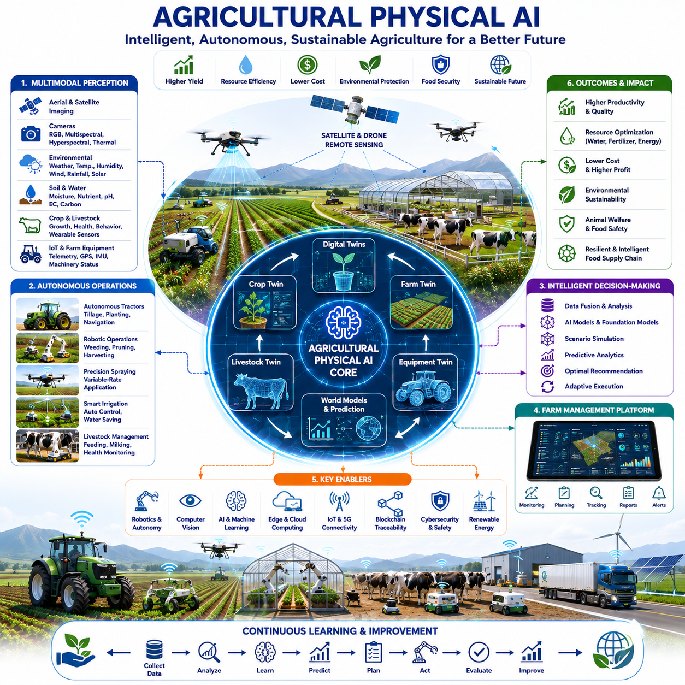
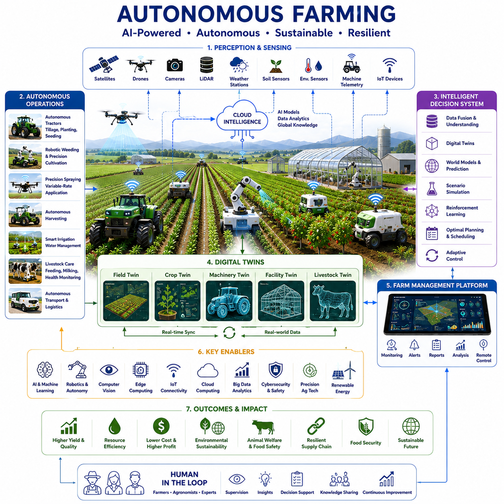
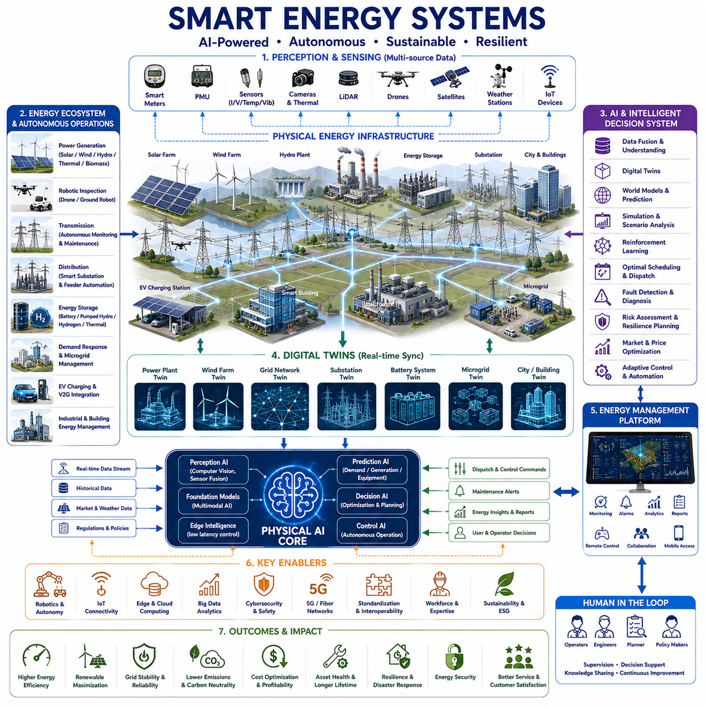
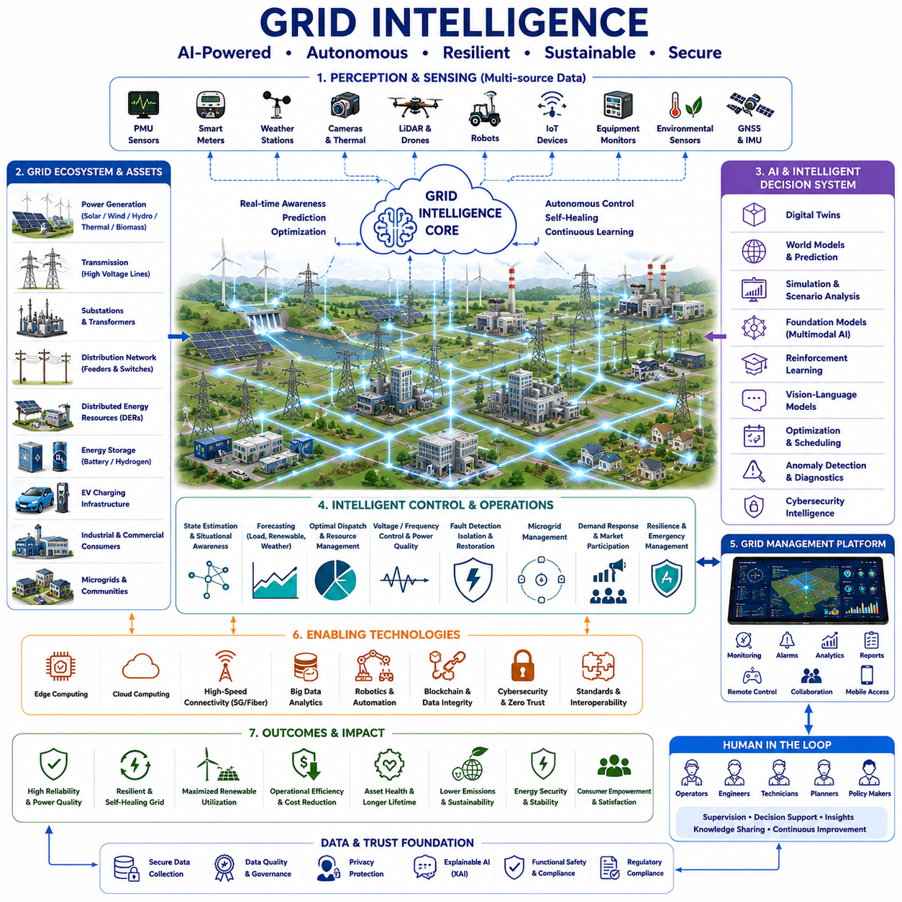
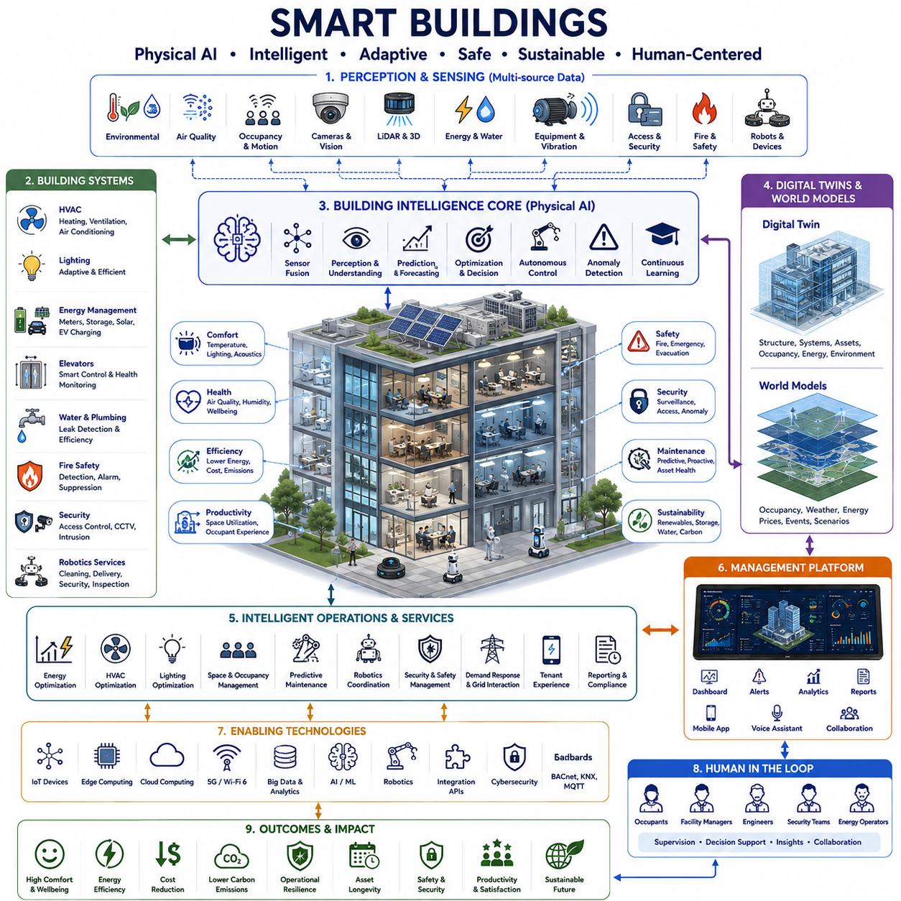
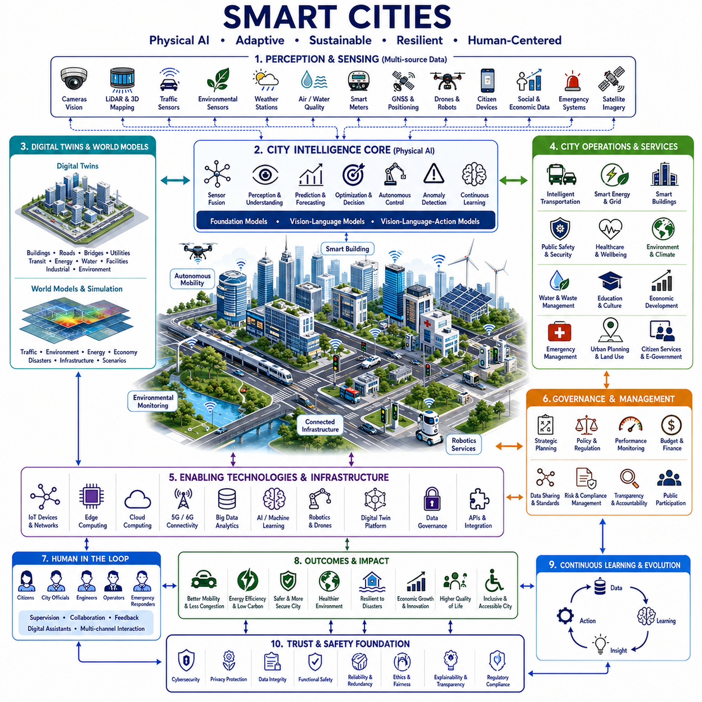
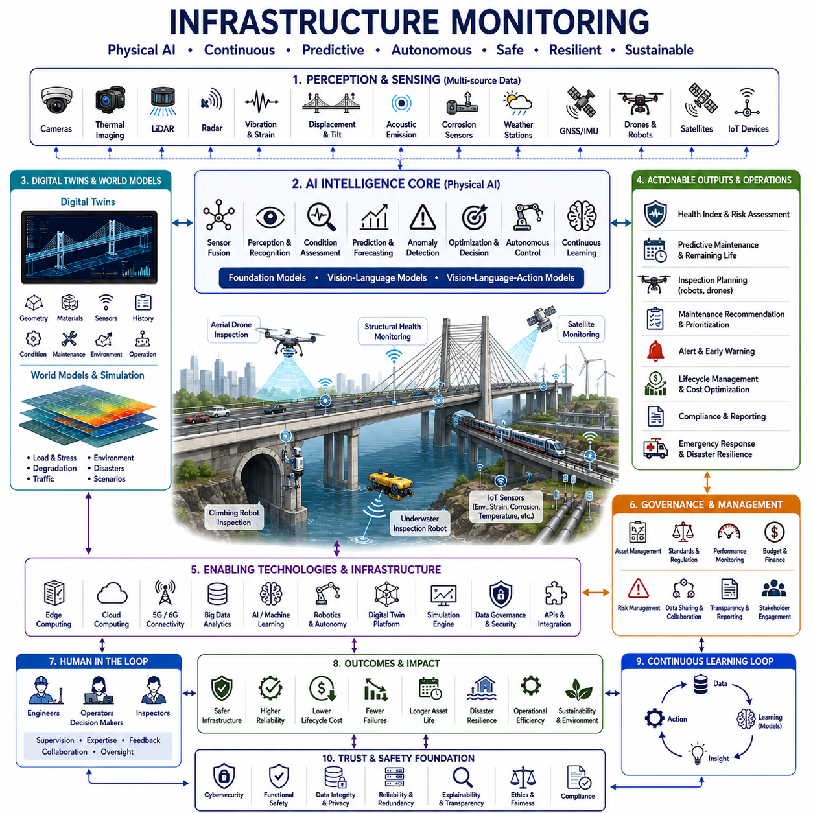
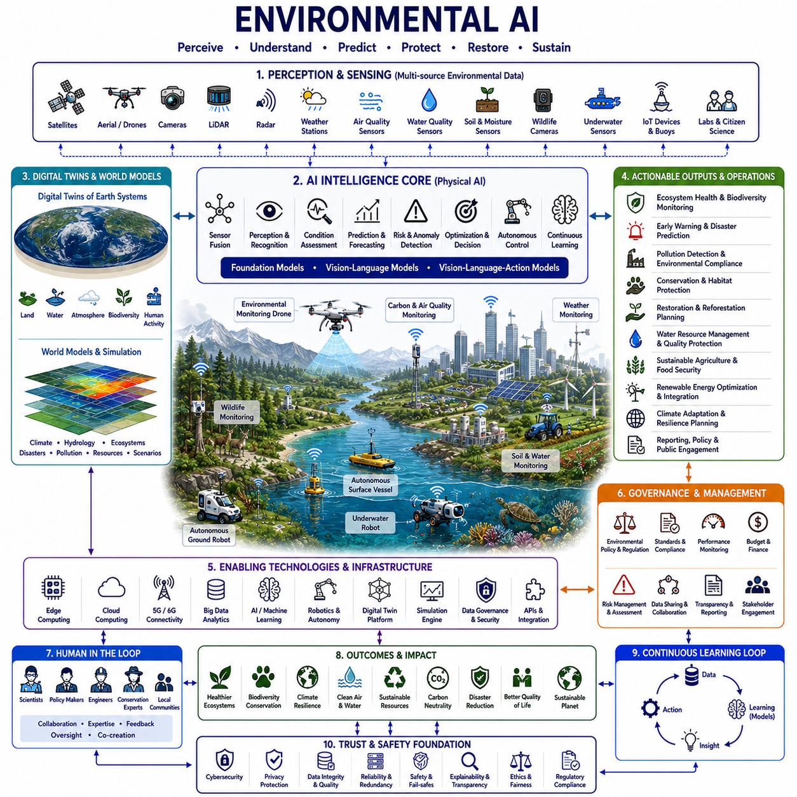

**Physical AI Engineering**


# Chapter 11 Agriculture, Energy and Infrastructure 

##  

## 11-01 Agricultural Physical AI

{width="7.268055555555556in" height="7.268055555555556in"}

Agricultural Physical AI represents one of the most transformative applications of Physical Artificial Intelligence because it integrates robotics, autonomous systems, artificial intelligence, precision agriculture, Digital Twins, environmental sensing, biological science, and cyber-physical systems into intelligent agricultural ecosystems capable of continuously optimizing food production while preserving environmental sustainability. Agriculture has always depended upon the interaction between biological systems, environmental conditions, human expertise, and mechanical equipment. However, rapid population growth, climate change, labor shortages, resource limitations, increasing food demand, and environmental regulations are placing unprecedented pressure on global agricultural systems. Physical AI provides a new paradigm in which autonomous machines, intelligent sensing, predictive simulation, Digital Twins, and adaptive decision-making continuously collaborate with farmers to maximize productivity, reduce operational costs, improve crop quality, minimize environmental impact, and enable sustainable food production throughout the agricultural lifecycle.

The evolution of agricultural automation has progressed through multiple technological generations. Early agricultural mechanization focused primarily on tractors, harvesters, irrigation systems, and mechanical implements that reduced manual labor while increasing operational efficiency. Precision agriculture later introduced GPS guidance, Geographic Information Systems, yield mapping, remote sensing, variable-rate technology, and farm management software to optimize agricultural operations using spatial information. More recently, advances in robotics, computer vision, Foundation Models, multimodal artificial intelligence, autonomous navigation, Digital Twins, World Models, reinforcement learning, edge computing, and Physical AI have transformed agriculture from machine-assisted farming into intelligent autonomous ecosystems capable of continuously perceiving environmental conditions, predicting biological development, coordinating robotic operations, and adapting agricultural strategies in real time.

The primary objective of Agricultural Physical AI extends far beyond replacing agricultural labor. Intelligent agricultural systems seek to optimize productivity, sustainability, profitability, environmental conservation, biodiversity, food quality, water utilization, energy efficiency, carbon reduction, soil health, and long-term resilience simultaneously. Rather than executing fixed agricultural procedures, Physical AI continuously understands dynamic biological processes, environmental changes, market conditions, and operational constraints while generating adaptive management strategies throughout every stage of crop cultivation, livestock production, greenhouse management, forestry, and agricultural logistics.

Perception forms the sensory foundation of Agricultural Physical AI. Modern intelligent agricultural systems integrate RGB cameras, multispectral cameras, hyperspectral imaging systems, thermal cameras, depth cameras, stereo vision systems, LiDAR, radar, satellite imagery, unmanned aerial vehicles, autonomous ground vehicles, weather stations, soil moisture sensors, soil nutrient sensors, pH sensors, electrical conductivity sensors, carbon dioxide sensors, humidity sensors, wind sensors, rainfall gauges, solar radiation sensors, groundwater monitoring systems, irrigation controllers, livestock monitoring devices, wearable animal sensors, GPS receivers, inertial measurement units, crop growth sensors, agricultural Internet of Things platforms, and farm management information systems. Together these sensing technologies continuously observe crops, livestock, soil conditions, environmental factors, machinery performance, resource utilization, and agricultural infrastructure while providing comprehensive situational awareness throughout entire farming operations.

Sensor fusion significantly improves agricultural intelligence because biological systems cannot be understood through isolated observations. Satellite imagery provides large-scale field monitoring but lacks detailed plant physiology. Soil sensors accurately measure underground conditions while providing limited crop health information. Weather stations predict environmental change but cannot directly evaluate biological responses. Drone imagery detects vegetation stress but cannot determine nutrient availability independently. Physical AI integrates visual observations, environmental measurements, biological indicators, historical agricultural records, weather forecasts, machinery telemetry, and Digital Twin information into unified agricultural models capable of understanding complex interactions between plants, animals, machinery, and ecosystems.

Computer vision serves as one of the most influential technologies within Agricultural Physical AI. Deep learning continuously recognizes crop species, plant growth stages, flowering, fruit development, weed distribution, disease symptoms, pest infestation, nutrient deficiencies, irrigation requirements, harvest readiness, livestock behavior, animal health, machinery operation, field obstacles, soil conditions, and infrastructure status. Rather than simply classifying images, Physical AI interprets visual information according to environmental conditions, seasonal variation, crop genetics, historical productivity, management practices, and long-term agricultural objectives. Intelligent visual understanding therefore supports autonomous decision-making across planting, cultivation, irrigation, fertilization, harvesting, storage, and transportation.

Three-dimensional perception substantially improves agricultural precision. Stereo vision, structured light sensing, LiDAR mapping, photogrammetry, simultaneous localization and mapping, Digital Twin synchronization, and three-dimensional crop reconstruction accurately model plant geometry, canopy structure, orchard architecture, greenhouse environments, livestock facilities, irrigation infrastructure, agricultural machinery, warehouses, and entire farming landscapes. Three-dimensional understanding enables robotic harvesting, precision spraying, autonomous navigation, biomass estimation, yield prediction, crop growth monitoring, and infrastructure inspection while reducing operational uncertainty.

Multimodal intelligence distinguishes Agricultural Physical AI from conventional farm automation. Agricultural decision-making depends simultaneously upon weather conditions, soil chemistry, crop physiology, biological development, environmental stress, machinery status, market demand, labor availability, water resources, energy consumption, historical productivity, and regulatory constraints. Physical AI integrates these heterogeneous information sources into unified reasoning systems capable of understanding agricultural ecosystems holistically rather than analyzing individual variables independently.

Agricultural Digital Twins represent one of the most transformative technologies within intelligent farming. Every agricultural field, greenhouse, orchard, vineyard, livestock facility, irrigation network, autonomous machine, storage warehouse, and processing plant maintains a continuously evolving Digital Twin describing biological development, environmental conditions, operational history, equipment configuration, maintenance records, resource utilization, and production performance. Individual crops similarly maintain Digital Twins describing genetic characteristics, physiological status, growth progression, nutrient balance, disease susceptibility, irrigation requirements, and predicted yield. Continuous synchronization between real-world observations and Digital Twins enables highly personalized agricultural management throughout complete production cycles.

World Models significantly extend Digital Twins by predicting future agricultural conditions under alternative scenarios. Rather than representing only current field conditions, World Models simulate crop growth, disease progression, pest dynamics, weather variation, irrigation effectiveness, nutrient transport, livestock development, greenhouse climate behavior, harvesting schedules, logistics coordination, equipment utilization, market fluctuations, and long-term environmental sustainability. Predictive intelligence allows farmers to evaluate multiple management strategies before implementing physical operations while minimizing economic risk and environmental impact.

Simulation constitutes one of the most valuable engineering methodologies supporting Agricultural Physical AI. Crop growth simulation models photosynthesis, biomass accumulation, root development, nutrient uptake, flowering, fruit formation, water transport, and yield generation. Environmental simulation predicts temperature, humidity, wind, rainfall, evaporation, and microclimate behavior. Soil simulation models moisture transport, nutrient diffusion, microbial activity, erosion, salinity, and carbon sequestration. Machinery simulation evaluates autonomous vehicle dynamics, robotic manipulation, harvesting efficiency, energy consumption, and operational safety. Reinforcement learning environments enable autonomous agricultural robots to optimize navigation, manipulation, spraying, harvesting, and cooperative operation before real-world deployment.

Foundation Models introduce generalized agricultural intelligence spanning agronomy, plant science, soil science, entomology, climatology, veterinary medicine, robotics, logistics, environmental engineering, and agricultural economics. Instead of constructing isolated artificial intelligence systems for every crop, livestock species, agricultural machine, or geographic region, Foundation Models learn transferable agricultural knowledge capable of adapting rapidly to diverse farming environments through efficient fine-tuning. Generalized agricultural intelligence therefore accelerates deployment while improving adaptability across global agricultural systems.

Vision-Language Models fundamentally improve communication throughout agriculture. Farmers, agronomists, veterinarians, engineers, greenhouse operators, logistics managers, researchers, and autonomous systems communicate naturally through spoken language while AI simultaneously interprets aerial imagery, physiological observations, weather forecasts, soil measurements, Digital Twins, agricultural documentation, market information, and operational history. Vision-Language Models explain crop conditions, summarize farm performance, recommend management strategies, answer technical questions, generate agricultural reports, support collaborative decision-making, and improve transparency throughout intelligent farming operations.

Vision-Language-Action Models extend agricultural intelligence into autonomous physical execution. Agricultural robots, autonomous tractors, robotic harvesters, precision sprayers, autonomous drones, greenhouse manipulators, livestock assistants, irrigation systems, warehouse robots, and logistics vehicles perceive environmental conditions, understand operator intentions, reason about agricultural objectives, and execute adaptive actions safely. Physical AI therefore transforms agricultural knowledge into autonomous physical operations while maintaining human supervision, operational reliability, and functional safety.

Human expertise remains an essential component of Agricultural Physical AI. Experienced farmers possess extensive knowledge regarding regional climate, seasonal variation, crop management, livestock behavior, soil characteristics, local biodiversity, cultural practices, and economic decision-making. Physical AI continuously learns from expert knowledge while combining it with large-scale computational reasoning, predictive analytics, and autonomous execution. Intelligent agricultural systems therefore enhance rather than replace agricultural professionals, allowing human expertise and artificial intelligence to collaborate effectively.

Human behavior modeling similarly improves agricultural productivity by understanding farmer decision-making, operational preferences, workload distribution, equipment utilization, communication patterns, and management strategies. Personalized agricultural assistants adapt recommendations according to individual farming practices, regional conditions, available resources, financial objectives, sustainability priorities, and long-term operational goals. Continuous interaction enables Physical AI to become increasingly personalized while respecting established agricultural knowledge and farmer autonomy.

Livestock management represents another major application domain. Intelligent livestock systems continuously monitor animal physiology, feeding behavior, movement, reproduction, disease symptoms, emotional wellbeing, environmental conditions, milk production, weight gain, and welfare indicators. Computer vision recognizes individual animals, evaluates body condition, detects injuries, identifies abnormal behavior, and supports veterinary diagnosis. Autonomous feeding systems, robotic milking stations, environmental control systems, and Digital Twins collectively optimize livestock productivity while improving animal welfare and reducing labor requirements.

Greenhouse agriculture increasingly utilizes Physical AI for precise environmental management. Intelligent greenhouses continuously regulate temperature, humidity, carbon dioxide concentration, lighting, irrigation, nutrient delivery, ventilation, shading, pest control, and pollination according to continuously evolving crop Digital Twins. Autonomous robots perform planting, pruning, harvesting, inspection, pollination, and logistics while minimizing resource consumption and maximizing production consistency throughout the year.

Agricultural logistics also benefit substantially from Physical AI. Autonomous mobile robots transport harvested crops, warehouse robots organize storage facilities, predictive scheduling optimizes harvesting sequences, Digital Twins coordinate supply chains, autonomous trucks support transportation, and intelligent inventory systems monitor food quality throughout storage and distribution. Predictive logistics minimizes waste while improving freshness, traceability, and food safety.

Environmental sustainability represents a fundamental design objective. Agricultural Physical AI continuously optimizes water consumption, fertilizer application, pesticide utilization, energy efficiency, carbon emissions, biodiversity preservation, soil regeneration, waste recycling, and ecosystem resilience. Precision agriculture enables localized intervention according to actual biological requirements rather than uniform field treatment, significantly reducing environmental impact while maintaining productivity.

Cloud-edge computing architectures efficiently distribute agricultural intelligence. Embedded edge devices perform deterministic sensing, autonomous navigation, robotic control, irrigation management, environmental monitoring, and safety verification with minimal latency. Local farm servers coordinate Digital Twins, autonomous machinery, greenhouse operations, livestock facilities, and logistics systems. Cloud platforms support Foundation Model training, predictive analytics, weather simulation, agricultural research, regional optimization, collaborative knowledge sharing, and large-scale environmental analysis while maintaining secure agricultural data management.

Cybersecurity becomes increasingly important as agricultural infrastructure becomes digitally connected. Intelligent agricultural systems continuously process operational information, biological data, environmental measurements, equipment telemetry, supply chain records, financial information, and Digital Twin models. Secure communication, encrypted storage, authenticated devices, trusted hardware, zero-trust architectures, anomaly detection, access control, audit logging, explainable artificial intelligence, and resilient network design collectively protect agricultural infrastructure against cyber threats while ensuring reliable food production.

Functional safety similarly remains essential because autonomous agricultural machinery operates alongside humans, animals, crops, and critical infrastructure. Physical AI continuously validates sensor integrity, Digital Twin synchronization, environmental awareness, model confidence, communication reliability, robotic behavior, machinery health, and operational constraints before generating recommendations or autonomous actions. Redundant sensing, fail-safe architectures, emergency intervention, independent verification, explainable reasoning, and continuous human supervision collectively ensure safe agricultural operation throughout diverse environmental conditions.

Ethical principles remain fundamental throughout Agricultural Physical AI development. Environmental stewardship, food security, sustainability, fairness, transparency, accountability, biodiversity preservation, accessibility, cultural respect, responsible automation, explainability, and human-centered design must remain foundational engineering principles. Intelligent agricultural systems should empower farmers, strengthen rural communities, improve global food availability, and preserve natural ecosystems while respecting regional agricultural traditions and human expertise.

The future evolution of Agricultural Physical AI extends toward fully integrated agricultural ecosystems where autonomous robots, Digital Twins, World Models, intelligent infrastructure, smart supply chains, precision environmental management, regenerative agriculture, climate adaptation, and lifelong agricultural learning operate collaboratively across global food production systems. Every environmental observation improves predictive models. Every harvest strengthens agricultural knowledge. Every Digital Twin evolves continuously throughout biological development. Every autonomous operation contributes to increasingly sustainable farming. Physical AI therefore enables increasingly predictive, preventive, personalized, adaptive, explainable, trustworthy, and environmentally responsible agriculture throughout complete agricultural lifecycles.

Agricultural Physical AI therefore represents far more than autonomous tractors or precision farming technologies. It embodies the convergence of robotics, artificial intelligence, Digital Twins, World Models, multimodal perception, Foundation Models, simulation, autonomous systems, cloud-edge intelligence, agricultural engineering, biological science, environmental modeling, logistics, cyber-physical systems, and human-centered agricultural management into a unified Physical AI platform capable of understanding agricultural ecosystems comprehensively, predicting biological development, optimizing resource utilization, supporting farmers, protecting the environment, strengthening global food security, and enabling the next generation of intelligent, sustainable, and resilient agricultural systems. As Physical AI continues to mature, Agricultural Physical AI will become one of the foundational technologies supporting precision agriculture, autonomous farming, regenerative ecosystems, climate-resilient food production, intelligent agricultural infrastructure, and the future of sustainable human civilization.

농업 물리적 AI(Agricultural Physical AI)는 물리적 AI(Physical AI)의 가장 혁신적인 응용 분야 가운데 하나로, 로보틱스(Robotics), 자율 시스템(Autonomous Systems), 인공지능(Artificial Intelligence), 정밀 농업(Precision Agriculture), 디지털 트윈(Digital Twin), 환경 센싱(Environmental Sensing), 생명과학(Biological Science), 사이버-물리 시스템(Cyber-Physical System)을 통합하여 지속 가능한 식량 생산(Sustainable Food Production)을 실현하는 지능형 농업 생태계(Intelligent Agricultural Ecosystem)를 구축하는 기술이다. 농업은 오랫동안 생물학적 시스템(Biological System), 자연환경(Environmental Condition), 인간의 경험(Human Expertise), 농기계(Mechanical Equipment)가 상호작용하는 산업이었다. 그러나 세계 인구 증가(Population Growth), 기후 변화(Climate Change), 농업 인력 부족(Labor Shortage), 자원 제한(Resource Limitation), 식량 수요 증가(Increasing Food Demand), 환경 규제(Environmental Regulation)가 동시에 심화되면서 기존 농업 방식만으로는 지속 가능한 생산을 유지하기 어려워지고 있다. 물리적 AI는 자율 로봇, 지능형 센싱(Intelligent Sensing), 예측 시뮬레이션(Predictive Simulation), 디지털 트윈, 적응형 의사결정(Adaptive Decision-Making)을 활용하여 생산성을 극대화하고 운영 비용을 절감하며 농산물 품질을 향상시키고 환경 영향을 최소화하는 새로운 농업 패러다임을 제공한다.

농업 자동화(Agricultural Automation)는 여러 단계의 기술 발전을 거쳐 진화하였다. 초기 농업 기계화(Mechanization)는 트랙터(Tractor), 수확기(Harvester), 관개 시스템(Irrigation System), 농기계(Implement)를 이용하여 노동력을 줄이고 작업 효율을 높이는 데 집중하였다. 이후 정밀 농업은 GPS(Global Positioning System), 지리정보시스템(Geographic Information System, GIS), 수확량 지도(Yield Mapping), 원격 탐사(Remote Sensing), 가변 투입 기술(Variable-Rate Technology), 농장 관리 시스템(Farm Management Software)을 이용하여 위치 기반 농업을 실현하였다. 최근에는 로보틱스, 컴퓨터 비전(Computer Vision), 파운데이션 모델(Foundation Model), 다중 모달 인공지능(Multimodal Artificial Intelligence), 자율주행(Autonomous Navigation), 디지털 트윈, 세계 모델(World Model), 강화학습(Reinforcement Learning), 엣지 컴퓨팅(Edge Computing), 물리적 AI가 결합되면서 농업은 단순한 기계 자동화를 넘어 생물학적 성장과 환경 변화를 이해하고 스스로 의사결정을 수행하는 자율 농업 생태계(Autonomous Agricultural Ecosystem)로 발전하고 있다.

농업 물리적 AI의 목적은 단순히 농업 노동을 대체하는 것이 아니다. 지능형 농업은 생산성(Productivity), 지속 가능성(Sustainability), 수익성(Profitability), 환경 보전(Environmental Conservation), 생물 다양성(Biodiversity), 농산물 품질(Food Quality), 물 이용 효율(Water Utilization), 에너지 효율(Energy Efficiency), 탄소 배출 저감(Carbon Reduction), 토양 건강(Soil Health), 장기적인 농업 회복력(Long-Term Resilience)을 동시에 최적화하는 것을 목표로 한다. 물리적 AI는 고정된 농작업 절차를 반복하는 것이 아니라 생물학적 성장 과정(Biological Process), 환경 변화(Environmental Change), 시장 상황(Market Condition), 운영 제약(Operation Constraint)을 지속적으로 이해하고 재배(Cultivation), 축산(Livestock Production), 온실 관리(Greenhouse Management), 산림 관리(Forestry), 농업 물류(Agricultural Logistics) 전반에 걸쳐 적응형 전략을 생성한다.

인지(Perception)는 농업 물리적 AI의 감각기관이다. 현대의 농업 시스템은 RGB 카메라(Camera), 다중분광 카메라(Multispectral Camera), 초분광 카메라(Hyperspectral Imaging System), 열화상 카메라(Thermal Camera), 깊이 카메라(Depth Camera), 스테레오 비전(Stereo Vision), 라이다(LiDAR), 레이더(Radar), 위성 영상(Satellite Imagery), 무인항공기(Unmanned Aerial Vehicle, UAV), 자율주행 지상 차량(Autonomous Ground Vehicle), 기상 관측소(Weather Station), 토양 수분 센서(Soil Moisture Sensor), 토양 영양 센서(Soil Nutrient Sensor), pH 센서, 전기전도도 센서(Electrical Conductivity Sensor), 이산화탄소 센서(Carbon Dioxide Sensor), 습도 센서(Humidity Sensor), 풍속 센서(Wind Sensor), 강우량 측정기(Rainfall Gauge), 일사량 센서(Solar Radiation Sensor), 지하수 모니터링 시스템(Groundwater Monitoring System), 관개 제어기(Irrigation Controller), 가축 모니터링 장치(Livestock Monitoring Device), 웨어러블 동물 센서(Wearable Animal Sensor), GPS 수신기, IMU(Inertial Measurement Unit), 작물 생육 센서(Crop Growth Sensor), 농업 사물인터넷(Agricultural Internet of Things), 농장 관리 정보 시스템(Farm Management Information System)을 통합하여 작물, 가축, 토양, 환경, 농기계, 자원 사용량, 농업 인프라를 지속적으로 관찰한다.

센서 융합(Sensor Fusion)은 농업의 지능화를 크게 향상시킨다. 위성 영상은 넓은 농경지를 모니터링할 수 있지만 개별 식물의 생리 상태는 알기 어렵다. 토양 센서는 지하 환경을 정확하게 측정하지만 작물 건강 상태는 직접 알 수 없다. 기상 관측소는 날씨를 예측하지만 식물의 반응은 설명하지 못한다. 드론 영상은 작물 스트레스를 발견할 수 있지만 영양 상태는 직접 판단하기 어렵다. 물리적 AI는 영상 정보, 환경 데이터, 생물학적 지표(Biological Indicator), 과거 농업 데이터, 기상 예보, 농기계 상태(Machinery Telemetry), 디지털 트윈을 통합하여 작물, 동물, 기계, 생태계 사이의 복잡한 관계를 이해한다.

컴퓨터 비전(Computer Vision)은 농업 물리적 AI의 핵심 기술이다. 딥러닝은 작물 종류(Crop Species), 생육 단계(Growth Stage), 개화(Flowering), 과실 성장(Fruit Development), 잡초(Weed Distribution), 병해(Disease Symptom), 해충(Pest Infestation), 영양 결핍(Nutrient Deficiency), 관개 필요성(Irrigation Requirement), 수확 시기(Harvest Readiness), 가축 행동(Livestock Behavior), 동물 건강, 농기계 상태(Machinery Operation), 장애물(Field Obstacle), 토양 상태, 농업 시설을 지속적으로 인식한다. 물리적 AI는 단순히 영상을 분류하는 것이 아니라 환경 조건, 계절 변화, 품종 특성, 과거 생산량, 재배 방식, 장기적인 농업 목표를 함께 고려하여 의사결정을 수행한다.

3차원 인지(Three-Dimensional Perception)는 농업의 정밀도를 크게 향상시킨다. 스테레오 비전, 구조광 센서(Structured Light Sensor), 라이다 매핑(LiDAR Mapping), 사진측량(Photogrammetry), 동시 위치추정 및 지도작성(Simultaneous Localization and Mapping, SLAM), 디지털 트윈 동기화는 작물의 형상, 수관 구조(Canopy Structure), 과수원 구조(Orchard Architecture), 온실 구조(Greenhouse Environment), 축사(Livestock Facility), 관개 시설(Irrigation Infrastructure), 농기계, 창고(Warehouse), 농장 전체를 정밀하게 모델링한다. 이를 통해 로봇 수확(Robotic Harvesting), 정밀 방제(Precision Spraying), 자율주행, 생체량 추정(Biomass Estimation), 생산량 예측(Yield Prediction), 작물 생육 분석, 시설 점검이 가능해진다.

다중 모달 지능(Multimodal Intelligence)은 농업 물리적 AI를 기존 농업 자동화와 구별하는 핵심 요소이다. 농업은 날씨, 토양 화학(Soil Chemistry), 작물 생리(Crop Physiology), 생물학적 성장(Biological Development), 환경 스트레스(Environmental Stress), 농기계 상태, 시장 수요(Market Demand), 노동력, 수자원, 에너지 사용량, 과거 생산량, 규제 조건을 동시에 고려해야 한다. 물리적 AI는 이러한 다양한 정보를 하나의 통합된 추론 시스템으로 결합하여 농업 생태계를 전체적으로 이해한다.

농업 디지털 트윈(Agricultural Digital Twin)은 미래 농업의 핵심 기술이다. 모든 농경지(Field), 온실(Greenhouse), 과수원(Orchard), 포도원(Vineyard), 축사, 관개 시스템, 자율 농기계, 저장 창고(Storage Warehouse), 가공 시설(Processing Plant)은 생육 상태, 환경 조건, 운영 이력, 장비 설정, 유지보수 기록, 자원 사용량, 생산 성과를 포함하는 디지털 트윈을 유지한다. 개별 작물 역시 품종, 생리 상태, 성장 과정, 영양 균형, 병해충 위험, 관개 요구량, 예상 수확량을 포함하는 디지털 트윈을 갖게 된다. 이러한 디지털 트윈은 실제 환경과 지속적으로 동기화되면서 농업 운영을 최적화한다.

세계 모델(World Model)은 디지털 트윈을 미래 예측 시스템으로 확장한다. 현재 상태뿐 아니라 작물 성장, 병해 진행, 해충 확산, 기후 변화, 관개 효과, 영양 이동, 가축 성장, 온실 환경, 수확 일정, 물류 운영, 장비 활용, 시장 변화, 장기적인 지속 가능성을 시뮬레이션한다. 농업인은 여러 가지 운영 전략을 실제 적용하기 전에 비교하고 최적의 선택을 할 수 있다.

시뮬레이션(Simulation)은 농업 물리적 AI의 핵심 공학 기술이다. 작물 성장 시뮬레이션(Crop Growth Simulation)은 광합성(Photosynthesis), 생체량 증가(Biomass Accumulation), 뿌리 성장(Root Development), 영양 흡수(Nutrient Uptake), 개화, 과실 형성, 수분 이동(Water Transport), 수확량을 예측한다. 환경 시뮬레이션(Environmental Simulation)은 온도, 습도, 바람, 강우, 증발(Evaporation), 미기후(Microclimate)를 분석한다. 토양 시뮬레이션(Soil Simulation)은 수분 이동, 영양 확산, 미생물 활동(Microbial Activity), 침식(Erosion), 염분 축적(Salinity), 탄소 저장(Carbon Sequestration)을 예측한다. 농기계 시뮬레이션(Machinery Simulation)은 자율주행 차량, 로봇 조작, 수확 효율, 에너지 소비, 안전성을 분석한다. 강화학습 환경은 농업 로봇이 실제 농장에 투입되기 전에 이동, 수확, 방제, 협업을 학습하도록 지원한다.

파운데이션 모델(Foundation Model)은 농학(Agronomy), 식물학(Plant Science), 토양학(Soil Science), 곤충학(Entomology), 기후학(Climatology), 수의학(Veterinary Medicine), 로보틱스, 물류(Logistics), 환경공학(Environmental Engineering), 농업 경제학(Agricultural Economics)을 포괄하는 범용 지식을 학습한다. 특정 작물이나 지역마다 별도의 AI를 만드는 것이 아니라 하나의 모델이 다양한 작물, 가축, 농기계, 기후 환경에 빠르게 적응(Fine-Tuning)할 수 있다.

비전-언어 모델(Vision-Language Model)은 농업에서의 의사소통을 혁신한다. 농업인(Farmer), 농업 전문가(Agronomist), 수의사(Veterinarian), 엔지니어, 온실 관리자, 물류 관리자, 연구자는 자연어로 AI와 대화할 수 있으며 AI는 드론 영상, 생육 데이터, 기상 정보, 토양 정보, 디지털 트윈, 농업 문서, 시장 정보를 동시에 이해한다. AI는 작물 상태를 설명하고 농장 운영을 요약하며 재배 전략을 제안하고 기술적인 질문에 답하며 농업 보고서를 생성한다.

비전-언어-행동 모델(Vision-Language-Action Model)은 농업 지능을 실제 물리적 작업으로 연결한다. 농업 로봇(Agricultural Robot), 자율 트랙터(Autonomous Tractor), 수확 로봇(Robotic Harvester), 정밀 방제 로봇(Precision Sprayer), 자율 드론(Autonomous Drone), 온실 로봇(Greenhouse Manipulator), 가축 관리 로봇(Livestock Assistant), 자동 관개 시스템(Irrigation System), 창고 로봇(Warehouse Robot), 물류 차량(Logistics Vehicle)은 환경을 인식하고 사용자의 의도를 이해하며 농업 목표를 추론하고 안전하게 작업을 수행한다. 물리적 AI는 인간의 감독을 유지하면서 지능을 실제 농작업으로 연결한다.

인간의 경험(Human Expertise)은 농업 물리적 AI에서 여전히 매우 중요하다. 숙련된 농업인은 지역 기후, 계절 변화, 작물 재배, 가축 관리, 토양 특성, 생물 다양성, 전통 농법, 경제적 판단에 대한 풍부한 경험을 갖고 있다. 물리적 AI는 이러한 경험을 학습하여 대규모 계산 능력과 결합함으로써 인간을 대체하는 것이 아니라 더욱 강력한 의사결정을 지원한다.

인간 행동 모델링(Human Behavior Modeling)은 농업인의 의사결정 방식, 작업 습관, 장비 사용 패턴, 의사소통 방식, 운영 전략을 이해한다. AI는 농업인의 선호도, 지역 특성, 자원 상황, 경제적 목표, 지속 가능성 목표에 맞추어 점점 더 개인화된 농업 지원을 제공한다.

축산(Livestock Management)은 또 하나의 중요한 응용 분야이다. 지능형 축산 시스템은 가축의 생리 상태, 먹이 섭취, 이동, 번식(Reproduction), 질병 증상, 감정 상태, 환경 조건, 우유 생산량(Milk Production), 체중 증가, 복지 수준(Animal Welfare)을 지속적으로 분석한다. 컴퓨터 비전은 개체를 식별하고 체형(Body Condition), 상처, 이상 행동을 감지하며 수의학적 진단을 지원한다. 자동 급이 시스템(Autonomous Feeding System), 로봇 착유기(Robotic Milking Station), 환경 제어 시스템(Environmental Control System), 디지털 트윈은 생산성을 향상시키면서 동물 복지를 개선한다.

온실 농업(Greenhouse Agriculture)은 물리적 AI를 활용하여 환경을 정밀하게 제어한다. 온도, 습도, 이산화탄소 농도, 조명, 관개, 양분 공급, 환기(Ventilation), 차광(Shading), 병해충 관리, 수분(Pollination)을 작물 디지털 트윈에 따라 자동으로 조절한다. 자율 로봇은 파종, 가지치기(Pruning), 수확, 검사, 수분 작업, 물류를 수행하면서 자원 소비를 최소화하고 연중 일정한 생산성을 유지한다.

농업 물류(Agricultural Logistics) 역시 물리적 AI의 중요한 응용 분야이다. 자율 이동 로봇은 수확물을 운반하고 창고 로봇은 저장을 관리하며 예측 스케줄링(Predictive Scheduling)은 수확 일정을 최적화한다. 디지털 트윈은 공급망(Supply Chain)을 연결하고 자율 트럭은 운송을 수행하며 지능형 재고 관리(Intelligent Inventory System)는 저장과 유통 과정에서 품질과 신선도를 유지한다. 이를 통해 식품 손실(Food Waste)을 줄이고 추적성(Traceability)과 식품 안전(Food Safety)을 향상시킨다.

환경 지속 가능성(Environmental Sustainability)은 농업 물리적 AI의 핵심 목표이다. 물 사용량(Water Consumption), 비료(Fertilizer), 농약(Pesticide), 에너지 소비(Energy Consumption), 탄소 배출(Carbon Emission), 생물 다양성, 토양 복원(Soil Regeneration), 폐기물 재활용(Waste Recycling), 생태계 회복력(Ecosystem Resilience)을 지속적으로 최적화한다. 정밀 농업은 동일한 양을 일괄적으로 사용하는 것이 아니라 필요한 위치에 필요한 양만 사용하는 방식으로 환경 영향을 크게 줄인다.

클라우드-엣지 컴퓨팅(Cloud-Edge Computing)은 농업 지능을 효율적으로 분산한다. 엣지 장치는 실시간 센싱, 자율주행, 로봇 제어, 관개 제어, 환경 모니터링, 안전 검증을 수행한다. 농장 서버(Local Farm Server)는 디지털 트윈, 자율 농기계, 온실, 축사, 물류 시스템을 관리한다. 클라우드는 파운데이션 모델 학습, 예측 분석, 기상 시뮬레이션, 농업 연구, 지역 최적화, 대규모 데이터 공유를 수행하면서 농업 데이터를 안전하게 관리한다.

사이버 보안(Cybersecurity)은 디지털 농업에서 점점 더 중요해지고 있다. 농업 시스템은 운영 정보, 생물학적 데이터, 환경 정보, 농기계 상태, 공급망 정보, 재무 데이터, 디지털 트윈을 지속적으로 처리한다. 암호화 통신(Encrypted Communication), 암호화 저장(Encrypted Storage), 인증(Authentication), 신뢰 가능한 하드웨어(Trusted Hardware), 제로 트러스트(Zero Trust), 이상 탐지(Anomaly Detection), 접근 제어(Access Control), 감사 로그(Audit Logging), 설명 가능한 AI(Explainable AI)는 사이버 공격으로부터 농업 인프라를 보호하고 안정적인 식량 생산을 유지한다.

기능 안전(Functional Safety)은 자율 농기계가 사람, 가축, 작물과 함께 작업하기 때문에 매우 중요하다. 물리적 AI는 센서 상태, 디지털 트윈 동기화, 환경 인식, AI 모델의 신뢰도, 통신 상태, 로봇 행동, 농기계 상태를 지속적으로 검증한 후 자율 작업을 수행한다. 중복 센서(Redundant Sensor), Fail-Safe 구조, 비상 정지(Emergency Intervention), 독립 검증(Independent Verification), 설명 가능한 AI, 인간의 감독(Human Supervision)을 통해 다양한 환경에서도 안전한 농업 작업을 보장한다.

윤리(Ethics)는 농업 물리적 AI 개발의 핵심 원칙이다. 환경 보호(Environmental Stewardship), 식량 안보(Food Security), 지속 가능성(Sustainability), 공정성(Fairness), 투명성(Transparency), 책임성(Accountability), 생물 다양성 보전(Biodiversity Preservation), 접근성(Accessibility), 문화적 존중(Cultural Respect), 책임 있는 자동화(Responsible Automation), 설명 가능성(Explainability), 인간 중심 설계(Human-Centered Design)는 반드시 유지되어야 한다. 지능형 농업 시스템은 농업인을 대체하는 것이 아니라 농업인의 역량을 강화하고 지역 사회를 지원하며 지속 가능한 식량 생산을 가능하게 해야 한다.

미래의 농업 물리적 AI는 자율 로봇, 디지털 트윈, 세계 모델, 지능형 인프라(Intelligent Infrastructure), 스마트 공급망(Smart Supply Chain), 정밀 환경 제어, 재생 농업(Regenerative Agriculture), 기후 적응(Climate Adaptation), 평생 학습(Lifelong Agricultural Learning)이 통합된 차세대 농업 생태계로 발전할 것이다. 모든 환경 데이터는 예측 모델을 향상시키고, 모든 수확은 농업 지식을 축적하며, 모든 디지털 트윈은 생물학적 성장과 함께 발전하고, 모든 자율 작업은 지속 가능한 농업을 더욱 발전시킬 것이다. 물리적 AI는 더욱 예측형(Predictive), 예방형(Preventive), 개인 맞춤형(Personalized), 적응형(Adaptive), 설명 가능한(Explainable), 신뢰 가능한(Trustworthy), 환경 친화적인(Environmentally Responsible) 농업을 구현하게 될 것이다.

결국 농업 물리적 AI는 단순한 자율 트랙터(Autonomous Tractor)나 정밀 농업 기술(Precision Farming Technology)이 아니다. 이는 로보틱스(Robotics), 인공지능(Artificial Intelligence), 디지털 트윈(Digital Twin), 세계 모델(World Model), 다중 모달 인지(Multimodal Perception), 파운데이션 모델(Foundation Model), 시뮬레이션(Simulation), 자율 시스템(Autonomous System), 클라우드-엣지 컴퓨팅(Cloud-Edge Intelligence), 농업 공학(Agricultural Engineering), 생명과학(Biological Science), 환경 모델링(Environmental Modeling), 물류(Logistics), 사이버-물리 시스템(Cyber-Physical System), 인간 중심 농업(Human-Centered Agriculture)을 하나의 통합된 물리적 AI 플랫폼으로 융합한 기술이다. 물리적 AI가 지속적으로 발전함에 따라 농업 물리적 AI는 정밀 농업(Precision Agriculture), 자율 농업(Autonomous Farming), 재생 농업(Regenerative Agriculture), 기후 적응형 식량 생산(Climate-Resilient Food Production), 지능형 농업 인프라(Intelligent Agricultural Infrastructure), 그리고 지속 가능한 인류 문명(Sustainable Human Civilization)을 실현하는 핵심 기반 기술이 될 것이다.

##  

## 11-02 Autonomous Farming

{width="7.268055555555556in" height="7.268055555555556in"}

Autonomous Farming represents one of the most advanced implementations of Physical Artificial Intelligence because it transforms traditional agricultural production into a continuously adaptive, intelligent, and self-optimizing ecosystem where autonomous machines, intelligent sensing, Digital Twins, predictive simulation, multimodal artificial intelligence, and human expertise operate as a unified cyber-physical system. Conventional farming has historically relied upon human observation, manual operation, seasonal experience, and mechanized equipment to perform cultivation, planting, irrigation, fertilization, pest control, harvesting, and logistics. Although modern agricultural machinery has significantly improved productivity, many farming decisions still depend upon human interpretation of highly dynamic biological and environmental conditions. Climate variability, labor shortages, increasing food demand, resource scarcity, environmental regulations, and sustainability requirements are driving agriculture toward a new generation of autonomous systems capable of continuously understanding the physical world, predicting biological processes, and executing adaptive agricultural operations with minimal human intervention. Physical AI provides the computational intelligence that enables autonomous farming to become predictive rather than reactive, adaptive rather than fixed, and collaborative rather than isolated.

The evolution of autonomous farming has occurred through several technological generations. The first generation emphasized mechanization through tractors, combines, seeders, irrigation systems, and agricultural implements that increased productivity while reducing manual labor. The second generation introduced precision agriculture through satellite positioning, geographic information systems, remote sensing, yield mapping, variable-rate technology, and digital farm management software. These technologies allowed field-specific optimization but continued to rely heavily on human supervision and decision-making. The current generation integrates robotics, computer vision, autonomous navigation, Digital Twins, World Models, multimodal perception, reinforcement learning, Foundation Models, edge computing, cloud intelligence, and Physical AI into comprehensive autonomous agricultural ecosystems capable of continuously monitoring crops, understanding environmental changes, coordinating robotic operations, optimizing resource utilization, and improving productivity throughout complete agricultural production cycles.

The fundamental objective of autonomous farming extends beyond reducing labor costs. Modern autonomous agricultural systems simultaneously optimize productivity, crop quality, profitability, sustainability, resource efficiency, environmental preservation, biodiversity, operational safety, carbon reduction, food security, and long-term agricultural resilience. Instead of executing predefined farming schedules, Physical AI continuously analyzes biological growth, environmental dynamics, equipment performance, weather uncertainty, soil conditions, and market demands while generating adaptive operational strategies that evolve throughout the growing season.

Perception serves as the sensory foundation of autonomous farming. Intelligent agricultural ecosystems integrate RGB cameras, multispectral cameras, hyperspectral imaging systems, thermal cameras, stereo vision systems, depth sensors, LiDAR, radar, satellite imagery, unmanned aerial vehicles, autonomous ground vehicles, weather stations, soil moisture sensors, soil nutrient sensors, pH sensors, electrical conductivity sensors, carbon dioxide sensors, temperature sensors, humidity sensors, wind sensors, rainfall monitoring systems, solar radiation sensors, groundwater monitoring systems, irrigation controllers, GPS receivers, inertial measurement units, machine telemetry, crop monitoring sensors, agricultural Internet of Things platforms, and Digital Twin infrastructures. Together these sensing technologies continuously observe every aspect of agricultural production, including plant physiology, soil conditions, environmental variation, machinery operation, infrastructure health, resource utilization, logistics activities, and ecosystem dynamics.

Sensor fusion significantly improves agricultural intelligence because individual sensors cannot fully describe biological systems. Satellite imagery provides wide-area observation but lacks microscopic physiological information. Soil sensors accurately measure underground conditions while providing limited information about crop health. Weather stations predict environmental conditions without directly evaluating plant response. Drone imagery detects stress symptoms but cannot independently determine nutrient transport or root activity. Physical AI integrates visual information, environmental measurements, biological indicators, historical agricultural records, machine telemetry, Digital Twin knowledge, and predictive environmental models into comprehensive agricultural representations capable of understanding complex interactions between plants, soil, water, machinery, climate, and ecosystems.

Computer vision represents one of the most influential technologies within autonomous farming. Deep learning continuously recognizes crop species, growth stages, flowering, fruit development, canopy structure, biomass accumulation, weed distribution, disease symptoms, pest infestation, nutrient deficiencies, irrigation requirements, harvest maturity, machinery status, field obstacles, worker locations, livestock conditions, and infrastructure integrity. Rather than merely detecting visual patterns, Physical AI interprets observations within biological, environmental, and operational contexts, allowing autonomous agricultural systems to generate intelligent management strategies according to continuously evolving field conditions.

Three-dimensional perception substantially improves autonomous agricultural precision. Stereo vision, structured light sensing, LiDAR mapping, photogrammetry, simultaneous localization and mapping, Digital Twin synchronization, and three-dimensional reconstruction create highly accurate geometric representations of fields, orchards, vineyards, greenhouses, crop canopies, irrigation systems, agricultural machinery, storage facilities, and transportation infrastructure. Autonomous robots use these three-dimensional models to navigate safely, manipulate crops precisely, estimate biomass, evaluate growth, identify harvesting opportunities, inspect infrastructure, and coordinate collaborative operations across complex agricultural environments.

Multimodal intelligence fundamentally distinguishes autonomous farming from conventional agricultural automation. Agricultural productivity depends simultaneously upon weather forecasts, soil chemistry, biological growth, plant physiology, environmental stress, pest populations, machinery performance, labor availability, logistics capacity, market demand, regulatory requirements, historical productivity, and sustainability objectives. Physical AI integrates these heterogeneous information sources into unified reasoning systems capable of understanding agricultural ecosystems holistically while generating adaptive operational strategies that balance competing objectives throughout complete production cycles.

Agricultural Digital Twins constitute one of the most transformative technologies supporting autonomous farming. Every agricultural field, greenhouse, orchard, vineyard, irrigation network, autonomous machine, warehouse, processing facility, transportation vehicle, and individual crop maintains a continuously evolving Digital Twin describing structural characteristics, biological development, environmental conditions, operational history, maintenance status, resource consumption, predicted productivity, and long-term performance. Continuous synchronization between physical assets and Digital Twins enables autonomous systems to monitor, simulate, optimize, and coordinate agricultural operations throughout every production stage.

World Models significantly expand Digital Twins by predicting future agricultural conditions under multiple alternative scenarios. Instead of describing only current field status, World Models simulate crop growth, disease progression, pest dynamics, nutrient transport, irrigation effectiveness, soil evolution, machinery utilization, greenhouse climate behavior, harvesting schedules, logistics coordination, market variation, environmental sustainability, and long-term agricultural resilience. These predictive capabilities allow autonomous systems to evaluate alternative management strategies before executing physical operations, reducing uncertainty while improving economic and environmental outcomes.

Simulation represents one of the most valuable engineering methodologies supporting autonomous farming. Crop growth simulation models photosynthesis, biomass accumulation, flowering, pollination, fruit development, root expansion, nutrient transport, water consumption, and yield formation. Soil simulation evaluates moisture dynamics, nutrient diffusion, microbial activity, salinity development, erosion, and carbon sequestration. Environmental simulation predicts temperature variation, humidity, wind patterns, solar radiation, rainfall, and greenhouse microclimates. Machinery simulation evaluates autonomous navigation, robotic manipulation, harvesting efficiency, energy consumption, vehicle dynamics, and mechanical reliability. Reinforcement learning environments allow autonomous agricultural robots to optimize navigation, harvesting, spraying, pruning, planting, inspection, and logistics entirely within virtual environments before deployment in real farms.

Foundation Models introduce generalized agricultural intelligence capable of understanding agronomy, plant biology, soil science, climatology, robotics, logistics, environmental engineering, agricultural economics, veterinary science, and precision farming simultaneously. Rather than developing isolated artificial intelligence systems for each crop species, agricultural machine, farming method, or geographic region, Foundation Models learn transferable agricultural knowledge that adapts rapidly through fine-tuning to diverse farming environments worldwide. This significantly accelerates deployment while improving adaptability across heterogeneous agricultural systems.

Vision-Language Models transform communication throughout autonomous farming. Farmers, agronomists, engineers, greenhouse operators, veterinarians, logistics managers, researchers, and autonomous systems communicate naturally through spoken language while artificial intelligence simultaneously interprets aerial imagery, crop observations, Digital Twins, weather forecasts, machinery diagnostics, market reports, environmental measurements, and agricultural documentation. Vision-Language Models explain crop conditions, summarize farm performance, answer technical questions, recommend operational strategies, generate management reports, support collaborative decision-making, and improve transparency throughout intelligent agricultural operations.

Vision-Language-Action Models extend agricultural intelligence into autonomous physical execution. Autonomous tractors, robotic harvesters, robotic planters, precision sprayers, autonomous drones, greenhouse manipulators, logistics robots, irrigation systems, autonomous transport vehicles, warehouse robots, and collaborative agricultural machines perceive agricultural environments, understand human intentions, reason about operational objectives, and execute adaptive physical actions while maintaining operational safety and environmental responsibility. Physical AI therefore transforms agricultural knowledge into intelligent physical operations that continuously adapt according to changing biological and environmental conditions.

Autonomous navigation forms one of the fundamental capabilities of autonomous farming. Agricultural environments differ substantially from structured industrial facilities because terrain, vegetation, weather, lighting, soil conditions, and obstacles change continuously. Physical AI integrates satellite positioning, inertial navigation, computer vision, LiDAR mapping, simultaneous localization and mapping, semantic scene understanding, Digital Twin information, and predictive planning into highly robust navigation systems capable of operating safely across open fields, orchards, vineyards, forests, greenhouses, livestock facilities, and agricultural logistics centers. Intelligent navigation adapts continuously to evolving environmental conditions while minimizing crop damage and operational risk.

Collaborative robotic systems significantly enhance agricultural productivity. Multiple autonomous tractors coordinate planting and cultivation. Swarms of agricultural drones inspect crops while simultaneously monitoring environmental conditions. Robotic harvesters cooperate with autonomous transport vehicles to optimize harvesting efficiency. Greenhouse robots coordinate pruning, pollination, inspection, irrigation, and logistics activities. Physical AI continuously synchronizes these heterogeneous robotic systems through shared Digital Twins, cooperative planning, and predictive scheduling, enabling entire agricultural ecosystems to operate as unified intelligent organizations.

Precision resource management represents another defining characteristic of autonomous farming. Intelligent agricultural systems continuously optimize irrigation schedules, fertilizer application, pesticide distribution, energy consumption, machinery utilization, labor allocation, greenhouse climate regulation, storage capacity, and transportation planning according to continuously evolving biological requirements. Rather than uniformly treating entire agricultural fields, autonomous systems apply localized interventions precisely where needed, significantly reducing environmental impact while maximizing productivity.

Livestock production increasingly benefits from autonomous farming technologies. Intelligent livestock facilities continuously monitor animal physiology, feeding behavior, movement, reproduction, environmental comfort, disease symptoms, emotional wellbeing, productivity, and welfare indicators. Computer vision identifies individual animals, evaluates body condition, detects injuries, recognizes abnormal behavior, and supports veterinary diagnosis. Autonomous feeding systems, robotic milking stations, environmental regulation systems, Digital Twins, and predictive healthcare collectively optimize livestock management while improving animal welfare and reducing labor requirements.

Greenhouse automation represents another major application domain. Intelligent greenhouse ecosystems continuously regulate temperature, humidity, carbon dioxide concentration, illumination, irrigation, nutrient delivery, ventilation, shading, pest control, pollination, harvesting, and logistics according to continuously synchronized Digital Twins describing crop development and environmental conditions. Autonomous robots perform planting, inspection, pruning, harvesting, and transportation while adapting operational strategies according to predictive biological models.

Agricultural logistics become increasingly autonomous through Physical AI. Autonomous transport robots move harvested crops, warehouse robots coordinate storage operations, predictive scheduling optimizes harvesting sequences, Digital Twins synchronize supply chains, autonomous trucks support transportation, and intelligent inventory systems continuously monitor food quality throughout storage and distribution. These integrated logistics systems significantly reduce food waste while improving freshness, traceability, operational efficiency, and food safety across complete agricultural value chains.

Environmental sustainability remains a central design objective of autonomous farming. Physical AI continuously minimizes water consumption, fertilizer application, pesticide utilization, energy usage, greenhouse gas emissions, soil degradation, biodiversity loss, and agricultural waste while maximizing ecological resilience, regenerative farming, carbon sequestration, and long-term environmental stewardship. Precision intervention replaces uniform treatment, enabling sustainable food production compatible with ecological preservation.

Cloud-edge computing provides the computational infrastructure supporting autonomous farming. Embedded edge computers execute deterministic perception, robotic control, navigation, safety verification, irrigation management, greenhouse regulation, and machinery coordination with minimal latency. Local agricultural servers synchronize Digital Twins, autonomous machinery, logistics operations, greenhouse systems, and farm management platforms. Cloud computing supports Foundation Model training, predictive simulation, large-scale agricultural analytics, weather forecasting, collaborative research, regional optimization, and lifelong learning while maintaining secure agricultural data management.

Cybersecurity becomes increasingly essential as autonomous farms evolve into digitally interconnected infrastructures. Intelligent agricultural systems continuously process biological data, operational records, environmental measurements, machine telemetry, logistics information, Digital Twin models, financial transactions, and supply chain information. Secure communication, encrypted storage, authenticated devices, trusted hardware, zero-trust architectures, anomaly detection, resilient networking, explainable artificial intelligence, audit logging, and comprehensive access control collectively protect agricultural infrastructure from cyber threats while ensuring reliable food production.

Functional safety remains equally critical because autonomous agricultural machinery operates near humans, animals, crops, and valuable infrastructure. Physical AI continuously validates sensor integrity, environmental understanding, Digital Twin synchronization, model confidence, robotic behavior, communication reliability, machinery health, and operational constraints before generating autonomous actions. Redundant sensing, fail-safe architectures, emergency intervention, explainable reasoning, independent verification, and continuous human supervision ensure safe agricultural operation under highly variable environmental conditions.

Human expertise continues to play an indispensable role within autonomous farming. Farmers possess extensive experiential knowledge regarding local climate, soil conditions, crop management, seasonal variation, biodiversity, cultural practices, and agricultural economics. Physical AI continuously learns from this expertise while combining human knowledge with computational reasoning, predictive simulation, and autonomous execution. Autonomous farming therefore represents human-AI collaboration rather than human replacement, enabling experienced agricultural professionals to manage increasingly complex farming operations with greater precision and efficiency.

Ethical principles remain fundamental throughout autonomous farming development. Sustainability, food security, environmental stewardship, fairness, transparency, accountability, biodiversity preservation, accessibility, responsible automation, explainability, cultural respect, and human-centered agricultural development must remain core engineering objectives. Autonomous farming technologies should strengthen farming communities, improve global food availability, preserve ecosystems, enhance agricultural resilience, and empower farmers while respecting traditional agricultural knowledge and regional diversity.

The future evolution of autonomous farming extends toward globally interconnected intelligent agricultural ecosystems where autonomous robots, Digital Twins, World Models, climate intelligence, regenerative agriculture, precision environmental management, intelligent logistics, autonomous supply chains, and lifelong agricultural learning operate collaboratively across complete food production systems. Every environmental observation improves predictive models. Every harvesting operation expands agricultural knowledge. Every Digital Twin continuously evolves alongside biological development. Every autonomous action contributes to increasingly adaptive and sustainable farming. Physical AI therefore enables predictive, preventive, adaptive, personalized, explainable, trustworthy, environmentally responsible, and economically resilient agricultural systems capable of supporting future generations.

Autonomous Farming therefore represents far more than self-driving tractors or robotic harvesting machines. It embodies the convergence of robotics, artificial intelligence, Digital Twins, World Models, multimodal perception, Foundation Models, simulation, autonomous navigation, cloud-edge intelligence, agricultural engineering, biological science, environmental modeling, logistics, cyber-physical systems, and human-centered agricultural management into a unified Physical AI platform capable of understanding agricultural ecosystems comprehensively, predicting biological development accurately, optimizing resources intelligently, coordinating autonomous operations safely, supporting farmers effectively, protecting natural ecosystems responsibly, strengthening global food security sustainably, and enabling the next generation of intelligent agricultural civilization driven by Physical AI.

자율 농업(Autonomous Farming)은 물리적 AI(Physical AI)의 가장 발전된 구현 형태 가운데 하나로, 전통적인 농업 생산 방식을 지속적으로 적응하고 스스로 최적화하는 지능형 농업 생태계(Intelligent Agricultural Ecosystem)로 변화시키는 기술이다. 이 시스템에서는 자율 로봇(Autonomous Robot), 지능형 센싱(Intelligent Sensing), 디지털 트윈(Digital Twin), 예측 시뮬레이션(Predictive Simulation), 다중 모달 인공지능(Multimodal Artificial Intelligence), 인간의 전문 지식(Human Expertise)이 하나의 통합된 사이버-물리 시스템(Cyber-Physical System)으로 협력하여 운영된다. 기존 농업은 오랫동안 농부의 경험과 관찰, 계절적 지식, 기계화 장비를 활용하여 경작(Cultivation), 파종(Planting), 관개(Irrigation), 시비(Fertilization), 병해충 방제(Pest Control), 수확(Harvesting), 물류(Logistics)를 수행해 왔다. 현대의 농기계는 생산성을 크게 향상시켰지만, 대부분의 의사결정은 여전히 인간이 생물학적 변화와 환경 조건을 직접 판단하여 수행하고 있다. 그러나 기후 변화(Climate Variability), 농업 인력 부족(Labor Shortage), 식량 수요 증가(Food Demand), 자원 부족(Resource Scarcity), 환경 규제(Environmental Regulation), 지속 가능성(Sustainability)에 대한 요구가 커지면서, 농업은 물리 세계를 이해하고 생물학적 과정을 예측하며 최소한의 인간 개입으로 적응형 농작업을 수행하는 새로운 자율 시스템으로 발전하고 있다. 물리적 AI는 이러한 변화를 가능하게 하는 핵심 계산 지능으로서, 자율 농업을 단순한 자동화가 아니라 예측형(Predictive), 적응형(Adaptive), 협업형(Collaborative) 시스템으로 발전시킨다.

자율 농업은 여러 단계의 기술 발전을 거쳐 진화하였다. 첫 번째 단계는 트랙터(Tractor), 콤바인(Combine), 파종기(Seeder), 관개 시스템(Irrigation System), 농기계(Implement)를 이용한 기계화(Mechanization)였다. 두 번째 단계는 위성 위치 측위(Satellite Positioning), 지리정보시스템(Geographic Information System, GIS), 원격 탐사(Remote Sensing), 수확량 지도(Yield Mapping), 가변 투입 기술(Variable-Rate Technology), 디지털 농장 관리 시스템(Digital Farm Management Software)을 활용한 정밀 농업(Precision Agriculture)이었다. 그러나 이러한 기술은 여전히 사람의 지속적인 감독과 의사결정에 의존하였다. 현재의 자율 농업은 로보틱스(Robotics), 컴퓨터 비전(Computer Vision), 자율주행(Autonomous Navigation), 디지털 트윈, 세계 모델(World Model), 다중 모달 인지(Multimodal Perception), 강화학습(Reinforcement Learning), 파운데이션 모델(Foundation Model), 엣지 컴퓨팅(Edge Computing), 클라우드 지능(Cloud Intelligence), 물리적 AI를 하나의 통합된 농업 생태계로 결합하여 작물을 지속적으로 모니터링하고, 환경 변화를 이해하며, 로봇을 협업시키고, 자원을 최적화하며, 생산성을 지속적으로 향상시키는 시스템으로 발전하였다.

자율 농업의 궁극적인 목적은 단순히 인건비를 절감하는 것이 아니다. 현대의 자율 농업은 생산성(Productivity), 농산물 품질(Crop Quality), 수익성(Profitability), 지속 가능성(Sustainability), 자원 효율(Resource Efficiency), 환경 보전(Environmental Preservation), 생물 다양성(Biodiversity), 작업 안전(Operational Safety), 탄소 저감(Carbon Reduction), 식량 안보(Food Security), 장기적인 농업 회복력(Long-Term Agricultural Resilience)을 동시에 최적화하는 것을 목표로 한다. 물리적 AI는 정해진 농사 일정을 반복하는 것이 아니라 생물학적 성장(Biological Growth), 환경 변화(Environmental Dynamics), 장비 상태(Equipment Performance), 기상 변화(Weather Uncertainty), 토양 상태(Soil Conditions), 시장 수요(Market Demand)를 지속적으로 분석하여 생육 기간 전체에 걸쳐 적응형 운영 전략을 생성한다.

인지(Perception)는 자율 농업의 감각기관이다. 현대의 자율 농업은 RGB 카메라(Camera), 다중분광 카메라(Multispectral Camera), 초분광 카메라(Hyperspectral Imaging System), 열화상 카메라(Thermal Camera), 스테레오 비전(Stereo Vision), 깊이 센서(Depth Sensor), 라이다(LiDAR), 레이더(Radar), 위성 영상(Satellite Imagery), 무인항공기(Unmanned Aerial Vehicle, UAV), 자율주행 지상 차량(Autonomous Ground Vehicle), 기상 관측소(Weather Station), 토양 수분 센서(Soil Moisture Sensor), 토양 영양 센서(Soil Nutrient Sensor), pH 센서, 전기전도도 센서(Electrical Conductivity Sensor), 이산화탄소 센서(Carbon Dioxide Sensor), 온도 센서(Temperature Sensor), 습도 센서(Humidity Sensor), 풍속 센서(Wind Sensor), 강우 모니터링 시스템(Rainfall Monitoring System), 일사량 센서(Solar Radiation Sensor), 지하수 모니터링 시스템(Groundwater Monitoring System), 관개 제어기(Irrigation Controller), GPS 수신기(Global Positioning System Receiver), IMU(Inertial Measurement Unit), 농기계 상태 정보(Machine Telemetry), 작물 생육 센서(Crop Monitoring Sensor), 농업 사물인터넷(Agricultural Internet of Things), 디지털 트윈 인프라(Digital Twin Infrastructure)를 통합하여 작물의 생리 상태, 토양 환경, 기상 변화, 농기계 동작, 농업 시설, 자원 사용량, 물류 활동을 실시간으로 관찰한다.

센서 융합(Sensor Fusion)은 자율 농업의 지능을 크게 향상시킨다. 위성 영상은 넓은 농경지를 관찰할 수 있지만 식물의 미세한 생리 상태는 알 수 없다. 토양 센서는 지하 환경을 정확히 측정하지만 작물의 건강 상태는 직접 알 수 없다. 기상 관측소는 환경 변화를 예측하지만 식물의 실제 반응은 설명하지 못한다. 드론 영상은 작물 스트레스를 감지하지만 뿌리의 영양 이동은 직접 분석하지 못한다. 물리적 AI는 영상 정보, 환경 데이터, 생물학적 지표(Biological Indicator), 과거 농업 데이터, 농기계 상태(Machine Telemetry), 디지털 트윈, 환경 예측 모델을 통합하여 작물, 토양, 물, 기계, 기후, 생태계 사이의 복잡한 관계를 이해한다.

컴퓨터 비전(Computer Vision)은 자율 농업에서 가장 중요한 기술 가운데 하나이다. 딥러닝은 작물 종류(Crop Species), 생육 단계(Growth Stage), 개화(Flowering), 과실 성장(Fruit Development), 수관 구조(Canopy Structure), 생체량(Biomass), 잡초(Weed), 병해(Disease Symptom), 해충(Pest Infestation), 영양 결핍(Nutrient Deficiency), 관개 필요성(Irrigation Requirement), 수확 시기(Harvest Maturity), 농기계 상태(Machinery Status), 장애물(Field Obstacle), 작업자 위치(Worker Location), 가축 상태(Livestock Condition), 시설 상태(Infrastructure Integrity)를 지속적으로 인식한다. 물리적 AI는 단순한 영상 인식을 넘어 생물학적, 환경적, 운영적 맥락(Context)을 함께 이해하여 지속적으로 변화하는 농장 환경에 적응하는 운영 전략을 생성한다.

3차원 인지(Three-Dimensional Perception)는 자율 농업의 정밀도를 크게 향상시킨다. 스테레오 비전, 구조광 센서(Structured Light Sensor), 라이다 매핑(LiDAR Mapping), 사진측량(Photogrammetry), 동시 위치추정 및 지도작성(Simultaneous Localization and Mapping, SLAM), 디지털 트윈 동기화는 농경지(Field), 과수원(Orchard), 포도원(Vineyard), 온실(Greenhouse), 작물 수관, 관개 시설(Irrigation System), 농기계, 저장 시설(Storage Facility), 물류 인프라를 정밀하게 모델링한다. 자율 로봇은 이러한 3차원 정보를 이용하여 안전하게 이동하고, 작물을 정밀하게 조작하며, 생체량을 추정하고, 생육을 평가하며, 수확 시기를 판단하고, 시설을 점검하며, 협업 작업을 수행한다.

다중 모달 지능(Multimodal Intelligence)은 자율 농업을 기존 자동화와 구분하는 핵심 요소이다. 농업은 기상 예보, 토양 화학(Soil Chemistry), 생물학적 성장(Biological Growth), 식물 생리(Plant Physiology), 환경 스트레스(Environmental Stress), 병해충(Pest Population), 농기계 상태(Machinery Performance), 노동력(Labor Availability), 물류(Logistics), 시장 수요(Market Demand), 규제(Regulatory Requirement), 과거 생산량(Historical Productivity), 지속 가능성(Sustainability)을 동시에 고려해야 한다. 물리적 AI는 이러한 서로 다른 데이터를 하나의 통합된 추론 시스템으로 결합하여 농업 생태계를 전체적으로 이해하고 최적의 운영 전략을 생성한다.

농업 디지털 트윈(Agricultural Digital Twin)은 자율 농업을 가능하게 하는 핵심 기술이다. 모든 농경지(Field), 온실(Greenhouse), 과수원(Orchard), 포도원(Vineyard), 관개 시스템(Irrigation Network), 자율 농기계(Autonomous Machine), 창고(Warehouse), 가공 시설(Processing Facility), 운송 차량(Transportation Vehicle), 개별 작물(Individual Crop)은 구조적 특성, 생물학적 성장, 환경 상태, 운영 이력, 유지보수 기록, 자원 사용량, 예상 생산량을 포함하는 디지털 트윈을 유지한다. 실제 환경과 디지털 트윈이 지속적으로 동기화되면서 자율 시스템은 농업 운영을 모니터링하고 시뮬레이션하며 최적화하고 협업을 수행할 수 있다.

세계 모델(World Model)은 디지털 트윈을 미래 예측 시스템으로 확장한다. 현재의 상태를 표현하는 것뿐 아니라 작물 성장(Crop Growth), 병해 진행(Disease Progression), 해충 확산(Pest Dynamics), 영양 이동(Nutrient Transport), 관개 효과(Irrigation Effectiveness), 토양 변화(Soil Evolution), 농기계 활용(Machinery Utilization), 온실 환경(Greenhouse Climate), 수확 일정(Harvesting Schedule), 물류(Logistics Coordination), 시장 변화(Market Variation), 장기적인 지속 가능성(Long-Term Sustainability)을 시뮬레이션한다. 이를 통해 자율 시스템은 실제 농작업을 수행하기 전에 여러 운영 전략을 비교하여 가장 효율적인 방법을 선택할 수 있다.

시뮬레이션(Simulation)은 자율 농업의 핵심 공학 기술이다. 작물 성장 시뮬레이션(Crop Growth Simulation)은 광합성(Photosynthesis), 생체량 증가(Biomass Accumulation), 개화, 수분(Pollination), 과실 성장, 뿌리 발달(Root Expansion), 영양 이동(Nutrient Transport), 물 소비(Water Consumption), 수확량(Yield Formation)을 예측한다. 토양 시뮬레이션(Soil Simulation)은 수분 이동, 영양 확산, 미생물 활동(Microbial Activity), 염분(Salinity), 침식(Erosion), 탄소 저장(Carbon Sequestration)을 분석한다. 환경 시뮬레이션(Environmental Simulation)은 온도, 습도, 풍속, 일사량, 강우량, 온실 미기후(Microclimate)를 예측한다. 농기계 시뮬레이션(Machinery Simulation)은 자율주행, 로봇 조작, 수확 효율, 에너지 소비, 차량 동역학(Vehicle Dynamics), 기계 신뢰성을 평가한다. 강화학습 환경은 실제 농장에 투입하기 전에 자율 농업 로봇이 이동, 수확, 방제, 가지치기(Pruning), 파종, 점검, 물류를 충분히 학습할 수 있도록 지원한다.

파운데이션 모델(Foundation Model)은 농학(Agronomy), 식물학(Plant Biology), 토양학(Soil Science), 기후학(Climatology), 로보틱스(Robotics), 물류(Logistics), 환경공학(Environmental Engineering), 농업 경제학(Agricultural Economics), 수의학(Veterinary Science), 정밀 농업(Precision Farming)에 대한 범용 지식을 학습한다. 각각의 작물이나 농업 기계마다 별도의 AI를 개발하는 것이 아니라 하나의 파운데이션 모델이 다양한 농업 환경에 빠르게 적응(Fine-Tuning)하여 활용될 수 있다.

비전-언어 모델(Vision-Language Model)은 자율 농업의 의사소통을 혁신한다. 농업인(Farmer), 농업 전문가(Agronomist), 엔지니어, 온실 관리자, 수의사, 물류 관리자, 연구자는 자연어로 AI와 대화할 수 있으며 AI는 항공 영상(Aerial Imagery), 작물 정보, 디지털 트윈, 기상 예보, 장비 상태, 시장 정보, 환경 데이터, 농업 문서를 동시에 이해한다. 이를 통해 작물 상태를 설명하고 농장 운영을 요약하며 기술적인 질문에 답하고 최적의 운영 전략을 추천하며 관리 보고서를 생성한다.

비전-언어-행동 모델(Vision-Language-Action Model)은 농업 지능을 실제 물리적 작업으로 연결한다. 자율 트랙터(Autonomous Tractor), 수확 로봇(Robotic Harvester), 파종 로봇(Robotic Planter), 정밀 방제 로봇(Precision Sprayer), 자율 드론(Autonomous Drone), 온실 작업 로봇(Greenhouse Manipulator), 물류 로봇(Logistics Robot), 자동 관개 시스템(Irrigation System), 자율 운송 차량(Autonomous Transport Vehicle), 창고 로봇(Warehouse Robot)은 농업 환경을 인식하고 사용자의 의도를 이해하며 작업 목표를 추론하고 안전하게 작업을 수행한다. 물리적 AI는 농업 지식을 실제 자율 작업으로 변환하며 환경 변화에 따라 지속적으로 적응한다.

자율주행(Autonomous Navigation)은 자율 농업의 핵심 기능이다. 농업 환경은 공장과 달리 지형, 식생, 날씨, 조명, 토양 상태, 장애물이 지속적으로 변화한다. 물리적 AI는 위성 위치 측위(Satellite Positioning), 관성항법(Inertial Navigation), 컴퓨터 비전, 라이다 매핑, SLAM, 의미 기반 환경 이해(Semantic Scene Understanding), 디지털 트윈, 예측 경로 계획(Predictive Planning)을 통합하여 농경지, 과수원, 포도원, 산림, 온실, 축사, 물류 센터에서 안전하게 이동한다. 이러한 자율주행은 작물 손상을 최소화하면서 변화하는 환경에 지속적으로 적응한다.

협업 로봇 시스템(Collaborative Robotic System)은 농업 생산성을 크게 향상시킨다. 여러 대의 자율 트랙터는 동시에 파종과 경작을 수행하고, 드론 군집(Swarm of Agricultural Drones)은 농장을 점검하면서 환경을 모니터링한다. 수확 로봇은 자율 운송 차량과 협력하여 수확 효율을 높이고, 온실 로봇은 가지치기, 수분, 점검, 관개, 물류를 함께 수행한다. 물리적 AI는 공유 디지털 트윈, 협업 계획(Cooperative Planning), 예측 스케줄링(Predictive Scheduling)을 통해 다양한 로봇이 하나의 지능형 농업 조직처럼 동작하도록 한다.

정밀 자원 관리(Precision Resource Management)는 자율 농업의 중요한 특징이다. 물리적 AI는 관개(Irrigation), 비료(Fertilizer), 농약(Pesticide), 에너지(Energy), 농기계(Machinery), 노동력(Labor), 온실 환경(Greenhouse Climate), 저장 시설(Storage), 운송 계획(Transportation Planning)을 지속적으로 최적화한다. 전체 농장을 동일하게 처리하는 것이 아니라 필요한 위치에 필요한 만큼만 자원을 공급함으로써 환경 부담을 줄이고 생산성을 향상시킨다.

축산(Livestock Production) 역시 자율 농업의 중요한 응용 분야이다. 지능형 축사는 생리 상태, 먹이 섭취, 이동, 번식(Reproduction), 환경 적응, 질병, 감정 상태, 생산성(Productivity), 동물 복지(Animal Welfare)를 지속적으로 분석한다. 컴퓨터 비전은 개체를 식별하고 체형을 평가하며 상처를 감지하고 이상 행동을 인식하며 수의학적 진단을 지원한다. 자동 급이 시스템(Autonomous Feeding System), 로봇 착유기(Robotic Milking Station), 환경 제어 시스템(Environmental Regulation System), 디지털 트윈은 생산성과 동물 복지를 동시에 향상시킨다.

온실 자동화(Greenhouse Automation)는 또 다른 주요 응용 분야이다. 지능형 온실은 온도, 습도, 이산화탄소 농도, 조명, 관개, 영양 공급, 환기(Ventilation), 차광(Shading), 병해충 관리, 수분(Pollination), 수확, 물류를 작물 디지털 트윈에 따라 자동으로 제어한다. 자율 로봇은 파종, 점검, 가지치기, 수확, 운송을 수행하면서 생물학적 성장 모델에 따라 지속적으로 작업 전략을 조정한다.

농업 물류(Agricultural Logistics)는 물리적 AI를 통해 더욱 자율화된다. 자율 운반 로봇은 수확물을 이동시키고, 창고 로봇은 저장을 관리하며, 예측 스케줄링은 수확 순서를 최적화한다. 디지털 트윈은 공급망(Supply Chain)을 동기화하고 자율 트럭은 운송을 수행하며 지능형 재고 시스템(Intelligent Inventory System)은 저장과 유통 과정에서 품질을 지속적으로 관리한다. 이를 통해 식품 폐기(Food Waste)를 줄이고 신선도(Freshness), 추적성(Traceability), 식품 안전(Food Safety)을 향상시킨다.

환경 지속 가능성(Environmental Sustainability)은 자율 농업의 핵심 목표이다. 물리적 AI는 물 사용량, 비료 사용량, 농약 사용량, 에너지 소비, 온실가스 배출(Greenhouse Gas Emission), 토양 황폐화(Soil Degradation), 생물 다양성 감소(Biodiversity Loss), 농업 폐기물을 최소화하면서 생태계 회복력(Ecological Resilience), 재생 농업(Regenerative Farming), 탄소 저장(Carbon Sequestration)을 극대화한다. 정밀한 국소 제어(Local Intervention)는 불필요한 자원 사용을 줄이고 지속 가능한 농업을 가능하게 한다.

클라우드-엣지 컴퓨팅(Cloud-Edge Computing)은 자율 농업의 계산 기반이다. 엣지 컴퓨터는 실시간 인지, 로봇 제어, 자율주행, 안전 검증, 관개 제어, 온실 제어를 수행한다. 농장 서버(Local Agricultural Server)는 디지털 트윈, 자율 농기계, 물류 시스템, 온실 시스템을 통합 관리한다. 클라우드는 파운데이션 모델 학습, 예측 시뮬레이션, 대규모 농업 분석, 기상 예측, 협업 연구, 지역 최적화, 평생 학습을 수행하면서 농업 데이터를 안전하게 관리한다.

사이버 보안(Cybersecurity)은 디지털 농업 인프라에서 필수적인 요소이다. 자율 농업은 생물학적 데이터, 운영 정보, 환경 데이터, 농기계 상태, 물류 정보, 디지털 트윈, 재무 데이터, 공급망 정보를 지속적으로 처리한다. 암호화 통신(Encrypted Communication), 암호화 저장(Encrypted Storage), 인증(Authentication), 신뢰 가능한 하드웨어(Trusted Hardware), 제로 트러스트(Zero Trust), 이상 탐지(Anomaly Detection), 복원력 있는 네트워크(Resilient Networking), 설명 가능한 AI(Explainable AI), 감사 로그(Audit Logging), 접근 제어(Access Control)는 농업 인프라를 사이버 공격으로부터 보호하고 안정적인 식량 생산을 유지한다.

기능 안전(Functional Safety)은 자율 농기계가 사람, 동물, 작물과 함께 작업하기 때문에 매우 중요하다. 물리적 AI는 센서 상태, 환경 인식, 디지털 트윈 동기화, AI 모델의 신뢰도, 로봇 행동, 통신 상태, 농기계 건강 상태를 지속적으로 검증한 후 자율 작업을 수행한다. 중복 센서(Redundant Sensing), Fail-Safe 구조, 비상 대응(Emergency Intervention), 설명 가능한 AI, 독립 검증(Independent Verification), 인간의 감독(Human Supervision)은 다양한 환경에서도 안전한 농업 작업을 보장한다.

인간의 전문 지식(Human Expertise)은 자율 농업에서도 매우 중요하다. 농업인은 지역 기후, 토양 특성, 작물 재배, 계절 변화, 생물 다양성, 전통 농법, 농업 경제에 대한 풍부한 경험을 보유하고 있다. 물리적 AI는 이러한 경험을 학습하여 계산 기반 추론, 예측 시뮬레이션, 자율 작업과 결합한다. 따라서 자율 농업은 인간을 대체하는 것이 아니라 인간과 AI가 협력하여 더욱 정밀하고 효율적인 농업을 실현하는 기술이다.

윤리(Ethics)는 자율 농업의 핵심 설계 원칙이다. 지속 가능성(Sustainability), 식량 안보(Food Security), 환경 보호(Environmental Stewardship), 공정성(Fairness), 투명성(Transparency), 책임성(Accountability), 생물 다양성(Biodiversity Preservation), 접근성(Accessibility), 책임 있는 자동화(Responsible Automation), 설명 가능성(Explainability), 문화적 존중(Cultural Respect), 인간 중심 농업(Human-Centered Agricultural Development)은 반드시 보장되어야 한다. 자율 농업은 농업 공동체를 강화하고 식량 공급을 안정화하며 자연 생태계를 보호하면서도 전통적인 농업 지식을 존중하는 방향으로 발전해야 한다.

미래의 자율 농업은 자율 로봇, 디지털 트윈, 세계 모델, 기후 지능(Climate Intelligence), 재생 농업(Regenerative Agriculture), 정밀 환경 관리(Precision Environmental Management), 지능형 물류(Intelligent Logistics), 자율 공급망(Autonomous Supply Chain), 평생 농업 학습(Lifelong Agricultural Learning)이 하나의 통합된 생태계로 연결되는 방향으로 발전할 것이다. 모든 환경 데이터는 예측 모델을 향상시키고, 모든 수확은 농업 지식을 축적하며, 모든 디지털 트윈은 생물학적 성장과 함께 진화하고, 모든 자율 작업은 더욱 지속 가능하고 적응적인 농업을 실현하게 된다. 물리적 AI는 예측형(Predictive), 예방형(Preventive), 적응형(Adaptive), 개인 맞춤형(Personalized), 설명 가능한(Explainable), 신뢰 가능한(Trustworthy), 환경 친화적인(Environmentally Responsible), 경제적으로 지속 가능한(Economically Resilient) 농업 시스템을 구현하여 미래 세대의 식량 생산을 지원하게 될 것이다.

결국 자율 농업은 단순한 자율주행 트랙터(Self-Driving Tractor)나 로봇 수확기(Robotic Harvester)가 아니다. 이는 로보틱스(Robotics), 인공지능(Artificial Intelligence), 디지털 트윈(Digital Twin), 세계 모델(World Model), 다중 모달 인지(Multimodal Perception), 파운데이션 모델(Foundation Model), 시뮬레이션(Simulation), 자율주행(Autonomous Navigation), 클라우드-엣지 컴퓨팅(Cloud-Edge Intelligence), 농업 공학(Agricultural Engineering), 생명과학(Biological Science), 환경 모델링(Environmental Modeling), 물류(Logistics), 사이버-물리 시스템(Cyber-Physical System), 인간 중심 농업(Human-Centered Agricultural Management)을 하나의 통합된 물리적 AI 플랫폼으로 융합한 기술이다. 물리적 AI가 지속적으로 발전함에 따라 자율 농업은 농업 생태계를 종합적으로 이해하고, 생물학적 성장을 정확하게 예측하며, 자원을 지능적으로 최적화하고, 자율 작업을 안전하게 수행하며, 농업인을 효과적으로 지원하고, 자연 생태계를 보호하며, 지속 가능한 식량 안보를 강화하는 차세대 지능형 농업 문명을 실현하는 핵심 기반 기술이 될 것이다.

##  

## 11-03 Smart Energy Systems

{width="7.268055555555556in" height="7.268055555555556in"}

Smart Energy Systems represent one of the most important application domains of Physical Artificial Intelligence because they integrate intelligent sensing, autonomous control, robotics, renewable energy, Digital Twins, predictive analytics, cyber-physical systems, and distributed computing into a unified energy ecosystem capable of continuously balancing energy generation, storage, transmission, distribution, and consumption. Traditional electrical power systems were designed around centralized generation facilities supplying electricity through hierarchical transmission and distribution networks with relatively predictable consumption patterns. However, rapid electrification, renewable energy integration, distributed generation, electric vehicles, energy storage systems, climate change, increasing energy demand, and carbon neutrality objectives are fundamentally transforming modern energy infrastructure. Physical AI provides the computational intelligence required to manage these highly dynamic and interconnected energy ecosystems while maximizing efficiency, resilience, sustainability, reliability, and economic performance.

The evolution of modern energy systems has progressed through several technological generations. Early electrical grids focused primarily on centralized fossil fuel generation, deterministic operation, and manual supervision. The introduction of Supervisory Control and Data Acquisition systems, Energy Management Systems, and digital substations improved operational visibility while maintaining largely centralized decision-making. Smart grids later incorporated intelligent meters, renewable energy integration, distributed generation, demand response, Internet of Things technologies, and advanced communication networks. More recently, robotics, autonomous inspection, Digital Twins, World Models, multimodal artificial intelligence, reinforcement learning, Foundation Models, edge computing, cloud intelligence, and Physical AI have transformed electrical infrastructure into adaptive intelligent ecosystems capable of continuously understanding physical energy flows, predicting future operating conditions, coordinating autonomous assets, and optimizing energy management across entire national and regional power systems.

The primary objective of Smart Energy Systems extends beyond delivering electrical power. Modern intelligent energy infrastructure simultaneously optimizes energy efficiency, operational reliability, economic profitability, environmental sustainability, carbon reduction, renewable energy utilization, grid stability, equipment lifetime, energy resilience, cybersecurity, and consumer satisfaction. Rather than operating according to fixed scheduling rules, Physical AI continuously analyzes weather conditions, renewable generation, electricity demand, equipment health, electricity markets, transmission constraints, storage capacity, and environmental conditions while generating adaptive operating strategies that evolve continuously throughout every operating cycle.

Perception forms the sensory foundation of Smart Energy Systems. Intelligent energy infrastructure integrates voltage sensors, current sensors, power quality analyzers, phasor measurement units, smart meters, transformer monitoring systems, thermal cameras, RGB cameras, LiDAR, drones, satellite imagery, weather stations, solar irradiance sensors, wind measurement systems, battery management systems, hydrogen monitoring sensors, vibration sensors, acoustic monitoring systems, oil analysis systems, partial discharge detectors, temperature sensors, humidity sensors, gas monitoring systems, substation monitoring devices, robotics sensors, industrial Internet of Things devices, Global Navigation Satellite Systems, inertial measurement units, Digital Twin infrastructures, and Energy Management Systems. Together these sensing technologies continuously monitor energy generation, transmission, distribution, storage, consumption, equipment condition, environmental variation, and operational safety throughout complete electrical infrastructures.

Sensor fusion substantially improves intelligent energy management because no individual sensor can completely describe power system behavior. Smart meters accurately measure electricity consumption but cannot identify equipment degradation. Thermal imaging detects abnormal heating while providing limited electrical information. Weather stations forecast renewable generation but cannot evaluate transmission constraints independently. Drone inspections identify physical damage but cannot continuously monitor electrical performance. Physical AI integrates electrical measurements, visual observations, environmental information, equipment diagnostics, operational history, market conditions, Digital Twin knowledge, and predictive simulation into comprehensive energy representations capable of understanding highly complex interactions throughout interconnected electrical infrastructures.

Computer vision plays an increasingly important role within Smart Energy Systems. Deep learning continuously recognizes transmission towers, substations, transformers, circuit breakers, insulators, solar panels, wind turbines, overhead conductors, underground infrastructure, battery systems, hydrogen facilities, thermal anomalies, corrosion, vegetation encroachment, equipment deformation, mechanical wear, structural defects, environmental hazards, robotic operations, and maintenance activities. Rather than merely identifying visual objects, Physical AI interprets observations according to equipment condition, operational history, environmental exposure, maintenance schedules, Digital Twin synchronization, and predicted reliability, enabling intelligent inspection and maintenance across geographically distributed energy infrastructures.

Three-dimensional perception significantly improves infrastructure understanding. Stereo vision, LiDAR mapping, structured light sensing, photogrammetry, simultaneous localization and mapping, drone inspection, robotic scanning, and Digital Twin synchronization generate accurate three-dimensional models of transmission lines, substations, wind farms, solar farms, hydroelectric facilities, battery storage plants, industrial energy systems, distribution networks, urban infrastructure, and underground utilities. Three-dimensional understanding enables autonomous inspection, robotic maintenance, vegetation management, infrastructure expansion, disaster assessment, construction planning, and safety verification while minimizing operational uncertainty.

Multimodal intelligence fundamentally distinguishes Smart Energy Systems from conventional grid automation. Energy management depends simultaneously upon electrical measurements, weather forecasts, renewable generation, consumer demand, market pricing, equipment health, maintenance schedules, environmental conditions, cybersecurity status, transportation electrification, hydrogen production, industrial consumption, and regulatory requirements. Physical AI integrates these heterogeneous information sources into unified reasoning systems capable of understanding energy ecosystems holistically while continuously balancing operational objectives across highly interconnected infrastructures.

Energy Digital Twins represent one of the most transformative technologies supporting intelligent energy management. Every power plant, wind turbine, solar array, battery system, hydrogen facility, transformer, substation, transmission line, distribution feeder, electric vehicle charging station, industrial consumer, and entire electrical grid maintains a continuously evolving Digital Twin describing physical configuration, operational history, maintenance records, equipment condition, electrical performance, environmental exposure, predicted reliability, and future operational capability. Continuous synchronization between physical infrastructure and Digital Twins enables comprehensive monitoring, predictive maintenance, operational optimization, scenario evaluation, and autonomous energy management throughout complete asset lifecycles.

World Models significantly expand Digital Twins through predictive intelligence. Rather than representing only current electrical conditions, World Models simulate renewable energy generation, weather evolution, electricity demand, equipment degradation, battery aging, transmission congestion, market fluctuations, emergency events, natural disasters, maintenance schedules, hydrogen production, electric vehicle charging demand, and long-term infrastructure expansion under multiple alternative scenarios. Predictive simulation enables energy operators to evaluate future operating strategies before implementing physical control actions while minimizing economic risk and improving operational resilience.

Simulation represents one of the most valuable engineering methodologies supporting Smart Energy Systems. Power system simulation models voltage stability, frequency regulation, transient dynamics, fault propagation, load flow, protection coordination, harmonic distortion, renewable integration, battery operation, and distributed generation. Weather simulation predicts solar irradiance, wind conditions, temperature variation, humidity, storms, and environmental impacts affecting renewable production. Infrastructure simulation evaluates equipment aging, transformer loading, conductor temperature, mechanical stress, corrosion, vegetation growth, and maintenance scheduling. Reinforcement learning environments allow autonomous energy management algorithms to optimize dispatch, storage utilization, demand response, fault restoration, and microgrid coordination before deployment within operational infrastructures.

Foundation Models introduce generalized intelligence spanning electrical engineering, renewable energy, power electronics, control systems, robotics, environmental science, meteorology, economics, cybersecurity, industrial automation, and energy policy simultaneously. Rather than constructing isolated artificial intelligence models for individual equipment categories or operational tasks, Foundation Models learn transferable knowledge applicable across generation, transmission, distribution, storage, industrial facilities, smart buildings, electric mobility, and energy markets. Fine-tuning enables rapid adaptation to regional electrical networks, renewable resources, equipment manufacturers, and regulatory environments while maintaining highly generalized engineering intelligence.

Vision-Language Models fundamentally improve communication throughout energy operations. Grid operators, electrical engineers, maintenance technicians, renewable energy specialists, researchers, policymakers, industrial customers, and autonomous systems communicate naturally through spoken language while artificial intelligence simultaneously interprets electrical measurements, infrastructure imagery, Digital Twins, weather forecasts, maintenance records, engineering documentation, operational procedures, market information, and regulatory requirements. Vision-Language Models explain equipment conditions, summarize system performance, answer engineering questions, recommend operational strategies, generate maintenance reports, support collaborative decision-making, and improve transparency throughout intelligent energy management.

Vision-Language-Action Models extend intelligent reasoning into autonomous physical operation. Inspection robots, autonomous drones, robotic maintenance systems, autonomous substations, warehouse robots, battery management systems, hydrogen facilities, electric vehicle charging infrastructure, smart buildings, and intelligent industrial automation perceive energy environments, understand operational objectives, reason about equipment conditions, and execute adaptive physical actions safely. Physical AI therefore transforms computational intelligence into autonomous infrastructure management while preserving operational reliability, functional safety, and human supervision.

Autonomous inspection represents one of the most significant applications of Smart Energy Systems. Drones equipped with RGB cameras, thermal imaging systems, LiDAR, and multispectral sensors continuously inspect transmission lines, substations, wind turbines, solar farms, hydroelectric facilities, battery storage systems, and industrial power infrastructure. Computer vision automatically detects corrosion, damaged conductors, overheating, insulation degradation, vegetation encroachment, mechanical deformation, structural defects, wildlife hazards, and environmental damage. Inspection robots operate within hazardous environments that are inaccessible or unsafe for human workers while significantly reducing operational costs and improving infrastructure reliability.

Predictive maintenance becomes substantially more accurate through Physical AI. Continuous monitoring of transformer temperature, vibration, dissolved gas analysis, electrical loading, insulation condition, switching operations, mechanical wear, lubrication quality, thermal cycling, and historical maintenance records enables Digital Twins to estimate remaining useful life, maintenance priorities, component replacement schedules, and failure probability before catastrophic equipment failures occur. Predictive maintenance significantly reduces unexpected outages while extending infrastructure lifetime and minimizing maintenance costs.

Renewable energy integration represents another defining capability of Smart Energy Systems. Solar farms, wind farms, hydroelectric stations, geothermal facilities, biomass generation, hydrogen production, battery storage, and distributed energy resources exhibit highly variable operating characteristics influenced by weather, environmental conditions, and consumer demand. Physical AI continuously predicts renewable generation, coordinates energy storage, balances distributed resources, manages microgrids, optimizes demand response, and stabilizes electrical frequency while maximizing renewable energy utilization and minimizing fossil fuel dependency.

Energy storage systems play an increasingly important role within intelligent energy ecosystems. Battery Energy Storage Systems, hydrogen storage, thermal storage, pumped hydroelectric storage, compressed air energy storage, and vehicle-to-grid technologies collectively provide flexibility supporting renewable integration and grid stability. Physical AI continuously predicts storage availability, battery degradation, charging efficiency, thermal behavior, energy pricing, and future demand while optimizing charging and discharging strategies according to long-term operational objectives.

Microgrids represent another major application domain. Intelligent microgrids integrate renewable generation, distributed storage, industrial facilities, commercial buildings, residential communities, hospitals, military installations, university campuses, and autonomous energy management systems into self-sufficient electrical ecosystems capable of operating independently during grid disturbances. Physical AI continuously coordinates local generation, storage utilization, demand response, and fault recovery while maintaining operational reliability under changing environmental and economic conditions.

Electric transportation increasingly interacts with Smart Energy Systems. Electric vehicles, autonomous vehicles, charging infrastructure, fleet management systems, logistics networks, and transportation Digital Twins collectively become active participants within intelligent energy ecosystems. Physical AI predicts charging demand, coordinates charging schedules, optimizes energy pricing, supports vehicle-to-grid services, manages charging infrastructure, and balances transportation electrification with broader electrical grid requirements.

Cloud-edge computing provides the computational architecture supporting Smart Energy Systems. Embedded edge computers execute deterministic sensing, protection algorithms, robotic control, battery management, equipment diagnostics, autonomous inspection, and safety verification with minimal latency. Local energy management servers coordinate Digital Twins, substations, renewable facilities, industrial systems, and microgrids. Cloud platforms support Foundation Model training, predictive analytics, weather forecasting, large-scale simulation, collaborative optimization, infrastructure planning, and lifelong operational learning while maintaining secure energy data management.

Cybersecurity represents one of the highest priorities within intelligent energy infrastructures because modern electrical grids constitute critical national infrastructure. Smart Energy Systems continuously process operational data, infrastructure models, financial transactions, consumer information, equipment diagnostics, Digital Twins, industrial control systems, and market operations. Secure communication, encrypted storage, authenticated devices, trusted hardware, zero-trust architectures, anomaly detection, explainable artificial intelligence, resilient networking, audit logging, intrusion detection, and comprehensive access control collectively protect electrical infrastructure against increasingly sophisticated cyber threats while ensuring uninterrupted energy delivery.

Functional safety remains equally essential because autonomous energy systems directly influence public infrastructure, industrial production, transportation, healthcare, telecommunications, and national security. Physical AI continuously validates sensor integrity, equipment health, Digital Twin synchronization, environmental awareness, communication reliability, model confidence, robotic behavior, and operational constraints before generating recommendations or autonomous control actions. Redundant sensing, fail-safe architectures, independent verification, explainable reasoning, emergency intervention, and continuous human supervision collectively ensure safe operation across highly critical electrical infrastructures.

Human expertise continues to remain indispensable within Smart Energy Systems. Electrical engineers, grid operators, maintenance technicians, renewable energy specialists, planners, economists, cybersecurity professionals, and policymakers possess extensive knowledge regarding electrical infrastructure, regulatory requirements, operational practices, emergency procedures, and long-term strategic planning. Physical AI continuously learns from human expertise while combining computational reasoning, predictive simulation, autonomous robotics, and intelligent optimization into collaborative decision-support systems that enhance rather than replace professional engineering judgment.

Ethical principles remain fundamental throughout Smart Energy Systems development. Sustainability, environmental responsibility, transparency, accountability, resilience, fairness, accessibility, cybersecurity, explainability, responsible automation, consumer privacy, equitable energy distribution, and human-centered infrastructure design must remain core engineering objectives. Intelligent energy systems should strengthen communities, improve energy accessibility, reduce environmental impact, accelerate carbon neutrality, and enhance societal resilience while maintaining public trust and responsible governance.

The future evolution of Smart Energy Systems extends toward globally interconnected intelligent energy ecosystems where autonomous infrastructure, renewable generation, Digital Twins, World Models, climate intelligence, intelligent storage, hydrogen economies, electric mobility, industrial automation, resilient microgrids, smart cities, and lifelong operational learning collaborate continuously across complete energy value chains. Every operational observation improves predictive models. Every Digital Twin evolves alongside physical infrastructure. Every autonomous decision strengthens system intelligence. Every renewable resource contributes to increasingly sustainable energy production. Physical AI therefore enables predictive, adaptive, resilient, explainable, trustworthy, environmentally responsible, and economically optimized energy infrastructures capable of supporting future digital societies.

Smart Energy Systems therefore represent far more than smart grids or intelligent electrical utilities. They embody the convergence of robotics, artificial intelligence, Digital Twins, World Models, multimodal perception, Foundation Models, simulation, autonomous systems, cloud-edge intelligence, electrical engineering, renewable energy, energy storage, industrial automation, cybersecurity, cyber-physical systems, and human-centered infrastructure management into a unified Physical AI platform capable of understanding complex energy ecosystems comprehensively, predicting future operating conditions accurately, optimizing distributed energy resources intelligently, coordinating autonomous infrastructure safely, supporting human operators effectively, strengthening energy security sustainably, accelerating global carbon neutrality responsibly, and enabling the next generation of resilient, intelligent, and sustainable energy civilizations driven by Physical AI.

스마트 에너지 시스템(Smart Energy Systems)은 물리적 AI(Physical AI)의 가장 중요한 응용 분야 가운데 하나로, 지능형 센싱(Intelligent Sensing), 자율 제어(Autonomous Control), 로보틱스(Robotics), 재생에너지(Renewable Energy), 디지털 트윈(Digital Twin), 예측 분석(Predictive Analytics), 사이버-물리 시스템(Cyber-Physical System), 분산 컴퓨팅(Distributed Computing)을 하나의 통합된 에너지 생태계(Energy Ecosystem)로 결합하는 기술이다. 이 시스템은 발전(Generation), 저장(Storage), 송전(Transmission), 배전(Distribution), 소비(Consumption)를 지속적으로 최적화하면서 에너지의 균형을 자동으로 유지한다. 기존의 전력 시스템은 중앙 집중형 발전소(Centralized Generation Facility)가 계층적인 송배전망(Hierarchical Transmission and Distribution Network)을 통해 비교적 예측 가능한 수요에 전력을 공급하도록 설계되었다. 그러나 전기화(Electrification), 재생에너지 확대, 분산형 발전(Distributed Generation), 전기자동차(Electric Vehicle), 에너지 저장 시스템(Energy Storage System), 기후 변화(Climate Change), 에너지 수요 증가(Increasing Energy Demand), 탄소중립(Carbon Neutrality)이 동시에 진행되면서 현대의 에너지 인프라는 매우 복잡한 구조로 변화하고 있다. 물리적 AI는 이러한 복잡한 에너지 생태계를 실시간으로 이해하고 제어하기 위한 핵심 지능으로서 효율성(Efficiency), 회복력(Resilience), 지속 가능성(Sustainability), 신뢰성(Reliability), 경제성(Economic Performance)을 동시에 향상시킨다.

현대의 에너지 시스템은 여러 단계의 기술 발전을 거쳐 진화하였다. 초기 전력망(Electrical Grid)은 화석연료 기반의 중앙 집중식 발전(Centralized Fossil Fuel Generation)과 수동 운영(Manual Supervision)에 의존하였다. 이후 감시제어 및 데이터 수집 시스템(Supervisory Control and Data Acquisition, SCADA), 에너지 관리 시스템(Energy Management System, EMS), 디지털 변전소(Digital Substation)가 도입되면서 운영 가시성이 향상되었지만 의사결정은 여전히 중앙 집중적으로 이루어졌다. 이후 스마트 그리드(Smart Grid)는 스마트 미터(Smart Meter), 재생에너지 통합(Renewable Energy Integration), 분산형 발전, 수요반응(Demand Response), 사물인터넷(Internet of Things, IoT), 고속 통신망을 도입하여 보다 유연한 전력망을 구축하였다. 최근에는 로보틱스, 자율 점검(Autonomous Inspection), 디지털 트윈, 세계 모델(World Model), 다중 모달 인공지능(Multimodal Artificial Intelligence), 강화학습(Reinforcement Learning), 파운데이션 모델(Foundation Model), 엣지 컴퓨팅(Edge Computing), 클라우드 지능(Cloud Intelligence), 물리적 AI가 결합되면서 에너지 시스템은 물리적인 에너지 흐름을 이해하고 미래 상태를 예측하며 자율 설비를 협업시키고 전체 국가 및 지역 전력망을 지속적으로 최적화하는 지능형 에너지 생태계(Intelligent Energy Ecosystem)로 발전하고 있다.

스마트 에너지 시스템의 목적은 단순히 전력을 공급하는 것이 아니다. 현대의 에너지 시스템은 에너지 효율(Energy Efficiency), 운영 신뢰성(Operational Reliability), 경제성(Economic Profitability), 환경 지속 가능성(Environmental Sustainability), 탄소 저감(Carbon Reduction), 재생에너지 활용(Renewable Energy Utilization), 전력망 안정성(Grid Stability), 설비 수명(Equipment Lifetime), 에너지 회복력(Energy Resilience), 사이버 보안(Cybersecurity), 소비자 만족도(Consumer Satisfaction)를 동시에 최적화한다. 물리적 AI는 고정된 운전 규칙을 따르는 것이 아니라 기상 조건, 재생에너지 발전량, 전력 수요, 설비 상태, 전력 시장(Electricity Market), 송전 제약(Transmission Constraint), 저장 용량(Storage Capacity), 환경 조건을 지속적으로 분석하여 운전 전략을 실시간으로 생성하고 조정한다.

인지(Perception)는 스마트 에너지 시스템의 감각기관이다. 현대의 에너지 시스템은 전압 센서(Voltage Sensor), 전류 센서(Current Sensor), 전력 품질 분석기(Power Quality Analyzer), 위상 측정 장치(Phasor Measurement Unit, PMU), 스마트 미터, 변압기 모니터링 시스템(Transformer Monitoring System), 열화상 카메라(Thermal Camera), RGB 카메라, 라이다(LiDAR), 드론(Drone), 위성 영상(Satellite Imagery), 기상 관측소(Weather Station), 태양 복사량 센서(Solar Irradiance Sensor), 풍속 측정 시스템(Wind Measurement System), 배터리 관리 시스템(Battery Management System, BMS), 수소 센서(Hydrogen Monitoring Sensor), 진동 센서(Vibration Sensor), 음향 모니터링 시스템(Acoustic Monitoring System), 절연유 분석 시스템(Oil Analysis System), 부분 방전 검출기(Partial Discharge Detector), 온도 센서, 습도 센서, 가스 센서(Gas Monitoring System), 변전소 모니터링 장치(Substation Monitoring Device), 로봇 센서(Robotics Sensor), 산업용 사물인터넷(Industrial Internet of Things), 위성 항법 시스템(Global Navigation Satellite System, GNSS), IMU(Inertial Measurement Unit), 디지털 트윈, 에너지 관리 시스템을 통합하여 발전, 송전, 배전, 저장, 소비, 설비 상태, 환경 변화, 안전성을 지속적으로 모니터링한다.

센서 융합(Sensor Fusion)은 에너지 관리의 정확도를 크게 향상시킨다. 스마트 미터는 소비 전력을 정확하게 측정하지만 설비 열화를 직접 판단할 수는 없다. 열화상 카메라는 과열을 발견할 수 있지만 전기적인 상태를 모두 설명하지는 못한다. 기상 관측소는 재생에너지 발전량을 예측하지만 송전망의 혼잡 상태는 알 수 없다. 드론은 설비 손상을 점검할 수 있지만 전기적인 성능을 지속적으로 모니터링할 수는 없다. 물리적 AI는 전기 계측 데이터, 영상 정보, 환경 데이터, 설비 진단 정보, 운영 이력, 시장 정보, 디지털 트윈, 예측 시뮬레이션을 통합하여 복잡한 전력 시스템 전체를 이해한다.

컴퓨터 비전(Computer Vision)은 스마트 에너지 시스템에서 매우 중요한 역할을 수행한다. 딥러닝은 송전 철탑(Transmission Tower), 변전소(Substation), 변압기(Transformer), 차단기(Circuit Breaker), 애자(Insulator), 태양광 패널(Solar Panel), 풍력 터빈(Wind Turbine), 송전선(Overhead Conductor), 지중 설비(Underground Infrastructure), 배터리 시스템(Battery System), 수소 설비(Hydrogen Facility), 과열(Thermal Anomaly), 부식(Corrosion), 수목 침범(Vegetation Encroachment), 설비 변형(Equipment Deformation), 기계 마모(Mechanical Wear), 구조적 결함(Structural Defect), 환경 위험(Environmental Hazard), 로봇 작업(Robotic Operation), 유지보수 작업(Maintenance Activity)을 지속적으로 인식한다. 물리적 AI는 단순히 객체를 인식하는 것이 아니라 설비 상태, 운영 이력, 환경 노출, 유지보수 일정, 디지털 트윈 정보를 함께 고려하여 유지보수와 운영 전략을 생성한다.

3차원 인지(Three-Dimensional Perception)는 에너지 인프라를 더욱 정확하게 이해하게 한다. 스테레오 비전(Stereo Vision), 라이다 매핑(LiDAR Mapping), 구조광 센서(Structured Light Sensor), 사진측량(Photogrammetry), 동시 위치추정 및 지도작성(Simultaneous Localization and Mapping, SLAM), 드론 점검(Drone Inspection), 로봇 스캐닝(Robotic Scanning), 디지털 트윈 동기화를 통해 송전선, 변전소, 풍력 발전 단지(Wind Farm), 태양광 발전 단지(Solar Farm), 수력 발전소(Hydroelectric Facility), 배터리 저장 시설(Battery Storage Plant), 산업 설비, 배전망, 도시 인프라, 지하 설비를 정밀한 3차원 모델로 구축한다. 이러한 3차원 정보는 자율 점검, 로봇 유지보수, 수목 관리, 설비 증설, 재난 평가, 건설 계획, 안전 검증에 활용된다.

다중 모달 지능(Multimodal Intelligence)은 스마트 에너지 시스템을 기존 자동화와 구별하는 핵심 요소이다. 에너지 관리는 전기 계측 정보(Electrical Measurement), 기상 예보(Weather Forecast), 재생에너지 발전량, 소비 전력(Demand), 시장 가격(Market Pricing), 설비 상태, 유지보수 일정, 환경 조건, 사이버 보안 상태, 전기차(Electric Vehicle), 수소 생산(Hydrogen Production), 산업 소비, 규제(Regulatory Requirement)를 동시에 고려해야 한다. 물리적 AI는 이러한 다양한 정보를 하나의 통합된 추론 시스템으로 결합하여 복잡한 에너지 생태계를 전체적으로 이해하고 지속적으로 균형을 유지한다.

에너지 디지털 트윈(Energy Digital Twin)은 스마트 에너지 시스템의 핵심 기술이다. 발전소(Power Plant), 풍력 터빈, 태양광 설비, 배터리 시스템, 수소 설비, 변압기, 변전소, 송전선, 배전선(Distribution Feeder), 전기차 충전소(Electric Vehicle Charging Station), 산업 설비, 전체 전력망은 각각 디지털 트윈을 유지한다. 디지털 트윈은 물리적 구조, 운영 이력, 유지보수 기록, 설비 상태, 전기적 성능, 환경 영향, 예상 신뢰성, 미래 운전 능력을 지속적으로 반영한다. 실제 설비와 디지털 트윈이 지속적으로 동기화되면서 예측 유지보수(Predictive Maintenance), 운영 최적화(Operation Optimization), 시나리오 분석(Scenario Evaluation), 자율 에너지 관리가 가능해진다.

세계 모델(World Model)은 디지털 트윈을 미래 예측 시스템으로 확장한다. 현재 상태뿐 아니라 재생에너지 발전량, 기상 변화, 전력 수요, 설비 열화(Equipment Degradation), 배터리 노화(Battery Aging), 송전 혼잡(Transmission Congestion), 시장 가격 변화, 비상 상황(Emergency Event), 자연재해(Natural Disaster), 유지보수 일정, 수소 생산, 전기차 충전 수요, 장기적인 인프라 확장을 다양한 시나리오로 시뮬레이션한다. 이를 통해 운영자는 실제 제어를 수행하기 전에 여러 전략을 비교하여 가장 효율적이고 안전한 운영 방법을 선택할 수 있다.

시뮬레이션(Simulation)은 스마트 에너지 시스템의 핵심 공학 기술이다. 전력 시스템 시뮬레이션(Power System Simulation)은 전압 안정도(Voltage Stability), 주파수 제어(Frequency Regulation), 과도 응답(Transient Dynamics), 고장 전파(Fault Propagation), 조류 계산(Load Flow), 보호 협조(Protection Coordination), 고조파(Harmonic Distortion), 재생에너지 통합, 배터리 운전, 분산형 발전을 분석한다. 기상 시뮬레이션(Weather Simulation)은 태양 복사량, 풍속, 온도, 습도, 폭풍을 예측한다. 인프라 시뮬레이션(Infrastructure Simulation)은 설비 노화, 변압기 부하, 송전선 온도, 기계적 응력, 부식, 수목 성장, 유지보수 계획을 분석한다. 강화학습 환경은 에너지 관리 알고리즘이 전력 배분, 저장 시스템 운영, 수요반응, 고장 복구, 마이크로그리드(Microgrid) 제어를 실제 적용 전에 충분히 학습하도록 지원한다.

파운데이션 모델(Foundation Model)은 전기공학(Electrical Engineering), 재생에너지(Renewable Energy), 전력전자(Power Electronics), 제어공학(Control System), 로보틱스, 환경과학(Environmental Science), 기상학(Meteorology), 경제학(Economics), 사이버 보안(Cybersecurity), 산업 자동화(Industrial Automation), 에너지 정책(Energy Policy)을 통합적으로 학습한다. 개별 설비마다 AI를 개발하는 것이 아니라 하나의 범용 모델이 발전, 송전, 배전, 저장, 산업 설비, 스마트 빌딩, 전기 모빌리티(Electric Mobility), 에너지 시장에 빠르게 적응할 수 있다.

비전-언어 모델(Vision-Language Model)은 에너지 산업의 의사소통을 혁신한다. 계통 운영자(Grid Operator), 전기 엔지니어(Electrical Engineer), 유지보수 기술자(Maintenance Technician), 재생에너지 전문가(Renewable Energy Specialist), 연구자, 정책 담당자, 산업 고객은 자연어로 AI와 대화할 수 있으며 AI는 전기 계측 데이터, 설비 영상, 디지털 트윈, 기상 정보, 유지보수 기록, 기술 문서, 운영 절차, 시장 정보를 동시에 이해한다. 이를 통해 설비 상태를 설명하고 시스템 성능을 요약하며 기술적인 질문에 답하고 운영 전략을 추천하며 유지보수 보고서를 생성한다.

비전-언어-행동 모델(Vision-Language-Action Model)은 지능을 실제 에너지 설비 운영으로 연결한다. 점검 로봇(Inspection Robot), 자율 드론(Autonomous Drone), 유지보수 로봇(Robotic Maintenance System), 자율 변전소(Autonomous Substation), 창고 로봇(Warehouse Robot), 배터리 관리 시스템(Battery Management System), 수소 설비(Hydrogen Facility), 전기차 충전 인프라, 스마트 빌딩(Smart Building), 산업 자동화 설비는 에너지 환경을 인식하고 운영 목표를 이해하며 설비 상태를 판단한 후 안전하게 물리적인 작업을 수행한다. 물리적 AI는 계산 지능을 자율 설비 운영으로 연결하면서 신뢰성과 안전성을 유지한다.

자율 점검(Autonomous Inspection)은 스마트 에너지 시스템의 대표적인 응용 분야이다. RGB 카메라, 열화상 카메라, 라이다, 다중분광 센서를 탑재한 드론은 송전선, 변전소, 풍력 발전기, 태양광 발전소, 수력 발전소, 배터리 저장 시설, 산업 전력 설비를 지속적으로 점검한다. 컴퓨터 비전은 부식, 송전선 손상, 과열, 절연 열화(Insulation Degradation), 수목 침범, 구조 변형, 야생동물 위험(Wildlife Hazard), 환경 손상을 자동으로 감지한다. 점검 로봇은 사람이 접근하기 어려운 위험한 환경에서 작업을 수행하여 운영 비용을 절감하고 신뢰성을 향상시킨다.

예측 유지보수(Predictive Maintenance)는 물리적 AI를 통해 크게 향상된다. 변압기의 온도, 진동, 절연유 가스 분석(Dissolved Gas Analysis), 전기 부하, 절연 상태, 개폐 동작(Switching Operation), 기계 마모, 윤활 상태(Lubrication Quality), 열 사이클(Thermal Cycling), 유지보수 이력을 지속적으로 분석하여 디지털 트윈은 잔여 수명(Remaining Useful Life), 유지보수 우선순위, 부품 교체 시기, 고장 확률을 예측한다. 이를 통해 갑작스러운 정전을 줄이고 설비 수명을 연장하며 유지보수 비용을 절감할 수 있다.

재생에너지 통합(Renewable Energy Integration)은 스마트 에너지 시스템의 중요한 기능이다. 태양광 발전(Solar Farm), 풍력 발전(Wind Farm), 수력 발전(Hydroelectric Station), 지열 발전(Geothermal Facility), 바이오매스 발전(Biomass Generation), 수소 생산, 배터리 저장(Battery Storage), 분산형 에너지 자원(Distributed Energy Resource)은 날씨와 수요에 따라 크게 변동한다. 물리적 AI는 발전량을 예측하고 저장 시스템을 제어하며 분산 자원을 통합하고 마이크로그리드를 운영하며 수요반응을 최적화하고 주파수를 안정적으로 유지하여 화석연료 의존도를 줄인다.

에너지 저장 시스템(Energy Storage System)은 지능형 에너지 생태계의 핵심 요소이다. 배터리 저장(Battery Energy Storage System), 수소 저장(Hydrogen Storage), 열 저장(Thermal Storage), 양수 발전(Pumped Hydroelectric Storage), 압축공기 저장(Compressed Air Energy Storage), 차량-전력망 연계(Vehicle-to-Grid)는 재생에너지의 변동성을 보완한다. 물리적 AI는 저장 용량, 배터리 열화, 충전 효율, 열 거동(Thermal Behavior), 전력 가격, 미래 수요를 예측하여 충전과 방전을 최적화한다.

마이크로그리드(Microgrid)는 또 하나의 중요한 응용 분야이다. 마이크로그리드는 재생에너지, 분산형 저장 장치, 산업 설비, 상업용 건물, 주거 단지, 병원, 군사 시설, 대학 캠퍼스, 자율 에너지 관리 시스템을 하나의 독립적인 전력 생태계로 통합한다. 물리적 AI는 지역 발전(Local Generation), 저장 장치(Storage), 수요반응(Demand Response), 고장 복구(Fault Recovery)를 지속적으로 조정하여 외부 전력망 장애 시에도 안정적인 운영을 유지한다.

전기 교통(Electric Transportation)은 스마트 에너지 시스템과 긴밀하게 연결된다. 전기자동차(Electric Vehicle), 자율주행 차량(Autonomous Vehicle), 충전 인프라(Charging Infrastructure), 차량 관리 시스템(Fleet Management System), 물류 네트워크(Logistics Network), 교통 디지털 트윈(Transportation Digital Twin)은 모두 에너지 생태계의 일부가 된다. 물리적 AI는 충전 수요를 예측하고 충전 일정을 조정하며 전력 요금을 최적화하고 차량-전력망 연계(Vehicle-to-Grid)를 지원하여 교통과 전력망을 통합 운영한다.

클라우드-엣지 컴퓨팅(Cloud-Edge Computing)은 스마트 에너지 시스템의 계산 기반이다. 엣지 컴퓨터는 실시간 센싱, 보호 알고리즘(Protection Algorithm), 로봇 제어, 배터리 관리, 설비 진단, 자율 점검, 안전 검증을 수행한다. 지역 에너지 관리 서버(Local Energy Management Server)는 디지털 트윈, 변전소, 재생에너지 설비, 산업 시스템, 마이크로그리드를 통합 관리한다. 클라우드는 파운데이션 모델 학습, 예측 분석, 기상 예측, 대규모 시뮬레이션, 협업 최적화, 인프라 계획, 평생 학습을 수행하면서 에너지 데이터를 안전하게 관리한다.

사이버 보안(Cybersecurity)은 스마트 에너지 시스템에서 가장 중요한 요소 가운데 하나이다. 현대의 전력망은 국가 핵심 기반 시설(Critical National Infrastructure)이기 때문에 운영 데이터, 인프라 모델, 금융 정보, 소비자 정보, 설비 진단 정보, 디지털 트윈, 산업 제어 시스템(Industrial Control System), 전력 시장 데이터를 지속적으로 보호해야 한다. 암호화 통신(Encrypted Communication), 암호화 저장(Encrypted Storage), 인증(Authentication), 신뢰 가능한 하드웨어(Trusted Hardware), 제로 트러스트(Zero Trust), 이상 탐지(Anomaly Detection), 설명 가능한 AI(Explainable AI), 복원력 있는 네트워크(Resilient Networking), 감사 로그(Audit Logging), 침입 탐지(Intrusion Detection), 접근 제어(Access Control)는 점점 고도화되는 사이버 공격으로부터 전력 인프라를 보호한다.

기능 안전(Functional Safety)은 자율 에너지 시스템이 공공 인프라, 산업 생산, 교통, 의료, 통신, 국가 안보에 직접 영향을 주기 때문에 매우 중요하다. 물리적 AI는 센서 상태, 설비 건강 상태, 디지털 트윈 동기화, 환경 인식, 통신 상태, AI 모델의 신뢰도, 로봇 행동, 운영 제약을 지속적으로 검증한 후 제어를 수행한다. 중복 센서(Redundant Sensing), Fail-Safe 구조, 독립 검증(Independent Verification), 설명 가능한 AI, 비상 개입(Emergency Intervention), 인간의 감독(Human Supervision)은 중요한 전력 인프라를 안전하게 운영하는 기반이 된다.

인간의 전문 지식(Human Expertise)은 스마트 에너지 시스템에서도 매우 중요한 요소이다. 전기 엔지니어, 계통 운영자, 유지보수 기술자, 재생에너지 전문가, 계획 담당자, 경제 전문가, 사이버 보안 전문가, 정책 담당자는 전력 인프라와 규제, 운영 절차, 비상 대응, 장기 전략에 대한 풍부한 경험을 가지고 있다. 물리적 AI는 이러한 경험을 학습하고 계산 기반 추론, 예측 시뮬레이션, 자율 로보틱스, 지능형 최적화와 결합하여 전문가를 지원하는 협업 시스템으로 발전한다.

윤리(Ethics)는 스마트 에너지 시스템의 핵심 설계 원칙이다. 지속 가능성(Sustainability), 환경 보호(Environmental Responsibility), 투명성(Transparency), 책임성(Accountability), 회복력(Resilience), 공정성(Fairness), 접근성(Accessibility), 사이버 보안(Cybersecurity), 설명 가능성(Explainability), 책임 있는 자동화(Responsible Automation), 소비자 개인정보 보호(Consumer Privacy), 공정한 에너지 공급(Equitable Energy Distribution), 인간 중심 인프라(Human-Centered Infrastructure Design)는 반드시 보장되어야 한다. 스마트 에너지 시스템은 지역 사회를 지원하고 에너지 접근성을 높이며 환경 영향을 줄이고 탄소중립을 가속화하면서도 사회적 신뢰를 유지해야 한다.

미래의 스마트 에너지 시스템은 자율 인프라(Autonomous Infrastructure), 재생에너지, 디지털 트윈, 세계 모델, 기후 지능(Climate Intelligence), 지능형 저장 시스템(Intelligent Storage), 수소 경제(Hydrogen Economy), 전기 모빌리티(Electric Mobility), 산업 자동화, 회복력 있는 마이크로그리드(Resilient Microgrid), 스마트 시티(Smart City), 평생 운영 학습(Lifelong Operational Learning)이 하나의 통합된 에너지 생태계로 연결되는 방향으로 발전할 것이다. 모든 운영 데이터는 예측 모델을 향상시키고, 모든 디지털 트윈은 실제 설비와 함께 진화하며, 모든 자율 의사결정은 시스템의 지능을 강화하고, 모든 재생에너지는 지속 가능한 에너지 생산에 기여한다. 물리적 AI는 예측형(Predictive), 적응형(Adaptive), 회복력 있는(Resilient), 설명 가능한(Explainable), 신뢰 가능한(Trustworthy), 환경 친화적인(Environmentally Responsible), 경제적으로 최적화된(Economically Optimized) 에너지 인프라를 구현하여 미래 사회를 지원하게 될 것이다.

결국 스마트 에너지 시스템은 단순한 스마트 그리드(Smart Grid)나 지능형 전력망(Intelligent Electrical Utility)이 아니다. 이는 로보틱스(Robotics), 인공지능(Artificial Intelligence), 디지털 트윈(Digital Twin), 세계 모델(World Model), 다중 모달 인지(Multimodal Perception), 파운데이션 모델(Foundation Model), 시뮬레이션(Simulation), 자율 시스템(Autonomous System), 클라우드-엣지 컴퓨팅(Cloud-Edge Intelligence), 전기공학(Electrical Engineering), 재생에너지(Renewable Energy), 에너지 저장(Energy Storage), 산업 자동화(Industrial Automation), 사이버 보안(Cybersecurity), 사이버-물리 시스템(Cyber-Physical System), 인간 중심 인프라 관리(Human-Centered Infrastructure Management)를 하나의 통합된 물리적 AI 플랫폼으로 융합한 기술이다. 물리적 AI가 지속적으로 발전함에 따라 스마트 에너지 시스템은 복잡한 에너지 생태계를 종합적으로 이해하고, 미래의 운전 상태를 정확하게 예측하며, 분산형 에너지 자원을 지능적으로 최적화하고, 자율 인프라를 안전하게 운영하며, 인간 운영자를 효과적으로 지원하고, 국가 에너지 안보를 강화하며, 전 세계 탄소중립을 가속화하고, 차세대 지능형·회복력·지속 가능한 에너지 문명을 실현하는 핵심 기반 기술이 될 것이다.

##  

## 11-04 Grid Intelligence

{width="7.268055555555556in" height="7.268055555555556in"}

Grid Intelligence represents the next evolutionary stage of modern electrical infrastructure, where Physical Artificial Intelligence transforms conventional power grids into continuously adaptive, self-optimizing, resilient, and autonomous energy ecosystems. Traditional electrical grids were designed around centralized power generation, predictable electricity demand, hierarchical transmission networks, and deterministic operational procedures. As renewable energy penetration increases, distributed energy resources proliferate, electric vehicles become widespread, industrial electrification accelerates, and climate-related disturbances become more frequent, conventional grid management approaches become increasingly inadequate. Modern electrical networks now require intelligent systems capable of understanding rapidly changing physical conditions, predicting future operating states, coordinating millions of distributed assets, and autonomously maintaining stability while simultaneously maximizing efficiency, reliability, sustainability, cybersecurity, and economic performance. Physical AI provides the computational intelligence that enables this transformation by integrating sensing, perception, Digital Twins, World Models, autonomous control, robotics, simulation, and human expertise into one unified intelligent grid ecosystem.

The evolution of grid intelligence has occurred through several generations of technological advancement. Early power systems depended primarily upon manual monitoring and centralized operational control. Supervisory Control and Data Acquisition systems later enabled remote monitoring and supervisory control of substations and transmission networks. Energy Management Systems improved dispatch optimization, contingency analysis, and operational visibility while maintaining centralized decision-making. Smart Grids introduced intelligent electronic devices, advanced metering infrastructure, distributed generation, renewable integration, demand response, and digital communication technologies. Grid Intelligence extends these capabilities significantly further by introducing Physical AI capable of understanding physical infrastructure, predicting equipment behavior, reasoning about future operating conditions, coordinating distributed assets autonomously, and continuously learning from operational experience throughout the complete electrical ecosystem.

The fundamental objective of Grid Intelligence is not merely maintaining electrical service but continuously optimizing every aspect of electrical infrastructure. Intelligent grids simultaneously maximize reliability, operational safety, resilience, renewable energy utilization, economic efficiency, asset lifetime, environmental sustainability, cybersecurity, consumer participation, power quality, fault tolerance, and long-term infrastructure adaptability. Rather than relying upon static operational procedures, Physical AI continuously analyzes electrical conditions, environmental factors, renewable generation, market dynamics, equipment health, consumer behavior, and regulatory constraints while generating adaptive operational strategies that evolve in real time.

Perception serves as the sensory foundation of Grid Intelligence. Modern intelligent grids integrate voltage sensors, current transformers, phasor measurement units, frequency monitors, harmonic analyzers, transformer monitoring systems, circuit breaker diagnostics, thermal cameras, RGB cameras, LiDAR systems, unmanned aerial vehicles, autonomous inspection robots, weather stations, solar irradiance sensors, wind monitoring stations, battery management systems, hydrogen infrastructure sensors, acoustic monitoring systems, vibration sensors, gas analysis systems, dissolved gas analyzers, humidity sensors, temperature sensors, intelligent substations, industrial Internet of Things devices, smart meters, distribution automation systems, Global Navigation Satellite Systems, inertial measurement units, and Digital Twin infrastructures. Together these sensing technologies continuously observe electrical generation, transmission, distribution, storage, consumer demand, equipment condition, environmental variation, cyber status, and operational performance across entire electrical infrastructures.

Sensor fusion significantly improves grid intelligence because no individual sensing modality can completely describe power system behavior. Phasor Measurement Units provide highly accurate electrical dynamics but cannot detect structural degradation. Thermal imaging identifies overheating while providing limited information regarding electrical loading. Drone inspections identify mechanical defects but cannot continuously evaluate transient electrical behavior. Weather forecasting predicts renewable generation while providing limited understanding of transmission constraints. Smart meters accurately measure electricity consumption but cannot determine transformer health independently. Physical AI integrates electrical measurements, infrastructure imagery, environmental observations, equipment diagnostics, Digital Twin information, historical operating data, maintenance records, and predictive simulation into comprehensive energy representations capable of understanding complex interactions throughout highly interconnected electrical systems.

Computer vision increasingly becomes one of the most valuable perception technologies supporting Grid Intelligence. Deep neural networks continuously recognize transmission towers, substations, transformers, overhead conductors, underground cable infrastructure, insulators, circuit breakers, disconnect switches, battery systems, hydrogen facilities, solar farms, wind turbines, hydroelectric infrastructure, cooling systems, mechanical wear, corrosion, vegetation encroachment, conductor sagging, thermal anomalies, structural deformation, damaged components, environmental hazards, wildlife interactions, maintenance activities, and robotic operations. Rather than simply recognizing visual objects, Physical AI interprets visual observations according to equipment operating history, environmental exposure, Digital Twin synchronization, predictive maintenance models, and expected infrastructure reliability, thereby enabling intelligent inspection and autonomous asset management.

Three-dimensional perception substantially improves infrastructure understanding across large-scale electrical networks. Stereo vision, LiDAR mapping, structured light sensing, photogrammetry, simultaneous localization and mapping, autonomous robotic scanning, drone-based reconstruction, and Digital Twin synchronization generate accurate three-dimensional models of substations, transmission corridors, wind farms, photovoltaic installations, hydroelectric facilities, battery energy storage plants, industrial energy systems, urban electrical infrastructure, underground utility networks, and distribution systems. Three-dimensional understanding enables autonomous inspection, robotic maintenance, vegetation management, expansion planning, construction verification, disaster assessment, and infrastructure optimization while reducing uncertainty during engineering operations.

Multimodal intelligence fundamentally distinguishes Grid Intelligence from conventional supervisory control systems. Modern electrical infrastructure depends simultaneously upon electrical measurements, weather forecasting, renewable generation, electricity markets, industrial demand, consumer behavior, transportation electrification, hydrogen production, battery storage, equipment condition, maintenance scheduling, environmental monitoring, cybersecurity status, and regulatory requirements. Physical AI integrates these heterogeneous information sources into unified reasoning systems capable of understanding complete electrical ecosystems while balancing multiple operational objectives continuously.

Digital Twins constitute one of the most transformative technologies within Grid Intelligence. Every generator, transformer, transmission line, distribution feeder, substation, battery storage system, renewable energy installation, electric vehicle charging station, industrial consumer, and protection device maintains a continuously evolving Digital Twin describing structural configuration, electrical characteristics, operational history, maintenance records, degradation status, thermal behavior, mechanical condition, environmental exposure, cybersecurity status, and predicted future capability. Continuous synchronization between physical infrastructure and Digital Twins enables comprehensive operational awareness, predictive maintenance, infrastructure optimization, scenario evaluation, and autonomous control across entire electrical networks.

World Models significantly expand Digital Twins through predictive intelligence. Instead of representing only current operating conditions, World Models simulate renewable generation, weather evolution, consumer demand, equipment aging, transmission congestion, market dynamics, battery degradation, hydrogen production, emergency events, cyberattacks, natural disasters, infrastructure expansion, protection coordination, distributed energy resources, and long-term grid modernization under multiple alternative scenarios. Predictive simulation enables grid operators to evaluate operational strategies before implementing physical control actions while minimizing risk and maximizing resilience.

Simulation remains one of the most powerful engineering methodologies supporting Grid Intelligence. Power system simulation models steady-state load flow, transient stability, frequency regulation, voltage collapse, short-circuit analysis, harmonic propagation, protection coordination, distributed generation, renewable integration, battery operation, and dynamic system response. Environmental simulation predicts solar irradiance, wind variation, storm development, icing conditions, wildfire risk, flooding, and extreme weather affecting grid operation. Infrastructure simulation evaluates transformer loading, conductor temperature, mechanical fatigue, insulation aging, corrosion development, vegetation growth, and maintenance planning. Reinforcement learning environments allow autonomous energy management algorithms to optimize dispatch strategies, battery utilization, fault restoration, microgrid coordination, and emergency response before deployment within operational infrastructures.

Foundation Models introduce generalized engineering intelligence spanning electrical engineering, renewable energy, power electronics, control theory, robotics, industrial automation, environmental science, economics, cybersecurity, energy policy, meteorology, transportation electrification, and infrastructure management simultaneously. Rather than constructing isolated artificial intelligence models for each equipment category or engineering task, Foundation Models learn transferable knowledge applicable across generation, transmission, distribution, storage, industrial facilities, electric mobility, smart cities, and future hydrogen infrastructures. Fine-tuning enables rapid adaptation to regional electrical networks, regulatory environments, equipment manufacturers, operational philosophies, and national energy strategies while preserving generalized engineering capability.

Vision-Language Models fundamentally improve collaboration throughout electrical operations. Grid operators, electrical engineers, maintenance technicians, renewable energy specialists, infrastructure planners, economists, cybersecurity analysts, regulators, policymakers, industrial customers, and autonomous systems communicate naturally through spoken language while artificial intelligence simultaneously interprets electrical measurements, infrastructure imagery, engineering drawings, Digital Twins, maintenance documentation, weather forecasts, operational procedures, equipment manuals, market information, and regulatory requirements. Vision-Language Models summarize system conditions, explain equipment behavior, answer engineering questions, recommend operational strategies, generate maintenance reports, support collaborative decision-making, and improve transparency across highly complex electrical infrastructures.

Vision-Language-Action Models extend computational reasoning into autonomous physical operation. Autonomous inspection robots, aerial drones, robotic maintenance platforms, intelligent substations, battery energy storage systems, hydrogen production facilities, warehouse automation systems, electric vehicle charging infrastructure, industrial automation platforms, and distributed energy controllers perceive physical environments, understand operational objectives, reason about equipment conditions, and execute adaptive physical actions safely. Physical AI therefore transforms computational intelligence into autonomous infrastructure management while maintaining functional safety, operational reliability, cybersecurity, and human oversight.

Autonomous inspection represents one of the most mature applications of Grid Intelligence. Drones equipped with RGB cameras, thermal imaging systems, LiDAR, multispectral sensors, and acoustic monitoring devices continuously inspect transmission corridors, substations, renewable energy installations, battery storage facilities, hydroelectric plants, industrial energy systems, and distribution infrastructure. Computer vision automatically detects conductor damage, insulation degradation, corrosion, overheating, vegetation encroachment, structural deformation, wildlife hazards, lightning damage, icing, contamination, mechanical fatigue, and environmental deterioration. Autonomous robotic inspection significantly reduces operational costs while improving infrastructure reliability and worker safety.

Predictive maintenance becomes substantially more effective through Physical AI. Continuous monitoring of transformer temperature, dissolved gas analysis, vibration, electrical loading, switching operations, insulation quality, lubrication condition, mechanical wear, thermal cycling, partial discharge activity, historical maintenance records, and environmental exposure enables Digital Twins to estimate Remaining Useful Life, maintenance priorities, replacement schedules, and failure probabilities before catastrophic equipment failures occur. Predictive maintenance minimizes unexpected outages, extends infrastructure lifetime, improves investment planning, and reduces lifecycle costs.

Renewable energy integration represents another defining capability of Grid Intelligence. Solar farms, wind farms, hydroelectric facilities, geothermal generation, biomass plants, hydrogen production systems, battery storage facilities, distributed energy resources, and flexible consumers introduce highly variable operating characteristics influenced by weather and environmental uncertainty. Physical AI continuously predicts renewable generation, coordinates distributed storage, balances local generation with demand, manages microgrids, optimizes demand response, stabilizes frequency, regulates voltage, and minimizes curtailment while maximizing renewable energy utilization and reducing dependence upon fossil fuel generation.

Distributed Energy Resources increasingly redefine modern grid architecture. Residential solar systems, commercial photovoltaic installations, community batteries, electric vehicles, smart buildings, industrial energy systems, flexible manufacturing facilities, and local renewable generation become active participants within intelligent electrical ecosystems rather than passive consumers. Grid Intelligence continuously coordinates these distributed resources through Digital Twins, predictive optimization, decentralized control, and adaptive market participation, creating highly resilient and flexible electrical infrastructures.

Energy storage systems play a central role within intelligent electrical grids. Battery Energy Storage Systems, hydrogen storage, pumped hydroelectric storage, compressed air energy storage, thermal storage, flywheel systems, and Vehicle-to-Grid technologies provide operational flexibility supporting renewable integration, emergency response, frequency regulation, peak shaving, voltage stabilization, and long-term energy balancing. Physical AI continuously predicts storage availability, degradation, charging efficiency, thermal behavior, electricity pricing, renewable generation, and future demand while optimizing charging and discharging strategies according to long-term system objectives.

Microgrids become increasingly intelligent through Grid Intelligence. Renewable generation, distributed storage, hospitals, military installations, commercial campuses, industrial facilities, university campuses, residential communities, and autonomous energy management systems collectively form self-sufficient electrical ecosystems capable of operating independently during disturbances affecting the main grid. Physical AI continuously coordinates local generation, storage utilization, demand response, autonomous restoration, cybersecurity, and resilience management while maintaining uninterrupted electrical service under changing environmental and economic conditions.

Electric transportation significantly influences future Grid Intelligence. Electric vehicles, autonomous mobility systems, charging infrastructure, fleet management platforms, logistics networks, transportation Digital Twins, and vehicle-to-grid technologies collectively become active components of intelligent electrical infrastructure. Physical AI predicts charging demand, coordinates charging schedules, optimizes electricity pricing, supports bidirectional energy transfer, balances transportation electrification with grid stability, and integrates future mobility systems into national energy ecosystems.

Cloud-edge computing provides the computational architecture supporting Grid Intelligence. Embedded edge computers execute deterministic sensing, protective relaying, autonomous inspection, robotic control, battery management, equipment diagnostics, and real-time safety verification with minimal latency. Regional control centers coordinate substations, renewable generation, Digital Twins, distributed resources, industrial consumers, and microgrids. Cloud platforms support Foundation Model training, predictive analytics, weather forecasting, infrastructure planning, collaborative optimization, lifelong learning, and global energy intelligence while maintaining secure infrastructure data management.

Cybersecurity represents one of the highest priorities within Grid Intelligence because electrical infrastructure constitutes critical national infrastructure supporting healthcare, transportation, telecommunications, manufacturing, finance, emergency services, and national security. Intelligent grids continuously process operational data, Digital Twin models, industrial control systems, financial transactions, consumer information, market operations, maintenance records, and engineering documentation. Secure communication, encrypted storage, authenticated devices, trusted hardware, zero-trust architectures, anomaly detection, explainable artificial intelligence, resilient networking, intrusion detection, audit logging, and comprehensive identity management collectively protect intelligent electrical infrastructure against increasingly sophisticated cyber threats.

Functional safety remains equally essential because autonomous control actions directly influence millions of consumers and critical infrastructure. Physical AI continuously validates sensor integrity, communication reliability, equipment health, Digital Twin synchronization, environmental awareness, model confidence, robotic behavior, protection coordination, operational constraints, and cybersecurity status before generating recommendations or autonomous control actions. Redundant sensing, fail-safe architectures, independent verification, explainable reasoning, emergency intervention, human supervision, and deterministic safety mechanisms collectively ensure reliable operation throughout highly critical electrical infrastructures.

Human expertise remains indispensable within Grid Intelligence. Electrical engineers, transmission operators, protection specialists, maintenance technicians, renewable energy experts, economists, infrastructure planners, cybersecurity professionals, emergency coordinators, regulators, and policymakers possess extensive operational knowledge accumulated through decades of practical experience. Physical AI continuously learns from human expertise while combining computational reasoning, predictive simulation, Digital Twins, autonomous robotics, and intelligent optimization into collaborative decision-support systems that enhance rather than replace professional engineering judgment.

Ethical principles remain fundamental throughout Grid Intelligence development. Sustainability, transparency, accountability, resilience, fairness, cybersecurity, consumer privacy, accessibility, environmental responsibility, explainability, responsible automation, equitable energy distribution, regulatory compliance, and human-centered infrastructure management must remain foundational engineering principles. Intelligent electrical infrastructure should improve public welfare, strengthen national resilience, accelerate decarbonization, increase renewable energy utilization, and maintain public trust while ensuring secure and equitable energy access for all communities.

The future evolution of Grid Intelligence extends toward globally interconnected intelligent energy ecosystems where autonomous infrastructure, renewable generation, Digital Twins, World Models, climate intelligence, hydrogen economies, intelligent transportation, resilient microgrids, industrial automation, smart cities, autonomous maintenance, and lifelong operational learning collaborate continuously throughout complete energy value chains. Every operational observation improves predictive intelligence. Every Digital Twin evolves alongside physical infrastructure. Every autonomous decision strengthens system resilience. Every renewable resource contributes to sustainable development. Physical AI therefore enables predictive, adaptive, resilient, explainable, trustworthy, environmentally responsible, and economically optimized electrical infrastructures capable of supporting future intelligent societies.

Grid Intelligence therefore represents far more than digital substations or advanced grid automation. It embodies the convergence of robotics, artificial intelligence, Digital Twins, World Models, multimodal perception, Foundation Models, simulation, autonomous systems, cloud-edge intelligence, electrical engineering, renewable energy, distributed energy resources, cybersecurity, industrial automation, cyber-physical systems, and human-centered infrastructure management into a unified Physical AI platform capable of understanding electrical ecosystems comprehensively, predicting future operating conditions accurately, coordinating millions of distributed assets intelligently, maintaining resilient infrastructure autonomously, supporting human operators effectively, strengthening national energy security sustainably, accelerating global decarbonization responsibly, and enabling the next generation of intelligent, autonomous, resilient, and sustainable electrical civilizations driven by Physical AI.

그리드 지능(Grid Intelligence)은 현대 전력 인프라(Electrical Infrastructure)의 차세대 발전 단계로서, 물리적 AI(Physical AI)를 활용하여 기존의 전력망(Power Grid)을 지속적으로 적응하고(Self-Adaptive), 스스로 최적화(Self-Optimizing)하며, 높은 회복력(Resilient)과 자율성(Autonomous)을 갖춘 지능형 에너지 생태계(Intelligent Energy Ecosystem)로 변화시키는 기술이다. 기존의 전력망은 중앙 집중형 발전(Centralized Power Generation), 비교적 예측 가능한 전력 수요(Predictable Electricity Demand), 계층적인 송전망(Hierarchical Transmission Network), 결정론적인 운영 절차(Deterministic Operational Procedure)를 기반으로 설계되었다. 그러나 재생에너지(Renewable Energy)의 비중 증가, 분산형 에너지 자원(Distributed Energy Resource)의 확대, 전기자동차(Electric Vehicle)의 보급, 산업 전기화(Industrial Electrification), 기후 변화(Climate Change)로 인한 이상기후 증가 등으로 인해 기존의 전력망 운영 방식만으로는 안정적인 운영이 어려워지고 있다. 현대의 전력망은 물리적 상태를 이해하고, 미래 운전 상태를 예측하며, 수백만 개의 분산 자원을 협력적으로 제어하고, 안정성을 유지하면서도 효율성(Efficiency), 신뢰성(Reliability), 지속 가능성(Sustainability), 사이버 보안(Cybersecurity), 경제성(Economic Performance)을 동시에 만족시키는 새로운 형태의 지능이 요구된다. 물리적 AI는 센싱(Sensing), 인지(Perception), 디지털 트윈(Digital Twin), 세계 모델(World Model), 자율 제어(Autonomous Control), 로보틱스(Robotics), 시뮬레이션(Simulation), 인간의 전문 지식(Human Expertise)을 하나의 통합된 지능형 전력망으로 결합함으로써 이러한 변화를 가능하게 한다.

그리드 지능은 여러 세대의 기술 발전을 거쳐 진화하였다. 초기 전력망은 수동 감시(Manual Monitoring)와 중앙 집중식 운영(Centralized Operational Control)에 의존하였다. 이후 감시제어 및 데이터 수집 시스템(Supervisory Control and Data Acquisition, SCADA)이 도입되면서 변전소(Substation)와 송전망(Transmission Network)을 원격으로 감시하고 제어할 수 있게 되었다. 에너지 관리 시스템(Energy Management System, EMS)은 발전 배분(Dispatch Optimization), 사고 대비 분석(Contingency Analysis), 운영 가시성(Operational Visibility)을 향상시켰지만 여전히 중앙 집중식 의사결정을 유지하였다. 스마트 그리드(Smart Grid)는 지능형 전자 장치(Intelligent Electronic Device), 첨단 계량 인프라(Advanced Metering Infrastructure), 분산형 발전, 재생에너지 통합, 수요반응(Demand Response), 디지털 통신(Digital Communication)을 도입하였다. 그리드 지능은 여기에 물리적 AI를 결합하여 전력 설비를 이해하고, 설비의 미래 상태를 예측하며, 분산 자산을 자율적으로 협업시키고, 운영 경험을 지속적으로 학습하는 차세대 전력망으로 발전하였다.

그리드 지능의 목적은 단순히 전력을 공급하는 것이 아니다. 현대의 지능형 전력망은 신뢰성(Reliability), 운영 안전성(Operational Safety), 회복력(Resilience), 재생에너지 활용(Renewable Energy Utilization), 경제성(Economic Efficiency), 설비 수명(Asset Lifetime), 환경 지속 가능성(Environmental Sustainability), 사이버 보안(Cybersecurity), 소비자 참여(Consumer Participation), 전력 품질(Power Quality), 고장 허용성(Fault Tolerance), 장기적인 인프라 적응성(Long-Term Infrastructure Adaptability)을 동시에 최적화한다. 물리적 AI는 정적인 운영 규칙을 반복하는 것이 아니라 전력 상태(Electrical Condition), 환경 요인(Environmental Factor), 재생에너지 발전량(Renewable Generation), 시장 상황(Market Dynamics), 설비 상태(Equipment Health), 소비자 행동(Consumer Behavior), 규제 조건(Regulatory Constraint)을 지속적으로 분석하여 실시간으로 적응형 운영 전략을 생성한다.

인지(Perception)는 그리드 지능의 감각기관이다. 현대의 지능형 전력망은 전압 센서(Voltage Sensor), 전류 변성기(Current Transformer), 위상 측정 장치(Phasor Measurement Unit, PMU), 주파수 모니터(Frequency Monitor), 고조파 분석기(Harmonic Analyzer), 변압기 모니터링 시스템(Transformer Monitoring System), 차단기 진단 시스템(Circuit Breaker Diagnostics), 열화상 카메라(Thermal Camera), RGB 카메라, 라이다(LiDAR), 무인항공기(Unmanned Aerial Vehicle, UAV), 자율 점검 로봇(Autonomous Inspection Robot), 기상 관측소(Weather Station), 태양 복사량 센서(Solar Irradiance Sensor), 풍속 관측 시스템(Wind Monitoring Station), 배터리 관리 시스템(Battery Management System, BMS), 수소 설비 센서(Hydrogen Infrastructure Sensor), 음향 모니터링 시스템(Acoustic Monitoring System), 진동 센서(Vibration Sensor), 가스 분석 시스템(Gas Analysis System), 절연유 가스 분석기(Dissolved Gas Analyzer), 습도 센서(Humidity Sensor), 온도 센서(Temperature Sensor), 지능형 변전소(Intelligent Substation), 산업용 사물인터넷(Industrial Internet of Things), 스마트 미터(Smart Meter), 배전 자동화 시스템(Distribution Automation System), 위성 항법 시스템(Global Navigation Satellite System, GNSS), IMU(Inertial Measurement Unit), 디지털 트윈 인프라(Digital Twin Infrastructure)를 통합하여 발전, 송전, 배전, 저장, 소비, 설비 상태, 환경 변화, 사이버 상태, 운영 성능을 실시간으로 관찰한다.

센서 융합(Sensor Fusion)은 그리드 지능을 크게 향상시킨다. 위상 측정 장치는 전력 계통의 동적 상태를 매우 정확하게 측정하지만 구조적인 열화는 알 수 없다. 열화상 카메라는 과열을 감지하지만 전기적인 부하 상태를 완전히 설명하지 못한다. 드론 점검은 기계적인 결함을 발견할 수 있지만 순간적인 전기적 과도 현상은 측정하지 못한다. 기상 예측은 재생에너지 발전량을 예측할 수 있지만 송전 제약은 직접 설명하지 못한다. 스마트 미터는 소비 전력을 정확히 측정하지만 변압기의 상태는 직접 판단할 수 없다. 물리적 AI는 전기 계측 데이터(Electrical Measurement), 영상 정보(Infrastructure Imagery), 환경 정보(Environmental Observation), 설비 진단(Equipment Diagnostics), 디지털 트윈, 과거 운전 데이터(Historical Operating Data), 유지보수 기록(Maintenance Record), 예측 시뮬레이션을 통합하여 복잡한 전력망을 종합적으로 이해한다.

컴퓨터 비전(Computer Vision)은 그리드 지능에서 점점 더 중요한 기술이 되고 있다. 딥러닝은 송전 철탑(Transmission Tower), 변전소(Substation), 변압기(Transformer), 송전선(Overhead Conductor), 지중 케이블(Underground Cable Infrastructure), 애자(Insulator), 차단기(Circuit Breaker), 단로기(Disconnect Switch), 배터리 시스템(Battery System), 수소 설비(Hydrogen Facility), 태양광 발전소(Solar Farm), 풍력 발전기(Wind Turbine), 수력 발전 시설(Hydroelectric Infrastructure), 냉각 설비(Cooling System), 기계적 마모(Mechanical Wear), 부식(Corrosion), 수목 침범(Vegetation Encroachment), 전선 처짐(Conductor Sagging), 열 이상(Thermal Anomaly), 구조 변형(Structural Deformation), 손상된 부품(Damaged Component), 환경 위험(Environmental Hazard), 야생동물 활동(Wildlife Interaction), 유지보수 작업(Maintenance Activity), 로봇 작업(Robotic Operation)을 지속적으로 인식한다. 물리적 AI는 단순한 영상 인식을 넘어 설비의 운전 이력, 환경 노출, 디지털 트윈, 예측 유지보수 모델을 함께 고려하여 지능형 설비 관리(Intelligent Asset Management)를 수행한다.

3차원 인지(Three-Dimensional Perception)는 대규모 전력망의 이해도를 크게 향상시킨다. 스테레오 비전(Stereo Vision), 라이다 매핑(LiDAR Mapping), 구조광 센서(Structured Light Sensing), 사진측량(Photogrammetry), 동시 위치추정 및 지도작성(Simultaneous Localization and Mapping, SLAM), 자율 로봇 스캐닝(Autonomous Robotic Scanning), 드론 기반 3차원 재구성(Drone-Based Reconstruction), 디지털 트윈 동기화를 통해 변전소, 송전선로, 풍력 발전 단지, 태양광 발전 단지, 수력 발전소, 배터리 저장 시설, 산업용 에너지 설비, 도시 전력 인프라, 지하 전력망을 정밀한 3차원 모델로 구축한다. 이러한 정보는 자율 점검, 로봇 유지보수, 수목 관리, 설비 확장, 재난 평가, 시공 검증, 인프라 최적화에 활용된다.

다중 모달 지능(Multimodal Intelligence)은 기존의 전력 자동화와 그리드 지능을 구별하는 핵심 요소이다. 현대의 전력망은 전기 계측 정보, 기상 예보, 재생에너지 발전량, 전력 시장(Electricity Market), 산업 수요, 소비자 행동, 전기 교통(Electric Transportation), 수소 생산(Hydrogen Production), 배터리 저장, 설비 상태, 유지보수 일정, 환경 정보, 사이버 보안 상태, 규제 조건을 동시에 고려해야 한다. 물리적 AI는 이러한 다양한 데이터를 하나의 통합된 추론 시스템으로 결합하여 전력 생태계를 전체적으로 이해하고 운영 목표를 균형 있게 달성한다.

디지털 트윈(Digital Twin)은 그리드 지능의 핵심 기술이다. 발전기(Generator), 변압기, 송전선, 배전선(Distribution Feeder), 변전소, 배터리 저장 시스템(Battery Storage System), 재생에너지 설비, 전기차 충전소(Electric Vehicle Charging Station), 산업용 소비 설비, 보호 장치(Protection Device)는 각각의 디지털 트윈을 유지한다. 디지털 트윈은 구조 정보, 전기적 특성, 운전 이력, 유지보수 기록, 열화 상태, 열 거동(Thermal Behavior), 기계적 상태(Mechanical Condition), 환경 영향(Environmental Exposure), 사이버 보안 상태(Cybersecurity Status), 미래 운전 능력을 지속적으로 반영한다. 실제 설비와 디지털 트윈이 실시간으로 동기화되면서 예측 유지보수, 운영 최적화, 시나리오 평가, 자율 제어가 가능해진다.

세계 모델(World Model)은 디지털 트윈을 미래 예측 시스템으로 확장한다. 현재의 운전 상태뿐 아니라 재생에너지 발전량, 기상 변화, 소비 전력, 설비 노화(Equipment Aging), 송전 혼잡(Transmission Congestion), 전력 시장 변화(Market Dynamics), 배터리 열화(Battery Degradation), 수소 생산, 비상 상황(Emergency Event), 사이버 공격(Cyberattack), 자연재해(Natural Disaster), 인프라 확장, 보호 계전 협조(Protection Coordination), 분산형 에너지 자원, 장기적인 전력망 현대화를 다양한 시나리오로 시뮬레이션한다. 이를 통해 운영자는 실제 제어를 수행하기 전에 다양한 운영 전략을 비교하여 위험을 줄이고 회복력을 높일 수 있다.

시뮬레이션(Simulation)은 그리드 지능의 핵심 공학 기술이다. 전력 계통 시뮬레이션(Power System Simulation)은 정상 상태 조류 계산(Steady-State Load Flow), 과도 안정도(Transient Stability), 주파수 제어(Frequency Regulation), 전압 붕괴(Voltage Collapse), 단락 해석(Short-Circuit Analysis), 고조파 전파(Harmonic Propagation), 보호 협조(Protection Coordination), 분산형 발전, 재생에너지 통합, 배터리 운전, 동적 시스템 응답(Dynamic System Response)을 분석한다. 환경 시뮬레이션(Environmental Simulation)은 태양 복사량, 풍속, 폭풍, 착빙(Icing), 산불 위험(Wildfire Risk), 홍수(Flooding), 극한 기후를 예측한다. 인프라 시뮬레이션(Infrastructure Simulation)은 변압기 부하, 전선 온도, 기계 피로(Mechanical Fatigue), 절연 노화(Insulation Aging), 부식, 수목 성장, 유지보수 계획을 분석한다. 강화학습 환경은 자율 에너지 관리 알고리즘이 발전 배분, 배터리 운영, 고장 복구(Fault Restoration), 마이크로그리드 제어(Microgrid Coordination), 비상 대응(Emergency Response)을 실제 적용 전에 충분히 학습할 수 있도록 지원한다.

파운데이션 모델(Foundation Model)은 전기공학(Electrical Engineering), 재생에너지(Renewable Energy), 전력전자(Power Electronics), 제어이론(Control Theory), 로보틱스(Robotics), 산업 자동화(Industrial Automation), 환경과학(Environmental Science), 경제학(Economics), 사이버 보안(Cybersecurity), 에너지 정책(Energy Policy), 기상학(Meteorology), 전기 교통(Electrified Transportation), 인프라 관리(Infrastructure Management)를 통합적으로 학습한다. 개별 설비마다 AI를 개발하는 것이 아니라 하나의 모델이 발전, 송전, 배전, 저장, 산업 설비, 전기 모빌리티(Electric Mobility), 스마트 시티(Smart City), 수소 인프라(Hydrogen Infrastructure)에 빠르게 적응할 수 있다.

비전-언어 모델(Vision-Language Model)은 전력 산업의 협업 방식을 혁신한다. 계통 운영자(Grid Operator), 전기 엔지니어(Electrical Engineer), 유지보수 기술자(Maintenance Technician), 재생에너지 전문가, 인프라 계획자(Infrastructure Planner), 경제 전문가(Economist), 사이버 보안 전문가, 정책 담당자, 산업 고객은 자연어로 AI와 대화할 수 있으며 AI는 전기 계측 정보, 설비 영상, 기술 도면(Engineering Drawing), 디지털 트윈, 유지보수 문서, 기상 예보, 운전 절차, 장비 매뉴얼, 시장 정보를 동시에 이해한다. AI는 계통 상태를 요약하고 설비 동작을 설명하며 기술적인 질문에 답하고 최적의 운영 전략을 제안하며 유지보수 보고서를 생성하여 복잡한 전력 시스템의 협업을 지원한다.

비전-언어-행동 모델(Vision-Language-Action Model)은 지능을 실제 물리적인 설비 운영으로 연결한다. 자율 점검 로봇(Autonomous Inspection Robot), 드론(Aerial Drone), 로봇 유지보수 플랫폼(Robotic Maintenance Platform), 지능형 변전소(Intelligent Substation), 배터리 저장 시스템(Battery Energy Storage System), 수소 생산 설비(Hydrogen Production Facility), 창고 자동화(Warehouse Automation), 전기차 충전 인프라, 산업 자동화 플랫폼(Industrial Automation Platform), 분산 에너지 제어기(Distributed Energy Controller)는 환경을 인식하고 운영 목표를 이해하며 설비 상태를 추론한 후 안전하게 물리적인 작업을 수행한다. 물리적 AI는 계산 지능을 자율 인프라 관리로 연결하면서 기능 안전(Functional Safety), 운영 신뢰성, 사이버 보안, 인간의 감독을 동시에 유지한다.

자율 점검(Autonomous Inspection)은 그리드 지능의 가장 성숙한 응용 분야 가운데 하나이다. RGB 카메라, 열화상 카메라, 라이다, 다중분광 센서, 음향 센서를 탑재한 드론은 송전선, 변전소, 재생에너지 설비, 배터리 저장 시설, 수력 발전소, 산업 전력 설비, 배전 인프라를 지속적으로 점검한다. 컴퓨터 비전은 전선 손상, 절연 열화(Insulation Degradation), 부식, 과열, 수목 침범, 구조 변형, 야생동물 위험, 낙뢰 손상(Lightning Damage), 착빙, 오염, 기계 피로(Mechanical Fatigue), 환경 열화를 자동으로 감지한다. 자율 점검은 운영 비용을 줄이고 설비 신뢰성을 향상시키며 작업자의 안전을 높인다.

예측 유지보수(Predictive Maintenance)는 물리적 AI를 통해 더욱 정교해진다. 변압기의 온도, 절연유 가스 분석(Dissolved Gas Analysis), 진동, 전기 부하, 개폐 동작(Switching Operation), 절연 품질, 윤활 상태(Lubrication Condition), 기계적 마모, 열 사이클(Thermal Cycling), 부분 방전(Partial Discharge), 유지보수 기록, 환경 조건을 지속적으로 분석하여 디지털 트윈은 잔여 수명(Remaining Useful Life), 유지보수 우선순위, 부품 교체 시기, 고장 확률을 예측한다. 이를 통해 갑작스러운 정전을 줄이고 설비 수명을 연장하며 투자 계획과 유지보수 비용을 최적화할 수 있다.

재생에너지 통합(Renewable Energy Integration)은 그리드 지능의 핵심 기능이다. 태양광 발전(Solar Farm), 풍력 발전(Wind Farm), 수력 발전(Hydroelectric Facility), 지열 발전(Geothermal Generation), 바이오매스 발전(Biomass Plant), 수소 생산 시스템(Hydrogen Production System), 배터리 저장 시설, 분산형 에너지 자원은 날씨에 따라 발전량이 크게 변화한다. 물리적 AI는 발전량을 지속적으로 예측하고 저장 시스템을 제어하며 분산 자원을 조정하고 마이크로그리드를 운영하며 수요반응을 최적화하고 주파수와 전압을 안정적으로 유지하여 재생에너지 활용을 극대화하고 화석연료 의존도를 줄인다.

분산형 에너지 자원(Distributed Energy Resource)은 현대 전력망의 구조를 근본적으로 변화시키고 있다. 가정용 태양광(Residential Solar System), 상업용 태양광, 지역 공동 배터리(Community Battery), 전기자동차, 스마트 빌딩, 산업용 에너지 시스템, 유연 생산 시스템(Flexible Manufacturing Facility), 지역 재생에너지 설비는 더 이상 단순한 소비자가 아니라 능동적인 전력 자원이 된다. 그리드 지능은 디지털 트윈, 예측 최적화(Predictive Optimization), 분산 제어(Decentralized Control), 시장 참여(Market Participation)를 통해 이러한 분산 자원을 통합 관리하여 더욱 유연하고 회복력 있는 전력망을 구축한다.

에너지 저장 시스템(Energy Storage System)은 지능형 전력망의 핵심 요소이다. 배터리 저장(Battery Energy Storage System), 수소 저장(Hydrogen Storage), 양수 발전(Pumped Hydroelectric Storage), 압축공기 저장(Compressed Air Energy Storage), 열 저장(Thermal Storage), 플라이휠 저장(Flywheel System), 차량-전력망 연계(Vehicle-to-Grid)는 재생에너지의 변동성을 보완하고 주파수 제어, 피크 저감(Peak Shaving), 전압 안정화(Voltage Stabilization), 장기 에너지 균형을 지원한다. 물리적 AI는 저장 용량, 열화, 충전 효율, 열 거동, 전력 가격, 발전량, 미래 수요를 예측하여 충·방전 전략을 최적화한다.

마이크로그리드(Microgrid)는 그리드 지능을 통해 더욱 자율적인 에너지 생태계로 발전한다. 재생에너지, 분산 저장 장치, 병원(Hospital), 군사 시설(Military Installation), 산업 단지(Industrial Facility), 대학 캠퍼스(University Campus), 주거 단지(Residential Community), 자율 에너지 관리 시스템은 독립적으로 운영 가능한 전력 생태계를 구성한다. 물리적 AI는 지역 발전(Local Generation), 저장 장치, 수요반응, 자율 복구(Autonomous Restoration), 사이버 보안, 회복력 관리를 지속적으로 수행하여 외부 전력망 장애 상황에서도 안정적인 전력 공급을 유지한다.

전기 교통(Electric Transportation)은 미래 그리드 지능의 중요한 구성 요소이다. 전기자동차(Electric Vehicle), 자율 모빌리티 시스템(Autonomous Mobility System), 충전 인프라(Charging Infrastructure), 차량 관리 플랫폼(Fleet Management Platform), 물류 네트워크(Logistics Network), 교통 디지털 트윈(Transportation Digital Twin), 차량-전력망 연계(Vehicle-to-Grid)는 모두 지능형 전력망의 일부가 된다. 물리적 AI는 충전 수요를 예측하고 충전 스케줄을 조정하며 전력 요금을 최적화하고 양방향 에너지 전송(Bidirectional Energy Transfer)을 지원하여 교통과 전력망을 통합 운영한다.

클라우드-엣지 컴퓨팅(Cloud-Edge Computing)은 그리드 지능의 계산 기반이다. 엣지 컴퓨터는 실시간 센싱, 보호 계전(Protective Relaying), 자율 점검, 로봇 제어, 배터리 관리, 설비 진단, 안전 검증을 수행한다. 지역 제어센터(Regional Control Center)는 변전소, 재생에너지 설비, 디지털 트윈, 분산 자원, 산업 설비, 마이크로그리드를 통합 관리한다. 클라우드는 파운데이션 모델 학습, 예측 분석, 기상 예측, 인프라 계획, 협업 최적화, 평생 학습(Lifelong Learning)을 수행하면서 에너지 데이터를 안전하게 관리한다.

사이버 보안(Cybersecurity)은 그리드 지능에서 가장 중요한 요소 가운데 하나이다. 전력망은 의료, 교통, 통신, 제조, 금융, 비상 대응, 국가 안보를 지원하는 국가 핵심 기반 시설(Critical National Infrastructure)이므로 운영 데이터, 디지털 트윈, 산업 제어 시스템(Industrial Control System), 금융 정보, 소비자 정보, 시장 데이터, 유지보수 기록, 기술 문서를 안전하게 보호해야 한다. 암호화 통신(Encrypted Communication), 암호화 저장(Encrypted Storage), 인증(Authentication), 신뢰 가능한 하드웨어(Trusted Hardware), 제로 트러스트(Zero Trust), 이상 탐지(Anomaly Detection), 설명 가능한 AI(Explainable AI), 복원력 있는 네트워크(Resilient Networking), 침입 탐지(Intrusion Detection), 감사 로그(Audit Logging), 통합 신원 관리(Identity Management)는 고도화되는 사이버 공격으로부터 지능형 전력망을 보호한다.

기능 안전(Functional Safety)은 자율 제어가 수백만 명의 소비자와 국가 기반 시설에 직접 영향을 미치기 때문에 매우 중요하다. 물리적 AI는 센서 상태, 통신 신뢰성, 설비 건강 상태, 디지털 트윈 동기화, 환경 인식, AI 모델의 신뢰도, 로봇 행동, 보호 계전 협조, 운영 제약, 사이버 보안 상태를 지속적으로 검증한 후 제어를 수행한다. 중복 센서(Redundant Sensing), Fail-Safe 구조, 독립 검증(Independent Verification), 설명 가능한 AI, 비상 개입(Emergency Intervention), 인간의 감독(Human Supervision), 결정론적 안전 메커니즘(Deterministic Safety Mechanism)은 핵심 전력 인프라를 안정적으로 운영하기 위한 필수 요소이다.

인간의 전문 지식(Human Expertise)은 그리드 지능에서도 매우 중요한 역할을 한다. 전기 엔지니어(Electrical Engineer), 송전 운영자(Transmission Operator), 보호 계전 전문가(Protection Specialist), 유지보수 기술자(Maintenance Technician), 재생에너지 전문가, 경제 전문가(Economist), 인프라 계획자(Infrastructure Planner), 사이버 보안 전문가(Cybersecurity Professional), 비상 대응 담당자(Emergency Coordinator), 정책 담당자는 오랜 기간 축적된 운영 경험과 전문 지식을 보유하고 있다. 물리적 AI는 이러한 인간의 경험을 학습하여 계산 기반 추론, 예측 시뮬레이션, 디지털 트윈, 자율 로보틱스, 지능형 최적화와 결합함으로써 전문가의 판단을 대체하는 것이 아니라 더욱 강화하는 협업 시스템으로 발전한다.

윤리(Ethics)는 그리드 지능의 핵심 설계 원칙이다. 지속 가능성(Sustainability), 투명성(Transparency), 책임성(Accountability), 회복력(Resilience), 공정성(Fairness), 사이버 보안(Cybersecurity), 개인정보 보호(Consumer Privacy), 접근성(Accessibility), 환경 보호(Environmental Responsibility), 설명 가능성(Explainability), 책임 있는 자동화(Responsible Automation), 공정한 에너지 분배(Equitable Energy Distribution), 규제 준수(Regulatory Compliance), 인간 중심 인프라 관리(Human-Centered Infrastructure Management)는 반드시 유지되어야 한다. 지능형 전력망은 사회의 복지를 향상시키고 국가 회복력을 강화하며 탄소중립을 가속화하고 재생에너지 활용을 확대하면서도 모든 국민에게 안전하고 공정한 에너지 서비스를 제공해야 한다.

미래의 그리드 지능은 자율 인프라(Autonomous Infrastructure), 재생에너지, 디지털 트윈, 세계 모델, 기후 지능(Climate Intelligence), 수소 경제(Hydrogen Economy), 지능형 교통(Intelligent Transportation), 회복력 있는 마이크로그리드(Resilient Microgrid), 산업 자동화(Industrial Automation), 스마트 시티(Smart City), 자율 유지보수(Autonomous Maintenance), 평생 운영 학습(Lifelong Operational Learning)이 하나의 통합된 에너지 생태계로 연결되는 방향으로 발전할 것이다. 모든 운영 데이터는 예측 모델을 향상시키고, 모든 디지털 트윈은 실제 설비와 함께 진화하며, 모든 자율 의사결정은 시스템의 회복력을 강화하고, 모든 재생에너지는 지속 가능한 사회 발전에 기여하게 된다. 물리적 AI는 예측형(Predictive), 적응형(Adaptive), 회복력 있는(Resilient), 설명 가능한(Explainable), 신뢰 가능한(Trustworthy), 환경 친화적인(Environmentally Responsible), 경제적으로 최적화된(Economically Optimized) 차세대 전력 인프라를 실현하게 될 것이다.

결국 그리드 지능은 단순한 디지털 변전소(Digital Substation)나 고도화된 전력 자동화(Advanced Grid Automation)가 아니다. 이는 로보틱스(Robotics), 인공지능(Artificial Intelligence), 디지털 트윈(Digital Twin), 세계 모델(World Model), 다중 모달 인지(Multimodal Perception), 파운데이션 모델(Foundation Model), 시뮬레이션(Simulation), 자율 시스템(Autonomous System), 클라우드-엣지 컴퓨팅(Cloud-Edge Intelligence), 전기공학(Electrical Engineering), 재생에너지(Renewable Energy), 분산형 에너지 자원(Distributed Energy Resource), 사이버 보안(Cybersecurity), 산업 자동화(Industrial Automation), 사이버-물리 시스템(Cyber-Physical System), 인간 중심 인프라 관리(Human-Centered Infrastructure Management)를 하나의 통합된 물리적 AI 플랫폼으로 융합한 기술이다. 물리적 AI가 지속적으로 발전함에 따라 그리드 지능은 복잡한 전력 생태계를 종합적으로 이해하고, 미래 운전 상태를 정확하게 예측하며, 수백만 개의 분산 자산을 지능적으로 협업시키고, 국가 전력망을 자율적으로 운영하며, 인간 운영자를 효과적으로 지원하고, 국가 에너지 안보를 강화하며, 전 세계 탄소중립을 가속화하고, 차세대 지능형·자율형·회복력·지속 가능한 전력 문명을 실현하는 핵심 기반 기술이 될 것이다.

##  

## 11-05 Smart Buildings

{width="7.268055555555556in" height="7.268055555555556in"}

Smart Buildings represent one of the most practical and high-impact applications of Physical AI because they transform conventional buildings into intelligent, adaptive, energy-efficient, safe, and human-centered environments. A smart building is not simply a building equipped with sensors, automation devices, or networked control systems. It is a cyber-physical environment that continuously senses occupants, energy flows, indoor air quality, equipment condition, environmental changes, security status, and operational requirements while using artificial intelligence to optimize comfort, safety, sustainability, and operational efficiency. Within the Physical AI Engineering framework, Smart Buildings integrate robotics, artificial intelligence, Digital Twins, World Models, multimodal perception, cloud-edge computing, Internet of Things infrastructure, energy management, facility automation, cybersecurity, and human-centered design into one unified building intelligence platform.

The evolution of Smart Buildings has progressed through several generations. Early building automation focused on basic control of lighting, heating, ventilation, air conditioning, elevators, fire alarms, and access systems. Later systems introduced Building Management Systems, centralized monitoring, occupancy sensors, programmable thermostats, and energy dashboards. Smart buildings expanded this further through IoT devices, wireless sensors, cloud analytics, mobile applications, and integration with renewable energy and smart grids. Physical AI represents the next stage, where buildings no longer merely follow programmed schedules but continuously understand human behavior, predict future needs, optimize energy use, coordinate robotic services, detect anomalies, and adapt to changing operational conditions in real time.

The objective of Smart Buildings extends beyond reducing energy consumption. Intelligent buildings seek to optimize occupant comfort, indoor health, energy efficiency, carbon reduction, safety, security, asset lifetime, maintenance cost, space utilization, accessibility, operational resilience, and user experience simultaneously. Physical AI continuously analyzes environmental conditions, occupancy patterns, energy prices, weather forecasts, equipment status, air quality, user preferences, and safety events while generating adaptive control strategies for the entire building lifecycle.

Perception forms the sensory foundation of Smart Buildings. Modern building intelligence systems integrate temperature sensors, humidity sensors, carbon dioxide sensors, particulate matter sensors, volatile organic compound sensors, lighting sensors, acoustic sensors, occupancy sensors, motion detectors, cameras, depth sensors, LiDAR, access control devices, elevator telemetry, HVAC sensors, power meters, water meters, gas sensors, fire detection systems, vibration sensors, equipment diagnostics, smart appliances, wearable devices, mobile phones, indoor positioning systems, service robots, cleaning robots, security robots, and building management platforms. Together these systems continuously observe the physical condition of the building, the behavior of occupants, and the operational status of critical infrastructure.

Sensor fusion is essential because a building cannot be understood through a single data source. Occupancy sensors may indicate presence but not comfort. Temperature sensors describe thermal conditions but not air freshness. Energy meters reveal consumption but not the cause of inefficiency. Cameras may detect activity but cannot measure indoor air quality. Physical AI integrates environmental data, equipment telemetry, energy usage, occupancy behavior, security events, maintenance history, weather forecasts, and Digital Twin information into one unified model of building operation.

Computer vision plays an increasingly important role in Smart Buildings. Deep learning can recognize occupancy density, movement patterns, queue formation, workspace utilization, safety hazards, abnormal behavior, equipment status, package delivery, emergency evacuation routes, cleaning requirements, and access control events. Rather than merely detecting objects, Physical AI interprets visual information in relation to building purpose, occupant safety, privacy constraints, operational policies, and environmental comfort. This enables intelligent buildings to respond appropriately to changing human and facility conditions.

Three-dimensional perception improves spatial intelligence inside buildings. LiDAR, depth cameras, SLAM, photogrammetry, indoor mapping, robotic scanning, and Digital Twin synchronization create accurate three-dimensional models of rooms, corridors, elevators, mechanical spaces, warehouses, laboratories, hospitals, offices, factories, parking areas, and public facilities. These spatial models support autonomous robot navigation, emergency planning, facility inspection, space optimization, maintenance planning, accessibility assessment, and renovation simulation.

Building Digital Twins are central to Smart Building intelligence. Every building maintains a continuously evolving Digital Twin that describes architectural layout, mechanical systems, electrical systems, plumbing, elevators, HVAC equipment, lighting zones, occupancy patterns, energy consumption, maintenance records, environmental conditions, safety systems, security zones, and operational policies. Equipment-level Digital Twins represent chillers, boilers, air handling units, pumps, fans, elevators, batteries, solar panels, lighting systems, and robotic assets. Continuous synchronization between the physical building and its Digital Twin enables predictive maintenance, energy optimization, safety assessment, scenario simulation, and autonomous facility management.

World Models extend Building Digital Twins by predicting future operating conditions. They simulate occupancy changes, temperature variation, energy demand, equipment degradation, air quality trends, fire scenarios, evacuation patterns, maintenance requirements, peak load conditions, renewable generation, storage availability, and user comfort under alternative control strategies. This predictive capability allows Smart Buildings to prepare before problems occur rather than reacting after discomfort, failure, or energy waste has already happened.

Energy intelligence is one of the most important functions of Smart Buildings. Buildings consume significant energy through HVAC, lighting, elevators, appliances, data centers, charging stations, and industrial equipment. Physical AI continuously optimizes heating, cooling, ventilation, lighting, shading, battery storage, solar generation, electric vehicle charging, and demand response according to occupancy, weather, energy price, grid conditions, and comfort requirements. Smart Buildings therefore become active participants in Smart Energy Systems and Grid Intelligence rather than passive energy consumers.

Indoor health is another essential dimension. Physical AI continuously monitors air quality, ventilation effectiveness, humidity, temperature, noise, lighting, crowd density, pathogen risk, and occupant wellbeing. Intelligent ventilation systems can increase fresh air when carbon dioxide rises, adjust humidity to improve comfort, reduce particulate exposure, and balance health requirements with energy efficiency. Smart Buildings therefore support healthier workplaces, schools, hospitals, homes, and public spaces.

Facility maintenance becomes substantially more effective through predictive intelligence. Continuous monitoring of vibration, temperature, energy consumption, pressure, flow rate, acoustic signals, operating cycles, and maintenance records enables AI to detect early signs of equipment degradation. Chillers, pumps, fans, elevators, generators, batteries, and HVAC units can be maintained before failure occurs. Predictive maintenance reduces downtime, extends asset lifetime, lowers maintenance costs, and improves occupant safety.

Robotics increasingly becomes part of Smart Building operation. Cleaning robots, delivery robots, security robots, inspection robots, disinfection robots, concierge robots, and logistics robots can operate within buildings using shared maps, elevators, access control systems, and Digital Twin information. Physical AI coordinates these robots with human occupants, facility systems, and safety policies to provide useful services without disrupting daily activities.

Security and safety are deeply integrated into Smart Building intelligence. Access control, surveillance, intrusion detection, fire detection, gas leak detection, emergency communication, evacuation planning, and anomaly detection are coordinated through multimodal AI. Physical AI can identify unusual access patterns, detect unsafe crowd movement, support emergency response, guide occupants during evacuation, and coordinate building systems during crisis events while preserving privacy and minimizing false alarms.

Human-centered design remains the most important principle of Smart Buildings. A building should adapt to people rather than forcing people to adapt to rigid automation. Physical AI learns occupant preferences, work schedules, comfort ranges, accessibility needs, privacy expectations, and behavioral patterns. Intelligent interfaces allow occupants, facility managers, security teams, and energy operators to communicate naturally with the building through dashboards, mobile applications, voice interfaces, and Digital Human assistants.

Cloud-edge computing provides the computational structure for Smart Buildings. Edge devices perform real-time sensing, HVAC control, access control, robot navigation, anomaly detection, and safety verification with low latency. Local servers coordinate building automation, Digital Twins, security systems, energy systems, and robotic fleets. Cloud platforms support Foundation Model training, long-term analytics, portfolio-level optimization, predictive simulation, remote monitoring, and cross-building knowledge sharing.

Cybersecurity and privacy are essential because Smart Buildings continuously process sensitive information about occupants, movement, access, energy usage, workplace behavior, and security events. Secure communication, encrypted storage, access control, device authentication, zero-trust architecture, anomaly detection, audit logging, privacy-preserving analytics, and explainable AI are required to maintain trust. Physical AI must protect both operational infrastructure and personal privacy.

Functional safety is equally important because Smart Buildings control HVAC, elevators, access systems, fire systems, lighting, energy storage, robots, and emergency systems. Physical AI continuously validates sensor integrity, system state, actuator behavior, communication reliability, model confidence, and safety constraints before executing autonomous control. Redundant sensing, fail-safe operation, human supervision, emergency override, independent verification, and clear explainability ensure safe building operation.

Ethical principles must guide Smart Building development. Transparency, consent, privacy, fairness, accessibility, inclusiveness, energy responsibility, safety, human dignity, and accountability must remain foundational design values. Occupants should understand how building intelligence operates, what data is collected, and how decisions are made. Smart Buildings must improve human life while avoiding excessive surveillance or loss of autonomy.

The future of Smart Buildings extends toward intelligent living and working ecosystems where homes, offices, hospitals, schools, factories, hotels, airports, and public facilities continuously adapt to people, energy systems, climate conditions, and operational goals. Every sensor observation improves building intelligence. Every maintenance event refines predictive models. Every occupant interaction enhances personalization. Every energy decision improves sustainability. Every Digital Twin evolves with the physical building throughout its lifecycle.

Smart Buildings therefore represent far more than automated facilities or connected devices. They embody the convergence of robotics, artificial intelligence, Digital Twins, World Models, multimodal perception, cloud-edge intelligence, energy management, facility automation, cybersecurity, safety engineering, human behavior modeling, and human-centered design into a unified Physical AI platform. As Physical AI continues to mature, Smart Buildings will become foundational infrastructure for smart cities, intelligent workplaces, sustainable energy systems, resilient healthcare facilities, adaptive homes, and the next generation of human-centered built environments.

스마트 빌딩(Smart Buildings)은 물리적 AI(Physical AI)의 가장 실용적이고 파급력이 큰 응용 분야 가운데 하나로, 기존의 건축물을 지능적(Intelligent)이고, 적응형(Adaptive)이며, 에너지 효율적(Energy-Efficient)이고, 안전하며(Safe), 인간 중심(Human-Centered)의 생활 및 업무 공간으로 변화시키는 기술이다. 스마트 빌딩은 단순히 센서(Sensor), 자동화 장치(Automation Device), 네트워크 기반 제어 시스템(Networked Control System)을 설치한 건물이 아니다. 이는 거주자(Occupant), 에너지 흐름(Energy Flow), 실내 공기질(Indoor Air Quality), 설비 상태(Equipment Condition), 환경 변화(Environmental Change), 보안 상태(Security Status), 운영 요구사항(Operational Requirement)을 지속적으로 인식하고, 인공지능을 활용하여 쾌적성(Comfort), 안전성(Safety), 지속 가능성(Sustainability), 운영 효율성(Operational Efficiency)을 동시에 최적화하는 사이버-물리 환경(Cyber-Physical Environment)이다. 물리적 AI 엔지니어링(Physical AI Engineering)의 관점에서 스마트 빌딩은 로보틱스(Robotics), 인공지능(Artificial Intelligence), 디지털 트윈(Digital Twin), 세계 모델(World Model), 다중 모달 인지(Multimodal Perception), 클라우드-엣지 컴퓨팅(Cloud-Edge Computing), 사물인터넷(Internet of Things), 에너지 관리(Energy Management), 시설 자동화(Facility Automation), 사이버 보안(Cybersecurity), 인간 중심 설계(Human-Centered Design)를 하나의 통합된 빌딩 지능 플랫폼(Building Intelligence Platform)으로 결합한다.

스마트 빌딩은 여러 단계의 기술 발전을 거쳐 진화하였다. 초기의 빌딩 자동화(Building Automation)는 조명(Lighting), 난방(Heating), 환기(Ventilation), 공조(HVAC, Heating, Ventilation and Air Conditioning), 엘리베이터(Elevator), 화재 경보(Fire Alarm), 출입 통제(Access Control)와 같은 기본적인 설비 제어에 집중하였다. 이후 빌딩 관리 시스템(Building Management System, BMS), 중앙 집중 모니터링(Centralized Monitoring), 재실 센서(Occupancy Sensor), 프로그래머블 온도조절기(Programmable Thermostat), 에너지 대시보드(Energy Dashboard)가 도입되면서 운영 효율이 향상되었다. 스마트 빌딩은 여기에 사물인터넷(IoT), 무선 센서(Wireless Sensor), 클라우드 분석(Cloud Analytics), 모바일 애플리케이션(Mobile Application), 재생에너지(Renewable Energy), 스마트 그리드(Smart Grid)를 통합하였다. 물리적 AI는 이러한 기술을 한 단계 더 발전시켜 건물이 더 이상 미리 설정된 일정에 따라 동작하는 것이 아니라 인간의 행동(Human Behavior)을 이해하고, 미래의 요구를 예측하며, 에너지 사용을 최적화하고, 서비스 로봇(Service Robot)을 협업시키며, 이상 상황을 감지하고, 운영 환경 변화에 실시간으로 적응하도록 만든다.

스마트 빌딩의 목적은 단순히 에너지 소비를 줄이는 것이 아니다. 지능형 빌딩은 거주자의 쾌적성(Occupant Comfort), 실내 건강(Indoor Health), 에너지 효율(Energy Efficiency), 탄소 저감(Carbon Reduction), 안전(Safety), 보안(Security), 설비 수명(Asset Lifetime), 유지보수 비용(Maintenance Cost), 공간 활용(Space Utilization), 접근성(Accessibility), 운영 회복력(Operational Resilience), 사용자 경험(User Experience)을 동시에 최적화한다. 물리적 AI는 환경 조건(Environmental Condition), 재실 패턴(Occupancy Pattern), 에너지 가격(Energy Price), 기상 예보(Weather Forecast), 설비 상태(Equipment Status), 공기질(Air Quality), 사용자 선호(User Preference), 안전 이벤트(Safety Event)를 지속적으로 분석하여 건물의 전 생애주기(Building Lifecycle)에 걸쳐 적응형 운영 전략을 생성한다.

인지(Perception)는 스마트 빌딩의 감각기관이다. 현대의 스마트 빌딩은 온도 센서(Temperature Sensor), 습도 센서(Humidity Sensor), 이산화탄소 센서(Carbon Dioxide Sensor), 미세먼지 센서(Particulate Matter Sensor), 휘발성 유기화합물 센서(Volatile Organic Compound Sensor), 조도 센서(Lighting Sensor), 음향 센서(Acoustic Sensor), 재실 센서(Occupancy Sensor), 움직임 감지기(Motion Detector), 카메라(Camera), 깊이 센서(Depth Sensor), 라이다(LiDAR), 출입 통제 장치(Access Control Device), 엘리베이터 상태 정보(Elevator Telemetry), HVAC 센서, 전력 계측기(Power Meter), 수도 계량기(Water Meter), 가스 센서(Gas Sensor), 화재 감지 시스템(Fire Detection System), 진동 센서(Vibration Sensor), 설비 진단 시스템(Equipment Diagnostics), 스마트 가전(Smart Appliance), 웨어러블 장치(Wearable Device), 스마트폰(Mobile Phone), 실내 위치 추적 시스템(Indoor Positioning System), 서비스 로봇(Service Robot), 청소 로봇(Cleaning Robot), 보안 로봇(Security Robot), 빌딩 관리 플랫폼(Building Management Platform)을 통합하여 건물의 물리적 상태와 거주자의 행동, 주요 설비의 운영 상태를 지속적으로 관찰한다.

센서 융합(Sensor Fusion)은 스마트 빌딩에서 필수적인 기술이다. 재실 센서는 사람이 있는지를 알려주지만 쾌적성은 설명하지 못한다. 온도 센서는 실내 온도를 측정하지만 공기의 신선도는 알 수 없다. 에너지 계측기는 소비량을 보여주지만 비효율의 원인은 설명하지 못한다. 카메라는 활동을 인식할 수 있지만 공기질은 측정하지 못한다. 물리적 AI는 환경 데이터, 설비 정보, 에너지 사용량, 거주자 행동, 보안 이벤트, 유지보수 이력, 기상 정보, 디지털 트윈을 하나의 통합 모델로 결합하여 건물 전체를 이해한다.

컴퓨터 비전(Computer Vision)은 스마트 빌딩에서 점점 더 중요한 역할을 수행한다. 딥러닝은 재실 밀도(Occupancy Density), 이동 패턴(Movement Pattern), 대기열 형성(Queue Formation), 공간 활용도(Workspace Utilization), 안전 위험(Safety Hazard), 이상 행동(Abnormal Behavior), 설비 상태(Equipment Status), 택배 배송(Package Delivery), 비상 대피 경로(Emergency Evacuation Route), 청소 필요 구역(Cleaning Requirement), 출입 통제 이벤트(Access Control Event)를 지속적으로 인식한다. 물리적 AI는 단순한 객체 인식을 넘어 건물의 목적(Building Purpose), 거주자의 안전, 개인정보 보호(Privacy Constraint), 운영 정책(Operational Policy), 환경적 쾌적성을 함께 고려하여 상황에 맞는 대응을 수행한다.

3차원 인지(Three-Dimensional Perception)는 건물 내부의 공간 지능을 향상시킨다. 라이다, 깊이 카메라(Depth Camera), 동시 위치추정 및 지도작성(Simultaneous Localization and Mapping, SLAM), 사진측량(Photogrammetry), 실내 매핑(Indoor Mapping), 로봇 스캐닝(Robotic Scanning), 디지털 트윈 동기화를 통해 회의실(Room), 복도(Corridor), 엘리베이터, 기계실(Mechanical Space), 창고(Warehouse), 연구실(Laboratory), 병원(Hospital), 사무실(Office), 공장(Factory), 주차장(Parking Area), 공공시설(Public Facility)을 정밀한 3차원 공간으로 모델링한다. 이러한 공간 모델은 자율 로봇 주행, 비상 계획, 시설 점검, 공간 최적화, 유지보수 계획, 접근성 평가, 리모델링 시뮬레이션에 활용된다.

빌딩 디지털 트윈(Building Digital Twin)은 스마트 빌딩 지능의 핵심 요소이다. 모든 건물은 건축 구조(Architectural Layout), 기계 설비(Mechanical System), 전기 설비(Electrical System), 배관(Plumbing), 엘리베이터, HVAC 설비, 조명 구역(Lighting Zone), 재실 패턴, 에너지 소비, 유지보수 기록, 환경 상태, 안전 시스템(Safety System), 보안 구역(Security Zone), 운영 정책을 포함하는 디지털 트윈을 유지한다. 또한 냉동기(Chiller), 보일러(Boiler), 공기조화기(Air Handling Unit), 펌프(Pump), 팬(Fan), 엘리베이터, 배터리, 태양광 패널(Solar Panel), 조명 시스템, 로봇 등 개별 설비도 각각의 디지털 트윈을 유지한다. 실제 건물과 디지털 트윈이 지속적으로 동기화되면서 예측 유지보수(Predictive Maintenance), 에너지 최적화(Energy Optimization), 안전성 평가(Safety Assessment), 시나리오 시뮬레이션(Scenario Simulation), 자율 시설 관리(Autonomous Facility Management)가 가능해진다.

세계 모델(World Model)은 디지털 트윈을 미래 예측 시스템으로 확장한다. 세계 모델은 재실 인원 변화, 온도 변화, 에너지 수요, 설비 열화(Equipment Degradation), 공기질 변화, 화재 시나리오(Fire Scenario), 대피 패턴(Evacuation Pattern), 유지보수 요구사항, 최대 부하(Peak Load), 재생에너지 발전량, 저장 시스템 상태, 사용자 쾌적성을 다양한 제어 전략에 따라 시뮬레이션한다. 이를 통해 스마트 빌딩은 문제가 발생한 후 대응하는 것이 아니라 문제 발생 이전에 미리 준비하고 대응할 수 있다.

에너지 지능(Energy Intelligence)은 스마트 빌딩의 가장 중요한 기능 가운데 하나이다. 건물은 HVAC, 조명, 엘리베이터, 가전제품, 데이터센터(Data Center), 전기차 충전소(Electric Vehicle Charging Station), 산업 설비 등을 통해 막대한 에너지를 소비한다. 물리적 AI는 재실 상황, 기상 정보, 전력 가격, 전력망 상태, 쾌적성 요구사항을 고려하여 난방, 냉방, 환기, 조명, 차양(Shading), 배터리 저장(Battery Storage), 태양광 발전(Solar Generation), 전기차 충전(Demand Response)을 지속적으로 최적화한다. 스마트 빌딩은 더 이상 단순한 에너지 소비자가 아니라 스마트 에너지 시스템(Smart Energy System)과 그리드 지능(Grid Intelligence)에 능동적으로 참여하는 지능형 에너지 자원이 된다.

실내 건강(Indoor Health)은 스마트 빌딩의 또 다른 핵심 요소이다. 물리적 AI는 공기질, 환기 효율, 습도, 온도, 소음, 조명, 밀집도(Crowd Density), 병원체 위험(Pathogen Risk), 거주자의 건강 상태를 지속적으로 분석한다. 이산화탄소 농도가 증가하면 신선한 공기를 자동으로 공급하고, 습도를 조절하여 쾌적성을 높이며, 미세먼지 노출을 줄이고, 건강과 에너지 효율을 동시에 고려하는 지능형 환기 시스템(Intelligent Ventilation System)을 운영한다. 이러한 기술은 사무실, 학교, 병원, 주택, 공공시설 모두에서 더욱 건강한 실내 환경을 제공한다.

시설 유지보수(Facility Maintenance)는 예측 지능(Predictive Intelligence)을 통해 크게 향상된다. 진동, 온도, 에너지 소비, 압력, 유량(Flow Rate), 음향 신호(Acoustic Signal), 운전 횟수(Operating Cycle), 유지보수 기록을 지속적으로 분석하여 AI는 설비 열화의 초기 징후를 발견한다. 냉동기, 펌프, 팬, 엘리베이터, 발전기(Generator), 배터리, HVAC 설비는 고장이 발생하기 전에 유지보수가 가능하며, 이를 통해 설비 수명을 연장하고 유지보수 비용을 줄이며 거주자의 안전을 향상시킨다.

로보틱스(Robotics)는 스마트 빌딩 운영의 중요한 구성 요소가 되고 있다. 청소 로봇(Cleaning Robot), 배송 로봇(Delivery Robot), 보안 로봇(Security Robot), 점검 로봇(Inspection Robot), 방역 로봇(Disinfection Robot), 안내 로봇(Concierge Robot), 물류 로봇(Logistics Robot)은 공유 지도(Shared Map), 엘리베이터, 출입 통제 시스템, 디지털 트윈을 활용하여 건물 내부를 자율적으로 이동한다. 물리적 AI는 이러한 로봇을 사람, 시설 시스템, 안전 정책과 협력하도록 조정하여 일상적인 활동을 방해하지 않으면서 다양한 서비스를 제공한다.

보안(Security)과 안전(Safety)은 스마트 빌딩에서 긴밀하게 통합된다. 출입 통제, 영상 감시(Surveillance), 침입 탐지(Intrusion Detection), 화재 감지(Fire Detection), 가스 누출 감지(Gas Leak Detection), 비상 통신(Emergency Communication), 대피 계획(Evacuation Planning), 이상 탐지(Anomaly Detection)는 모두 다중 모달 AI(Multimodal AI)를 통해 협력적으로 운영된다. 물리적 AI는 비정상적인 출입 패턴, 위험한 군중 이동, 긴급 상황을 인식하고, 대피를 안내하며, 위기 상황에서 건물 전체 시스템을 자동으로 협력시키면서도 개인정보 보호와 오경보(False Alarm) 최소화를 동시에 고려한다.

인간 중심 설계(Human-Centered Design)는 스마트 빌딩에서 가장 중요한 원칙이다. 건물은 사람이 시스템에 맞추는 것이 아니라 시스템이 사람에게 적응해야 한다. 물리적 AI는 거주자의 선호도(User Preference), 업무 일정(Work Schedule), 쾌적성 범위(Comfort Range), 접근성 요구사항(Accessibility Need), 개인정보 보호 수준(Privacy Expectation), 행동 패턴(Behavioral Pattern)을 지속적으로 학습한다. 거주자, 시설 관리자(Facility Manager), 보안 관리자(Security Team), 에너지 운영자는 대시보드(Dashboard), 모바일 애플리케이션(Mobile Application), 음성 인터페이스(Voice Interface), 디지털 휴먼(Digital Human)을 통해 자연스럽게 건물과 상호작용할 수 있다.

클라우드-엣지 컴퓨팅(Cloud-Edge Computing)은 스마트 빌딩의 계산 구조를 제공한다. 엣지 장치(Edge Device)는 실시간 센싱, HVAC 제어, 출입 통제, 로봇 주행, 이상 탐지, 안전 검증을 낮은 지연 시간으로 수행한다. 로컬 서버(Local Server)는 빌딩 자동화, 디지털 트윈, 보안 시스템, 에너지 시스템, 로봇 군집(Robotic Fleet)을 통합 관리한다. 클라우드는 파운데이션 모델 학습(Foundation Model Training), 장기 분석(Long-Term Analytics), 다수 건물 최적화(Portfolio-Level Optimization), 예측 시뮬레이션(Predictive Simulation), 원격 모니터링(Remote Monitoring), 건물 간 지식 공유(Cross-Building Knowledge Sharing)를 수행한다.

사이버 보안(Cybersecurity)과 개인정보 보호(Privacy)는 스마트 빌딩에서 매우 중요한 요소이다. 스마트 빌딩은 거주자의 이동, 출입 정보, 에너지 사용량, 업무 행동, 보안 이벤트와 같은 민감한 데이터를 지속적으로 처리한다. 암호화 통신(Encrypted Communication), 암호화 저장(Encrypted Storage), 접근 제어(Access Control), 장치 인증(Device Authentication), 제로 트러스트(Zero Trust), 이상 탐지, 감사 로그(Audit Logging), 개인정보 보호 분석(Privacy-Preserving Analytics), 설명 가능한 AI(Explainable AI)는 운영 시스템과 개인정보를 동시에 보호하는 핵심 기술이다.

기능 안전(Functional Safety)은 HVAC, 엘리베이터, 출입 시스템, 화재 시스템, 조명, 에너지 저장 장치, 로봇, 비상 시스템을 제어하기 때문에 매우 중요하다. 물리적 AI는 센서 상태, 시스템 상태, 액추에이터(Actuator)의 동작, 통신 신뢰성, AI 모델의 신뢰도, 안전 제약 조건을 지속적으로 검증한 후 자율 제어를 수행한다. 중복 센서(Redundant Sensing), Fail-Safe 구조, 인간의 감독(Human Supervision), 비상 수동 제어(Emergency Override), 독립 검증(Independent Verification), 설명 가능성(Explainability)은 안전한 스마트 빌딩 운영을 위한 필수 요소이다.

윤리(Ethics)는 스마트 빌딩 설계의 기본 원칙이다. 투명성(Transparency), 동의(Consent), 개인정보 보호(Privacy), 공정성(Fairness), 접근성(Accessibility), 포용성(Inclusiveness), 에너지 책임(Energy Responsibility), 안전(Safety), 인간의 존엄성(Human Dignity), 책임성(Accountability)은 반드시 보장되어야 한다. 거주자는 건물의 AI가 어떻게 동작하는지, 어떤 데이터를 수집하는지, 어떤 방식으로 의사결정을 수행하는지를 이해할 수 있어야 한다. 스마트 빌딩은 과도한 감시를 지양하면서 인간의 삶의 질을 향상시키는 방향으로 발전해야 한다.

미래의 스마트 빌딩은 지능형 생활 및 업무 생태계(Intelligent Living and Working Ecosystem)로 발전할 것이다. 주택(Home), 사무실(Office), 병원(Hospital), 학교(School), 공장(Factory), 호텔(Hotel), 공항(Airport), 공공시설(Public Facility)은 사람, 에너지 시스템, 기후 환경, 운영 목표에 맞추어 지속적으로 스스로 적응하게 된다. 모든 센서 데이터는 건물의 지능을 향상시키고, 모든 유지보수 작업은 예측 모델을 개선하며, 모든 거주자의 상호작용은 개인 맞춤형 서비스를 향상시키고, 모든 에너지 제어는 지속 가능성을 높이며, 모든 디지털 트윈은 실제 건물과 함께 진화하게 된다.

결국 스마트 빌딩은 단순한 자동화 시설(Automated Facility)이나 연결된 장치(Connected Device)의 집합이 아니다. 이는 로보틱스(Robotics), 인공지능(Artificial Intelligence), 디지털 트윈(Digital Twin), 세계 모델(World Model), 다중 모달 인지(Multimodal Perception), 클라우드-엣지 컴퓨팅(Cloud-Edge Intelligence), 에너지 관리(Energy Management), 시설 자동화(Facility Automation), 사이버 보안(Cybersecurity), 안전 공학(Safety Engineering), 인간 행동 모델링(Human Behavior Modeling), 인간 중심 설계(Human-Centered Design)를 하나의 통합된 물리적 AI 플랫폼으로 융합한 기술이다. 물리적 AI가 지속적으로 발전함에 따라 스마트 빌딩은 스마트 시티(Smart City), 지능형 업무 환경(Intelligent Workplace), 지속 가능한 에너지 시스템(Sustainable Energy System), 회복력 있는 의료 시설(Resilient Healthcare Facility), 적응형 주거 공간(Adaptive Home), 그리고 차세대 인간 중심 도시 환경(Human-Centered Built Environment)을 구현하는 핵심 기반 기술이 될 것이다.

##  

## 11-06 Smart Cities

{width="7.268055555555556in" height="7.268055555555556in"}

Smart Cities represent one of the most comprehensive and transformative applications of Physical Artificial Intelligence because they integrate intelligent infrastructure, autonomous mobility, smart energy systems, intelligent buildings, digital governance, environmental monitoring, robotics, cloud-edge computing, Digital Twins, World Models, and human-centered services into a unified urban intelligence ecosystem. Unlike traditional cities that rely primarily on static infrastructure and reactive management, Smart Cities continuously perceive physical environments, understand urban dynamics, predict future conditions, coordinate distributed systems, and autonomously optimize city operations while improving sustainability, safety, efficiency, resilience, economic productivity, and quality of life. Physical AI enables cities to evolve from collections of independently managed facilities into interconnected cyber-physical ecosystems capable of continuous learning, adaptive decision-making, and collaborative intelligence across every aspect of urban life.

The evolution of Smart Cities has progressed through multiple technological generations. Early urban management depended largely on manual administration, isolated public utilities, fixed transportation schedules, and independent infrastructure systems. The introduction of digital government services, Geographic Information Systems, intelligent transportation systems, surveillance infrastructure, Building Management Systems, Supervisory Control and Data Acquisition systems, and municipal information platforms improved operational efficiency while maintaining relatively independent city functions. The emergence of Internet of Things technologies enabled connected sensors, smart lighting, intelligent parking, environmental monitoring, and digital citizen services. Physical AI represents the next stage of urban evolution by integrating multimodal perception, robotics, Digital Twins, World Models, autonomous decision-making, Foundation Models, cloud-edge intelligence, and lifelong learning into one continuously adaptive urban intelligence platform capable of understanding and optimizing complete metropolitan ecosystems.

The primary objective of Smart Cities extends far beyond infrastructure automation. Intelligent cities seek to optimize transportation efficiency, energy utilization, environmental sustainability, carbon neutrality, public safety, healthcare accessibility, disaster resilience, economic development, citizen wellbeing, accessibility, digital inclusion, infrastructure reliability, resource efficiency, urban planning, public services, cybersecurity, and long-term resilience simultaneously. Rather than operating according to predefined administrative procedures, Physical AI continuously analyzes environmental conditions, population movement, infrastructure health, energy consumption, economic activity, weather conditions, emergency situations, transportation demand, and citizen behavior while generating adaptive operational strategies across the complete urban ecosystem.

Perception serves as the sensory foundation of Smart Cities. Modern urban intelligence systems integrate traffic cameras, RGB cameras, thermal imaging systems, LiDAR, radar, acoustic sensors, environmental monitoring stations, weather stations, air quality sensors, particulate matter sensors, carbon dioxide sensors, noise monitoring systems, water quality sensors, flood detection sensors, seismic monitoring equipment, structural health sensors, bridge monitoring systems, road condition sensors, smart traffic lights, intelligent parking systems, public transportation telemetry, utility monitoring infrastructure, smart meters, electric vehicle charging stations, drone networks, autonomous robots, satellite imagery, Global Navigation Satellite Systems, inertial measurement units, smartphones, wearable devices, citizen reporting platforms, emergency communication systems, industrial Internet of Things devices, and Digital Twin infrastructures. Together these sensing technologies continuously observe transportation networks, public infrastructure, energy systems, buildings, environmental conditions, public spaces, industrial facilities, healthcare systems, and human activities throughout the entire city.

Sensor fusion substantially improves urban intelligence because no individual sensing technology can fully describe complex city dynamics. Traffic cameras identify vehicle movement but cannot evaluate air pollution. Air quality sensors measure pollution but cannot determine traffic congestion independently. Satellite imagery provides large-scale observation while lacking fine temporal resolution. Smart meters measure electricity consumption but cannot identify human mobility. Weather stations predict environmental conditions but cannot evaluate transportation demand. Physical AI integrates visual information, environmental sensing, infrastructure telemetry, energy consumption, transportation data, economic indicators, social behavior, emergency events, Digital Twins, historical knowledge, and predictive simulation into unified urban representations capable of understanding highly interconnected metropolitan systems.

Computer vision plays an increasingly important role throughout Smart Cities. Deep neural networks continuously recognize vehicles, pedestrians, cyclists, public transportation, construction activities, road damage, traffic congestion, parking availability, infrastructure deterioration, crowd density, public safety events, emergency incidents, flooding, wildfire development, environmental hazards, waste accumulation, utility infrastructure, autonomous robots, drones, and maintenance activities. Rather than simply recognizing objects, Physical AI interprets visual observations according to urban context, infrastructure condition, transportation efficiency, environmental impact, public safety, and municipal operational policies, thereby enabling intelligent city management and autonomous urban services.

Three-dimensional perception significantly enhances spatial understanding throughout metropolitan environments. LiDAR mapping, stereo vision, structured light sensing, photogrammetry, simultaneous localization and mapping, autonomous robotic scanning, drone reconstruction, satellite observation, and Digital Twin synchronization generate highly accurate three-dimensional models of buildings, transportation corridors, bridges, tunnels, underground utilities, parks, industrial districts, residential neighborhoods, airports, seaports, rail systems, public facilities, and complete city infrastructure. Three-dimensional spatial intelligence supports autonomous mobility, infrastructure inspection, emergency response, construction planning, accessibility evaluation, disaster assessment, urban simulation, and long-term city development.

Multimodal intelligence fundamentally distinguishes Smart Cities from conventional municipal management. Urban decision-making depends simultaneously upon transportation conditions, environmental quality, energy consumption, healthcare demand, education systems, public safety, economic activity, weather forecasting, emergency management, utility infrastructure, telecommunications, construction projects, public participation, regulatory policies, and financial resources. Physical AI integrates these heterogeneous information sources into unified reasoning systems capable of understanding complete urban ecosystems while balancing multiple public objectives continuously.

Digital Twins represent one of the most transformative technologies supporting Smart Cities. Every road, bridge, building, utility network, electrical substation, water treatment facility, transportation corridor, public transit system, hospital, school, industrial complex, renewable energy installation, communication network, and public facility maintains a continuously evolving Digital Twin describing structural configuration, operational history, maintenance records, environmental exposure, resource consumption, infrastructure health, service capacity, cybersecurity status, regulatory compliance, and predicted future capability. Continuous synchronization between physical infrastructure and Digital Twins enables predictive maintenance, infrastructure optimization, emergency planning, urban simulation, investment prioritization, and autonomous city management.

World Models extend Digital Twins by introducing predictive urban intelligence. Rather than representing only current city conditions, World Models simulate transportation demand, weather evolution, population movement, energy consumption, infrastructure aging, environmental pollution, emergency incidents, disease outbreaks, economic activity, climate adaptation, construction projects, utility failures, natural disasters, cybersecurity threats, and long-term urban development under multiple alternative scenarios. Predictive simulation allows city administrators to evaluate strategic decisions before implementing physical infrastructure changes while minimizing cost, uncertainty, and public risk.

Simulation remains one of the most valuable engineering methodologies supporting Smart Cities. Transportation simulation models traffic flow, autonomous vehicles, pedestrian movement, logistics networks, railway systems, and public transportation optimization. Environmental simulation predicts air quality, flood propagation, wildfire spread, heat islands, climate adaptation, and pollution dispersion. Infrastructure simulation evaluates structural fatigue, utility reliability, bridge health, pavement deterioration, building performance, energy demand, water distribution, and maintenance scheduling. Emergency simulation models disaster response, evacuation planning, healthcare resource allocation, cybersecurity incidents, and public safety operations. Reinforcement learning environments enable autonomous urban management algorithms to optimize transportation coordination, energy balancing, emergency response, waste collection, infrastructure maintenance, and public service delivery before deployment within operational city environments.

Foundation Models introduce generalized intelligence spanning civil engineering, transportation engineering, electrical engineering, environmental science, robotics, economics, healthcare, urban planning, public administration, energy systems, communications, cybersecurity, climate science, construction management, sociology, and public policy simultaneously. Instead of developing isolated artificial intelligence models for individual municipal departments, Foundation Models learn transferable knowledge applicable across transportation, utilities, healthcare, education, public safety, energy management, environmental monitoring, housing, logistics, and future urban infrastructure. Fine-tuning enables adaptation to local regulations, regional climate, demographic characteristics, infrastructure standards, and municipal priorities while maintaining generalized urban reasoning capabilities.

Vision-Language Models fundamentally improve communication throughout Smart Cities. Citizens, city administrators, engineers, transportation planners, emergency responders, healthcare professionals, utility operators, policymakers, infrastructure managers, and autonomous systems communicate naturally through spoken language while artificial intelligence simultaneously interprets sensor observations, Digital Twins, engineering drawings, maintenance documentation, environmental data, traffic information, emergency reports, financial records, regulatory requirements, and urban policies. Vision-Language Models summarize city conditions, explain infrastructure behavior, answer technical questions, recommend operational strategies, generate reports, support collaborative planning, and improve transparency across municipal governance.

Vision-Language-Action Models extend computational reasoning into autonomous urban operation. Autonomous buses, self-driving taxis, delivery robots, municipal service robots, cleaning robots, inspection drones, emergency response robots, intelligent traffic control systems, utility maintenance robots, waste collection robots, and infrastructure inspection platforms perceive physical environments, understand operational objectives, reason about city conditions, and execute adaptive physical actions safely. Physical AI therefore transforms computational intelligence into autonomous municipal operations while maintaining public safety, cybersecurity, regulatory compliance, and continuous human oversight.

Autonomous mobility becomes one of the defining characteristics of Smart Cities. Intelligent transportation systems coordinate autonomous vehicles, connected vehicles, buses, rail systems, bicycles, pedestrians, logistics fleets, drones, traffic signals, parking systems, and road infrastructure through continuous communication and predictive optimization. Physical AI minimizes travel time, improves traffic safety, reduces congestion, decreases emissions, optimizes logistics efficiency, and enhances accessibility while balancing transportation demand with urban sustainability objectives.

Smart Energy Systems operate as integral components of Smart Cities. Renewable generation, distributed energy resources, battery storage systems, electric vehicle charging infrastructure, intelligent buildings, microgrids, hydrogen systems, and Grid Intelligence continuously exchange information with municipal management platforms. Physical AI coordinates energy generation, storage, consumption, transportation electrification, building operation, and grid stability while maximizing renewable energy utilization and minimizing carbon emissions.

Smart Buildings collectively become active participants within intelligent cities rather than isolated facilities. Residential buildings, commercial complexes, hospitals, schools, government offices, industrial facilities, airports, and public venues continuously exchange information regarding occupancy, energy consumption, environmental quality, infrastructure health, maintenance requirements, and emergency status. Building Digital Twins synchronize with City Digital Twins to support integrated urban planning, emergency coordination, energy optimization, and long-term infrastructure development.

Environmental intelligence represents another critical capability of Smart Cities. Continuous monitoring of air quality, water quality, noise pollution, biodiversity, urban heat islands, greenhouse gas emissions, flood risk, drought conditions, waste generation, recycling efficiency, green space utilization, and climate adaptation enables Physical AI to optimize environmental sustainability while supporting healthier and more resilient urban environments.

Public safety becomes increasingly proactive through Physical AI. Intelligent surveillance, anomaly detection, emergency communication, disaster monitoring, autonomous inspection, structural health monitoring, cybersecurity protection, healthcare coordination, evacuation planning, and predictive emergency management collectively improve urban resilience. Rather than responding only after incidents occur, Smart Cities continuously predict risks, coordinate preventive actions, allocate emergency resources, and support rapid recovery following natural or human-made disasters.

Healthcare systems become deeply integrated within Smart Cities. Hospitals, clinics, emergency medical services, wearable health devices, Digital Humans, Human Digital Twins, telemedicine platforms, rehabilitation robots, assistive technologies, aging support systems, public health monitoring, and emergency response infrastructures continuously exchange information through secure healthcare ecosystems. Physical AI supports preventive healthcare, intelligent resource allocation, personalized medicine, disease surveillance, emergency coordination, and healthy urban living.

Cloud-edge computing provides the computational architecture supporting Smart Cities. Edge devices execute real-time sensing, traffic control, autonomous mobility, environmental monitoring, emergency detection, robotic control, and safety verification with minimal latency. Regional computing centers coordinate transportation networks, utility systems, Digital Twins, municipal services, healthcare infrastructure, and emergency management. Cloud platforms support Foundation Model training, predictive analytics, large-scale urban simulation, climate modeling, infrastructure planning, collaborative optimization, and lifelong learning while maintaining secure municipal data management.

Cybersecurity represents one of the highest priorities within Smart Cities because modern cities depend upon interconnected digital infrastructure supporting transportation, healthcare, energy, communications, finance, public administration, emergency services, and national security. Secure communication, encrypted storage, trusted hardware, authenticated devices, zero-trust architectures, anomaly detection, explainable artificial intelligence, resilient networking, intrusion detection, audit logging, digital identity management, and comprehensive access control collectively protect municipal infrastructure against increasingly sophisticated cyber threats while maintaining uninterrupted public services.

Functional safety remains equally essential because autonomous urban systems directly influence millions of citizens every day. Physical AI continuously validates sensor integrity, communication reliability, infrastructure health, Digital Twin synchronization, environmental awareness, robotic behavior, model confidence, operational constraints, cybersecurity status, and regulatory compliance before generating recommendations or autonomous control actions. Redundant sensing, fail-safe architectures, emergency intervention, human supervision, deterministic safety mechanisms, independent verification, and explainable decision-making collectively ensure trustworthy city operation.

Human-centered design remains the most important principle guiding Smart City development. Cities exist to improve human wellbeing rather than demonstrating technological capability. Physical AI continuously learns citizen preferences, accessibility requirements, mobility patterns, cultural diversity, economic conditions, healthcare needs, educational requirements, and public expectations while supporting inclusive urban development. Intelligent interfaces allow citizens to interact naturally with municipal services through Digital Humans, multilingual assistants, mobile applications, immersive visualization, and personalized digital government platforms.

Ethical principles remain fundamental throughout Smart City development. Transparency, accountability, privacy protection, fairness, accessibility, sustainability, cybersecurity, responsible automation, environmental stewardship, digital inclusion, explainability, public participation, regulatory compliance, and respect for human dignity must remain foundational engineering principles. Smart Cities should strengthen communities, improve public welfare, reduce inequality, accelerate carbon neutrality, protect civil liberties, and maintain public trust while responsibly deploying advanced technologies.

The future evolution of Smart Cities extends toward globally interconnected intelligent metropolitan ecosystems where autonomous transportation, Smart Buildings, Smart Energy Systems, Grid Intelligence, healthcare infrastructure, industrial automation, Digital Twins, World Models, robotics, environmental intelligence, intelligent governance, lifelong learning, and citizen participation collaborate continuously across complete urban environments. Every sensor observation improves predictive intelligence. Every Digital Twin evolves alongside physical infrastructure. Every autonomous decision strengthens urban resilience. Every citizen interaction enhances municipal services. Every infrastructure improvement contributes to sustainable development. Physical AI therefore enables predictive, adaptive, resilient, explainable, trustworthy, environmentally responsible, economically efficient, and human-centered cities capable of supporting future generations.

Smart Cities therefore represent far more than connected infrastructure or digital government platforms. They embody the convergence of robotics, artificial intelligence, Digital Twins, World Models, multimodal perception, Foundation Models, cloud-edge intelligence, autonomous systems, transportation engineering, energy systems, environmental science, healthcare, cybersecurity, urban planning, civil engineering, public administration, and human-centered design into a unified Physical AI platform capable of understanding entire metropolitan ecosystems comprehensively, predicting future urban conditions accurately, coordinating millions of distributed infrastructure assets intelligently, supporting citizens effectively, strengthening municipal resilience sustainably, accelerating global carbon neutrality responsibly, and enabling the next generation of intelligent, autonomous, resilient, sustainable, and human-centered cities driven by Physical AI.

스마트 시티(Smart Cities)는 물리적 AI(Physical AI)의 가장 포괄적이며 혁신적인 응용 분야 가운데 하나로, 지능형 인프라(Intelligent Infrastructure), 자율 모빌리티(Autonomous Mobility), 스마트 에너지 시스템(Smart Energy Systems), 스마트 빌딩(Smart Buildings), 디지털 행정(Digital Governance), 환경 모니터링(Environmental Monitoring), 로보틱스(Robotics), 클라우드-엣지 컴퓨팅(Cloud-Edge Computing), 디지털 트윈(Digital Twin), 세계 모델(World Model), 인간 중심 서비스(Human-Centered Service)를 하나의 통합된 도시 지능 생태계(Urban Intelligence Ecosystem)로 결합하는 기술이다. 기존의 도시는 정적인 인프라와 사후 대응 중심의 운영 방식에 의존하였다. 반면 스마트 시티는 도시 환경을 지속적으로 인식하고, 도시의 동적인 변화를 이해하며, 미래의 상황을 예측하고, 분산된 도시 시스템을 협력적으로 제어하며, 도시 운영을 자율적으로 최적화하여 지속 가능성(Sustainability), 안전성(Safety), 효율성(Efficiency), 회복력(Resilience), 경제 생산성(Economic Productivity), 시민의 삶의 질(Quality of Life)을 동시에 향상시킨다. 물리적 AI는 서로 독립적으로 운영되던 도시 시설을 하나의 사이버-물리 생태계(Cyber-Physical Ecosystem)로 통합하여 지속적인 학습(Lifelong Learning), 적응형 의사결정(Adaptive Decision-Making), 협업 지능(Collaborative Intelligence)을 실현한다.

스마트 시티는 여러 세대의 기술 발전을 거쳐 진화하였다. 초기 도시 운영은 수작업 행정(Manual Administration), 독립적인 공공 설비(Public Utility), 고정된 교통 운영(Fixed Transportation Schedule), 분리된 인프라 관리에 의존하였다. 이후 전자정부(Digital Government), 지리정보시스템(Geographic Information System, GIS), 지능형 교통 시스템(Intelligent Transportation System), 도시 감시 시스템(Surveillance Infrastructure), 빌딩 관리 시스템(Building Management System, BMS), 감시제어 및 데이터 수집 시스템(Supervisory Control and Data Acquisition, SCADA), 도시 정보 플랫폼(Municipal Information Platform)이 도입되면서 운영 효율성이 향상되었다. 이후 사물인터넷(Internet of Things, IoT)이 보급되면서 스마트 가로등(Smart Lighting), 지능형 주차(Intelligent Parking), 환경 모니터링(Environmental Monitoring), 디지털 시민 서비스(Digital Citizen Service)가 가능해졌다. 물리적 AI는 여기에 다중 모달 인지(Multimodal Perception), 로보틱스, 디지털 트윈, 세계 모델, 자율 의사결정(Autonomous Decision-Making), 파운데이션 모델(Foundation Model), 클라우드-엣지 컴퓨팅, 평생 학습을 통합하여 도시 전체를 지속적으로 이해하고 최적화하는 지능형 도시 플랫폼으로 발전시킨다.

스마트 시티의 목적은 단순한 도시 자동화가 아니다. 지능형 도시는 교통 효율성(Transportation Efficiency), 에너지 활용(Energy Utilization), 환경 지속 가능성(Environmental Sustainability), 탄소중립(Carbon Neutrality), 공공 안전(Public Safety), 의료 접근성(Healthcare Accessibility), 재난 대응력(Disaster Resilience), 경제 발전(Economic Development), 시민 복지(Citizen Wellbeing), 접근성(Accessibility), 디지털 포용(Digital Inclusion), 인프라 신뢰성(Infrastructure Reliability), 자원 효율성(Resource Efficiency), 도시 계획(Urban Planning), 공공 서비스(Public Service), 사이버 보안(Cybersecurity), 장기적인 회복력을 동시에 최적화한다. 물리적 AI는 환경 변화, 인구 이동(Population Movement), 인프라 상태, 에너지 소비, 경제 활동, 기상 조건, 긴급 상황(Emergency Situation), 교통 수요, 시민 행동을 지속적으로 분석하여 도시 전체를 위한 적응형 운영 전략을 생성한다.

인지(Perception)는 스마트 시티의 감각기관이다. 현대의 스마트 시티는 교통 카메라(Traffic Camera), RGB 카메라, 열화상 카메라(Thermal Imaging System), 라이다(LiDAR), 레이더(Radar), 음향 센서(Acoustic Sensor), 환경 모니터링 시스템(Environmental Monitoring Station), 기상 관측소(Weather Station), 공기질 센서(Air Quality Sensor), 미세먼지 센서(Particulate Matter Sensor), 이산화탄소 센서(Carbon Dioxide Sensor), 소음 모니터링 시스템(Noise Monitoring System), 수질 센서(Water Quality Sensor), 홍수 감지 센서(Flood Detection Sensor), 지진 감시 장비(Seismic Monitoring Equipment), 구조물 건전성 센서(Structural Health Sensor), 교량 모니터링 시스템(Bridge Monitoring System), 도로 상태 센서(Road Condition Sensor), 스마트 신호등(Smart Traffic Light), 지능형 주차 시스템(Intelligent Parking System), 대중교통 정보(Public Transportation Telemetry), 공공 설비 모니터링 시스템(Utility Monitoring Infrastructure), 스마트 미터(Smart Meter), 전기차 충전소(Electric Vehicle Charging Station), 드론 네트워크(Drone Network), 자율 로봇(Autonomous Robot), 위성 영상(Satellite Imagery), 위성 항법 시스템(Global Navigation Satellite System, GNSS), IMU(Inertial Measurement Unit), 스마트폰(Smartphone), 웨어러블 장치(Wearable Device), 시민 신고 플랫폼(Citizen Reporting Platform), 비상 통신 시스템(Emergency Communication System), 산업용 사물인터넷(Industrial Internet of Things), 디지털 트윈 인프라를 통합하여 도시 전체를 실시간으로 관찰한다.

센서 융합(Sensor Fusion)은 스마트 시티에서 필수적인 기술이다. 교통 카메라는 차량의 이동을 인식할 수 있지만 대기오염은 측정하지 못한다. 공기질 센서는 오염도를 측정하지만 교통 혼잡을 직접 설명하지 못한다. 위성 영상은 넓은 지역을 관찰할 수 있지만 실시간 변화에는 한계가 있다. 스마트 미터는 에너지 소비를 측정하지만 시민의 이동을 설명하지 못한다. 기상 관측소는 날씨를 예측하지만 교통 수요는 알 수 없다. 물리적 AI는 영상 데이터, 환경 데이터, 인프라 상태, 에너지 소비, 교통 정보, 경제 지표, 사회적 행동, 긴급 상황, 디지털 트윈, 과거 운영 데이터, 예측 시뮬레이션을 하나의 통합 모델로 결합하여 도시 전체를 이해한다.

컴퓨터 비전(Computer Vision)은 스마트 시티에서 점점 더 중요한 역할을 수행한다. 딥러닝은 차량(Vehicle), 보행자(Pedestrian), 자전거(Cyclist), 대중교통(Public Transportation), 공사 현장(Construction Activity), 도로 손상(Road Damage), 교통 혼잡(Traffic Congestion), 주차 공간(Parking Availability), 인프라 열화(Infrastructure Deterioration), 군중 밀집(Crowd Density), 공공 안전 사고(Public Safety Event), 긴급 사고(Emergency Incident), 홍수(Flooding), 산불(Wildfire), 환경 위험(Environmental Hazard), 쓰레기 적치(Waste Accumulation), 공공 설비(Utility Infrastructure), 자율 로봇, 드론, 유지보수 작업을 지속적으로 인식한다. 물리적 AI는 단순한 객체 인식을 넘어 도시의 맥락(Urban Context), 인프라 상태, 교통 효율, 환경 영향, 공공 안전, 운영 정책을 함께 고려하여 도시 운영을 지원한다.

3차원 인지(Three-Dimensional Perception)는 도시 공간을 더욱 정밀하게 이해하게 한다. 라이다 매핑(LiDAR Mapping), 스테레오 비전(Stereo Vision), 구조광 센서(Structured Light Sensing), 사진측량(Photogrammetry), 동시 위치추정 및 지도작성(Simultaneous Localization and Mapping, SLAM), 자율 로봇 스캐닝(Robotic Scanning), 드론 기반 3차원 재구성(Drone Reconstruction), 위성 관측(Satellite Observation), 디지털 트윈 동기화를 통해 건물(Building), 도로(Transportation Corridor), 교량(Bridge), 터널(Tunnel), 지하 설비(Underground Utility), 공원(Park), 산업 단지(Industrial District), 주거 지역(Residential Neighborhood), 공항(Airport), 항만(Seaport), 철도(Rail System), 공공시설(Public Facility)을 정밀한 3차원 모델로 구축한다. 이러한 공간 정보는 자율주행, 인프라 점검, 긴급 대응, 도시 계획, 접근성 평가, 재난 분석, 장기 도시 개발에 활용된다.

다중 모달 지능(Multimodal Intelligence)은 기존의 도시 운영과 스마트 시티를 구분하는 핵심 요소이다. 도시 운영은 교통, 환경, 에너지 소비, 의료 수요, 교육, 공공 안전, 경제 활동, 기상 정보, 재난 대응, 공공 설비, 통신, 건설, 시민 참여, 규제 정책, 재정 상태를 동시에 고려해야 한다. 물리적 AI는 이러한 다양한 정보를 하나의 통합된 추론 시스템으로 결합하여 도시 전체를 이해하고 복수의 목표를 동시에 최적화한다.

디지털 트윈(Digital Twin)은 스마트 시티의 핵심 기술이다. 도로(Road), 교량, 건물, 상하수도망(Utility Network), 변전소(Electrical Substation), 정수 시설(Water Treatment Facility), 교통망(Transportation Corridor), 대중교통 시스템(Public Transit System), 병원(Hospital), 학교(School), 산업 단지(Industrial Complex), 재생에너지 설비(Renewable Energy Installation), 통신망(Communication Network), 공공시설은 각각의 디지털 트윈을 유지한다. 디지털 트윈은 구조 정보, 운영 이력, 유지보수 기록, 환경 영향, 자원 소비, 인프라 건강 상태, 서비스 능력, 사이버 보안 상태, 규제 준수, 미래 운전 능력을 지속적으로 반영한다. 실제 도시와 디지털 트윈이 지속적으로 동기화되면서 예측 유지보수(Predictive Maintenance), 인프라 최적화(Infrastructure Optimization), 재난 계획(Emergency Planning), 도시 시뮬레이션(Urban Simulation), 투자 우선순위 결정(Investment Prioritization), 자율 도시 관리가 가능해진다.

세계 모델(World Model)은 디지털 트윈을 미래 예측 시스템으로 확장한다. 세계 모델은 교통 수요, 기상 변화, 인구 이동, 에너지 소비, 인프라 노후화(Infrastructure Aging), 환경 오염, 긴급 사고, 질병 확산(Disease Outbreak), 경제 활동, 기후 적응(Climate Adaptation), 건설 프로젝트, 공공 설비 고장, 자연재해(Natural Disaster), 사이버 공격(Cybersecurity Threat), 장기 도시 개발을 다양한 시나리오로 시뮬레이션한다. 이를 통해 도시 운영자는 실제 정책을 시행하기 전에 다양한 전략을 비교하여 비용과 위험을 최소화할 수 있다.

시뮬레이션(Simulation)은 스마트 시티의 핵심 공학 기술이다. 교통 시뮬레이션(Transportation Simulation)은 차량 흐름, 자율주행 차량, 보행자 이동, 물류망(Logistics Network), 철도 시스템(Railway System), 대중교통을 분석한다. 환경 시뮬레이션(Environmental Simulation)은 대기질, 홍수 확산, 산불 확산, 도시 열섬(Urban Heat Island), 기후 적응, 오염 확산을 예측한다. 인프라 시뮬레이션(Infrastructure Simulation)은 구조 피로(Structural Fatigue), 공공 설비 신뢰성, 교량 건전성, 도로 열화, 건물 성능, 에너지 수요, 수도망(Water Distribution), 유지보수 계획을 분석한다. 재난 시뮬레이션(Emergency Simulation)은 재난 대응, 대피 계획, 의료 자원 배분, 사이버 사고, 공공 안전 운영을 분석한다. 강화학습 환경은 교통 제어, 에너지 관리, 재난 대응, 쓰레기 수거, 인프라 유지보수, 공공 서비스 운영을 실제 적용 전에 학습할 수 있도록 지원한다.

파운데이션 모델(Foundation Model)은 토목공학(Civil Engineering), 교통공학(Transportation Engineering), 전기공학(Electrical Engineering), 환경과학(Environmental Science), 로보틱스(Robotics), 경제학(Economics), 의료(Healthcare), 도시계획(Urban Planning), 행정(Public Administration), 에너지 시스템(Energy System), 통신(Communication), 사이버 보안(Cybersecurity), 기후과학(Climate Science), 건설 관리(Construction Management), 사회학(Sociology), 공공 정책(Public Policy)을 동시에 학습한다. 하나의 범용 AI가 교통, 공공 설비, 의료, 교육, 치안, 에너지, 환경, 주택, 물류, 미래 도시 인프라 전반에 적응할 수 있으며, 지역 규제와 도시 특성에 맞게 미세조정(Fine-Tuning)할 수 있다.

비전-언어 모델(Vision-Language Model)은 스마트 시티의 협업 방식을 혁신한다. 시민(Citizen), 도시 관리자(City Administrator), 엔지니어, 교통 계획자(Transportation Planner), 긴급 대응 요원(Emergency Responder), 의료진, 공공 설비 운영자(Utility Operator), 정책 담당자, 인프라 관리자(Infrastructure Manager), 자율 시스템은 자연어로 AI와 대화할 수 있으며 AI는 센서 데이터, 디지털 트윈, 기술 도면, 유지보수 문서, 환경 정보, 교통 정보, 긴급 보고서, 재정 자료, 규제 정보를 동시에 이해한다. AI는 도시 상태를 설명하고 인프라 동작을 해석하며 운영 전략을 제안하고 보고서를 생성하며 도시 행정의 투명성과 협업을 향상시킨다.

비전-언어-행동 모델(Vision-Language-Action Model)은 지능을 실제 도시 운영으로 연결한다. 자율 버스(Autonomous Bus), 자율 택시(Self-Driving Taxi), 배송 로봇(Delivery Robot), 공공 서비스 로봇(Municipal Service Robot), 청소 로봇(Cleaning Robot), 점검 드론(Inspection Drone), 재난 대응 로봇(Emergency Response Robot), 지능형 교통 제어 시스템(Intelligent Traffic Control System), 공공 설비 유지보수 로봇(Utility Maintenance Robot), 쓰레기 수거 로봇(Waste Collection Robot)은 도시 환경을 인식하고 운영 목표를 이해하며 상황을 판단하고 안전하게 작업을 수행한다. 물리적 AI는 계산 지능을 자율 도시 운영으로 연결하면서 공공 안전, 사이버 보안, 규제 준수, 인간의 감독을 유지한다.

자율 모빌리티(Autonomous Mobility)는 스마트 시티의 대표적인 특징이다. 지능형 교통 시스템은 자율주행 차량, 커넥티드 차량(Connected Vehicle), 버스, 철도, 자전거, 보행자, 물류 차량, 드론, 교통 신호등, 주차 시스템, 도로 인프라를 지속적으로 연결하고 예측 최적화를 수행한다. 물리적 AI는 이동 시간을 줄이고 교통 안전을 높이며 교통 혼잡과 탄소 배출을 줄이고 물류 효율성과 접근성을 향상시킨다.

스마트 에너지 시스템(Smart Energy System)은 스마트 시티의 핵심 구성 요소이다. 재생에너지, 분산형 에너지 자원, 배터리 저장 시스템, 전기차 충전 인프라, 스마트 빌딩, 마이크로그리드(Microgrid), 수소 시스템(Hydrogen System), 그리드 지능(Grid Intelligence)은 도시 운영 플랫폼과 지속적으로 정보를 교환한다. 물리적 AI는 발전, 저장, 소비, 전기 교통, 건물 운영, 전력망 안정성을 통합적으로 최적화하여 재생에너지 활용을 극대화하고 탄소 배출을 최소화한다.

스마트 빌딩(Smart Building)은 독립적인 건물이 아니라 도시 전체의 능동적인 구성 요소가 된다. 주거 건물, 상업 시설, 병원, 학교, 공공청사, 산업 시설, 공항, 공공시설은 재실 정보, 에너지 소비, 환경 상태, 설비 상태, 유지보수 요구사항, 긴급 상황을 지속적으로 공유한다. 건물 디지털 트윈(Building Digital Twin)은 도시 디지털 트윈(City Digital Twin)과 연동되어 도시 계획, 재난 대응, 에너지 최적화, 장기 인프라 개발을 지원한다.

환경 지능(Environmental Intelligence)은 스마트 시티의 중요한 기능이다. 공기질, 수질, 소음, 생물 다양성(Biodiversity), 도시 열섬, 온실가스 배출(Greenhouse Gas Emission), 홍수 위험, 가뭄(Drought), 폐기물 발생(Waste Generation), 재활용 효율(Recycling Efficiency), 녹지 활용(Green Space Utilization), 기후 적응을 지속적으로 모니터링하여 환경 지속 가능성과 시민 건강을 동시에 향상시킨다.

공공 안전(Public Safety)은 물리적 AI를 통해 사후 대응이 아닌 사전 예방 중심으로 발전한다. 지능형 감시(Intelligent Surveillance), 이상 탐지(Anomaly Detection), 긴급 통신(Emergency Communication), 재난 모니터링(Disaster Monitoring), 자율 점검, 구조물 건전성 모니터링(Structural Health Monitoring), 사이버 보안, 의료 협력, 대피 계획, 예측형 재난 관리(Predictive Emergency Management)를 통해 위험을 미리 예측하고 자원을 효율적으로 배분하며 재난 이후의 복구까지 지원한다.

의료 시스템(Healthcare System)은 스마트 시티와 긴밀하게 연결된다. 병원, 클리닉(Clinic), 응급 의료 서비스(Emergency Medical Service), 웨어러블 건강 기기(Wearable Health Device), 디지털 휴먼(Digital Human), 인간 디지털 트윈(Human Digital Twin), 원격 의료(Telemedicine), 재활 로봇(Rehabilitation Robot), 보조 기술(Assistive Technology), 고령자 지원 시스템(Aging Support System), 공공 건강 모니터링(Public Health Monitoring)은 안전한 의료 생태계를 통해 지속적으로 정보를 공유한다. 물리적 AI는 예방 의료(Preventive Healthcare), 의료 자원 최적화, 개인 맞춤 의료(Personalized Medicine), 질병 감시(Disease Surveillance), 응급 대응, 건강한 도시 환경을 지원한다.

클라우드-엣지 컴퓨팅(Cloud-Edge Computing)은 스마트 시티의 계산 기반이다. 엣지 컴퓨터는 실시간 센싱, 교통 제어, 자율주행, 환경 모니터링, 긴급 상황 감지, 로봇 제어, 안전 검증을 수행한다. 지역 데이터센터(Regional Computing Center)는 교통망, 공공 설비, 디지털 트윈, 의료 인프라, 재난 대응을 통합 관리한다. 클라우드는 파운데이션 모델 학습, 예측 분석, 도시 시뮬레이션, 기후 모델링, 인프라 계획, 협업 최적화, 평생 학습을 수행하면서 도시 데이터를 안전하게 관리한다.

사이버 보안(Cybersecurity)은 스마트 시티에서 가장 중요한 요소 가운데 하나이다. 현대 도시는 교통, 의료, 에너지, 통신, 금융, 행정, 재난 대응, 국가 안보를 모두 디지털 인프라에 의존한다. 암호화 통신, 암호화 저장, 신뢰 가능한 하드웨어(Trusted Hardware), 장치 인증(Device Authentication), 제로 트러스트(Zero Trust), 이상 탐지, 설명 가능한 AI, 복원력 있는 네트워크(Resilient Networking), 침입 탐지(Intrusion Detection), 감사 로그(Audit Logging), 디지털 신원 관리(Digital Identity Management), 접근 제어(Access Control)는 도시 인프라를 고도화되는 사이버 공격으로부터 보호한다.

기능 안전(Functional Safety)은 자율 도시 시스템이 수백만 시민의 삶에 직접 영향을 주기 때문에 매우 중요하다. 물리적 AI는 센서 상태, 통신 신뢰성, 인프라 상태, 디지털 트윈 동기화, 환경 인식, 로봇 행동, AI 모델의 신뢰도, 운영 제약, 사이버 보안, 규제 준수 상태를 지속적으로 검증한 후 자율 제어를 수행한다. 중복 센서(Redundant Sensing), Fail-Safe 구조, 비상 개입(Emergency Intervention), 인간의 감독(Human Supervision), 결정론적 안전 메커니즘(Deterministic Safety Mechanism), 독립 검증(Independent Verification), 설명 가능한 의사결정(Explainable Decision-Making)은 신뢰 가능한 도시 운영을 보장한다.

인간 중심 설계(Human-Centered Design)는 스마트 시티의 가장 중요한 원칙이다. 도시는 기술을 과시하기 위한 공간이 아니라 시민의 삶을 향상시키기 위해 존재한다. 물리적 AI는 시민의 선호도(Citizen Preference), 접근성 요구사항, 이동 패턴(Mobility Pattern), 문화적 다양성(Cultural Diversity), 경제 상황(Economic Condition), 의료 요구사항, 교육 요구사항, 공공 서비스에 대한 기대를 지속적으로 학습한다. 시민은 디지털 휴먼, 다국어 AI 비서(Multilingual Assistant), 모바일 애플리케이션, 몰입형 시각화(Immersive Visualization), 개인 맞춤형 전자정부(Personalized Digital Government)를 통해 도시와 자연스럽게 상호작용할 수 있다.

윤리(Ethics)는 스마트 시티 개발의 핵심 원칙이다. 투명성(Transparency), 책임성(Accountability), 개인정보 보호(Privacy Protection), 공정성(Fairness), 접근성(Accessibility), 지속 가능성(Sustainability), 사이버 보안(Cybersecurity), 책임 있는 자동화(Responsible Automation), 환경 보호(Environmental Stewardship), 디지털 포용(Digital Inclusion), 설명 가능성(Explainability), 시민 참여(Public Participation), 규제 준수(Regulatory Compliance), 인간의 존엄성(Human Dignity)은 반드시 유지되어야 한다. 스마트 시티는 공동체를 강화하고 시민의 삶의 질을 향상시키며 사회적 불평등을 줄이고 탄소중립을 가속화하면서도 시민의 자유와 신뢰를 보호해야 한다.

미래의 스마트 시티는 자율 교통(Autonomous Transportation), 스마트 빌딩, 스마트 에너지 시스템, 그리드 지능, 의료 인프라, 산업 자동화, 디지털 트윈, 세계 모델, 로보틱스, 환경 지능, 지능형 행정(Intelligent Governance), 평생 학습, 시민 참여가 하나의 통합된 도시 생태계로 연결되는 방향으로 발전할 것이다. 모든 센서 데이터는 도시의 지능을 향상시키고, 모든 디지털 트윈은 실제 도시와 함께 진화하며, 모든 자율 의사결정은 도시의 회복력을 강화하고, 모든 시민의 상호작용은 공공 서비스를 개선하며, 모든 인프라 개선은 지속 가능한 발전에 기여하게 된다. 물리적 AI는 예측형(Predictive), 적응형(Adaptive), 회복력 있는(Resilient), 설명 가능한(Explainable), 신뢰 가능한(Trustworthy), 환경 친화적인(Environmentally Responsible), 경제적으로 효율적인(Economically Efficient), 인간 중심(Human-Centered)의 미래 도시를 구현하게 될 것이다.

결국 스마트 시티는 단순한 연결된 인프라(Connected Infrastructure)나 전자정부(Digital Government)의 집합이 아니다. 이는 로보틱스(Robotics), 인공지능(Artificial Intelligence), 디지털 트윈(Digital Twin), 세계 모델(World Model), 다중 모달 인지(Multimodal Perception), 파운데이션 모델(Foundation Model), 클라우드-엣지 컴퓨팅(Cloud-Edge Intelligence), 자율 시스템(Autonomous System), 교통공학(Transportation Engineering), 에너지 시스템(Energy System), 환경과학(Environmental Science), 의료(Healthcare), 사이버 보안(Cybersecurity), 도시계획(Urban Planning), 토목공학(Civil Engineering), 공공 행정(Public Administration), 인간 중심 설계(Human-Centered Design)를 하나의 통합된 물리적 AI 플랫폼으로 융합한 기술이다. 물리적 AI가 지속적으로 발전함에 따라 스마트 시티는 도시 전체를 종합적으로 이해하고, 미래의 도시 상황을 정확하게 예측하며, 수백만 개의 분산된 도시 자산을 지능적으로 협력시키고, 시민을 효과적으로 지원하며, 도시의 회복력을 강화하고, 탄소중립을 가속화하며, 차세대 지능형·자율형·회복력·지속 가능한 인간 중심 도시를 실현하는 핵심 기반 기술이 될 것이다.

##  

## 11-07 Infrastructure Monitoring

{width="7.268055555555556in" height="7.268055555555556in"}

Infrastructure Monitoring represents one of the most critical application domains of Physical Artificial Intelligence because modern societies depend upon the continuous availability, safety, resilience, and reliability of transportation networks, bridges, tunnels, railways, airports, ports, dams, pipelines, electrical grids, communication networks, water systems, industrial facilities, and public infrastructure. Conventional inspection methods rely heavily on scheduled manual inspections, isolated sensor systems, reactive maintenance, and engineering judgment based on periodic observations. Although these methods have served infrastructure management for decades, they become increasingly inadequate as infrastructure networks expand in size, complexity, and age while operating under growing environmental uncertainty and economic pressure. Physical AI transforms infrastructure monitoring from periodic inspection into continuous autonomous understanding by integrating multimodal sensing, robotics, Digital Twins, World Models, cloud-edge intelligence, autonomous decision-making, predictive analytics, and lifelong learning into one unified infrastructure intelligence platform.

The evolution of infrastructure monitoring has progressed through several technological generations. Early infrastructure management depended almost entirely upon manual visual inspections conducted by experienced engineers using paper documentation and localized measurements. Later generations introduced structural health monitoring systems, Supervisory Control and Data Acquisition systems, vibration sensors, strain gauges, and remote monitoring equipment capable of collecting operational data continuously. The introduction of Internet of Things technologies enabled large-scale sensor deployment across bridges, highways, tunnels, pipelines, water treatment facilities, industrial plants, electrical substations, and transportation infrastructure. Physical AI represents the next stage of evolution by integrating robotics, computer vision, multimodal perception, predictive simulation, Digital Twins, Foundation Models, Vision-Language Models, and autonomous reasoning into intelligent systems capable of understanding complete infrastructure ecosystems rather than isolated assets.

The objective of Infrastructure Monitoring extends far beyond fault detection. Intelligent infrastructure continuously optimizes structural safety, operational reliability, maintenance efficiency, asset lifetime, lifecycle cost, environmental sustainability, disaster resilience, cybersecurity, inspection efficiency, public safety, infrastructure availability, regulatory compliance, emergency preparedness, and long-term infrastructure planning simultaneously. Rather than responding after failures occur, Physical AI continuously predicts degradation, estimates future structural conditions, recommends maintenance priorities, coordinates robotic inspection, evaluates alternative interventions, and supports engineering decision-making throughout the complete infrastructure lifecycle.

Perception forms the sensory foundation of Infrastructure Monitoring. Modern infrastructure intelligence systems integrate RGB cameras, thermal imaging systems, hyperspectral cameras, multispectral cameras, LiDAR, radar, ultrasonic sensors, vibration sensors, strain gauges, displacement sensors, tilt sensors, accelerometers, acoustic emission sensors, fiber optic sensing systems, corrosion monitoring sensors, humidity sensors, temperature sensors, water level sensors, pressure sensors, flow sensors, weather stations, seismic monitoring systems, satellite imagery, unmanned aerial vehicles, autonomous ground robots, climbing robots, underwater robots, industrial Internet of Things devices, Global Navigation Satellite Systems, inertial measurement units, and Digital Twin infrastructures. Together these sensing technologies continuously observe structural behavior, environmental conditions, mechanical performance, material degradation, operational loading, surrounding environments, and infrastructure usage across complete engineering systems.

Sensor fusion substantially improves infrastructure understanding because no individual sensing modality can fully characterize structural behavior. Visual inspection detects surface cracks but cannot evaluate internal stress. Vibration analysis identifies structural dynamics but provides limited information regarding corrosion. Thermal imaging reveals abnormal heating while providing little information about fatigue accumulation. Satellite monitoring measures large-scale displacement but lacks fine structural resolution. Weather stations describe environmental exposure but cannot determine infrastructure integrity independently. Physical AI integrates visual observations, structural measurements, environmental sensing, operational telemetry, maintenance history, Digital Twins, historical engineering knowledge, and predictive simulation into unified infrastructure representations capable of understanding complex interactions among structural, environmental, operational, and human factors.

Computer vision has become one of the most powerful technologies supporting autonomous infrastructure monitoring. Deep neural networks continuously recognize cracks, corrosion, concrete spalling, deformation, misalignment, structural displacement, fatigue damage, material aging, leakage, erosion, vegetation encroachment, pavement deterioration, railway defects, tunnel damage, bridge expansion joint degradation, insulation failure, equipment wear, water intrusion, loose fasteners, damaged cables, protective coating deterioration, construction progress, and maintenance activities. Rather than merely identifying visible defects, Physical AI interprets visual observations according to engineering design, loading history, environmental exposure, maintenance records, Digital Twin synchronization, and expected structural performance, thereby providing significantly richer engineering insight than conventional image classification systems.

Three-dimensional perception significantly enhances infrastructure understanding by reconstructing highly accurate spatial representations of complex engineering assets. LiDAR mapping, stereo vision, structured light sensing, photogrammetry, simultaneous localization and mapping, autonomous robotic scanning, drone reconstruction, satellite observation, and Digital Twin synchronization generate detailed three-dimensional models of bridges, tunnels, highways, railways, ports, airports, industrial plants, electrical substations, dams, pipelines, offshore platforms, wind farms, solar facilities, water treatment systems, underground utility networks, and complete transportation corridors. Three-dimensional infrastructure models enable autonomous inspection, structural analysis, construction verification, maintenance planning, deformation monitoring, disaster assessment, accessibility evaluation, and long-term infrastructure management with unprecedented spatial accuracy.

Multimodal intelligence fundamentally distinguishes Physical AI infrastructure monitoring from conventional structural health monitoring systems. Modern infrastructure management simultaneously depends upon structural measurements, environmental conditions, operational loading, traffic patterns, weather forecasting, maintenance schedules, economic constraints, regulatory requirements, public safety considerations, cybersecurity status, emergency preparedness, and long-term investment planning. Physical AI integrates these heterogeneous information sources into unified reasoning systems capable of understanding infrastructure ecosystems comprehensively while balancing competing engineering objectives continuously.

Digital Twins represent one of the most transformative technologies within Infrastructure Monitoring. Every bridge, tunnel, railway, highway, airport, dam, pipeline, water treatment plant, electrical substation, industrial facility, offshore platform, communication tower, and public structure maintains a continuously evolving Digital Twin describing geometric configuration, material properties, structural behavior, operational history, maintenance records, environmental exposure, sensor measurements, loading conditions, degradation mechanisms, inspection findings, cybersecurity status, and predicted future capability. Continuous synchronization between physical infrastructure and Digital Twins enables predictive maintenance, structural optimization, scenario evaluation, emergency planning, lifecycle management, and autonomous engineering decision support throughout complete infrastructure networks.

World Models significantly extend Digital Twins through predictive engineering intelligence. Rather than representing only current structural conditions, World Models simulate future traffic loading, environmental aging, corrosion progression, fatigue accumulation, material degradation, seismic events, flooding, landslides, wildfire exposure, climate adaptation, construction activities, maintenance interventions, cybersecurity incidents, utility failures, transportation demand, and long-term infrastructure evolution under multiple alternative scenarios. Predictive simulation enables engineers to evaluate maintenance strategies, investment priorities, emergency responses, rehabilitation plans, and infrastructure expansion before implementing physical interventions, thereby reducing uncertainty while maximizing engineering confidence.

Simulation remains one of the most valuable engineering methodologies supporting Infrastructure Monitoring. Structural simulation evaluates stress distribution, fatigue accumulation, modal vibration, thermal expansion, fracture mechanics, dynamic loading, earthquake response, wind loading, blast resistance, and structural stability. Environmental simulation predicts corrosion, flooding, erosion, landslide progression, extreme weather exposure, climate adaptation, ice formation, sediment transport, and environmental deterioration. Transportation simulation analyzes traffic flow, railway utilization, airport operation, logistics efficiency, and emergency evacuation. Reinforcement learning environments enable autonomous inspection robots and maintenance planning algorithms to optimize inspection schedules, navigation strategies, infrastructure prioritization, and resource allocation before deployment within operational infrastructure systems.

Foundation Models introduce generalized engineering intelligence spanning civil engineering, structural engineering, mechanical engineering, transportation engineering, electrical engineering, robotics, materials science, environmental science, geotechnical engineering, hydrology, industrial automation, economics, safety engineering, cybersecurity, construction management, and infrastructure policy simultaneously. Instead of developing isolated artificial intelligence models for individual infrastructure categories, Foundation Models learn transferable engineering knowledge applicable across transportation networks, industrial facilities, energy infrastructure, public utilities, communication systems, and future resilient infrastructure ecosystems. Fine-tuning enables rapid adaptation to regional infrastructure standards, environmental conditions, construction practices, regulatory frameworks, and operational requirements while preserving generalized engineering capability.

Vision-Language Models fundamentally improve collaboration throughout infrastructure management. Civil engineers, structural engineers, transportation planners, maintenance technicians, inspectors, construction managers, emergency responders, infrastructure owners, regulators, utility operators, and autonomous systems communicate naturally through spoken language while artificial intelligence simultaneously interprets sensor observations, Digital Twins, engineering drawings, inspection reports, maintenance documentation, structural simulations, environmental monitoring, regulatory requirements, historical records, and engineering standards. Vision-Language Models summarize infrastructure conditions, explain structural behavior, answer engineering questions, generate inspection reports, recommend maintenance strategies, support investment decisions, and improve transparency across complex infrastructure organizations.

Vision-Language-Action Models extend computational reasoning into autonomous physical operation. Inspection drones, climbing robots, underwater robots, railway inspection robots, tunnel robots, bridge maintenance platforms, autonomous construction equipment, pipeline inspection systems, utility robots, and infrastructure maintenance platforms perceive physical environments, understand engineering objectives, reason about structural conditions, and execute adaptive physical actions safely. Physical AI therefore transforms computational intelligence into autonomous infrastructure operation while maintaining engineering safety, regulatory compliance, cybersecurity, and continuous human oversight.

Autonomous inspection represents one of the most mature applications of Infrastructure Monitoring. Aerial drones equipped with RGB cameras, thermal imaging systems, LiDAR, multispectral cameras, hyperspectral sensors, acoustic monitoring equipment, and precision positioning systems continuously inspect bridges, transmission towers, pipelines, dams, railways, highways, offshore structures, industrial plants, renewable energy facilities, communication towers, and public infrastructure. Computer vision automatically detects structural defects, corrosion, fatigue cracks, material degradation, vegetation encroachment, thermal anomalies, leakage, mechanical wear, environmental damage, construction progress, and maintenance quality. Autonomous robotic inspection substantially reduces operational costs while increasing inspection frequency, improving worker safety, and enhancing engineering accuracy.

Predictive maintenance becomes dramatically more effective through Physical AI. Continuous monitoring of vibration, strain, displacement, corrosion, acoustic emission, thermal behavior, structural loading, environmental exposure, inspection history, operational utilization, maintenance records, and historical degradation enables Digital Twins to estimate Remaining Useful Life, maintenance priorities, structural reliability, rehabilitation schedules, replacement planning, and future failure probability before catastrophic infrastructure failures occur. Predictive maintenance minimizes unexpected service interruptions, extends infrastructure lifetime, optimizes maintenance budgets, and improves long-term asset management.

Disaster resilience represents another defining capability of intelligent infrastructure monitoring. Infrastructure must withstand earthquakes, floods, hurricanes, typhoons, landslides, wildfires, extreme temperatures, heavy snowfall, coastal erosion, cyberattacks, industrial accidents, and other natural or human-induced disturbances. Physical AI continuously monitors environmental conditions, predicts infrastructure vulnerability, evaluates structural resilience, coordinates emergency inspections, supports disaster response, prioritizes repairs, and accelerates infrastructure recovery following disruptive events.

Transportation infrastructure particularly benefits from intelligent monitoring. Highways, railways, airports, seaports, tunnels, bridges, autonomous transportation corridors, logistics centers, traffic management systems, and intelligent intersections continuously exchange information regarding structural condition, operational loading, traffic demand, environmental exposure, maintenance requirements, and emergency events. Physical AI coordinates infrastructure management with autonomous mobility, Smart Cities, Smart Buildings, Smart Energy Systems, and national transportation networks to maximize efficiency and public safety.

Utility infrastructure likewise becomes increasingly intelligent. Electrical transmission systems, substations, water distribution networks, wastewater treatment facilities, gas pipelines, communication networks, hydrogen infrastructure, renewable energy installations, battery storage systems, and district heating systems continuously monitor operational performance, environmental exposure, structural integrity, cybersecurity status, and service reliability. Physical AI coordinates maintenance planning, infrastructure optimization, energy management, emergency response, and long-term investment strategies across complete utility ecosystems.

Cloud-edge computing provides the computational architecture supporting Infrastructure Monitoring. Embedded edge computers execute real-time sensing, robotic control, structural health monitoring, anomaly detection, autonomous inspection, safety verification, and deterministic control with minimal latency. Regional infrastructure management centers coordinate Digital Twins, transportation systems, utility networks, emergency management, inspection fleets, and maintenance operations. Cloud platforms support Foundation Model training, predictive analytics, large-scale simulation, collaborative engineering, infrastructure planning, climate adaptation, and lifelong learning while maintaining secure engineering data management.

Cybersecurity represents one of the highest priorities within intelligent infrastructure because critical infrastructure supports transportation, energy, communications, healthcare, water supply, industrial production, emergency response, finance, and national security. Infrastructure intelligence continuously processes operational data, Digital Twins, engineering documentation, maintenance records, transportation information, utility telemetry, financial planning, and regulatory information. Secure communication, encrypted storage, trusted hardware, authenticated devices, zero-trust architectures, anomaly detection, resilient networking, intrusion detection, audit logging, explainable artificial intelligence, digital identity management, and comprehensive access control collectively protect critical infrastructure against increasingly sophisticated cyber threats.

Functional safety remains equally essential because infrastructure failures directly influence public safety, economic stability, environmental sustainability, and national resilience. Physical AI continuously validates sensor integrity, communication reliability, Digital Twin synchronization, environmental awareness, robotic behavior, model confidence, infrastructure condition, operational constraints, cybersecurity status, and engineering safety margins before generating recommendations or autonomous maintenance actions. Redundant sensing, fail-safe architectures, deterministic control, emergency intervention, independent verification, explainable reasoning, and continuous human supervision collectively ensure trustworthy infrastructure operation.

Human expertise remains indispensable throughout Infrastructure Monitoring. Civil engineers, structural engineers, inspectors, maintenance technicians, transportation planners, geotechnical specialists, environmental scientists, utility operators, emergency responders, construction managers, economists, and policymakers possess decades of engineering experience that cannot simply be replaced by computational models. Physical AI continuously learns from human expertise while combining engineering knowledge, Digital Twins, predictive simulation, autonomous robotics, and intelligent optimization into collaborative decision-support systems that strengthen rather than replace professional engineering judgment.

Ethical principles remain fundamental throughout intelligent infrastructure management. Transparency, accountability, public safety, environmental stewardship, sustainability, cybersecurity, fairness, accessibility, explainability, regulatory compliance, responsible automation, infrastructure resilience, economic responsibility, and respect for human wellbeing must remain foundational engineering principles. Intelligent infrastructure should improve public welfare, strengthen national resilience, reduce environmental impact, maximize infrastructure lifetime, optimize public investment, and maintain public trust while responsibly deploying increasingly autonomous technologies.

The future evolution of Infrastructure Monitoring extends toward globally interconnected intelligent infrastructure ecosystems where transportation networks, Smart Cities, Smart Buildings, Smart Energy Systems, Grid Intelligence, autonomous robotics, Digital Twins, World Models, environmental intelligence, predictive engineering, resilient communications, lifelong learning, and collaborative human expertise continuously cooperate across complete national infrastructure systems. Every sensor observation improves predictive intelligence. Every Digital Twin evolves alongside physical infrastructure. Every maintenance action refines engineering knowledge. Every autonomous inspection strengthens infrastructure resilience. Every engineering decision contributes to sustainable societal development.

Infrastructure Monitoring therefore represents far more than structural health monitoring or automated inspection. It embodies the convergence of robotics, artificial intelligence, Digital Twins, World Models, multimodal perception, Foundation Models, simulation, cloud-edge intelligence, autonomous systems, civil engineering, structural engineering, transportation engineering, environmental science, industrial automation, cybersecurity, safety engineering, and human-centered infrastructure management into a unified Physical AI platform capable of understanding infrastructure ecosystems comprehensively, predicting structural evolution accurately, coordinating distributed engineering assets intelligently, supporting engineers effectively, strengthening national resilience sustainably, optimizing public investment responsibly, and enabling the next generation of intelligent, autonomous, resilient, safe, and sustainable infrastructure powered by Physical AI.

인프라 모니터링(Infrastructure Monitoring)은 물리적 AI(Physical AI)의 가장 중요한 응용 분야 가운데 하나이다. 현대 사회는 교통망(Transportation Network), 교량(Bridge), 터널(Tunnel), 철도(Railway), 공항(Airport), 항만(Port), 댐(Dam), 파이프라인(Pipeline), 전력망(Electrical Grid), 통신망(Communication Network), 상·하수도 시스템(Water System), 산업 설비(Industrial Facility), 공공 인프라(Public Infrastructure)의 지속적인 가용성(Availability), 안전성(Safety), 회복력(Resilience), 신뢰성(Reliability)에 크게 의존하고 있다. 기존의 인프라 점검은 정기적인 육안 검사(Manual Inspection), 개별 센서 시스템(Isolated Sensor System), 사후 유지보수(Reactive Maintenance), 엔지니어의 경험에 의존하는 방식이 대부분이었다. 이러한 방식은 오랫동안 효과적으로 활용되어 왔지만, 인프라가 대규모화되고 노후화되며 환경 불확실성과 경제적 부담이 증가함에 따라 한계를 드러내고 있다. 물리적 AI는 다중 모달 센싱(Multimodal Sensing), 로보틱스(Robotics), 디지털 트윈(Digital Twin), 세계 모델(World Model), 클라우드-엣지 컴퓨팅(Cloud-Edge Computing), 자율 의사결정(Autonomous Decision-Making), 예측 분석(Predictive Analytics), 평생 학습(Lifelong Learning)을 통합하여 인프라 점검을 주기적인 검사에서 지속적인 자율 이해(Continuous Autonomous Understanding)로 전환한다.

인프라 모니터링은 여러 세대의 기술 발전을 거쳐 진화하였다. 초기에는 숙련된 엔지니어가 종이 도면과 현장 계측을 이용하여 수작업으로 시설을 점검하였다. 이후 구조 건전성 모니터링(Structural Health Monitoring, SHM), 감시제어 및 데이터 수집 시스템(Supervisory Control and Data Acquisition, SCADA), 진동 센서(Vibration Sensor), 변형률 게이지(Strain Gauge), 원격 모니터링(Remote Monitoring)이 도입되었다. 이후 사물인터넷(Internet of Things, IoT)이 발전하면서 교량, 고속도로, 터널, 파이프라인, 정수장(Water Treatment Facility), 산업 플랜트, 변전소(Substation), 교통 인프라에 대규모 센서가 설치되기 시작하였다. 물리적 AI는 여기에 로보틱스, 컴퓨터 비전(Computer Vision), 다중 모달 인지(Multimodal Perception), 예측 시뮬레이션(Predictive Simulation), 디지털 트윈, 파운데이션 모델(Foundation Model), 비전-언어 모델(Vision-Language Model), 자율 추론(Autonomous Reasoning)을 결합하여 개별 시설이 아닌 전체 인프라 생태계를 이해하는 지능형 시스템으로 발전시킨다.

인프라 모니터링의 목적은 단순히 결함을 발견하는 것이 아니다. 지능형 인프라는 구조 안전성(Structural Safety), 운영 신뢰성(Operational Reliability), 유지보수 효율(Maintenance Efficiency), 설비 수명(Asset Lifetime), 생애주기 비용(Lifecycle Cost), 환경 지속 가능성(Environmental Sustainability), 재난 회복력(Disaster Resilience), 사이버 보안(Cybersecurity), 점검 효율성(Inspection Efficiency), 공공 안전(Public Safety), 인프라 가용성(Infrastructure Availability), 규제 준수(Regulatory Compliance), 비상 대응(Emergency Preparedness), 장기 인프라 계획(Long-Term Infrastructure Planning)을 동시에 최적화한다. 물리적 AI는 고장이 발생한 이후 대응하는 것이 아니라 구조 열화를 지속적으로 예측하고, 미래의 구조 상태를 추정하며, 유지보수 우선순위를 제안하고, 로봇 점검을 협력적으로 수행하며, 다양한 보수 시나리오를 평가하여 인프라의 전 생애주기에 걸친 의사결정을 지원한다.

인지(Perception)는 인프라 모니터링의 감각기관이다. 현대의 지능형 인프라는 RGB 카메라(RGB Camera), 열화상 카메라(Thermal Imaging System), 초분광 카메라(Hyperspectral Camera), 다중분광 카메라(Multispectral Camera), 라이다(LiDAR), 레이더(Radar), 초음파 센서(Ultrasonic Sensor), 진동 센서(Vibration Sensor), 변형률 게이지(Strain Gauge), 변위 센서(Displacement Sensor), 기울기 센서(Tilt Sensor), 가속도계(Accelerometer), 음향 방출 센서(Acoustic Emission Sensor), 광섬유 센서(Fiber Optic Sensing System), 부식 센서(Corrosion Monitoring Sensor), 습도 센서(Humidity Sensor), 온도 센서(Temperature Sensor), 수위 센서(Water Level Sensor), 압력 센서(Pressure Sensor), 유량 센서(Flow Sensor), 기상 관측소(Weather Station), 지진 감시 시스템(Seismic Monitoring System), 위성 영상(Satellite Imagery), 무인항공기(Unmanned Aerial Vehicle, UAV), 자율 이동 로봇(Autonomous Ground Robot), 벽면 점검 로봇(Climbing Robot), 수중 로봇(Underwater Robot), 산업용 사물인터넷(Industrial Internet of Things), 위성 항법 시스템(Global Navigation Satellite System, GNSS), IMU(Inertial Measurement Unit), 디지털 트윈 인프라(Digital Twin Infrastructure)를 통합하여 구조 거동(Structural Behavior), 환경 변화, 기계적 성능, 재료 열화(Material Degradation), 운영 하중(Operational Loading), 주변 환경을 지속적으로 관찰한다.

센서 융합(Sensor Fusion)은 인프라를 정확하게 이해하기 위한 핵심 기술이다. 육안 검사는 균열(Crack)을 발견할 수 있지만 내부 응력(Internal Stress)은 측정하지 못한다. 진동 분석(Vibration Analysis)은 구조의 동특성을 분석하지만 부식 정도는 알기 어렵다. 열화상은 과열을 발견하지만 피로 누적(Fatigue Accumulation)은 설명하지 못한다. 위성 관측은 대규모 변위를 측정할 수 있지만 미세한 손상은 확인하기 어렵다. 기상 관측은 환경 영향을 알려주지만 구조 건전성은 직접 판단하지 못한다. 물리적 AI는 영상 정보, 구조 계측, 환경 정보, 운영 데이터, 유지보수 기록, 디지털 트윈, 과거 공학 지식, 예측 시뮬레이션을 통합하여 구조물과 환경, 운영 조건 사이의 복잡한 상호작용을 종합적으로 이해한다.

컴퓨터 비전(Computer Vision)은 자율 인프라 모니터링의 핵심 기술이다. 딥러닝은 균열(Crack), 부식(Corrosion), 콘크리트 박리(Concrete Spalling), 변형(Deformation), 정렬 불량(Misalignment), 구조 변위(Structural Displacement), 피로 손상(Fatigue Damage), 재료 노화(Material Aging), 누수(Leakage), 침식(Erosion), 식생 침입(Vegetation Encroachment), 포장 손상(Pavement Deterioration), 철도 결함(Railway Defect), 터널 손상(Tunnel Damage), 교량 신축이음부 손상(Bridge Expansion Joint Degradation), 절연 열화(Insulation Failure), 기계 마모(Mechanical Wear), 침수(Water Intrusion), 볼트 풀림(Loose Fastener), 케이블 손상(Damaged Cable), 보호 코팅 열화(Protective Coating Deterioration), 시공 진행 상태(Construction Progress), 유지보수 작업(Maintenance Activity)을 자동으로 인식한다. 물리적 AI는 단순히 결함을 분류하는 것이 아니라 설계 정보, 하중 이력, 환경 노출, 유지보수 기록, 디지털 트윈과 함께 분석하여 더욱 깊이 있는 공학적 해석을 제공한다.

3차원 인지(Three-Dimensional Perception)는 복잡한 인프라를 정밀하게 이해하는 핵심 기술이다. 라이다 매핑(LiDAR Mapping), 스테레오 비전(Stereo Vision), 구조광 센서(Structured Light Sensing), 사진측량(Photogrammetry), 동시 위치추정 및 지도작성(Simultaneous Localization and Mapping, SLAM), 자율 로봇 스캐닝(Autonomous Robotic Scanning), 드론 기반 3차원 재구성(Drone Reconstruction), 위성 관측(Satellite Observation), 디지털 트윈 동기화를 통해 교량, 터널, 고속도로, 철도, 항만, 공항, 산업 플랜트, 변전소, 댐, 파이프라인, 해양 구조물(Offshore Platform), 풍력 발전소(Wind Farm), 태양광 발전소(Solar Facility), 정수 시설, 지하 공동구(Underground Utility Network)를 고정밀 3차원 모델로 구축한다. 이러한 공간 모델은 자율 점검, 구조 해석, 시공 검증, 유지보수 계획, 변형 분석, 재난 평가, 접근성 평가, 장기 인프라 관리에 활용된다.

다중 모달 지능(Multimodal Intelligence)은 기존의 구조 건전성 모니터링과 물리적 AI 기반 인프라 모니터링을 구분하는 핵심 요소이다. 현대의 인프라 관리는 구조 계측, 환경 정보, 운영 하중, 교통 패턴(Traffic Pattern), 기상 예보, 유지보수 일정, 경제적 제약, 규제 조건, 공공 안전, 사이버 보안, 재난 대응, 장기 투자 계획을 동시에 고려해야 한다. 물리적 AI는 이러한 다양한 정보를 하나의 통합된 추론 시스템으로 결합하여 전체 인프라 생태계를 이해하고 복수의 목표를 동시에 최적화한다.

디지털 트윈(Digital Twin)은 인프라 모니터링의 핵심 기술이다. 교량, 터널, 철도, 고속도로, 공항, 댐, 파이프라인, 정수장, 변전소, 산업 설비, 해양 구조물, 통신 타워(Communication Tower), 공공 구조물은 각각의 디지털 트윈을 유지한다. 디지털 트윈은 형상 정보(Geometric Configuration), 재료 특성(Material Property), 구조 거동, 운영 이력, 유지보수 기록, 환경 노출, 센서 데이터, 하중 조건, 열화 메커니즘(Degradation Mechanism), 점검 결과, 사이버 보안 상태, 미래 성능 예측을 지속적으로 반영한다. 실제 인프라와 디지털 트윈이 실시간으로 동기화되면서 예측 유지보수, 구조 최적화, 시나리오 평가, 재난 계획, 생애주기 관리(Lifecycle Management), 자율 의사결정을 지원한다.

세계 모델(World Model)은 디지털 트윈을 미래 예측 시스템으로 확장한다. 현재 상태뿐 아니라 미래의 교통 하중(Traffic Loading), 환경 노화(Environmental Aging), 부식 진행(Corrosion Progression), 피로 누적(Fatigue Accumulation), 재료 열화(Material Degradation), 지진(Earthquake), 홍수(Flood), 산사태(Landslide), 산불(Wildfire), 기후 적응(Climate Adaptation), 시공 활동(Construction Activity), 유지보수 작업, 사이버 공격, 공공 설비 고장, 교통 수요, 장기 인프라 변화를 다양한 시나리오로 시뮬레이션한다. 이를 통해 엔지니어는 실제 공사를 수행하기 전에 다양한 유지보수 전략과 투자 계획을 비교할 수 있다.

시뮬레이션(Simulation)은 인프라 모니터링에서 매우 중요한 공학 기술이다. 구조 시뮬레이션(Structural Simulation)은 응력 분포(Stress Distribution), 피로 누적, 고유 진동(Modal Vibration), 열팽창(Thermal Expansion), 파괴역학(Fracture Mechanics), 동적 하중(Dynamic Loading), 지진 응답(Earthquake Response), 풍하중(Wind Loading), 폭발 저항(Blast Resistance), 구조 안정성을 분석한다. 환경 시뮬레이션(Environmental Simulation)은 부식, 홍수, 침식, 산사태, 극한 기후, 기후 적응, 결빙(Ice Formation), 퇴적물 이동(Sediment Transport)을 예측한다. 교통 시뮬레이션(Transportation Simulation)은 교통 흐름, 철도 운영, 공항 운영, 물류 효율, 비상 대피를 분석한다. 강화학습 환경은 자율 점검 로봇과 유지보수 계획 알고리즘이 점검 일정, 로봇 경로, 유지보수 우선순위, 자원 배분을 실제 적용 전에 충분히 학습할 수 있도록 지원한다.

파운데이션 모델(Foundation Model)은 토목공학(Civil Engineering), 구조공학(Structural Engineering), 기계공학(Mechanical Engineering), 교통공학(Transportation Engineering), 전기공학(Electrical Engineering), 로보틱스, 재료공학(Materials Science), 환경과학(Environmental Science), 지반공학(Geotechnical Engineering), 수문학(Hydrology), 산업 자동화(Industrial Automation), 경제학(Economics), 안전공학(Safety Engineering), 사이버 보안(Cybersecurity), 건설관리(Construction Management), 인프라 정책(Infrastructure Policy)을 동시에 학습한다. 하나의 범용 AI는 교통망, 산업 설비, 에너지 인프라, 공공 설비, 통신망 등 다양한 시설에 적용될 수 있으며, 지역 환경과 규제 조건에 맞게 미세조정(Fine-Tuning)할 수 있다.

비전-언어 모델(Vision-Language Model)은 인프라 관리의 협업 방식을 혁신한다. 토목 엔지니어(Civil Engineer), 구조 엔지니어(Structural Engineer), 교통 계획자(Transportation Planner), 유지보수 기술자(Maintenance Technician), 점검 전문가(Inspector), 시공 관리자(Construction Manager), 재난 대응 요원(Emergency Responder), 시설 운영자(Infrastructure Owner), 규제 기관(Regulator), 공공 설비 운영자(Utility Operator)는 자연어로 AI와 협업할 수 있으며 AI는 센서 데이터, 디지털 트윈, 설계 도면, 점검 보고서, 유지보수 문서, 구조 해석 결과, 환경 데이터, 규제 정보를 동시에 이해한다. AI는 시설 상태를 요약하고 구조 거동을 설명하며 유지보수 전략을 제안하고 투자 결정을 지원한다.

비전-언어-행동 모델(Vision-Language-Action Model)은 AI를 실제 물리적인 작업으로 연결한다. 점검 드론(Inspection Drone), 벽면 점검 로봇(Climbing Robot), 수중 로봇(Underwater Robot), 철도 점검 로봇(Railway Inspection Robot), 터널 점검 로봇(Tunnel Robot), 교량 유지보수 플랫폼(Bridge Maintenance Platform), 자율 건설 장비(Autonomous Construction Equipment), 파이프라인 점검 시스템(Pipeline Inspection System), 공공 설비 로봇(Utility Robot)은 환경을 인식하고 공학적 목표를 이해하며 구조 상태를 판단한 후 안전하게 작업을 수행한다. 물리적 AI는 계산 지능을 자율 인프라 운영으로 연결하면서 공학적 안전, 규제 준수, 사이버 보안, 인간의 감독을 유지한다.

자율 점검(Autonomous Inspection)은 인프라 모니터링의 가장 성숙한 응용 분야 가운데 하나이다. RGB 카메라, 열화상 카메라, 라이다, 다중분광 카메라, 초분광 센서(Hyperspectral Sensor), 음향 모니터링 장치(Acoustic Monitoring Equipment), 정밀 위치 시스템(Precision Positioning System)을 탑재한 드론은 교량, 송전 철탑, 파이프라인, 댐, 철도, 고속도로, 해양 구조물, 산업 플랜트, 재생에너지 설비, 통신 타워를 지속적으로 점검한다. 컴퓨터 비전은 구조 결함, 부식, 피로 균열, 재료 열화, 식생 침범, 열 이상, 누수, 기계 마모, 환경 손상, 시공 품질을 자동으로 분석한다. 자율 점검은 운영 비용을 절감하고 점검 빈도를 높이며 작업자의 안전과 공학적 정확도를 향상시킨다.

예측 유지보수(Predictive Maintenance)는 물리적 AI를 통해 크게 향상된다. 진동, 변형률, 변위, 부식, 음향 방출, 열 거동(Thermal Behavior), 구조 하중, 환경 노출, 점검 이력, 운영 이력, 유지보수 기록을 지속적으로 분석하여 디지털 트윈은 잔여 수명(Remaining Useful Life), 유지보수 우선순위, 구조 신뢰성(Structural Reliability), 보수 일정(Rehabilitation Schedule), 교체 계획, 고장 확률을 예측한다. 이를 통해 갑작스러운 서비스 중단을 줄이고 시설 수명을 연장하며 유지보수 예산을 최적화할 수 있다.

재난 회복력(Disaster Resilience)은 지능형 인프라 모니터링의 중요한 기능이다. 인프라는 지진, 홍수, 태풍, 산사태, 산불, 폭염, 폭설, 해안 침식(Coastal Erosion), 사이버 공격, 산업 사고를 견딜 수 있어야 한다. 물리적 AI는 환경을 지속적으로 감시하고 시설의 취약성을 예측하며 구조 회복력을 평가하고 긴급 점검을 수행하며 복구 우선순위를 결정하여 재난 이후의 빠른 복구를 지원한다.

교통 인프라(Transportation Infrastructure)는 지능형 모니터링의 대표적인 적용 분야이다. 고속도로, 철도, 공항, 항만, 터널, 교량, 자율주행 도로, 물류센터(Logistics Center), 교통 제어 시스템은 구조 상태, 교통 하중, 환경 조건, 유지보수 일정, 긴급 상황을 지속적으로 공유한다. 물리적 AI는 자율 모빌리티(Autonomous Mobility), 스마트 시티(Smart City), 스마트 빌딩(Smart Building), 스마트 에너지 시스템(Smart Energy System)과 연계하여 교통 효율과 공공 안전을 극대화한다.

공공 설비 인프라(Utility Infrastructure) 역시 지능형으로 발전한다. 송전망(Electrical Transmission System), 변전소, 상수도망(Water Distribution Network), 하수처리장(Wastewater Treatment Facility), 가스 파이프라인(Gas Pipeline), 통신망, 수소 인프라(Hydrogen Infrastructure), 재생에너지 설비, 배터리 저장 시스템(Battery Storage System), 지역 냉난방(District Heating System)은 운영 성능, 환경 상태, 구조 건전성, 사이버 보안, 서비스 신뢰성을 지속적으로 모니터링한다. 물리적 AI는 유지보수, 설비 최적화, 에너지 관리, 긴급 대응, 장기 투자 전략을 통합적으로 수행한다.

클라우드-엣지 컴퓨팅(Cloud-Edge Computing)은 인프라 모니터링의 계산 기반이다. 엣지 컴퓨터는 실시간 센싱, 로봇 제어, 구조 건전성 모니터링, 이상 탐지, 자율 점검, 안전 검증을 낮은 지연 시간으로 수행한다. 지역 관리센터는 디지털 트윈, 교통 시스템, 공공 설비, 재난 대응, 점검 로봇, 유지보수 작업을 통합 관리한다. 클라우드는 파운데이션 모델 학습, 예측 분석, 대규모 시뮬레이션, 협업 공학(Collaborative Engineering), 인프라 계획, 기후 적응, 평생 학습을 수행하면서 공학 데이터를 안전하게 관리한다.

사이버 보안(Cybersecurity)은 지능형 인프라에서 매우 중요한 요소이다. 국가 기반 시설(Critical Infrastructure)은 교통, 에너지, 통신, 의료, 상수도, 산업 생산, 재난 대응, 금융, 국가 안보를 지원한다. 따라서 운영 데이터, 디지털 트윈, 설계 문서, 유지보수 기록, 교통 정보, 공공 설비 데이터, 재정 계획, 규제 정보를 안전하게 보호해야 한다. 암호화 통신(Encrypted Communication), 암호화 저장(Encrypted Storage), 신뢰 가능한 하드웨어(Trusted Hardware), 장치 인증(Device Authentication), 제로 트러스트(Zero Trust), 이상 탐지(Anomaly Detection), 복원력 있는 네트워크(Resilient Networking), 침입 탐지(Intrusion Detection), 감사 로그(Audit Logging), 설명 가능한 AI(Explainable AI), 디지털 신원 관리(Digital Identity Management), 접근 제어(Access Control)는 핵심 인프라를 보호하는 필수 기술이다.

기능 안전(Functional Safety)은 인프라 고장이 공공 안전과 국가 경제에 직접 영향을 미치므로 매우 중요하다. 물리적 AI는 센서 상태, 통신 신뢰성, 디지털 트윈 동기화, 환경 인식, 로봇 동작, AI 모델의 신뢰도, 구조 상태, 운영 제약, 사이버 보안, 공학적 안전 여유(Engineering Safety Margin)를 지속적으로 검증한 후 자율 의사결정을 수행한다. 중복 센서(Redundant Sensing), Fail-Safe 구조, 결정론적 제어(Deterministic Control), 비상 개입(Emergency Intervention), 독립 검증(Independent Verification), 설명 가능한 추론(Explainable Reasoning), 인간의 감독(Human Supervision)은 신뢰할 수 있는 인프라 운영을 보장한다.

인간의 전문 지식(Human Expertise)은 인프라 모니터링에서도 매우 중요하다. 토목 엔지니어, 구조 엔지니어, 점검 전문가, 유지보수 기술자, 교통 계획자, 지반공학 전문가, 환경 전문가, 공공 설비 운영자, 재난 대응 전문가, 시공 관리자, 경제 전문가, 정책 담당자는 오랜 경험을 바탕으로 중요한 판단을 수행한다. 물리적 AI는 이러한 인간의 경험을 학습하여 공학 지식, 디지털 트윈, 예측 시뮬레이션, 자율 로보틱스, 지능형 최적화와 결합함으로써 전문가의 판단을 더욱 강화하는 협업 시스템으로 발전한다.

윤리(Ethics)는 지능형 인프라 관리의 기본 원칙이다. 투명성(Transparency), 책임성(Accountability), 공공 안전(Public Safety), 환경 보호(Environmental Stewardship), 지속 가능성(Sustainability), 사이버 보안(Cybersecurity), 공정성(Fairness), 접근성(Accessibility), 설명 가능성(Explainability), 규제 준수(Regulatory Compliance), 책임 있는 자동화(Responsible Automation), 인프라 회복력(Infrastructure Resilience), 경제적 책임(Economic Responsibility), 인간의 복지(Human Wellbeing)는 반드시 유지되어야 한다. 지능형 인프라는 사회의 안전을 향상시키고 국가의 회복력을 강화하며 환경 영향을 줄이고 시설 수명을 연장하며 공공 투자의 효율성을 높이는 방향으로 발전해야 한다.

미래의 인프라 모니터링은 교통망, 스마트 시티, 스마트 빌딩, 스마트 에너지 시스템, 그리드 지능(Grid Intelligence), 자율 로보틱스, 디지털 트윈, 세계 모델, 환경 지능(Environmental Intelligence), 예측 공학(Predictive Engineering), 회복력 있는 통신망(Resilient Communication), 평생 학습, 인간 전문가가 하나의 통합된 국가 인프라 생태계로 연결되는 방향으로 발전할 것이다. 모든 센서 데이터는 예측 성능을 향상시키고, 모든 디지털 트윈은 실제 시설과 함께 진화하며, 모든 유지보수 작업은 공학 지식을 더욱 발전시키고, 모든 자율 점검은 국가 인프라의 회복력을 강화하며, 모든 공학적 의사결정은 지속 가능한 사회 발전에 기여하게 된다.

결국 인프라 모니터링은 단순한 구조 건전성 모니터링(Structural Health Monitoring)이나 자동 점검(Automated Inspection)이 아니다. 이는 로보틱스(Robotics), 인공지능(Artificial Intelligence), 디지털 트윈(Digital Twin), 세계 모델(World Model), 다중 모달 인지(Multimodal Perception), 파운데이션 모델(Foundation Model), 시뮬레이션(Simulation), 클라우드-엣지 컴퓨팅(Cloud-Edge Intelligence), 자율 시스템(Autonomous System), 토목공학(Civil Engineering), 구조공학(Structural Engineering), 교통공학(Transportation Engineering), 환경과학(Environmental Science), 산업 자동화(Industrial Automation), 사이버 보안(Cybersecurity), 안전공학(Safety Engineering), 인간 중심 인프라 관리(Human-Centered Infrastructure Management)를 하나의 통합된 물리적 AI 플랫폼으로 융합한 기술이다. 물리적 AI가 지속적으로 발전함에 따라 인프라 모니터링은 국가 인프라를 종합적으로 이해하고, 미래 구조 변화를 정확하게 예측하며, 수많은 공학 자산을 지능적으로 협업시키고, 엔지니어를 효과적으로 지원하며, 국가의 회복력을 강화하고, 공공 투자의 효율성을 높이며, 차세대 지능형·자율형·안전·회복력·지속 가능한 인프라를 구현하는 핵심 기반 기술이 될 것이다.

##  

## 11-08 Environmental AI

{width="7.268055555555556in" height="7.268055555555556in"}

Environmental AI represents one of the most important application domains of Physical Artificial Intelligence because the future sustainability of human civilization depends upon our ability to continuously understand, predict, protect, and restore complex natural ecosystems. Traditional environmental monitoring has relied primarily on periodic field surveys, isolated sensing stations, manual sampling, satellite observations, and fragmented scientific studies. While these approaches have generated valuable scientific knowledge, they often lack the temporal resolution, spatial coverage, predictive capability, and autonomous decision-making required to respond effectively to rapidly changing environmental conditions. Climate change, biodiversity loss, air pollution, water scarcity, ecosystem degradation, extreme weather events, and increasing human activities require intelligent environmental systems capable of continuous observation, integrated reasoning, predictive simulation, adaptive management, and collaborative decision-making. Physical AI transforms environmental management from reactive observation into continuous autonomous ecosystem intelligence by integrating multimodal sensing, robotics, Digital Twins, World Models, cloud-edge intelligence, Foundation Models, autonomous systems, and lifelong learning into a unified Environmental AI platform.

The evolution of Environmental AI has progressed through several technological generations. Early environmental science depended heavily upon manual field observations, laboratory measurements, ecological surveys, weather stations, and statistical analysis. Subsequent generations introduced remote sensing, Geographic Information Systems, satellite observation, environmental databases, numerical climate models, and sensor networks that significantly improved environmental monitoring. The widespread adoption of Internet of Things technologies enabled distributed environmental sensing across forests, rivers, lakes, oceans, agricultural fields, industrial facilities, urban environments, and protected ecosystems. Physical AI represents the next stage of evolution by combining autonomous robots, computer vision, multimodal perception, Digital Twins, World Models, predictive simulation, Vision-Language Models, Foundation Models, and autonomous decision-making into intelligent environmental systems capable of understanding the Earth as an interconnected cyber-physical ecosystem.

The primary objective of Environmental AI extends far beyond environmental monitoring. Intelligent environmental systems continuously optimize ecosystem health, biodiversity conservation, climate adaptation, carbon neutrality, pollution reduction, natural resource management, environmental resilience, sustainable development, disaster preparedness, public health, agricultural productivity, renewable energy integration, infrastructure protection, water security, environmental governance, and long-term planetary sustainability simultaneously. Rather than responding only after environmental damage has occurred, Physical AI continuously predicts ecological changes, identifies emerging risks, recommends preventive interventions, coordinates autonomous environmental monitoring, evaluates restoration strategies, and supports scientific and governmental decision-making across complete environmental lifecycles.

Perception forms the sensory foundation of Environmental AI. Modern environmental intelligence systems integrate satellite imagery, aerial imagery, multispectral cameras, hyperspectral cameras, thermal imaging systems, LiDAR, radar, weather stations, air quality sensors, particulate matter sensors, greenhouse gas sensors, carbon dioxide sensors, methane sensors, humidity sensors, temperature sensors, soil moisture sensors, groundwater monitoring systems, water quality sensors, pH sensors, salinity sensors, turbidity sensors, acoustic monitoring systems, wildlife cameras, underwater imaging systems, sonar, seismic sensors, ocean buoys, river monitoring stations, autonomous drones, autonomous surface vessels, underwater robots, autonomous ground robots, industrial Internet of Things devices, Global Navigation Satellite Systems, inertial measurement units, environmental laboratories, citizen science platforms, and Digital Twin infrastructures. Together these sensing technologies continuously observe atmosphere, land, water, ecosystems, biodiversity, industrial emissions, agricultural activity, environmental hazards, and natural resource utilization across local, regional, and global scales.

Sensor fusion significantly enhances environmental understanding because no single sensing modality can adequately characterize complex natural ecosystems. Satellite imagery provides global coverage but limited temporal resolution. Ground sensors continuously monitor local conditions but cannot observe large geographic regions. Air quality sensors detect pollutants while providing little information regarding ecosystem health. Wildlife cameras identify species but cannot estimate atmospheric conditions. Hydrological sensors monitor rivers while providing limited information about surrounding land use. Physical AI integrates visual observations, environmental sensing, climate measurements, ecological monitoring, industrial emissions, historical environmental records, Digital Twins, scientific knowledge, and predictive simulation into unified ecosystem representations capable of understanding highly interconnected environmental processes.

Computer vision has become one of the most powerful technologies supporting Environmental AI. Deep neural networks continuously recognize forests, wetlands, rivers, lakes, glaciers, coastlines, agricultural fields, urban expansion, vegetation health, wildlife species, invasive species, illegal logging, illegal mining, oil spills, plastic pollution, wildfire development, flooding, drought conditions, erosion, desertification, coral reef degradation, snow coverage, cloud dynamics, infrastructure expansion, and environmental restoration activities. Rather than simply identifying visual patterns, Physical AI interprets environmental observations according to ecological relationships, seasonal variation, climate trends, biodiversity status, land management practices, conservation policies, and long-term environmental sustainability.

Three-dimensional perception substantially improves ecosystem understanding by reconstructing highly accurate spatial representations of forests, mountains, coastlines, rivers, glaciers, wetlands, coral reefs, agricultural landscapes, industrial regions, renewable energy facilities, urban environments, and natural habitats. LiDAR mapping, stereo vision, photogrammetry, structured light sensing, simultaneous localization and mapping, autonomous robotic scanning, drone reconstruction, underwater mapping, satellite observation, and Digital Twin synchronization create dynamic three-dimensional environmental models supporting habitat analysis, watershed management, flood prediction, wildfire assessment, carbon estimation, ecological restoration, infrastructure planning, and long-term environmental management.

Multimodal intelligence fundamentally distinguishes Environmental AI from conventional environmental monitoring systems. Environmental management simultaneously depends upon atmospheric conditions, hydrology, ecology, biodiversity, geology, agriculture, industrial emissions, transportation, energy systems, urban development, climate science, environmental economics, public policy, public health, renewable energy, disaster management, and international cooperation. Physical AI integrates these heterogeneous information sources into unified reasoning systems capable of understanding complete environmental ecosystems while balancing competing ecological, economic, and societal objectives continuously.

Digital Twins represent one of the most transformative technologies supporting Environmental AI. Forest ecosystems, river basins, lakes, wetlands, agricultural regions, coastal zones, coral reefs, glaciers, national parks, renewable energy facilities, industrial areas, urban ecosystems, watersheds, groundwater systems, wildlife habitats, and complete environmental regions maintain continuously evolving Digital Twins describing geography, topography, biodiversity, vegetation dynamics, hydrology, atmospheric conditions, soil properties, water quality, pollution levels, climate exposure, ecological interactions, human activities, infrastructure development, conservation status, restoration history, and predicted future evolution. Continuous synchronization between physical ecosystems and Digital Twins enables predictive environmental management, ecosystem restoration, conservation planning, disaster preparedness, carbon accounting, and sustainable resource management.

World Models significantly extend Digital Twins through predictive environmental intelligence. Rather than representing only current environmental conditions, World Models simulate climate evolution, rainfall patterns, temperature variation, vegetation growth, biodiversity change, species migration, wildfire development, flood propagation, drought progression, glacier melting, sea level rise, coastal erosion, groundwater depletion, pollution dispersion, agricultural productivity, renewable energy generation, carbon sequestration, ecosystem restoration, urban expansion, industrial development, and long-term environmental evolution under multiple alternative scenarios. Predictive simulation enables scientists, engineers, governments, industries, and environmental organizations to evaluate management strategies before implementing physical interventions while minimizing environmental risk and maximizing sustainability.

Simulation remains one of the most valuable scientific methodologies supporting Environmental AI. Climate simulation predicts long-term atmospheric evolution, greenhouse gas accumulation, temperature trends, precipitation patterns, and extreme weather frequency. Hydrological simulation evaluates river discharge, groundwater recharge, watershed behavior, flooding, reservoir management, and water distribution. Ecological simulation models biodiversity, food webs, habitat connectivity, ecosystem resilience, invasive species dynamics, and conservation strategies. Environmental disaster simulation predicts wildfire propagation, landslides, hurricanes, coastal flooding, drought evolution, volcanic ash dispersion, oil spill movement, and chemical contamination. Reinforcement learning environments enable autonomous environmental management systems to optimize ecosystem restoration, conservation planning, wildfire suppression, flood control, water allocation, renewable energy integration, and environmental monitoring before deployment within real ecosystems.

Foundation Models introduce generalized environmental intelligence spanning ecology, biology, environmental science, climate science, hydrology, geology, agriculture, forestry, oceanography, meteorology, renewable energy, civil engineering, robotics, environmental economics, public policy, industrial sustainability, disaster management, and Earth system science simultaneously. Rather than developing isolated artificial intelligence models for individual environmental problems, Foundation Models learn transferable scientific knowledge applicable across forests, oceans, agriculture, wildlife conservation, renewable energy systems, urban sustainability, water management, industrial ecology, and global climate adaptation. Fine-tuning enables adaptation to regional ecosystems, climate conditions, environmental regulations, biodiversity characteristics, land management practices, and conservation priorities while preserving generalized environmental reasoning capability.

Vision-Language Models fundamentally improve communication throughout Environmental AI. Environmental scientists, ecologists, engineers, conservation organizations, government agencies, industrial operators, agricultural specialists, renewable energy managers, disaster response teams, policymakers, educators, local communities, and autonomous environmental systems communicate naturally through spoken language while artificial intelligence simultaneously interprets satellite imagery, sensor observations, Digital Twins, environmental reports, scientific publications, biodiversity databases, climate simulations, regulatory requirements, historical environmental records, and engineering documentation. Vision-Language Models summarize ecosystem conditions, explain environmental changes, answer scientific questions, generate environmental reports, recommend restoration strategies, support policy development, and improve collaboration across interdisciplinary environmental organizations.

Vision-Language-Action Models extend computational reasoning into autonomous environmental operation. Environmental monitoring drones, autonomous forestry robots, underwater inspection robots, autonomous marine vessels, wildlife monitoring robots, agricultural robots, pollution inspection robots, environmental sampling systems, renewable energy maintenance robots, disaster response robots, and autonomous conservation platforms perceive natural environments, understand ecological objectives, reason about environmental conditions, and execute adaptive physical actions safely. Physical AI therefore transforms computational intelligence into autonomous ecosystem management while maintaining environmental protection, public safety, scientific integrity, regulatory compliance, and continuous human oversight.

Autonomous environmental monitoring becomes one of the defining capabilities of Environmental AI. Autonomous drones equipped with RGB cameras, thermal imaging systems, multispectral cameras, hyperspectral sensors, LiDAR, atmospheric sensors, acoustic monitoring systems, and precision positioning continuously monitor forests, wetlands, coastlines, glaciers, rivers, agricultural regions, renewable energy facilities, wildlife reserves, industrial emissions, and disaster zones. Computer vision automatically detects deforestation, illegal logging, illegal mining, vegetation stress, biodiversity change, wildlife movement, water contamination, wildfire ignition, flooding, coastal erosion, environmental pollution, infrastructure impacts, habitat fragmentation, and ecosystem restoration progress. Autonomous monitoring substantially reduces operational cost while increasing monitoring frequency, spatial coverage, scientific accuracy, and environmental responsiveness.

Predictive environmental management becomes dramatically more effective through Physical AI. Continuous monitoring of atmospheric conditions, vegetation dynamics, soil moisture, hydrological behavior, biodiversity indicators, pollution measurements, climate trends, ecological interactions, historical observations, environmental restoration, and human activities enables Digital Twins to estimate ecosystem resilience, restoration priorities, conservation effectiveness, carbon storage, renewable resource availability, environmental risk, and future ecosystem evolution before irreversible ecological damage occurs. Predictive management minimizes environmental degradation, optimizes conservation investments, improves ecosystem resilience, and supports sustainable resource utilization.

Climate adaptation represents one of the most important applications of Environmental AI. Global climate change introduces increasing uncertainty regarding rainfall, temperature, sea level, extreme weather, agriculture, biodiversity, water resources, infrastructure resilience, renewable energy generation, and human health. Physical AI continuously predicts climate impacts, evaluates regional vulnerability, recommends adaptive infrastructure, optimizes water management, coordinates ecosystem restoration, supports carbon neutrality strategies, and strengthens societal resilience under changing environmental conditions.

Biodiversity conservation likewise benefits enormously from intelligent environmental monitoring. Wildlife populations, migration corridors, breeding habitats, ecosystem connectivity, protected areas, endangered species, invasive species, ecological restoration projects, and conservation investments continuously exchange information through Digital Twin ecosystems. Physical AI coordinates habitat protection, species monitoring, ecosystem restoration, environmental law enforcement, conservation planning, and international biodiversity cooperation while maximizing ecological sustainability.

Renewable energy systems increasingly integrate with Environmental AI. Solar farms, wind farms, hydroelectric systems, geothermal facilities, hydrogen production, battery storage, transmission networks, Smart Grids, and environmental monitoring continuously exchange information regarding weather conditions, ecological impacts, energy generation, infrastructure health, biodiversity protection, and environmental sustainability. Physical AI optimizes renewable energy production while minimizing ecological disturbance and supporting long-term carbon neutrality.

Cloud-edge computing provides the computational architecture supporting Environmental AI. Embedded edge devices execute real-time sensing, robotic control, environmental monitoring, anomaly detection, autonomous inspection, and deterministic environmental control with minimal latency. Regional environmental management centers coordinate Digital Twins, conservation systems, disaster management, renewable energy infrastructure, monitoring fleets, and ecosystem restoration. Cloud platforms support Foundation Model training, predictive analytics, climate simulation, ecological modeling, collaborative environmental science, Earth system analysis, and lifelong learning while maintaining secure environmental data management.

Cybersecurity represents an increasingly important component of Environmental AI because environmental infrastructure supports national water supplies, renewable energy systems, climate monitoring, disaster management, industrial regulation, public health, scientific research, agricultural production, and environmental governance. Secure communication, encrypted storage, trusted hardware, authenticated sensing devices, zero-trust architectures, anomaly detection, resilient networking, intrusion detection, digital identity management, audit logging, explainable artificial intelligence, and comprehensive access control collectively protect critical environmental infrastructure while maintaining trustworthy scientific observations.

Functional safety remains equally essential because autonomous environmental systems increasingly influence public safety, disaster response, industrial regulation, renewable energy, water management, agriculture, conservation, and national resilience. Physical AI continuously validates sensor integrity, communication reliability, Digital Twin synchronization, robotic behavior, model confidence, environmental awareness, operational constraints, cybersecurity status, scientific consistency, and regulatory compliance before generating recommendations or autonomous environmental actions. Redundant sensing, fail-safe architectures, deterministic control, emergency intervention, independent verification, explainable reasoning, and continuous human supervision collectively ensure trustworthy environmental operation.

Human expertise remains indispensable throughout Environmental AI. Environmental scientists, ecologists, climatologists, hydrologists, geologists, agricultural specialists, foresters, oceanographers, conservation biologists, renewable energy engineers, disaster management professionals, economists, indigenous communities, policymakers, and environmental organizations possess decades of scientific knowledge that cannot simply be replaced by computational models. Physical AI continuously learns from human expertise while combining scientific knowledge, Digital Twins, predictive simulation, autonomous robotics, and intelligent optimization into collaborative environmental decision-support systems that strengthen rather than replace scientific judgment.

Ethical principles remain fundamental throughout Environmental AI. Transparency, accountability, scientific integrity, environmental stewardship, sustainability, biodiversity conservation, climate responsibility, public participation, fairness, accessibility, explainability, cybersecurity, responsible automation, international cooperation, respect for indigenous knowledge, and long-term planetary wellbeing must remain foundational engineering principles. Environmental AI should strengthen ecosystem resilience, protect biodiversity, accelerate carbon neutrality, support sustainable development, improve environmental governance, and maintain public trust while responsibly deploying increasingly autonomous technologies.

The future evolution of Environmental AI extends toward globally interconnected intelligent environmental ecosystems where Smart Cities, Smart Energy Systems, renewable infrastructure, agriculture, biodiversity conservation, Digital Twins, World Models, autonomous robotics, environmental monitoring, climate science, disaster resilience, lifelong learning, and collaborative human expertise continuously cooperate across complete Earth systems. Every sensor observation improves scientific understanding. Every Digital Twin evolves alongside physical ecosystems. Every restoration activity strengthens ecological resilience. Every autonomous environmental action contributes to planetary sustainability. Every scientific discovery improves future environmental intelligence.

Environmental AI therefore represents far more than environmental monitoring or ecological data analysis. It embodies the convergence of robotics, artificial intelligence, Digital Twins, World Models, multimodal perception, Foundation Models, simulation, cloud-edge intelligence, autonomous systems, environmental science, ecology, climate science, hydrology, agriculture, renewable energy, disaster management, cybersecurity, Earth system science, sustainability engineering, and human-centered environmental governance into a unified Physical AI platform capable of understanding planetary ecosystems comprehensively, predicting environmental evolution accurately, coordinating distributed environmental assets intelligently, supporting scientists and decision-makers effectively, strengthening global resilience sustainably, accelerating carbon neutrality responsibly, protecting biodiversity intelligently, and enabling the next generation of autonomous, resilient, sustainable, and human-centered environmental stewardship powered by Physical AI.

환경 AI(Environmental AI)는 물리적 AI(Physical AI)의 가장 중요한 응용 분야 가운데 하나이다. 인류 문명의 지속 가능한 미래는 복잡한 자연 생태계(Natural Ecosystem)를 지속적으로 이해하고, 예측하며, 보호하고, 복원할 수 있는 능력에 달려 있다. 기존의 환경 모니터링(Environmental Monitoring)은 주기적인 현장 조사(Field Survey), 개별 센서(Individual Sensor), 수작업 시료 채취(Manual Sampling), 위성 관측(Satellite Observation), 단편적인 과학 연구(Fragmented Scientific Study)에 크게 의존하였다. 이러한 방법들은 중요한 과학적 지식을 축적하는 데 기여했지만, 빠르게 변화하는 환경 문제에 대응하기에는 시간 해상도(Temporal Resolution), 공간 범위(Spatial Coverage), 예측 능력(Predictive Capability), 자율 의사결정(Autonomous Decision-Making) 측면에서 한계를 가지고 있다. 기후 변화(Climate Change), 생물다양성 감소(Biodiversity Loss), 대기오염(Air Pollution), 물 부족(Water Scarcity), 생태계 훼손(Ecosystem Degradation), 극한 기상(Extreme Weather), 인간 활동의 증가 등은 지속적인 관찰, 통합적인 추론, 예측 시뮬레이션(Predictive Simulation), 적응형 관리(Adaptive Management), 협업 의사결정을 수행할 수 있는 지능형 환경 시스템(Intelligent Environmental System)을 요구한다. 물리적 AI는 다중 모달 센싱(Multimodal Sensing), 로보틱스(Robotics), 디지털 트윈(Digital Twin), 세계 모델(World Model), 클라우드-엣지 컴퓨팅(Cloud-Edge Computing), 파운데이션 모델(Foundation Model), 자율 시스템(Autonomous System), 평생 학습(Lifelong Learning)을 통합하여 환경 관리를 사후 대응 방식에서 지속적인 자율 생태계 지능(Autonomous Ecosystem Intelligence)으로 발전시킨다.

환경 AI는 여러 세대의 기술 발전을 거쳐 진화하였다. 초기 환경과학(Environmental Science)은 현장 관찰, 실험실 분석(Laboratory Measurement), 생태 조사(Ecological Survey), 기상 관측소(Weather Station), 통계 분석(Statistical Analysis)에 의존하였다. 이후 원격탐사(Remote Sensing), 지리정보시스템(Geographic Information System, GIS), 위성 관측(Satellite Observation), 환경 데이터베이스(Environmental Database), 수치 기후 모델(Numerical Climate Model), 센서 네트워크(Sensor Network)가 도입되면서 환경 모니터링의 수준이 크게 향상되었다. 이후 사물인터넷(Internet of Things, IoT)이 보급되면서 산림(Forest), 하천(River), 호수(Lake), 해양(Ocean), 농경지(Agricultural Field), 산업 시설(Industrial Facility), 도시 환경(Urban Environment), 보호구역(Protected Ecosystem)에 대규모 환경 센서가 설치되었다. 물리적 AI는 여기에 자율 로봇(Autonomous Robot), 컴퓨터 비전(Computer Vision), 다중 모달 인지(Multimodal Perception), 디지털 트윈, 세계 모델, 예측 시뮬레이션, 비전-언어 모델(Vision-Language Model), 파운데이션 모델, 자율 의사결정을 결합하여 지구 전체를 하나의 사이버-물리 생태계(Cyber-Physical Ecosystem)로 이해하는 지능형 환경 시스템으로 발전시킨다.

환경 AI의 목적은 단순히 환경을 관측하는 것이 아니다. 지능형 환경 시스템은 생태계 건강(Ecosystem Health), 생물다양성 보전(Biodiversity Conservation), 기후 적응(Climate Adaptation), 탄소중립(Carbon Neutrality), 오염 저감(Pollution Reduction), 천연자원 관리(Natural Resource Management), 환경 회복력(Environmental Resilience), 지속 가능한 발전(Sustainable Development), 재난 대비(Disaster Preparedness), 공중보건(Public Health), 농업 생산성(Agricultural Productivity), 재생에너지 통합(Renewable Energy Integration), 인프라 보호(Infrastructure Protection), 물 안보(Water Security), 환경 거버넌스(Environmental Governance), 장기적인 지구 지속 가능성(Long-Term Planetary Sustainability)을 동시에 최적화한다. 물리적 AI는 환경 훼손이 발생한 이후 대응하는 것이 아니라 생태계 변화를 지속적으로 예측하고, 새로운 위험을 조기에 발견하며, 예방적 대응 전략을 제안하고, 자율 환경 모니터링을 수행하며, 생태 복원 전략을 평가하여 과학자와 정책 결정자의 의사결정을 지원한다.

인지(Perception)는 환경 AI의 감각기관이다. 현대의 환경 지능(Environmental Intelligence)은 위성 영상(Satellite Imagery), 항공 영상(Aerial Imagery), 다중분광 카메라(Multispectral Camera), 초분광 카메라(Hyperspectral Camera), 열화상 카메라(Thermal Imaging System), 라이다(LiDAR), 레이더(Radar), 기상 관측소, 대기질 센서(Air Quality Sensor), 미세먼지 센서(Particulate Matter Sensor), 온실가스 센서(Greenhouse Gas Sensor), 이산화탄소 센서(Carbon Dioxide Sensor), 메탄 센서(Methane Sensor), 습도 센서(Humidity Sensor), 온도 센서(Temperature Sensor), 토양 수분 센서(Soil Moisture Sensor), 지하수 모니터링 시스템(Groundwater Monitoring System), 수질 센서(Water Quality Sensor), pH 센서, 염분 센서(Salinity Sensor), 탁도 센서(Turbidity Sensor), 음향 모니터링 시스템(Acoustic Monitoring System), 야생동물 카메라(Wildlife Camera), 수중 영상 시스템(Underwater Imaging System), 소나(Sonar), 지진 센서(Seismic Sensor), 해양 부이(Ocean Buoy), 하천 관측소(River Monitoring Station), 자율 드론(Autonomous Drone), 자율 수상선(Autonomous Surface Vessel), 수중 로봇(Underwater Robot), 자율 이동 로봇(Autonomous Ground Robot), 산업용 사물인터넷, 위성 항법 시스템(Global Navigation Satellite System, GNSS), IMU(Inertial Measurement Unit), 환경 연구소(Environmental Laboratory), 시민 과학 플랫폼(Citizen Science Platform), 디지털 트윈 인프라를 통합하여 대기(Atmosphere), 육지(Land), 수계(Water), 생태계(Ecosystem), 생물다양성(Biodiversity), 산업 배출(Industrial Emission), 농업 활동(Agricultural Activity), 환경 위험(Environmental Hazard), 자원 이용(Natural Resource Utilization)을 지역 규모부터 전 지구 규모까지 지속적으로 관찰한다.

센서 융합(Sensor Fusion)은 환경을 정확하게 이해하기 위한 핵심 기술이다. 위성 영상은 전 지구적인 관측이 가능하지만 실시간성에는 한계가 있다. 지상 센서는 연속적인 데이터를 제공하지만 공간 범위가 제한적이다. 대기질 센서는 오염물질을 측정하지만 생태계 건강은 설명하지 못한다. 야생동물 카메라는 종(Species)을 인식하지만 대기 상태는 알 수 없다. 수문 센서(Hydrological Sensor)는 하천 상태를 측정하지만 주변 토지 이용은 설명하지 못한다. 물리적 AI는 영상 정보, 환경 센서, 기후 데이터, 생태 모니터링, 산업 배출 정보, 과거 환경 기록, 디지털 트윈, 과학적 지식, 예측 시뮬레이션을 하나의 통합 모델로 결합하여 복잡하게 연결된 환경 시스템을 종합적으로 이해한다.

컴퓨터 비전(Computer Vision)은 환경 AI의 핵심 기술 가운데 하나이다. 딥러닝은 산림(Forest), 습지(Wetland), 하천(River), 호수(Lake), 빙하(Glacier), 해안선(Coastline), 농경지(Agricultural Field), 도시 확장(Urban Expansion), 식생 건강(Vegetation Health), 야생동물(Wildlife Species), 외래 침입종(Invasive Species), 불법 벌목(Illegal Logging), 불법 채굴(Illegal Mining), 기름 유출(Oil Spill), 플라스틱 오염(Plastic Pollution), 산불(Wildfire), 홍수(Flooding), 가뭄(Drought), 침식(Erosion), 사막화(Desertification), 산호초 훼손(Coral Reef Degradation), 적설(Snow Coverage), 구름 변화(Cloud Dynamics), 인프라 확장(Infrastructure Expansion), 생태 복원 활동(Ecosystem Restoration Activity)을 지속적으로 인식한다. 물리적 AI는 단순한 영상 인식을 넘어 생태계 관계(Ecological Relationship), 계절 변화(Seasonal Variation), 기후 추세(Climate Trend), 생물다양성 상태, 토지 관리, 보전 정책(Conservation Policy), 장기적인 환경 지속 가능성을 함께 고려하여 환경을 해석한다.

3차원 인지(Three-Dimensional Perception)는 산림, 산악(Mountain), 해안(Coastline), 하천, 빙하, 습지, 산호초(Coral Reef), 농업 지역, 산업 지역, 재생에너지 시설(Renewable Energy Facility), 도시 환경(Urban Environment), 자연 서식지(Natural Habitat)를 정밀한 공간 정보로 재구성한다. 라이다 매핑(LiDAR Mapping), 스테레오 비전(Stereo Vision), 사진측량(Photogrammetry), 구조광 센서(Structured Light Sensing), 동시 위치추정 및 지도작성(Simultaneous Localization and Mapping, SLAM), 자율 로봇 스캐닝(Autonomous Robotic Scanning), 드론 기반 3차원 재구성(Drone Reconstruction), 수중 매핑(Underwater Mapping), 위성 관측, 디지털 트윈 동기화를 통해 서식지 분석(Habitat Analysis), 유역 관리(Watershed Management), 홍수 예측(Flood Prediction), 산불 분석(Wildfire Assessment), 탄소 저장량 추정(Carbon Estimation), 생태 복원(Ecological Restoration), 인프라 계획(Infrastructure Planning)을 지원한다.

다중 모달 지능(Multimodal Intelligence)은 환경 AI를 기존 환경 모니터링과 구분하는 핵심 요소이다. 환경 관리는 대기, 수문(Hydrology), 생태(Ecology), 생물다양성, 지질(Geology), 농업, 산업 배출, 교통, 에너지 시스템, 도시 개발, 기후과학(Climate Science), 환경경제학(Environmental Economics), 공공 정책(Public Policy), 공중보건(Public Health), 재생에너지(Renewable Energy), 재난 관리(Disaster Management), 국제 협력(International Cooperation)을 동시에 고려해야 한다. 물리적 AI는 이러한 이질적인 정보를 하나의 통합된 추론 시스템으로 결합하여 생태적, 경제적, 사회적 목표를 동시에 고려한다.

디지털 트윈(Digital Twin)은 환경 AI의 핵심 기술이다. 산림, 유역(River Basin), 호수, 습지, 농업 지역, 해안 지역, 산호초, 빙하, 국립공원(National Park), 재생에너지 시설, 산업 지역, 도시 생태계(Urban Ecosystem), 지하수 시스템(Groundwater System), 야생동물 서식지(Wildlife Habitat)는 각각의 디지털 트윈을 유지한다. 디지털 트윈은 지형(Geography), 지형 정보(Topography), 생물다양성, 식생 변화(Vegetation Dynamics), 수문 정보, 대기 상태, 토양 특성, 수질, 오염 수준, 기후 노출, 생태계 상호작용, 인간 활동, 인프라 개발, 보전 상태, 복원 이력, 미래 변화를 지속적으로 반영한다. 실제 환경과 디지털 트윈이 실시간으로 동기화되면서 예측 환경 관리(Predictive Environmental Management), 생태 복원, 보전 계획, 재난 대비, 탄소 회계(Carbon Accounting), 지속 가능한 자원 관리가 가능해진다.

세계 모델(World Model)은 디지털 트윈을 미래 예측 시스템으로 확장한다. 현재 환경뿐 아니라 기후 변화, 강수 패턴(Rainfall Pattern), 온도 변화, 식생 성장(Vegetation Growth), 생물다양성 변화, 종 이동(Species Migration), 산불 확산, 홍수 전파, 가뭄 진행, 빙하 융해, 해수면 상승(Sea Level Rise), 해안 침식(Coastal Erosion), 지하수 고갈(Groundwater Depletion), 오염 확산(Pollution Dispersion), 농업 생산성, 재생에너지 발전량, 탄소 흡수(Carbon Sequestration), 생태 복원, 도시 확장, 산업 개발을 다양한 시나리오로 시뮬레이션한다. 이를 통해 과학자와 정책 결정자는 실제 사업을 수행하기 전에 다양한 전략을 비교하고 환경 위험을 최소화할 수 있다.

시뮬레이션(Simulation)은 환경 AI의 핵심 과학 기술이다. 기후 시뮬레이션(Climate Simulation)은 장기적인 기후 변화와 온실가스 증가, 강수 변화, 극한 기상의 빈도를 예측한다. 수문 시뮬레이션(Hydrological Simulation)은 하천 유량(River Discharge), 지하수 함양(Groundwater Recharge), 유역 거동, 홍수, 저수지 운영(Reservoir Management), 물 공급을 분석한다. 생태 시뮬레이션(Ecological Simulation)은 생물다양성, 먹이망(Food Web), 서식지 연결성(Habitat Connectivity), 생태계 회복력(Ecosystem Resilience), 외래종 확산, 보전 전략을 분석한다. 환경 재난 시뮬레이션(Environmental Disaster Simulation)은 산불, 산사태, 허리케인(Hurricane), 해안 홍수, 가뭄, 화산재 확산(Volcanic Ash Dispersion), 기름 유출, 화학물질 오염(Chemical Contamination)을 예측한다. 강화학습 환경은 생태 복원, 보전 계획, 산불 진압, 홍수 제어, 물 배분, 재생에너지 운영을 실제 적용 전에 최적화할 수 있도록 지원한다.

파운데이션 모델(Foundation Model)은 생태학(Ecology), 생물학(Biology), 환경과학(Environmental Science), 기후과학, 수문학(Hydrology), 지질학(Geology), 농업(Agriculture), 임업(Forestry), 해양학(Oceanography), 기상학(Meteorology), 재생에너지, 토목공학(Civil Engineering), 로보틱스, 환경경제학, 공공 정책, 산업 지속 가능성(Industrial Sustainability), 재난 관리, 지구 시스템 과학(Earth System Science)을 동시에 학습한다. 하나의 범용 AI는 산림, 해양, 농업, 야생동물 보호, 재생에너지, 도시 지속 가능성, 수자원 관리, 산업 생태계, 기후 적응에 모두 활용될 수 있으며 지역별 환경 특성과 규제에 맞추어 미세조정(Fine-Tuning)할 수 있다.

비전-언어 모델(Vision-Language Model)은 환경 AI의 협업 방식을 혁신한다. 환경 과학자(Environmental Scientist), 생태학자(Ecologist), 엔지니어, 보전 단체(Conservation Organization), 정부 기관(Government Agency), 산업 운영자, 농업 전문가, 재생에너지 관리자, 재난 대응팀, 정책 담당자, 교육 기관, 지역 사회(Local Community), 자율 환경 시스템은 자연어를 통해 AI와 협업할 수 있으며 AI는 위성 영상, 센서 데이터, 디지털 트윈, 환경 보고서, 과학 논문, 생물다양성 데이터베이스, 기후 시뮬레이션, 규제 정보, 과거 환경 기록을 동시에 이해한다. AI는 생태계 상태를 설명하고 환경 변화를 해석하며 복원 전략을 제안하고 정책 수립을 지원한다.

비전-언어-행동 모델(Vision-Language-Action Model)은 AI를 실제 환경 관리로 연결한다. 환경 모니터링 드론(Environmental Monitoring Drone), 자율 산림 로봇(Autonomous Forestry Robot), 수중 점검 로봇(Underwater Inspection Robot), 자율 해양 선박(Autonomous Marine Vessel), 야생동물 관찰 로봇(Wildlife Monitoring Robot), 농업 로봇(Agricultural Robot), 오염 점검 로봇(Pollution Inspection Robot), 환경 시료 채취 시스템(Environmental Sampling System), 재생에너지 유지보수 로봇(Renewable Energy Maintenance Robot), 재난 대응 로봇(Disaster Response Robot)은 환경을 인식하고 생태학적 목표를 이해하며 안전하게 작업을 수행한다. 물리적 AI는 계산 지능을 실제 생태계 관리로 연결하면서 환경 보호, 공공 안전, 과학적 신뢰성, 규제 준수, 인간의 감독을 유지한다.

자율 환경 모니터링(Autonomous Environmental Monitoring)은 환경 AI의 대표적인 응용 분야이다. RGB 카메라, 열화상 카메라, 다중분광 카메라, 초분광 센서, 라이다, 대기 센서, 음향 센서, 정밀 위치 시스템을 탑재한 자율 드론은 산림, 습지, 해안, 빙하, 하천, 농업 지역, 재생에너지 시설, 야생동물 보호구역, 산업 배출 시설, 재난 지역을 지속적으로 모니터링한다. 컴퓨터 비전은 산림 훼손(Deforestation), 불법 벌목, 불법 채굴, 식생 스트레스(Vegetation Stress), 생물다양성 변화, 야생동물 이동, 수질 오염, 산불 발생, 홍수, 해안 침식, 환경 오염, 서식지 단절(Habitat Fragmentation), 생태 복원 진행 상황을 자동으로 분석한다. 자율 모니터링은 운영 비용을 줄이고 관측 빈도와 공간 범위를 확대하며 과학적 정확성을 향상시킨다.

예측 환경 관리(Predictive Environmental Management)는 물리적 AI를 통해 크게 향상된다. 대기 상태, 식생 변화, 토양 수분, 수문 변화, 생물다양성 지표, 오염 데이터, 기후 변화, 생태계 상호작용, 과거 환경 기록, 복원 작업, 인간 활동을 지속적으로 분석하여 디지털 트윈은 생태계 회복력, 복원 우선순위, 보전 효과, 탄소 저장량, 자원 가용성, 환경 위험, 미래 생태계 변화를 예측한다. 이를 통해 환경 훼손을 최소화하고 보전 투자를 최적화하며 생태계의 회복력을 향상시킬 수 있다.

기후 적응(Climate Adaptation)은 환경 AI의 가장 중요한 응용 분야 가운데 하나이다. 기후 변화는 강수량, 기온, 해수면, 극한 기상, 농업, 생물다양성, 수자원, 인프라, 재생에너지, 인간 건강에 큰 영향을 미친다. 물리적 AI는 기후 영향을 지속적으로 예측하고 지역 취약성을 평가하며 적응형 인프라를 제안하고 물 관리를 최적화하며 생태 복원을 지원하고 탄소중립 전략을 수립하여 사회의 회복력을 강화한다.

생물다양성 보전(Biodiversity Conservation)은 환경 AI의 또 다른 중요한 분야이다. 야생동물 개체군(Wildlife Population), 이동 경로(Migration Corridor), 번식지(Breeding Habitat), 생태계 연결성(Ecosystem Connectivity), 보호구역(Protected Area), 멸종위기종(Endangered Species), 외래종(Invasive Species), 생태 복원 사업, 보전 투자 정보는 디지털 트윈을 통해 지속적으로 연결된다. 물리적 AI는 서식지 보호(Habitat Protection), 종 모니터링, 생태 복원, 환경 법 집행(Environmental Law Enforcement), 보전 계획, 국제 생물다양성 협력을 지원한다.

재생에너지 시스템(Renewable Energy System)은 환경 AI와 긴밀하게 연계된다. 태양광 발전소(Solar Farm), 풍력 발전소(Wind Farm), 수력 발전(Hydroelectric System), 지열 발전(Geothermal Facility), 수소 생산(Hydrogen Production), 배터리 저장(Battery Storage), 송전망(Transmission Network), 스마트 그리드(Smart Grid)는 기상 정보, 환경 영향, 발전량, 인프라 상태, 생물다양성 보호 정보를 지속적으로 교환한다. 물리적 AI는 재생에너지 생산을 최적화하면서 생태계에 미치는 영향을 최소화하고 탄소중립을 지원한다.

클라우드-엣지 컴퓨팅(Cloud-Edge Computing)은 환경 AI의 계산 기반이다. 엣지 장치(Edge Device)는 실시간 센싱, 로봇 제어, 환경 모니터링, 이상 탐지, 자율 점검을 수행한다. 지역 환경 관리센터(Regional Environmental Management Center)는 디지털 트윈, 보전 시스템, 재난 관리, 재생에너지 인프라, 모니터링 장비, 생태 복원 사업을 통합 관리한다. 클라우드는 파운데이션 모델 학습, 예측 분석, 기후 시뮬레이션, 생태 모델링(Ecological Modeling), 협업 환경과학, 지구 시스템 분석(Earth System Analysis), 평생 학습을 수행하면서 환경 데이터를 안전하게 관리한다.

사이버 보안(Cybersecurity)은 환경 AI에서도 매우 중요한 요소이다. 환경 인프라는 국가의 물 공급(Water Supply), 재생에너지, 기후 관측, 재난 대응, 산업 규제, 공중보건, 과학 연구, 농업 생산, 환경 행정을 지원한다. 암호화 통신(Encrypted Communication), 암호화 저장(Encrypted Storage), 신뢰 가능한 하드웨어(Trusted Hardware), 장치 인증(Device Authentication), 제로 트러스트(Zero Trust), 이상 탐지(Anomaly Detection), 복원력 있는 네트워크(Resilient Networking), 침입 탐지(Intrusion Detection), 디지털 신원 관리(Digital Identity Management), 감사 로그(Audit Logging), 설명 가능한 AI(Explainable AI), 접근 제어(Access Control)는 환경 인프라와 과학 데이터를 안전하게 보호한다.

기능 안전(Functional Safety)은 자율 환경 시스템이 공공 안전, 재난 대응, 산업 규제, 재생에너지, 수자원 관리, 농업, 생태 보전, 국가 회복력에 직접 영향을 미치기 때문에 매우 중요하다. 물리적 AI는 센서 상태, 통신 신뢰성, 디지털 트윈 동기화, 로봇 동작, AI 모델의 신뢰도, 환경 인식, 운영 제약, 사이버 보안, 과학적 일관성(Scientific Consistency), 규제 준수 상태를 지속적으로 검증한 후 자율 의사결정을 수행한다. 중복 센서(Redundant Sensing), Fail-Safe 구조, 결정론적 제어(Deterministic Control), 비상 개입(Emergency Intervention), 독립 검증(Independent Verification), 설명 가능한 추론(Explainable Reasoning), 인간의 감독(Human Supervision)은 신뢰할 수 있는 환경 운영을 보장한다.

인간의 전문 지식(Human Expertise)은 환경 AI에서도 매우 중요하다. 환경 과학자, 생태학자, 기후학자(Climatologist), 수문학자(Hydrologist), 지질학자(Geologist), 농업 전문가, 임업 전문가(Forester), 해양학자(Oceanographer), 보전 생물학자(Conservation Biologist), 재생에너지 엔지니어, 재난 관리 전문가, 경제학자, 원주민 공동체(Indigenous Community), 정책 담당자, 환경 단체는 수십 년간 축적된 과학적 지식을 보유하고 있다. 물리적 AI는 이러한 전문 지식을 학습하여 디지털 트윈, 예측 시뮬레이션, 자율 로보틱스, 지능형 최적화와 결합함으로써 과학자의 판단을 강화하는 협업 의사결정 시스템으로 발전한다.

윤리(Ethics)는 환경 AI의 가장 중요한 원칙이다. 투명성(Transparency), 책임성(Accountability), 과학적 신뢰성(Scientific Integrity), 환경 보호(Environmental Stewardship), 지속 가능성(Sustainability), 생물다양성 보전(Biodiversity Conservation), 기후 책임(Climate Responsibility), 시민 참여(Public Participation), 공정성(Fairness), 접근성(Accessibility), 설명 가능성(Explainability), 사이버 보안(Cybersecurity), 책임 있는 자동화(Responsible Automation), 국제 협력(International Cooperation), 원주민 지식 존중(Respect for Indigenous Knowledge), 지구의 장기적인 복지(Long-Term Planetary Wellbeing)는 반드시 유지되어야 한다. 환경 AI는 생태계의 회복력을 강화하고 생물다양성을 보호하며 탄소중립을 가속화하고 지속 가능한 발전을 지원하며 환경 거버넌스를 향상시키고 사회적 신뢰를 유지하는 방향으로 발전해야 한다.

미래의 환경 AI는 스마트 시티(Smart City), 스마트 에너지 시스템(Smart Energy System), 재생에너지 인프라(Renewable Infrastructure), 농업(Agriculture), 생물다양성 보전, 디지털 트윈, 세계 모델, 자율 로보틱스, 환경 모니터링, 기후과학, 재난 회복력(Disaster Resilience), 평생 학습, 인간 전문가가 하나의 통합된 지구 환경 생태계(Earth Environmental Ecosystem)로 연결되는 방향으로 발전할 것이다. 모든 센서 데이터는 과학적 이해를 향상시키고, 모든 디지털 트윈은 실제 생태계와 함께 진화하며, 모든 복원 활동은 생태계 회복력을 강화하고, 모든 자율 환경 제어는 지구의 지속 가능성에 기여하며, 모든 과학적 발견은 미래 환경 AI의 지능을 향상시키게 된다.

결국 환경 AI는 단순한 환경 모니터링(Environmental Monitoring)이나 환경 데이터 분석(Ecological Data Analysis)이 아니다. 이는 로보틱스(Robotics), 인공지능(Artificial Intelligence), 디지털 트윈(Digital Twin), 세계 모델(World Model), 다중 모달 인지(Multimodal Perception), 파운데이션 모델(Foundation Model), 시뮬레이션(Simulation), 클라우드-엣지 컴퓨팅(Cloud-Edge Intelligence), 자율 시스템(Autonomous System), 환경과학(Environmental Science), 생태학(Ecology), 기후과학(Climate Science), 수문학(Hydrology), 농업(Agriculture), 재생에너지(Renewable Energy), 재난 관리(Disaster Management), 사이버 보안(Cybersecurity), 지구 시스템 과학(Earth System Science), 지속 가능성 공학(Sustainability Engineering), 인간 중심 환경 거버넌스(Human-Centered Environmental Governance)를 하나의 통합된 물리적 AI 플랫폼으로 융합한 기술이다. 물리적 AI가 지속적으로 발전함에 따라 환경 AI는 지구 생태계를 종합적으로 이해하고, 미래 환경 변화를 정확하게 예측하며, 분산된 환경 자산을 지능적으로 협력시키고, 과학자와 정책 결정자를 효과적으로 지원하며, 전 지구적 회복력을 강화하고, 탄소중립을 가속화하며, 생물다양성을 보호하고, 차세대 자율형·회복력·지속 가능한 인간 중심 환경 관리 시스템을 구현하는 핵심 기반 기술이 될 것이다.
