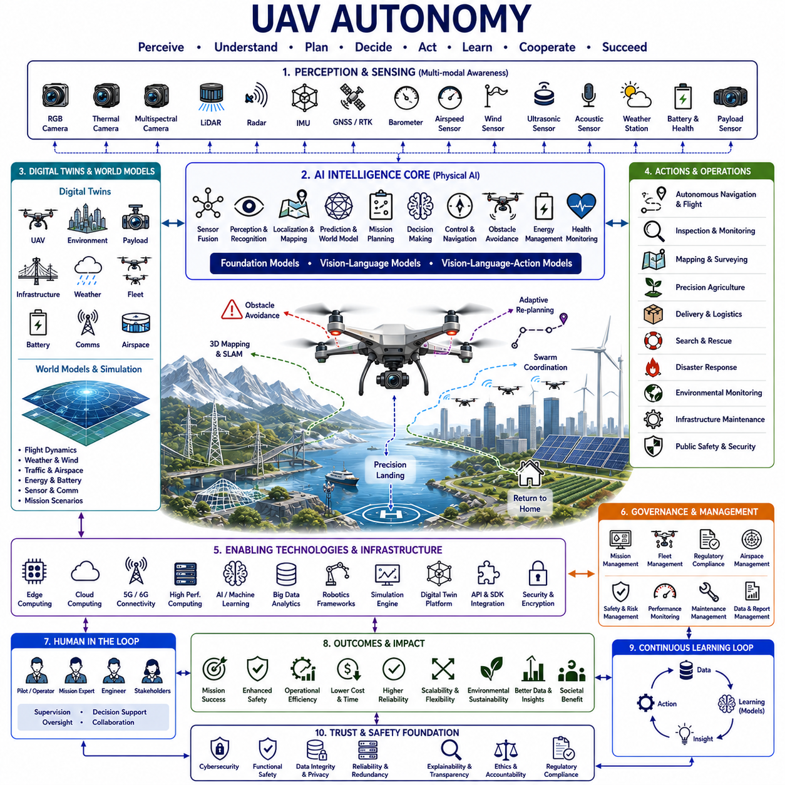
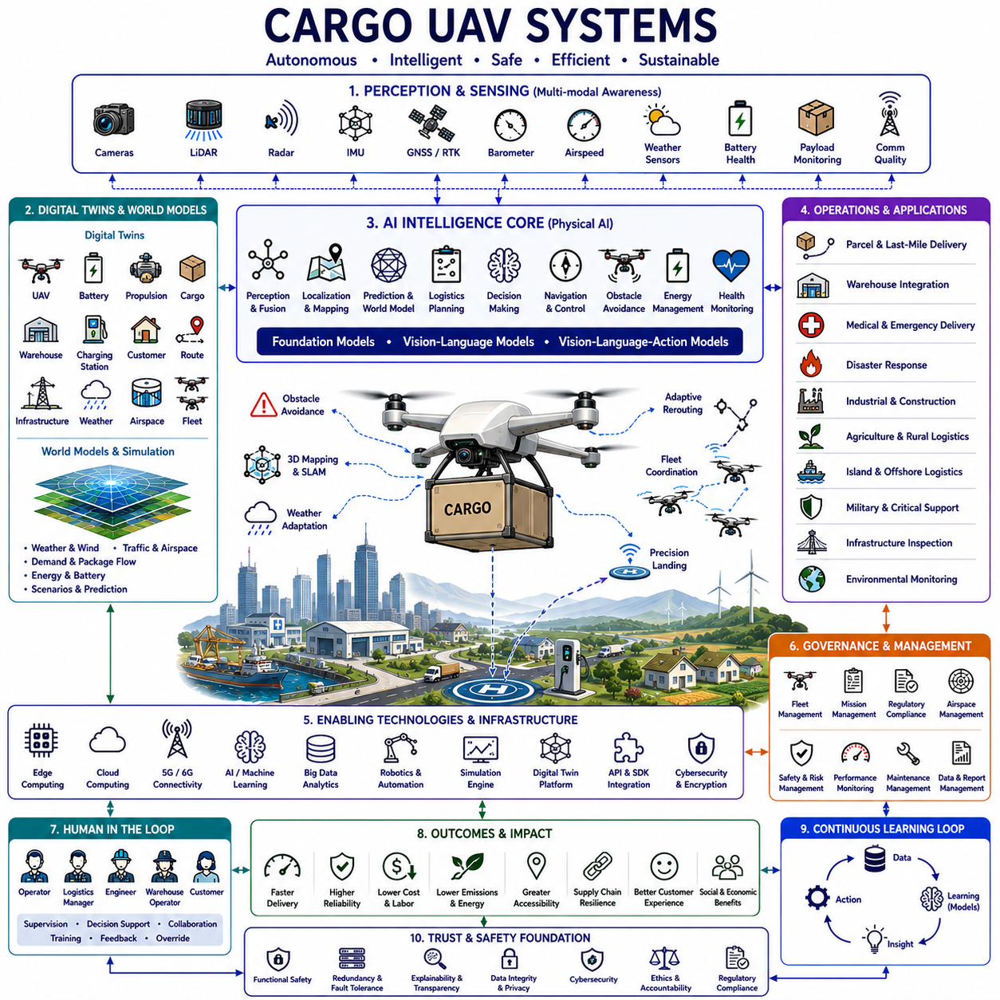
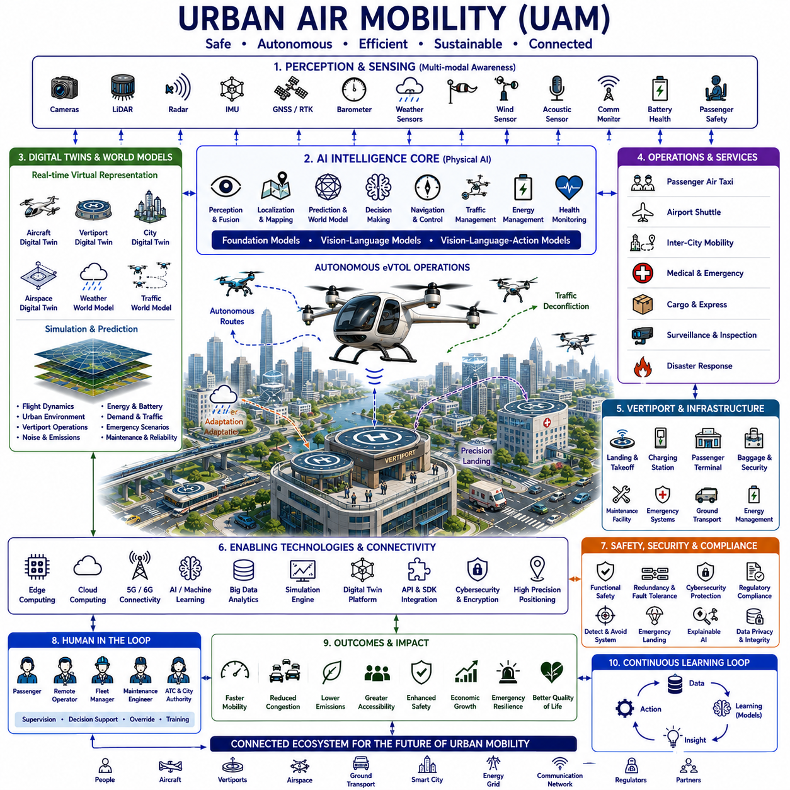
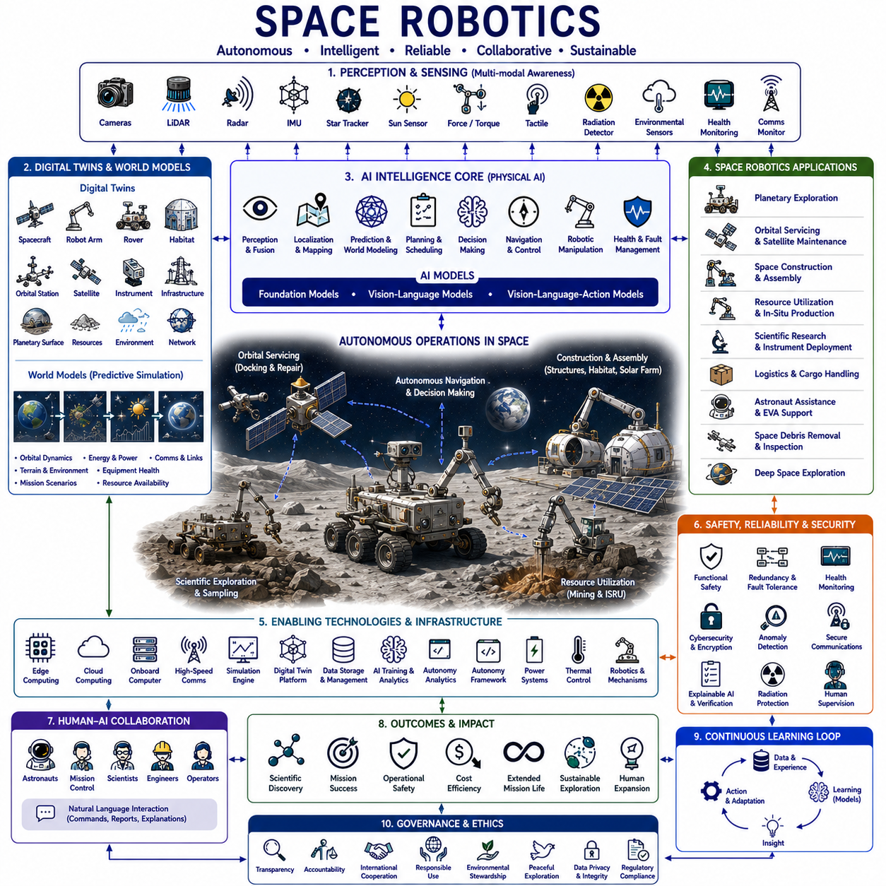
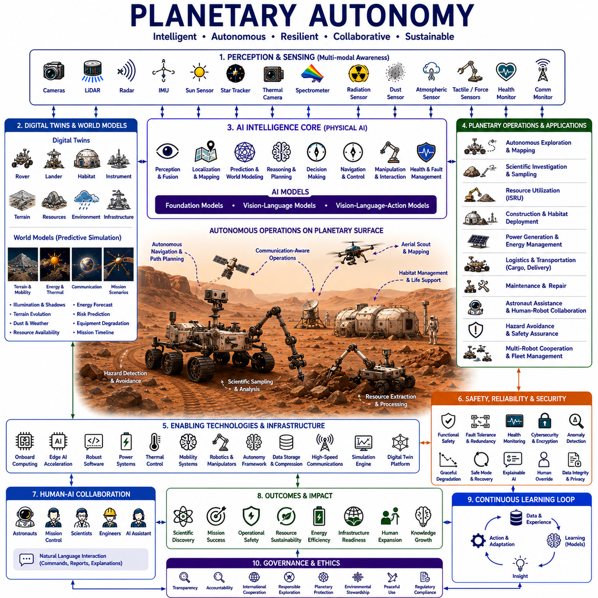
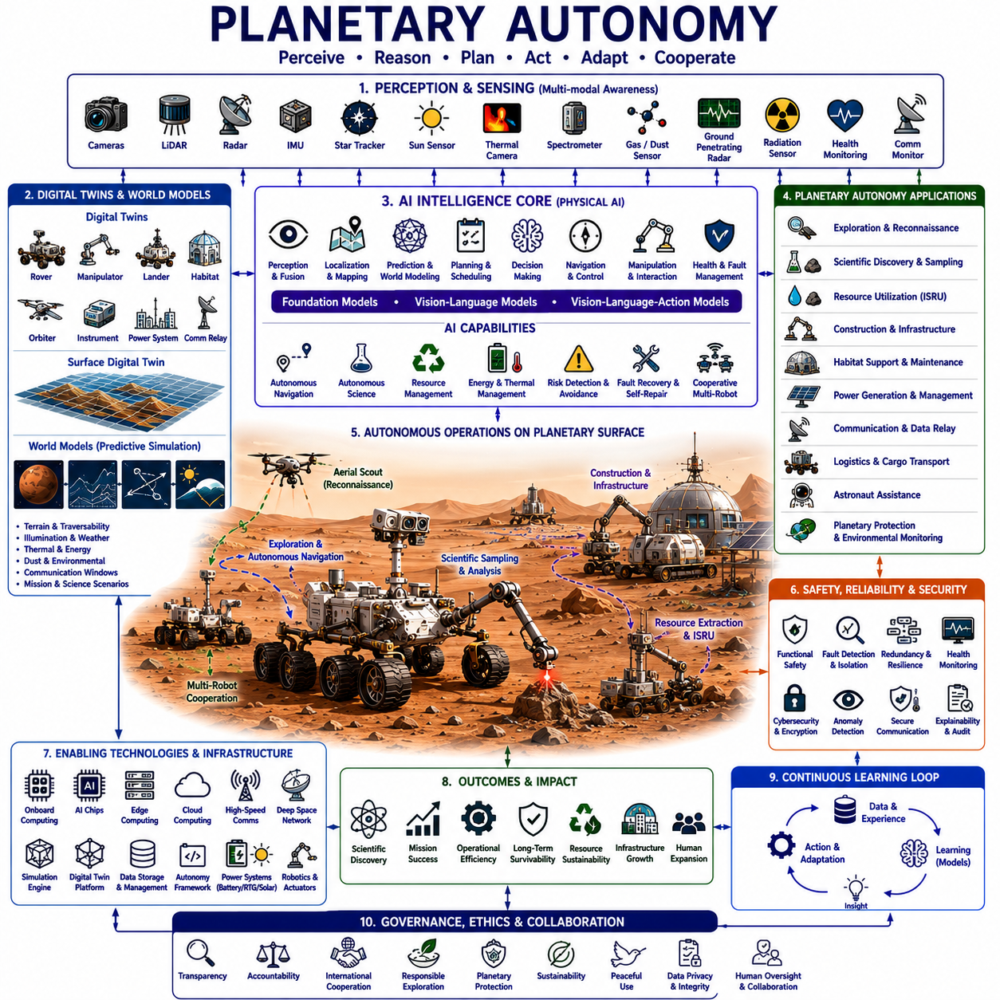
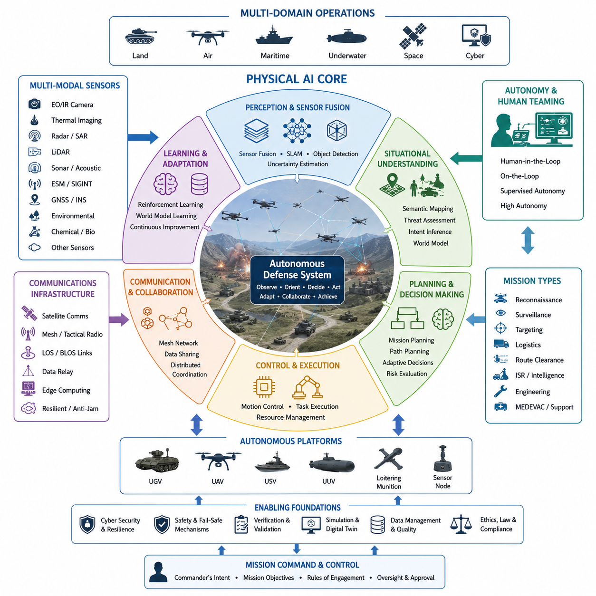
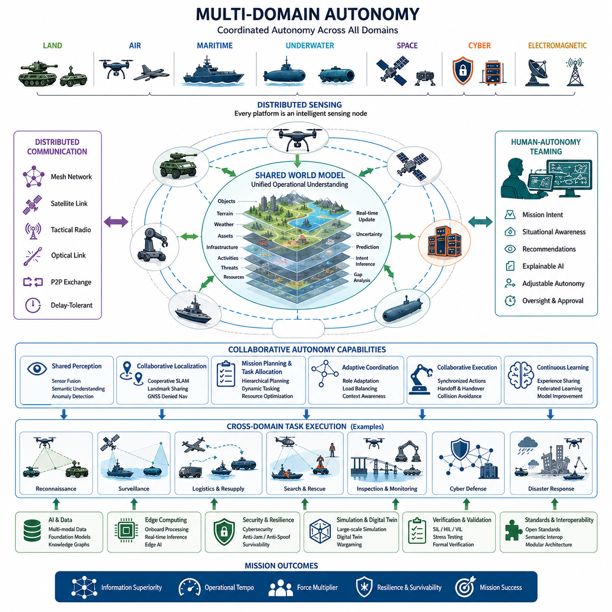
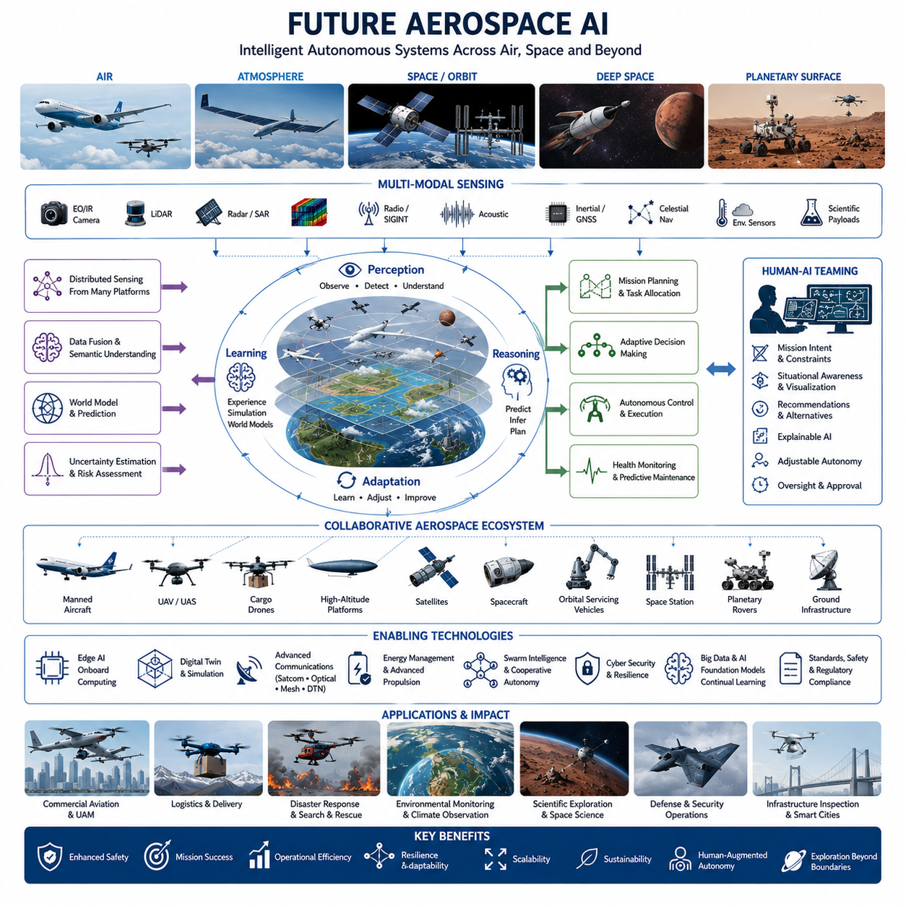

**Physical AI Engineering**

# Chapter 12 Aerospace and Defense Physical AI 

## 12-01 UAV Autonomy

{width="7.268055555555556in" height="7.268055555555556in"}

UAV Autonomy represents one of the most advanced and transformative application domains of Physical Artificial Intelligence because autonomous aerial systems combine perception, reasoning, planning, navigation, and physical interaction within highly dynamic three-dimensional environments. Unlike conventional unmanned aerial vehicles that depend heavily on remote operators or predefined waypoint missions, autonomous UAVs continuously perceive their surroundings, understand mission objectives, predict environmental changes, adapt flight behavior, cooperate with other autonomous systems, and execute complex tasks with minimal human intervention. The convergence of robotics, artificial intelligence, edge computing, multimodal sensing, Digital Twins, World Models, Foundation Models, and autonomous decision-making enables UAVs to evolve from remotely controlled flying platforms into intelligent aerial agents capable of operating safely and efficiently across industrial, commercial, scientific, humanitarian, and defense applications.

The development of UAV autonomy has progressed through several technological generations. Early unmanned aircraft primarily relied on manual radio control with direct human piloting. Subsequent generations introduced GPS-assisted waypoint navigation, automatic stabilization, altitude control, return-to-home capability, and limited mission automation. Modern autonomous UAVs integrate computer vision, simultaneous localization and mapping, obstacle avoidance, sensor fusion, onboard artificial intelligence, cloud-edge collaboration, predictive planning, and adaptive learning to achieve significantly higher levels of operational independence. Physical AI represents the next evolutionary stage in which UAVs no longer execute predefined instructions alone but continuously reason about mission objectives, environmental uncertainty, resource constraints, and cooperative interactions while adapting their behavior throughout the mission lifecycle.

The primary objective of UAV Autonomy extends far beyond autonomous flight. Intelligent aerial systems continuously optimize mission success, operational safety, energy efficiency, navigation accuracy, environmental awareness, communication reliability, payload utilization, fleet coordination, maintenance scheduling, regulatory compliance, environmental sustainability, and lifecycle cost simultaneously. Rather than simply following flight plans, Physical AI enables UAVs to evaluate changing circumstances, revise operational strategies, coordinate with other autonomous agents, and maximize mission effectiveness under uncertain real-world conditions.

Perception forms the sensory foundation of UAV autonomy. Modern autonomous UAVs integrate RGB cameras, global shutter cameras, thermal imaging systems, multispectral cameras, hyperspectral cameras, event cameras, stereo vision systems, depth cameras, LiDAR, millimeter-wave radar, ultrasonic sensors, inertial measurement units, Global Navigation Satellite Systems, Real-Time Kinematic positioning systems, magnetometers, barometers, airspeed sensors, wind sensors, weather monitoring systems, acoustic sensors, collision detection sensors, battery monitoring systems, motor diagnostics, payload monitoring systems, and Digital Twin infrastructures. Together these sensing technologies continuously observe surrounding obstacles, terrain geometry, atmospheric conditions, dynamic objects, electromagnetic environments, infrastructure, vegetation, human activity, mission payload status, aircraft health, and environmental uncertainty throughout every phase of autonomous flight.

Sensor fusion dramatically improves aerial perception because no individual sensing modality can reliably describe every operational condition. GNSS provides absolute positioning but becomes unreliable in urban canyons, forests, tunnels, and indoor environments. Cameras recognize objects but are sensitive to illumination, shadows, rain, snow, fog, and glare. LiDAR generates highly accurate three-dimensional geometry while increasing power consumption and hardware cost. Radar performs reliably during adverse weather but offers lower spatial resolution than optical sensors. IMUs provide high-frequency motion estimation while accumulating drift over time. Physical AI continuously integrates observations from all available sensing modalities, historical mission knowledge, Digital Twins, environmental maps, and predictive models to produce robust environmental understanding under highly uncertain operating conditions.

Computer vision has become one of the most important technologies supporting UAV autonomy. Deep neural networks continuously recognize buildings, roads, bridges, railways, electrical transmission lines, pipelines, vehicles, ships, aircraft, people, wildlife, vegetation, construction sites, agricultural fields, industrial facilities, wind turbines, solar farms, communication towers, disaster zones, emergency vehicles, landing zones, obstacles, weather phenomena, and mission-specific targets. Rather than merely detecting objects, Physical AI interprets visual observations according to mission objectives, environmental context, flight safety, operational regulations, Digital Twin synchronization, and anticipated future events, thereby enabling significantly more intelligent autonomous behavior than traditional object recognition systems.

Three-dimensional perception substantially enhances autonomous flight by reconstructing accurate spatial representations of surrounding environments. LiDAR mapping, stereo vision, monocular depth estimation, structured light sensing, simultaneous localization and mapping, photogrammetry, radar mapping, and Digital Twin synchronization continuously generate detailed three-dimensional models of urban environments, forests, industrial plants, infrastructure corridors, agricultural regions, coastal areas, offshore facilities, indoor warehouses, underground facilities, and disaster environments. These dynamic spatial models support autonomous navigation, obstacle avoidance, precision landing, infrastructure inspection, collaborative robotics, and intelligent mission planning with exceptional spatial accuracy.

Multimodal intelligence fundamentally distinguishes Physical AI UAV systems from traditional autopilot architectures. Autonomous aerial operation simultaneously depends upon visual perception, inertial navigation, atmospheric sensing, energy management, communication quality, airspace awareness, regulatory compliance, mission objectives, payload operation, cooperative robotics, environmental forecasting, Digital Twins, historical mission knowledge, and human supervision. Physical AI integrates these heterogeneous information sources into unified reasoning systems capable of balancing competing operational objectives continuously while adapting to rapidly changing flight conditions.

Digital Twins represent one of the most transformative technologies supporting UAV autonomy. Every aircraft, mission environment, payload, infrastructure asset, weather system, communication network, battery system, propulsion unit, sensor package, inspection target, and operational corridor maintains a continuously evolving Digital Twin describing geometry, physical behavior, operational history, maintenance records, environmental exposure, sensor measurements, communication quality, flight performance, component degradation, regulatory constraints, mission progress, and predicted future capability. Continuous synchronization between physical UAV systems and Digital Twins enables predictive maintenance, mission optimization, fleet management, simulation, operator training, regulatory verification, and autonomous decision support throughout complete operational lifecycles.

World Models significantly extend Digital Twins through predictive aerial intelligence. Rather than representing only current flight conditions, World Models simulate future weather evolution, wind fields, obstacle movement, traffic density, battery discharge, communication degradation, sensor uncertainty, payload performance, regulatory changes, infrastructure accessibility, emergency scenarios, cooperative fleet behavior, and mission progression under multiple alternative scenarios. Predictive simulation enables autonomous UAVs to evaluate potential actions before executing physical maneuvers, thereby reducing operational risk while improving mission reliability and decision quality.

Simulation remains one of the most valuable engineering methodologies supporting UAV autonomy. Flight dynamics simulation evaluates aircraft stability, aerodynamic behavior, propulsion efficiency, control authority, and structural loading. Environmental simulation predicts weather evolution, turbulence, wind gusts, rainfall, fog, snow, dust, and atmospheric disturbances. Navigation simulation analyzes localization uncertainty, communication quality, obstacle interactions, airspace congestion, and cooperative traffic management. Digital Twin simulation evaluates maintenance scheduling, battery aging, component degradation, payload integration, and mission readiness. Reinforcement learning environments enable autonomous flight policies to optimize navigation, obstacle avoidance, energy management, landing strategies, cooperative behavior, and emergency response before deployment within operational airspace.

Foundation Models introduce generalized aerial intelligence spanning robotics, aviation, navigation, meteorology, computer vision, communications, control theory, logistics, infrastructure management, environmental science, industrial inspection, agriculture, disaster management, emergency response, transportation, and aerospace engineering simultaneously. Instead of developing isolated artificial intelligence models for individual UAV applications, Foundation Models learn transferable knowledge applicable across infrastructure inspection, environmental monitoring, logistics, emergency response, precision agriculture, mapping, surveillance, scientific observation, construction, and future autonomous aviation systems. Fine-tuning enables adaptation to regional airspace regulations, environmental conditions, aircraft configurations, mission requirements, communication infrastructures, and operational constraints while preserving generalized aerial reasoning capability.

Vision-Language Models fundamentally improve collaboration between autonomous UAVs and human operators. Pilots, engineers, inspectors, emergency responders, agricultural specialists, scientists, logistics managers, infrastructure operators, regulators, maintenance personnel, and autonomous aerial systems communicate naturally through spoken language while artificial intelligence simultaneously interprets sensor observations, Digital Twins, engineering documentation, flight logs, maintenance records, weather forecasts, mission objectives, regulatory requirements, historical flight experience, and operational knowledge. Vision-Language Models summarize mission status, explain flight decisions, answer operational questions, generate inspection reports, recommend flight plans, support maintenance decisions, and improve transparency across increasingly autonomous aerial operations.

Vision-Language-Action Models extend computational reasoning into autonomous physical flight. Intelligent UAVs perceive surrounding environments, understand mission objectives, reason about environmental uncertainty, coordinate payload operations, execute adaptive navigation, avoid dynamic obstacles, select emergency landing zones, inspect infrastructure, deliver supplies, collect scientific measurements, support disaster response, and collaborate safely with human operators and autonomous robotic systems. Physical AI therefore transforms computational intelligence into autonomous aerial operation while maintaining flight safety, regulatory compliance, cybersecurity, explainability, and continuous human oversight.

Autonomous navigation represents one of the defining capabilities of UAV autonomy. Simultaneous localization and mapping, visual-inertial odometry, GNSS-RTK positioning, terrain-relative navigation, map matching, cooperative localization, and World Model prediction continuously estimate aircraft position within complex environments. Autonomous navigation extends beyond waypoint following by enabling adaptive route planning, obstacle avoidance, terrain following, precision landing, moving target tracking, dynamic mission replanning, communication-aware routing, energy-aware navigation, and cooperative swarm coordination under continuously changing environmental conditions.

Obstacle avoidance has become essential for safe autonomous flight. UAVs continuously detect buildings, power lines, communication towers, cranes, trees, birds, aircraft, vehicles, drones, people, cables, bridges, tunnels, moving machinery, weather hazards, and temporary construction obstacles while predicting their future motion. Physical AI evaluates collision probability, mission urgency, battery availability, communication quality, airspace regulations, and alternative trajectories before generating safe avoidance maneuvers that preserve mission objectives whenever possible.

Energy management represents another critical component of UAV autonomy because battery capacity remains one of the primary operational constraints limiting flight duration and payload capability. Intelligent energy management continuously predicts battery degradation, remaining flight time, power consumption, payload demand, environmental effects, wind resistance, communication requirements, and emergency reserve margins while optimizing flight trajectories, inspection schedules, return strategies, charging opportunities, battery replacement planning, and fleet utilization. Digital Twins continuously estimate battery health and propulsion efficiency throughout complete operational lifecycles, enabling predictive maintenance while maximizing operational availability.

Swarm intelligence significantly expands the capabilities of autonomous UAV systems. Multiple autonomous aircraft cooperate through distributed perception, collaborative mapping, cooperative localization, task allocation, formation control, communication relay, distributed sensing, environmental monitoring, infrastructure inspection, search and rescue, precision agriculture, disaster assessment, logistics, security operations, and scientific observation. Rather than functioning as isolated aerial platforms, swarm systems dynamically allocate responsibilities according to aircraft capability, battery status, sensor availability, communication quality, environmental conditions, and evolving mission objectives while maintaining robust fault tolerance and operational resilience.

Infrastructure inspection represents one of the most mature industrial applications of UAV autonomy. Autonomous aerial systems continuously inspect bridges, railways, highways, pipelines, transmission lines, wind turbines, solar farms, offshore platforms, communication towers, dams, ports, airports, industrial plants, buildings, and construction projects. Computer vision automatically identifies structural defects, corrosion, deformation, thermal anomalies, vegetation encroachment, leakage, insulation degradation, mechanical wear, construction progress, environmental impacts, and maintenance requirements. Autonomous inspection significantly reduces operational cost, increases inspection frequency, improves worker safety, enhances engineering accuracy, and supports predictive infrastructure management through continuously updated Digital Twins.

Environmental monitoring likewise benefits enormously from autonomous UAV operation. Intelligent aerial systems continuously observe forests, wetlands, rivers, lakes, glaciers, coastlines, wildlife habitats, agricultural regions, renewable energy facilities, disaster zones, urban environments, and protected ecosystems. Physical AI detects deforestation, illegal mining, illegal logging, flooding, wildfire development, vegetation stress, biodiversity changes, pollution, coastal erosion, glacier retreat, crop health, water quality, and ecological restoration while supporting long-term environmental sustainability through continuous scientific observation.

Precision agriculture has emerged as another major application domain for UAV autonomy. Autonomous aerial systems continuously evaluate crop health, soil moisture, irrigation efficiency, nutrient distribution, pest infestation, disease progression, weed growth, weather conditions, harvest readiness, carbon sequestration, and agricultural productivity. Computer vision, hyperspectral imaging, thermal sensing, Digital Twins, and predictive simulation enable site-specific crop management, variable-rate treatment, sustainable farming, autonomous spraying, yield estimation, and long-term agricultural optimization while reducing environmental impact.

Emergency response represents one of the highest-value operational capabilities of autonomous UAVs. During earthquakes, floods, hurricanes, wildfires, industrial accidents, hazardous material releases, infrastructure failures, search and rescue operations, humanitarian crises, and public safety incidents, autonomous aerial systems rapidly establish situational awareness, generate high-resolution maps, identify survivors, assess structural damage, monitor environmental hazards, deliver medical supplies, establish communication relays, support emergency coordination, and continuously update Digital Twins for decision-makers operating under severe time constraints.

Cloud-edge computing provides the computational architecture supporting UAV autonomy. Embedded edge computers execute flight control, sensor processing, obstacle avoidance, autonomous navigation, safety monitoring, payload control, and deterministic decision-making with minimal latency. Ground control stations coordinate mission management, fleet supervision, operator interfaces, Digital Twin synchronization, communication management, and regulatory compliance. Cloud platforms support Foundation Model training, predictive analytics, collaborative mission planning, fleet optimization, large-scale simulation, lifelong learning, and global knowledge sharing while maintaining secure aviation data management.

Cybersecurity represents one of the highest priorities within autonomous UAV systems because aerial platforms process sensitive infrastructure data, industrial information, environmental observations, logistics operations, emergency communications, scientific measurements, regulatory records, and national security information. Secure communication, encrypted storage, trusted hardware, authenticated flight controllers, resilient communication networks, intrusion detection, anomaly detection, digital identity management, explainable artificial intelligence, audit logging, and comprehensive access control collectively protect autonomous aerial systems against increasingly sophisticated cyber threats while preserving operational reliability.

Functional safety remains equally essential because autonomous aerial systems operate within shared airspace above people, infrastructure, transportation networks, industrial facilities, environmentally sensitive regions, and critical national assets. Physical AI continuously validates sensor integrity, communication reliability, flight controller health, Digital Twin synchronization, model confidence, environmental awareness, battery condition, regulatory constraints, cybersecurity status, and operational safety margins before executing autonomous maneuvers. Redundant sensing, fault-tolerant architectures, deterministic control, emergency landing capability, independent verification, explainable reasoning, and continuous human supervision collectively ensure trustworthy autonomous flight.

Human expertise remains indispensable throughout UAV autonomy. Pilots, aerospace engineers, robotics researchers, aviation authorities, maintenance technicians, emergency responders, infrastructure inspectors, agricultural specialists, environmental scientists, communication engineers, logistics planners, regulators, and mission operators possess decades of operational experience that cannot simply be replaced by computational models. Physical AI continuously learns from human expertise while combining engineering knowledge, Digital Twins, predictive simulation, autonomous robotics, intelligent optimization, and collaborative decision support into aerial systems that strengthen rather than replace professional human judgment.

Ethical principles remain fundamental throughout autonomous aviation. Transparency, accountability, public safety, privacy protection, environmental stewardship, explainability, fairness, responsible autonomy, cybersecurity, regulatory compliance, accessibility, human oversight, operational reliability, sustainability, and international cooperation must remain foundational engineering principles. Autonomous UAV systems should improve societal wellbeing, strengthen infrastructure resilience, accelerate scientific discovery, enhance emergency response, improve agricultural sustainability, reduce environmental impact, and maintain public trust while responsibly deploying increasingly autonomous aerial technologies.

The future evolution of UAV Autonomy extends toward globally interconnected intelligent aerial ecosystems where autonomous aircraft, ground robots, autonomous vehicles, maritime systems, Smart Cities, Digital Twins, World Models, intelligent infrastructure, environmental monitoring, logistics networks, cloud-edge intelligence, satellite communication, lifelong learning, and collaborative human expertise continuously cooperate across complete cyber-physical environments. Every flight improves operational knowledge. Every Digital Twin evolves alongside physical aircraft. Every autonomous mission refines predictive intelligence. Every cooperative interaction strengthens collective aerial capability. Every scientific observation contributes to broader environmental understanding.

UAV Autonomy therefore represents far more than autonomous flight control or automated navigation. It embodies the convergence of robotics, artificial intelligence, Digital Twins, World Models, multimodal perception, Foundation Models, simulation, cloud-edge intelligence, autonomous systems, aerospace engineering, aviation science, communications, computer vision, environmental sensing, logistics, infrastructure management, disaster response, cybersecurity, safety engineering, and human-centered aviation into a unified Physical AI platform capable of understanding complex aerial environments comprehensively, predicting operational evolution accurately, coordinating distributed autonomous assets intelligently, supporting human operators effectively, improving safety sustainably, expanding intelligent aerial capability responsibly, and enabling the next generation of autonomous, resilient, explainable, collaborative, and trustworthy unmanned aerial systems powered by Physical AI.

## 12-02 Cargo UAV Systems

{width="7.268055555555556in" height="7.268055555555556in"}

Cargo UAV Systems represent one of the most significant transformations in the future of intelligent logistics because they combine autonomous aviation, artificial intelligence, robotics, digital logistics, and cyber-physical infrastructure into a unified transportation ecosystem. Traditional cargo transportation has relied primarily upon trucks, ships, trains, and manned aircraft operating through centralized logistics networks. While these transportation systems remain essential for large-scale freight movement, they often experience limitations related to traffic congestion, labor shortages, infrastructure accessibility, emergency response, operational flexibility, environmental sustainability, and last-mile delivery efficiency. Physical Artificial Intelligence transforms cargo UAVs from remotely piloted aerial delivery platforms into autonomous logistics agents capable of continuously understanding their environments, predicting operational conditions, coordinating with multiple transportation systems, optimizing delivery schedules, adapting to changing mission objectives, and safely transporting cargo across complex three-dimensional environments with minimal human intervention.

The evolution of Cargo UAV Systems has progressed through several generations of technological development. Early unmanned cargo aircraft primarily consisted of remotely controlled platforms capable of transporting lightweight payloads under direct human supervision. Subsequent generations introduced waypoint navigation, automatic stabilization, autonomous takeoff and landing, GPS-assisted routing, and limited mission automation. Recent advances in computer vision, simultaneous localization and mapping, sensor fusion, onboard artificial intelligence, cloud-edge computing, autonomous flight control, Digital Twins, and intelligent fleet management have enabled cargo UAVs to perform increasingly complex transportation missions independently. Physical AI represents the next evolutionary stage in which cargo UAVs continuously reason about logistics objectives, weather uncertainty, airspace dynamics, battery availability, infrastructure status, cargo characteristics, customer priorities, and cooperative transportation networks while autonomously adapting operational strategies throughout complete delivery lifecycles.

The primary objective of Cargo UAV Systems extends far beyond autonomous package transportation. Intelligent cargo UAVs continuously optimize transportation efficiency, operational safety, delivery reliability, energy consumption, fleet utilization, logistics responsiveness, regulatory compliance, environmental sustainability, infrastructure integration, customer satisfaction, maintenance planning, and total lifecycle cost simultaneously. Rather than simply following predefined delivery routes, Physical AI enables autonomous cargo systems to evaluate continuously changing environmental conditions, revise delivery priorities, coordinate with multiple transportation assets, and maximize logistics performance while minimizing operational risk.

Perception forms the sensory foundation of Cargo UAV Systems. Modern cargo UAVs integrate RGB cameras, global shutter cameras, thermal imaging systems, stereo vision, depth cameras, multispectral cameras, LiDAR, millimeter-wave radar, ultrasonic sensors, inertial measurement units, Global Navigation Satellite Systems, Real-Time Kinematic positioning systems, magnetometers, barometers, airspeed sensors, weather monitoring systems, wind sensors, acoustic monitoring systems, payload monitoring sensors, battery health monitoring systems, motor diagnostics, structural monitoring systems, communication quality monitors, Digital Twin infrastructures, and intelligent cargo tracking systems. These sensing technologies continuously observe surrounding terrain, dynamic obstacles, urban infrastructure, weather conditions, communication quality, aircraft health, package integrity, loading conditions, landing zones, charging stations, airspace traffic, and mission progress throughout every stage of autonomous logistics operations.

Sensor fusion significantly enhances cargo transportation because no individual sensing modality provides complete situational awareness. GNSS offers accurate positioning but experiences degradation within urban canyons, mountainous terrain, tunnels, and indoor logistics facilities. Cameras recognize infrastructure and obstacles but become sensitive to illumination changes, precipitation, fog, snow, and glare. LiDAR generates precise three-dimensional geometry while increasing payload weight, energy consumption, and hardware cost. Radar performs reliably during adverse weather while providing lower spatial resolution than optical sensing. IMUs estimate aircraft motion continuously while gradually accumulating drift. Physical AI combines observations from all available sensing technologies with Digital Twins, historical logistics knowledge, environmental prediction, infrastructure databases, and World Models to generate robust situational awareness capable of supporting highly reliable autonomous cargo transportation.

Computer vision has become one of the most important enabling technologies supporting autonomous cargo delivery. Deep neural networks continuously recognize buildings, warehouses, distribution centers, airports, logistics hubs, roads, bridges, loading platforms, delivery stations, landing zones, charging infrastructure, vehicles, cranes, transmission lines, construction sites, moving pedestrians, autonomous ground robots, drones, weather hazards, emergency vehicles, industrial facilities, shipping containers, railway terminals, harbor infrastructure, agricultural facilities, hospitals, disaster areas, and customer delivery locations. Rather than merely recognizing objects, Physical AI interprets visual observations according to logistics objectives, flight safety, regulatory constraints, infrastructure accessibility, cargo characteristics, customer requirements, and predicted environmental evolution.

Three-dimensional perception substantially improves autonomous cargo transportation by reconstructing highly accurate spatial representations of operational environments. LiDAR mapping, stereo vision, photogrammetry, structured light sensing, radar mapping, simultaneous localization and mapping, Digital Twin synchronization, and aerial reconstruction continuously generate detailed three-dimensional models of cities, logistics parks, industrial zones, ports, airports, warehouses, hospitals, residential neighborhoods, mountain regions, offshore facilities, renewable energy sites, and disaster environments. These dynamic spatial models support autonomous navigation, obstacle avoidance, precision cargo delivery, automated docking, rooftop landing, warehouse integration, cooperative logistics, and intelligent route optimization while minimizing transportation risk.

Multimodal intelligence fundamentally distinguishes Physical AI cargo UAVs from traditional autonomous aircraft. Cargo transportation simultaneously depends upon navigation, visual perception, logistics scheduling, communication quality, weather prediction, energy management, payload monitoring, customer demand, warehouse automation, autonomous ground vehicles, inventory systems, Digital Twins, regulatory requirements, cooperative transportation planning, and human supervision. Physical AI integrates these heterogeneous information sources into unified reasoning systems capable of continuously balancing competing operational objectives while adapting logistics behavior throughout complex transportation missions.

Digital Twins represent one of the most transformative technologies supporting Cargo UAV Systems. Every aircraft, battery system, propulsion unit, logistics hub, warehouse, charging station, package, customer location, communication network, weather environment, transportation corridor, maintenance facility, autonomous robot, and operational region maintains a continuously evolving Digital Twin describing geometry, operational history, maintenance records, sensor observations, structural health, battery degradation, communication quality, environmental exposure, delivery performance, loading conditions, infrastructure status, regulatory constraints, and predicted future capability. Continuous synchronization between physical logistics assets and Digital Twins enables predictive maintenance, fleet optimization, warehouse coordination, delivery simulation, operator training, infrastructure planning, and autonomous logistics decision support across complete transportation lifecycles.

World Models significantly extend Digital Twins by introducing predictive logistics intelligence. Rather than representing only current transportation conditions, World Models continuously simulate weather evolution, wind fields, precipitation, traffic density, customer demand, package flow, charging availability, battery consumption, communication reliability, infrastructure accessibility, emergency response requirements, cooperative fleet behavior, warehouse congestion, regulatory restrictions, and mission progression under multiple alternative scenarios. Predictive simulation enables autonomous cargo UAVs to evaluate potential logistics strategies before executing physical transportation, thereby reducing operational uncertainty while maximizing transportation efficiency and service reliability.

Simulation remains one of the most valuable engineering methodologies supporting Cargo UAV Systems. Flight dynamics simulation evaluates aircraft stability, aerodynamic efficiency, structural loading, propulsion performance, and control authority under varying payload conditions. Logistics simulation models warehouse operations, package flow, transportation demand, fleet coordination, charging infrastructure, distribution center performance, customer service quality, and operational throughput. Weather simulation predicts turbulence, wind gusts, rainfall, icing, fog, snow, thermal activity, and atmospheric uncertainty affecting autonomous flight. Digital Twin simulation evaluates maintenance planning, battery aging, charging strategies, infrastructure expansion, fleet growth, and long-term operational optimization. Reinforcement learning environments enable autonomous delivery policies to optimize routing, charging, package allocation, cooperative transportation, emergency response, warehouse integration, and fleet scheduling before deployment within real logistics networks.

Foundation Models introduce generalized logistics intelligence spanning robotics, aviation, transportation engineering, logistics management, warehouse automation, computer vision, communications, weather science, control theory, infrastructure management, industrial engineering, supply chain optimization, economics, autonomous systems, energy management, and aerospace engineering simultaneously. Instead of constructing isolated artificial intelligence models for individual delivery tasks, Foundation Models learn transferable logistics knowledge applicable across parcel delivery, medical transportation, industrial logistics, humanitarian operations, disaster relief, agricultural supply chains, offshore logistics, construction support, mining operations, and future autonomous transportation ecosystems. Fine-tuning enables adaptation to regional logistics requirements, airspace regulations, infrastructure configurations, weather characteristics, customer expectations, and operational constraints while preserving generalized cargo reasoning capability.

Vision-Language Models fundamentally improve collaboration throughout intelligent logistics systems. Logistics managers, warehouse operators, pilots, maintenance engineers, distribution planners, emergency coordinators, healthcare providers, regulators, transportation companies, customers, and autonomous UAVs communicate naturally through spoken language while artificial intelligence simultaneously interprets flight telemetry, Digital Twins, logistics databases, warehouse management systems, maintenance documentation, engineering drawings, weather forecasts, package tracking records, transportation schedules, customer requests, and operational regulations. Vision-Language Models summarize fleet status, explain delivery decisions, answer logistics questions, generate transportation reports, recommend scheduling improvements, coordinate warehouse operations, and improve transparency throughout autonomous supply chains.

Vision-Language-Action Models extend computational reasoning into autonomous logistics execution. Cargo UAVs perceive surrounding environments, understand delivery objectives, reason about weather uncertainty, evaluate package priorities, coordinate warehouse automation, perform adaptive navigation, avoid obstacles, select safe landing zones, execute autonomous loading and unloading, interact with robotic infrastructure, recharge automatically, and cooperate with ground robots, autonomous trucks, distribution centers, and intelligent warehouses. Physical AI therefore transforms computational intelligence into fully autonomous logistics operation while maintaining aviation safety, cargo integrity, regulatory compliance, cybersecurity, explainability, and continuous human oversight.

Autonomous navigation represents one of the defining capabilities of Cargo UAV Systems. Simultaneous localization and mapping, visual-inertial odometry, GNSS-RTK positioning, terrain-relative navigation, map matching, cooperative localization, Digital Twin synchronization, and predictive World Models continuously estimate aircraft position within highly dynamic operational environments. Autonomous navigation extends beyond waypoint following by enabling adaptive route planning, weather-aware routing, obstacle avoidance, precision rooftop delivery, warehouse docking, moving platform landing, communication-aware navigation, battery-aware flight planning, cooperative swarm logistics, and dynamic mission replanning throughout complete transportation operations.

Obstacle avoidance remains essential because cargo UAVs frequently operate within densely populated urban environments containing buildings, power lines, communication towers, cranes, bridges, tunnels, autonomous vehicles, helicopters, other drones, construction equipment, temporary obstacles, and unpredictable human activities. Physical AI continuously predicts obstacle motion, estimates collision probability, evaluates alternative trajectories, considers weather conditions, battery status, communication quality, cargo urgency, regulatory constraints, and customer requirements before generating safe flight maneuvers that preserve transportation objectives whenever possible.

Energy management represents one of the greatest engineering challenges affecting cargo UAV systems because payload weight directly influences battery consumption, flight duration, delivery range, operational cost, and transportation capacity. Intelligent energy management continuously predicts battery degradation, remaining flight time, charging opportunities, payload influence, wind resistance, weather effects, communication requirements, emergency reserve margins, and fleet availability while optimizing delivery scheduling, charging station selection, battery replacement planning, route allocation, infrastructure utilization, and long-term fleet economics. Digital Twins continuously estimate battery health, propulsion efficiency, structural fatigue, and charging behavior throughout complete operational lifecycles, enabling predictive maintenance while maximizing logistics availability.

Cargo handling automation significantly expands the capability of autonomous aerial logistics. Intelligent loading systems automatically identify package dimensions, weight distribution, center of gravity, cargo integrity, temperature requirements, hazardous material classification, customer priority, delivery sequence, and payload compatibility before autonomous flight begins. Robotic loading stations, conveyor systems, warehouse automation, autonomous mobile robots, intelligent storage systems, and Digital Twins cooperate continuously to ensure optimized loading, balanced aircraft stability, safe cargo handling, efficient unloading, and accurate package tracking throughout transportation operations.

Fleet intelligence transforms individual cargo UAVs into highly coordinated logistics ecosystems. Multiple autonomous aircraft continuously cooperate through distributed perception, collaborative routing, dynamic task allocation, charging coordination, communication relay, warehouse synchronization, package redistribution, cooperative navigation, emergency response, predictive maintenance, and intelligent traffic management. Rather than functioning independently, fleet systems allocate transportation responsibilities dynamically according to aircraft capability, battery availability, payload capacity, weather conditions, communication quality, maintenance requirements, customer priorities, infrastructure accessibility, and evolving logistics demand while maintaining robust fault tolerance and operational resilience.

Warehouse integration represents another critical capability supporting intelligent cargo transportation. Autonomous UAVs exchange information continuously with warehouse management systems, automated storage facilities, robotic picking systems, conveyor networks, inventory databases, autonomous forklifts, autonomous mobile robots, digital inventory platforms, enterprise resource planning systems, customer scheduling systems, and regional logistics centers. Physical AI enables seamless coordination between aerial transportation and intelligent warehouse automation, thereby reducing package handling time while maximizing logistics throughput.

Medical logistics has emerged as one of the highest-value applications of Cargo UAV Systems. Autonomous aerial transportation rapidly delivers blood products, vaccines, pharmaceuticals, medical equipment, laboratory samples, organs for transplantation, emergency supplies, and humanitarian aid to hospitals, rural communities, disaster areas, islands, offshore facilities, mountainous regions, and isolated populations where conventional transportation may become slow or unavailable. Intelligent logistics planning continuously prioritizes urgent deliveries according to medical necessity, environmental conditions, battery availability, weather evolution, healthcare capacity, and transportation constraints.

Disaster response similarly benefits enormously from autonomous cargo UAV systems. Following earthquakes, floods, hurricanes, wildfires, industrial accidents, infrastructure failures, and humanitarian crises, autonomous aerial logistics establish resilient transportation networks capable of delivering food, water, medical supplies, communication equipment, rescue tools, emergency power systems, environmental sensors, and humanitarian assistance while simultaneously supporting situational awareness, infrastructure assessment, search and rescue operations, and disaster recovery planning.

Cloud-edge computing provides the computational architecture supporting Cargo UAV Systems. Embedded edge computers execute flight control, navigation, obstacle avoidance, package monitoring, autonomous landing, safety verification, communication management, and deterministic logistics decisions with minimal latency. Regional logistics centers coordinate fleet supervision, warehouse integration, charging infrastructure, Digital Twin synchronization, customer scheduling, regulatory compliance, and transportation planning. Cloud platforms support Foundation Model training, predictive analytics, logistics optimization, Digital Twin simulation, collaborative planning, fleet expansion, lifelong learning, and global knowledge sharing while maintaining secure logistics data management.

Cybersecurity represents one of the highest priorities within Cargo UAV Systems because autonomous logistics platforms process sensitive customer information, industrial data, warehouse operations, transportation schedules, infrastructure status, medical logistics, commercial transactions, engineering documentation, and national supply chain information. Secure communication, encrypted storage, trusted hardware, authenticated flight controllers, resilient communication networks, anomaly detection, intrusion detection, digital identity management, audit logging, explainable artificial intelligence, and comprehensive access control collectively protect autonomous logistics ecosystems while preserving transportation reliability and public trust.

Functional safety remains equally essential because cargo UAVs operate above populated cities, industrial facilities, transportation infrastructure, hospitals, schools, commercial centers, residential neighborhoods, environmentally sensitive regions, and critical national assets. Physical AI continuously validates sensor integrity, communication reliability, battery health, propulsion status, Digital Twin synchronization, model confidence, environmental awareness, weather uncertainty, operational constraints, cybersecurity status, and regulatory compliance before executing autonomous flight. Redundant sensing, fault-tolerant architectures, emergency landing capability, deterministic control, independent verification, explainable reasoning, human supervision, and comprehensive risk management collectively ensure trustworthy autonomous cargo transportation.

Human expertise remains indispensable throughout Cargo UAV Systems. Logistics managers, aerospace engineers, aviation authorities, warehouse operators, maintenance technicians, transportation planners, emergency responders, healthcare professionals, industrial engineers, communication specialists, regulators, supply chain managers, and mission supervisors possess decades of operational experience that cannot simply be replaced by computational models. Physical AI continuously learns from human expertise while integrating engineering knowledge, Digital Twins, predictive simulation, autonomous robotics, intelligent optimization, and collaborative decision support into logistics systems that strengthen rather than replace professional human judgment.

Ethical principles remain fundamental throughout autonomous cargo transportation. Transparency, accountability, public safety, privacy protection, cargo security, environmental stewardship, explainability, fairness, responsible autonomy, cybersecurity, regulatory compliance, accessibility, sustainability, operational reliability, human oversight, and international cooperation must remain foundational engineering principles. Intelligent cargo UAVs should improve logistics accessibility, strengthen emergency response, accelerate sustainable transportation, reduce carbon emissions, enhance supply chain resilience, expand healthcare accessibility, improve disaster preparedness, and maintain public trust while responsibly deploying increasingly autonomous aerial logistics technologies.

The future evolution of Cargo UAV Systems extends toward globally interconnected intelligent logistics ecosystems where autonomous aircraft, autonomous ground vehicles, maritime transportation, intelligent warehouses, Digital Twins, World Models, Smart Cities, autonomous robots, renewable energy infrastructure, cloud-edge intelligence, satellite communications, autonomous charging systems, intelligent distribution centers, and collaborative human expertise continuously cooperate across complete cyber-physical transportation networks. Every delivery improves operational knowledge. Every Digital Twin evolves alongside physical logistics assets. Every autonomous transportation mission strengthens predictive logistics intelligence. Every warehouse interaction improves operational efficiency. Every successful delivery contributes to increasingly intelligent global supply chains.

Cargo UAV Systems therefore represent far more than autonomous package transportation or aerial logistics automation. They embody the convergence of robotics, artificial intelligence, Digital Twins, World Models, multimodal perception, Foundation Models, simulation, cloud-edge intelligence, autonomous aviation, logistics engineering, warehouse automation, transportation science, communications, computer vision, infrastructure management, supply chain optimization, disaster response, cybersecurity, safety engineering, and human-centered logistics into a unified Physical AI platform capable of understanding complex transportation ecosystems comprehensively, predicting logistics evolution accurately, coordinating distributed transportation assets intelligently, supporting human operators effectively, improving global logistics sustainably, strengthening supply chain resilience responsibly, expanding autonomous aerial transportation intelligently, and enabling the next generation of safe, explainable, collaborative, resilient, and trustworthy cargo UAV systems powered by Physical AI.

## 12-03 Urban Air Mobility

{width="7.268055555555556in" height="7.268055555555556in"}

Urban Air Mobility represents one of the most ambitious applications of Physical Artificial Intelligence because it expands transportation from two-dimensional road networks into intelligent three-dimensional aerial mobility ecosystems. Unlike conventional aviation, which operates through airports, controlled air corridors, and specialized human pilots, Urban Air Mobility must operate close to buildings, roads, people, infrastructure, weather disturbances, communication networks, and highly dynamic city environments. It therefore requires autonomous perception, safe navigation, air traffic coordination, energy management, vertiport integration, passenger safety, regulatory compliance, cybersecurity, and human-centered service design to work together as one unified cyber-physical transportation platform.

The purpose of Urban Air Mobility is not simply to create flying taxis. Its deeper role is to connect cities, suburbs, airports, hospitals, logistics hubs, emergency services, and regional transportation systems through safe, efficient, low-emission, and intelligently managed aerial mobility. Physical AI enables this by integrating autonomous aircraft, electric propulsion, distributed sensors, Digital Twins, World Models, cloud-edge computing, intelligent infrastructure, fleet management, and human supervision into a complete mobility ecosystem that can continuously adapt to changing urban conditions.

Urban Air Mobility has evolved from several technological streams. Conventional helicopters demonstrated the value of vertical flight but were limited by noise, operating cost, safety complexity, emissions, and pilot dependency. Drones introduced small-scale autonomous flight, computer vision, low-altitude navigation, and distributed aerial operations. Electric vertical takeoff and landing aircraft, known as eVTOL, introduced cleaner propulsion, distributed rotors, simplified mechanical architecture, and the possibility of quieter urban operation. Physical AI is the next stage, where aircraft, infrastructure, operators, passengers, regulators, and city systems are connected through intelligent decision-making rather than operated as isolated transportation assets.

The core technical challenge of Urban Air Mobility is safe autonomy in dense urban airspace. An aircraft must perceive buildings, power lines, cranes, drones, birds, helicopters, other eVTOL aircraft, emergency vehicles, weather changes, temporary obstacles, landing pads, and passenger areas while maintaining stable flight. It must also understand airspace restrictions, noise-sensitive zones, emergency routes, battery reserves, vertiport availability, passenger schedules, and communication quality. Physical AI integrates all of these factors into continuous operational reasoning.

Perception is the sensory foundation of Urban Air Mobility. UAM vehicles may use RGB cameras, global shutter cameras, thermal cameras, event cameras, LiDAR, radar, ultrasonic sensors, GNSS, RTK positioning, IMU, barometers, magnetometers, airspeed sensors, wind sensors, weather radar, acoustic sensors, battery monitoring systems, motor diagnostics, structural health sensors, communication monitors, and passenger safety sensors. These sensors observe the aircraft, the surrounding airspace, the landing environment, the city infrastructure, and the onboard passenger cabin at the same time.

Sensor fusion is essential because no single sensor can guarantee safe operation in all urban conditions. GNSS may degrade near tall buildings. Cameras may struggle with glare, fog, rain, darkness, or smoke. LiDAR provides precise geometry but has cost, weight, and weather limitations. Radar is robust in poor weather but provides lower visual detail. IMU data is fast but drifts over time. Physical AI combines these sensor streams with Digital Twins, maps, air traffic data, weather prediction, and historical flight knowledge to create reliable situational awareness.

Computer vision enables UAM systems to understand the city visually. Deep learning models can identify buildings, rooftops, vertiports, roads, bridges, aircraft, drones, helicopters, birds, cranes, people, vehicles, smoke, fire, weather hazards, emergency zones, and landing obstacles. However, Physical AI does more than detect objects. It interprets visual information according to mission goals, safety margins, passenger comfort, regulatory constraints, route availability, and future risk.

Three-dimensional perception is especially important in Urban Air Mobility because the operating space is vertical, layered, and crowded. LiDAR mapping, stereo vision, radar mapping, visual-inertial odometry, SLAM, photogrammetry, and Digital Twin synchronization create dynamic 3D models of buildings, corridors, rooftops, vertiports, bridges, towers, restricted airspace, and emergency landing locations. These models support route planning, collision avoidance, precision landing, takeoff clearance, emergency descent, and fleet-level traffic coordination.

Digital Twins are central to Urban Air Mobility. Each aircraft maintains a Digital Twin describing its structure, propulsion system, battery, sensors, software, maintenance history, flight performance, degradation state, and safety status. Each vertiport maintains a Digital Twin describing pad availability, charger status, passenger flow, weather exposure, maintenance condition, emergency systems, and connection to ground transportation. The city itself maintains a mobility Digital Twin describing buildings, air corridors, traffic demand, weather, emergency zones, communication coverage, noise limits, and energy availability. Continuous synchronization between these Digital Twins allows UAM systems to plan and operate safely.

World Models extend Digital Twins by predicting what may happen next. They simulate wind changes between buildings, battery consumption, passenger demand, aircraft delays, vertiport congestion, emergency scenarios, communication degradation, weather changes, airspace conflicts, and rerouting options. This predictive ability allows UAM systems to evaluate multiple possible actions before choosing a route, landing plan, or emergency maneuver.

Simulation is a critical engineering method for UAM development. Flight simulation evaluates aircraft stability, control behavior, rotor interaction, passenger comfort, energy consumption, emergency descent, and failure modes. Urban simulation evaluates wind tunnels between buildings, rooftop turbulence, noise propagation, landing-zone safety, air traffic density, vertiport throughput, and evacuation scenarios. Fleet simulation evaluates passenger demand, aircraft dispatch, charging schedules, maintenance planning, and citywide mobility efficiency. Reinforcement learning environments can train route planning, collision avoidance, landing control, energy optimization, and emergency response policies before real-world deployment.

Foundation Models can provide generalized intelligence across aviation, robotics, urban planning, transportation, weather science, energy systems, communication networks, passenger service, safety engineering, and regulation. Instead of creating separate AI models for every aircraft type, city, vertiport, or mission, Foundation Models can learn transferable knowledge and then be fine-tuned for specific regions, aircraft configurations, weather patterns, operating rules, and service models.

Vision-Language Models improve collaboration between people and UAM systems. Pilots, fleet operators, maintenance engineers, air traffic managers, city officials, emergency responders, passengers, and regulators can communicate with AI in natural language while the system interprets flight data, weather data, Digital Twins, maintenance logs, airspace rules, passenger schedules, and safety reports. These models can explain route decisions, summarize fleet status, generate maintenance reports, support passenger communication, and improve transparency.

Vision-Language-Action Models connect reasoning to physical flight. A UAM aircraft can perceive the environment, understand a route objective, evaluate passenger comfort, coordinate with vertiports, avoid obstacles, adapt to weather, select alternate landing sites, manage energy, and execute safe maneuvers. This is where Physical AI becomes more than information processing: it becomes embodied aerial mobility control.

Autonomous navigation is one of the most important capabilities of Urban Air Mobility. UAM vehicles must perform route planning, vertical takeoff, transition flight, cruise, descent, precision landing, emergency rerouting, and ground-interface coordination. Navigation must consider not only shortest path but also safety, weather, battery reserve, noise restrictions, passenger comfort, communication quality, air traffic density, and regulatory constraints.

Air traffic management is another core requirement. Urban Air Mobility cannot scale if every aircraft is managed independently. Intelligent traffic systems must coordinate eVTOL aircraft, drones, helicopters, emergency aircraft, cargo UAVs, restricted zones, temporary flight restrictions, and vertiport capacity. Physical AI supports cooperative deconfliction, route reservation, dynamic corridor allocation, emergency prioritization, and real-time airspace optimization.

Vertiports are the physical interface between aerial mobility and the city. They must support takeoff, landing, charging, passenger boarding, baggage handling, security, maintenance, emergency response, and connection to ground transport. Physical AI coordinates aircraft arrival, charger assignment, passenger flow, maintenance checks, weather risk, and dispatch scheduling. A vertiport is therefore not just a landing pad but an intelligent mobility node.

Energy management is a major constraint because eVTOL aircraft depend heavily on batteries. Physical AI continuously predicts battery health, flight energy demand, reserve margins, charger availability, thermal behavior, route difficulty, passenger load, wind conditions, and maintenance requirements. Energy-aware planning ensures that aircraft do not merely complete a route but maintain safe reserves for diversion, holding, emergency landing, and unexpected weather.

Passenger experience is central to UAM adoption. A technically capable aircraft is not enough if passengers experience fear, discomfort, noise, confusion, or lack of trust. Physical AI can optimize flight smoothness, cabin comfort, boarding flow, trip information, safety explanation, delay management, and multimodal connection to taxis, buses, trains, and walking routes. Human-centered design must make aerial mobility understandable, predictable, and trustworthy.

Safety and redundancy are foundational. UAM systems require redundant sensors, redundant flight computers, fault-tolerant propulsion, emergency landing capability, verified software, deterministic safety logic, continuous health monitoring, and human oversight. Physical AI must validate sensor integrity, communication reliability, flight controller status, battery condition, weather uncertainty, obstacle risk, regulatory compliance, and system confidence before executing autonomous actions.

Maintenance intelligence is essential for fleet reliability. Aircraft experience vibration, thermal cycling, battery degradation, rotor wear, actuator fatigue, sensor drift, software updates, and structural stress. Digital Twins continuously estimate remaining useful life, maintenance priority, component replacement needs, and flight readiness. Predictive maintenance reduces downtime, increases safety, and improves fleet economics.

Cybersecurity is critical because UAM systems depend on communication, software, navigation, cloud systems, passenger data, maintenance records, and air traffic coordination. Secure communication, encryption, device authentication, trusted hardware, intrusion detection, anomaly detection, identity management, audit logging, and resilient networking are required to prevent spoofing, hijacking, data theft, operational disruption, and unsafe control behavior.

Urban integration determines whether UAM becomes useful at scale. UAM must connect with smart cities, smart energy systems, grid intelligence, public transportation, emergency services, airports, hospitals, logistics hubs, and building infrastructure. Physical AI allows these systems to exchange information through Digital Twins and management platforms so aerial mobility becomes part of the city rather than a separate premium service.

Emergency response may become one of the highest-value applications of Urban Air Mobility. eVTOL aircraft and autonomous aerial systems can transport medical teams, deliver emergency supplies, evacuate patients, support firefighting, inspect damaged infrastructure, provide disaster mapping, and connect isolated areas when roads are blocked. Physical AI can prioritize emergency missions, coordinate with public safety agencies, and adapt flight routes under crisis conditions.

Environmental sustainability is a major motivation for UAM, but it must be managed carefully. Electric propulsion can reduce local emissions, yet battery production, electricity sources, noise, land use, infrastructure requirements, and airspace congestion must be considered. Physical AI helps optimize energy use, reduce unnecessary flights, integrate renewable charging, minimize noise exposure, and align UAM operations with broader carbon-reduction goals.

Regulation and governance remain essential. UAM requires certification of aircraft, software, autonomy, maintenance, pilots or remote supervisors, vertiports, routes, cybersecurity, data governance, and operational procedures. Physical AI can support compliance monitoring, flight logging, safety case generation, explainable decision records, audit trails, and regulator-facing transparency.

Human expertise remains indispensable. Aerospace engineers, pilots, air traffic managers, city planners, safety engineers, maintenance technicians, emergency responders, cybersecurity experts, regulators, transportation planners, and service operators provide operational knowledge that AI must learn from and support. Urban Air Mobility should develop as human-AI collaboration rather than full replacement of professional judgment.

Ethical principles must guide UAM deployment. Public safety, privacy, accessibility, fairness, noise equity, environmental responsibility, transparency, accountability, cybersecurity, explainability, and human oversight must remain central. UAM should not become a service that benefits only a small wealthy group while increasing noise or risk for others. A responsible UAM ecosystem must consider public value, inclusive access, emergency utility, and integration with broader urban mobility.

The future of Urban Air Mobility will likely evolve toward intelligent aerial transportation networks where eVTOL aircraft, cargo UAVs, emergency aircraft, autonomous ground vehicles, rail systems, smart buildings, vertiports, energy grids, Digital Twins, World Models, and city platforms cooperate continuously. Every flight improves operational knowledge. Every maintenance event refines aircraft Digital Twins. Every passenger interaction improves service design. Every weather event improves prediction. Every safe autonomous decision increases system trust.

Urban Air Mobility therefore represents far more than electric flying taxis. It is the convergence of autonomous aviation, robotics, artificial intelligence, Digital Twins, World Models, multimodal perception, simulation, cloud-edge intelligence, smart city infrastructure, energy systems, air traffic management, cybersecurity, safety engineering, transportation planning, and human-centered design into a unified Physical AI mobility platform. As Physical AI matures, Urban Air Mobility may become a key layer of future transportation, supporting faster regional access, emergency response, airport connection, medical transport, premium logistics, and resilient city mobility while remaining safe, explainable, sustainable, and socially responsible.

## 12-04 Space Robotics

{width="7.268055555555556in" height="7.268055555555556in"}

Space Robotics represents one of the highest levels of Physical Artificial Intelligence because robotic systems operating in space must function safely and autonomously within environments where human intervention is extremely limited, communication delays are unavoidable, environmental uncertainty is significant, and system reliability is absolutely critical. Unlike terrestrial robots that can often depend on continuous wireless communication, nearby operators, readily available maintenance, and abundant environmental infrastructure, space robots must independently perceive their surroundings, understand mission objectives, make intelligent decisions, adapt to unexpected conditions, recover from failures, and continue operating over long mission durations while exposed to radiation, extreme temperatures, vacuum, microgravity, planetary dust, and complex orbital dynamics. Physical Artificial Intelligence enables space robotic systems to evolve beyond remotely controlled machines into intelligent autonomous explorers capable of scientific discovery, infrastructure construction, satellite servicing, planetary exploration, resource utilization, and collaborative space operations.

The evolution of Space Robotics has progressed through multiple technological generations. Early robotic space systems primarily consisted of remotely operated manipulators and simple automated spacecraft executing preprogrammed sequences under direct supervision from mission control. As computational capability improved, autonomous navigation, hazard detection, orbital rendezvous, robotic manipulation, planetary mobility, and onboard fault management gradually increased operational independence. Today, advances in artificial intelligence, robotics, computer vision, sensor fusion, Digital Twins, World Models, cloud-edge computing, autonomous planning, and Foundation Models are transforming space robots into intelligent physical agents capable of continuous reasoning, adaptive decision-making, predictive maintenance, collaborative exploration, and lifelong learning across highly dynamic extraterrestrial environments.

The primary objective of Space Robotics extends far beyond replacing astronauts in hazardous environments. Intelligent robotic systems continuously maximize scientific productivity, operational safety, mission reliability, energy efficiency, communication effectiveness, infrastructure utilization, maintenance capability, resource sustainability, exploration coverage, and long-term mission success simultaneously. Rather than executing rigid command sequences, Physical AI continuously evaluates environmental uncertainty, scientific priorities, equipment health, communication constraints, energy availability, cooperative opportunities, and mission objectives before selecting the most appropriate operational strategy.

Perception forms the sensory foundation of intelligent space robotics. Modern space robots integrate high-resolution RGB cameras, stereo vision systems, hyperspectral imagers, multispectral cameras, thermal imaging systems, LiDAR, laser range finders, radar, inertial measurement units, star trackers, sun sensors, gyroscopes, accelerometers, force-torque sensors, tactile sensors, radiation detectors, atmospheric sensors, dust sensors, vibration sensors, structural health monitoring systems, battery monitoring systems, propulsion diagnostics, robotic joint encoders, navigation cameras, docking sensors, communication quality monitors, environmental monitoring systems, and Digital Twin infrastructures. These sensing technologies continuously observe spacecraft condition, planetary terrain, orbital environments, scientific targets, robotic manipulators, neighboring spacecraft, communication status, environmental hazards, and mission progress throughout every phase of autonomous operation.

Sensor fusion is essential because no individual sensing technology provides complete situational awareness under all space conditions. Cameras provide rich visual information but may suffer from extreme illumination contrast, shadowing, dust accumulation, or radiation-induced degradation. LiDAR produces highly accurate three-dimensional geometry but increases power consumption and hardware complexity. Radar remains effective during dust storms or poor visibility but offers lower spatial resolution. Star trackers provide precise spacecraft orientation but require unobstructed celestial observations. IMUs provide high-frequency motion estimation while gradually accumulating drift. Physical AI continuously combines observations from multiple sensing modalities together with Digital Twins, orbital models, environmental simulations, historical mission knowledge, and predictive World Models to generate robust environmental understanding despite uncertainty and sensor limitations.

Computer vision has become one of the most important enabling technologies supporting Space Robotics. Deep neural networks continuously recognize rocks, craters, cliffs, dunes, geological layers, ice deposits, lava tubes, scientific sampling sites, docking interfaces, spacecraft structures, solar arrays, antennas, robotic tools, cargo modules, satellites, debris, astronauts, exploration vehicles, habitats, construction components, mineral deposits, terrain hazards, atmospheric phenomena, and mission-specific scientific objects. Physical AI interprets visual observations according to mission priorities, operational safety, scientific objectives, resource utilization, infrastructure status, and long-term exploration goals rather than performing simple object recognition alone.

Three-dimensional perception significantly improves robotic capability throughout space operations. LiDAR mapping, stereo vision, photogrammetry, structured light sensing, simultaneous localization and mapping, radar mapping, laser altimetry, Digital Twin synchronization, and orbital reconstruction continuously generate accurate three-dimensional models of planetary surfaces, spacecraft interiors, orbital structures, docking ports, scientific sites, habitats, construction zones, mining locations, communication infrastructure, and exploration routes. These spatial models enable autonomous navigation, robotic manipulation, orbital servicing, construction planning, scientific sampling, precision docking, cooperative robotics, and intelligent mission planning with exceptional accuracy.

Multimodal intelligence fundamentally distinguishes Physical AI space robots from conventional automated spacecraft. Autonomous space operations simultaneously depend upon visual perception, inertial navigation, orbital mechanics, environmental sensing, communication quality, energy availability, radiation exposure, equipment health, scientific objectives, resource management, Digital Twins, World Models, engineering knowledge, mission timelines, and human supervision. Physical AI integrates these heterogeneous information sources into unified reasoning systems capable of balancing multiple operational objectives while adapting continuously to changing extraterrestrial environments.

Digital Twins represent one of the most transformative technologies supporting Space Robotics. Every spacecraft, robotic arm, planetary rover, orbital station, habitat module, communication satellite, propulsion system, battery, scientific instrument, construction component, mining system, astronaut support device, landing platform, navigation beacon, environmental sensor, and operational region maintains a continuously evolving Digital Twin describing geometry, structural integrity, operational history, maintenance records, environmental exposure, sensor observations, communication quality, scientific productivity, energy consumption, component degradation, radiation effects, mission status, and predicted future capability. Continuous synchronization between physical assets and Digital Twins enables predictive maintenance, mission optimization, scientific planning, autonomous decision support, astronaut training, fault diagnosis, infrastructure management, and long-duration operational sustainability.

World Models significantly extend Digital Twins by introducing predictive intelligence into space operations. Rather than representing only current system conditions, World Models continuously simulate orbital dynamics, planetary illumination, dust transport, radiation exposure, communication windows, battery consumption, equipment degradation, astronaut activity, robotic workload, environmental hazards, scientific opportunities, docking traffic, resource availability, construction progress, and mission evolution under multiple alternative scenarios. Predictive simulation enables autonomous robotic systems to evaluate possible operational strategies before executing physical actions, thereby reducing mission risk while maximizing scientific productivity and operational reliability.

Simulation remains one of the most important engineering methodologies supporting Space Robotics. Orbital simulation evaluates spacecraft trajectories, docking maneuvers, gravitational perturbations, formation flying, rendezvous operations, and collision avoidance. Planetary simulation analyzes terrain traversability, wheel-soil interaction, dust behavior, thermal variation, illumination cycles, atmospheric dynamics, and geological exploration. Robotic simulation evaluates manipulation accuracy, force control, structural loading, actuator performance, and autonomous construction. Digital Twin simulation supports maintenance scheduling, component replacement, battery aging, infrastructure growth, habitat expansion, mining operations, scientific exploration, and long-term mission planning. Reinforcement learning environments enable autonomous robots to optimize navigation, sampling, assembly, maintenance, construction, inspection, and emergency response before deployment in actual space missions.

Foundation Models introduce generalized intelligence spanning robotics, aerospace engineering, planetary science, orbital mechanics, computer vision, communication systems, materials science, structural engineering, energy management, autonomous systems, geology, astrophysics, manufacturing, mining, habitat construction, logistics, and systems engineering simultaneously. Rather than constructing isolated artificial intelligence models for every mission, Foundation Models learn transferable knowledge applicable across lunar exploration, Martian exploration, asteroid mining, orbital servicing, satellite maintenance, deep-space exploration, scientific laboratories, space manufacturing, habitat construction, and future interplanetary missions. Fine-tuning allows adaptation to specific spacecraft architectures, planetary environments, mission objectives, communication delays, environmental conditions, and operational constraints while preserving generalized autonomous reasoning capability.

Vision-Language Models fundamentally improve collaboration between astronauts, mission controllers, scientists, engineers, and autonomous robotic systems. Human operators communicate naturally through spoken or written language while artificial intelligence simultaneously interprets spacecraft telemetry, Digital Twins, engineering documentation, scientific databases, maintenance records, mission procedures, orbital predictions, communication schedules, geological observations, environmental monitoring data, and historical mission experience. Vision-Language Models summarize mission progress, explain robotic decisions, generate maintenance documentation, answer operational questions, recommend scientific targets, support astronaut procedures, and improve transparency throughout increasingly autonomous space missions.

Vision-Language-Action Models extend computational reasoning into intelligent physical action. Autonomous robots perceive surrounding environments, understand mission objectives, reason about uncertainty, manipulate scientific instruments, construct infrastructure, inspect spacecraft, repair satellites, collect geological samples, support astronauts, navigate planetary terrain, perform autonomous docking, manage logistics, and cooperate safely with multiple robotic agents. Physical AI therefore transforms computational intelligence into reliable autonomous physical operation while maintaining mission safety, explainability, engineering integrity, cybersecurity, and continuous human supervision.

Autonomous navigation represents one of the defining capabilities of Space Robotics. Planetary rovers continuously perform terrain analysis, hazard avoidance, path planning, localization, route optimization, scientific target selection, communication-aware navigation, and energy-aware exploration. Orbital robotic systems perform autonomous rendezvous, precision docking, formation flying, orbital servicing, debris avoidance, satellite inspection, and infrastructure maintenance. Physical AI continuously adapts navigation strategies according to environmental uncertainty, communication delays, equipment condition, mission priorities, and available scientific opportunities.

Robotic manipulation is equally important for space autonomy. Intelligent robotic arms perform satellite servicing, orbital assembly, habitat construction, cargo transfer, instrument deployment, scientific sampling, maintenance operations, infrastructure inspection, solar panel deployment, antenna alignment, manufacturing, mining, and astronaut assistance. Physical AI continuously evaluates force distribution, contact stability, structural loading, environmental uncertainty, manipulation precision, tool condition, and operational risk before executing robotic actions.

Energy management represents one of the most critical engineering challenges affecting Space Robotics because energy availability directly determines mission duration, operational capability, scientific productivity, and system reliability. Intelligent energy management continuously predicts battery degradation, solar power generation, thermal behavior, communication demand, propulsion requirements, robotic workload, environmental effects, and emergency reserve margins while optimizing exploration schedules, construction activities, communication windows, maintenance operations, scientific experiments, and infrastructure utilization. Digital Twins continuously estimate battery health, solar array efficiency, thermal performance, and power system degradation throughout complete mission lifecycles.

Orbital servicing has emerged as one of the highest-value applications of Space Robotics. Autonomous spacecraft inspect satellites, refuel propulsion systems, replace components, repair solar arrays, upgrade payloads, remove debris, extend satellite lifetimes, inspect structural integrity, and support sustainable orbital infrastructure. Physical AI continuously coordinates docking procedures, manipulation strategies, communication management, fault detection, structural monitoring, and mission scheduling while minimizing operational risk.

Planetary exploration similarly benefits enormously from autonomous robotic intelligence. Intelligent rovers continuously analyze geological formations, collect scientific samples, investigate water ice, search for biosignatures, characterize mineral resources, map terrain, evaluate construction sites, inspect environmental hazards, deploy scientific instruments, and establish exploration infrastructure. Physical AI continuously balances scientific priorities, operational safety, communication constraints, equipment health, environmental uncertainty, and mission objectives throughout long-duration exploration campaigns.

Space construction represents another transformative application of intelligent robotics. Autonomous systems assemble habitats, deploy solar farms, construct landing pads, manufacture structural components, install communication infrastructure, build scientific laboratories, establish mining facilities, maintain power networks, expand transportation systems, and prepare future human settlements. Physical AI coordinates multiple construction robots, optimizes resource utilization, schedules assembly operations, predicts equipment wear, and maintains construction quality while minimizing astronaut workload.

Resource utilization is becoming increasingly important for long-duration exploration. Autonomous robotic systems identify mineral deposits, excavate regolith, process construction materials, extract water ice, produce oxygen, manufacture structural elements, recycle waste, generate propellants, and support sustainable extraterrestrial infrastructure. Physical AI continuously optimizes extraction efficiency, equipment health, energy utilization, environmental impact, transportation logistics, and scientific priorities while supporting future permanent settlements.

Cloud-edge computing provides the computational architecture supporting Space Robotics. Embedded radiation-hardened computers execute deterministic flight control, navigation, robotic manipulation, hazard avoidance, safety verification, scientific processing, and autonomous decision-making with minimal latency. Orbital stations, lunar gateways, planetary habitats, and mission control centers coordinate Digital Twin synchronization, scientific planning, communication scheduling, fleet management, collaborative exploration, infrastructure monitoring, and mission supervision. Ground-based cloud platforms support Foundation Model training, predictive analytics, Digital Twin simulation, collaborative engineering, mission planning, scientific analysis, lifelong learning, and global knowledge sharing while maintaining secure mission data management.

Cybersecurity represents one of the highest priorities within Space Robotics because autonomous spacecraft process highly valuable scientific information, engineering documentation, infrastructure status, communication networks, navigation systems, national space assets, commercial operations, and international collaboration data. Secure communication, encrypted storage, trusted hardware, authenticated control systems, resilient communication networks, anomaly detection, intrusion detection, digital identity management, explainable artificial intelligence, audit logging, and comprehensive access control collectively protect space missions while preserving operational integrity and international trust.

Functional safety remains equally essential because repair opportunities are limited or impossible after deployment. Physical AI continuously validates sensor integrity, communication quality, propulsion status, structural health, battery condition, radiation exposure, environmental uncertainty, Digital Twin synchronization, model confidence, cybersecurity status, and mission constraints before executing autonomous operations. Redundant sensing, fault-tolerant architectures, deterministic control, independent verification, explainable reasoning, graceful degradation, autonomous recovery, and continuous human supervision collectively ensure trustworthy long-duration robotic operation.

Human expertise remains indispensable throughout Space Robotics. Astronauts, aerospace engineers, planetary scientists, mission controllers, roboticists, software engineers, structural engineers, communication specialists, geologists, physicists, materials scientists, maintenance experts, logistics planners, and safety engineers contribute decades of operational knowledge that artificial intelligence cannot simply replace. Physical AI continuously learns from human expertise while integrating engineering knowledge, Digital Twins, predictive simulation, autonomous robotics, intelligent optimization, and collaborative decision support into robotic systems that strengthen rather than replace professional human judgment.

Ethical principles remain fundamental throughout space exploration. Transparency, accountability, scientific integrity, environmental stewardship, responsible exploration, international cooperation, cybersecurity, operational safety, explainability, sustainability, accessibility, peaceful utilization, responsible resource management, and continuous human oversight must remain foundational engineering principles. Autonomous robotic systems should advance scientific understanding, strengthen international collaboration, improve mission safety, support sustainable exploration, protect extraterrestrial environments, and expand humanity\'s ability to explore the universe responsibly.

The future evolution of Space Robotics extends toward globally interconnected extraterrestrial ecosystems where autonomous spacecraft, planetary rovers, orbital stations, lunar bases, Martian habitats, mining facilities, communication satellites, construction robots, Digital Twins, World Models, autonomous logistics, cloud-edge intelligence, scientific laboratories, and human explorers cooperate continuously across complete interplanetary cyber-physical infrastructures. Every mission expands scientific knowledge. Every Digital Twin evolves alongside physical infrastructure. Every autonomous exploration improves predictive intelligence. Every robotic collaboration strengthens future exploration capability. Every scientific discovery contributes to humanity\'s long-term expansion beyond Earth.

Space Robotics therefore represents far more than robotic exploration or automated spacecraft operation. It embodies the convergence of robotics, artificial intelligence, Digital Twins, World Models, multimodal perception, Foundation Models, simulation, cloud-edge intelligence, aerospace engineering, planetary science, autonomous systems, communication networks, computer vision, orbital mechanics, scientific exploration, infrastructure construction, resource utilization, cybersecurity, safety engineering, and human-centered mission design into a unified Physical AI platform capable of understanding complex extraterrestrial environments comprehensively, predicting operational evolution accurately, coordinating distributed robotic assets intelligently, supporting astronauts effectively, advancing scientific discovery sustainably, enabling long-duration autonomous exploration responsibly, and establishing the technological foundation for the next generation of intelligent, resilient, explainable, collaborative, and trustworthy space robotic systems.

## 12-05 Planetary Autonomy

{width="7.268055555555556in" height="7.268055555555556in"}{width="7.268055555555556in" height="7.268055555555556in"}

Planetary Autonomy represents one of the most demanding and visionary domains of Physical Artificial Intelligence because autonomous systems operating on planetary surfaces must survive and act intelligently in environments that are distant, uncertain, hazardous, and only partially understood. Unlike terrestrial autonomous systems that can often rely on dense infrastructure, continuous communication, human repair teams, and abundant environmental data, planetary autonomous systems must operate with limited communication windows, long signal delays, constrained energy, extreme temperatures, radiation exposure, abrasive dust, unknown terrain, limited computational resources, and strict mission safety requirements. Physical AI enables planetary robots, rovers, landers, aerial scouts, habitats, resource systems, and scientific instruments to move beyond simple remote operation and become intelligent exploration agents capable of perceiving, reasoning, planning, learning, adapting, and cooperating across extraterrestrial environments.

The purpose of Planetary Autonomy is not merely to drive a rover across the surface of the Moon or Mars. Its deeper purpose is to enable long-duration exploration, scientific discovery, resource utilization, infrastructure construction, astronaut support, and eventually sustainable human presence beyond Earth. Planetary autonomy allows robotic systems to make local decisions when Earth-based operators cannot respond quickly enough, to continue operating during communication blackout periods, to avoid hazards without waiting for commands, to select scientifically valuable targets, to optimize energy use, and to coordinate multiple robotic assets across wide exploration zones. In this sense, planetary autonomy is the operational intelligence layer that connects space robotics, planetary science, autonomous mobility, Digital Twins, World Models, and human mission planning into one integrated extraterrestrial cyber-physical system.

Planetary autonomy has evolved from early preprogrammed robotic missions toward increasingly adaptive exploration systems. Early planetary missions depended heavily on carefully planned command sequences transmitted from Earth. Rovers could execute limited movement, image capture, and instrument operations, but major decisions were made by human mission teams. Later systems introduced hazard detection, autonomous navigation, visual odometry, onboard planning, terrain assessment, and limited scientific prioritization. The next generation of planetary autonomy will integrate multimodal perception, onboard AI, Digital Twins, predictive simulation, autonomous scientific reasoning, cooperative robot fleets, resource management, and human-AI collaboration so that robotic systems can operate more independently across lunar, Martian, asteroid, and icy-moon environments.

The core challenge of planetary autonomy is intelligent action under uncertainty. A planetary robot must estimate its location without reliable GNSS, understand terrain where no detailed map may exist, identify hazards such as rocks, cliffs, soft soil, craters, slopes, dust, ice, shadowed regions, thermal extremes, and communication blockages, and still achieve scientific or operational goals. It must conserve energy, protect its instruments, maintain thermal balance, manage dust exposure, plan safe routes, select useful observation targets, and recover from unexpected failures. Physical AI provides the reasoning framework that allows these decisions to be made locally, safely, and explainably.

Perception is the foundation of planetary autonomy. Planetary robots may use navigation cameras, hazard cameras, stereo cameras, panoramic cameras, multispectral imagers, hyperspectral sensors, thermal cameras, LiDAR, radar, ground-penetrating radar, laser altimeters, inertial measurement units, sun sensors, star trackers, wheel odometry, force sensors, torque sensors, tactile sensors, seismometers, radiation sensors, atmospheric sensors, dust sensors, temperature sensors, spectrometers, drill sensors, robotic arm encoders, battery monitors, thermal control sensors, communication quality monitors, and Digital Twin infrastructures. These sensors allow autonomous systems to observe terrain, geology, atmosphere, radiation, vehicle health, scientific targets, mobility conditions, and mission progress continuously.

Sensor fusion is essential because planetary environments are difficult to understand from one sensor alone. Cameras provide rich visual information but may be affected by shadows, dust on lenses, low sun angles, glare, and low-light conditions. Wheel odometry can estimate motion but may fail when wheels slip on sand, regolith, or loose soil. IMUs provide fast motion information but drift over time. LiDAR can generate accurate 3D geometry but requires power and may be limited by dust or range constraints. Thermal sensors reveal temperature conditions but not terrain stability. Ground-penetrating radar can reveal subsurface structure but does not describe surface obstacles fully. Physical AI fuses these signals with orbital maps, previous traverse data, Digital Twins, scientific models, and World Models to create robust situational awareness.

Computer vision plays a central role in planetary autonomy. Deep learning and geometric vision can identify rocks, craters, dunes, slopes, cliffs, regolith textures, wheel tracks, shadowed regions, ice deposits, geological layers, sedimentary structures, lava tubes, boulders, dust accumulation, rover components, lander structures, science targets, sampling sites, and construction zones. However, the role of Physical AI is not limited to visual recognition. It must interpret visual observations according to mobility safety, scientific value, energy cost, terrain risk, instrument constraints, mission priorities, and long-term exploration strategy.

Three-dimensional perception is especially important for planetary mobility and manipulation. Stereo vision, LiDAR, radar mapping, photogrammetry, visual-inertial odometry, simultaneous localization and mapping, terrain reconstruction, and Digital Twin synchronization create 3D models of planetary surfaces, crater fields, lava plains, ice-rich regions, cliffs, caves, habitat zones, landing sites, resource areas, and construction corridors. These 3D models support safe driving, slope analysis, wheel placement, robotic arm operation, drilling, sample collection, habitat construction, landing-site preparation, and astronaut support.

Digital Twins are central to planetary autonomy. A planetary rover maintains a Digital Twin describing its chassis, wheels, suspension, robotic arm, instruments, battery, thermal system, communication system, software state, health status, degradation history, and mission capability. A planetary surface Digital Twin describes terrain geometry, traversability, illumination, temperature, scientific observations, hazards, resource locations, communication visibility, and exploration history. A habitat Digital Twin describes life-support systems, energy storage, structure, thermal state, crew resources, maintenance needs, and robotic interfaces. Continuous synchronization between physical systems and Digital Twins allows autonomous systems to plan safer actions and support long-duration missions.

World Models extend Digital Twins by predicting future planetary conditions. They simulate sunlight and shadow movement, temperature cycles, battery consumption, dust accumulation, terrain risk, wheel slip, communication windows, radiation exposure, thermal stress, scientific opportunity, resource accessibility, equipment degradation, and mission timelines. For Mars, World Models may predict dust storms, atmospheric density, seasonal changes, and rover energy availability. For the Moon, they may predict long nights, permanently shadowed regions, extreme thermal cycles, and polar illumination windows. This predictive capability allows planetary systems to prepare for future constraints before they become mission-threatening problems.

Simulation is one of the most important engineering methods for planetary autonomy. Terrain simulation evaluates traversability, wheel-soil interaction, slope stability, rock hazards, dust behavior, and sinkage risk. Thermal simulation predicts day-night temperature cycling, shadow exposure, instrument temperature, battery heating, and habitat insulation. Mobility simulation evaluates rover suspension, wheel torque, slip, traction, and route feasibility. Robotic manipulation simulation evaluates drilling, scooping, sample handling, tool use, construction assembly, and force control. Mission simulation evaluates communication windows, energy budgets, science priorities, route plans, emergency responses, and cooperative robot behavior. Reinforcement learning environments can train navigation, sampling, resource extraction, maintenance, and construction policies before deployment to actual planetary surfaces.

Foundation Models can provide generalized planetary intelligence by learning across robotics, geology, planetary science, aerospace engineering, computer vision, mobility systems, thermal engineering, communication systems, resource utilization, autonomous planning, scientific reasoning, and mission operations. Instead of developing isolated models for each rover, lander, or planetary body, Foundation Models can learn transferable knowledge and then be fine-tuned for lunar regolith, Martian terrain, asteroid surfaces, icy crusts, volcanic landscapes, or specific mission objectives. This improves adaptability and reduces the cost of developing autonomy for every new planetary mission.

Vision-Language Models can improve human-robot collaboration in planetary exploration. Scientists, mission controllers, astronauts, engineers, and robotic systems can communicate through natural language while the AI interprets images, sensor readings, Digital Twins, traverse maps, geological observations, instrument data, maintenance logs, and mission plans. A planetary AI assistant could explain why a rover selected a route, summarize geological findings, recommend sampling targets, generate maintenance procedures, compare scientific hypotheses, and support astronauts during surface operations.

Vision-Language-Action Models connect reasoning to physical planetary action. A rover may perceive a rock formation, understand a scientific request, evaluate terrain safety, move to a target, position a robotic arm, deploy an instrument, collect a sample, store it safely, update the Digital Twin, and report findings in human-understandable language. A construction robot may understand a habitat assembly plan, locate structural components, evaluate ground stability, manipulate hardware, and coordinate with other robots. This connection between language, perception, reasoning, and physical action is a defining characteristic of Physical AI.

Autonomous navigation is one of the most visible capabilities of planetary autonomy. Planetary rovers must plan routes across unknown terrain, avoid hazards, estimate position, manage wheel slip, adjust speed, identify safe stopping locations, and choose science-rich paths. Unlike road vehicles, planetary rovers cannot rely on lane markings, traffic rules, dense maps, or satellite navigation. They must create their own understanding of the terrain and continuously adapt to uncertainty. Physical AI enables route planning that balances safety, scientific value, time, energy, communication availability, and mechanical wear.

Autonomous science is another important dimension. Planetary missions are valuable because they produce scientific knowledge, but communication delays limit how often scientists can direct every observation. AI can help identify unusual rocks, detect mineral signatures, recognize geological boundaries, prioritize sampling sites, detect possible biosignature indicators, and suggest instrument operations. The goal is not to replace scientists but to help robots make useful scientific choices when direct human guidance is unavailable.

Resource utilization is a major driver of future planetary autonomy. Long-duration lunar and Martian missions will require local resources such as water ice, oxygen, regolith-based construction materials, metals, and possibly fuel precursors. Autonomous systems must identify resource-rich regions, map deposits, excavate material, transport regolith, process resources, monitor equipment, and maintain production systems. Physical AI supports resource extraction by coordinating perception, planning, manipulation, energy management, and Digital Twin-based process control.

Planetary construction will require high levels of autonomy. Before large human crews can live on other worlds, robots may need to prepare landing pads, build roads, deploy solar farms, assemble habitats, install communication towers, bury cables, construct radiation shielding, excavate shelters, and maintain infrastructure. These operations require precise 3D perception, robotic manipulation, force control, cooperative planning, construction sequencing, quality inspection, and fault recovery. Physical AI enables construction robots to act as intelligent infrastructure builders in environments where human labor is scarce and risky.

Energy management is one of the most critical constraints in planetary autonomy. Solar-powered robots must survive night cycles, shadowed terrain, dust accumulation, seasonal changes, and reduced sunlight. Nuclear-powered systems must manage thermal conditions and operational scheduling. Batteries must be protected from extreme temperatures and degradation. Physical AI continuously predicts energy production, consumption, storage, thermal state, communication demand, locomotion cost, instrument usage, and emergency reserves. Energy-aware autonomy ensures that robots do not simply complete a task but preserve mission survivability.

Thermal management is equally important. Planetary environments can swing from extreme heat to extreme cold. Instruments, batteries, lubricants, electronics, motors, and structural components must remain within safe temperature limits. Physical AI can predict thermal exposure, adjust operating schedules, select shaded or sunlit parking locations, manage heaters, reduce workload, and protect sensitive components. Thermal-aware planning becomes especially important on the Moon, where day-night cycles and shadowed polar regions create extreme thermal challenges.

Communication-aware autonomy is necessary because planetary robots cannot depend on constant real-time control from Earth. Communication may be limited by planetary rotation, terrain blockage, orbiter availability, power constraints, or solar conjunction. A robot must understand when communication is available, what data should be prioritized, when to act independently, when to wait, and how to summarize important findings efficiently. Physical AI supports autonomous operations during communication gaps while preserving mission transparency through explainable logs and compressed scientific summaries.

Multi-robot cooperation will become increasingly important for large planetary missions. Rovers, aerial scouts, drilling robots, cargo transporters, construction robots, power stations, communication relays, and habitat robots may work together. One robot may scout terrain, another may transport tools, another may prepare a construction site, and another may maintain power infrastructure. Physical AI enables task allocation, cooperative mapping, shared Digital Twins, distributed sensing, communication relay, fault tolerance, and coordinated mission planning across a robotic ecosystem.

Aerial and hopping robots may complement rovers in future planetary autonomy. On Mars, aerial scouts can inspect terrain ahead of rovers, map inaccessible regions, and identify science targets. On low-gravity bodies such as asteroids or small moons, hopping robots may move efficiently across irregular surfaces. These systems require different mobility models, energy planning, localization methods, and risk management strategies. Physical AI integrates these mobility types into a broader planetary exploration architecture.

Human-robot collaboration is central to planetary autonomy. Astronauts will need robotic assistants for carrying tools, inspecting equipment, maintaining habitats, preparing routes, monitoring safety, collecting samples, and performing repetitive or hazardous tasks. Robots must understand human intent, maintain safe distances, communicate clearly, and adapt to crew priorities. Vision-Language Models and Vision-Language-Action Models can allow astronauts to give natural instructions while robots translate those instructions into safe physical actions.

Safety and reliability are foundational. Planetary systems must tolerate hardware failures, software anomalies, dust contamination, wheel damage, sensor degradation, communication loss, and unexpected terrain. Physical AI must continuously validate sensor integrity, actuator condition, battery health, thermal state, mission risk, model confidence, and safety constraints. Fault-tolerant control, redundant sensing, graceful degradation, safe-mode behavior, explainable decision-making, and human override remain essential.

Cybersecurity is also relevant in planetary autonomy, especially as missions become more connected, international, and commercially valuable. Autonomous systems will handle scientific data, navigation commands, infrastructure control, habitat systems, resource operations, and communication networks. Secure communication, authenticated commands, encrypted data, trusted hardware, anomaly detection, audit logging, and identity management are necessary to protect mission integrity and international trust.

Planetary governance and ethics must guide autonomy beyond Earth. Robotic systems should support peaceful exploration, scientific transparency, environmental stewardship, responsible resource utilization, planetary protection, international cooperation, and respect for shared human heritage. Autonomy must not encourage reckless contamination, unsafe resource extraction, or uncontrolled expansion. Physical AI should help humans explore responsibly by making operations safer, more transparent, and more sustainable.

The future of planetary autonomy will likely evolve toward interconnected extraterrestrial ecosystems where rovers, landers, aerial scouts, habitats, construction robots, resource systems, orbital assets, Digital Twins, World Models, astronauts, mission control, and scientific institutions cooperate continuously. Every traverse improves terrain understanding. Every sample improves scientific models. Every maintenance action improves Digital Twins. Every construction task improves future infrastructure planning. Every autonomous decision contributes to safer and more capable exploration.

Planetary Autonomy therefore represents far more than autonomous rover driving. It is the convergence of robotics, artificial intelligence, planetary science, Digital Twins, World Models, multimodal perception, simulation, autonomous navigation, scientific reasoning, resource utilization, construction robotics, cloud-edge intelligence, communication-aware planning, safety engineering, cybersecurity, human-AI collaboration, and responsible exploration into a unified Physical AI platform. As Physical AI matures, planetary autonomy will become a foundational capability for lunar bases, Martian exploration, asteroid missions, robotic construction, in-situ resource utilization, astronaut support, and eventually sustainable human expansion beyond Earth.

## 12-06 Defense Autonomous Systems

{width="7.268055555555556in" height="7.268055555555556in"}

Defense Autonomous Systems represent one of the most demanding and technologically advanced application domains of Physical AI. Unlike commercial autonomous systems that primarily optimize efficiency, productivity, or convenience, defense autonomy must operate under uncertain, adversarial, and rapidly changing environments where failures may have severe operational consequences. These systems combine perception, reasoning, planning, control, communication, and autonomous execution into highly integrated intelligent platforms capable of supporting military operations across land, air, sea, underwater, space, and cyber domains. Modern defense autonomy is no longer limited to remotely controlled platforms but increasingly focuses on intelligent systems capable of understanding missions, adapting to changing battlefield conditions, collaborating with humans, and coordinating with numerous autonomous assets simultaneously. Physical AI provides the technological foundation that enables machines to perceive complex environments, understand tactical situations, make informed decisions, and execute actions with increasing levels of autonomy while maintaining appropriate human oversight.

Traditional military platforms relied heavily on human operators for navigation, target identification, tactical decision making, and mission execution. Although remote operation significantly reduced human exposure to dangerous environments, communication delays, bandwidth limitations, electronic warfare, and operator workload limited operational effectiveness. Physical AI addresses these limitations by allowing autonomous systems to make many operational decisions locally without requiring continuous human intervention. Instead of functioning as remotely controlled machines, modern autonomous defense systems become intelligent mission participants capable of independently solving local problems while remaining aligned with higher-level mission objectives established by human commanders.

A defense autonomous system begins with comprehensive multi-modal perception capable of observing complex operational environments under challenging conditions. Electro-optical cameras, infrared imaging systems, thermal sensors, synthetic aperture radar, LiDAR, sonar, passive acoustic arrays, electronic support measures, hyperspectral imaging, magnetic anomaly detectors, inertial navigation systems, GNSS receivers, and various environmental sensors continuously collect complementary information about the surrounding battlefield. Each sensing modality possesses unique strengths and limitations. Visible cameras provide detailed object recognition under favorable lighting conditions but perform poorly at night or during adverse weather. Thermal imaging detects heat signatures regardless of illumination while sacrificing fine texture information. Radar penetrates fog, smoke, and precipitation but generally provides lower spatial resolution. Sonar enables underwater perception where optical sensing becomes ineffective. Physical AI integrates these heterogeneous sensing modalities into coherent environmental understanding through advanced sensor fusion algorithms.

Sensor fusion within defense applications extends beyond simple data combination. Intelligent fusion systems evaluate sensor confidence, estimate uncertainty, detect sensor degradation, compensate for adversarial interference, and dynamically prioritize sensing resources according to mission objectives. During electronic warfare, GPS denial, communication jamming, smoke deployment, camouflage, or intentional deception, autonomous systems continuously evaluate sensor reliability while adjusting estimation strategies. Bayesian inference, probabilistic filtering, factor graph optimization, neural sensor fusion, transformer-based multimodal learning, and world model reasoning collectively provide resilient situational awareness despite incomplete or conflicting observations.

Situational awareness forms the cognitive foundation of autonomous defense operations. Rather than merely detecting objects, Physical AI constructs semantic representations describing terrain, infrastructure, vehicles, personnel, obstacles, weather conditions, electromagnetic activity, potential threats, friendly assets, civilian presence, and mission-relevant environmental constraints. Dynamic world models continuously update these representations as new information becomes available. Every observation contributes to an evolving understanding of the operational environment, allowing autonomous systems to reason about future developments rather than simply reacting to current sensor measurements.

Semantic battlefield understanding enables autonomous systems to interpret the operational significance of observed entities. A detected vehicle is not merely classified according to appearance but evaluated within broader tactical context. Movement patterns, formation behavior, historical observations, terrain usage, communication activity, thermal signatures, logistical routes, and interaction with other units collectively contribute to estimating operational intent. Physical AI combines perception with reasoning to infer whether observed activities represent reconnaissance, logistics, defensive preparation, civilian transportation, or potential hostile action. Such contextual reasoning dramatically improves decision quality compared with isolated object recognition.

Localization and navigation present unique challenges in contested military environments where conventional positioning infrastructure may become unavailable or intentionally disrupted. Autonomous defense platforms therefore rely upon resilient localization architectures combining inertial navigation, visual odometry, LiDAR SLAM, radar localization, celestial navigation, terrain matching, magnetic field mapping, collaborative localization, and opportunistic environmental landmarks. Multi-source localization allows autonomous systems to continue operating even during prolonged GPS denial or severe communication degradation. Continuous estimation of localization uncertainty further enables adaptive mission planning that accounts for navigation confidence during autonomous execution.

Path planning within defense autonomy differs substantially from civilian autonomous navigation. Rather than optimizing only travel distance or efficiency, military route planning simultaneously considers concealment, exposure risk, terrain traversability, enemy observation probability, communication coverage, logistical constraints, energy consumption, mission timing, sensor visibility, weather evolution, and tactical objectives. Risk-aware planning algorithms generate multiple candidate routes while continuously evaluating environmental changes. If threats emerge unexpectedly, autonomous systems dynamically replan trajectories without requiring operator intervention, thereby maintaining operational continuity under uncertain battlefield conditions.

Mission planning extends beyond navigation toward comprehensive task decomposition. High-level operational objectives are transformed into executable sequences of perception tasks, movement commands, surveillance activities, communication events, resource management decisions, collaborative interactions, contingency responses, and mission completion criteria. Hierarchical planners coordinate strategic goals with tactical execution while continuously monitoring progress. Physical AI integrates symbolic reasoning, optimization, reinforcement learning, behavior trees, world models, and generative planning algorithms to support flexible mission execution under evolving operational conditions.

Adaptive decision making represents one of the defining characteristics of modern defense autonomy. Battlefield conditions rarely remain static, requiring autonomous systems to respond intelligently to unexpected events. Sensor failures, changing weather, damaged infrastructure, moving obstacles, communication loss, adversarial interference, mission updates, equipment degradation, or newly detected threats all require rapid adaptation. Instead of following rigid pre-programmed behaviors, Physical AI continuously evaluates alternative actions based on updated environmental understanding and predicted future consequences. Decision policies balance mission success, platform survivability, resource conservation, operational risk, and human intent throughout mission execution.

Learning-based autonomy further enhances operational capability by enabling continuous improvement from accumulated experience. Reinforcement learning, imitation learning, self-supervised learning, foundation models, and world model training allow autonomous systems to acquire increasingly sophisticated operational behaviors through extensive simulation and carefully controlled real-world experience. Simulation environments reproduce diverse battlefield scenarios involving terrain variation, weather, adversarial tactics, equipment failures, communication disruptions, and collaborative operations. Sim-to-real transfer techniques reduce the gap between virtual training and physical deployment, allowing autonomous systems to generalize learned behaviors to previously unseen operational environments.

Collaborative autonomy has become increasingly important as defense operations transition from individual autonomous platforms toward coordinated multi-agent systems. Swarms of unmanned aerial vehicles, ground robots, underwater vehicles, autonomous surface vessels, and intelligent sensor networks cooperate to achieve shared mission objectives through decentralized decision making. Each autonomous agent contributes local observations while benefiting from information exchanged throughout the collaborative network. Distributed perception expands sensing coverage, distributed planning improves operational robustness, and distributed execution enables scalable mission performance across large operational areas.

Swarm intelligence provides unique advantages for surveillance, reconnaissance, search operations, electronic warfare, logistics, communications relay, and distributed sensing. Rather than depending upon a single highly capable platform, numerous cooperating autonomous agents collectively perform complex missions with increased resilience. If individual units become unavailable, remaining agents reorganize dynamically while preserving mission effectiveness. Decentralized coordination algorithms eliminate single points of failure while improving scalability and operational flexibility under contested communication conditions.

Communication systems supporting defense autonomy must remain functional despite hostile interference. Autonomous platforms therefore employ resilient networking architectures incorporating mesh communication, adaptive routing, frequency agility, delay-tolerant networking, satellite communication, optical communication, tactical radio networks, and edge computing. Physical AI continuously evaluates communication quality while determining which information should be transmitted, compressed, delayed, or processed locally. Edge intelligence significantly reduces communication dependence by allowing autonomous platforms to perform perception, planning, and control directly onboard without requiring continuous cloud connectivity.

Human-autonomy teaming represents a central design philosophy within modern defense autonomous systems. Rather than replacing human decision makers, Physical AI augments human capabilities by handling perception-intensive, repetitive, hazardous, or time-critical tasks while preserving meaningful human authority over strategic objectives. Autonomous systems present recommendations, confidence estimates, predicted outcomes, alternative plans, and supporting evidence that enable informed human supervision. Explainable reasoning mechanisms improve operator trust by making autonomous decision processes more transparent and understandable during mission execution.

Levels of autonomy vary considerably depending upon operational context and mission requirements. Some systems perform navigation autonomously while maintaining human approval for critical actions. Others autonomously execute surveillance, logistics, reconnaissance, infrastructure inspection, route clearance, environmental monitoring, or disaster response tasks under supervisory control. Mission architecture therefore incorporates adjustable autonomy, allowing human operators to dynamically modify the degree of machine independence according to operational risk, communication quality, legal constraints, and tactical objectives.

Intelligent logistics increasingly relies upon autonomous defense systems capable of transporting supplies, evacuating casualties, distributing equipment, refueling forward units, and maintaining operational sustainment with minimal human exposure. Autonomous ground convoys, aerial cargo platforms, maritime logistics vessels, and robotic warehouse systems collectively improve operational efficiency while reducing personnel risk. Physical AI continuously optimizes logistics planning according to changing battlefield conditions, infrastructure availability, threat assessment, inventory levels, and mission priorities.

Autonomous reconnaissance remains one of the most mature defense applications of Physical AI. Intelligent surveillance platforms continuously monitor large operational areas while detecting anomalies, tracking dynamic targets, identifying suspicious activities, and generating actionable intelligence. Persistent autonomous observation provides significantly greater situational awareness than periodic human patrols while reducing operational costs and personnel exposure. AI-driven surveillance systems further prioritize observations according to mission objectives, enabling operators to focus attention on the most operationally relevant information.

Defense autonomous systems also support engineering operations including route clearance, explosive hazard detection, infrastructure assessment, bridge inspection, environmental mapping, damage assessment, and disaster response. Autonomous robots equipped with specialized sensing technologies safely inspect hazardous environments where human access would involve unacceptable risk. Physical AI combines perception, mapping, manipulation, and reasoning to perform these complex engineering missions with increasing operational independence.

Cyber resilience has become equally important as physical robustness. Autonomous defense systems must withstand malicious software attacks, sensor spoofing, communication jamming, adversarial machine learning, GPS deception, data poisoning, and unauthorized access attempts. Secure boot architectures, hardware roots of trust, encrypted communication, intrusion detection, anomaly monitoring, authenticated software updates, and resilient AI models collectively protect autonomous platforms against evolving cyber threats. Security considerations are integrated throughout system architecture rather than added as isolated defensive mechanisms.

Verification and validation represent essential engineering disciplines for defense autonomy because operational reliability directly influences mission success and human safety. Extensive simulation campaigns evaluate millions of operational scenarios before field deployment. Hardware-in-the-loop testing, software-in-the-loop validation, digital twins, adversarial testing, formal verification, fault injection, operational stress testing, and realistic field trials collectively demonstrate system robustness under diverse environmental and tactical conditions. Continuous operational monitoring further enables post-deployment improvement through systematic analysis of mission performance.

Ethical governance remains a critical consideration throughout the development of defense autonomous systems. Responsible Physical AI emphasizes transparency, accountability, traceability, proportionality, reliability, and meaningful human oversight. Autonomous technologies should be engineered with clear operational constraints, robust safety mechanisms, comprehensive auditability, and rigorous compliance with applicable laws, regulations, and organizational policies. System designers increasingly incorporate ethical evaluation into mission planning, decision support, operational review, and lifecycle management to ensure that autonomy enhances human decision making rather than diminishing responsible oversight.

The future of Defense Autonomous Systems will increasingly be characterized by AI-native architectures capable of continuous learning, collaborative reasoning, predictive world modeling, multimodal foundation models, distributed edge intelligence, resilient communication, and seamless coordination across multiple operational domains. Land vehicles, aerial systems, maritime platforms, underwater robots, space assets, intelligent sensor networks, and cyber-defense agents will function as interconnected cognitive ecosystems rather than isolated machines. Physical AI will enable these heterogeneous autonomous systems to perceive shared environments, exchange semantic knowledge, coordinate complex missions, adapt intelligently to unforeseen circumstances, and continuously improve operational effectiveness through accumulated experience. As these technologies mature, defense autonomy will evolve from automation of individual tasks toward comprehensive intelligent mission execution, establishing Physical AI as a foundational technology for future defense operations while maintaining the essential role of responsible human judgment in mission planning and strategic decision making.

## 12-07 Multi-Domain Autonomy

{width="7.268055555555556in" height="7.268055555555556in"}

Multi-Domain Autonomy represents one of the most advanced stages in the evolution of Physical AI, extending autonomous intelligence beyond individual robotic platforms toward coordinated operation across multiple operational domains. Rather than viewing autonomous systems as isolated machines performing independent tasks, Multi-Domain Autonomy considers land, air, maritime, underwater, space, cyber, and electromagnetic environments as interconnected components of a unified intelligent ecosystem. Every autonomous platform becomes both an information producer and an intelligent decision-making agent capable of contributing to shared mission objectives. Physical AI provides the computational foundation that enables heterogeneous autonomous systems to perceive distributed environments, exchange semantic knowledge, reason collectively, coordinate actions, adapt to dynamic situations, and continuously improve mission effectiveness. As autonomous technologies continue to mature, future military, industrial, disaster response, and critical infrastructure operations will increasingly depend upon intelligent cooperation among diverse physical agents operating simultaneously across multiple domains.

Historically, autonomous systems were designed independently according to their operating environments. Unmanned Ground Vehicles focused on terrestrial mobility, Unmanned Aerial Vehicles specialized in airborne surveillance, Autonomous Surface Vessels concentrated on maritime navigation, while underwater robots, space systems, and cyber defense platforms evolved through separate technological pathways. These independent developments produced highly capable individual systems but often resulted in fragmented situational awareness and limited cross-domain coordination. Information collected within one operational domain frequently remained unavailable to systems operating elsewhere, reducing overall mission efficiency. Multi-Domain Autonomy eliminates these boundaries by creating integrated Physical AI architectures capable of sharing perception, reasoning, planning, and execution capabilities across all operational environments.

The fundamental principle of Multi-Domain Autonomy is the creation of a shared operational understanding. Instead of maintaining separate environmental models for each platform, Physical AI continuously constructs and updates a unified world representation that integrates observations collected from every participating autonomous system. Aerial platforms provide wide-area surveillance, ground vehicles contribute detailed infrastructure mapping, maritime vessels observe coastal activities, underwater systems monitor submerged environments, satellites provide strategic coverage, and cyber sensors continuously assess digital infrastructure. Each observation enriches the collective world model while improving the decision-making capability of every autonomous participant.

Distributed perception forms the first essential capability within Multi-Domain Autonomy. Every autonomous platform functions as an intelligent sensing node rather than merely a task execution device. Cameras, LiDAR, radar, sonar, thermal imagers, hyperspectral sensors, electronic intelligence receivers, communication monitoring systems, inertial sensors, weather instruments, and environmental monitoring devices collectively produce enormous volumes of heterogeneous information. Physical AI transforms these distributed observations into coherent situational awareness through advanced sensor fusion, semantic scene understanding, probabilistic reasoning, and continuous world model updating. Rather than processing each sensor independently, the system fuses complementary observations originating from geographically separated platforms operating under different environmental conditions.

Semantic interoperability becomes increasingly important as autonomous systems from different domains exchange information. Traditional communication systems primarily transmit raw measurements or predefined messages. Multi-Domain Autonomy instead exchanges semantic knowledge describing objects, events, intentions, risks, environmental changes, mission progress, and confidence estimates. An aerial vehicle may communicate the identification of damaged infrastructure, while a ground robot receives not merely geographic coordinates but contextual information regarding structural integrity, accessibility, estimated hazards, and recommended inspection priorities. Semantic communication significantly reduces bandwidth requirements while improving the usefulness of exchanged information.

Shared world models provide the cognitive backbone supporting collaborative autonomy. Every autonomous platform contributes local observations to a continuously evolving digital representation of the operational environment. This world model incorporates terrain, infrastructure, weather, moving objects, mission assets, communication networks, resource availability, operational constraints, human activities, environmental hazards, and predicted future developments. Because the world model continuously integrates observations from multiple autonomous agents, its accuracy generally exceeds the capability of any individual platform operating independently. World model reasoning further allows autonomous systems to predict environmental evolution, estimate uncertainties, identify information gaps, and proactively allocate sensing resources where additional observations provide maximum mission value.

Decision making within Multi-Domain Autonomy transitions from isolated local optimization toward globally coordinated mission reasoning. Individual autonomous systems no longer optimize only their own objectives but instead evaluate how local actions influence collective mission success. Resource allocation, sensing priorities, navigation routes, communication scheduling, energy management, and task assignments become distributed optimization problems solved cooperatively by numerous autonomous agents. Physical AI continuously balances individual platform performance against overall mission effectiveness while adapting to changing operational conditions.

Hierarchical mission planning enables strategic objectives to propagate throughout large autonomous networks. Human commanders specify high-level mission intent, operational priorities, acceptable risk levels, resource constraints, and desired outcomes. Physical AI decomposes these objectives into coordinated task hierarchies distributed across aerial, terrestrial, maritime, underwater, space, and cyber assets. Local planners within each autonomous platform further optimize execution according to domain-specific constraints while preserving alignment with global mission objectives. Continuous feedback from operational execution enables adaptive replanning whenever environmental conditions evolve unexpectedly.

Adaptive task allocation represents another defining capability of Multi-Domain Autonomy. Rather than assigning fixed responsibilities before mission execution, Physical AI dynamically redistributes tasks according to changing platform availability, environmental conditions, communication quality, energy reserves, equipment health, and operational priorities. If an aerial surveillance platform becomes unavailable due to adverse weather, neighboring unmanned aircraft, satellites, or ground observation systems automatically compensate by expanding sensing coverage. Similarly, logistics, inspection, reconnaissance, communication relay, mapping, and environmental monitoring tasks continuously migrate toward the most capable available autonomous agents.

Cross-domain collaboration substantially increases operational resilience. Individual autonomous platforms inevitably experience sensor failures, communication interruptions, mobility limitations, equipment degradation, environmental obstacles, or adversarial interference. Multi-Domain Autonomy compensates for these limitations through cooperative resource sharing. Information unavailable to one platform may already exist elsewhere within the distributed autonomous network. Redundant sensing, collaborative localization, distributed planning, shared environmental understanding, and adaptive communication collectively enable graceful degradation rather than catastrophic mission failure when individual components become unavailable.

Communication architectures supporting Multi-Domain Autonomy must accommodate heterogeneous platforms operating across enormous geographical areas under highly dynamic conditions. Traditional centralized communication systems often become bottlenecks due to bandwidth limitations, latency, or infrastructure dependence. Physical AI therefore increasingly relies upon decentralized mesh networking, edge intelligence, adaptive routing, delay-tolerant communication, satellite links, optical communication, tactical radio systems, and opportunistic peer-to-peer information exchange. Each autonomous platform intelligently determines which information requires immediate transmission, local processing, long-term storage, or delayed synchronization according to mission priorities and communication availability.

Edge intelligence plays a critical role in enabling scalable Multi-Domain Autonomy. Instead of transmitting every sensor measurement to centralized command centers, autonomous platforms perform substantial perception, reasoning, prediction, planning, and control directly onboard. Local intelligence significantly reduces communication requirements while enabling immediate responses to rapidly evolving situations. High-level semantic summaries, uncertainty estimates, mission progress reports, and compressed world model updates become the primary information exchanged between distributed autonomous agents rather than raw sensor data.

Artificial intelligence foundation models increasingly support cross-domain reasoning by providing generalized understanding across multiple sensing modalities and operational environments. Vision-language models, world models, multimodal transformers, graph neural networks, reinforcement learning systems, and generative planning architectures enable autonomous platforms to interpret complex situations using knowledge acquired across diverse operational experiences. Rather than relying exclusively upon manually engineered behaviors, future Multi-Domain Autonomy systems continuously learn generalized reasoning capabilities applicable across land, air, maritime, underwater, cyber, and space operations.

Collaborative perception significantly extends sensing capability beyond the physical limitations of individual platforms. An aerial vehicle observing a moving object may transfer tracking responsibility to nearby ground robots as the object enters urban environments. Maritime platforms can coordinate with aerial surveillance during coastal monitoring while underwater vehicles investigate submerged anomalies identified from surface observations. Satellite imagery may provide strategic environmental context guiding detailed local inspection performed by terrestrial robots. Continuous sensor handoff between domains enables persistent observation across extremely large operational regions.

Collaborative localization similarly benefits from distributed sensing. Platforms operating in GNSS-denied environments may estimate their positions using observations received from neighboring autonomous systems. Shared landmark databases, collaborative SLAM, inter-vehicle ranging, visual place recognition, terrain correlation, and semantic localization collectively improve navigation accuracy while reducing dependence upon external positioning infrastructure. Distributed localization further increases robustness during electronic warfare or infrastructure disruptions where traditional navigation methods become unreliable.

Multi-Domain Autonomy also enables collaborative manipulation and physical interaction with complex environments. Ground robots transport equipment while aerial drones provide overhead situational awareness. Autonomous cranes coordinate with mobile platforms during disaster recovery. Maritime vessels deploy underwater inspection robots. Space robotics cooperates with orbital servicing platforms. Human workers interact naturally with multiple autonomous assistants simultaneously. Physical AI coordinates these heterogeneous manipulation capabilities through shared task planning, synchronized execution, collision avoidance, and continuous monitoring of operational progress.

Human-Autonomy Teaming remains central within Multi-Domain Autonomy despite increasing machine intelligence. Human decision makers define mission objectives, strategic priorities, legal constraints, ethical boundaries, and operational intent. Autonomous systems provide comprehensive situational awareness, predictive analysis, alternative plans, confidence estimates, and recommended actions while continuously explaining their reasoning processes. Adjustable autonomy enables human supervisors to modify machine authority according to mission complexity, operational risk, communication quality, and organizational policy. Trustworthy collaboration requires transparency, predictability, explainability, and meaningful human oversight throughout mission execution.

Cyber resilience becomes increasingly important because distributed autonomous ecosystems inherently expand the potential attack surface. Every communication channel, sensing interface, software component, AI model, and autonomous platform must withstand cyber attacks, spoofing, adversarial learning, unauthorized access, misinformation, and communication disruption. Secure distributed architectures incorporate encryption, authentication, anomaly detection, trusted hardware, secure boot mechanisms, distributed consensus, resilient communication protocols, and continuous cybersecurity monitoring. Physical AI further enhances resilience by detecting abnormal system behavior and autonomously adapting defensive strategies during active cyber incidents.

Verification and validation become substantially more challenging within Multi-Domain Autonomy because overall system behavior emerges from interactions among numerous intelligent agents rather than isolated platform functionality. Simulation environments therefore reproduce large-scale multi-agent operations involving thousands of autonomous participants operating across diverse physical environments. Digital twins, hardware-in-the-loop testing, software-in-the-loop validation, adversarial scenario generation, Monte Carlo evaluation, formal verification, and continuous operational monitoring collectively provide confidence that distributed autonomous systems remain safe, reliable, and predictable under diverse operating conditions.

Scalability represents one of the defining engineering challenges for future Multi-Domain Autonomy. As the number of participating autonomous systems increases from dozens to hundreds or thousands, centralized coordination becomes computationally impractical. Distributed artificial intelligence architectures therefore emphasize local autonomy, decentralized decision making, hierarchical mission decomposition, federated learning, distributed optimization, and scalable semantic communication. These approaches allow autonomous ecosystems to expand naturally without overwhelming computational or communication resources.

Learning continuously from operational experience distinguishes Physical AI from traditional autonomous control systems. Every completed mission contributes new environmental observations, operational knowledge, failure analyses, successful strategies, and collaborative behaviors to future decision making. Federated learning allows geographically distributed autonomous systems to improve shared AI models without necessarily transferring sensitive raw data. World models become increasingly accurate as cumulative operational experience grows across multiple domains and mission scenarios.

Applications of Multi-Domain Autonomy extend far beyond defense. Disaster response organizations increasingly coordinate aerial reconnaissance, ground rescue robots, autonomous boats, communication relay drones, environmental monitoring stations, and satellite imagery during large-scale emergency operations. Smart cities integrate autonomous transportation, infrastructure monitoring, energy management, environmental sensing, logistics, and public safety systems into unified urban intelligence platforms. Industrial operations coordinate mobile robots, inspection drones, autonomous vehicles, maritime logistics, warehouse automation, and cloud intelligence to optimize global supply chains. Environmental protection agencies combine terrestrial sensors, aerial monitoring, underwater observation, and satellite data to manage ecosystems at unprecedented scales.

Future Multi-Domain Autonomy will increasingly converge with AI-native Physical Intelligence, enabling autonomous ecosystems capable of reasoning collectively rather than simply exchanging information. World models will evolve into continuously shared cognitive environments supporting predictive simulation, causal reasoning, collaborative planning, and long-term strategic adaptation. Foundation models trained across multiple physical domains will provide generalized intelligence applicable to previously unseen operational scenarios. Edge computing, cloud intelligence, quantum-enhanced optimization, neuromorphic computing, resilient communications, and next-generation sensing technologies will collectively expand the capabilities of distributed autonomous ecosystems.

Ultimately, Multi-Domain Autonomy represents a transformation from autonomous machines toward autonomous societies of intelligent physical agents. Individual robots, vehicles, sensors, infrastructure systems, digital twins, communication networks, and AI services become interconnected participants within continuously evolving intelligent ecosystems. Physical AI serves as the unifying computational framework that enables these heterogeneous systems to perceive collectively, reason cooperatively, adapt dynamically, learn continuously, and execute complex missions safely across every operational domain. As technological maturity advances, Multi-Domain Autonomy will become a foundational architecture supporting the next generation of defense systems, industrial automation, smart infrastructure, planetary exploration, humanitarian assistance, environmental sustainability, and globally distributed intelligent physical systems.

## 12-08 Future Aerospace AI

{width="7.268055555555556in" height="7.268055555555556in"}

Future Aerospace AI represents the convergence of Physical AI, advanced robotics, autonomous systems, intelligent sensing, distributed computing, and next-generation aerospace engineering into a unified intelligent ecosystem capable of operating across Earth, the atmosphere, near space, deep space, and planetary environments. Unlike traditional aerospace systems that rely primarily on deterministic control algorithms and extensive human supervision, future aerospace platforms will function as intelligent physical agents capable of perceiving complex environments, reasoning about uncertain situations, learning from operational experience, collaborating with humans and other autonomous systems, and continuously adapting to evolving mission objectives. Physical AI provides the computational and cognitive foundation that transforms aerospace vehicles from highly automated machines into autonomous decision-making entities capable of operating safely and efficiently in environments where communication delays, uncertain conditions, limited resources, and dynamic mission requirements make continuous human control impractical.

The evolution of aerospace systems has historically progressed through several stages. Early aircraft depended entirely on human pilots for navigation, flight control, threat assessment, and mission execution. Digital flight control systems introduced automation that reduced pilot workload while improving aircraft stability and operational safety. Modern aerospace systems increasingly integrate artificial intelligence into perception, navigation, mission planning, predictive maintenance, and autonomous control. Future Aerospace AI extends this progression beyond automation toward cognitive autonomy, where intelligent aerospace platforms understand operational context, anticipate environmental changes, cooperate with heterogeneous autonomous agents, and make increasingly sophisticated decisions while remaining aligned with human objectives and regulatory constraints.

Physical AI fundamentally changes how aerospace systems perceive their surrounding environment. Future autonomous aircraft, spacecraft, orbital platforms, high-altitude vehicles, cargo drones, planetary explorers, and atmospheric monitoring systems will employ comprehensive multi-modal sensing architectures combining visible cameras, infrared imaging, hyperspectral sensors, synthetic aperture radar, LiDAR, millimeter-wave radar, passive radio sensing, acoustic monitoring, environmental sensors, inertial navigation systems, celestial navigation instruments, GNSS receivers, space weather monitoring instruments, and scientific payloads. Each sensing modality contributes complementary information regarding terrain, weather, atmospheric conditions, obstacles, infrastructure, vehicles, biological activity, electromagnetic emissions, planetary surfaces, orbital debris, and mission-specific phenomena.

Multi-modal sensor fusion enables aerospace platforms to maintain accurate situational awareness despite rapidly changing environmental conditions. Atmospheric turbulence, clouds, rain, snow, dust storms, volcanic ash, solar radiation, space weather, low visibility, electromagnetic interference, and sensor degradation continuously influence sensing quality. Physical AI dynamically evaluates sensor reliability, estimates uncertainty, compensates for degraded measurements, and integrates heterogeneous observations into coherent environmental understanding. Probabilistic reasoning, Bayesian estimation, graph optimization, transformer-based multimodal learning, and world model reasoning collectively support resilient perception across highly diverse aerospace operating conditions.

World models become increasingly important as aerospace operations extend beyond direct human supervision. Instead of reacting solely to immediate sensor observations, Future Aerospace AI continuously constructs predictive representations describing surrounding environments, atmospheric dynamics, orbital trajectories, terrain geometry, infrastructure, mission assets, communication availability, resource consumption, environmental hazards, and expected future developments. These world models enable autonomous aerospace systems to reason about future consequences before executing decisions, thereby significantly improving operational safety, mission efficiency, and long-duration autonomy.

Advanced environmental understanding extends beyond object detection toward semantic interpretation of complex aerospace scenarios. Autonomous aircraft recognize not only physical obstacles but also evolving weather systems, restricted airspace, communication dead zones, emergency landing opportunities, cooperative traffic behavior, infrastructure conditions, and potential operational risks. Spacecraft understand orbital traffic patterns, debris evolution, spacecraft health, solar activity, docking opportunities, and gravitational influences. Planetary exploration robots interpret geological formations, scientifically interesting regions, terrain traversability, environmental hazards, and resource availability through integrated semantic reasoning rather than isolated sensor classification.

Future Aerospace AI significantly transforms autonomous navigation. Traditional navigation systems rely primarily upon predefined flight plans and satellite positioning. Future autonomous aerospace platforms integrate inertial navigation, visual localization, terrain-relative navigation, celestial navigation, radar localization, LiDAR mapping, cooperative localization, simultaneous localization and mapping, orbital estimation, atmospheric modeling, and semantic landmark recognition into highly resilient navigation architectures. These integrated systems maintain reliable positioning despite GNSS denial, communication disruptions, planetary exploration environments, or deep-space operations where conventional navigation infrastructure becomes unavailable.

Mission planning evolves from deterministic waypoint following toward adaptive cognitive reasoning. Human operators define mission objectives, operational priorities, safety constraints, resource limitations, and strategic intent. Physical AI decomposes these high-level goals into executable mission sequences involving perception, navigation, communication, scientific observation, collaborative interaction, energy management, payload operation, contingency response, and mission completion verification. During execution, autonomous aerospace systems continuously monitor environmental changes, evaluate mission progress, predict future risks, and modify plans whenever conditions differ from initial expectations.

Adaptive decision making becomes essential because aerospace environments are inherently uncertain and continuously changing. Weather evolves unpredictably, communication quality fluctuates, equipment degrades over time, orbital conditions change, planetary terrain presents unexpected obstacles, and mission priorities frequently require modification. Future Aerospace AI continuously balances mission success, platform survivability, passenger safety where applicable, scientific objectives, energy efficiency, communication availability, regulatory compliance, and operational risk while selecting appropriate actions under uncertainty.

Learning-based autonomy enables aerospace systems to improve continuously through accumulated operational experience. Reinforcement learning, imitation learning, self-supervised learning, foundation models, world model learning, continual learning, and simulation-based optimization collectively allow autonomous platforms to acquire increasingly sophisticated operational behaviors. Large-scale simulation environments reproduce diverse weather conditions, aerodynamic effects, communication failures, orbital mechanics, emergency scenarios, planetary exploration challenges, equipment malfunctions, and cooperative missions. Sim-to-real transfer methods ensure that knowledge acquired through simulation remains applicable during real-world deployment.

Digital twins become indispensable engineering tools supporting Future Aerospace AI throughout the complete system lifecycle. High-fidelity digital representations of aircraft, spacecraft, propulsion systems, structural components, communication networks, environmental conditions, and mission operations continuously synchronize with physical assets through real-time telemetry. Physical AI analyzes these digital twins to predict equipment degradation, optimize maintenance schedules, evaluate mission alternatives, estimate remaining useful life, validate software updates, and improve operational planning before modifications affect actual aerospace platforms.

Distributed autonomous collaboration represents another defining characteristic of Future Aerospace AI. Rather than deploying isolated intelligent vehicles, future aerospace operations increasingly rely upon coordinated ecosystems of autonomous aircraft, cargo drones, satellites, orbital servicing vehicles, planetary rovers, atmospheric monitoring platforms, high-altitude communication relays, unmanned helicopters, space stations, and intelligent ground infrastructure. Each autonomous participant contributes local perception while benefiting from globally shared situational awareness, distributed planning, collaborative resource allocation, and semantic knowledge exchange.

Swarm intelligence significantly expands aerospace mission capability. Large numbers of relatively inexpensive autonomous aerial vehicles cooperate to perform environmental monitoring, disaster assessment, agricultural observation, infrastructure inspection, search and rescue, communication relay, atmospheric sampling, planetary mapping, and scientific exploration. Distributed swarm behaviors provide scalability, redundancy, resilience, and adaptive coverage impossible to achieve using individual high-cost platforms. Physical AI enables swarm members to coordinate through decentralized decision making, collaborative perception, adaptive task allocation, and resilient communication despite uncertain environmental conditions.

Communication architecture becomes increasingly intelligent within Future Aerospace AI. Communication links vary significantly according to altitude, distance, atmospheric conditions, orbital geometry, available bandwidth, latency, and mission priorities. Autonomous aerospace platforms therefore employ adaptive communication strategies integrating satellite communication, optical communication, high-frequency radio, mesh networking, delay-tolerant networking, direct inter-vehicle communication, edge computing, cloud services, and onboard artificial intelligence. Physical AI continuously determines which information should remain onboard, which data require immediate transmission, and which knowledge may be exchanged later without compromising mission objectives.

Edge intelligence plays an essential role because communication with centralized infrastructure cannot always be guaranteed. Deep-space exploration, planetary operations, military missions, disaster environments, remote logistics, polar operations, and emergency response frequently experience prolonged communication interruptions. Future Aerospace AI therefore performs perception, reasoning, navigation, planning, diagnosis, and autonomous control directly onboard using increasingly powerful edge computing platforms optimized for energy efficiency, radiation tolerance, and real-time execution.

Energy management becomes increasingly intelligent as aerospace systems transition toward electrically powered aircraft, hybrid propulsion, hydrogen fuel systems, advanced battery technologies, solar-powered vehicles, nuclear space propulsion, and energy harvesting technologies. Physical AI continuously predicts future energy consumption, evaluates mission feasibility, optimizes flight trajectories, schedules charging opportunities, balances payload requirements, monitors propulsion health, and adjusts operational strategies to maximize endurance while maintaining mission objectives and safety margins.

Future Aerospace AI substantially enhances predictive maintenance through continuous equipment health monitoring. Thousands of onboard sensors observe engine performance, structural stress, vibration signatures, thermal behavior, electrical systems, hydraulic components, batteries, avionics, communication equipment, and control surfaces. Artificial intelligence detects subtle anomalies before failures become operationally significant, estimates component degradation rates, predicts remaining useful life, recommends maintenance actions, and optimizes spare part logistics. Maintenance transitions from reactive repair toward continuously optimized predictive asset management throughout the aerospace fleet.

Human-AI collaboration remains fundamental despite increasing system autonomy. Human pilots, mission commanders, aerospace engineers, air traffic managers, spacecraft operators, and scientific investigators continue defining mission objectives, ethical boundaries, regulatory compliance, operational priorities, and strategic decision making. Physical AI functions as an intelligent partner by providing comprehensive situational awareness, predictive analysis, recommended actions, confidence estimates, alternative mission plans, explainable reasoning, and continuous monitoring of operational health. Adjustable autonomy allows human supervisors to dynamically modify machine authority according to operational complexity, communication quality, environmental uncertainty, and organizational policy.

Future Aerospace AI also transforms air traffic management into distributed intelligent coordination. Increasing numbers of autonomous aircraft, urban air mobility vehicles, cargo drones, emergency response platforms, commercial aviation, and high-altitude systems require continuous coordination within increasingly congested airspace. Artificial intelligence supports conflict detection, trajectory optimization, weather avoidance, dynamic airspace management, collaborative traffic negotiation, and predictive congestion analysis while maintaining safety, efficiency, and regulatory compliance.

Space operations increasingly depend upon autonomous intelligence because communication delays and operational complexity exceed practical human response capabilities. Autonomous spacecraft perform orbital rendezvous, docking, satellite servicing, debris avoidance, formation flying, autonomous assembly, scientific exploration, resource prospecting, infrastructure maintenance, and deep-space navigation. Planetary rovers independently explore unknown terrain, prioritize scientific targets, avoid hazards, optimize energy utilization, and coordinate with orbiting spacecraft despite limited communication opportunities. Physical AI enables long-duration space missions through robust autonomous reasoning and continuous adaptation to uncertain extraterrestrial environments.

Planetary exploration particularly benefits from cognitive autonomy. Future lunar and Martian exploration missions will involve heterogeneous robotic ecosystems composed of aerial scouts, surface rovers, excavation robots, scientific laboratories, construction systems, communication relays, resource extraction platforms, and autonomous habitats. Rather than relying upon continuous instructions from Earth, these systems will collaboratively understand local environments, allocate scientific tasks, construct infrastructure, maintain equipment, and prepare environments for sustained human presence through distributed Physical AI.

Climate observation and environmental monitoring become increasingly sophisticated through intelligent aerospace systems. Autonomous satellites, atmospheric drones, stratospheric aircraft, ocean-observing vehicles, wildfire monitoring systems, and environmental sensing networks continuously collect global data regarding climate dynamics, ecosystem health, greenhouse gas emissions, biodiversity, natural disasters, agricultural productivity, and water resources. Physical AI transforms these distributed observations into predictive environmental intelligence supporting scientific research, disaster mitigation, policy development, and sustainable resource management.

Cyber resilience becomes essential because future aerospace ecosystems integrate thousands of interconnected intelligent platforms. Secure communication, trusted computing, anomaly detection, adversarial machine learning defense, encrypted navigation, resilient software architectures, authenticated software updates, hardware roots of trust, distributed consensus, and continuous cybersecurity monitoring collectively protect aerospace infrastructure against evolving cyber threats. Physical AI further contributes by detecting abnormal operational behaviors and autonomously initiating defensive responses before cyber incidents compromise mission safety.

Verification and validation become increasingly comprehensive as aerospace autonomy expands. Digital engineering environments integrate simulation, digital twins, hardware-in-the-loop testing, software-in-the-loop validation, formal verification, Monte Carlo evaluation, adversarial testing, regulatory certification, and operational monitoring into continuous development processes. Every autonomous capability undergoes extensive evaluation across millions of simulated scenarios before deployment within safety-critical aerospace operations. Continuous operational feedback further improves future software generations while maintaining certification requirements.

Ethics, safety, transparency, and trust remain foundational principles guiding Future Aerospace AI. Autonomous aerospace systems must consistently demonstrate predictable behavior, explainable decision making, traceable reasoning, regulatory compliance, operational accountability, meaningful human oversight, and rigorous safety assurance. International cooperation will increasingly establish common standards governing autonomous aviation, space exploration, intelligent air traffic management, orbital operations, environmental monitoring, and AI-enabled aerospace infrastructure. Responsible development ensures that technological advancement enhances human capability while preserving public trust, operational safety, and global stability.

The future trajectory of aerospace intelligence extends toward globally interconnected Physical AI ecosystems where autonomous aircraft, spacecraft, satellites, urban air mobility platforms, cargo logistics systems, atmospheric monitoring networks, planetary exploration robots, orbital infrastructure, intelligent airports, autonomous maintenance facilities, and distributed cloud-edge computing collectively function as an integrated cognitive network. Foundation models trained across aerospace operations, multimodal world models, continual learning, distributed edge intelligence, semantic communication, collaborative reasoning, and adaptive autonomy will gradually transform aerospace systems from independently automated vehicles into cooperative intelligent societies capable of safely operating across Earth, the atmosphere, space, and distant planetary environments. Future Aerospace AI therefore represents not simply the automation of flight, but the emergence of a comprehensive intelligent aerospace civilization in which Physical AI serves as the universal computational framework connecting every autonomous aerospace system into a continuously learning, collaboratively reasoning, and globally coordinated ecosystem.
