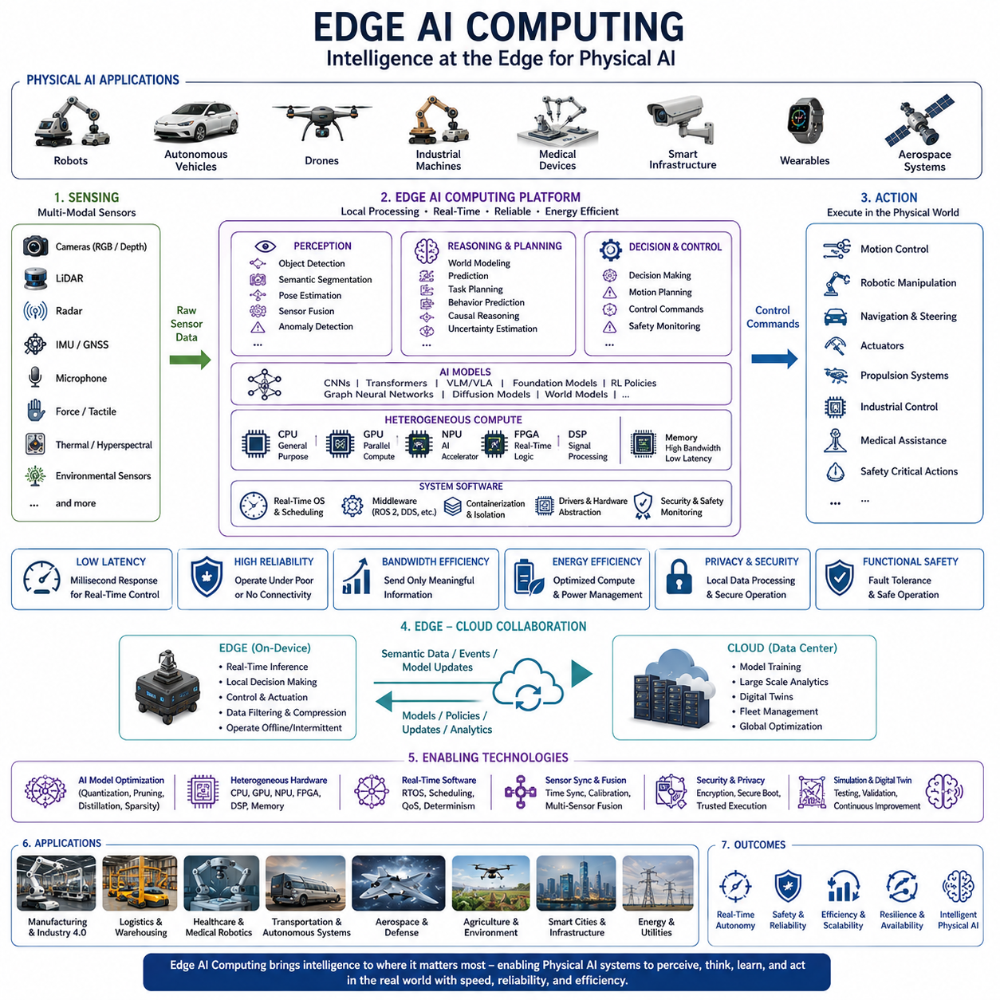
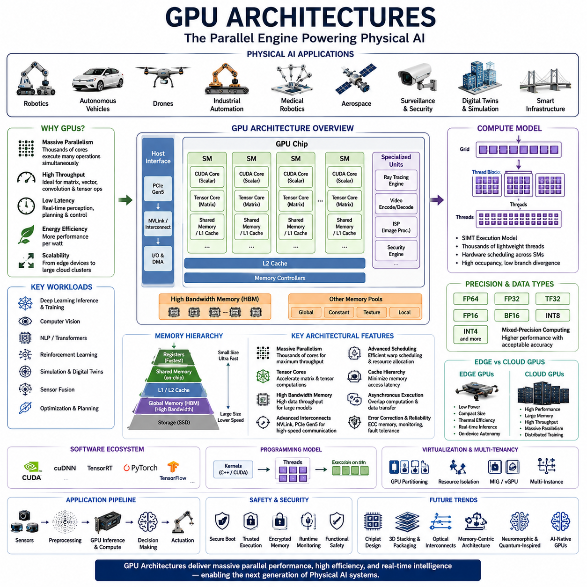
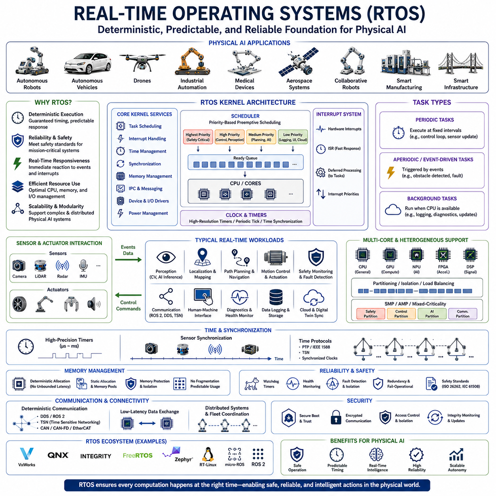
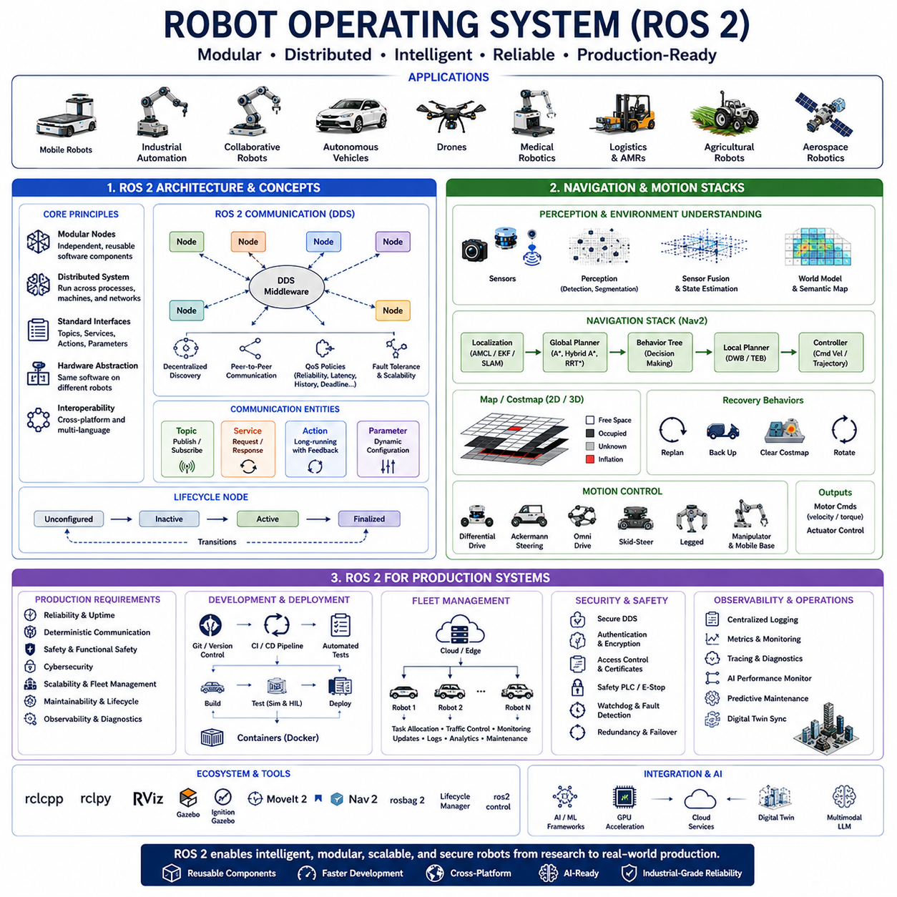
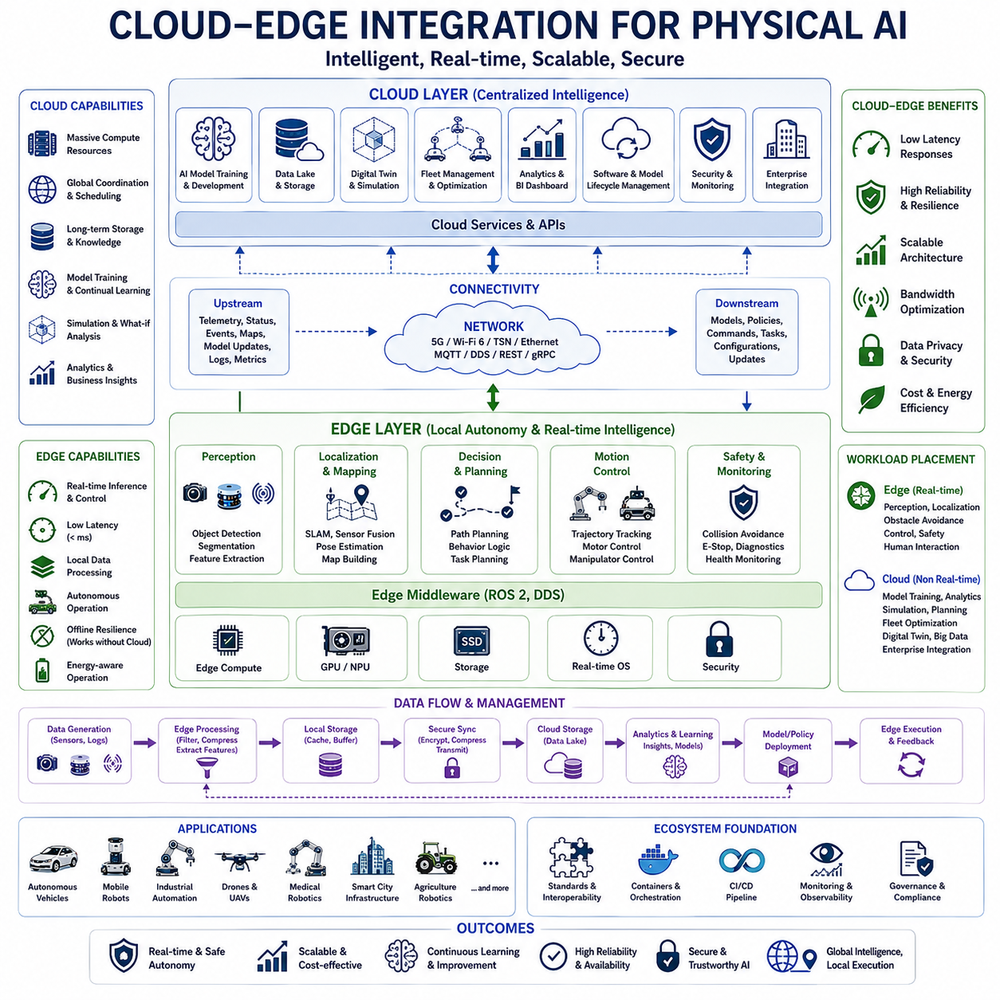
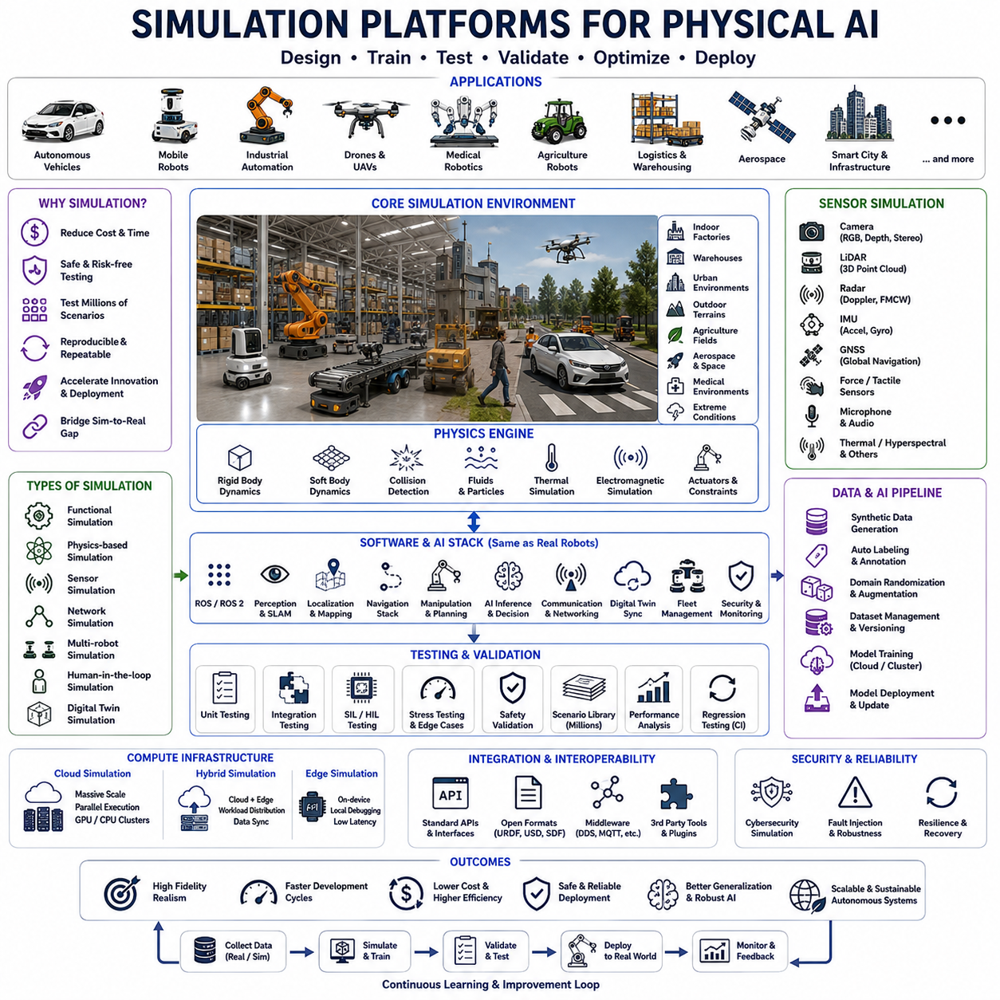
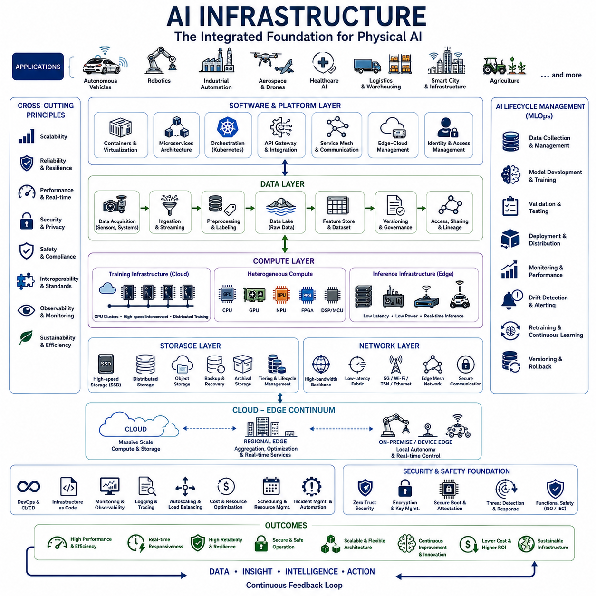
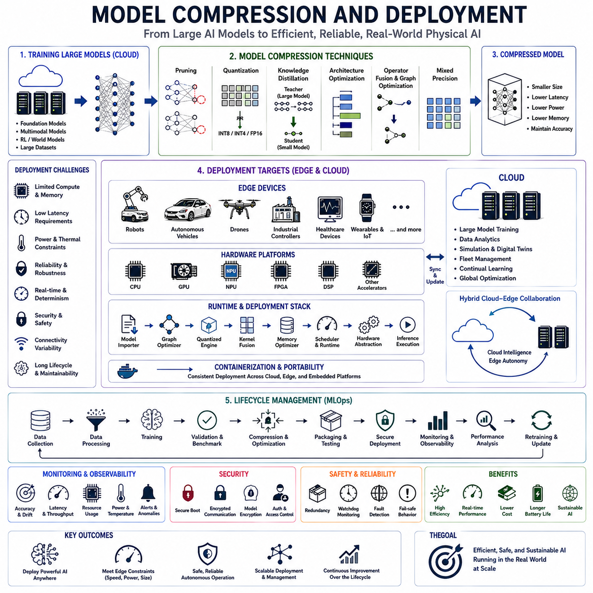
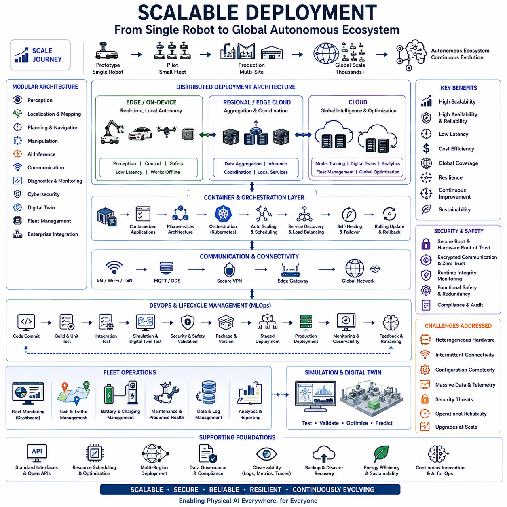

**Physical AI Engineering**

# Chapter 13 Computing Platforms for Physical AI 

## 13-01 Edge AI Computing

{width="7.268055555555556in" height="7.268055555555556in"}

Edge AI Computing represents one of the most fundamental computing paradigms enabling Physical AI systems to perceive, reason, learn, and act directly within the physical world. Unlike traditional artificial intelligence architectures that depend heavily on centralized cloud computing, Edge AI moves intelligence closer to the physical devices where sensing, decision making, and actuation occur. Robots, autonomous vehicles, industrial machines, medical devices, drones, smart infrastructure, wearable systems, and intelligent manufacturing equipment increasingly require immediate responses that cannot tolerate communication delays, network instability, or continuous dependence on remote computing resources. Physical AI therefore relies on Edge AI Computing as the primary computational foundation for achieving real-time autonomy, reliable operation, high availability, and continuous interaction with dynamic environments.

The evolution of artificial intelligence infrastructure has progressed from centralized computing toward increasingly distributed intelligence. Early AI systems executed nearly all computational tasks inside centralized servers or cloud data centers because embedded processors lacked sufficient computational capability for deep learning inference. Advances in semiconductor technology, GPU architectures, AI accelerators, heterogeneous computing platforms, memory technologies, and energy-efficient processors have fundamentally changed this landscape. Modern edge computing platforms now execute sophisticated neural networks, world models, multimodal reasoning systems, reinforcement learning policies, and foundation models directly onboard physical machines. Rather than serving merely as data collection devices connected to powerful remote servers, autonomous systems increasingly become self-contained intelligent computing platforms capable of independent perception, reasoning, planning, and execution.

Physical AI differs significantly from conventional AI because computational decisions directly influence physical actions. Every perception result may affect robot motion, vehicle steering, drone navigation, industrial manipulation, medical assistance, or safety-critical infrastructure. Consequently, computational latency becomes an engineering constraint rather than simply a performance metric. A cloud-based decision delayed by several hundred milliseconds may be acceptable for recommendation systems or business analytics, yet identical delays can produce unsafe behavior in autonomous robots or high-speed vehicles. Edge AI Computing minimizes these delays by processing sensor information locally, allowing physical systems to react almost immediately to environmental changes.

Latency represents one of the primary motivations for deploying intelligence at the edge. Every communication between edge devices and cloud infrastructure introduces transmission delays, network congestion, routing variability, encryption overhead, and server-side processing latency. Although modern communication networks provide remarkable bandwidth, they cannot guarantee deterministic response times under all operating conditions. Autonomous robots navigating crowded environments, collaborative industrial manipulators interacting with human workers, medical robotic systems performing precise interventions, and autonomous vehicles operating at high speeds all require response times measured in milliseconds rather than seconds. Local inference performed directly on edge hardware eliminates most communication delays while providing deterministic computational performance.

Reliability represents another defining advantage of Edge AI Computing. Many Physical AI applications operate in environments where communication infrastructure is unavailable, unreliable, expensive, or intentionally disrupted. Underground mines, offshore energy platforms, agricultural fields, disaster zones, remote industrial facilities, construction sites, military operations, underwater exploration, space missions, and planetary exploration frequently experience limited network connectivity. Autonomous systems deployed within these environments cannot depend exclusively upon cloud services for operational intelligence. Edge AI enables continuous operation regardless of communication quality by maintaining essential perception, localization, navigation, planning, and control capabilities directly onboard the physical platform.

Bandwidth efficiency further motivates edge computing architectures. Modern Physical AI systems generate enormous quantities of sensor data. High-resolution RGB cameras, depth cameras, thermal imagers, LiDAR sensors, radar systems, hyperspectral imaging devices, tactile sensors, force sensors, microphones, inertial measurement units, GNSS receivers, environmental monitoring devices, and industrial inspection systems collectively produce gigabytes of information every minute. Continuously transmitting raw sensor streams to cloud infrastructure quickly exceeds practical communication bandwidth while increasing operational costs. Edge AI Computing processes these data locally, extracting meaningful semantic information before transmitting only relevant summaries, detected events, compressed world model updates, or operational reports to centralized infrastructure.

Energy efficiency has become equally important because most autonomous physical systems operate under strict power constraints. Mobile robots, autonomous drones, wearable medical devices, planetary exploration systems, autonomous underwater vehicles, and field-deployed sensing platforms possess limited onboard energy resources. Artificial intelligence algorithms therefore require optimization not only for computational accuracy but also for energy consumption. Modern edge computing platforms integrate energy-efficient CPUs, GPUs, NPUs, FPGAs, DSPs, and specialized AI accelerators that maximize inference performance while minimizing electrical power consumption. Dynamic power management further adapts computational resource allocation according to workload complexity, environmental conditions, battery state, and mission priorities.

Edge AI Computing serves as the computational bridge connecting sensing with intelligent action. Sensor observations first enter perception pipelines executing object detection, semantic segmentation, instance recognition, pose estimation, scene understanding, depth reconstruction, visual localization, anomaly detection, language grounding, and multimodal sensor fusion. These perception outputs subsequently support higher-level reasoning systems responsible for world modeling, task planning, behavioral prediction, causal reasoning, uncertainty estimation, reinforcement learning policies, and autonomous decision making. Finally, intelligent planning generates executable control commands transmitted directly to motion controllers, robotic manipulators, autonomous navigation systems, propulsion systems, or industrial machinery. This complete cognitive pipeline operates locally within the edge computing platform without requiring continuous external computational support.

Modern Edge AI architectures increasingly employ heterogeneous computing rather than relying upon a single processor type. General-purpose CPUs manage operating systems, communication protocols, deterministic scheduling, safety monitoring, and sequential logic. Graphics Processing Units execute massively parallel neural network inference supporting computer vision, foundation models, multimodal transformers, and world model reasoning. Neural Processing Units accelerate optimized deep learning operations while consuming significantly less energy than conventional processors. Digital Signal Processors efficiently process audio, radar, vibration analysis, and communication signals. Field Programmable Gate Arrays implement deterministic low-latency hardware pipelines for specialized sensing, safety monitoring, encryption, or real-time control. These heterogeneous computational resources cooperate through unified software architectures that dynamically allocate workloads according to computational characteristics.

Real-time operating requirements distinguish Physical AI from conventional enterprise computing. Edge AI platforms frequently execute multiple computational pipelines simultaneously while satisfying strict timing constraints. Sensor acquisition, perception inference, localization, planning, motion control, communication, diagnostics, cybersecurity monitoring, health management, data logging, digital twin synchronization, and human-machine interaction all compete for computational resources. Deterministic scheduling mechanisms prioritize safety-critical operations while preventing lower-priority computational workloads from interfering with essential autonomous behaviors. Real-time operating systems, container orchestration, workload isolation, hardware virtualization, and quality-of-service management collectively ensure predictable computational performance.

Sensor synchronization plays an essential role within Edge AI Computing because accurate environmental understanding depends upon temporally aligned observations. Cameras, LiDAR sensors, radar systems, IMUs, GNSS receivers, force sensors, microphones, and communication interfaces often operate at different frequencies while introducing independent timing uncertainties. Precision Time Protocol, hardware triggering, deterministic Ethernet, timestamp synchronization, and sensor fusion middleware collectively maintain temporal consistency across heterogeneous sensing platforms. Accurate synchronization significantly improves localization, object tracking, world model construction, and multimodal reasoning.

Artificial intelligence models deployed at the edge increasingly extend beyond conventional convolutional neural networks. Transformer architectures, vision-language models, vision-language-action models, foundation models, graph neural networks, reinforcement learning policies, diffusion models, world models, and multimodal reasoning systems now execute on advanced edge computing hardware. These models enable autonomous systems not merely to recognize objects but also to understand instructions, predict future environmental evolution, explain observations, generate plans, reason about uncertainty, and collaborate naturally with human operators.

Model optimization becomes critical because edge hardware generally possesses fewer computational resources than cloud data centers. Neural network quantization reduces numerical precision while preserving inference accuracy. Model pruning removes redundant parameters to improve computational efficiency. Knowledge distillation transfers intelligence from large teacher models into compact student models optimized for embedded deployment. Structured sparsity enables hardware accelerators to exploit reduced computational complexity. Compiler optimization, operator fusion, memory optimization, graph transformation, and runtime scheduling collectively maximize hardware utilization while minimizing inference latency.

Edge AI increasingly supports multimodal intelligence by integrating visual information, language understanding, tactile sensing, force measurements, radar observations, environmental monitoring, operational history, and digital knowledge repositories into unified cognitive architectures. Multimodal reasoning significantly enhances Physical AI because autonomous systems rarely depend upon a single sensing modality. A collaborative robot may simultaneously interpret visual observations, force feedback, spoken human instructions, and production schedules while executing complex assembly operations. Edge computing enables these heterogeneous reasoning processes to occur locally with minimal communication delay.

World models represent another major advancement enabled by modern edge computing. Rather than reacting only to current sensor observations, autonomous systems maintain continuously evolving internal representations describing surrounding environments, dynamic objects, operational constraints, resource availability, mission progress, uncertainty estimates, and predicted future developments. Edge AI platforms continuously update these world models while supporting simulation, predictive planning, anomaly detection, causal reasoning, and adaptive decision making. Local world models further reduce dependence upon centralized digital twins by providing immediate situational understanding even during communication interruptions.

Collaborative edge intelligence enables multiple autonomous systems to cooperate while preserving local computational autonomy. Instead of transmitting every sensor observation to centralized infrastructure, individual edge devices exchange semantic information describing detected objects, environmental changes, mission status, localization estimates, operational risks, and resource availability. Distributed reasoning allows multiple robots, vehicles, drones, industrial machines, and sensing platforms to coordinate activities through shared knowledge while maintaining independent onboard intelligence. This hybrid architecture combines the responsiveness of local computation with the situational awareness of distributed collaboration.

Cloud-edge collaboration remains an important architectural principle despite increasing computational capability at the edge. Edge platforms primarily perform latency-sensitive perception, planning, motion control, local reasoning, and immediate autonomous decisions. Cloud infrastructure complements edge intelligence by supporting large-scale model training, historical data analysis, fleet management, digital twin synchronization, software deployment, long-term knowledge storage, predictive analytics, simulation, and global optimization. Efficient workload partitioning between edge and cloud significantly improves overall system scalability while preserving operational responsiveness.

Cybersecurity becomes increasingly critical because edge devices frequently operate in physically accessible environments while directly controlling physical infrastructure. Secure boot mechanisms, hardware roots of trust, encrypted communication, trusted execution environments, secure software updates, anomaly detection, runtime integrity monitoring, authentication frameworks, and confidential computing collectively protect Edge AI platforms against unauthorized access, malicious software, adversarial attacks, sensor spoofing, and operational manipulation. Physical AI systems further incorporate safety monitoring capable of detecting abnormal computational behavior before hazardous physical actions occur.

Functional safety requirements introduce additional engineering complexity. Edge AI platforms supporting autonomous vehicles, industrial automation, collaborative robots, medical systems, aviation, railway infrastructure, and critical manufacturing processes must demonstrate deterministic operation under hardware failures, software faults, communication disruptions, sensor degradation, and unexpected environmental conditions. Redundant computing architectures, watchdog monitoring, fail-operational mechanisms, fault detection, graceful degradation, redundant sensing, and safety-certified execution environments collectively maintain safe operation throughout adverse conditions.

Edge AI Computing significantly influences software architecture within Physical AI. Microservice-based software organization, containerized deployment, modular middleware, publish-subscribe communication, service-oriented architectures, hardware abstraction layers, computational graphs, message scheduling, and distributed orchestration collectively improve maintainability, scalability, portability, and system evolution. Middleware platforms such as ROS 2 increasingly integrate heterogeneous computing support, deterministic communication, lifecycle management, and hardware acceleration frameworks suitable for complex edge deployments.

Industrial Physical AI increasingly depends upon sophisticated edge computing platforms supporting manufacturing automation, quality inspection, predictive maintenance, warehouse logistics, autonomous mobile robots, collaborative manipulation, industrial digital twins, and adaptive production systems. Local artificial intelligence minimizes production latency, protects sensitive industrial data, maintains operation during network interruptions, and enables continuous optimization directly within manufacturing facilities. Edge computing therefore becomes an essential component of Industry 4.0 and future AI-native factories.

Healthcare applications similarly benefit from localized intelligence. Surgical robots, rehabilitation systems, medical imaging devices, wearable monitoring platforms, assistive robotics, hospital logistics systems, and intelligent diagnostic equipment require immediate processing of highly sensitive patient information. Edge AI Computing reduces latency, enhances privacy, minimizes regulatory concerns associated with cloud transmission, and supports continuous operation even during hospital network failures. Medical Physical AI therefore increasingly adopts edge-centric architectures for safety-critical clinical applications.

Autonomous transportation systems perhaps demonstrate the strongest demand for Edge AI Computing. Self-driving vehicles, autonomous trucks, delivery robots, cargo drones, railway systems, maritime vessels, and urban air mobility platforms continuously perceive rapidly changing environments while executing complex decision-making algorithms under strict real-time constraints. Local computation ensures immediate obstacle avoidance, trajectory planning, localization, behavioral prediction, collision prevention, and emergency response independent of communication infrastructure. Cloud connectivity enhances fleet coordination but never replaces essential onboard intelligence.

Future Edge AI Computing will increasingly integrate foundation models, multimodal reasoning, neuromorphic computing, quantum-inspired optimization, photonic accelerators, advanced semiconductor packaging, memory-centric architectures, chiplet technologies, energy-aware scheduling, federated learning, continual learning, and autonomous software optimization. Edge devices will evolve from executing fixed inference models toward continuously learning cognitive systems capable of adapting to individual environments while maintaining safety and operational reliability. World models, vision-language-action systems, large multimodal models, and self-improving Physical AI agents will increasingly operate directly onboard robots, vehicles, spacecraft, industrial machines, and intelligent infrastructure.

Ultimately, Edge AI Computing serves as the computational nervous system of Physical AI. Just as biological nervous systems continuously integrate sensory information, reason about environmental conditions, coordinate movement, and adapt through experience, edge computing platforms provide autonomous physical systems with localized intelligence capable of perceiving, understanding, predicting, deciding, learning, and acting within real-world environments. As semiconductor technology, artificial intelligence algorithms, distributed computing architectures, and intelligent sensing continue advancing, Edge AI Computing will become the universal computational foundation enabling future generations of autonomous robots, intelligent transportation systems, aerospace platforms, industrial automation, medical robotics, smart cities, and globally interconnected Physical AI ecosystems.

## 13-02 GPU Architectures

{width="7.268055555555556in" height="7.268055555555556in"}

GPU Architectures form one of the most important computational foundations of modern Physical AI systems. As artificial intelligence models continue to increase in complexity, computational demand has grown beyond the capabilities of traditional central processing units. Robots, autonomous vehicles, industrial automation systems, aerospace platforms, medical robots, intelligent surveillance systems, digital twins, and large-scale autonomous infrastructures increasingly rely on Graphics Processing Units to perform high-speed parallel computation for perception, reasoning, planning, simulation, and control. Within Physical AI, GPU architectures no longer serve only as graphics processors but have evolved into highly specialized parallel computing engines capable of executing billions of mathematical operations every second while supporting complex neural networks, foundation models, world models, multimodal reasoning, reinforcement learning, and large-scale simulation.

The original purpose of the GPU was graphical rendering for computer visualization. Early graphics processors accelerated geometric transformation, lighting calculations, rasterization, texture mapping, and pixel shading for interactive computer graphics. Because rendering images requires millions of pixels to be processed simultaneously, GPU designers developed highly parallel computational architectures capable of executing identical operations across enormous numbers of processing elements. This naturally aligned with the computational characteristics of neural networks, where matrix multiplication, vector arithmetic, convolution, attention mechanisms, and tensor operations involve massive parallelism. As deep learning emerged, GPUs rapidly became the dominant computing platform for artificial intelligence due to their exceptional throughput and computational efficiency.

Unlike conventional CPUs, which are optimized for sequential execution, low latency, and complex branching logic, GPUs are optimized for throughput-oriented parallel processing. A CPU typically contains a relatively small number of sophisticated processing cores designed to execute complicated instruction sequences with high flexibility. GPUs instead contain hundreds to thousands of simpler processing cores capable of simultaneously executing identical instructions across large datasets. This Single Instruction Multiple Thread execution model enables exceptional acceleration for workloads involving matrix operations, linear algebra, tensor computation, convolution, and large-scale numerical optimization. Since nearly every deep learning algorithm relies heavily on these operations, GPU architectures provide dramatic performance improvements compared with general-purpose processors.

Massive parallelism represents the defining characteristic of modern GPU architecture. Physical AI workloads frequently involve processing millions of pixels, point clouds containing millions of three-dimensional measurements, transformer attention matrices, occupancy grids, semantic maps, simulation environments, reinforcement learning rollouts, and digital twin calculations. Rather than processing these computations sequentially, GPU hardware distributes work across thousands of parallel execution units. Independent computations execute simultaneously, dramatically reducing execution time while maximizing hardware utilization. Parallel execution enables autonomous systems to maintain real-time performance even while processing multiple high-bandwidth sensing modalities simultaneously.

Streaming Multiprocessors constitute the primary computational building blocks inside modern GPUs. Each Streaming Multiprocessor contains numerous arithmetic logic units, floating-point execution units, integer processing units, tensor acceleration hardware, memory controllers, scheduling logic, and specialized instruction pipelines. Groups of threads execute cooperatively within each multiprocessor while sharing local memory resources and synchronization mechanisms. Physical AI applications benefit from this hierarchical organization because neural network inference, image processing, sensor fusion, and numerical optimization naturally decompose into numerous independent computational tasks suitable for parallel execution.

Thread organization within GPU architectures differs fundamentally from conventional processor execution. Rather than independently scheduling every instruction, GPUs organize threads into execution groups that process similar instructions simultaneously. Hardware scheduling efficiently distributes these groups across available processing resources while minimizing idle computation. Divergent execution paths reduce efficiency because different threads within a group must often wait for one another to complete conditional operations. Consequently, AI algorithms deployed on GPUs frequently emphasize highly regular computational structures that maximize parallel efficiency while minimizing branch divergence.

Memory architecture plays an equally important role in GPU performance. Modern artificial intelligence workloads frequently process datasets far larger than processor registers alone can accommodate. GPU architectures therefore employ multiple memory hierarchies including registers, shared memory, caches, local memory, global memory, constant memory, and texture memory. Registers provide the fastest storage for immediate computations. Shared memory enables efficient cooperation among neighboring threads executing within the same multiprocessor. Cache hierarchies reduce repeated access to external memory. High-bandwidth global memory stores large neural network parameters, sensor observations, simulation data, and intermediate computational results. Effective utilization of these memory resources significantly influences overall computational efficiency.

Memory bandwidth frequently becomes the limiting factor for AI performance rather than computational throughput alone. Foundation models, transformer architectures, multimodal reasoning systems, and world models often require rapid movement of enormous quantities of parameters between memory and computational units. High Bandwidth Memory technologies dramatically increase data transfer rates while reducing power consumption compared with conventional memory systems. Advanced packaging technologies place memory physically closer to computational hardware, minimizing communication latency and improving energy efficiency. Memory-centric architecture therefore becomes increasingly important as AI models continue expanding in scale.

Tensor computation represents one of the most significant architectural innovations supporting modern Physical AI. Neural network inference consists primarily of matrix multiplication and tensor operations repeated across numerous layers. Specialized tensor processing hardware accelerates these operations by performing multiple arithmetic calculations simultaneously using highly optimized computational pipelines. Tensor acceleration substantially increases inference throughput while improving energy efficiency compared with executing identical operations on general arithmetic units. Vision-language models, transformer architectures, reinforcement learning policies, world models, diffusion models, and multimodal neural networks all benefit extensively from dedicated tensor processing hardware.

Mixed-precision computing further improves computational efficiency without significantly reducing AI accuracy. Many neural network operations tolerate reduced numerical precision because statistical learning inherently accommodates small computational approximations. Modern GPU architectures therefore support multiple numerical formats including FP64, FP32, TF32, FP16, BF16, INT8, INT4, and increasingly lower precision representations. High precision remains available where numerical stability is essential, while lower precision dramatically increases computational throughput and reduces memory consumption for inference workloads. Physical AI systems dynamically select numerical precision according to model requirements, computational resources, and accuracy constraints.

Artificial intelligence inference differs fundamentally from AI training in computational characteristics. Training requires forward propagation, backward propagation, gradient computation, optimizer updates, and extensive parameter modification across enormous datasets. These operations demand substantial memory capacity, floating-point precision, and computational throughput. Inference instead executes only forward propagation using previously trained parameters to generate predictions from new observations. Consequently, inference emphasizes low latency, energy efficiency, deterministic execution, and optimized memory utilization. Modern GPU architectures increasingly incorporate specialized inference acceleration supporting edge deployment for Physical AI systems operating under strict real-time constraints.

GPU virtualization enables efficient sharing of computational resources across multiple independent workloads. Large data center GPUs often execute numerous artificial intelligence services simultaneously while maintaining isolation among users, applications, or autonomous systems. Virtualization partitions computational resources, memory capacity, scheduling priorities, and communication interfaces according to workload requirements. Industrial cloud robotics, digital twin platforms, autonomous fleet management, large-scale simulation, and collaborative AI development environments all benefit from GPU virtualization because computational resources remain efficiently utilized while supporting diverse applications.

Edge GPU architectures introduce different optimization priorities compared with large cloud accelerators. Mobile robots, autonomous vehicles, drones, medical devices, industrial inspection platforms, and aerospace systems operate under severe constraints involving power consumption, thermal management, physical size, weight, vibration tolerance, and environmental robustness. Edge GPUs therefore prioritize computational efficiency per watt while maintaining sufficient performance for real-time perception, planning, localization, world modeling, and autonomous control. Specialized embedded GPU architectures increasingly integrate CPUs, AI accelerators, image signal processors, hardware video encoders, communication interfaces, and memory into highly compact system-on-chip platforms suitable for autonomous machines.

Thermal management becomes a critical engineering consideration because sustained AI workloads generate substantial heat. Neural network inference, simultaneous sensor processing, large transformer models, simulation, and digital twin synchronization may continuously utilize GPU computational resources near maximum capacity. Excessive temperature reduces hardware reliability and eventually forces frequency reduction through thermal throttling. Physical AI platforms therefore integrate advanced cooling technologies including heat pipes, vapor chambers, liquid cooling, active airflow, thermal interface materials, intelligent fan control, and computational workload scheduling. Aerospace, industrial, and outdoor robotic systems require particularly robust thermal management because environmental conditions frequently exceed typical consumer operating temperatures.

Power management similarly influences GPU architecture selection for Physical AI deployment. Autonomous mobile platforms possess finite onboard energy resources supplied by batteries, fuel cells, hybrid propulsion systems, or renewable energy sources. GPU operating frequency, memory utilization, voltage scaling, workload scheduling, and computational precision directly influence power consumption. Dynamic Voltage and Frequency Scaling continuously adjusts computational performance according to instantaneous workload demand, maximizing energy efficiency while preserving real-time responsiveness. Intelligent power management extends operational endurance without compromising mission objectives.

GPU software ecosystems have evolved into comprehensive development environments supporting artificial intelligence research and deployment. Parallel programming frameworks provide developers with direct access to GPU computational resources while abstracting low-level hardware complexity. Modern AI software stacks integrate deep learning libraries, tensor computation frameworks, optimization compilers, automatic differentiation engines, inference runtimes, distributed training infrastructure, and hardware-specific optimization tools. These software ecosystems enable researchers and engineers to develop highly sophisticated Physical AI applications without manually managing individual processing threads or memory transfers.

Distributed GPU computing has become increasingly important as AI foundation models continue expanding. Large multimodal models frequently exceed the computational capacity of individual processors, requiring multiple GPUs to cooperate through high-speed communication networks. Data parallelism distributes training examples across processors, while model parallelism partitions neural network parameters among multiple GPUs. Pipeline parallelism overlaps computation across different model segments, maximizing hardware utilization. Physical AI research increasingly relies upon distributed GPU clusters for training world models, vision-language models, reinforcement learning systems, and foundation models that subsequently deploy onto edge computing platforms.

Simulation represents another computational workload heavily dependent upon GPU architecture. Physical AI development increasingly relies upon digital environments reproducing robotics, autonomous driving, industrial automation, aerospace operations, warehouse logistics, planetary exploration, medical procedures, and human interaction. High-fidelity simulation requires real-time rendering, rigid-body dynamics, particle simulation, fluid dynamics, collision detection, sensor emulation, environmental modeling, and physics-based learning. GPU architectures simultaneously accelerate graphical rendering and physical simulation while supporting reinforcement learning, synthetic data generation, and digital twin synchronization within unified computational frameworks.

Computer vision remains one of the most computationally intensive workloads within Physical AI. Object detection, semantic segmentation, instance segmentation, depth estimation, pose estimation, optical flow, visual SLAM, scene understanding, image enhancement, anomaly detection, facial recognition, gesture interpretation, and multimodal visual reasoning all execute primarily upon GPU hardware. Autonomous systems frequently process multiple synchronized camera streams together with LiDAR, radar, thermal imaging, and inertial measurements. GPU parallelism enables these heterogeneous perception pipelines to execute concurrently while maintaining deterministic real-time performance.

Transformer architectures have significantly increased computational demand compared with earlier convolutional neural networks. Self-attention mechanisms require matrix multiplication whose computational complexity grows rapidly with sequence length. Large language models, vision-language models, vision-language-action systems, multimodal foundation models, and world models therefore require exceptionally powerful GPU architectures featuring advanced tensor processing, high memory bandwidth, optimized attention acceleration, and efficient communication between processing elements. Future GPU development increasingly targets these transformer-centric computational patterns rather than conventional graphics workloads.

World models introduce additional computational complexity because autonomous systems continuously simulate possible future environmental states rather than reacting only to current observations. Predictive reasoning requires maintaining latent representations describing surrounding environments, dynamic object interactions, uncertainty estimates, causal relationships, and anticipated future developments. GPU architectures accelerate these predictive computations while enabling autonomous robots, vehicles, drones, industrial machines, and aerospace systems to reason proactively instead of reactively.

Collaborative Physical AI further expands GPU utilization through distributed intelligence. Multiple robots, autonomous vehicles, drones, industrial systems, and edge devices exchange semantic information while independently performing perception and local reasoning. GPU computation occurs simultaneously across numerous distributed platforms while cloud infrastructure coordinates large-scale optimization, digital twins, model updates, and fleet management. Hybrid cloud-edge GPU architectures therefore provide scalable computational ecosystems supporting intelligent cooperation among geographically distributed autonomous agents.

Reliability and functional safety remain essential considerations whenever GPU architectures support safety-critical applications. Autonomous driving, collaborative robotics, aerospace guidance, medical robotics, railway automation, industrial manufacturing, and critical infrastructure cannot tolerate unpredictable computational failures. GPU platforms increasingly incorporate error correction memory, redundant execution, hardware monitoring, diagnostic subsystems, watchdog mechanisms, fault isolation, runtime integrity checking, and safety-certified software frameworks. Continuous health monitoring enables Physical AI systems to detect computational anomalies before they influence physical actions.

Cybersecurity also becomes increasingly significant because GPU platforms execute highly valuable AI models controlling physical systems. Secure boot mechanisms, hardware authentication, encrypted memory, trusted execution environments, confidential computing, secure firmware updates, runtime attestation, and AI model protection collectively safeguard GPU resources against unauthorized modification, intellectual property theft, adversarial attacks, and malicious software. Secure GPU architecture therefore forms an essential component of trustworthy Physical AI deployment.

The future evolution of GPU architecture will increasingly emphasize artificial intelligence rather than graphics processing. Chiplet architectures will enable scalable processor composition while improving manufacturing efficiency. Advanced three-dimensional packaging will reduce communication latency between processing elements and memory. Optical interconnects may significantly increase bandwidth while reducing power consumption. Memory-centric architectures will minimize data movement through computational memory technologies. Neuromorphic acceleration may complement conventional tensor computation for event-driven sensing and adaptive learning. Quantum-inspired optimization could accelerate specific planning and optimization problems relevant to robotics and autonomous systems. Heterogeneous integration will increasingly combine CPUs, GPUs, NPUs, programmable logic, communication processors, image processors, and safety controllers into unified computational platforms specifically designed for Physical AI.

Ultimately, GPU Architectures serve as one of the principal computational engines powering the emergence of intelligent physical systems. They provide the massive parallel computation necessary for perception, world modeling, multimodal reasoning, simulation, autonomous planning, reinforcement learning, digital twins, foundation models, and real-time control. As Physical AI continues advancing toward increasingly autonomous robots, intelligent transportation, aerospace exploration, smart manufacturing, medical robotics, collaborative industrial systems, and globally distributed intelligent infrastructure, GPU architectures will continue evolving from graphics accelerators into comprehensive cognitive computing platforms capable of supporting the next generation of AI-native physical machines operating safely, efficiently, and intelligently throughout the real world.

## 13-03 Real-Time Operating Systems

{width="7.268055555555556in" height="7.268055555555556in"}

Real-Time Operating Systems (RTOS) form one of the most critical software foundations supporting modern Physical AI systems. Unlike conventional desktop or enterprise operating systems that primarily optimize user experience, throughput, or multitasking convenience, Real-Time Operating Systems are specifically designed to guarantee deterministic execution, predictable scheduling, bounded latency, and reliable interaction with physical environments. Every autonomous robot, industrial controller, autonomous vehicle, aerospace platform, medical device, collaborative robot, and intelligent manufacturing system continuously interacts with sensors, actuators, communication networks, and safety mechanisms where timing correctness is equally important as computational correctness. A perfectly computed control command arriving too late may become completely useless or even dangerous. Consequently, RTOS technology provides the computational discipline required to ensure that intelligent physical systems operate safely, predictably, and reliably under continuously changing real-world conditions.

The concept of real-time computing differs fundamentally from high-speed computing. A system executing billions of operations per second is not necessarily a real-time system if execution timing cannot be predicted. Real-time computing emphasizes determinism rather than maximum computational throughput. Every computational task must complete within a specified deadline regardless of variations in workload, communication traffic, memory usage, or processor utilization. Physical AI therefore relies on deterministic scheduling mechanisms capable of guaranteeing bounded response times even under worst-case operating conditions. Deterministic execution enables autonomous systems to synchronize sensing, perception, localization, planning, control, communication, and safety monitoring without unexpected timing deviations.

Historically, Real-Time Operating Systems emerged from industrial automation, aerospace guidance, military control systems, telecommunications, and embedded electronics where precise timing directly influenced system behavior. Early programmable controllers, flight computers, missile guidance systems, and manufacturing equipment required software capable of responding immediately to external events. Over several decades RTOS technology evolved toward highly optimized kernels supporting priority scheduling, interrupt handling, synchronization primitives, memory protection, multicore execution, deterministic communication, and safety certification. Today these capabilities have become essential for intelligent robots and autonomous systems executing increasingly sophisticated Physical AI algorithms.

Physical AI introduces significantly greater complexity than traditional embedded control because intelligent systems simultaneously execute numerous computational pipelines. Sensor acquisition, computer vision, neural network inference, localization, world modeling, path planning, reinforcement learning policies, actuator control, cybersecurity monitoring, digital twin synchronization, human-machine interaction, communication management, diagnostics, and energy optimization frequently operate concurrently within a single autonomous platform. The Real-Time Operating System coordinates these diverse computational activities while ensuring that safety-critical functions consistently receive sufficient computational resources regardless of artificial intelligence workload intensity.

Task scheduling represents one of the core responsibilities of every RTOS. Rather than allowing applications to compete unpredictably for processor resources, the scheduler determines precisely which task executes at every instant according to predefined scheduling policies. Safety-critical control loops generally receive the highest execution priority because delayed control commands directly influence physical stability. Perception pipelines processing cameras, LiDAR sensors, radar systems, inertial measurements, and communication interfaces receive carefully balanced priorities ensuring continuous environmental awareness without interrupting critical control operations. Lower-priority background services such as data logging, software updates, long-term diagnostics, cloud synchronization, and fleet management execute only when computational resources remain available.

Priority-based scheduling forms the most widely adopted scheduling strategy for autonomous Physical AI systems. Every computational task receives an assigned priority reflecting its operational importance and timing requirements. Whenever multiple tasks become simultaneously ready for execution, the scheduler immediately allocates processor resources to the highest-priority task. Emergency braking, collision avoidance, balance control, medical intervention, propulsion stabilization, or industrial safety monitoring therefore preempt less critical activities including map visualization, historical logging, user interface updates, or cloud communication. Priority inheritance protocols further prevent priority inversion where low-priority tasks inadvertently delay higher-priority safety functions.

Preemptive multitasking enables Real-Time Operating Systems to interrupt currently executing tasks whenever higher-priority work becomes available. Unlike cooperative multitasking where applications voluntarily relinquish processor control, preemptive scheduling guarantees immediate responsiveness to urgent events. Sensor interrupts detecting obstacles, emergency stop signals, actuator faults, communication failures, battery alarms, cybersecurity anomalies, or human safety interactions instantly interrupt lower-priority computations. Hardware context switching preserves processor state while rapidly transferring execution toward time-critical routines. This capability enables autonomous systems to respond immediately to unpredictable environmental changes.

Interrupt handling provides another essential capability supporting deterministic physical interaction. Sensors continuously generate asynchronous events requiring immediate software attention. Encoders report wheel motion, inertial sensors measure acceleration, cameras capture synchronized images, LiDAR systems complete rotational scans, force sensors detect unexpected contact, communication interfaces receive network messages, and emergency switches activate safety responses. Interrupt service routines execute with minimal latency, rapidly acknowledging hardware events while deferring computationally intensive processing toward scheduled real-time tasks. Carefully designed interrupt architecture minimizes latency while preserving overall system responsiveness.

Time management constitutes the fundamental reference framework underlying every Real-Time Operating System. High-resolution hardware timers generate precise periodic interrupts supporting deterministic task scheduling, control loop execution, sensor synchronization, communication protocols, and performance measurement. Modern Physical AI platforms frequently operate multiple concurrent timing domains ranging from microsecond-level motor control through millisecond-level perception updates toward second-level mission planning and cloud synchronization. Accurate timing enables coherent integration of heterogeneous sensing modalities while maintaining predictable autonomous behavior.

Periodic tasks dominate many Physical AI applications because sensors and controllers require regular execution intervals. Motor controllers may execute every millisecond while inertial navigation updates occur every few milliseconds. Camera processing pipelines synchronize with image acquisition frequency. Localization algorithms periodically fuse sensor observations. Communication protocols transmit heartbeat messages at fixed intervals. Digital twin synchronization occurs according to configurable update frequencies. Real-Time Operating Systems guarantee these periodic activities execute consistently regardless of unrelated computational workload elsewhere within the autonomous platform.

Aperiodic and event-driven tasks complement periodic scheduling by responding dynamically to unpredictable environmental events. Obstacle detection, emergency shutdown, cybersecurity alerts, hardware faults, communication requests, user interactions, and mission updates occur irregularly according to operational circumstances rather than predetermined schedules. RTOS scheduling mechanisms integrate both periodic and event-driven computation while preserving deterministic timing for safety-critical control functions. Sophisticated event queues, signaling mechanisms, software interrupts, and asynchronous messaging collectively coordinate these heterogeneous execution patterns.

Multithreading significantly improves computational organization within Physical AI software architecture. Separate threads independently manage perception, localization, navigation, communication, diagnostics, safety monitoring, artificial intelligence inference, user interaction, cloud connectivity, and system health management. Although these threads execute concurrently from the programmer\'s perspective, underlying processor resources remain limited. The Real-Time Operating System therefore coordinates thread scheduling, synchronization, communication, resource allocation, and execution priorities while preventing race conditions, deadlocks, starvation, and resource contention.

Synchronization mechanisms enable multiple concurrent tasks to cooperate safely while accessing shared computational resources. Mutexes, semaphores, condition variables, barriers, event flags, read-write locks, and message queues coordinate access to shared memory, hardware interfaces, communication buffers, world models, sensor databases, and planning structures. Carefully designed synchronization minimizes blocking delays while preserving deterministic execution. Lock-free programming techniques increasingly reduce synchronization overhead for highly parallel Physical AI applications requiring extremely low latency.

Interprocess communication supports modular software architecture by enabling independent software components to exchange information without direct coupling. Publish-subscribe communication, message queues, shared memory regions, remote procedure calls, data distribution middleware, and service-oriented communication collectively connect perception modules, localization systems, planning algorithms, motion controllers, diagnostics, cybersecurity services, and cloud interfaces. Middleware frameworks such as ROS 2 increasingly integrate deterministic communication capabilities compatible with Real-Time Operating Systems supporting complex robotic applications.

Memory management differs substantially from conventional desktop operating systems because unpredictable memory allocation introduces unacceptable timing variability. Dynamic memory allocation may require variable execution time while producing fragmentation after prolonged operation. Many safety-critical Real-Time Operating Systems therefore employ static memory allocation, fixed-size memory pools, deterministic allocators, memory partitioning, and compile-time resource reservation. Predictable memory behavior significantly improves worst-case execution guarantees while reducing unexpected latency during long-duration autonomous missions.

Memory protection further enhances system reliability by isolating independent software components. Faulty applications cannot overwrite safety-critical control software, communication infrastructure, or operating system kernels. Memory management units enforce access permissions separating user applications from privileged execution domains. Safety-certified architectures frequently partition autonomous systems into isolated computational zones preventing localized software failures from propagating throughout entire platforms. This isolation becomes particularly important as Physical AI systems integrate increasingly sophisticated artificial intelligence software developed by multiple independent teams.

Multicore processors introduce additional scheduling complexity because multiple computational cores execute simultaneously while sharing memory resources, communication buses, caches, and peripheral interfaces. Symmetric multiprocessing distributes computational workloads dynamically across available cores, maximizing processor utilization. Asymmetric multiprocessing dedicates specific cores toward predetermined responsibilities such as motor control, perception, artificial intelligence inference, communication management, or cybersecurity monitoring. Partitioned multicore scheduling increasingly supports mixed-criticality systems combining safety-certified control software with computationally intensive AI workloads.

Real-Time Linux has become particularly important within modern robotics because it combines deterministic scheduling with extensive software compatibility. Kernel preemption, high-resolution timers, priority inheritance, deterministic interrupt handling, CPU isolation, real-time scheduling classes, and latency optimization enable Linux-based systems to satisfy demanding Physical AI timing requirements. Robotics developers benefit from broad ecosystem support including ROS 2, CUDA, TensorRT, OpenCV, middleware frameworks, networking stacks, and extensive hardware driver availability while maintaining real-time performance suitable for autonomous systems.

Artificial intelligence workloads introduce unique scheduling challenges because neural network inference often requires substantial computational resources. GPU acceleration significantly improves AI performance but introduces asynchronous computation whose completion timing may vary according to workload complexity. Real-Time Operating Systems increasingly coordinate CPU scheduling with GPU execution, AI accelerators, DMA transfers, communication interfaces, and sensor pipelines. Computational resource management ensures that intensive AI inference never delays safety-critical control loops or emergency response functions.

Sensor synchronization represents another essential RTOS responsibility because heterogeneous sensing platforms operate at different frequencies. Cameras, LiDAR sensors, radar systems, inertial measurement units, GNSS receivers, tactile sensors, microphones, encoders, force sensors, and environmental monitoring devices generate observations asynchronously. Precision Time Protocol, hardware triggering, timestamp synchronization, deterministic Ethernet, synchronized clocks, and middleware time services collectively maintain temporal consistency. Accurate synchronization substantially improves sensor fusion, localization, world modeling, object tracking, and multimodal reasoning.

Functional safety standards significantly influence Real-Time Operating System design for autonomous systems operating within safety-critical domains. Industrial automation, medical robotics, railway transportation, aviation, automotive systems, energy infrastructure, collaborative robotics, and aerospace platforms require rigorous verification demonstrating deterministic execution under hardware failures, software faults, communication disruptions, sensor degradation, and environmental disturbances. Certified RTOS implementations therefore provide documented timing analysis, fault isolation, redundancy management, deterministic communication, watchdog monitoring, health diagnostics, and safety-certified software development processes supporting compliance with international safety standards.

Cybersecurity increasingly intersects with RTOS architecture because autonomous physical systems directly control valuable infrastructure while operating in potentially hostile environments. Secure boot, hardware roots of trust, authenticated software updates, encrypted communication, runtime integrity monitoring, secure memory protection, trusted execution environments, anomaly detection, and privilege separation collectively protect operating system kernels against unauthorized modification. Real-Time Operating Systems further support continuous security monitoring while ensuring defensive activities never interfere with time-critical control functions.

Fault tolerance enables autonomous systems to maintain operation despite hardware failures, software faults, communication interruptions, or environmental disturbances. Watchdog timers detect software deadlock. Health monitoring continuously evaluates processor status, memory integrity, communication quality, sensor reliability, actuator functionality, and computational performance. Redundant processors, duplicated communication channels, replicated sensors, and fail-operational architectures maintain essential autonomous behavior even following localized failures. Graceful degradation strategies progressively reduce system capability while preserving core safety functionality whenever computational resources become limited.

Virtualization increasingly enables multiple operating systems to coexist within unified Physical AI platforms. Hypervisors partition computational resources into isolated execution environments supporting independent safety-critical control software, artificial intelligence inference engines, cloud connectivity services, diagnostics, and user applications. Mixed-criticality architectures thereby combine safety-certified real-time software with conventional Linux environments executing complex AI frameworks while preventing interference between computational domains.

Communication latency becomes equally important as processor scheduling because autonomous systems increasingly coordinate distributed sensing, collaborative robotics, fleet management, digital twins, edge computing, and cloud infrastructure. Deterministic communication protocols including Time Sensitive Networking, Data Distribution Service, deterministic Ethernet, Controller Area Network, EtherCAT, and industrial fieldbus technologies integrate closely with RTOS scheduling mechanisms. Predictable communication timing enables synchronized coordination among multiple autonomous platforms while preserving real-time responsiveness.

Edge computing strongly depends upon Real-Time Operating Systems because autonomous machines frequently execute artificial intelligence locally without continuous cloud connectivity. Edge devices simultaneously process multiple sensor streams, execute neural network inference, maintain localization, update world models, generate navigation trajectories, monitor cybersecurity, communicate with neighboring systems, and control physical actuators. Deterministic operating system behavior ensures these diverse computational activities remain synchronized while preserving predictable latency under continuously changing workloads.

Modern Physical AI software increasingly adopts modular service-oriented architecture built upon Real-Time Operating Systems. Perception, localization, planning, control, diagnostics, cybersecurity, fleet management, digital twins, human-machine interaction, cloud synchronization, and artificial intelligence inference operate as loosely coupled services communicating through deterministic middleware. Modular design simplifies software maintenance, scalability, verification, fault isolation, and long-term system evolution while preserving predictable execution timing required for autonomous operation.

Future Real-Time Operating Systems will increasingly integrate artificial intelligence directly into operating system services themselves. Intelligent schedulers may predict future computational demand according to mission context, environmental complexity, and workload history. Adaptive resource allocation will dynamically optimize processor utilization, GPU scheduling, memory distribution, communication bandwidth, and energy consumption. Machine learning models may anticipate hardware failures before they occur, automatically reorganize computational workloads, and continuously optimize system performance while maintaining deterministic safety guarantees.

Emerging heterogeneous computing platforms combining CPUs, GPUs, NPUs, FPGAs, DSPs, programmable accelerators, and specialized sensor processors will require increasingly sophisticated Real-Time Operating Systems capable of coordinating diverse computational resources through unified scheduling frameworks. AI-native operating systems may eventually treat neural inference engines, world models, multimodal reasoning systems, reinforcement learning policies, and foundation models as standard operating system services analogous to traditional process scheduling or memory management.

Ultimately, Real-Time Operating Systems represent the computational heartbeat of Physical AI. They coordinate every sensing event, computational decision, communication exchange, control action, safety response, and intelligent behavior according to precisely defined temporal constraints. Just as biological nervous systems rely upon precisely timed neural signaling to coordinate perception and movement, autonomous physical systems depend upon deterministic operating systems to synchronize artificial intelligence with the physical world. As robots, autonomous transportation, industrial automation, aerospace exploration, intelligent healthcare, collaborative manufacturing, and smart infrastructure continue advancing, Real-Time Operating Systems will remain indispensable software foundations enabling future generations of safe, reliable, explainable, and highly intelligent Physical AI systems.

## 13-04 Robot Operating System (ROS)

{width="7.268055555555556in" height="7.268055555555556in"}

13-04-01 ROS 2 Architecture and Concepts

13-04-02 Navigation and Motion Stacks

13-04-03 ROS for Production Systems

Robot Operating Systems have become the fundamental software infrastructure supporting modern Physical AI, autonomous robots, intelligent industrial automation, service robotics, medical robotics, logistics systems, agricultural robots, and autonomous vehicles. Rather than functioning as a conventional operating system similar to Windows or Linux, a Robot Operating System provides a middleware framework that standardizes communication, hardware abstraction, software modularization, distributed computing, lifecycle management, and application integration across highly complex robotic systems. Modern robots consist of numerous heterogeneous components including perception sensors, localization modules, navigation systems, motion controllers, manipulators, artificial intelligence models, communication interfaces, digital twins, cloud services, and safety subsystems. Without a unified software architecture, integrating these independent components would become increasingly difficult as robotic complexity continues to grow.

The evolution of robot software reflects the increasing sophistication of autonomous systems. Early industrial robots were programmed using proprietary controller software tightly coupled with specific hardware vendors. Such architectures offered excellent reliability but provided little flexibility for integrating new sensors, advanced artificial intelligence algorithms, or collaborative robotic behaviors. As robotics research accelerated, developers required reusable software components that could operate across multiple robot platforms. This demand led to the emergence of Robot Operating System (ROS), an open software ecosystem emphasizing modular software design, reusable packages, distributed communication, standardized interfaces, and hardware independence.

Modern Physical AI significantly expands the role of Robot Operating Systems beyond traditional robotics middleware. Autonomous systems no longer perform only deterministic motion sequences but continuously perceive dynamic environments, understand semantic information, construct world models, execute multimodal reasoning, interact naturally with humans, coordinate multiple robots, and adapt behavior according to uncertain operating conditions. Robot Operating Systems therefore increasingly integrate artificial intelligence frameworks, GPU acceleration, real-time communication, cloud-edge collaboration, digital twin synchronization, cybersecurity mechanisms, and large-scale fleet management into unified software ecosystems.

Software modularity represents one of the most valuable characteristics of Robot Operating Systems. Complex robotic applications are decomposed into independent functional modules responsible for sensing, perception, localization, mapping, planning, manipulation, communication, diagnostics, simulation, and user interaction. Each module operates independently while exchanging information through standardized middleware interfaces. This modular architecture significantly improves software maintainability, scalability, portability, fault isolation, collaborative development, and long-term system evolution. Individual software components can be upgraded, replaced, or extended without redesigning the complete robotic system.

Distributed computing forms another fundamental principle of Robot Operating Systems. Modern robots frequently execute computations across heterogeneous processors including CPUs, GPUs, NPUs, embedded controllers, industrial computers, cloud servers, and edge computing devices. Robot middleware enables these distributed computational resources to cooperate transparently despite operating on different hardware architectures or physical machines. Sensor processing, AI inference, motion planning, simulation, visualization, fleet management, and digital twin synchronization execute wherever computational resources are most appropriate while maintaining unified system behavior.

Communication infrastructure provides the foundation connecting every robotic subsystem. Sensor observations, localization estimates, navigation goals, actuator commands, safety events, diagnostics, mission updates, environmental maps, AI inference results, and operational status continuously flow among software modules. Modern Robot Operating Systems employ publish-subscribe communication, service interfaces, action protocols, parameter management, lifecycle control, and deterministic middleware enabling efficient data exchange while minimizing software coupling. This communication architecture allows independent software teams to develop interoperable robotic applications following standardized interface definitions.

Hardware abstraction significantly simplifies robot software development. Robotic systems employ highly diverse sensors, actuators, communication interfaces, controllers, cameras, LiDAR systems, radar units, force sensors, motor drivers, industrial buses, and embedded electronics. Hardware abstraction layers isolate application software from device-specific implementation details, enabling identical software algorithms to operate across different robot platforms with minimal modification. Developers therefore focus upon robotic intelligence rather than low-level hardware integration.

Artificial intelligence integration has become increasingly important within Robot Operating Systems. Computer vision, multimodal reasoning, reinforcement learning, world models, large language models, manipulation policies, semantic mapping, predictive maintenance, anomaly detection, and human-robot interaction increasingly execute as integrated middleware services rather than isolated applications. Robot Operating Systems coordinate communication between AI models and conventional robotic software while supporting GPU acceleration, edge computing, distributed inference, and cloud synchronization.

Simulation environments closely integrate with Robot Operating Systems throughout development, testing, validation, and deployment. Digital twins, physics simulation, synthetic sensor generation, reinforcement learning environments, and hardware-in-the-loop validation enable software verification before physical deployment. Simulation significantly reduces development costs while improving software quality, safety validation, algorithm optimization, and operator training.

Cybersecurity, functional safety, deterministic communication, lifecycle management, continuous deployment, cloud connectivity, fleet coordination, digital engineering, predictive maintenance, and autonomous system monitoring have all become integral components of modern Robot Operating Systems. As Physical AI continues advancing toward AI-native autonomous systems, Robot Operating Systems evolve from research middleware into comprehensive intelligent software infrastructures supporting reliable deployment throughout industrial, commercial, medical, logistics, agricultural, transportation, aerospace, and service robotics applications.

ROS 2 represents the second generation of the Robot Operating System architecture and has become the dominant software framework for modern autonomous robotics and Physical AI development. Unlike the original ROS architecture, which primarily targeted academic research and laboratory environments, ROS 2 was designed from the beginning to support industrial deployment, real-time communication, distributed computing, cybersecurity, reliability, scalability, and long-term maintainability. These improvements allow ROS 2 to serve not only research laboratories but also autonomous mobile robots, collaborative robots, autonomous vehicles, medical robots, warehouse automation, agricultural machinery, and aerospace robotic platforms.

The architectural philosophy of ROS 2 centers on modular distributed software. Every robotic capability is implemented as an independent node that performs a specific computational function. One node may acquire camera images, another performs object detection, another estimates localization, another plans navigation trajectories, while additional nodes manage robot control, diagnostics, battery monitoring, cloud communication, or digital twin synchronization. Nodes communicate through standardized middleware rather than direct software dependencies, allowing complex robotic systems to be constructed from loosely coupled software components.

The communication backbone of ROS 2 is based on the Data Distribution Service (DDS), which replaces the centralized ROS Master architecture used in ROS 1. DDS enables decentralized discovery, peer-to-peer communication, configurable Quality of Service (QoS), deterministic messaging, fault tolerance, and scalable distributed operation. This decentralized architecture eliminates single points of failure while allowing robots to continue operating even if portions of the network become unavailable.

ROS 2 supports multiple communication models. Topics enable asynchronous publish-subscribe communication suitable for sensor streams and robot status information. Services provide synchronous request-response interactions for configuration and parameter access. Actions support long-duration tasks such as autonomous navigation, docking, manipulation, or inspection while providing continuous feedback and cancellation capability. Parameters allow dynamic configuration of software behavior without modifying application code.

Quality of Service policies provide fine-grained control over communication reliability. Developers can configure reliability, durability, message history, latency tolerance, deadline constraints, liveliness monitoring, and resource allocation according to application requirements. Safety-critical control messages may require guaranteed delivery, whereas high-frequency camera streams often prioritize low latency over perfect reliability. These configurable communication characteristics make ROS 2 suitable for both research and industrial applications.

Lifecycle nodes introduce structured software state management. Rather than immediately executing after startup, nodes transition through initialization, configuration, activation, operation, deactivation, cleanup, and shutdown states. This lifecycle approach improves startup sequencing, system monitoring, fault recovery, software updates, and operational safety for complex robotic systems.

ROS 2 also emphasizes hardware abstraction, allowing identical applications to operate across multiple robot platforms. Standardized interfaces support cameras, LiDAR sensors, IMUs, robotic arms, mobile bases, industrial controllers, and simulation environments. Integration with modern development tools, GPU acceleration, cloud computing, container technologies, and continuous integration further establishes ROS 2 as the primary middleware foundation for AI-native robotics.

Navigation and Motion Stacks provide the software intelligence enabling autonomous robots to move safely, efficiently, and intelligently within complex environments. While perception systems understand the surrounding world, navigation systems determine where the robot should move, and motion systems calculate how the robot should move while satisfying physical, environmental, and operational constraints.

Modern navigation begins with localization, where the robot continuously estimates its own position using wheel odometry, IMUs, LiDAR, cameras, GNSS, visual landmarks, fiducial markers, or sensor fusion algorithms. Simultaneous Localization and Mapping (SLAM) enables robots to build maps while simultaneously estimating their own position in unknown environments. Once reliable localization has been established, mapping systems generate occupancy grids, semantic maps, three-dimensional point clouds, or digital twins representing the robot\'s operating environment.

Global planning computes an optimal route from the robot\'s current location toward the desired destination. Planning algorithms consider environmental obstacles, restricted areas, operational constraints, traffic rules, energy consumption, and mission objectives. Local planning subsequently generates collision-free trajectories by continuously adapting to dynamic obstacles including people, vehicles, forklifts, moving machinery, or collaborative robots.

Motion control converts planned trajectories into executable motor commands while respecting vehicle kinematics, dynamic constraints, wheel configurations, steering mechanisms, actuator limits, payload conditions, and safety requirements. Differential drive, Ackermann steering, omnidirectional platforms, skid-steer vehicles, legged robots, tracked vehicles, and articulated mobile manipulators all require specialized motion models.

Modern navigation stacks increasingly incorporate artificial intelligence beyond classical planning. Semantic understanding allows robots to distinguish doors, corridors, elevators, workstations, loading docks, charging stations, pedestrians, and restricted zones. Predictive AI anticipates future obstacle movement, enabling smoother trajectory generation and proactive collision avoidance. Reinforcement learning improves navigation efficiency through accumulated operational experience, while world models enable predictive reasoning about future environmental evolution.

ROS 2 Navigation Stack (Nav2) integrates localization, mapping, global planning, local planning, behavior trees, recovery behaviors, controller servers, costmaps, docking, and mission execution into a unified navigation framework. Behavior Trees coordinate complex autonomous behaviors while maintaining modularity, explainability, and flexible task sequencing. Integration with real-time perception, digital twins, fleet management, and cloud-edge computing enables scalable autonomous navigation across industrial, logistics, healthcare, service, and outdoor robotic applications.

Although ROS originally emerged as an academic research platform, modern ROS 2 has evolved into a production-ready robotics framework capable of supporting commercial deployment across industrial automation, logistics, healthcare, agriculture, construction, mining, aerospace, defense, and autonomous transportation. Production deployment, however, requires substantially more than simply executing robotic software. Reliability, maintainability, scalability, cybersecurity, functional safety, software lifecycle management, and operational monitoring become equally important as autonomous intelligence.

Production robotic systems require deterministic communication, predictable startup behavior, comprehensive diagnostics, continuous health monitoring, remote software updates, secure communication, fault recovery, redundancy management, and long-term software maintenance. ROS 2 provides many of these capabilities through DDS middleware, lifecycle management, Quality of Service policies, modular node architecture, parameter management, logging infrastructure, and standardized communication interfaces.

Containerization technologies such as Docker significantly simplify production deployment by packaging robotic software together with its runtime environment. Continuous Integration and Continuous Deployment pipelines automatically verify software quality before deployment. Version control, automated testing, simulation validation, hardware-in-the-loop testing, regression testing, and digital twins reduce operational risk while improving software reliability.

Fleet management extends ROS beyond individual robots toward coordinated autonomous systems operating across factories, warehouses, hospitals, airports, and logistics facilities. Fleet managers coordinate task allocation, traffic control, battery scheduling, charging infrastructure, maintenance planning, software updates, and operational analytics while individual robots continue executing local autonomy using ROS 2.

Cybersecurity has become an essential production requirement. Authentication, encrypted communication, secure DDS transport, access control, certificate management, secure boot, runtime monitoring, and vulnerability management protect robotic infrastructure from unauthorized access or cyber attacks. Functional safety similarly requires integration with certified safety controllers, emergency stop systems, redundant sensing, safety PLCs, watchdog monitoring, and fault-tolerant architectures.

Observability also becomes increasingly important during long-term deployment. Centralized logging, distributed tracing, performance monitoring, resource utilization analysis, AI inference monitoring, network diagnostics, predictive maintenance, and digital twin synchronization enable operators to understand robot behavior throughout large autonomous fleets. Cloud-edge collaboration further allows centralized optimization while preserving low-latency autonomous operation at the edge.

The future of production ROS systems will increasingly integrate Physical AI, foundation models, world models, multimodal reasoning, collaborative robotics, autonomous fleet intelligence, cloud-native orchestration, digital engineering, AI-assisted diagnostics, and continuous software optimization. Rather than serving only as robotics middleware, ROS will continue evolving into a comprehensive intelligent software platform supporting AI-native robotic products operating safely, reliably, and autonomously throughout real industrial environments.

## 13-05 Cloud-Edge Integration

{width="7.268055555555556in" height="7.268055555555556in"}

Cloud-Edge Integration has become one of the defining architectural principles enabling modern Physical AI systems to operate intelligently, efficiently, and at global scale. As autonomous robots, industrial automation systems, autonomous vehicles, drones, medical robotics, intelligent infrastructure, logistics platforms, and smart manufacturing continue evolving toward increasingly sophisticated artificial intelligence, neither cloud computing nor edge computing alone can satisfy every operational requirement. Cloud computing provides virtually unlimited computational resources, centralized coordination, large-scale data management, and continuous learning capabilities, while edge computing delivers deterministic real-time responses, low latency, local autonomy, and operational resilience. Cloud-Edge Integration combines these complementary capabilities into a unified computational ecosystem in which intelligent workloads are dynamically distributed according to latency requirements, computational complexity, communication conditions, safety constraints, energy availability, and operational priorities.

Traditional cloud-centric architectures assumed that sensing devices primarily collected information before transmitting raw data toward centralized servers where all computational processing occurred. This approach proved highly successful for enterprise information systems, web applications, recommendation engines, and business analytics because communication latency generally remained acceptable relative to application requirements. Physical AI fundamentally changes these assumptions. Robots and autonomous machines continuously interact with dynamic environments where milliseconds may determine operational success or safety. Waiting for remote cloud responses before avoiding obstacles, stabilizing balance, controlling manipulators, executing emergency braking, or interacting with humans becomes impractical. Consequently, computational intelligence migrates toward edge platforms while cloud infrastructure evolves into complementary computational support rather than primary operational control.

Edge computing provides immediate intelligence directly within autonomous machines. Cameras, LiDAR systems, radar sensors, inertial measurement units, force sensors, tactile sensors, thermal imaging systems, environmental monitoring devices, and communication interfaces continuously generate massive quantities of sensor observations. Local edge computers execute perception pipelines, localization algorithms, world model construction, neural network inference, reinforcement learning policies, motion planning, trajectory optimization, actuator control, and safety monitoring without depending upon continuous cloud connectivity. This local autonomy enables robots and intelligent machines to maintain deterministic behavior regardless of network availability while minimizing communication latency and improving operational reliability.

Cloud computing simultaneously provides capabilities impossible to achieve efficiently on individual edge devices. Large foundation model training, multimodal reasoning development, digital twin simulation, fleet optimization, long-term historical analysis, predictive maintenance, global knowledge management, software deployment, distributed data storage, model version control, cybersecurity monitoring, and enterprise resource integration require computational resources significantly exceeding those available within embedded autonomous platforms. Cloud infrastructure therefore functions as the centralized intelligence layer responsible for learning, coordination, optimization, lifecycle management, and strategic decision support across entire autonomous ecosystems.

The fundamental design principle underlying Cloud-Edge Integration is workload partitioning. Rather than executing all computational tasks within a single location, software architects carefully determine where each computational function should operate according to its characteristics. Time-critical perception, obstacle avoidance, motor control, localization, emergency response, manipulation control, and human safety monitoring remain at the edge because latency directly influences physical behavior. Computationally intensive but less time-sensitive activities including model retraining, fleet analytics, production optimization, simulation, historical trend analysis, enterprise integration, digital engineering, and strategic planning execute within cloud infrastructure. Dynamic workload distribution ensures that every computational resource operates according to its strengths while minimizing unnecessary communication overhead.

Latency represents one of the primary factors governing workload allocation. Physical AI systems frequently require deterministic responses within milliseconds. Autonomous vehicles continuously avoid collisions while navigating unpredictable traffic. Collaborative robots immediately react to unexpected human contact. Industrial manipulators maintain precise trajectory control despite external disturbances. Medical robotic systems perform highly accurate interventions requiring immediate feedback. These operations cannot tolerate variable network delays associated with cloud communication. Edge platforms therefore execute latency-sensitive computations locally while cloud resources support broader situational awareness and long-term optimization.

Communication bandwidth further influences architectural decisions. Modern autonomous systems generate extraordinary quantities of sensor information. High-resolution RGB cameras, stereo vision systems, depth sensors, LiDAR scanners, radar arrays, hyperspectral imaging systems, industrial inspection cameras, acoustic monitoring devices, vibration sensors, and environmental measurement platforms collectively produce gigabytes of information every minute. Continuously transmitting raw sensor streams toward centralized cloud infrastructure rapidly exceeds practical communication capacity while unnecessarily increasing operational costs. Cloud-Edge Integration addresses this challenge through hierarchical information processing. Edge devices perform intelligent filtering, feature extraction, semantic interpretation, anomaly detection, object recognition, and world model construction before transmitting only meaningful information rather than complete raw datasets.

Artificial intelligence inference increasingly executes at the edge while model development remains cloud-centric. Large foundation models require enormous computational resources during training involving thousands of GPUs processing massive datasets over extended periods. Once trained, optimized inference models deploy onto edge platforms where they perform object recognition, semantic reasoning, natural language understanding, manipulation planning, predictive maintenance, visual inspection, multimodal perception, and autonomous decision making. Continuous feedback from deployed edge systems subsequently returns to cloud infrastructure, enabling incremental model improvement through continual learning, federated learning, reinforcement learning, and synthetic data generation. This continuous learning cycle creates self-improving autonomous ecosystems where operational experience directly contributes toward future intelligence.

Digital twins provide another important component connecting cloud and edge infrastructure. Every autonomous robot, industrial production line, warehouse system, transportation network, medical device, or manufacturing facility increasingly possesses a continuously synchronized digital representation within cloud infrastructure. Edge devices transmit operational status, sensor summaries, localization updates, actuator health, energy consumption, maintenance indicators, environmental observations, and mission progress toward digital twins. Cloud platforms subsequently simulate alternative operational strategies, predict equipment degradation, optimize fleet behavior, validate software updates, and perform what-if analyses before transmitting optimized policies back toward edge platforms. Digital twins therefore establish continuous bidirectional synchronization between physical operations and computational intelligence.

Fleet management demonstrates Cloud-Edge Integration at large operational scale. Modern logistics warehouses, manufacturing facilities, hospitals, airports, ports, agricultural operations, mining sites, and smart cities frequently deploy hundreds or thousands of autonomous machines simultaneously. Individual robots independently perform localization, perception, navigation, manipulation, and safety monitoring using edge intelligence. Cloud-based fleet managers coordinate global task allocation, traffic optimization, battery scheduling, charging infrastructure, maintenance planning, software distribution, mission prioritization, resource balancing, and operational analytics across entire robotic populations. Distributed autonomy combined with centralized coordination maximizes both responsiveness and overall system efficiency.

Cybersecurity becomes increasingly significant within cloud-edge architectures because computational resources extend across geographically distributed infrastructures. Edge devices frequently operate within physically accessible environments where hardware tampering, unauthorized access, adversarial attacks, and communication interception become realistic concerns. Cloud infrastructure simultaneously stores valuable intellectual property including foundation models, operational knowledge, digital twins, customer information, and production analytics. Secure Cloud-Edge Integration therefore incorporates hardware roots of trust, secure boot, encrypted communication, mutual authentication, certificate management, zero-trust networking, runtime integrity monitoring, trusted execution environments, confidential computing, software attestation, intrusion detection, and continuous security analytics. Security policies must remain consistent across cloud platforms, communication infrastructure, and embedded edge devices.

Functional safety introduces additional architectural requirements because communication interruptions must never compromise safe physical operation. Autonomous robots, industrial automation, autonomous vehicles, railway systems, collaborative manufacturing, medical robotics, aerospace platforms, and critical infrastructure cannot depend upon uninterrupted cloud connectivity for immediate safety decisions. Edge systems therefore maintain complete local operational autonomy capable of continuing essential functions despite network outages, cloud maintenance, cyber incidents, or communication degradation. Cloud infrastructure enhances performance but never replaces core safety mechanisms residing within edge platforms.

Cloud-native technologies increasingly simplify deployment and lifecycle management across heterogeneous robotic infrastructures. Containerization packages software together with dependencies ensuring reproducible execution across cloud servers, industrial computers, embedded platforms, and simulation environments. Container orchestration automatically distributes workloads according to computational availability while supporting scalability, resilience, software updates, resource optimization, and failure recovery. Microservice architectures decompose complex Physical AI applications into independently deployable services supporting perception, planning, localization, diagnostics, communication, digital twins, fleet management, cybersecurity, and artificial intelligence inference. Cloud-native design significantly accelerates software development while improving maintainability and operational flexibility.

Edge orchestration has emerged as an increasingly important discipline complementing traditional cloud orchestration. Large autonomous infrastructures frequently deploy hundreds of geographically distributed edge computing platforms executing heterogeneous workloads under varying environmental conditions. Edge orchestration automatically manages software deployment, configuration, monitoring, workload migration, resource balancing, hardware diagnostics, and lifecycle management across distributed computing nodes. Centralized cloud management coordinates these geographically dispersed edge systems while respecting local autonomy and communication constraints.

Data management within Cloud-Edge Integration extends far beyond simple information storage. Autonomous systems continuously generate operational telemetry, sensor observations, maintenance records, environmental measurements, mission histories, AI inference outputs, localization trajectories, energy consumption profiles, communication statistics, and safety events. Hierarchical data pipelines organize information according to operational importance, temporal relevance, storage requirements, privacy constraints, and analytical value. Frequently accessed operational information remains near edge devices, while historical archives migrate toward centralized cloud repositories supporting long-term analytics, regulatory compliance, model retraining, and enterprise knowledge management.

Federated learning represents a particularly important artificial intelligence paradigm within Cloud-Edge Integration. Rather than transmitting sensitive raw data toward centralized cloud infrastructure, edge devices locally train machine learning models using operational observations while sharing only model updates or learned parameters. Cloud servers aggregate distributed knowledge into improved global models subsequently redistributed toward participating edge platforms. Federated learning simultaneously improves model performance, preserves privacy, reduces communication bandwidth, and enables collaborative intelligence across geographically distributed autonomous systems operating under diverse environmental conditions.

Energy optimization increasingly benefits from integrated cloud-edge architectures. Mobile robots, autonomous vehicles, drones, wearable devices, and remote industrial platforms operate using finite energy resources while executing computationally intensive artificial intelligence workloads. Cloud platforms analyze historical energy consumption patterns, mission efficiency, battery degradation, environmental influences, and computational demand before recommending optimized workload allocation strategies. Edge platforms dynamically adjust processor frequencies, GPU utilization, neural network precision, communication schedules, and sensing rates according to locally available energy while preserving mission objectives. Coordinated optimization substantially extends operational endurance without sacrificing autonomous capability.

Artificial intelligence workload scheduling continuously evolves according to operational context. During routine navigation, edge devices independently execute perception, localization, and planning while cloud systems perform background analytics. Unexpected environmental complexity, large-scale emergencies, natural disasters, or industrial anomalies may require additional computational support. Cloud infrastructure dynamically allocates supplementary AI services including advanced reasoning, multimodal analysis, global optimization, simulation, predictive modeling, or collaborative decision support. Conversely, communication degradation automatically shifts responsibility toward fully autonomous edge operation. Adaptive workload migration therefore provides resilience while maximizing computational efficiency.

Cloud-Edge Integration significantly enhances explainable artificial intelligence within Physical AI. Edge systems continuously record decision contexts, sensor observations, confidence estimates, environmental conditions, executed actions, and operational outcomes. Cloud infrastructure aggregates these observations into comprehensive operational histories supporting root-cause analysis, safety investigation, regulatory reporting, performance optimization, AI validation, and continuous improvement. Explainable decision records become particularly valuable within industrial automation, medical robotics, autonomous transportation, and critical infrastructure where operational transparency directly influences regulatory compliance and public trust.

Interoperability remains essential because cloud-edge ecosystems integrate diverse hardware vendors, operating systems, communication protocols, industrial networks, artificial intelligence frameworks, databases, enterprise applications, simulation environments, and robotic middleware. Standardized communication interfaces including Data Distribution Service, Message Queuing Telemetry Transport, REST APIs, gRPC, OPC UA, Time Sensitive Networking, industrial Ethernet, and cloud-native service architectures collectively enable heterogeneous systems to exchange information while preserving modularity. Open standards significantly reduce vendor lock-in while improving long-term scalability and maintainability.

Scalability distinguishes Cloud-Edge Integration from isolated robotic deployments. Small robotic installations may initially operate using only local edge computers. As operational complexity increases, organizations gradually introduce centralized cloud coordination, fleet optimization, digital twins, predictive analytics, AI model management, enterprise integration, and global monitoring without redesigning fundamental software architecture. This evolutionary scalability allows autonomous systems to grow from single robots toward globally distributed intelligent infrastructures supporting thousands of collaborative physical agents.

Future Cloud-Edge Integration will increasingly incorporate AI-native orchestration, autonomous workload migration, self-optimizing computational resource allocation, semantic communication, world model synchronization, multimodal collaborative reasoning, distributed foundation models, quantum-enhanced optimization, advanced digital twins, edge-native large language models, and self-healing infrastructure. Artificial intelligence will increasingly participate in managing computational resources themselves, continuously predicting future workload requirements, optimizing communication topology, allocating GPU resources, coordinating distributed inference, and automatically recovering from hardware failures or cyber incidents.

Emerging intelligent infrastructures will blur the distinction between cloud and edge computing. Autonomous robots, industrial equipment, vehicles, drones, satellites, smart buildings, wearable devices, and environmental sensing networks will collectively form globally distributed computational ecosystems where intelligence dynamically flows toward whichever computational location best satisfies current operational requirements. Rather than treating cloud and edge as separate architectures, future Physical AI will view them as complementary components within a unified intelligent continuum spanning embedded processors, edge computers, regional data centers, and hyperscale cloud infrastructure.

Ultimately, Cloud-Edge Integration represents the computational nervous system connecting individual intelligent machines into coordinated Physical AI ecosystems. Edge computing provides immediate perception, reasoning, control, and safe autonomous behavior directly within physical machines. Cloud computing contributes large-scale learning, strategic optimization, digital engineering, enterprise coordination, continuous improvement, and collective intelligence. Together they establish a balanced computational architecture enabling autonomous systems to operate with both local responsiveness and global awareness. As Physical AI expands across robotics, autonomous transportation, aerospace, healthcare, manufacturing, logistics, agriculture, energy, and smart cities, Cloud-Edge Integration will become the universal architectural foundation supporting intelligent, scalable, resilient, secure, and continuously evolving autonomous ecosystems.

## 13-06 Simulation Platforms

{width="7.268055555555556in" height="7.268055555555556in"}

Simulation platforms have become one of the most indispensable technological foundations supporting modern Physical AI, autonomous robotics, intelligent transportation, industrial automation, aerospace systems, medical robotics, logistics automation, and smart infrastructure. As artificial intelligence continues to evolve from purely digital reasoning toward direct interaction with the physical world, simulation provides the essential bridge connecting virtual intelligence with real-world operation. Rather than simply visualizing robot motion, modern simulation platforms reproduce complex physical environments, sensor behavior, communication networks, environmental uncertainty, human interactions, equipment dynamics, and large-scale autonomous ecosystems with increasing realism. They enable engineers to develop, validate, optimize, and certify intelligent systems before physical deployment while dramatically reducing development cost, shortening engineering cycles, improving operational safety, and accelerating innovation.

The importance of simulation has increased significantly because modern autonomous systems have become extraordinarily complex. A single autonomous mobile robot may simultaneously execute perception, localization, simultaneous localization and mapping, world modeling, semantic understanding, motion planning, reinforcement learning, manipulation, cybersecurity monitoring, cloud-edge communication, digital twin synchronization, and fleet coordination. Testing every software modification directly on physical hardware is expensive, time-consuming, potentially unsafe, and often impractical. Simulation environments therefore allow developers to evaluate thousands of operating scenarios continuously under controlled conditions while systematically analyzing system behavior before real-world deployment.

Simulation fundamentally differs from traditional computer visualization. Visualization simply displays information generated elsewhere, whereas simulation reproduces the mathematical behavior of physical systems according to scientific models. Every moving object, sensor observation, collision event, environmental interaction, mechanical constraint, communication delay, and control response is computed using numerical models representing real physical processes. Consequently, autonomous systems operating within simulation encounter environments that closely approximate real operational conditions, allowing software behavior to generalize effectively toward deployment.

Physics simulation forms the computational core of modern simulation platforms. Every autonomous robot interacts with gravity, inertia, friction, momentum, collisions, suspension dynamics, tire-ground interaction, actuator limitations, structural flexibility, payload variation, and environmental resistance. Physics engines solve these interactions continuously using numerical integration methods while maintaining physically consistent behavior. Rigid body dynamics simulate mobile robots, manipulators, industrial equipment, and vehicles, while soft body simulation models flexible materials including cables, clothing, deformable objects, biological tissues, agricultural products, and packaging materials. Fluid dynamics reproduce water, air, smoke, dust, hydraulic systems, weather conditions, and aerodynamic behavior. Thermal simulation models heat generation, cooling systems, battery temperature, electronic components, and environmental temperature effects. Electromagnetic simulation reproduces radar propagation, wireless communication, antenna behavior, magnetic fields, and electromagnetic interference. Together these physical models create highly realistic operational environments supporting comprehensive Physical AI validation.

Robotic simulation extends beyond physics by integrating complete software stacks identical to those deployed on physical robots. Modern simulation platforms execute Robot Operating System middleware, perception algorithms, localization software, navigation stacks, manipulation planners, artificial intelligence inference engines, communication protocols, digital twins, fleet management software, cybersecurity monitoring, and cloud-edge coordination exactly as they would operate on real hardware. Software developers therefore validate complete autonomous systems rather than isolated algorithms, significantly improving deployment confidence.

Sensor simulation has become one of the most important capabilities within Physical AI development. Cameras reproduce optical behavior including exposure, lens distortion, motion blur, rolling shutter effects, lighting variation, reflections, shadows, weather conditions, dynamic range limitations, image noise, and compression artifacts. LiDAR simulation generates realistic laser reflections considering surface materials, atmospheric attenuation, multiple returns, sensor resolution, scanning frequency, and measurement uncertainty. Radar simulation models electromagnetic reflections, Doppler velocity estimation, multipath propagation, interference, and clutter. Inertial Measurement Units reproduce accelerometer drift, gyroscope bias, vibration, thermal effects, and calibration uncertainty. Global Navigation Satellite Systems simulate satellite geometry, atmospheric delay, multipath errors, signal blockage, and differential corrections. Force sensors, tactile sensors, microphones, ultrasonic devices, thermal cameras, hyperspectral sensors, gas detectors, and environmental monitoring devices similarly reproduce realistic sensing behavior. High-fidelity sensor simulation allows perception algorithms to encounter realistic imperfections before operating within unpredictable real environments.

Environmental simulation enables autonomous systems to operate under continuously changing external conditions. Indoor factories reproduce conveyor systems, shelving, machinery, workers, forklifts, collaborative robots, lighting variation, dust accumulation, and dynamic obstacles. Warehouses simulate inventory movement, loading operations, traffic congestion, pallet handling, charging stations, and logistics workflows. Outdoor environments include roads, vegetation, terrain variation, weather, pedestrians, construction zones, wildlife, water, snow, ice, fog, rain, dust storms, and seasonal changes. Agricultural simulation models crops, soil conditions, irrigation systems, plant growth, weather variation, pests, and harvesting operations. Aerospace environments reproduce atmospheric density, wind fields, orbital mechanics, solar radiation, and communication delays. Medical simulations represent operating rooms, hospitals, anatomical structures, biological tissues, patient variability, and clinical workflows. Environmental diversity substantially improves autonomous system robustness by exposing artificial intelligence to operational situations impossible to reproduce efficiently through physical testing alone.

Digital twins significantly extend simulation capability by continuously synchronizing virtual models with physical assets. Every robot, vehicle, production line, warehouse, manufacturing facility, energy infrastructure, hospital, airport, or smart city may possess an associated digital twin reflecting real operational status. Sensor observations, actuator states, maintenance history, environmental conditions, mission progress, energy consumption, component degradation, and operational analytics continuously update virtual representations. Engineers subsequently evaluate alternative operating strategies, maintenance schedules, software updates, fleet coordination policies, and emergency procedures without interrupting physical operations. Digital twins therefore enable predictive engineering rather than reactive troubleshooting.

Artificial intelligence development increasingly depends upon simulation throughout every stage of the machine learning lifecycle. Reinforcement learning requires autonomous agents to repeatedly interact with environments while gradually improving behavior through experience. Physical experimentation alone cannot generate sufficient training experience because millions or billions of interactions would require unacceptable time and cost. Simulation platforms accelerate this process by executing thousands of environments simultaneously while safely exploring hazardous situations impossible to reproduce using physical robots. Autonomous driving, drone navigation, robotic manipulation, warehouse logistics, collaborative manufacturing, and multi-agent coordination all benefit substantially from simulation-based reinforcement learning.

Synthetic data generation has emerged as one of the most valuable applications of simulation. Computer vision models require enormous quantities of accurately labeled training data representing diverse operational conditions. Manual annotation becomes prohibitively expensive while frequently introducing labeling inconsistencies. Simulation automatically generates perfectly labeled images, point clouds, semantic segmentation maps, depth images, object detection annotations, optical flow fields, instance segmentation masks, pose estimation labels, occupancy grids, and environmental metadata. Artificial intelligence models trained using synthetic data subsequently adapt toward real-world deployment through domain adaptation and transfer learning techniques. Synthetic data substantially reduces development costs while expanding operational diversity beyond practical physical data collection.

Domain randomization addresses the simulation-to-reality gap by intentionally varying simulated environments across extensive parameter ranges. Lighting, textures, object appearance, material properties, weather, sensor noise, communication latency, robot dynamics, payload variation, environmental geometry, and human behavior all change continuously throughout training. Rather than attempting perfect simulation accuracy, domain randomization encourages artificial intelligence to learn invariant representations robust against uncertainty. Robots trained under highly randomized simulation frequently generalize more effectively toward unpredictable real-world conditions than systems trained using narrowly optimized simulations.

Simulation also plays a central role in software verification and validation. Unit testing verifies individual software components, while integration testing evaluates interactions among multiple subsystems. Hardware-in-the-loop testing combines physical hardware with simulated environments, allowing embedded controllers, communication interfaces, sensors, actuators, and artificial intelligence accelerators to interact realistically before complete system integration. Software-in-the-loop testing executes complete software stacks within virtual environments while measuring computational performance, memory utilization, communication latency, and fault tolerance. Continuous integration pipelines automatically execute thousands of simulation scenarios whenever software changes occur, rapidly identifying regressions before deployment.

Safety validation becomes considerably more comprehensive through simulation. Autonomous systems frequently operate within environments where physical testing under hazardous conditions would endanger personnel, equipment, or infrastructure. Emergency braking, obstacle avoidance, collision recovery, actuator failures, communication interruptions, cyberattacks, sensor degradation, battery failures, extreme weather, infrastructure collapse, and multi-robot conflicts can all be evaluated systematically through simulation. Millions of rare edge cases become practically testable, significantly improving confidence before certification and deployment.

Multi-robot simulation has become increasingly important as autonomous systems evolve toward collaborative Physical AI ecosystems. Warehouses, manufacturing facilities, airports, hospitals, ports, agricultural operations, construction sites, military logistics, and smart cities often deploy hundreds or thousands of autonomous agents simultaneously. Simulation platforms reproduce communication networks, task allocation, traffic management, collaborative manipulation, distributed sensing, cloud-edge coordination, digital twins, and fleet optimization under large-scale operational conditions. Engineers thereby evaluate emergent system behavior impossible to observe using isolated robot experiments.

Cloud simulation dramatically expands computational scalability. Large simulation environments execute across distributed cloud infrastructure utilizing thousands of CPU cores, GPU accelerators, high-performance storage systems, and parallel networking resources. Massive reinforcement learning experiments, synthetic data generation, digital twin synchronization, multi-agent coordination, optimization studies, and fleet-scale validation become computationally feasible through cloud simulation. Edge computing simultaneously enables localized simulation supporting embedded debugging, operator training, predictive maintenance, and hardware validation directly within autonomous platforms. Hybrid cloud-edge simulation therefore mirrors the computational architecture increasingly adopted by deployed Physical AI systems.

Communication simulation reproduces realistic networking behavior influencing distributed autonomous systems. Wireless communication includes packet loss, latency variation, bandwidth limitations, interference, signal attenuation, mobility effects, and protocol behavior. Industrial Ethernet, Time Sensitive Networking, Data Distribution Service, Controller Area Network, cellular communication, satellite links, Wi-Fi, Bluetooth, and mesh networking each exhibit unique operational characteristics reproduced through simulation. Accurate communication modeling becomes increasingly important as collaborative robotics, cloud-edge computing, digital twins, and distributed artificial intelligence depend heavily upon reliable information exchange.

Human simulation introduces realistic interaction between autonomous systems and people. Virtual pedestrians exhibit diverse walking patterns, attention models, social behavior, group dynamics, emotional responses, cultural norms, workplace procedures, and unexpected actions. Human operators interact through natural language, gestures, wearable devices, augmented reality, teleoperation interfaces, and collaborative manipulation tasks. Healthcare simulation reproduces patient movement, clinical workflows, caregiver interaction, rehabilitation exercises, and emergency scenarios. These human-centered simulations enable artificial intelligence to learn socially appropriate and safe collaborative behavior.

Industrial simulation extends beyond individual robots toward complete manufacturing ecosystems. Production lines, robotic workcells, automated storage systems, conveyor networks, quality inspection stations, maintenance operations, supply chain logistics, energy management, and enterprise resource planning become integrated within unified digital manufacturing environments. Process optimization, throughput analysis, bottleneck identification, predictive maintenance, production scheduling, resource allocation, and energy optimization all benefit from comprehensive simulation before implementing operational changes.

Cybersecurity simulation has become increasingly necessary because Physical AI systems directly control valuable infrastructure. Simulation environments reproduce network attacks, malware propagation, communication interception, denial-of-service conditions, authentication failures, compromised sensors, malicious robots, insider threats, and adversarial artificial intelligence. Security researchers evaluate detection mechanisms, incident response procedures, autonomous recovery strategies, zero-trust architectures, and resilient communication protocols without exposing operational infrastructure to actual cyber risk.

Energy simulation provides another important optimization capability. Autonomous robots, electric vehicles, drones, wearable devices, industrial platforms, and remote sensing infrastructure all operate under finite energy constraints. Battery discharge, thermal management, charging infrastructure, power electronics, regenerative braking, computational workload, environmental temperature, mission scheduling, and renewable energy integration can all be analyzed systematically through simulation. Intelligent energy management substantially extends operational endurance while minimizing infrastructure costs.

Simulation increasingly supports explainable artificial intelligence by recording every computational decision throughout autonomous operation. Sensor observations, world models, reasoning pathways, confidence estimates, planned trajectories, executed actions, environmental changes, communication events, and operational outcomes remain available for detailed inspection. Engineers therefore reconstruct decision processes, identify algorithmic weaknesses, improve model transparency, satisfy regulatory requirements, and increase public trust through comprehensive simulation-based validation.

Interoperability remains essential because modern simulation platforms integrate robotics middleware, physics engines, rendering systems, game engines, artificial intelligence frameworks, industrial communication protocols, cloud infrastructure, databases, and enterprise software. Standardized interfaces enable hardware manufacturers, software developers, system integrators, and artificial intelligence researchers to collaborate using common digital engineering workflows. Open architectures significantly reduce vendor dependency while improving long-term maintainability and technological flexibility.

Future simulation platforms will increasingly converge with artificial intelligence itself. World models generated by foundation models will dynamically predict future environmental evolution rather than merely reproducing existing geometry. Neural simulation techniques will complement classical physics through learned physical representations. Generative artificial intelligence will automatically construct highly realistic operational scenarios, virtual cities, industrial facilities, warehouses, hospitals, agricultural environments, and disaster response situations. Autonomous agents will continuously generate new simulation environments challenging artificial intelligence beyond previously encountered experience.

Quantum computing, neuromorphic processors, photonic accelerators, distributed GPU clusters, edge-native simulation, cloud hyperscale infrastructure, and AI-driven physics engines will further accelerate simulation fidelity while enabling unprecedented computational scale. Eventually, simulation may operate continuously alongside every deployed autonomous system, maintaining synchronized predictive digital twins capable of forecasting future operational states before they physically occur.

Ultimately, simulation platforms represent far more than software development tools. They have become the virtual laboratories in which future Physical AI systems are conceived, trained, validated, optimized, certified, and continuously improved. By integrating realistic physics, intelligent sensing, artificial intelligence, digital twins, cloud-edge computing, multi-agent coordination, synthetic data generation, cybersecurity validation, human interaction, and large-scale autonomous infrastructure, simulation establishes the experimental foundation upon which safe, reliable, explainable, scalable, and continuously evolving Physical AI ecosystems will be built throughout the coming decades.

## 13-07 AI Infrastructure

{width="7.268055555555556in" height="7.268055555555556in"}

Artificial Intelligence Infrastructure has become the computational backbone supporting every modern Physical AI system, autonomous robot, intelligent manufacturing platform, autonomous vehicle, aerospace system, healthcare AI solution, logistics automation network, and smart city ecosystem. While artificial intelligence algorithms often receive the greatest attention, their effectiveness ultimately depends upon the underlying infrastructure responsible for providing computational power, data movement, storage, communication, synchronization, orchestration, security, reliability, and continuous lifecycle management. AI Infrastructure is therefore far more than a collection of servers or graphics processors. It is an integrated computational ecosystem connecting hardware, software, networking, storage, cloud computing, edge computing, development environments, deployment frameworks, monitoring platforms, cybersecurity, and operational management into a unified intelligent architecture capable of supporting large-scale autonomous systems throughout their complete lifecycle.

The rapid evolution of foundation models, multimodal intelligence, world models, reinforcement learning, generative artificial intelligence, and collaborative robotics has dramatically increased infrastructure requirements. Traditional enterprise computing infrastructures were primarily designed to support databases, business applications, and web services. Physical AI introduces significantly different computational characteristics. Autonomous systems continuously process enormous sensor streams, perform complex neural network inference, synchronize multiple heterogeneous processors, communicate with distributed cloud services, execute deterministic control loops, maintain digital twins, coordinate multiple robots, and simultaneously satisfy strict safety and latency requirements. Consequently, AI Infrastructure must combine high-performance computing with real-time responsiveness while maintaining reliability, scalability, and operational resilience.

Computational resources form the foundation of AI Infrastructure. Modern intelligent systems utilize heterogeneous computing architectures consisting of central processing units, graphics processing units, neural processing units, field-programmable gate arrays, digital signal processors, embedded controllers, industrial computers, cloud servers, and specialized AI accelerators. Each computational element performs workloads most closely aligned with its architectural strengths. CPUs manage operating systems, communication stacks, scheduling, orchestration, and sequential algorithms. GPUs accelerate massively parallel neural network inference, computer vision, simulation, and matrix computation. NPUs optimize low-power edge inference, while FPGAs implement deterministic hardware acceleration for latency-sensitive workloads. Intelligent workload distribution across heterogeneous hardware substantially improves computational efficiency while minimizing energy consumption.

Modern AI Infrastructure increasingly separates training infrastructure from inference infrastructure. Training foundation models requires thousands of high-performance GPUs interconnected through ultra-low-latency networking capable of processing petabytes of data across extended training periods. Inference infrastructure, by contrast, focuses upon delivering optimized neural network execution with minimal latency under strict power and cost constraints. Cloud-based GPU clusters support large-scale model development, whereas embedded edge accelerators deploy optimized inference models directly within autonomous robots, industrial equipment, autonomous vehicles, drones, and medical devices. This separation enables efficient utilization of computational resources while supporting continuous model evolution throughout operational deployment.

High-performance networking has become equally important as computational hardware itself. Artificial intelligence increasingly executes across distributed cloud-edge ecosystems where autonomous machines continuously exchange sensor observations, localization updates, digital twin synchronization, fleet coordination messages, software updates, operational analytics, and artificial intelligence models. High-bandwidth, low-latency communication fabrics enable distributed computation while minimizing synchronization delays. Within AI data centers, specialized interconnect technologies provide extremely fast communication among GPU clusters, enabling efficient distributed training. Edge infrastructure simultaneously employs industrial Ethernet, Time Sensitive Networking, wireless communication, cellular networks, satellite communication, and local mesh networking to connect geographically distributed intelligent devices into unified computational ecosystems.

Data infrastructure represents another fundamental pillar of modern AI systems. Artificial intelligence depends upon enormous quantities of high-quality structured and unstructured information including images, video streams, point clouds, sensor observations, operational telemetry, maintenance records, environmental measurements, simulation outputs, synthetic data, digital twin histories, and user interaction logs. Data infrastructure manages acquisition, storage, indexing, preprocessing, labeling, versioning, governance, synchronization, backup, archival, and retrieval throughout the complete data lifecycle. Modern AI organizations increasingly treat data itself as strategic infrastructure equivalent in importance to computational hardware because data quality directly determines model capability.

Storage architecture must simultaneously satisfy diverse operational requirements. High-speed solid-state storage supports active model training, inference caching, simulation, and temporary computational datasets. Large-capacity distributed storage archives historical operational information, synthetic datasets, digital twins, simulation results, and foundation model checkpoints. Hierarchical storage automatically migrates information according to access frequency, operational importance, regulatory requirements, and retention policies. Intelligent storage management balances performance, reliability, scalability, and economic efficiency while supporting continuous artificial intelligence development.

Cloud infrastructure provides virtually unlimited computational scalability supporting artificial intelligence development at global scale. Distributed cloud environments execute foundation model training, reinforcement learning, synthetic data generation, digital twin simulation, large-scale optimization, enterprise analytics, fleet coordination, cybersecurity monitoring, and continuous software deployment. Cloud computing additionally simplifies collaboration among geographically distributed engineering teams while enabling centralized management of models, datasets, software versions, digital twins, and operational analytics. Elastic resource allocation allows organizations to dynamically expand computational capacity according to development requirements without maintaining permanently oversized infrastructure.

Edge infrastructure complements cloud computing by placing intelligence directly within physical systems. Autonomous robots, industrial machines, collaborative manipulators, drones, autonomous vehicles, healthcare devices, wearable systems, agricultural equipment, and intelligent infrastructure frequently operate under strict latency constraints where cloud communication cannot provide sufficiently rapid response. Edge computing executes perception, localization, neural network inference, motion planning, manipulation control, cybersecurity monitoring, and safety validation directly within embedded hardware. Local autonomy ensures continuous operation despite communication interruptions while reducing bandwidth consumption and improving deterministic system behavior.

Cloud-edge integration has therefore become one of the defining architectural characteristics of modern AI Infrastructure. Computational workloads dynamically migrate between centralized cloud resources and distributed edge platforms according to latency requirements, computational complexity, communication quality, energy availability, operational priorities, and safety constraints. Time-critical workloads remain at the edge while computationally intensive learning and optimization execute within cloud environments. Continuous bidirectional synchronization enables autonomous systems to benefit simultaneously from local responsiveness and global intelligence.

Artificial intelligence infrastructure increasingly incorporates containerization and virtualization technologies supporting software portability and operational consistency. Containers package applications together with dependencies, ensuring identical execution across development environments, cloud platforms, simulation systems, industrial computers, and embedded devices. Virtualization isolates workloads while improving resource utilization, scalability, software maintenance, fault isolation, and security. Microservice architectures further decompose complex AI applications into independently deployable computational services responsible for perception, planning, localization, communication, digital twins, monitoring, cybersecurity, and model inference. These software engineering practices significantly improve maintainability while accelerating continuous deployment.

Orchestration systems coordinate computational resources across increasingly complex AI infrastructures. Automated orchestration schedules workloads, allocates GPUs, provisions storage, balances network traffic, deploys software updates, manages distributed services, monitors hardware utilization, detects failures, and automatically recovers from infrastructure disruptions. Intelligent orchestration becomes especially important when thousands of computational devices simultaneously support autonomous fleets operating across geographically distributed industrial facilities, logistics centers, healthcare institutions, airports, ports, smart cities, and transportation networks.

Artificial intelligence lifecycle management extends infrastructure responsibilities beyond computational execution. Modern AI systems continuously evolve throughout deployment. Data collection, preprocessing, annotation, synthetic data generation, model training, validation, optimization, deployment, monitoring, performance analysis, drift detection, retraining, rollback, and version control collectively form continuous operational pipelines. Machine Learning Operations integrates software engineering, data engineering, infrastructure management, and artificial intelligence development into unified operational workflows supporting reproducible and scalable AI deployment. Infrastructure therefore becomes responsible not only for executing intelligence but also for continuously improving intelligence throughout operational use.

Development infrastructure significantly influences engineering productivity. Integrated development environments, source code repositories, version control systems, continuous integration pipelines, simulation platforms, automated testing, digital twins, software verification, hardware-in-the-loop testing, performance profiling, debugging tools, documentation systems, and collaborative engineering platforms collectively accelerate artificial intelligence development while improving software quality. Standardized development environments reduce integration complexity while enabling geographically distributed engineering teams to collaborate efficiently.

Monitoring and observability have become indispensable components of AI Infrastructure. Operational monitoring continuously measures processor utilization, GPU performance, memory consumption, storage capacity, network latency, communication quality, inference throughput, model accuracy, energy consumption, hardware temperature, software health, security events, and operational status. Distributed tracing reconstructs computational pathways across complex microservice architectures, allowing engineers to identify bottlenecks, diagnose failures, optimize resource utilization, and maintain predictable system behavior. Comprehensive observability significantly improves operational reliability throughout large-scale Physical AI deployments.

Cybersecurity infrastructure has become increasingly critical because artificial intelligence directly controls valuable physical assets. Secure hardware roots of trust, encrypted communication, authentication, authorization, confidential computing, secure boot, software attestation, intrusion detection, runtime integrity monitoring, zero-trust networking, hardware security modules, certificate management, vulnerability assessment, security analytics, and incident response collectively protect intelligent infrastructure from cyber threats. Security must extend consistently across cloud platforms, edge devices, communication networks, embedded controllers, development environments, and operational management systems without compromising computational performance or deterministic behavior.

Functional safety infrastructure complements cybersecurity by ensuring safe operation despite hardware failures, software defects, communication interruptions, environmental disturbances, or unexpected operational conditions. Redundant computing platforms, fault-tolerant communication, watchdog supervision, health monitoring, deterministic scheduling, fail-safe architectures, redundant sensing, graceful degradation, and certified software components collectively maintain safe autonomous operation. Safety infrastructure becomes particularly important within autonomous transportation, industrial automation, collaborative robotics, healthcare, aerospace, defense, and critical infrastructure where computational failures may directly influence human safety.

Energy infrastructure has become increasingly important as computational intensity continues expanding. Large GPU clusters consume enormous electrical power while embedded autonomous systems frequently operate under finite battery constraints. Intelligent power distribution, cooling systems, thermal management, renewable energy integration, workload scheduling, processor frequency scaling, adaptive voltage control, battery management, and energy-aware artificial intelligence optimization collectively maximize computational efficiency while minimizing operational costs. Sustainable AI Infrastructure increasingly balances computational performance against environmental responsibility and long-term operational economics.

Artificial intelligence infrastructure also supports extensive simulation environments. High-performance computing resources execute digital twins, reinforcement learning, synthetic data generation, multi-agent coordination, computational fluid dynamics, structural analysis, communication simulation, cybersecurity validation, and virtual testing before physical deployment. Simulation infrastructure therefore becomes tightly integrated with operational infrastructure, allowing continuous validation and optimization throughout the entire product lifecycle. Digital engineering increasingly merges simulation, deployment, monitoring, and predictive maintenance into unified computational ecosystems.

Data governance has become essential because artificial intelligence systems continuously collect operational information throughout deployment. Infrastructure must ensure data quality, privacy, regulatory compliance, access control, lineage tracking, auditability, retention management, and responsible usage while supporting continuous model improvement. Federated learning further enables geographically distributed autonomous systems to collaboratively improve shared artificial intelligence models without transmitting sensitive raw operational data, preserving privacy while expanding collective intelligence.

Scalability distinguishes modern AI Infrastructure from conventional enterprise computing. Initial deployments may involve only a single robot or industrial workstation. As operational complexity increases, identical architectural principles extend toward hundreds of autonomous machines, thousands of edge devices, globally distributed cloud regions, large-scale digital twins, enterprise resource integration, and worldwide autonomous operations. Modular infrastructure design therefore enables organizations to expand computational capability without redesigning foundational architecture.

Interoperability remains a central architectural objective because modern AI Infrastructure integrates heterogeneous hardware vendors, operating systems, robotic middleware, communication protocols, cloud providers, industrial automation platforms, databases, simulation environments, cybersecurity tools, enterprise software, and artificial intelligence frameworks. Standardized interfaces, open communication protocols, container technologies, service-oriented architectures, and hardware abstraction significantly reduce vendor dependency while improving long-term maintainability and technological flexibility.

Future AI Infrastructure will increasingly evolve toward autonomous infrastructure management. Artificial intelligence itself will monitor computational resources, predict future workload demand, optimize GPU allocation, schedule distributed inference, orchestrate cloud-edge migration, detect infrastructure anomalies, anticipate hardware failures, recommend energy optimization, automate cybersecurity response, and continuously improve operational efficiency without human intervention. Infrastructure will therefore become an intelligent adaptive system rather than passive computational hardware.

Emerging technologies including photonic computing, quantum acceleration, neuromorphic processors, wafer-scale computing, optical networking, advanced memory technologies, edge-native foundation models, distributed world models, autonomous orchestration, semantic communication, and AI-generated software optimization will fundamentally transform future infrastructure architectures. Computing resources will increasingly operate as globally distributed intelligent fabrics where computational capability dynamically flows toward whichever location best satisfies current operational requirements.

Ultimately, AI Infrastructure represents the invisible foundation upon which every intelligent autonomous system depends. While algorithms determine how machines reason, infrastructure determines whether that intelligence can operate reliably, efficiently, securely, safely, and continuously at real-world scale. By integrating heterogeneous computing, cloud-edge collaboration, high-performance networking, intelligent storage, cybersecurity, functional safety, orchestration, lifecycle management, simulation, digital twins, sustainable energy systems, and autonomous operational management, AI Infrastructure establishes the comprehensive computational ecosystem enabling the future generation of Physical AI. As robotics, intelligent transportation, healthcare, manufacturing, logistics, aerospace, agriculture, and smart cities continue expanding, AI Infrastructure will remain the essential technological foundation transforming artificial intelligence from isolated software into globally connected, continuously evolving, physically embodied intelligence.

## 13-08 Model Compression and Deployment 

{width="7.268055555555556in" height="7.268055555555556in"}

Model Compression and Deployment represent one of the most important technological bridges connecting artificial intelligence research with real-world Physical AI applications. While state-of-the-art foundation models, multimodal reasoning systems, vision-language models, reinforcement learning policies, and world models continue growing in complexity, physical robots, autonomous vehicles, industrial controllers, drones, healthcare devices, and edge computing platforms operate under strict computational, memory, latency, thermal, power, and reliability constraints. A model capable of achieving outstanding benchmark accuracy inside a hyperscale GPU cluster may become completely impractical when deployed inside an autonomous mobile robot powered by batteries or an embedded industrial controller operating continuously for years. Model Compression and Deployment therefore transform large, computationally expensive neural networks into efficient, optimized, reliable, and production-ready inference systems capable of operating within realistic hardware environments without significantly sacrificing intelligence.

The increasing scale of artificial intelligence has dramatically changed deployment challenges. Early machine learning models often contained only thousands or millions of parameters and could easily execute on conventional processors. Modern foundation models contain billions or even trillions of parameters requiring enormous computational resources, memory bandwidth, storage capacity, and communication infrastructure. Physical AI systems rarely possess such resources. Instead, embedded computers frequently provide only limited GPU memory, constrained power budgets, passive cooling, deterministic real-time scheduling, and strict safety certification requirements. Efficient deployment therefore depends not only upon algorithmic accuracy but equally upon intelligent optimization, hardware-aware model transformation, runtime acceleration, and lifecycle management.

Model compression seeks to reduce computational complexity while preserving predictive capability. Rather than viewing model size as an immutable characteristic, compression techniques exploit redundancy naturally emerging during neural network training. Large neural networks often contain duplicated features, unnecessary parameters, highly correlated weights, inactive neurons, and computational structures contributing little toward final prediction accuracy. Compression algorithms identify and remove these redundancies, allowing equivalent reasoning capability to operate using substantially fewer computational resources.

Parameter pruning represents one of the oldest and most widely applied compression strategies. During neural network training, many weights gradually become insignificant because optimization naturally concentrates information within relatively small parameter subsets. Pruning algorithms identify weights, neurons, convolutional filters, attention heads, transformer blocks, or entire network layers contributing minimally toward inference accuracy. These components are subsequently removed, producing smaller networks requiring fewer floating-point operations, lower memory consumption, reduced communication overhead, and faster execution. Structured pruning eliminates complete computational units while unstructured pruning removes individual weights according to statistical importance. Structured approaches generally provide greater practical acceleration because hardware architectures execute simplified computational graphs more efficiently.

Quantization has become one of the most influential deployment optimization techniques for modern artificial intelligence. Conventional neural networks typically represent parameters using thirty-two-bit floating-point arithmetic. While mathematically convenient, such precision often exceeds practical inference requirements. Quantization converts floating-point representations into lower numerical precision including sixteen-bit floating point, eight-bit integer, four-bit integer, mixed precision arithmetic, or even binary neural networks under specialized circumstances. Lower numerical precision substantially reduces memory usage, communication bandwidth, computational latency, and power consumption while enabling specialized AI accelerators to execute inference significantly faster. Hardware architectures increasingly provide dedicated tensor computation units optimized specifically for low-precision arithmetic, making quantization indispensable for edge deployment.

Mixed precision inference further balances computational efficiency and prediction accuracy by allocating different numerical precisions according to computational sensitivity. Layers requiring greater numerical stability continue using higher precision while computationally intensive but numerically robust operations execute using lower precision formats. Automatic precision optimization frameworks increasingly determine appropriate numerical representations without requiring extensive manual engineering. This adaptive precision allocation significantly improves inference performance while preserving model reliability across diverse deployment platforms.

Knowledge distillation offers another highly effective compression strategy by transferring intelligence from large teacher models toward smaller student models. Rather than learning exclusively from labeled training data, student networks additionally imitate prediction distributions generated by larger pretrained models. This process enables compact networks containing dramatically fewer parameters to reproduce much of the reasoning capability developed within substantially larger architectures. Knowledge distillation has become particularly valuable for deploying foundation model capabilities onto embedded edge devices where computational resources remain extremely limited. Distillation increasingly extends beyond classification toward object detection, semantic segmentation, multimodal reasoning, reinforcement learning policies, autonomous navigation, robotic manipulation, speech recognition, and large language model deployment.

Neural architecture optimization complements compression by redesigning model topology according to deployment constraints. Rather than compressing existing networks after training, architecture optimization creates efficient neural structures inherently suited for target hardware platforms. Mobile neural architectures emphasize lightweight convolutional operations, efficient attention mechanisms, grouped computation, depthwise separable convolutions, sparse activation patterns, reduced memory movement, and hardware-aware computational scheduling. Neural architecture search increasingly automates this optimization process by exploring enormous design spaces while balancing prediction accuracy, latency, energy consumption, memory footprint, and computational throughput according to deployment objectives.

Operator fusion significantly improves runtime efficiency by combining multiple sequential neural network operations into single optimized computational kernels. Conventional deep learning frameworks frequently execute normalization, activation functions, convolution, matrix multiplication, element-wise arithmetic, and memory transfers as separate computational stages. Each stage introduces additional memory movement and scheduling overhead. Optimized deployment frameworks analyze computational graphs before inference, automatically merging compatible operations into larger execution kernels minimizing memory traffic while maximizing processor utilization. Kernel fusion becomes especially important for GPUs, NPUs, and embedded accelerators where memory bandwidth often limits overall inference performance.

Graph optimization further enhances deployment efficiency by transforming computational graphs before execution. Constant expressions become precomputed, redundant operations disappear, unnecessary data movement is eliminated, operator ordering improves hardware utilization, parallel execution opportunities increase, and memory allocation becomes globally optimized. Modern deployment toolchains automatically analyze entire neural networks before runtime, generating hardware-specific execution graphs substantially outperforming original framework implementations while preserving identical functional behavior.

Memory optimization plays an equally important role because embedded inference frequently encounters limited memory capacity. Efficient deployment minimizes parameter duplication, temporary activation storage, communication buffers, intermediate tensor allocation, and redundant computation. Dynamic memory reuse, tensor lifetime analysis, activation recomputation, layer streaming, asynchronous data transfer, and memory pooling collectively reduce operational memory requirements while maintaining computational throughput. Efficient memory management enables surprisingly sophisticated artificial intelligence models to execute upon relatively constrained edge computing platforms.

Hardware acceleration fundamentally shapes deployment strategy because different computational platforms exhibit unique architectural characteristics. Graphics Processing Units maximize massively parallel matrix computation while Neural Processing Units specialize in dedicated tensor arithmetic using optimized low-precision execution. Field Programmable Gate Arrays provide deterministic hardware pipelines supporting strict latency guarantees, whereas Digital Signal Processors efficiently execute signal processing and embedded perception algorithms. Central Processing Units remain responsible for orchestration, scheduling, communication, control logic, operating system services, and sequential computation. Successful deployment therefore requires hardware-aware optimization matching computational workloads with architectural capabilities rather than treating all processors identically.

Inference runtime frameworks provide software infrastructure translating optimized neural networks into efficient hardware execution. Rather than directly executing models using training frameworks, deployment toolchains transform computational graphs into highly optimized runtime representations supporting accelerated inference, hardware abstraction, automatic scheduling, memory optimization, quantization execution, asynchronous computation, and heterogeneous processor coordination. Runtime optimization significantly reduces engineering complexity while allowing identical artificial intelligence models to execute efficiently across cloud servers, industrial computers, embedded devices, autonomous robots, simulation environments, and edge AI platforms.

Edge deployment introduces unique engineering challenges because autonomous machines frequently operate under strict environmental constraints. Mobile robots, drones, agricultural machinery, medical equipment, autonomous vehicles, wearable systems, industrial controllers, and remote sensing platforms experience vibration, dust, humidity, electromagnetic interference, temperature variation, intermittent communication, battery limitations, and unpredictable operational conditions. Deployed models therefore require not only computational efficiency but also operational robustness, fault tolerance, deterministic execution, secure updates, lifecycle monitoring, and graceful degradation during hardware or environmental disturbances.

Real-time inference requirements significantly influence deployment architecture. Physical AI continuously interacts with dynamic environments where computational latency directly affects operational safety. Object detection, obstacle avoidance, localization, manipulation, collaborative robotics, autonomous navigation, industrial inspection, medical intervention, and aerospace guidance frequently require deterministic inference within milliseconds. Optimization therefore targets worst-case execution latency rather than average computational performance. Predictable timing enables integration with real-time operating systems, deterministic communication, safety controllers, and mission-critical autonomous decision making.

Cloud deployment and edge deployment frequently coexist within unified artificial intelligence ecosystems. Large cloud infrastructures execute computationally intensive foundation models, strategic reasoning, long-term optimization, simulation, digital twins, predictive maintenance, and continuous learning. Edge platforms simultaneously execute optimized inference models providing local perception, navigation, manipulation, safety monitoring, and immediate decision making. Continuous synchronization between cloud and edge enables compressed deployment models to benefit from ongoing cloud-based improvement while preserving autonomous operation despite communication interruptions. Hybrid deployment architectures therefore balance computational scalability with operational responsiveness.

Containerization increasingly simplifies deployment across heterogeneous computing environments. Artificial intelligence applications package runtime libraries, optimized models, inference engines, communication interfaces, operating system dependencies, and configuration files into portable execution environments. Containers ensure reproducible behavior across development systems, simulation platforms, cloud servers, industrial computers, and embedded edge hardware. Continuous deployment pipelines automatically distribute optimized models while preserving software consistency, version control, rollback capability, and operational reliability.

Model version management has become essential because deployed artificial intelligence continuously evolves. Organizations simultaneously maintain development models, validation models, production models, experimental variants, compressed versions, quantized implementations, hardware-specific optimizations, and historical archives supporting regulatory compliance, reproducibility, and rollback. Version management systems track model lineage, dataset provenance, training configuration, optimization techniques, deployment targets, performance metrics, and operational history throughout complete lifecycle management.

Continuous deployment extends beyond initial installation toward ongoing optimization. Operational data collected from deployed autonomous systems reveals environmental conditions, edge cases, performance degradation, sensor anomalies, communication failures, prediction uncertainty, user interaction patterns, and changing operational requirements. Cloud infrastructure analyzes these observations before retraining improved models subsequently compressed, validated, optimized, and redistributed toward deployed edge systems. Continuous deployment therefore establishes self-improving artificial intelligence ecosystems rather than static software installations.

Monitoring deployed models has become increasingly important because prediction quality naturally changes throughout operational use. Data distributions evolve, environmental conditions change, sensor calibration drifts, hardware ages, user behavior shifts, and operational objectives expand. Model monitoring continuously evaluates prediction confidence, inference latency, resource utilization, memory consumption, energy efficiency, hardware temperature, communication quality, anomaly detection, and statistical data drift. Early detection enables proactive retraining before performance deterioration significantly influences autonomous operation.

Artificial intelligence infrastructure increasingly supports automated deployment pipelines integrating data engineering, model training, compression, optimization, validation, benchmarking, packaging, testing, cybersecurity verification, functional safety analysis, digital twin evaluation, simulation validation, staged rollout, production deployment, and continuous monitoring. Machine Learning Operations frameworks orchestrate these activities automatically, significantly reducing engineering effort while improving reproducibility, reliability, and deployment velocity. Automated pipelines become especially valuable when organizations simultaneously manage hundreds of artificial intelligence models operating across thousands of autonomous systems.

Security considerations strongly influence deployment architecture because compressed models represent valuable intellectual property while simultaneously controlling physical infrastructure. Secure model storage, encrypted communication, authenticated updates, hardware roots of trust, runtime integrity monitoring, secure boot, confidential computing, software attestation, and tamper-resistant deployment collectively protect deployed artificial intelligence against unauthorized modification. Security mechanisms must preserve computational efficiency while satisfying strict operational reliability requirements characteristic of Physical AI.

Functional safety introduces additional deployment constraints beyond computational optimization. Autonomous robots, industrial automation, collaborative manufacturing, autonomous transportation, medical robotics, aerospace systems, and critical infrastructure require predictable inference behavior under hardware failures, communication interruptions, software defects, environmental disturbances, and unexpected operational conditions. Deployment frameworks therefore incorporate redundancy management, watchdog supervision, deterministic scheduling, health monitoring, fail-safe behavior, graceful degradation, and certified execution environments supporting safe autonomous operation throughout extended deployment lifecycles.

Simulation plays an increasingly important role throughout deployment optimization. Compressed models undergo extensive evaluation within virtual environments before physical deployment. Engineers measure inference accuracy, latency, memory utilization, energy consumption, thermal behavior, communication overhead, sensor integration, safety performance, robustness against environmental uncertainty, and multi-robot coordination under thousands of operational scenarios impossible to reproduce efficiently through physical experimentation alone. Digital twins subsequently continue validating updated deployment models before software distribution toward operational fleets.

Model compression also contributes significantly toward sustainable artificial intelligence. Smaller models consume less electrical power, require fewer computational resources, reduce cooling requirements, minimize hardware costs, lower communication bandwidth, and extend battery endurance within mobile autonomous platforms. Energy-efficient deployment therefore simultaneously improves operational economics and environmental sustainability while enabling intelligent capability throughout increasingly resource-constrained physical systems.

Emerging research increasingly explores adaptive compression where deployed models dynamically modify computational complexity according to operational context. During routine navigation, lightweight inference provides sufficient intelligence while conserving energy. Unexpected environmental complexity automatically activates additional neural layers, multimodal reasoning modules, or cloud-assisted computation. Dynamic neural execution therefore balances computational efficiency with situational intelligence according to continuously changing operational requirements.

Future deployment systems will increasingly incorporate AI-native optimization capable of automatically analyzing hardware architectures, operational workloads, communication conditions, energy availability, thermal constraints, and application objectives before generating customized deployment strategies. Intelligent deployment agents may continuously optimize quantization levels, workload distribution, neural architecture, memory allocation, processor scheduling, communication topology, and cloud-edge coordination without manual engineering intervention.

Foundation models will increasingly evolve toward modular deployment where specialized reasoning components activate only when operationally necessary. Mixture-of-experts architectures, conditional computation, sparse activation, retrieval-augmented inference, distributed reasoning, and semantic workload scheduling will substantially reduce computational requirements while preserving advanced cognitive capability. Edge-native foundation models may eventually execute sophisticated multimodal reasoning using computational resources currently considered insufficient for large-scale artificial intelligence.

Ultimately, Model Compression and Deployment represent the engineering discipline transforming theoretical artificial intelligence into practical autonomous capability. Compression extracts efficient intelligence from large neural networks while deployment integrates optimized models into reliable computational infrastructures supporting real-world Physical AI. Through quantization, pruning, knowledge distillation, graph optimization, hardware acceleration, runtime optimization, cloud-edge coordination, lifecycle management, security, functional safety, and continuous deployment, artificial intelligence becomes accessible beyond hyperscale data centers and into robots, vehicles, industrial systems, medical devices, aerospace platforms, agricultural equipment, wearable technology, and intelligent infrastructure. As Physical AI continues expanding across every sector of society, Model Compression and Deployment will remain essential technologies enabling powerful intelligence to operate efficiently, safely, reliably, and sustainably within the computational constraints of the physical world.

## 13-09 Scalable Deployment

{width="7.268055555555556in" height="7.268055555555556in"}

Scalable Deployment has become one of the defining engineering disciplines enabling modern Physical AI to transition from isolated experimental prototypes into globally distributed autonomous ecosystems. While artificial intelligence algorithms often receive primary attention during research, true industrial success depends upon the ability to deploy, manage, monitor, update, and continuously improve thousands or even millions of intelligent systems operating simultaneously across geographically distributed environments. A single autonomous robot successfully operating inside a laboratory demonstrates technical feasibility, but an enterprise deploying thousands of robots across manufacturing plants, logistics centers, hospitals, airports, smart cities, agricultural facilities, energy infrastructure, and transportation networks requires an entirely different software architecture. Scalable Deployment therefore represents the comprehensive methodology through which autonomous systems become maintainable, reliable, secure, economical, and continuously evolving throughout large operational lifecycles.

Traditional software deployment assumed relatively static computing environments where applications executed inside centralized servers or desktop computers. Physical AI fundamentally changes this paradigm because intelligence becomes physically distributed across robots, industrial equipment, autonomous vehicles, drones, medical devices, edge computers, cloud infrastructure, and digital twins operating under diverse environmental conditions. Each autonomous platform continuously interacts with changing surroundings while simultaneously exchanging information with centralized management systems, cloud services, fleet coordinators, simulation platforms, cybersecurity infrastructure, and enterprise information systems. Deployment therefore extends far beyond software installation and becomes an ongoing operational process managing distributed intelligence throughout its complete lifecycle.

Scalability begins with architectural modularity. Large autonomous systems cannot be maintained efficiently if every component depends tightly upon every other subsystem. Instead, modern deployment architectures divide functionality into independent software services responsible for perception, localization, mapping, planning, manipulation, communication, diagnostics, monitoring, cybersecurity, digital twins, artificial intelligence inference, fleet management, and enterprise integration. Each service evolves independently while communicating through standardized interfaces, allowing individual components to be upgraded, replaced, or optimized without disrupting complete operational systems. Modular deployment substantially improves maintainability while enabling organizations to scale computational infrastructure according to operational requirements.

Distributed computing forms another essential characteristic of scalable deployment. Rather than concentrating computation within centralized infrastructure, modern Physical AI distributes intelligence across cloud servers, regional data centers, industrial edge computers, embedded processors, autonomous robots, wearable devices, autonomous vehicles, drones, and mobile communication gateways. Every computational location performs tasks matching its available resources and operational responsibilities. Time-critical perception, navigation, safety monitoring, and motion control remain near physical machines, while strategic planning, foundation model training, digital twins, predictive analytics, enterprise coordination, and large-scale optimization execute within cloud environments. This distributed architecture minimizes communication latency while maximizing computational efficiency across geographically dispersed infrastructures.

Cloud-native deployment has dramatically transformed artificial intelligence operations. Cloud platforms provide elastic computational resources capable of dynamically expanding or contracting according to operational demand. During large-scale model training, simulation campaigns, synthetic data generation, or fleet-wide software validation, cloud infrastructure automatically allocates additional processing capacity. Once computational demand decreases, resources return to shared pools, minimizing operational cost while maintaining virtually unlimited scalability. Cloud-native architectures additionally simplify software distribution, monitoring, backup, disaster recovery, security management, and collaborative engineering across globally distributed development organizations.

Edge deployment complements cloud scalability by ensuring continuous autonomous operation regardless of communication quality. Robots operating inside factories, hospitals, agricultural fields, warehouses, underground infrastructure, remote mining facilities, offshore platforms, or disaster response environments frequently experience intermittent network connectivity. Edge platforms therefore maintain complete local autonomy capable of continuing perception, localization, navigation, manipulation, decision making, and safety monitoring without requiring permanent cloud communication. Synchronization resumes automatically whenever communication becomes available, enabling seamless integration between local autonomy and centralized intelligence.

Containerization has become one of the foundational technologies supporting scalable deployment. Containers package applications together with operating system libraries, runtime dependencies, communication interfaces, artificial intelligence models, configuration files, security policies, and execution environments into portable software units. Identical containers execute consistently across developer workstations, simulation environments, cloud servers, industrial computers, autonomous robots, embedded devices, and production infrastructure. Software portability dramatically reduces integration complexity while improving deployment consistency, reproducibility, and operational reliability.

Container orchestration further extends deployment scalability by automatically managing thousands of distributed software instances. Orchestration systems schedule computational workloads, allocate hardware resources, monitor application health, recover failed services, balance computational demand, coordinate rolling updates, and optimize infrastructure utilization without requiring continuous human intervention. Intelligent orchestration becomes particularly valuable for Physical AI because distributed autonomous systems frequently combine heterogeneous processors, communication networks, operating systems, and hardware architectures operating simultaneously across geographically dispersed facilities.

Microservice architecture significantly improves deployment flexibility by decomposing complex autonomous software into independently deployable services. Instead of constructing monolithic robotic applications containing every operational capability, modern deployment architectures isolate perception pipelines, localization systems, mapping services, motion planning, digital twins, communication gateways, cybersecurity monitoring, diagnostics, artificial intelligence inference, simulation interfaces, and fleet coordination into modular computational services. Independent deployment allows engineering teams to improve specific functionality without interrupting unrelated operational components while accelerating software evolution throughout extended product lifecycles.

Service discovery represents another important deployment capability within distributed Physical AI systems. Autonomous platforms continuously connect to cloud services, regional computing infrastructure, simulation environments, enterprise databases, fleet management systems, cybersecurity platforms, digital twins, and collaborative robotic services. Automatic service discovery enables computational resources to identify available communication endpoints dynamically without requiring manually configured network addresses. This flexibility significantly simplifies deployment across expanding infrastructures while improving resilience against network reconfiguration and hardware replacement.

Configuration management becomes increasingly important as deployment scale expands. Small robotic projects may operate successfully using manually edited configuration files. Large autonomous infrastructures containing thousands of robots require centralized configuration management controlling communication parameters, security policies, artificial intelligence models, hardware capabilities, operational permissions, geographic deployment zones, software versions, sensor calibration, energy policies, networking rules, and maintenance schedules. Automated configuration management ensures consistency throughout distributed infrastructures while allowing localized adaptation according to operational requirements.

Continuous Integration and Continuous Deployment establish automated software engineering pipelines connecting development with operational deployment. Every software modification automatically triggers compilation, unit testing, integration testing, simulation validation, digital twin evaluation, cybersecurity verification, functional safety analysis, performance benchmarking, hardware compatibility testing, documentation generation, packaging, version management, staged rollout, and production deployment. Automated deployment pipelines substantially reduce engineering effort while improving software quality, deployment reliability, reproducibility, and release velocity.

Progressive deployment strategies minimize operational risk when introducing updated artificial intelligence models or robotic software. Rather than immediately replacing software throughout complete autonomous fleets, deployment systems initially update limited pilot installations operating under controlled conditions. Operational performance, inference accuracy, communication stability, computational resource utilization, safety behavior, and user feedback undergo continuous monitoring before gradually expanding deployment toward larger operational populations. Incremental rollout substantially reduces deployment risk while enabling rapid rollback should unexpected behavior emerge.

Artificial intelligence model deployment introduces unique scalability challenges because deployed intelligence continuously evolves. Organizations simultaneously maintain experimental models, validation models, production models, compressed edge variants, quantized implementations, hardware-specific optimizations, regional language adaptations, regulatory variants, simulation models, and historical archives. Model deployment systems therefore manage version compatibility, dependency resolution, hardware optimization, performance benchmarking, rollback capability, security validation, and lifecycle documentation while ensuring every autonomous platform executes appropriate model versions according to operational requirements.

Fleet deployment represents one of the most sophisticated examples of scalable autonomous infrastructure. Large manufacturing facilities, logistics warehouses, airports, hospitals, ports, agricultural operations, and smart cities frequently operate hundreds or thousands of autonomous robots simultaneously. Fleet management systems coordinate software deployment, task allocation, traffic management, battery scheduling, charging infrastructure, maintenance planning, cybersecurity monitoring, communication optimization, digital twin synchronization, operational analytics, and continuous artificial intelligence improvement. Individual robots maintain local autonomy while simultaneously contributing toward globally optimized operational objectives.

Digital twins significantly enhance deployment scalability by providing continuously synchronized virtual representations of deployed infrastructure. Every robot, autonomous vehicle, industrial machine, warehouse, production line, transportation network, energy facility, or healthcare environment maintains an associated digital twin receiving continuous operational updates. Engineers evaluate software modifications, artificial intelligence models, maintenance procedures, traffic optimization strategies, cybersecurity responses, and emergency scenarios within digital twins before deployment toward physical infrastructure. Predictive validation substantially reduces operational disruption while improving deployment confidence.

Simulation-driven deployment further strengthens operational reliability. Large-scale simulation environments reproduce thousands of robots operating simultaneously under realistic environmental conditions including communication failures, sensor degradation, weather variation, hardware malfunction, human interaction, traffic congestion, cyberattacks, energy limitations, and infrastructure disruptions. Engineers evaluate deployment robustness before software reaches production systems, significantly improving confidence while reducing deployment risk.

Monitoring infrastructure becomes indispensable within scalable deployment because thousands of distributed autonomous systems continuously generate enormous operational datasets. Deployment monitoring measures processor utilization, GPU performance, inference latency, memory consumption, communication quality, battery status, hardware temperature, cybersecurity events, localization accuracy, operational health, mission completion, environmental conditions, software stability, and predictive maintenance indicators. Centralized observability platforms aggregate distributed telemetry into comprehensive operational dashboards supporting proactive infrastructure management.

Distributed logging complements monitoring by preserving detailed operational histories throughout complete autonomous ecosystems. Every software service records configuration changes, communication events, sensor observations, artificial intelligence decisions, cybersecurity alerts, hardware diagnostics, deployment actions, performance anomalies, and operator interactions. Correlating distributed logs enables engineers to reconstruct complex operational sequences, identify failure origins, optimize software architecture, and satisfy regulatory compliance requirements across extensive deployment infrastructures.

High availability becomes increasingly important as autonomous systems transition toward mission-critical applications. Manufacturing plants, hospitals, transportation systems, aerospace operations, energy infrastructure, military logistics, emergency response, and critical industrial automation cannot tolerate prolonged computational outages. Scalable deployment therefore incorporates redundant communication pathways, replicated cloud services, distributed databases, fault-tolerant storage, backup computing resources, automatic failover mechanisms, health monitoring, and disaster recovery planning ensuring continuous operational availability despite hardware failures or environmental disruptions.

Cybersecurity must remain integrated throughout every deployment stage because distributed autonomous infrastructure represents an attractive target for sophisticated attacks. Secure deployment includes authenticated software distribution, encrypted communication, secure boot, hardware roots of trust, certificate management, confidential computing, software attestation, runtime integrity monitoring, intrusion detection, zero-trust networking, vulnerability assessment, and continuous security analytics. Security mechanisms protect intellectual property, operational integrity, user privacy, and physical safety while maintaining computational performance and deployment scalability.

Functional safety similarly influences deployment architecture because autonomous systems frequently interact directly with people and valuable infrastructure. Safety-certified deployment procedures validate software integrity, deterministic execution, hardware compatibility, communication reliability, sensor calibration, redundancy management, emergency behavior, watchdog supervision, graceful degradation, and fail-safe operation before activating updated software within production environments. Safety validation continues throughout operational deployment using continuous monitoring and predictive diagnostics.

Multi-region deployment has become increasingly important for globally distributed autonomous enterprises. Organizations operating across multiple countries must satisfy regional regulations, communication infrastructure, language requirements, cybersecurity policies, privacy legislation, operational procedures, and environmental conditions. Regional cloud infrastructure, localized artificial intelligence models, distributed digital twins, geographically aware orchestration, and adaptive configuration management enable consistent global deployment while respecting regional operational constraints.

Artificial intelligence increasingly automates deployment management itself. Intelligent deployment agents analyze computational demand, predict infrastructure utilization, optimize workload distribution, recommend software rollout schedules, detect anomalous deployment behavior, identify hardware degradation, anticipate communication bottlenecks, balance cloud-edge computation, optimize energy utilization, and automatically recover from operational disruptions. Autonomous infrastructure management significantly reduces human operational burden while improving scalability, resilience, and efficiency.

Scalable deployment also depends heavily upon standardized interfaces. Open communication protocols, service-oriented architectures, hardware abstraction, robotic middleware, industrial communication standards, cloud-native APIs, container specifications, model exchange formats, and standardized deployment descriptors enable heterogeneous technologies from multiple vendors to operate together within unified autonomous ecosystems. Open interoperability prevents vendor lock-in while supporting long-term infrastructure evolution.

Resource scheduling represents another essential deployment capability. Modern autonomous ecosystems continuously allocate CPUs, GPUs, NPUs, storage capacity, network bandwidth, communication channels, battery resources, cloud computation, edge processors, simulation clusters, and artificial intelligence accelerators according to operational priorities. Intelligent schedulers maximize computational utilization while ensuring critical workloads always receive sufficient resources to maintain deterministic autonomous behavior.

Scalable deployment additionally supports continuous experimentation. A/B testing, shadow deployment, canary releases, blue-green deployment, feature flags, and adaptive rollout strategies allow organizations to compare alternative artificial intelligence models, navigation strategies, communication protocols, perception algorithms, and optimization techniques under realistic operational conditions without interrupting production systems. Controlled experimentation accelerates innovation while preserving operational stability.

Sustainability has become another important deployment objective. Efficient deployment minimizes redundant computation, optimizes hardware utilization, reduces communication overhead, balances computational workloads, extends equipment lifetime, minimizes cooling requirements, and lowers energy consumption. Large autonomous infrastructures increasingly incorporate renewable energy integration, intelligent scheduling, adaptive workload migration, and environmentally optimized resource management supporting both operational efficiency and long-term sustainability.

Future scalable deployment architectures will increasingly integrate foundation models, distributed world models, autonomous orchestration, semantic communication, digital engineering, federated learning, self-healing infrastructure, predictive maintenance, adaptive cybersecurity, and AI-native infrastructure management into unified intelligent ecosystems. Artificial intelligence will not only execute operational tasks but also continuously optimize the infrastructure responsible for supporting autonomous intelligence itself.

Edge-native deployment will become increasingly sophisticated as embedded hardware capabilities continue expanding. Future autonomous robots may execute multimodal foundation models, collaborative reasoning systems, world models, and natural language interfaces directly within onboard computing platforms previously considered computationally insufficient. Dynamic cloud-edge collaboration will automatically distribute reasoning workloads according to latency, energy, communication quality, and mission complexity without requiring manual engineering intervention.

Ultimately, Scalable Deployment represents the engineering discipline transforming individual autonomous machines into coordinated intelligent ecosystems operating reliably across global infrastructure. Through modular architecture, distributed computing, cloud-edge integration, containerization, orchestration, lifecycle management, cybersecurity, functional safety, digital twins, continuous deployment, intelligent monitoring, automated resource management, and adaptive infrastructure optimization, scalable deployment enables Physical AI to expand beyond isolated demonstrations toward persistent real-world operation. As intelligent robots, autonomous vehicles, industrial automation, healthcare systems, aerospace platforms, agricultural machinery, logistics networks, and smart cities continue growing in complexity and scale, Scalable Deployment will remain the essential technological foundation ensuring that artificial intelligence can operate consistently, securely, efficiently, and sustainably across the physical world.
