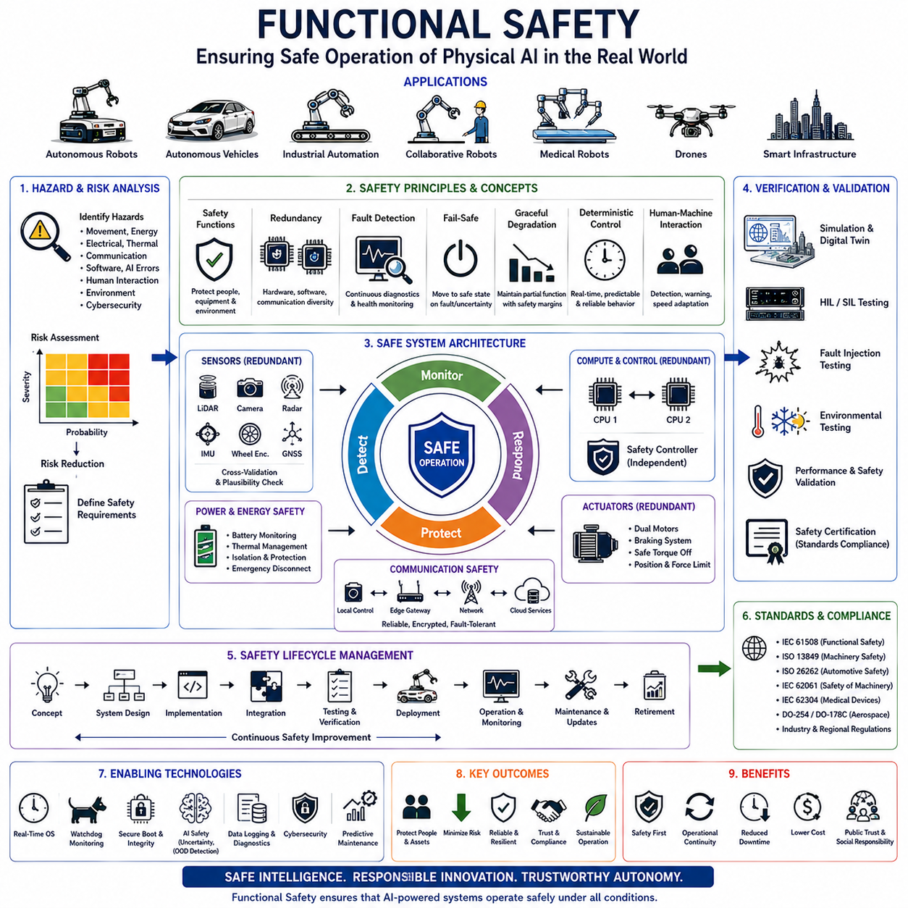
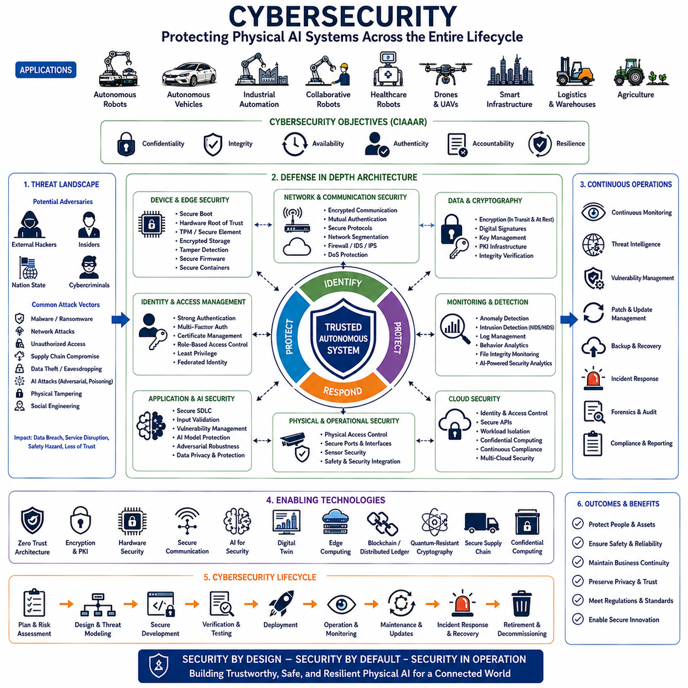
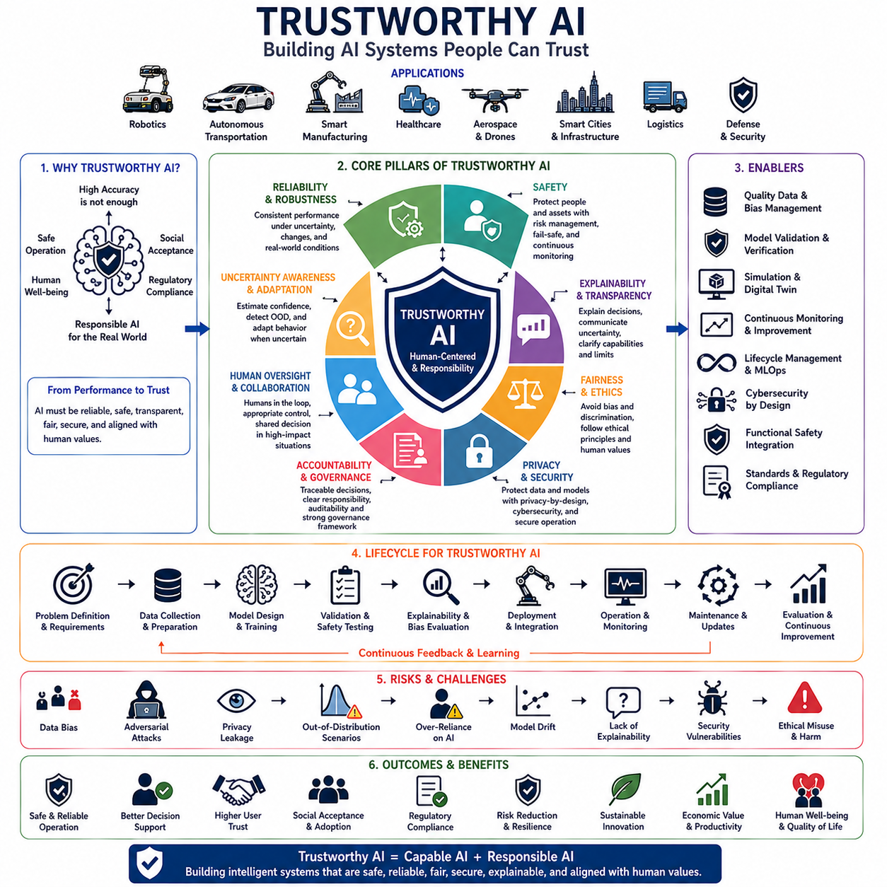
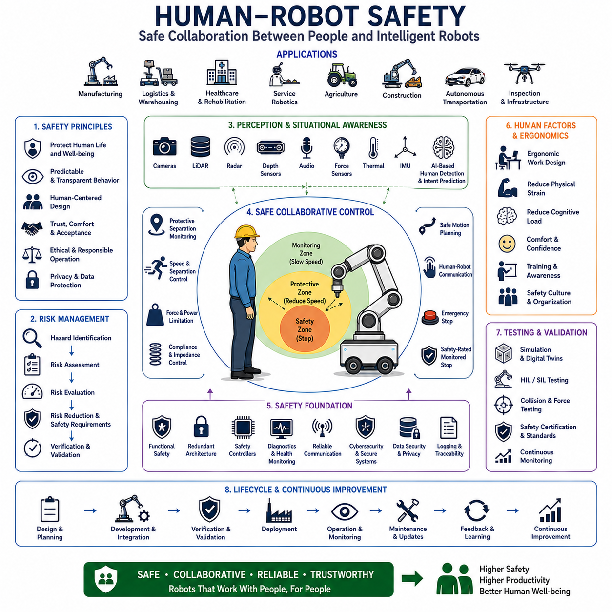
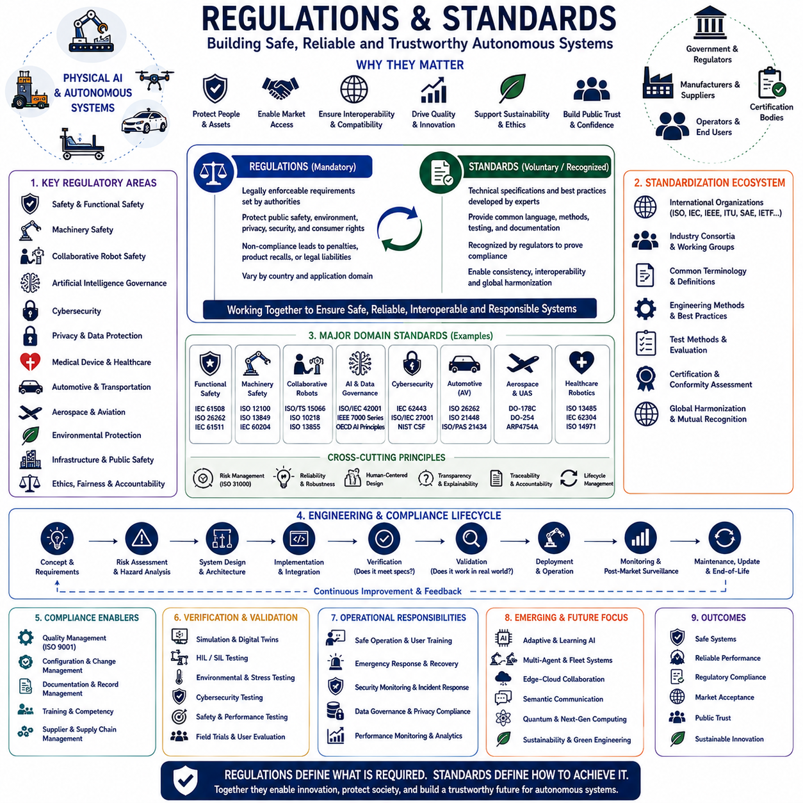
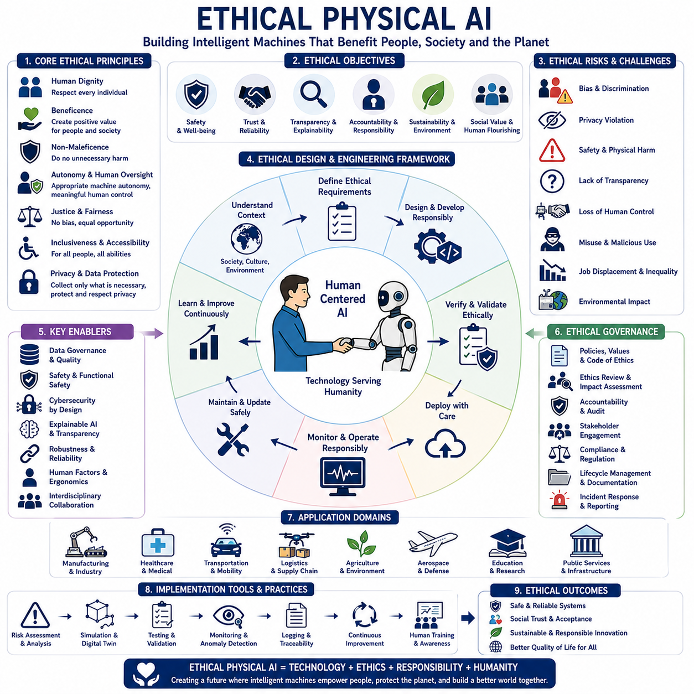
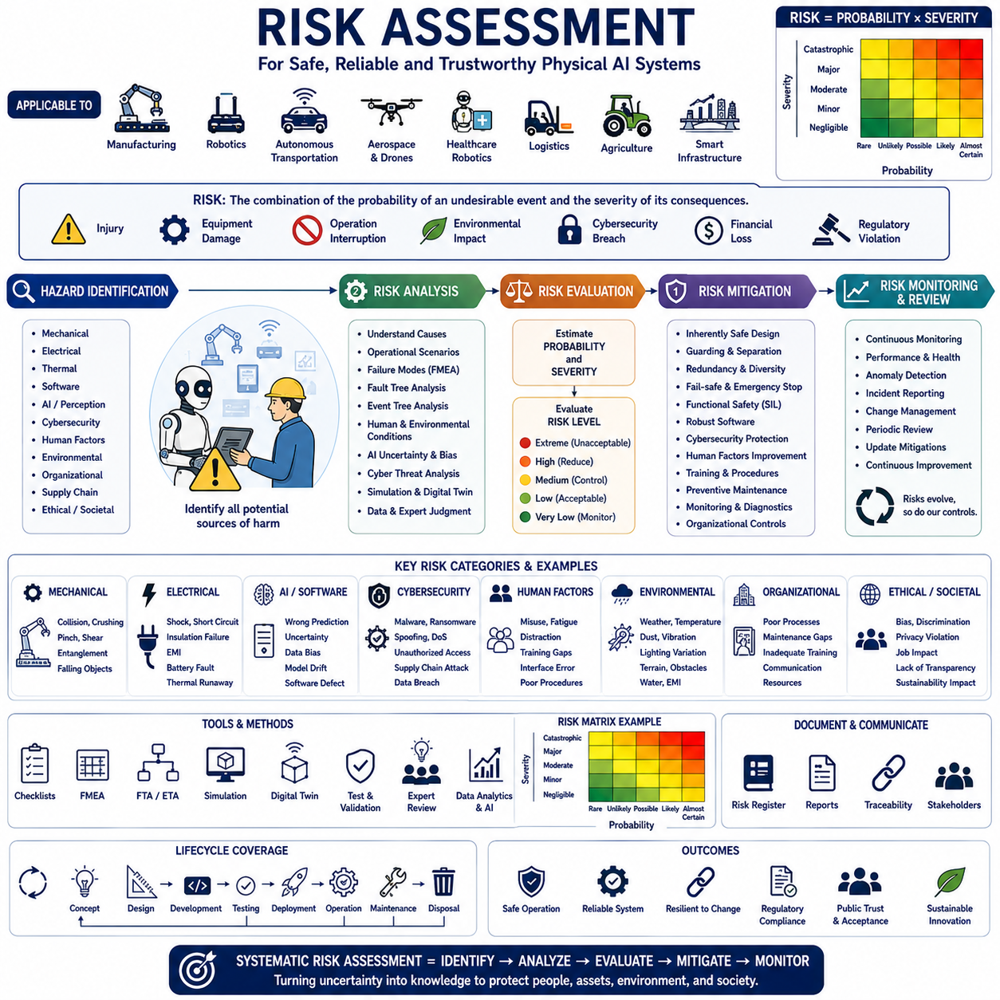
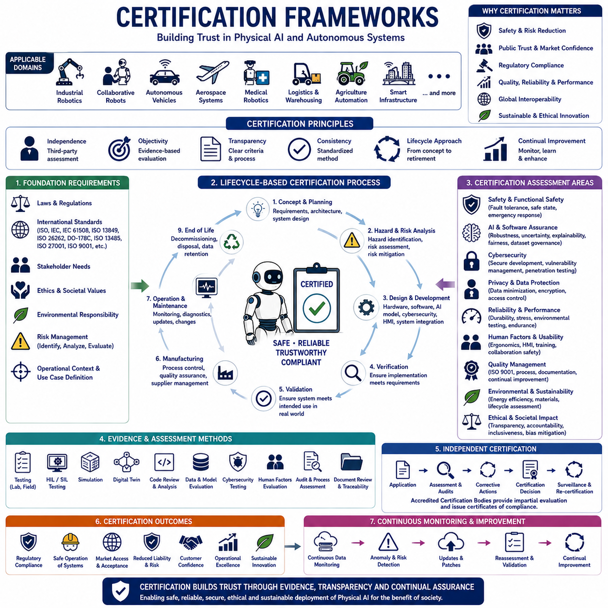

**Physical AI Engineering**

# Chapter 14 Safety, Security and Ethics 

## 14-01 Functional Safety

{width="7.268055555555556in" height="7.268055555555556in"}

기능 안전(Functional Safety)은 현대 물리 AI(Physical AI), 자율 로봇(Autonomous Robotics), 지능형 교통(Intelligent Transportation), 산업 자동화(Industrial Automation), 의료 로봇(Medical Robotics), 항공우주 시스템(Aerospace Systems), 협동 제조(Collaborative Manufacturing), 물류 자동화(Logistics Automation), 농업 로봇(Agricultural Robotics), 스마트 인프라(Intelligent Infrastructure)를 구현하기 위한 가장 중요한 공학 분야 가운데 하나이다. 인공지능이 단순한 디지털 소프트웨어를 넘어 실제 물리 세계를 직접 제어하기 시작하면서, 자율 시스템은 사람의 생명과 안전, 고가의 산업 설비, 교통 시스템, 국가 기반 시설(Critical Infrastructure)에 직접적인 영향을 미치게 되었다. 이러한 환경에서는 단순히 높은 성능의 AI만으로는 충분하지 않다. 하드웨어 고장(Hardware Failure), 소프트웨어 오류(Software Defect), 센서 이상(Sensor Degradation), 통신 장애(Communication Failure), 환경 변화(Environmental Disturbance), 예기치 못한 운용 상황이 발생하더라도 시스템이 항상 안전한 상태를 유지하도록 설계되어야 한다. 기능 안전은 바로 이러한 목표를 달성하기 위한 체계적인 공학 방법론(Systematic Engineering Methodology)이다.

기능 안전은 일반적인 신뢰성 공학(Reliability Engineering)과는 근본적으로 다른 개념이다. 신뢰성은 가능한 한 고장을 줄이는 것을 목표로 하지만, 기능 안전은 모든 고장을 완전히 제거하는 것이 현실적으로 불가능하다는 사실을 전제로 한다. 전자 부품은 시간이 지나면서 열화되고(Aging), 소프트웨어는 지속적으로 변경되며, 센서는 오차가 증가하고, 통신은 언제든지 끊길 수 있으며, 환경도 끊임없이 변화한다. 따라서 기능 안전은 고장이 발생하지 않는 시스템이 아니라, **고장이 발생하더라도 위험한 상황(Hazardous Situation)으로 이어지지 않는 시스템** 을 설계하는 데 목적이 있다. 다시 말해 정상 상태에서의 높은 성능보다, 비정상 상태에서도 예측 가능한 안전한 동작을 유지하는 것이 기능 안전의 핵심 철학이다.

자율 시스템의 발전은 기능 안전의 중요성을 더욱 높이고 있다. 자율이동로봇(AMR)은 사람과 같은 공간에서 이동하고, 협동 로봇(Collaborative Robot)은 작업자와 함께 생산 작업을 수행하며, 자율주행 차량(Autonomous Vehicle)은 복잡한 도로 환경에서 실시간으로 판단을 내리고, 의료 로봇은 수술과 치료를 지원한다. 농업 로봇은 사람과 함께 야외 환경에서 작업하며, 드론은 배송과 시설 점검, 재난 대응 임무를 수행한다. 이러한 모든 시스템은 사람과 직접 상호작용하기 때문에 기능 안전은 선택 사항이 아니라 필수적인 설계 요구사항이다.

기능 안전의 첫 번째 단계는 위험 분석(Hazard Analysis)이다. 모든 자율 시스템은 이동, 전기 에너지, 열 발생, 통신 오류, AI 판단 오류, 기계 고장, 환경 변화, 사이버 공격, 사람과의 상호작용 등 다양한 위험 요소를 가지고 있다. 위험 분석은 이러한 위험 상황을 체계적으로 식별하고, 발생 가능성(Probability), 심각도(Severity), 노출 빈도(Exposure Frequency), 제어 가능성(Controllability)을 분석하여 허용 가능한 위험 수준(Acceptable Risk Level)을 결정한다. 정상적인 운용뿐만 아니라 센서 고장, 배터리 이상, 통신 단절, 위치 추정 오류, 전원 장애, 사용자 오조작(Misuse)과 같은 비정상 상황까지 모두 고려해야 한다.

위험 평가(Risk Assessment)는 식별된 위험을 정량적으로 분석하여 실제 설계 요구사항으로 변환하는 과정이다. 심각한 위험일수록 더 강력한 보호 기능이 요구된다. 이러한 보호 기능에는 하드웨어 이중화(Hardware Redundancy), 소프트웨어 감시(Software Monitoring), 비상 정지(Emergency Stop), 자가 진단(Self-Diagnostics), 고장 감지(Fault Detection), 독립적인 안전 제어기(Safety Controller) 등이 포함된다. 위험 기반 설계(Risk-Driven Design)는 가장 위험한 상황에 개발 자원을 집중하도록 하여 효율적인 안전 설계를 가능하게 한다.

안전 기능(Safety Function)은 위험을 방지하기 위해 설계된 특정 기능을 의미한다. 일반적인 운용 기능이 작업 수행을 목표로 하는 반면, 안전 기능은 사람과 설비를 보호하는 것을 최우선으로 한다. 비상 제동(Emergency Braking), 충돌 회피(Collision Avoidance), 장애물 감지(Obstacle Detection), 비상 정지(Emergency Stop), 중복 위치 추정(Redundant Localization), 모터 토크 차단(Safe Torque Off), 속도 제한(Speed Limitation), 배터리 차단(Battery Isolation), 보호 영역 감시(Protective Field Monitoring), 사람 감지(Human Presence Detection) 등이 대표적인 안전 기능이다. 이러한 기능은 평상시에는 거의 동작하지 않지만, 이상 상황에서는 시스템 전체의 안전을 보장하는 핵심 역할을 수행한다.

이중화(Redundancy)는 기능 안전에서 가장 널리 사용되는 설계 원칙이다. 중요한 구성 요소는 두 개 이상을 사용하거나 서로 다른 방식으로 동일한 기능을 수행하도록 설계한다. 예를 들어 두 개의 프로세서가 동일한 계산을 수행하여 결과를 비교하고, LiDAR, 카메라, IMU, 휠 엔코더(Wheel Encoder), GNSS를 동시에 이용하여 위치를 추정하며, 두 개의 독립적인 통신 경로를 사용하거나 이중 브레이크 시스템을 적용하여 하나의 장치가 고장 나더라도 안전한 동작을 유지한다. 서로 다른 제조사의 부품이나 다른 원리를 사용하는 다양성 이중화(Diversity Redundancy)는 공통 원인 고장(Common Cause Failure)을 줄이는 데 효과적이다.

고장 감지(Fault Detection)는 시스템이 운용되는 동안 지속적으로 장비의 상태를 확인하는 기능이다. 프로세서 상태, 메모리 오류, 통신 품질, 센서 데이터, 액추에이터 응답, 배터리 상태, 온도, 소프트웨어 실행 상태를 지속적으로 감시하여 이상을 조기에 발견한다. 문제가 감지되면 성능 저하 운용(Degraded Operation), 안전 정지(Safe Shutdown), 유지보수 예약(Predictive Maintenance), 긴급 대응(Emergency Intervention)을 자동으로 수행한다.

페일세이프(Fail-Safe)는 기능 안전의 가장 기본적인 개념이다. 시스템이 정상적으로 동작할 수 없다고 판단되면 미리 정의된 안전 상태(Safe State)로 자동 전환한다. 자율 로봇은 속도를 줄인 후 정지하고, 산업용 로봇은 모터 토크를 제거하면서도 구조적으로 안정된 자세를 유지하며, 자율주행 차량은 안전하게 감속한 후 비상등을 점등한다. 드론은 긴급 착륙(Emergency Landing)을 수행하고, 의료기기는 자동 기능을 중단하여 환자의 안전을 보장한다. 페일세이프는 임무 수행보다 안전을 우선하는 설계 철학이다.

점진적 성능 저하(Graceful Degradation)는 페일세이프를 더욱 발전시킨 개념이다. 모든 오류에서 즉시 시스템을 정지시키는 것이 아니라 남아 있는 기능을 최대한 활용하여 제한된 기능으로 계속 운용한다. 예를 들어 위치 추정 정확도가 떨어지면 최대 속도를 자동으로 낮추고, 일부 센서가 고장 나면 제한된 영역에서만 운행하며, 배터리 성능이 저하되면 운행 시간을 줄이고 충전소로 복귀한다. 통신이 끊기면 클라우드 기능은 중단되지만 로컬 자율성(Local Autonomy)은 유지한다.

결정론적 동작(Deterministic Behavior)은 기능 안전의 핵심 요구사항이다. AI 추론은 입력 데이터에 따라 계산 시간이 달라질 수 있지만, 안전 기능은 항상 일정한 시간 안에 동작해야 한다. 따라서 안전 제어는 AI와 독립된 실시간 제어 루프(Real-Time Control Loop)에서 실행되며, AI가 아무리 많은 계산을 수행하더라도 안전 기능은 영향을 받지 않는다.

실시간 운영체제(Real-Time Operating System, RTOS)는 이러한 결정론적 실행을 보장한다. 우선순위 기반 스케줄링(Priority Scheduling), 인터럽트 관리(Interrupt Management), 메모리 보호(Memory Protection), 프로세서 분리(Processor Isolation), 시간 분할(Temporal Partitioning), Watchdog 등을 이용하여 안전 기능이 항상 필요한 계산 자원을 확보할 수 있도록 한다.

워치독(Watchdog)은 소프트웨어의 정상 동작을 지속적으로 확인하는 감시 장치이다. 프로그램이 멈추거나 무한 루프(Infinite Loop)에 빠지거나 메모리가 손상되면 Watchdog이 이를 감지하여 시스템을 재시작하거나 안전 상태로 전환한다. 간단하지만 매우 효과적인 안전 메커니즘이다.

센서 검증(Sensor Validation)은 자율 시스템에서 매우 중요하다. 카메라는 조명 변화와 렌즈 오염의 영향을 받고, LiDAR는 비, 안개, 먼지의 영향을 받으며, 레이더는 간섭을 받을 수 있고, IMU는 시간이 지남에 따라 드리프트(Drift)가 발생한다. 기능 안전은 센서 간 교차 검증(Cross Validation), 중복 센서, 타당성 검사(Plausibility Check), 환경 인식(Environmental Awareness), 신뢰도 추정(Confidence Estimation)을 통해 센서 이상을 조기에 감지한다.

인공지능은 기능 안전에 새로운 도전을 제시한다. 신경망은 결정론적 알고리즘이 아니라 통계적 추론(Statistical Inference)을 수행하기 때문에 환경 변화나 학습 데이터 부족으로 인해 예측 정확도가 달라질 수 있다. 따라서 최근에는 신뢰도 추정(Uncertainty Estimation), 이상 입력 탐지(Out-of-Distribution Detection), 설명 가능한 AI(Explainable AI), 런타임 AI 모니터링(Runtime AI Monitoring), 전통적인 규칙 기반 알고리즘과 AI를 함께 사용하는 하이브리드 구조(Hybrid Architecture)가 기능 안전에 적극 활용되고 있다.

사람과 기계의 상호작용(Human-Machine Interaction)은 기능 안전에서 매우 중요한 요소이다. 협동 로봇, 물류 로봇, 병원 서비스 로봇은 사람과 같은 공간에서 움직인다. 사람 감지(Human Detection), 속도 자동 조절(Speed Adaptation), 보호 거리 감시(Protective Separation Monitoring), 접촉 힘 제한(Contact Force Limitation), 제스처 인식(Gesture Recognition), 경고등과 경고음(Warning Signal), 사용자 인증(Operator Authentication)은 안전한 협업을 위한 핵심 기능이다.

통신 안전(Communication Safety)도 매우 중요하다. 클라우드와 엣지를 사용하는 시스템에서는 네트워크 지연, 패킷 손실(Packet Loss), 대역폭 제한(Bandwidth Limitation), 통신 장애가 언제든지 발생할 수 있다. 기능 안전은 항상 통신 장애를 가정하며, 통신이 끊겨도 로봇이 독립적으로 안전하게 동작하도록 설계한다. 클라우드는 최적화와 데이터 분석을 담당하지만, 실시간 안전 제어는 반드시 로컬에서 수행된다.

전원 안전(Power System Safety)은 배터리, 충전 시스템, 전력 분배, 열 관리(Thermal Management), 절연(Isolation), 접지(Grounding), 긴급 차단(Emergency Disconnect)을 포함한다. 특히 리튬 배터리는 전압, 전류, 온도, 내부 저항, 충전 상태, 열 폭주(Thermal Runaway)를 지속적으로 감시하여 화재와 폭발을 예방해야 한다.

기계적 안전(Mechanical Safety)은 로봇의 물리적인 구조와 직접 관련된다. 구조 강도(Structural Integrity), 액추에이터 신뢰성, 제동 성능(Braking Performance), 조향 시스템(Steering System), 서스펜션(Suspension), 적재물 안정성(Payload Stability), 충돌 에너지 흡수(Collision Energy Absorption), 보호 커버(Protective Guard)는 사람과 설비를 보호하는 중요한 요소이다.

사이버 보안(Cybersecurity)은 기능 안전과 점점 더 밀접하게 연결되고 있다. 악성 코드(Malware), 센서 위조(Sensor Spoofing), 통신 도청(Communication Interception), 서비스 거부 공격(DoS), AI 공격(Adversarial AI)은 물리적 안전에도 영향을 줄 수 있다. 따라서 Secure Boot, 암호화 통신, Hardware Root of Trust, Runtime Integrity Monitoring, Zero Trust Networking, 침입 탐지(Intrusion Detection)와 같은 보안 기술이 기능 안전 시스템과 함께 통합된다.

검증 및 확인(Verification and Validation)은 기능 안전의 필수 과정이다. 모든 안전 요구사항은 시뮬레이션, 디지털 트윈, HIL(Hardware-in-the-Loop), SIL(Software-in-the-Loop), 고장 주입(Fault Injection), 환경 시험(Environmental Stress Test), 센서 오류, 통신 장애, 전원 장애 등 다양한 상황에서 반복적으로 시험되어야 한다.

시뮬레이션(Simulation)은 실제로 시험하기 어려운 위험 상황을 안전하게 재현할 수 있다. 자율주행 차량은 보행자 충돌, 악천후, 도로 붕괴를 가상 환경에서 시험하고, 산업용 로봇은 액추에이터 고장, 비상 정지, 사람의 갑작스러운 접근 등을 시뮬레이션으로 검증할 수 있다.

안전 생명주기 관리(Safety Lifecycle Management)는 기능 안전을 제품 개발 전 과정에 적용한다. 개념 설계(Concept Design), 시스템 설계(System Design), 구현(Implementation), 통합(Integration), 시험(Test), 배포(Deployment), 운영(Operation), 유지보수(Maintenance), 소프트웨어 업데이트(Update), 장비 폐기(Decommissioning)에 이르기까지 모든 단계에서 안전성을 지속적으로 검토한다. 시스템이 변경될 때마다 안전성도 다시 평가하여 기존의 안전 수준이 유지되도록 한다.

국제 안전 표준(International Safety Standards)은 기능 안전 구현을 위한 공통 기준을 제공한다. 자동차, 산업 자동화, 의료기기, 철도, 항공우주, 산업 기계, 협동 로봇은 각각의 안전 표준을 기반으로 개발되며, 이를 준수함으로써 규제 승인(Regulatory Approval), 품질 향상(Quality Improvement), 상호운용성(Interoperability), 사회적 신뢰(Public Trust)를 확보할 수 있다.

앞으로 AI는 기능 안전도 변화시킬 것이다. 미래의 안전 시스템은 위험을 사전에 예측하고(Predictive Safety), 환경 변화에 따라 자동으로 운용 조건을 조정하며, 하드웨어 열화를 미리 예측하고, AI의 신뢰도를 실시간으로 평가하며, 여러 자율 시스템이 협력하여 전체 시스템의 안전을 유지하는 방향으로 발전할 것이다. 파운데이션 모델, 월드 모델, 디지털 트윈, 의미 기반 추론(Semantic Reasoning), 예지 정비(Predictive Maintenance)는 기존의 사후 대응형 안전에서 사전 예방형(Proactive Safety) 안전으로 발전하는 기반이 될 것이다.

미래에는 기능 안전도 개별 로봇이 아니라 스마트 시티, 지능형 교통, 자동화 공장, 병원, 물류 시스템, 농업, 항공우주, 국가 기반 시설 전체를 대상으로 하는 **분산 기능 안전(Distributed Functional Safety)** 으로 발전할 것이다. 클라우드, 엣지, 디지털 트윈, AI, 통신망, 사람, 자율 시스템이 함께 협력하여 전체 생태계의 안전을 유지하는 구조가 될 것이다.

궁극적으로 **기능 안전(Functional Safety)은 신뢰할 수 있는 물리 AI(Trustworthy Physical AI)를 구축하기 위한 가장 중요한 윤리적·공학적 기반(Ethical and Engineering Foundation)** 이다. 인공지능은 인식, 추론, 계획, 의사결정을 가능하게 하지만, 기능 안전은 이러한 지능이 **정상 상황뿐 아니라 모든 예외 상황에서도 사람을 보호하도록 보장하는 핵심 기술** 이다. 위험 분석(Hazard Analysis), 위험 평가(Risk Assessment), 이중화(Redundancy), 진단(Diagnostics), 페일세이프(Fail-Safe), 점진적 성능 저하(Graceful Degradation), 결정론적 제어(Deterministic Control), 사이버 보안 통합(Cybersecurity Integration), 철저한 검증(Verification), 생명주기 관리(Lifecycle Management), 지속적인 모니터링(Continuous Monitoring)을 통해 기능 안전은 단순한 AI를 **신뢰할 수 있고(Trustworthy), 책임감 있게(Responsible), 안전하게(Safe) 현실 세계에서 동작하는 자율 시스템** 으로 발전시키는 핵심 기술이 된다. 앞으로 **로보틱스(Robotics), 자율주행(Autonomous Transportation), 의료(Healthcare), 스마트 제조(Smart Manufacturing), 항공우주(Aerospace), 농업(Agriculture), 물류(Logistics), 스마트 인프라(Smart Infrastructure)** 가 확대될수록 기능 안전은 **인공지능의 발전이 항상 사람의 안전(Human Safety), 사회적 신뢰(Public Trust), 그리고 사회적 책임(Societal Responsibility)** 과 함께 이루어지도록 하는 가장 중요한 공학 분야로 자리매김하게 될 것이다.

## 14-02 Cybersecurity

{width="7.268055555555556in" height="7.268055555555556in"}

사이버보안(Cybersecurity)은 현대의 물리 AI(Physical AI), 자율 로봇(Autonomous Robotics), 스마트 제조(Intelligent Manufacturing), 자율주행 시스템(Autonomous Transportation), 산업 자동화(Industrial Automation), 의료 시스템(Healthcare Systems), 항공우주 플랫폼(Aerospace Platform), 스마트 인프라(Intelligent Infrastructure), 물류 네트워크(Logistics Network), 분산 인공지능(Distributed Artificial Intelligence)을 지탱하는 가장 중요한 공학 분야 가운데 하나이다. 로봇과 자율 시스템이 클라우드 서비스(Cloud Service), 엣지 컴퓨팅(Edge Computing), 기업 정보 시스템(Enterprise Information System), 디지털 트윈(Digital Twin), 무선 통신망(Wireless Communication Network), 다중 에이전트 협업 시스템(Multi-Agent Ecosystem)과 지속적으로 연결되면서, 단순한 정보 유출을 넘어 실제 물리적인 동작을 공격하는 새로운 형태의 사이버 위협이 등장하고 있다. 기존 정보기술(IT)에서는 데이터 기밀성(Confidentiality)이나 업무 연속성(Business Continuity)이 주요 관심사였지만, 물리 AI에서는 사이버 공격이 로봇의 움직임, 사람의 안전, 생산설비, 교통 시스템, 의료 서비스, 국가 기반 시설(Critical Infrastructure)에 직접적인 영향을 줄 수 있다. 따라서 사이버보안은 단순한 IT 기술이 아니라 시스템 아키텍처(System Architecture), 기능 안전(Functional Safety), 신뢰성(Reliability), 그리고 제품 생명주기(Lifecycle Engineering)를 구성하는 필수 요소가 되었다.

인공지능(AI), 로보틱스(Robotics), 클라우드 컴퓨팅(Cloud Computing), 엣지 컴퓨팅(Edge Computing), 무선 통신(Wireless Communication), 산업 제어 시스템(Industrial Control System), 자율 의사결정(Autonomous Decision Making)의 융합은 사이버보안 환경을 근본적으로 변화시켰다. 과거의 산업 시스템은 외부 네트워크와 분리된 폐쇄망(Closed Network)에서 운영되었기 때문에 물리적 격리(Physical Isolation)가 주요 보안 수단이었다. 그러나 현대의 자율 시스템은 원격 모니터링(Remote Monitoring), 플릿 관리(Fleet Management), 클라우드 AI, 예지 정비(Predictive Maintenance), 소프트웨어 업데이트(Software Update), 디지털 트윈, 기업 시스템 연동을 위해 항상 네트워크에 연결되어 있어야 한다. 이러한 연결성은 시스템의 성능을 크게 향상시키지만 동시에 공격 표면(Attack Surface)을 확대한다. 모든 통신 인터페이스, 소프트웨어 서비스, 센서, 액추에이터(Actuator), 클라우드 플랫폼, 임베디드 컨트롤러, API(Application Programming Interface), 무선 네트워크, AI 모델은 잠재적인 공격 대상이 될 수 있다.

자율 시스템에서의 사이버보안은 단순히 외부 침입을 막는 것이 아니라, 기밀성(Confidentiality), 무결성(Integrity), 가용성(Availability), 진위성(Authenticity), 책임성(Accountability), 복원력(Resilience)을 보장하는 것을 목표로 한다. 기밀성은 허가되지 않은 사람이 데이터를 열람하지 못하도록 보호하는 것이고, 무결성은 AI 모델, 센서 데이터, 제어 명령, 설정 정보가 허가 없이 변경되지 않도록 보장하는 것이다. 가용성은 공격이나 장애가 발생하더라도 시스템이 계속 동작하도록 하는 것이며, 진위성은 통신 상대방이 실제로 신뢰할 수 있는 대상임을 확인하는 과정이다. 책임성은 모든 보안 관련 활동을 기록하여 사고 조사와 규제 대응이 가능하도록 하고, 복원력은 보안 사고 이후에도 시스템이 빠르게 정상 상태로 복구될 수 있도록 하는 능력을 의미한다.

사이버보안은 위협 모델링(Threat Modeling)에서 시작된다. 자율 시스템에는 AI 모델, 위치 정보(Localization Information), 운영 데이터(Operation Data), 디지털 지도(Digital Map), 독점 알고리즘(Proprietary Algorithm), 소스 코드(Source Code), 인증 정보(Credential), 암호화 키(Encryption Key), 산업 설비, 물리적 액추에이터 등 다양한 자산이 존재한다. 위협 모델링은 공격자의 목적, 공격 방법, 취약점(Vulnerability), 공격 결과, 방어 방법을 체계적으로 분석한다. 외부 해커뿐 아니라 내부자 위협(Insider Threat), 공급망 공격(Supply Chain Attack), 악성코드(Malware), 랜섬웨어(Ransomware), 통신 도청(Communication Interception), 펌웨어 변조(Firmware Manipulation), 사회공학(Social Engineering)까지 모두 고려해야 한다.

공격 표면 분석(Attack Surface Analysis)은 시스템이 외부 공격에 노출될 수 있는 모든 요소를 분석하는 과정이다. 네트워크 인터페이스(Network Interface), Wi-Fi, Bluetooth, USB 포트, 유지보수 포트(Maintenance Port), 센서 통신 버스(Communication Bus), API, 운영체제 서비스, 클라우드 API, ROS와 같은 로봇 미들웨어(Robot Middleware), 산업용 통신 프로토콜 등은 모두 공격 표면이 된다. 사이버보안은 이러한 인터페이스를 최소화하고, 필요한 인터페이스는 지속적으로 감시하여 보안을 유지한다.

인증(Authentication)은 신뢰할 수 있는 통신의 출발점이다. 자율 로봇, 산업용 컨트롤러, 클라우드 서버, 엣지 게이트웨이(Edge Gateway), 디지털 트윈, 운영자(Operator), 유지보수 엔지니어(Maintenance Engineer)는 데이터를 교환하기 전에 반드시 서로의 신원을 확인해야 한다. 이를 위해 디지털 인증서(Digital Certificate), 공개키 기반 구조(PKI), 다중 인증(Multi-Factor Authentication), TPM(Trusted Platform Module), HSM(Hardware Security Module), 보안 토큰(Security Token), 상호 인증(Mutual Authentication)을 사용한다. 이를 통해 공격자가 정상 시스템으로 가장하여 접근하는 것을 방지할 수 있다.

권한 관리(Authorization)는 인증 이후 사용자가 수행할 수 있는 작업을 제한한다. 모든 사용자가 모든 권한을 가지는 것은 위험하다. 운영자는 시스템 상태를 확인할 수 있지만 AI 모델을 변경할 수 없어야 하며, 유지보수 담당자는 펌웨어(Firmware)를 업데이트할 수 있지만 운용 정책을 변경해서는 안 된다. AI 서비스는 센서 데이터를 사용할 수 있지만 안전 제어기를 직접 제어해서는 안 된다. 최소 권한 원칙(Least Privilege Principle)은 계정이 탈취되더라도 피해를 최소화하는 중요한 보안 원칙이다.

암호 기술(Cryptography)은 데이터 저장과 통신 과정에서 정보를 보호한다. 자율 시스템은 위치 정보, 센서 데이터, 임무 계획(Mission Plan), AI 모델, 소프트웨어 업데이트, 디지털 트윈 정보를 지속적으로 교환한다. 암호화(Encryption)는 데이터 내용을 보호하고, 디지털 서명(Digital Signature)은 데이터가 변조되지 않았음을 확인한다. 공개키 암호(Public Key Cryptography), 대칭키 암호(Symmetric Encryption), 키 교환(Key Exchange), 인증서 관리(Certificate Management), 안전한 난수 생성(Random Number Generation)은 신뢰성 있는 통신 환경을 구축하는 핵심 기술이다.

안전한 통신(Secure Communication)은 매우 중요하다. 자율 시스템은 Ethernet, TSN(Time Sensitive Networking), Wi-Fi, 5G, 위성 통신(Satellite Communication), 산업용 필드버스(Fieldbus), Bluetooth 등을 함께 사용한다. 통신 보안은 암호화, 상호 인증, 재전송 공격 방지(Replay Protection), 메시지 무결성(Message Integrity), 네트워크 분리(Network Segmentation), 대역폭 감시(Bandwidth Monitoring), 서비스 거부 공격(DoS) 방어 등을 포함한다. 또한 안전 관련 통신과 일반 데이터를 분리하여 네트워크 혼잡이나 공격이 안전 기능에 영향을 주지 않도록 한다.

보안 부팅(Secure Boot)은 하드웨어 보안의 핵심이다. 시스템이 시작될 때 부트로더(Bootloader), 운영체제(Operating System), 미들웨어(Middleware), 애플리케이션(Application), AI 모델을 순차적으로 암호학적으로 검증한다. 인증되지 않은 코드가 발견되면 시스템은 실행을 중단하거나 복구 절차를 수행한다. 이를 통해 악성 펌웨어나 변조된 운영체제가 실행되는 것을 방지할 수 있다.

하드웨어 신뢰 기반(Hardware Root of Trust)은 변조가 어려운 보안 하드웨어를 이용하여 시스템의 신뢰를 보장한다. TPM, HSM, Secure Element, 보안 실행 환경(Secure Enclave), PUF(Physically Unclonable Function)는 암호화 키와 인증 정보를 안전하게 보호하며, 운영체제가 침해되더라도 핵심 비밀 정보는 노출되지 않는다.

펌웨어 보안(Firmware Security)은 임베디드 시스템에서 매우 중요하다. 센서, 모터 드라이버(Motor Driver), 배터리 관리 시스템(BMS), 통신 모듈, 카메라, LiDAR, 레이더는 모두 펌웨어에 의해 제어된다. 펌웨어는 교체가 어렵기 때문에 장기간 사용되는 경우가 많으며, 안전한 업데이트(Authenticated Update), 디지털 서명 검증, 롤백 방지(Rollback Protection), 취약점 관리(Vulnerability Management)가 반드시 필요하다.

운영체제 보안(Operating System Security)은 AI 플랫폼의 기본 보안 계층이다. Linux, RTOS, Windows 기반 산업용 플랫폼은 불필요한 서비스를 제거하고, 컨테이너(Container), 가상화(Virtualization), 메모리 보호(Memory Protection), 접근 제어(Access Control), 무결성 검사(Integrity Monitoring), 보안 로그(Security Logging), 보안 패치를 통해 공격 가능성을 최소화한다.

애플리케이션 보안(Application Security)은 AI 추론 엔진(Inference Engine), 인식 시스템, 자율주행, ROS, 플릿 관리, 웹 인터페이스(Web Interface), 클라우드 서비스를 보호하는 기술이다. 입력값 검증(Input Validation), 안전한 프로그래밍(Secure Coding), 메모리 안전성(Memory Safety), 의존성 관리(Dependency Management), 정적 분석(Static Analysis), 동적 분석(Dynamic Analysis), 코드 리뷰(Code Review), 침투 시험(Penetration Testing)은 소프트웨어 취약점을 줄이는 핵심 기법이다.

인공지능은 새로운 보안 문제를 가져왔다. 적대적 공격(Adversarial Attack), 모델 추출(Model Extraction), 데이터 오염(Data Poisoning), 모델 역추론(Model Inversion), 개인정보 유출(Privacy Leakage), 프롬프트 인젝션(Prompt Injection)은 AI 모델을 직접 공격하는 새로운 위협이다. 작은 노이즈만 추가해도 AI가 완전히 잘못된 판단을 할 수 있으며, 공격자는 반복적인 질의를 통해 기업의 AI 모델을 복제할 수도 있다. 따라서 적대적 AI 방어(Adversarial Robustness), 신뢰도 추정(Uncertainty Estimation), 데이터 보호, 모델 인증(Model Authentication)이 중요해지고 있다.

센서 보안(Sensor Cybersecurity)도 매우 중요하다. 카메라는 허위 영상(Visual Spoofing), LiDAR는 레이저 간섭(Optical Interference), 레이더는 전파 방해(Jamming), GNSS는 GPS 스푸핑(GNSS Spoofing), IMU는 전자기 간섭(Electromagnetic Interference)의 영향을 받을 수 있다. 따라서 여러 센서를 융합(Sensor Fusion)하고 물리적으로 일관성이 있는지 확인하는 타당성 검사(Plausibility Check)를 수행하여 공격을 탐지한다.

런타임 모니터링(Runtime Monitoring)은 운영 중인 시스템을 지속적으로 감시한다. CPU 사용률, 메모리 사용량, 비정상적인 통신 패턴, AI 추론 결과, 인증 실패, 권한 상승(Privilege Escalation), 예상하지 못한 액추에이터 명령 등을 분석하여 사이버 공격을 조기에 발견한다. 이상 탐지(Anomaly Detection), 무결성 검사(Integrity Verification), 침입 탐지 시스템(IDS)이 함께 사용된다.

침입 탐지 시스템(Intrusion Detection System)은 네트워크 기반(NIDS)과 호스트 기반(HIDS)으로 구분된다. NIDS는 네트워크 트래픽을 분석하고, HIDS는 프로세스, 메모리, 파일 시스템, 시스템 호출(System Call)을 감시한다. 산업용 IDS는 ROS 메시지, 산업용 프로토콜, 실시간 제어 특성을 이해하고 있으므로 일반 IT 보안 시스템보다 더 정확한 탐지가 가능하다.

제로 트러스트(Zero Trust)는 현대 사이버보안의 핵심 철학이다. 내부 네트워크도 신뢰하지 않으며, 모든 사용자, 장치, 소프트웨어, 통신 요청에 대해 지속적으로 인증(Authentication), 권한 확인(Authorization), 암호화(Encryption), 정책 검증(Policy Verification)을 수행한다. 이를 통해 하나의 장비가 침해되더라도 전체 시스템으로 공격이 확산되는 것을 막을 수 있다.

네트워크 분리(Network Segmentation)는 안전 제어기, 산업 자동화, 기업 시스템, AI 서버, 유지보수 시스템, 인터넷을 서로 분리하여 관리한다. 방화벽(Firewall), 보안 게이트웨이(Security Gateway), VLAN, 접근 제어 목록(ACL), 프록시(Proxy)를 이용하여 필요한 정보만 교환하도록 구성한다.

클라우드 보안(Cloud Cybersecurity)은 AI 시대에 더욱 중요해지고 있다. 클라우드는 신원 관리(Identity Management), 암호화 저장소(Encrypted Storage), 기밀 컴퓨팅(Confidential Computing), API 보안, 네트워크 보호, 하드웨어 검증(Hardware Attestation), 규정 준수(Compliance), 취약점 관리(Vulnerability Management)를 수행한다. 멀티 클라우드(Multi-Cloud)는 장애 복구와 서비스 연속성을 향상시키는 방법으로 활용된다.

엣지 보안(Edge Cybersecurity)은 현장에서 직접 운영되는 장비를 보호한다. 엣지 컴퓨터는 물리적인 접근, 도난, 환경 변화, 통신 장애에 노출된다. 따라서 암호화 저장, Secure Boot, 하드웨어 인증(Hardware Identity), 변조 감지(Tamper Detection), 안전한 컨테이너, 런타임 모니터링, 인증된 OTA(Over-the-Air) 업데이트를 통해 보안을 유지한다.

소프트웨어 업데이트 보안(Software Update Security)은 긴 제품 수명 동안 매우 중요하다. AI 모델 개선, 보안 패치, 기능 추가를 위해 지속적인 업데이트가 필요하며, 모든 업데이트는 디지털 서명 검증, 암호화된 전송, 호환성 검사, 롤백 기능을 포함해야 한다.

공급망 보안(Supply Chain Cybersecurity)은 최근 매우 중요한 이슈가 되었다. 하나의 자율 시스템은 다양한 국가와 기업의 CPU, GPU, 센서, 운영체제, AI 프레임워크를 사용한다. 따라서 SBOM(Software Bill of Materials), 코드 서명(Code Signing), 공급업체 검증(Supplier Assessment), 부품 이력 관리(Component Provenance), 취약점 추적(Vulnerability Tracking)이 필요하다.

사고 대응(Incident Response)은 보안 사고가 발생했을 때 빠르게 대응하기 위한 절차이다. 탐지(Detection), 격리(Containment), 조사(Investigation), 복구(Recovery), 포렌식 분석(Forensic Analysis), 취약점 수정(Remediation), 관계자 통보(Stakeholder Communication), 규제 기관 보고(Regulatory Reporting)가 체계적으로 수행되어야 한다.

사이버보안은 기능 안전과 긴밀하게 연결된다. 악의적인 조향 명령, 허위 브레이크 명령, 센서 위조, AI 모델 변조, 위치 정보 조작, 배터리 관리 시스템 공격은 모두 물리적인 위험으로 이어질 수 있다. 따라서 현대 자율 시스템은 기능 안전과 사이버보안을 하나의 통합된 설계 체계로 고려한다.

보안 검증(Security Verification)은 침투 시험(Penetration Testing), 취약점 평가(Vulnerability Assessment), 레드팀(Red Team) 훈련, 퍼징(Fuzz Testing), AI 공격 시험, 펌웨어 검증, 클라우드 보안 평가 등을 포함한다. 새로운 취약점은 지속적으로 발견되므로 운영 중에도 반복적인 보안 검증이 이루어져야 한다.

국제 사이버보안 표준(International Cybersecurity Standards)은 안전한 시스템 개발을 위한 공통 기준을 제공한다. 안전한 개발 프로세스(Secure Development Process), 취약점 관리, 공급망 보안, 사고 대응, 인증 절차를 표준화함으로써 규제 대응(Regulatory Compliance), 상호운용성(Interoperability), 고객 신뢰(Customer Trust)를 확보할 수 있다.

최근에는 AI가 사이버보안을 지원하기 시작하였다. AI는 이상 탐지, 침입 탐지, 행위 분석(Behavioral Analytics), 위협 탐색(Threat Hunting), 취약점 예측(Predictive Vulnerability Analysis), 자동 사고 대응(Autonomous Incident Response), 방화벽 정책 최적화, 악성코드 분석(Malware Classification)을 수행하여 보안 운영을 자동화하고 있다.

미래의 사이버보안은 제로 트러스트, 기밀 컴퓨팅, 하드웨어 기반 신뢰(Hardware-Rooted Trust), 양자 내성 암호(Post-Quantum Cryptography), 연합 신원 관리(Federated Identity Management), 자율 위협 대응(Autonomous Threat Response), 디지털 트윈, 자가 복구 인프라(Self-Healing Infrastructure), 신뢰 가능한 AI(Trustworthy AI)를 하나의 통합 보안 체계로 발전시킬 것이다. AI는 단순히 공격을 탐지하는 수준을 넘어 **공격을 사전에 예측하고(Proactive Defense), 스스로 방어(Self-Protection)하는 지능형 보안 시스템** 으로 발전하게 될 것이다.

궁극적으로 **사이버보안(Cybersecurity)은 연결된 물리 AI를 신뢰할 수 있는 자율 시스템으로 만드는 보이지 않는 보호 기반(Invisible Protective Foundation)** 이다. 인공지능은 인식(Perception), 추론(Reasoning), 계획(Planning), 학습(Learning), 의사결정을 수행하지만, 사이버보안은 이러한 능력이 악의적인 공격으로부터 보호되도록 보장한다. 안전한 아키텍처(Secure Architecture), 인증(Authentication), 권한 관리(Authorization), 암호 기술(Cryptography), 보안 통신(Secure Communication), 하드웨어 신뢰 기반(Hardware Root of Trust), 안전한 소프트웨어 개발(Secure Software Development), 런타임 모니터링(Runtime Monitoring), 침입 탐지(Intrusion Detection), 클라우드-엣지 보호(Cloud-Edge Protection), AI 보안(AI Security), 사고 대응(Incident Response), 지속적인 검증(Continuous Verification), 생명주기 관리(Lifecycle Management)를 통해 사이버보안은 자율 시스템을 **안전하고(Safe), 신뢰할 수 있으며(Trustworthy), 회복력이 뛰어나고(Resilient), 개인정보를 보호하며(Privacy-Preserving), 책임감 있게 운영되는(Responsible)** 지능형 파트너로 발전시키는 핵심 기술이 된다. 앞으로 **로보틱스(Robotics), 자율주행(Autonomous Transportation), 스마트 제조(Smart Manufacturing), 의료(Healthcare), 항공우주(Aerospace), 물류(Logistics), 농업(Agriculture), 스마트 시티(Smart City)** 가 더욱 확대될수록 사이버보안은 **기술 혁신(Technological Innovation)이 항상 안전(Safety), 신뢰(Trust), 개인정보 보호(Privacy), 회복력(Resilience), 그리고 사회적 책임(Societal Responsibility)** 과 함께 발전하도록 하는 필수 공학 분야가 될 것이다.

## 14-03 Trustworthy AI

{width="7.268055555555556in" height="7.268055555555556in"}

신뢰할 수 있는 인공지능(Trustworthy AI)은 차세대 물리 AI(Physical AI), 자율 로봇(Autonomous Robotics), 지능형 교통(Intelligent Transportation), 의료 시스템(Healthcare Systems), 산업 자동화(Industrial Automation), 항공우주 플랫폼(Aerospace Platform), 스마트 시티(Smart City), 국방 시스템(Defense System), 인간-기계 협업(Human-Machine Collaboration)의 핵심 기반 기술로 자리 잡고 있다. 인공지능이 단순히 사람의 의사결정을 지원하는 수준을 넘어 실제 물리 시스템을 직접 제어하고, 사람의 안전, 경제 활동, 사회 기반 시설, 삶의 질에 영향을 미치기 시작하면서 사회는 AI가 단순히 **똑똑한(Intelligent)** 시스템이 아니라 **신뢰할 수 있는(Trustworthy)** 시스템이 되기를 요구하고 있다. 높은 정확도(Accuracy)만으로는 충분하지 않으며, 현대 AI는 신뢰성(Reliability), 투명성(Transparency), 설명 가능성(Explainability), 보안(Security), 공정성(Fairness), 개인정보 보호(Privacy), 강건성(Robustness), 책임성(Accountability), 그리고 인간의 가치(Human Values)와 지속적으로 일치하는 특성을 갖추어야 한다. 따라서 신뢰할 수 있는 인공지능은 단순한 알고리즘이 아니라 기술적 완성도와 윤리(Ethics), 법적 규제(Regulation), 사회적 책임(Societal Responsibility)을 통합하는 종합적인 공학 철학이라 할 수 있다.

지난 10여 년 동안 인공지능은 놀라운 발전을 이루었다. 파운데이션 모델(Foundation Model), 다중모달 추론(Multimodal Reasoning), 강화학습(Reinforcement Learning), 월드 모델(World Model), 생성형 AI(Generative AI)는 자율 시스템의 능력을 획기적으로 향상시켰으며, 교통, 의료, 제조, 물류, 금융, 농업, 과학 연구, 국방, 교육, 사회 기반 시설에까지 적용되고 있다. 그러나 AI의 능력이 커질수록 그에 따른 책임도 커진다. 과거에는 전문가가 직접 수행하던 중요한 의사결정을 AI가 대신하게 되면서, 사용자(User), 정부(Government), 규제 기관(Regulator), 개발자(Engineer), 그리고 사회는 AI가 항상 **예측 가능하고(Predictable), 안전하며(Safe), 법을 준수하고(Lawful), 윤리적으로(Ethically Acceptable)** 동작할 것이라는 확신을 요구하고 있다.

신뢰(Trust)는 신뢰할 수 있는 AI의 가장 핵심적인 목표이다. 신뢰는 단순한 성능 벤치마크(Benchmark)나 시연(Demonstration)만으로 형성되지 않는다. 오랜 기간 다양한 환경에서 일관성 있게 안정적으로 동작하는 경험을 통해 형성된다. 신뢰할 수 있는 자율 로봇은 단순히 작업을 잘 수행하는 것이 아니라 센서가 고장 나거나 환경이 변해도 안전하게 동작하며, 자신의 불확실성(Uncertainty)을 솔직하게 알리고, 운용 한계를 스스로 인식하며, 개인정보를 보호하고, 중요한 의사결정을 설명하며, 예상하지 못한 상황에서도 안전하게 복구할 수 있어야 한다. 결국 신뢰는 안전(Safety), 보안(Security), 투명성, 거버넌스(Governance), 인간 중심 설계(Human-Centered Design)가 결합되어 나타나는 종합적인 특성이다.

신뢰성(Reliability)은 신뢰할 수 있는 AI의 가장 중요한 특성 가운데 하나이다. AI는 환경이 변하더라도 일관된 성능을 유지해야 한다. 조명 변화, 날씨, 센서 품질, 통신 지연, 계산 부하, 하드웨어 노후화, 환경 불확실성이 존재하더라도 안정적인 결과를 제공해야 한다. 평균적인 성능보다 중요한 것은 어려운 상황에서도 예측 가능한 결과를 지속적으로 제공하는 것이다.

강건성(Robustness)은 신뢰성을 보완하는 개념이다. 실제 환경은 연구실과 달리 먼지, 안개, 비, 진동, 전자기 간섭, 기계적 마모, 사람의 예측하기 어려운 행동 등 다양한 불확실성을 포함한다. 신뢰할 수 있는 AI는 이러한 변화 속에서도 기능을 유지해야 하며, 신뢰도가 낮아질 경우에는 스스로 안전한 방향으로 운용 방식을 변경해야 한다.

안전(Safety)은 신뢰할 수 있는 AI와 분리될 수 없는 요소이다. 자율 로봇은 사람 가까이에서 이동하고, 의료 AI는 환자의 생명과 직접 연결되며, 자율주행 차량은 승객을 운송하고, 산업용 로봇은 무거운 물체를 다룬다. 따라서 신뢰할 수 있는 AI는 기능 안전(Function Safety), 위험 분석(Hazard Analysis), 위험 평가(Risk Assessment), 이중화(Redundancy), 결정론적 제어(Deterministic Control), 페일세이프(Fail-Safe), 점진적 성능 저하(Graceful Degradation), 지속적인 진단(Diagnostics)을 통합하여 설계되어야 한다. 어떤 경우에도 AI는 임무 수행보다 사람의 안전을 우선해야 한다.

설명 가능성(Explainability)은 AI가 점점 복잡해질수록 더욱 중요해지고 있다. 딥러닝(Deep Learning)은 매우 높은 정확도를 제공하지만 내부 동작을 이해하기 어려운 경우가 많다. 사람은 이해할 수 없는 의사결정을 쉽게 신뢰하지 않는다. 설명 가능한 AI는 특정 판단이 왜 이루어졌는지, 어떤 데이터가 영향을 주었는지, 얼마나 확신하는지, 다른 선택지는 무엇이었는지를 사람이 이해할 수 있는 방식으로 제공한다. 이는 엔지니어, 운영자, 규제 기관, 최종 사용자가 AI를 신뢰하는 데 매우 중요한 역할을 한다.

투명성(Transparency)은 설명 가능성과 밀접하지만 더 넓은 개념이다. AI가 어떤 데이터를 사용하여 학습했는지, 어떤 환경에서 검증되었는지, 어떤 한계가 있는지, 언제 사람의 개입이 필요한지를 명확하게 공개하는 것이다. 투명한 AI는 자신의 능력뿐 아니라 한계까지도 공개함으로써 과도한 기대를 방지하고 합리적인 의사결정을 가능하게 한다.

해석 가능성(Interpretability)은 AI 내부 구조를 연구자가 이해할 수 있는 정도를 의미한다. 설명 가능성이 사용자에게 결과를 설명하는 것이라면, 해석 가능성은 신경망 내부의 표현(Latent Representation), Attention Mechanism, Feature Importance 등이 어떻게 최종 결과를 만들어내는지를 분석하는 것이다. 이러한 연구는 AI의 디버깅(Debugging), 검증(Validation), 최적화(Optimization), 공정성(Fairness) 분석에 활용된다.

공정성(Fairness)은 AI가 사회적으로 수용되기 위한 필수 조건이다. AI는 채용, 의료, 교육, 금융, 교통, 법률, 공공 행정에 점점 더 많이 활용되고 있으며, 데이터 편향(Bias), 표본 불균형(Imbalance), 과거의 사회적 불평등이 AI에 그대로 반영될 수 있다. 신뢰할 수 있는 AI는 다양한 집단을 대표하는 데이터를 사용하고, 지속적으로 편향을 평가하며, 알고리즘을 감사(Audit)하고, 운영 중에도 공정성을 모니터링해야 한다.

개인정보 보호(Privacy Protection)는 현대 AI에서 매우 중요한 요소이다. AI는 영상, 음성, 행동 패턴, 생체 정보(Biometric Information), 의료 기록, 산업 데이터 등을 지속적으로 수집한다. 신뢰할 수 있는 AI는 최소한의 데이터만 수집하고, 개인정보를 익명화(Anonymization)하며, 데이터를 암호화하고, 안전한 접근 제어를 적용하며, 필요에 따라 연합학습(Federated Learning)을 활용하여 개인정보를 보호해야 한다.

책임성(Accountability)은 AI가 아무리 자율적으로 동작하더라도 최종 책임은 항상 명확해야 한다는 원칙이다. AI의 중요한 의사결정은 로그(Log), 버전 관리(Version Control), 설정 관리(Configuration Management), 모델 이력(Model Provenance), 운영 기록(Operation Record)을 통해 언제든지 추적 가능해야 한다. 이를 통해 사고 발생 시 원인을 분석하고 규제 기관에 설명할 수 있으며, 기업도 책임 있는 AI 개발을 입증할 수 있다.

거버넌스(Governance)는 신뢰할 수 있는 AI를 조직 차원에서 관리하는 체계를 의미한다. 데이터 관리, 소프트웨어 개발, AI 검증, 배포 승인, 사이버보안, 기능 안전, 사고 대응, 윤리 검토, 규제 준수, 지속적인 개선을 위한 정책과 절차를 수립한다. AI 연구자뿐 아니라 로봇 엔지니어, 보안 전문가, 기능 안전 전문가, 법률 전문가, 윤리 전문가, 품질 관리자가 함께 참여하는 다학제적(Multidisciplinary) 접근이 필요하다.

인간의 감독(Human Oversight)은 AI의 자율성이 높아질수록 더욱 중요하다. 신뢰할 수 있는 AI는 사람을 완전히 배제하는 것이 아니라 사람과 AI가 적절히 협력하도록 설계된다. 사람은 중요한 의사결정을 승인하거나, AI의 동작을 감시하고, 위험 상황에서 개입하며, 정책을 설정하고, 소프트웨어 업데이트를 승인하는 역할을 수행한다.

인간 중심 설계(Human-Centered Design)는 AI가 사람의 능력과 한계를 고려하여 설계되는 것을 의미한다. 직관적인 인터페이스(Intuitive Interface), 이해하기 쉬운 피드백, 설명 가능한 결과, 사람의 작업 흐름에 맞춘 자동화는 사용자의 신뢰를 높이고 실제 활용도를 향상시킨다.

불확실성 추정(Uncertainty Estimation)은 매우 중요한 기능이다. AI는 모든 상황을 완벽하게 학습할 수 없기 때문에 자신의 확신 정도를 계산해야 한다. 신뢰할 수 있는 AI는 확신이 낮을 때 사람에게 도움을 요청하거나, 속도를 줄이거나, 추가 센서를 사용하거나, 안전 모드(Safe Mode)로 전환할 수 있어야 한다.

분포 외 데이터 탐지(Out-of-Distribution Detection)는 학습하지 않은 환경을 인식하는 기술이다. 새로운 날씨, 새로운 도로 구조, 예상하지 못한 장애물, 센서 이상, 악의적인 공격 등은 학습 데이터에 존재하지 않을 수 있다. 신뢰할 수 있는 AI는 이러한 상황을 인식하고 무리하게 예측하지 않으며, 검증되지 않은 영역에서는 보수적으로 행동해야 한다.

검증 및 확인(Verification and Validation)은 신뢰성을 객관적으로 입증하는 과정이다. 시뮬레이션(Simulation), 디지털 트윈(Digital Twin), HIL(Hardware-in-the-Loop), SIL(Software-in-the-Loop), 현장 시험(Field Test), 적대적 공격 시험(Adversarial Test), 사이버보안 시험, 기능 안전 시험, 장시간 운용 시험(Long-Term Operation)을 통해 AI가 요구사항을 만족하는지 확인한다.

지속적인 모니터링(Continuous Monitoring)은 배포 이후에도 AI의 신뢰성을 유지하는 핵심 요소이다. 환경 변화, 센서 노후화, 데이터 드리프트(Data Drift), 하드웨어 열화(Hardware Aging), 통신 변화는 AI 성능을 변화시킬 수 있다. 따라서 추론 정확도, 신뢰도, 계산 성능, 데이터 분포, 이상 행동을 지속적으로 감시하여 필요하면 재학습(Retraining), 재보정(Recalibration), 업데이트(Update)를 수행해야 한다.

생명주기 관리(Lifecycle Management)는 AI가 개발 이후에도 지속적으로 유지될 수 있도록 한다. 데이터셋 관리, 버전 관리, 보안 패치, 모델 업데이트, 문서화, 규제 대응, 운영 관리, 폐기(Decommissioning)까지 AI의 전체 수명 동안 신뢰성을 유지하는 것이 목적이다.

사이버보안(Cybersecurity)은 신뢰할 수 있는 AI의 필수 요소이다. AI 모델이 공격당하면 아무리 뛰어난 알고리즘이라도 신뢰할 수 없다. Secure Boot, 인증된 업데이트, 암호화 통신, Hardware Root of Trust, 기밀 컴퓨팅(Confidential Computing), 침입 탐지(Intrusion Detection), Runtime Integrity Monitoring, Zero Trust Networking은 AI를 보호하는 핵심 기술이다.

기능 안전(Function Safety)도 신뢰성을 구성하는 중요한 요소이다. 하드웨어 고장, 통신 장애, 센서 오류, 환경 변화가 발생하더라도 위험 수준을 허용 범위 내에서 유지하도록 설계되어야 한다. 결정론적 제어, 이중화, 비상 정지, 위험 분석, 고장 감지, 점진적 성능 저하가 AI와 함께 통합되어야 한다.

윤리적 AI(Ethical AI)는 인간 존엄성(Human Dignity), 자율성(Autonomy), 개인정보 보호, 공정성, 투명성, 책임성, 선행(Beneficence), 무해성(Non-Maleficence), 지속 가능성(Sustainability), 포용성(Inclusiveness)을 존중하는 AI를 의미한다. 윤리는 기술을 제한하기 위한 것이 아니라 기술이 사회와 조화를 이루도록 하는 기준이다.

규제 준수(Regulatory Compliance)는 점점 더 중요해지고 있다. 각국 정부는 AI에 대한 새로운 법과 규제를 마련하고 있으며, 기업은 안전성, 보안, 설명 가능성, 개인정보 보호, 위험 관리, 문서화, 운영 모니터링을 입증해야 한다. 규제 준수는 시장 진입뿐 아니라 사회적 신뢰 확보에도 필수적이다.

디지털 트윈(Digital Twin)은 신뢰할 수 있는 AI 구현에 매우 유용하다. 실제 시스템의 가상 복제본에서 다양한 기상 조건, 장비 고장, 통신 장애, 사이버 공격, 사람의 예측 불가능한 행동을 미리 시험함으로써 실제 배포 전에 AI의 신뢰성을 검증할 수 있다.

시뮬레이션(Simulation)은 수백만 개의 다양한 시나리오를 생성하여 AI의 강건성, 안전성, 공정성, 불확실성 추정, 충돌 회피, 센서 오류 대응, 장기 운용 능력을 시험한다. 실제 환경에서는 불가능한 극단적인 상황도 반복적으로 검증할 수 있다.

파운데이션 모델은 신뢰할 수 있는 AI에 새로운 기회를 제공하는 동시에 새로운 위험도 만든다. 뛰어난 추론 능력과 자연어 이해는 장점이지만, 환각(Hallucination), 숨겨진 편향, 일관성 부족, 검증되지 않은 답변도 발생할 수 있다. 미래의 파운데이션 모델은 사실 검증(Fact Verification), 검색 증강(Retrieval-Augmented Generation), 헌법 기반 AI(Constitutional AI), 안전 정렬(Safety Alignment), 불확실성 추정 등을 통합하여 더욱 신뢰성 있는 방향으로 발전할 것이다.

AI는 신뢰성을 높이는 도구로도 활용된다. AI는 이상 탐지(Anomaly Detection), 예지 정비(Predictive Maintenance), 사이버보안 모니터링, 편향 분석(Bias Analysis), 불확실성 추정, 런타임 검증(Runtime Verification), 설명 생성(Explainable Visualization), 자동 감사(Auditing), 규제 준수 모니터링을 수행하여 전체 시스템의 신뢰성을 지속적으로 향상시킨다.

미래의 신뢰할 수 있는 AI는 스스로 자신의 신뢰도를 평가(Self-Evaluation)하고, 자신의 한계를 인식하며, 필요하면 사람에게 도움을 요청하고, 하드웨어 열화를 예측하며, 새로운 환경을 감지하고, 운용 방식을 자동으로 조정하는 방향으로 발전할 것이다. 자기 인식(Self-Awareness), 지속 학습(Continual Learning), 의미 기반 추론(Semantic Reasoning), 월드 모델(World Model), 디지털 엔지니어링(Digital Engineering), 적응형 보증(Adaptive Assurance)이 이러한 발전을 가능하게 할 것이다.

궁극적으로 **신뢰할 수 있는 인공지능(Trustworthy AI)은 단순한 AI 알고리즘의 집합이 아니라, 인간이 AI를 안심하고 사용할 수 있도록 만드는 종합적인 공학 철학(Comprehensive Engineering Philosophy)** 이다. 신뢰성(Reliability), 강건성(Robustness), 안전(Safety), 투명성(Transparency), 설명 가능성(Explainability), 공정성(Fairness), 개인정보 보호(Privacy Protection), 책임성(Accountability), 거버넌스(Governance), 사이버보안(Cybersecurity), 기능 안전(Function Safety), 지속적인 검증(Continuous Validation), 생명주기 관리(Lifecycle Management), 윤리(Ethics), 규제 준수(Regulatory Compliance), 인간 중심 설계(Human-Centered Design)를 통해 AI는 단순한 계산 도구를 넘어 **사람과 사회가 신뢰할 수 있는 동반자(Dependable Partner)** 로 발전할 수 있다. 앞으로 **로보틱스(Robotics), 자율주행(Autonomous Transportation), 스마트 제조(Smart Manufacturing), 의료(Healthcare), 항공우주(Aerospace), 농업(Agriculture), 물류(Logistics), 국방(Defense), 스마트 인프라(Smart Infrastructure)** 분야에서 물리 AI가 더욱 확대될수록, 신뢰할 수 있는 AI는 **기술 혁신(Technological Innovation)이 인간의 가치(Human Values), 사회적 신뢰(Public Trust), 책임 있는 거버넌스(Responsible Governance), 그리고 지속 가능한 사회 발전(Sustainable Societal Progress)** 과 함께 성장하도록 보장하는 가장 핵심적인 기반 기술이 될 것이다.

## 14-04 Human-Robot Safety

{width="7.268055555555556in" height="7.268055555555556in"}

인간-로봇 안전(Human-Robot Safety)은 현대의 물리 AI(Physical AI), 협동 로봇(Collaborative Robotics), 자율이동로봇(Autonomous Mobile Robot, AMR), 산업 자동화(Industrial Automation), 스마트 제조(Intelligent Manufacturing), 의료 로봇(Healthcare Robotics), 물류 자동화(Logistics Automation), 서비스 로봇(Service Robotics), 농업 자동화(Agricultural Automation), 자율 교통(Autonomous Transportation), 스마트 인프라(Smart Infrastructure)를 실현하기 위한 가장 중요한 공학 분야 가운데 하나이다. 로봇이 기존의 산업용 안전 펜스(Safety Fence) 안에서만 동작하던 시대를 넘어 공장, 물류창고, 병원, 공항, 사무실, 농장, 건설 현장, 상업시설, 공공장소에서 사람과 동일한 공간을 공유하기 시작하면서 사람과 지능형 기계가 안전하게 협력하는 것은 가장 중요한 설계 목표가 되었다. 과거 산업용 로봇은 물리적인 격리(Physical Isolation)를 통해 안전을 확보했지만, 현대의 자율 시스템은 사람과 지속적으로 같은 작업 공간을 공유하기 때문에 안전은 단순한 안전 울타리가 아니라 **지능형 인식(Intelligent Perception), 지속적인 위험 평가(Continuous Risk Assessment), 적응형 제어(Adaptive Control), 기능 안전(Functional Safety), 신뢰할 수 있는 AI(Trustworthy AI), 사이버보안(Cybersecurity), 인간 중심 설계(Human-Centered Design)** 를 통해 달성되어야 한다.

인간-로봇 안전은 단순히 충돌(Collision)을 방지하는 기술이 아니다. 사람과 로봇이 상호작용하는 모든 과정에서 예측 가능하고(Predictable), 책임감 있으며(Responsible), 안전하게(Safe) 행동하도록 만드는 종합적인 공학 분야이다. 여기에는 신체적인 부상 방지뿐 아니라 심리적인 안정감(Psychological Comfort), 작업의 예측 가능성(Predictable Behavior), 명확한 의사소통(Clear Communication), 개인정보 보호(Privacy Protection), 사이버보안(Cybersecurity), 그리고 변화하는 환경에 대한 적응성(Adaptability)까지 포함된다. 따라서 인간-로봇 안전은 기계공학(Mechanical Engineering), 전기전자공학(Electrical Engineering), 소프트웨어 공학(Software Engineering), 인공지능(AI), 센서 기술(Sensor Technology), 통신 시스템(Communication System), 인간공학(Human Factors Engineering), 안전 관리(Safety Management)가 통합되어야 비로소 실현될 수 있다.

협동 로봇(Collaborative Robot, Cobot)의 발전은 산업 안전의 개념을 근본적으로 변화시켰다. 기존 산업용 로봇은 속도, 위치 정밀도, 적재 능력을 최우선으로 설계되었으며, 사람은 항상 안전 울타리 밖에서 작업하였다. 그러나 현대의 협동 로봇은 제조, 검사, 물류, 조립, 의료, 유지보수, 실험실 자동화, 서비스 업무에서 사람과 같은 공간에서 함께 작업하도록 설계된다. 따라서 로봇은 사람을 지속적으로 인식하고, 사람의 의도를 예측하며, 자신의 움직임을 실시간으로 조정하여 항상 적절한 안전 거리를 유지해야 한다.

물리 AI는 인간-로봇 안전의 중요성을 더욱 높이고 있다. 자율 로봇은 카메라(Camera), LiDAR, 레이더(Radar), 깊이 카메라(Depth Camera), IMU(Inertial Measurement Unit), 촉각 센서(Tactile Sensor), 힘 센서(Force Sensor), 마이크(Microphone), 열화상 카메라(Thermal Camera) 등 다양한 센서를 이용하여 주변 환경을 이해한다. AI는 이러한 데이터를 통합하여 의미 기반 환경 이해(Semantic Understanding)를 수행하고, 자율주행, 물체 인식, 작업 계획(Task Planning), 사람과의 상호작용을 결정한다. 따라서 AI가 잘못된 판단을 내리거나 센서가 고장 나더라도 위험한 상황이 발생하지 않도록 안전 시스템이 지속적으로 감시해야 한다.

인간 중심 설계(Human-Centered Design)는 인간-로봇 안전의 가장 기본적인 철학이다. 사람에게 로봇의 동작 방식에 적응하도록 요구하는 것이 아니라, 로봇이 사람의 신체 능력, 인지 특성(Cognitive Characteristics), 심리적 기대, 의사소통 방식, 작업 흐름에 맞추어 설계되어야 한다. 인간 중심 로봇은 자신의 상태를 명확하게 알리고, 예측 가능한 움직임을 수행하며, 사람의 개인 공간(Personal Space)을 존중하고, 직관적인 방식으로 협력한다. 결국 사람의 신뢰와 편안함은 기술적 성능만큼 중요한 설계 목표이다.

위험 요소 식별(Hazard Identification)은 인간-로봇 안전의 첫 번째 단계이다. 모든 로봇 시스템은 기계적인 움직임(Mechanical Motion), 운동 에너지(Kinetic Energy), 전기 시스템(Electrical System), 발열(Thermal Generation), 날카로운 구조물(Sharp Edge), 적재물(Payload), 조작력(Manipulation Force), 배터리 시스템, 자율주행, 소프트웨어 오류, 통신 장애, AI 판단 오류, 환경 변화, 작업자의 실수 등 다양한 위험 요소를 포함하고 있다. 안전 엔지니어는 이러한 위험 요소를 사전에 체계적으로 분석하고 실제 운용 환경까지 고려하여 잠재적인 사고를 예측한다.

위험 평가(Risk Assessment)는 식별된 위험을 정량적으로 분석하는 과정이다. 위험은 사고의 심각도(Severity), 발생 가능성(Probability), 사람의 노출 빈도(Exposure), 회피 가능성(Avoidance), 로봇의 속도(Speed), 적재 중량(Payload), 작업 환경의 복잡도(Environmental Complexity) 등을 종합적으로 고려하여 계산된다. 위험도가 높은 작업은 더 강력한 안전 기능을 적용해야 하며, 이중 센서(Redundant Sensor), 속도 제한(Speed Limitation), 보호 거리 감시(Protective Separation Monitoring), 안전 정지(Safety-Rated Monitored Stop), 비상 제동(Emergency Braking), 힘 제한(Force Limitation) 등이 적용된다.

보호 거리 감시(Protective Separation Monitoring)는 협동 로봇의 핵심 기술이다. LiDAR, 스테레오 카메라(Stereo Camera), 깊이 카메라, 레이더, 초음파 센서(Ultrasonic Sensor), 안전 레이저 스캐너(Safety Laser Scanner), AI 기반 사람 인식 등을 이용하여 사람과 로봇 사이의 거리를 지속적으로 계산한다. 사람이 가까워질수록 로봇은 속도를 줄이고, 이동 경로를 변경하거나, 필요하면 완전히 정지하여 항상 안전 거리를 유지한다.

사람 인식(Human Detection)은 협동 안전의 핵심이다. 단순히 사람을 감지하는 것이 아니라 사람의 자세(Posture), 골격(Skeleton), 손동작(Gesture), 이동 방향(Direction), 이동 속도(Velocity), 시선(Gaze), 의도(Intention), 작업 상황(Context)을 이해해야 한다. AI는 RGB 카메라, 깊이 센서, 열화상, LiDAR Point Cloud, 레이더, 웨어러블(Wearable) 센서를 함께 사용하여 조명 변화나 가려짐(Occlusion)이 발생해도 안정적으로 사람을 인식한다.

사람의 의도 예측(Human Intention Prediction)은 더욱 발전된 안전 기술이다. AI는 사람의 자세, 이동 경로, 손의 움직임, 시선 방향, 작업 진행 상황을 분석하여 사람이 앞으로 어떤 행동을 할지를 예측한다. 이를 통해 사람이 위험 지역으로 접근하기 전에 로봇이 먼저 속도를 줄이거나 경로를 변경하여 더욱 자연스럽고 안전한 협력이 가능해진다.

모션 계획(Motion Planning)은 인간-로봇 안전에 직접적인 영향을 준다. 안전한 로봇은 단순히 최단 경로를 선택하지 않는다. 충돌 가능성을 최소화하면서도 부드럽고(Smooth), 예측 가능하며(Understandable), 급가속이나 급정지 없이 자연스럽게 움직인다. 이러한 움직임은 사람이 로봇의 행동을 쉽게 예측할 수 있도록 만들어 심리적인 안정감까지 제공한다.

속도 및 거리 감시(Speed and Separation Monitoring)는 사람과의 거리에 따라 로봇의 속도를 자동으로 조절한다. 사람이 멀리 있을 때는 최대 성능으로 작업하지만, 사람이 가까워질수록 점진적으로 속도를 줄이고, 위험 거리에 도달하면 자동으로 정지한다. 이를 통해 생산성과 안전을 동시에 확보할 수 있다.

출력 및 힘 제한(Power and Force Limiting)은 협동 로봇의 대표적인 안전 기능이다. 충돌이 발생하더라도 사람이 다치지 않도록 모터 토크(Torque), 충돌 에너지(Collision Energy), 접촉 힘(Contact Force)을 국제 안전 기준 이하로 제한한다. 이를 위해 가벼운 구조(Lightweight Design), 토크 센서, 힘 제어(Force Control), 충돌 감지(Collision Detection), 임피던스 제어(Impedance Control)를 적용한다.

순응 제어(Compliance Control)는 로봇이 사람과 접촉했을 때 부드럽게 반응하도록 만드는 기술이다. 토크 센서와 힘 센서를 이용하여 외부 힘을 감지하고, 강체(Rigid Body)가 아니라 스프링(Spring)처럼 자연스럽게 움직인다. 이는 조립, 의료, 재활, 서비스 로봇에서 매우 중요한 기술이다.

비상 정지(Emergency Stop)는 AI가 아무리 발전하더라도 반드시 필요한 기능이다. 작업자가 위험을 발견하면 언제든지 즉시 로봇의 위험한 동작을 정지시킬 수 있어야 한다. 비상 정지는 일반 소프트웨어와 독립된 안전 회로(Safety Circuit)에서 동작하며, 이중화된 하드웨어와 인증된 안전 제어기를 사용하여 항상 신뢰성을 보장한다.

기능 안전(Functional Safety)은 하드웨어 고장, 소프트웨어 오류, 통신 장애, 센서 이상이 발생하더라도 시스템이 안전한 상태를 유지하도록 하는 공학적 방법론이다. 안전 제어기는 AI와 독립적으로 프로세서 상태, 센서 일관성, 통신 품질, 액추에이터 상태, 응답 시간 등을 지속적으로 감시하며, 이상이 발생하면 자동으로 안전 상태(Safe State)로 전환한다.

인공지능은 인간-로봇 안전에 새로운 가능성과 새로운 위험을 동시에 제공한다. AI는 사람 인식, 행동 예측, 의미 이해, 적응형 제어를 향상시키지만, 통계적 추론을 수행하기 때문에 항상 불확실성(Uncertainty)을 가진다. 따라서 신뢰할 수 있는 AI는 신뢰도 추정(Confidence Estimation), 불확실성 평가(Uncertainty Estimation), 분포 외 데이터 탐지(Out-of-Distribution Detection), 설명 가능한 AI(Explainable AI), 런타임 감시(Runtime Monitoring), 중복 인식(Redundant Perception)을 함께 사용해야 한다.

센서 융합(Sensor Fusion)은 인간-로봇 안전의 핵심 기술이다. 카메라는 조명 변화에 취약하고, LiDAR는 비나 안개의 영향을 받으며, 레이더는 공간 해상도가 낮고, 초음파 센서는 측정 거리가 짧다. 힘 센서는 충돌 후에만 반응한다. 따라서 여러 센서를 동시에 사용하여 서로의 정보를 검증함으로써 더욱 높은 신뢰성을 확보한다.

인간-기계 의사소통(Human-Machine Communication)은 안전에 직접적인 영향을 미친다. 로봇은 자신의 현재 상태(System Status), 이동 방향(Direction), 앞으로 수행할 행동(Intended Action), 작업 진행(Task Progress), 위험 상황(Emergency Condition)을 LED, 디스플레이(Display), 음성 안내(Speech), 경고음(Audio Feedback), 증강현실(Augmented Reality), 프로젝션(Projected Path) 등을 이용하여 사람에게 명확하게 알려야 한다. 이러한 투명한 의사소통은 사람의 불안감을 줄이고 신뢰를 높인다.

인간공학(Ergonomics)은 인간-로봇 안전의 중요한 요소이다. 협동 로봇은 반복 작업, 무거운 물체 운반, 불편한 자세를 대신 수행하여 작업자의 피로(Fatigue), 근골격계 질환(Musculoskeletal Disorder), 반복 작업 스트레스(Repetitive Strain)를 줄인다. 사람은 창의적이고 판단이 필요한 작업을 수행하고, 로봇은 위험하거나 반복적인 작업을 담당하는 것이 이상적인 역할 분담이다.

사이버보안(Cybersecurity)은 인간-로봇 안전과 직접 연결된다. 해커가 로봇의 이동 명령을 조작하거나, 센서 데이터를 위조하거나, AI 모델을 변경하거나, 통신을 방해하면 사람의 안전까지 위협받을 수 있다. 따라서 암호화 통신(Encrypted Communication), 인증(Authentication), Secure Boot, Hardware Root of Trust, Runtime Integrity Monitoring, Zero Trust Architecture, 침입 탐지(Intrusion Detection)는 인간-로봇 안전의 일부로 간주된다.

개인정보 보호(Privacy Protection)는 서비스 로봇과 의료 로봇에서 특히 중요하다. 로봇은 영상, 음성, 생체 정보(Biometric Information), 행동 패턴을 수집할 수 있기 때문에 개인정보를 익명화하고, 암호화 저장하며, 접근 권한을 관리하고, 사용자의 동의를 얻는 절차를 포함해야 한다.

교육과 조직 문화(Training and Organizational Culture)도 중요한 요소이다. 아무리 뛰어난 안전 기술이 적용되어도 작업자와 관리자, 유지보수 담당자가 안전 절차를 이해하지 못하면 사고를 막을 수 없다. 따라서 협동 작업 절차, 비상 대응, 유지보수, 사이버보안, 위험 인식, 안전 프로그래밍, 사고 보고 체계를 지속적으로 교육해야 한다.

검증 및 확인(Verification and Validation)은 인간-로봇 안전을 객관적으로 입증하는 과정이다. 시뮬레이션, 디지털 트윈, HIL(Hardware-in-the-Loop), SIL(Software-in-the-Loop), 충돌 시험(Collision Analysis), 힘 측정(Force Measurement), 비상 정지 시험, 센서 고장 주입(Fault Injection), 통신 장애 시험, 사이버보안 시험, 인간공학 평가(Human Factors Evaluation), 장시간 운용 시험(Long-Term Operation)을 통해 시스템이 모든 조건에서 안전하게 동작하는지 확인한다.

디지털 트윈(Digital Twin)은 인간-로봇 안전 검증에 매우 효과적이다. 실제 작업 공간을 가상 환경에 구현하여 사람의 갑작스러운 움직임, 장비 고장, 센서 이상, 통신 장애, 작업 환경 변화 등을 미리 시험함으로써 실제 배포 전에 위험 요소를 제거할 수 있다.

시뮬레이션(Simulation)은 수백만 개의 다양한 상호작용 시나리오를 생성하여 AI가 사람과의 협력, 충돌 회피, 의도 예측, 비상 복구, 장기 운용을 반복적으로 학습하고 검증할 수 있도록 한다.

국제 안전 표준(International Safety Standards)은 인간-로봇 안전을 위한 공통 기준을 제공한다. 협동 운용 방식(Collaborative Operating Mode), 안전 성능 요구사항(Safety Performance Requirement), 위험 평가 절차(Risk Assessment Methodology), 힘 제한 기준(Force Limit), 보호 거리 계산(Protective Separation Monitoring), 비상 기능(Emergency Function), 검증 방법, 인증 절차를 표준화하여 산업 전반의 안전성을 향상시킨다.

미래의 인간-로봇 안전은 위험이 발생한 이후 대응하는 것이 아니라 **예측형 안전(Predictive Safety)** 으로 발전할 것이다. 월드 모델(World Model), 파운데이션 모델(Foundation Model), 의미 기반 추론(Semantic Reasoning), 다중모달 인식(Multimodal Perception), 디지털 트윈, 웨어러블 센서, 생체 신호 모니터링(Physiological Monitoring), 지능형 인프라(Intelligent Infrastructure), 협력 인식(Cooperative Perception), 엣지-클라우드 협업(Edge-Cloud Collaboration)을 이용하여 위험을 사전에 예측하고 예방하는 방향으로 발전할 것이다.

또한 미래에는 한 사람과 한 로봇의 협업이 아니라 여러 사람과 다수의 로봇, 자율주행 차량, 드론, 산업 자동화 시스템, 스마트 인프라가 동시에 협력하는 대규모 지능형 생태계(Intelligent Ecosystem)로 발전하게 된다. 따라서 분산 인식(Distributed Perception), 공유 상황 인식(Shared Situational Awareness), 협력 계획(Cooperative Planning), 의미 기반 통신(Semantic Communication), 플릿 수준 위험 관리(Fleet-Level Risk Management), 기능 안전(Function Safety), 사이버보안(Cybersecurity), 거버넌스(Governance)가 통합된 새로운 안전 체계가 요구될 것이다.

궁극적으로 **인간-로봇 안전(Human-Robot Safety)은 사람과 지능형 기계가 서로 신뢰하며 협력하기 위한 가장 중요한 공학적 기반(Engineering Foundation)** 이다. 인공지능은 인식(Perception), 추론(Reasoning), 예측(Prediction), 계획(Planning), 적응형 의사결정(Adaptive Decision Making)을 제공하지만, 인간-로봇 안전은 이러한 기술이 항상 **사람의 생명과 안전(Human Protection), 작업의 투명성(Operational Transparency), 윤리적 책임(Ethical Responsibility), 기능 안전(Functional Safety), 사이버보안(Cybersecurity), 그리고 사회적 기대(Societal Expectations)** 와 일치하도록 보장한다. 위험 분석(Hazard Analysis), 위험 평가(Risk Assessment), 사람 인식(Human Detection), 보호 거리 감시(Protective Separation Monitoring), 힘 제한(Power and Force Limiting), 순응 제어(Compliance Control), 신뢰할 수 있는 AI(Trustworthy AI), 기능 안전(Function Safety), 지속적인 검증(Continuous Validation), 인간공학(Ergonomics), 생명주기 관리(Lifecycle Management), 인간 중심 설계(Human-Centered Design)를 통해 자율 로봇은 단순한 자동화 기계를 넘어 **사람과 안전하게 협력하는 신뢰할 수 있는 지능형 파트너(Dependable Collaborative Partner)** 로 발전하게 될 것이다. 앞으로 **물리 AI(Physical AI), 스마트 제조(Smart Manufacturing), 의료(Healthcare), 물류(Logistics), 자율 교통(Autonomous Transportation), 농업(Agriculture), 항공우주(Aerospace), 스마트 인프라(Smart Infrastructure)** 가 확대될수록 인간-로봇 안전은 **기술 혁신(Technological Innovation)이 사람의 삶의 질(Human Well-being), 사회적 신뢰(Public Confidence), 운영 효율성(Operational Excellence), 지속 가능한 사회 발전(Sustainable Societal Progress)** 과 함께 성장하도록 만드는 핵심 공학 분야가 될 것이다.

## 14-05 Regulations and Standards

{width="7.268055555555556in" height="7.268055555555556in"}

규정 및 표준(Regulations and Standards)은 현대의 물리 AI(Physical AI), 자율 로봇(Autonomous Robotics), 지능형 교통(Intelligent Transportation), 산업 자동화(Industrial Automation), 의료 시스템(Healthcare Systems), 항공우주 플랫폼(Aerospace Platform), 물류 인프라(Logistics Infrastructure), 협동 로봇(Collaborative Robot), 스마트 제조(Smart Manufacturing), 농업 자동화(Agricultural Automation), 스마트 사회 기반 시설(Intelligent Infrastructure)의 개발, 인증(Certification), 배포(Deployment), 운영(Operation), 유지관리(Maintenance), 그리고 장기적인 지속 가능성(Sustainability)을 뒷받침하는 가장 중요한 기반 가운데 하나이다. 자율 시스템이 사람의 일상생활과 산업 현장 속으로 빠르게 확산되면서 정부(Government), 규제 기관(Regulatory Authority), 산업계(Industry), 인증 기관(Certification Body), 제조사(Manufacturer), 시스템 통합업체(System Integrator), 그리고 최종 사용자(End User)는 안전(Safety), 상호운용성(Interoperability), 사이버보안(Cybersecurity), 신뢰성(Reliability), 윤리(Ethics), 환경 보호(Environmental Responsibility), 법적 책임(Legal Accountability)을 객관적으로 보장할 수 있는 공학적 기준을 요구하게 되었다. 규정은 반드시 준수해야 하는 법적 요구사항을 정의하고, 표준은 이러한 요구사항을 만족하기 위한 기술적 방법론을 제시한다. 이 두 요소가 함께 작동함으로써 새로운 기술은 사회적으로 신뢰받는 제품과 서비스로 발전할 수 있다.

인공지능과 자율 로봇 기술이 발전하면서 규제 공학(Regulatory Engineering)의 복잡성도 크게 증가하였다. 과거의 산업 기계는 기계와 전기 중심의 결정론적 시스템(Deterministic System)이었기 때문에 비교적 단순한 안전 기준으로도 평가가 가능하였다. 그러나 현대의 물리 AI는 인공지능(AI), 머신러닝(Machine Learning), 클라우드 컴퓨팅(Cloud Computing), 엣지 컴퓨팅(Edge Computing), 디지털 트윈(Digital Twin), 분산 센서(Distributed Sensing), 자율 의사결정(Autonomous Decision Making), 무선 통신(Wireless Communication), 사이버보안(Cybersecurity), 소프트웨어 정의 기능(Software-Defined Functionality), 적응형 제어(Adaptive Behavior)를 동시에 포함한다. 따라서 현대의 규제는 기계 구조만이 아니라 소프트웨어 품질(Software Quality), AI 거버넌스(AI Governance), 사이버보안, 인간-기계 상호작용(Human-Machine Interaction), 개인정보 보호(Privacy Protection), 생명주기 관리(Lifecycle Management), 운영 투명성(Operational Transparency)까지 함께 평가해야 한다.

규정(Regulations)은 국민의 안전(Public Safety), 환경 보호(Environmental Sustainability), 경제 질서(Economic Stability), 개인정보 보호(Privacy), 국가 안보(National Security), 소비자 권리(Consumer Rights)를 보호하기 위하여 정부가 법적으로 제정하는 강제 규칙이다. 규정을 만족하지 못하는 제품은 시장에 출시될 수 없으며, 운영 허가를 받을 수도 없다. 또한 규정을 위반할 경우 제품 리콜(Product Recall), 인증 취소(Certification Withdrawal), 법적 책임(Legal Liability), 과징금(Financial Penalty), 심한 경우 형사 처벌(Criminal Liability)까지 발생할 수 있다. 따라서 규정은 기술이 사회적으로 허용 가능한 수준에서 운영되도록 보장하는 법적 기반이다.

표준(Standard)은 규정을 만족하기 위한 공학적 방법을 제공한다. 표준은 용어(Terminology), 설계 절차(Engineering Methodology), 시험 방법(Test Procedure), 검증 기법(Verification Method), 문서화(Document Management), 인터페이스(Interface Specification), 품질 관리(Quality Management), 성능 평가(Performance Metric), 안전 설계(Safety Principle), 생명주기 관리(Lifecycle Practice)를 국제 전문가들이 공동으로 정의한 기술 문서이다. 대부분의 표준은 법적으로 강제되지는 않지만, 정부와 인증 기관은 표준을 규정 준수를 입증하는 가장 신뢰할 수 있는 방법으로 인정하기 때문에 사실상 필수적인 기술 기준으로 활용된다.

국제 표준화(International Standardization)는 서로 다른 국가와 제조사의 자율 시스템이 함께 동작할 수 있도록 하는 핵심 요소이다. 공통된 표준이 없다면 서로 다른 제조사의 로봇, 센서, 산업 제어기, 클라우드 플랫폼, 자율주행 차량, 디지털 트윈은 상호 연결과 협력이 어려워진다. 통신 프로토콜(Communication Protocol), 데이터 형식(Data Format), 인터페이스, 시험 절차, 사이버보안 방식, 안전 기능, 인증 절차를 표준화함으로써 글로벌 수준의 상호운용성을 확보할 수 있다.

안전 표준(Safety Standards)은 자율 시스템 분야에서 가장 중요한 표준 가운데 하나이다. 물리 AI는 사람과 직접 상호작용하기 때문에 위험 분석(Hazard Analysis), 위험 평가(Risk Assessment), 안전 무결성(Safety Integrity), 보호 구조(Protective Architecture), 비상 기능(Emergency Function), 고장 감지(Fault Detection), 이중화(Redundancy), 검증(Verification), 운용 모니터링(Operational Monitoring)에 대한 체계적인 요구사항을 정의한다. 현대의 안전 표준은 특정 기술을 강제하기보다 목표 성능(Performance Objective)을 정의하여 다양한 혁신 기술이 적용될 수 있도록 한다.

기능 안전 표준(Functional Safety Standards)은 하드웨어 고장(Hardware Failure), 소프트웨어 오류(Software Defect), 센서 열화(Sensor Degradation), 통신 장애(Communication Failure), 환경 변화(Environmental Uncertainty)가 발생하더라도 시스템이 항상 허용 가능한 위험 수준을 유지하도록 요구한다. 기능 안전은 시스템의 전체 생명주기(Lifecycle)에 걸쳐 개념 설계(Concept Development), 시스템 설계(System Design), 구현(Implementation), 통합(Integration), 검증(Verification), 유지보수(Maintenance), 소프트웨어 업데이트(Update), 폐기(Decommissioning)에 이르기까지 지속적으로 관리되어야 한다.

기계 안전 표준(Machinery Safety Standards)은 제조 공장, 물류센터, 자동화 생산라인에서 사용되는 로봇을 위한 기준을 제공한다. 기계적 위험(Mechanical Hazard), 전기 안전(Electrical Protection), 비상 정지(Emergency Stop), 보호 울타리(Protective Guard), 안전 거리(Safety Distance), 출입 통제(Access Control), 유지보수 절차(Maintenance Procedure), 에너지 차단(Lockout-Tagout), 작업 매뉴얼(Operation Documentation)을 규정하여 산업 현장의 안전을 확보한다.

협동 로봇(Collaborative Robot)은 사람과 같은 공간에서 작업하기 때문에 기존과는 다른 안전 기준이 요구된다. 협동 로봇 표준은 안전 정지(Safety-Rated Monitored Stop), 손 유도 작업(Hand Guiding), 속도 및 거리 감시(Speed and Separation Monitoring), 힘 및 출력 제한(Power and Force Limiting), 보호 센서(Protective Sensing), 충돌 대응(Collision Response), 인간공학(Ergonomics), 지속적인 위험 평가를 정의한다. 이는 사람과 로봇의 물리적 접촉을 완전히 금지하는 것이 아니라, 접촉이 발생하더라도 안전한 수준을 유지하도록 하는 것을 목표로 한다.

인공지능은 규제 분야에 새로운 과제를 제시한다. 기존 소프트웨어는 결정론적 알고리즘으로 작성되기 때문에 모든 입력에 대한 예상 결과를 정의할 수 있었다. 그러나 딥러닝 기반 AI는 데이터를 통해 학습하는 통계적 모델(Statistical Model)이기 때문에 내부 의사결정을 완전히 설명하기 어렵다. 이에 따라 최근 AI 규제는 정확도뿐 아니라 투명성(Transparency), 설명 가능성(Explainability), 추적성(Traceability), 인간 감독(Human Oversight), 불확실성 추정(Uncertainty Estimation), 편향 평가(Bias Assessment), 지속적인 모니터링(Continuous Monitoring), 데이터 관리(Data Governance), 생명주기 관리까지 요구하기 시작하였다.

신뢰할 수 있는 AI(Trustworthy AI)는 국제적인 AI 규제의 중심 개념이 되고 있다. 각국 정부는 AI가 단순히 높은 성능만 제공하는 것이 아니라 신뢰성(Reliability), 강건성(Robustness), 투명성, 공정성(Fairness), 개인정보 보호(Privacy), 사이버보안(Cybersecurity), 책임성(Accountability), 인간 중심 설계(Human-Centered Design), 윤리(Ethics), 거버넌스(Governance)를 모두 만족해야 한다고 요구하고 있다. 기업은 기술 성능뿐 아니라 이러한 사회적 책임까지 입증해야 한다.

사이버보안 규제(Cybersecurity Regulations)도 빠르게 강화되고 있다. 연결된 자율 시스템은 해킹(Hacking), 악성코드(Malware), 랜섬웨어(Ransomware), 공급망 공격(Supply Chain Attack)의 대상이 될 수 있기 때문이다. 이에 따라 보안 개발(Secure Development), 취약점 관리(Vulnerability Management), 소프트웨어 업데이트(Update Management), 암호화(Cryptography), 사고 대응(Incident Response), 보안 모니터링(Security Monitoring), 공급망 검증(Supply Chain Verification)을 제품의 전체 생명주기에 걸쳐 수행하도록 요구하고 있다.

개인정보 보호 규정(Privacy Regulations)은 영상, 음성, 생체 정보(Biometric Information), 위치 정보(Location Data), 의료 정보(Medical Record), 산업 데이터(Industrial Data)를 수집하는 AI 시스템에 매우 중요한 기준을 제공한다. 데이터 수집의 목적(Purpose Limitation), 최소 수집(Data Minimization), 암호화(Encryption), 익명화(Anonymization), 저장 기간(Retention Policy), 접근 권한(Access Control), 삭제 정책(Data Deletion)을 명확하게 관리하여 개인의 권리를 보호하도록 요구한다.

의료 로봇(Medical Robotics)은 가장 엄격한 규제를 받는 분야 가운데 하나이다. 의료 AI는 환자의 진단, 치료, 수술, 재활, 약물 투여에 직접 관여하기 때문에 소프트웨어 신뢰성, 위험 관리, 인간 감독, 임상 검증(Clinical Validation), 사용성 평가(Usability Engineering), 품질 관리(Quality Management System), 사후 감시(Post-Market Surveillance), 이상 사례 보고(Adverse Event Reporting)를 철저하게 수행해야 한다.

자율주행 차량(Autonomous Transportation)은 승객과 보행자의 안전을 직접 책임지는 시스템이다. 이에 따라 기능 안전(Function Safety), 운용 설계 영역(Operational Design Domain), 센서 성능, AI 검증, 사이버보안, 비상 운행(Emergency Operation), 원격 지원(Remote Assistance), 사고 보고(Accident Reporting), 지속적인 운영 모니터링을 포함하는 매우 엄격한 규제 체계를 갖추고 있다.

항공우주(Aerospace)는 세계에서 가장 엄격한 인증 체계를 갖는 분야 중 하나이다. 자율 비행(Autonomous Flight), 무인항공기(Unmanned Aerial System), AI 기반 항공 제어, 예지 정비(Predictive Maintenance)는 이중화, 결정론적 제어, 고장 허용(Fault Tolerance), 철저한 문서화, 인증 시험(Certification Testing), 지속적인 감항성 관리(Airworthiness Management)를 요구한다. 이러한 항공우주의 공학적 원칙은 점차 자율 로봇 분야에도 적용되고 있다.

품질 관리 표준(Quality Management Standards)은 조직 전체의 개발 프로세스를 관리하는 기준이다. 품질 관리는 제품 검사만이 아니라 프로젝트 계획(Project Planning), 문서 관리(Document Control), 형상 관리(Configuration Management), 공급업체 관리(Supplier Qualification), 프로세스 관리(Process Control), 지속적인 개선(Continuous Improvement), 고객 피드백(Customer Feedback), 경영 책임(Management Responsibility)을 포함한다. 체계적인 품질 관리는 규정 준수를 훨씬 쉽게 만들어 준다.

형상 관리(Configuration Management)는 자율 시스템에서 매우 중요하다. 모든 하드웨어, 소프트웨어, AI 모델, 데이터셋, 펌웨어, 설정값(Configuration Parameter), 통신 프로토콜, 안전 기능은 버전과 변경 이력을 관리하여 언제든지 재현(Reproducibility), 감사(Audit), 사고 조사(Incident Investigation), 유지보수, 롤백(Rollback)이 가능해야 한다.

문서화(Document Management)는 규제 대응의 핵심이다. 시스템 아키텍처(System Architecture), 운용 조건(Operational Assumption), 위험 분석, AI 학습 과정, 검증 결과, 소프트웨어 개발 절차, 사이버보안 대책, 유지보수 절차, 사용자 설명서(User Manual), 비상 절차(Emergency Procedure), 생명주기 관리 자료를 체계적으로 기록해야 한다. 이러한 문서는 인증 기관과 고객이 시스템의 신뢰성을 객관적으로 평가하는 근거가 된다.

검증 및 확인(Verification and Validation)은 시스템이 요구사항을 충족하는지를 객관적으로 입증하는 과정이다. 검증은 설계대로 올바르게 구현되었는지를 확인하고, 확인은 실제 운용 환경에서 의도한 목적을 안전하게 수행하는지를 평가한다. 이를 위해 시뮬레이션(Simulation), HIL(Hardware-in-the-Loop), SIL(Software-in-the-Loop), 환경 시험(Environmental Qualification), 스트레스 시험(Stress Test), 고장 주입(Fault Injection), 사이버보안 시험(Cybersecurity Assessment), 인간공학 평가(Human Factors Evaluation), 현장 시험(Field Trial)이 수행된다.

디지털 트윈(Digital Twin)은 규제 대응을 위한 매우 효과적인 기술이다. 실제 시스템을 가상 공간에 재현하여 다양한 기상 조건, 장비 고장, 센서 열화, 통신 장애, 사이버 공격, 사람의 예측 불가능한 행동을 시험함으로써 실제 배포 이전에 안전성과 성능을 입증할 수 있다.

시뮬레이션(Simulation)은 자율 시스템이 실제 환경에서 마주할 수 있는 수백만 개의 다양한 상황을 시험하는 기술이다. 충돌 회피(Collision Avoidance), AI 강건성(Robustness), 기능 안전, 통신 복원력(Communication Resilience), 환경 적응(Environmental Adaptation)을 통계적으로 검증하여 규제 기관에 객관적인 증거를 제공한다.

인간공학(Human Factors Engineering)은 최근 규제에서 점점 더 중요해지고 있다. AI와 로봇은 사람과 협력해야 하기 때문에 사용자 인터페이스(User Interface), 작업자의 인지 부담(Cognitive Workload), 교육 요구사항(Training Requirement), 인간 감독, 경고 시스템(Alarm Management), 유지보수 접근성(Maintenance Accessibility), 설명 가능성, 투명성 등을 함께 평가한다.

윤리적 거버넌스(Ethical Governance)는 AI 규제의 새로운 영역이다. AI는 고용, 의료, 교통, 교육, 공공 행정, 금융에 영향을 미치므로 공정성(Fairness), 포용성(Inclusiveness), 투명성, 책임성, 차별 방지(Non-Discrimination), 개인정보 보호, 지속 가능성(Sustainability), 인간 존엄성(Human Dignity)을 존중하도록 설계되어야 한다. 기술적 우수성만으로는 사회적으로 수용될 수 없기 때문이다.

환경 규제(Environmental Regulations)는 물리 AI에도 점점 중요한 요소가 되고 있다. 전력 소비(Energy Consumption), 전자 폐기물(Electronic Waste), 배터리 안전(Battery Safety), 재활용 가능 소재(Recyclable Materials), 탄소 배출(Carbon Reduction), 재생 에너지 활용(Renewable Energy Integration)을 고려한 지속 가능한 설계(Sustainable Engineering)가 요구된다.

공급망 규제(Supply Chain Regulations)는 글로벌 기술 생태계에서 매우 중요한 의미를 가진다. CPU, GPU, 센서, 운영체제, AI 프레임워크, 클라우드 서비스는 다양한 국가와 기업에서 공급되므로 부품 추적(Component Traceability), SBOM(Software Bill of Materials), 공급업체 평가(Supplier Qualification), 취약점 추적(Vulnerability Tracking), 위조 부품 방지(Counterfeit Prevention)를 통해 공급망 전체의 신뢰성을 확보해야 한다.

사후 관리(Post-Deployment Surveillance)는 인증 이후에도 지속적으로 수행된다. 제조사는 실제 운용 중의 성능, 사이버 공격, 안전 사고, AI 동작, 하드웨어 신뢰성, 소프트웨어 업데이트, 유지보수 기록, 사용자 피드백, 환경 변화 등을 지속적으로 모니터링하여 필요한 개선을 수행해야 한다.

국제 조화(International Harmonization)는 글로벌 자율 시스템 산업의 중요한 목표이다. 국제적으로 조화된 표준은 국가별 중복 인증을 줄이고, 글로벌 시장 진출을 용이하게 하며, 기술 혁신과 국제 협력을 촉진한다. 국가마다 규정은 다를 수 있지만, 국제 표준은 공통된 공학적 언어를 제공한다.

미래의 규제는 지속적으로 학습하는 AI(Continual Learning AI), 파운데이션 모델(Foundation Model), 다중 에이전트(Multi-Agent System), 엣지-클라우드 협업(Edge-Cloud Collaboration), 의미 기반 통신(Semantic Communication), 양자 컴퓨팅(Quantum Computing), 디지털 엔지니어링(Digital Engineering), 자가 복구(Self-Healing Infrastructure), 적응형 사이버보안(Adaptive Cybersecurity)까지 포함하는 방향으로 발전할 것이다. 미래의 규제는 고정된 제품이 아니라 지속적으로 진화하는 지능형 시스템 전체를 관리하게 될 것이다.

또한 인공지능은 규제 준수 자체를 지원하는 도구가 될 것이다. AI는 자동 문서 생성(Automated Documentation), 지속적인 모니터링(Continuous Monitoring), 이상 탐지(Anomaly Detection), 보안 평가(Cybersecurity Assessment), 표준 해석(Standard Interpretation), 규정 준수 검증(Compliance Verification), 형상 관리(Configuration Management), 자동 감사(Digital Auditing), 예지 정비(Predictive Maintenance), 지능형 시험(Intelligent Testing)을 수행하여 복잡한 인증 과정을 자동화하게 될 것이다.

궁극적으로 **규정 및 표준(Regulations and Standards)은 단순한 행정 절차나 법적 의무가 아니라, 정부, 제조사, 연구기관, 인증 기관, 공급업체, 운영자, 그리고 사회가 함께 사용하는 공통의 공학 언어(Common Engineering Language)** 이다. 공통된 용어(Terminology), 체계적인 설계 방법(Systematic Engineering Methodology), 객관적인 검증(Objective Verification), 생명주기 관리(Lifecycle Management), 기능 안전(Function Safety), 사이버보안(Cybersecurity), AI 거버넌스(AI Governance), 품질 관리(Quality Management), 윤리적 책임(Ethical Responsibility), 환경 보호(Environmental Stewardship), 국제 협력(International Cooperation)을 통해 규정과 표준은 빠르게 발전하는 기술을 **사회가 신뢰할 수 있는 인프라(Trustworthy Societal Infrastructure)** 로 발전시키는 핵심 기반이 된다. 앞으로 **물리 AI(Physical AI), 자율 로봇(Autonomous Robotics), 자율 교통(Autonomous Transportation), 스마트 제조(Smart Manufacturing), 의료(Healthcare), 항공우주(Aerospace), 물류(Logistics), 농업(Agriculture), 국방(Defense), 스마트 시티(Smart City)** 가 더욱 확대될수록 규정 및 표준은 **안전(Safety), 신뢰성(Reliability), 투명성(Transparency), 책임성(Accountability), 지속 가능성(Sustainability), 상호운용성(Interoperability), 사회적 신뢰(Public Trust), 그리고 책임 있는 글로벌 기술 혁신(Responsible Global Technological Advancement)** 을 보장하는 가장 중요한 공학적 기반으로 자리 잡게 될 것이다.

## 14-06 Ethical Physical AI

{width="7.268055555555556in" height="7.268055555555556in"}

윤리적 물리 AI(Ethical Physical AI)는 인공지능(Artificial Intelligence), 자율 로봇(Autonomous Robotics), 사이버-물리 시스템(Cyber-Physical System), 인간 중심 윤리(Human-Centered Ethics)를 하나의 통합된 공학 체계로 결합하여, 지능형 기계가 사회 속에서 책임감 있게 운영되도록 만드는 공학 분야이다. 물리 AI가 연구실을 벗어나 제조(Manufacturing), 의료(Healthcare), 교통(Transportation), 물류(Logistics), 농업(Agriculture), 항공우주(Aerospace), 공공 인프라(Public Infrastructure), 국방(Defense), 교육(Education), 가정 환경(Domestic Environment)으로 빠르게 확산되면서 자율 시스템은 사람의 안전, 개인정보, 경제 활동, 환경 보호, 삶의 질에 직접적인 영향을 미치는 의사결정을 수행하게 되었다. 따라서 높은 기술 성능만으로는 충분하지 않으며, 미래의 지능형 시스템은 기능 안전(Function Safety), 사회적 책임(Social Responsibility), 투명성(Transparency), 책임성(Accountability), 공정성(Fairness), 지속 가능성(Sustainability), 인간의 가치(Human Values)를 동시에 만족해야 한다. 윤리적 물리 AI는 단순한 AI 알고리즘이 아니라 자율 시스템의 전 생명주기(Lifecycle)를 관리하는 종합적인 공학 철학이다.

전통적인 산업 자동화는 생산성(Productivity), 정밀도(Precision), 반복성(Repeatability), 운영 효율(Operation Efficiency)을 최우선 목표로 하였으며, 윤리적 판단과 최종 책임은 항상 사람이 담당하였다. 그러나 물리 AI는 이러한 관계를 근본적으로 변화시키고 있다. 자율 로봇은 주변 환경을 인식하고, 상황을 이해하며, 독립적으로 의사결정을 수행하고, 다른 지능형 시스템과 협력하며, 사람과 직접 상호작용한다. 자율성이 높아질수록 시스템이 수행하는 결정의 사회적 영향도 커지기 때문에 AI 역시 더 높은 수준의 윤리적 책임을 가져야 한다. 윤리적 물리 AI의 목표는 기계가 인간의 도덕성을 대신하도록 만드는 것이 아니라, **인간이 정의한 윤리적 원칙(Human Ethical Principles)** 을 일관되게 따르면서 항상 인간의 감독(Human Governance) 아래에서 동작하도록 만드는 것이다.

윤리(Ethics)는 물리 AI에서 추상적인 철학이 아니라 실제 공학적 요구사항이다. 일반적인 디지털 서비스와 달리 물리 AI는 로봇의 이동(Motion), 물체 조작(Manipulation), 자율주행(Autonomous Navigation), 의료 처치(Medical Treatment), 산업 생산(Industrial Production), 사회 기반 시설 관리(Infrastructure Management), 환경 모니터링(Environmental Monitoring), 공공 안전(Public Safety)에 직접적인 영향을 미친다. 따라서 모든 의사결정은 사람, 재산(Property), 자연환경(Environment), 조직(Operation), 사회적 신뢰(Public Trust)에 영향을 줄 수 있다. 이러한 이유로 윤리적 원칙은 소프트웨어 동작, 시스템 설계, 검증 절차, 운영 정책으로 구체적으로 구현되어야 한다.

인간 존엄성(Human Dignity)은 윤리적 물리 AI의 가장 기본적인 원칙이다. 모든 자율 시스템은 사람이 단순한 최적화 대상이 아니라 존중받아야 할 존재라는 점을 전제로 설계되어야 한다. 로봇은 사람의 신체적 안전, 심리적 안정감, 문화적 다양성(Cultural Diversity), 접근성(Accessibility), 개인정보(Privacy)를 항상 존중해야 한다. 연령, 장애 여부, 국적, 직업, 사회적 지위와 관계없이 모든 사람을 동일한 가치로 대우하는 것이 윤리적 AI의 출발점이다. 따라서 시스템은 어떤 상황에서도 생산성보다 사람의 복지(Human Well-being)를 우선해야 한다.

선행(Beneficence)은 윤리적 물리 AI의 중요한 목표이다. 물리 AI는 사회에 긍정적인 가치를 제공해야 한다. 위험한 작업을 대신 수행하고, 의료 서비스를 향상시키며, 교육을 지원하고, 사회 기반 시설을 보호하며, 생산성을 높이고, 환경을 보호하고, 장애인의 접근성을 개선하며, 사람들의 삶의 질을 향상시키는 방향으로 활용되어야 한다. 윤리적 AI는 단순히 피해를 줄이는 것을 넘어 적극적으로 사회적 가치를 창출하는 것을 목표로 한다.

무해성(Non-Maleficence)은 선행과 함께 가장 중요한 윤리 원칙이다. 자율 시스템은 불필요한 피해를 발생시키지 않아야 한다. 이를 위해 위험 분석(Hazard Analysis), 기능 안전(Function Safety), 사이버보안(Cybersecurity), 위험 평가(Risk Assessment), 시뮬레이션(Simulation), 디지털 트윈(Digital Twin), 이중화(Redundancy), 지속적인 모니터링(Continuous Monitoring), 비상 개입(Emergency Intervention)을 통합적으로 적용해야 한다. 불확실성이 증가하면 작업을 강행하기보다 성능을 낮추거나 안전 모드(Safe Mode)로 전환하는 것이 윤리적 행동이다.

자율성(Autonomy)은 윤리적 물리 AI에서 매우 중요한 개념이다. 사람과 기계 모두 의사결정 능력을 갖지만 그 의미는 다르다. 인간의 자율성은 자신의 삶에 영향을 주는 결정을 스스로 내릴 권리를 의미하며, 기계의 자율성은 지속적인 인간의 명령 없이 스스로 작업을 수행하는 능력을 의미한다. 윤리적 설계는 이 둘의 균형을 유지해야 한다. 안전, 의료, 법률, 개인정보, 윤리적 판단이 필요한 영역에서는 항상 인간이 최종 권한을 가져야 한다.

투명성(Transparency)은 신뢰를 형성하는 핵심 요소이다. 윤리적 물리 AI는 자신의 목적, 센서의 한계, 신뢰도, 운영 범위, 소프트웨어 변경 사항, 안전 제약 조건을 사용자에게 명확하게 공개해야 한다. 또한 AI가 충분한 확신을 가지지 못하는 경우 이를 숨기지 않고 솔직하게 알리며 사람의 도움을 요청해야 한다.

설명 가능성(Explainability)은 AI가 특정 결정을 내린 이유를 사람이 이해할 수 있도록 만드는 기술이다. 딥러닝 모델은 높은 성능을 제공하지만 내부 동작이 복잡하기 때문에 결과만으로는 신뢰를 얻기 어렵다. 설명 가능한 AI는 어떤 정보가 결정에 가장 큰 영향을 주었는지, 얼마나 확신하는지, 다른 선택지는 무엇이었는지를 제공한다. 이는 디버깅(Debugging), 감사(Auditing), 규제 대응(Regulatory Compliance), 인간과 AI의 협업을 크게 향상시킨다.

공정성(Fairness)은 AI가 특정 집단을 차별하지 않도록 보장하는 원칙이다. AI는 채용, 의료, 금융, 교육, 공공 서비스에 활용되면서 데이터 편향(Data Bias), 역사적 불평등(Historical Inequality), 불균형한 데이터셋(Imbalanced Dataset)에 의해 특정 집단에게 불리한 결과를 제공할 수 있다. 윤리적 AI는 다양한 데이터를 사용하고, 지속적으로 편향을 분석하며, 독립적인 감사를 수행하고, 다양한 사용자 집단에서 동일한 성능을 제공하도록 설계되어야 한다.

포용성(Inclusiveness)은 공정성을 더욱 확장한 개념이다. 장애인, 고령자, 어린이, 다양한 언어 사용자, 디지털 기술에 익숙하지 않은 사람도 AI를 쉽게 사용할 수 있어야 한다. 이를 위해 적응형 사용자 인터페이스(Adaptive User Interface), 접근성 기능(Accessibility Feature), 다중모달 상호작용(Multimodal Interaction), 인간공학(Ergonomics), 문화적 다양성을 고려한 설계가 필요하다.

개인정보 보호(Privacy Protection)는 윤리적 물리 AI의 핵심 요소이다. 물리 AI는 영상(Video), 음성(Audio), 생체 정보(Biometric Information), 행동 패턴(Behavior Pattern), 위치 정보(Location Data), 산업 데이터(Industrial Data)를 지속적으로 수집한다. 따라서 최소한의 데이터만 수집하고, 암호화(Encryption), 익명화(Anonymization), 접근 제어(Access Control), 연합학습(Federated Learning), 차등 개인정보 보호(Differential Privacy)를 적용해야 한다. 또한 사용자는 어떤 데이터가 왜 수집되는지, 어떻게 사용되는지, 언제 삭제되는지를 명확하게 알 수 있어야 한다.

책임성(Accountability)은 자율 시스템이 아무리 독립적으로 동작하더라도 최종 책임은 항상 사람과 조직에게 있어야 한다는 원칙이다. 모든 중요한 의사결정은 로그(Log), 버전 관리(Version Management), 모델 문서(Model Documentation), 센서 기록(Sensor Record), 통신 기록(Communication History), 형상 관리(Configuration Management)를 통해 추적 가능해야 한다. 이를 통해 사고가 발생했을 때 원인을 분석하고 책임 소재를 명확하게 할 수 있다.

책임(Responsibility)은 단순한 법적 책임보다 넓은 개념이다. 개발자는 예상 가능한 오용(Misuse)을 고려해야 하며, 사회적 영향을 분석하고, 안전장치를 설계하고, 운영 과정에서 문제가 발견되면 즉시 수정해야 한다. 윤리적 책임은 제품 출시 시점에 끝나는 것이 아니라 시스템의 전체 생명주기에 걸쳐 지속된다.

신뢰성(Trustworthiness)은 윤리적 설계의 최종 결과이다. 신뢰할 수 있는 물리 AI는 높은 신뢰성(Reliability), 예측 가능한 행동(Predictable Behavior), 기능 안전(Function Safety), 사이버보안(Cybersecurity), 투명성, 설명 가능성, 공정성, 개인정보 보호를 지속적으로 유지한다. 신뢰는 단기간에 형성되지 않으며, 장기간 안정적인 운영을 통해 축적된다.

사이버보안(Cybersecurity)은 윤리적 목표를 달성하기 위한 필수 요소이다. 해커가 자율 시스템을 공격하면 원래 아무리 윤리적으로 설계된 AI라도 위험한 행동을 수행할 수 있다. Secure Boot, 인증된 소프트웨어 업데이트(Authenticated Update), 암호화 통신(Encrypted Communication), Hardware Root of Trust, Runtime Integrity Monitoring, 침입 탐지(Intrusion Detection), Zero Trust Network는 AI의 윤리적 동작을 보호하는 중요한 기술이다.

환경 지속 가능성(Environmental Sustainability)은 미래 물리 AI가 반드시 고려해야 할 윤리적 책임이다. AI는 전력을 소비하고, 전자 부품과 배터리를 사용하며, 제조 과정에서 환경에 영향을 준다. 따라서 에너지 효율(Energy Efficiency), 지능형 전력 관리(Intelligent Power Management), 재활용 가능한 소재(Recyclable Material), 친환경 제조(Environmentally Responsible Manufacturing), 생애주기 평가(Lifecycle Assessment), 탄소 저감(Carbon Reduction), 재생에너지 활용(Renewable Energy Integration), 순환경제(Circular Economy)를 고려해야 한다.

인간 중심 설계(Human-Centered Design)는 기술이 사람을 지배하는 것이 아니라 사람을 지원하도록 만드는 원칙이다. 로봇은 사람의 인지 능력(Cognitive Ability), 신체 능력(Physical Capability), 감정적 기대(Emotional Expectation), 문화적 특성(Cultural Preference), 작업 방식(Workflow)에 자연스럽게 적응해야 한다. 이해하기 쉬운 인터페이스(Intuitive Interface), 적응형 지원(Adaptive Assistance), 협력적 의사결정(Collaborative Decision Making)은 인간 중심 설계의 핵심 요소이다.

인간 감독(Human Oversight)은 AI가 아무리 발전하더라도 반드시 유지되어야 한다. 의료, 응급 대응, 법률, 국가 안보, 윤리적 판단이 필요한 상황에서는 사람이 최종 결정을 내려야 한다. 따라서 자율 시스템은 사람이 언제든지 개입하고, 목표를 변경하며, 시스템을 중단하거나 수동 제어(Manual Control)로 전환할 수 있도록 설계되어야 한다.

윤리적 거버넌스(Ethical Governance)는 조직 차원의 관리 체계이다. 데이터 관리(Data Governance), AI 검증(AI Validation), 사이버보안(Cybersecurity), 규제 준수(Regulatory Compliance), 윤리 검토(Ethical Review), 공급업체 관리(Supplier Qualification), 문서화(Document Management), 사고 대응(Incident Response), 이해관계자 참여(Stakeholder Engagement)를 체계적으로 운영해야 한다.

AI 거버넌스(AI Governance)는 지속적으로 학습하는 AI와 파운데이션 모델(Foundation Model)을 관리하기 위한 새로운 개념이다. AI 모델 문서(Model Documentation), 데이터 출처(Dataset Provenance), 정렬 방법(Alignment Method), 신뢰도 추정(Uncertainty Estimation), Retrieval-Augmented Generation(RAG), Runtime Monitoring, 안전성 평가(Safety Evaluation), 소프트웨어 업데이트 관리(Update Management)가 포함된다.

디지털 트윈(Digital Twin)은 윤리적 AI를 검증하는 중요한 기술이다. 가상 환경에서 장비 고장, 사람과의 상호작용, 비상 상황, 환경 변화, 사이버 공격, 접근성 문제를 시험하여 실제 사용자에게 위험이 발생하기 전에 윤리적 문제를 확인할 수 있다.

시뮬레이션(Simulation)은 수백만 개의 다양한 상황에서 AI를 시험하는 기술이다. 공정성, 충돌 회피, 개인정보 보호, 설명 가능성, 협력 행동, 환경 적응, 장기 운용 신뢰성을 반복적으로 평가하여 윤리 원칙이 실제 운용에서도 유지되는지 검증한다.

검증 및 확인(Verification and Validation)은 윤리적 AI를 객관적으로 입증하는 과정이다. 단순히 윤리적인 의도를 선언하는 것만으로는 충분하지 않다. 기능 안전, 공정성, 강건성, 투명성, 사이버보안, 개인정보 보호, 접근성, 환경 성능, 설명 가능성, 인간과의 상호작용 품질을 체계적으로 시험해야 한다. 독립적인 감사(Independent Audit)는 이러한 윤리적 특성을 객관적으로 검증하는 중요한 절차이다.

국제 협력(International Cooperation)은 윤리적 물리 AI에서 매우 중요하다. 자율 로봇, 스마트 제조, 의료 시스템, 물류, 항공우주 시스템은 여러 국가에서 개발된 기술이 함께 사용된다. 따라서 공통된 윤리 원칙(Ethical Principle), 상호운용성(Interoperability), 규제 조화(Regulatory Harmonization), 사이버보안 협력(Cybersecurity Cooperation), 환경 보호(Environmental Stewardship)을 국제적으로 협력하여 구축해야 한다.

윤리적 물리 AI는 지속적인 사회 참여(Public Engagement)를 요구한다. 사회가 신뢰하는 AI는 기술 성능만으로 결정되지 않는다. 시민은 AI의 허용 가능한 행동, 개인정보 보호 수준, 환경 정책, 접근성 요구사항, 노동시장 변화, 사회적 목표에 대한 논의에 적극적으로 참여해야 한다. 개방적인 소통(Open Communication), 시민 교육(Public Education), 이해관계자 참여, 투명한 거버넌스가 사회적 수용성을 높인다.

미래의 물리 AI는 구현형 파운데이션 모델(Embodied Foundation Model), 다중모달 추론(Multimodal Reasoning), 월드 모델(World Model), 분산 로봇 협업(Distributed Robotic Collaboration), 지속 학습(Lifelong Learning), 엣지-클라우드 AI(Edge-Cloud Intelligence), 협력 자율성(Cooperative Autonomy)을 포함하는 방향으로 발전할 것이다. 이에 따라 윤리 체계 역시 더욱 발전하여 인간 존엄성, 인간 감독, 투명성, 책임성, 공정성, 지속 가능성을 지속적으로 유지할 수 있도록 진화해야 한다.

인공지능은 윤리적 거버넌스를 지원하는 도구로도 활용될 것이다. AI는 편향 탐지(Bias Detection), 설명 가능성 분석(Explainability Analysis), 개인정보 모니터링(Privacy Monitoring), 사이버보안 감시(Cybersecurity Monitoring), 이상 탐지(Anomaly Detection), 규정 준수 검증(Compliance Verification), 문서 자동 생성(Automated Documentation), 지속적인 감사(Continuous Auditing), 환경 최적화(Environmental Optimization)를 수행하여 조직의 윤리 수준을 지속적으로 향상시킬 것이다.

교육(Education)은 윤리적 물리 AI를 실현하는 핵심 요소이다. AI 연구자, 로봇 엔지니어, 소프트웨어 개발자, 정책 입안자, 의료 전문가, 관리자, 운영자는 컴퓨터 과학(Computer Science), 로보틱스(Robotics), 시스템 공학(System Engineering), 윤리학(Ethics), 심리학(Psychology), 사회학(Sociology), 법학(Law), 사이버보안(Cybersecurity), 공공 정책(Public Policy)을 함께 이해해야 한다. 미래의 엔지니어는 기술 혁신과 인간의 가치를 동시에 고려할 수 있는 윤리적 역량(Ethical Competence)을 필수적으로 갖추어야 한다.

궁극적으로 **윤리적 물리 AI(Ethical Physical AI)는 단순히 기술을 최적화하는 것이 아니라, 인간과 사회의 지속 가능한 발전을 함께 이루기 위한 새로운 공학 패러다임(New Engineering Paradigm)** 이다. 인공지능과 로보틱스는 단순히 생산성이나 속도를 극대화하는 것이 아니라 **인간의 행복(Human Flourishing), 지속 가능한 발전(Sustainable Development), 공정한 기회(Equal Opportunity), 환경 보호(Environmental Stewardship), 민주적 사회(Democratic Society)** 에 기여해야 한다. 투명성(Transparency), 책임성(Accountability), 공정성(Fairness), 포용성(Inclusiveness), 개인정보 보호(Privacy Protection), 사이버보안(Cybersecurity), 기능 안전(Function Safety), 지속 가능성(Sustainability), 신뢰할 수 있는 거버넌스(Trustworthy Governance), 지속적인 검증(Continuous Validation), 인간 중심 설계(Human-Centered Design), 인간 감독(Human Oversight)을 통해 윤리적 물리 AI는 단순한 지능형 기계를 넘어 **사회와 함께 성장하는 책임 있는 협력 파트너(Responsible Collaborative Partner)** 로 발전하게 된다. 앞으로 **제조(Manufacturing), 의료(Healthcare), 교통(Transportation), 물류(Logistics), 농업(Agriculture), 항공우주(Aerospace), 교육(Education), 공공 인프라(Public Infrastructure), 과학 연구(Scientific Research)** 전반에서 물리 AI가 더욱 확대될수록, 윤리적 물리 AI는 **기술 혁신(Technological Innovation)이 인간 존엄성(Human Dignity), 사회적 책임(Social Responsibility), 국제 협력(Global Cooperation), 사회적 신뢰(Public Trust), 그리고 지속 가능한 문명(Sustainable Civilization)** 과 함께 발전하도록 만드는 가장 중요한 공학적 기반이 될 것이다.

## 14-07 Risk Assessment

{width="7.268055555555556in" height="7.268055555555556in"}

위험 평가(Risk Assessment)는 현대의 물리 AI(Physical AI), 자율 로봇(Autonomous Robotics), 스마트 제조(Intelligent Manufacturing), 자율주행(Autonomous Transportation), 협동 로봇(Collaborative Robot), 항공우주 시스템(Aerospace System), 의료 로봇(Medical Robotics), 산업 자동화(Industrial Automation), 물류 플랫폼(Logistics Platform), 농업 자동화(Agricultural Automation), 스마트 인프라(Smart Infrastructure), 사이버-물리 시스템(Cyber-Physical System)의 안전한 설계, 개발, 인증, 운영, 유지관리, 그리고 지속적인 개선을 지원하는 가장 핵심적인 공학 분야 가운데 하나이다. 지능형 기계가 사람과 같은 공간에서 자율적으로 의사결정을 수행하며 복잡한 환경에서 동작하기 시작하면서, 엔지니어는 시스템의 전체 생명주기(Lifecycle)에 걸쳐 잠재적인 위험(Hazard)을 체계적으로 식별하고, 분석하며, 평가하고, 완화(Mitigation)하고, 지속적으로 관리해야 한다. 따라서 위험 평가는 기술 혁신과 기능 안전(Function Safety), 사이버보안(Cybersecurity), 신뢰성(Reliability), 신뢰할 수 있는 AI(Trustworthy AI), 윤리(Ethics), 규정 준수(Regulatory Compliance), 운영 효율성(Operational Excellence)을 연결하는 핵심 공학 활동이라 할 수 있다.

과거의 위험 평가는 주로 기계적 고장(Mechanical Failure), 전기적 위험(Electrical Hazard), 구조적 안정성(Structural Integrity), 장비의 신뢰성에 초점을 맞추었다. 전통적인 산업용 기계는 비교적 예측 가능한 환경에서 결정론적 제어(Deterministic Control)를 수행하였기 때문에 시스템의 동작을 비교적 정확하게 예측할 수 있었다. 그러나 물리 AI는 센서를 이용하여 환경을 지속적으로 인식하고, 데이터를 해석하며, 사람과 협력하고, 네트워크를 통해 다른 시스템과 통신하며, 스스로 판단을 변경하는 적응형 시스템(Adaptive System)이다. 이러한 특성은 시스템의 능력을 크게 향상시키는 동시에 위험 요소도 크게 증가시킨다. 따라서 현대의 위험 평가는 단순한 부품의 신뢰성이 아니라 **사이버-물리 상호작용(Cyber-Physical Interaction), AI의 불확실성(Uncertainty), 인간 행동(Human Behavior), 환경 변화(Environmental Variability), 소프트웨어 변화(Software Evolution), 사이버 공격(Cybersecurity Threat), 조직 운영(Organizational Process), 윤리(Ethics)** 까지 포함하는 종합적인 분석 과정으로 발전하였다.

위험(Risk)은 일반적으로 **원하지 않는 사건이 발생할 가능성(Probability)** 과 **그 결과의 심각성(Severity)** 이 결합된 개념으로 정의된다. 발생 가능성이 높더라도 피해가 매우 작은 경우에는 위험 수준이 낮을 수 있으며, 발생 가능성은 매우 낮지만 사람의 생명이나 사회 기반 시설에 치명적인 영향을 줄 수 있는 사건은 매우 높은 위험으로 평가된다. 따라서 위험 평가는 단순한 숫자가 아니라 발생 가능성, 피해 규모, 발견 가능성(Detectability), 노출 시간(Exposure Duration), 운영 환경, 사람의 취약성(Vulnerability)을 함께 고려하는 종합적인 공학 분석이다.

위험 요소 식별(Hazard Identification)은 위험 평가의 첫 번째 단계이다. 위험 요소란 사람의 부상(Injury), 장비 손상(Equipment Damage), 운영 중단(Operation Interruption), 환경 오염(Environmental Damage), 사이버 공격(Cybersecurity Compromise), 경제적 손실(Financial Loss), 규제 위반(Regulatory Violation), 사회적 피해(Societal Harm)를 발생시킬 수 있는 모든 원인을 의미한다. 물리 AI에서는 기계적 움직임(Mechanical Motion), 전기 에너지(Electrical Energy), 열(Thermal Energy), 배터리(Battery System), 액추에이터 고장(Actuator Failure), 센서 이상(Sensor Failure), 소프트웨어 오류(Software Defect), 통신 장애(Communication Failure), AI 오판(AI Misjudgment), 사이버 공격(Cyberattack), 환경 변화(Environmental Change), 작업자의 실수(Human Error), 조직 운영의 문제, 공급망 취약점(Supply Chain Vulnerability) 등 매우 다양한 위험 요소가 존재한다. 이러한 위험을 식별하기 위해서는 기계, 전기, 소프트웨어, AI, 기능 안전, 보안, 인간공학(Human Factors), 운영 전문가가 함께 참여하는 다학제적(Multidisciplinary) 접근이 필요하다.

기계적 위험(Mechanical Hazard)은 AI가 발전하더라도 여전히 중요한 위험 요소이다. 산업용 로봇, 자율주행 로봇, 드론(Drone), 이동 플랫폼(Mobile Platform), 협동 로봇은 충돌(Collision), 압착(Crushing), 끼임(Pinching), 절단(Shearing), 말림(Entanglement), 낙하(Falling Object), 충격(Impact)과 같은 위험을 발생시킬 수 있다. 따라서 운동 에너지(Kinetic Energy), 적재 중량(Payload), 이동 경로(Motion Trajectory), 구조 강성(Structural Integrity), 제동 성능(Braking Performance), 충돌 감지(Collision Detection), 순응 제어(Compliance Control), 보호 거리(Protective Separation)를 체계적으로 평가해야 한다.

전기적 위험(Electrical Hazard)은 감전(Electric Shock), 단락(Short Circuit), 절연 파괴(Insulation Failure), 전자기 간섭(Electromagnetic Interference), 배터리 고장(Battery Fault), 고전압(High Voltage), 접지(Grounding Failure), 커넥터 열화(Connector Degradation), 열폭주(Thermal Runaway) 등을 포함한다. 현대의 자율 시스템은 고성능 GPU, 대용량 배터리, 무선 통신 장치, 전기 구동기(Electric Drive)를 사용하므로 전기적 안전 설계와 지속적인 상태 감시가 매우 중요하다.

열 위험(Thermal Hazard)은 AI 시스템에서 점점 더 중요해지고 있다. GPU와 AI 가속기(AI Accelerator)는 지속적인 추론 과정에서 많은 열을 발생시키며, 냉각이 충분하지 않으면 성능 저하, 하드웨어 손상, 배터리 열화, 화재(Fire Hazard)까지 발생할 수 있다. 따라서 열 관리(Thermal Management), 냉각 시스템(Cooling Architecture), 온도 감시(Temperature Monitoring), 환경 조건(Environmental Limit), 비상 정지(Emergency Shutdown), 예지 정비(Predictive Maintenance)를 함께 고려해야 한다.

인공지능은 새로운 형태의 위험을 만들어낸다. AI는 통계적 추론(Statistical Inference)을 수행하기 때문에 평균적으로 높은 정확도를 제공하지만 항상 올바른 판단을 보장하지는 않는다. 따라서 AI 위험 평가는 불확실성 추정(Uncertainty Estimation), 신뢰도 평가(Confidence Monitoring), 분포 외 데이터 탐지(Out-of-Distribution Detection), 적대적 공격(Adversarial Attack), 데이터 편향(Bias), 지속 학습(Continual Learning), 설명 가능성(Explainability), 센서 모호성(Sensor Ambiguity), 의사결정의 일관성(Decision Consistency)을 포함해야 한다. 책임 있는 AI는 AI가 항상 옳다고 가정하지 않고, AI가 틀릴 가능성 자체를 공학적으로 분석한다.

환경 인식(Perception)의 불확실성은 자율 시스템 안전에 직접적인 영향을 준다. 카메라는 조명 변화, 눈부심(Glare), 안개(Fog), 비(Rain), 눈(Snow), 먼지(Dust), 가려짐(Occlusion)의 영향을 받는다. LiDAR는 악천후에서 성능이 저하될 수 있으며, 레이더(Radar)는 공간 해상도가 낮다. GNSS는 신호 차단이나 스푸핑(Spoofing)의 영향을 받을 수 있으며, IMU는 시간이 지날수록 오차가 누적된다. 센서 융합(Sensor Fusion)은 이러한 문제를 줄이지만, 남아 있는 불확실성을 평가하고 신뢰도가 낮을 경우 적절한 안전 동작을 수행하도록 설계해야 한다.

인간 요소(Human Factors)는 위험 평가에서 가장 복잡한 분야 중 하나이다. 사람은 항상 예측 가능한 방식으로 행동하지 않는다. 작업자는 피로(Fatigue), 주의 산만(Distraction), 절차 미준수(Procedure Violation), 조작 실수(Operation Error), 응급 상황에서의 예기치 않은 행동을 보일 수 있다. 따라서 인간-로봇 협업에서는 인간공학(Ergonomics), 인지 부하(Cognitive Workload), 사용자 인터페이스(User Interface), 경보 시스템(Alarm Management), 교육(Training), 유지보수 절차(Maintenance Procedure), 조직 문화(Organizational Culture), 비상 대응(Emergency Intervention)을 함께 평가해야 한다.

협동 로봇(Collaborative Robot)은 사람과 같은 공간에서 작업하기 때문에 특별한 위험 평가가 필요하다. 보호 거리 감시(Protective Separation Monitoring), 속도 조절(Speed Adaptation), 힘 제한(Power and Force Limiting), 충돌 대응(Collision Response), 순응 제어(Compliance Control), 사람의 의도 예측(Human Intention Prediction), 비상 정지(Emergency Stop), 사람 인식(Human Detection)을 포함하여 사람과의 상호작용 전체를 분석해야 한다.

사이버보안(Cybersecurity)은 현대 위험 평가에서 필수적인 요소가 되었다. 악성 소프트웨어(Malware), 랜섬웨어(Ransomware), 센서 스푸핑(Sensor Spoofing), GPS 조작(GNSS Spoofing), 서비스 거부 공격(DoS), 공급망 공격(Supply Chain Attack), AI 모델 변조(Model Tampering)는 모두 물리적인 사고로 이어질 수 있다. 따라서 공격 표면(Attack Surface), 인증(Authentication), 암호화(Encryption), Secure Boot, Runtime Integrity Monitoring, 취약점 관리(Vulnerability Management), 침입 탐지(Intrusion Detection), Zero Trust Architecture, 보안 유지관리(Security Maintenance)를 지속적으로 평가해야 한다.

소프트웨어 위험 평가는 단순한 프로그램 오류만을 의미하지 않는다. 운영체제(Operating System), 미들웨어(Middleware), AI 프레임워크(AI Framework), 실시간 제어(Real-Time Control), 클라우드 서비스(Cloud Service), 데이터베이스(Database), 진단 시스템(Diagnostic System), 원격 유지보수(Remote Maintenance)는 각각 독립적인 위험 요소를 가진다. 타이밍(Timing), 메모리 관리(Memory Management), 동시성(Concurrency), 인터페이스 오류(Interface Compatibility), 업데이트(Update), 설정 오류(Configuration Error), 라이브러리 의존성(Dependency Conflict)은 모두 시스템 전체의 위험으로 이어질 수 있다.

통신 네트워크(Communication Network)는 또 다른 위험 요소이다. 현대 물리 AI는 클라우드 연결, 플릿 관리(Fleet Management), 원격 진단(Remote Diagnostics), 소프트웨어 업데이트, 디지털 트윈, 기업 시스템과 지속적으로 연결된다. 네트워크 지연(Network Latency), 패킷 손실(Packet Loss), 동기화 실패(Synchronization Failure), 인프라 장애(Infrastructure Failure), 무선 간섭(Wireless Interference)은 자율 시스템의 성능과 안전에 영향을 줄 수 있다. 따라서 안전 기능은 항상 로컬(Local)에서 독립적으로 동작하도록 설계되어야 하며, 클라우드는 성능 향상만 담당해야 한다.

환경 위험 평가(Environmental Risk Assessment)는 기상 조건(Weather), 온도(Temperature), 습도(Humidity), 먼지, 진동(Vibration), 전자기 간섭, 조명 변화(Lighting Variation), 지형(Terrain), 장애물(Dynamic Obstacle), 식생(Vegetation), 물(Water Exposure), 산업 오염물(Industrial Contaminant) 등을 평가한다. 운영 설계 영역(Operational Design Domain, ODD)을 정의하여 시스템이 검증된 환경에서만 자율적으로 동작하도록 하고, 그 범위를 벗어나면 안전 모드로 전환하거나 사람의 개입을 요청해야 한다.

운영 위험 평가(Operational Risk Assessment)는 기술 자체보다 운영 과정에서 발생하는 위험을 분석한다. 유지보수 절차(Maintenance Procedure), 생산 공정(Production Process), 작업 일정(Operation Schedule), 응급 대응 절차(Emergency Response), 작업자 교육(Operator Training), 공급업체 관리(Supplier Management)는 시스템의 실제 위험 수준에 큰 영향을 준다. 아무리 우수한 기술이라도 운영 체계가 미흡하면 높은 위험을 초래할 수 있다.

공급망 위험(Supply Chain Risk)은 최근 매우 중요한 문제이다. CPU, GPU, 센서, 운영체제, AI 프레임워크, 클라우드 서비스는 다양한 국가와 공급업체에서 제공된다. 따라서 공급업체 신뢰성(Supplier Reliability), 사이버보안 수준(Cybersecurity Posture), SBOM(Software Bill of Materials), 위조 부품(Counterfeit Component), 장기 지원(Long-Term Support), 지정학적 위험(Geopolitical Risk)을 함께 평가해야 한다.

윤리적 위험 평가(Ethical Risk Assessment)는 기술 성능을 넘어 사회적 영향을 평가한다. AI는 고용(Employment), 접근성(Accessibility), 개인정보 보호(Privacy), 공정성(Fairness), 환경(Environment), 사회적 신뢰(Public Trust), 인간의 자율성(Human Autonomy)에 영향을 미친다. 따라서 편향(Bias), 차별(Discrimination), 투명성, 책임성, 포용성(Inclusiveness), 인간 감독(Human Oversight), 환경 지속 가능성(Environmental Sustainability), 사회적 수용성(Social Acceptance)을 함께 고려해야 한다.

정량적 위험 평가(Quantitative Risk Assessment)는 확률 모델(Probability Model), 신뢰성 분석(Reliability Modeling), 통계 데이터(Statistical Data), 베이지안 추론(Bayesian Inference), 결함수 분석(Fault Tree Analysis), 사건수 분석(Event Tree Analysis), 마르코프 모델(Markov Model), 몬테카를로 시뮬레이션(Monte Carlo Simulation)을 이용하여 위험을 수치적으로 평가한다. 그러나 수치 분석만으로는 충분하지 않으며 전문가의 경험과 정성적 평가가 함께 이루어져야 한다.

정성적 위험 평가(Qualitative Risk Assessment)는 개발 초기 단계에서 매우 효과적이다. 전문가 회의(Expert Workshop), 브레인스토밍(Brainstorming), 체크리스트(Checklist), 운영 시나리오(Operational Scenario), 인간공학 분석(Human Factors Review), 사이버보안 분석(Cybersecurity Assessment), 윤리 검토(Ethical Review)를 통해 중요한 위험 요소를 조기에 발견할 수 있다.

고장 형태 및 영향 분석(Failure Mode and Effects Analysis, FMEA)은 각 부품이 어떻게 고장 날 수 있는지, 그 원인은 무엇인지, 시스템에 어떤 영향을 미치는지, 얼마나 쉽게 발견할 수 있는지를 체계적으로 분석하는 방법이다. 센서, 액추에이터, 프로세서, 배터리, 통신 모듈, AI 모델, 전원 시스템 등을 각각 분석하여 설계 개선이 필요한 부분을 찾는다.

결함수 분석(Fault Tree Analysis, FTA)은 시스템 수준의 사고를 먼저 정의하고, 그 사고를 유발할 수 있는 모든 하위 원인을 논리적으로 분석하는 기법이다. 이를 통해 숨겨진 의존성(Hidden Dependency), 공통 원인 고장(Common Cause Failure), 이중화 부족(Redundancy Weakness)을 발견할 수 있다. 사건수 분석(Event Tree Analysis, ETA)은 사고 이후 가능한 결과를 단계적으로 분석하여 시스템의 복원력(Resilience)을 평가한다.

디지털 트윈(Digital Twin)은 현대 위험 평가의 핵심 도구가 되고 있다. 가상 환경에서 장비 열화(Hardware Degradation), 소프트웨어 업데이트, 사람과의 상호작용, 통신 장애, 사이버 공격, 환경 변화, 센서 오류를 반복적으로 시험하여 실제 운영 전에 위험을 줄일 수 있다.

시뮬레이션(Simulation)은 현실에서 발생하기 어려운 수백만 개의 다양한 시나리오를 생성하여 AI의 충돌 회피(Collision Avoidance), 인식 강건성(Perception Robustness), 비상 복구(Emergency Recovery), 다중 에이전트 협력(Multi-Agent Coordination), 장기 운용(Long-Term Operation)을 검증하는 강력한 방법이다.

위험 완화(Risk Mitigation)는 위험 평가의 최종 목적이다. 본질적으로 안전한 설계(Inherently Safe Design), 센서 이중화(Redundant Sensing), 다양한 인식 기술(Diverse Perception), 보호 거리 감시, 기능 안전 제어기(Function Safety Controller), 비상 정지, 사이버보안, 견고한 소프트웨어 설계(Robust Software Engineering), 형상 관리(Configuration Management), 예방 정비(Preventive Maintenance), 작업자 교육(Operator Training), 지속적인 모니터링(Continuous Monitoring), 예지 진단(Predictive Diagnostics), 점진적 성능 저하(Graceful Degradation), 페일세이프(Fail-Safe)를 함께 적용해야 한다. 하나의 안전 기능에 의존하기보다 여러 개의 독립적인 보호 계층(Defense in Depth)을 구축하는 것이 중요하다.

잔여 위험(Residual Risk)은 모든 위험을 제거할 수 없다는 사실을 인정하는 개념이다. 모든 보호 조치를 적용한 이후에도 남아 있는 위험은 명확하게 문서화하고, 허용 가능한 수준인지 평가하며, 운영 제한사항을 사용자에게 알리고, 지속적인 모니터링을 통해 다시 평가해야 한다. 기술과 환경, 규정은 계속 변화하기 때문에 위험 평가는 일회성 작업이 아니라 지속적인 개선 과정이다.

검증 및 확인(Verification and Validation)은 위험 완화가 실제로 효과가 있는지를 입증하는 과정이다. 실험실 시험(Laboratory Test), HIL(Hardware-in-the-Loop), SIL(Software-in-the-Loop), 환경 시험(Environmental Qualification), 스트레스 시험(Stress Test), 고장 주입(Fault Injection), 침투 시험(Penetration Testing), 인간공학 평가(Human Factors Assessment), 장시간 운용 시험(Long-Term Operation), 디지털 트윈 검증을 통해 위험이 허용 가능한 수준으로 감소했는지를 객관적으로 확인한다.

국제 안전 표준(International Safety Standards)은 위험 평가를 위한 공통된 공학 방법론을 제공한다. 표준화된 용어(Terminology), 위험 분류(Hazard Classification), 생명주기 프로세스(Lifecycle Process), 문서화(Document Management), 검증 절차(Verification Procedure), 사이버보안(Cybersecurity), 기능 안전(Function Safety), 품질 관리(Quality Management)는 전 세계에서 일관된 수준의 안전성과 상호운용성을 확보하도록 지원한다.

미래의 위험 평가는 인공지능을 적극 활용하는 방향으로 발전할 것이다. AI는 운영 환경을 지속적으로 모니터링하고, 새로운 위험을 예측하며, 이상 상황을 탐지하고, 불확실성을 추정하며, 유지보수 시기를 예측하고, 사이버 공격을 감지하며, 윤리적 영향을 평가하고, 사고가 발생하기 전에 적절한 대응 방안을 제안할 수 있게 될 것이다. 즉, 위험 평가는 사고 이후 대응하는 방식에서 **사고를 미리 예측하고 예방하는 예측형 위험 평가(Predictive Risk Assessment)** 로 발전하게 된다.

궁극적으로 **위험 평가(Risk Assessment)는 단순한 규제 절차나 문서 작성이 아니라, 불확실성을 체계적인 지식(Systematic Engineering Knowledge)으로 전환하여 책임 있는 의사결정을 가능하게 만드는 핵심 공학 분야** 이다. 위험 요소 식별(Hazard Identification), 발생 가능성 분석(Probability Analysis), 영향 평가(Consequence Evaluation), AI 불확실성 분석(Uncertainty Analysis), 기능 안전(Function Safety), 사이버보안(Cybersecurity), 인간공학(Human Factors Engineering), 환경 평가(Environmental Assessment), 윤리적 거버넌스(Ethical Governance), 검증 및 확인(Verification and Validation), 지속적인 모니터링(Continuous Monitoring), 생명주기 개선(Lifecycle Improvement)을 통합함으로써 위험 평가는 자율 시스템이 **안전하고(Safe), 신뢰할 수 있으며(Trustworthy), 회복력이 뛰어나고(Resilient), 지속 가능하며(Sustainable), 사회적으로 수용 가능한(Societally Acceptable)** 형태로 발전하도록 만든다. 앞으로 **물리 AI(Physical AI), 자율 로봇(Autonomous Robotics), 스마트 제조(Smart Manufacturing), 의료(Healthcare), 자율 교통(Autonomous Transportation), 물류(Logistics), 농업(Agriculture), 항공우주(Aerospace), 국방(Defense), 스마트 시티(Smart City), 공공 인프라(Public Infrastructure)** 가 더욱 확대될수록 위험 평가는 **인간의 생명(Human Life), 사회적 신뢰(Public Trust), 지속 가능한 혁신(Sustainable Innovation), 그리고 책임 있는 기술 발전(Responsible Technological Advancement)** 을 보장하는 가장 중요한 공학적 기반으로 자리매김하게 될 것이다.

## 14-08 Certification Frameworks

{width="7.268055555555556in" height="7.268055555555556in"}

인증 프레임워크(Certification Frameworks)는 자율 시스템(Autonomous Systems), 물리 AI(Physical AI), 지능형 로봇(Intelligent Robotics), 산업 자동화(Industrial Automation), 자율주행 차량(Autonomous Vehicles), 항공우주 시스템(Aerospace Systems), 의료 로봇(Medical Robots), 협동 로봇(Collaborative Robots), 물류 플랫폼(Logistics Platforms), 스마트 인프라(Intelligent Infrastructure)가 국제적으로 인정되는 안전(Safety), 사이버보안(Cybersecurity), 품질(Quality), 신뢰성(Reliability), 환경(Environmental), 규제(Regulatory) 요구사항을 충족한다는 사실을 객관적으로 입증하기 위한 체계적인 공학 방법론이다. 기술 혁신은 지능형 시스템의 성능을 향상시키지만, 인증은 이러한 성능이 국제적으로 인정되는 공학 절차에 따라 설계, 검증, 확인, 문서화, 유지관리되었음을 객관적으로 증명하는 역할을 한다. 따라서 인증은 엔지니어링 개발과 사회적 신뢰(Public Trust)를 연결하는 핵심 요소이며, 제조사(Manufacturer), 규제 기관(Regulatory Authority), 고객(Customer), 운영자(Operator), 보험사(Insurer), 그리고 사회 전체가 자율 기술을 신뢰하고 사용할 수 있도록 하는 기반이 된다.

과거의 인증은 기계 장비(Mechanical Equipment), 전기 설비(Electrical Installation), 압력 용기(Pressure Vessel), 운송 시스템(Transportation System), 산업 기계(Industrial Machinery)와 같이 비교적 결정론적(Deterministic)으로 동작하는 장비를 대상으로 수행되었다. 이러한 시스템은 운영 환경이 비교적 일정하고 고장 메커니즘(Failure Mechanism)이 예측 가능했기 때문에 물리 시험과 기능 시험을 통해 인증이 가능하였다. 그러나 현대의 물리 AI는 인공지능(AI), 머신러닝(Machine Learning), 엣지 컴퓨팅(Edge Computing), 클라우드(Cloud), 소프트웨어 정의 기능(Software-Defined Functionality), 사이버-물리 시스템(Cyber-Physical System), 자율 의사결정(Autonomous Decision Making), 분산 센서(Distributed Sensing), 무선 통신(Wireless Communication), 사이버보안(Cybersecurity), 지속적인 소프트웨어 업데이트(Software Update)를 포함한다. 이에 따라 인증 프레임워크는 단순한 하드웨어 인증에서 벗어나 시스템 전체의 생명주기(Lifecycle)를 평가하는 방향으로 발전하고 있다.

인증(Certification)은 규정(Regulation), 표준(Standard), 품질 관리(Quality Management)와 밀접한 관련이 있지만 서로 다른 역할을 가진다. 규정은 정부가 법적으로 요구하는 최소 기준을 정의하며, 표준은 이를 만족하기 위한 공학적 방법을 제공한다. 품질 관리는 조직 내부의 개발 프로세스를 관리하는 체계이다. 반면 인증은 특정 제품(Product), 시스템(System), 조직(Organization), 개발 프로세스(Process)가 이러한 규정과 표준을 충족하는지를 제3자(Third Party)가 독립적으로 평가하여 공식적으로 인정하는 절차이다. 따라서 인증은 국제적으로 인정되는 객관적인 신뢰성을 제공한다.

인증의 가장 중요한 목적은 자율 시스템의 안전성(Safety), 신뢰성(Reliability), 운영 무결성(Operational Integrity), 사이버보안(Cybersecurity Resilience), 규정 준수(Regulatory Compliance)에 대한 불확실성을 줄이는 것이다. 고객은 점점 더 복잡해지는 자율 시스템의 모든 기술을 직접 검증하기 어렵다. 따라서 독립된 인증 기관(Certification Body)은 국제 표준에 따라 제품을 평가하고, 객관적인 시험 결과를 바탕으로 인증을 부여한다. 이를 통해 시장은 제조사의 주장보다 객관적인 공학적 근거를 바탕으로 제품을 신뢰할 수 있게 된다.

현대의 인증 프레임워크는 **생명주기 기반 접근법(Lifecycle-Oriented Engineering)** 을 채택하고 있다. 인증은 단순히 제품 출시 직전에 수행되는 시험이 아니라 개념 설계(Concept Development), 요구사항 분석(Requirement Analysis), 시스템 아키텍처(System Architecture), 위험 분석(Hazard Analysis), 위험 평가(Risk Assessment), 하드웨어 개발(Hardware Development), 소프트웨어 개발(Software Engineering), AI 학습(AI Training), 사이버보안 구현(Cybersecurity Implementation), 시스템 통합(System Integration), 검증(Verification), 확인(Validation), 제조(Manufacturing), 배포(Deployment), 운영(Operation), 유지보수(Maintenance), 소프트웨어 업데이트(Update), 사고 대응(Incident Management), 폐기(Disposal)에 이르는 전 과정을 평가한다.

안전 인증(Safety Certification)은 인증 분야에서 가장 중요한 영역 중 하나이다. 자율 로봇은 사람과 직접 상호작용하며 산업 현장, 물류센터, 병원, 도로, 공공시설에서 운영된다. 따라서 인증은 위험 분석(Hazard Analysis), 기능 안전(Function Safety), 비상 대응(Emergency Response), 보호 장치(Protective Mechanism), 센서 이중화(Redundant Sensing), 고장 허용(Fault Tolerance), 위험 완화(Risk Mitigation), 인간-기계 상호작용(Human-Machine Interaction), 운영 제한(Operational Limitation), 지속적인 모니터링(Continuous Monitoring)을 종합적으로 평가한다. 안전 인증은 예측 가능한 모든 위험이 체계적으로 식별되고 관리되었음을 객관적으로 입증하는 과정이다.

기능 안전 인증(Functional Safety Certification)은 하드웨어 고장(Hardware Failure), 소프트웨어 오류(Software Defect), 센서 이상(Sensor Failure), 통신 장애(Communication Failure), 환경 변화(Environmental Disturbance), AI 계산 오류가 발생하더라도 시스템이 항상 안전한 상태(Safe State)를 유지할 수 있는지를 평가한다. 인증에서는 이상 상태 감지(Fault Detection), 진단 기능(Diagnostic Coverage), 이중화(Redundancy), 안전 무결성(Safety Integrity), 결정론적 응답 시간(Deterministic Response Time), 고장 허용 능력(Fault Tolerance), 생명주기 문서(Lifecycle Documentation)를 종합적으로 확인한다.

협동 로봇(Collaborative Robot)은 사람과 같은 공간에서 작업하기 때문에 기존 산업용 로봇보다 훨씬 복잡한 인증 절차가 필요하다. 협동 로봇 인증은 보호 거리 감시(Protective Separation Monitoring), 힘 제한(Power and Force Limiting), 속도 제어(Speed Adaptation), 충돌 대응(Collision Response), 순응 제어(Compliance Control), 사람 인식(Human Detection), 비상 정지(Emergency Stop), 인간공학(Ergonomics), 작업 공간 관리(Workspace Management)를 평가한다. 협동 로봇 인증의 목표는 사람과의 접촉을 완전히 금지하는 것이 아니라, 모든 상호작용이 항상 안전한 범위 내에서 이루어지도록 보장하는 것이다.

인공지능은 인증 분야에 새로운 도전을 제시하고 있다. 기존 소프트웨어는 모든 동작이 결정론적으로 정의되었기 때문에 기능 시험만으로 인증이 가능하였다. 그러나 머신러닝(Machine Learning)은 데이터 기반의 확률적 추론을 수행하기 때문에 모든 입력에 대한 결과를 미리 정의할 수 없다. 따라서 AI 인증은 데이터셋 관리(Dataset Governance), 모델 문서(Model Documentation), 불확실성 추정(Uncertainty Estimation), 설명 가능성(Explainability), 강건성(Robustness), 편향 평가(Bias Assessment), 신뢰도 모니터링(Confidence Monitoring), 운영 설계 영역(Operational Design Domain), 런타임 감시(Runtime Monitoring), 지속적인 검증(Continuous Validation)을 함께 평가한다.

신뢰할 수 있는 AI(Trustworthy AI)는 미래 인증의 핵심 요소이다. 인증은 AI의 정확도뿐 아니라 신뢰성(Reliability), 강건성(Robustness), 투명성(Transparency), 설명 가능성, 공정성(Fairness), 개인정보 보호(Privacy), 사이버보안(Cybersecurity), 책임성(Accountability), 인간 감독(Human Oversight), 윤리적 거버넌스(Ethical Governance), 운영 추적성(Operational Traceability)을 평가한다. 앞으로의 AI 인증은 단순한 알고리즘 인증이 아니라 조직 전체의 AI 거버넌스를 평가하는 방향으로 발전하게 된다.

사이버보안 인증(Cybersecurity Certification)은 연결된 자율 시스템의 보안을 보장하기 위한 필수 요소이다. 인증은 보안 개발(Secure Development), 소프트웨어 출처 관리(Software Provenance), Hardware Root of Trust, Secure Boot, 암호화(Cryptography), 사용자 인증(Authentication), 안전한 소프트웨어 업데이트(Authenticated Update), 취약점 관리(Vulnerability Management), 침입 탐지(Intrusion Detection), 침투 시험(Penetration Testing), 사고 대응(Incident Response), 공급망 무결성(Supply Chain Integrity), 런타임 모니터링(Runtime Monitoring)을 종합적으로 평가한다.

개인정보 보호 인증(Privacy Certification)은 물리 AI가 수집하는 영상(Video), 음성(Audio), 생체 정보(Biometric Information), 위치 정보(Location Data), 환경 데이터(Environmental Observation), 산업 데이터(Industrial Data)를 안전하게 관리하는지를 평가한다. 데이터 최소 수집(Data Minimization), 사용자 동의(Informed Consent), 암호화(Encryption), 익명화(Anonymization), 접근 제어(Access Management), 보관 정책(Retention Policy), 삭제 절차(Deletion Procedure), 감사 기능(Audit Capability), 데이터 거버넌스(Data Governance)를 포함한다.

의료 로봇(Medical Robotics)은 가장 엄격한 인증 체계를 요구하는 분야이다. 의료 AI는 진단(Diagnosis), 수술(Surgery), 치료(Treatment), 재활(Rehabilitation), 약물 투여(Medication Delivery)에 직접 관여하므로 소프트웨어 신뢰성, 사용성 공학(Usability Engineering), 임상 효과(Clinical Effectiveness), 품질 관리 시스템(Quality Management System), 사이버보안, 위험 관리(Risk Management), 인간 감독, 사후 감시(Post-Market Surveillance), 사고 보고(Incident Reporting), 유지보수 체계를 모두 평가한다.

자율주행 시스템(Autonomous Transportation)은 공공도로에서 운행되기 때문에 매우 복잡한 인증을 수행한다. 센서 성능(Sensor Performance), 인식 능력(Perception Capability), 센서 이중화(Sensor Redundancy), 운영 설계 영역(Operational Design Domain), AI 의사결정, 차량 제어(Vehicle Control), 비상 운행(Emergency Operation), 인간-기계 인터페이스(Human-Machine Interface), 사이버보안, 소프트웨어 업데이트, 원격 지원(Remote Assistance), 사고 기록(Data Recording), 장기 운영 모니터링(Long-Term Monitoring)을 모두 평가한다.

항공우주(Aerospace)는 세계에서 가장 엄격한 인증 체계를 가진 분야이다. 자율 비행(Autonomous Flight), 무인항공기(Unmanned Aerial System), AI 기반 비행 제어, 예지 정비(Predictive Maintenance), 항법 시스템(Navigation System)은 이중화(Redundancy), 고장 허용(Fault Tolerance), 결정론적 설계, 방대한 문서화(Document Management), 독립 검증(Independent Verification), 감항성 관리(Airworthiness Management)를 요구한다. 이러한 인증 철학은 점차 물리 AI와 자율 로봇 분야에도 적용되고 있다.

산업용 인증(Industrial Certification)은 스마트 공장(Smart Factory), 물류 자동화(Logistics Automation), 자동 생산라인(Automated Production Line), 자율 운반 시스템(Autonomous Material Handling), 검사 시스템(Inspection Platform)을 대상으로 수행된다. 기계적 안정성(Mechanical Integrity), 전기 안전(Electrical Protection), 산업 통신(Industrial Communication), 운영 신뢰성(Operational Reliability), 사람과의 협업(Human Interaction), 유지보수성(Maintainability), 비상 대응(Emergency Procedure), 생산성(Productivity), 시스템 통합(System Integration)을 함께 평가한다.

품질 관리 인증(Quality Management Certification)은 조직 전체의 개발 능력을 평가한다. 조직의 리더십(Leadership), 프로젝트 관리(Project Management), 공급업체 관리(Supplier Qualification), 형상 관리(Configuration Management), 문서 관리(Document Control), 검증 절차(Verification Process), 시정 조치(Corrective Action), 지속적 개선(Continuous Improvement), 고객 피드백(Customer Feedback), 기술 역량(Competence Development)을 종합적으로 평가한다.

형상 관리(Configuration Management)는 인증에서 매우 중요한 요소이다. 자율 시스템은 지속적으로 소프트웨어 업데이트, AI 모델 개선, 하드웨어 변경, 보안 패치, 설정 변경이 이루어진다. 따라서 버전 관리(Version Control), 변경 관리(Change Management), 소프트웨어 추적성(Software Traceability), 모델 문서(Model Documentation), 데이터셋 이력(Dataset Provenance), 형상 감사(Configuration Audit), 롤백(Rollback), 릴리즈 관리(Release Management)를 체계적으로 수행해야 한다.

문서화(Document Management)는 모든 인증의 핵심이다. 요구사항(Requirements), 시스템 아키텍처(System Architecture), 인터페이스(Interface), 위험 분석(Hazard Analysis), 위험 평가(Risk Assessment), 소프트웨어 설계, AI 학습 과정, 사이버보안 구현, 검증 결과, 운영 가정(Operational Assumption), 유지보수 절차(Maintenance Procedure), 사용자 설명서(User Manual), 비상 대응 절차(Emergency Procedure), 형상 관리(Configuration History), 공급망 정보(Supplier Information)를 모두 체계적으로 기록해야 한다.

추적성(Traceability)은 인증의 신뢰성을 높이는 핵심 요소이다. 요구사항은 시스템 설계와 연결되고, 설계는 구현과 연결되며, 구현은 검증으로 연결되고, 검증은 실제 운영으로 이어진다. 운영 과정에서 발생한 경험은 다시 설계 개선으로 이어진다. 이러한 전체 추적성을 통해 인증 기관은 시스템이 어떻게 개발되고 개선되었는지를 명확하게 확인할 수 있다.

검증(Verification)은 요구사항이 정확하게 구현되었는지를 확인하는 과정이며, 확인(Validation)은 실제 운영 환경에서 시스템이 의도한 기능을 안전하게 수행하는지를 입증하는 과정이다. 인증에서는 실험실 시험(Laboratory Test), SIL(Software-in-the-Loop), HIL(Hardware-in-the-Loop), 환경 시험(Environmental Qualification), 스트레스 시험(Stress Testing), 고장 주입(Fault Injection), 사이버보안 시험(Cybersecurity Assessment), 인간공학 평가(Human Factors Evaluation), 현장 시험(Field Trial), 장시간 운용 시험(Long-Term Operation), 시뮬레이션(Simulation), 디지털 트윈(Digital Twin)을 수행한다.

시뮬레이션(Simulation)은 현대 인증에서 매우 중요한 역할을 한다. 실제 환경에서 발생할 수 있는 수백만 개의 다양한 상황을 모두 실험하는 것은 불가능하기 때문이다. 따라서 센서 불확실성(Sensor Uncertainty), 환경 변화(Environmental Variation), 인프라 변경(Infrastructure Change), 통신 장애(Communication Failure), 사람과의 상호작용(Human Interaction), 충돌 회피(Collision Avoidance), 비상 대응(Emergency Response), AI 강건성(AI Robustness), 사이버 공격(Cybersecurity Event), 다중 에이전트 협업(Multi-Agent Coordination)을 대규모 시뮬레이션으로 검증한다.

디지털 트윈(Digital Twin)은 인증 이후에도 지속적으로 활용된다. 실제 시스템의 가상 복제본(Virtual Representation)을 운영하면서 하드웨어 노화(Hardware Aging), 소프트웨어 변경, 유지보수, 환경 변화, 사이버 공격, 운영 이상을 사전에 검증한 후 실제 시스템에 적용한다. 이를 통해 운영 중에도 지속적인 인증 상태를 유지할 수 있다.

독립 인증 기관(Independent Certification Body)은 인증의 객관성을 보장한다. 제3자는 문서를 검토하고, 시험을 참관하며, 개발 프로세스를 평가하고, 조직의 역량을 확인하며, 부족한 부분을 개선하도록 요구한 후 최종 인증 여부를 결정한다. 이러한 독립성은 제조사의 자체 시험보다 훨씬 높은 신뢰성을 제공한다.

공급망 인증(Supply Chain Certification)은 글로벌 자율 시스템에서 매우 중요하다. CPU, GPU, 센서, 운영체제, AI 프레임워크, 클라우드 서비스, 배터리, 통신 장비는 다양한 국가와 기업에서 공급된다. 인증은 공급업체의 품질 관리(Quality System), 사이버보안 수준(Cybersecurity Practice), 부품 추적성(Component Traceability), SBOM(Software Bill of Materials), 위조 부품 방지(Counterfeit Prevention), 제조 품질(Manufacturing Consistency), 장기 지원(Long-Term Support)을 평가한다.

환경 인증(Environmental Certification)은 에너지 효율(Energy Efficiency), 재활용 가능한 소재(Recyclable Materials), 친환경 제조(Environmentally Responsible Manufacturing), 생애주기 평가(Lifecycle Assessment), 전자 폐기물(Electronic Waste), 배터리 안전(Battery Safety), 탄소 저감(Carbon Reduction), 재생에너지 활용(Renewable Energy Integration)을 포함한다. 미래의 물리 AI는 높은 성능뿐 아니라 지속 가능한 환경(Environmental Sustainability)에도 기여해야 한다.

윤리 인증(Ethical Certification)은 최근 새롭게 중요성이 커지고 있는 분야이다. AI는 의료, 교통, 교육, 공공 서비스, 사회 기반 시설 관리에 직접 활용되므로 공정성(Fairness), 포용성(Inclusiveness), 투명성(Transparency), 책임성(Accountability), 인간 감독(Human Oversight), 개인정보 보호(Privacy), 환경 보호(Environmental Stewardship), 접근성(Accessibility), 편향 완화(Bias Mitigation), 설명 가능성(Explainability), 윤리적 거버넌스(Ethical Governance)를 함께 평가해야 한다.

지속적 인증(Continuous Certification)은 미래 인증의 핵심 개념이다. 자율 시스템은 지속적으로 소프트웨어가 업데이트되고 AI 모델이 개선되며 보안 패치가 적용된다. 따라서 인증도 일회성 절차가 아니라 지속적인 모니터링(Continuous Monitoring), 자동 시험(Automated Testing), 런타임 진단(Runtime Diagnostics), 디지털 트윈(Digital Twin), 예측 분석(Predictive Analytics), 이상 탐지(Anomaly Detection), 형상 감사(Configuration Auditing), 정기 재평가(Periodic Reassessment)를 포함하는 지속적인 활동으로 발전하고 있다.

앞으로 인공지능은 인증 자체를 지원하는 도구가 될 것이다. AI는 문서 분석(Document Analysis), 요구사항 추적(Traceability Analysis), 규정 준수 검증(Compliance Verification), 소프트웨어 업데이트 평가(Software Update Assessment), 운영 데이터 분석(Operational Data Analysis), 이상 탐지(Anomaly Detection), 인증 보고서 자동 생성(Automated Compliance Report)을 수행하여 인증 과정을 더욱 효율적이고 객관적으로 만들어 줄 것이다.

국제 조화(International Harmonization)는 인증 프레임워크의 장기적인 목표이다. 자율 시스템은 국경을 넘어 운영되며 다양한 국가의 공급업체와 개발 조직이 함께 참여한다. 국제적으로 조화된 인증 체계는 중복 시험을 줄이고, 글로벌 시장 진출을 지원하며, 상호운용성(Interoperability)을 향상시키고, 공급망의 신뢰성을 높이며, 책임 있는 기술 혁신(Responsible Innovation)을 촉진한다.

궁극적으로 **인증 프레임워크(Certification Frameworks)는 단순한 제품 승인 절차가 아니라 안전(Safety), 사이버보안(Cybersecurity), 품질 관리(Quality Management), AI 거버넌스(AI Governance), 소프트웨어 공학(Software Engineering), 시스템 공학(System Engineering), 생명주기 관리(Lifecycle Management), 문서화(Document Management), 검증(Verification), 확인(Validation), 추적성(Traceability), 조직 역량(Organizational Competence), 윤리(Ethics), 환경 지속 가능성(Environmental Sustainability), 규정 준수(Regulatory Compliance), 지속적인 개선(Continuous Improvement)을 하나로 통합하는 종합적인 공학 체계** 이다. 객관적인 제3자 평가와 국제적으로 인정되는 공학 방법론을 통해 인증은 첨단 자율 기술을 연구 수준의 시제품에서 **사회가 신뢰할 수 있는 산업용 제품(Trustworthy Industrial Product)** 으로 발전시키는 핵심 역할을 수행한다. 앞으로 **물리 AI(Physical AI), 스마트 제조(Smart Manufacturing), 의료(Healthcare), 자율 교통(Autonomous Transportation), 물류(Logistics), 농업(Agriculture), 항공우주(Aerospace), 국방(Defense), 과학 연구(Scientific Research), 스마트 인프라(Smart Infrastructure)** 가 더욱 확대될수록 인증 프레임워크는 **안전(Safety), 신뢰성(Reliability), 투명성(Transparency), 책임성(Accountability), 회복력(Resilience), 사회적 신뢰(Public Trust), 그리고 지속 가능한 기술 발전(Sustainable Technological Progress)** 을 보장하는 가장 중요한 공학적 기반으로 자리 잡게 될 것이다.
