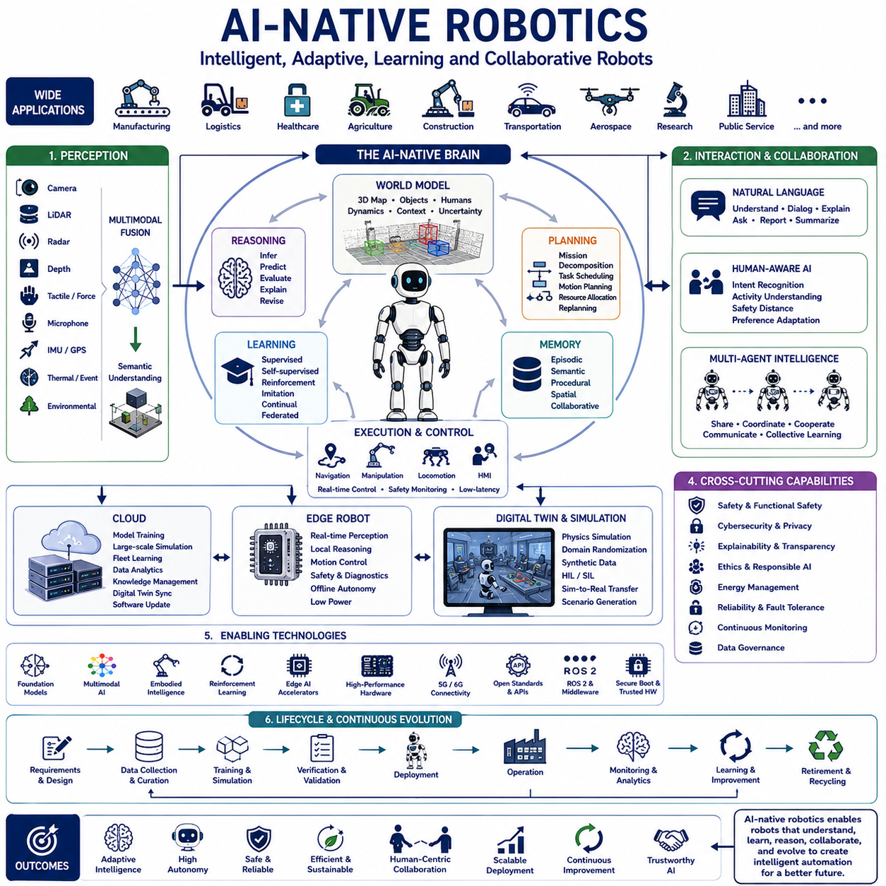
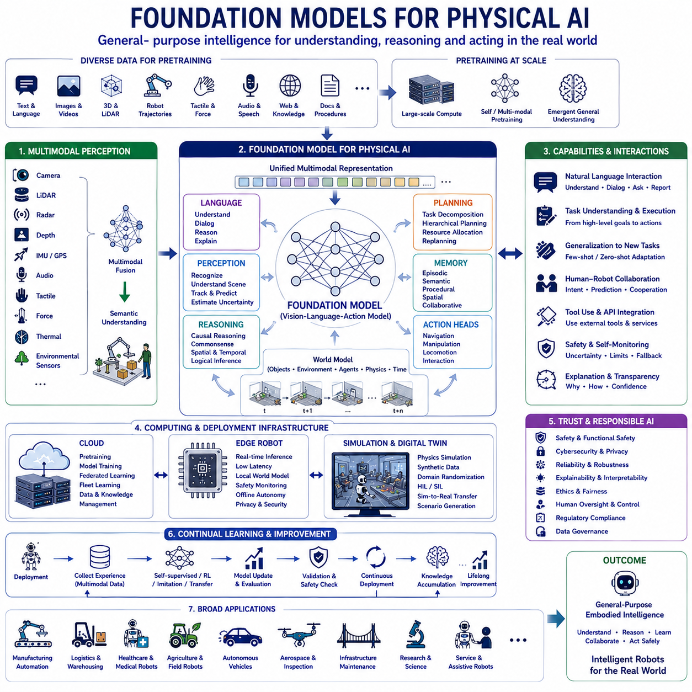
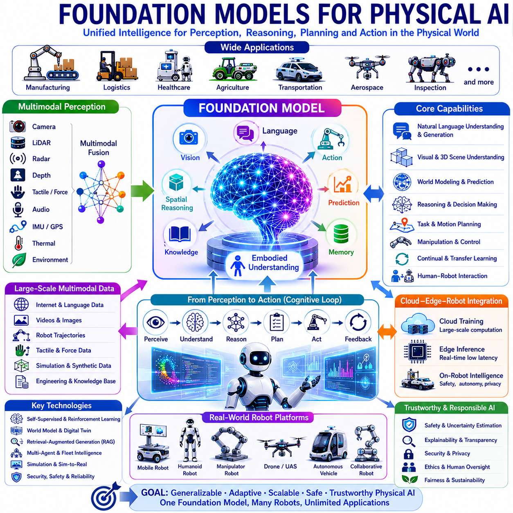
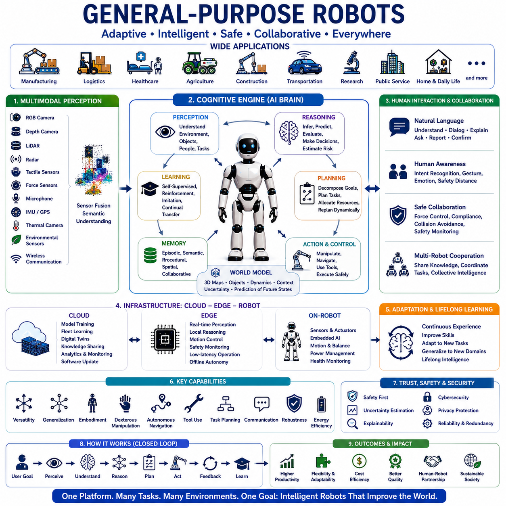
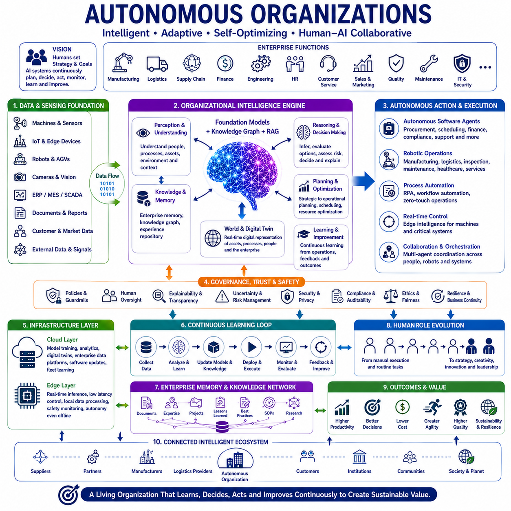
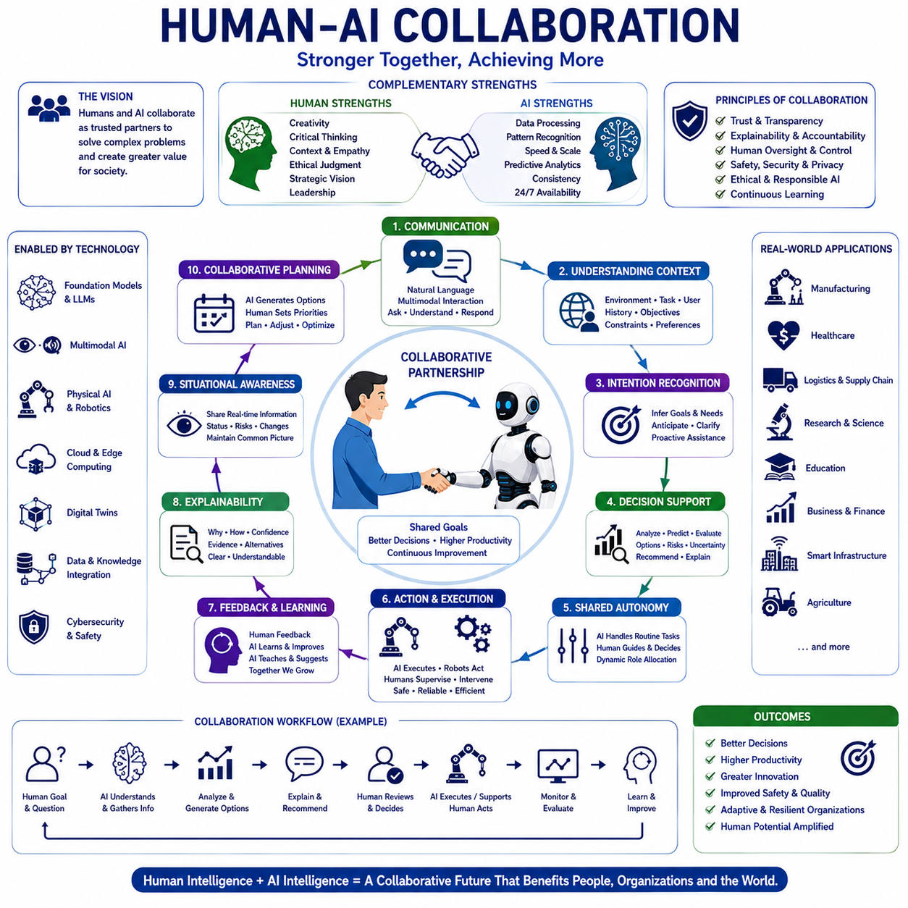
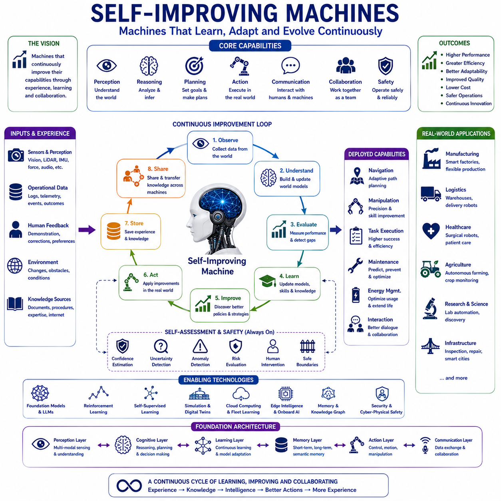
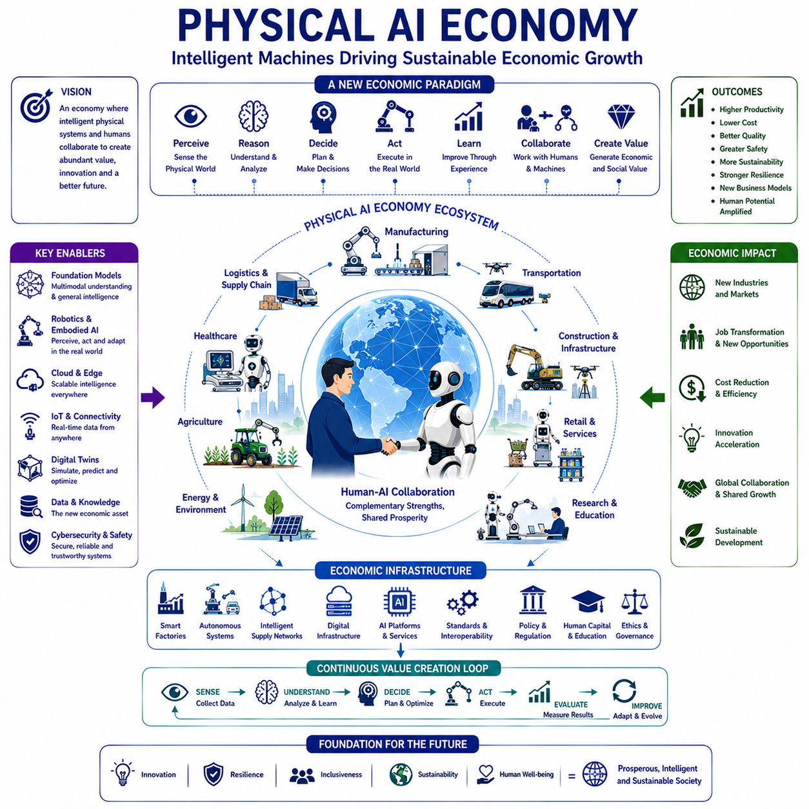
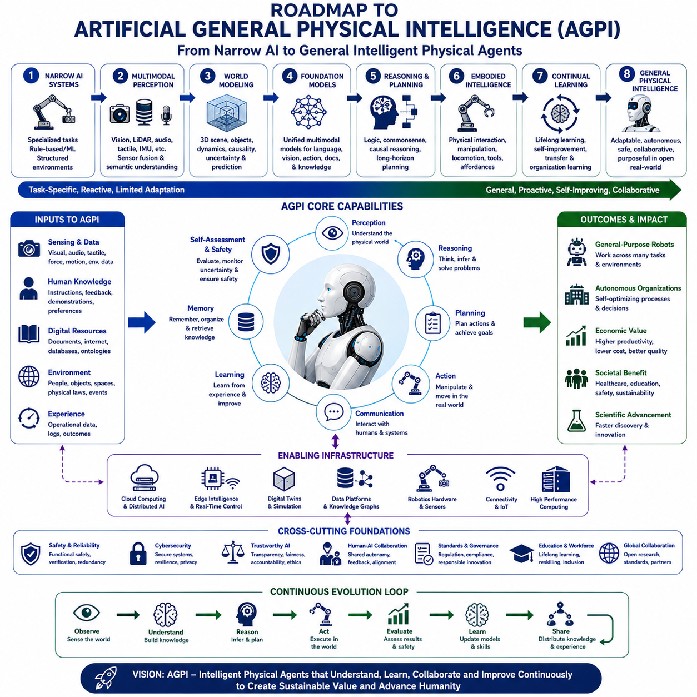
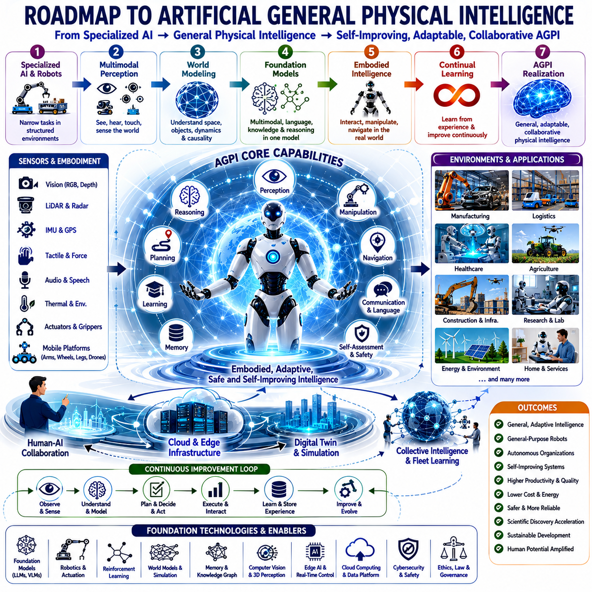

**Physical AI Engineering**


# Chapter 15 The Future of Physical AI 

##  

## 15-01 AI-Native Robotics

{width="7.268055555555556in" height="7.268055555555556in"}

AI-Native Robotics represents a new generation of intelligent robotic systems in which artificial intelligence is not treated as an optional software module but rather as the fundamental architectural principle governing perception, reasoning, planning, learning, communication, control, and adaptation throughout the entire robotic lifecycle. Unlike conventional robots that rely on deterministic programming and manually engineered algorithms, AI-native robots are designed from the beginning around machine learning, foundation models, multimodal perception, embodied intelligence, autonomous reasoning, and continuous knowledge acquisition. Every layer of the system, from hardware architecture to cloud infrastructure, is constructed to support intelligent decision-making rather than simply executing predefined commands. This paradigm transforms robotics from automation-oriented machinery into adaptive cognitive systems capable of understanding complex environments, collaborating with humans, and continuously improving through experience.

Traditional robotics has historically followed a pipeline consisting of sensor acquisition, feature extraction, rule-based decision making, motion planning, and actuator control. Each component was independently engineered, and behavior was explicitly programmed by developers. Although such systems remain highly effective within structured industrial environments, they exhibit limited flexibility when operating in dynamic, uncertain, or previously unseen situations. Every environmental variation typically requires manual software modification, parameter tuning, or extensive engineering effort. AI-native robotics fundamentally changes this engineering philosophy by replacing handcrafted intelligence with data-driven reasoning and adaptive learning. Rather than explicitly programming every possible situation, developers construct learning architectures capable of generalizing across diverse operational conditions.

The emergence of large-scale foundation models has accelerated the transition toward AI-native robotics. These models possess broad semantic understanding acquired through training on enormous multimodal datasets containing language, images, videos, spatial relationships, physical interactions, and human knowledge. Instead of developing separate models for object detection, navigation, manipulation, planning, and dialogue, AI-native systems increasingly integrate foundation models capable of supporting multiple cognitive functions simultaneously. Such architectures significantly reduce engineering complexity while improving knowledge transfer across different robotic tasks.

Embodied intelligence forms one of the defining characteristics of AI-native robotics. Intelligence no longer exists solely within abstract computational models but emerges through continuous interaction between physical bodies and surrounding environments. Robots perceive, move, manipulate objects, receive sensory feedback, predict physical consequences, and update internal world models based upon direct experience. Learning therefore becomes grounded in physical interaction rather than purely symbolic reasoning. Embodiment allows artificial intelligence to understand concepts such as balance, friction, force, stability, deformation, grasp quality, terrain, and spatial relationships through continuous observation and action.

Perception within AI-native robotics extends far beyond conventional sensor processing. Modern intelligent robots integrate cameras, LiDAR, radar, depth sensors, tactile arrays, force sensors, microphones, inertial measurement units, GPS, thermal imaging, event cameras, and environmental monitoring devices into unified multimodal perception architectures. Instead of independently processing each sensor stream, foundation models increasingly fuse heterogeneous information into coherent semantic representations describing objects, human activities, environmental conditions, operational context, uncertainty estimates, and future predictions. Multimodal perception significantly improves robustness because complementary sensing modalities compensate for one another under adverse environmental conditions.

World models occupy a central position within AI-native robotic architectures. Rather than reacting directly to instantaneous sensor observations, intelligent robots maintain continuously updated internal representations describing three-dimensional geometry, object identities, human intentions, dynamic obstacles, environmental constraints, operational objectives, and predicted future states. World models integrate spatial mapping, semantic understanding, temporal memory, causal reasoning, and uncertainty estimation into unified computational frameworks supporting long-term autonomous decision making. These internal representations enable robots to reason beyond immediate observations while anticipating future environmental evolution.

Reasoning represents another major advancement distinguishing AI-native robotics from traditional automation. Classical robots primarily execute predefined task sequences according to deterministic programming logic. AI-native systems instead evaluate contextual information, infer hidden relationships, predict future consequences, compare alternative strategies, estimate uncertainty, explain decisions, and dynamically revise operational plans according to changing environmental conditions. Modern reasoning increasingly combines symbolic planning with neural inference, allowing robots to exploit both logical consistency and statistical generalization simultaneously.

Planning similarly evolves from static trajectory generation toward hierarchical cognitive decision making. AI-native robots decompose high-level missions into intermediate objectives, allocate resources, coordinate multiple behaviors, optimize motion efficiency, evaluate operational constraints, anticipate environmental changes, and continuously adapt execution according to real-time observations. Planning therefore becomes an ongoing cognitive process integrating perception, prediction, reasoning, communication, manipulation, navigation, energy management, and mission optimization rather than merely computing collision-free trajectories.

Learning forms one of the defining capabilities of AI-native systems. Conventional robots generally remain functionally identical throughout deployment unless engineers manually update software. AI-native robots instead continuously improve through supervised learning, self-supervised learning, reinforcement learning, imitation learning, transfer learning, federated learning, continual learning, and online adaptation. Experience accumulated during operation gradually improves perception accuracy, manipulation skill, navigation efficiency, fault diagnosis, human interaction quality, and energy optimization. Continuous learning transforms robotic deployment from fixed automation toward progressively improving intelligent infrastructure.

Self-supervised learning significantly reduces dependence upon manually labeled datasets. Autonomous robots naturally generate enormous quantities of sensory information during routine operation. Instead of requiring expensive human annotation, AI-native learning algorithms automatically discover spatial relationships, temporal consistency, object permanence, motion patterns, physical constraints, and environmental regularities directly from unlabeled observations. This dramatically expands scalable knowledge acquisition while reducing engineering cost associated with dataset preparation.

Reinforcement learning enables autonomous systems to optimize behavior through repeated interaction with environments. Rather than memorizing predefined actions, robots gradually discover policies maximizing long-term performance according to carefully designed reward functions. Reinforcement learning supports locomotion, manipulation, navigation, energy optimization, task scheduling, cooperative behavior, adaptive control, and strategic decision making. Recent developments increasingly combine reinforcement learning with foundation models and simulation platforms to accelerate policy development before physical deployment.

Simulation has become indispensable for AI-native robotics because real-world experimentation remains expensive, time consuming, and potentially hazardous. High-fidelity digital environments enable robots to accumulate millions of interaction experiences across diverse operational scenarios impossible to reproduce experimentally. Digital twins, physics simulation, domain randomization, synthetic data generation, hardware-in-the-loop evaluation, and sim-to-real transfer collectively reduce development cost while substantially improving learning efficiency. AI-native engineering therefore tightly integrates simulation with physical deployment throughout complete development lifecycles.

Cloud computing and edge computing jointly support AI-native robotic intelligence. High-performance cloud infrastructure performs foundation model training, large-scale simulation, fleet learning, long-term knowledge management, software distribution, analytics, and digital twin synchronization. Edge computing simultaneously provides deterministic real-time perception, motion control, safety monitoring, low-latency reasoning, and autonomous operation despite intermittent network connectivity. AI-native architectures therefore distribute intelligence according to computational latency, bandwidth, privacy, energy consumption, and reliability requirements rather than centralizing every capability within either cloud or local hardware alone.

Foundation models increasingly function as general cognitive engines within AI-native robotic platforms. Instead of constructing numerous independent task-specific neural networks, robots employ unified models capable of understanding natural language, interpreting visual scenes, generating plans, answering questions, summarizing observations, producing executable code, explaining decisions, and coordinating multiple operational objectives. Such general intelligence substantially simplifies software architecture while enabling flexible adaptation across diverse applications.

Natural language interaction fundamentally transforms human-robot collaboration. AI-native robots interpret spoken instructions, participate in conversational dialogue, clarify ambiguous requests, explain operational status, answer technical questions, summarize completed work, recommend alternative procedures, and communicate uncertainty naturally. Language therefore becomes a universal interface connecting human intention with robotic execution, reducing dependence upon specialized programming interfaces or rigid command structures.

Human-robot collaboration expands considerably through AI-native reasoning capabilities. Robots increasingly understand human activities, recognize intentions, predict future actions, coordinate shared tasks, adapt behavior according to operator preferences, maintain safe separation distances, negotiate workspace allocation, provide contextual assistance, and communicate operational constraints proactively. Collaboration therefore evolves from simple coexistence toward genuine cooperative partnership supporting industrial productivity, healthcare delivery, logistics efficiency, scientific research, agriculture, and domestic assistance.

Multi-agent intelligence represents another defining characteristic of AI-native robotics. Individual robots increasingly function as members of larger collaborative ecosystems rather than isolated autonomous machines. Distributed robotic teams exchange semantic information, coordinate missions, allocate resources, share environmental knowledge, synchronize perception, collectively optimize task execution, and recover cooperatively from unexpected failures. Fleet intelligence emerges through continuous communication, distributed learning, and coordinated decision making supported by cloud infrastructure and edge autonomy.

Memory architecture plays a crucial role within AI-native systems. Beyond short-term sensor buffers, robots increasingly maintain episodic memory describing previous experiences, semantic memory containing generalized world knowledge, procedural memory encoding learned skills, spatial memory supporting navigation, operational memory recording mission history, and collaborative memory shared across entire robotic fleets. Rich memory structures enable continual improvement while supporting explainability, traceability, predictive planning, and organizational learning.

Knowledge representation similarly evolves beyond geometric mapping toward semantic understanding. Robots increasingly associate objects with functional properties, physical affordances, operational procedures, maintenance history, safety requirements, environmental context, human preferences, and organizational objectives. Semantic knowledge graphs, vector databases, retrieval-augmented reasoning, and foundation models collectively support sophisticated contextual understanding extending beyond immediate perception.

Artificial intelligence also transforms robotic software architecture itself. Traditional robotics software frequently consists of numerous independently developed algorithms communicating through carefully engineered interfaces. AI-native software instead increasingly organizes computation around intelligent services supporting perception, reasoning, planning, memory, communication, simulation, optimization, diagnostics, learning, and autonomous adaptation. Microservice architectures, containerization, orchestration platforms, model serving infrastructure, distributed inference engines, and continuous deployment pipelines collectively enable scalable intelligent robotic ecosystems.

Hardware architecture equally evolves toward AI-native optimization. Modern robotic platforms increasingly integrate heterogeneous computing resources including CPUs, GPUs, NPUs, TPUs, FPGAs, dedicated vision accelerators, real-time controllers, high-bandwidth memory, hardware security modules, and specialized sensor processors. Computational workloads dynamically migrate across heterogeneous processors according to latency, power consumption, thermal constraints, computational intensity, and safety requirements. Hardware therefore becomes co-designed with artificial intelligence algorithms rather than functioning merely as generic computational infrastructure.

Energy management represents an increasingly important AI-native capability. Intelligent robots continuously predict future energy consumption, optimize processor utilization, dynamically adjust computational precision, schedule charging operations, coordinate fleet energy usage, balance thermal conditions, and prioritize mission objectives according to available battery capacity. Artificial intelligence therefore optimizes not only task execution but also long-term operational sustainability.

Cybersecurity assumes greater significance because AI-native systems depend upon distributed intelligence, cloud connectivity, collaborative learning, software updates, and extensive data exchange. Secure boot, hardware roots of trust, encrypted communication, authenticated model distribution, runtime integrity verification, zero-trust networking, anomaly detection, adversarial robustness, identity management, and continuous vulnerability assessment collectively protect intelligent robotic ecosystems from malicious interference while preserving trustworthy autonomous operation.

Safety engineering remains fundamental despite increasing cognitive capability. AI-native robots continuously estimate uncertainty, monitor operational boundaries, evaluate environmental hazards, verify perception confidence, supervise artificial intelligence outputs, implement graceful degradation, activate emergency behaviors, and request human assistance whenever autonomous confidence decreases below acceptable thresholds. Functional safety and artificial intelligence therefore operate collaboratively rather than competitively, combining deterministic protection mechanisms with adaptive reasoning.

Explainability becomes increasingly valuable as robots assume greater autonomy. AI-native systems should describe why particular decisions were made, identify influential observations, estimate confidence, summarize alternative strategies, explain uncertainty, and provide understandable reasoning supporting operator trust, regulatory compliance, debugging, maintenance, and incident investigation. Explainable artificial intelligence transforms opaque computational processes into transparent engineering evidence.

Ethical principles similarly become deeply integrated into AI-native robotics. Intelligent systems increasingly evaluate fairness, privacy, human dignity, accessibility, environmental sustainability, transparency, accountability, responsible autonomy, and societal consequences alongside technical optimization objectives. Ethical governance therefore becomes embedded within engineering workflows rather than treated as external regulatory compliance.

Continuous deployment fundamentally distinguishes AI-native engineering from traditional robotics development. Software updates, artificial intelligence improvements, cybersecurity patches, perception enhancements, navigation optimization, new manipulation skills, foundation model upgrades, and operational refinements occur throughout complete deployment lifecycles. Continuous integration, continuous delivery, automated testing, digital twins, runtime monitoring, fleet analytics, and configuration management collectively ensure intelligent systems evolve safely without compromising operational reliability.

AI-native robotics also transforms organizational engineering culture. Development increasingly requires interdisciplinary collaboration among roboticists, machine learning researchers, systems engineers, software architects, functional safety specialists, cybersecurity professionals, cloud engineers, simulation experts, human factors researchers, ethicists, and domain specialists. Successful AI-native platforms emerge through integrated engineering ecosystems rather than isolated technological disciplines.

Future AI-native robotics will increasingly incorporate embodied foundation models, general robotic intelligence, lifelong learning, semantic world models, multimodal reasoning, adaptive manipulation, cooperative autonomy, distributed intelligence, quantum-enhanced optimization, neuromorphic computing, self-improving software architectures, and globally connected robotic knowledge networks. Robots will progressively transition from task-specific automation toward versatile cognitive partners capable of understanding diverse operational environments while continuously expanding knowledge throughout deployment.

Ultimately, AI-Native Robotics represents the convergence of artificial intelligence, embodied cognition, autonomous reasoning, systems engineering, cloud computing, edge intelligence, multimodal perception, continual learning, ethical governance, and human-centered design into a unified engineering paradigm. Intelligence is no longer appended onto existing robotic platforms as an isolated software module but instead becomes the foundational organizing principle shaping every architectural layer from hardware design through autonomous decision making, lifecycle management, and long-term organizational operation. As intelligent machines increasingly participate within manufacturing, logistics, healthcare, agriculture, transportation, aerospace, scientific research, infrastructure maintenance, public services, and everyday human environments, AI-native robotics will define the next evolutionary stage of autonomous systems by creating adaptive, trustworthy, continuously learning robotic ecosystems capable of safely collaborating with humanity while driving sustainable technological progress across the global economy.

AI 네이티브 로보틱스(AI-Native Robotics)는 인공지능(Artificial Intelligence)을 단순한 소프트웨어 기능으로 추가하는 것이 아니라, **로봇 시스템 전체의 설계 철학과 아키텍처를 구성하는 가장 기본적인 요소**로 삼는 차세대 로봇 공학 패러다임이다. 기존의 로봇은 미리 작성된 프로그램과 결정론적 알고리즘(Deterministic Algorithm)을 중심으로 동작하였다. 반면 AI 네이티브 로봇은 머신러닝(Machine Learning), 파운데이션 모델(Foundation Model), 멀티모달 인공지능(Multimodal AI), 구현형 지능(Embodied Intelligence), 자율 추론(Autonomous Reasoning), 지속 학습(Continual Learning)을 중심으로 처음부터 설계된다. 하드웨어(Hardware), 운영체제(Operating System), 미들웨어(Middleware), 소프트웨어(Software), 클라우드(Cloud), 엣지 컴퓨팅(Edge Computing)까지 모든 계층이 지능적인 의사결정을 지원하도록 설계되며, 단순한 명령 실행 기계가 아니라 스스로 환경을 이해하고 학습하며 지속적으로 발전하는 지능형 시스템(Intelligent System)으로 발전한다.

전통적인 로봇은 센서 데이터 획득(Sensor Acquisition), 특징 추출(Feature Extraction), 규칙 기반 판단(Rule-Based Decision Making), 경로 계획(Motion Planning), 구동 제어(Actuator Control)와 같은 순차적인 처리 구조를 사용하였다. 각각의 기능은 독립적으로 개발되었으며, 모든 동작은 개발자가 직접 설계한 규칙에 따라 수행되었다. 이러한 방식은 생산 공장과 같이 구조화된 환경에서는 매우 높은 성능을 제공하지만, 예측하기 어려운 환경에서는 유연성이 크게 떨어진다. 새로운 상황이 발생할 때마다 소프트웨어 수정, 파라미터 조정(Parameter Tuning), 추가 개발이 필요하기 때문이다. AI 네이티브 로보틱스는 이러한 구조를 데이터 기반(Data-Driven) 지능으로 전환하여, 모든 상황을 미리 프로그래밍하지 않고 스스로 일반화(Generalization)하여 새로운 환경에서도 적응할 수 있도록 한다.

대규모 파운데이션 모델(Foundation Model)의 등장으로 AI 네이티브 로보틱스는 빠르게 발전하고 있다. 이러한 모델은 방대한 언어(Language), 이미지(Image), 영상(Video), 공간 정보(Spatial Information), 물리적 상호작용(Physical Interaction), 인간의 지식(Human Knowledge)을 학습하여 폭넓은 의미 이해(Semantic Understanding)를 갖추게 된다. 기존에는 객체 인식(Object Detection), 내비게이션(Navigation), 조작(Manipulation), 계획(Planning), 대화(Dialogue)를 각각 다른 모델로 개발했지만, AI 네이티브 시스템에서는 하나의 통합된 파운데이션 모델이 여러 인지 기능을 동시에 수행할 수 있다. 이는 개발 복잡도를 줄이고 서로 다른 작업 간의 지식 전이(Knowledge Transfer)를 가능하게 한다.

구현형 지능(Embodied Intelligence)은 AI 네이티브 로보틱스를 대표하는 핵심 개념이다. 지능은 단순히 컴퓨터 내부에서 계산되는 것이 아니라, 실제 몸체(Physical Body)가 환경과 지속적으로 상호작용하면서 형성된다. 로봇은 주변 환경을 인식하고, 이동하며, 물체를 조작하고, 감각 피드백(Sensory Feedback)을 받으며, 자신의 행동이 환경에 미치는 영향을 학습한다. 이러한 반복적인 경험을 통해 균형(Balance), 마찰(Friction), 힘(Force), 안정성(Stability), 물체의 변형(Deformation), 파지 품질(Grasp Quality), 지형(Terrain), 공간 관계(Spatial Relationship)와 같은 물리적인 개념을 자연스럽게 이해하게 된다.

AI 네이티브 로보틱스의 인식(Perception)은 기존의 센서 처리와는 차원이 다르다. 카메라(Camera), LiDAR, 레이더(Radar), 깊이 카메라(Depth Camera), 촉각 센서(Tactile Sensor), 힘 센서(Force Sensor), 마이크(Microphone), IMU(Inertial Measurement Unit), GPS, 열화상 카메라(Thermal Camera), 이벤트 카메라(Event Camera), 환경 센서(Environmental Sensor)를 하나의 멀티모달 인식(Multimodal Perception) 구조로 통합한다. 각각의 센서 데이터를 독립적으로 처리하는 것이 아니라 AI가 모든 정보를 동시에 해석하여 객체(Object), 사람(Human), 환경(Environment), 작업(Task), 위험(Risk), 미래 변화(Prediction)를 하나의 통합된 의미 표현(Semantic Representation)으로 생성한다. 서로 다른 센서는 서로의 약점을 보완하므로 다양한 환경에서도 높은 강건성(Robustness)을 확보할 수 있다.

월드 모델(World Model)은 AI 네이티브 로보틱스의 핵심 두뇌 역할을 수행한다. 로봇은 단순히 현재 센서 데이터를 처리하는 것이 아니라 주변 공간의 3차원 구조(3D Geometry), 객체(Object Identity), 사람의 의도(Human Intention), 이동 장애물(Dynamic Obstacle), 환경 제약(Environmental Constraint), 작업 목표(Task Objective), 미래 상태(Future State)를 지속적으로 업데이트하는 내부 세계 모델을 유지한다. 월드 모델은 공간 지도(Spatial Mapping), 의미 이해(Semantic Understanding), 시간 기억(Temporal Memory), 인과 추론(Causal Reasoning), 불확실성 추정(Uncertainty Estimation)을 통합하여 장기적인 자율 의사결정을 가능하게 한다.

추론(Reasoning)은 AI 네이티브 로봇을 기존 자동화 시스템과 구별하는 가장 중요한 요소 가운데 하나이다. 기존 로봇은 미리 정의된 절차를 그대로 수행하였지만, AI 네이티브 로봇은 주변 상황(Context)을 이해하고, 숨겨진 관계를 추론하며, 미래 결과를 예측하고, 여러 가지 행동 전략을 비교하며, 자신의 신뢰도를 평가하고, 상황 변화에 따라 작업 계획을 수정한다. 이러한 추론은 신경망(Neural Network) 기반 추론과 기호 추론(Symbolic Reasoning)을 함께 활용하여 높은 유연성과 논리성을 동시에 확보한다.

계획(Planning) 역시 기존의 경로 생성(Path Planning)을 넘어 계층적 의사결정(Hierarchical Decision Making)으로 발전한다. AI 네이티브 로봇은 높은 수준의 작업 목표를 세부 작업으로 분해하고, 자원을 배분하며, 작업 순서를 최적화하고, 이동 경로를 계산하며, 환경 변화에 따라 계획을 지속적으로 수정한다. 계획은 단순한 이동 알고리즘이 아니라 인식, 추론, 예측, 조작, 통신, 에너지 관리, 작업 최적화를 통합하는 지속적인 인지 과정이 된다.

학습(Learning)은 AI 네이티브 시스템의 가장 큰 특징이다. 기존 로봇은 배포 이후에도 동일한 기능만 수행하지만, AI 네이티브 로봇은 지도 학습(Supervised Learning), 자기지도 학습(Self-Supervised Learning), 강화학습(Reinforcement Learning), 모방학습(Imitation Learning), 전이학습(Transfer Learning), 연합학습(Federated Learning), 지속학습(Continual Learning), 온라인 학습(Online Learning)을 통해 계속 발전한다. 운용 과정에서 축적되는 경험은 인식 성능, 조작 능력, 내비게이션, 고장 진단, 사람과의 협업, 에너지 효율을 지속적으로 향상시킨다.

자기지도 학습(Self-Supervised Learning)은 AI 네이티브 로보틱스에서 매우 중요한 역할을 한다. 로봇은 운용 과정에서 막대한 양의 센서 데이터를 생성한다. 이러한 데이터는 사람이 직접 라벨(Label)을 붙이지 않아도 AI가 공간 관계, 시간 변화, 물체의 지속성(Object Permanence), 움직임(Motion Pattern), 물리 법칙(Physical Constraint)을 스스로 학습할 수 있다. 이는 데이터 구축 비용을 크게 줄이고 대규모 지식 습득을 가능하게 한다.

강화학습(Reinforcement Learning)은 로봇이 반복적인 경험을 통해 최적의 행동 정책(Policy)을 스스로 학습하도록 만든다. 로봇은 단순히 정답을 외우는 것이 아니라 다양한 행동을 시도하고 보상 함수(Reward Function)를 기반으로 가장 효율적인 행동을 찾아낸다. 강화학습은 보행(Locomotion), 조작(Manipulation), 내비게이션, 에너지 최적화(Energy Optimization), 작업 스케줄링(Task Scheduling), 협업(Cooperation), 적응형 제어(Adaptive Control)에 폭넓게 활용된다. 최근에는 파운데이션 모델과 시뮬레이션을 결합하여 실제 배포 전에 정책을 효과적으로 학습하는 방식이 널리 사용되고 있다.

시뮬레이션(Simulation)은 AI 네이티브 로보틱스 개발에서 필수적인 요소이다. 실제 환경에서 수많은 실험을 수행하는 것은 비용이 매우 높고 위험할 수 있다. 따라서 디지털 트윈(Digital Twin), 물리 시뮬레이션(Physics Simulation), 도메인 랜덤화(Domain Randomization), 합성 데이터 생성(Synthetic Data Generation), HIL(Hardware-in-the-Loop), Sim-to-Real 기술을 이용하여 수백만 번의 가상 경험을 축적한다. 이를 통해 실제 개발 비용을 줄이고 AI 학습 속도를 크게 향상시킬 수 있다.

클라우드 컴퓨팅(Cloud Computing)과 엣지 컴퓨팅(Edge Computing)은 AI 네이티브 로보틱스를 함께 지원한다. 클라우드는 대규모 AI 모델 학습, 시뮬레이션, 플릿 학습(Fleet Learning), 장기 지식 관리(Knowledge Management), 소프트웨어 배포, 데이터 분석, 디지털 트윈 동기화를 수행한다. 반면 엣지는 실시간 인식(Real-Time Perception), 모션 제어(Motion Control), 안전 감시(Safety Monitoring), 저지연 추론(Low-Latency Reasoning), 네트워크가 끊어진 상황에서도 자율 운용을 담당한다. AI 네이티브 시스템은 지연 시간(Latency), 대역폭(Bandwidth), 개인정보 보호(Privacy), 에너지 소비(Energy Consumption), 신뢰성을 고려하여 클라우드와 엣지의 역할을 최적으로 분배한다.

파운데이션 모델은 AI 네이티브 로봇의 범용 인지 엔진(General Cognitive Engine) 역할을 수행한다. 하나의 모델이 자연어 이해(Natural Language Understanding), 장면 인식(Scene Understanding), 작업 계획(Task Planning), 질문 응답(Question Answering), 코드 생성(Code Generation), 의사결정 설명(Decision Explanation), 다양한 작업을 동시에 수행할 수 있다. 이는 기존의 여러 개의 독립적인 AI 모델을 하나의 통합 모델로 대체하여 시스템 구조를 단순화하고 유연성을 크게 향상시킨다.

자연어 상호작용(Natural Language Interaction)은 인간과 로봇의 협업 방식을 근본적으로 변화시킨다. AI 네이티브 로봇은 사람의 음성 명령을 이해하고, 대화를 수행하며, 모호한 명령을 다시 질문하고, 작업 진행 상황을 설명하며, 기술적인 질문에 답하고, 완료된 작업을 요약하며, 자신의 불확실성을 사용자에게 전달할 수 있다. 자연어는 로봇을 제어하는 새로운 범용 인터페이스(Universal Interface)가 된다.

인간-로봇 협업(Human-Robot Collaboration)은 AI 네이티브 환경에서 크게 발전한다. 로봇은 사람의 행동을 이해하고, 의도를 예측하며, 공동 작업을 수행하고, 작업자의 선호도를 학습하며, 안전 거리를 유지하고, 작업 공간을 조율하며, 필요한 도움을 먼저 제공할 수 있다. 이는 단순히 같은 공간에서 작업하는 수준을 넘어 진정한 협력(Cooperative Partnership)으로 발전한다.

멀티 에이전트 지능(Multi-Agent Intelligence)은 AI 네이티브 로보틱스의 또 다른 특징이다. 개별 로봇은 독립적으로 동작하는 것이 아니라 하나의 지능형 플릿(Intelligent Fleet)을 구성한다. 여러 로봇은 의미 정보를 공유하고, 작업을 분배하며, 환경 지식을 교환하고, 센서 정보를 공유하며, 협력하여 작업을 수행하고, 장애 발생 시 함께 복구한다. 클라우드 기반의 분산 학습과 협력적 의사결정을 통해 집단 지능(Collective Intelligence)이 형성된다.

메모리 구조(Memory Architecture)는 AI 네이티브 시스템에서 매우 중요한 요소이다. 단기 기억(Short-Term Memory)뿐 아니라 과거 경험을 저장하는 에피소드 기억(Episodic Memory), 일반 지식을 저장하는 의미 기억(Semantic Memory), 작업 기술을 저장하는 절차 기억(Procedural Memory), 지도 정보를 저장하는 공간 기억(Spatial Memory), 플릿 전체가 공유하는 협업 기억(Collaborative Memory)을 유지한다. 이러한 다양한 기억 구조는 지속적인 학습과 설명 가능성, 예측 계획을 가능하게 한다.

지식 표현(Knowledge Representation)은 단순한 지도(Map)가 아니라 객체의 기능(Function), 물리적 속성(Physical Affordance), 작업 절차(Operation Procedure), 유지보수 이력(Maintenance History), 안전 요구사항(Safety Requirement), 환경 정보(Environmental Context), 사용자 선호도(User Preference)를 포함하는 의미 기반 지식(Semantic Knowledge)으로 발전한다. 지식 그래프(Knowledge Graph), 벡터 데이터베이스(Vector Database), 검색 증강 생성(Retrieval-Augmented Generation, RAG)이 이를 지원한다.

AI는 로봇 소프트웨어 구조 자체도 변화시킨다. 기존의 로봇 소프트웨어는 독립적인 알고리즘들의 집합이었지만, AI 네이티브 시스템은 인식 서비스(Perception Service), 추론 서비스(Reasoning Service), 계획 서비스(Planning Service), 메모리 서비스(Memory Service), 통신 서비스(Communication Service), 시뮬레이션(Simulation), 최적화(Optimization), 진단(Diagnostics), 학습(Learning)을 중심으로 구성된다. 마이크로서비스(Microservice), 컨테이너(Container), 오케스트레이션(Orchestration), 모델 서비스(Model Serving), 분산 추론(Distributed Inference)이 전체 AI 생태계를 구성한다.

하드웨어 구조(Hardware Architecture)도 AI 중심으로 발전한다. CPU, GPU, NPU, TPU, FPGA, 비전 프로세서(Vision Accelerator), 실시간 제어기(Real-Time Controller), 고대역폭 메모리(High-Bandwidth Memory), Hardware Security Module이 함께 사용된다. 계산 작업은 지연 시간, 전력 소비, 열 관리(Thermal Management), 안전 요구사항에 따라 적절한 프로세서로 자동 분배된다.

에너지 관리(Energy Management)는 AI 네이티브 로봇의 중요한 기능이다. AI는 작업 계획과 함께 에너지 소비를 예측하고, 프로세서 부하를 조절하며, 계산 정밀도를 변경하고, 충전 시점을 결정하며, 플릿 전체의 전력 사용을 최적화한다. AI는 작업뿐 아니라 장기적인 에너지 효율까지 함께 관리한다.

사이버보안(Cybersecurity)은 AI 네이티브 시스템에서 더욱 중요해진다. Secure Boot, Hardware Root of Trust, 암호화 통신(Encrypted Communication), 모델 배포 인증(Authenticated Model Distribution), Runtime Integrity Verification, Zero Trust Network, 이상 탐지(Anomaly Detection), 적대적 공격 방어(Adversarial Robustness), 신원 관리(Identity Management), 지속적인 취약점 분석(Vulnerability Assessment)을 통해 AI 생태계를 보호한다.

안전 공학(Safety Engineering)은 AI가 발전해도 여전히 가장 중요한 요소이다. AI 네이티브 로봇은 자신의 불확실성을 지속적으로 계산하고, 운영 한계를 감시하며, 위험을 평가하고, AI의 신뢰도를 확인하며, 성능을 점진적으로 낮추고(Graceful Degradation), 비상 동작(Emergency Behavior)을 수행하거나 사람의 도움을 요청한다. AI와 기능 안전(Function Safety)은 서로 경쟁하는 개념이 아니라 함께 동작하는 구조이다.

설명 가능성(Explainability)은 자율성이 높아질수록 더욱 중요해진다. AI 네이티브 로봇은 왜 특정한 결정을 내렸는지, 어떤 센서 정보가 가장 큰 영향을 주었는지, 얼마나 확신하는지, 다른 선택지는 무엇이었는지를 사람에게 설명할 수 있어야 한다. 이는 신뢰 형성, 규제 대응, 디버깅, 유지보수, 사고 분석에 중요한 역할을 한다.

윤리(Ethics)는 AI 네이티브 로보틱스에 자연스럽게 통합된다. AI는 공정성(Fairness), 개인정보 보호(Privacy), 인간 존엄성(Human Dignity), 접근성(Accessibility), 환경 지속 가능성(Environmental Sustainability), 투명성(Transparency), 책임성(Accountability), 책임 있는 자율성(Responsible Autonomy)을 고려하여 의사결정을 수행해야 한다. 윤리적 거버넌스(Ethical Governance)는 더 이상 외부 규제가 아니라 시스템 설계 자체의 일부가 된다.

지속적인 배포(Continuous Deployment)는 AI 네이티브 개발의 특징이다. 소프트웨어 업데이트, AI 모델 개선, 사이버보안 패치, 인식 알고리즘 향상, 내비게이션 최적화, 새로운 조작 기술은 운영 중에도 지속적으로 추가된다. 지속적 통합(Continuous Integration), 지속적 배포(Continuous Delivery), 자동 시험(Automated Testing), 디지털 트윈, 런타임 모니터링(Runtime Monitoring), 플릿 분석(Fleet Analytics), 형상 관리(Configuration Management)를 통해 시스템은 안전하게 진화한다.

AI 네이티브 로보틱스는 조직 문화까지 변화시킨다. 로봇 공학자(Roboticist), AI 연구자(AI Researcher), 시스템 엔지니어(System Engineer), 소프트웨어 아키텍트(Software Architect), 기능 안전 전문가(Function Safety Specialist), 사이버보안 전문가(Cybersecurity Specialist), 클라우드 엔지니어(Cloud Engineer), 시뮬레이션 전문가(Simulation Expert), 인간공학 전문가(Human Factors Researcher), 윤리 전문가(Ethicist)가 함께 협력해야 한다. AI 네이티브 플랫폼은 개별 기술이 아니라 통합된 엔지니어링 생태계(Integrated Engineering Ecosystem)를 통해 만들어진다.

미래의 AI 네이티브 로보틱스는 구현형 파운데이션 모델(Embodied Foundation Model), 범용 로봇 지능(General Robotic Intelligence), 평생 학습(Lifelong Learning), 의미 기반 월드 모델(Semantic World Model), 멀티모달 추론(Multimodal Reasoning), 적응형 조작(Adaptive Manipulation), 협력 자율성(Cooperative Autonomy), 분산 지능(Distributed Intelligence), 양자 기반 최적화(Quantum-Enhanced Optimization), 뉴로모픽 컴퓨팅(Neuromorphic Computing), 자기 진화 소프트웨어(Self-Improving Software Architecture), 글로벌 로봇 지식 네트워크(Global Robotic Knowledge Network)를 중심으로 발전하게 될 것이다. 미래의 로봇은 특정 작업만 수행하는 자동화 장비가 아니라, 다양한 환경을 이해하고 지속적으로 지식을 확장하는 범용 지능형 파트너(General Intelligent Partner)로 진화하게 된다.

궁극적으로 **AI 네이티브 로보틱스(AI-Native Robotics)는 인공지능(Artificial Intelligence), 구현형 지능(Embodied Intelligence), 자율 추론(Autonomous Reasoning), 시스템 공학(System Engineering), 클라우드 컴퓨팅(Cloud Computing), 엣지 지능(Edge Intelligence), 멀티모달 인식(Multimodal Perception), 지속 학습(Continual Learning), 윤리적 거버넌스(Ethical Governance), 인간 중심 설계(Human-Centered Design)를 하나로 통합하는 새로운 공학 패러다임(New Engineering Paradigm)** 이다. AI는 더 이상 기존 로봇에 추가되는 기능이 아니라, **하드웨어 설계(Hardware Design)부터 자율 의사결정(Autonomous Decision Making), 생명주기 관리(Lifecycle Management), 조직 운영(Organizational Operation)에 이르기까지 모든 계층을 구성하는 핵심 원리**가 된다. 앞으로 **제조(Manufacturing), 물류(Logistics), 의료(Healthcare), 농업(Agriculture), 교통(Transportation), 항공우주(Aerospace), 과학 연구(Scientific Research), 사회 기반 시설 유지관리(Infrastructure Maintenance), 공공 서비스(Public Service)** 전반에서 AI 네이티브 로보틱스는 **사람과 안전하게 협력하며 지속적으로 학습하는 적응형 로봇 생태계(Adaptive Robotic Ecosystem)** 를 구축하는 핵심 기술로 자리 잡게 될 것이며, 글로벌 산업 전반의 지속 가능한 기술 혁신(Sustainable Technological Innovation)을 이끄는 중심 패러다임이 될 것이다.

##  

## 15-02 Foundation Models for Physical AI

{width="7.268055555555556in" height="7.268055555555556in"}{width="7.268055555555556in" height="7.268055555555556in"}

Foundation Models for Physical AI represent one of the most transformative technological developments in modern artificial intelligence, robotics, and autonomous systems. Unlike conventional machine learning models that are trained to perform a single specialized task, foundation models are designed as large-scale, general-purpose intelligence architectures capable of understanding language, vision, spatial relationships, physical interactions, temporal dynamics, and multimodal information simultaneously. When integrated with robotic systems, these models become the cognitive core that enables Physical AI to perceive complex environments, reason about the physical world, communicate naturally with humans, learn continuously, and perform a broad spectrum of tasks without requiring entirely new algorithms for each application. Foundation models therefore redefine robotics from task-oriented automation into adaptable intelligent systems capable of operating across diverse industries, environments, and missions.

The concept of a foundation model originates from the observation that intelligence can emerge from large-scale pretraining on extremely diverse datasets rather than from narrowly optimized task-specific learning. During pretraining, these models acquire broad statistical representations of language, images, videos, human knowledge, spatial geometry, physical interactions, engineering documents, scientific literature, and operational procedures. Instead of learning isolated skills independently, they develop generalized internal representations that can later be adapted to numerous downstream applications using relatively small amounts of task-specific data. This shift significantly reduces development effort while dramatically increasing the flexibility and scalability of intelligent robotic systems.

Traditional robotic intelligence has typically been implemented using independent modules responsible for object detection, semantic segmentation, localization, simultaneous localization and mapping, path planning, manipulation planning, obstacle avoidance, speech recognition, and natural language processing. Each module often relies upon a different machine learning architecture, independently collected datasets, and separate optimization procedures. Although highly effective within specific applications, such modular systems frequently suffer from integration complexity, inconsistent representations, duplicated computation, and limited knowledge transfer. Foundation models address these limitations by learning unified latent representations that naturally connect perception, language, reasoning, planning, memory, and action into coherent cognitive architectures.

Physical AI fundamentally differs from purely digital artificial intelligence because intelligent decisions directly influence physical interaction with the real world. Robots manipulate objects, navigate dynamic environments, cooperate with humans, operate industrial equipment, transport materials, inspect infrastructure, perform medical procedures, and interact continuously with uncertain physical conditions. Consequently, foundation models supporting Physical AI must understand not only semantic concepts but also geometric relationships, force interactions, temporal dynamics, mechanical constraints, safety requirements, environmental uncertainty, and embodied action. Intelligence therefore becomes grounded in physical experience rather than abstract symbolic reasoning alone.

Embodied foundation models represent the next evolution beyond conventional language models. Rather than learning exclusively from internet-scale textual information, embodied models incorporate sensory observations, robot trajectories, force measurements, tactile interaction, manipulation demonstrations, environmental mapping, locomotion experiences, and multimodal human-robot interaction. These diverse experiences allow foundation models to develop intuitive understanding of physical concepts including stability, balance, friction, collision, deformation, grasp quality, motion prediction, object permanence, and causal interaction. Such knowledge substantially improves robotic decision making within real-world environments where purely linguistic understanding proves insufficient.

Multimodal learning forms one of the defining characteristics of foundation models for Physical AI. Modern robotic systems simultaneously observe visual imagery, depth information, LiDAR point clouds, radar measurements, inertial data, force sensing, tactile perception, thermal imaging, audio signals, environmental sensors, localization systems, and natural language communication. Instead of processing these modalities independently, foundation models learn unified representations integrating heterogeneous sensory information into coherent semantic understanding. Cross-modal learning enables complementary sensor modalities to reinforce one another, improving robustness under adverse environmental conditions including poor lighting, weather variation, occlusion, sensor degradation, and communication uncertainty.

Language plays a particularly important role because it serves as a universal interface connecting human intention with robotic behavior. Foundation models understand spoken instructions, technical documentation, engineering procedures, maintenance manuals, safety regulations, conversational dialogue, and operational objectives using natural language. Human operators therefore communicate desired outcomes instead of low-level programming instructions. Robots interpret intent, clarify ambiguity, explain decisions, summarize observations, recommend alternative strategies, and report operational status using conversational interaction. Natural language consequently becomes an intuitive programming interface dramatically reducing barriers to robotic deployment.

Vision-language models significantly expand robotic cognitive capability by jointly learning visual perception and semantic reasoning. Rather than recognizing isolated objects, these models understand complete scenes, identify relationships among objects, recognize human activities, interpret environmental context, infer operational goals, estimate future developments, and connect visual observations with linguistic descriptions. Such semantic scene understanding allows robots to operate effectively within unstructured environments where explicit programming of every possible situation remains impossible.

Spatial reasoning represents another critical capability. Foundation models increasingly understand three-dimensional geometry, object orientation, navigable space, structural relationships, workspace organization, dynamic obstacles, human movement, manipulation affordances, and environmental topology. This spatial intelligence enables autonomous navigation, dexterous manipulation, collaborative assembly, warehouse logistics, infrastructure inspection, agricultural automation, and healthcare assistance while maintaining safe interaction with surrounding environments.

World models constitute one of the most important cognitive structures generated by foundation models. Instead of responding directly to instantaneous sensory observations, intelligent robots maintain continuously evolving internal representations describing objects, environments, human activities, operational constraints, temporal relationships, uncertainty estimates, and predicted future states. World models integrate perception, memory, prediction, and reasoning into unified computational frameworks supporting long-term planning and autonomous decision making. These representations allow robots to anticipate environmental evolution rather than merely reacting after changes occur.

Reasoning capabilities distinguish foundation models from conventional pattern recognition systems. Modern Physical AI increasingly performs causal reasoning, commonsense reasoning, spatial inference, temporal planning, uncertainty estimation, symbolic reasoning, and multi-step decision making. Rather than mapping sensor inputs directly to predefined actions, foundation models evaluate alternative strategies, predict future consequences, estimate confidence, identify missing information, explain conclusions, and revise decisions according to changing environmental conditions. This cognitive flexibility substantially improves autonomous performance within complex real-world operations.

Planning similarly evolves beyond traditional path planning algorithms. Foundation models decompose high-level missions into executable subtasks, allocate computational and physical resources, prioritize objectives, coordinate multiple robotic agents, optimize energy consumption, schedule manipulation sequences, anticipate environmental uncertainty, and adapt plans continuously according to new sensory information. Hierarchical planning enables robots to pursue long-duration missions requiring strategic decision making rather than merely following predetermined trajectories.

Memory architecture significantly enhances foundation model capability within Physical AI. Robots increasingly maintain multiple complementary memory systems including short-term perceptual memory, episodic memory describing previous operational experiences, semantic memory containing generalized knowledge, procedural memory encoding learned manipulation skills, spatial memory supporting navigation, and collaborative memory shared across distributed robotic fleets. Memory enables continual improvement, operational consistency, explainability, predictive maintenance, and organizational learning while reducing repetitive computational effort.

Continual learning represents another defining feature of foundation models supporting Physical AI. Traditional machine learning systems remain functionally static after deployment unless retrained offline by engineers. Foundation models increasingly support safe adaptation through continual learning, transfer learning, self-supervised learning, reinforcement learning, federated learning, imitation learning, and online refinement. Robots gradually improve perception, manipulation, navigation, communication, diagnostics, and operational efficiency through accumulated experience while preserving previously acquired knowledge. Careful lifecycle management prevents catastrophic forgetting while enabling progressive cognitive development.

Self-supervised learning greatly reduces dependence upon manually annotated datasets. Autonomous robots naturally generate enormous quantities of unlabeled multimodal sensory information during routine operation. Foundation models discover temporal consistency, spatial relationships, object permanence, physical regularities, motion patterns, environmental structure, and causal interactions directly from these observations without requiring exhaustive human annotation. This capability dramatically lowers dataset preparation cost while enabling continuous autonomous knowledge acquisition.

Reinforcement learning complements foundation models by optimizing behavior through interaction rather than passive observation. Robots evaluate consequences of actions, maximize carefully designed reward functions, discover efficient manipulation strategies, optimize locomotion, coordinate fleets, manage energy consumption, and refine operational policies over extended experience. Increasingly, reinforcement learning operates within simulation environments guided by foundation models that provide semantic understanding and generalized reasoning capability.

Simulation and digital twins have become indispensable components supporting foundation model development. Real-world robotic experimentation remains expensive, time consuming, and potentially hazardous. High-fidelity simulation generates enormous quantities of synthetic multimodal data encompassing environmental variation, sensor noise, hardware uncertainty, weather conditions, human interaction, infrastructure changes, and rare operational events. Domain randomization, sim-to-real transfer, hardware-in-the-loop evaluation, and digital twins collectively accelerate foundation model training while improving real-world generalization.

Cloud computing provides computational infrastructure necessary for training foundation models because these architectures frequently contain billions or even trillions of learnable parameters. Distributed GPU clusters, high-bandwidth networking, parallel storage systems, optimized communication libraries, and scalable orchestration frameworks collectively support efficient large-scale optimization. Once trained, compressed model variants execute on edge computing platforms providing deterministic real-time inference for deployed robotic systems.

Edge deployment remains essential because Physical AI frequently operates under strict latency, bandwidth, reliability, privacy, and safety constraints. Robots performing autonomous navigation, industrial manipulation, medical procedures, infrastructure inspection, or collaborative manufacturing cannot depend exclusively upon remote cloud inference. Foundation models therefore undergo optimization through quantization, pruning, knowledge distillation, tensor compilation, operator fusion, mixed precision computation, memory optimization, and hardware acceleration enabling deployment within embedded AI platforms while preserving high cognitive capability.

Retrieval-Augmented Generation significantly enhances robotic reasoning by allowing foundation models to access external knowledge during inference rather than relying solely upon fixed internal parameters. Vector databases, semantic search engines, operational manuals, engineering drawings, maintenance documentation, safety procedures, historical operational records, digital twins, enterprise databases, and real-time sensor observations collectively provide contextual information improving decision quality while reducing hallucination risk. Dynamic retrieval therefore connects foundation model reasoning with continuously updated organizational knowledge.

Tool use represents another emerging capability. Foundation models increasingly invoke external software services, simulation engines, optimization solvers, robotic middleware, planning libraries, database queries, vision algorithms, diagnostic systems, cloud APIs, and engineering applications autonomously while solving complex operational tasks. Instead of functioning as isolated neural networks, foundation models orchestrate complete computational ecosystems integrating symbolic computation with learned intelligence.

Multi-agent foundation models enable collaborative robotic intelligence extending beyond individual autonomous machines. Distributed robots exchange semantic knowledge, coordinate missions, synchronize world models, allocate responsibilities, share perception results, jointly manipulate large objects, collaboratively inspect infrastructure, coordinate warehouse logistics, and recover collectively from unexpected failures. Cloud infrastructure supports shared learning while local edge intelligence preserves operational autonomy during communication interruption.

Human-robot collaboration becomes substantially more natural because foundation models understand conversational language, recognize emotional context, interpret gestures, infer human intentions, adapt communication style, explain uncertainty, recommend operational improvements, and personalize assistance according to user preferences. Robots evolve from programmable automation devices toward intelligent collaborative partners capable of supporting manufacturing, healthcare, logistics, education, scientific research, agriculture, construction, and domestic environments.

Safety remains fundamentally important despite increasing cognitive capability. Foundation models estimate uncertainty continuously, evaluate confidence levels, detect out-of-distribution observations, monitor operational boundaries, supervise autonomous decisions, activate graceful degradation strategies, request human intervention when necessary, and cooperate with deterministic functional safety systems protecting human operators and surrounding infrastructure. Artificial intelligence therefore complements rather than replaces established engineering safety methodologies.

Cybersecurity similarly becomes increasingly significant because foundation models interact extensively with cloud infrastructure, distributed knowledge repositories, collaborative learning systems, software updates, and enterprise information systems. Secure model distribution, cryptographic authentication, hardware roots of trust, encrypted communication, runtime integrity monitoring, adversarial robustness, secure inference, identity management, and zero-trust architectures collectively preserve trustworthy cognitive operation despite evolving cyber threats.

Explainability remains an active research challenge because foundation models frequently contain enormous numbers of internal parameters supporting highly sophisticated reasoning. Future Physical AI increasingly requires transparent explanation of decision processes, influential observations, confidence estimates, alternative strategies, causal relationships, retrieved knowledge sources, planning rationale, and operational limitations. Explainable foundation models strengthen debugging, certification, regulatory compliance, human trust, and collaborative decision making throughout industrial deployment.

Ethical governance similarly becomes deeply integrated into foundation model development. Responsible Physical AI evaluates fairness, inclusiveness, accessibility, privacy protection, environmental sustainability, transparency, accountability, responsible autonomy, and human oversight alongside technical optimization objectives. Foundation models increasingly incorporate alignment methodologies ensuring autonomous reasoning remains consistent with human values, organizational objectives, safety constraints, and regulatory expectations.

The computational architecture supporting foundation models continues evolving rapidly. Heterogeneous processing platforms combine CPUs, GPUs, NPUs, TPUs, FPGAs, dedicated vision processors, memory hierarchies, high-speed networking, edge accelerators, cloud infrastructure, and distributed storage into unified AI computing ecosystems. Hardware-software co-design increasingly optimizes latency, throughput, energy efficiency, thermal performance, reliability, and deployment scalability for intelligent robotic applications.

Future foundation models will likely progress toward unified world models integrating language, vision, audio, tactile sensing, manipulation, navigation, scientific reasoning, engineering knowledge, and lifelong embodied learning within single general-purpose cognitive architectures. Such models may understand physical laws, anticipate long-term environmental evolution, coordinate thousands of autonomous agents, design new engineering solutions, perform adaptive scientific experimentation, and continuously improve through global robotic experience sharing.

Ultimately, Foundation Models for Physical AI represent far more than larger neural networks or improved language models. They establish a fundamentally new cognitive architecture in which perception, reasoning, memory, planning, communication, learning, world modeling, simulation, and autonomous action emerge from unified multimodal intelligence trained across enormous physical and digital knowledge domains. By integrating embodied experience, semantic understanding, cloud-scale learning, edge intelligence, continual adaptation, human-centered interaction, trustworthy governance, and systems engineering into coherent computational foundations, these models redefine robotics as adaptive cognitive infrastructure capable of serving manufacturing, logistics, healthcare, agriculture, transportation, aerospace, scientific research, infrastructure management, environmental monitoring, and countless future applications. As Physical AI continues advancing toward increasingly general autonomous intelligence, foundation models will become the central computational framework enabling robots to understand, reason, collaborate, learn, and safely operate within the complexity of the real physical world.

물리 AI를 위한 파운데이션 모델(Foundation Models for Physical AI)은 현대 인공지능(Artificial Intelligence), 로보틱스(Robotics), 자율 시스템(Autonomous Systems) 분야에서 가장 혁신적인 기술 발전 가운데 하나이다. 기존의 머신러닝(Machine Learning) 모델은 하나의 특정 작업(Task)에 최적화되어 설계되었지만, 파운데이션 모델은 언어(Language), 영상(Vision), 공간 정보(Spatial Information), 물리적 상호작용(Physical Interaction), 시간적 변화(Temporal Dynamics), 멀티모달 정보(Multimodal Information)를 동시에 이해할 수 있는 대규모 범용 지능(General-Purpose Intelligence) 구조로 설계된다. 이러한 모델이 로봇 시스템에 적용되면 단순한 AI 기능이 아니라 로봇의 인지(Cognition)를 담당하는 핵심 두뇌(Core Cognitive Engine)가 된다. 이를 통해 물리 AI는 복잡한 환경을 이해하고, 인간과 자연스럽게 의사소통하며, 새로운 작업을 학습하고, 다양한 산업 환경에서 동일한 AI를 활용할 수 있게 된다. 결국 파운데이션 모델은 로봇을 단순 자동화 장비가 아닌 적응형 지능 시스템(Adaptive Intelligent System)으로 변화시키는 핵심 기술이다.

파운데이션 모델이라는 개념은 **범용 지능은 특정 작업만을 학습하는 것이 아니라, 매우 다양한 데이터를 대규모로 사전학습(Pretraining)함으로써 형성될 수 있다**는 아이디어에서 출발하였다. 모델은 언어(Language), 이미지(Image), 영상(Video), 인간의 지식(Human Knowledge), 공간 구조(Spatial Geometry), 물리적 상호작용(Physical Interaction), 공학 문서(Engineering Documents), 과학 논문(Scientific Literature), 운영 절차(Operational Procedures)를 동시에 학습한다. 이를 통해 특정 작업만 수행하는 것이 아니라 다양한 작업에 쉽게 적응할 수 있는 일반화된 내부 표현(Generalized Internal Representation)을 형성한다. 이후에는 소량의 추가 데이터만으로도 새로운 응용 분야에 빠르게 적응할 수 있으며, 이는 개발 비용을 크게 줄이고 로봇의 활용 범위를 획기적으로 확장한다.

기존의 로봇 시스템은 객체 인식(Object Detection), 의미 분할(Semantic Segmentation), 위치 추정(Localization), 동시 위치추정 및 지도작성(Simultaneous Localization and Mapping, SLAM), 경로 계획(Path Planning), 조작 계획(Manipulation Planning), 장애물 회피(Obstacle Avoidance), 음성 인식(Speech Recognition), 자연어 처리(Natural Language Processing)를 각각 독립적인 알고리즘으로 구현하였다. 각 모듈은 서로 다른 데이터셋과 학습 구조를 사용하기 때문에 통합이 어렵고 계산이 중복되며 지식 공유가 제한적이었다. 파운데이션 모델은 이러한 문제를 해결하기 위해 인식, 언어, 추론, 계획, 기억, 행동을 하나의 통합된 잠재 표현(Unified Latent Representation)으로 학습하여 하나의 AI가 다양한 기능을 동시에 수행할 수 있도록 한다.

물리 AI(Physical AI)는 일반적인 디지털 AI와 근본적으로 다르다. 디지털 AI는 정보만 처리하지만, 물리 AI는 실제 환경에서 이동하고, 물체를 조작하며, 사람과 협력하고, 산업 장비를 제어하고, 의료 작업을 수행하며, 실제 물리 환경과 지속적으로 상호작용한다. 따라서 물리 AI를 위한 파운데이션 모델은 단순한 의미(Semantics)만 이해하는 것이 아니라 공간 구조(Geometry), 힘(Force), 시간 변화(Temporal Dynamics), 기계적 제약(Mechanical Constraints), 안전 요구사항(Safety Requirements), 환경 불확실성(Environmental Uncertainty), 구현형 행동(Embodied Action)을 함께 이해해야 한다. 즉, 지능은 단순한 언어가 아니라 실제 세계와의 상호작용을 통해 형성된다.

구현형 파운데이션 모델(Embodied Foundation Model)은 기존 언어 모델(Language Model)을 넘어서는 차세대 AI이다. 이러한 모델은 인터넷의 텍스트뿐 아니라 카메라 영상(Camera Image), 센서 데이터(Sensor Data), 로봇의 이동 경로(Robot Trajectory), 힘 센서(Force Sensor), 촉각 센서(Tactile Sensor), 조작 시연(Manipulation Demonstration), 환경 지도(Environmental Map), 보행 경험(Locomotion Experience), 인간과의 상호작용(Human-Robot Interaction)을 함께 학습한다. 이를 통해 균형(Balance), 마찰(Friction), 충돌(Collision), 변형(Deformation), 파지 품질(Grasp Quality), 물체의 움직임(Motion Prediction), 물체의 지속성(Object Permanence), 인과 관계(Causal Interaction)를 직관적으로 이해할 수 있게 된다.

멀티모달 학습(Multimodal Learning)은 물리 AI용 파운데이션 모델의 가장 중요한 특징 가운데 하나이다. 현대의 로봇은 카메라(Camera), 깊이 센서(Depth Sensor), LiDAR, 레이더(Radar), IMU(Inertial Measurement Unit), 힘 센서(Force Sensor), 촉각 센서(Tactile Sensor), 열화상 카메라(Thermal Camera), 오디오(Audio), 환경 센서(Environmental Sensor), GPS, 자연어(Natural Language)를 동시에 사용한다. 기존에는 이러한 데이터를 각각 독립적으로 처리했지만, 파운데이션 모델은 모든 데이터를 하나의 의미 표현(Semantic Representation)으로 통합하여 이해한다. 서로 다른 센서는 서로의 약점을 보완하기 때문에 악천후, 조명 변화, 센서 고장, 장애물 가림(Occlusion)과 같은 상황에서도 높은 강건성(Robustness)을 유지할 수 있다.

언어(Language)는 물리 AI에서 인간과 로봇을 연결하는 가장 중요한 인터페이스가 된다. 파운데이션 모델은 음성 명령(Voice Command), 기술 문서(Technical Documentation), 유지보수 매뉴얼(Maintenance Manual), 안전 규정(Safety Regulation), 대화(Dialogue), 작업 목표(Task Objective)를 자연어로 이해할 수 있다. 따라서 작업자는 복잡한 프로그래밍 대신 자연어로 작업을 지시할 수 있으며, 로봇은 작업 의도를 이해하고, 모호한 부분을 질문하며, 자신의 상태를 설명하고, 작업 결과를 보고하며, 대안을 제안할 수 있다. 자연어는 새로운 범용 프로그래밍 인터페이스(Universal Programming Interface)가 된다.

비전-언어 모델(Vision-Language Model)은 물리 AI의 인지 능력을 크게 향상시킨다. 이러한 모델은 단순히 물체를 인식하는 것이 아니라 장면(Scene) 전체를 이해하고, 객체 간의 관계(Relationship)를 파악하며, 사람의 행동(Human Activity)을 이해하고, 환경의 의미(Context)를 분석하며, 작업 목표(Task Goal)를 추론하고, 미래 상황(Future Development)을 예측한다. 이를 통해 로봇은 사전에 정의되지 않은 복잡한 환경에서도 높은 수준의 자율성을 유지할 수 있다.

공간 추론(Spatial Reasoning)은 물리 AI에서 매우 중요한 능력이다. 파운데이션 모델은 3차원 공간 구조(3D Geometry), 물체의 방향(Object Orientation), 이동 가능한 공간(Navigable Space), 구조적 관계(Structural Relationship), 작업 공간(Workspace), 이동 장애물(Dynamic Obstacle), 사람의 움직임(Human Motion), 조작 가능성(Manipulation Affordance), 환경의 위상 구조(Environmental Topology)를 이해한다. 이러한 능력은 자율주행, 조작, 협동 조립, 물류 자동화, 시설 점검, 농업 자동화, 의료 지원과 같은 다양한 작업을 가능하게 한다.

월드 모델(World Model)은 파운데이션 모델이 생성하는 가장 중요한 내부 구조이다. 로봇은 단순히 현재 센서 정보를 처리하는 것이 아니라 주변 객체(Object), 환경(Environment), 사람의 행동(Human Activity), 작업 제약(Operation Constraint), 시간 변화(Temporal Relationship), 불확실성(Uncertainty), 미래 상태(Future State)를 지속적으로 업데이트하는 내부 세계 모델을 유지한다. 월드 모델은 인식, 기억, 예측, 추론을 하나로 통합하여 장기적인 자율 의사결정을 지원한다.

추론(Reasoning)은 파운데이션 모델을 기존의 패턴 인식 AI와 구별하는 중요한 특징이다. 현대의 물리 AI는 인과 추론(Causal Reasoning), 상식 추론(Commonsense Reasoning), 공간 추론(Spatial Reasoning), 시간 추론(Temporal Reasoning), 불확실성 추정(Uncertainty Estimation), 기호 추론(Symbolic Reasoning), 다단계 의사결정(Multi-Step Decision Making)을 수행한다. 단순히 입력을 행동으로 변환하는 것이 아니라 여러 전략을 비교하고, 미래 결과를 예측하며, 자신의 신뢰도를 평가하고, 필요하면 계획을 수정한다.

계획(Planning)은 단순한 경로 생성(Path Planning)을 넘어 계층적 작업 계획(Hierarchical Task Planning)으로 발전한다. 파운데이션 모델은 높은 수준의 임무(Mission)를 여러 개의 하위 작업(Subtask)으로 분해하고, 계산 자원과 작업 자원을 배분하며, 작업 우선순위를 결정하고, 에너지 소비를 최적화하며, 조작 순서를 생성하고, 환경 변화에 따라 계획을 수정한다.

메모리 구조(Memory Architecture)는 파운데이션 모델의 중요한 구성 요소이다. 로봇은 단기 기억(Short-Term Memory), 과거 경험을 저장하는 에피소드 기억(Episodic Memory), 일반 지식을 저장하는 의미 기억(Semantic Memory), 기술을 저장하는 절차 기억(Procedural Memory), 지도 정보를 저장하는 공간 기억(Spatial Memory), 플릿 전체가 공유하는 협업 기억(Collaborative Memory)을 함께 유지한다. 이러한 기억은 지속적인 학습, 예측 계획, 설명 가능성, 유지보수, 조직 전체의 지식 축적을 지원한다.

지속 학습(Continual Learning)은 물리 AI를 위한 파운데이션 모델의 중요한 특징이다. 기존 AI는 배포 이후에는 기능이 거의 변하지 않았지만, 파운데이션 모델은 지속 학습, 전이학습(Transfer Learning), 자기지도 학습(Self-Supervised Learning), 강화학습(Reinforcement Learning), 연합학습(Federated Learning), 모방학습(Imitation Learning), 온라인 학습(Online Learning)을 통해 운용 과정에서 계속 발전한다. 다만 기존에 학습한 지식을 잃어버리는 **재앙적 망각(Catastrophic Forgetting)** 을 방지하기 위한 체계적인 생명주기 관리가 필요하다.

자기지도 학습(Self-Supervised Learning)은 사람이 직접 데이터를 라벨링(Labeling)하지 않아도 AI가 스스로 공간 관계, 시간 변화, 물리 법칙, 환경 구조, 움직임 패턴을 학습하도록 한다. 로봇은 운용 과정에서 방대한 양의 멀티모달 데이터를 생성하며, 이를 활용하여 지속적으로 새로운 지식을 획득한다. 이 방식은 데이터 구축 비용을 획기적으로 줄이면서도 지속적인 학습을 가능하게 한다.

강화학습(Reinforcement Learning)은 행동(Action)의 결과를 평가하여 가장 효율적인 정책(Policy)을 스스로 찾아가는 학습 방법이다. 로봇은 보상 함수(Reward Function)를 기반으로 이동, 조작, 플릿 협력(Fleet Coordination), 에너지 관리(Energy Management), 작업 최적화(Task Optimization)를 반복적으로 개선한다. 최근에는 파운데이션 모델과 결합하여 더 빠르고 일반화된 정책을 생성하는 방향으로 발전하고 있다.

시뮬레이션(Simulation)과 디지털 트윈(Digital Twin)은 파운데이션 모델 개발에서 필수적인 요소이다. 실제 환경에서 수많은 실험을 수행하는 것은 비용과 시간이 많이 들고 위험할 수도 있다. 따라서 물리 시뮬레이션(Physics Simulation), 합성 데이터(Synthetic Data), 도메인 랜덤화(Domain Randomization), Sim-to-Real 전이, HIL(Hardware-in-the-Loop)을 활용하여 대규모 학습 데이터를 생성하고 실제 환경에서의 일반화 성능을 높인다.

클라우드 컴퓨팅(Cloud Computing)은 수십억(Billion) 또는 수조(Trillion) 개의 파라미터(Parameter)를 가진 파운데이션 모델을 학습하기 위한 핵심 인프라이다. 대규모 GPU 클러스터(GPU Cluster), 고속 네트워크(High-Speed Networking), 병렬 저장장치(Parallel Storage), 분산 학습(Distributed Training), 오케스트레이션(Orchestration)을 이용하여 모델을 학습한다. 이후에는 모델을 압축하여 엣지 장치(Edge Device)에 배포한다.

엣지 배포(Edge Deployment)는 물리 AI에서 매우 중요하다. 자율주행, 산업용 조작, 의료 로봇, 시설 점검은 클라우드 연결이 없어도 실시간으로 동작해야 한다. 따라서 파운데이션 모델은 양자화(Quantization), 프루닝(Pruning), 지식 증류(Knowledge Distillation), 텐서 컴파일(Tensor Compilation), 연산자 융합(Operator Fusion), 혼합 정밀도 계산(Mixed Precision), 메모리 최적화(Memory Optimization)를 통해 임베디드 AI 플랫폼에서도 실행될 수 있도록 최적화된다.

검색 증강 생성(Retrieval-Augmented Generation, RAG)은 파운데이션 모델의 중요한 기능이다. AI는 내부 파라미터뿐 아니라 벡터 데이터베이스(Vector Database), 기술 문서(Engineering Documentation), 유지보수 기록(Maintenance Record), 안전 규정(Safety Procedure), 디지털 트윈, 기업 데이터베이스(Enterprise Database), 실시간 센서 데이터를 검색하여 의사결정에 활용한다. 이를 통해 최신 정보를 반영하고 환각(Hallucination)을 줄일 수 있다.

도구 활용(Tool Use)은 차세대 파운데이션 모델의 중요한 특징이다. AI는 외부 소프트웨어(Software Service), 시뮬레이션(Simulation Engine), 최적화 프로그램(Optimization Solver), 로봇 미들웨어(Robot Middleware), 계획 라이브러리(Planning Library), 데이터베이스(Database), 비전 알고리즘(Vision Algorithm), 진단 시스템(Diagnostic System), 클라우드 API를 스스로 호출하여 복잡한 작업을 해결할 수 있다. AI는 더 이상 독립적인 신경망이 아니라 다양한 계산 자원을 통합하는 지능형 오케스트레이터(Intelligent Orchestrator)가 된다.

멀티 에이전트 파운데이션 모델(Multi-Agent Foundation Model)은 여러 대의 로봇이 하나의 지능형 시스템처럼 협력하도록 만든다. 로봇들은 의미 정보를 공유하고, 임무를 분담하며, 월드 모델을 동기화하고, 공동으로 물체를 조작하며, 물류를 협력하고, 시설을 공동 점검하며, 장애 발생 시 함께 복구한다. 클라우드는 공동 학습을 지원하고 엣지는 개별 로봇의 자율성을 유지한다.

인간-로봇 협업(Human-Robot Collaboration)은 파운데이션 모델을 통해 더욱 자연스러워진다. AI는 자연어 대화, 감정 표현(Emotional Context), 제스처(Gesture), 사람의 의도(Human Intention)를 이해하며, 작업자의 성향에 맞게 도움을 제공하고, 자신의 불확실성을 설명하며, 안전하게 협력한다. 로봇은 단순한 자동화 장비가 아니라 지능형 협력 파트너(Intelligent Collaborative Partner)로 발전한다.

안전(Safety)은 파운데이션 모델이 발전할수록 더욱 중요해진다. AI는 자신의 불확실성을 지속적으로 계산하고, 운영 한계를 감시하며, 분포 외 데이터(Out-of-Distribution Data)를 탐지하고, 위험을 평가하며, 성능을 점진적으로 낮추고(Graceful Degradation), 필요하면 사람의 개입(Human Intervention)을 요청한다. AI는 기존의 기능 안전(Function Safety)을 대체하는 것이 아니라 함께 동작한다.

사이버보안(Cybersecurity)은 파운데이션 모델이 클라우드, 데이터베이스, 공동 학습 시스템과 연결될수록 더욱 중요해진다. 안전한 모델 배포(Secure Model Distribution), 암호화 인증(Cryptographic Authentication), Hardware Root of Trust, 암호화 통신(Encrypted Communication), 런타임 무결성(Runtime Integrity Monitoring), 적대적 공격 방어(Adversarial Robustness), Zero Trust Architecture가 필수적으로 적용된다.

설명 가능성(Explainability)은 앞으로 해결해야 할 중요한 연구 분야이다. 수십억 개의 파라미터를 가진 파운데이션 모델은 매우 복잡하기 때문에 AI가 왜 특정한 결정을 내렸는지, 어떤 데이터가 가장 큰 영향을 주었는지, 신뢰도는 얼마나 되는지, 어떤 지식을 검색했는지, 다른 선택지는 무엇이었는지를 사람에게 설명할 수 있어야 한다. 이는 인증(Certification), 규제(Regulation), 디버깅(Debugging), 유지보수(Maintenance), 신뢰 형성(Trust Building)에 매우 중요한 요소이다.

윤리적 거버넌스(Ethical Governance)는 파운데이션 모델 설계의 핵심 요소이다. 공정성(Fairness), 포용성(Inclusiveness), 접근성(Accessibility), 개인정보 보호(Privacy Protection), 환경 지속 가능성(Environmental Sustainability), 투명성(Transparency), 책임성(Accountability), 인간 감독(Human Oversight)을 모델 설계 단계부터 고려해야 한다. AI 정렬(AI Alignment)은 자율 시스템이 인간의 가치와 조직의 목표, 안전 요구사항을 항상 따르도록 만드는 핵심 기술이다.

파운데이션 모델을 위한 계산 아키텍처(Computational Architecture)는 빠르게 발전하고 있다. CPU, GPU, NPU, TPU, FPGA, 비전 프로세서(Vision Processor), 고속 메모리(High-Speed Memory), 엣지 AI 가속기(Edge AI Accelerator), 클라우드 인프라(Cloud Infrastructure), 분산 저장장치(Distributed Storage)를 하나의 통합된 AI 컴퓨팅 생태계(AI Computing Ecosystem)로 구성한다. 하드웨어와 소프트웨어를 함께 설계(Hardware-Software Co-design)하여 지연 시간(Latency), 처리량(Throughput), 에너지 효율(Energy Efficiency), 열 관리(Thermal Performance), 신뢰성(Reliability), 확장성(Scalability)을 동시에 최적화한다.

미래의 파운데이션 모델은 언어(Language), 영상(Vision), 오디오(Audio), 촉각(Tactile Sensing), 조작(Manipulation), 자율주행(Navigation), 과학적 추론(Scientific Reasoning), 공학 지식(Engineering Knowledge), 평생 구현형 학습(Lifelong Embodied Learning)을 하나의 범용 인지 구조(General Cognitive Architecture)로 통합하게 될 것이다. 이러한 모델은 물리 법칙(Physical Law)을 이해하고, 장기적인 환경 변화를 예측하며, 수천 대의 로봇을 협력시키고, 새로운 공학적 해결책을 설계하며, 과학 실험을 수행하고, 전 세계 로봇의 경험을 공유하면서 지속적으로 발전하게 될 것이다.

궁극적으로 **물리 AI를 위한 파운데이션 모델(Foundation Models for Physical AI)은 단순히 더 큰 신경망(Larger Neural Network)이 아니라, 인식(Perception), 추론(Reasoning), 기억(Memory), 계획(Planning), 의사소통(Communication), 학습(Learning), 월드 모델(World Model), 시뮬레이션(Simulation), 자율 행동(Autonomous Action)을 하나의 통합된 멀티모달 지능(Unified Multimodal Intelligence)으로 구현하는 새로운 인지 아키텍처(Cognitive Architecture)** 이다. 구현형 경험(Embodied Experience), 의미 이해(Semantic Understanding), 클라우드 기반 대규모 학습(Cloud-Scale Learning), 엣지 지능(Edge Intelligence), 지속 학습(Continual Learning), 인간 중심 상호작용(Human-Centered Interaction), 신뢰 가능한 거버넌스(Trustworthy Governance), 시스템 공학(System Engineering)을 하나의 기반으로 통합함으로써 파운데이션 모델은 **제조(Manufacturing), 물류(Logistics), 의료(Healthcare), 농업(Agriculture), 교통(Transportation), 항공우주(Aerospace), 과학 연구(Scientific Research), 사회 기반 시설 관리(Infrastructure Management), 환경 모니터링(Environmental Monitoring)** 등 거의 모든 산업에서 물리 AI의 핵심 두뇌 역할을 수행하게 될 것이다. 앞으로 물리 AI가 범용 자율 지능(General Autonomous Intelligence)으로 발전할수록, **파운데이션 모델은 로봇이 실제 물리 세계를 이해하고(Understand), 추론하며(Reason), 협력하고(Collaborate), 학습하며(Learn), 안전하게 행동(Safely Operate)하도록 만드는 가장 핵심적인 계산 프레임워크(Computational Framework)** 가 될 것이다.

##  

## 15-03 General-Purpose Robots

{width="7.268055555555556in" height="7.268055555555556in"}

General-Purpose Robots represent the next evolutionary stage of robotics in which a single robotic platform is capable of performing a wide variety of tasks across multiple environments rather than being designed for only one dedicated application. Traditional industrial robots have historically been optimized for repetitive operations such as welding, painting, assembly, packaging, or material handling. Their effectiveness depends upon highly structured environments where every motion, object position, and workflow is predetermined. While these specialized robots achieve exceptional productivity within narrow operational domains, they exhibit very limited adaptability when task requirements, environmental conditions, or production objectives change. General-purpose robotics fundamentally changes this paradigm by creating intelligent robotic systems capable of understanding new situations, learning unfamiliar skills, reasoning about complex environments, and executing diverse missions without requiring complete system redesign.

The emergence of General-Purpose Robots is closely connected to advances in artificial intelligence, foundation models, multimodal perception, cloud computing, edge intelligence, and embodied cognition. Rather than programming every individual task manually, developers increasingly construct robots that understand goals, interpret natural language instructions, perceive their surroundings semantically, and generate appropriate behaviors autonomously. This transition transforms robots from programmable automation equipment into adaptive intelligent partners capable of supporting manufacturing, logistics, healthcare, agriculture, construction, transportation, scientific research, public infrastructure, domestic services, and countless future applications.

One of the defining characteristics of General-Purpose Robots is versatility. Instead of being optimized for one narrowly defined task, these robots possess reusable cognitive capabilities that can be applied across many different domains. A robot capable of identifying objects, understanding spatial relationships, manipulating tools, communicating with humans, planning complex operations, and learning new procedures can perform warehouse logistics in the morning, infrastructure inspection during the afternoon, and laboratory assistance later the same day with only software-level adaptation. Hardware remains largely unchanged while intelligence determines application flexibility.

Generalization represents the most important technical objective supporting general-purpose robotics. Artificial intelligence must extend knowledge acquired during training toward previously unseen environments, unfamiliar objects, new tasks, different users, and changing operational conditions. Unlike traditional machine learning models that frequently overfit specific datasets, General-Purpose Robots require robust reasoning capable of transferring knowledge between domains. A manipulation strategy learned within manufacturing should contribute toward agricultural harvesting, healthcare assistance, domestic service, or warehouse automation despite substantial environmental differences. Generalization therefore becomes the foundation enabling scalable robotic deployment.

Embodied intelligence plays a central role because General-Purpose Robots continuously interact with the physical world. Intelligence emerges not solely through computational reasoning but through repeated perception, action, feedback, and environmental adaptation. Robots learn physical properties including gravity, friction, balance, compliance, force transfer, object stability, contact dynamics, deformation, and motion prediction through continuous interaction rather than explicit programming. Embodiment allows knowledge acquired in one physical situation to improve future decision making within entirely different operational contexts.

Human-centered design becomes increasingly important because General-Purpose Robots are expected to collaborate directly with people rather than operate inside isolated industrial safety cages. They must understand spoken language, recognize gestures, interpret facial expressions, predict human intentions, maintain appropriate interpersonal distances, adapt movement according to surrounding activity, and communicate operational status clearly. Successful collaboration depends not only upon technical performance but also upon trust, transparency, predictability, safety, and intuitive interaction.

Natural language understanding fundamentally changes robotic usability. Instead of writing specialized software programs for every task, operators increasingly communicate using conversational language. Instructions such as "inspect the warehouse," "organize these components," "deliver supplies to room three," "assist with equipment maintenance," or "prepare the laboratory for testing" become sufficient for initiating complex autonomous behavior. General-Purpose Robots interpret user intent, decompose objectives into executable subtasks, identify required tools, generate motion plans, request clarification when ambiguity exists, and explain completed work through natural dialogue.

Multimodal perception significantly enhances adaptability. Modern General-Purpose Robots integrate RGB cameras, depth sensors, LiDAR, radar, tactile arrays, force sensors, microphones, thermal cameras, inertial measurement units, GPS, environmental sensors, and wireless communication into unified perception architectures. Artificial intelligence fuses heterogeneous sensory information into coherent semantic understanding describing objects, people, environments, operational context, uncertainty estimates, and predicted future developments. This integrated perception enables robust operation despite lighting variation, weather conditions, partial occlusion, sensor degradation, or unexpected environmental change.

World models provide internal cognitive representations supporting intelligent decision making. Rather than reacting directly to instantaneous sensor observations, General-Purpose Robots continuously maintain virtual representations describing surrounding environments, object identities, human activities, mission objectives, operational constraints, temporal evolution, and future predictions. World models integrate semantic mapping, spatial reasoning, memory, prediction, uncertainty estimation, and causal understanding into unified cognitive structures supporting long-duration autonomous operation.

Reasoning capability distinguishes General-Purpose Robots from conventional automation systems. These robots analyze situations, infer hidden relationships, compare alternative strategies, estimate confidence, evaluate risk, predict consequences, and revise plans according to changing circumstances. Reasoning combines symbolic planning, neural inference, commonsense knowledge, physical understanding, temporal prediction, and contextual awareness. Rather than following rigid workflows, robots continuously adapt decisions using accumulated knowledge and current environmental observations.

Planning evolves from simple trajectory generation toward hierarchical mission management. High-level objectives become decomposed into intermediate goals, sequential operations, manipulation tasks, navigation plans, collaborative activities, resource allocation, and contingency procedures. Planning continuously integrates perception, reasoning, memory, communication, safety constraints, energy optimization, and environmental monitoring. Dynamic replanning enables robots to recover gracefully from unexpected obstacles, changing priorities, equipment failures, or human intervention.

Manipulation represents one of the greatest technical challenges facing General-Purpose Robots because physical interaction requires understanding geometry, force, friction, compliance, object affordances, tool usage, grasp stability, dexterity, and task sequencing simultaneously. Modern robotic manipulation increasingly combines vision-language-action models, tactile sensing, force feedback, reinforcement learning, imitation learning, and foundation models to support versatile interaction with previously unseen objects. Instead of memorizing individual manipulation procedures, robots learn transferable manipulation principles applicable across diverse tasks.

Locomotion similarly extends beyond predetermined navigation algorithms. General-Purpose Robots operate across warehouses, hospitals, offices, homes, farms, construction sites, industrial facilities, laboratories, outdoor infrastructure, and public environments. They traverse elevators, stairs, uneven terrain, narrow passages, dynamic crowds, variable weather, and changing floor conditions while maintaining safety, efficiency, and mission continuity. Adaptive locomotion integrates perception, world modeling, prediction, energy management, and dynamic control.

Learning continuously expands robotic capability throughout deployment. Traditional robots remain functionally static unless engineers manually modify software. General-Purpose Robots instead accumulate operational experience through supervised learning, self-supervised learning, reinforcement learning, imitation learning, continual learning, transfer learning, federated learning, and online adaptation. Every completed mission contributes toward improved perception, planning, manipulation, communication, diagnostics, and operational efficiency. Organizational knowledge therefore grows continuously across entire robotic fleets.

Foundation models provide the cognitive infrastructure supporting broad generalization. Rather than constructing numerous task-specific neural networks, General-Purpose Robots increasingly rely upon unified multimodal models capable of understanding language, images, videos, spatial relationships, engineering documentation, operational procedures, and physical interaction simultaneously. Foundation models dramatically reduce software complexity while enabling knowledge transfer across previously unrelated robotic applications.

Simulation has become indispensable because collecting sufficient real-world experience across every possible operational environment remains impractical. High-fidelity digital twins generate enormous quantities of synthetic experience encompassing diverse weather conditions, infrastructure layouts, human behaviors, object variations, sensor uncertainty, hardware failures, and operational anomalies. Simulation accelerates learning while reducing development cost, improving safety, and supporting comprehensive validation before deployment.

Cloud computing complements onboard intelligence by providing large-scale model training, fleet learning, digital twin synchronization, software updates, knowledge sharing, operational analytics, predictive maintenance, and enterprise integration. Edge computing simultaneously performs low-latency perception, autonomous reasoning, motion control, safety monitoring, and mission execution locally despite intermittent network connectivity. General-Purpose Robots therefore balance centralized learning with decentralized autonomous operation.

Fleet intelligence significantly extends robotic capability beyond individual machines. Multiple General-Purpose Robots share maps, semantic knowledge, operational experience, manipulation strategies, diagnostic information, maintenance history, environmental observations, and task allocation decisions through cloud infrastructure. Distributed intelligence allows entire robotic organizations to improve collectively while preserving local autonomy during communication interruption.

Safety remains the highest engineering priority because General-Purpose Robots operate alongside people within unpredictable environments. Artificial intelligence continuously estimates uncertainty, detects abnormal conditions, monitors operational boundaries, evaluates collision risk, supervises perception confidence, implements graceful degradation, activates emergency procedures, and requests human assistance whenever autonomous confidence decreases below acceptable thresholds. Functional safety mechanisms operate together with intelligent reasoning rather than independently.

Cybersecurity becomes increasingly important because General-Purpose Robots integrate cloud connectivity, collaborative learning, software updates, distributed knowledge repositories, enterprise networks, and Internet services. Secure boot, cryptographic authentication, encrypted communication, trusted execution environments, hardware roots of trust, runtime integrity verification, vulnerability management, identity management, zero-trust architectures, and continuous monitoring collectively protect robotic ecosystems from malicious interference while preserving reliable autonomous operation.

Explainability substantially improves human trust. Operators increasingly expect robots to explain why specific decisions were made, identify influential observations, estimate confidence levels, describe alternative strategies, summarize completed work, and justify recommendations using understandable language. Explainable artificial intelligence transforms robotic decision making from opaque computation into transparent collaboration supporting certification, debugging, maintenance, and regulatory compliance.

Reliability becomes particularly important because General-Purpose Robots frequently perform mission-critical operations across extended deployment periods. Robust hardware, fault-tolerant software, predictive maintenance, health monitoring, redundancy management, configuration control, automated diagnostics, graceful degradation, lifecycle management, and continuous validation collectively ensure dependable long-term performance despite component aging and environmental variation.

Modularity represents an essential engineering principle enabling scalability. Mechanical structures, manipulators, sensors, batteries, computing hardware, software services, communication modules, and application packages increasingly follow standardized interfaces allowing rapid reconfiguration for different industries. Modular architecture reduces engineering cost while extending operational lifetime through incremental upgrades rather than complete platform replacement.

Economic impact extends far beyond labor substitution. General-Purpose Robots create flexible automation capable of supporting small and medium-sized enterprises, personalized manufacturing, aging societies, healthcare delivery, infrastructure maintenance, precision agriculture, environmental monitoring, disaster response, scientific research, and educational applications. Because a single robotic platform performs numerous functions, overall return on investment improves substantially compared with highly specialized automation equipment.

Manufacturing increasingly adopts General-Purpose Robots capable of material handling, quality inspection, collaborative assembly, inventory management, machine tending, predictive maintenance, internal logistics, and adaptive production scheduling. Instead of deploying numerous specialized robots for individual stations, manufacturers gain flexible production systems responding rapidly to changing product requirements and market demand.

Healthcare applications continue expanding rapidly. General-Purpose Robots transport medical supplies, assist patient mobility, disinfect facilities, support rehabilitation, perform inventory management, monitor hospital environments, assist clinical staff, and provide telepresence services. Future systems may integrate advanced manipulation, conversational reasoning, clinical documentation support, and personalized patient assistance while maintaining rigorous safety and regulatory compliance.

Agricultural robotics similarly benefits from general-purpose capability. Rather than constructing separate machines for planting, monitoring, harvesting, spraying, inspection, and transportation, intelligent robotic platforms increasingly perform multiple agricultural operations through software adaptation and interchangeable tools. Foundation models enable understanding of crop conditions, weather patterns, soil characteristics, plant health, and farming procedures using unified cognitive architectures.

Scientific research increasingly utilizes General-Purpose Robots for laboratory automation, autonomous experimentation, sample preparation, equipment operation, environmental monitoring, data collection, hazardous material handling, and collaborative research support. Intelligent reasoning enables adaptation to evolving experimental objectives while reducing repetitive manual effort.

Service robotics similarly evolves toward versatile assistance rather than isolated task execution. Hotels, airports, offices, shopping centers, educational institutions, museums, and public facilities increasingly require robots capable of navigation, information services, cleaning, delivery, inspection, customer interaction, security monitoring, and facility management using common cognitive infrastructure.

Future General-Purpose Robots will likely incorporate increasingly sophisticated foundation models, lifelong learning, embodied world models, multimodal reasoning, dexterous manipulation, collaborative intelligence, semantic memory, predictive planning, adaptive communication, self-improving software architectures, neuromorphic computing, quantum-enhanced optimization, and globally shared robotic knowledge networks. Rather than deploying isolated intelligent machines, organizations will operate continuously evolving robotic ecosystems whose collective capability expands through worldwide experience sharing.

Ultimately, General-Purpose Robots represent a fundamental transition from programmable automation toward universal embodied intelligence. Their value derives not from specialization but from adaptability, continuous learning, semantic understanding, autonomous reasoning, multimodal perception, safe human collaboration, scalable deployment, and lifelong improvement. As artificial intelligence, foundation models, cloud computing, edge intelligence, robotics hardware, systems engineering, and trustworthy AI continue converging, General-Purpose Robots will become foundational infrastructure supporting manufacturing, logistics, healthcare, agriculture, transportation, scientific discovery, infrastructure management, public services, and domestic life. They represent not merely more capable machines but an entirely new class of intelligent physical systems capable of understanding goals, acquiring new skills, adapting to changing environments, collaborating naturally with humans, and continuously expanding their competence throughout operational lifecycles.

범용 로봇(General-Purpose Robots)은 하나의 로봇 플랫폼이 특정 작업만 수행하도록 설계되는 것이 아니라, **다양한 작업과 다양한 환경에서 폭넓게 활용될 수 있도록 설계된 차세대 로봇 시스템**을 의미한다. 기존의 산업용 로봇은 용접(Welding), 도장(Painting), 조립(Assembly), 포장(Packaging), 자재 이송(Material Handling)과 같은 반복적인 작업에 최적화되어 있었다. 이러한 로봇은 작업 환경이 매우 구조화되어 있고 모든 물체의 위치와 작업 순서가 미리 정의되어 있을 때 매우 높은 생산성을 제공한다. 그러나 작업 내용이 변경되거나 환경이 달라지면 대부분의 프로그램을 다시 작성해야 하며 새로운 장비를 도입해야 하는 경우도 많다. 범용 로봇은 이러한 한계를 극복하여 새로운 작업을 이해하고, 새로운 기술을 학습하며, 다양한 환경에서 적응적으로 작업을 수행할 수 있는 지능형 플랫폼으로 발전하고 있다.

범용 로봇의 발전은 인공지능(Artificial Intelligence), 파운데이션 모델(Foundation Model), 멀티모달 인식(Multimodal Perception), 클라우드 컴퓨팅(Cloud Computing), 엣지 컴퓨팅(Edge Intelligence), 구현형 지능(Embodied Intelligence)의 발전과 밀접하게 연결되어 있다. 과거에는 작업마다 별도의 프로그램을 작성해야 했지만, 오늘날의 범용 로봇은 목표(Goal)를 이해하고, 자연어(Natural Language)를 해석하며, 주변 환경을 의미적으로 이해하고, 스스로 적절한 행동을 생성할 수 있다. 이러한 변화는 로봇을 단순한 자동화 장비에서 제조(Manufacturing), 물류(Logistics), 의료(Healthcare), 농업(Agriculture), 건설(Construction), 교통(Transportation), 연구(Scientific Research), 공공 서비스(Public Service) 등 다양한 분야에서 활용되는 지능형 협력 파트너(Intelligent Collaborative Partner)로 변화시키고 있다.

범용 로봇의 가장 큰 특징은 **범용성(Versatility)** 이다. 하나의 특정 작업만 수행하는 것이 아니라, 동일한 인지 능력(Cognitive Capability)을 다양한 작업에 재사용할 수 있다. 예를 들어 물체를 인식하고(Object Recognition), 공간을 이해하며(Spatial Understanding), 도구를 사용할 수 있고(Tool Use), 사람과 대화하며(Communication), 작업을 계획할 수 있는 로봇은 오전에는 물류 창고에서 자재를 운반하고, 오후에는 시설 점검을 수행하며, 저녁에는 연구실에서 실험을 지원하는 등 하드웨어를 변경하지 않고도 소프트웨어만으로 다양한 역할을 수행할 수 있다. 결국 범용성은 기계 구조보다 지능(Intelligence)이 활용 범위를 결정하는 시대를 의미한다.

범용화(Generalization)는 범용 로봇을 가능하게 하는 가장 중요한 기술 목표이다. 인공지능은 학습 과정에서 얻은 지식을 이전에 경험하지 못한 환경, 새로운 물체, 새로운 작업, 새로운 사용자에게도 적용할 수 있어야 한다. 기존의 AI는 특정 데이터셋에 과적합(Overfitting)되는 경우가 많았지만, 범용 로봇은 서로 다른 분야에서도 지식을 전이(Transfer)할 수 있는 일반화 능력을 가져야 한다. 제조 현장에서 학습한 조작 기술이 농업, 의료, 물류, 가정 서비스에서도 활용될 수 있어야 하며, 이러한 일반화 능력이 범용 로봇의 핵심 경쟁력이 된다.

구현형 지능(Embodied Intelligence)은 범용 로봇에서 매우 중요한 역할을 한다. 범용 로봇은 실제 물리 세계와 지속적으로 상호작용하면서 지능을 형성한다. 단순한 계산이 아니라 이동(Mobility), 조작(Manipulation), 감각(Sensing), 피드백(Feedback), 환경 적응(Environmental Adaptation)을 반복하면서 중력(Gravity), 마찰(Friction), 균형(Balance), 힘 전달(Force Transfer), 물체 안정성(Object Stability), 충돌(Collision), 변형(Deformation)과 같은 물리 법칙을 자연스럽게 이해하게 된다. 이러한 경험은 새로운 환경에서도 적응적인 행동을 가능하게 한다.

인간 중심 설계(Human-Centered Design)는 범용 로봇의 또 다른 핵심 요소이다. 범용 로봇은 더 이상 안전 펜스(Safety Fence) 안에서 독립적으로 동작하는 산업용 장비가 아니라 사람과 같은 공간에서 협력해야 한다. 따라서 사람의 음성을 이해하고, 제스처(Gesture)를 인식하며, 얼굴 표정(Facial Expression)을 해석하고, 사람의 의도(Human Intention)를 예측하며, 적절한 안전 거리(Safe Distance)를 유지하고, 자신의 상태를 쉽게 설명할 수 있어야 한다. 기술적인 성능뿐 아니라 신뢰성(Trust), 예측 가능성(Predictability), 투명성(Transparency), 안전성(Safety)이 인간과의 협업을 결정하는 중요한 요소가 된다.

자연어 이해(Natural Language Understanding)는 범용 로봇의 활용성을 크게 향상시킨다. 작업자는 더 이상 복잡한 프로그램을 작성하지 않고도 "창고를 점검해라", "이 부품들을 정리해라", "3번 방으로 물품을 운반해라", "장비 점검을 도와라", "실험실을 준비해라"와 같은 자연스러운 문장만으로 로봇을 제어할 수 있다. 로봇은 이러한 명령에서 사용자의 의도를 파악하고, 작업을 여러 개의 하위 작업(Subtask)으로 분해하며, 필요한 도구를 선택하고, 작업 계획(Task Planning)을 생성하고, 모호한 내용이 있으면 질문하며, 완료 후에는 결과를 보고한다.

멀티모달 인식(Multimodal Perception)은 범용 로봇의 적응성을 크게 향상시킨다. RGB 카메라(RGB Camera), 깊이 센서(Depth Sensor), LiDAR, 레이더(Radar), 촉각 센서(Tactile Sensor), 힘 센서(Force Sensor), 마이크(Microphone), 열화상 카메라(Thermal Camera), IMU(Inertial Measurement Unit), GPS, 환경 센서(Environmental Sensor), 무선 통신(Wireless Communication)을 하나의 통합된 인식 구조로 결합한다. AI는 이러한 다양한 데이터를 하나의 의미 정보(Semantic Information)로 통합하여 물체(Object), 사람(Human), 환경(Environment), 작업(Task), 위험(Risk), 미래 변화(Future Prediction)를 동시에 이해한다. 서로 다른 센서는 서로의 단점을 보완하기 때문에 조명 변화, 날씨 변화, 장애물 가림(Occlusion), 센서 이상 상황에서도 높은 강건성(Robustness)을 유지할 수 있다.

월드 모델(World Model)은 범용 로봇의 핵심 인지 구조이다. 로봇은 단순히 현재 센서 데이터를 처리하는 것이 아니라 주변 환경(Environment), 물체(Object), 사람의 행동(Human Activity), 작업 목표(Task Goal), 운영 제약(Operation Constraint), 시간 변화(Temporal Evolution), 미래 예측(Future Prediction)을 지속적으로 업데이트하는 내부 세계 모델을 유지한다. 월드 모델은 의미 지도(Semantic Mapping), 공간 추론(Spatial Reasoning), 기억(Memory), 예측(Prediction), 불확실성 추정(Uncertainty Estimation), 인과 관계(Causal Understanding)를 하나로 통합하여 장기적인 자율 운용을 가능하게 한다.

추론(Reasoning)은 범용 로봇을 기존 자동화 시스템과 구별하는 가장 중요한 요소이다. 범용 로봇은 현재 상황을 분석하고, 숨겨진 관계를 추론하며, 여러 전략을 비교하고, 신뢰도를 계산하며, 위험을 평가하고, 미래 결과를 예측하고, 상황 변화에 따라 계획을 수정한다. 이러한 추론은 기호 추론(Symbolic Reasoning), 신경망 추론(Neural Inference), 상식 추론(Commonsense Reasoning), 물리 추론(Physical Reasoning), 시간 추론(Temporal Reasoning)을 함께 활용한다. 따라서 로봇은 미리 정의된 절차를 반복하는 것이 아니라 스스로 적응적인 의사결정을 수행한다.

계획(Planning)은 단순한 경로 생성(Path Planning)을 넘어 임무 관리(Mission Management)로 발전한다. 높은 수준의 목표를 여러 단계의 작업으로 분해하고, 작업 순서를 결정하며, 자원을 배분하고, 사람과 협업하며, 안전 요구사항을 고려하고, 에너지 소비를 최적화하며, 환경 변화에 따라 작업 계획을 지속적으로 수정한다. 예상하지 못한 장애물이나 장비 고장, 작업 우선순위 변경이 발생하더라도 계획을 다시 생성하여 안정적으로 임무를 수행할 수 있다.

조작(Manipulation)은 범용 로봇이 해결해야 하는 가장 어려운 기술 가운데 하나이다. 로봇은 물체의 형상(Geometry), 힘(Force), 마찰(Friction), 탄성(Compliance), 조작 가능성(Affordance), 도구 사용(Tool Use), 파지 안정성(Grasp Stability), 손동작(Dexterity)을 동시에 이해해야 한다. 최근에는 비전-언어-행동 모델(Vision-Language-Action Model), 촉각 센서(Tactile Sensing), 힘 제어(Force Feedback), 강화학습(Reinforcement Learning), 모방학습(Imitation Learning), 파운데이션 모델을 활용하여 처음 보는 물체도 자연스럽게 조작할 수 있는 기술이 빠르게 발전하고 있다.

이동(Locomotion)은 단순한 자율주행을 넘어 다양한 환경에서의 적응 능력을 요구한다. 범용 로봇은 창고(Warehouse), 병원(Hospital), 사무실(Office), 가정(Home), 농장(Farm), 건설 현장(Construction Site), 산업 시설(Industrial Facility), 연구실(Laboratory), 야외 시설(Outdoor Infrastructure), 공공 공간(Public Environment)을 자유롭게 이동해야 한다. 엘리베이터(Elevator), 계단(Stairs), 울퉁불퉁한 지형(Uneven Terrain), 좁은 통로(Narrow Passage), 사람들 사이(Dynamic Crowd), 다양한 날씨에서도 안전하고 효율적으로 이동할 수 있어야 한다.

학습(Learning)은 범용 로봇을 지속적으로 발전시키는 핵심 기능이다. 기존 로봇은 배포 후 기능이 거의 변하지 않았지만, 범용 로봇은 지도학습(Supervised Learning), 자기지도학습(Self-Supervised Learning), 강화학습(Reinforcement Learning), 모방학습(Imitation Learning), 지속학습(Continual Learning), 전이학습(Transfer Learning), 연합학습(Federated Learning), 온라인 학습(Online Learning)을 통해 경험을 계속 축적한다. 수행한 모든 작업은 인식, 계획, 조작, 대화, 진단, 운영 효율 향상에 활용되며 플릿(Fleet) 전체의 지식으로 확장된다.

파운데이션 모델(Foundation Model)은 범용 로봇의 핵심 인지 인프라(Cognitive Infrastructure)이다. 기존에는 작업마다 별도의 AI 모델을 개발했지만, 범용 로봇은 언어(Language), 영상(Vision), 공간 정보(Spatial Information), 기술 문서(Engineering Documentation), 운영 절차(Operational Procedure), 물리적 상호작용(Physical Interaction)을 하나의 모델에서 동시에 이해한다. 이는 소프트웨어 복잡도를 크게 줄이고 서로 다른 작업 간의 지식 전이를 가능하게 한다.

시뮬레이션(Simulation)은 범용 로봇 개발에서 필수적인 요소이다. 현실 세계의 모든 상황을 직접 경험시키는 것은 불가능하므로 디지털 트윈(Digital Twin)을 이용하여 다양한 날씨, 사람의 행동, 물체의 변화, 센서 오류, 하드웨어 고장, 예외 상황을 대규모로 생성한다. 이를 통해 실제 배포 전에 충분한 학습과 검증을 수행할 수 있다.

클라우드 컴퓨팅(Cloud Computing)은 대규모 AI 학습(Model Training), 플릿 학습(Fleet Learning), 디지털 트윈 동기화(Digital Twin Synchronization), 소프트웨어 업데이트(Software Update), 지식 공유(Knowledge Sharing), 운영 분석(Operational Analytics), 예지보전(Predictive Maintenance)을 담당한다. 엣지 컴퓨팅(Edge Computing)은 실시간 인식(Real-Time Perception), 자율 추론(Autonomous Reasoning), 모션 제어(Motion Control), 안전 감시(Safety Monitoring), 임무 수행(Mission Execution)을 현장에서 담당한다. 범용 로봇은 클라우드와 엣지의 장점을 함께 활용하는 하이브리드 구조(Hybrid Architecture)를 사용한다.

플릿 지능(Fleet Intelligence)은 개별 로봇을 하나의 집단 지능(Collective Intelligence)으로 발전시킨다. 여러 대의 범용 로봇은 지도(Map), 의미 정보(Semantic Knowledge), 작업 경험(Operational Experience), 조작 기술(Manipulation Skill), 진단 정보(Diagnostic Information), 유지보수 이력(Maintenance History), 환경 정보(Environmental Observation), 작업 분배(Task Allocation)를 공유한다. 따라서 한 대의 로봇이 학습한 경험이 전체 플릿의 성능 향상으로 이어진다.

안전(Safety)은 범용 로봇에서 가장 중요한 설계 원칙이다. 범용 로봇은 사람과 함께 작업하기 때문에 AI는 자신의 불확실성을 지속적으로 계산하고, 이상 상황을 탐지하며, 운영 한계를 감시하고, 충돌 위험을 평가하며, 인식 신뢰도를 확인하고, 성능을 점진적으로 낮추고(Graceful Degradation), 필요하면 비상 동작(Emergency Procedure)을 수행하거나 사람의 개입(Human Intervention)을 요청한다. 기능 안전(Function Safety)은 AI와 함께 동작하는 필수적인 안전 체계이다.

사이버보안(Cybersecurity)은 범용 로봇이 클라우드, 기업 네트워크, 공동 학습 시스템과 연결될수록 더욱 중요해진다. Secure Boot, 암호화 인증(Cryptographic Authentication), 암호화 통신(Encrypted Communication), Hardware Root of Trust, Runtime Integrity Verification, 취약점 관리(Vulnerability Management), Zero Trust Architecture, 지속적인 보안 모니터링(Security Monitoring)이 함께 적용된다.

설명 가능성(Explainability)은 사람의 신뢰를 형성하는 중요한 요소이다. 범용 로봇은 왜 특정한 결정을 내렸는지, 어떤 센서 정보가 가장 중요했는지, 신뢰도는 얼마나 되는지, 다른 선택지는 무엇이었는지, 작업 결과는 무엇인지 사람에게 자연스럽게 설명할 수 있어야 한다. 이는 인증(Certification), 디버깅(Debugging), 유지보수(Maintenance), 규제 대응(Regulatory Compliance)에 매우 중요하다.

신뢰성(Reliability)은 장기간 운영되는 범용 로봇에서 반드시 확보되어야 한다. 견고한 하드웨어(Robust Hardware), 고장 허용 소프트웨어(Fault-Tolerant Software), 예지보전(Predictive Maintenance), 상태 모니터링(Health Monitoring), 이중화(Redundancy), 형상 관리(Configuration Management), 자동 진단(Automated Diagnostics), 성능 저하 운용(Graceful Degradation), 생명주기 관리(Lifecycle Management)를 통해 장기간 안정적인 운용을 보장한다.

모듈성(Modularity)은 범용 로봇의 확장성을 결정하는 중요한 원칙이다. 기계 구조(Mechanical Structure), 로봇 팔(Manipulator), 센서(Sensor), 배터리(Battery), 컴퓨팅 장치(Computing Hardware), 소프트웨어 서비스(Software Service), 통신 모듈(Communication Module), 응용 프로그램(Application Package)을 표준 인터페이스(Standard Interface)로 구성하면 산업별 요구사항에 따라 쉽게 재구성할 수 있다. 이를 통해 전체 플랫폼을 교체하지 않고도 지속적으로 업그레이드할 수 있다.

범용 로봇의 경제적 효과(Economic Impact)는 단순히 사람의 노동을 대체하는 수준을 넘어선다. 중소기업(Small and Medium Enterprises)의 자동화, 맞춤형 생산(Personalized Manufacturing), 고령사회(Aging Society) 지원, 의료 서비스, 사회 기반 시설 유지관리(Infrastructure Maintenance), 정밀 농업(Precision Agriculture), 환경 모니터링(Environmental Monitoring), 재난 대응(Disaster Response), 과학 연구(Scientific Research), 교육(Education) 등 매우 다양한 분야에서 활용될 수 있다. 하나의 플랫폼이 여러 역할을 수행할 수 있기 때문에 투자 대비 효과(Return on Investment)는 기존의 전용 자동화 장비보다 훨씬 높아질 수 있다.

제조 산업에서는 자재 이송(Material Handling), 품질 검사(Quality Inspection), 협동 조립(Collaborative Assembly), 재고 관리(Inventory Management), 공작기계 관리(Machine Tending), 예지보전(Predictive Maintenance), 내부 물류(Internal Logistics), 생산 일정 최적화(Adaptive Production Scheduling)를 하나의 범용 로봇 플랫폼에서 수행할 수 있다. 이는 생산 시스템 전체를 더욱 유연하게 만들고 시장 변화에 빠르게 대응할 수 있도록 한다.

의료 분야에서도 범용 로봇의 활용은 빠르게 확대되고 있다. 의료 물품 운반(Medical Supply Delivery), 환자 이동 지원(Patient Mobility Assistance), 병원 소독(Facility Disinfection), 재활 지원(Rehabilitation Assistance), 재고 관리(Inventory Management), 병원 환경 모니터링(Hospital Monitoring), 의료진 지원(Clinical Staff Assistance), 원격 진료(Telepresence)를 하나의 플랫폼에서 수행할 수 있으며, 앞으로는 정교한 조작과 대화형 AI가 결합되어 더욱 다양한 의료 서비스를 제공하게 될 것이다.

농업에서는 파종(Planting), 생육 모니터링(Crop Monitoring), 수확(Harvesting), 농약 살포(Spraying), 시설 점검(Inspection), 운반(Transportation)을 하나의 플랫폼에서 수행하는 방향으로 발전하고 있다. 파운데이션 모델은 작물 상태, 토양, 기후, 농작업 절차를 하나의 지능 모델에서 이해함으로써 범용 농업 로봇을 가능하게 한다.

과학 연구 분야에서는 실험 자동화(Laboratory Automation), 시료 준비(Sample Preparation), 장비 운용(Equipment Operation), 환경 모니터링(Environmental Monitoring), 위험 물질 처리(Hazardous Material Handling), 데이터 수집(Data Collection)을 지원하며, 연구 목적이 변경되더라도 새로운 작업에 적응할 수 있다.

서비스 로봇(Service Robot) 역시 특정 기능만 수행하는 것이 아니라 호텔, 공항, 사무실, 쇼핑몰, 교육기관, 박물관, 공공시설에서 안내(Information Service), 청소(Cleaning), 배송(Delivery), 점검(Inspection), 고객 응대(Customer Interaction), 보안(Security), 시설 관리(Facility Management)를 하나의 인지 플랫폼으로 수행하는 방향으로 발전하고 있다.

미래의 범용 로봇은 더욱 발전된 파운데이션 모델(Foundation Model), 평생 학습(Lifelong Learning), 구현형 월드 모델(Embodied World Model), 멀티모달 추론(Multimodal Reasoning), 고정밀 조작(Dexterous Manipulation), 협력 지능(Collaborative Intelligence), 의미 기억(Semantic Memory), 예측 계획(Predictive Planning), 적응형 대화(Adaptive Communication), 자기 진화 소프트웨어(Self-Improving Software), 뉴로모픽 컴퓨팅(Neuromorphic Computing), 양자 기반 최적화(Quantum-Enhanced Optimization), 글로벌 로봇 지식 네트워크(Global Robotic Knowledge Network)를 중심으로 발전하게 될 것이다. 개별 로봇이 아니라 전 세계가 연결된 거대한 로봇 생태계(Global Robotic Ecosystem)가 형성되며, 하나의 로봇이 학습한 경험이 모든 로봇의 지식으로 확장되는 시대가 도래할 것이다.

궁극적으로 **범용 로봇(General-Purpose Robots)은 특정 작업을 반복하는 자동화 장비에서 벗어나, 다양한 작업을 수행할 수 있는 범용 구현형 지능(Universal Embodied Intelligence)으로 진화하는 새로운 로봇 패러다임**이다. 이러한 로봇의 핵심 가치는 특정 작업에 대한 전문성보다 **적응성(Adaptability), 지속 학습(Continual Learning), 의미 이해(Semantic Understanding), 자율 추론(Autonomous Reasoning), 멀티모달 인식(Multimodal Perception), 안전한 인간 협업(Safe Human Collaboration), 대규모 확장성(Scalable Deployment), 평생 성능 향상(Lifelong Improvement)** 에 있다. 앞으로 **인공지능(Artificial Intelligence), 파운데이션 모델(Foundation Models), 클라우드 컴퓨팅(Cloud Computing), 엣지 지능(Edge Intelligence), 로봇 하드웨어(Robotics Hardware), 시스템 공학(System Engineering), 신뢰 가능한 AI(Trustworthy AI)** 가 더욱 융합됨에 따라 범용 로봇은 **제조, 물류, 의료, 농업, 교통, 과학 연구, 사회 기반 시설 관리, 공공 서비스, 가정 환경** 전반에서 핵심 인프라로 자리 잡게 될 것이다. 미래의 범용 로봇은 단순히 더 뛰어난 기계가 아니라, **목표를 이해하고(Understand Goals), 새로운 기술을 습득하며(Acquire New Skills), 변화하는 환경에 적응하고(Adapt to Changing Environments), 사람과 자연스럽게 협력하며(Collaborate Naturally with Humans), 생명주기 전체에 걸쳐 지속적으로 지능을 발전시키는(Continuously Improve Throughout the Lifecycle)** 차세대 지능형 물리 시스템(Intelligent Physical System)의 표준이 될 것이다.

##  

## 15-04 Autonomous Organizations

{width="7.268055555555556in" height="7.268055555555556in"}

Autonomous Organizations represent one of the most significant long-term visions of Artificial Intelligence, Physical AI, Robotics, and Digital Transformation. While traditional organizations rely heavily on human managers to coordinate planning, communication, decision-making, execution, supervision, optimization, and continuous improvement, Autonomous Organizations gradually shift many of these responsibilities toward intelligent software agents, robotic systems, foundation models, cloud intelligence, and autonomous decision-making frameworks. Rather than replacing human leadership entirely, Autonomous Organizations create collaborative ecosystems in which humans define strategic objectives while intelligent systems continuously execute, coordinate, monitor, optimize, and improve operational activities. This transformation extends beyond simple automation and represents the evolution of organizations into adaptive cognitive systems capable of learning, reasoning, planning, and improving at enterprise scale.

The emergence of Autonomous Organizations has been enabled by the convergence of Artificial Intelligence, Large Language Models, Foundation Models, Physical AI, Cloud Computing, Edge Intelligence, Robotics, Industrial Internet of Things, Digital Twins, Enterprise Resource Planning, and distributed computing infrastructure. Each of these technologies contributes complementary capabilities, but their true value emerges only when they operate as an integrated organizational intelligence platform. Instead of isolated automation systems performing individual tasks, entire enterprises become interconnected intelligent ecosystems where information flows continuously across departments, production systems, supply chains, logistics operations, customer services, engineering teams, and executive decision-making.

Traditional organizations typically consist of independently managed departments including manufacturing, logistics, procurement, engineering, finance, quality assurance, maintenance, human resources, customer support, marketing, sales, and executive management. Information often moves slowly between departments, requiring multiple layers of manual coordination, meetings, reporting, approvals, and administrative effort. Autonomous Organizations dramatically reduce organizational friction by allowing intelligent agents to exchange semantic information continuously, synchronize operational knowledge, identify dependencies, coordinate activities, and resolve routine decisions automatically while escalating only exceptional situations requiring human judgment.

Organizational intelligence becomes the defining capability of Autonomous Organizations. Instead of viewing intelligence as individual expertise distributed among employees, intelligence increasingly becomes embedded within enterprise infrastructure itself. Knowledge accumulated from operational experience, engineering documentation, customer interactions, production records, maintenance history, simulation models, regulatory requirements, financial analysis, and strategic planning becomes continuously available through foundation models capable of retrieving, reasoning, summarizing, and applying organizational knowledge wherever needed. Every decision therefore benefits from collective enterprise intelligence rather than isolated individual experience.

Knowledge management undergoes a fundamental transformation. Conventional organizations frequently store valuable knowledge within disconnected documents, spreadsheets, databases, engineering drawings, maintenance reports, and employee expertise. Autonomous Organizations convert these fragmented resources into unified semantic knowledge networks supported by vector databases, retrieval-augmented generation, foundation models, knowledge graphs, digital twins, and enterprise memory systems. Organizational knowledge becomes searchable, explainable, continuously updated, and immediately available for autonomous reasoning across every operational function.

Decision-making evolves from periodic human-centered management toward continuous intelligent optimization. Artificial intelligence continuously evaluates production performance, supply chain status, customer demand, inventory levels, machine health, workforce availability, financial indicators, environmental conditions, cybersecurity threats, regulatory compliance, and operational risks. Instead of waiting for scheduled management meetings, autonomous systems detect emerging issues proactively, generate recommendations, evaluate alternative responses, estimate uncertainty, predict future outcomes, and implement approved corrective actions automatically whenever organizational policies permit.

Enterprise planning similarly becomes increasingly autonomous. Strategic objectives established by executive leadership become translated into operational goals, production schedules, procurement plans, logistics coordination, workforce allocation, maintenance scheduling, quality assurance procedures, inventory optimization, and customer fulfillment activities. Foundation models integrate enterprise data with predictive analytics, simulation, optimization algorithms, and historical knowledge to generate coordinated plans that continuously adapt according to changing business conditions.

Digital Twins become one of the foundational technologies supporting Autonomous Organizations. Rather than representing only physical equipment, digital twins increasingly model complete organizational processes including factories, warehouses, transportation systems, energy infrastructure, manufacturing lines, maintenance operations, supply chains, workforce allocation, financial performance, and customer interactions. Artificial intelligence continuously synchronizes these digital representations with real-world operations, allowing organizations to simulate strategic decisions, predict future performance, evaluate operational risk, and optimize enterprise-wide resource utilization before implementing changes.

Physical AI extends organizational autonomy into the physical world. Intelligent robots perform manufacturing, logistics, inspection, maintenance, warehouse operations, healthcare assistance, infrastructure management, laboratory automation, agriculture, and transportation while continuously coordinating with digital enterprise systems. Robotic platforms no longer function as isolated automation equipment but as intelligent organizational participants capable of understanding enterprise objectives, reporting operational status, requesting assistance, sharing knowledge, and collaborating with both humans and other autonomous systems.

Autonomous software agents play increasingly important organizational roles. Specialized intelligent agents continuously monitor procurement, inventory management, production scheduling, cybersecurity, predictive maintenance, regulatory compliance, customer communication, engineering documentation, financial forecasting, project management, quality assurance, and enterprise analytics. Rather than replacing existing software systems, these agents orchestrate interactions among enterprise applications while providing reasoning, explanation, optimization, and adaptive decision-making capabilities.

Foundation Models become the cognitive infrastructure supporting enterprise intelligence. Instead of serving only conversational interfaces, foundation models increasingly analyze operational data, interpret engineering documents, summarize executive reports, generate software code, explain technical problems, optimize manufacturing procedures, coordinate supply chains, retrieve organizational knowledge, support regulatory compliance, and assist strategic planning. Their ability to integrate multimodal information dramatically improves enterprise adaptability while reducing organizational complexity.

Natural language becomes the universal interface connecting people with organizational intelligence. Employees interact with enterprise systems through conversational communication rather than specialized software interfaces. Executives request business analysis, engineers investigate equipment failures, operators obtain maintenance guidance, managers review production forecasts, procurement specialists analyze suppliers, and technicians retrieve technical documentation using natural language dialogue. Intelligent systems interpret requests, retrieve organizational knowledge, generate recommendations, explain reasoning, and coordinate enterprise workflows seamlessly.

Human-AI collaboration defines the operational philosophy of Autonomous Organizations. Rather than eliminating human participation, artificial intelligence increasingly performs repetitive analysis, continuous monitoring, routine optimization, information retrieval, documentation, scheduling, diagnostics, and predictive planning while humans concentrate upon creativity, innovation, ethical judgment, leadership, negotiation, customer relationships, organizational culture, scientific discovery, and long-term strategic direction. This complementary relationship significantly enhances both productivity and decision quality.

Distributed intelligence represents another defining characteristic. Instead of concentrating all computational capability within centralized cloud infrastructure, Autonomous Organizations distribute intelligence across cloud data centers, edge computing platforms, manufacturing equipment, autonomous robots, industrial controllers, mobile devices, enterprise servers, and embedded sensors. Local intelligence supports real-time decision making while cloud infrastructure enables large-scale learning, organizational knowledge management, software distribution, and enterprise-wide optimization.

Cloud computing provides computational scalability supporting organizational intelligence. Large-scale model training, enterprise analytics, simulation, digital twin synchronization, fleet learning, software deployment, cybersecurity monitoring, knowledge management, and executive decision support operate within cloud infrastructure. Edge computing simultaneously enables deterministic low-latency perception, machine control, robotic autonomy, safety supervision, local reasoning, and resilient operation despite intermittent network connectivity.

Continuous learning fundamentally differentiates Autonomous Organizations from conventional enterprises. Every operational activity generates valuable experience contributing toward organizational improvement. Manufacturing outcomes, maintenance procedures, logistics performance, customer interactions, engineering modifications, software updates, cybersecurity incidents, quality assurance records, and financial decisions collectively expand organizational knowledge. Artificial intelligence continuously extracts patterns, identifies optimization opportunities, updates predictive models, improves operational procedures, and shares acquired knowledge throughout the enterprise.

Simulation increasingly supports organizational decision making. Enterprise-wide digital twins simulate manufacturing expansion, supply chain disruption, workforce allocation, infrastructure investment, product introduction, energy management, transportation logistics, cybersecurity incidents, environmental variation, regulatory changes, and financial planning. Management evaluates alternative strategies using simulation before implementing operational changes within real production environments, substantially reducing organizational risk.

Supply chain autonomy becomes increasingly achievable through intelligent coordination among suppliers, manufacturers, logistics providers, warehouses, distributors, retailers, and customers. Autonomous systems forecast demand, optimize procurement, schedule production, coordinate transportation, monitor inventory, predict disruptions, negotiate supplier relationships, recommend contingency plans, and synchronize enterprise operations across globally distributed networks.

Predictive maintenance extends organizational intelligence beyond equipment monitoring toward enterprise asset management. Artificial intelligence continuously evaluates machine condition, operational history, environmental factors, spare parts availability, workforce scheduling, production priorities, maintenance procedures, and financial constraints simultaneously. Maintenance evolves from reactive repair toward optimized lifecycle management supporting maximum equipment availability with minimum operational cost.

Cybersecurity becomes increasingly critical because Autonomous Organizations depend upon interconnected intelligent infrastructure. Secure identity management, zero-trust architectures, encrypted communication, hardware roots of trust, continuous vulnerability assessment, behavioral anomaly detection, autonomous threat response, software integrity verification, secure model deployment, and organizational resilience collectively protect enterprise operations while maintaining continuous autonomous functionality.

Trustworthy AI becomes indispensable because autonomous enterprise decisions directly influence financial performance, customer satisfaction, employee wellbeing, regulatory compliance, operational safety, environmental sustainability, and corporate reputation. Artificial intelligence therefore requires transparency, explainability, fairness, accountability, uncertainty estimation, human oversight, ethical governance, auditability, and continuous validation throughout organizational deployment.

Governance structures evolve substantially within Autonomous Organizations. Policies established by executive leadership define operational authority delegated to autonomous systems. Artificial intelligence performs routine decisions within clearly defined boundaries while escalating exceptional situations requiring strategic judgment or ethical consideration. Governance therefore balances organizational autonomy with responsible human oversight rather than pursuing unrestricted automation.

Organizational memory becomes increasingly sophisticated. Historical projects, engineering knowledge, customer relationships, financial performance, operational incidents, regulatory changes, product evolution, maintenance experience, scientific research, and strategic decisions collectively contribute toward continuously expanding enterprise intelligence. Foundation models retrieve relevant historical knowledge automatically whenever similar situations arise, significantly improving organizational consistency and reducing repetitive problem solving.

Collaboration extends beyond individual organizations toward interconnected intelligent ecosystems. Manufacturers, suppliers, logistics providers, research institutions, government agencies, healthcare systems, infrastructure operators, and educational organizations increasingly exchange semantic information through standardized digital interfaces while preserving cybersecurity, privacy, intellectual property, and regulatory compliance. Autonomous Organizations therefore become participants within larger intelligent economic networks rather than isolated enterprises.

Economic impact extends far beyond productivity improvement. Autonomous Organizations reduce administrative overhead, accelerate innovation, improve operational resilience, increase decision quality, optimize resource utilization, enhance workforce productivity, improve sustainability, strengthen regulatory compliance, reduce operational risk, and support highly personalized products and services. Smaller organizations gain access to enterprise-level intelligence previously available only to large corporations possessing substantial managerial resources.

Workforce transformation represents one of the most significant societal consequences. Human roles gradually shift away from repetitive administrative coordination toward creativity, innovation, interdisciplinary collaboration, ethical governance, scientific exploration, strategic planning, relationship management, advanced engineering, organizational leadership, and continuous learning. Employees increasingly supervise intelligent systems rather than manually performing every operational activity themselves.

Manufacturing becomes increasingly autonomous through integrated coordination among production planning, robotic assembly, quality inspection, predictive maintenance, warehouse automation, energy optimization, supply chain management, and executive decision support. Instead of independently optimized production lines, entire manufacturing ecosystems continuously adapt according to market demand, equipment condition, workforce availability, customer priorities, and global supply chain conditions.

Healthcare organizations similarly benefit from autonomous coordination. Hospitals integrate patient scheduling, medical logistics, pharmacy management, diagnostic support, robotic assistance, clinical documentation, equipment maintenance, regulatory compliance, resource allocation, and operational analytics into unified intelligent ecosystems improving both clinical quality and operational efficiency while preserving physician oversight.

Scientific research organizations increasingly automate experimental planning, laboratory operation, literature review, hypothesis generation, simulation, data analysis, robotic experimentation, documentation, collaboration, and knowledge integration. Researchers concentrate upon scientific creativity while intelligent systems accelerate routine analytical processes supporting discovery across multiple disciplines.

Education also evolves through Autonomous Organizations capable of coordinating curriculum planning, personalized learning, educational assessment, administrative management, research support, resource allocation, campus operations, and student services using integrated organizational intelligence. Educational institutions therefore become adaptive learning ecosystems continuously improving instructional effectiveness.

Future Autonomous Organizations will likely incorporate increasingly capable foundation models, multi-agent intelligence, embodied robotics, lifelong organizational learning, predictive world models, quantum-enhanced optimization, neuromorphic computing, semantic enterprise memory, autonomous scientific discovery, globally distributed knowledge networks, and self-improving software ecosystems. Organizational intelligence will continuously expand through accumulated operational experience shared across interconnected enterprise networks while preserving organizational identity, security, privacy, and governance.

Ultimately, Autonomous Organizations represent the convergence of Artificial Intelligence, Foundation Models, Physical AI, Robotics, Cloud Computing, Edge Intelligence, Enterprise Systems, Digital Twins, Human Collaboration, and Trustworthy Governance into a unified organizational architecture. Intelligence no longer resides exclusively within individual employees or isolated software applications but becomes distributed throughout the enterprise as continuously evolving cognitive infrastructure. Rather than replacing human organizations, Autonomous Organizations amplify human capability by providing adaptive reasoning, continuous optimization, predictive intelligence, organizational memory, and scalable autonomous execution across every operational function. As these technologies mature, organizations will increasingly function as intelligent adaptive systems capable of learning collectively, coordinating globally, responding rapidly to change, and achieving levels of efficiency, resilience, innovation, and sustainability previously unattainable through conventional management alone.

자율 조직(Autonomous Organizations)은 **인공지능(Artificial Intelligence), 물리 AI(Physical AI), 로보틱스(Robotics), 디지털 전환(Digital Transformation)** 이 장기적으로 지향하는 가장 중요한 미래 비전 가운데 하나이다. 기존 조직은 계획(Planning), 의사결정(Decision Making), 실행(Execution), 감독(Supervision), 최적화(Optimization), 지속적인 개선(Continuous Improvement)과 같은 대부분의 업무를 사람이 수행하였다. 반면 자율 조직은 이러한 업무의 상당 부분을 **지능형 소프트웨어 에이전트(Intelligent Software Agent), 로봇 시스템(Robotic System), 파운데이션 모델(Foundation Model), 클라우드 지능(Cloud Intelligence), 자율 의사결정 프레임워크(Autonomous Decision-Making Framework)** 에게 위임한다. 이는 인간의 역할을 완전히 대체하는 것이 아니라, 사람은 장기적인 전략과 목표를 설정하고 AI는 이를 지속적으로 실행·조정·최적화하는 협력 구조를 의미한다. 자율 조직은 단순한 업무 자동화를 넘어 조직 자체가 학습하고 추론하며 계획하고 지속적으로 발전하는 거대한 인지 시스템(Cognitive System)으로 진화하는 새로운 조직 패러다임이다.

자율 조직의 등장은 **인공지능(AI), 대규모 언어 모델(Large Language Model), 파운데이션 모델(Foundation Model), 물리 AI(Physical AI), 클라우드 컴퓨팅(Cloud Computing), 엣지 지능(Edge Intelligence), 로보틱스(Robotics), 산업용 사물인터넷(Industrial Internet of Things), 디지털 트윈(Digital Twin), 전사적 자원 관리(Enterprise Resource Planning, ERP), 분산 컴퓨팅(Distributed Computing)** 의 발전이 결합되면서 가능해졌다. 각각의 기술은 개별적으로도 강력하지만, 진정한 가치는 이들이 하나의 통합된 조직 지능 플랫폼(Organizational Intelligence Platform)으로 연결될 때 나타난다. 조직의 모든 부서와 생산 시스템, 공급망, 물류, 고객 서비스, 엔지니어링, 경영진 의사결정이 하나의 지능형 생태계(Intelligent Ecosystem)로 연결되면서 정보가 실시간으로 흐르고 지속적으로 최적화된다.

기존의 조직은 제조, 물류, 구매, 엔지니어링, 재무, 품질 관리, 유지보수, 인사, 고객 지원, 마케팅, 영업, 경영진과 같은 독립적인 부서들로 구성되어 있다. 이러한 조직에서는 정보 전달이 느리고 수많은 회의, 승인 절차, 보고서 작성, 행정 업무가 필요하다. 자율 조직에서는 AI 에이전트가 의미 정보(Semantic Information)를 지속적으로 교환하고 업무 간 의존성을 자동으로 분석하며 부서 간 협업을 조율한다. 반복적이고 표준화된 의사결정은 AI가 자동으로 처리하고, 사람은 전략적이거나 예외적인 상황만 담당하게 된다. 이를 통해 조직 내 마찰(Organizational Friction)이 크게 감소하고 업무 속도와 정확성이 향상된다.

조직 지능(Organizational Intelligence)은 자율 조직을 구성하는 가장 핵심적인 요소이다. 기존에는 조직의 지식이 개별 직원에게 분산되어 있었지만, 자율 조직에서는 기업 전체의 경험과 지식이 하나의 지능형 시스템 안에 축적된다. 생산 기록, 설계 문서, 고객 데이터, 유지보수 이력, 시뮬레이션 결과, 규제 정보, 재무 데이터, 전략 문서 등 모든 정보가 파운데이션 모델과 연결되어 필요할 때 즉시 검색되고 추론된다. 따라서 조직의 의사결정은 특정 개인의 경험이 아니라 기업 전체의 집단 지식(Collective Knowledge)을 기반으로 이루어진다.

지식 관리(Knowledge Management)는 근본적으로 변화한다. 기존 기업은 문서(Document), 스프레드시트(Spreadsheet), 데이터베이스(Database), 설계 도면(Engineering Drawing), 유지보수 보고서(Maintenance Report), 직원 경험(Employee Expertise)에 지식이 분산되어 있었다. 자율 조직에서는 이러한 정보를 **지식 그래프(Knowledge Graph), 벡터 데이터베이스(Vector Database), 검색 증강 생성(Retrieval-Augmented Generation, RAG), 파운데이션 모델, 디지털 트윈, 조직 메모리(Enterprise Memory)** 로 통합한다. 모든 지식은 검색 가능(Searchable), 설명 가능(Explainable), 지속적으로 업데이트(Continuously Updated)되며 조직 전체에서 즉시 활용될 수 있다.

의사결정(Decision Making)은 주기적인 경영 회의 중심에서 지속적인 지능형 최적화(Continuous Intelligent Optimization)로 변화한다. AI는 생산 성능, 공급망 상태, 고객 수요, 재고 수준, 설비 상태, 인력 배치, 재무 상황, 환경 변화, 사이버보안 위험, 규제 준수 여부를 지속적으로 분석한다. 문제가 발생할 가능성을 사전에 예측하고, 여러 대안을 비교하며, 결과를 시뮬레이션하고, 허용된 범위에서는 자동으로 대응한다. 따라서 조직은 문제 발생 후 대응하는 것이 아니라 사전에 예방하는 운영 체계(Proactive Organization)로 발전한다.

기업 계획(Enterprise Planning) 역시 자율적으로 수행된다. 최고 경영진이 설정한 전략 목표는 AI에 의해 생산 계획, 구매 계획, 물류 계획, 인력 배치, 유지보수 일정, 품질 관리, 재고 최적화, 고객 대응으로 자동 변환된다. 파운데이션 모델은 기업 데이터와 예측 분석(Predictive Analytics), 시뮬레이션, 최적화 알고리즘을 결합하여 환경 변화에 따라 계획을 지속적으로 수정한다.

디지털 트윈(Digital Twin)은 자율 조직을 구성하는 핵심 기술이다. 디지털 트윈은 단순히 설비를 복제하는 것이 아니라 공장, 창고, 물류 시스템, 생산 라인, 에너지 시스템, 공급망, 인력 운영, 재무 상태, 고객 활동까지 조직 전체를 가상 공간에 재현한다. AI는 실제 조직과 디지털 트윈을 지속적으로 동기화하며, 새로운 정책이나 전략을 실제 적용하기 전에 가상 환경에서 미리 검증하고 최적의 결과를 예측할 수 있다.

물리 AI(Physical AI)는 조직의 자율성을 실제 물리 환경까지 확장한다. 지능형 로봇은 제조, 물류, 시설 점검, 유지보수, 병원 지원, 사회 기반 시설 관리, 실험실 자동화, 농업, 운송을 수행하면서 디지털 조직 시스템과 지속적으로 협력한다. 로봇은 단순한 자동화 장비가 아니라 조직의 목표를 이해하고, 현재 상태를 보고하며, 다른 로봇 및 AI와 협업하고, 필요한 경우 도움을 요청하는 조직 구성원(Organizational Participant)으로 발전한다.

자율 소프트웨어 에이전트(Autonomous Software Agent)는 조직 내에서 다양한 역할을 수행한다. 구매, 재고 관리, 생산 일정, 사이버보안, 예지보전(Predictive Maintenance), 규제 준수(Regulatory Compliance), 고객 대응, 기술 문서 관리, 재무 예측, 프로젝트 관리, 품질 관리 등 다양한 분야를 담당하는 AI 에이전트가 지속적으로 동작한다. 이러한 에이전트는 기존 소프트웨어를 대체하는 것이 아니라 서로 연결하여 추론, 설명, 최적화, 자율 의사결정을 수행하는 오케스트레이터(Orchestrator) 역할을 한다.

파운데이션 모델은 자율 조직의 핵심 인지 인프라(Cognitive Infrastructure)이다. 단순한 대화형 AI가 아니라 운영 데이터 분석, 기술 문서 해석, 경영 보고서 요약, 코드 생성, 기술 문제 분석, 생산 최적화, 공급망 관리, 지식 검색, 규제 대응, 전략 수립까지 지원한다. 하나의 모델이 조직 전체의 다양한 업무를 이해함으로써 조직의 복잡성을 크게 줄인다.

자연어(Natural Language)는 조직과 AI를 연결하는 범용 인터페이스가 된다. 직원들은 더 이상 복잡한 소프트웨어를 사용할 필요 없이 자연스럽게 질문하거나 지시할 수 있다. 경영자는 경영 분석을 요청하고, 엔지니어는 설비 문제를 분석하며, 작업자는 유지보수 절차를 검색하고, 구매 담당자는 공급업체를 비교하며, 기술자는 설계 문서를 찾아볼 수 있다. AI는 이러한 요청을 이해하고 필요한 정보를 검색하며 추론 결과를 설명하고 관련 업무를 자동으로 연결한다.

인간-AI 협업(Human-AI Collaboration)은 자율 조직의 핵심 운영 철학이다. AI는 반복적인 분석, 지속적인 모니터링, 정보 검색, 일정 관리, 문서 작성, 예측 계획을 담당하고, 사람은 창의성(Creativity), 혁신(Innovation), 윤리적 판단(Ethical Judgment), 리더십(Leadership), 협상(Negotiation), 고객 관계(Customer Relationship), 조직 문화(Organizational Culture), 과학적 발견(Scientific Discovery), 장기 전략(Long-Term Strategy)에 집중한다. 이러한 역할 분담은 조직의 생산성과 의사결정 품질을 동시에 향상시킨다.

분산 지능(Distributed Intelligence)은 자율 조직의 중요한 특징이다. 조직의 모든 계산을 클라우드에서 수행하는 것이 아니라 클라우드, 엣지 컴퓨터, 생산 설비, 자율 로봇, 산업용 제어기, 모바일 장치, 센서에 지능이 분산되어 있다. 엣지는 실시간 의사결정을 담당하고, 클라우드는 대규모 학습, 조직 지식 관리, 소프트웨어 배포, 조직 전체의 최적화를 수행한다.

클라우드 컴퓨팅은 대규모 AI 학습, 기업 분석, 시뮬레이션, 디지털 트윈 동기화, 플릿 학습(Fleet Learning), 소프트웨어 배포, 사이버보안 모니터링, 조직 지식 관리를 담당한다. 반면 엣지 컴퓨팅은 저지연 인식, 설비 제어, 로봇 자율성, 안전 감시, 로컬 추론을 수행하여 네트워크가 불안정한 상황에서도 조직이 안정적으로 운영될 수 있도록 한다.

지속 학습(Continuous Learning)은 자율 조직을 기존 조직과 구별하는 핵심 특징이다. 생산 과정, 유지보수, 고객 서비스, 설계 변경, 소프트웨어 업데이트, 보안 사고, 품질 검사, 재무 의사결정 등 조직의 모든 활동은 새로운 학습 데이터가 된다. AI는 이러한 경험을 분석하여 운영 절차를 개선하고 예측 모델을 업데이트하며 새로운 지식을 조직 전체에 공유한다. 조직은 시간이 지날수록 더욱 지능적으로 발전한다.

시뮬레이션(Simulation)은 조직 의사결정에서 매우 중요한 역할을 한다. 디지털 트윈은 생산 확대, 공급망 장애, 인력 배치, 설비 투자, 신제품 출시, 에너지 관리, 물류 운영, 사이버보안 사고, 환경 변화, 규제 변경을 미리 시뮬레이션하여 최적의 전략을 검증한다. 이를 통해 실제 운영에서의 위험을 크게 줄일 수 있다.

공급망 자율화(Supply Chain Autonomy)는 공급업체, 제조사, 물류 기업, 창고, 유통업체, 고객을 하나의 지능형 네트워크로 연결한다. AI는 수요를 예측하고, 구매를 최적화하며, 생산을 조정하고, 운송을 계획하며, 재고를 관리하고, 공급망 위험을 예측하며, 대체 전략을 제안한다. 글로벌 공급망 전체가 하나의 자율 시스템처럼 운영될 수 있다.

예지보전(Predictive Maintenance)은 단순한 설비 감시를 넘어 조직 전체의 자산 관리(Enterprise Asset Management)로 발전한다. AI는 설비 상태, 운영 이력, 환경 조건, 부품 재고, 인력 일정, 생산 계획, 비용 정보를 동시에 고려하여 가장 효율적인 유지보수 시점을 결정한다. 유지보수는 고장 발생 후 수리하는 방식이 아니라 전체 생명주기를 최적화하는 방향으로 발전한다.

사이버보안(Cybersecurity)은 자율 조직에서 더욱 중요한 요소가 된다. Secure Identity Management, Zero Trust Architecture, 암호화 통신(Encrypted Communication), Hardware Root of Trust, 지속적인 취약점 분석(Continuous Vulnerability Assessment), 이상 탐지(Behavioral Anomaly Detection), 자율 보안 대응(Autonomous Threat Response), 소프트웨어 무결성 검증(Software Integrity Verification)을 통해 조직 전체를 보호한다.

신뢰 가능한 AI(Trustworthy AI)는 자율 조직 운영의 필수 조건이다. AI의 의사결정은 재무 성과, 고객 만족, 직원 안전, 규제 준수, 환경 지속 가능성, 기업 평판에 직접적인 영향을 미친다. 따라서 AI는 투명성(Transparency), 설명 가능성(Explainability), 공정성(Fairness), 책임성(Accountability), 불확실성 추정(Uncertainty Estimation), 인간 감독(Human Oversight), 윤리적 거버넌스(Ethical Governance), 감사 가능성(Auditability)을 반드시 갖추어야 한다.

조직 거버넌스(Organizational Governance) 역시 크게 변화한다. 최고 경영진은 AI에게 위임할 권한의 범위를 정책으로 정의한다. AI는 허용된 범위 안에서는 자동으로 의사결정을 수행하지만, 윤리적 판단이나 전략적 중요성이 높은 문제는 사람에게 즉시 보고한다. 자율성과 인간 감독 사이의 균형이 조직 운영의 핵심이 된다.

조직 메모리(Organizational Memory)는 지속적으로 확장된다. 과거 프로젝트, 설계 경험, 고객 관계, 재무 성과, 사고 이력, 규제 변화, 제품 개발, 유지보수 경험, 연구 성과, 전략적 의사결정이 모두 조직의 기억으로 축적된다. 파운데이션 모델은 새로운 문제가 발생하면 과거의 유사 사례를 자동으로 검색하여 조직 전체의 일관성과 문제 해결 능력을 크게 향상시킨다.

협업(Collaboration)은 조직 내부를 넘어 기업 간 협력으로 확대된다. 제조업체, 공급업체, 물류 기업, 연구기관, 정부, 병원, 사회 기반 시설 운영기관, 교육기관은 표준화된 디지털 인터페이스(Standardized Digital Interface)를 통해 의미 정보를 안전하게 교환한다. 사이버보안, 개인정보 보호, 지식재산권(Intellectual Property), 규제 준수를 유지하면서 하나의 거대한 지능형 경제 생태계(Intelligent Economic Ecosystem)를 형성하게 된다.

자율 조직의 경제적 효과(Economic Impact)는 단순한 생산성 향상을 넘어선다. 행정 업무를 줄이고, 혁신을 가속화하며, 조직의 회복력(Resilience)을 향상시키고, 자원 활용(Resource Utilization)을 최적화하며, 직원 생산성을 높이고, 지속 가능성(Sustainability)을 강화하고, 규제 준수와 운영 안정성을 향상시킨다. 중소기업도 대기업 수준의 조직 지능을 활용할 수 있게 된다.

노동 환경 역시 크게 변화한다. 사람은 반복적인 행정 업무 대신 창의성, 혁신, 학제 간 협업(Interdisciplinary Collaboration), 윤리적 거버넌스, 과학적 연구, 전략 기획, 조직 리더십, 지속 학습에 더욱 집중하게 된다. 직원은 모든 업무를 직접 수행하는 것이 아니라 AI 시스템을 감독하고 관리하는 역할로 변화한다.

제조 산업은 생산 계획, 로봇 조립, 품질 검사, 예지보전, 창고 자동화, 에너지 최적화, 공급망 관리, 경영 의사결정이 하나의 자율 조직으로 통합된다. 생산 라인이 독립적으로 운영되는 것이 아니라 시장 수요, 설비 상태, 인력 상황, 고객 요구, 글로벌 공급망 변화에 맞추어 전체 생산 시스템이 스스로 적응하게 된다.

의료 분야에서도 자율 조직은 병원 예약, 의료 물류, 약국 관리, 진단 지원, 의료 로봇, 임상 문서, 장비 유지보수, 규제 준수, 자원 배분, 병원 운영 분석을 하나의 통합된 지능형 시스템으로 관리한다. 의사의 최종 판단은 유지하면서 병원의 운영 효율성과 의료 품질을 동시에 향상시킬 수 있다.

과학 연구 조직은 실험 계획, 실험실 운영, 논문 검색, 가설 생성, 시뮬레이션, 데이터 분석, 로봇 실험, 문서 작성, 연구 협력을 자동화한다. 연구자는 반복적인 분석보다 창의적인 연구와 새로운 발견에 집중할 수 있게 된다.

교육 분야 역시 교육 과정 설계, 맞춤형 학습(Personalized Learning), 학습 평가, 행정 관리, 연구 지원, 자원 배분, 캠퍼스 운영, 학생 서비스를 하나의 조직 지능으로 통합할 수 있다. 교육 기관은 지속적으로 학습하는 적응형 교육 생태계(Adaptive Learning Ecosystem)로 발전하게 된다.

미래의 자율 조직은 더욱 발전된 **파운데이션 모델(Foundation Models), 멀티 에이전트 지능(Multi-Agent Intelligence), 구현형 로봇(Embodied Robotics), 평생 조직 학습(Lifelong Organizational Learning), 예측형 월드 모델(Predictive World Model), 양자 기반 최적화(Quantum-Enhanced Optimization), 뉴로모픽 컴퓨팅(Neuromorphic Computing), 의미 기반 조직 메모리(Semantic Enterprise Memory), 자율 과학 연구(Autonomous Scientific Discovery), 글로벌 지식 네트워크(Global Knowledge Network), 자기 진화 소프트웨어(Self-Improving Software Ecosystem)** 를 중심으로 발전하게 될 것이다. 조직은 전 세계의 경험을 공유하면서도 보안(Security), 개인정보 보호(Privacy), 조직 정체성(Organizational Identity), 거버넌스(Governance)를 유지하는 방향으로 진화하게 된다.

궁극적으로 **자율 조직(Autonomous Organizations)은 인공지능(Artificial Intelligence), 파운데이션 모델(Foundation Models), 물리 AI(Physical AI), 로보틱스(Robotics), 클라우드 컴퓨팅(Cloud Computing), 엣지 지능(Edge Intelligence), 전사 시스템(Enterprise Systems), 디지털 트윈(Digital Twins), 인간 협업(Human Collaboration), 신뢰 가능한 거버넌스(Trustworthy Governance)** 를 하나의 통합된 조직 아키텍처(Integrated Organizational Architecture)로 결합하는 새로운 조직 패러다임이다. 지능은 더 이상 특정 직원이나 개별 소프트웨어에 존재하는 것이 아니라 **기업 전체에 분산된 지속적으로 진화하는 인지 인프라(Evolving Cognitive Infrastructure)** 가 된다. 자율 조직은 인간을 대체하는 조직이 아니라, **적응형 추론(Adaptive Reasoning), 지속적 최적화(Continuous Optimization), 예측 지능(Predictive Intelligence), 조직 메모리(Organizational Memory), 대규모 자율 실행(Scalable Autonomous Execution)** 을 통해 인간의 역량을 극대화하는 조직이다. 앞으로 이러한 기술이 성숙할수록 조직은 **집단적으로 학습하고(Learn Collectively), 전 세계적으로 협력하며(Coordinate Globally), 변화에 신속하게 대응하고(Respond Rapidly to Change), 기존의 조직 운영으로는 달성하기 어려웠던 수준의 효율성(Efficiency), 회복력(Resilience), 혁신(Innovation), 지속 가능성(Sustainability)** 을 실현하는 지능형 적응 조직(Intelligent Adaptive Organization)으로 발전하게 될 것이다.

##  

## 15-05 Human-AI Collaboration

{width="7.268055555555556in" height="7.268055555555556in"}

Human-AI Collaboration represents one of the most important paradigms emerging in the era of Artificial Intelligence, Physical AI, Robotics, and Intelligent Automation. Rather than viewing artificial intelligence as a replacement for human workers, Human-AI Collaboration establishes a complementary partnership in which humans and intelligent systems contribute their respective strengths toward shared objectives. Humans provide creativity, ethical judgment, contextual understanding, strategic thinking, emotional intelligence, and long-term vision, while artificial intelligence contributes computational speed, large-scale data analysis, continuous monitoring, predictive reasoning, autonomous execution, and knowledge retrieval. The resulting collaboration enables organizations, industries, and societies to achieve levels of productivity, innovation, adaptability, and decision quality that neither humans nor AI could accomplish independently.

The concept of Human-AI Collaboration differs fundamentally from conventional automation. Traditional automation focuses primarily on replacing repetitive manual labor with deterministic machines executing predefined rules. Human workers often remain responsible for handling exceptions, supervising operations, and making complex decisions. Modern collaborative AI systems extend far beyond this model by actively participating in planning, communication, reasoning, learning, and decision support while maintaining humans as the ultimate authority for strategic, ethical, and socially significant decisions. Collaboration therefore becomes an interactive partnership rather than a simple delegation of repetitive work.

The rapid advancement of Foundation Models, Large Language Models, Multimodal AI, Physical AI, cloud computing, edge intelligence, autonomous robotics, and digital twins has dramatically expanded the scope of collaboration between humans and intelligent systems. AI increasingly understands natural language, interprets visual information, reasons about complex situations, accesses organizational knowledge, generates software, summarizes technical documentation, predicts future outcomes, and coordinates multiple operational processes simultaneously. These capabilities transform AI from an isolated software tool into an intelligent collaborator capable of assisting professionals across virtually every domain.

Human intelligence and artificial intelligence possess fundamentally different strengths. Humans excel at abstract reasoning, creativity, ethical evaluation, intuition, social interaction, negotiation, leadership, scientific discovery, artistic expression, and understanding subtle contextual information. Artificial intelligence excels at processing enormous quantities of information, recognizing statistical patterns, performing continuous monitoring, identifying hidden relationships, optimizing complex systems, maintaining consistency, retrieving knowledge, and executing repetitive operations without fatigue. Effective Human-AI Collaboration emerges by combining these complementary capabilities rather than forcing either humans or AI to perform tasks for which they are poorly suited.

Trust represents one of the most important foundations supporting successful collaboration. Human operators must understand the capabilities, limitations, confidence levels, uncertainties, and operational boundaries of artificial intelligence systems. Trust cannot be established solely through high technical performance. Instead, trustworthy collaboration requires explainability, transparency, predictability, reliability, accountability, cybersecurity, functional safety, privacy protection, ethical governance, and continuous validation. Humans should understand not only what AI recommends but also why those recommendations were generated and under which assumptions they remain valid.

Explainable Artificial Intelligence plays an increasingly central role within collaborative environments. Modern AI systems must explain their reasoning processes, identify influential observations, estimate confidence, describe uncertainty, compare alternative solutions, justify recommendations, and summarize supporting evidence using language understandable by human decision makers. Transparent explanation significantly improves user confidence, facilitates debugging, supports regulatory compliance, enhances certification, and encourages effective collaborative decision making.

Natural language communication fundamentally changes human interaction with intelligent systems. Instead of learning specialized programming languages or complex graphical interfaces, users increasingly communicate through conversational dialogue. Engineers request technical analysis, physicians discuss diagnostic options, factory operators investigate equipment failures, logistics managers optimize transportation schedules, researchers generate scientific hypotheses, and executives evaluate business strategies using ordinary language. AI interprets requests, retrieves relevant knowledge, reasons about available information, generates recommendations, asks clarifying questions when necessary, and presents understandable explanations supporting collaborative decision making.

Multimodal interaction further expands collaboration beyond textual communication. Modern Human-AI Collaboration integrates speech recognition, computer vision, gesture recognition, facial expression analysis, eye tracking, tactile interfaces, augmented reality, virtual reality, wearable devices, robotic manipulation, and environmental sensing into unified interactive systems. Multiple communication modalities significantly improve usability while allowing collaboration to occur naturally within physical workplaces rather than exclusively through computer terminals.

Context awareness represents another essential capability. Artificial intelligence must understand not only explicit user instructions but also surrounding environmental conditions, organizational objectives, workflow status, historical decisions, equipment conditions, user preferences, regulatory requirements, safety constraints, and ongoing collaborative activities. Context-sensitive reasoning enables AI to generate recommendations that remain relevant, timely, and operationally practical rather than merely technically correct.

Human intention recognition increasingly enhances collaborative efficiency. Intelligent systems analyze natural language, gestures, gaze direction, historical behavior, workflow context, and environmental observations to infer underlying user objectives even when instructions remain incomplete or ambiguous. Rather than requiring perfectly specified commands, collaborative AI actively assists humans by anticipating needs, requesting clarification when uncertainty exists, and proactively recommending appropriate actions.

Decision support constitutes one of the most widespread applications of Human-AI Collaboration. Artificial intelligence continuously evaluates operational data, predicts future outcomes, identifies hidden risks, compares alternative strategies, estimates uncertainty, summarizes relevant knowledge, and generates evidence-based recommendations. Humans review these recommendations while incorporating broader organizational objectives, ethical considerations, regulatory requirements, customer relationships, political context, and long-term strategic vision. Decision quality therefore improves through complementary cognitive partnership rather than independent machine autonomy.

Collaborative planning similarly combines computational optimization with human strategic reasoning. Artificial intelligence rapidly evaluates thousands of operational scenarios involving manufacturing schedules, logistics coordination, workforce allocation, maintenance planning, energy management, inventory optimization, and transportation routing. Human planners subsequently review generated alternatives, adjust priorities according to organizational strategy, negotiate competing objectives, incorporate qualitative information unavailable to AI, and approve final implementation. Continuous interaction between computational optimization and human expertise produces significantly superior planning performance.

Learning becomes bidirectional within collaborative systems. Humans teach artificial intelligence through demonstrations, corrections, feedback, domain expertise, operational procedures, and organizational knowledge. Artificial intelligence simultaneously teaches humans by identifying hidden relationships, summarizing accumulated experience, recommending best practices, highlighting emerging trends, and explaining newly discovered patterns. Collaboration therefore establishes continuous mutual learning rather than one-directional instruction.

Human feedback significantly improves AI performance throughout operational lifecycles. Reinforcement learning from human feedback, preference learning, supervised correction, continual adaptation, and interactive refinement enable intelligent systems to align increasingly with organizational objectives, user expectations, ethical principles, and operational requirements. Human expertise therefore remains continuously embedded within evolving AI behavior rather than disappearing after initial system deployment.

Physical AI substantially expands Human-AI Collaboration into the physical world. Collaborative robots, autonomous mobile robots, intelligent vehicles, wearable robotics, exoskeletons, healthcare assistants, agricultural robots, service robots, inspection platforms, and construction robots increasingly work alongside humans rather than replacing them. These systems understand human activities, predict movement, maintain safe distances, coordinate manipulation, share workspace, exchange information, and adapt continuously according to collaborative task progress.

Shared autonomy represents an important intermediate stage between manual control and complete automation. Rather than assigning every task exclusively to either humans or AI, responsibility dynamically shifts according to operational conditions, uncertainty, user expertise, environmental complexity, safety requirements, and mission objectives. Artificial intelligence may perform routine operations autonomously while humans supervise execution, intervene during abnormal situations, approve strategic decisions, or temporarily assume direct control whenever necessary. Shared autonomy provides flexibility while preserving human authority over critical decisions.

Role allocation becomes increasingly dynamic within collaborative environments. Artificial intelligence continuously evaluates task complexity, confidence estimates, operational risk, human workload, available expertise, environmental uncertainty, and organizational priorities before recommending optimal responsibility distribution. Tasks requiring creativity, ethical reasoning, empathy, negotiation, or long-term strategic judgment remain primarily human responsibilities, whereas repetitive analysis, large-scale optimization, continuous monitoring, predictive maintenance, documentation, and computational reasoning increasingly become AI responsibilities.

Human factors engineering plays a crucial role because successful collaboration depends not only upon technological capability but also upon cognitive workload, situational awareness, interface usability, mental models, trust calibration, fatigue management, training effectiveness, and organizational culture. Collaborative systems should reduce cognitive burden without diminishing human understanding or creating excessive dependence upon automation.

Situational awareness must remain continuously shared between humans and AI. Intelligent systems maintain awareness of environmental conditions, operational status, equipment health, mission progress, safety constraints, communication quality, resource utilization, and future predictions. Simultaneously, human operators require continuous visibility into AI reasoning, confidence estimates, operational objectives, autonomous decisions, and potential risks. Shared situational awareness significantly improves coordination while reducing misunderstandings and operational errors.

Collaboration extends naturally into industrial manufacturing. Engineers cooperate with AI during product design, simulation, optimization, quality assurance, predictive maintenance, production scheduling, digital twin analysis, supply chain management, and process improvement. Manufacturing personnel increasingly supervise intelligent production ecosystems rather than manually coordinating every operational detail. Productivity improves because routine analytical tasks become automated while human creativity concentrates upon innovation and strategic engineering.

Healthcare represents another major application domain. Physicians collaborate with AI for diagnostic assistance, medical imaging interpretation, treatment planning, drug discovery, patient monitoring, clinical documentation, resource allocation, robotic surgery, rehabilitation, and personalized medicine. Artificial intelligence rapidly analyzes enormous quantities of clinical information while physicians integrate medical expertise, ethical judgment, patient communication, emotional understanding, and individualized treatment decisions.

Scientific research similarly benefits from collaborative intelligence. Researchers employ AI to review literature, generate hypotheses, design experiments, analyze data, simulate physical systems, optimize laboratory procedures, identify hidden relationships, and summarize emerging scientific knowledge. Human scientists contribute creativity, theoretical insight, experimental intuition, interdisciplinary integration, and critical evaluation. Together, collaborative intelligence significantly accelerates scientific discovery.

Education undergoes substantial transformation through Human-AI Collaboration. Intelligent tutoring systems personalize instruction according to individual learning styles, monitor progress continuously, generate adaptive educational materials, recommend learning pathways, and provide immediate feedback. Teachers focus increasingly upon mentorship, critical thinking, social development, creativity, ethical discussion, motivation, and collaborative learning experiences rather than repetitive administrative instruction.

Enterprise organizations increasingly integrate collaborative intelligence throughout business operations. Artificial intelligence assists executives with strategic analysis, financial forecasting, operational optimization, regulatory compliance, project management, cybersecurity monitoring, customer relationship management, engineering documentation, procurement, logistics, and organizational knowledge retrieval. Human leadership remains responsible for organizational vision, ethical governance, stakeholder relationships, corporate culture, negotiation, innovation, and long-term strategy.

Cybersecurity becomes increasingly important because collaborative systems exchange sensitive information continuously across cloud infrastructure, enterprise applications, robotics platforms, mobile devices, and distributed computing environments. Secure identity management, encrypted communication, zero-trust architectures, hardware roots of trust, secure model deployment, behavioral anomaly detection, runtime integrity verification, privacy preservation, and continuous security monitoring collectively maintain trustworthy collaborative ecosystems.

Ethical governance becomes indispensable within Human-AI Collaboration. Artificial intelligence must operate according to principles including fairness, transparency, accountability, privacy, inclusiveness, accessibility, sustainability, responsible autonomy, human oversight, and societal benefit. Humans remain accountable for organizational decisions while AI provides analytical support rather than replacing ethical responsibility. Responsible collaboration therefore balances technological capability with human values.

Continuous learning ensures collaborative capability improves throughout deployment. Every interaction between humans and AI generates valuable experience regarding communication preferences, operational procedures, successful strategies, user feedback, environmental variation, organizational objectives, and decision outcomes. Artificial intelligence gradually adapts toward user expectations while humans simultaneously develop deeper understanding of AI capabilities and limitations. Collaboration therefore evolves continuously rather than remaining static after initial deployment.

Future Human-AI Collaboration will likely incorporate increasingly capable foundation models, multimodal reasoning, embodied intelligence, adaptive communication, personalized cognitive assistants, collaborative robotics, semantic organizational memory, predictive world models, lifelong learning, quantum-enhanced optimization, neuromorphic computing, emotionally intelligent interfaces, and globally connected knowledge ecosystems. Human expertise and artificial intelligence will become progressively integrated across scientific research, manufacturing, healthcare, transportation, agriculture, education, government, environmental management, infrastructure operation, and everyday life.

Ultimately, Human-AI Collaboration represents neither human replacement nor unrestricted machine autonomy. Instead, it establishes a balanced partnership in which human creativity, ethical reasoning, leadership, empathy, and strategic vision combine with artificial intelligence\'s computational capability, continuous learning, predictive reasoning, knowledge integration, and scalable autonomous execution. This collaborative paradigm transforms intelligent systems from passive computational tools into trusted cognitive partners capable of augmenting human capability across every level of society. As Artificial Intelligence, Physical AI, Foundation Models, Robotics, Cloud Computing, Edge Intelligence, Trustworthy AI, and Systems Engineering continue advancing together, Human-AI Collaboration will become one of the defining foundations of future intelligent civilizations, enabling people and intelligent machines to solve increasingly complex global challenges through shared knowledge, complementary intelligence, and continuous cooperative evolution.

인간-AI 협업(Human-AI Collaboration)은 **인공지능(Artificial Intelligence), 물리 AI(Physical AI), 로보틱스(Robotics), 지능형 자동화(Intelligent Automation)** 시대를 대표하는 가장 중요한 패러다임 가운데 하나이다. 인간-AI 협업은 인공지능이 사람을 대체하는 기술이 아니라, **사람과 AI가 서로의 강점을 결합하여 공동의 목표를 달성하는 협력 구조**를 의미한다. 사람은 창의성(Creativity), 윤리적 판단(Ethical Judgment), 상황 이해(Contextual Understanding), 전략적 사고(Strategic Thinking), 감성 지능(Emotional Intelligence), 장기적인 비전(Long-Term Vision)을 제공하고, AI는 초고속 계산(Computational Speed), 대규모 데이터 분석(Large-Scale Data Analysis), 지속적인 모니터링(Continuous Monitoring), 예측 추론(Predictive Reasoning), 자율 실행(Autonomous Execution), 지식 검색(Knowledge Retrieval)을 담당한다. 이러한 상호보완적인 협력을 통해 조직과 산업은 사람이나 AI 단독으로는 달성하기 어려운 수준의 생산성(Productivity), 혁신(Innovation), 적응성(Adaptability), 의사결정 품질(Decision Quality)을 실현할 수 있다.

인간-AI 협업은 기존 자동화(Automation)와는 근본적으로 다르다. 기존 자동화는 반복적인 작업을 규칙 기반의 기계가 수행하도록 만드는 것이 목적이었다. 사람은 예외 상황을 처리하고 시스템을 감독하는 역할을 담당하였다. 그러나 현대의 협업형 AI는 단순히 반복 작업만 수행하는 것이 아니라 계획(Planning), 의사소통(Communication), 추론(Reasoning), 학습(Learning), 의사결정 지원(Decision Support)에 직접 참여한다. 다만 최종적인 전략적 판단, 윤리적 결정, 사회적으로 중요한 의사결정은 여전히 사람이 담당한다. 즉, 인간-AI 협업은 업무를 AI에게 단순히 위임하는 구조가 아니라 **상호작용을 기반으로 하는 지능형 파트너십(Intelligent Partnership)** 이다.

파운데이션 모델(Foundation Models), 대규모 언어 모델(Large Language Models), 멀티모달 AI(Multimodal AI), 물리 AI(Physical AI), 클라우드 컴퓨팅(Cloud Computing), 엣지 컴퓨팅(Edge Intelligence), 자율 로봇(Autonomous Robotics), 디지털 트윈(Digital Twin)의 발전은 인간과 AI의 협업 범위를 획기적으로 확장하였다. AI는 자연어를 이해하고, 영상 정보를 해석하며, 복잡한 문제를 추론하고, 조직의 지식을 검색하며, 소프트웨어를 생성하고, 기술 문서를 요약하며, 미래 결과를 예측하고, 다양한 업무를 동시에 조율할 수 있다. 이러한 능력은 AI를 단순한 소프트웨어 도구가 아니라 **지능형 협업 파트너(Intelligent Collaborative Partner)** 로 변화시키고 있다.

인간과 AI는 서로 다른 강점을 가지고 있다. 인간은 추상적 사고(Abstract Reasoning), 창의성, 윤리적 판단, 직관(Intuition), 사회적 상호작용(Social Interaction), 협상(Negotiation), 리더십(Leadership), 과학적 발견(Scientific Discovery), 예술적 표현(Artistic Expression), 복잡한 상황(Context)을 이해하는 능력이 뛰어나다. 반면 AI는 방대한 데이터를 빠르게 처리하고, 통계적 패턴을 발견하며, 지속적으로 모니터링하고, 숨겨진 관계를 찾아내며, 복잡한 시스템을 최적화하고, 일관성을 유지하며, 조직의 지식을 검색하고, 반복적인 작업을 피로 없이 수행하는 데 뛰어나다. 성공적인 인간-AI 협업은 이러한 상호보완적인 능력을 최대한 활용하는 데 있다.

신뢰(Trust)는 인간-AI 협업의 가장 중요한 기반이다. 사용자는 AI의 능력과 한계, 신뢰도(Confidence), 불확실성(Uncertainty), 운영 범위(Operational Boundary)를 이해해야 한다. 단순히 AI의 성능이 높다고 해서 신뢰가 형성되는 것은 아니다. 설명 가능성(Explainability), 투명성(Transparency), 예측 가능성(Predictability), 신뢰성(Reliability), 책임성(Accountability), 사이버보안(Cybersecurity), 기능 안전(Function Safety), 개인정보 보호(Privacy), 윤리적 거버넌스(Ethical Governance), 지속적인 검증(Continuous Validation)이 함께 이루어질 때 진정한 신뢰가 형성된다.

설명 가능한 AI(Explainable Artificial Intelligence)는 협업 환경에서 매우 중요한 역할을 한다. AI는 자신의 의사결정 과정을 설명하고, 어떤 정보가 가장 큰 영향을 미쳤는지, 얼마나 확신하는지, 다른 대안은 무엇인지, 왜 특정한 결론을 선택했는지를 사람이 이해할 수 있는 형태로 설명해야 한다. 이러한 설명은 사용자의 신뢰를 높이고, 디버깅(Debugging), 인증(Certification), 규제 대응(Regulatory Compliance), 협업 의사결정(Collaborative Decision Making)에 중요한 역할을 한다.

자연어(Natural Language)는 인간과 AI를 연결하는 가장 중요한 인터페이스가 된다. 사람은 더 이상 복잡한 프로그래밍 언어나 특수한 소프트웨어를 사용할 필요 없이 대화를 통해 AI와 협업할 수 있다. 엔지니어는 기술 분석을 요청하고, 의사는 진단을 논의하며, 공장 작업자는 설비 문제를 조사하고, 물류 관리자는 운송 계획을 최적화하며, 연구자는 새로운 가설을 생성하고, 경영자는 경영 전략을 분석할 수 있다. AI는 질문을 이해하고, 조직의 지식을 검색하며, 추론 결과를 설명하고, 필요한 경우 추가 질문을 하여 협업을 진행한다.

멀티모달 상호작용(Multimodal Interaction)은 텍스트 기반 대화를 넘어 협업을 더욱 자연스럽게 만든다. 음성 인식(Speech Recognition), 컴퓨터 비전(Computer Vision), 제스처 인식(Gesture Recognition), 얼굴 표정 분석(Facial Expression Analysis), 시선 추적(Eye Tracking), 촉각 인터페이스(Tactile Interface), 증강현실(Augmented Reality), 가상현실(Virtual Reality), 웨어러블 장치(Wearable Device), 로봇 조작(Robotic Manipulation), 환경 센서(Environmental Sensing)가 하나의 통합된 협업 시스템으로 결합된다. 사람은 자신의 상황에 가장 적합한 방식으로 AI와 상호작용할 수 있다.

상황 인식(Context Awareness)은 인간-AI 협업의 핵심 기능이다. AI는 사용자의 명령뿐 아니라 주변 환경, 조직의 목표, 작업 진행 상황, 과거의 의사결정, 설비 상태, 사용자 선호도, 규제 요구사항, 안전 조건까지 함께 이해해야 한다. 이러한 상황 정보를 기반으로 AI는 기술적으로만 올바른 답이 아니라 실제 업무에 적합한 해결책을 제안할 수 있다.

인간의 의도 인식(Human Intention Recognition)은 협업 효율성을 크게 향상시킨다. AI는 자연어, 제스처, 시선, 과거 행동, 작업 흐름, 환경 정보를 분석하여 사용자가 실제로 원하는 목표를 추론한다. 사용자가 불완전한 명령을 내려도 AI는 필요한 정보를 스스로 추론하거나 추가 질문을 하여 적절한 작업을 수행한다.

의사결정 지원(Decision Support)은 인간-AI 협업의 가장 대표적인 응용 분야이다. AI는 운영 데이터를 지속적으로 분석하고, 미래 결과를 예측하며, 위험을 식별하고, 여러 대안을 비교하며, 관련 지식을 요약하고, 데이터 기반의 권장사항을 생성한다. 사람은 이러한 결과를 검토하면서 조직의 목표, 윤리적 가치, 고객 관계, 정치적 상황, 장기 전략 등을 함께 고려하여 최종 결정을 내린다. 결과적으로 사람과 AI는 서로의 장점을 결합하여 더 높은 품질의 의사결정을 수행하게 된다.

협업 계획(Collaborative Planning)은 계산 최적화와 인간의 전략적 사고를 결합한다. AI는 생산 일정, 물류 계획, 인력 배치, 유지보수 일정, 에너지 관리, 재고 최적화 등 수천 가지 시나리오를 빠르게 계산한다. 사람은 조직 전략과 우선순위를 고려하여 최종 계획을 수정하고 승인한다. 이러한 반복적인 협업을 통해 더욱 현실적이고 효과적인 계획이 수립된다.

학습(Learning)은 인간과 AI가 서로에게 배우는 양방향 과정(Bidirectional Process)이 된다. 사람은 시연(Demonstration), 수정(Correction), 피드백(Feedback), 전문 지식(Domain Expertise), 운영 절차(Operational Procedure)를 AI에게 전달한다. 반대로 AI는 방대한 데이터를 분석하여 숨겨진 관계를 발견하고, 새로운 지식을 요약하며, 모범 사례(Best Practice)를 추천하고, 최신 기술 동향을 알려준다. 따라서 인간과 AI는 함께 성장하는 지속적인 학습 구조를 형성한다.

인간 피드백(Human Feedback)은 AI 성능을 지속적으로 향상시키는 중요한 요소이다. 인간 피드백 기반 강화학습(Reinforcement Learning from Human Feedback, RLHF), 선호도 학습(Preference Learning), 지속적 수정(Continual Adaptation), 대화형 개선(Interactive Refinement)을 통해 AI는 조직의 목표와 사용자의 기대에 점점 더 잘 맞도록 발전한다.

물리 AI(Physical AI)는 인간-AI 협업을 실제 물리 환경으로 확장한다. 협동 로봇(Collaborative Robot), 자율이동로봇(Autonomous Mobile Robot), 지능형 차량(Intelligent Vehicle), 웨어러블 로봇(Wearable Robot), 외골격 로봇(Exoskeleton), 의료 지원 로봇(Healthcare Assistant), 농업 로봇(Agricultural Robot), 서비스 로봇(Service Robot), 시설 점검 로봇(Inspection Robot), 건설 로봇(Construction Robot)은 사람과 같은 공간에서 협력한다. 이들은 사람의 행동을 이해하고, 움직임을 예측하며, 안전 거리를 유지하고, 공동 작업을 수행하고, 상황 변화에 맞추어 스스로 행동을 조정한다.

공유 자율성(Shared Autonomy)은 완전 수동 제어와 완전 자율 시스템 사이의 중요한 단계이다. 모든 작업을 사람 또는 AI 한쪽이 수행하는 것이 아니라 상황에 따라 역할이 동적으로 변경된다. AI는 반복적인 작업을 자율적으로 수행하고 사람은 이를 감독하며, 이상 상황이 발생하면 직접 개입하거나 전략적 결정을 내린다. 이를 통해 자율성과 인간의 통제권을 동시에 확보할 수 있다.

역할 분담(Role Allocation)은 협업 환경에서 지속적으로 변화한다. AI는 작업의 복잡성(Task Complexity), 신뢰도(Confidence), 위험 수준(Risk), 작업자의 업무량(Workload), 전문성(Expertise), 환경 불확실성(Environmental Uncertainty)을 분석하여 가장 적절한 역할 분배를 제안한다. 창의성, 윤리적 판단, 공감(Empathy), 협상, 장기 전략은 사람이 담당하고, 반복적인 분석, 대규모 최적화, 지속적인 모니터링, 예지보전, 문서화, 계산 중심의 추론은 AI가 담당한다.

인간공학(Human Factors Engineering)은 성공적인 협업을 위해 매우 중요하다. AI의 성능뿐 아니라 사용자의 인지 부하(Cognitive Workload), 상황 인식(Situational Awareness), 인터페이스 사용성(Interface Usability), 정신 모델(Mental Model), 적절한 신뢰 수준(Trust Calibration), 피로 관리(Fatigue Management), 교육 효과(Training Effectiveness), 조직 문화(Organizational Culture)를 함께 고려해야 한다. AI는 사람의 부담을 줄이면서도 사람의 이해 수준은 유지하도록 설계되어야 한다.

상황 인식 공유(Shared Situational Awareness)는 협업의 핵심 요소이다. AI는 환경 변화, 장비 상태, 임무 진행 상황, 안전 조건, 통신 상태, 자원 사용량, 미래 예측을 지속적으로 관리한다. 동시에 사람도 AI의 추론 과정, 신뢰도, 목표, 자율적인 의사결정, 잠재적 위험을 이해할 수 있어야 한다. 이러한 공동 상황 인식은 협업의 정확성과 안전성을 크게 향상시킨다.

제조 산업에서는 엔지니어가 AI와 함께 제품 설계(Product Design), 시뮬레이션(Simulation), 최적화(Optimization), 품질 관리(Quality Assurance), 예지보전(Predictive Maintenance), 생산 일정(Production Scheduling), 디지털 트윈(Digital Twin), 공급망 관리(Supply Chain Management)를 수행한다. 작업자는 생산의 모든 세부 사항을 직접 관리하는 대신 AI 기반 생산 시스템을 감독하며 창의적인 개선 활동에 집중할 수 있다.

의료 분야에서도 인간-AI 협업은 빠르게 확대되고 있다. 의사는 AI와 함께 진단(Diagnosis), 의료 영상 분석(Medical Imaging), 치료 계획(Treatment Planning), 신약 개발(Drug Discovery), 환자 모니터링(Patient Monitoring), 임상 문서(Clinical Documentation), 자원 배분(Resource Allocation), 로봇 수술(Robotic Surgery), 재활 치료(Rehabilitation), 개인 맞춤형 의료(Personalized Medicine)를 수행한다. AI는 방대한 의료 데이터를 분석하고, 의사는 의료 경험과 윤리적 판단, 환자와의 소통을 바탕으로 최종 결정을 내린다.

과학 연구에서는 AI가 논문 검색(Literature Review), 가설 생성(Hypothesis Generation), 실험 설계(Experiment Design), 데이터 분석(Data Analysis), 물리 시뮬레이션(Physical Simulation), 실험 최적화(Laboratory Optimization), 새로운 관계 발견을 담당하고, 연구자는 창의적인 아이디어와 이론적 통찰(Theoretical Insight), 실험 감각, 학제 간 융합을 담당한다. 이러한 협력은 과학적 발견의 속도를 크게 향상시킨다.

교육 분야에서는 AI 기반 학습 시스템(Intelligent Tutoring System)이 학생의 수준에 맞추어 교육 내용을 제공하고 학습 경로를 최적화하며 즉각적인 피드백을 제공한다. 교사는 멘토링(Mentoring), 비판적 사고(Critical Thinking), 사회성 교육(Social Development), 창의성 교육(Creativity), 윤리 교육(Ethical Discussion), 학습 동기 부여(Motivation)에 더욱 집중할 수 있다.

기업 조직에서는 AI가 경영 전략 분석, 재무 예측(Financial Forecasting), 운영 최적화(Operational Optimization), 규제 준수(Regulatory Compliance), 프로젝트 관리(Project Management), 사이버보안(Cybersecurity Monitoring), 고객 관계 관리(Customer Relationship Management), 기술 문서 관리, 구매(Procurement), 물류(Logistics)를 지원한다. 경영진은 조직의 비전, 윤리, 기업 문화, 협상, 혁신, 장기 전략에 집중할 수 있다.

사이버보안(Cybersecurity)은 인간-AI 협업 환경에서 매우 중요하다. AI와 사람은 클라우드, 기업 시스템, 로봇, 모바일 장치, 분산 컴퓨팅 환경에서 지속적으로 정보를 교환하기 때문에 **안전한 신원 관리(Secure Identity Management), 암호화 통신(Encrypted Communication), Zero Trust Architecture, Hardware Root of Trust, 안전한 모델 배포(Secure Model Deployment), 이상 탐지(Behavioral Anomaly Detection), 런타임 무결성(Runtime Integrity Verification), 개인정보 보호(Privacy Preservation), 지속적인 보안 모니터링(Continuous Security Monitoring)** 이 필수적으로 적용되어야 한다.

윤리적 거버넌스(Ethical Governance)는 인간-AI 협업에서 반드시 고려되어야 한다. AI는 공정성(Fairness), 투명성(Transparency), 책임성(Accountability), 개인정보 보호(Privacy), 포용성(Inclusiveness), 접근성(Accessibility), 지속 가능성(Sustainability), 책임 있는 자율성(Responsible Autonomy), 인간 감독(Human Oversight)을 기반으로 동작해야 한다. AI는 분석과 추천을 수행하지만, 최종적인 윤리적 책임은 여전히 사람이 담당한다.

지속 학습(Continuous Learning)은 인간-AI 협업이 시간이 지날수록 더욱 발전하도록 만든다. 사람과 AI 사이의 모든 상호작용은 새로운 학습 데이터가 된다. AI는 사용자의 선호도, 작업 방식, 조직 목표를 점차 이해하게 되고, 사람 역시 AI의 장점과 한계를 더욱 잘 이해하게 된다. 결과적으로 협업은 고정된 시스템이 아니라 시간이 지날수록 함께 성장하는 관계로 발전한다.

미래의 인간-AI 협업은 더욱 발전된 **파운데이션 모델(Foundation Models), 멀티모달 추론(Multimodal Reasoning), 구현형 지능(Embodied Intelligence), 적응형 의사소통(Adaptive Communication), 개인 맞춤형 AI 비서(Personalized Cognitive Assistant), 협동 로봇(Collaborative Robotics), 의미 기반 조직 메모리(Semantic Organizational Memory), 예측형 월드 모델(Predictive World Model), 평생 학습(Lifelong Learning), 양자 기반 최적화(Quantum-Enhanced Optimization), 뉴로모픽 컴퓨팅(Neuromorphic Computing), 감성 지능 인터페이스(Emotionally Intelligent Interface), 글로벌 지식 생태계(Global Knowledge Ecosystem)** 를 중심으로 발전할 것이다. 인간과 AI는 과학 연구, 제조, 의료, 교통, 농업, 교육, 정부, 환경 관리, 사회 기반 시설 운영 등 거의 모든 분야에서 하나의 협력 팀처럼 함께 일하게 될 것이다.

궁극적으로 **인간-AI 협업(Human-AI Collaboration)은 인간을 AI로 대체하거나 AI에게 모든 권한을 맡기는 것이 아니라, 인간의 창의성(Creativity), 윤리적 판단(Ethical Reasoning), 리더십(Leadership), 공감(Empathy), 전략적 사고(Strategic Vision)** 와 **AI의 계산 능력(Computational Capability), 지속 학습(Continuous Learning), 예측 추론(Predictive Reasoning), 지식 통합(Knowledge Integration), 대규모 자율 실행(Scalable Autonomous Execution)** 을 결합하는 균형 잡힌 협력 패러다임이다. 이러한 협력 구조는 AI를 단순한 소프트웨어 도구가 아니라 **신뢰할 수 있는 인지 파트너(Trusted Cognitive Partner)** 로 발전시키며, 사회 전반에서 인간의 능력을 확장(Augmentation)하는 핵심 기술이 된다. 앞으로 **인공지능, 물리 AI, 파운데이션 모델, 로보틱스, 클라우드 컴퓨팅, 엣지 지능, 신뢰 가능한 AI, 시스템 공학** 이 더욱 발전할수록 인간-AI 협업은 미래 지능 사회(Intelligent Society)의 핵심 기반이 될 것이며, 사람과 AI는 **공동의 지식(Shared Knowledge), 상호보완적 지능(Complementary Intelligence), 지속적인 공동 진화(Continuous Cooperative Evolution)** 를 통해 지금까지 해결하기 어려웠던 복잡한 글로벌 문제를 함께 해결하는 새로운 협력 문명을 만들어 갈 것이다.

##  

## 15-06 Self-Improving Machines

{width="7.268055555555556in" height="7.268055555555556in"}

Self-Improving Machines represent one of the most transformative directions in Artificial Intelligence, Robotics, Physical AI, and Autonomous Systems. Unlike conventional machines that remain functionally unchanged after deployment unless manually upgraded by engineers, Self-Improving Machines continuously enhance their own capabilities through learning, experience accumulation, performance evaluation, environmental adaptation, and knowledge integration. These systems are designed not merely to execute predefined instructions but to observe outcomes, analyze successes and failures, discover more efficient strategies, update internal models, and improve future performance throughout their operational lifetime. This capability transforms machines from static automation tools into continuously evolving intelligent entities capable of adapting to changing environments, new objectives, and unforeseen challenges without requiring complete reprogramming.

The concept of self-improvement has existed for decades within adaptive control theory, reinforcement learning, evolutionary computation, and machine learning. However, recent advances in Foundation Models, Large Language Models, Physical AI, multimodal perception, cloud computing, edge intelligence, and distributed robotic systems have dramatically expanded both the scope and practicality of autonomous improvement. Modern intelligent machines no longer optimize only isolated control parameters. Instead, they improve perception, reasoning, planning, communication, manipulation, navigation, decision-making, collaboration, energy management, safety, and operational efficiency simultaneously through integrated cognitive architectures.

Learning forms the fundamental mechanism underlying every Self-Improving Machine. Traditional automation relies upon explicitly programmed rules, while self-improving systems acquire knowledge directly from experience. Every interaction with the environment produces valuable information regarding successful actions, unsuccessful attempts, unexpected environmental responses, system limitations, and operational opportunities. Rather than discarding this experience after task completion, intelligent machines continuously incorporate it into internal knowledge representations that influence future behavior. Over time, accumulated experience produces increasingly sophisticated decision-making capabilities without requiring manual software redevelopment.

Experience accumulation distinguishes intelligent systems from conventional industrial automation. A traditional robot performing identical tasks over several years generally executes precisely the same motions unless engineers modify its software. In contrast, Self-Improving Machines continually refine trajectories, optimize force application, improve perception accuracy, reduce execution time, minimize energy consumption, anticipate environmental variation, and identify previously unnoticed operational patterns. Every completed task contributes toward improved future performance, allowing operational competence to increase naturally through experience.

Continuous learning represents one of the defining characteristics of self-improving intelligence. Rather than separating training from deployment, learning continues throughout operational life. Intelligent systems acquire new knowledge while performing productive work, enabling adaptation to evolving environments, changing equipment, new product designs, customer preferences, regulatory requirements, environmental conditions, and technological developments. Continuous learning transforms deployment from the end of development into the beginning of ongoing cognitive evolution.

Self-supervised learning plays an increasingly important role because manually labeling enormous quantities of robotic data remains impractical. Instead of relying exclusively upon human-generated annotations, intelligent machines learn by predicting future observations, reconstructing missing information, discovering temporal relationships, estimating physical consistency, identifying environmental structure, and modeling causal interactions. Self-supervised learning enables robots to extract valuable knowledge continuously from ordinary operational experience without requiring extensive manual supervision.

Reinforcement learning contributes another essential mechanism supporting autonomous improvement. Machines evaluate the consequences of their actions through reward signals reflecting operational objectives such as productivity, safety, energy efficiency, quality, reliability, customer satisfaction, or mission success. Rather than memorizing individual behaviors, reinforcement learning gradually discovers policies maximizing long-term cumulative reward while balancing exploration of new strategies against exploitation of proven solutions. Recent advances increasingly combine reinforcement learning with foundation models, world models, and simulation to accelerate learning while reducing real-world experimentation.

Imitation learning provides an efficient pathway through which machines acquire human expertise. Skilled operators demonstrate desired behaviors while intelligent systems observe visual information, force interactions, timing, motion trajectories, contextual decisions, verbal explanations, and environmental responses. Machine learning algorithms subsequently generalize demonstrated knowledge into reusable policies capable of adapting beyond specific demonstrations. Human expertise therefore becomes continuously embedded within evolving machine intelligence.

Transfer learning significantly accelerates improvement by allowing knowledge acquired during one task to support performance in different domains. Instead of learning every capability independently from the beginning, Self-Improving Machines reuse perception models, manipulation strategies, navigation policies, language understanding, reasoning skills, and operational knowledge across multiple applications. Experience obtained within manufacturing may improve agricultural automation, warehouse logistics, healthcare assistance, scientific laboratories, or service robotics despite substantial environmental differences.

Foundation Models provide a unified cognitive infrastructure supporting large-scale knowledge transfer. Rather than maintaining numerous independent task-specific models, modern intelligent machines increasingly employ multimodal foundation models capable of understanding language, images, video, engineering documentation, operational procedures, spatial relationships, and physical interaction simultaneously. This unified representation allows newly acquired knowledge to benefit many different capabilities throughout the robotic system rather than remaining isolated within individual software modules.

Embodied intelligence fundamentally distinguishes Self-Improving Machines from purely digital artificial intelligence. Robots learn directly through interaction with the physical world, acquiring intuitive understanding of gravity, friction, balance, compliance, force transmission, object stability, collision dynamics, deformation, manipulation affordances, and environmental uncertainty. Physical experience continuously refines internal world models supporting more accurate prediction, safer operation, and increasingly sophisticated reasoning about future interactions.

World models constitute one of the most important internal structures enabling autonomous improvement. Rather than reacting solely to current sensor observations, intelligent machines maintain continuously evolving representations describing objects, environments, physical relationships, temporal dynamics, human activities, operational objectives, uncertainty estimates, and predicted future states. World models improve through experience, enabling increasingly accurate prediction, planning, reasoning, and decision making as operational knowledge expands.

Memory architecture supports long-term self-improvement by preserving accumulated knowledge across operational lifetimes. Short-term memory manages immediate perception and planning, while episodic memory stores previous operational experiences. Semantic memory organizes general knowledge regarding environments, equipment, procedures, and physical principles. Procedural memory preserves learned skills, manipulation strategies, navigation policies, and collaborative behaviors. Organizational memory additionally enables multiple machines to share accumulated knowledge across entire robotic fleets, allowing collective learning beyond individual experience.

Performance evaluation becomes an ongoing internal process. Intelligent machines continuously compare expected outcomes with actual observations, measuring task completion time, energy consumption, positioning accuracy, manipulation quality, safety margins, communication effectiveness, prediction accuracy, customer satisfaction, equipment utilization, and operational reliability. Performance metrics identify opportunities for improvement while preventing undesirable behavioral drift during continuous adaptation.

Self-assessment represents another critical capability. Rather than assuming every prediction remains equally reliable, advanced systems estimate confidence levels, detect uncertainty, identify distribution shifts, recognize unfamiliar situations, evaluate sensor reliability, and determine whether available knowledge sufficiently supports autonomous decision making. When uncertainty exceeds acceptable thresholds, machines may request human assistance, switch toward conservative operating modes, or postpone autonomous action until additional information becomes available.

Simulation substantially accelerates autonomous improvement. High-fidelity digital twins allow robots to evaluate thousands of alternative strategies without risking physical equipment or operational disruption. Simulation supports reinforcement learning, policy optimization, safety validation, rare event generation, domain randomization, failure analysis, collaborative coordination, energy optimization, and scenario planning. Experience generated within simulation complements real-world experience while dramatically increasing learning efficiency.

Digital Twins increasingly evolve beyond engineering validation toward continuous operational improvement. Virtual representations remain synchronized with physical machines throughout deployment, enabling predictive maintenance, parameter optimization, software validation, operational forecasting, lifecycle management, and adaptive planning. Improvements developed within digital environments can be validated safely before deployment to physical systems, reducing operational risk while accelerating innovation.

Cloud computing provides large-scale computational resources supporting continuous learning. Foundation model training, fleet learning, distributed optimization, organizational knowledge management, simulation, digital twin synchronization, software updates, cybersecurity monitoring, and long-term analytics operate within cloud infrastructure. Individual robots upload operational experience while downloading improved models, updated policies, and newly acquired organizational knowledge generated through collective learning.

Edge intelligence simultaneously ensures low-latency autonomy despite intermittent network connectivity. Perception, reasoning, safety monitoring, motion control, manipulation, navigation, and immediate decision making execute locally within embedded computing platforms. Local learning enables robots to adapt immediately to environmental variation while periodic synchronization transfers accumulated experience toward cloud-based organizational intelligence supporting fleet-wide improvement.

Collective intelligence dramatically accelerates learning across robotic fleets. Rather than requiring every machine to acquire identical knowledge independently, operational experience obtained by one robot becomes available throughout entire organizations. Shared perception models, navigation maps, manipulation strategies, maintenance knowledge, environmental understanding, diagnostic procedures, and operational best practices enable rapid organizational learning while reducing redundant experience acquisition.

Multi-agent collaboration extends self-improvement beyond individual machines toward cooperative ecosystems. Intelligent robots coordinate tasks, exchange semantic information, synchronize world models, distribute computational resources, allocate responsibilities, negotiate priorities, and collectively optimize organizational objectives. Collaboration enables specialized expertise developed by one machine to enhance capabilities across entire robotic networks.

Adaptive control continuously optimizes physical system performance. Intelligent controllers adjust parameters according to payload variation, environmental conditions, equipment aging, mechanical wear, battery condition, actuator performance, sensor calibration, terrain characteristics, and operational objectives. Rather than relying upon fixed controller gains established during initial commissioning, adaptive control maintains optimal performance throughout changing operational conditions.

Predictive maintenance itself becomes self-improving. Artificial intelligence continuously refines degradation models, failure prediction algorithms, maintenance scheduling, spare parts optimization, diagnostic procedures, and equipment health assessment through accumulated operational experience. Maintenance therefore evolves toward increasingly accurate lifecycle optimization supporting maximum equipment availability with minimum operational cost.

Human feedback remains indispensable despite increasing machine autonomy. Operators provide demonstrations, corrections, preference information, operational guidance, ethical judgment, contextual knowledge, strategic objectives, and validation of learned behavior. Reinforcement Learning from Human Feedback, interactive correction, preference optimization, and collaborative supervision ensure autonomous improvement remains aligned with organizational objectives and human values throughout continuous adaptation.

Safety represents an uncompromising requirement throughout self-improvement. Learning algorithms must never compromise functional safety, cybersecurity, regulatory compliance, or ethical governance while pursuing improved performance. Safe exploration, constrained optimization, runtime verification, uncertainty estimation, graceful degradation, formal validation, human oversight, and certified operational boundaries collectively ensure continuous learning occurs within acceptable safety margins.

Cybersecurity becomes increasingly significant because self-improving systems continuously exchange software updates, learned models, operational knowledge, and organizational information across distributed infrastructure. Secure model deployment, cryptographic authentication, encrypted communication, hardware roots of trust, behavioral anomaly detection, software integrity verification, trusted execution environments, and zero-trust architectures protect evolving intelligent systems from malicious manipulation while preserving organizational trust.

Explainability becomes increasingly important as machine behavior evolves throughout deployment. Engineers, operators, certification authorities, and organizational leadership require understandable explanations regarding what changed, why modifications occurred, how performance improved, which operational evidence supported adaptation, what uncertainty remains, and how safety continues to be guaranteed. Transparent explanation enables responsible continuous improvement while supporting certification, debugging, auditing, and organizational acceptance.

Ethical governance provides strategic guidance ensuring self-improvement remains aligned with societal values. Autonomous learning must respect fairness, accountability, transparency, privacy, inclusiveness, sustainability, human oversight, regulatory compliance, and organizational policy. Self-improving intelligence should continuously enhance beneficial capability while preventing undesirable optimization objectives, unsafe emergent behavior, or unintended operational consequences.

Industrial manufacturing increasingly benefits from Self-Improving Machines capable of optimizing production scheduling, robotic manipulation, machine tending, quality inspection, predictive maintenance, collaborative assembly, energy utilization, warehouse logistics, process control, and supply chain coordination. Continuous learning enables manufacturing systems to improve productivity while simultaneously increasing quality, flexibility, and sustainability without requiring complete engineering redesign.

Healthcare similarly benefits from adaptive intelligent systems. Medical robots continuously improve navigation, patient interaction, rehabilitation assistance, surgical precision, diagnostic support, resource allocation, clinical documentation, and personalized treatment planning while remaining subject to rigorous medical supervision, ethical governance, regulatory validation, and physician oversight.

Scientific research increasingly incorporates self-improving robotic laboratories capable of refining experimental procedures, optimizing measurement strategies, discovering hidden scientific relationships, improving data quality, automating repetitive experimentation, and accelerating knowledge discovery. Human researchers contribute creativity, theoretical reasoning, interdisciplinary integration, and scientific judgment while intelligent systems continuously optimize experimental execution.

Education similarly evolves through adaptive intelligent learning systems continuously improving personalized instruction, assessment strategies, curriculum recommendations, student engagement, learning analytics, educational resource generation, and collaborative teaching support. Continuous improvement enables educational experiences increasingly tailored toward individual learners throughout lifelong education.

Future Self-Improving Machines will likely integrate foundation models, multimodal reasoning, embodied intelligence, lifelong learning, predictive world models, collective organizational memory, neuromorphic computing, quantum-enhanced optimization, distributed cognitive architectures, semantic knowledge graphs, autonomous scientific reasoning, self-generating software, collaborative robotics, and globally interconnected knowledge ecosystems. Machines will increasingly improve not only isolated technical capabilities but complete cognitive architectures encompassing perception, reasoning, planning, communication, collaboration, creativity, scientific discovery, and organizational intelligence.

Ultimately, Self-Improving Machines represent a fundamental transition from static automation toward continuously evolving intelligent systems. Rather than requiring engineers to redesign software whenever environments change, intelligent machines learn directly from experience, refine their understanding continuously, share acquired knowledge collectively, adapt safely to new challenges, and improve performance throughout operational lifecycles. This paradigm establishes the technological foundation for future Physical AI, General-Purpose Robotics, Autonomous Organizations, Human-AI Collaboration, and intelligent industrial ecosystems. As Artificial Intelligence, Foundation Models, Robotics, Cloud Computing, Edge Intelligence, Systems Engineering, and Trustworthy AI continue converging, Self-Improving Machines will become central participants within adaptive societies capable of learning collectively, improving continuously, and solving increasingly complex scientific, industrial, environmental, and societal challenges through perpetual cognitive evolution.

자기 개선 기계(Self-Improving Machines)는 **인공지능(Artificial Intelligence), 로보틱스(Robotics), 물리 AI(Physical AI), 자율 시스템(Autonomous Systems)** 분야에서 가장 혁신적인 미래 기술 가운데 하나이다. 기존의 기계는 개발이 완료되어 현장에 배포된 이후에는 엔지니어가 직접 소프트웨어를 수정하거나 업그레이드하지 않는 한 기능이 거의 변하지 않는다. 반면 자기 개선 기계는 운용 과정에서 스스로 학습(Learning)하고, 경험을 축적하며(Experience Accumulation), 자신의 성능을 평가(Performance Evaluation)하고, 환경에 적응(Environmental Adaptation)하며, 새로운 지식을 통합(Knowledge Integration)하여 지속적으로 성능을 향상시키는 시스템이다. 이러한 시스템은 단순히 미리 정의된 명령을 수행하는 것이 아니라, 작업 결과를 분석하고 성공과 실패를 평가하며, 더 효율적인 전략을 발견하고, 내부 모델을 업데이트하여 다음 작업에서 더 나은 성능을 발휘한다. 따라서 기계는 더 이상 고정된 자동화 장비가 아니라 스스로 진화하는 지능형 시스템(Intelligent System)으로 변화하게 된다.

자기 개선(Self-Improvement)이라는 개념은 적응 제어(Adaptive Control), 강화학습(Reinforcement Learning), 진화 계산(Evolutionary Computation), 머신러닝(Machine Learning) 분야에서 오래전부터 연구되어 왔다. 최근에는 **파운데이션 모델(Foundation Models), 대규모 언어 모델(Large Language Models), 물리 AI(Physical AI), 멀티모달 인식(Multimodal Perception), 클라우드 컴퓨팅(Cloud Computing), 엣지 지능(Edge Intelligence), 분산 로봇 시스템(Distributed Robotic Systems)** 의 발전으로 인해 이러한 개념이 실제 산업 현장에서 구현 가능한 수준으로 발전하였다. 현대의 자기 개선 기계는 단순히 제어 파라미터만 조정하는 것이 아니라 인식(Perception), 추론(Reasoning), 계획(Planning), 의사소통(Communication), 조작(Manipulation), 자율주행(Navigation), 의사결정(Decision Making), 협업(Collaboration), 에너지 관리(Energy Management), 안전(Safety), 운영 효율(Operation Efficiency)까지 동시에 개선할 수 있는 통합 인지 구조(Integrated Cognitive Architecture)를 갖추고 있다.

학습(Learning)은 자기 개선 기계를 가능하게 하는 가장 기본적인 메커니즘이다. 기존 자동화 시스템은 사람이 작성한 규칙(Rule)에 따라 동작하지만, 자기 개선 기계는 실제 경험으로부터 지식을 획득한다. 환경과의 모든 상호작용은 성공한 행동, 실패한 행동, 예상하지 못한 환경 변화, 시스템 한계, 새로운 기회에 대한 정보를 제공한다. 이러한 경험은 단순히 사라지는 것이 아니라 내부 지식 표현(Internal Knowledge Representation)에 저장되고 이후의 의사결정에 반영된다. 시간이 지날수록 축적된 경험은 더욱 정교한 판단 능력으로 발전하며, 별도의 소프트웨어 재개발 없이도 성능이 지속적으로 향상된다.

경험 축적(Experience Accumulation)은 자기 개선 기계를 기존 자동화 시스템과 구별하는 중요한 특징이다. 일반적인 산업용 로봇은 수년 동안 동일한 작업을 반복하더라도 항상 같은 방식으로 동작한다. 그러나 자기 개선 기계는 작업 경로를 지속적으로 최적화하고, 힘 제어를 개선하며, 인식 정확도를 높이고, 작업 시간을 단축하며, 에너지 소비를 줄이고, 환경 변화를 예측하며, 이전에는 발견하지 못했던 운영 패턴을 학습한다. 수행한 모든 작업은 다음 작업의 성능을 향상시키는 자산이 된다.

지속 학습(Continual Learning)은 자기 개선 기계의 가장 중요한 특징 가운데 하나이다. 기존 AI는 학습과 배포가 명확히 구분되었지만, 자기 개선 기계는 실제 운용 중에도 계속 학습을 수행한다. 새로운 환경, 새로운 장비, 새로운 제품, 새로운 고객 요구사항, 새로운 규제, 새로운 기술 변화에 적응하면서 지식을 지속적으로 확장한다. 따라서 시스템 배포는 개발의 종료가 아니라 지능 진화의 시작이 된다.

자기지도학습(Self-Supervised Learning)은 방대한 로봇 데이터를 사람이 직접 라벨링(Labeling)하지 않아도 학습할 수 있도록 한다. AI는 미래 상태를 예측하고, 누락된 정보를 복원하며, 시간적 관계를 발견하고, 물리적 일관성을 학습하며, 환경 구조를 이해하고, 인과 관계(Causal Relationship)를 추론하면서 스스로 지식을 구축한다. 이를 통해 별도의 라벨 없이도 운용 과정에서 지속적인 학습이 가능해진다.

강화학습(Reinforcement Learning)은 자기 개선을 위한 또 다른 핵심 기술이다. 기계는 생산성(Productivity), 안전(Safety), 에너지 효율(Energy Efficiency), 품질(Quality), 신뢰성(Reliability), 고객 만족(Customer Satisfaction), 임무 성공(Mission Success)과 같은 목표를 보상 함수(Reward Function)로 정의하고, 행동의 결과를 평가하면서 최적의 정책(Policy)을 학습한다. 최근에는 강화학습과 파운데이션 모델, 월드 모델(World Model), 시뮬레이션(Simulation)을 결합하여 실제 환경에서의 시행착오를 줄이면서도 빠른 학습을 실현하고 있다.

모방학습(Imitation Learning)은 사람의 전문 기술을 기계가 빠르게 습득하도록 한다. 숙련된 작업자의 동작, 힘 제어, 작업 순서, 언어 설명, 환경 반응을 관찰하고 이를 일반화하여 새로운 작업에서도 활용 가능한 정책으로 변환한다. 인간의 경험은 시간이 지나도 사라지지 않고 AI 안에 축적되어 조직의 자산으로 발전한다.

전이학습(Transfer Learning)은 한 분야에서 얻은 지식을 다른 분야에 활용하는 기술이다. 제조 분야에서 학습한 조작 기술이 농업, 물류, 의료, 서비스 로봇에도 활용될 수 있으며, 매번 처음부터 학습하지 않아도 된다. 이러한 일반화 능력은 자기 개선 기계의 발전 속도를 크게 향상시킨다.

파운데이션 모델(Foundation Models)은 자기 개선 기계의 핵심 인지 기반(Cognitive Infrastructure)을 제공한다. 기존에는 작업마다 별도의 AI 모델을 개발했지만, 현대의 자기 개선 기계는 언어(Language), 영상(Vision), 비디오(Video), 기술 문서(Engineering Documentation), 운영 절차(Operational Procedure), 공간 정보(Spatial Information), 물리적 상호작용(Physical Interaction)을 하나의 통합된 모델에서 동시에 이해한다. 따라서 새롭게 학습한 지식은 하나의 기능에만 머무르지 않고 시스템 전체의 성능 향상으로 이어진다.

구현형 지능(Embodied Intelligence)은 자기 개선 기계를 디지털 AI와 구별하는 핵심 특징이다. 로봇은 실제 물리 환경과 상호작용하면서 중력(Gravity), 마찰(Friction), 균형(Balance), 힘 전달(Force Transmission), 물체 안정성(Object Stability), 충돌(Collision), 변형(Deformation), 조작 가능성(Affordance), 환경 불확실성(Environmental Uncertainty)을 경험적으로 학습한다. 이러한 물리적 경험은 더욱 정확한 예측과 안전한 행동으로 이어진다.

월드 모델(World Model)은 자기 개선을 가능하게 하는 핵심 내부 구조이다. 로봇은 단순히 현재의 센서 정보만 처리하는 것이 아니라 물체(Object), 환경(Environment), 사람(Human Activity), 물리적 관계(Physical Relationship), 시간 변화(Temporal Dynamics), 운영 목표(Operational Objective), 불확실성(Uncertainty), 미래 상태(Future State)를 지속적으로 모델링한다. 월드 모델은 경험을 통해 계속 발전하며, 추론과 계획, 의사결정의 정확도를 높인다.

메모리 아키텍처(Memory Architecture)는 장기적인 자기 개선을 지원한다. 단기 기억(Short-Term Memory)은 현재 작업을 관리하고, 에피소드 기억(Episodic Memory)은 과거 경험을 저장하며, 의미 기억(Semantic Memory)은 일반적인 지식을 축적하고, 절차 기억(Procedural Memory)은 기술과 작업 절차를 저장한다. 또한 조직 메모리(Organizational Memory)는 여러 대의 로봇이 학습한 지식을 공유하여 개별 로봇을 넘어 집단 지능(Collective Intelligence)을 형성한다.

성능 평가(Performance Evaluation)는 자기 개선 기계 내부에서 지속적으로 수행된다. AI는 작업 시간(Task Completion Time), 에너지 소비(Energy Consumption), 위치 정확도(Position Accuracy), 조작 품질(Manipulation Quality), 안전 여유(Safety Margin), 의사소통 효율(Communication Efficiency), 예측 정확도(Prediction Accuracy), 고객 만족(Customer Satisfaction), 장비 활용률(Equipment Utilization), 운영 신뢰성(Operational Reliability)을 지속적으로 평가한다. 이러한 평가는 향후 개선 방향을 결정하는 중요한 기준이 된다.

자기 평가(Self-Assessment)는 더욱 발전된 기능이다. AI는 자신의 예측 신뢰도(Confidence Level), 불확실성(Uncertainty), 새로운 환경(Distribution Shift), 센서 이상(Sensor Reliability)을 스스로 평가한다. 만약 신뢰도가 낮으면 사람에게 도움을 요청하거나, 보수적인 운영 모드(Conservative Mode)로 전환하거나, 추가 정보를 수집한 후 작업을 수행한다.

시뮬레이션(Simulation)은 자기 개선 속도를 크게 향상시킨다. 고정밀 디지털 트윈(Digital Twin)은 실제 장비를 위험에 노출시키지 않고 수천 가지 전략을 시험할 수 있다. 강화학습, 정책 최적화(Policy Optimization), 안전 검증(Safety Validation), 희귀 상황 생성(Rare Event Generation), 도메인 랜덤화(Domain Randomization), 고장 분석(Failure Analysis), 협력 제어(Collaborative Coordination), 에너지 최적화(Energy Optimization)를 안전하게 수행할 수 있다.

디지털 트윈은 단순한 설계 검증을 넘어 지속적인 성능 개선 도구가 된다. 실제 설비와 가상 모델이 항상 동기화되어 예지보전(Predictive Maintenance), 파라미터 최적화(Parameter Optimization), 소프트웨어 검증(Software Validation), 운영 예측(Operational Forecasting), 생명주기 관리(Lifecycle Management)를 수행한다. 새로운 개선 사항은 먼저 디지털 트윈에서 검증된 후 실제 시스템에 적용된다.

클라우드 컴퓨팅(Cloud Computing)은 지속적인 학습을 위한 대규모 계산 자원을 제공한다. 파운데이션 모델 학습, 플릿 학습(Fleet Learning), 분산 최적화(Distributed Optimization), 조직 지식 관리(Organizational Knowledge Management), 시뮬레이션, 디지털 트윈 동기화, 소프트웨어 업데이트, 사이버보안 모니터링, 장기 분석(Long-Term Analytics)을 담당한다. 각 로봇은 자신의 경험을 클라우드에 업로드하고, 클라우드에서 개선된 모델과 정책을 다운로드하여 활용한다.

엣지 지능(Edge Intelligence)은 네트워크 연결이 불안정한 상황에서도 실시간 자율성을 유지하도록 한다. 인식, 추론, 안전 감시, 모션 제어, 조작, 자율주행은 로컬 컴퓨팅 장치에서 수행된다. 현장에서 학습한 경험은 이후 클라우드와 동기화되어 조직 전체의 성능 향상에 활용된다.

집단 지능(Collective Intelligence)은 여러 대의 로봇이 하나의 지능처럼 학습하는 구조이다. 한 대의 로봇이 학습한 인식 모델, 지도(Map), 조작 기술, 유지보수 경험, 환경 정보, 진단 절차는 모든 로봇과 공유된다. 이를 통해 동일한 경험을 반복적으로 학습할 필요가 없어지고 조직 전체의 학습 속도가 크게 향상된다.

멀티 에이전트 협업(Multi-Agent Collaboration)은 자기 개선을 개별 로봇에서 조직 수준으로 확장한다. 여러 로봇은 작업을 분담하고, 의미 정보를 공유하며, 월드 모델을 동기화하고, 계산 자원을 분산하며, 우선순위를 협상하고, 공동의 목표를 최적화한다. 하나의 로봇이 습득한 전문성이 전체 로봇 네트워크의 성능 향상으로 이어진다.

적응 제어(Adaptive Control)는 물리 시스템의 성능을 지속적으로 최적화한다. 적재 중량(Payload), 환경 조건(Environmental Condition), 장비 노후화(Mechanical Aging), 기계 마모(Mechanical Wear), 배터리 상태(Battery Condition), 액추에이터 성능(Actuator Performance), 센서 보정(Sensor Calibration), 지형(Terrain Characteristics)에 따라 제어 파라미터를 자동으로 조정한다. 초기 설정값을 그대로 사용하는 것이 아니라 항상 최적의 성능을 유지한다.

예지보전(Predictive Maintenance)도 자기 개선된다. AI는 고장 예측 모델(Failure Prediction Model), 열화 모델(Degradation Model), 유지보수 일정, 부품 관리, 진단 절차를 지속적으로 개선한다. 시간이 지날수록 유지보수의 정확도가 향상되고 설비 가동률은 더욱 높아진다.

인간 피드백(Human Feedback)은 자기 개선 과정에서도 매우 중요하다. 작업자는 시연(Demonstration), 수정(Correction), 선호도 정보(Preference Information), 운영 경험(Operational Experience), 윤리적 판단(Ethical Judgment), 전략적 목표(Strategic Objective)를 AI에 제공한다. 인간 피드백 기반 강화학습(Reinforcement Learning from Human Feedback, RLHF), 대화형 수정(Interactive Correction), 선호도 최적화(Preference Optimization)를 통해 AI는 조직의 목표와 인간의 가치에 더욱 잘 맞도록 발전한다.

안전(Safety)은 자기 개선 기계에서 절대로 타협할 수 없는 요소이다. AI는 성능 향상을 추구하더라도 기능 안전(Function Safety), 사이버보안(Cybersecurity), 규제 준수(Regulatory Compliance), 윤리적 거버넌스(Ethical Governance)를 절대 위반해서는 안 된다. 안전한 탐색(Safe Exploration), 제약 조건 기반 최적화(Constrained Optimization), 런타임 검증(Runtime Verification), 불확실성 추정(Uncertainty Estimation), 성능 저하 운용(Graceful Degradation), 형식 검증(Formal Validation), 인간 감독(Human Oversight)을 통해 지속적인 학습이 안전한 범위에서 이루어져야 한다.

사이버보안(Cybersecurity)은 자기 개선 기계가 지속적으로 모델과 지식을 교환하기 때문에 더욱 중요해진다. 안전한 모델 배포(Secure Model Deployment), 암호화 인증(Cryptographic Authentication), 암호화 통신(Encrypted Communication), Hardware Root of Trust, 이상 탐지(Behavioral Anomaly Detection), 소프트웨어 무결성 검증(Software Integrity Verification), Trusted Execution Environment, Zero Trust Architecture를 통해 악의적인 공격으로부터 시스템을 보호해야 한다.

설명 가능성(Explainability)은 지속적인 자기 개선을 신뢰하기 위해 필수적이다. 엔지니어와 운영자는 무엇이 변경되었는지, 왜 변경되었는지, 어떤 데이터가 개선을 이끌었는지, 얼마나 성능이 향상되었는지, 안전성은 어떻게 보장되는지를 이해할 수 있어야 한다. 이는 인증(Certification), 감사(Auditing), 디버깅(Debugging), 조직의 신뢰 확보에 매우 중요하다.

윤리적 거버넌스(Ethical Governance)는 자기 개선의 방향을 결정한다. AI는 공정성(Fairness), 책임성(Accountability), 투명성(Transparency), 개인정보 보호(Privacy), 포용성(Inclusiveness), 지속 가능성(Sustainability), 인간 감독(Human Oversight), 규제 준수(Regulatory Compliance)를 항상 유지하면서 학습해야 한다. 성능 향상만을 목표로 하는 것이 아니라 사회적으로 바람직한 방향으로 발전해야 한다.

제조 산업에서는 자기 개선 기계가 생산 일정(Production Scheduling), 로봇 조작(Robotic Manipulation), 공작기계 관리(Machine Tending), 품질 검사(Quality Inspection), 예지보전(Predictive Maintenance), 협동 조립(Collaborative Assembly), 에너지 최적화(Energy Optimization), 창고 물류(Warehouse Logistics), 공정 제어(Process Control), 공급망 관리(Supply Chain Coordination)를 지속적으로 개선한다. 별도의 재설계 없이도 생산성, 품질, 유연성, 지속 가능성이 함께 향상된다.

의료 분야에서도 자기 개선 기계는 병원 내 자율주행, 환자 지원, 재활 보조, 수술 정확도, 진단 지원, 의료 자원 관리, 임상 문서 자동화, 맞춤형 치료 계획을 지속적으로 향상시킨다. 이러한 발전은 엄격한 의료 규제와 윤리적 감독 아래에서 이루어진다.

과학 연구에서는 자기 개선 로봇이 실험 절차를 개선하고, 측정 정확도를 높이며, 새로운 과학적 관계를 발견하고, 반복적인 실험을 자동화하며, 연구 속도를 크게 향상시킨다. 연구자는 창의적인 아이디어와 과학적 통찰에 더욱 집중할 수 있다.

교육 분야에서는 자기 개선 AI가 개인 맞춤형 교육(Personalized Education), 학습 평가(Learning Assessment), 교육 과정 추천(Curriculum Recommendation), 학생 참여(Student Engagement), 학습 분석(Learning Analytics), 교육 콘텐츠 생성(Educational Resource Generation)을 지속적으로 개선하여 학습자의 수준에 맞는 교육을 제공한다.

미래의 자기 개선 기계는 **파운데이션 모델(Foundation Models), 멀티모달 추론(Multimodal Reasoning), 구현형 지능(Embodied Intelligence), 평생 학습(Lifelong Learning), 예측형 월드 모델(Predictive World Models), 집단 조직 메모리(Collective Organizational Memory), 뉴로모픽 컴퓨팅(Neuromorphic Computing), 양자 기반 최적화(Quantum-Enhanced Optimization), 분산 인지 아키텍처(Distributed Cognitive Architecture), 의미 기반 지식 그래프(Semantic Knowledge Graph), 자율 과학 추론(Autonomous Scientific Reasoning), 자기 생성 소프트웨어(Self-Generating Software), 협동 로보틱스(Collaborative Robotics), 글로벌 지식 생태계(Global Knowledge Ecosystem)** 와 결합하여 더욱 발전할 것이다. 미래의 기계는 단순한 기술 향상이 아니라 인식, 추론, 계획, 의사소통, 협업, 창의성, 과학적 발견, 조직 지능까지 포함하는 전체 인지 구조를 스스로 발전시키게 될 것이다.

궁극적으로 **자기 개선 기계(Self-Improving Machines)는 고정된 자동화 시스템에서 지속적으로 진화하는 지능형 시스템으로의 근본적인 패러다임 전환**을 의미한다. 더 이상 엔지니어가 환경 변화마다 소프트웨어를 다시 설계하는 것이 아니라, **기계가 경험으로부터 직접 학습하고(Learn from Experience), 지식을 지속적으로 정교화하며(Continuously Refine Knowledge), 집단적으로 경험을 공유하고(Collectively Share Knowledge), 새로운 환경에 안전하게 적응하며(Safely Adapt to New Challenges), 생명주기 전체에 걸쳐 성능을 향상시키는(Continuously Improve Throughout the Lifecycle)** 시대가 열린다. 이러한 기술은 **물리 AI(Physical AI), 범용 로봇(General-Purpose Robotics), 자율 조직(Autonomous Organizations), 인간-AI 협업(Human-AI Collaboration), 지능형 산업 생태계(Intelligent Industrial Ecosystems)** 의 핵심 기반이 될 것이다. 앞으로 **인공지능, 파운데이션 모델, 로보틱스, 클라우드 컴퓨팅, 엣지 지능, 시스템 공학(Systems Engineering), 신뢰 가능한 AI(Trustworthy AI)** 가 더욱 융합될수록 자기 개선 기계는 **과학(Science), 산업(Industry), 환경(Environment), 사회(Society)** 전반에서 스스로 학습하고 지속적으로 진화하는 핵심 지능 주체(Intelligent Agent)로 자리 잡게 될 것이다.

##  

## 15-07 Physical AI Economy

{width="7.268055555555556in" height="7.268055555555556in"}

The Physical AI Economy represents the next evolutionary stage of the global economy, where intelligent machines become active participants in economic systems rather than passive production tools. Unlike previous industrial revolutions that focused primarily on mechanization, electrification, automation, or digital transformation, the Physical AI Economy combines Artificial Intelligence, Robotics, Foundation Models, Autonomous Systems, Cloud Computing, Edge Intelligence, Internet of Things, Digital Twins, and Human-AI Collaboration into a unified economic infrastructure. In this emerging paradigm, intelligent physical systems continuously perceive the environment, reason about complex situations, communicate with humans and machines, execute autonomous actions, improve through experience, and contribute directly to value creation across nearly every industrial sector. The economy therefore evolves from one driven primarily by human labor and information processing into one powered by collaborative intelligence distributed across both humans and autonomous machines.

Historically, economic productivity has been closely linked to advances in technology. The first industrial revolution introduced mechanical power through steam engines. The second industrial revolution transformed manufacturing through electricity and mass production. The third industrial revolution introduced computers, industrial automation, and digital communication. The fourth industrial revolution connected cyber-physical systems, cloud computing, industrial Internet of Things, and artificial intelligence into highly integrated digital ecosystems. The Physical AI Economy represents the next major transformation in which intelligent embodied systems operate not merely as programmable machines but as adaptive economic agents capable of perception, reasoning, decision-making, learning, collaboration, and autonomous execution. This transition fundamentally changes how value is created, distributed, optimized, and sustained throughout global economic systems.

Physical AI differs significantly from traditional industrial automation because intelligence is embedded directly within machines operating in the real world. Conventional automation executes predefined instructions under relatively predictable conditions. Physical AI systems continuously interpret dynamic environments, understand changing objectives, adapt to uncertainty, interact safely with humans, cooperate with other intelligent systems, and improve performance throughout operational lifecycles. Economic productivity therefore becomes increasingly dependent upon adaptive intelligence rather than static automation alone.

The Physical AI Economy extends far beyond manufacturing. Intelligent robots increasingly contribute to logistics, transportation, healthcare, agriculture, construction, infrastructure management, scientific research, education, hospitality, retail, environmental monitoring, mining, energy production, disaster response, public safety, and space exploration. Every industry containing repetitive physical activity, complex decision-making, hazardous environments, or labor shortages becomes a potential beneficiary of intelligent embodied systems. Rather than serving isolated industrial applications, Physical AI gradually becomes foundational infrastructure supporting economic activity across society.

Autonomous robots become productive economic participants capable of generating measurable financial value. Industrial robots manufacture products, warehouse robots manage inventory, agricultural robots optimize crop production, healthcare robots assist medical professionals, inspection robots monitor infrastructure, autonomous vehicles transport goods, collaborative robots enhance factory productivity, and service robots improve customer experiences. Unlike conventional machinery requiring constant human supervision, intelligent robots independently manage substantial portions of operational workflows while continuously coordinating with enterprise information systems and human operators.

Foundation Models provide the cognitive infrastructure enabling general-purpose economic participation. Instead of designing separate artificial intelligence models for every individual application, multimodal foundation models increasingly provide reusable capabilities supporting language understanding, visual perception, planning, reasoning, manipulation, technical documentation, engineering analysis, organizational memory, and collaborative communication. The resulting reduction in development cost dramatically accelerates deployment across multiple industries while enabling rapid adaptation to emerging economic opportunities.

General-Purpose Robots represent another defining feature of the Physical AI Economy. Historically, industrial robots were designed for narrowly specialized repetitive tasks within structured environments. Future intelligent robots increasingly perform diverse activities including manipulation, navigation, inspection, maintenance, logistics, customer assistance, collaborative manufacturing, laboratory automation, healthcare support, and field operations using shared cognitive architectures. General-purpose capability significantly increases economic flexibility while reducing capital investment associated with highly specialized automation.

Human-AI Collaboration remains central to sustainable economic development. Physical AI does not eliminate human participation but redistributes responsibility according to comparative strengths. Humans contribute creativity, leadership, ethical judgment, scientific innovation, emotional intelligence, negotiation, and strategic planning. Intelligent machines contribute computational reasoning, continuous monitoring, large-scale optimization, precision execution, repetitive operation, predictive analysis, and autonomous physical work. Economic productivity therefore emerges through complementary collaboration rather than competitive replacement.

Labor markets inevitably evolve throughout the transition toward Physical AI. Many repetitive physical and administrative activities gradually become automated, while demand increases for AI engineers, robotics specialists, systems architects, simulation experts, safety engineers, data scientists, cybersecurity professionals, human factors specialists, AI trainers, maintenance engineers, regulatory experts, digital twin developers, and interdisciplinary integration specialists. Workforce transformation emphasizes reskilling, continuous education, and lifelong learning rather than simple workforce reduction.

Productivity growth becomes one of the strongest economic drivers supporting Physical AI adoption. Intelligent systems operate continuously, maintain consistent quality, reduce downtime, optimize resource utilization, minimize operational errors, improve predictive maintenance, enhance safety, reduce waste, and increase manufacturing flexibility. Organizations therefore achieve higher throughput, lower operational cost, shorter production cycles, improved customer responsiveness, and more resilient supply chains while simultaneously improving sustainability.

Supply chain intelligence evolves dramatically through interconnected autonomous systems. Artificial intelligence continuously forecasts demand, coordinates procurement, optimizes inventory, schedules transportation, predicts disruptions, reallocates resources, negotiates supplier interactions, and synchronizes manufacturing with logistics. Physical robots perform warehouse automation, material handling, autonomous transportation, quality inspection, inventory verification, and last-mile delivery while sharing operational knowledge through cloud infrastructure. Entire supply networks increasingly function as coordinated intelligent ecosystems rather than collections of independent organizations.

Manufacturing undergoes one of the most profound transformations within the Physical AI Economy. Smart factories integrate intelligent robotics, autonomous quality inspection, predictive maintenance, digital twins, adaptive production planning, collaborative manipulation, autonomous material flow, energy optimization, and cloud-based organizational intelligence into continuously learning manufacturing ecosystems. Instead of maximizing production under static assumptions, factories dynamically adapt to changing customer demand, equipment conditions, workforce availability, supply chain variation, and environmental conditions.

Healthcare represents another major economic sector benefiting from Physical AI. Intelligent robotic systems assist physicians during surgery, patient rehabilitation, medical logistics, hospital automation, diagnostic imaging, pharmacy management, laboratory operation, elderly care, personalized medicine, and continuous patient monitoring. AI continuously analyzes clinical information while healthcare professionals maintain responsibility for diagnosis, ethical judgment, patient communication, and individualized treatment planning. Improved healthcare efficiency simultaneously reduces operational cost while increasing treatment quality.

Agriculture increasingly adopts autonomous systems capable of crop monitoring, precision spraying, autonomous harvesting, soil analysis, irrigation optimization, livestock management, environmental monitoring, and predictive yield estimation. Physical AI enables sustainable agricultural production while addressing labor shortages, environmental challenges, climate variability, resource optimization, and growing global food demand. Autonomous agricultural ecosystems contribute significantly toward long-term food security and environmental sustainability.

Transportation experiences substantial transformation through autonomous vehicles, intelligent logistics platforms, robotic warehouses, predictive fleet management, adaptive routing, multimodal transportation coordination, and autonomous infrastructure inspection. Transportation systems become increasingly efficient through continuous optimization, reducing congestion, energy consumption, maintenance cost, emissions, delivery time, and operational uncertainty while improving safety and service reliability.

Construction and infrastructure management similarly benefit from intelligent embodied systems. Autonomous construction equipment performs excavation, surveying, material transportation, structural inspection, site monitoring, progress verification, quality assurance, and predictive maintenance. Infrastructure operators increasingly deploy inspection robots, aerial drones, underwater vehicles, tunnel inspection platforms, bridge monitoring systems, railway inspection robots, and utility maintenance robots supporting safer, more efficient public infrastructure throughout entire asset lifecycles.

Scientific research increasingly depends upon intelligent laboratories incorporating robotic experimentation, autonomous measurement, adaptive experimental planning, literature analysis, hypothesis generation, simulation, data interpretation, and collaborative scientific reasoning. Self-improving research platforms accelerate innovation while allowing human scientists to concentrate upon theoretical development, interdisciplinary integration, creativity, and scientific interpretation.

Education evolves toward lifelong intelligent learning ecosystems supporting workforce transformation. Personalized AI tutors, virtual laboratories, collaborative educational robotics, adaptive curriculum generation, immersive simulation environments, automated assessment, organizational knowledge retrieval, and intelligent mentoring systems enable continuous professional development throughout rapidly changing technological careers. Economic resilience increasingly depends upon continuous education rather than one-time formal training.

Small and medium-sized enterprises benefit substantially because cloud-based AI services, Robotics-as-a-Service, digital twins, modular automation platforms, and foundation models reduce barriers traditionally associated with advanced industrial technology. Organizations lacking extensive engineering resources increasingly access enterprise-level intelligence through scalable service-oriented infrastructure. Democratization of advanced robotics significantly broadens innovation across regional economies.

New economic models emerge alongside technological advancement. Robotics-as-a-Service enables organizations to lease robotic capability instead of purchasing expensive equipment. AI-as-a-Service provides scalable cognitive capability through cloud infrastructure. Simulation-as-a-Service accelerates engineering validation. Fleet Learning-as-a-Service distributes collective robotic knowledge across organizations. Digital Twin-as-a-Service supports predictive maintenance and lifecycle optimization. These service-oriented business models substantially lower adoption cost while accelerating global deployment.

Data becomes one of the most valuable economic assets within the Physical AI Economy. Operational experience collected by intelligent machines continuously improves perception models, navigation algorithms, manipulation strategies, predictive maintenance systems, energy optimization, customer interaction, and organizational intelligence. Responsible data governance therefore becomes strategically important because accumulated knowledge increasingly determines long-term competitive advantage.

Collective intelligence significantly amplifies economic value. Instead of every machine learning independently, robots share operational knowledge through cloud infrastructure, allowing successful experience obtained within one factory, warehouse, hospital, laboratory, or agricultural operation to benefit entire global robotic fleets. Organizational learning therefore scales far beyond individual experience, dramatically accelerating innovation while reducing redundant experimentation.

Digital Twins become indispensable economic infrastructure supporting simulation, predictive maintenance, lifecycle optimization, operational forecasting, energy management, quality improvement, capacity planning, workforce allocation, financial analysis, and organizational decision support. Continuous synchronization between physical systems and virtual models enables organizations to evaluate strategic decisions before implementing them within operational environments, substantially reducing economic risk.

Cloud computing provides computational scalability supporting foundation model training, simulation, organizational knowledge management, software deployment, cybersecurity monitoring, distributed optimization, and enterprise-wide analytics. Edge computing simultaneously provides deterministic low-latency perception, robot control, safety supervision, local reasoning, and resilient operation despite intermittent connectivity. The combined cloud-edge architecture enables highly scalable intelligent economic infrastructure.

Cybersecurity becomes increasingly critical because intelligent machines directly influence physical infrastructure, manufacturing operations, healthcare systems, transportation networks, energy facilities, and national economic resilience. Secure communication, cryptographic authentication, hardware roots of trust, behavioral anomaly detection, trusted execution environments, software integrity verification, zero-trust architectures, continuous vulnerability assessment, and resilient organizational governance collectively protect intelligent economic ecosystems from malicious disruption.

Trustworthy AI becomes essential because autonomous economic decisions influence employment, financial performance, public safety, regulatory compliance, environmental sustainability, and social stability. Intelligent systems therefore require explainability, transparency, fairness, accountability, uncertainty estimation, human oversight, ethical governance, auditability, and continuous validation throughout deployment. Sustainable economic growth depends upon public trust as much as technological capability.

Government policy increasingly shapes Physical AI adoption. National strategies support robotics research, AI infrastructure, semiconductor manufacturing, workforce education, digital transformation, cybersecurity standards, international collaboration, regulatory modernization, safety certification, and responsible innovation. Countries investing early in Physical AI ecosystems are likely to experience substantial long-term competitive advantages within global economic competition.

International collaboration becomes increasingly important because supply chains, semiconductor manufacturing, cloud infrastructure, AI research, robotics platforms, industrial standards, regulatory frameworks, and scientific knowledge increasingly operate across national boundaries. Open technical standards, interoperable communication protocols, collaborative research programs, and trusted international partnerships accelerate innovation while maintaining economic security and technological resilience.

Environmental sustainability becomes a defining objective within the Physical AI Economy. Intelligent systems optimize energy utilization, reduce material waste, improve recycling efficiency, enable predictive maintenance, extend equipment lifecycles, optimize transportation routes, monitor ecosystems, support renewable energy integration, and improve resource utilization throughout industrial operations. Physical AI therefore contributes simultaneously toward economic productivity and environmental responsibility.

Self-improving machines further amplify long-term economic growth because intelligent systems continuously refine operational capability through accumulated experience. Rather than remaining static after deployment, autonomous machines improve productivity, quality, efficiency, safety, energy utilization, collaboration, perception, and decision-making throughout operational lifecycles. Collective organizational learning enables continuous innovation without requiring complete engineering redesign for every incremental improvement.

Future Physical AI Economies will likely integrate Foundation Models, General-Purpose Robotics, Human-AI Collaboration, Autonomous Organizations, Self-Improving Machines, Quantum Computing, Neuromorphic Computing, Predictive World Models, Embodied Intelligence, Distributed Multi-Agent Systems, Semantic Organizational Memory, and globally interconnected knowledge networks into unified adaptive economic ecosystems. Intelligent machines will increasingly participate not only in production but also in scientific discovery, engineering design, strategic planning, infrastructure management, healthcare delivery, environmental protection, education, and societal development.

Ultimately, the Physical AI Economy represents a fundamental transformation in how civilization creates value. Rather than relying exclusively upon human labor or isolated automation technologies, future economies increasingly combine human creativity, ethical reasoning, leadership, scientific insight, and strategic vision with autonomous machine intelligence, continuous learning, distributed cognition, adaptive robotics, cloud infrastructure, and collective organizational knowledge. This integrated ecosystem enables unprecedented levels of productivity, innovation, resilience, sustainability, and economic scalability while preserving meaningful human oversight and responsible governance. As Artificial Intelligence, Physical AI, Robotics, Systems Engineering, Foundation Models, Cloud Computing, Edge Intelligence, and Trustworthy AI continue advancing together, the Physical AI Economy will become one of the defining foundations of twenty-first-century civilization, reshaping industries, transforming labor, accelerating scientific progress, and enabling new forms of global economic cooperation that extend far beyond the capabilities of previous industrial revolutions.

물리 AI 경제(Physical AI Economy)는 **인공지능(Artificial Intelligence), 로보틱스(Robotics), 물리 AI(Physical AI), 자율 시스템(Autonomous Systems)** 이 결합하여 형성되는 차세대 경제 패러다임이다. 기존의 산업 혁명이 기계화(Mechanization), 전기화(Electrification), 자동화(Automation), 디지털 전환(Digital Transformation)을 중심으로 발전하였다면, 물리 AI 경제는 **인공지능, 파운데이션 모델(Foundation Models), 자율 로봇(Autonomous Robots), 클라우드 컴퓨팅(Cloud Computing), 엣지 지능(Edge Intelligence), 사물인터넷(Internet of Things), 디지털 트윈(Digital Twin), 인간-AI 협업(Human-AI Collaboration)** 을 하나의 경제 인프라로 통합한다. 이 새로운 경제에서는 지능형 기계가 단순한 생산 도구가 아니라 환경을 인식하고, 복잡한 상황을 추론하며, 사람과 다른 기계와 협력하고, 스스로 학습하며, 경제적 가치를 창출하는 능동적인 경제 주체(Economic Agent)로 활동하게 된다. 따라서 미래 경제는 인간의 노동과 정보 처리에만 의존하는 구조에서 사람과 지능형 기계가 함께 경제 활동을 수행하는 협력 경제(Collaborative Economy)로 진화하게 된다.

역사적으로 경제 생산성(Productivity)은 기술 혁신과 함께 발전해 왔다. 제1차 산업혁명은 증기기관을 이용한 기계화를 이루었고, 제2차 산업혁명은 전기(Electricity)와 대량 생산(Mass Production)을 실현하였다. 제3차 산업혁명은 컴퓨터와 산업 자동화, 디지털 통신을 중심으로 발전하였다. 제4차 산업혁명은 사이버-물리 시스템(Cyber-Physical Systems), 클라우드 컴퓨팅, 산업용 사물인터넷(Industrial Internet of Things), 인공지능을 통합하였다. 물리 AI 경제는 그 다음 단계로, **지능을 가진 물리 시스템(Intelligent Physical Systems)** 이 환경을 인식하고, 추론하며, 의사결정을 수행하고, 학습하고, 협력하며, 자율적으로 작업을 수행하는 경제 구조를 의미한다. 이는 가치 창출(Value Creation), 자원 배분(Resource Allocation), 운영 최적화(Operation Optimization), 경제 성장(Economic Growth)의 방식 자체를 근본적으로 변화시킨다.

물리 AI는 기존 산업 자동화와 본질적으로 다르다. 기존 자동화는 비교적 예측 가능한 환경에서 미리 정의된 명령을 반복적으로 수행하는 방식이었다. 반면 물리 AI는 변화하는 환경을 이해하고, 새로운 목표를 해석하며, 불확실성(Uncertainty)에 적응하고, 사람과 안전하게 협력하며, 다른 AI 시스템과 협업하고, 경험을 통해 스스로 성능을 향상시킨다. 따라서 미래의 경제 경쟁력은 단순한 자동화 수준이 아니라 적응형 지능(Adaptive Intelligence)에 의해 결정된다.

물리 AI 경제는 제조업만을 위한 기술이 아니다. 지능형 로봇은 물류(Logistics), 운송(Transportation), 의료(Healthcare), 농업(Agriculture), 건설(Construction), 사회 기반 시설 관리(Infrastructure Management), 과학 연구(Scientific Research), 교육(Education), 호텔 및 서비스 산업(Hospitality), 유통(Retail), 환경 모니터링(Environmental Monitoring), 광업(Mining), 에너지(Energy), 재난 대응(Disaster Response), 공공 안전(Public Safety), 우주 탐사(Space Exploration) 등 거의 모든 산업에 적용될 수 있다. 반복적인 물리 작업이 존재하거나 위험한 환경, 노동력 부족, 복잡한 의사결정이 필요한 모든 분야가 물리 AI 경제의 대상이 된다.

자율 로봇(Autonomous Robots)은 경제 활동의 새로운 생산 주체가 된다. 산업용 로봇은 제품을 생산하고, 창고 로봇은 재고를 관리하며, 농업 로봇은 작물을 관리하고, 의료 로봇은 의료진을 지원하며, 시설 점검 로봇은 사회 기반 시설을 관리하고, 자율주행 차량은 물류를 담당하며, 협동 로봇(Collaborative Robot)은 생산성을 향상시키고, 서비스 로봇(Service Robot)은 고객 경험을 개선한다. 이러한 로봇은 단순한 기계가 아니라 기업의 운영 프로세스를 스스로 수행하는 경제적 생산 자산(Productive Asset)이 된다.

파운데이션 모델(Foundation Models)은 물리 AI 경제의 핵심 인지 인프라(Cognitive Infrastructure)이다. 과거에는 작업마다 별도의 AI 모델을 개발해야 했지만, 이제는 하나의 멀티모달 파운데이션 모델이 언어(Language), 영상(Vision), 계획(Planning), 추론(Reasoning), 조작(Manipulation), 기술 문서(Engineering Documentation), 조직 지식(Organizational Knowledge), 협업(Communication)을 동시에 지원한다. 이는 AI 개발 비용을 크게 줄이고 다양한 산업으로의 확산을 가속화한다.

범용 로봇(General-Purpose Robots)은 물리 AI 경제의 또 다른 핵심 요소이다. 기존 산업용 로봇은 하나의 작업만 수행하도록 설계되었지만, 미래의 범용 로봇은 조작, 자율주행, 점검, 유지보수, 물류, 고객 지원, 협동 생산, 실험실 자동화, 의료 지원 등을 하나의 공통된 인지 구조에서 수행한다. 이러한 범용성은 투자 효율성을 높이고 산업의 유연성을 크게 향상시킨다.

인간-AI 협업(Human-AI Collaboration)은 지속 가능한 경제 발전의 핵심 원칙이다. 물리 AI는 사람을 완전히 대체하는 것이 아니라 역할을 재분배한다. 사람은 창의성(Creativity), 리더십(Leadership), 윤리적 판단(Ethical Judgment), 과학적 혁신(Scientific Innovation), 감성 지능(Emotional Intelligence), 협상(Negotiation), 장기 전략(Long-Term Strategy)을 담당하고, AI는 계산 중심의 추론, 지속적인 모니터링, 대규모 최적화, 정밀한 실행, 반복 작업, 예측 분석, 자율적인 물리 작업을 수행한다. 생산성은 경쟁이 아니라 상호보완적 협력을 통해 극대화된다.

노동 시장(Labor Market)은 물리 AI 경제로 인해 크게 변화한다. 반복적인 육체 노동과 행정 업무는 점차 자동화되지만, AI 엔지니어(AI Engineer), 로봇 전문가(Robotics Specialist), 시스템 아키텍트(System Architect), 시뮬레이션 전문가(Simulation Expert), 안전 엔지니어(Safety Engineer), 데이터 과학자(Data Scientist), 사이버보안 전문가(Cybersecurity Specialist), 인간공학 전문가(Human Factors Specialist), AI 트레이너(AI Trainer), 유지보수 엔지니어(Maintenance Engineer), 규제 전문가(Regulatory Expert), 디지털 트윈 개발자(Digital Twin Developer), 융합 시스템 전문가(Interdisciplinary Integration Specialist)에 대한 수요는 지속적으로 증가한다. 따라서 노동 시장의 핵심은 인력 감축이 아니라 재교육(Reskilling)과 평생 학습(Lifelong Learning)이 된다.

생산성 향상(Productivity Growth)은 물리 AI 경제의 가장 강력한 경제적 효과이다. 지능형 시스템은 24시간 지속적으로 운영될 수 있으며, 일정한 품질을 유지하고, 설비 가동 중단(Downtime)을 줄이며, 자원 활용(Resource Utilization)을 최적화하고, 오류를 최소화하며, 예지보전(Predictive Maintenance)을 수행하고, 안전성을 높이며, 폐기물(Waste)을 줄이고, 생산 유연성(Flexible Manufacturing)을 향상시킨다. 결과적으로 기업은 더 높은 생산량, 더 낮은 운영 비용, 더 짧은 생산 주기, 더 빠른 고객 대응, 더 안정적인 공급망을 구축할 수 있다.

공급망 지능(Supply Chain Intelligence)은 자율 시스템을 통해 크게 발전한다. AI는 수요를 예측하고, 구매를 조정하며, 재고를 최적화하고, 운송을 계획하며, 공급망 위험을 예측하고, 자원을 재배치하며, 공급업체와 협상하고, 생산과 물류를 하나의 지능형 시스템으로 통합한다. 창고 로봇, 자재 운반 로봇, 자율 운송 시스템, 품질 검사 로봇, 재고 확인 로봇, 라스트 마일 배송(Last-Mile Delivery) 로봇이 클라우드 기반 조직 지식과 연결되어 공급망 전체를 최적화한다.

제조업(Manufacturing)은 물리 AI 경제에서 가장 큰 변화를 경험하는 산업이다. 스마트 공장(Smart Factory)은 지능형 로봇, 자율 품질 검사, 예지보전, 디지털 트윈, 적응형 생산 계획, 협동 조작, 자율 물류, 에너지 최적화, 클라우드 기반 조직 지능을 통합한 지속 학습형 생산 생태계로 발전한다. 생산 시스템은 고객 수요, 설비 상태, 인력 상황, 공급망 변화, 환경 조건에 따라 실시간으로 스스로 적응한다.

의료(Healthcare)는 물리 AI 경제의 또 다른 핵심 분야이다. 지능형 로봇은 수술 보조(Surgical Assistance), 재활 치료(Rehabilitation), 의료 물류(Medical Logistics), 병원 자동화(Hospital Automation), 의료 영상 분석(Medical Imaging), 약국 운영(Pharmacy Management), 실험실 자동화(Laboratory Automation), 고령자 돌봄(Elderly Care), 개인 맞춤형 의료(Personalized Medicine), 환자 모니터링(Patient Monitoring)을 지원한다. AI는 의료 데이터를 분석하고, 의료진은 윤리적 판단과 환자 중심의 치료를 담당함으로써 의료의 품질과 효율을 동시에 향상시킨다.

농업(Agriculture)은 작물 모니터링(Crop Monitoring), 정밀 방제(Precision Spraying), 자율 수확(Autonomous Harvesting), 토양 분석(Soil Analysis), 관개 최적화(Irrigation Optimization), 축산 관리(Livestock Management), 환경 모니터링, 생산량 예측(Predictive Yield Estimation)을 통해 지속 가능한 식량 생산을 실현한다. 물리 AI는 노동력 부족과 기후 변화에 대응하면서 자원 활용 효율을 높이고 세계 식량 안보(Food Security)에 기여한다.

운송(Transportation)은 자율주행 차량(Autonomous Vehicle), 지능형 물류 플랫폼(Intelligent Logistics Platform), 로봇 창고(Robotic Warehouse), 예측형 차량 관리(Predictive Fleet Management), 적응형 경로 계획(Adaptive Routing), 복합 운송(Multimodal Transportation), 자율 시설 점검을 통해 크게 변화한다. 물류 비용과 에너지 소비를 줄이고, 안전성을 높이며, 배송 시간을 단축하는 새로운 운송 체계가 구축된다.

건설 및 사회 기반 시설 관리(Construction and Infrastructure Management) 역시 물리 AI의 주요 적용 분야이다. 자율 건설 장비는 굴착, 측량, 자재 운반, 구조물 점검, 공사 현장 모니터링, 품질 검사, 예지보전을 수행한다. 교량, 터널, 철도, 전력 설비, 수도 시설, 공공 시설은 점검 로봇, 드론, 수중 로봇, 유지보수 로봇을 통해 안전하고 효율적으로 관리된다.

과학 연구(Scientific Research)는 자율 실험실(Autonomous Laboratory), 로봇 실험(Robotic Experimentation), 적응형 실험 계획(Adaptive Experimental Planning), 논문 분석(Literature Analysis), 가설 생성(Hypothesis Generation), 시뮬레이션(Simulation), 데이터 해석(Data Interpretation)을 중심으로 발전한다. AI는 반복적인 연구를 수행하고, 연구자는 창의성과 과학적 통찰에 집중할 수 있다.

교육(Education)은 평생 학습을 지원하는 지능형 교육 생태계(Intelligent Learning Ecosystem)로 발전한다. AI 튜터(AI Tutor), 가상 실험실(Virtual Laboratory), 교육용 로봇(Educational Robotics), 적응형 교육 과정(Adaptive Curriculum), 몰입형 시뮬레이션(Immersive Simulation), 자동 평가(Automated Assessment), 조직 지식 검색, 지능형 멘토링(Intelligent Mentoring)을 통해 기술 변화에 대응할 수 있는 지속적인 교육이 가능해진다.

중소기업(Small and Medium Enterprises)은 클라우드 기반 AI 서비스(AI-as-a-Service), 로보틱스 서비스(Robotics-as-a-Service), 디지털 트윈, 모듈형 자동화 플랫폼(Modular Automation Platform), 파운데이션 모델을 활용하여 대기업 수준의 지능형 기술을 도입할 수 있다. 이는 첨단 기술의 민주화(Democratization of Technology)를 촉진하고 지역 경제의 혁신을 가속화한다.

새로운 경제 모델(New Economic Models)도 등장한다. **로보틱스 서비스(Robotics-as-a-Service, RaaS)** 는 로봇을 구매하지 않고 필요한 기간 동안 사용할 수 있도록 하며, **AI 서비스(AI-as-a-Service)** 는 클라우드를 통해 지능을 제공한다. **시뮬레이션 서비스(Simulation-as-a-Service)** 는 설계 검증을 지원하고, **플릿 학습 서비스(Fleet Learning-as-a-Service)** 는 조직 간 로봇 경험을 공유하며, **디지털 트윈 서비스(Digital Twin-as-a-Service)** 는 예지보전과 생명주기 최적화를 지원한다. 이러한 서비스형 비즈니스 모델(Service-Oriented Business Model)은 초기 투자 비용을 낮추고 기술 확산을 촉진한다.

데이터(Data)는 물리 AI 경제에서 가장 중요한 경제 자산 가운데 하나가 된다. 로봇이 수집한 운영 경험은 인식 모델, 자율주행 알고리즘, 조작 기술, 예지보전, 에너지 최적화, 고객 서비스, 조직 지능을 지속적으로 향상시킨다. 따라서 데이터 거버넌스(Data Governance)는 기업의 장기적인 경쟁력을 결정하는 핵심 요소가 된다.

집단 지능(Collective Intelligence)은 경제적 가치를 크게 증폭시킨다. 개별 로봇이 독립적으로 학습하는 것이 아니라 하나의 공장, 병원, 창고, 농장에서 학습한 경험이 전 세계 로봇과 공유된다. 이를 통해 중복 학습을 줄이고 혁신 속도를 크게 높일 수 있다.

디지털 트윈(Digital Twin)은 시뮬레이션, 예지보전, 생명주기 관리(Lifecycle Management), 운영 예측(Operational Forecasting), 에너지 관리(Energy Management), 품질 향상(Quality Improvement), 생산 능력 계획(Capacity Planning), 인력 배치, 재무 분석(Financial Analysis), 조직 의사결정을 지원하는 핵심 경제 인프라가 된다. 실제 시스템과 가상 시스템의 지속적인 동기화를 통해 기업은 위험을 최소화하면서 새로운 전략을 검증할 수 있다.

클라우드 컴퓨팅은 파운데이션 모델 학습, 시뮬레이션, 조직 지식 관리, 소프트웨어 배포, 사이버보안 모니터링, 분산 최적화, 전사적 분석을 담당한다. 엣지 컴퓨팅은 실시간 인식, 로봇 제어, 안전 감시, 로컬 추론을 담당하여 네트워크가 끊겨도 안정적인 운영을 가능하게 한다. 이러한 클라우드-엣지 구조(Cloud-Edge Architecture)는 물리 AI 경제의 핵심 인프라가 된다.

사이버보안(Cybersecurity)은 물리 AI 경제에서 매우 중요하다. 지능형 기계는 제조 공장, 병원, 교통 시스템, 에너지 시설, 국가 기반 시설을 직접 제어하기 때문에 안전한 통신, 암호화 인증(Cryptographic Authentication), Hardware Root of Trust, 이상 탐지(Behavioral Anomaly Detection), Trusted Execution Environment, 소프트웨어 무결성 검증(Software Integrity Verification), Zero Trust Architecture, 지속적인 취약점 분석(Continuous Vulnerability Assessment)을 통해 경제 시스템 전체를 보호해야 한다.

신뢰 가능한 AI(Trustworthy AI)는 물리 AI 경제의 필수 조건이다. AI의 자율적인 의사결정은 고용, 재무 성과, 공공 안전, 규제 준수, 환경 지속 가능성, 사회 안정성에 직접적인 영향을 미친다. 따라서 AI는 설명 가능성(Explainability), 투명성(Transparency), 공정성(Fairness), 책임성(Accountability), 불확실성 추정(Uncertainty Estimation), 인간 감독(Human Oversight), 윤리적 거버넌스(Ethical Governance), 감사 가능성(Auditability)을 반드시 갖추어야 한다.

정부 정책(Government Policy)은 물리 AI 경제의 성장에 큰 영향을 미친다. 각국 정부는 로봇 연구, AI 인프라, 반도체 산업, 인력 양성, 디지털 전환, 사이버보안 표준, 국제 협력, 규제 개선, 안전 인증, 책임 있는 혁신을 지원하게 된다. 물리 AI 생태계를 먼저 구축한 국가는 글로벌 경제 경쟁에서 장기적인 우위를 확보할 가능성이 높다.

국제 협력(International Collaboration)도 매우 중요하다. 공급망, 반도체 생산, 클라우드 인프라, AI 연구, 로봇 플랫폼, 산업 표준, 규제 체계, 과학 연구는 국가를 넘어 연결된다. 개방형 기술 표준(Open Technical Standards), 상호운용 가능한 통신 프로토콜(Interoperable Communication Protocols), 공동 연구 프로그램(Collaborative Research Programs), 신뢰할 수 있는 국제 파트너십(Trusted International Partnerships)은 기술 혁신을 가속화하면서도 경제 안보를 유지하는 기반이 된다.

환경 지속 가능성(Environmental Sustainability)은 물리 AI 경제의 중요한 목표이다. AI는 에너지 사용을 최적화하고, 자원 낭비를 줄이며, 재활용 효율을 높이고, 예지보전을 통해 장비 수명을 연장하며, 운송 경로를 최적화하고, 생태계를 모니터링하며, 재생에너지(Renewable Energy)의 활용을 확대한다. 물리 AI는 경제 성장과 환경 보호를 동시에 실현하는 핵심 기술이 된다.

자기 개선 기계(Self-Improving Machines)는 물리 AI 경제의 장기적인 성장 동력이 된다. 지능형 시스템은 경험을 통해 생산성, 품질, 효율성, 안전성, 에너지 활용, 협업 능력, 인식 정확도, 의사결정 능력을 지속적으로 향상시킨다. 조직 전체의 집단 학습은 반복적인 재설계를 줄이고 지속적인 혁신을 가능하게 한다.

미래의 물리 AI 경제는 **파운데이션 모델(Foundation Models), 범용 로봇(General-Purpose Robotics), 인간-AI 협업(Human-AI Collaboration), 자율 조직(Autonomous Organizations), 자기 개선 기계(Self-Improving Machines), 양자 컴퓨팅(Quantum Computing), 뉴로모픽 컴퓨팅(Neuromorphic Computing), 예측형 월드 모델(Predictive World Models), 구현형 지능(Embodied Intelligence), 분산 멀티 에이전트 시스템(Distributed Multi-Agent Systems), 의미 기반 조직 메모리(Semantic Organizational Memory), 글로벌 지식 네트워크(Global Knowledge Network)** 를 중심으로 하나의 거대한 적응형 경제 생태계(Adaptive Economic Ecosystem)로 발전할 것이다. 미래의 지능형 기계는 생산 활동뿐 아니라 과학 연구, 설계, 전략 수립, 사회 기반 시설 관리, 의료 서비스, 환경 보호, 교육, 사회 발전에도 적극적으로 참여하게 될 것이다.

궁극적으로 **물리 AI 경제(Physical AI Economy)는 인류가 가치를 창출하는 방식을 근본적으로 변화시키는 새로운 경제 패러다임**이다. 미래의 경제는 인간의 노동이나 단순 자동화 기술만으로 운영되는 것이 아니라, **인간의 창의성(Creativity), 윤리적 판단(Ethical Reasoning), 리더십(Leadership), 과학적 통찰(Scientific Insight), 전략적 사고(Strategic Vision)** 와 **자율 기계의 지능(Autonomous Machine Intelligence), 지속 학습(Continuous Learning), 분산 인지(Distributed Cognition), 적응형 로보틱스(Adaptive Robotics), 클라우드 인프라(Cloud Infrastructure), 조직 지식(Organizational Knowledge)** 이 결합된 통합 경제 시스템으로 발전하게 된다. 이러한 생태계는 지금까지 경험하지 못했던 수준의 **생산성(Productivity), 혁신(Innovation), 회복력(Resilience), 지속 가능성(Sustainability), 확장성(Scalability)** 을 제공하면서도 인간 중심의 감독(Human Oversight)과 책임 있는 거버넌스(Responsible Governance)를 유지하게 된다. 앞으로 **인공지능, 물리 AI, 로보틱스, 시스템 공학(Systems Engineering), 파운데이션 모델, 클라우드 컴퓨팅, 엣지 지능, 신뢰 가능한 AI** 가 더욱 융합될수록 물리 AI 경제는 **21세기 문명의 핵심 경제 기반(Core Economic Foundation)** 으로 자리 잡아 산업 구조를 재편하고, 노동의 개념을 변화시키며, 과학기술 발전을 가속화하고, 이전 산업혁명에서는 불가능했던 새로운 형태의 글로벌 경제 협력(Global Economic Cooperation)을 실현하게 될 것이다.

##  

## 15-08 Roadmap to Artificial General Physical Intelligence

{width="7.268055555555556in" height="7.268055555555556in"}{width="7.268055555555556in" height="7.268055555555556in"}

Artificial General Physical Intelligence (AGPI) represents one of the most ambitious long-term objectives in the evolution of Artificial Intelligence, Robotics, Cognitive Science, Systems Engineering, and Autonomous Systems. While Artificial General Intelligence focuses primarily on achieving human-level cognitive capability within digital environments, Artificial General Physical Intelligence extends this vision into the physical world, where intelligent systems continuously perceive, reason, learn, manipulate, navigate, communicate, collaborate, and adapt while interacting safely and effectively with dynamic real-world environments. AGPI therefore represents the convergence of intelligence and embodiment, creating machines capable of performing a wide variety of physical and cognitive tasks across multiple domains without requiring task-specific engineering for every new application.

The roadmap toward Artificial General Physical Intelligence is not a single technological breakthrough but a gradual integration of multiple scientific and engineering disciplines. Progress requires simultaneous advancement in machine learning, multimodal perception, robotics, computer vision, natural language understanding, foundation models, cognitive architectures, systems engineering, cloud computing, edge intelligence, digital twins, safety engineering, and human-AI collaboration. Each discipline contributes an essential capability, but AGPI emerges only when these technologies operate as a unified adaptive intelligence capable of functioning continuously in complex physical environments.

The first stage of the roadmap begins with specialized intelligent systems designed to solve narrowly defined tasks. Early industrial robots, autonomous mobile robots, machine vision systems, robotic manipulators, automated guided vehicles, and industrial automation platforms represent examples of narrow artificial intelligence applied within carefully structured environments. These systems perform individual tasks with exceptional precision and reliability but possess limited adaptability. Environmental assumptions remain highly constrained, programming remains task-specific, and new applications often require substantial engineering effort.

The second stage introduces multimodal perception, enabling intelligent systems to understand the physical world through multiple complementary sensing modalities. Cameras, depth sensors, LiDAR, radar, inertial measurement units, tactile sensors, force sensors, microphones, thermal imaging, environmental sensors, satellite positioning, and wireless communication systems become integrated into unified perception architectures. Rather than interpreting individual sensor streams independently, intelligent systems construct coherent semantic representations describing objects, humans, environments, physical relationships, motion, uncertainty, and operational context. Multimodal perception establishes the sensory foundation necessary for higher cognitive reasoning.

The third stage emphasizes robust world modeling. Intelligent systems gradually transition from reactive perception toward continuously evolving internal models representing spatial relationships, object properties, environmental dynamics, human activities, causal interactions, temporal evolution, uncertainty estimation, and future prediction. World models enable machines to reason beyond immediate observations, anticipate future consequences, simulate alternative actions, identify hidden relationships, and perform long-term planning under uncertainty. Continuous refinement of these internal representations through operational experience significantly improves autonomous decision making.

Foundation Models represent another transformative milestone within the AGPI roadmap. Instead of maintaining independent machine learning models for language understanding, perception, manipulation, planning, navigation, and reasoning, foundation models provide unified multimodal representations integrating language, vision, audio, spatial information, engineering documentation, scientific knowledge, operational procedures, and physical interaction. Shared cognitive representations dramatically improve knowledge transfer across domains while reducing engineering complexity. Foundation models become the cognitive backbone supporting increasingly general intelligent behavior.

Natural language understanding further accelerates progress toward AGPI by allowing humans to communicate objectives through ordinary conversation rather than specialized programming interfaces. Intelligent systems interpret instructions, clarify ambiguous requests, retrieve organizational knowledge, generate explanations, summarize observations, justify recommendations, and participate naturally within collaborative workflows. Language becomes the universal interface connecting human knowledge with machine cognition, enabling rapid adaptation to previously unseen tasks without explicit software redevelopment.

Reasoning capability represents one of the defining transitions toward general intelligence. Rather than recognizing statistical patterns alone, AGPI systems increasingly perform logical reasoning, commonsense reasoning, physical reasoning, causal inference, temporal reasoning, probabilistic estimation, symbolic manipulation, and strategic planning. Multiple reasoning paradigms cooperate continuously, allowing intelligent systems to explain decisions, evaluate alternatives, estimate uncertainty, detect contradictions, and generate adaptive solutions within highly complex operational environments.

Embodied intelligence fundamentally differentiates AGPI from purely digital artificial intelligence. Physical interaction with real-world environments enables machines to acquire intuitive understanding of gravity, friction, balance, compliance, manipulation, deformation, force transmission, tool usage, object affordances, and environmental variability. Knowledge emerges not only from abstract computation but from direct experience accumulated through continuous interaction with physical reality. Embodied learning therefore provides capabilities difficult to obtain through digital simulation alone.

Learning throughout deployment becomes another defining milestone. Conventional machine learning separates model training from operational deployment, whereas AGPI continuously improves throughout its operational lifetime. Reinforcement learning, self-supervised learning, imitation learning, transfer learning, continual learning, preference learning, organizational learning, and fleet learning collectively enable intelligent systems to acquire increasingly sophisticated capabilities directly from operational experience. Deployment therefore becomes the beginning of cognitive evolution rather than the conclusion of software development.

Digital Twins provide an essential acceleration mechanism supporting AGPI development. High-fidelity virtual environments enable safe experimentation, large-scale reinforcement learning, policy optimization, failure analysis, rare event generation, scenario exploration, collaborative coordination, and system validation before deployment within physical environments. Continuous synchronization between virtual and physical worlds creates a closed improvement loop allowing experience generated in either environment to enhance overall intelligence.

Cloud computing and edge intelligence establish complementary computational infrastructure supporting AGPI. Large-scale foundation model training, distributed simulation, organizational memory, software distribution, collective learning, and long-term analytics operate within cloud infrastructure. Edge computing simultaneously enables deterministic perception, low-latency decision making, motion control, manipulation, safety supervision, and resilient autonomous operation despite intermittent connectivity. Hybrid cloud-edge architectures therefore combine centralized knowledge accumulation with decentralized operational autonomy.

General-purpose robotics becomes increasingly achievable as cognitive capability expands. Instead of constructing specialized robots optimized for individual industrial applications, future robotic platforms perform manufacturing, logistics, healthcare assistance, infrastructure inspection, scientific experimentation, environmental monitoring, agriculture, service operations, disaster response, and domestic assistance using shared cognitive architectures. Generalization dramatically increases economic scalability while reducing engineering effort associated with developing independent solutions for every operational domain.

Human-AI Collaboration remains central throughout the roadmap because human expertise continues providing creativity, ethical judgment, scientific intuition, strategic planning, emotional intelligence, negotiation, organizational leadership, and societal values. AGPI complements rather than replaces human intelligence. Collaborative learning, human feedback, interactive supervision, preference optimization, shared autonomy, and explainable reasoning ensure intelligent systems remain aligned with human objectives while continuously improving operational capability.

Self-improving machines represent another major milestone toward AGPI. Intelligent systems increasingly evaluate their own performance, identify weaknesses, estimate uncertainty, optimize internal parameters, refine world models, improve reasoning strategies, adapt control policies, reorganize memory structures, and transfer newly acquired knowledge across multiple tasks. Continuous self-improvement transforms static software into evolving cognitive architectures capable of lifelong learning.

Collective intelligence significantly accelerates progress beyond individual machine capability. Rather than requiring every robot to independently acquire identical knowledge, distributed robotic systems exchange semantic information, navigation maps, manipulation strategies, diagnostic knowledge, environmental understanding, operational experience, and organizational memory through cloud infrastructure. Collective learning enables exponential scaling of knowledge while dramatically reducing redundant experimentation.

Cognitive architectures gradually become increasingly integrated. Perception, memory, reasoning, planning, communication, learning, manipulation, navigation, prediction, self-assessment, safety monitoring, and organizational knowledge transition from loosely connected software modules toward unified cognitive systems operating continuously through shared internal representations. Integration significantly improves adaptability while reducing inconsistencies among independent subsystems.

Memory systems expand substantially within AGPI. Working memory supports immediate reasoning, episodic memory preserves operational experience, semantic memory stores generalized knowledge, procedural memory retains learned skills, organizational memory enables collective intelligence, and long-term world models continuously integrate accumulated understanding throughout operational lifetimes. Sophisticated memory organization enables lifelong accumulation of increasingly abstract knowledge supporting continual cognitive improvement.

Predictive intelligence becomes increasingly advanced. Intelligent systems continuously estimate future environmental evolution, human behavior, equipment degradation, resource utilization, operational risk, energy consumption, collaborative activities, organizational dynamics, and mission outcomes. Prediction supports proactive rather than reactive behavior, enabling autonomous systems to anticipate challenges before they become operational problems.

Adaptive planning similarly evolves toward long-horizon autonomous reasoning. AGPI systems decompose high-level objectives into coordinated subtasks, allocate computational and physical resources, negotiate competing priorities, revise plans according to environmental changes, recover gracefully from unexpected failures, coordinate collaborative teams, and optimize long-term mission success under uncertainty. Planning becomes dynamic rather than static, continuously adapting throughout execution.

Safety engineering remains indispensable throughout every stage of AGPI development. Functional safety, cybersecurity, runtime verification, uncertainty estimation, anomaly detection, graceful degradation, human oversight, explainable reasoning, formal validation, operational boundary enforcement, and ethical governance collectively ensure increasingly capable intelligence remains trustworthy and socially beneficial. Safety cannot remain an afterthought but becomes deeply integrated within every cognitive process supporting autonomous behavior.

Trustworthy AI becomes equally essential because AGPI directly influences physical environments, human wellbeing, critical infrastructure, economic systems, healthcare, transportation, manufacturing, scientific research, and societal decision making. Transparency, explainability, accountability, fairness, privacy protection, inclusiveness, sustainability, auditability, regulatory compliance, and human oversight collectively establish responsible governance ensuring technological capability develops consistently with societal values.

Cybersecurity assumes increasing strategic importance because AGPI systems continuously exchange software, learned knowledge, operational experience, organizational memory, simulation data, digital twin synchronization, cloud services, and distributed intelligence across interconnected infrastructure. Secure communication, cryptographic authentication, hardware roots of trust, trusted execution environments, behavioral anomaly detection, software integrity verification, zero-trust architectures, resilient networking, and continuous security monitoring collectively protect evolving cognitive ecosystems against malicious manipulation.

Scientific discovery itself increasingly benefits from AGPI. Intelligent laboratories autonomously generate hypotheses, design experiments, optimize measurement strategies, interpret scientific data, integrate interdisciplinary knowledge, identify hidden relationships, recommend research directions, and collaborate with human scientists. Rather than replacing scientific creativity, AGPI accelerates discovery by automating repetitive experimentation while expanding human capacity for theoretical innovation.

Economic transformation naturally follows technological progress. AGPI supports General-Purpose Robots, Autonomous Organizations, Human-AI Collaboration, Self-Improving Machines, Physical AI Economies, adaptive manufacturing, intelligent logistics, precision healthcare, sustainable agriculture, resilient infrastructure, environmental management, scientific innovation, and lifelong education. Economic productivity increasingly derives from distributed collaborative intelligence integrating humans, robots, cloud infrastructure, organizational knowledge, and adaptive learning.

Social adaptation represents another essential component of the roadmap. Education systems evolve toward interdisciplinary learning integrating robotics, artificial intelligence, ethics, systems engineering, cognitive science, cybersecurity, and human-centered design. Governments modernize regulatory frameworks supporting responsible innovation while preserving public trust. Workforce transformation emphasizes lifelong learning, continuous reskilling, and collaborative interaction with intelligent systems rather than competition against automation.

International collaboration becomes increasingly necessary because AGPI development requires global research cooperation, open technical standards, interoperable communication protocols, trusted scientific exchange, responsible governance, cybersecurity coordination, safety certification, semiconductor innovation, cloud infrastructure, and shared ethical principles. Collective international progress substantially accelerates scientific advancement while reducing fragmentation across independent technological ecosystems.

Artificial General Physical Intelligence should not be viewed as a single endpoint but as a continuously evolving capability. Intelligence gradually expands from narrow specialized competence toward increasingly general adaptive behavior through cumulative integration of perception, reasoning, embodiment, communication, planning, learning, memory, collaboration, prediction, safety, and self-improvement. Progress therefore resembles an evolutionary continuum rather than a discrete technological event.

Future AGPI systems will likely integrate multimodal foundation models, embodied world models, lifelong learning, self-improving software, collective organizational memory, distributed multi-agent intelligence, quantum-enhanced optimization, neuromorphic computing, semantic knowledge networks, autonomous scientific reasoning, advanced human-AI collaboration, predictive digital twins, adaptive robotics, and globally interconnected cognitive ecosystems. Machines will increasingly understand not only isolated tasks but also long-term objectives, organizational strategy, scientific principles, societal context, environmental sustainability, and human values while continuously improving through operational experience.

Ultimately, the roadmap toward Artificial General Physical Intelligence represents the convergence of Artificial Intelligence, Robotics, Cognitive Science, Systems Engineering, Foundation Models, Cloud Computing, Edge Intelligence, Human-AI Collaboration, Trustworthy AI, and Physical AI into a unified adaptive intelligence capable of understanding, interacting with, and improving the physical world. Rather than creating machines that merely execute instructions, AGPI aims to develop intelligent embodied systems capable of lifelong learning, continuous adaptation, collaborative reasoning, responsible autonomy, scientific discovery, and sustainable value creation across every sector of society. As these technologies mature together, Artificial General Physical Intelligence will likely become one of the defining technological foundations of future civilization, fundamentally reshaping industry, science, healthcare, education, infrastructure, environmental stewardship, and the relationship between humans and intelligent machines through continuous cooperative evolution.

**인공 일반 물리 지능(Artificial General Physical Intelligence, AGPI)** 은 **인공지능(Artificial Intelligence), 로보틱스(Robotics), 인지과학(Cognitive Science), 시스템 공학(Systems Engineering), 자율 시스템(Autonomous Systems)** 이 함께 발전하여 도달하고자 하는 가장 궁극적인 장기 목표 가운데 하나이다. **인공 일반 지능(Artificial General Intelligence, AGI)** 이 인간 수준의 범용 지능을 디지털 환경에서 구현하는 것을 목표로 한다면, AGPI는 이러한 지능을 실제 물리 세계(Physical World)로 확장하는 것을 의미한다. AGPI 시스템은 현실 세계에서 환경을 지속적으로 인식하고(Perception), 추론하며(Reasoning), 학습하고(Learning), 물체를 조작하고(Manipulation), 자율주행(Navigation)을 수행하며, 사람과 의사소통하고(Communication), 협력(Collaboration)하며, 변화하는 환경에 적응(Adaptation)할 수 있다. 즉, AGPI는 **지능(Intelligence)** 과 **구현(Embodiment)** 이 하나로 결합된 형태로서, 새로운 작업이 등장할 때마다 별도의 프로그램을 개발하지 않고도 다양한 분야의 물리적·인지적 작업을 수행할 수 있는 범용 지능 시스템을 의미한다.

AGPI로 가는 로드맵은 단일 기술의 돌파가 아니라 여러 과학 및 공학 분야가 함께 발전하는 장기적인 통합 과정이다. 머신러닝(Machine Learning), 멀티모달 인식(Multimodal Perception), 로보틱스(Robotics), 컴퓨터 비전(Computer Vision), 자연어 이해(Natural Language Understanding), 파운데이션 모델(Foundation Models), 인지 아키텍처(Cognitive Architectures), 시스템 공학(Systems Engineering), 클라우드 컴퓨팅(Cloud Computing), 엣지 지능(Edge Intelligence), 디지털 트윈(Digital Twin), 안전 공학(Safety Engineering), 인간-AI 협업(Human-AI Collaboration)이 동시에 발전해야 한다. 각각의 기술은 독립적으로는 중요한 기능을 제공하지만, 이들이 하나의 통합된 적응형 지능(Adaptive Intelligence)으로 결합될 때 비로소 AGPI가 실현될 수 있다.

AGPI의 첫 번째 단계는 특정 작업만 수행하는 **특화형 지능 시스템(Specialized Intelligent Systems)** 이다. 초기 산업용 로봇, 자율이동로봇(Autonomous Mobile Robot), 머신 비전(Machine Vision), 로봇 매니퓰레이터(Robotic Manipulator), 자동 유도 차량(Automated Guided Vehicle), 산업 자동화 플랫폼은 모두 좁은 범위의 문제를 해결하도록 설계되었다. 이러한 시스템은 매우 높은 정확도와 신뢰성을 가지지만 환경 변화에 대한 적응 능력은 제한적이며, 새로운 작업마다 상당한 수준의 재설계와 프로그래밍이 필요하다.

두 번째 단계는 **멀티모달 인식(Multimodal Perception)** 의 구현이다. 카메라(Camera), 깊이 센서(Depth Sensor), 라이다(LiDAR), 레이더(Radar), 관성측정장치(IMU), 촉각 센서(Tactile Sensor), 힘 센서(Force Sensor), 마이크(Microphone), 열화상(Thermal Imaging), 환경 센서(Environmental Sensor), 위성 위치 측정(GNSS), 무선 통신 시스템이 하나의 통합된 인식 구조로 결합된다. AI는 각각의 센서를 개별적으로 처리하는 것이 아니라 사람, 물체, 환경, 움직임, 공간 구조, 물리적 관계, 불확실성, 작업 상황을 하나의 의미 기반 표현(Semantic Representation)으로 통합하여 이해한다. 이러한 멀티모달 인식은 AGPI의 감각 기관(Sensory Foundation)이 된다.

세 번째 단계는 **월드 모델(World Model)** 의 구축이다. AGPI는 단순히 현재 센서 정보를 처리하는 것이 아니라 공간 구조, 물체의 속성, 환경의 변화, 사람의 행동, 인과 관계(Causal Relationship), 시간 변화(Temporal Evolution), 미래 예측(Future Prediction), 불확실성(Uncertainty)을 내부적으로 지속적으로 모델링한다. 이러한 월드 모델은 AI가 현재 상황뿐 아니라 미래 결과까지 예측하고 장기적인 계획을 세울 수 있도록 한다. 실제 운용 경험이 축적될수록 월드 모델은 더욱 정교해지고 의사결정의 품질도 지속적으로 향상된다.

파운데이션 모델(Foundation Models)은 AGPI 발전 과정에서 매우 중요한 전환점이다. 기존에는 언어, 영상, 조작, 자율주행, 추론마다 별도의 AI 모델이 필요했지만, 파운데이션 모델은 언어(Language), 영상(Vision), 음성(Audio), 공간 정보(Spatial Information), 기술 문서(Engineering Documentation), 과학 지식(Scientific Knowledge), 운영 절차(Operational Procedures), 물리적 상호작용(Physical Interaction)을 하나의 통합된 표현 공간에서 이해한다. 이러한 공통 인지 구조(Common Cognitive Representation)는 여러 분야의 지식을 자유롭게 전이(Transfer Learning)할 수 있도록 하며, AGPI의 범용성을 크게 향상시킨다.

자연어 이해(Natural Language Understanding)는 AGPI 발전을 더욱 가속화한다. 사람은 복잡한 프로그래밍 언어를 사용할 필요 없이 일반적인 대화를 통해 목표를 설명할 수 있다. AGPI는 사용자의 명령을 이해하고, 모호한 부분을 질문하며, 조직의 지식을 검색하고, 결과를 설명하고, 추천 사항을 제시하며, 사람과 자연스럽게 협업한다. 언어는 인간의 지식과 기계의 지능을 연결하는 가장 중요한 인터페이스가 된다.

추론 능력(Reasoning Capability)은 AGPI가 일반적인 AI와 구별되는 핵심 요소이다. AGPI는 단순한 통계적 패턴 인식을 넘어 논리적 추론(Logical Reasoning), 상식 추론(Common Sense Reasoning), 물리 추론(Physical Reasoning), 인과 추론(Causal Inference), 시간 추론(Temporal Reasoning), 확률 추론(Probabilistic Reasoning), 기호 추론(Symbolic Reasoning), 전략적 계획(Strategic Planning)을 수행한다. 다양한 추론 방식은 서로 협력하여 의사결정을 설명하고, 여러 대안을 비교하며, 불확실성을 평가하고, 새로운 해결책을 생성한다.

구현형 지능(Embodied Intelligence)은 AGPI를 순수 디지털 AI와 구별하는 가장 중요한 특징이다. AGPI는 실제 물리 환경과 상호작용하면서 중력(Gravity), 마찰(Friction), 균형(Balance), 변형(Deformation), 힘 전달(Force Transmission), 도구 사용(Tool Usage), 조작 가능성(Affordance), 환경 변화(Environmental Variability)를 경험적으로 학습한다. 이러한 물리적 경험은 단순한 계산으로 얻을 수 없는 직관적인 이해를 형성하며 더욱 강력한 지능으로 발전한다.

배포 이후 학습(Learning During Deployment)은 AGPI의 중요한 특징이다. 기존 AI는 학습이 끝난 후 현장에 배포되었지만, AGPI는 실제 운용 중에도 지속적으로 학습한다. 강화학습(Reinforcement Learning), 자기지도학습(Self-Supervised Learning), 모방학습(Imitation Learning), 전이학습(Transfer Learning), 지속학습(Continual Learning), 선호도 학습(Preference Learning), 조직 학습(Organizational Learning), 플릿 학습(Fleet Learning)을 통해 실제 경험에서 새로운 지식을 습득한다. 따라서 시스템 배포는 개발의 종료가 아니라 인지 진화(Cognitive Evolution)의 시작이 된다.

디지털 트윈(Digital Twin)은 AGPI 개발을 가속화하는 핵심 기술이다. 실제 환경과 동일한 고정밀 가상 환경에서 강화학습, 정책 최적화(Policy Optimization), 고장 분석(Failure Analysis), 희귀 상황 생성(Rare Event Generation), 시나리오 탐색(Scenario Exploration), 협업 검증(Collaborative Validation)을 안전하게 수행할 수 있다. 실제 시스템과 디지털 트윈은 지속적으로 동기화되어 서로의 경험을 공유하며 지능을 향상시킨다.

클라우드 컴퓨팅과 엣지 지능은 AGPI의 핵심 계산 인프라이다. 클라우드는 파운데이션 모델 학습, 분산 시뮬레이션, 조직 메모리, 소프트웨어 배포, 집단 학습, 장기 분석을 수행한다. 엣지 컴퓨팅은 실시간 인식, 저지연 의사결정, 모션 제어(Motion Control), 조작, 안전 감시(Safety Supervision)를 담당한다. 클라우드와 엣지의 결합은 중앙 집중형 지식과 현장 자율성을 동시에 제공한다.

범용 로봇(General-Purpose Robotics)은 AGPI 발전의 중요한 목표이다. 미래의 로봇은 제조, 물류, 의료, 시설 점검, 과학 연구, 환경 모니터링, 농업, 서비스, 재난 대응, 가정 지원을 하나의 공통된 인지 구조에서 수행할 수 있다. 이는 산업별로 서로 다른 로봇을 개발하는 비용을 크게 줄이고 경제성을 높인다.

인간-AI 협업(Human-AI Collaboration)은 AGPI 시대에도 핵심 원칙으로 유지된다. 사람은 창의성, 윤리적 판단, 과학적 직관, 전략 수립, 감성 지능, 조직 리더십을 제공하고, AGPI는 계산 능력, 지속적인 학습, 대규모 데이터 처리, 반복 작업, 예측 분석을 담당한다. 인간 피드백(Human Feedback), 공유 자율성(Shared Autonomy), 설명 가능한 AI(Explainable AI)는 AGPI가 인간의 가치와 목표에 맞추어 발전하도록 하는 중요한 요소이다.

자기 개선 기계(Self-Improving Machines)는 AGPI로 가는 또 하나의 중요한 단계이다. AI는 자신의 성능을 평가하고, 약점을 발견하며, 불확실성을 분석하고, 내부 모델을 최적화하며, 월드 모델을 개선하고, 제어 정책(Control Policy)을 수정하고, 메모리 구조를 재구성하며, 하나의 작업에서 얻은 지식을 다른 작업으로 전이한다. 이러한 자기 개선 능력은 AI를 평생 학습(Lifelong Learning)이 가능한 시스템으로 만든다.

집단 지능(Collective Intelligence)은 개별 로봇을 넘어 조직 전체의 지능을 형성한다. 하나의 로봇이 학습한 지도(Map), 조작 기술, 진단 정보, 환경 이해, 운영 경험은 클라우드를 통해 다른 모든 로봇과 공유된다. 이를 통해 동일한 실험을 반복하지 않아도 되고 지식은 기하급수적으로 확장된다.

인지 아키텍처(Cognitive Architecture)는 점차 하나의 통합 구조로 발전한다. 인식, 메모리, 추론, 계획, 의사소통, 학습, 조작, 자율주행, 예측, 자기 평가, 안전 감시, 조직 지식이 독립적인 소프트웨어가 아니라 하나의 공통된 내부 표현을 공유하는 통합 시스템으로 발전한다.

메모리 시스템(Memory System)도 크게 발전한다. 작업 기억(Working Memory)은 현재 문제를 해결하고, 에피소드 기억(Episodic Memory)은 경험을 저장하며, 의미 기억(Semantic Memory)은 일반적인 지식을 축적하고, 절차 기억(Procedural Memory)은 기술을 보존한다. 조직 메모리(Organizational Memory)는 여러 로봇의 경험을 공유하며, 장기 월드 모델(Long-Term World Model)은 평생 동안 축적된 지식을 통합한다.

예측 지능(Predictive Intelligence)은 더욱 고도화된다. AGPI는 미래의 환경 변화, 인간 행동, 장비 열화, 자원 사용량, 운영 위험, 에너지 소비, 협업 상황, 조직 변화, 임무 결과를 지속적으로 예측한다. 따라서 문제 발생 이후 대응하는 것이 아니라 문제가 발생하기 전에 예방(Proactive Operation)할 수 있다.

적응형 계획(Adaptive Planning)은 장기적인 자율 추론(Long-Horizon Autonomous Reasoning)을 가능하게 한다. AGPI는 높은 수준의 목표를 여러 개의 하위 작업으로 분해하고, 자원을 배분하며, 우선순위를 조정하고, 환경 변화에 맞추어 계획을 수정하며, 예상치 못한 실패를 복구하고, 여러 팀과 협업하며, 장기적인 목표를 최적화한다.

안전 공학(Safety Engineering)은 AGPI의 모든 단계에서 필수적이다. 기능 안전(Functional Safety), 사이버보안(Cybersecurity), 런타임 검증(Runtime Verification), 불확실성 추정(Uncertainty Estimation), 이상 탐지(Anomaly Detection), 성능 저하 운용(Graceful Degradation), 인간 감독(Human Oversight), 설명 가능한 추론(Explainable Reasoning), 형식 검증(Formal Validation), 운영 경계 관리(Operational Boundary Enforcement), 윤리적 거버넌스(Ethical Governance)는 AGPI가 안전하고 신뢰할 수 있도록 만드는 핵심 요소이다.

신뢰 가능한 AI(Trustworthy AI)는 AGPI 시대에 더욱 중요하다. AGPI는 물리 환경, 의료, 교통, 제조, 사회 기반 시설, 과학 연구, 경제 시스템에 직접 영향을 미치므로 **투명성(Transparency), 설명 가능성(Explainability), 책임성(Accountability), 공정성(Fairness), 개인정보 보호(Privacy Protection), 포용성(Inclusiveness), 지속 가능성(Sustainability), 감사 가능성(Auditability), 규제 준수(Regulatory Compliance), 인간 감독(Human Oversight)** 을 반드시 갖추어야 한다.

사이버보안(Cybersecurity)은 AGPI에서 전략적으로 매우 중요하다. AGPI는 지속적으로 소프트웨어, 운영 경험, 조직 지식, 디지털 트윈, 클라우드 서비스를 교환하기 때문에 **암호화 통신(Encrypted Communication), 암호화 인증(Cryptographic Authentication), Hardware Root of Trust, Trusted Execution Environment, 이상 탐지(Behavioral Anomaly Detection), 소프트웨어 무결성 검증(Software Integrity Verification), Zero Trust Architecture, 복원력 있는 네트워크(Resilient Networking), 지속적인 보안 모니터링(Continuous Security Monitoring)** 을 갖추어야 한다.

과학 연구(Scientific Discovery) 역시 AGPI의 중요한 응용 분야가 된다. 지능형 연구 시스템은 가설 생성(Hypothesis Generation), 실험 설계(Experiment Design), 측정 최적화(Measurement Optimization), 데이터 해석(Data Interpretation), 학제 간 지식 통합(Interdisciplinary Knowledge Integration), 새로운 과학적 관계 발견을 수행한다. 인간 연구자는 창의성과 이론적 사고에 집중하고 AGPI는 반복적인 연구를 담당한다.

경제(Economy)는 AGPI를 중심으로 크게 변화한다. 범용 로봇, 자율 조직(Autonomous Organizations), 인간-AI 협업, 자기 개선 기계, 물리 AI 경제(Physical AI Economy), 적응형 제조(Adaptive Manufacturing), 지능형 물류(Intelligent Logistics), 정밀 의료(Precision Healthcare), 지속 가능한 농업(Sustainable Agriculture), 스마트 인프라(Intelligent Infrastructure), 환경 관리(Environmental Management), 평생 교육(Lifelong Education)이 하나의 통합 경제 생태계를 형성한다.

사회(Society) 역시 AGPI에 맞추어 변화해야 한다. 교육은 로보틱스, AI, 윤리, 시스템 공학, 인지과학, 사이버보안, 인간 중심 설계를 포함하는 융합 교육으로 발전한다. 정부는 책임 있는 혁신(Responsible Innovation)을 위한 규제를 마련하고 국민의 신뢰를 확보해야 한다. 노동 시장은 경쟁보다 평생 학습과 지속적인 재교육을 중심으로 변화한다.

국제 협력(International Collaboration)은 AGPI 개발에 필수적이다. AGPI는 글로벌 연구 협력(Global Research Collaboration), 개방형 기술 표준(Open Technical Standards), 상호운용 가능한 통신 프로토콜(Interoperable Communication Protocols), 신뢰할 수 있는 과학 교류(Trusted Scientific Exchange), 국제 안전 인증(International Safety Certification), 반도체 기술(Semiconductor Technology), 클라우드 인프라, 공동 윤리 원칙(Shared Ethical Principles)을 필요로 한다.

AGPI는 하나의 최종 목표가 아니라 **지속적으로 진화하는 지능(Evolving Intelligence)** 이다. 좁은 범위의 AI에서 시작하여 인식, 추론, 구현형 지능, 의사소통, 계획, 학습, 메모리, 협업, 예측, 안전, 자기 개선이 점차 통합되면서 범용 지능으로 발전한다. 따라서 AGPI는 하나의 사건이 아니라 점진적인 진화 과정(Evolutionary Continuum)이다.

미래의 AGPI는 **멀티모달 파운데이션 모델(Multimodal Foundation Models), 구현형 월드 모델(Embodied World Models), 평생 학습(Lifelong Learning), 자기 개선 소프트웨어(Self-Improving Software), 집단 조직 메모리(Collective Organizational Memory), 분산 멀티 에이전트 지능(Distributed Multi-Agent Intelligence), 양자 기반 최적화(Quantum-Enhanced Optimization), 뉴로모픽 컴퓨팅(Neuromorphic Computing), 의미 기반 지식 네트워크(Semantic Knowledge Networks), 자율 과학 추론(Autonomous Scientific Reasoning), 고도화된 인간-AI 협업(Advanced Human-AI Collaboration), 예측형 디지털 트윈(Predictive Digital Twins), 적응형 로보틱스(Adaptive Robotics), 글로벌 인지 생태계(Global Cognitive Ecosystem)** 를 하나의 통합 지능으로 결합하게 될 것이다. 미래의 기계는 단순히 작업을 수행하는 수준을 넘어 장기 목표, 조직 전략, 과학 원리, 사회적 맥락, 환경 지속 가능성, 인간의 가치를 이해하면서 스스로 지속적으로 발전하게 된다.

궁극적으로 **인공 일반 물리 지능(Artificial General Physical Intelligence, AGPI)** 으로 가는 로드맵은 **인공지능, 로보틱스, 인지과학, 시스템 공학, 파운데이션 모델, 클라우드 컴퓨팅, 엣지 지능, 인간-AI 협업, 신뢰 가능한 AI, 물리 AI** 를 하나의 적응형 지능(Adaptive Intelligence)으로 통합하는 과정이다. AGPI의 목표는 단순히 명령을 수행하는 기계를 만드는 것이 아니라, **평생 학습(Lifelong Learning), 지속적인 적응(Continuous Adaptation), 협력적 추론(Collaborative Reasoning), 책임 있는 자율성(Responsible Autonomy), 과학적 발견(Scientific Discovery), 지속 가능한 가치 창출(Sustainable Value Creation)** 이 가능한 구현형 지능 시스템(Embodied Intelligent System)을 구축하는 것이다. 이러한 기술들이 함께 성숙해질수록 AGPI는 **산업(Industry), 과학(Science), 의료(Healthcare), 교육(Education), 사회 기반 시설(Infrastructure), 환경 관리(Environmental Stewardship)** 를 근본적으로 변화시키는 미래 문명의 핵심 기술(Core Technology of Future Civilization)로 자리 잡게 될 것이며, 인간과 지능형 기계는 **지속적인 공동 진화(Continuous Cooperative Evolution)** 를 통해 이전에는 해결할 수 없었던 복잡한 문제들을 함께 해결하는 새로운 시대를 열게 될 것이다.
